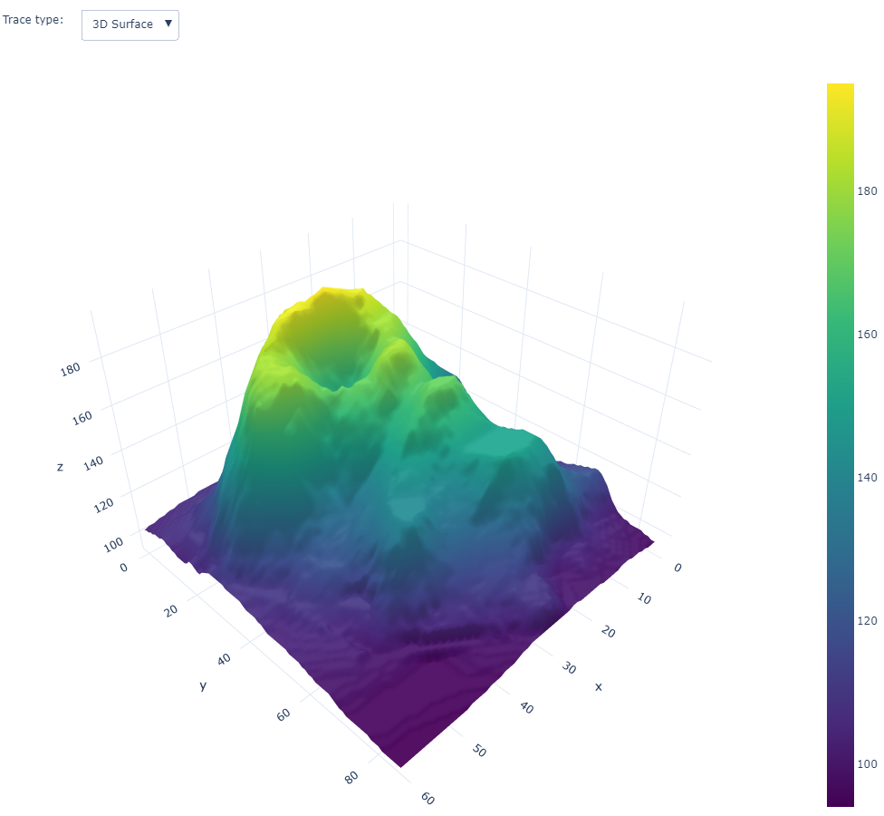

# SolomonIslandsDataMap

<!-- WARNING: THIS FILE WAS AUTOGENERATED! DO NOT EDIT! -->

This file will become your README and also the index of your
documentation.

## Install

``` sh
pip install SolomonIslandsDataMap
```

## How to use

Fill me in please! Don’t forget code examples:

``` python
from urllib.request import urlopen
import json
with urlopen('https://raw.githubusercontent.com/plotly/datasets/master/geojson-counties-fips.json') as response:
    counties = json.load(response)

import pandas as pd
df = pd.read_csv("https://raw.githubusercontent.com/plotly/datasets/master/fips-unemp-16.csv",
                   dtype={"fips": str})

import plotly.express as px

fig = px.choropleth_mapbox(df, geojson=counties, locations='fips', color='unemp',
                           color_continuous_scale="Viridis",
                           range_color=(0, 12),
                           mapbox_style="carto-positron",
                           zoom=3, center = {"lat": 37.0902, "lon": -95.7129},
                           opacity=0.5,
                           labels={'unemp':'unemployment rate'}
                          )
fig.update_layout(margin={"r":0,"t":0,"l":0,"b":0})
fig.show()
```


``` python
df
```

<div>
<style scoped>
    .dataframe tbody tr th:only-of-type {
        vertical-align: middle;
    }
&#10;    .dataframe tbody tr th {
        vertical-align: top;
    }
&#10;    .dataframe thead th {
        text-align: right;
    }
</style>

|      | fips  | unemp |
|------|-------|-------|
| 0    | 01001 | 5.3   |
| 1    | 01003 | 5.4   |
| 2    | 01005 | 8.6   |
| 3    | 01007 | 6.6   |
| 4    | 01009 | 5.5   |
| ...  | ...   | ...   |
| 3214 | 72145 | 13.9  |
| 3215 | 72147 | 10.6  |
| 3216 | 72149 | 20.2  |
| 3217 | 72151 | 16.9  |
| 3218 | 72153 | 18.8  |

<p>3219 rows × 2 columns</p>
</div>

``` python
counties
```

    {'type': 'FeatureCollection',
     'features': [{'type': 'Feature',
       'properties': {'GEO_ID': '0500000US01001',
        'STATE': '01',
        'COUNTY': '001',
        'NAME': 'Autauga',
        'LSAD': 'County',
        'CENSUSAREA': 594.436},
       'geometry': {'type': 'Polygon',
        'coordinates': [[[-86.496774, 32.344437],
          [-86.717897, 32.402814],
          [-86.814912, 32.340803],
          [-86.890581, 32.502974],
          [-86.917595, 32.664169],
          [-86.71339, 32.661732],
          [-86.714219, 32.705694],
          [-86.413116, 32.707386],
          [-86.411172, 32.409937],
          [-86.496774, 32.344437]]]},
       'id': '01001'},
      {'type': 'Feature',
       'properties': {'GEO_ID': '0500000US01009',
        'STATE': '01',
        'COUNTY': '009',
        'NAME': 'Blount',
        'LSAD': 'County',
        'CENSUSAREA': 644.776},
       'geometry': {'type': 'Polygon',
        'coordinates': [[[-86.577799, 33.765316],
          [-86.759144, 33.840617],
          [-86.953664, 33.815297],
          [-86.954305, 33.844862],
          [-86.96296, 33.844865],
          [-86.963358, 33.858221],
          [-86.924387, 33.909222],
          [-86.793914, 33.952059],
          [-86.685365, 34.05914],
          [-86.692061, 34.092654],
          [-86.599632, 34.119914],
          [-86.514881, 34.25437],
          [-86.45302, 34.259317],
          [-86.303516, 34.099073],
          [-86.332723, 33.986109],
          [-86.370152, 33.93977],
          [-86.325622, 33.940147],
          [-86.377532, 33.861706],
          [-86.577528, 33.801977],
          [-86.577799, 33.765316]]]},
       'id': '01009'},
      {'type': 'Feature',
       'properties': {'GEO_ID': '0500000US01017',
        'STATE': '01',
        'COUNTY': '017',
        'NAME': 'Chambers',
        'LSAD': 'County',
        'CENSUSAREA': 596.531},
       'geometry': {'type': 'Polygon',
        'coordinates': [[[-85.184131, 32.870525],
          [-85.123421, 32.772248],
          [-85.13204, 32.764211],
          [-85.136776, 32.746512],
          [-85.285043, 32.730731],
          [-85.593151, 32.72853],
          [-85.593177, 33.10734],
          [-85.232378, 33.108077],
          [-85.223261, 33.06258],
          [-85.221868, 33.055538],
          [-85.184131, 32.870525]]]},
       'id': '01017'},
      {'type': 'Feature',
       'properties': {'GEO_ID': '0500000US01021',
        'STATE': '01',
        'COUNTY': '021',
        'NAME': 'Chilton',
        'LSAD': 'County',
        'CENSUSAREA': 692.854},
       'geometry': {'type': 'Polygon',
        'coordinates': [[[-86.517344, 33.020566],
          [-86.515959, 32.929361],
          [-86.457015, 32.813899],
          [-86.374974, 32.75358],
          [-86.413335, 32.750591],
          [-86.413116, 32.707386],
          [-86.714219, 32.705694],
          [-86.71339, 32.661732],
          [-86.917595, 32.664169],
          [-87.01766, 32.663269],
          [-87.017762, 32.729532],
          [-87.019157, 32.837034],
          [-86.876118, 32.836264],
          [-86.881182, 33.049901],
          [-86.881638, 33.071861],
          [-86.610003, 33.070003],
          [-86.517344, 33.020566]]]},
       'id': '01021'},
      {'type': 'Feature',
       'properties': {'GEO_ID': '0500000US01033',
        'STATE': '01',
        'COUNTY': '033',
        'NAME': 'Colbert',
        'LSAD': 'County',
        'CENSUSAREA': 592.619},
       'geometry': {'type': 'Polygon',
        'coordinates': [[[-88.139988, 34.581703],
          [-88.139246, 34.587795],
          [-88.138719, 34.589215],
          [-88.118407, 34.724292],
          [-88.097888, 34.892202],
          [-87.973222, 34.88255],
          [-87.835833, 34.741239],
          [-87.524363, 34.832384],
          [-87.42651, 34.800022],
          [-87.416484, 34.767544],
          [-87.529667, 34.567081],
          [-88.139988, 34.581703]]]},
       'id': '01033'},
      {'type': 'Feature',
       'properties': {'GEO_ID': '0500000US01045',
        'STATE': '01',
        'COUNTY': '045',
        'NAME': 'Dale',
        'LSAD': 'County',
        'CENSUSAREA': 561.15},
       'geometry': {'type': 'Polygon',
        'coordinates': [[[-85.416437, 31.619466],
          [-85.417434, 31.314973],
          [-85.485854, 31.246096],
          [-85.659985, 31.270889],
          [-85.710866, 31.195179],
          [-85.791402, 31.196349],
          [-85.789142, 31.617964],
          [-85.749941, 31.617914],
          [-85.748251, 31.618048],
          [-85.416437, 31.619466]]]},
       'id': '01045'},
      {'type': 'Feature',
       'properties': {'GEO_ID': '0500000US01051',
        'STATE': '01',
        'COUNTY': '051',
        'NAME': 'Elmore',
        'LSAD': 'County',
        'CENSUSAREA': 618.485},
       'geometry': {'type': 'Polygon',
        'coordinates': [[[-86.336776, 32.767469],
          [-86.31948, 32.753698],
          [-86.007187, 32.754984],
          [-85.87986, 32.754528],
          [-85.886148, 32.493053],
          [-85.89442, 32.447578],
          [-86.023012, 32.419978],
          [-86.192284, 32.43613],
          [-86.237068, 32.49498],
          [-86.411172, 32.409937],
          [-86.413116, 32.707386],
          [-86.413335, 32.750591],
          [-86.374974, 32.75358],
          [-86.336768, 32.753783],
          [-86.336776, 32.767469]]]},
       'id': '01051'},
      {'type': 'Feature',
       'properties': {'GEO_ID': '0500000US01065',
        'STATE': '01',
        'COUNTY': '065',
        'NAME': 'Hale',
        'LSAD': 'County',
        'CENSUSAREA': 643.943},
       'geometry': {'type': 'Polygon',
        'coordinates': [[[-87.4212, 32.874508],
          [-87.472174, 32.83062],
          [-87.473915, 32.655867],
          [-87.525198, 32.655713],
          [-87.524485, 32.482028],
          [-87.728744, 32.480918],
          [-87.812559, 32.52456],
          [-87.736786, 32.58919],
          [-87.813401, 32.633875],
          [-87.796043, 32.715632],
          [-87.828542, 32.768903],
          [-87.870464, 32.762442],
          [-87.715709, 33.006824],
          [-87.421936, 33.003379],
          [-87.420132, 32.902605],
          [-87.4212, 32.874508]]]},
       'id': '01065'},
      {'type': 'Feature',
       'properties': {'GEO_ID': '0500000US01079',
        'STATE': '01',
        'COUNTY': '079',
        'NAME': 'Lawrence',
        'LSAD': 'County',
        'CENSUSAREA': 690.678},
       'geometry': {'type': 'Polygon',
        'coordinates': [[[-87.105073, 34.686037],
          [-87.105913, 34.587643],
          [-87.110111, 34.313799],
          [-87.109911, 34.299299],
          [-87.529722, 34.304598],
          [-87.529667, 34.567081],
          [-87.416484, 34.767544],
          [-87.42651, 34.800022],
          [-87.260676, 34.758626],
          [-87.105073, 34.686037]]]},
       'id': '01079'},
      {'type': 'Feature',
       'properties': {'GEO_ID': '0500000US01083',
        'STATE': '01',
        'COUNTY': '083',
        'NAME': 'Limestone',
        'LSAD': 'County',
        'CENSUSAREA': 559.936},
       'geometry': {'type': 'Polygon',
        'coordinates': [[[-86.836306, 34.991764],
          [-86.820657, 34.991764],
          [-86.783648, 34.991925],
          [-86.783628, 34.991925],
          [-86.790056, 34.55079],
          [-86.942899, 34.598053],
          [-87.105073, 34.686037],
          [-87.260676, 34.758626],
          [-87.214914, 34.816011],
          [-87.210759, 34.999024],
          [-87.011174, 34.995162],
          [-87.000007, 34.995121],
          [-86.974412, 34.994513],
          [-86.972613, 34.99461],
          [-86.970236, 34.994546],
          [-86.96712, 34.9944],
          [-86.862147, 34.991956],
          [-86.849794, 34.991924],
          [-86.846466, 34.99186],
          [-86.83637, 34.991764],
          [-86.836306, 34.991764]]]},
       'id': '01083'},
      {'type': 'Feature',
       'properties': {'GEO_ID': '0500000US01099',
        'STATE': '01',
        'COUNTY': '099',
        'NAME': 'Monroe',
        'LSAD': 'County',
        'CENSUSAREA': 1025.675},
       'geometry': {'type': 'Polygon',
        'coordinates': [[[-86.905899, 31.753035],
          [-87.052284, 31.716761],
          [-87.135051, 31.642417],
          [-87.166581, 31.519561],
          [-87.427455, 31.260386],
          [-87.61589, 31.244458],
          [-87.765152, 31.297346],
          [-87.784796, 31.324672],
          [-87.665572, 31.423166],
          [-87.603137, 31.409556],
          [-87.565413, 31.553573],
          [-87.566841, 31.697115],
          [-87.516131, 31.697824],
          [-87.50093, 31.829251],
          [-86.906899, 31.830628],
          [-86.905899, 31.753035]]]},
       'id': '01099'},
      {'type': 'Feature',
       'properties': {'GEO_ID': '0500000US01107',
        'STATE': '01',
        'COUNTY': '107',
        'NAME': 'Pickens',
        'LSAD': 'County',
        'CENSUSAREA': 881.408},
       'geometry': {'type': 'Polygon',
        'coordinates': [[[-88.291127, 33.399061],
          [-88.277421, 33.512436],
          [-88.276805, 33.516463],
          [-88.274619, 33.534008],
          [-87.946519, 33.524065],
          [-87.85856, 33.525326],
          [-87.840683, 33.524839],
          [-87.837521, 33.153637],
          [-88.026971, 33.063602],
          [-88.171852, 32.99586],
          [-88.340432, 32.991199],
          [-88.304514, 33.28832],
          [-88.291127, 33.399061]]]},
       'id': '01107'},
      {'type': 'Feature',
       'properties': {'GEO_ID': '0500000US01121',
        'STATE': '01',
        'COUNTY': '121',
        'NAME': 'Talladega',
        'LSAD': 'County',
        'CENSUSAREA': 736.775},
       'geometry': {'type': 'Polygon',
        'coordinates': [[[-86.17437, 33.104394],
          [-86.226271, 33.104115],
          [-86.491029, 33.102944],
          [-86.503127, 33.179144],
          [-86.35734, 33.296917],
          [-86.378665, 33.390983],
          [-86.281999, 33.509895],
          [-86.235328, 33.494532],
          [-86.145562, 33.679098],
          [-86.050669, 33.67459],
          [-85.994935, 33.586475],
          [-85.794559, 33.585565],
          [-85.796054, 33.55622],
          [-85.796852, 33.541849],
          [-85.85189, 33.498742],
          [-85.904909, 33.498655],
          [-85.923762, 33.396206],
          [-85.976525, 33.38187],
          [-85.980293, 33.29419],
          [-86.118198, 33.29632],
          [-86.120567, 33.194511],
          [-86.17283, 33.195681],
          [-86.17437, 33.104394]]]},
       'id': '01121'},
      {'type': 'Feature',
       'properties': {'GEO_ID': '0500000US02050',
        'STATE': '02',
        'COUNTY': '050',
        'NAME': 'Bethel',
        'LSAD': 'CA',
        'CENSUSAREA': 40570.004},
       'geometry': {'type': 'MultiPolygon',
        'coordinates': [[[[-173.116905, 60.516005],
           [-173.098092, 60.533367],
           [-173.098094, 60.573993],
           [-173.041847, 60.611497],
           [-172.999659, 60.611498],
           [-172.97153, 60.605249],
           [-172.915274, 60.527122],
           [-172.915273, 60.514621],
           [-172.895349, 60.49975],
           [-172.715261, 60.429864],
           [-172.706472, 60.425179],
           [-172.480536, 60.400184],
           [-172.352622, 60.381435],
           [-172.341399, 60.373145],
           [-172.333051, 60.364359],
           [-172.269754, 60.333887],
           [-172.254821, 60.334082],
           [-172.254821, 60.326466],
           [-172.291289, 60.321193],
           [-172.435476, 60.332653],
           [-172.491531, 60.334874],
           [-172.505544, 60.330428],
           [-172.519558, 60.323758],
           [-172.547585, 60.317088],
           [-172.589625, 60.314863],
           [-172.612982, 60.319309],
           [-172.622325, 60.330424],
           [-172.757794, 60.374881],
           [-172.811529, 60.406621],
           [-172.951477, 60.478649],
           [-172.959056, 60.479695],
           [-172.966515, 60.478167],
           [-172.990296, 60.478702],
           [-173.119005, 60.500067],
           [-173.120769, 60.51301],
           [-173.116905, 60.516005]]],
         [[[-165.721389, 60.16962],
           [-165.723168, 60.156603],
           [-165.71912, 60.153521],
           [-165.702411, 60.151285],
           [-165.697273, 60.153592],
           [-165.683507, 60.154221],
           [-165.675374, 60.14936],
           [-165.667863, 60.114676],
           [-165.671567, 60.096877],
           [-165.680612, 60.089962],
           [-165.684585, 60.055237],
           [-165.649318, 59.991837],
           [-165.588873, 59.966005],
           [-165.539367, 59.965175],
           [-165.534482, 59.951276],
           [-165.543456, 59.930376],
           [-165.550405, 59.920007],
           [-165.575815, 59.904672],
           [-165.695981, 59.893513],
           [-165.712875, 59.895364],
           [-165.717549, 59.899137],
           [-165.722458, 59.899813],
           [-165.751851, 59.899947],
           [-165.905471, 59.871937],
           [-166.010201, 59.847061],
           [-166.060952, 59.820508],
           [-166.072465, 59.805462],
           [-166.058096, 59.78711],
           [-166.042089, 59.776212],
           [-166.032277, 59.773729],
           [-166.030813, 59.7706],
           [-166.036947, 59.757859],
           [-166.062854, 59.748586],
           [-166.157071, 59.748886],
           [-166.18092, 59.763728],
           [-166.176669, 59.766495],
           [-166.17482, 59.770681],
           [-166.184234, 59.779432],
           [-166.203293, 59.791676],
           [-166.251528, 59.809807],
           [-166.381986, 59.849087],
           [-166.40729, 59.854604],
           [-166.439746, 59.857816],
           [-166.512223, 59.849939],
           [-166.583297, 59.848705],
           [-166.616849, 59.850711],
           [-166.621473, 59.856438],
           [-166.648076, 59.8711],
           [-166.6782, 59.881248],
           [-166.716563, 59.889011],
           [-166.764183, 59.892061],
           [-166.801634, 59.916321],
           [-166.86653, 59.949544],
           [-166.89233, 59.960507],
           [-166.995748, 59.993495],
           [-167.067602, 59.992295],
           [-167.111785, 59.989349],
           [-167.124867, 59.9917],
           [-167.133258, 59.994695],
           [-167.22021, 60.040133],
           [-167.247627, 60.058862],
           [-167.281357, 60.063892],
           [-167.310664, 60.064874],
           [-167.339109, 60.070159],
           [-167.342702, 60.072395],
           [-167.342885, 60.074979],
           [-167.33405, 60.088609],
           [-167.33386, 60.094065],
           [-167.343303, 60.123181],
           [-167.347866, 60.13114],
           [-167.362783, 60.147556],
           [-167.423053, 60.195072],
           [-167.421489, 60.205431],
           [-167.369927, 60.225496],
           [-167.312616, 60.238454],
           [-167.20194, 60.237822],
           [-167.105975, 60.232895],
           [-167.081935, 60.225765],
           [-167.04582, 60.219088],
           [-166.93797, 60.20587],
           [-166.909802, 60.206513],
           [-166.847438, 60.213592],
           [-166.812484, 60.22778],
           [-166.803469, 60.242802],
           [-166.809546, 60.259658],
           [-166.826169, 60.268644],
           [-166.834966, 60.271406],
           [-166.832877, 60.275449],
           [-166.814979, 60.286283],
           [-166.762522, 60.309837],
           [-166.738323, 60.314301],
           [-166.662112, 60.322993],
           [-166.608896, 60.32125],
           [-166.578305, 60.32185],
           [-166.569828, 60.325955],
           [-166.562081, 60.359022],
           [-166.493543, 60.392389],
           [-166.41457, 60.37187],
           [-166.408546, 60.365899],
           [-166.387184, 60.359671],
           [-166.366596, 60.358227],
           [-166.310655, 60.377611],
           [-166.200019, 60.393404],
           [-166.174906, 60.401003],
           [-166.171187, 60.428854],
           [-166.163203, 60.432641],
           [-166.135704, 60.42451],
           [-166.124379, 60.414253],
           [-166.124231, 60.409953],
           [-166.134927, 60.400129],
           [-166.123805, 60.378116],
           [-166.084791, 60.325288],
           [-166.012169, 60.317691],
           [-165.987336, 60.317833],
           [-165.927956, 60.321592],
           [-165.92464, 60.325249],
           [-165.923572, 60.330503],
           [-165.920794, 60.335398],
           [-165.916828, 60.338002],
           [-165.883458, 60.343902],
           [-165.786573, 60.326821],
           [-165.71451, 60.310496],
           [-165.697326, 60.297238],
           [-165.685751, 60.277564],
           [-165.686143, 60.267811],
           [-165.698339, 60.210676],
           [-165.708863, 60.189125],
           [-165.721389, 60.16962]]],
         [[[-160.534142, 61.947257],
           [-159.265098, 61.945564],
           [-159.26095, 62.032026],
           [-158.531113, 62.031708],
           [-158.532398, 62.118595],
           [-157.51702, 62.123543],
           [-157.074237, 62.129913],
           [-157.073592, 62.029567],
           [-155.107471, 62.029371],
           [-153.735846, 62.02937],
           [-153.740629, 62.121565],
           [-153.395401, 62.124776],
           [-153.39432, 62.209115],
           [-153.070317, 62.208517],
           [-153.067697, 62.295211],
           [-153.001262, 62.295331],
           [-153.001288, 62.106276],
           [-153.002181, 61.425686],
           [-153.469729, 61.428123],
           [-153.475316, 61.136887],
           [-153.430404, 61.13574],
           [-153.436195, 60.908538],
           [-154.422064, 60.906969],
           [-155.9611, 60.907602],
           [-157.168288, 60.912221],
           [-157.169511, 61.00017],
           [-157.522531, 61.000515],
           [-157.521885, 60.911337],
           [-157.700869, 60.911315],
           [-157.697905, 60.823585],
           [-157.880745, 60.824769],
           [-157.883552, 60.903711],
           [-158.944656, 60.903462],
           [-158.948931, 60.823175],
           [-159.014091, 60.823452],
           [-159.01592, 60.731938],
           [-159.182993, 60.731079],
           [-159.185163, 60.644578],
           [-159.367249, 60.644339],
           [-159.369629, 60.47113],
           [-159.432729, 60.471029],
           [-159.437007, 60.387176],
           [-159.613611, 60.3878],
           [-159.613392, 60.214585],
           [-159.78454, 60.213265],
           [-159.78689, 60.128139],
           [-159.850294, 60.128439],
           [-159.855289, 59.963691],
           [-160.015226, 59.958912],
           [-160.019425, 59.786831],
           [-160.248182, 59.784524],
           [-160.250662, 59.611298],
           [-160.42445, 59.611507],
           [-160.424977, 59.43591],
           [-160.481711, 59.436228],
           [-160.480547, 59.352217],
           [-160.650795, 59.349182],
           [-160.650275, 59.26223],
           [-160.820877, 59.261519],
           [-160.819137, 59.084859],
           [-160.875869, 59.084046],
           [-160.874299, 59.003658],
           [-161.034851, 59.003419],
           [-161.03452, 58.843894],
           [-161.094249, 58.821979],
           [-161.18338, 58.789276],
           [-161.337982, 58.742912],
           [-161.345396, 58.73545],
           [-161.372711, 58.707958],
           [-161.372314, 58.666172],
           [-161.521347, 58.633141],
           [-161.550537, 58.61116],
           [-161.62645, 58.602581],
           [-161.682907, 58.564671],
           [-161.751999, 58.551842],
           [-161.766296, 58.599224],
           [-161.871216, 58.637478],
           [-162.066269, 58.6208],
           [-162.171722, 58.648441],
           [-161.994644, 58.688828],
           [-161.939163, 58.655613],
           [-161.877213, 58.666138],
           [-161.859055, 58.708637],
           [-161.769501, 58.774937],
           [-161.756622, 58.826477],
           [-161.783981, 58.969421],
           [-161.828171, 59.062702],
           [-161.981964, 59.150997],
           [-162.048584, 59.254177],
           [-162.018982, 59.292278],
           [-161.942993, 59.263828],
           [-161.956528, 59.361771],
           [-161.904053, 59.387341],
           [-161.837936, 59.423836],
           [-161.828125, 59.428188],
           [-161.790375, 59.468197],
           [-161.738312, 59.46701],
           [-161.70253, 59.490906],
           [-161.75798, 59.557152],
           [-161.854752, 59.646214],
           [-161.911163, 59.741741],
           [-162.017059, 59.829426],
           [-162.092361, 59.881104],
           [-162.100708, 59.944675],
           [-162.10856, 59.953861],
           [-162.121072, 59.965241],
           [-162.143049, 59.967506],
           [-162.171759, 59.984163],
           [-162.190616, 60.00203],
           [-162.207225, 60.021834],
           [-162.228371, 60.056313],
           [-162.234642, 60.077333],
           [-162.234043, 60.091345],
           [-162.231426, 60.095297],
           [-162.220054, 60.101078],
           [-162.202141, 60.11645],
           [-162.186148, 60.149605],
           [-162.188441, 60.156509],
           [-162.216366, 60.17419],
           [-162.239267, 60.1801],
           [-162.252564, 60.178623],
           [-162.258105, 60.172713],
           [-162.257318, 60.163353],
           [-162.258328, 60.157939],
           [-162.287089, 60.122173],
           [-162.29385, 60.11658],
           [-162.30109, 60.112146],
           [-162.316922, 60.10759],
           [-162.321481, 60.10797],
           [-162.360185, 60.14736],
           [-162.371131, 60.169019],
           [-162.37187, 60.173451],
           [-162.371032, 60.178616],
           [-162.40227, 60.186425],
           [-162.426344, 60.185331],
           [-162.445727, 60.176448],
           [-162.447904, 60.17048],
           [-162.463026, 60.15302],
           [-162.476214, 60.145536],
           [-162.484234, 60.137964],
           [-162.492346, 60.121804],
           [-162.494327, 60.110675],
           [-162.481175, 60.087544],
           [-162.476759, 60.04769],
           [-162.503647, 59.99923],
           [-162.530118, 59.99011],
           [-162.585518, 59.97723],
           [-162.622569, 59.971809],
           [-162.644231, 59.972954],
           [-162.682717, 59.979432],
           [-162.738592, 59.976321],
           [-162.740059, 59.968797],
           [-162.748554, 59.962664],
           [-162.760007, 59.958013],
           [-162.828585, 59.939142],
           [-162.90726, 59.923682],
           [-162.974977, 59.906443],
           [-163.033128, 59.884135],
           [-163.109595, 59.861633],
           [-163.172633, 59.845058],
           [-163.349027, 59.81989],
           [-163.38767, 59.81588],
           [-163.559148, 59.801391],
           [-163.662607, 59.79571],
           [-163.704795, 59.794805],
           [-163.772229, 59.795624],
           [-163.930798, 59.803853],
           [-164.079837, 59.828034],
           [-164.115117, 59.836688],
           [-164.133393, 59.845612],
           [-164.160319, 59.864679],
           [-164.201811, 59.916119],
           [-164.208475, 59.934461],
           [-164.209843, 59.942874],
           [-164.208306, 59.949046],
           [-164.198545, 59.955109],
           [-164.178705, 59.96181],
           [-164.161024, 59.964076],
           [-164.12543, 59.964626],
           [-164.11508, 59.973166],
           [-164.13181, 59.991177],
           [-164.1916, 60.024496],
           [-164.302968, 60.054233],
           [-164.336111, 60.055527],
           [-164.385471, 60.07719],
           [-164.461194, 60.137824],
           [-164.498556, 60.170546],
           [-164.493861, 60.177397],
           [-164.494317, 60.184833],
           [-164.505677, 60.194304],
           [-164.517647, 60.199493],
           [-164.541699, 60.205279],
           [-164.558343, 60.207042],
           [-164.59607, 60.222874],
           [-164.619501, 60.234938],
           [-164.634362, 60.24298],
           [-164.646332, 60.253303],
           [-164.651996, 60.262745],
           [-164.653098, 60.267902],
           [-164.698889, 60.296298],
           [-164.72657, 60.291475],
           [-164.777233, 60.293833],
           [-164.850355, 60.303615],
           [-164.899296, 60.316787],
           [-164.962678, 60.33966],
           [-165.005576, 60.359812],
           [-165.057585, 60.386287],
           [-165.129403, 60.433707],
           [-165.132893, 60.438867],
           [-165.124792, 60.449191],
           [-165.120728, 60.451196],
           [-165.069693, 60.460893],
           [-165.04907, 60.461516],
           [-165.015155, 60.471414],
           [-164.99787, 60.480459],
           [-164.961439, 60.508391],
           [-164.956788, 60.527837],
           [-164.960843, 60.533845],
           [-164.965488, 60.536701],
           [-164.97128, 60.539558],
           [-164.986952, 60.542406],
           [-165.05744, 60.544631],
           [-165.190449, 60.498001],
           [-165.244442, 60.496298],
           [-165.362975, 60.506866],
           [-165.377559, 60.513164],
           [-165.405071, 60.53465],
           [-165.420349, 60.550692],
           [-165.419788, 60.552418],
           [-165.415193, 60.55816],
           [-165.381052, 60.577987],
           [-165.367676, 60.581158],
           [-165.346721, 60.580603],
           [-165.312937, 60.576313],
           [-165.289651, 60.575755],
           [-165.268717, 60.579488],
           [-165.178617, 60.623927],
           [-165.170458, 60.629091],
           [-165.147184, 60.65116],
           [-165.063148, 60.688645],
           [-165.052642, 60.690068],
           [-165.0433, 60.687468],
           [-165.027535, 60.686008],
           [-164.991665, 60.69884],
           [-164.97125, 60.711434],
           [-164.966591, 60.717438],
           [-164.96541, 60.724306],
           [-164.971839, 60.72973],
           [-165.010452, 60.744789],
           [-165.023904, 60.753128],
           [-165.032074, 60.760022],
           [-165.040843, 60.77266],
           [-165.042584, 60.78443],
           [-165.037889, 60.78901],
           [-165.032615, 60.786704],
           [-165.020309, 60.785539],
           [-164.977663, 60.79036],
           [-164.944914, 60.800379],
           [-164.92418, 60.809331],
           [-164.939313, 60.823463],
           [-165.009703, 60.81506],
           [-165.02143, 60.815086],
           [-165.02962, 60.826001],
           [-165.030183, 60.83805],
           [-165.003679, 60.87558],
           [-164.945958, 60.92106],
           [-164.939496, 60.924774],
           [-164.925994, 60.925063],
           [-164.917542, 60.928144],
           [-164.903903, 60.942213],
           [-164.921256, 60.946509],
           [-164.940065, 60.945369],
           [-165.007096, 60.922058],
           [-165.03204, 60.903986],
           [-165.016941, 60.891071],
           [-165.080907, 60.860224],
           [-165.132488, 60.850145],
           [-165.176774, 60.847149],
           [-165.177531, 60.858865],
           [-165.22348, 60.89645],
           [-165.216942, 60.914322],
           [-165.157111, 60.917363],
           [-164.797619, 60.982487],
           [-164.616585, 60.979049],
           [-164.529911, 60.940796],
           [-164.234986, 60.988241],
           [-164.154702, 61.022625],
           [-164.211781, 61.082262],
           [-164.201874, 61.151613],
           [-164.121482, 61.127],
           [-163.94742, 61.205621],
           [-163.99276, 61.371763],
           [-163.541623, 61.349559],
           [-163.531412, 61.401454],
           [-163.431258, 61.484107],
           [-163.171354, 61.449071],
           [-163.061999, 61.479931],
           [-162.847199, 61.498736],
           [-162.75398, 61.542666],
           [-162.505761, 61.556426],
           [-162.476189, 61.503959],
           [-162.328294, 61.518376],
           [-162.013438, 61.477057],
           [-161.885286, 61.48281],
           [-161.697058, 61.530087],
           [-161.449611, 61.568838],
           [-161.126812, 61.59954],
           [-160.953961, 61.685669],
           [-160.775244, 61.738527],
           [-160.597733, 61.760156],
           [-160.35014, 61.819071],
           [-160.18666, 61.831693],
           [-160.469477, 61.869348],
           [-160.534142, 61.947257]]]]},
       'id': '02050'},
      {'type': 'Feature',
       'properties': {'GEO_ID': '0500000US02105',
        'STATE': '02',
        'COUNTY': '105',
        'NAME': 'Hoonah-Angoon',
        'LSAD': 'CA',
        'CENSUSAREA': 7524.915},
       'geometry': {'type': 'MultiPolygon',
        'coordinates': [[[[-134.713987, 58.220748],
           [-134.77272, 58.164862],
           [-134.76194, 58.07809],
           [-134.672702, 58.027243],
           [-134.553923, 58.053616],
           [-134.531804, 58.096726],
           [-134.177467, 58.15964],
           [-134.166332, 58.132558],
           [-134.167257, 58.128577],
           [-134.174352, 58.125284],
           [-134.192724, 58.107685],
           [-134.18937, 58.083444],
           [-134.183983, 58.077295],
           [-134.169743, 58.066845],
           [-134.138231, 58.047103],
           [-134.098652, 58.018748],
           [-134.091885, 58.010777],
           [-134.087461, 58.001685],
           [-134.087572, 57.996475],
           [-134.101549, 57.988716],
           [-134.101125, 57.98407],
           [-134.089575, 57.974357],
           [-134.068949, 57.961083],
           [-134.016873, 57.930006],
           [-133.999948, 57.91481],
           [-133.99634, 57.904167],
           [-133.995977, 57.895632],
           [-133.963791, 57.854628],
           [-133.934735, 57.837626],
           [-133.904874, 57.807406],
           [-133.902695, 57.797797],
           [-133.903854, 57.794818],
           [-133.908085, 57.79167],
           [-133.90989, 57.780628],
           [-133.896846, 57.685524],
           [-133.868134, 57.660137],
           [-133.837424, 57.638486],
           [-133.832895, 57.635733],
           [-133.821673, 57.633887],
           [-133.817662, 57.629764],
           [-133.808285, 57.609604],
           [-133.806003, 57.583457],
           [-133.807133, 57.57877],
           [-133.81164, 57.572365],
           [-133.8176, 57.568353],
           [-133.840838, 57.576865],
           [-133.859635, 57.605325],
           [-133.85801, 57.61694],
           [-133.863112, 57.623701],
           [-133.911329, 57.663562],
           [-133.962582, 57.689887],
           [-133.970087, 57.695342],
           [-133.994964, 57.719821],
           [-134.010728, 57.759392],
           [-134.013144, 57.789393],
           [-134.03082, 57.818646],
           [-134.061833, 57.829808],
           [-134.098628, 57.85055],
           [-134.121337, 57.871236],
           [-134.11921, 57.872917],
           [-134.121904, 57.88252],
           [-134.126105, 57.89026],
           [-134.132146, 57.896189],
           [-134.151127, 57.903209],
           [-134.176606, 57.909725],
           [-134.202353, 57.90633],
           [-134.206874, 57.895901],
           [-134.16312, 57.848669],
           [-134.112948, 57.809263],
           [-134.105408, 57.795974],
           [-134.099782, 57.780261],
           [-134.100899, 57.776779],
           [-134.146342, 57.760258],
           [-134.1277, 57.739216],
           [-134.116097, 57.727582],
           [-134.020169, 57.656734],
           [-134.013367, 57.655898],
           [-133.993974, 57.649095],
           [-133.958454, 57.629537],
           [-133.935976, 57.614414],
           [-133.934361, 57.601765],
           [-133.945156, 57.569841],
           [-133.943417, 57.561555],
           [-133.933216, 57.54445],
           [-133.920557, 57.530088],
           [-133.901074, 57.517219],
           [-133.886269, 57.504999],
           [-133.857368, 57.463964],
           [-133.927539, 57.46957],
           [-133.925527, 57.45665],
           [-133.870327, 57.381298],
           [-133.866931, 57.367869],
           [-133.867279, 57.36206],
           [-133.870657, 57.358287],
           [-133.962897, 57.305425],
           [-133.968495, 57.303937],
           [-133.983501, 57.302838],
           [-134.008394, 57.317522],
           [-134.034563, 57.327638],
           [-134.055618, 57.330194],
           [-134.094891, 57.326401],
           [-134.100587, 57.321738],
           [-134.084374, 57.303963],
           [-134.080495, 57.297678],
           [-134.110315, 57.249948],
           [-134.15539, 57.208003],
           [-134.193629, 57.184879],
           [-134.29276, 57.137049],
           [-134.302721, 57.136562],
           [-134.349602, 57.124638],
           [-134.378359, 57.115016],
           [-134.370797, 57.099924],
           [-134.386052, 57.087392],
           [-134.481167, 57.046006],
           [-134.484288, 57.036481],
           [-134.497718, 57.031194],
           [-134.565687, 57.023737],
           [-134.601407, 57.033812],
           [-134.634565, 57.109863],
           [-134.646773, 57.226327],
           [-134.640169, 57.239852],
           [-134.605032, 57.273],
           [-134.570954, 57.294624],
           [-134.517279, 57.314567],
           [-134.543385, 57.337414],
           [-134.559794, 57.336138],
           [-134.574114, 57.341172],
           [-134.575492, 57.343694],
           [-134.578511, 57.400291],
           [-134.55554, 57.407428],
           [-134.527594, 57.405331],
           [-134.525997, 57.397845],
           [-134.527759, 57.39394],
           [-134.527873, 57.389874],
           [-134.486023, 57.372492],
           [-134.47724, 57.374401],
           [-134.464032, 57.392184],
           [-134.544853, 57.457872],
           [-134.607557, 57.513042],
           [-134.598452, 57.522395],
           [-134.595981, 57.534107],
           [-134.611177, 57.563137],
           [-134.665337, 57.605701],
           [-134.674438, 57.614409],
           [-134.695428, 57.685335],
           [-134.700518, 57.695966],
           [-134.704859, 57.701457],
           [-134.720351, 57.707052],
           [-134.731798, 57.721921],
           [-134.728792, 57.75664],
           [-134.709024, 57.780498],
           [-134.705869, 57.828929],
           [-134.727077, 57.877098],
           [-134.737475, 57.89079],
           [-134.746108, 57.898529],
           [-134.758833, 57.980212],
           [-134.76529, 57.993762],
           [-134.777022, 58.004679],
           [-134.796804, 58.058855],
           [-134.783772, 58.082292],
           [-134.784927, 58.096793],
           [-134.820663, 58.141465],
           [-134.857221, 58.176288],
           [-134.864299, 58.180489],
           [-134.877918, 58.181535],
           [-134.885857, 58.184031],
           [-134.899665, 58.19432],
           [-134.914857, 58.214932],
           [-134.948327, 58.281316],
           [-134.969189, 58.367542],
           [-134.960502, 58.403758],
           [-134.955902, 58.410297],
           [-134.897292, 58.37689],
           [-134.806116, 58.321284],
           [-134.803831, 58.316567],
           [-134.802388, 58.30107],
           [-134.779354, 58.281279],
           [-134.760052, 58.275251],
           [-134.729861, 58.273512],
           [-134.724463, 58.268277],
           [-134.713987, 58.220748]]],
         [[[-132.367984, 57.348685],
           [-132.487307, 57.354227],
           [-132.64459, 57.426343],
           [-132.986359, 57.330823],
           [-133.029298, 57.235539],
           [-133.126997, 57.186322],
           [-133.299692, 57.237727],
           [-133.517194, 57.177775],
           [-133.517197, 57.177776],
           [-133.544817, 57.24257],
           [-133.542565, 57.250682],
           [-133.522837, 57.27858],
           [-133.489738, 57.305192],
           [-133.47589, 57.307982],
           [-133.455936, 57.30397],
           [-133.444958, 57.297729],
           [-133.442436, 57.289978],
           [-133.425948, 57.285995],
           [-133.371591, 57.286713],
           [-133.307565, 57.290052],
           [-133.287052, 57.30292],
           [-133.274829, 57.330625],
           [-133.28351, 57.333119],
           [-133.34207, 57.336798],
           [-133.35472, 57.333253],
           [-133.403868, 57.342685],
           [-133.442682, 57.352845],
           [-133.453783, 57.35624],
           [-133.468267, 57.364217],
           [-133.472039, 57.368651],
           [-133.475998, 57.380394],
           [-133.472454, 57.388446],
           [-133.461179, 57.394577],
           [-133.503115, 57.453528],
           [-133.52514, 57.490344],
           [-133.52583, 57.501777],
           [-133.516749, 57.543911],
           [-133.510806, 57.548139],
           [-133.496365, 57.548772],
           [-133.488197, 57.551387],
           [-133.478086, 57.56173],
           [-133.481221, 57.57147],
           [-133.505982, 57.578459],
           [-133.528313, 57.573944],
           [-133.531905, 57.569466],
           [-133.53786, 57.567292],
           [-133.565478, 57.563095],
           [-133.578948, 57.565094],
           [-133.62076, 57.578919],
           [-133.66439, 57.611707],
           [-133.676449, 57.625192],
           [-133.680963, 57.648265],
           [-133.65855, 57.707924],
           [-133.65453, 57.713689],
           [-133.582212, 57.715095],
           [-133.543928, 57.696454],
           [-133.530957, 57.686914],
           [-133.522243, 57.683663],
           [-133.489677, 57.677141],
           [-133.441215, 57.672013],
           [-133.40498, 57.663783],
           [-133.234598, 57.608749],
           [-133.188864, 57.589071],
           [-133.179062, 57.587147],
           [-133.162464, 57.599796],
           [-133.174032, 57.610062],
           [-133.251126, 57.649966],
           [-133.278209, 57.661859],
           [-133.291062, 57.665358],
           [-133.322532, 57.66583],
           [-133.485403, 57.738677],
           [-133.545031, 57.76797],
           [-133.559889, 57.777457],
           [-133.556097, 57.78883],
           [-133.569787, 57.859365],
           [-133.602032, 57.860394],
           [-133.56921, 57.88535],
           [-133.176444, 58.150151],
           [-133.076421, 57.999762],
           [-132.869318, 57.842941],
           [-132.756813, 57.705093],
           [-132.658124, 57.619486],
           [-132.559178, 57.503927],
           [-132.367984, 57.348685]]],
         [[[-135.587961, 57.89732],
           [-135.899839, 58.001387],
           [-135.906742, 58.001266],
           [-136.026713, 57.835869],
           [-136.370705, 57.831668],
           [-136.372377, 57.832587],
           [-136.391157, 57.832653],
           [-136.458829, 57.853901],
           [-136.474424, 57.871648],
           [-136.484259, 57.89646],
           [-136.534201, 57.913938],
           [-136.557651, 57.912135],
           [-136.572045, 57.918469],
           [-136.573288, 57.926844],
           [-136.563223, 58.035052],
           [-136.559999, 58.063358],
           [-136.556247, 58.077019],
           [-136.538708, 58.093482],
           [-136.500119, 58.104787],
           [-136.475811, 58.101294],
           [-136.469272, 58.096868],
           [-136.420449, 58.131857],
           [-136.375338, 58.208714],
           [-136.387114, 58.252414],
           [-136.377329, 58.268328],
           [-136.311596, 58.270388],
           [-136.287765, 58.267373],
           [-136.286263, 58.259741],
           [-136.289842, 58.249086],
           [-136.283886, 58.223685],
           [-136.277477, 58.208856],
           [-136.235246, 58.154416],
           [-136.190155, 58.161301],
           [-136.190382, 58.164473],
           [-136.194557, 58.171811],
           [-136.199498, 58.172086],
           [-136.203642, 58.174416],
           [-136.199854, 58.180871],
           [-136.162108, 58.218724],
           [-136.139007, 58.224393],
           [-136.03616, 58.21921],
           [-136.03303, 58.205462],
           [-135.976386, 58.202029],
           [-135.966119, 58.211386],
           [-135.914178, 58.244073],
           [-135.823562, 58.282975],
           [-135.801133, 58.287716],
           [-135.78338, 58.286709],
           [-135.764372, 58.266276],
           [-135.7351, 58.240213],
           [-135.712398, 58.231892],
           [-135.630521, 58.222933],
           [-135.589198, 58.213677],
           [-135.522646, 58.185909],
           [-135.504671, 58.174914],
           [-135.497911, 58.168882],
           [-135.524668, 58.12075],
           [-135.540712, 58.10175],
           [-135.58682, 58.08167],
           [-135.651368, 58.036484],
           [-135.63849, 57.994508],
           [-135.621582, 57.984623],
           [-135.593287, 57.989636],
           [-135.581753, 57.997568],
           [-135.564307, 58.015007],
           [-135.567817, 58.02342],
           [-135.565443, 58.04112],
           [-135.563434, 58.043491],
           [-135.544529, 58.06088],
           [-135.496739, 58.086212],
           [-135.451444, 58.134348],
           [-135.420107, 58.144202],
           [-135.411777, 58.145473],
           [-135.397518, 58.144155],
           [-135.275797, 58.097024],
           [-135.260951, 58.097323],
           [-135.108896, 58.08827],
           [-135.084832, 58.080869],
           [-135.082981, 58.074737],
           [-135.0707, 58.061242],
           [-134.977183, 58.049943],
           [-134.967723, 58.047625],
           [-134.950844, 58.036993],
           [-134.935005, 58.021639],
           [-134.912854, 57.979287],
           [-134.921104, 57.935298],
           [-134.926395, 57.921919],
           [-135.004952, 57.884338],
           [-135.140674, 57.926114],
           [-135.173712, 57.919399],
           [-135.16522, 57.901524],
           [-135.146717, 57.891656],
           [-135.131957, 57.885241],
           [-135.06572, 57.869451],
           [-134.991819, 57.835436],
           [-134.954547, 57.815785],
           [-134.949436, 57.805027],
           [-135.02337, 57.780537],
           [-135.19896, 57.775092],
           [-135.225158, 57.777783],
           [-135.313776, 57.805739],
           [-135.343991, 57.821444],
           [-135.389894, 57.850991],
           [-135.418517, 57.860506],
           [-135.514151, 57.885371],
           [-135.552802, 57.902711],
           [-135.581326, 57.903056],
           [-135.587961, 57.89732]]],
         [[[-135.447381, 58.399891],
           [-135.461296, 58.399884],
           [-135.466083, 58.394328],
           [-135.512402, 58.385759],
           [-135.521358, 58.391449],
           [-135.556066, 58.40774],
           [-135.622105, 58.428186],
           [-135.630425, 58.42858],
           [-135.728054, 58.397067],
           [-135.826079, 58.390246],
           [-135.90731, 58.380839],
           [-135.917917, 58.381237],
           [-135.921134, 58.385772],
           [-135.920299, 58.389084],
           [-135.897255, 58.416132],
           [-135.897169, 58.450001],
           [-135.916112, 58.463858],
           [-135.923268, 58.462919],
           [-135.934547, 58.451953],
           [-135.939926, 58.4516],
           [-135.987564, 58.46442],
           [-135.997418, 58.470375],
           [-135.99953, 58.480281],
           [-135.990948, 58.487315],
           [-135.968087, 58.494669],
           [-135.955625, 58.492765],
           [-135.945121, 58.494836],
           [-135.906941, 58.50581],
           [-135.893152, 58.513929],
           [-135.895088, 58.534077],
           [-135.914003, 58.540583],
           [-135.928572, 58.572925],
           [-135.912187, 58.6188],
           [-136.012226, 58.712247],
           [-136.015761, 58.7226],
           [-136.008929, 58.73191],
           [-136.011669, 58.743276],
           [-136.046172, 58.781796],
           [-136.082937, 58.808383],
           [-136.089603, 58.815729],
           [-136.077276, 58.824983],
           [-136.045279, 58.836074],
           [-136.050351, 58.913433],
           [-136.060728, 58.92758],
           [-136.120307, 58.968418],
           [-136.145306, 58.976705],
           [-136.162725, 58.977261],
           [-136.163648, 58.973204],
           [-136.160293, 58.961999],
           [-136.1503, 58.947111],
           [-136.124491, 58.924542],
           [-136.106997, 58.864441],
           [-136.150772, 58.757266],
           [-136.161943, 58.752171],
           [-136.21366, 58.751153],
           [-136.247343, 58.752935],
           [-136.397322, 58.813019],
           [-136.431055, 58.818416],
           [-136.474735, 58.830788],
           [-136.493716, 58.838963],
           [-136.528161, 58.928484],
           [-136.52652, 58.954523],
           [-136.544899, 58.967314],
           [-136.559836, 58.963414],
           [-136.572163, 58.957292],
           [-136.575516, 58.9466],
           [-136.575541, 58.928941],
           [-136.586289, 58.909364],
           [-136.630497, 58.890256],
           [-136.670412, 58.893224],
           [-136.676898, 58.894973],
           [-136.6946, 58.904081],
           [-136.704848, 58.914395],
           [-136.724994, 58.923514],
           [-136.750422, 58.930439],
           [-136.782908, 58.936659],
           [-136.78871, 58.936318],
           [-136.802832, 58.923118],
           [-136.840986, 58.919742],
           [-136.860014, 58.931997],
           [-136.857823, 58.942868],
           [-136.877826, 58.962392],
           [-136.91853, 58.947217],
           [-136.915995, 58.938384],
           [-136.932352, 58.916252],
           [-136.934841, 58.916345],
           [-136.933458, 58.908558],
           [-136.928643, 58.900131],
           [-136.868184, 58.885243],
           [-136.76793, 58.870608],
           [-136.744507, 58.876626],
           [-136.676388, 58.856348],
           [-136.612807, 58.846227],
           [-136.58343, 58.838826],
           [-136.538029, 58.819777],
           [-136.463258, 58.781607],
           [-136.356786, 58.692581],
           [-136.354222, 58.684304],
           [-136.372775, 58.66741],
           [-136.396076, 58.654421],
           [-136.409876, 58.64925],
           [-136.422309, 58.647412],
           [-136.449827, 58.637816],
           [-136.482395, 58.616739],
           [-136.459436, 58.60788],
           [-136.383327, 58.629987],
           [-136.342827, 58.64503],
           [-136.331366, 58.663545],
           [-136.317193, 58.671231],
           [-136.246368, 58.663185],
           [-136.232481, 58.677144],
           [-136.223308, 58.675028],
           [-136.213659, 58.665054],
           [-136.194207, 58.581731],
           [-136.181596, 58.535019],
           [-136.170498, 58.527323],
           [-136.100303, 58.500673],
           [-136.103925, 58.478001],
           [-136.083551, 58.447115],
           [-136.062165, 58.435795],
           [-136.053028, 58.417375],
           [-136.041818, 58.380161],
           [-136.092646, 58.34899],
           [-136.11193, 58.34253],
           [-136.265906, 58.314499],
           [-136.276769, 58.313894],
           [-136.288255, 58.316144],
           [-136.296281, 58.318447],
           [-136.304158, 58.32345],
           [-136.305121, 58.328691],
           [-136.303092, 58.336277],
           [-136.298718, 58.342941],
           [-136.290055, 58.351447],
           [-136.281631, 58.35309],
           [-136.273929, 58.363409],
           [-136.282604, 58.367261],
           [-136.288867, 58.369649],
           [-136.336728, 58.37757],
           [-136.382035, 58.362694],
           [-136.365148, 58.346663],
           [-136.360416, 58.344077],
           [-136.357115, 58.328838],
           [-136.370979, 58.301643],
           [-136.376464, 58.298625],
           [-136.389964, 58.29707],
           [-136.47202, 58.306356],
           [-136.532824, 58.334072],
           [-136.550003, 58.340371],
           [-136.593029, 58.349793],
           [-136.6135, 58.347889],
           [-136.630425, 58.340607],
           [-136.638634, 58.328458],
           [-136.626345, 58.32059],
           [-136.576799, 58.277951],
           [-136.569831, 58.2687],
           [-136.567956, 58.245153],
           [-136.591924, 58.217886],
           [-136.597198, 58.215006],
           [-136.619824, 58.209899],
           [-136.658638, 58.207323],
           [-136.70125, 58.219416],
           [-136.723391, 58.244926],
           [-136.730885, 58.256496],
           [-136.717093, 58.273508],
           [-136.730218, 58.286153],
           [-136.762198, 58.286765],
           [-136.784326, 58.290497],
           [-136.857605, 58.31636],
           [-136.848992, 58.328994],
           [-136.946663, 58.393185],
           [-136.986384, 58.404043],
           [-137.009415, 58.408877],
           [-137.018409, 58.409141],
           [-137.078109, 58.397474],
           [-137.111802, 58.392594],
           [-137.134453, 58.406596],
           [-137.180029, 58.429939],
           [-137.239366, 58.453159],
           [-137.25271, 58.456338],
           [-137.278612, 58.459484],
           [-137.295788, 58.466179],
           [-137.408758, 58.515822],
           [-137.497002, 58.557721],
           [-137.568216, 58.587989],
           [-137.608804, 58.601234],
           [-137.632889, 58.599982],
           [-137.67169, 58.615523],
           [-137.680811, 58.621835],
           [-137.676857, 58.64677],
           [-137.683516, 58.660267],
           [-137.687627, 58.664989],
           [-137.795037, 58.724855],
           [-137.87535, 58.757232],
           [-137.901675, 58.765316],
           [-137.928156, 58.780533],
           [-137.941828, 58.794322],
           [-137.944259, 58.802349],
           [-137.525295, 58.906872],
           [-137.447383, 58.909513],
           [-137.264752, 59.002352],
           [-136.863896, 59.138472],
           [-136.826633, 59.158389],
           [-136.581521, 59.164909],
           [-136.486609, 59.261108],
           [-136.36885, 59.232652],
           [-136.122285, 59.207775],
           [-136.053534, 59.177538],
           [-135.892056, 59.172783],
           [-135.701868, 59.104076],
           [-135.688248, 59.016726],
           [-135.585301, 58.986033],
           [-135.604265, 58.909481],
           [-135.522232, 58.8894],
           [-135.682038, 58.85819],
           [-135.757086, 58.742314],
           [-135.548348, 58.698345],
           [-135.52815, 58.655985],
           [-135.401945, 58.616146],
           [-135.413387, 58.584665],
           [-135.318523, 58.500523],
           [-135.496814, 58.498602],
           [-135.447381, 58.399891]]]]},
       'id': '02105'},
      {'type': 'Feature',
       'properties': {'GEO_ID': '0500000US02122',
        'STATE': '02',
        'COUNTY': '122',
        'NAME': 'Kenai Peninsula',
        'LSAD': 'Borough',
        'CENSUSAREA': 16075.331},
       'geometry': {'type': 'MultiPolygon',
        'coordinates': [[[[-148.745578, 60.733881],
           [-148.655444, 60.734542],
           [-148.666606, 60.423056],
           [-148.562368, 60.422593],
           [-148.58364, 59.961477],
           [-148.673822, 59.944828],
           [-148.676172, 59.947216],
           [-148.675485, 59.95207],
           [-148.664283, 59.965128],
           [-148.661876, 59.967436],
           [-148.66083, 59.969735],
           [-148.662712, 59.971825],
           [-148.668146, 59.973497],
           [-148.674841, 59.972699],
           [-148.688758, 59.968006],
           [-148.715511, 59.96212],
           [-148.725872, 59.963727],
           [-148.727688, 59.96505],
           [-148.729731, 59.972376],
           [-148.737453, 59.980879],
           [-148.743229, 59.985389],
           [-148.749742, 59.988497],
           [-148.755366, 59.989237],
           [-148.759807, 59.988941],
           [-148.763803, 59.987905],
           [-148.766911, 59.986869],
           [-148.769871, 59.983464],
           [-148.797927, 59.9774],
           [-148.801223, 59.975844],
           [-148.810654, 59.963105],
           [-148.838304, 59.9499],
           [-148.872181, 59.950321],
           [-148.884265, 59.955388],
           [-148.888537, 59.966362],
           [-148.901981, 59.973319],
           [-148.913089, 59.983207],
           [-148.914569, 59.986891],
           [-148.912676, 59.992894],
           [-148.917819, 59.995595],
           [-148.938327, 59.999074],
           [-148.957554, 59.998371],
           [-148.977589, 59.989881],
           [-148.990301, 59.981013],
           [-149.01679, 59.976134],
           [-149.028418, 59.978821],
           [-149.029394, 59.984098],
           [-149.027274, 59.991698],
           [-149.031273, 59.998492],
           [-149.043265, 59.999115],
           [-149.067833, 59.982177],
           [-149.09507, 59.983019],
           [-149.100687, 59.985727],
           [-149.101785, 59.990943],
           [-149.102321, 59.993149],
           [-149.101717, 59.994155],
           [-149.098699, 59.996167],
           [-149.095278, 59.997374],
           [-149.090072, 59.999445],
           [-149.089077, 60.004504],
           [-149.072716, 60.019653],
           [-149.041599, 60.030726],
           [-149.037439, 60.04053],
           [-149.040358, 60.048744],
           [-149.04929, 60.0587],
           [-149.0587, 60.061419],
           [-149.096621, 60.044631],
           [-149.133115, 60.044918],
           [-149.204853, 60.009212],
           [-149.223781, 59.982763],
           [-149.23539, 59.938792],
           [-149.287588, 59.906506],
           [-149.327029, 59.987029],
           [-149.325822, 60.001033],
           [-149.341584, 60.076762],
           [-149.360414, 60.101665],
           [-149.393171, 60.099845],
           [-149.416829, 60.088926],
           [-149.416829, 59.997934],
           [-149.427748, 59.996114],
           [-149.435027, 59.990655],
           [-149.462855, 59.950151],
           [-149.475659, 59.952698],
           [-149.507429, 59.964519],
           [-149.549677, 59.919681],
           [-149.584254, 59.866905],
           [-149.542398, 59.823229],
           [-149.511461, 59.806851],
           [-149.527839, 59.750436],
           [-149.598813, 59.755895],
           [-149.640669, 59.799571],
           [-149.666147, 59.850527],
           [-149.706184, 59.910582],
           [-149.7535, 59.861446],
           [-149.738941, 59.732237],
           [-149.75168, 59.717678],
           [-149.75911, 59.697825],
           [-149.778024, 59.68593],
           [-149.798304, 59.677545],
           [-149.842672, 59.7013],
           [-149.839032, 59.752255],
           [-149.889988, 59.785013],
           [-149.97734, 59.801391],
           [-150.028296, 59.788652],
           [-150.042854, 59.772274],
           [-150.015557, 59.754075],
           [-149.97916, 59.744976],
           [-149.948223, 59.717678],
           [-149.962781, 59.69766],
           [-150.002818, 59.683101],
           [-150.022836, 59.655804],
           [-150.031935, 59.613947],
           [-150.068332, 59.637605],
           [-150.09563, 59.648524],
           [-150.108369, 59.603028],
           [-150.168424, 59.561172],
           [-150.223019, 59.539334],
           [-150.253956, 59.521136],
           [-150.310371, 59.508397],
           [-150.343128, 59.512036],
           [-150.334029, 59.541154],
           [-150.315831, 59.562992],
           [-150.317651, 59.599389],
           [-150.347696, 59.600928],
           [-150.355493, 59.598412],
           [-150.412448, 59.554628],
           [-150.431518, 59.514287],
           [-150.478742, 59.458498],
           [-150.4989, 59.456298],
           [-150.516317, 59.462326],
           [-150.521537, 59.467924],
           [-150.521626, 59.474672],
           [-150.518382, 59.477136],
           [-150.515867, 59.482167],
           [-150.516286, 59.486778],
           [-150.522994, 59.494744],
           [-150.536119, 59.498457],
           [-150.543537, 59.510256],
           [-150.550245, 59.527026],
           [-150.549825, 59.538764],
           [-150.533056, 59.56308],
           [-150.537248, 59.581108],
           [-150.54186, 59.586977],
           [-150.547729, 59.590331],
           [-150.556114, 59.590331],
           [-150.575818, 59.579431],
           [-150.589315, 59.565154],
           [-150.594543, 59.553167],
           [-150.60223, 59.545891],
           [-150.614808, 59.545472],
           [-150.631158, 59.549245],
           [-150.639543, 59.547149],
           [-150.638704, 59.532056],
           [-150.631577, 59.521575],
           [-150.615152, 59.510199],
           [-150.595056, 59.499777],
           [-150.589645, 59.500083],
           [-150.584636, 59.49451],
           [-150.579595, 59.47954],
           [-150.579869, 59.475709],
           [-150.584342, 59.467715],
           [-150.585567, 59.450057],
           [-150.581182, 59.445233],
           [-150.601162, 59.425657],
           [-150.650046, 59.420885],
           [-150.651586, 59.421751],
           [-150.65401, 59.445458],
           [-150.656329, 59.454437],
           [-150.667211, 59.4579],
           [-150.683235, 59.458541],
           [-150.716564, 59.450849],
           [-150.729062, 59.442197],
           [-150.739958, 59.425211],
           [-150.745004, 59.400729],
           [-150.769853, 59.372966],
           [-150.79547, 59.362845],
           [-150.819565, 59.357276],
           [-150.834627, 59.35198],
           [-150.877447, 59.31812],
           [-150.911598, 59.311614],
           [-150.912817, 59.305214],
           [-150.895552, 59.286227],
           [-150.887825, 59.273526],
           [-150.887821, 59.26792],
           [-150.897808, 59.255648],
           [-150.942212, 59.233136],
           [-150.959531, 59.232537],
           [-150.975164, 59.236141],
           [-150.988397, 59.230549],
           [-150.995406, 59.224149],
           [-151.001196, 59.224149],
           [-151.006682, 59.233292],
           [-151.008815, 59.245787],
           [-151.007292, 59.251577],
           [-150.996808, 59.257739],
           [-150.999063, 59.271082],
           [-151.023097, 59.269045],
           [-151.03243, 59.275762],
           [-151.044411, 59.293611],
           [-151.0461, 59.299359],
           [-151.057756, 59.301721],
           [-151.070305, 59.287852],
           [-151.068166, 59.284102],
           [-151.071902, 59.281058],
           [-151.087319, 59.26879],
           [-151.091532, 59.269187],
           [-151.105635, 59.263143],
           [-151.101102, 59.240605],
           [-151.102395, 59.228713],
           [-151.107558, 59.217792],
           [-151.126247, 59.209923],
           [-151.163408, 59.202636],
           [-151.186254, 59.202813],
           [-151.190948, 59.206632],
           [-151.192634, 59.211208],
           [-151.206053, 59.219319],
           [-151.223629, 59.224347],
           [-151.261636, 59.220304],
           [-151.273779, 59.229663],
           [-151.280544, 59.230476],
           [-151.28488, 59.227586],
           [-151.287063, 59.224789],
           [-151.287771, 59.219417],
           [-151.292812, 59.214273],
           [-151.305724, 59.209544],
           [-151.341601, 59.222231],
           [-151.379612, 59.242024],
           [-151.387261, 59.25045],
           [-151.390544, 59.264917],
           [-151.399549, 59.276005],
           [-151.407203, 59.279349],
           [-151.429415, 59.268552],
           [-151.437695, 59.253989],
           [-151.449207, 59.248457],
           [-151.488612, 59.237714],
           [-151.509551, 59.234395],
           [-151.518488, 59.230309],
           [-151.525127, 59.224947],
           [-151.520245, 59.21693],
           [-151.504699, 59.21269],
           [-151.499592, 59.207839],
           [-151.497805, 59.204264],
           [-151.498826, 59.200178],
           [-151.502657, 59.195071],
           [-151.521455, 59.195483],
           [-151.558151, 59.200085],
           [-151.574664, 59.195327],
           [-151.579261, 59.187666],
           [-151.576452, 59.172601],
           [-151.580351, 59.165233],
           [-151.590729, 59.161725],
           [-151.698875, 59.163081],
           [-151.710625, 59.158097],
           [-151.720931, 59.156078],
           [-151.739068, 59.156005],
           [-151.748451, 59.158601],
           [-151.764908, 59.17551],
           [-151.761451, 59.205235],
           [-151.75853, 59.215743],
           [-151.761301, 59.221327],
           [-151.838335, 59.209135],
           [-151.874356, 59.211931],
           [-151.915684, 59.227522],
           [-151.917248, 59.231254],
           [-151.910958, 59.236707],
           [-151.906191, 59.237963],
           [-151.905106, 59.247075],
           [-151.925051, 59.254428],
           [-151.952723, 59.250447],
           [-151.959279, 59.247625],
           [-151.978748, 59.253779],
           [-151.991618, 59.313617],
           [-151.96313, 59.344958],
           [-151.952705, 59.349413],
           [-151.924018, 59.354417],
           [-151.903021, 59.360454],
           [-151.890738, 59.373156],
           [-151.887102, 59.382532],
           [-151.908015, 59.395274],
           [-151.905153, 59.401035],
           [-151.886513, 59.421033],
           [-151.826047, 59.439049],
           [-151.770875, 59.447917],
           [-151.75142, 59.446554],
           [-151.740538, 59.438432],
           [-151.728486, 59.439679],
           [-151.720421, 59.443117],
           [-151.706462, 59.462811],
           [-151.694726, 59.46837],
           [-151.634472, 59.482443],
           [-151.570032, 59.468945],
           [-151.542349, 59.467061],
           [-151.528493, 59.472338],
           [-151.50589, 59.477048],
           [-151.485624, 59.475459],
           [-151.470992, 59.47225],
           [-151.466272, 59.48405],
           [-151.46963, 59.502811],
           [-151.436359, 59.530329],
           [-151.420966, 59.537728],
           [-151.365776, 59.541255],
           [-151.32367, 59.550943],
           [-151.272459, 59.555823],
           [-151.266733, 59.562632],
           [-151.264811, 59.568598],
           [-151.271737, 59.576468],
           [-151.278905, 59.589029],
           [-151.278827, 59.59298],
           [-151.274795, 59.596986],
           [-151.201678, 59.591503],
           [-151.203835, 59.577961],
           [-151.20913, 59.573623],
           [-151.208364, 59.562061],
           [-151.192803, 59.562432],
           [-151.164259, 59.587013],
           [-151.158254, 59.594141],
           [-151.165427, 59.601329],
           [-151.188032, 59.608687],
           [-151.205459, 59.630284],
           [-151.207639, 59.64067],
           [-151.203186, 59.645989],
           [-151.173984, 59.651793],
           [-151.126122, 59.668336],
           [-151.121362, 59.674735],
           [-151.122791, 59.677782],
           [-151.11649, 59.696132],
           [-151.098253, 59.709442],
           [-151.018888, 59.756593],
           [-150.927312, 59.793431],
           [-150.948132, 59.792194],
           [-150.982996, 59.783543],
           [-151.001663, 59.788391],
           [-151.006717, 59.792986],
           [-151.027756, 59.796196],
           [-151.063758, 59.793146],
           [-151.113845, 59.777231],
           [-151.172439, 59.751346],
           [-151.214539, 59.729847],
           [-151.329812, 59.683644],
           [-151.377054, 59.681313],
           [-151.42484, 59.670521],
           [-151.43661, 59.66636],
           [-151.439187, 59.663247],
           [-151.441127, 59.653543],
           [-151.448669, 59.648171],
           [-151.461253, 59.643039],
           [-151.503822, 59.633662],
           [-151.643061, 59.646966],
           [-151.686486, 59.660864],
           [-151.746815, 59.686234],
           [-151.7963, 59.704156],
           [-151.829137, 59.720151],
           [-151.850272, 59.739035],
           [-151.859327, 59.749567],
           [-151.869468, 59.769159],
           [-151.867713, 59.778411],
           [-151.857339, 59.791145],
           [-151.83334, 59.814129],
           [-151.813619, 59.844297],
           [-151.803059, 59.878533],
           [-151.792594, 59.88881],
           [-151.777855, 59.897493],
           [-151.757693, 59.917637],
           [-151.742742, 59.944626],
           [-151.71801, 60.009473],
           [-151.702898, 60.032253],
           [-151.661437, 60.057139],
           [-151.623799, 60.088033],
           [-151.606881, 60.099558],
           [-151.545579, 60.128394],
           [-151.517887, 60.145008],
           [-151.488721, 60.167616],
           [-151.421702, 60.212931],
           [-151.406607, 60.228183],
           [-151.387919, 60.267066],
           [-151.381959, 60.296951],
           [-151.383231, 60.326348],
           [-151.381604, 60.358728],
           [-151.377281, 60.365522],
           [-151.366874, 60.372655],
           [-151.30609, 60.387257],
           [-151.301868, 60.384712],
           [-151.299782, 60.385481],
           [-151.293074, 60.416163],
           [-151.286819, 60.434648],
           [-151.283967, 60.452196],
           [-151.280992, 60.512627],
           [-151.27881, 60.520107],
           [-151.264461, 60.543263],
           [-151.268373, 60.548977],
           [-151.303125, 60.561326],
           [-151.323951, 60.574135],
           [-151.330409, 60.580539],
           [-151.339069, 60.594244],
           [-151.344477, 60.613458],
           [-151.345508, 60.622954],
           [-151.350154, 60.63466],
           [-151.362397, 60.653526],
           [-151.387839, 60.674501],
           [-151.404451, 60.695004],
           [-151.410273, 60.711023],
           [-151.40927, 60.720558],
           [-151.3848, 60.729946],
           [-151.370515, 60.733572],
           [-151.30923, 60.740724],
           [-151.279635, 60.747676],
           [-151.270505, 60.751286],
           [-151.261383, 60.757768],
           [-151.259343, 60.762896],
           [-151.261319, 60.769801],
           [-151.252902, 60.773993],
           [-151.212186, 60.780342],
           [-151.106079, 60.783749],
           [-151.062558, 60.787429],
           [-151.037007, 60.793649],
           [-151.025634, 60.797497],
           [-151.024799, 60.801787],
           [-151.012016, 60.80934],
           [-150.895508, 60.853166],
           [-150.886964, 60.858187],
           [-150.883774, 60.861865],
           [-150.845731, 60.877893],
           [-150.808418, 60.891336],
           [-150.770594, 60.911362],
           [-150.705812, 60.937792],
           [-150.678438, 60.958267],
           [-150.603069, 60.974434],
           [-150.582471, 60.982095],
           [-150.515058, 60.999443],
           [-150.511099, 61.005145],
           [-150.501923, 61.007957],
           [-150.454661, 61.016566],
           [-150.431873, 61.023939],
           [-150.401859, 61.036227],
           [-150.377171, 61.039144],
           [-150.353702, 61.031822],
           [-150.341709, 61.024201],
           [-150.310334, 60.989547],
           [-150.286369, 60.966696],
           [-150.262096, 60.947839],
           [-150.244072, 60.938585],
           [-150.217179, 60.930001],
           [-150.187657, 60.924796],
           [-150.085166, 60.91402],
           [-150.070289, 60.913679],
           [-150.04557, 60.910004],
           [-150.049148, 60.915816],
           [-150.047088, 60.918924],
           [-150.039866, 60.920777],
           [-149.952655, 60.930393],
           [-149.912166, 60.937843],
           [-149.875188, 60.960244],
           [-149.853693, 60.967395],
           [-149.83558, 60.968855],
           [-149.816817, 60.966947],
           [-149.770264, 60.967607],
           [-149.764966, 60.963412],
           [-149.753082, 60.962059],
           [-149.735376, 60.987813],
           [-149.736395, 60.994692],
           [-149.373299, 60.907624],
           [-149.188571, 60.905486],
           [-149.038568, 60.849342],
           [-149.042881, 60.734797],
           [-148.745578, 60.733881]]],
         [[[-153.002181, 61.425686],
           [-151.334175, 61.424601],
           [-151.332978, 61.254634],
           [-150.972661, 61.253489],
           [-150.971775, 61.192041],
           [-150.990086, 61.188907],
           [-151.01262, 61.183258],
           [-151.024905, 61.178391],
           [-151.072775, 61.141669],
           [-151.0785, 61.133381],
           [-151.119722, 61.091117],
           [-151.121692, 61.083574],
           [-151.127357, 61.076896],
           [-151.142587, 61.062778],
           [-151.166606, 61.046404],
           [-151.190318, 61.042737],
           [-151.252384, 61.039968],
           [-151.293622, 61.035715],
           [-151.307796, 61.031008],
           [-151.312653, 61.026364],
           [-151.33092, 61.015124],
           [-151.349004, 61.010004],
           [-151.362243, 61.009412],
           [-151.42512, 61.013107],
           [-151.467851, 61.012423],
           [-151.4803, 61.010902],
           [-151.538227, 60.991835],
           [-151.573698, 60.975876],
           [-151.621005, 60.957453],
           [-151.637346, 60.946727],
           [-151.641066, 60.942177],
           [-151.679518, 60.922491],
           [-151.692644, 60.917743],
           [-151.713913, 60.916546],
           [-151.720815, 60.904257],
           [-151.736015, 60.891507],
           [-151.783271, 60.868713],
           [-151.791698, 60.86306],
           [-151.800264, 60.853672],
           [-151.796723, 60.838734],
           [-151.787394, 60.822307],
           [-151.77731, 60.810461],
           [-151.751817, 60.788729],
           [-151.703802, 60.732376],
           [-151.702833, 60.727778],
           [-151.705553, 60.718052],
           [-151.710444, 60.712657],
           [-151.716379, 60.710415],
           [-151.744321, 60.712403],
           [-151.749493, 60.714175],
           [-151.760301, 60.721441],
           [-151.784039, 60.726814],
           [-151.803814, 60.729004],
           [-151.811286, 60.732222],
           [-151.822596, 60.742352],
           [-151.831185, 60.747303],
           [-151.851967, 60.754074],
           [-151.860179, 60.753282],
           [-151.864958, 60.750458],
           [-151.849634, 60.738286],
           [-151.847965, 60.735694],
           [-151.848614, 60.733976],
           [-151.870471, 60.727284],
           [-151.916914, 60.717916],
           [-151.917922, 60.722809],
           [-151.915911, 60.730245],
           [-151.918758, 60.73227],
           [-151.923384, 60.733735],
           [-151.944439, 60.73305],
           [-151.944599, 60.728176],
           [-151.948287, 60.722476],
           [-151.961757, 60.721431],
           [-151.968381, 60.72834],
           [-152.079433, 60.692804],
           [-152.11414, 60.634069],
           [-152.13616, 60.578475],
           [-152.148434, 60.575977],
           [-152.163517, 60.576934],
           [-152.195084, 60.569675],
           [-152.261497, 60.538237],
           [-152.309221, 60.506384],
           [-152.315149, 60.499824],
           [-152.331365, 60.473525],
           [-152.333375, 60.460641],
           [-152.330263, 60.443134],
           [-152.325821, 60.434806],
           [-152.312226, 60.420397],
           [-152.30195, 60.414328],
           [-152.234199, 60.393888],
           [-152.300622, 60.369604],
           [-152.307615, 60.366489],
           [-152.315855, 60.359071],
           [-152.352294, 60.356101],
           [-152.366213, 60.353304],
           [-152.371475, 60.350176],
           [-152.376743, 60.345613],
           [-152.386334, 60.327889],
           [-152.385979, 60.315845],
           [-152.392009, 60.302108],
           [-152.411281, 60.287864],
           [-152.42113, 60.285331],
           [-152.444165, 60.285717],
           [-152.456291, 60.284042],
           [-152.481794, 60.274681],
           [-152.528206, 60.251346],
           [-152.539843, 60.241644],
           [-152.549236, 60.227631],
           [-152.556752, 60.224217],
           [-152.624648, 60.218687],
           [-152.626275, 60.220852],
           [-152.626901, 60.222728],
           [-152.627683, 60.2257],
           [-152.642361, 60.228766],
           [-152.660055, 60.242004],
           [-152.670403, 60.24432],
           [-152.698634, 60.240661],
           [-152.715881, 60.241274],
           [-152.747026, 60.233311],
           [-152.743388, 60.224323],
           [-152.754884, 60.21091],
           [-152.754884, 60.202901],
           [-152.749545, 60.189552],
           [-152.734251, 60.174801],
           [-152.699879, 60.165272],
           [-152.688392, 60.16582],
           [-152.678085, 60.163504],
           [-152.674176, 60.151731],
           [-152.687485, 60.140305],
           [-152.686373, 60.137717],
           [-152.658418, 60.121591],
           [-152.634972, 60.115799],
           [-152.596784, 60.101071],
           [-152.575271, 60.082363],
           [-152.569121, 60.071748],
           [-152.575153, 60.04826],
           [-152.590169, 60.035978],
           [-152.608599, 60.025429],
           [-152.612721, 60.015115],
           [-152.611651, 60.008521],
           [-152.649479, 59.988253],
           [-152.679402, 59.968054],
           [-152.693674, 59.932773],
           [-152.700822, 59.920309],
           [-152.706431, 59.915284],
           [-152.745083, 59.904232],
           [-152.793584, 59.89672],
           [-152.806934, 59.888029],
           [-152.810058, 59.878322],
           [-152.860867, 59.875033],
           [-152.875167, 59.877471],
           [-152.882672, 59.881986],
           [-152.900414, 59.881812],
           [-152.920417, 59.877741],
           [-152.950662, 59.876759],
           [-152.967267, 59.881494],
           [-153.002521, 59.886726],
           [-153.019977, 59.88623],
           [-153.046986, 59.882425],
           [-153.079187, 59.871103],
           [-153.144747, 59.859829],
           [-153.212865, 59.862784],
           [-153.225937, 59.858343],
           [-153.228615, 59.853355],
           [-153.256944, 59.83649],
           [-153.278808, 59.828066],
           [-153.285802, 59.820535],
           [-153.285412, 59.816755],
           [-153.278535, 59.810924],
           [-153.257736, 59.810807],
           [-153.236556, 59.821867],
           [-153.217481, 59.824721],
           [-153.197352, 59.824827],
           [-153.182307, 59.822389],
           [-153.144372, 59.807616],
           [-153.113586, 59.815631],
           [-153.088515, 59.833376],
           [-153.021945, 59.834133],
           [-153.009084, 59.830643],
           [-153.003964, 59.826747],
           [-152.992126, 59.810027],
           [-152.994466, 59.791261],
           [-153.031319, 59.723625],
           [-153.051559, 59.691562],
           [-153.10894, 59.678316],
           [-153.12174, 59.678009],
           [-153.155019, 59.654344],
           [-153.214156, 59.634271],
           [-153.240018, 59.632426],
           [-153.253408, 59.638415],
           [-153.26274, 59.643426],
           [-153.275175, 59.667303],
           [-153.286525, 59.670251],
           [-153.301687, 59.668717],
           [-153.314002, 59.666336],
           [-153.315123, 59.664896],
           [-153.315083, 59.66249],
           [-153.307199, 59.653954],
           [-153.298205, 59.636345],
           [-153.298047, 59.632502],
           [-153.302756, 59.627679],
           [-153.308837, 59.625706],
           [-153.342938, 59.621312],
           [-153.366613, 59.633729],
           [-153.381595, 59.638032],
           [-153.392022, 59.638856],
           [-153.409422, 59.636328],
           [-153.414898, 59.6386],
           [-153.418099, 59.642147],
           [-153.415507, 59.650918],
           [-153.393849, 59.658847],
           [-153.384886, 59.667188],
           [-153.378235, 59.688936],
           [-153.374778, 59.731587],
           [-153.439977, 59.784652],
           [-153.454972, 59.792099],
           [-153.458549, 59.764467],
           [-153.44962, 59.74381],
           [-153.445336, 59.728865],
           [-153.442219, 59.71742],
           [-153.441214, 59.701316],
           [-153.444003, 59.689957],
           [-153.464556, 59.651712],
           [-153.476098, 59.64273],
           [-153.542466, 59.630236],
           [-153.563866, 59.638903],
           [-153.586518, 59.651541],
           [-153.604813, 59.638734],
           [-153.610739, 59.628341],
           [-153.609253, 59.62164],
           [-153.592193, 59.610842],
           [-153.558292, 59.60579],
           [-153.553163, 59.597046],
           [-153.555148, 59.587858],
           [-153.577828, 59.555991],
           [-153.585406, 59.551475],
           [-153.618151, 59.552571],
           [-153.635262, 59.555694],
           [-153.650943, 59.555427],
           [-153.719309, 59.550264],
           [-153.76148, 59.543411],
           [-153.766242, 59.522342],
           [-153.733853, 59.505754],
           [-153.706419, 59.477994],
           [-153.699025, 59.463603],
           [-153.727546, 59.435346],
           [-153.747201, 59.429657],
           [-153.807119, 59.419466],
           [-153.823384, 59.418035],
           [-153.862199, 59.424124],
           [-153.896576, 59.418486],
           [-153.911268, 59.413732],
           [-153.925307, 59.405254],
           [-153.945539, 59.386061],
           [-153.951389, 59.387017],
           [-153.954717, 59.392532],
           [-153.959893, 59.39685],
           [-153.990003, 59.396777],
           [-153.993994, 59.394049],
           [-153.996261, 59.39082],
           [-153.998506, 59.384723],
           [-154.007207, 59.382528],
           [-154.025696, 59.381521],
           [-154.035965, 59.386362],
           [-154.044563, 59.388295],
           [-154.05215, 59.387138],
           [-154.062453, 59.382753],
           [-154.087803, 59.367967],
           [-154.100989, 59.366016],
           [-154.117672, 59.365508],
           [-154.121808, 59.360544],
           [-154.121394, 59.353099],
           [-154.103014, 59.342719],
           [-154.033703, 59.343999],
           [-154.028739, 59.337381],
           [-154.030807, 59.32704],
           [-154.077942, 59.313364],
           [-154.113577, 59.299627],
           [-154.122681, 59.287622],
           [-154.13684, 59.262666],
           [-154.141192, 59.216598],
           [-154.130585, 59.210503],
           [-154.172944, 59.172496],
           [-154.214818, 59.151562],
           [-154.24422, 59.144161],
           [-154.260121, 59.14302],
           [-154.263291, 59.138462],
           [-154.256528, 59.118462],
           [-154.251233, 59.111239],
           [-154.243785, 59.114868],
           [-154.239842, 59.119324],
           [-154.227238, 59.125407],
           [-154.180691, 59.123235],
           [-154.173669, 59.1202],
           [-154.166745, 59.100548],
           [-154.166406, 59.090582],
           [-154.171502, 59.083423],
           [-154.195271, 59.069491],
           [-154.197422, 59.061155],
           [-154.18958, 59.044207],
           [-154.171462, 59.021963],
           [-154.159835, 59.010595],
           [-154.158207, 59.017853],
           [-154.132449, 59.024745],
           [-154.108278, 59.036827],
           [-154.063489, 59.07214],
           [-154.031822, 59.073681],
           [-154.008547, 59.072904],
           [-153.949958, 59.066782],
           [-153.932824, 59.062677],
           [-153.850238, 59.052917],
           [-153.83818, 59.055296],
           [-153.815724, 59.064851],
           [-153.809866, 59.070797],
           [-153.802782, 59.072224],
           [-153.793972, 59.071416],
           [-153.750936, 59.05284],
           [-153.74868, 59.058729],
           [-153.746201, 59.065199],
           [-153.704162, 59.07578],
           [-153.695664, 59.073994],
           [-153.648029, 59.028924],
           [-153.616066, 59.006737],
           [-153.547283, 58.983716],
           [-153.523522, 58.979221],
           [-153.505618, 58.981734],
           [-153.479939, 58.995286],
           [-153.463266, 58.986903],
           [-153.450672, 58.976119],
           [-153.438144, 58.969911],
           [-153.422015, 58.970648],
           [-153.398479, 58.966056],
           [-153.393101, 58.951097],
           [-153.388765, 58.945337],
           [-153.365371, 58.927753],
           [-153.352283, 58.921705],
           [-153.33478, 58.920521],
           [-153.322843, 58.907849],
           [-153.304788, 58.878919],
           [-153.305216, 58.874637],
           [-153.302433, 58.871212],
           [-153.294726, 58.865432],
           [-153.286163, 58.863077],
           [-153.267407, 58.867218],
           [-153.254798, 58.861756],
           [-153.25225, 58.85585],
           [-153.252662, 58.855797],
           [-153.455102, 58.855665],
           [-153.452198, 58.734773],
           [-153.816565, 58.734254],
           [-153.815055, 58.647216],
           [-154.305926, 58.646822],
           [-154.63727, 58.64681],
           [-154.63942, 58.734693],
           [-154.692714, 58.734598],
           [-154.692093, 59.075956],
           [-154.745361, 59.076992],
           [-154.747693, 59.253095],
           [-154.409316, 59.25464],
           [-154.414557, 59.428681],
           [-154.121269, 59.431295],
           [-154.124374, 59.519551],
           [-153.954485, 59.520073],
           [-153.955889, 59.696099],
           [-153.783649, 59.696598],
           [-153.782943, 59.785049],
           [-153.654893, 59.784914],
           [-153.656579, 60.121433],
           [-153.531136, 60.122545],
           [-153.528484, 60.470611],
           [-153.394293, 60.472296],
           [-153.395016, 60.823291],
           [-153.436195, 60.908538],
           [-153.430404, 61.13574],
           [-153.475316, 61.136887],
           [-153.469729, 61.428123],
           [-153.002181, 61.425686]]]]},
       'id': '02122'},
      {'type': 'Feature',
       'properties': {'GEO_ID': '0500000US02150',
        'STATE': '02',
        'COUNTY': '150',
        'NAME': 'Kodiak Island',
        'LSAD': 'Borough',
        'CENSUSAREA': 6549.579},
       'geometry': {'type': 'MultiPolygon',
        'coordinates': [[[[-156.355401, 57.159679],
           [-156.750815, 57.162878],
           [-156.75078, 57.235795],
           [-156.672751, 57.234909],
           [-156.617395, 57.334942],
           [-156.502226, 57.362606],
           [-156.508759, 57.434831],
           [-156.458121, 57.478905],
           [-156.370235, 57.522368],
           [-156.132032, 57.509692],
           [-156.071148, 57.584424],
           [-155.952772, 57.598213],
           [-155.921548, 57.554334],
           [-155.87199, 57.599963],
           [-155.898455, 57.6681],
           [-155.768022, 57.668261],
           [-155.693773, 57.797987],
           [-155.53883, 57.799806],
           [-155.446251, 57.827094],
           [-155.44602, 57.871459],
           [-155.330245, 57.876343],
           [-155.331678, 58.048211],
           [-155.280169, 58.108591],
           [-155.331999, 58.107967],
           [-155.331945, 58.193283],
           [-155.221313, 58.193193],
           [-155.221463, 58.236408],
           [-155.057741, 58.236209],
           [-155.008132, 58.290905],
           [-154.730369, 58.304669],
           [-154.729769, 58.332837],
           [-154.570107, 58.333055],
           [-154.465741, 58.361356],
           [-154.432332, 58.418998],
           [-154.303447, 58.460385],
           [-154.305926, 58.646822],
           [-153.815055, 58.647216],
           [-153.816565, 58.734254],
           [-153.452198, 58.734773],
           [-153.455102, 58.855665],
           [-153.252662, 58.855797],
           [-153.317823, 58.847441],
           [-153.326138, 58.84932],
           [-153.336826, 58.848878],
           [-153.34483, 58.846953],
           [-153.350964, 58.843551],
           [-153.358917, 58.836767],
           [-153.369389, 58.821255],
           [-153.37073, 58.799301],
           [-153.385126, 58.766173],
           [-153.402472, 58.742607],
           [-153.426641, 58.721127],
           [-153.445002, 58.70931],
           [-153.458816, 58.708561],
           [-153.468963, 58.712234],
           [-153.477755, 58.712767],
           [-153.55265, 58.687176],
           [-153.577544, 58.670532],
           [-153.587799, 58.651742],
           [-153.591635, 58.640084],
           [-153.601257, 58.634633],
           [-153.677597, 58.611603],
           [-153.771636, 58.605639],
           [-153.806232, 58.606595],
           [-153.832837, 58.611671],
           [-153.851432, 58.611872],
           [-153.897155, 58.606237],
           [-153.902558, 58.597377],
           [-153.919134, 58.516659],
           [-153.909588, 58.514562],
           [-153.930473, 58.497482],
           [-153.934852, 58.494414],
           [-153.96037, 58.487831],
           [-153.97402, 58.488348],
           [-153.977617, 58.491931],
           [-154.001918, 58.492346],
           [-154.056526, 58.489222],
           [-154.065121, 58.48643],
           [-154.073032, 58.478259],
           [-154.075051, 58.472188],
           [-154.075235, 58.458106],
           [-154.073592, 58.446866],
           [-154.07066, 58.440018],
           [-154.055759, 58.418782],
           [-154.040013, 58.404297],
           [-154.034147, 58.402638],
           [-154.023713, 58.403952],
           [-154.007305, 58.402187],
           [-153.985416, 58.390877],
           [-153.999323, 58.376372],
           [-154.097254, 58.345322],
           [-154.133866, 58.350632],
           [-154.139223, 58.354108],
           [-154.150373, 58.357581],
           [-154.167997, 58.358378],
           [-154.175194, 58.344527],
           [-154.177161, 58.32147],
           [-154.174999, 58.320107],
           [-154.166648, 58.320569],
           [-154.149073, 58.314539],
           [-154.103412, 58.280161],
           [-154.145277, 58.210931],
           [-154.177652, 58.189832],
           [-154.219755, 58.184631],
           [-154.241874, 58.156328],
           [-154.21625, 58.142849],
           [-154.210078, 58.136062],
           [-154.222465, 58.132566],
           [-154.269027, 58.12877],
           [-154.291163, 58.13568],
           [-154.340449, 58.090921],
           [-154.384327, 58.120823],
           [-154.42657, 58.144901],
           [-154.436518, 58.148294],
           [-154.460121, 58.146067],
           [-154.466436, 58.142328],
           [-154.459389, 58.129089],
           [-154.452096, 58.121582],
           [-154.449212, 58.093218],
           [-154.462929, 58.05835],
           [-154.477979, 58.052379],
           [-154.501246, 58.050112],
           [-154.539367, 58.055887],
           [-154.568627, 58.025787],
           [-154.581547, 58.019285],
           [-154.643965, 58.033147],
           [-154.650618, 58.045387],
           [-154.644666, 58.056433],
           [-154.646223, 58.060141],
           [-154.653383, 58.064037],
           [-154.668895, 58.065272],
           [-154.676108, 58.065114],
           [-154.716162, 58.055256],
           [-154.721884, 58.050544],
           [-154.72898, 58.038455],
           [-154.731059, 58.028454],
           [-154.730726, 58.021837],
           [-154.745581, 58.01222],
           [-154.765287, 58.00371],
           [-154.774719, 58.002168],
           [-154.807767, 58.000939],
           [-154.819518, 58.003494],
           [-154.823518, 58.009348],
           [-154.825051, 58.016586],
           [-154.82823, 58.018849],
           [-154.876559, 58.027722],
           [-154.891812, 58.027676],
           [-154.990431, 58.013424],
           [-155.026275, 57.999302],
           [-155.118648, 57.953925],
           [-155.094686, 57.92928],
           [-155.072566, 57.911968],
           [-155.064199, 57.909294],
           [-155.061806, 57.90433],
           [-155.068148, 57.883773],
           [-155.082139, 57.872248],
           [-155.097095, 57.865356],
           [-155.15242, 57.855375],
           [-155.237933, 57.827131],
           [-155.272917, 57.823981],
           [-155.298385, 57.82602],
           [-155.303044, 57.828454],
           [-155.326369, 57.830545],
           [-155.338153, 57.825384],
           [-155.341235, 57.819644],
           [-155.334944, 57.780692],
           [-155.310981, 57.764811],
           [-155.302789, 57.761658],
           [-155.285339, 57.758726],
           [-155.284691, 57.757388],
           [-155.291651, 57.735809],
           [-155.305814, 57.72405],
           [-155.37861, 57.710766],
           [-155.468287, 57.744637],
           [-155.506533, 57.76097],
           [-155.533627, 57.77688],
           [-155.539766, 57.783942],
           [-155.545676, 57.786769],
           [-155.568437, 57.789511],
           [-155.585411, 57.786981],
           [-155.596857, 57.783539],
           [-155.609353, 57.777699],
           [-155.617188, 57.769715],
           [-155.635323, 57.715441],
           [-155.634543, 57.704764],
           [-155.626373, 57.693623],
           [-155.615203, 57.688074],
           [-155.629912, 57.656376],
           [-155.699986, 57.642085],
           [-155.724167, 57.633445],
           [-155.735509, 57.594149],
           [-155.730951, 57.588562],
           [-155.731412, 57.555546],
           [-155.732779, 57.549732],
           [-155.786939, 57.547007],
           [-155.877856, 57.547173],
           [-155.915261, 57.535331],
           [-155.945812, 57.539249],
           [-155.96789, 57.544429],
           [-155.985988, 57.553721],
           [-155.988113, 57.558328],
           [-156.010818, 57.571379],
           [-156.033806, 57.569883],
           [-156.044031, 57.564455],
           [-156.048584, 57.500808],
           [-156.045324, 57.487037],
           [-156.036722, 57.470941],
           [-156.014396, 57.455285],
           [-156.012841, 57.451394],
           [-156.021875, 57.43966],
           [-156.091668, 57.439829],
           [-156.099067, 57.443691],
           [-156.13748, 57.471734],
           [-156.183932, 57.482112],
           [-156.19574, 57.480059],
           [-156.210883, 57.474409],
           [-156.211485, 57.459475],
           [-156.220105, 57.445295],
           [-156.226886, 57.440667],
           [-156.254462, 57.438961],
           [-156.339425, 57.417641],
           [-156.362039, 57.400474],
           [-156.377439, 57.390865],
           [-156.481632, 57.338705],
           [-156.511412, 57.33502],
           [-156.533544, 57.328527],
           [-156.539718, 57.320059],
           [-156.551239, 57.2908],
           [-156.538684, 57.283041],
           [-156.507301, 57.281164],
           [-156.420864, 57.311142],
           [-156.336427, 57.336081],
           [-156.32191, 57.293369],
           [-156.332718, 57.265192],
           [-156.342943, 57.248056],
           [-156.358139, 57.252188],
           [-156.376507, 57.252284],
           [-156.399423, 57.241627],
           [-156.401488, 57.233169],
           [-156.398751, 57.214756],
           [-156.388592, 57.20662],
           [-156.355756, 57.192844],
           [-156.3413, 57.191857],
           [-156.33843, 57.190325],
           [-156.334404, 57.1823],
           [-156.355401, 57.159679]]],
         [[[-155.62056, 55.907509],
           [-155.568207, 55.907509],
           [-155.560593, 55.897041],
           [-155.559895, 55.882898],
           [-155.584396, 55.848499],
           [-155.564407, 55.809475],
           [-155.566315, 55.78949],
           [-155.589157, 55.761887],
           [-155.611038, 55.759983],
           [-155.649109, 55.776165],
           [-155.718597, 55.772358],
           [-155.728104, 55.779018],
           [-155.75, 55.82185],
           [-155.743125, 55.831488],
           [-155.663374, 55.860488],
           [-155.637695, 55.894184],
           [-155.62056, 55.907509]]],
         [[[-154.404015, 56.572287],
           [-154.393868, 56.562388],
           [-154.391294, 56.557931],
           [-154.39248, 56.554053],
           [-154.436794, 56.534556],
           [-154.529507, 56.502655],
           [-154.571701, 56.494165],
           [-154.633586, 56.471817],
           [-154.668517, 56.452544],
           [-154.691485, 56.436711],
           [-154.704129, 56.42423],
           [-154.73655, 56.403848],
           [-154.742887, 56.401678],
           [-154.765021, 56.401361],
           [-154.775766, 56.404075],
           [-154.789003, 56.411015],
           [-154.799907, 56.419387],
           [-154.805481, 56.427488],
           [-154.806114, 56.434182],
           [-154.777505, 56.462199],
           [-154.739644, 56.496332],
           [-154.70614, 56.521273],
           [-154.534726, 56.60054],
           [-154.524629, 56.603925],
           [-154.514078, 56.604059],
           [-154.449965, 56.600361],
           [-154.413435, 56.586768],
           [-154.402289, 56.580543],
           [-154.399389, 56.576411],
           [-154.404015, 56.572287]]],
         [[[-153.940505, 56.558317],
           [-153.915288, 56.564921],
           [-153.878764, 56.565925],
           [-153.870804, 56.558015],
           [-153.868461, 56.551493],
           [-153.887678, 56.533637],
           [-153.952958, 56.507174],
           [-153.993909, 56.501796],
           [-154.120244, 56.501838],
           [-154.143711, 56.506172],
           [-154.163987, 56.507844],
           [-154.19728, 56.502002],
           [-154.232464, 56.491052],
           [-154.304371, 56.502322],
           [-154.343096, 56.510171],
           [-154.3474, 56.512046],
           [-154.361378, 56.52564],
           [-154.362361, 56.542512],
           [-154.341401, 56.563705],
           [-154.310913, 56.585447],
           [-154.29002, 56.595376],
           [-154.244234, 56.609194],
           [-154.223759, 56.612955],
           [-154.210336, 56.609684],
           [-154.206001, 56.606908],
           [-154.184819, 56.603773],
           [-154.136739, 56.60935],
           [-154.113397, 56.616745],
           [-154.103243, 56.617695],
           [-154.095833, 56.617786],
           [-154.090014, 56.614798],
           [-154.081829, 56.603716],
           [-154.079016, 56.589977],
           [-154.075187, 56.583745],
           [-154.041572, 56.556209],
           [-154.025334, 56.551763],
           [-154.009274, 56.551445],
           [-153.940505, 56.558317]]],
         [[[-152.417424, 57.815464],
           [-152.364079, 57.829372],
           [-152.351152, 57.834768],
           [-152.324284, 57.824444],
           [-152.310927, 57.783452],
           [-152.317267, 57.771987],
           [-152.322172, 57.768315],
           [-152.342674, 57.762306],
           [-152.348644, 57.764393],
           [-152.349169, 57.76848],
           [-152.357233, 57.773918],
           [-152.381076, 57.776744],
           [-152.443786, 57.776142],
           [-152.46555, 57.767169],
           [-152.471, 57.763466],
           [-152.497314, 57.738596],
           [-152.497056, 57.734387],
           [-152.467679, 57.68139],
           [-152.44303, 57.668049],
           [-152.401492, 57.686513],
           [-152.398569, 57.68721],
           [-152.394474, 57.684665],
           [-152.428946, 57.642162],
           [-152.461018, 57.606311],
           [-152.468172, 57.600996],
           [-152.467756, 57.598221],
           [-152.459929, 57.594373],
           [-152.439667, 57.590399],
           [-152.426062, 57.593357],
           [-152.40247, 57.607981],
           [-152.38714, 57.612428],
           [-152.361903, 57.6188],
           [-152.322733, 57.623402],
           [-152.265346, 57.62643],
           [-152.179531, 57.624809],
           [-152.161617, 57.623287],
           [-152.152393, 57.619485],
           [-152.159677, 57.593614],
           [-152.163996, 57.584607],
           [-152.259641, 57.527156],
           [-152.29147, 57.517103],
           [-152.314889, 57.486065],
           [-152.323683, 57.467861],
           [-152.326134, 57.441514],
           [-152.361592, 57.427761],
           [-152.416473, 57.435293],
           [-152.495215, 57.452379],
           [-152.517004, 57.432184],
           [-152.570527, 57.448909],
           [-152.600375, 57.468833],
           [-152.646017, 57.466134],
           [-152.662831, 57.463679],
           [-152.684413, 57.466597],
           [-152.716765, 57.478467],
           [-152.720471, 57.481572],
           [-152.719447, 57.488028],
           [-152.722846, 57.494087],
           [-152.743084, 57.50571],
           [-152.770196, 57.50429],
           [-152.798914, 57.494255],
           [-152.809036, 57.494505],
           [-152.825515, 57.497048],
           [-152.838905, 57.50227],
           [-152.886205, 57.510697],
           [-152.939629, 57.520088],
           [-152.954939, 57.520449],
           [-152.9663, 57.51217],
           [-152.967222, 57.509993],
           [-152.94901, 57.498212],
           [-152.939573, 57.497763],
           [-152.921748, 57.501397],
           [-152.890173, 57.486705],
           [-152.762676, 57.45756],
           [-152.742678, 57.447852],
           [-152.722651, 57.433352],
           [-152.67325, 57.413246],
           [-152.630018, 57.405573],
           [-152.620377, 57.401601],
           [-152.601148, 57.382165],
           [-152.606522, 57.36366],
           [-152.630441, 57.322668],
           [-152.657569, 57.303551],
           [-152.695698, 57.281318],
           [-152.707768, 57.276046],
           [-152.712008, 57.27812],
           [-152.774155, 57.290432],
           [-152.787994, 57.279905],
           [-152.818187, 57.265368],
           [-152.886384, 57.291337],
           [-152.900688, 57.302976],
           [-152.909051, 57.324222],
           [-152.984715, 57.339918],
           [-153.008525, 57.339733],
           [-153.056007, 57.329229],
           [-153.079288, 57.32196],
           [-153.09904, 57.310513],
           [-153.11628, 57.297312],
           [-153.101322, 57.286901],
           [-153.096133, 57.286866],
           [-153.039134, 57.293314],
           [-153.017643, 57.297715],
           [-153.015994, 57.300231],
           [-153.012992, 57.299453],
           [-152.97091, 57.282624],
           [-152.944201, 57.259083],
           [-152.943463, 57.256956],
           [-152.950982, 57.248991],
           [-152.997739, 57.231176],
           [-153.056971, 57.214756],
           [-153.077916, 57.211444],
           [-153.125477, 57.211841],
           [-153.163333, 57.216713],
           [-153.169724, 57.220236],
           [-153.201722, 57.221679],
           [-153.209732, 57.218773],
           [-153.215107, 57.213356],
           [-153.215967, 57.209297],
           [-153.213802, 57.205059],
           [-153.166002, 57.180643],
           [-153.123865, 57.175445],
           [-153.097019, 57.183289],
           [-153.073982, 57.187091],
           [-152.949333, 57.187346],
           [-152.880321, 57.164798],
           [-152.874839, 57.16095],
           [-152.869797, 57.150849],
           [-152.90054, 57.132076],
           [-152.911371, 57.126813],
           [-152.950736, 57.119788],
           [-152.997246, 57.119491],
           [-153.118673, 57.091033],
           [-153.128881, 57.092571],
           [-153.132708, 57.094936],
           [-153.133988, 57.099351],
           [-153.146361, 57.100883],
           [-153.18001, 57.094523],
           [-153.21544, 57.075943],
           [-153.220953, 57.068239],
           [-153.22224, 57.061798],
           [-153.221204, 57.060367],
           [-153.213318, 57.055891],
           [-153.205384, 57.056148],
           [-153.200217, 57.042039],
           [-153.204319, 57.03364],
           [-153.235282, 57.007398],
           [-153.301142, 56.991192],
           [-153.312583, 56.991486],
           [-153.348707, 57.008373],
           [-153.349037, 57.011196],
           [-153.320929, 57.036838],
           [-153.324265, 57.043308],
           [-153.365239, 57.07208],
           [-153.396921, 57.060399],
           [-153.402608, 57.070092],
           [-153.404263, 57.080511],
           [-153.384699, 57.115354],
           [-153.380389, 57.120468],
           [-153.345533, 57.139565],
           [-153.328206, 57.141993],
           [-153.284012, 57.173867],
           [-153.282735, 57.175815],
           [-153.286351, 57.184288],
           [-153.310143, 57.194426],
           [-153.350266, 57.192339],
           [-153.36818, 57.185337],
           [-153.368921, 57.180832],
           [-153.366525, 57.176708],
           [-153.48652, 57.085915],
           [-153.4896, 57.074702],
           [-153.49885, 57.065363],
           [-153.535942, 57.077988],
           [-153.563562, 57.089769],
           [-153.577006, 57.093177],
           [-153.654497, 57.084602],
           [-153.675981, 57.06983],
           [-153.675736, 57.054778],
           [-153.66381, 57.053694],
           [-153.601294, 57.056656],
           [-153.595819, 57.056309],
           [-153.580831, 57.049048],
           [-153.543429, 56.995245],
           [-153.556762, 56.968862],
           [-153.600664, 56.942629],
           [-153.627483, 56.937127],
           [-153.671317, 56.932926],
           [-153.701197, 56.926394],
           [-153.730713, 56.893996],
           [-153.715263, 56.878442],
           [-153.704603, 56.878046],
           [-153.695896, 56.881009],
           [-153.688713, 56.871975],
           [-153.696693, 56.861519],
           [-153.714644, 56.852925],
           [-153.778199, 56.834386],
           [-153.796111, 56.842655],
           [-153.800935, 56.846894],
           [-153.807353, 56.848584],
           [-153.817978, 56.848651],
           [-153.849289, 56.838915],
           [-153.854196, 56.836412],
           [-153.90358, 56.793418],
           [-153.924041, 56.767216],
           [-153.963274, 56.7476],
           [-153.97178, 56.744861],
           [-153.990158, 56.743263],
           [-154.016213, 56.743466],
           [-154.02261, 56.755946],
           [-154.037153, 56.763414],
           [-154.050518, 56.763523],
           [-154.064292, 56.760091],
           [-154.085088, 56.751193],
           [-154.106565, 56.745572],
           [-154.129017, 56.742168],
           [-154.136965, 56.742359],
           [-154.148745, 56.745677],
           [-154.125431, 56.783298],
           [-154.072878, 56.841099],
           [-154.067425, 56.845303],
           [-154.055228, 56.850465],
           [-154.040948, 56.854135],
           [-154.030502, 56.855052],
           [-153.984547, 56.889626],
           [-153.935992, 56.915772],
           [-153.894564, 56.926986],
           [-153.862954, 56.944374],
           [-153.850464, 56.957278],
           [-153.873411, 56.963403],
           [-153.902802, 56.968445],
           [-153.913627, 56.965391],
           [-153.917703, 56.962169],
           [-153.934781, 56.958928],
           [-153.976871, 56.955144],
           [-153.979743, 56.962189],
           [-153.976869, 56.996831],
           [-153.932221, 57.06297],
           [-153.887461, 57.086958],
           [-153.875356, 57.089802],
           [-153.858891, 57.088844],
           [-153.804787, 57.113158],
           [-153.783465, 57.131822],
           [-153.776707, 57.142858],
           [-153.779087, 57.158821],
           [-153.788521, 57.161381],
           [-153.80629, 57.157424],
           [-153.822875, 57.142372],
           [-153.823978, 57.13979],
           [-153.861711, 57.119224],
           [-153.982792, 57.066277],
           [-153.993807, 57.050502],
           [-154.024288, 57.016608],
           [-154.055554, 56.987209],
           [-154.076623, 56.970589],
           [-154.123489, 56.95617],
           [-154.145167, 56.945034],
           [-154.159014, 56.945323],
           [-154.165409, 56.943244],
           [-154.21211, 56.909749],
           [-154.22356, 56.896064],
           [-154.227193, 56.883026],
           [-154.226494, 56.876257],
           [-154.231771, 56.872294],
           [-154.276739, 56.853648],
           [-154.298965, 56.846479],
           [-154.305713, 56.846871],
           [-154.300193, 56.852023],
           [-154.298422, 56.863176],
           [-154.300002, 56.892252],
           [-154.306936, 56.911783],
           [-154.312888, 56.918673],
           [-154.385285, 56.959767],
           [-154.40749, 56.968334],
           [-154.476315, 56.984204],
           [-154.511672, 56.988548],
           [-154.524695, 56.991623],
           [-154.528538, 57.001892],
           [-154.516842, 57.030312],
           [-154.515213, 57.077985],
           [-154.529844, 57.168882],
           [-154.533699, 57.183513],
           [-154.539552, 57.196351],
           [-154.574343, 57.239919],
           [-154.594977, 57.257161],
           [-154.613723, 57.2678],
           [-154.691855, 57.28411],
           [-154.698264, 57.284294],
           [-154.740161, 57.276517],
           [-154.777368, 57.280008],
           [-154.792054, 57.286696],
           [-154.79384, 57.288862],
           [-154.751537, 57.307781],
           [-154.74309, 57.31477],
           [-154.700598, 57.401162],
           [-154.699629, 57.412873],
           [-154.702588, 57.420528],
           [-154.69331, 57.446085],
           [-154.629678, 57.510197],
           [-154.618704, 57.514972],
           [-154.602546, 57.518751],
           [-154.591678, 57.518597],
           [-154.540923, 57.539621],
           [-154.52206, 57.577786],
           [-154.511233, 57.578646],
           [-154.500282, 57.574423],
           [-154.468328, 57.570339],
           [-154.431841, 57.584783],
           [-154.411385, 57.598452],
           [-154.344244, 57.630901],
           [-154.22566, 57.661366],
           [-154.196959, 57.664639],
           [-154.186597, 57.658578],
           [-154.08613, 57.649054],
           [-154.056226, 57.65243],
           [-154.031592, 57.660854],
           [-153.994572, 57.656905],
           [-153.983015, 57.649835],
           [-153.982581, 57.648251],
           [-153.984847, 57.604595],
           [-153.982199, 57.553156],
           [-153.971114, 57.539436],
           [-153.94755, 57.540244],
           [-153.939099, 57.538271],
           [-153.929265, 57.533253],
           [-153.925905, 57.529051],
           [-153.922982, 57.520153],
           [-153.922183, 57.499036],
           [-153.919897, 57.485202],
           [-153.909415, 57.442413],
           [-153.8958, 57.422108],
           [-153.802932, 57.350896],
           [-153.795299, 57.349047],
           [-153.774275, 57.360243],
           [-153.773191, 57.372442],
           [-153.811506, 57.412375],
           [-153.872922, 57.445743],
           [-153.874177, 57.447817],
           [-153.888891, 57.504682],
           [-153.87595, 57.542769],
           [-153.869096, 57.551844],
           [-153.848082, 57.560589],
           [-153.824823, 57.577617],
           [-153.813136, 57.588581],
           [-153.823753, 57.597651],
           [-153.846828, 57.612648],
           [-153.852502, 57.613517],
           [-153.877756, 57.629529],
           [-153.879943, 57.634072],
           [-153.874286, 57.64611],
           [-153.868275, 57.649688],
           [-153.858545, 57.651138],
           [-153.749178, 57.646224],
           [-153.705322, 57.640923],
           [-153.667261, 57.639008],
           [-153.663007, 57.639858],
           [-153.648693, 57.654125],
           [-153.658008, 57.66148],
           [-153.676721, 57.669663],
           [-153.797971, 57.696508],
           [-153.862886, 57.706943],
           [-153.888099, 57.705447],
           [-153.918344, 57.695663],
           [-153.930279, 57.696791],
           [-153.932964, 57.703778],
           [-153.93522, 57.813047],
           [-153.823385, 57.865013],
           [-153.755054, 57.883565],
           [-153.721176, 57.890615],
           [-153.648798, 57.880103],
           [-153.571362, 57.832101],
           [-153.550823, 57.78689],
           [-153.551088, 57.76311],
           [-153.553251, 57.759512],
           [-153.557647, 57.734741],
           [-153.554226, 57.72245],
           [-153.549605, 57.717967],
           [-153.515205, 57.716505],
           [-153.493401, 57.728316],
           [-153.469892, 57.766536],
           [-153.462463, 57.795292],
           [-153.480377, 57.814665],
           [-153.48735, 57.834274],
           [-153.479457, 57.84202],
           [-153.45156, 57.839284],
           [-153.406716, 57.828663],
           [-153.35358, 57.809731],
           [-153.343408, 57.810866],
           [-153.324872, 57.831048],
           [-153.322687, 57.83619],
           [-153.324881, 57.848421],
           [-153.328137, 57.849851],
           [-153.395813, 57.858772],
           [-153.446406, 57.875035],
           [-153.462011, 57.880588],
           [-153.512024, 57.909156],
           [-153.528697, 57.921717],
           [-153.536524, 57.93077],
           [-153.533204, 57.941117],
           [-153.520392, 57.963387],
           [-153.513347, 57.968751],
           [-153.484603, 57.9765],
           [-153.469421, 57.977282],
           [-153.461113, 57.972769],
           [-153.452645, 57.963509],
           [-153.273676, 57.890408],
           [-153.268149, 57.888741],
           [-153.236952, 57.891818],
           [-153.127278, 57.856748],
           [-153.122513, 57.856639],
           [-153.09342, 57.861569],
           [-153.089419, 57.865233],
           [-153.198618, 57.929923],
           [-153.233229, 57.940993],
           [-153.270325, 57.958566],
           [-153.299009, 57.985626],
           [-153.302198, 57.991706],
           [-153.297756, 57.996425],
           [-153.276536, 57.998447],
           [-153.23473, 57.996972],
           [-153.221576, 57.989319],
           [-153.217306, 57.983659],
           [-153.129494, 57.946551],
           [-153.069857, 57.934428],
           [-153.052671, 57.936711],
           [-153.050941, 57.939998],
           [-153.024425, 57.956954],
           [-152.876197, 57.932446],
           [-152.871663, 57.933279],
           [-152.856284, 57.947385],
           [-152.852785, 57.974583],
           [-152.855096, 57.994501],
           [-152.840896, 57.996759],
           [-152.723425, 57.99172],
           [-152.722524, 57.987364],
           [-152.739766, 57.944798],
           [-152.751978, 57.933466],
           [-152.804807, 57.899175],
           [-152.823299, 57.890928],
           [-152.892517, 57.842525],
           [-152.902633, 57.830146],
           [-152.909791, 57.810405],
           [-152.916334, 57.771216],
           [-152.904312, 57.750825],
           [-152.892875, 57.742012],
           [-152.881998, 57.73832],
           [-152.874498, 57.737961],
           [-152.850336, 57.740041],
           [-152.847811, 57.746625],
           [-152.852269, 57.752318],
           [-152.854718, 57.770271],
           [-152.849997, 57.821462],
           [-152.841361, 57.830221],
           [-152.822543, 57.843203],
           [-152.790211, 57.858058],
           [-152.758168, 57.840272],
           [-152.753437, 57.834452],
           [-152.725302, 57.8354],
           [-152.650456, 57.863721],
           [-152.625607, 57.881232],
           [-152.626441, 57.89045],
           [-152.639887, 57.899688],
           [-152.641805, 57.902499],
           [-152.639375, 57.91422],
           [-152.635378, 57.91861],
           [-152.587705, 57.926961],
           [-152.585985, 57.908101],
           [-152.567395, 57.900358],
           [-152.549661, 57.900137],
           [-152.526283, 57.913266],
           [-152.487666, 57.941968],
           [-152.470336, 57.962099],
           [-152.432608, 57.976029],
           [-152.421408, 57.975683],
           [-152.415177, 57.973081],
           [-152.411618, 57.969282],
           [-152.422573, 57.948662],
           [-152.437604, 57.939834],
           [-152.437416, 57.936978],
           [-152.426458, 57.930851],
           [-152.388626, 57.924486],
           [-152.362161, 57.9262],
           [-152.324103, 57.916604],
           [-152.333209, 57.90255],
           [-152.364777, 57.883921],
           [-152.377063, 57.886728],
           [-152.38613, 57.890706],
           [-152.39475, 57.894602],
           [-152.4037, 57.901146],
           [-152.414977, 57.902231],
           [-152.44824, 57.902605],
           [-152.468511, 57.888621],
           [-152.433653, 57.824314],
           [-152.429326, 57.820114],
           [-152.417424, 57.815464]]],
         [[[-152.24289, 58.241192],
           [-152.280629, 58.242344],
           [-152.311415, 58.221115],
           [-152.265111, 58.135732],
           [-152.273605, 58.12563],
           [-152.343522, 58.119174],
           [-152.401892, 58.120755],
           [-152.425391, 58.127614],
           [-152.482674, 58.129813],
           [-152.514794, 58.114321],
           [-152.529036, 58.093779],
           [-152.530388, 58.087766],
           [-152.541533, 58.083666],
           [-152.554461, 58.08462],
           [-152.557237, 58.086462],
           [-152.569595, 58.1148],
           [-152.557497, 58.160683],
           [-152.559884, 58.170941],
           [-152.562829, 58.177979],
           [-152.584222, 58.187477],
           [-152.597506, 58.179686],
           [-152.615103, 58.116224],
           [-152.631214, 58.081924],
           [-152.656801, 58.061049],
           [-152.706831, 58.050577],
           [-152.771303, 58.046883],
           [-152.777906, 58.050364],
           [-152.779473, 58.065269],
           [-152.792041, 58.072665],
           [-152.809062, 58.078917],
           [-152.882423, 58.096074],
           [-152.95868, 58.116441],
           [-152.973149, 58.125427],
           [-152.983857, 58.134358],
           [-152.99734, 58.134341],
           [-153.075746, 58.099571],
           [-153.076485, 58.096077],
           [-153.057201, 58.073576],
           [-153.036131, 58.055619],
           [-153.020589, 58.045202],
           [-152.9647, 58.03465],
           [-152.876788, 58.002307],
           [-152.871836, 57.999275],
           [-152.871416, 57.997157],
           [-152.947547, 57.983519],
           [-152.982406, 57.984697],
           [-153.097462, 58.004516],
           [-153.202525, 58.030122],
           [-153.209885, 58.034925],
           [-153.214568, 58.042418],
           [-153.218115, 58.043909],
           [-153.289701, 58.05033],
           [-153.344807, 58.040619],
           [-153.365574, 58.039052],
           [-153.419783, 58.059638],
           [-153.418343, 58.064053],
           [-153.412933, 58.069811],
           [-153.316127, 58.14039],
           [-153.281874, 58.147555],
           [-153.274215, 58.148102],
           [-153.262643, 58.145099],
           [-153.227567, 58.123364],
           [-153.199117, 58.102005],
           [-153.168617, 58.088385],
           [-153.156402, 58.090087],
           [-153.14874, 58.106121],
           [-153.167605, 58.127818],
           [-153.209672, 58.15035],
           [-153.223709, 58.16212],
           [-153.202801, 58.20808],
           [-153.170101, 58.216704],
           [-153.073927, 58.195107],
           [-153.060846, 58.194502],
           [-153.036662, 58.199235],
           [-153.000579, 58.211768],
           [-152.998094, 58.214122],
           [-153.006979, 58.221847],
           [-153.061678, 58.235649],
           [-153.082507, 58.244495],
           [-153.101841, 58.257938],
           [-153.10241, 58.260344],
           [-153.099284, 58.264065],
           [-153.044316, 58.306336],
           [-153.00439, 58.300135],
           [-152.993217, 58.296254],
           [-152.982356, 58.287495],
           [-152.94127, 58.279614],
           [-152.888204, 58.2831],
           [-152.878858, 58.288533],
           [-152.869811, 58.304906],
           [-152.884023, 58.307087],
           [-152.91245, 58.307191],
           [-152.921122, 58.313268],
           [-152.936757, 58.330513],
           [-152.93644, 58.334923],
           [-152.925586, 58.339686],
           [-152.895407, 58.345305],
           [-152.870555, 58.335743],
           [-152.821964, 58.328501],
           [-152.804789, 58.33951],
           [-152.774048, 58.366826],
           [-152.78742, 58.369015],
           [-152.839234, 58.372477],
           [-152.883107, 58.400443],
           [-152.88886, 58.409384],
           [-152.886358, 58.410585],
           [-152.864939, 58.40434],
           [-152.844173, 58.402842],
           [-152.812207, 58.403464],
           [-152.787776, 58.411313],
           [-152.774509, 58.419721],
           [-152.771106, 58.429515],
           [-152.733845, 58.460662],
           [-152.723169, 58.46208],
           [-152.68994, 58.459861],
           [-152.610955, 58.475775],
           [-152.601666, 58.490423],
           [-152.600534, 58.494946],
           [-152.60903, 58.496167],
           [-152.619197, 58.493674],
           [-152.622794, 58.494189],
           [-152.653673, 58.506572],
           [-152.66622, 58.544087],
           [-152.665999, 58.564493],
           [-152.638569, 58.587448],
           [-152.61613, 58.601852],
           [-152.56771, 58.621304],
           [-152.560171, 58.61968],
           [-152.550418, 58.610996],
           [-152.549635, 58.601024],
           [-152.545009, 58.594253],
           [-152.50282, 58.593451],
           [-152.453817, 58.618515],
           [-152.354709, 58.63828],
           [-152.337964, 58.637404],
           [-152.329835, 58.632102],
           [-152.337212, 58.589095],
           [-152.372317, 58.531175],
           [-152.38761, 58.52287],
           [-152.418267, 58.515244],
           [-152.467197, 58.476609],
           [-152.498571, 58.449538],
           [-152.505516, 58.441876],
           [-152.512483, 58.427349],
           [-152.493991, 58.354684],
           [-152.476814, 58.350955],
           [-152.387343, 58.359499],
           [-152.364682, 58.364613],
           [-152.34486, 58.39163],
           [-152.348389, 58.401502],
           [-152.355073, 58.413052],
           [-152.358724, 58.415585],
           [-152.35609, 58.42347],
           [-152.328063, 58.434372],
           [-152.320554, 58.433829],
           [-152.301713, 58.428697],
           [-152.279508, 58.415872],
           [-152.227835, 58.376424],
           [-152.234718, 58.362024],
           [-152.224965, 58.357372],
           [-152.200953, 58.355332],
           [-152.129257, 58.396414],
           [-152.125339, 58.396396],
           [-152.090437, 58.372628],
           [-152.08925, 58.367644],
           [-152.11953, 58.32977],
           [-152.138294, 58.295712],
           [-152.147142, 58.266992],
           [-152.146519, 58.24912],
           [-152.116569, 58.248537],
           [-152.107962, 58.260525],
           [-152.107635, 58.28024],
           [-152.082342, 58.309945],
           [-151.986171, 58.350413],
           [-151.981781, 58.347971],
           [-151.966218, 58.332737],
           [-151.963817, 58.328999],
           [-151.964103, 58.269049],
           [-151.972053, 58.230702],
           [-151.986127, 58.213774],
           [-152.081083, 58.154275],
           [-152.112205, 58.148559],
           [-152.194827, 58.174128],
           [-152.223175, 58.194794],
           [-152.224439, 58.202365],
           [-152.219826, 58.206289],
           [-152.207488, 58.206284],
           [-152.203699, 58.212055],
           [-152.23383, 58.243329],
           [-152.24289, 58.241192]]]]},
       'id': '02150'},
      {'type': 'Feature',
       'properties': {'GEO_ID': '0500000US02164',
        'STATE': '02',
        'COUNTY': '164',
        'NAME': 'Lake and Peninsula',
        'LSAD': 'Borough',
        'CENSUSAREA': 23652.009},
       'geometry': {'type': 'MultiPolygon',
        'coordinates': [[[[-157.02607, 56.559757],
           [-156.990969, 56.547939],
           [-156.975549, 56.540446],
           [-156.972896, 56.536505],
           [-156.98609, 56.532749],
           [-157.003409, 56.535639],
           [-157.006523, 56.53891],
           [-157.017711, 56.543081],
           [-157.053384, 56.550425],
           [-157.113193, 56.552658],
           [-157.121393, 56.551963],
           [-157.142219, 56.54239],
           [-157.150309, 56.5336],
           [-157.168777, 56.53021],
           [-157.326059, 56.525169],
           [-157.328898, 56.528155],
           [-157.32611, 56.540375],
           [-157.298635, 56.560051],
           [-157.288702, 56.566039],
           [-157.250098, 56.582142],
           [-157.146636, 56.583651],
           [-157.091146, 56.581134],
           [-157.077383, 56.579035],
           [-157.02607, 56.559757]]],
         [[[-154.305926, 58.646822],
           [-154.303447, 58.460385],
           [-154.432332, 58.418998],
           [-154.465741, 58.361356],
           [-154.570107, 58.333055],
           [-154.729769, 58.332837],
           [-154.730369, 58.304669],
           [-155.008132, 58.290905],
           [-155.057741, 58.236209],
           [-155.221463, 58.236408],
           [-155.221313, 58.193193],
           [-155.331945, 58.193283],
           [-155.331999, 58.107967],
           [-155.280169, 58.108591],
           [-155.331678, 58.048211],
           [-155.330245, 57.876343],
           [-155.44602, 57.871459],
           [-155.446251, 57.827094],
           [-155.53883, 57.799806],
           [-155.693773, 57.797987],
           [-155.768022, 57.668261],
           [-155.898455, 57.6681],
           [-155.87199, 57.599963],
           [-155.921548, 57.554334],
           [-155.952772, 57.598213],
           [-156.071148, 57.584424],
           [-156.132032, 57.509692],
           [-156.370235, 57.522368],
           [-156.458121, 57.478905],
           [-156.508759, 57.434831],
           [-156.502226, 57.362606],
           [-156.617395, 57.334942],
           [-156.672751, 57.234909],
           [-156.75078, 57.235795],
           [-156.750815, 57.162878],
           [-156.355401, 57.159679],
           [-156.357358, 57.15757],
           [-156.368524, 57.149986],
           [-156.43511, 57.12743],
           [-156.456497, 57.106041],
           [-156.44461, 57.100087],
           [-156.441566, 57.094698],
           [-156.441599, 57.085158],
           [-156.509239, 57.054911],
           [-156.535587, 57.047905],
           [-156.562827, 57.020314],
           [-156.547667, 57.004629],
           [-156.5472, 56.986488],
           [-156.55052, 56.98461],
           [-156.555077, 56.98355],
           [-156.63784, 56.993905],
           [-156.753642, 56.991225],
           [-156.762718, 56.986342],
           [-156.781421, 56.971879],
           [-156.7869, 56.965035],
           [-156.788341, 56.960693],
           [-156.786802, 56.941443],
           [-156.79731, 56.911717],
           [-156.804432, 56.905881],
           [-156.825982, 56.897667],
           [-156.839322, 56.901854],
           [-156.876316, 56.942828],
           [-156.885372, 56.953284],
           [-156.885686, 56.957965],
           [-156.882464, 56.960072],
           [-156.882893, 56.962582],
           [-156.886307, 56.964869],
           [-156.893683, 56.965965],
           [-156.909725, 56.965581],
           [-156.918796, 56.963583],
           [-156.935692, 56.954873],
           [-156.935629, 56.920087],
           [-156.986171, 56.911131],
           [-157.00595, 56.90422],
           [-157.015665, 56.898486],
           [-157.034624, 56.884487],
           [-157.073453, 56.838345],
           [-157.159494, 56.833477],
           [-157.163811, 56.826066],
           [-157.163272, 56.823542],
           [-157.14099, 56.802275],
           [-157.140277, 56.790874],
           [-157.161372, 56.774134],
           [-157.183636, 56.769079],
           [-157.201724, 56.767511],
           [-157.283764, 56.800766],
           [-157.290511, 56.804713],
           [-157.291231, 56.811077],
           [-157.298283, 56.818567],
           [-157.332735, 56.838398],
           [-157.378771, 56.861696],
           [-157.394663, 56.864426],
           [-157.405679, 56.864216],
           [-157.436932, 56.858522],
           [-157.45759, 56.848204],
           [-157.472407, 56.833356],
           [-157.469925, 56.824889],
           [-157.462361, 56.809603],
           [-157.457622, 56.804291],
           [-157.447768, 56.801246],
           [-157.436358, 56.803781],
           [-157.42112, 56.801691],
           [-157.41856, 56.799821],
           [-157.411488, 56.778351],
           [-157.41344, 56.769185],
           [-157.517478, 56.760839],
           [-157.530765, 56.753775],
           [-157.544855, 56.738945],
           [-157.551196, 56.730314],
           [-157.563802, 56.703426],
           [-157.550792, 56.681029],
           [-157.542295, 56.67532],
           [-157.507589, 56.667169],
           [-157.498689, 56.667285],
           [-157.48099, 56.671419],
           [-157.479153, 56.67008],
           [-157.45216, 56.64322],
           [-157.452196, 56.638863],
           [-157.45486, 56.634748],
           [-157.462105, 56.625685],
           [-157.466497, 56.623266],
           [-157.496523, 56.616897],
           [-157.536486, 56.615317],
           [-157.546085, 56.619025],
           [-157.589315, 56.622262],
           [-157.605231, 56.621315],
           [-157.615041, 56.62002],
           [-157.636018, 56.612838],
           [-157.674587, 56.609507],
           [-157.705382, 56.62878],
           [-157.71428, 56.640575],
           [-157.715998, 56.648492],
           [-157.719048, 56.653084],
           [-157.736799, 56.675616],
           [-157.754141, 56.679468],
           [-157.763698, 56.679247],
           [-157.920045, 56.658636],
           [-157.933988, 56.654571],
           [-158.042012, 56.596744],
           [-158.042839, 56.58185],
           [-158.039356, 56.574884],
           [-158.001041, 56.572097],
           [-157.975222, 56.585722],
           [-157.958745, 56.588304],
           [-157.906647, 56.590925],
           [-157.83842, 56.56076],
           [-157.828139, 56.546332],
           [-157.817826, 56.51421],
           [-157.823072, 56.501982],
           [-157.859766, 56.483668],
           [-157.865642, 56.483285],
           [-157.886126, 56.487805],
           [-157.954625, 56.515845],
           [-158.027621, 56.511779],
           [-158.112276, 56.521322],
           [-158.11957, 56.518346],
           [-158.131729, 56.501944],
           [-158.123352, 56.496457],
           [-158.113709, 56.493001],
           [-158.111603, 56.49011],
           [-158.118682, 56.466558],
           [-158.12744, 56.460805],
           [-158.246144, 56.466124],
           [-158.284699, 56.481089],
           [-158.328798, 56.484208],
           [-158.402954, 56.455193],
           [-158.498837, 56.38011],
           [-158.501705, 56.37586],
           [-158.50204, 56.365178],
           [-158.489546, 56.341865],
           [-158.432795, 56.343505],
           [-158.397337, 56.328921],
           [-158.338137, 56.323923],
           [-158.329735, 56.326028],
           [-158.322563, 56.325242],
           [-158.207387, 56.294354],
           [-158.203083, 56.283833],
           [-158.21654, 56.269451],
           [-158.253331, 56.253125],
           [-158.276842, 56.248698],
           [-158.334506, 56.23294],
           [-158.339765, 56.217807],
           [-158.331039, 56.213609],
           [-158.264792, 56.209597],
           [-158.19096, 56.226407],
           [-158.17493, 56.236227],
           [-158.119493, 56.241995],
           [-158.115282, 56.242102],
           [-158.112718, 56.240286],
           [-158.117797, 56.230742],
           [-158.237025, 56.187387],
           [-158.314128, 56.163697],
           [-158.374324, 56.134522],
           [-158.395996, 56.109834],
           [-158.394388, 56.091949],
           [-158.394922, 56.064721],
           [-158.398324, 56.062957],
           [-158.424451, 56.068899],
           [-158.438644, 56.093672],
           [-158.438315, 56.095702],
           [-158.431105, 56.100264],
           [-158.432229, 56.102881],
           [-158.439944, 56.10778],
           [-158.455297, 56.108742],
           [-158.46181, 56.106644],
           [-158.475258, 56.093405],
           [-158.472706, 56.087583],
           [-158.448413, 56.055278],
           [-158.417889, 56.036796],
           [-158.407723, 56.014521],
           [-158.413645, 56.004951],
           [-158.431471, 55.994452],
           [-158.43933, 55.99362],
           [-158.445696, 55.99758],
           [-158.467335, 56.027219],
           [-158.475543, 56.028366],
           [-158.501967, 56.02517],
           [-158.50485, 56.015544],
           [-158.496366, 56.010601],
           [-158.494015, 56.00732],
           [-158.495114, 55.989207],
           [-158.49905, 55.981685],
           [-158.50984, 55.979617],
           [-158.59562, 56.045252],
           [-158.598367, 56.048822],
           [-158.594188, 56.110445],
           [-158.584362, 56.115657],
           [-158.574659, 56.11864],
           [-158.575042, 56.121129],
           [-158.600405, 56.130444],
           [-158.628303, 56.120943],
           [-158.640447, 56.114079],
           [-158.659738, 56.098553],
           [-158.666818, 56.078415],
           [-158.660914, 56.034928],
           [-158.651674, 56.031358],
           [-158.643216, 56.023415],
           [-158.638704, 56.015932],
           [-158.636689, 56.005007],
           [-158.639497, 55.98607],
           [-158.653214, 55.958615],
           [-158.673246, 55.951485],
           [-158.737009, 55.953313],
           [-158.74856, 55.959365],
           [-158.751215, 55.963759],
           [-158.735348, 55.996208],
           [-158.729567, 56.002854],
           [-158.747305, 56.009908],
           [-158.854132, 56.003343],
           [-158.898116, 55.951041],
           [-158.909396, 55.934887],
           [-158.999598, 55.927011],
           [-159.138748, 55.90932],
           [-159.271514, 55.890704],
           [-159.347681, 55.877802],
           [-159.374842, 55.871522],
           [-159.3964, 55.856767],
           [-159.400096, 55.852357],
           [-159.406126, 55.831956],
           [-159.40938, 55.810434],
           [-159.404326, 55.796992],
           [-159.411505, 55.788911],
           [-159.423468, 55.789025],
           [-159.434787, 55.792909],
           [-159.470216, 55.828911],
           [-159.472801, 55.83905],
           [-159.471973, 55.843506],
           [-159.465282, 55.852845],
           [-159.453945, 55.89682],
           [-159.482226, 55.901826],
           [-159.493883, 55.900109],
           [-159.528349, 55.888458],
           [-159.534415, 55.881299],
           [-159.498022, 55.855299],
           [-159.494404, 55.765798],
           [-159.503768, 55.747878],
           [-159.521589, 55.736021],
           [-159.537152, 55.728459],
           [-159.551432, 55.711543],
           [-159.552016, 55.704794],
           [-159.535961, 55.689831],
           [-159.530117, 55.665394],
           [-159.545115, 55.646517],
           [-159.564413, 55.633045],
           [-159.564669, 55.888484],
           [-159.868099, 55.888481],
           [-159.867858, 55.982594],
           [-159.805267, 55.982595],
           [-159.809651, 56.321694],
           [-159.903652, 56.322594],
           [-159.899424, 56.491981],
           [-159.59341, 56.494524],
           [-159.592657, 56.580917],
           [-159.275491, 56.580921],
           [-159.275496, 56.671762],
           [-159.028589, 56.669419],
           [-159.028594, 56.754058],
           [-158.891034, 56.75422],
           [-158.893211, 56.805788],
           [-158.868797, 56.796648],
           [-158.853294, 56.79262],
           [-158.78359, 56.78075],
           [-158.660298, 56.789015],
           [-158.642293, 56.81285],
           [-158.642845, 56.836608],
           [-158.646812, 56.846992],
           [-158.663659, 56.857055],
           [-158.699788, 56.927362],
           [-158.679293, 56.988625],
           [-158.659945, 57.034585],
           [-158.637364, 57.061364],
           [-158.518429, 57.16055],
           [-158.453711, 57.21179],
           [-158.376249, 57.265542],
           [-158.355066, 57.27485],
           [-158.229883, 57.321534],
           [-158.14971, 57.344916],
           [-158.06703, 57.382915],
           [-158.060041, 57.387456],
           [-158.049932, 57.390141],
           [-158.034246, 57.39023],
           [-158.010538, 57.401456],
           [-157.99467, 57.414234],
           [-157.956239, 57.449383],
           [-157.937241, 57.472048],
           [-157.931624, 57.476208],
           [-157.786046, 57.542189],
           [-157.772496, 57.547055],
           [-157.703852, 57.563455],
           [-157.678891, 57.563888],
           [-157.684833, 57.557746],
           [-157.680416, 57.537727],
           [-157.649389, 57.500331],
           [-157.615137, 57.488691],
           [-157.58691, 57.487156],
           [-157.573129, 57.514525],
           [-157.573472, 57.522732],
           [-157.588339, 57.582152],
           [-157.599644, 57.60795],
           [-157.607387, 57.612537],
           [-157.652202, 57.614794],
           [-157.684282, 57.609974],
           [-157.691291, 57.611131],
           [-157.710645, 57.639946],
           [-157.703782, 57.721768],
           [-157.671061, 57.772866],
           [-157.642226, 57.868777],
           [-157.623886, 57.960502],
           [-157.611802, 58.034263],
           [-157.596601, 58.08867],
           [-157.583636, 58.124307],
           [-157.580924, 58.128096],
           [-157.556556, 58.148445],
           [-157.533329, 58.160335],
           [-157.514474, 58.162978],
           [-157.493784, 58.162148],
           [-157.39735, 58.173383],
           [-157.383099, 58.184607],
           [-157.352316, 58.219097],
           [-157.366928, 58.232669],
           [-157.374511, 58.232117],
           [-157.389237, 58.228091],
           [-157.407918, 58.211871],
           [-157.423325, 58.21136],
           [-157.442712, 58.218875],
           [-157.515475, 58.255638],
           [-157.541564, 58.271883],
           [-157.547209, 58.277535],
           [-157.556343, 58.303749],
           [-157.556865, 58.330715],
           [-157.536176, 58.391597],
           [-157.524477, 58.414506],
           [-157.488108, 58.471705],
           [-157.481487, 58.480771],
           [-157.46088, 58.499693],
           [-157.451918, 58.505618],
           [-157.397197, 58.527333],
           [-157.380259, 58.524398],
           [-157.358487, 58.533876],
           [-157.330683, 58.551516],
           [-157.313572, 58.565043],
           [-157.281327, 58.600236],
           [-157.267437, 58.609794],
           [-156.317671, 58.60961],
           [-156.318135, 58.894948],
           [-156.985833, 58.888654],
           [-156.980888, 58.891031],
           [-156.966649, 58.904074],
           [-156.975946, 58.940896],
           [-157.029517, 58.956203],
           [-157.039206, 58.945921],
           [-157.040625, 58.913391],
           [-157.070584, 58.887816],
           [-157.070601, 58.887808],
           [-157.116866, 58.867533],
           [-157.158008, 58.860227],
           [-157.244151, 59.246208],
           [-157.074194, 59.244404],
           [-157.073256, 59.331538],
           [-156.729373, 59.328803],
           [-156.731184, 59.41617],
           [-156.635005, 59.415108],
           [-156.634489, 59.503988],
           [-156.464896, 59.502988],
           [-156.464798, 59.589388],
           [-156.123307, 59.588205],
           [-156.12205, 59.675185],
           [-155.95585, 59.677305],
           [-155.953624, 60.106238],
           [-155.9611, 60.907602],
           [-154.422064, 60.906969],
           [-153.436195, 60.908538],
           [-153.395016, 60.823291],
           [-153.394293, 60.472296],
           [-153.528484, 60.470611],
           [-153.531136, 60.122545],
           [-153.656579, 60.121433],
           [-153.654893, 59.784914],
           [-153.782943, 59.785049],
           [-153.783649, 59.696598],
           [-153.955889, 59.696099],
           [-153.954485, 59.520073],
           [-154.124374, 59.519551],
           [-154.121269, 59.431295],
           [-154.414557, 59.428681],
           [-154.409316, 59.25464],
           [-154.747693, 59.253095],
           [-154.745361, 59.076992],
           [-154.692093, 59.075956],
           [-154.692714, 58.734598],
           [-154.63942, 58.734693],
           [-154.63727, 58.64681],
           [-154.305926, 58.646822]]]]},
       'id': '02164'},
      {'type': 'Feature',
       'properties': {'GEO_ID': '0500000US02180',
        'STATE': '02',
        'COUNTY': '180',
        'NAME': 'Nome',
        'LSAD': 'CA',
        'CENSUSAREA': 22961.761},
       'geometry': {'type': 'MultiPolygon',
        'coordinates': [[[[-169.267598, 63.343995],
           [-169.101961, 63.338022],
           [-169.087914, 63.340937],
           [-169.05195, 63.343127],
           [-168.999241, 63.341249],
           [-168.937385, 63.333789],
           [-168.936333, 63.330622],
           [-168.932623, 63.32914],
           [-168.796086, 63.308781],
           [-168.692939, 63.302282],
           [-168.685145, 63.296427],
           [-168.686675, 63.293022],
           [-168.716872, 63.256316],
           [-168.751537, 63.217962],
           [-168.783239, 63.184131],
           [-168.789266, 63.179646],
           [-168.818344, 63.163224],
           [-168.85875, 63.146958],
           [-168.871465, 63.146009],
           [-168.889683, 63.147708],
           [-168.950091, 63.160895],
           [-168.963577, 63.167104],
           [-168.983024, 63.169671],
           [-169.042674, 63.176511],
           [-169.105808, 63.178803],
           [-169.198398, 63.176011],
           [-169.262039, 63.169936],
           [-169.303477, 63.164439],
           [-169.375667, 63.151269],
           [-169.396308, 63.136617],
           [-169.436748, 63.113579],
           [-169.471949, 63.098565],
           [-169.51365, 63.084717],
           [-169.534984, 63.074355],
           [-169.561131, 63.055178],
           [-169.575873, 63.03645],
           [-169.576965, 63.027025],
           [-169.572777, 63.022118],
           [-169.568016, 62.976879],
           [-169.638309, 62.937527],
           [-169.746736, 62.955991],
           [-169.757249, 62.960087],
           [-169.757514, 62.963722],
           [-169.734938, 62.974468],
           [-169.734938, 62.976617],
           [-169.788466, 63.043015],
           [-169.829912, 63.07855],
           [-169.838511, 63.084339],
           [-169.88123, 63.105848],
           [-169.944056, 63.13236],
           [-169.987936, 63.142975],
           [-170.006196, 63.14454],
           [-170.021208, 63.1495],
           [-170.049622, 63.163377],
           [-170.051062, 63.167489],
           [-170.053402, 63.168858],
           [-170.101301, 63.1793],
           [-170.124354, 63.183665],
           [-170.154072, 63.186402],
           [-170.174421, 63.185464],
           [-170.186485, 63.181618],
           [-170.181985, 63.178804],
           [-170.193695, 63.177434],
           [-170.263032, 63.179147],
           [-170.281388, 63.186821],
           [-170.285648, 63.19457],
           [-170.279881, 63.197108],
           [-170.277915, 63.200239],
           [-170.277721, 63.208819],
           [-170.30363, 63.238692],
           [-170.337275, 63.266308],
           [-170.364806, 63.285596],
           [-170.430656, 63.314284],
           [-170.512102, 63.341881],
           [-170.55895, 63.354989],
           [-170.712572, 63.385975],
           [-170.865412, 63.414229],
           [-170.92345, 63.420859],
           [-170.967475, 63.42373],
           [-171.067663, 63.424579],
           [-171.100855, 63.42342],
           [-171.269249, 63.385386],
           [-171.280185, 63.381543],
           [-171.287157, 63.376642],
           [-171.288265, 63.374833],
           [-171.285411, 63.366464],
           [-171.290324, 63.355383],
           [-171.333089, 63.335393],
           [-171.433319, 63.307578],
           [-171.464455, 63.306915],
           [-171.562263, 63.334591],
           [-171.667115, 63.356166],
           [-171.739321, 63.366114],
           [-171.795297, 63.407853],
           [-171.818259, 63.429452],
           [-171.824872, 63.437141],
           [-171.849984, 63.485039],
           [-171.840382, 63.547724],
           [-171.833681, 63.580074],
           [-171.791881, 63.620625],
           [-171.757081, 63.640252],
           [-171.743979, 63.654905],
           [-171.742338, 63.665494],
           [-171.755552, 63.701173],
           [-171.754336, 63.71896],
           [-171.739918, 63.717096],
           [-171.733206, 63.720327],
           [-171.727986, 63.726791],
           [-171.725748, 63.734745],
           [-171.727986, 63.744938],
           [-171.737432, 63.76035],
           [-171.743398, 63.782971],
           [-171.738178, 63.784711],
           [-171.699647, 63.781728],
           [-171.692686, 63.782598],
           [-171.682494, 63.78757],
           [-171.673296, 63.788067],
           [-171.66733, 63.785581],
           [-171.659873, 63.775762],
           [-171.643963, 63.770791],
           [-171.638991, 63.759231],
           [-171.638246, 63.749536],
           [-171.641477, 63.745559],
           [-171.652912, 63.73922],
           [-171.652664, 63.73661],
           [-171.648935, 63.73487],
           [-171.646692, 63.729425],
           [-171.65263, 63.708523],
           [-171.649923, 63.70254],
           [-171.640027, 63.69343],
           [-171.632194, 63.688601],
           [-171.609439, 63.679832],
           [-171.521859, 63.658797],
           [-171.381677, 63.630646],
           [-171.202557, 63.606897],
           [-171.103558, 63.589268],
           [-171.044486, 63.580431],
           [-170.950817, 63.570127],
           [-170.907197, 63.572107],
           [-170.897581, 63.574676],
           [-170.859032, 63.587503],
           [-170.816581, 63.606329],
           [-170.698156, 63.646778],
           [-170.606282, 63.672732],
           [-170.488192, 63.696723],
           [-170.472181, 63.698677],
           [-170.462947, 63.698022],
           [-170.441066, 63.691981],
           [-170.373871, 63.687322],
           [-170.359363, 63.687321],
           [-170.354527, 63.691924],
           [-170.344855, 63.694225],
           [-170.315839, 63.691923],
           [-170.281988, 63.68502],
           [-170.26748, 63.675816],
           [-170.257808, 63.666611],
           [-170.176413, 63.625489],
           [-170.154754, 63.619072],
           [-170.14004, 63.616696],
           [-170.113066, 63.616245],
           [-170.095833, 63.612701],
           [-170.076689, 63.587988],
           [-170.040919, 63.523411],
           [-170.047114, 63.490135],
           [-170.026953, 63.480702],
           [-170.007943, 63.475428],
           [-169.974858, 63.470618],
           [-169.906304, 63.457519],
           [-169.857078, 63.441975],
           [-169.747634, 63.432756],
           [-169.656474, 63.429929],
           [-169.643167, 63.427802],
           [-169.579892, 63.40287],
           [-169.566562, 63.388725],
           [-169.565439, 63.385563],
           [-169.554375, 63.377158],
           [-169.546934, 63.372792],
           [-169.520524, 63.365941],
           [-169.415329, 63.355943],
           [-169.38408, 63.356733],
           [-169.31297, 63.353335],
           [-169.281422, 63.348381],
           [-169.267598, 63.343995]]],
         [[[-162.614621, 63.621832],
           [-162.587527, 63.625115],
           [-162.558234, 63.634308],
           [-162.541389, 63.635727],
           [-162.512298, 63.629784],
           [-162.498175, 63.622069],
           [-162.451929, 63.62127],
           [-162.440229, 63.622491],
           [-162.430304, 63.625745],
           [-162.425419, 63.62995],
           [-162.425265, 63.631654],
           [-162.427696, 63.633134],
           [-162.424205, 63.636215],
           [-162.401203, 63.634367],
           [-162.374243, 63.626425],
           [-162.341892, 63.594062],
           [-162.345179, 63.551785],
           [-162.377988, 63.543813],
           [-162.416802, 63.547389],
           [-162.470029, 63.5475],
           [-162.552701, 63.540951],
           [-162.562007, 63.537105],
           [-162.614949, 63.540601],
           [-162.676581, 63.555648],
           [-162.680973, 63.556859],
           [-162.707559, 63.577607],
           [-162.682629, 63.584066],
           [-162.644513, 63.602599],
           [-162.614621, 63.621832]]],
         [[[-168.21012, 64.99896],
           [-168.207906, 65.003291],
           [-168.16909, 65.024067],
           [-168.156162, 65.029174],
           [-168.129109, 65.034565],
           [-168.076108, 65.043289],
           [-168.004872, 65.038897],
           [-167.972262, 65.030534],
           [-167.953076, 65.023479],
           [-167.924296, 65.002728],
           [-167.916447, 64.988618],
           [-167.913829, 64.969943],
           [-167.91906, 64.960813],
           [-167.953094, 64.932994],
           [-167.976149, 64.922872],
           [-168.037032, 64.909284],
           [-168.090879, 64.911113],
           [-168.137033, 64.918432],
           [-168.187035, 64.934902],
           [-168.210114, 64.951372],
           [-168.213962, 64.967845],
           [-168.213963, 64.984318],
           [-168.21012, 64.99896]]],
         [[[-168.952766, 65.758911],
           [-168.947278, 65.763817],
           [-168.93724, 65.767116],
           [-168.915518, 65.770484],
           [-168.902235, 65.769665],
           [-168.893219, 65.744705],
           [-168.898754, 65.739709],
           [-168.903439, 65.738454],
           [-168.93122, 65.73894],
           [-168.94076, 65.742714],
           [-168.951388, 65.749319],
           [-168.954515, 65.757144],
           [-168.952766, 65.758911]]],
         [[[-166.03187, 66.264639],
           [-166.031342, 66.264631],
           [-166.019921, 66.252754],
           [-166.066397, 66.246531],
           [-166.096969, 66.237833],
           [-166.121659, 66.214773],
           [-166.13839, 66.210089],
           [-166.153012, 66.212289],
           [-166.170909, 66.218437],
           [-166.172071, 66.219909],
           [-166.178474, 66.228016],
           [-166.177606, 66.234732],
           [-166.165412, 66.239084],
           [-166.152374, 66.246373],
           [-166.129652, 66.252813],
           [-166.101781, 66.258743],
           [-166.066097, 66.263721],
           [-166.053153, 66.264944],
           [-166.03187, 66.264639]]],
         [[[-160.851144, 63.012689],
           [-161.990906, 63.012675],
           [-161.990032, 63.096024],
           [-162.177514, 63.096467],
           [-162.184665, 63.186448],
           [-162.374087, 63.186423],
           [-162.37771, 63.272891],
           [-162.587754, 63.275727],
           [-162.571695, 63.285556],
           [-162.437059, 63.377836],
           [-162.432169, 63.382606],
           [-162.426095, 63.393651],
           [-162.428744, 63.401055],
           [-162.42153, 63.409014],
           [-162.384625, 63.435797],
           [-162.352274, 63.454069],
           [-162.301869, 63.473422],
           [-162.271089, 63.487711],
           [-162.268242, 63.490799],
           [-162.267833, 63.495084],
           [-162.288532, 63.526412],
           [-162.301471, 63.53735],
           [-162.296731, 63.540108],
           [-162.252411, 63.541753],
           [-162.190145, 63.529886],
           [-162.151574, 63.517952],
           [-162.123249, 63.512807],
           [-162.108597, 63.511927],
           [-162.073156, 63.513768],
           [-162.041687, 63.48965],
           [-162.045709, 63.475434],
           [-162.050132, 63.47285],
           [-162.050543, 63.470589],
           [-162.039444, 63.45893],
           [-162.025552, 63.447539],
           [-161.930714, 63.444843],
           [-161.839897, 63.447313],
           [-161.765832, 63.453803],
           [-161.70563, 63.464061],
           [-161.676526, 63.465003],
           [-161.591632, 63.454244],
           [-161.583772, 63.447857],
           [-161.553077, 63.449217],
           [-161.450463, 63.457178],
           [-161.310181, 63.471312],
           [-161.191163, 63.490072],
           [-161.136758, 63.504525],
           [-161.13423, 63.506735],
           [-161.119964, 63.532544],
           [-161.102721, 63.5478],
           [-161.036049, 63.579566],
           [-160.924877, 63.644814],
           [-160.904353, 63.658024],
           [-160.809089, 63.731332],
           [-160.783304, 63.752893],
           [-160.76556, 63.773552],
           [-160.761974, 63.793453],
           [-160.766291, 63.835189],
           [-160.787624, 63.869196],
           [-160.810798, 63.904646],
           [-160.851979, 63.954409],
           [-160.877686, 63.977265],
           [-160.892455, 63.985943],
           [-160.93374, 64.049729],
           [-160.951641, 64.090067],
           [-160.955132, 64.13803],
           [-160.956425, 64.191732],
           [-160.953596, 64.197775],
           [-160.946857, 64.204158],
           [-160.976038, 64.235761],
           [-161.228941, 64.370747],
           [-161.263519, 64.398166],
           [-161.313668, 64.400874],
           [-161.410382, 64.422107],
           [-161.463026, 64.420074],
           [-161.470182, 64.418814],
           [-161.492926, 64.407851],
           [-161.504903, 64.423074],
           [-161.479093, 64.486401],
           [-161.469046, 64.506575],
           [-161.388621, 64.532783],
           [-161.373572, 64.535028],
           [-161.362901, 64.526913],
           [-161.351145, 64.521382],
           [-161.321343, 64.513865],
           [-161.234092, 64.500365],
           [-161.198029, 64.496626],
           [-161.155518, 64.494687],
           [-161.078031, 64.494094],
           [-161.024185, 64.499719],
           [-161.015095, 64.502124],
           [-161.013228, 64.507521],
           [-161.01714, 64.517124],
           [-161.037534, 64.522246],
           [-161.045947, 64.524948],
           [-161.05306, 64.528504],
           [-161.055549, 64.532416],
           [-161.052348, 64.537395],
           [-161.049148, 64.540952],
           [-160.992894, 64.541295],
           [-160.970555, 64.543884],
           [-160.940493, 64.55],
           [-160.802048, 64.610352],
           [-160.793356, 64.619317],
           [-160.791614, 64.623055],
           [-160.78357, 64.680581],
           [-160.783398, 64.71716],
           [-160.869571, 64.783797],
           [-160.935974, 64.82237],
           [-160.986417, 64.833984],
           [-161.079718, 64.869549],
           [-161.102755, 64.880661],
           [-161.133062, 64.898219],
           [-161.149655, 64.911985],
           [-161.149366, 64.916558],
           [-161.145725, 64.920534],
           [-161.176009, 64.927161],
           [-161.19212, 64.921366],
           [-161.195202, 64.918178],
           [-161.200893, 64.905796],
           [-161.200964, 64.898659],
           [-161.198586, 64.894403],
           [-161.213756, 64.883324],
           [-161.264283, 64.86197],
           [-161.293049, 64.853243],
           [-161.327848, 64.829836],
           [-161.357867, 64.805922],
           [-161.366808, 64.793777],
           [-161.364438, 64.782099],
           [-161.367483, 64.778907],
           [-161.376985, 64.773036],
           [-161.413493, 64.762723],
           [-161.42986, 64.759027],
           [-161.518211, 64.75325],
           [-161.595506, 64.764478],
           [-161.630287, 64.77129],
           [-161.64552, 64.776452],
           [-161.667261, 64.788981],
           [-161.878363, 64.709476],
           [-161.902429, 64.703851],
           [-161.939279, 64.699119],
           [-162.096528, 64.690983],
           [-162.138832, 64.685934],
           [-162.168516, 64.68029],
           [-162.188146, 64.672395],
           [-162.21662, 64.656213],
           [-162.219718, 64.644176],
           [-162.234477, 64.619336],
           [-162.270025, 64.60871],
           [-162.290571, 64.605496],
           [-162.342308, 64.59224],
           [-162.539996, 64.530931],
           [-162.554875, 64.520341],
           [-162.61422, 64.470702],
           [-162.615452, 64.467077],
           [-162.602178, 64.456869],
           [-162.60302, 64.448666],
           [-162.632242, 64.385734],
           [-162.645156, 64.379783],
           [-162.66768, 64.375356],
           [-162.719218, 64.359971],
           [-162.768424, 64.333516],
           [-162.790167, 64.325182],
           [-162.795636, 64.327716],
           [-162.805385, 64.336023],
           [-162.810004, 64.352647],
           [-162.807205, 64.364643],
           [-162.80035, 64.374695],
           [-162.802266, 64.395327],
           [-162.806612, 64.405608],
           [-162.83654, 64.436702],
           [-162.858556, 64.474864],
           [-162.857562, 64.49978],
           [-162.940776, 64.542417],
           [-162.96925, 64.54687],
           [-163.030657, 64.542353],
           [-163.042618, 64.540046],
           [-163.032057, 64.525608],
           [-163.028887, 64.511908],
           [-163.027158, 64.477945],
           [-163.091486, 64.437736],
           [-163.107459, 64.409192],
           [-163.11945, 64.403808],
           [-163.150789, 64.397249],
           [-163.175336, 64.399334],
           [-163.229206, 64.430019],
           [-163.249092, 64.456223],
           [-163.253027, 64.469501],
           [-163.350926, 64.505859],
           [-163.4129, 64.524986],
           [-163.451482, 64.53482],
           [-163.597834, 64.563356],
           [-163.651943, 64.567299],
           [-163.829739, 64.574965],
           [-163.875774, 64.572935],
           [-163.89618, 64.564483],
           [-163.974352, 64.55137],
           [-163.994532, 64.551742],
           [-164.044839, 64.559167],
           [-164.071997, 64.56128],
           [-164.147059, 64.564552],
           [-164.260064, 64.56422],
           [-164.307273, 64.561488],
           [-164.421871, 64.545256],
           [-164.491327, 64.529824],
           [-164.548298, 64.516738],
           [-164.807747, 64.449432],
           [-164.835679, 64.444917],
           [-164.874421, 64.441195],
           [-165.001961, 64.433917],
           [-165.016519, 64.434392],
           [-165.214182, 64.469726],
           [-165.413443, 64.497939],
           [-165.550573, 64.512235],
           [-165.751093, 64.536437],
           [-165.819595, 64.540171],
           [-165.919704, 64.54866],
           [-166.189546, 64.575798],
           [-166.236939, 64.583558],
           [-166.392403, 64.638161],
           [-166.413926, 64.651229],
           [-166.451788, 64.691761],
           [-166.474714, 64.719267],
           [-166.483801, 64.733419],
           [-166.481076, 64.786156],
           [-166.478978, 64.797036],
           [-166.430516, 64.807715],
           [-166.417028, 64.81874],
           [-166.410198, 64.827968],
           [-166.407303, 64.834278],
           [-166.407315, 64.852281],
           [-166.409331, 64.859755],
           [-166.415624, 64.871928],
           [-166.432246, 64.88316],
           [-166.530518, 64.937114],
           [-166.586066, 64.955712],
           [-166.61511, 64.96433],
           [-166.636843, 64.968113],
           [-166.690814, 64.985372],
           [-166.70483, 64.997051],
           [-166.705283, 64.999846],
           [-166.695206, 65.005184],
           [-166.688762, 65.018029],
           [-166.692426, 65.029629],
           [-166.696453, 65.035857],
           [-166.732794, 65.053498],
           [-166.82091, 65.077053],
           [-166.860402, 65.090866],
           [-166.885451, 65.105856],
           [-166.911922, 65.125965],
           [-166.910131, 65.134024],
           [-166.906687, 65.13632],
           [-166.89772, 65.139028],
           [-166.886677, 65.138763],
           [-166.872666, 65.136928],
           [-166.837496, 65.128146],
           [-166.826753, 65.119778],
           [-166.81679, 65.117089],
           [-166.755554, 65.110585],
           [-166.67032, 65.10972],
           [-166.638411, 65.113586],
           [-166.634449, 65.125873],
           [-166.60607, 65.135992],
           [-166.521506, 65.149242],
           [-166.509566, 65.152719],
           [-166.479913, 65.167249],
           [-166.464192, 65.177086],
           [-166.459984, 65.183284],
           [-166.46005, 65.189897],
           [-166.465342, 65.194818],
           [-166.474839, 65.217663],
           [-166.475297, 65.224335],
           [-166.451711, 65.236178],
           [-166.386271, 65.254143],
           [-166.347189, 65.276341],
           [-166.360618, 65.288631],
           [-166.377721, 65.297983],
           [-166.439404, 65.319058],
           [-166.485968, 65.3309],
           [-166.51864, 65.335824],
           [-166.551097, 65.338406],
           [-166.572735, 65.338155],
           [-166.596964, 65.336246],
           [-166.625987, 65.325121],
           [-166.655179, 65.324938],
           [-166.679717, 65.326856],
           [-166.796001, 65.337184],
           [-166.851646, 65.348485],
           [-166.899681, 65.360642],
           [-167.026782, 65.381967],
           [-167.10186, 65.387737],
           [-167.170465, 65.389269],
           [-167.398458, 65.400259],
           [-167.474024, 65.412744],
           [-167.574639, 65.444979],
           [-167.620388, 65.463463],
           [-167.621371, 65.466589],
           [-167.710888, 65.498524],
           [-167.841836, 65.530249],
           [-167.851234, 65.538181],
           [-167.909599, 65.550876],
           [-167.967065, 65.558599],
           [-167.997178, 65.559346],
           [-168.04762, 65.569149],
           [-168.0752, 65.576355],
           [-168.099046, 65.592239],
           [-168.099356, 65.599045],
           [-168.09614, 65.600882],
           [-168.100003, 65.610972],
           [-168.127044, 65.626584],
           [-168.134663, 65.64084],
           [-168.12893, 65.655744],
           [-168.103708, 65.685552],
           [-167.979889, 65.727972],
           [-167.857216, 65.754341],
           [-167.73569, 65.776124],
           [-167.539643, 65.820836],
           [-167.314935, 65.885039],
           [-167.246146, 65.911408],
           [-167.139524, 65.948095],
           [-166.977872, 65.996247],
           [-166.956089, 66.007711],
           [-166.827684, 66.051277],
           [-166.597243, 66.118919],
           [-166.526162, 66.141849],
           [-166.330971, 66.189514],
           [-166.308287, 66.180287],
           [-166.282123, 66.177089],
           [-166.245693, 66.16992],
           [-166.223186, 66.171033],
           [-166.190692, 66.16741],
           [-166.181579, 66.164626],
           [-166.143876, 66.159265],
           [-166.127228, 66.155204],
           [-166.122248, 66.152622],
           [-166.122486, 66.149417],
           [-166.139023, 66.146991],
           [-166.14987, 66.141303],
           [-166.148866, 66.137747],
           [-166.138305, 66.131966],
           [-166.101618, 66.125198],
           [-166.087392, 66.11961],
           [-166.085179, 66.115369],
           [-166.080015, 66.112602],
           [-166.046471, 66.107833],
           [-166.009898, 66.11075],
           [-165.959741, 66.10941],
           [-165.925101, 66.111066],
           [-165.892999, 66.115767],
           [-165.87674, 66.114802],
           [-165.845082, 66.107971],
           [-165.799096, 66.100823],
           [-165.76351, 66.098885],
           [-165.758784, 66.092915],
           [-165.733616, 66.096231],
           [-165.697845, 66.104041],
           [-165.693048, 66.103303],
           [-165.661901, 66.117944],
           [-165.649344, 66.119562],
           [-165.646741, 66.118152],
           [-165.65022, 66.114746],
           [-165.647717, 66.113487],
           [-165.630793, 66.117643],
           [-165.607237, 66.119397],
           [-165.599803, 66.117686],
           [-165.588512, 66.119695],
           [-165.584292, 66.129489],
           [-165.544886, 66.142901],
           [-165.54466, 66.151933],
           [-165.551682, 66.161584],
           [-165.578906, 66.16327],
           [-165.594386, 66.168083],
           [-165.620879, 66.180572],
           [-165.653814, 66.192453],
           [-165.690509, 66.202029],
           [-165.760518, 66.209561],
           [-165.813473, 66.207174],
           [-165.848314, 66.211367],
           [-165.853291, 66.212684],
           [-165.867148, 66.220871],
           [-165.874462, 66.227999],
           [-165.877514, 66.240309],
           [-165.866468, 66.247073],
           [-165.853577, 66.263185],
           [-165.859933, 66.27422],
           [-165.872497, 66.284271],
           [-165.880454, 66.29516],
           [-165.882129, 66.299766],
           [-165.882496, 66.311603],
           [-165.869233, 66.316112],
           [-165.80503, 66.33331],
           [-165.6686, 66.361971],
           [-165.407204, 66.420441],
           [-165.187082, 66.465154],
           [-165.124026, 66.473179],
           [-164.711009, 66.542541],
           [-164.400727, 66.58111],
           [-164.396644, 66.476291],
           [-164.319703, 66.475975],
           [-164.31779, 66.130579],
           [-164.244449, 66.129158],
           [-164.246706, 65.78244],
           [-163.970931, 65.782923],
           [-163.971115, 65.608348],
           [-163.758871, 65.608055],
           [-163.758001, 65.436206],
           [-162.032746, 65.43839],
           [-159.804395, 65.435857],
           [-159.801012, 65.522686],
           [-159.593576, 65.522689],
           [-159.386712, 65.52314],
           [-159.384765, 65.261674],
           [-159.578562, 65.262692],
           [-159.576911, 64.923743],
           [-159.777177, 64.923088],
           [-159.773803, 64.750296],
           [-159.978098, 64.748491],
           [-159.956447, 64.051022],
           [-159.731224, 64.052366],
           [-159.699291, 63.792346],
           [-159.930773, 63.793808],
           [-159.929244, 63.703494],
           [-160.103703, 63.702263],
           [-160.097874, 63.614393],
           [-160.493465, 63.613655],
           [-160.494971, 63.537148],
           [-160.692051, 63.536618],
           [-160.671305, 63.27083],
           [-160.847328, 63.269229],
           [-160.851144, 63.012689]]]]},
       'id': '02180'},
      {'type': 'Feature',
       'properties': {'GEO_ID': '0500000US02188',
        'STATE': '02',
        'COUNTY': '188',
        'NAME': 'Northwest Arctic',
        'LSAD': 'Borough',
        'CENSUSAREA': 35572.584},
       'geometry': {'type': 'Polygon',
        'coordinates': [[[-159.593576, 65.522689],
          [-159.801012, 65.522686],
          [-159.804395, 65.435857],
          [-162.032746, 65.43839],
          [-163.758001, 65.436206],
          [-163.758871, 65.608055],
          [-163.971115, 65.608348],
          [-163.970931, 65.782923],
          [-164.246706, 65.78244],
          [-164.244449, 66.129158],
          [-164.31779, 66.130579],
          [-164.319703, 66.475975],
          [-164.396644, 66.476291],
          [-164.400727, 66.58111],
          [-164.400724, 66.58111],
          [-164.345015, 66.580834],
          [-164.094554, 66.592281],
          [-163.979581, 66.593953],
          [-163.978095, 66.592616],
          [-163.978492, 66.591012],
          [-163.985713, 66.576085],
          [-163.908341, 66.55597],
          [-163.875235, 66.558248],
          [-163.850476, 66.563102],
          [-163.754171, 66.551284],
          [-163.727179, 66.516388],
          [-163.728308, 66.498552],
          [-163.730247, 66.491372],
          [-163.761967, 66.454874],
          [-163.798687, 66.436875],
          [-163.844221, 66.418978],
          [-163.856359, 66.409296],
          [-163.873106, 66.389015],
          [-163.873096, 66.32855],
          [-163.849163, 66.307639],
          [-163.839825, 66.304079],
          [-163.829977, 66.280398],
          [-163.830077, 66.272],
          [-163.843108, 66.259869],
          [-163.904813, 66.230303],
          [-163.955901, 66.21717],
          [-164.046937, 66.209404],
          [-164.078765, 66.201764],
          [-164.092715, 66.184537],
          [-164.089237, 66.182338],
          [-164.078677, 66.181019],
          [-164.007503, 66.179386],
          [-163.916551, 66.190494],
          [-163.878306, 66.160279],
          [-163.861406, 66.136665],
          [-163.847401, 66.122106],
          [-163.80358, 66.100059],
          [-163.772467, 66.081922],
          [-163.768357, 66.073662],
          [-163.76751, 66.060803],
          [-163.623921, 66.058281],
          [-163.540115, 66.069921],
          [-163.502704, 66.081165],
          [-163.495845, 66.085388],
          [-163.344759, 66.084937],
          [-163.313843, 66.075287],
          [-163.287768, 66.069229],
          [-163.168568, 66.05929],
          [-163.146726, 66.059487],
          [-163.093003, 66.06296],
          [-163.04714, 66.068327],
          [-162.997473, 66.076845],
          [-162.876016, 66.082833],
          [-162.791232, 66.089138],
          [-162.750705, 66.09016],
          [-162.681304, 66.061574],
          [-162.680204, 66.058129],
          [-162.673584, 66.053685],
          [-162.635985, 66.040366],
          [-162.622284, 66.039526],
          [-162.530755, 66.045062],
          [-162.45767, 66.058579],
          [-162.423726, 66.048984],
          [-162.413452, 66.035085],
          [-162.391892, 66.028724],
          [-162.372147, 66.027985],
          [-162.331284, 66.031403],
          [-162.26967, 66.042104],
          [-162.205889, 66.056753],
          [-162.139516, 66.078819],
          [-162.137424, 66.078547],
          [-162.129709, 66.069487],
          [-162.121788, 66.067391],
          [-162.025701, 66.062829],
          [-161.950043, 66.040302],
          [-161.838018, 66.022582],
          [-161.817091, 66.033089],
          [-161.812306, 66.041688],
          [-161.798585, 66.055317],
          [-161.775537, 66.073732],
          [-161.680577, 66.111588],
          [-161.6653, 66.122177],
          [-161.627008, 66.153194],
          [-161.623983, 66.162082],
          [-161.613943, 66.176693],
          [-161.548429, 66.239912],
          [-161.484539, 66.262426],
          [-161.367875, 66.258653],
          [-161.341189, 66.2551],
          [-161.337269, 66.243163],
          [-161.33212, 66.236431],
          [-161.320778, 66.223591],
          [-161.313025, 66.221051],
          [-161.263655, 66.214154],
          [-161.198971, 66.210949],
          [-161.145397, 66.220179],
          [-161.087342, 66.234208],
          [-161.067871, 66.235164],
          [-161.052732, 66.231018],
          [-161.035866, 66.229437],
          [-161.000026, 66.233126],
          [-160.993965, 66.234444],
          [-160.991066, 66.236816],
          [-160.990275, 66.239715],
          [-160.995905, 66.251962],
          [-160.99854, 66.254935],
          [-161.061034, 66.283804],
          [-161.079328, 66.307126],
          [-161.089161, 66.31514],
          [-161.107995, 66.328367],
          [-161.129512, 66.336248],
          [-161.1631, 66.342291],
          [-161.219834, 66.348918],
          [-161.360743, 66.375943],
          [-161.525554, 66.397046],
          [-161.694404, 66.396174],
          [-161.817538, 66.360815],
          [-161.912946, 66.344436],
          [-161.916309, 66.349481],
          [-161.8809, 66.398763],
          [-161.872447, 66.414132],
          [-161.863387, 66.440783],
          [-161.864156, 66.488195],
          [-161.87488, 66.511446],
          [-162.029043, 66.586504],
          [-162.091453, 66.605963],
          [-162.09791, 66.609863],
          [-162.105641, 66.622584],
          [-162.113311, 66.639596],
          [-162.124348, 66.651291],
          [-162.140377, 66.664737],
          [-162.175398, 66.687789],
          [-162.228635, 66.70977],
          [-162.268767, 66.717905],
          [-162.349774, 66.726713],
          [-162.422414, 66.731581],
          [-162.501415, 66.742503],
          [-162.50052, 66.749751],
          [-162.502502, 66.758875],
          [-162.512617, 66.777733],
          [-162.544381, 66.804872],
          [-162.572224, 66.825364],
          [-162.594237, 66.837647],
          [-162.614738, 66.846476],
          [-162.621564, 66.85086],
          [-162.624945, 66.855031],
          [-162.626696, 66.859572],
          [-162.623054, 66.874325],
          [-162.61459, 66.885941],
          [-162.601052, 66.898455],
          [-162.582856, 66.904292],
          [-162.497438, 66.91986],
          [-162.346352, 66.934792],
          [-162.281116, 66.915679],
          [-162.271769, 66.904144],
          [-162.228675, 66.866623],
          [-162.117304, 66.798482],
          [-162.096878, 66.7885],
          [-162.073714, 66.783324],
          [-162.049123, 66.780639],
          [-162.013623, 66.779406],
          [-162.011455, 66.759063],
          [-162.029615, 66.73458],
          [-162.041314, 66.723764],
          [-162.058825, 66.716253],
          [-162.068253, 66.709857],
          [-162.074634, 66.703681],
          [-162.081515, 66.693052],
          [-162.07801, 66.664048],
          [-162.07362, 66.651217],
          [-162.069068, 66.6457],
          [-162.033156, 66.631585],
          [-161.968863, 66.602611],
          [-161.953413, 66.592365],
          [-161.932642, 66.572547],
          [-161.92544, 66.561215],
          [-161.915856, 66.551339],
          [-161.877098, 66.536877],
          [-161.765368, 66.496934],
          [-161.624334, 66.450143],
          [-161.574129, 66.438566],
          [-161.516449, 66.441839],
          [-161.435312, 66.454162],
          [-161.326349, 66.478371],
          [-161.279803, 66.505179],
          [-161.29321, 66.520591],
          [-161.399006, 66.523529],
          [-161.454092, 66.522205],
          [-161.469227, 66.522843],
          [-161.483604, 66.525626],
          [-161.493509, 66.530977],
          [-161.494988, 66.534443],
          [-161.486308, 66.538037],
          [-161.482869, 66.543724],
          [-161.4904, 66.560844],
          [-161.541756, 66.581379],
          [-161.598953, 66.593181],
          [-161.665368, 66.610433],
          [-161.693125, 66.620562],
          [-161.86618, 66.704978],
          [-161.881671, 66.716796],
          [-161.86154, 66.797076],
          [-161.846258, 66.813647],
          [-161.82417, 66.817889],
          [-161.796307, 66.833126],
          [-161.785495, 66.846547],
          [-161.782218, 66.859956],
          [-161.719587, 66.916898],
          [-161.692146, 66.945033],
          [-161.685775, 66.955794],
          [-161.688506, 66.959799],
          [-161.68628, 66.961367],
          [-161.674359, 66.961965],
          [-161.566678, 66.934775],
          [-161.489169, 66.93695],
          [-161.485121, 66.945647],
          [-161.485383, 66.960818],
          [-161.505747, 66.974314],
          [-161.530525, 66.984951],
          [-161.62216, 67.008146],
          [-161.697392, 67.010849],
          [-161.711715, 67.001044],
          [-161.759641, 67.030572],
          [-161.799175, 67.047502],
          [-161.810256, 67.050281],
          [-161.836325, 67.051777],
          [-161.850188, 67.052186],
          [-161.893702, 67.049075],
          [-162.123181, 67.02579],
          [-162.211633, 67.00671],
          [-162.233964, 66.999568],
          [-162.234302, 66.994581],
          [-162.23923, 66.993814],
          [-162.353954, 66.995128],
          [-162.385074, 66.991235],
          [-162.415866, 66.98471],
          [-162.432615, 66.985089],
          [-162.449219, 66.988391],
          [-162.462616, 66.994323],
          [-162.466855, 66.999339],
          [-162.461822, 67.004426],
          [-162.465522, 67.026629],
          [-162.472765, 67.038368],
          [-162.481257, 67.043113],
          [-162.490552, 67.043331],
          [-162.504523, 67.039629],
          [-162.514878, 67.031069],
          [-162.519046, 67.016552],
          [-162.603562, 67.01049],
          [-162.64026, 67.010869],
          [-162.654094, 67.013099],
          [-162.661661, 67.01889],
          [-162.660733, 67.026771],
          [-162.658706, 67.030335],
          [-162.66074, 67.033884],
          [-162.676656, 67.046789],
          [-162.699069, 67.055476],
          [-162.782401, 67.044467],
          [-162.83042, 67.036173],
          [-162.839402, 67.032956],
          [-162.850964, 67.017922],
          [-162.865944, 67.012543],
          [-162.901348, 67.006833],
          [-163.097854, 67.041191],
          [-163.299266, 67.060748],
          [-163.399048, 67.074167],
          [-163.441198, 67.081459],
          [-163.495201, 67.087503],
          [-163.57701, 67.092491],
          [-163.624959, 67.099391],
          [-163.69887, 67.114443],
          [-163.730671, 67.123774],
          [-163.741345, 67.129123],
          [-163.737724, 67.136802],
          [-163.736901, 67.16323],
          [-163.737464, 67.184754],
          [-163.74082, 67.20996],
          [-163.758588, 67.256439],
          [-163.822185, 67.349812],
          [-163.853584, 67.388101],
          [-163.878781, 67.416125],
          [-164.007032, 67.535699],
          [-164.079514, 67.585856],
          [-164.108716, 67.601993],
          [-164.14438, 67.617228],
          [-164.209816, 67.639079],
          [-164.533937, 67.725606],
          [-164.778331, 67.820866],
          [-164.907297, 67.867844],
          [-165.057516, 67.921694],
          [-165.129567, 67.941833],
          [-165.190915, 67.966071],
          [-165.227228, 67.985322],
          [-165.23162, 67.994512],
          [-165.240848, 67.998714],
          [-165.35998, 68.028054],
          [-164.494202, 68.02433],
          [-164.499871, 68.227513],
          [-163.04523, 68.228721],
          [-162.719806, 68.232729],
          [-162.720616, 68.301027],
          [-161.995486, 68.292164],
          [-161.993148, 68.223274],
          [-161.516254, 68.220812],
          [-161.519964, 68.289554],
          [-161.095913, 68.289368],
          [-161.089535, 68.221231],
          [-160.11834, 68.220066],
          [-160.127816, 68.287308],
          [-159.722546, 68.284089],
          [-159.716147, 68.216796],
          [-158.274727, 68.211915],
          [-158.100103, 68.217807],
          [-157.155836, 68.210442],
          [-157.150299, 68.120781],
          [-156.238107, 68.130761],
          [-156.235534, 68.028751],
          [-155.299012, 68.029941],
          [-155.29802, 68.001771],
          [-155.306992, 67.864033],
          [-155.352249, 67.775553],
          [-155.129726, 67.77497],
          [-155.132355, 67.686612],
          [-154.904736, 67.688032],
          [-154.911027, 67.601857],
          [-154.686696, 67.602173],
          [-154.688359, 67.512481],
          [-154.747501, 67.51268],
          [-154.748759, 67.254419],
          [-154.306093, 67.251225],
          [-154.302303, 67.160767],
          [-154.14522, 67.161925],
          [-154.141599, 66.804853],
          [-154.201542, 66.804621],
          [-154.202144, 66.716586],
          [-154.862595, 66.71691],
          [-154.865962, 66.567723],
          [-155.513931, 66.569279],
          [-155.554608, 66.481912],
          [-155.56243, 66.309487],
          [-155.981123, 66.310448],
          [-155.981539, 66.39803],
          [-156.197173, 66.394758],
          [-156.196191, 66.479446],
          [-156.624296, 66.478785],
          [-156.626712, 66.304931],
          [-157.05153, 66.302054],
          [-157.051694, 66.47875],
          [-157.892416, 66.476795],
          [-157.894181, 66.125284],
          [-158.965461, 66.123439],
          [-158.966298, 65.957306],
          [-159.595187, 65.95809],
          [-159.593576, 65.522689]]]},
       'id': '02188'},
      {'type': 'Feature',
       'properties': {'GEO_ID': '0500000US02198',
        'STATE': '02',
        'COUNTY': '198',
        'NAME': 'Prince of Wales-Hyder',
        'LSAD': 'CA',
        'CENSUSAREA': 3922.873},
       'geometry': {'type': 'MultiPolygon',
        'coordinates': [[[[-131.56956, 55.284114],
           [-131.56265, 55.284012],
           [-131.550916, 55.280915],
           [-131.516651, 55.261645],
           [-131.49264, 55.257749],
           [-131.482252, 55.25411],
           [-131.481522, 55.244448],
           [-131.462701, 55.223438],
           [-131.445293, 55.216977],
           [-131.430501, 55.218175],
           [-131.416951, 55.217298],
           [-131.39769, 55.210916],
           [-131.355642, 55.182945],
           [-131.341407, 55.165659],
           [-131.352654, 55.164822],
           [-131.362319, 55.155896],
           [-131.350575, 55.067042],
           [-131.356314, 55.041211],
           [-131.378572, 55.017308],
           [-131.388569, 55.012222],
           [-131.484995, 55.010454],
           [-131.498863, 55.016138],
           [-131.50759, 55.025427],
           [-131.508449, 55.029166],
           [-131.53214, 55.037945],
           [-131.579882, 55.017576],
           [-131.590063, 55.007745],
           [-131.605661, 55.004403],
           [-131.615632, 55.006999],
           [-131.641035, 55.026585],
           [-131.646276, 55.035579],
           [-131.620745, 55.049259],
           [-131.589387, 55.08894],
           [-131.605302, 55.107436],
           [-131.594978, 55.125502],
           [-131.577773, 55.131094],
           [-131.558603, 55.125508],
           [-131.548093, 55.143138],
           [-131.565677, 55.155354],
           [-131.588368, 55.169961],
           [-131.598454, 55.179566],
           [-131.607383, 55.240437],
           [-131.58907, 55.273951],
           [-131.56956, 55.284114]]],
         [[[-133.344847, 55.569327],
           [-133.307406, 55.542249],
           [-133.292346, 55.539736],
           [-133.285317, 55.535315],
           [-133.281917, 55.524486],
           [-133.289854, 55.50187],
           [-133.305747, 55.484115],
           [-133.358993, 55.453832],
           [-133.373595, 55.460656],
           [-133.391243, 55.471979],
           [-133.396511, 55.473169],
           [-133.426516, 55.466702],
           [-133.474054, 55.437155],
           [-133.4653, 55.42337],
           [-133.425823, 55.425511],
           [-133.416649, 55.422146],
           [-133.412524, 55.41756],
           [-133.411582, 55.406683],
           [-133.419384, 55.386105],
           [-133.427366, 55.381832],
           [-133.446281, 55.382175],
           [-133.497028, 55.368159],
           [-133.576808, 55.324795],
           [-133.595805, 55.293766],
           [-133.603491, 55.271739],
           [-133.609073, 55.241486],
           [-133.61278, 55.239737],
           [-133.623457, 55.242571],
           [-133.634509, 55.250043],
           [-133.690174, 55.304409],
           [-133.690944, 55.308703],
           [-133.689159, 55.320285],
           [-133.672243, 55.326765],
           [-133.647725, 55.34548],
           [-133.633006, 55.361299],
           [-133.622422, 55.396474],
           [-133.636291, 55.428423],
           [-133.739077, 55.472323],
           [-133.749371, 55.471818],
           [-133.764347, 55.468593],
           [-133.789055, 55.457892],
           [-133.75913, 55.537371],
           [-133.75287, 55.544282],
           [-133.733029, 55.558757],
           [-133.615623, 55.550776],
           [-133.584326, 55.539707],
           [-133.582005, 55.537363],
           [-133.590163, 55.507236],
           [-133.595632, 55.501483],
           [-133.611671, 55.495585],
           [-133.624912, 55.494674],
           [-133.632978, 55.491664],
           [-133.644202, 55.470815],
           [-133.644565, 55.46468],
           [-133.638673, 55.458902],
           [-133.618367, 55.457045],
           [-133.573698, 55.472083],
           [-133.544088, 55.491784],
           [-133.542322, 55.507084],
           [-133.52912, 55.5277],
           [-133.525646, 55.529097],
           [-133.480965, 55.512738],
           [-133.44367, 55.518639],
           [-133.454576, 55.532423],
           [-133.44266, 55.553012],
           [-133.436102, 55.560872],
           [-133.413499, 55.570384],
           [-133.344847, 55.569327]]],
         [[[-133.624918, 56.343906],
           [-133.593728, 56.352192],
           [-133.582116, 56.352506],
           [-133.41837, 56.332132],
           [-133.328577, 56.332797],
           [-133.284826, 56.327118],
           [-133.235354, 56.324275],
           [-133.197009, 56.333016],
           [-133.163212, 56.317445],
           [-133.094977, 56.250583],
           [-133.07823, 56.246802],
           [-133.071435, 56.238484],
           [-133.040979, 56.184536],
           [-133.052004, 56.155585],
           [-133.059994, 56.150761],
           [-133.062175, 56.141163],
           [-133.061465, 56.135305],
           [-133.05552, 56.125258],
           [-132.927305, 56.034459],
           [-132.897675, 56.020166],
           [-132.837592, 56.024327],
           [-132.635291, 55.921766],
           [-132.618464, 55.911476],
           [-132.615103, 55.908082],
           [-132.614757, 55.899635],
           [-132.592085, 55.877152],
           [-132.543398, 55.845927],
           [-132.5048, 55.815166],
           [-132.470697, 55.782162],
           [-132.461281, 55.6834],
           [-132.462531, 55.673854],
           [-132.448855, 55.667337],
           [-132.415237, 55.667263],
           [-132.394266, 55.669114],
           [-132.382505, 55.665336],
           [-132.358558, 55.648759],
           [-132.332401, 55.595071],
           [-132.32928, 55.578936],
           [-132.301119, 55.55096],
           [-132.240921, 55.526533],
           [-132.198289, 55.513045],
           [-132.188771, 55.508443],
           [-132.146062, 55.470346],
           [-132.142649, 55.460967],
           [-132.142945, 55.457941],
           [-132.164757, 55.451213],
           [-132.17861, 55.452829],
           [-132.219413, 55.472211],
           [-132.230752, 55.479944],
           [-132.231936, 55.48396],
           [-132.247327, 55.492951],
           [-132.315773, 55.514547],
           [-132.325728, 55.515395],
           [-132.342101, 55.50467],
           [-132.31857, 55.469208],
           [-132.288585, 55.451365],
           [-132.281269, 55.444189],
           [-132.284442, 55.442173],
           [-132.303329, 55.438268],
           [-132.41934, 55.432054],
           [-132.470036, 55.427028],
           [-132.479688, 55.420918],
           [-132.475532, 55.418062],
           [-132.454974, 55.4136],
           [-132.390782, 55.401739],
           [-132.273503, 55.419189],
           [-132.258056, 55.416142],
           [-132.22596, 55.374919],
           [-132.166857, 55.363039],
           [-132.149864, 55.328637],
           [-132.126398, 55.288418],
           [-132.115561, 55.281237],
           [-132.098531, 55.28056],
           [-132.102716, 55.268175],
           [-132.109531, 55.26024],
           [-132.142742, 55.238212],
           [-132.164031, 55.237617],
           [-132.214912, 55.2457],
           [-132.229963, 55.23808],
           [-132.214353, 55.222562],
           [-132.207431, 55.218273],
           [-132.12737, 55.19957],
           [-132.104376, 55.200899],
           [-132.088127, 55.206516],
           [-132.075095, 55.22239],
           [-132.072751, 55.233718],
           [-132.078869, 55.240335],
           [-132.075924, 55.246276],
           [-132.061625, 55.260052],
           [-132.037122, 55.275144],
           [-132.028163, 55.27695],
           [-132.0035, 55.265254],
           [-131.995908, 55.259054],
           [-131.979818, 55.211787],
           [-131.977397, 55.180949],
           [-131.988815, 55.165464],
           [-132.031417, 55.151671],
           [-132.039009, 55.14407],
           [-132.040874, 55.127326],
           [-132.038978, 55.125011],
           [-132.016932, 55.120971],
           [-132.039002, 55.086962],
           [-132.094024, 55.039452],
           [-132.154061, 55.018197],
           [-132.168076, 55.015574],
           [-132.180334, 55.015557],
           [-132.196215, 55.008047],
           [-132.197614, 55.005158],
           [-132.192581, 54.989655],
           [-132.143263, 54.984633],
           [-132.135544, 54.985976],
           [-132.072544, 55.016956],
           [-132.039217, 55.036765],
           [-132.028288, 55.038672],
           [-132.000449, 55.035712],
           [-131.984592, 55.027978],
           [-131.98289, 54.853068],
           [-131.976847, 54.848894],
           [-131.965904, 54.835539],
           [-131.957382, 54.804279],
           [-131.957914, 54.791239],
           [-131.999591, 54.731975],
           [-132.018657, 54.710109],
           [-132.029747, 54.701189],
           [-132.142277, 54.691674],
           [-132.165182, 54.69405],
           [-132.179635, 54.705898],
           [-132.199566, 54.715444],
           [-132.256092, 54.734617],
           [-132.2631, 54.734312],
           [-132.279597, 54.72823],
           [-132.280701, 54.726184],
           [-132.280103, 54.715988],
           [-132.281803, 54.71529],
           [-132.307943, 54.718714],
           [-132.351004, 54.818182],
           [-132.350629, 54.821314],
           [-132.341009, 54.826718],
           [-132.332661, 54.826322],
           [-132.314146, 54.83512],
           [-132.309213, 54.847534],
           [-132.387494, 54.913664],
           [-132.484579, 54.899301],
           [-132.55839, 54.932612],
           [-132.581367, 54.946005],
           [-132.609786, 54.965728],
           [-132.612531, 54.969924],
           [-132.614836, 54.980095],
           [-132.6099, 54.991517],
           [-132.598557, 54.990301],
           [-132.57783, 54.994234],
           [-132.575001, 54.998317],
           [-132.541802, 55.097764],
           [-132.548994, 55.113556],
           [-132.550502, 55.114247],
           [-132.561819, 55.114897],
           [-132.594568, 55.105378],
           [-132.619912, 55.069094],
           [-132.624575, 55.061352],
           [-132.624296, 55.056163],
           [-132.626687, 55.053314],
           [-132.630865, 55.052946],
           [-132.633305, 55.054954],
           [-132.637866, 55.073602],
           [-132.624518, 55.114419],
           [-132.606895, 55.141722],
           [-132.598675, 55.150482],
           [-132.591084, 55.155695],
           [-132.587868, 55.155971],
           [-132.581133, 55.166076],
           [-132.605219, 55.194064],
           [-132.620123, 55.199617],
           [-132.637926, 55.186077],
           [-132.630049, 55.177618],
           [-132.629643, 55.174232],
           [-132.635758, 55.152514],
           [-132.663719, 55.143932],
           [-132.695227, 55.137711],
           [-132.735645, 55.134218],
           [-132.712195, 55.098736],
           [-132.684005, 55.045604],
           [-132.689667, 55.027901],
           [-132.692917, 55.02506],
           [-132.748854, 54.996007],
           [-132.813743, 55.010987],
           [-132.864117, 55.024833],
           [-132.916414, 55.044465],
           [-132.926772, 55.055023],
           [-132.932293, 55.070199],
           [-132.931172, 55.074154],
           [-132.909355, 55.081277],
           [-132.881083, 55.110375],
           [-132.869827, 55.124104],
           [-132.873408, 55.134241],
           [-132.894283, 55.169373],
           [-132.935449, 55.209898],
           [-132.939845, 55.211481],
           [-132.982166, 55.215882],
           [-133.008156, 55.2057],
           [-133.040748, 55.232969],
           [-133.043938, 55.248569],
           [-133.104708, 55.2638],
           [-133.119294, 55.251405],
           [-133.073381, 55.184492],
           [-133.012275, 55.128056],
           [-132.99086, 55.079112],
           [-132.990395, 55.06673],
           [-133.011351, 55.056849],
           [-133.01974, 55.048366],
           [-133.014178, 55.035502],
           [-132.959508, 55.021045],
           [-132.909706, 54.923594],
           [-132.91465, 54.914009],
           [-132.889474, 54.896619],
           [-132.82834, 54.868747],
           [-132.804525, 54.870938],
           [-132.803014, 54.873725],
           [-132.803742, 54.897206],
           [-132.807952, 54.904378],
           [-132.814282, 54.909356],
           [-132.817385, 54.92364],
           [-132.800784, 54.933783],
           [-132.730931, 54.939483],
           [-132.650001, 54.904387],
           [-132.628612, 54.883316],
           [-132.625563, 54.807503],
           [-132.614851, 54.77717],
           [-132.619024, 54.766565],
           [-132.639032, 54.753251],
           [-132.66725, 54.763369],
           [-132.681165, 54.773697],
           [-132.701203, 54.798446],
           [-132.701153, 54.811012],
           [-132.709267, 54.817521],
           [-132.723538, 54.825128],
           [-132.729369, 54.826981],
           [-132.754875, 54.821236],
           [-132.759779, 54.816998],
           [-132.759364, 54.808277],
           [-132.747451, 54.800743],
           [-132.722011, 54.763259],
           [-132.676226, 54.680865],
           [-132.674324, 54.674652],
           [-132.675868, 54.672812],
           [-132.69397, 54.669064],
           [-132.775733, 54.674844],
           [-132.866355, 54.700386],
           [-132.869604, 54.702416],
           [-132.864084, 54.716917],
           [-132.865598, 54.728908],
           [-132.87721, 54.753772],
           [-132.891553, 54.768191],
           [-132.909517, 54.780516],
           [-132.918751, 54.783253],
           [-132.940485, 54.783831],
           [-132.95025, 54.788333],
           [-133.032752, 54.855055],
           [-133.099047, 54.919007],
           [-133.123941, 54.940065],
           [-133.159756, 54.95876],
           [-133.164788, 54.976909],
           [-133.157326, 55.000365],
           [-133.168931, 55.030889],
           [-133.17236, 55.032745],
           [-133.197719, 55.033404],
           [-133.21042, 55.040269],
           [-133.239695, 55.092415],
           [-133.223923, 55.099986],
           [-133.218101, 55.101042],
           [-133.144954, 55.099155],
           [-133.134987, 55.099473],
           [-133.128705, 55.101429],
           [-133.15478, 55.12811],
           [-133.186809, 55.136372],
           [-133.193242, 55.134108],
           [-133.201053, 55.134099],
           [-133.207702, 55.13422],
           [-133.215086, 55.136876],
           [-133.236908, 55.183326],
           [-133.187745, 55.193639],
           [-133.18252, 55.201964],
           [-133.223791, 55.229317],
           [-133.254478, 55.231149],
           [-133.281979, 55.217117],
           [-133.323021, 55.20703],
           [-133.341259, 55.205701],
           [-133.353719, 55.221215],
           [-133.361562, 55.22556],
           [-133.376615, 55.228288],
           [-133.404497, 55.214992],
           [-133.415257, 55.212159],
           [-133.422869, 55.210659],
           [-133.441074, 55.211654],
           [-133.453777, 55.218497],
           [-133.471938, 55.247527],
           [-133.473593, 55.255547],
           [-133.472866, 55.267873],
           [-133.459753, 55.30678],
           [-133.452818, 55.31998],
           [-133.43635, 55.330158],
           [-133.395371, 55.341753],
           [-133.352083, 55.347381],
           [-133.33236, 55.345357],
           [-133.313491, 55.331557],
           [-133.310529, 55.320257],
           [-133.311114, 55.317301],
           [-133.292402, 55.291377],
           [-133.268999, 55.286971],
           [-133.244343, 55.291865],
           [-133.235129, 55.304162],
           [-133.233572, 55.308822],
           [-133.254639, 55.318806],
           [-133.279271, 55.333264],
           [-133.280701, 55.341536],
           [-133.278443, 55.349184],
           [-133.269068, 55.359341],
           [-133.257734, 55.367026],
           [-133.226844, 55.38185],
           [-133.208794, 55.384237],
           [-133.18328, 55.379392],
           [-133.121513, 55.414536],
           [-133.104304, 55.426907],
           [-133.138129, 55.458373],
           [-133.157704, 55.497782],
           [-133.133293, 55.502508],
           [-133.132409, 55.513579],
           [-133.156566, 55.563589],
           [-133.17676, 55.586722],
           [-133.263042, 55.568793],
           [-133.275972, 55.580188],
           [-133.294158, 55.58868],
           [-133.3869, 55.619346],
           [-133.43818, 55.643862],
           [-133.438933, 55.645167],
           [-133.408432, 55.667925],
           [-133.399885, 55.665133],
           [-133.394486, 55.666881],
           [-133.386432, 55.693365],
           [-133.416549, 55.739647],
           [-133.438619, 55.748366],
           [-133.49143, 55.764082],
           [-133.512632, 55.755898],
           [-133.509704, 55.744183],
           [-133.496509, 55.733258],
           [-133.494087, 55.733158],
           [-133.490882, 55.726576],
           [-133.489253, 55.713081],
           [-133.492438, 55.706525],
           [-133.527387, 55.695108],
           [-133.554504, 55.698354],
           [-133.583297, 55.705338],
           [-133.62512, 55.719927],
           [-133.643324, 55.729037],
           [-133.694546, 55.780599],
           [-133.695749, 55.783118],
           [-133.646377, 55.823413],
           [-133.627534, 55.83163],
           [-133.561973, 55.835543],
           [-133.550028, 55.832181],
           [-133.447875, 55.791738],
           [-133.422064, 55.788821],
           [-133.347915, 55.803943],
           [-133.342058, 55.805764],
           [-133.323664, 55.818632],
           [-133.335139, 55.866118],
           [-133.346569, 55.875809],
           [-133.379472, 55.880716],
           [-133.391026, 55.878751],
           [-133.418797, 55.883278],
           [-133.471044, 55.947381],
           [-133.495052, 56.017089],
           [-133.541041, 55.977322],
           [-133.638122, 55.920982],
           [-133.6999, 55.912206],
           [-133.799931, 55.925349],
           [-133.826236, 55.94875],
           [-133.83437, 55.963578],
           [-133.81277, 55.974135],
           [-133.798092, 55.975096],
           [-133.777846, 55.982876],
           [-133.748803, 56.009536],
           [-133.693765, 56.070562],
           [-133.684209, 56.075507],
           [-133.659241, 56.083818],
           [-133.548802, 56.14284],
           [-133.54283, 56.160794],
           [-133.553454, 56.169015],
           [-133.6015, 56.191925],
           [-133.639282, 56.198813],
           [-133.664218, 56.310504],
           [-133.656415, 56.326909],
           [-133.649916, 56.326792],
           [-133.643182, 56.324459],
           [-133.624658, 56.33707],
           [-133.625121, 56.339847],
           [-133.624918, 56.343906]]],
         [[[-133.846128, 55.904622],
           [-133.840833, 55.892726],
           [-133.840298, 55.88677],
           [-133.847565, 55.869599],
           [-133.861039, 55.848844],
           [-133.866988, 55.845886],
           [-133.894706, 55.845641],
           [-133.903184, 55.848101],
           [-133.92025, 55.860295],
           [-133.929325, 55.869538],
           [-133.945619, 55.896216],
           [-133.943499, 55.912446],
           [-133.940298, 55.917506],
           [-133.935016, 55.920689],
           [-133.891851, 55.93668],
           [-133.876494, 55.937683],
           [-133.864099, 55.936286],
           [-133.854291, 55.931581],
           [-133.846763, 55.91167],
           [-133.846128, 55.904622]]],
         [[[-130.24554, 56.096876],
           [-130.102761, 56.116696],
           [-130.031573, 56.036791],
           [-130.016874, 56.017323],
           [-130.00426, 55.993379],
           [-130.013198, 55.916382],
           [-130.08451, 55.823997],
           [-130.12372, 55.80704],
           [-130.128538, 55.802148],
           [-130.150595, 55.767031],
           [-130.234649, 55.81431],
           [-130.388737, 55.943318],
           [-130.285132, 55.997546],
           [-130.220064, 55.998912],
           [-130.291117, 56.054246],
           [-130.24554, 56.096876]]]]},
       'id': '02198'},
      {'type': 'Feature',
       'properties': {'GEO_ID': '0500000US05141',
        'STATE': '05',
        'COUNTY': '141',
        'NAME': 'Van Buren',
        'LSAD': 'County',
        'CENSUSAREA': 708.143},
       'geometry': {'type': 'Polygon',
        'coordinates': [[[-92.850624, 35.46295],
          [-92.813417, 35.549],
          [-92.809763, 35.722401],
          [-92.631207, 35.718365],
          [-92.629837, 35.790823],
          [-92.416719, 35.78859],
          [-92.418408, 35.716046],
          [-92.24052, 35.71219],
          [-92.252759, 35.363718],
          [-92.481469, 35.368392],
          [-92.479268, 35.455357],
          [-92.850624, 35.46295]]]},
       'id': '05141'},
      {'type': 'Feature',
       'properties': {'GEO_ID': '0500000US05145',
        'STATE': '05',
        'COUNTY': '145',
        'NAME': 'White',
        'LSAD': 'County',
        'CENSUSAREA': 1035.075},
       'geometry': {'type': 'Polygon',
        'coordinates': [[[-91.465114, 35.089454],
          [-91.584005, 35.091584],
          [-91.5851, 35.025234],
          [-91.695463, 35.062344],
          [-91.802505, 35.030425],
          [-91.87888, 35.024577],
          [-92.013056, 35.076317],
          [-92.119719, 35.066493],
          [-92.111463, 35.362725],
          [-91.851958, 35.358287],
          [-91.850144, 35.436442],
          [-91.795855, 35.455574],
          [-91.793958, 35.534114],
          [-91.58188, 35.530447],
          [-91.584687, 35.442311],
          [-91.347257, 35.439106],
          [-91.438202, 35.369378],
          [-91.390375, 35.251624],
          [-91.371035, 35.262981],
          [-91.465114, 35.089454]]]},
       'id': '05145'},
      {'type': 'Feature',
       'properties': {'GEO_ID': '0500000US06005',
        'STATE': '06',
        'COUNTY': '005',
        'NAME': 'Amador',
        'LSAD': 'County',
        'CENSUSAREA': 594.583},
       'geometry': {'type': 'Polygon',
        'coordinates': [[[-120.995497, 38.225405],
          [-121.027084, 38.300252],
          [-121.027507, 38.508292],
          [-120.813554, 38.562193],
          [-120.627604, 38.503143],
          [-120.510596, 38.511467],
          [-120.301721, 38.549109],
          [-120.098322, 38.709029],
          [-120.072392, 38.702767],
          [-120.072484, 38.509869],
          [-120.380707, 38.461042],
          [-120.423215, 38.473322],
          [-120.893792, 38.221277],
          [-120.995497, 38.225405]]]},
       'id': '06005'},
      {'type': 'Feature',
       'properties': {'GEO_ID': '0500000US06021',
        'STATE': '06',
        'COUNTY': '021',
        'NAME': 'Glenn',
        'LSAD': 'County',
        'CENSUSAREA': 1313.947},
       'geometry': {'type': 'Polygon',
        'coordinates': [[[-122.937654, 39.798156],
          [-122.046471, 39.797648],
          [-121.950951, 39.715004],
          [-121.994021, 39.533926],
          [-121.856532, 39.536904],
          [-121.890013, 39.383864],
          [-122.136161, 39.414499],
          [-122.136006, 39.385494],
          [-122.739062, 39.383266],
          [-122.735639, 39.580668],
          [-122.885352, 39.580108],
          [-122.892676, 39.708898],
          [-122.937654, 39.798156]]]},
       'id': '06021'},
      {'type': 'Feature',
       'properties': {'GEO_ID': '0500000US06033',
        'STATE': '06',
        'COUNTY': '033',
        'NAME': 'Lake',
        'LSAD': 'County',
        'CENSUSAREA': 1256.464},
       'geometry': {'type': 'Polygon',
        'coordinates': [[[-122.627396, 38.667506],
          [-122.821592, 38.85014],
          [-122.948865, 38.90022],
          [-122.98664, 38.997283],
          [-123.028035, 38.996593],
          [-123.093013, 39.071994],
          [-123.077812, 39.173791],
          [-122.994839, 39.235924],
          [-123.075114, 39.407683],
          [-123.063181, 39.503539],
          [-122.89031, 39.529014],
          [-122.885352, 39.580108],
          [-122.735639, 39.580668],
          [-122.739062, 39.383266],
          [-122.78509, 39.382975],
          [-122.775043, 39.311778],
          [-122.680927, 39.238726],
          [-122.476083, 39.172609],
          [-122.492215, 39.054092],
          [-122.340172, 38.924246],
          [-122.395056, 38.864245],
          [-122.46389, 38.705203],
          [-122.627396, 38.667506]]]},
       'id': '06033'},
      {'type': 'Feature',
       'properties': {'GEO_ID': '0500000US06043',
        'STATE': '06',
        'COUNTY': '043',
        'NAME': 'Mariposa',
        'LSAD': 'County',
        'CENSUSAREA': 1448.816},
       'geometry': {'type': 'Polygon',
        'coordinates': [[[-120.38767, 37.633364],
          [-120.387329, 37.633499],
          [-120.387613, 37.633704],
          [-120.391931, 37.683559],
          [-120.325943, 37.648966],
          [-120.345437, 37.724787],
          [-120.127226, 37.781566],
          [-120.079508, 37.828808],
          [-119.907013, 37.757926],
          [-119.809409, 37.755025],
          [-119.667203, 37.801224],
          [-119.646203, 37.846823],
          [-119.535699, 37.904122],
          [-119.308995, 37.777986],
          [-119.583585, 37.560335],
          [-119.58422, 37.494696],
          [-119.651172, 37.461351],
          [-119.651191, 37.417832],
          [-119.761809, 37.417114],
          [-120.052055, 37.183108],
          [-120.143826, 37.239192],
          [-120.26601, 37.400607],
          [-120.38767, 37.633364]]]},
       'id': '06043'},
      {'type': 'Feature',
       'properties': {'GEO_ID': '0500000US06055',
        'STATE': '06',
        'COUNTY': '055',
        'NAME': 'Napa',
        'LSAD': 'County',
        'CENSUSAREA': 748.362},
       'geometry': {'type': 'Polygon',
        'coordinates': [[[-122.103281, 38.513348],
          [-122.088835, 38.384151],
          [-122.064779, 38.315912],
          [-122.205982, 38.315713],
          [-122.19538, 38.155017],
          [-122.406786, 38.155632],
          [-122.378987, 38.250714],
          [-122.543893, 38.519966],
          [-122.646268, 38.59912],
          [-122.627396, 38.667506],
          [-122.46389, 38.705203],
          [-122.395056, 38.864245],
          [-122.287999, 38.839932],
          [-122.164944, 38.642462],
          [-122.168349, 38.619297],
          [-122.151772, 38.625297],
          [-122.128123, 38.583697],
          [-122.111563, 38.524051],
          [-122.103281, 38.513348]]]},
       'id': '06055'},
      {'type': 'Feature',
       'properties': {'GEO_ID': '0500000US06089',
        'STATE': '06',
        'COUNTY': '089',
        'NAME': 'Shasta',
        'LSAD': 'County',
        'CENSUSAREA': 3775.402},
       'geometry': {'type': 'Polygon',
        'coordinates': [[[-123.065426, 40.286971],
          [-123.068789, 40.332233],
          [-122.998682, 40.418142],
          [-122.903738, 40.445071],
          [-122.845954, 40.505181],
          [-122.695298, 40.572514],
          [-122.752266, 40.689642],
          [-122.445453, 41.15793],
          [-122.498376, 41.182675],
          [-122.376123, 41.182904],
          [-121.446495, 41.183484],
          [-121.331786, 41.183886],
          [-121.319972, 40.905886],
          [-121.327826, 40.445367],
          [-121.497635, 40.445591],
          [-121.64633, 40.434726],
          [-121.806539, 40.44495],
          [-121.940989, 40.415331],
          [-122.010316, 40.426558],
          [-122.310412, 40.371064],
          [-122.445021, 40.373398],
          [-122.523997, 40.3945],
          [-122.651341, 40.328288],
          [-122.872769, 40.348848],
          [-122.918472, 40.306758],
          [-123.065426, 40.286971]]]},
       'id': '06089'},
      {'type': 'Feature',
       'properties': {'GEO_ID': '0500000US06099',
        'STATE': '06',
        'COUNTY': '099',
        'NAME': 'Stanislaus',
        'LSAD': 'County',
        'CENSUSAREA': 1494.827},
       'geometry': {'type': 'Polygon',
        'coordinates': [[[-120.931374, 37.421753],
          [-120.964223, 37.345782],
          [-121.226804, 37.134774],
          [-121.282271, 37.183675],
          [-121.404636, 37.155989],
          [-121.459051, 37.282739],
          [-121.405753, 37.31099],
          [-121.472648, 37.48217],
          [-121.471925, 37.481783],
          [-121.333388, 37.59105],
          [-121.273751, 37.63833],
          [-121.258171, 37.653495],
          [-121.155849, 37.719844],
          [-120.995754, 37.760152],
          [-120.920665, 37.738392],
          [-120.926449, 38.077421],
          [-120.652673, 37.831422],
          [-120.387613, 37.633704],
          [-120.387329, 37.633499],
          [-120.38767, 37.633364],
          [-120.931374, 37.421753]]]},
       'id': '06099'},
      {'type': 'Feature',
       'properties': {'GEO_ID': '0500000US06115',
        'STATE': '06',
        'COUNTY': '115',
        'NAME': 'Yuba',
        'LSAD': 'County',
        'CENSUSAREA': 631.839},
       'geometry': {'type': 'Polygon',
        'coordinates': [[[-121.333427, 39.468729],
          [-121.305122, 39.519585],
          [-121.149907, 39.526446],
          [-121.076695, 39.597264],
          [-121.05267, 39.612334],
          [-121.050922, 39.613801],
          [-121.009477, 39.639459],
          [-121.034406, 39.514509],
          [-121.022085, 39.391558],
          [-121.127481, 39.380237],
          [-121.266911, 39.271609],
          [-121.279533, 39.034618],
          [-121.414885, 38.996429],
          [-121.571297, 38.938918],
          [-121.62376, 39.295621],
          [-121.407527, 39.339754],
          [-121.333427, 39.468729]]]},
       'id': '06115'},
      {'type': 'Feature',
       'properties': {'GEO_ID': '0500000US08003',
        'STATE': '08',
        'COUNTY': '003',
        'NAME': 'Alamosa',
        'LSAD': 'County',
        'CENSUSAREA': 722.643},
       'geometry': {'type': 'Polygon',
        'coordinates': [[[-105.485516, 37.577899],
          [-105.743339, 37.356798],
          [-106.038912, 37.356953],
          [-106.039331, 37.400852],
          [-106.038413, 37.748353],
          [-105.457255, 37.751464],
          [-105.485516, 37.577899]]]},
       'id': '08003'},
      {'type': 'Feature',
       'properties': {'GEO_ID': '0500000US08013',
        'STATE': '08',
        'COUNTY': '013',
        'NAME': 'Boulder',
        'LSAD': 'County',
        'CENSUSAREA': 726.289},
       'geometry': {'type': 'Polygon',
        'coordinates': [[[-105.055089, 40.261793],
          [-105.055375, 40.144929],
          [-105.055376, 40.144692],
          [-105.055432, 40.000251],
          [-105.052823, 40.00026],
          [-105.052774, 39.986398],
          [-105.052792, 39.979489],
          [-105.052793, 39.97879],
          [-105.052794, 39.978581],
          [-105.052797, 39.977574],
          [-105.054688, 39.976889],
          [-105.057654, 39.97586],
          [-105.05784, 39.975787],
          [-105.058567, 39.975502],
          [-105.060445, 39.974768],
          [-105.060968, 39.974563],
          [-105.063527, 39.973444],
          [-105.066609, 39.971925],
          [-105.06742, 39.971289],
          [-105.069605, 39.970227],
          [-105.070468, 39.969721],
          [-105.071886, 39.968544],
          [-105.073059, 39.967308],
          [-105.074735, 39.965752],
          [-105.0757, 39.964623],
          [-105.078632, 39.962182],
          [-105.079885, 39.961657],
          [-105.07999, 39.961613],
          [-105.080562, 39.961373],
          [-105.081957, 39.961003],
          [-105.082093, 39.960967],
          [-105.084027, 39.960454],
          [-105.085583, 39.960123],
          [-105.085764, 39.960084],
          [-105.085877, 39.960061],
          [-105.085942, 39.960055],
          [-105.08595, 39.960055],
          [-105.085961, 39.960054],
          [-105.085982, 39.960052],
          [-105.086002, 39.96005],
          [-105.086082, 39.960043],
          [-105.086858, 39.959972],
          [-105.086951, 39.959741],
          [-105.087033, 39.959538],
          [-105.08731, 39.959551],
          [-105.087393, 39.959555],
          [-105.087748, 39.959571],
          [-105.087748, 39.95888],
          [-105.087748, 39.958707],
          [-105.087748, 39.958197],
          [-105.088636, 39.958182],
          [-105.088616, 39.958052],
          [-105.088615, 39.958042],
          [-105.088614, 39.958037],
          [-105.088613, 39.95803],
          [-105.088597, 39.957919],
          [-105.088588, 39.957865],
          [-105.088441, 39.957858],
          [-105.088332, 39.957853],
          [-105.088298, 39.957851],
          [-105.08787, 39.95784],
          [-105.087841, 39.957839],
          [-105.087834, 39.957839],
          [-105.087724, 39.957838],
          [-105.087315, 39.957833],
          [-105.086948, 39.957843],
          [-105.086861, 39.957849],
          [-105.085846, 39.957893],
          [-105.085794, 39.957938],
          [-105.085754, 39.957971],
          [-105.085734, 39.957988],
          [-105.085717, 39.958003],
          [-105.085702, 39.958016],
          [-105.085683, 39.95802],
          [-105.085673, 39.958022],
          [-105.085663, 39.958024],
          [-105.08565, 39.958027],
          [-105.085638, 39.95803],
          [-105.085611, 39.958036],
          [-105.08555, 39.95805],
          [-105.085476, 39.958066],
          [-105.08541, 39.958081],
          [-105.085379, 39.958088],
          [-105.084891, 39.958201],
          [-105.083963, 39.958302],
          [-105.083267, 39.958267],
          [-105.083261, 39.957915],
          [-105.082801, 39.957912],
          [-105.082768, 39.957912],
          [-105.082756, 39.957912],
          [-105.082534, 39.957911],
          [-105.082463, 39.957908],
          [-105.082455, 39.957908],
          [-105.082448, 39.957908],
          [-105.080966, 39.957839],
          [-105.080602, 39.957822],
          [-105.080305, 39.957808],
          [-105.080028, 39.957847],
          [-105.079729, 39.95784],
          [-105.079302, 39.957829],
          [-105.079166, 39.957826],
          [-105.077331, 39.95781],
          [-105.076823, 39.957805],
          [-105.076586, 39.957805],
          [-105.075858, 39.957803],
          [-105.075312, 39.957802],
          [-105.074639, 39.9578],
          [-105.072278, 39.957787],
          [-105.071933, 39.957785],
          [-105.071916, 39.957785],
          [-105.071854, 39.957785],
          [-105.07178, 39.957785],
          [-105.071778, 39.957502],
          [-105.071738, 39.950585],
          [-105.071893, 39.950585],
          [-105.072241, 39.950586],
          [-105.072518, 39.950586],
          [-105.075827, 39.950592],
          [-105.076104, 39.950592],
          [-105.076102, 39.947539],
          [-105.076102, 39.947048],
          [-105.076102, 39.946892],
          [-105.076102, 39.946353],
          [-105.076101, 39.944607],
          [-105.076101, 39.943904],
          [-105.076101, 39.943726],
          [-105.076101, 39.943456],
          [-105.076101, 39.943185],
          [-105.085739, 39.943185],
          [-105.090305, 39.943137],
          [-105.090324, 39.943137],
          [-105.090532, 39.943137],
          [-105.090541, 39.943137],
          [-105.090677, 39.943135],
          [-105.090897, 39.943134],
          [-105.090912, 39.941583],
          [-105.090799, 39.941546],
          [-105.090849, 39.939979],
          [-105.090819, 39.939971],
          [-105.090798, 39.939966],
          [-105.090782, 39.939962],
          [-105.090787, 39.939887],
          [-105.090787, 39.939879],
          [-105.09083, 39.938827],
          [-105.090851, 39.937836],
          [-105.090854, 39.936386],
          [-105.090944, 39.936387],
          [-105.09099, 39.936387],
          [-105.09101, 39.936386],
          [-105.093793, 39.936385],
          [-105.102719, 39.936386],
          [-105.102808, 39.936386],
          [-105.107539, 39.936386],
          [-105.107886, 39.936411],
          [-105.107985, 39.936417],
          [-105.10802, 39.936419],
          [-105.108678, 39.936461],
          [-105.108704, 39.936463],
          [-105.108727, 39.936464],
          [-105.108746, 39.936465],
          [-105.10879, 39.936468],
          [-105.109036, 39.936484],
          [-105.109038, 39.936134],
          [-105.109038, 39.936124],
          [-105.109039, 39.936119],
          [-105.109039, 39.936114],
          [-105.109039, 39.936095],
          [-105.109039, 39.936061],
          [-105.109041, 39.935754],
          [-105.109041, 39.935664],
          [-105.109224, 39.935546],
          [-105.109358, 39.935463],
          [-105.109979, 39.935062],
          [-105.110014, 39.935039],
          [-105.112293, 39.933567],
          [-105.112311, 39.933555],
          [-105.112368, 39.933518],
          [-105.112504, 39.933426],
          [-105.112775, 39.933219],
          [-105.112874, 39.933133],
          [-105.112975, 39.933034],
          [-105.113155, 39.93283],
          [-105.113232, 39.932731],
          [-105.113301, 39.932627],
          [-105.113388, 39.932479],
          [-105.113488, 39.932275],
          [-105.113541, 39.932126],
          [-105.113544, 39.932118],
          [-105.113566, 39.932055],
          [-105.113597, 39.931942],
          [-105.113626, 39.931805],
          [-105.113652, 39.931597],
          [-105.113657, 39.93144],
          [-105.11365, 39.931279],
          [-105.113636, 39.931163],
          [-105.113606, 39.930994],
          [-105.113579, 39.930895],
          [-105.113575, 39.930882],
          [-105.113569, 39.930862],
          [-105.113515, 39.930702],
          [-105.113446, 39.930541],
          [-105.113296, 39.930249],
          [-105.112408, 39.928626],
          [-105.112407, 39.928625],
          [-105.112269, 39.928399],
          [-105.11219, 39.928284],
          [-105.112132, 39.9282],
          [-105.11212, 39.928185],
          [-105.111966, 39.927989],
          [-105.111784, 39.927785],
          [-105.111558, 39.92756],
          [-105.111479, 39.927488],
          [-105.111189, 39.927252],
          [-105.110917, 39.927058],
          [-105.110584, 39.92685],
          [-105.109267, 39.926027],
          [-105.109259, 39.926022],
          [-105.109023, 39.925874],
          [-105.109043, 39.925744],
          [-105.109052, 39.925619],
          [-105.109141, 39.924586],
          [-105.109142, 39.924356],
          [-105.109412, 39.924438],
          [-105.109527, 39.924473],
          [-105.109641, 39.924507],
          [-105.109826, 39.924575],
          [-105.109921, 39.92462],
          [-105.109965, 39.924641],
          [-105.10998, 39.924648],
          [-105.110027, 39.924671],
          [-105.110043, 39.92468],
          [-105.110061, 39.92469],
          [-105.11007, 39.924695],
          [-105.110077, 39.924698],
          [-105.110214, 39.92477],
          [-105.110454, 39.924908],
          [-105.110628, 39.925009],
          [-105.110747, 39.925082],
          [-105.110767, 39.925094],
          [-105.110782, 39.925103],
          [-105.110794, 39.92511],
          [-105.1108, 39.925114],
          [-105.11087, 39.925157],
          [-105.110903, 39.925177],
          [-105.110958, 39.925211],
          [-105.110974, 39.925221],
          [-105.110983, 39.925227],
          [-105.110993, 39.925233],
          [-105.111315, 39.925433],
          [-105.111376, 39.925471],
          [-105.111383, 39.925475],
          [-105.111475, 39.925532],
          [-105.111631, 39.925636],
          [-105.111645, 39.925645],
          [-105.111659, 39.925654],
          [-105.111682, 39.925669],
          [-105.111823, 39.925771],
          [-105.111845, 39.925787],
          [-105.111851, 39.925791],
          [-105.111921, 39.925841],
          [-105.112246, 39.926106],
          [-105.112265, 39.926122],
          [-105.112274, 39.926129],
          [-105.112355, 39.926195],
          [-105.112362, 39.926201],
          [-105.112369, 39.926207],
          [-105.112653, 39.926453],
          [-105.112755, 39.926541],
          [-105.112799, 39.926579],
          [-105.112883, 39.926656],
          [-105.112887, 39.92666],
          [-105.112897, 39.926669],
          [-105.112903, 39.926674],
          [-105.112934, 39.926702],
          [-105.11298, 39.926744],
          [-105.112985, 39.926748],
          [-105.113051, 39.926808],
          [-105.113159, 39.926912],
          [-105.113212, 39.926969],
          [-105.113261, 39.927021],
          [-105.113325, 39.927097],
          [-105.113403, 39.927204],
          [-105.113472, 39.927321],
          [-105.113523, 39.92743],
          [-105.113529, 39.927449],
          [-105.113532, 39.927457],
          [-105.113542, 39.927488],
          [-105.113586, 39.927621],
          [-105.113594, 39.927659],
          [-105.113595, 39.927665],
          [-105.113597, 39.927673],
          [-105.113599, 39.927681],
          [-105.113665, 39.927993],
          [-105.11369, 39.928108],
          [-105.113691, 39.928115],
          [-105.113707, 39.928188],
          [-105.113759, 39.928362],
          [-105.113771, 39.928394],
          [-105.113808, 39.928493],
          [-105.113827, 39.928538],
          [-105.11383, 39.928545],
          [-105.113833, 39.928551],
          [-105.113835, 39.928556],
          [-105.113859, 39.928611],
          [-105.113867, 39.928629],
          [-105.113969, 39.928841],
          [-105.114036, 39.928981],
          [-105.114072, 39.929052],
          [-105.114064, 39.929181],
          [-105.114057, 39.9294],
          [-105.114437, 39.930166],
          [-105.116589, 39.931964],
          [-105.116795, 39.932137],
          [-105.116828, 39.932164],
          [-105.117035, 39.932337],
          [-105.118828, 39.933841],
          [-105.118947, 39.933783],
          [-105.118946, 39.933833],
          [-105.118946, 39.933841],
          [-105.118934, 39.93394],
          [-105.118904, 39.934077],
          [-105.118861, 39.934198],
          [-105.118801, 39.934323],
          [-105.11873, 39.934449],
          [-105.118727, 39.934454],
          [-105.118507, 39.934844],
          [-105.118468, 39.934947],
          [-105.118459, 39.934996],
          [-105.118449, 39.935048],
          [-105.118448, 39.935068],
          [-105.118446, 39.935113],
          [-105.118466, 39.935216],
          [-105.11848, 39.935249],
          [-105.118482, 39.935254],
          [-105.118545, 39.935402],
          [-105.118569, 39.935451],
          [-105.118593, 39.9355],
          [-105.118598, 39.93551],
          [-105.118601, 39.935517],
          [-105.118607, 39.93553],
          [-105.118659, 39.93564],
          [-105.118671, 39.935671],
          [-105.118674, 39.935679],
          [-105.118676, 39.935685],
          [-105.118694, 39.93573],
          [-105.118714, 39.93578],
          [-105.118729, 39.935834],
          [-105.11873, 39.935839],
          [-105.118732, 39.935845],
          [-105.118734, 39.935851],
          [-105.118735, 39.935856],
          [-105.118738, 39.935874],
          [-105.118743, 39.93591],
          [-105.118745, 39.935979],
          [-105.118752, 39.936194],
          [-105.118752, 39.936199],
          [-105.118747, 39.936383],
          [-105.118735, 39.936811],
          [-105.118722, 39.937324],
          [-105.118722, 39.937527],
          [-105.118722, 39.938463],
          [-105.118721, 39.939033],
          [-105.118721, 39.939174],
          [-105.118721, 39.939248],
          [-105.118721, 39.939269],
          [-105.118721, 39.939338],
          [-105.118718, 39.941225],
          [-105.118712, 39.942004],
          [-105.118711, 39.942011],
          [-105.118711, 39.942018],
          [-105.118711, 39.942029],
          [-105.118711, 39.942047],
          [-105.118711, 39.942071],
          [-105.118711, 39.942096],
          [-105.118704, 39.942904],
          [-105.118708, 39.943013],
          [-105.118715, 39.943061],
          [-105.118733, 39.94311],
          [-105.11877, 39.943165],
          [-105.118774, 39.943169],
          [-105.118792, 39.943187],
          [-105.118557, 39.943213],
          [-105.118377, 39.943213],
          [-105.110274, 39.943204],
          [-105.110094, 39.943204],
          [-105.109353, 39.94319],
          [-105.109338, 39.94319],
          [-105.109329, 39.94319],
          [-105.109309, 39.943189],
          [-105.109261, 39.943188],
          [-105.109057, 39.943184],
          [-105.10906, 39.943255],
          [-105.109103, 39.944125],
          [-105.10911, 39.944152],
          [-105.109321, 39.945021],
          [-105.109322, 39.945026],
          [-105.109323, 39.945031],
          [-105.109327, 39.945048],
          [-105.109337, 39.945088],
          [-105.109361, 39.945185],
          [-105.10936, 39.945481],
          [-105.10936, 39.945571],
          [-105.109358, 39.94605],
          [-105.109354, 39.946216],
          [-105.109354, 39.946225],
          [-105.109353, 39.946231],
          [-105.109353, 39.946244],
          [-105.109352, 39.946282],
          [-105.10933, 39.94721],
          [-105.109329, 39.947465],
          [-105.109329, 39.947478],
          [-105.109328, 39.947569],
          [-105.109328, 39.947658],
          [-105.109327, 39.9478],
          [-105.109327, 39.947889],
          [-105.109323, 39.948834],
          [-105.109323, 39.948924],
          [-105.109323, 39.948953],
          [-105.109323, 39.948989],
          [-105.109323, 39.949032],
          [-105.109323, 39.949082],
          [-105.109323, 39.949137],
          [-105.109323, 39.949194],
          [-105.109323, 39.94922],
          [-105.109323, 39.949235],
          [-105.109323, 39.949242],
          [-105.109323, 39.949247],
          [-105.10932, 39.949529],
          [-105.109321, 39.950183],
          [-105.109321, 39.950264],
          [-105.109321, 39.950311],
          [-105.109321, 39.950341],
          [-105.109321, 39.950363],
          [-105.109321, 39.950379],
          [-105.109321, 39.950391],
          [-105.109321, 39.950401],
          [-105.109321, 39.950409],
          [-105.109321, 39.950415],
          [-105.109321, 39.950421],
          [-105.109321, 39.950426],
          [-105.109321, 39.950433],
          [-105.109321, 39.950439],
          [-105.109321, 39.950445],
          [-105.109321, 39.950451],
          [-105.109321, 39.950456],
          [-105.109321, 39.950461],
          [-105.109322, 39.950485],
          [-105.109435, 39.950486],
          [-105.109446, 39.950486],
          [-105.115419, 39.950539],
          [-105.11543, 39.950539],
          [-105.117017, 39.950553],
          [-105.118366, 39.950566],
          [-105.118577, 39.950568],
          [-105.118671, 39.950569],
          [-105.118701, 39.950569],
          [-105.118708, 39.950569],
          [-105.118715, 39.950569],
          [-105.118732, 39.95057],
          [-105.118749, 39.95057],
          [-105.118761, 39.95057],
          [-105.118833, 39.950571],
          [-105.118983, 39.950572],
          [-105.120336, 39.950585],
          [-105.120347, 39.950585],
          [-105.120532, 39.950569],
          [-105.120541, 39.950568],
          [-105.120776, 39.950548],
          [-105.121037, 39.951248],
          [-105.121045, 39.951269],
          [-105.121047, 39.951275],
          [-105.12105, 39.951283],
          [-105.121058, 39.951305],
          [-105.121089, 39.951387],
          [-105.120845, 39.951538],
          [-105.120738, 39.951613],
          [-105.120568, 39.951732],
          [-105.119781, 39.952167],
          [-105.11965, 39.952223],
          [-105.119624, 39.952234],
          [-105.119614, 39.952238],
          [-105.119574, 39.952255],
          [-105.119554, 39.952264],
          [-105.119477, 39.952297],
          [-105.119347, 39.952353],
          [-105.11784, 39.953034],
          [-105.11764, 39.953104],
          [-105.116061, 39.953657],
          [-105.113353, 39.954548],
          [-105.111034, 39.955378],
          [-105.109342, 39.955974],
          [-105.109372, 39.956506],
          [-105.109385, 39.95674],
          [-105.109391, 39.956849],
          [-105.109685, 39.956752],
          [-105.109693, 39.956749],
          [-105.110913, 39.956348],
          [-105.111782, 39.956051],
          [-105.11339, 39.955583],
          [-105.114622, 39.955152],
          [-105.115301, 39.954903],
          [-105.117838, 39.953889],
          [-105.117945, 39.953849],
          [-105.118697, 39.953543],
          [-105.118706, 39.953539],
          [-105.119345, 39.953279],
          [-105.120574, 39.952709],
          [-105.121061, 39.952481],
          [-105.121069, 39.952477],
          [-105.121241, 39.952397],
          [-105.121437, 39.952305],
          [-105.122141, 39.954166],
          [-105.122294, 39.954571],
          [-105.127321, 39.954533],
          [-105.127598, 39.954533],
          [-105.127597, 39.954179],
          [-105.127597, 39.954062],
          [-105.127593, 39.952407],
          [-105.127593, 39.95229],
          [-105.127589, 39.950717],
          [-105.127586, 39.949522],
          [-105.127579, 39.948868],
          [-105.127565, 39.947484],
          [-105.127562, 39.94685],
          [-105.127559, 39.94628],
          [-105.127557, 39.945758],
          [-105.127555, 39.945459],
          [-105.127555, 39.945363],
          [-105.127554, 39.945143],
          [-105.127553, 39.945138],
          [-105.127553, 39.945133],
          [-105.127553, 39.945123],
          [-105.127553, 39.945108],
          [-105.127553, 39.945089],
          [-105.127553, 39.94507],
          [-105.127551, 39.94461],
          [-105.127551, 39.944596],
          [-105.127545, 39.943301],
          [-105.127544, 39.943283],
          [-105.127544, 39.943266],
          [-105.127533, 39.943045],
          [-105.127532, 39.943025],
          [-105.127426, 39.94091],
          [-105.127421, 39.940817],
          [-105.127419, 39.940795],
          [-105.12741, 39.940716],
          [-105.127428, 39.939981],
          [-105.127435, 39.939818],
          [-105.127679, 39.939823],
          [-105.127884, 39.939823],
          [-105.136859, 39.939855],
          [-105.137572, 39.939858],
          [-105.137579, 39.939688],
          [-105.137592, 39.939543],
          [-105.137593, 39.939443],
          [-105.137603, 39.939249],
          [-105.137578, 39.937109],
          [-105.137631, 39.929825],
          [-105.137604, 39.928931],
          [-105.138407, 39.928938],
          [-105.138417, 39.928938],
          [-105.138625, 39.928935],
          [-105.138894, 39.928935],
          [-105.139722, 39.928935],
          [-105.141792, 39.92893],
          [-105.141848, 39.92893],
          [-105.142258, 39.928929],
          [-105.14235, 39.928929],
          [-105.142428, 39.928929],
          [-105.142523, 39.928929],
          [-105.143251, 39.92893],
          [-105.143875, 39.928931],
          [-105.146805, 39.928937],
          [-105.147015, 39.928938],
          [-105.14712, 39.928939],
          [-105.147127, 39.928939],
          [-105.147129, 39.928817],
          [-105.147134, 39.928479],
          [-105.147134, 39.928467],
          [-105.147134, 39.928453],
          [-105.147137, 39.92823],
          [-105.147147, 39.927419],
          [-105.147149, 39.927309],
          [-105.147159, 39.926641],
          [-105.147159, 39.926636],
          [-105.147179, 39.925204],
          [-105.147214, 39.922788],
          [-105.14734, 39.913991],
          [-105.147342, 39.913886],
          [-105.397849, 39.912886],
          [-105.397971, 39.934867],
          [-105.675798, 39.932445],
          [-105.638797, 40.038787],
          [-105.653321, 40.260457],
          [-105.196476, 40.261085],
          [-105.055089, 40.261793]]]},
       'id': '08013'},
      {'type': 'Feature',
       'properties': {'GEO_ID': '0500000US08014',
        'STATE': '08',
        'COUNTY': '014',
        'NAME': 'Broomfield',
        'LSAD': 'County',
        'CENSUSAREA': 33.034},
       'geometry': {'type': 'Polygon',
        'coordinates': [[[-105.147342, 39.913886],
          [-105.14734, 39.913991],
          [-105.147214, 39.922788],
          [-105.147179, 39.925204],
          [-105.147159, 39.926636],
          [-105.147159, 39.926641],
          [-105.147149, 39.927309],
          [-105.147147, 39.927419],
          [-105.147137, 39.92823],
          [-105.147134, 39.928453],
          [-105.147134, 39.928467],
          [-105.147134, 39.928479],
          [-105.147129, 39.928817],
          [-105.147127, 39.928939],
          [-105.14712, 39.928939],
          [-105.147015, 39.928938],
          [-105.146805, 39.928937],
          [-105.143875, 39.928931],
          [-105.143251, 39.92893],
          [-105.142523, 39.928929],
          [-105.142428, 39.928929],
          [-105.14235, 39.928929],
          [-105.142258, 39.928929],
          [-105.141848, 39.92893],
          [-105.141792, 39.92893],
          [-105.139722, 39.928935],
          [-105.138894, 39.928935],
          [-105.138625, 39.928935],
          [-105.138417, 39.928938],
          [-105.138407, 39.928938],
          [-105.137604, 39.928931],
          [-105.137631, 39.929825],
          [-105.137578, 39.937109],
          [-105.137603, 39.939249],
          [-105.137593, 39.939443],
          [-105.137592, 39.939543],
          [-105.137579, 39.939688],
          [-105.137572, 39.939858],
          [-105.136859, 39.939855],
          [-105.127884, 39.939823],
          [-105.127679, 39.939823],
          [-105.127435, 39.939818],
          [-105.127428, 39.939981],
          [-105.12741, 39.940716],
          [-105.127419, 39.940795],
          [-105.127421, 39.940817],
          [-105.127426, 39.94091],
          [-105.127532, 39.943025],
          [-105.127533, 39.943045],
          [-105.127544, 39.943266],
          [-105.127544, 39.943283],
          [-105.127545, 39.943301],
          [-105.127551, 39.944596],
          [-105.127551, 39.94461],
          [-105.127553, 39.94507],
          [-105.127553, 39.945089],
          [-105.127553, 39.945108],
          [-105.127553, 39.945123],
          [-105.127553, 39.945133],
          [-105.127553, 39.945138],
          [-105.127554, 39.945143],
          [-105.127555, 39.945363],
          [-105.127555, 39.945459],
          [-105.127557, 39.945758],
          [-105.127559, 39.94628],
          [-105.127562, 39.94685],
          [-105.127565, 39.947484],
          [-105.127579, 39.948868],
          [-105.127586, 39.949522],
          [-105.127589, 39.950717],
          [-105.127593, 39.95229],
          [-105.127593, 39.952407],
          [-105.127597, 39.954062],
          [-105.127597, 39.954179],
          [-105.127598, 39.954533],
          [-105.127321, 39.954533],
          [-105.122294, 39.954571],
          [-105.122141, 39.954166],
          [-105.121437, 39.952305],
          [-105.121241, 39.952397],
          [-105.121069, 39.952477],
          [-105.121061, 39.952481],
          [-105.120574, 39.952709],
          [-105.119345, 39.953279],
          [-105.118706, 39.953539],
          [-105.118697, 39.953543],
          [-105.117945, 39.953849],
          [-105.117838, 39.953889],
          [-105.115301, 39.954903],
          [-105.114622, 39.955152],
          [-105.11339, 39.955583],
          [-105.111782, 39.956051],
          [-105.110913, 39.956348],
          [-105.109693, 39.956749],
          [-105.109685, 39.956752],
          [-105.109391, 39.956849],
          [-105.109385, 39.95674],
          [-105.109372, 39.956506],
          [-105.109342, 39.955974],
          [-105.111034, 39.955378],
          [-105.113353, 39.954548],
          [-105.116061, 39.953657],
          [-105.11764, 39.953104],
          [-105.11784, 39.953034],
          [-105.119347, 39.952353],
          [-105.119477, 39.952297],
          [-105.119554, 39.952264],
          [-105.119574, 39.952255],
          [-105.119614, 39.952238],
          [-105.119624, 39.952234],
          [-105.11965, 39.952223],
          [-105.119781, 39.952167],
          [-105.120568, 39.951732],
          [-105.120738, 39.951613],
          [-105.120845, 39.951538],
          [-105.121089, 39.951387],
          [-105.121058, 39.951305],
          [-105.12105, 39.951283],
          [-105.121047, 39.951275],
          [-105.121045, 39.951269],
          [-105.121037, 39.951248],
          [-105.120776, 39.950548],
          [-105.120541, 39.950568],
          [-105.120532, 39.950569],
          [-105.120347, 39.950585],
          [-105.120336, 39.950585],
          [-105.118983, 39.950572],
          [-105.118833, 39.950571],
          [-105.118761, 39.95057],
          [-105.118749, 39.95057],
          [-105.118732, 39.95057],
          [-105.118715, 39.950569],
          [-105.118708, 39.950569],
          [-105.118701, 39.950569],
          [-105.118671, 39.950569],
          [-105.118577, 39.950568],
          [-105.118366, 39.950566],
          [-105.117017, 39.950553],
          [-105.11543, 39.950539],
          [-105.115419, 39.950539],
          [-105.109446, 39.950486],
          [-105.109435, 39.950486],
          [-105.109322, 39.950485],
          [-105.109321, 39.950461],
          [-105.109321, 39.950456],
          [-105.109321, 39.950451],
          [-105.109321, 39.950445],
          [-105.109321, 39.950439],
          [-105.109321, 39.950433],
          [-105.109321, 39.950426],
          [-105.109321, 39.950421],
          [-105.109321, 39.950415],
          [-105.109321, 39.950409],
          [-105.109321, 39.950401],
          [-105.109321, 39.950391],
          [-105.109321, 39.950379],
          [-105.109321, 39.950363],
          [-105.109321, 39.950341],
          [-105.109321, 39.950311],
          [-105.109321, 39.950264],
          [-105.109321, 39.950183],
          [-105.10932, 39.949529],
          [-105.109323, 39.949247],
          [-105.109323, 39.949242],
          [-105.109323, 39.949235],
          [-105.109323, 39.94922],
          [-105.109323, 39.949194],
          [-105.109323, 39.949137],
          [-105.109323, 39.949082],
          [-105.109323, 39.949032],
          [-105.109323, 39.948989],
          [-105.109323, 39.948953],
          [-105.109323, 39.948924],
          [-105.109323, 39.948834],
          [-105.109327, 39.947889],
          [-105.109327, 39.9478],
          [-105.109328, 39.947658],
          [-105.109328, 39.947569],
          [-105.109329, 39.947478],
          [-105.109329, 39.947465],
          [-105.10933, 39.94721],
          [-105.109352, 39.946282],
          [-105.109353, 39.946244],
          [-105.109353, 39.946231],
          [-105.109354, 39.946225],
          [-105.109354, 39.946216],
          [-105.109358, 39.94605],
          [-105.10936, 39.945571],
          [-105.10936, 39.945481],
          [-105.109361, 39.945185],
          [-105.109337, 39.945088],
          [-105.109327, 39.945048],
          [-105.109323, 39.945031],
          [-105.109322, 39.945026],
          [-105.109321, 39.945021],
          [-105.10911, 39.944152],
          [-105.109103, 39.944125],
          [-105.10906, 39.943255],
          [-105.109057, 39.943184],
          [-105.109261, 39.943188],
          [-105.109309, 39.943189],
          [-105.109329, 39.94319],
          [-105.109338, 39.94319],
          [-105.109353, 39.94319],
          [-105.110094, 39.943204],
          [-105.110274, 39.943204],
          [-105.118377, 39.943213],
          [-105.118557, 39.943213],
          [-105.118792, 39.943187],
          [-105.118774, 39.943169],
          [-105.11877, 39.943165],
          [-105.118733, 39.94311],
          [-105.118715, 39.943061],
          [-105.118708, 39.943013],
          [-105.118704, 39.942904],
          [-105.118711, 39.942096],
          [-105.118711, 39.942071],
          [-105.118711, 39.942047],
          [-105.118711, 39.942029],
          [-105.118711, 39.942018],
          [-105.118711, 39.942011],
          [-105.118712, 39.942004],
          [-105.118718, 39.941225],
          [-105.118721, 39.939338],
          [-105.118721, 39.939269],
          [-105.118721, 39.939248],
          [-105.118721, 39.939174],
          [-105.118721, 39.939033],
          [-105.118722, 39.938463],
          [-105.118722, 39.937527],
          [-105.118722, 39.937324],
          [-105.118735, 39.936811],
          [-105.118747, 39.936383],
          [-105.118752, 39.936199],
          [-105.118752, 39.936194],
          [-105.118745, 39.935979],
          [-105.118743, 39.93591],
          [-105.118738, 39.935874],
          [-105.118735, 39.935856],
          [-105.118734, 39.935851],
          [-105.118732, 39.935845],
          [-105.11873, 39.935839],
          [-105.118729, 39.935834],
          [-105.118714, 39.93578],
          [-105.118694, 39.93573],
          [-105.118676, 39.935685],
          [-105.118674, 39.935679],
          [-105.118671, 39.935671],
          [-105.118659, 39.93564],
          [-105.118607, 39.93553],
          [-105.118601, 39.935517],
          [-105.118598, 39.93551],
          [-105.118593, 39.9355],
          [-105.118569, 39.935451],
          [-105.118545, 39.935402],
          [-105.118482, 39.935254],
          [-105.11848, 39.935249],
          [-105.118466, 39.935216],
          [-105.118446, 39.935113],
          [-105.118448, 39.935068],
          [-105.118449, 39.935048],
          [-105.118459, 39.934996],
          [-105.118468, 39.934947],
          [-105.118507, 39.934844],
          [-105.118727, 39.934454],
          [-105.11873, 39.934449],
          [-105.118801, 39.934323],
          [-105.118861, 39.934198],
          [-105.118904, 39.934077],
          [-105.118934, 39.93394],
          [-105.118946, 39.933841],
          [-105.118946, 39.933833],
          [-105.118947, 39.933783],
          [-105.118828, 39.933841],
          [-105.117035, 39.932337],
          [-105.116828, 39.932164],
          [-105.116795, 39.932137],
          [-105.116589, 39.931964],
          [-105.114437, 39.930166],
          [-105.114057, 39.9294],
          [-105.114064, 39.929181],
          [-105.114072, 39.929052],
          [-105.114036, 39.928981],
          [-105.113969, 39.928841],
          [-105.113867, 39.928629],
          [-105.113859, 39.928611],
          [-105.113835, 39.928556],
          [-105.113833, 39.928551],
          [-105.11383, 39.928545],
          [-105.113827, 39.928538],
          [-105.113808, 39.928493],
          [-105.113771, 39.928394],
          [-105.113759, 39.928362],
          [-105.113707, 39.928188],
          [-105.113691, 39.928115],
          [-105.11369, 39.928108],
          [-105.113665, 39.927993],
          [-105.113599, 39.927681],
          [-105.113597, 39.927673],
          [-105.113595, 39.927665],
          [-105.113594, 39.927659],
          [-105.113586, 39.927621],
          [-105.113542, 39.927488],
          [-105.113532, 39.927457],
          [-105.113529, 39.927449],
          [-105.113523, 39.92743],
          [-105.113472, 39.927321],
          [-105.113403, 39.927204],
          [-105.113325, 39.927097],
          [-105.113261, 39.927021],
          [-105.113212, 39.926969],
          [-105.113159, 39.926912],
          [-105.113051, 39.926808],
          [-105.112985, 39.926748],
          [-105.11298, 39.926744],
          [-105.112934, 39.926702],
          [-105.112903, 39.926674],
          [-105.112897, 39.926669],
          [-105.112887, 39.92666],
          [-105.112883, 39.926656],
          [-105.112799, 39.926579],
          [-105.112755, 39.926541],
          [-105.112653, 39.926453],
          [-105.112369, 39.926207],
          [-105.112362, 39.926201],
          [-105.112355, 39.926195],
          [-105.112274, 39.926129],
          [-105.112265, 39.926122],
          [-105.112246, 39.926106],
          [-105.111921, 39.925841],
          [-105.111851, 39.925791],
          [-105.111845, 39.925787],
          [-105.111823, 39.925771],
          [-105.111682, 39.925669],
          [-105.111659, 39.925654],
          [-105.111645, 39.925645],
          [-105.111631, 39.925636],
          [-105.111475, 39.925532],
          [-105.111383, 39.925475],
          [-105.111376, 39.925471],
          [-105.111315, 39.925433],
          [-105.110993, 39.925233],
          [-105.110983, 39.925227],
          [-105.110974, 39.925221],
          [-105.110958, 39.925211],
          [-105.110903, 39.925177],
          [-105.11087, 39.925157],
          [-105.1108, 39.925114],
          [-105.110794, 39.92511],
          [-105.110782, 39.925103],
          [-105.110767, 39.925094],
          [-105.110747, 39.925082],
          [-105.110628, 39.925009],
          [-105.110454, 39.924908],
          [-105.110214, 39.92477],
          [-105.110077, 39.924698],
          [-105.11007, 39.924695],
          [-105.110061, 39.92469],
          [-105.110043, 39.92468],
          [-105.110027, 39.924671],
          [-105.10998, 39.924648],
          [-105.109965, 39.924641],
          [-105.109921, 39.92462],
          [-105.109826, 39.924575],
          [-105.109641, 39.924507],
          [-105.109527, 39.924473],
          [-105.109412, 39.924438],
          [-105.109142, 39.924356],
          [-105.109141, 39.924586],
          [-105.109052, 39.925619],
          [-105.109043, 39.925744],
          [-105.109023, 39.925874],
          [-105.109259, 39.926022],
          [-105.109267, 39.926027],
          [-105.110584, 39.92685],
          [-105.110917, 39.927058],
          [-105.111189, 39.927252],
          [-105.111479, 39.927488],
          [-105.111558, 39.92756],
          [-105.111784, 39.927785],
          [-105.111966, 39.927989],
          [-105.11212, 39.928185],
          [-105.112132, 39.9282],
          [-105.11219, 39.928284],
          [-105.112269, 39.928399],
          [-105.112407, 39.928625],
          [-105.112408, 39.928626],
          [-105.113296, 39.930249],
          [-105.113446, 39.930541],
          [-105.113515, 39.930702],
          [-105.113569, 39.930862],
          [-105.113575, 39.930882],
          [-105.113579, 39.930895],
          [-105.113606, 39.930994],
          [-105.113636, 39.931163],
          [-105.11365, 39.931279],
          [-105.113657, 39.93144],
          [-105.113652, 39.931597],
          [-105.113626, 39.931805],
          [-105.113597, 39.931942],
          [-105.113566, 39.932055],
          [-105.113544, 39.932118],
          [-105.113541, 39.932126],
          [-105.113488, 39.932275],
          [-105.113388, 39.932479],
          [-105.113301, 39.932627],
          [-105.113232, 39.932731],
          [-105.113155, 39.93283],
          [-105.112975, 39.933034],
          [-105.112874, 39.933133],
          [-105.112775, 39.933219],
          [-105.112504, 39.933426],
          [-105.112368, 39.933518],
          [-105.112311, 39.933555],
          [-105.112293, 39.933567],
          [-105.110014, 39.935039],
          [-105.109979, 39.935062],
          [-105.109358, 39.935463],
          [-105.109224, 39.935546],
          [-105.109041, 39.935664],
          [-105.109041, 39.935754],
          [-105.109039, 39.936061],
          [-105.109039, 39.936095],
          [-105.109039, 39.936114],
          [-105.109039, 39.936119],
          [-105.109038, 39.936124],
          [-105.109038, 39.936134],
          [-105.109036, 39.936484],
          [-105.10879, 39.936468],
          [-105.108746, 39.936465],
          [-105.108727, 39.936464],
          [-105.108704, 39.936463],
          [-105.108678, 39.936461],
          [-105.10802, 39.936419],
          [-105.107985, 39.936417],
          [-105.107886, 39.936411],
          [-105.107539, 39.936386],
          [-105.102808, 39.936386],
          [-105.102719, 39.936386],
          [-105.093793, 39.936385],
          [-105.09101, 39.936386],
          [-105.09099, 39.936387],
          [-105.090944, 39.936387],
          [-105.090854, 39.936386],
          [-105.090851, 39.937836],
          [-105.09083, 39.938827],
          [-105.090787, 39.939879],
          [-105.090787, 39.939887],
          [-105.090782, 39.939962],
          [-105.090798, 39.939966],
          [-105.090819, 39.939971],
          [-105.090849, 39.939979],
          [-105.090799, 39.941546],
          [-105.090912, 39.941583],
          [-105.090897, 39.943134],
          [-105.090677, 39.943135],
          [-105.090541, 39.943137],
          [-105.090532, 39.943137],
          [-105.090324, 39.943137],
          [-105.090305, 39.943137],
          [-105.085739, 39.943185],
          [-105.076101, 39.943185],
          [-105.076101, 39.943456],
          [-105.076101, 39.943726],
          [-105.076101, 39.943904],
          [-105.076101, 39.944607],
          [-105.076102, 39.946353],
          [-105.076102, 39.946892],
          [-105.076102, 39.947048],
          [-105.076102, 39.947539],
          [-105.076104, 39.950592],
          [-105.075827, 39.950592],
          [-105.072518, 39.950586],
          [-105.072241, 39.950586],
          [-105.071893, 39.950585],
          [-105.071738, 39.950585],
          [-105.071778, 39.957502],
          [-105.07178, 39.957785],
          [-105.071854, 39.957785],
          [-105.071916, 39.957785],
          [-105.071933, 39.957785],
          [-105.072278, 39.957787],
          [-105.074639, 39.9578],
          [-105.075312, 39.957802],
          [-105.075858, 39.957803],
          [-105.076586, 39.957805],
          [-105.076823, 39.957805],
          [-105.077331, 39.95781],
          [-105.079166, 39.957826],
          [-105.079302, 39.957829],
          [-105.079729, 39.95784],
          [-105.080028, 39.957847],
          [-105.080305, 39.957808],
          [-105.080602, 39.957822],
          [-105.080966, 39.957839],
          [-105.082448, 39.957908],
          [-105.082455, 39.957908],
          [-105.082463, 39.957908],
          [-105.082534, 39.957911],
          [-105.082756, 39.957912],
          [-105.082768, 39.957912],
          [-105.082801, 39.957912],
          [-105.083261, 39.957915],
          [-105.083267, 39.958267],
          [-105.083963, 39.958302],
          [-105.084891, 39.958201],
          [-105.085379, 39.958088],
          [-105.08541, 39.958081],
          [-105.085476, 39.958066],
          [-105.08555, 39.95805],
          [-105.085611, 39.958036],
          [-105.085638, 39.95803],
          [-105.08565, 39.958027],
          [-105.085663, 39.958024],
          [-105.085673, 39.958022],
          [-105.085683, 39.95802],
          [-105.085702, 39.958016],
          [-105.085717, 39.958003],
          [-105.085734, 39.957988],
          [-105.085754, 39.957971],
          [-105.085794, 39.957938],
          [-105.085846, 39.957893],
          [-105.086861, 39.957849],
          [-105.086948, 39.957843],
          [-105.087315, 39.957833],
          [-105.087724, 39.957838],
          [-105.087834, 39.957839],
          [-105.087841, 39.957839],
          [-105.08787, 39.95784],
          [-105.088298, 39.957851],
          [-105.088332, 39.957853],
          [-105.088441, 39.957858],
          [-105.088588, 39.957865],
          [-105.088597, 39.957919],
          [-105.088613, 39.95803],
          [-105.088614, 39.958037],
          [-105.088615, 39.958042],
          [-105.088616, 39.958052],
          [-105.088636, 39.958182],
          [-105.087748, 39.958197],
          [-105.087748, 39.958707],
          [-105.087748, 39.95888],
          [-105.087748, 39.959571],
          [-105.087393, 39.959555],
          [-105.08731, 39.959551],
          [-105.087033, 39.959538],
          [-105.086951, 39.959741],
          [-105.086858, 39.959972],
          [-105.086082, 39.960043],
          [-105.086002, 39.96005],
          [-105.085982, 39.960052],
          [-105.085961, 39.960054],
          [-105.08595, 39.960055],
          [-105.085942, 39.960055],
          [-105.085877, 39.960061],
          [-105.085764, 39.960084],
          [-105.085583, 39.960123],
          [-105.084027, 39.960454],
          [-105.082093, 39.960967],
          [-105.081957, 39.961003],
          [-105.080562, 39.961373],
          [-105.07999, 39.961613],
          [-105.079885, 39.961657],
          [-105.078632, 39.962182],
          [-105.0757, 39.964623],
          [-105.074735, 39.965752],
          [-105.073059, 39.967308],
          [-105.071886, 39.968544],
          [-105.070468, 39.969721],
          [-105.069605, 39.970227],
          [-105.06742, 39.971289],
          [-105.066609, 39.971925],
          [-105.063527, 39.973444],
          [-105.060968, 39.974563],
          [-105.060445, 39.974768],
          [-105.058567, 39.975502],
          [-105.05784, 39.975787],
          [-105.057654, 39.97586],
          [-105.054688, 39.976889],
          [-105.052797, 39.977574],
          [-105.052794, 39.978581],
          [-105.052793, 39.97879],
          [-105.052792, 39.979489],
          [-105.052774, 39.986398],
          [-105.052823, 40.00026],
          [-105.052809, 40.00026],
          [-105.047106, 40.000264],
          [-105.046237, 40.000265],
          [-105.046049, 40.000265],
          [-105.045672, 40.000266],
          [-105.044051, 40.000267],
          [-105.04392, 40.000267],
          [-105.041853, 40.000267],
          [-105.038601, 40.000268],
          [-105.037075, 40.00028],
          [-105.02762, 40.000263],
          [-105.022384, 40.000286],
          [-105.017772, 40.000307],
          [-105.017365, 40.000307],
          [-105.016009, 40.000308],
          [-105.015186, 40.00029],
          [-105.014591, 40.000285],
          [-105.01179, 40.000292],
          [-105.011684, 40.000292],
          [-105.011008, 40.000294],
          [-105.010347, 40.000289],
          [-105.010221, 40.000288],
          [-105.009432, 40.000289],
          [-105.008903, 40.00029],
          [-105.008926, 40.002527],
          [-105.008928, 40.002694],
          [-105.00893, 40.002954],
          [-105.008944, 40.00426],
          [-105.008961, 40.005764],
          [-105.008979, 40.007435],
          [-105.008555, 40.007444],
          [-105.008475, 40.007445],
          [-105.008426, 40.005772],
          [-105.008402, 40.002531],
          [-105.008402, 40.00029],
          [-105.007904, 40.000292],
          [-105.007929, 40.002536],
          [-105.007954, 40.00578],
          [-105.007999, 40.007455],
          [-104.999082, 40.007648],
          [-104.998528, 40.007646],
          [-104.998519, 40.007646],
          [-104.998486, 40.007646],
          [-104.996945, 40.007653],
          [-104.996885, 40.007653],
          [-104.996879, 40.007653],
          [-104.996858, 40.007653],
          [-104.996849, 40.007653],
          [-104.996841, 40.007654],
          [-104.996822, 40.007654],
          [-104.99681, 40.007654],
          [-104.996801, 40.007654],
          [-104.996779, 40.007654],
          [-104.996716, 40.007654],
          [-104.996653, 40.007654],
          [-104.996609, 40.007654],
          [-104.996576, 40.007654],
          [-104.996551, 40.007654],
          [-104.996532, 40.007654],
          [-104.996517, 40.007654],
          [-104.996506, 40.007654],
          [-104.996497, 40.007654],
          [-104.99649, 40.007654],
          [-104.996484, 40.007654],
          [-104.995974, 40.007651],
          [-104.995175, 40.007656],
          [-104.994335, 40.007655],
          [-104.992009, 40.007666],
          [-104.989819, 40.007681],
          [-104.989727, 40.00768],
          [-104.989647, 40.007679],
          [-104.989645, 40.007971],
          [-104.989614, 40.01489],
          [-104.992735, 40.014899],
          [-104.997215, 40.014887],
          [-104.999065, 40.014887],
          [-104.999073, 40.015907],
          [-104.999073, 40.015939],
          [-104.999001, 40.015997],
          [-104.99899, 40.016004],
          [-104.998787, 40.016129],
          [-104.998566, 40.016393],
          [-104.998452, 40.016519],
          [-104.998016, 40.016789],
          [-104.997888, 40.016943],
          [-104.997874, 40.017107],
          [-104.997788, 40.017333],
          [-104.997746, 40.017668],
          [-104.997603, 40.017832],
          [-104.997389, 40.017986],
          [-104.996989, 40.018283],
          [-104.996868, 40.018393],
          [-104.996718, 40.01864],
          [-104.996611, 40.018745],
          [-104.996404, 40.018981],
          [-104.996225, 40.019157],
          [-104.996118, 40.019366],
          [-104.995983, 40.019553],
          [-104.995897, 40.019761],
          [-104.995819, 40.019926],
          [-104.995719, 40.020052],
          [-104.995633, 40.020195],
          [-104.995683, 40.020437],
          [-104.995826, 40.020574],
          [-104.995984, 40.020624],
          [-104.996248, 40.02064],
          [-104.996627, 40.020585],
          [-104.997168, 40.020598],
          [-104.997284, 40.0206],
          [-104.997312, 40.020601],
          [-104.997391, 40.020625],
          [-104.997415, 40.020633],
          [-104.997816, 40.020631],
          [-104.999047, 40.020627],
          [-104.99911, 40.020633],
          [-104.999109, 40.021002],
          [-104.998729, 40.021001],
          [-104.998587, 40.020911],
          [-104.997427, 40.020935],
          [-104.997428, 40.020946],
          [-104.997391, 40.020936],
          [-104.996769, 40.02095],
          [-104.996753, 40.022423],
          [-104.996742, 40.023509],
          [-104.997354, 40.023511],
          [-104.997537, 40.02351],
          [-104.999116, 40.023509],
          [-104.999116, 40.023657],
          [-104.999117, 40.023998],
          [-104.999117, 40.025288],
          [-104.999122, 40.025928],
          [-104.994836, 40.025954],
          [-104.994802, 40.025954],
          [-104.994559, 40.025956],
          [-104.994316, 40.025958],
          [-104.991594, 40.025973],
          [-104.991419, 40.025974],
          [-104.991244, 40.025975],
          [-104.989739, 40.025984],
          [-104.986513, 40.026003],
          [-104.986523, 40.028536],
          [-104.986482, 40.028536],
          [-104.986503, 40.029405],
          [-104.986048, 40.029406],
          [-104.98542, 40.029407],
          [-104.981995, 40.029412],
          [-104.980994, 40.029409],
          [-104.980653, 40.029406],
          [-104.980629, 40.029406],
          [-104.98033, 40.029407],
          [-104.980196, 40.029409],
          [-104.980048, 40.029411],
          [-104.980049, 40.029647],
          [-104.980051, 40.029704],
          [-104.980071, 40.03042],
          [-104.980072, 40.031203],
          [-104.980059, 40.03242],
          [-104.980058, 40.032708],
          [-104.980058, 40.032882],
          [-104.980054, 40.035048],
          [-104.980054, 40.035136],
          [-104.980054, 40.035179],
          [-104.980051, 40.036828],
          [-104.98005, 40.037516],
          [-104.980048, 40.038342],
          [-104.980047, 40.038969],
          [-104.980046, 40.039173],
          [-104.980044, 40.03956],
          [-104.980041, 40.040316],
          [-104.980037, 40.041142],
          [-104.980037, 40.041206],
          [-104.980028, 40.041676],
          [-104.980001, 40.041976],
          [-104.979967, 40.04216],
          [-104.979914, 40.042353],
          [-104.979427, 40.043679],
          [-104.979344, 40.043951],
          [-104.976919, 40.043987],
          [-104.976435, 40.043994],
          [-104.973879, 40.044033],
          [-104.973448, 40.044039],
          [-104.972908, 40.04404],
          [-104.971161, 40.044061],
          [-104.970727, 40.044069],
          [-104.969589, 40.044089],
          [-104.968129, 40.044096],
          [-104.967371, 40.044109],
          [-104.966526, 40.044123],
          [-104.964109, 40.044169],
          [-104.961158, 40.044227],
          [-104.961156, 40.043999],
          [-104.961151, 40.043651],
          [-104.961195, 40.041298],
          [-104.961207, 40.040774],
          [-104.961233, 40.039603],
          [-104.961249, 40.039093],
          [-104.961296, 40.037638],
          [-104.961342, 40.035757],
          [-104.961358, 40.034687],
          [-104.961375, 40.033481],
          [-104.961392, 40.030224],
          [-104.961401, 40.029459],
          [-104.961394, 40.028348],
          [-104.961393, 40.026667],
          [-104.961401, 40.026273],
          [-104.961404, 40.024959],
          [-104.961389, 40.023669],
          [-104.961388, 40.023611],
          [-104.961385, 40.021967],
          [-104.961373, 40.015292],
          [-104.96136, 40.01523],
          [-104.961325, 40.015151],
          [-104.96132, 40.014982],
          [-104.961315, 40.01477],
          [-104.961313, 40.014677],
          [-104.961312, 40.014644],
          [-104.961306, 40.014533],
          [-104.9613, 40.014321],
          [-104.961291, 40.014055],
          [-104.961291, 40.014052],
          [-104.961265, 40.013729],
          [-104.961296, 40.013687],
          [-104.961344, 40.013606],
          [-104.961375, 40.013511],
          [-104.961391, 40.013431],
          [-104.961399, 40.013205],
          [-104.961402, 40.012901],
          [-104.961398, 40.012227],
          [-104.961411, 40.010341],
          [-104.961415, 40.009766],
          [-104.961416, 40.00761],
          [-104.961426, 40.006441],
          [-104.961426, 40.005019],
          [-104.961427, 40.002654],
          [-104.961427, 40.001777],
          [-104.961413, 40.000939],
          [-104.961408, 40.000337],
          [-105.052884, 39.913795],
          [-105.147342, 39.913886]]]},
       'id': '08014'},
      {'type': 'Feature',
       'properties': {'GEO_ID': '0500000US08025',
        'STATE': '08',
        'COUNTY': '025',
        'NAME': 'Crowley',
        'LSAD': 'County',
        'CENSUSAREA': 787.421},
       'geometry': {'type': 'Polygon',
        'coordinates': [[[-103.501764, 38.265016],
          [-103.509364, 38.172514],
          [-103.619283, 38.171455],
          [-103.619172, 38.113355],
          [-103.835616, 38.11334],
          [-104.058242, 38.146492],
          [-104.053921, 38.522393],
          [-103.504666, 38.516409],
          [-103.501764, 38.265016]]]},
       'id': '08025'},
      {'type': 'Feature',
       'properties': {'GEO_ID': '0500000US08031',
        'STATE': '08',
        'COUNTY': '031',
        'NAME': 'Denver',
        'LSAD': 'County',
        'CENSUSAREA': 153.0},
       'geometry': {'type': 'Polygon',
        'coordinates': [[[-105.053439, 39.621423],
          [-105.059305, 39.614337],
          [-105.096909, 39.614423],
          [-105.092839, 39.618327],
          [-105.092543, 39.618328],
          [-105.091657, 39.618333],
          [-105.091362, 39.618336],
          [-105.091123, 39.618331],
          [-105.090115, 39.618312],
          [-105.087826, 39.618319],
          [-105.087252, 39.618317],
          [-105.087031, 39.618339],
          [-105.08682, 39.618412],
          [-105.08668, 39.618478],
          [-105.086553, 39.61858],
          [-105.086314, 39.618808],
          [-105.086115, 39.618979],
          [-105.085928, 39.618668],
          [-105.085262, 39.618283],
          [-105.084839, 39.618411],
          [-105.084573, 39.618526],
          [-105.084221, 39.618568],
          [-105.084043, 39.618568],
          [-105.083827, 39.618569],
          [-105.083616, 39.618569],
          [-105.082983, 39.618571],
          [-105.082773, 39.618573],
          [-105.082643, 39.618574],
          [-105.082476, 39.618504],
          [-105.079398, 39.618473],
          [-105.077553, 39.618485],
          [-105.075873, 39.618508],
          [-105.074796, 39.618511],
          [-105.074518, 39.61852],
          [-105.073364, 39.618559],
          [-105.073332, 39.618559],
          [-105.072844, 39.618555],
          [-105.072819, 39.618549],
          [-105.072799, 39.618546],
          [-105.072783, 39.618546],
          [-105.072763, 39.618548],
          [-105.072746, 39.618552],
          [-105.072703, 39.618568],
          [-105.072687, 39.618573],
          [-105.072673, 39.618576],
          [-105.072655, 39.618577],
          [-105.072638, 39.618577],
          [-105.072626, 39.618576],
          [-105.072611, 39.618573],
          [-105.072508, 39.618549],
          [-105.069229, 39.618571],
          [-105.068107, 39.618589],
          [-105.06788, 39.61859],
          [-105.066937, 39.618585],
          [-105.066206, 39.618575],
          [-105.065638, 39.61859],
          [-105.065572, 39.618592],
          [-105.065519, 39.618592],
          [-105.065492, 39.618588],
          [-105.065467, 39.618588],
          [-105.06542, 39.618583],
          [-105.065141, 39.618585],
          [-105.065115, 39.61943],
          [-105.065086, 39.619588],
          [-105.06505, 39.619779],
          [-105.065039, 39.619842],
          [-105.064966, 39.620238],
          [-105.065739, 39.620586],
          [-105.065746, 39.620588],
          [-105.066141, 39.620731],
          [-105.075952, 39.624143],
          [-105.076578, 39.624365],
          [-105.076594, 39.624378],
          [-105.076072, 39.624426],
          [-105.075132, 39.62451],
          [-105.07594, 39.625274],
          [-105.07624, 39.625587],
          [-105.08024, 39.630402],
          [-105.080309, 39.630486],
          [-105.08145, 39.631858],
          [-105.081514, 39.631863],
          [-105.081639, 39.631873],
          [-105.081685, 39.631872],
          [-105.081779, 39.631873],
          [-105.083556, 39.631872],
          [-105.083546, 39.631387],
          [-105.083535, 39.630848],
          [-105.083529, 39.630155],
          [-105.083274, 39.630154],
          [-105.08251, 39.630153],
          [-105.082256, 39.630153],
          [-105.082176, 39.630152],
          [-105.081936, 39.63015],
          [-105.081856, 39.63015],
          [-105.081693, 39.630149],
          [-105.081693, 39.630115],
          [-105.081695, 39.630037],
          [-105.081701, 39.629738],
          [-105.08173, 39.628225],
          [-105.08173, 39.628168],
          [-105.081733, 39.627999],
          [-105.081735, 39.627943],
          [-105.081735, 39.627879],
          [-105.081738, 39.627687],
          [-105.08174, 39.627624],
          [-105.08174, 39.627612],
          [-105.08174, 39.627579],
          [-105.081741, 39.627568],
          [-105.082334, 39.627571],
          [-105.083897, 39.627582],
          [-105.083881, 39.627799],
          [-105.08384, 39.628391],
          [-105.083894, 39.628877],
          [-105.083939, 39.629282],
          [-105.084999, 39.629237],
          [-105.085489, 39.629217],
          [-105.085496, 39.628501],
          [-105.085508, 39.627488],
          [-105.0855, 39.626465],
          [-105.085608, 39.626465],
          [-105.086324, 39.626468],
          [-105.086449, 39.626467],
          [-105.086823, 39.626465],
          [-105.086949, 39.626465],
          [-105.087395, 39.626463],
          [-105.087647, 39.626463],
          [-105.087662, 39.627143],
          [-105.087666, 39.62732],
          [-105.087894, 39.627308],
          [-105.08834, 39.627287],
          [-105.08869, 39.627287],
          [-105.089354, 39.627286],
          [-105.089654, 39.627287],
          [-105.089902, 39.627287],
          [-105.089988, 39.627286],
          [-105.090745, 39.627288],
          [-105.09121, 39.627291],
          [-105.091214, 39.625898],
          [-105.091216, 39.624983],
          [-105.091243, 39.624593],
          [-105.091253, 39.624341],
          [-105.091256, 39.624198],
          [-105.092998, 39.624197],
          [-105.093213, 39.624197],
          [-105.093228, 39.624196],
          [-105.094461, 39.624195],
          [-105.094598, 39.624195],
          [-105.094649, 39.624196],
          [-105.09491, 39.624197],
          [-105.095563, 39.624202],
          [-105.095694, 39.624203],
          [-105.095956, 39.624205],
          [-105.096253, 39.624207],
          [-105.097144, 39.624213],
          [-105.097441, 39.624215],
          [-105.097656, 39.624216],
          [-105.098301, 39.62422],
          [-105.098516, 39.624222],
          [-105.0987, 39.624222],
          [-105.099252, 39.624222],
          [-105.099437, 39.624222],
          [-105.099738, 39.624222],
          [-105.100642, 39.624222],
          [-105.100944, 39.624223],
          [-105.10117, 39.624223],
          [-105.101848, 39.624223],
          [-105.102075, 39.624224],
          [-105.102129, 39.624224],
          [-105.102291, 39.624224],
          [-105.102346, 39.624224],
          [-105.102373, 39.624224],
          [-105.102454, 39.624224],
          [-105.102482, 39.624224],
          [-105.102524, 39.624224],
          [-105.10265, 39.624224],
          [-105.102693, 39.624224],
          [-105.10302, 39.624223],
          [-105.104002, 39.624222],
          [-105.10433, 39.624222],
          [-105.104612, 39.624221],
          [-105.105458, 39.62422],
          [-105.105741, 39.62422],
          [-105.106931, 39.624218],
          [-105.107496, 39.624218],
          [-105.107537, 39.624218],
          [-105.107894, 39.624208],
          [-105.107924, 39.624208],
          [-105.107942, 39.624208],
          [-105.108374, 39.624205],
          [-105.108376, 39.624205],
          [-105.108377, 39.624205],
          [-105.1086, 39.624208],
          [-105.108599, 39.624262],
          [-105.108597, 39.624914],
          [-105.10859, 39.626987],
          [-105.10874, 39.626987],
          [-105.109192, 39.626988],
          [-105.109343, 39.626989],
          [-105.109927, 39.626988],
          [-105.109926, 39.62708],
          [-105.109925, 39.6271],
          [-105.109922, 39.627345],
          [-105.109885, 39.629741],
          [-105.109883, 39.629897],
          [-105.109889, 39.631412],
          [-105.109893, 39.632105],
          [-105.109893, 39.632676],
          [-105.109901, 39.63404],
          [-105.109902, 39.634263],
          [-105.109901, 39.634272],
          [-105.109887, 39.634485],
          [-105.109875, 39.635069],
          [-105.109875, 39.63507],
          [-105.109875, 39.635072],
          [-105.109874, 39.635186],
          [-105.109814, 39.635188],
          [-105.101427, 39.635187],
          [-105.100841, 39.635187],
          [-105.100611, 39.635148],
          [-105.100541, 39.635136],
          [-105.099958, 39.635038],
          [-105.099708, 39.635011],
          [-105.099641, 39.634987],
          [-105.099019, 39.635037],
          [-105.098527, 39.635075],
          [-105.097052, 39.635108],
          [-105.095546, 39.635121],
          [-105.095462, 39.635121],
          [-105.093134, 39.635158],
          [-105.091582, 39.635178],
          [-105.091617, 39.635458],
          [-105.091609, 39.636546],
          [-105.0916, 39.637331],
          [-105.091598, 39.637574],
          [-105.091593, 39.638086],
          [-105.091577, 39.638729],
          [-105.091258, 39.638722],
          [-105.0911, 39.638719],
          [-105.091023, 39.638718],
          [-105.088969, 39.638703],
          [-105.08849, 39.6387],
          [-105.088349, 39.638698],
          [-105.088094, 39.638696],
          [-105.087975, 39.638696],
          [-105.087853, 39.638695],
          [-105.087804, 39.638695],
          [-105.087597, 39.638694],
          [-105.087553, 39.638693],
          [-105.087423, 39.638692],
          [-105.08738, 39.638692],
          [-105.086885, 39.638696],
          [-105.08622, 39.638703],
          [-105.085402, 39.638698],
          [-105.084908, 39.638695],
          [-105.084809, 39.638694],
          [-105.084512, 39.638693],
          [-105.084414, 39.638693],
          [-105.083866, 39.638705],
          [-105.082223, 39.638745],
          [-105.081676, 39.638759],
          [-105.081578, 39.638667],
          [-105.081589, 39.638469],
          [-105.081646, 39.637479],
          [-105.081646, 39.637475],
          [-105.081682, 39.637145],
          [-105.081683, 39.637127],
          [-105.081688, 39.637076],
          [-105.08169, 39.637059],
          [-105.081693, 39.637031],
          [-105.081702, 39.636953],
          [-105.081702, 39.63695],
          [-105.081706, 39.636924],
          [-105.081716, 39.636867],
          [-105.081657, 39.636302],
          [-105.081507, 39.636377],
          [-105.080629, 39.6368],
          [-105.078087, 39.636644],
          [-105.07724, 39.636593],
          [-105.073951, 39.636831],
          [-105.073985, 39.638739],
          [-105.074358, 39.638742],
          [-105.074846, 39.638744],
          [-105.074866, 39.638745],
          [-105.076313, 39.638737],
          [-105.076803, 39.638735],
          [-105.076807, 39.638967],
          [-105.076797, 39.639153],
          [-105.076773, 39.639353],
          [-105.076722, 39.639549],
          [-105.076653, 39.639713],
          [-105.076546, 39.639906],
          [-105.076098, 39.640739],
          [-105.07601, 39.640913],
          [-105.075946, 39.641058],
          [-105.075897, 39.64118],
          [-105.075897, 39.641182],
          [-105.075872, 39.641277],
          [-105.075857, 39.641359],
          [-105.075837, 39.641689],
          [-105.075819, 39.641842],
          [-105.075789, 39.641968],
          [-105.07576, 39.64205],
          [-105.075679, 39.642203],
          [-105.075393, 39.642666],
          [-105.075363, 39.642709],
          [-105.07486, 39.64346],
          [-105.07469, 39.643727],
          [-105.074563, 39.643945],
          [-105.074454, 39.644104],
          [-105.074292, 39.644274],
          [-105.074145, 39.644403],
          [-105.073998, 39.644513],
          [-105.073816, 39.644628],
          [-105.073665, 39.644709],
          [-105.073285, 39.644872],
          [-105.072902, 39.645038],
          [-105.072523, 39.64522],
          [-105.072434, 39.645271],
          [-105.072326, 39.64535],
          [-105.072189, 39.645493],
          [-105.072133, 39.645574],
          [-105.072093, 39.645647],
          [-105.07206, 39.645751],
          [-105.072053, 39.645789],
          [-105.072049, 39.645815],
          [-105.072044, 39.646033],
          [-105.072042, 39.64609],
          [-105.06894, 39.646087],
          [-105.063539, 39.645988],
          [-105.063539, 39.646188],
          [-105.063532, 39.646404],
          [-105.063522, 39.646672],
          [-105.06352, 39.646749],
          [-105.063503, 39.647236],
          [-105.063454, 39.648699],
          [-105.063439, 39.649187],
          [-105.063435, 39.649273],
          [-105.063425, 39.649532],
          [-105.063422, 39.649619],
          [-105.063399, 39.65008],
          [-105.062614, 39.650086],
          [-105.061679, 39.650068],
          [-105.061578, 39.650066],
          [-105.061452, 39.650063],
          [-105.057345, 39.649984],
          [-105.057257, 39.651723],
          [-105.055521, 39.651737],
          [-105.054513, 39.65176],
          [-105.054654, 39.651798],
          [-105.054703, 39.651812],
          [-105.054882, 39.651895],
          [-105.055042, 39.652003],
          [-105.055061, 39.652016],
          [-105.055136, 39.652115],
          [-105.057266, 39.652086],
          [-105.057336, 39.652085],
          [-105.057319, 39.652201],
          [-105.05724, 39.652759],
          [-105.057215, 39.652946],
          [-105.05782, 39.652948],
          [-105.057873, 39.652948],
          [-105.058031, 39.652959],
          [-105.058311, 39.652979],
          [-105.058399, 39.652982],
          [-105.058543, 39.652979],
          [-105.058527, 39.652781],
          [-105.058465, 39.652008],
          [-105.058439, 39.651687],
          [-105.058939, 39.651687],
          [-105.058839, 39.651387],
          [-105.059209, 39.651386],
          [-105.059977, 39.651386],
          [-105.060321, 39.651385],
          [-105.060648, 39.651385],
          [-105.060692, 39.651385],
          [-105.061555, 39.651385],
          [-105.062137, 39.651384],
          [-105.062133, 39.651791],
          [-105.062586, 39.651899],
          [-105.062586, 39.651859],
          [-105.062606, 39.651077],
          [-105.062606, 39.65107],
          [-105.06261, 39.650598],
          [-105.063938, 39.650486],
          [-105.063939, 39.649887],
          [-105.063926, 39.64962],
          [-105.063924, 39.649566],
          [-105.071029, 39.649579],
          [-105.071034, 39.649731],
          [-105.07104, 39.649887],
          [-105.070953, 39.650411],
          [-105.07094, 39.650486],
          [-105.070352, 39.650413],
          [-105.07014, 39.650386],
          [-105.06884, 39.651587],
          [-105.068137, 39.652364],
          [-105.067979, 39.652444],
          [-105.067921, 39.652471],
          [-105.067681, 39.652589],
          [-105.067481, 39.652641],
          [-105.067307, 39.652752],
          [-105.067283, 39.652785],
          [-105.067144, 39.652981],
          [-105.06714, 39.652987],
          [-105.067137, 39.652996],
          [-105.067089, 39.65314],
          [-105.067057, 39.653233],
          [-105.067026, 39.653327],
          [-105.06697, 39.653494],
          [-105.066941, 39.653594],
          [-105.066956, 39.654029],
          [-105.067045, 39.656587],
          [-105.068556, 39.656591],
          [-105.069183, 39.656591],
          [-105.069505, 39.656592],
          [-105.070727, 39.656594],
          [-105.070768, 39.65822],
          [-105.070793, 39.65917],
          [-105.070923, 39.659193],
          [-105.071314, 39.659265],
          [-105.071445, 39.659289],
          [-105.071479, 39.65943],
          [-105.071582, 39.659853],
          [-105.071617, 39.659995],
          [-105.07324, 39.659787],
          [-105.074427, 39.659515],
          [-105.075423, 39.659286],
          [-105.076255, 39.659096],
          [-105.077642, 39.658779],
          [-105.077479, 39.659644],
          [-105.077342, 39.660374],
          [-105.077338, 39.660389],
          [-105.077863, 39.661004],
          [-105.07907, 39.661521],
          [-105.079071, 39.661521],
          [-105.079086, 39.661526],
          [-105.079534, 39.661814],
          [-105.079733, 39.662061],
          [-105.079771, 39.662163],
          [-105.079822, 39.66216],
          [-105.079822, 39.662164],
          [-105.081454, 39.662074],
          [-105.081454, 39.662896],
          [-105.081454, 39.664987],
          [-105.081449, 39.665055],
          [-105.081455, 39.665498],
          [-105.081455, 39.665551],
          [-105.081451, 39.667743],
          [-105.081454, 39.668215],
          [-105.081457, 39.668577],
          [-105.081434, 39.669103],
          [-105.081389, 39.669628],
          [-105.08135, 39.670099],
          [-105.081192, 39.670074],
          [-105.080948, 39.67001],
          [-105.080528, 39.669902],
          [-105.080157, 39.669826],
          [-105.079876, 39.669782],
          [-105.079739, 39.669765],
          [-105.079651, 39.669755],
          [-105.079345, 39.66974],
          [-105.079329, 39.669739],
          [-105.079299, 39.669738],
          [-105.079212, 39.669738],
          [-105.079183, 39.669738],
          [-105.079175, 39.669601],
          [-105.079164, 39.669358],
          [-105.0775, 39.66933],
          [-105.076938, 39.66932],
          [-105.076939, 39.66952],
          [-105.076939, 39.669523],
          [-105.076939, 39.669686],
          [-105.076039, 39.669587],
          [-105.07614, 39.669987],
          [-105.07494, 39.670687],
          [-105.07334, 39.670013],
          [-105.07328, 39.669987],
          [-105.073253, 39.669976],
          [-105.0731, 39.669912],
          [-105.07304, 39.669887],
          [-105.072872, 39.669813],
          [-105.072371, 39.669594],
          [-105.072204, 39.669521],
          [-105.072203, 39.669499],
          [-105.072202, 39.669435],
          [-105.072202, 39.669414],
          [-105.072197, 39.669083],
          [-105.072197, 39.669058],
          [-105.072186, 39.66828],
          [-105.072183, 39.668093],
          [-105.072179, 39.667763],
          [-105.072044, 39.667763],
          [-105.071643, 39.667763],
          [-105.071509, 39.667764],
          [-105.071483, 39.667764],
          [-105.07145, 39.667764],
          [-105.071406, 39.667764],
          [-105.071381, 39.667764],
          [-105.070805, 39.667765],
          [-105.06908, 39.667769],
          [-105.068505, 39.667771],
          [-105.068263, 39.667771],
          [-105.067538, 39.667774],
          [-105.067297, 39.667775],
          [-105.067149, 39.667775],
          [-105.066705, 39.667775],
          [-105.066558, 39.667776],
          [-105.06648, 39.667776],
          [-105.066247, 39.667776],
          [-105.06617, 39.667777],
          [-105.066151, 39.667777],
          [-105.066097, 39.667777],
          [-105.066079, 39.667777],
          [-105.065885, 39.667777],
          [-105.065304, 39.667777],
          [-105.065111, 39.667778],
          [-105.064897, 39.667778],
          [-105.064257, 39.667779],
          [-105.064044, 39.66778],
          [-105.064027, 39.66778],
          [-105.063976, 39.66778],
          [-105.063959, 39.66778],
          [-105.063759, 39.66778],
          [-105.063161, 39.667782],
          [-105.062962, 39.667783],
          [-105.062534, 39.667782],
          [-105.06125, 39.66778],
          [-105.060844, 39.66778],
          [-105.060823, 39.66778],
          [-105.06068, 39.66778],
          [-105.060252, 39.66778],
          [-105.06011, 39.66778],
          [-105.059894, 39.667779],
          [-105.059248, 39.667778],
          [-105.059033, 39.667778],
          [-105.058821, 39.667778],
          [-105.058185, 39.667782],
          [-105.057974, 39.667784],
          [-105.057765, 39.667784],
          [-105.05714, 39.667784],
          [-105.056932, 39.667785],
          [-105.056725, 39.667784],
          [-105.056104, 39.667781],
          [-105.055898, 39.667781],
          [-105.055691, 39.667781],
          [-105.055072, 39.667784],
          [-105.054866, 39.667785],
          [-105.054676, 39.667785],
          [-105.054106, 39.667785],
          [-105.053916, 39.667785],
          [-105.053784, 39.667785],
          [-105.053388, 39.667785],
          [-105.053256, 39.667785],
          [-105.053257, 39.668604],
          [-105.053257, 39.669076],
          [-105.05326, 39.671063],
          [-105.053262, 39.671883],
          [-105.053262, 39.671896],
          [-105.053262, 39.671935],
          [-105.053262, 39.671949],
          [-105.053262, 39.672255],
          [-105.053251, 39.673116],
          [-105.053261, 39.673271],
          [-105.053261, 39.67328],
          [-105.053255, 39.673483],
          [-105.053247, 39.673778],
          [-105.053239, 39.674095],
          [-105.053234, 39.674299],
          [-105.053237, 39.674437],
          [-105.053246, 39.674851],
          [-105.05325, 39.674989],
          [-105.054053, 39.674969],
          [-105.056462, 39.674909],
          [-105.057265, 39.674889],
          [-105.057573, 39.674888],
          [-105.0585, 39.674887],
          [-105.058809, 39.674887],
          [-105.058955, 39.674887],
          [-105.059393, 39.674887],
          [-105.059539, 39.674887],
          [-105.060047, 39.674903],
          [-105.061573, 39.674952],
          [-105.062082, 39.674969],
          [-105.062245, 39.674973],
          [-105.062638, 39.674985],
          [-105.062734, 39.674985],
          [-105.062898, 39.674987],
          [-105.062897, 39.675082],
          [-105.062894, 39.675369],
          [-105.062894, 39.675465],
          [-105.062891, 39.675853],
          [-105.062887, 39.676224],
          [-105.062772, 39.677608],
          [-105.062835, 39.678446],
          [-105.062907, 39.679223],
          [-105.062929, 39.679259],
          [-105.062991, 39.679363],
          [-105.063177, 39.679681],
          [-105.062777, 39.679441],
          [-105.06258, 39.679293],
          [-105.062442, 39.67919],
          [-105.062086, 39.679063],
          [-105.060732, 39.678279],
          [-105.058505, 39.678615],
          [-105.058175, 39.678666],
          [-105.05806, 39.680649],
          [-105.058049, 39.681817],
          [-105.058054, 39.681825],
          [-105.058044, 39.68227],
          [-105.058034, 39.682275],
          [-105.058033, 39.682275],
          [-105.057913, 39.682277],
          [-105.057912, 39.682276],
          [-105.057783, 39.682272],
          [-105.057265, 39.682272],
          [-105.0572, 39.682271],
          [-105.056518, 39.682265],
          [-105.055588, 39.68226],
          [-105.053221, 39.682291],
          [-105.053191, 39.682397],
          [-105.053183, 39.683498],
          [-105.053183, 39.683528],
          [-105.053195, 39.68438],
          [-105.053197, 39.685563],
          [-105.053196, 39.68565],
          [-105.053194, 39.685911],
          [-105.053194, 39.685999],
          [-105.053193, 39.686347],
          [-105.053193, 39.686873],
          [-105.053208, 39.687353],
          [-105.053212, 39.68739],
          [-105.053248, 39.687654],
          [-105.053254, 39.687736],
          [-105.053264, 39.687883],
          [-105.053264, 39.6881],
          [-105.053265, 39.689194],
          [-105.053266, 39.689559],
          [-105.053251, 39.689919],
          [-105.053208, 39.691002],
          [-105.053194, 39.691364],
          [-105.053198, 39.691586],
          [-105.05321, 39.692252],
          [-105.053215, 39.692475],
          [-105.053212, 39.692542],
          [-105.053207, 39.692745],
          [-105.053205, 39.692813],
          [-105.053202, 39.692885],
          [-105.053196, 39.693103],
          [-105.053194, 39.693176],
          [-105.053198, 39.693538],
          [-105.053213, 39.694625],
          [-105.053218, 39.694988],
          [-105.053219, 39.695344],
          [-105.053223, 39.696412],
          [-105.053225, 39.696769],
          [-105.053225, 39.696779],
          [-105.053225, 39.696809],
          [-105.053225, 39.69682],
          [-105.053225, 39.696889],
          [-105.053236, 39.699078],
          [-105.053241, 39.69991],
          [-105.053245, 39.700438],
          [-105.053245, 39.702269],
          [-105.053249, 39.702562],
          [-105.053247, 39.702703],
          [-105.053245, 39.703126],
          [-105.053245, 39.703268],
          [-105.053247, 39.703985],
          [-105.053252, 39.704542],
          [-105.053258, 39.70505],
          [-105.053246, 39.705814],
          [-105.053246, 39.705921],
          [-105.053246, 39.706029],
          [-105.053249, 39.706674],
          [-105.05325, 39.706889],
          [-105.05325, 39.707054],
          [-105.053251, 39.70755],
          [-105.053252, 39.707716],
          [-105.053253, 39.707902],
          [-105.053258, 39.708463],
          [-105.05326, 39.70865],
          [-105.053259, 39.708841],
          [-105.053257, 39.709416],
          [-105.053257, 39.709608],
          [-105.053258, 39.709746],
          [-105.053262, 39.710161],
          [-105.053264, 39.7103],
          [-105.05325, 39.711343],
          [-105.053263, 39.713181],
          [-105.053271, 39.715004],
          [-105.05327, 39.71663],
          [-105.05327, 39.716647],
          [-105.053279, 39.718233],
          [-105.053278, 39.718627],
          [-105.053276, 39.718984],
          [-105.053275, 39.719071],
          [-105.053272, 39.720056],
          [-105.053271, 39.720414],
          [-105.05327, 39.720544],
          [-105.05327, 39.720933],
          [-105.05327, 39.721064],
          [-105.053268, 39.721477],
          [-105.053264, 39.722719],
          [-105.053263, 39.723133],
          [-105.053259, 39.724083],
          [-105.05324, 39.725441],
          [-105.053253, 39.7258],
          [-105.053253, 39.725828],
          [-105.053253, 39.725899],
          [-105.053253, 39.725951],
          [-105.053252, 39.726112],
          [-105.053252, 39.726184],
          [-105.053254, 39.727233],
          [-105.053254, 39.727349],
          [-105.053252, 39.727772],
          [-105.053251, 39.728522],
          [-105.053246, 39.728968],
          [-105.053244, 39.729539],
          [-105.053242, 39.72989],
          [-105.053239, 39.730942],
          [-105.053238, 39.731294],
          [-105.053235, 39.731657],
          [-105.053228, 39.732746],
          [-105.053227, 39.73311],
          [-105.053404, 39.733108],
          [-105.053935, 39.733104],
          [-105.054113, 39.733103],
          [-105.05417, 39.733102],
          [-105.05434, 39.733102],
          [-105.054398, 39.733102],
          [-105.0544, 39.733172],
          [-105.054406, 39.733384],
          [-105.054409, 39.733455],
          [-105.054411, 39.733541],
          [-105.054418, 39.73372],
          [-105.054499, 39.733706],
          [-105.054585, 39.733693],
          [-105.054587, 39.733734],
          [-105.054593, 39.73386],
          [-105.054595, 39.733902],
          [-105.054671, 39.7339],
          [-105.054903, 39.733897],
          [-105.05498, 39.733896],
          [-105.054979, 39.733854],
          [-105.054977, 39.733728],
          [-105.054977, 39.733687],
          [-105.054975, 39.733569],
          [-105.054969, 39.733217],
          [-105.054968, 39.7331],
          [-105.055082, 39.733099],
          [-105.055424, 39.733098],
          [-105.055539, 39.733098],
          [-105.055539, 39.733215],
          [-105.055539, 39.733569],
          [-105.055539, 39.733687],
          [-105.055574, 39.734508],
          [-105.055585, 39.734707],
          [-105.055586, 39.73474],
          [-105.055567, 39.734977],
          [-105.053228, 39.734965],
          [-105.053231, 39.735161],
          [-105.05323, 39.735185],
          [-105.053227, 39.735259],
          [-105.053227, 39.735284],
          [-105.053227, 39.735349],
          [-105.053227, 39.735544],
          [-105.053227, 39.735609],
          [-105.053227, 39.735841],
          [-105.053227, 39.736537],
          [-105.053227, 39.73677],
          [-105.053223, 39.737115],
          [-105.05321, 39.738152],
          [-105.053207, 39.738498],
          [-105.053206, 39.73887],
          [-105.053206, 39.739987],
          [-105.053206, 39.74036],
          [-105.053201, 39.741935],
          [-105.0532, 39.741935],
          [-105.053195, 39.741938],
          [-105.053199, 39.742204],
          [-105.053204, 39.742203],
          [-105.053209, 39.742697],
          [-105.053209, 39.742781],
          [-105.05321, 39.743339],
          [-105.053211, 39.743486],
          [-105.053211, 39.743584],
          [-105.053211, 39.743881],
          [-105.053212, 39.74398],
          [-105.053214, 39.745187],
          [-105.053226, 39.74568],
          [-105.053219, 39.747616],
          [-105.053219, 39.747687],
          [-105.053217, 39.748157],
          [-105.053213, 39.749458],
          [-105.053215, 39.749816],
          [-105.053224, 39.75089],
          [-105.053227, 39.751249],
          [-105.053227, 39.751608],
          [-105.05323, 39.752686],
          [-105.053231, 39.753046],
          [-105.053236, 39.754848],
          [-105.053236, 39.755553],
          [-105.053237, 39.755787],
          [-105.053238, 39.756939],
          [-105.053238, 39.757245],
          [-105.053238, 39.758165],
          [-105.053239, 39.758472],
          [-105.053239, 39.758836],
          [-105.05324, 39.759928],
          [-105.053241, 39.760293],
          [-105.053241, 39.760651],
          [-105.053243, 39.761725],
          [-105.053244, 39.762084],
          [-105.053243, 39.762265],
          [-105.053241, 39.762807],
          [-105.053241, 39.762989],
          [-105.053241, 39.763171],
          [-105.053241, 39.76372],
          [-105.053241, 39.763903],
          [-105.053241, 39.764085],
          [-105.053242, 39.764631],
          [-105.053243, 39.764814],
          [-105.05324, 39.764991],
          [-105.053232, 39.765521],
          [-105.05323, 39.765699],
          [-105.053242, 39.766622],
          [-105.053243, 39.767278],
          [-105.053241, 39.767409],
          [-105.053241, 39.767512],
          [-105.05324, 39.767876],
          [-105.05324, 39.768968],
          [-105.05324, 39.769333],
          [-105.053241, 39.769435],
          [-105.053245, 39.769741],
          [-105.053247, 39.769844],
          [-105.05325, 39.770102],
          [-105.053261, 39.770876],
          [-105.053265, 39.771134],
          [-105.05326, 39.771494],
          [-105.053245, 39.772577],
          [-105.053241, 39.772938],
          [-105.053241, 39.773303],
          [-105.053241, 39.774398],
          [-105.053241, 39.774763],
          [-105.053241, 39.775127],
          [-105.053244, 39.776219],
          [-105.053245, 39.776583],
          [-105.053244, 39.776943],
          [-105.053242, 39.778023],
          [-105.053242, 39.778384],
          [-105.053235, 39.778748],
          [-105.053214, 39.77984],
          [-105.053208, 39.780205],
          [-105.053214, 39.780502],
          [-105.053235, 39.781393],
          [-105.053243, 39.78169],
          [-105.053243, 39.781732],
          [-105.053243, 39.781861],
          [-105.053243, 39.781904],
          [-105.053243, 39.782075],
          [-105.053243, 39.78219],
          [-105.053211, 39.782588],
          [-105.053198, 39.782759],
          [-105.053196, 39.782852],
          [-105.05319, 39.783134],
          [-105.053189, 39.783228],
          [-105.053187, 39.783288],
          [-105.053185, 39.783435],
          [-105.053184, 39.783471],
          [-105.053184, 39.783533],
          [-105.053184, 39.783585],
          [-105.053184, 39.783687],
          [-105.053183, 39.783744],
          [-105.053183, 39.783797],
          [-105.054442, 39.783814],
          [-105.055588, 39.783818],
          [-105.056742, 39.783821],
          [-105.05675, 39.783822],
          [-105.057894, 39.78383],
          [-105.057912, 39.783831],
          [-105.058863, 39.78383],
          [-105.059054, 39.78383],
          [-105.059628, 39.78383],
          [-105.05982, 39.78383],
          [-105.060009, 39.783832],
          [-105.060346, 39.783836],
          [-105.060576, 39.783839],
          [-105.060765, 39.783842],
          [-105.061711, 39.783845],
          [-105.061848, 39.783845],
          [-105.062176, 39.783846],
          [-105.062425, 39.783847],
          [-105.062659, 39.783847],
          [-105.062659, 39.7839],
          [-105.062659, 39.784059],
          [-105.062659, 39.784112],
          [-105.062656, 39.785666],
          [-105.062655, 39.785822],
          [-105.062655, 39.786187],
          [-105.062653, 39.787],
          [-105.062653, 39.787193],
          [-105.062556, 39.787408],
          [-105.062546, 39.787425],
          [-105.062451, 39.787597],
          [-105.062865, 39.788011],
          [-105.062944, 39.788087],
          [-105.065083, 39.788086],
          [-105.065106, 39.788813],
          [-105.065123, 39.789269],
          [-105.065115, 39.78968],
          [-105.064777, 39.789691],
          [-105.064559, 39.789695],
          [-105.064552, 39.789999],
          [-105.064545, 39.790686],
          [-105.064542, 39.790989],
          [-105.064541, 39.79108],
          [-105.064243, 39.791079],
          [-105.064203, 39.791079],
          [-105.064161, 39.791079],
          [-105.063382, 39.791077],
          [-105.063306, 39.791077],
          [-105.063304, 39.790775],
          [-105.063303, 39.790737],
          [-105.063302, 39.790568],
          [-105.063302, 39.790494],
          [-105.063301, 39.790476],
          [-105.063301, 39.790445],
          [-105.063298, 39.790081],
          [-105.063059, 39.790084],
          [-105.062966, 39.790086],
          [-105.061917, 39.790083],
          [-105.061899, 39.790083],
          [-105.061722, 39.790582],
          [-105.061608, 39.790928],
          [-105.06148, 39.791075],
          [-105.060678, 39.791073],
          [-105.060417, 39.791073],
          [-105.059696, 39.791072],
          [-105.059338, 39.791072],
          [-105.05663, 39.791067],
          [-105.056162, 39.791067],
          [-105.055627, 39.791066],
          [-105.055272, 39.791065],
          [-105.055083, 39.791065],
          [-105.053246, 39.791063],
          [-104.79091, 39.79825],
          [-104.692934, 39.914183],
          [-104.600435, 39.899459],
          [-104.619906, 39.826633],
          [-104.76247, 39.82298],
          [-104.734601, 39.769181],
          [-104.856377, 39.768673],
          [-104.884646, 39.740156],
          [-104.848332, 39.659161],
          [-104.848336, 39.657891],
          [-104.848048, 39.657842],
          [-104.84794, 39.657824],
          [-104.84773, 39.657789],
          [-104.84773, 39.657239],
          [-104.847731, 39.656927],
          [-104.847733, 39.656788],
          [-104.847604, 39.656786],
          [-104.847536, 39.656785],
          [-104.847449, 39.656783],
          [-104.847119, 39.65678],
          [-104.847639, 39.656712],
          [-104.847697, 39.656704],
          [-104.84812, 39.656648],
          [-104.848967, 39.656538],
          [-104.849397, 39.656482],
          [-104.850762, 39.656305],
          [-104.852944, 39.655706],
          [-104.854474, 39.655011],
          [-104.854747, 39.654888],
          [-104.856038, 39.654178],
          [-104.856753, 39.653456],
          [-104.85683, 39.653419],
          [-104.857203, 39.653246],
          [-104.875552, 39.644617],
          [-104.876224, 39.644301],
          [-104.87613, 39.646499],
          [-104.876149, 39.647004],
          [-104.876151, 39.647061],
          [-104.876195, 39.648583],
          [-104.876195, 39.6486],
          [-104.87624, 39.65011],
          [-104.876281, 39.651459],
          [-104.876297, 39.652021],
          [-104.876306, 39.652295],
          [-104.877218, 39.652875],
          [-104.877497, 39.653052],
          [-104.877498, 39.653051],
          [-104.878034, 39.653051],
          [-104.880078, 39.653055],
          [-104.88014, 39.653057],
          [-104.880086, 39.650773],
          [-104.880228, 39.647994],
          [-104.880246, 39.647751],
          [-104.880246, 39.64653],
          [-104.880239, 39.646068],
          ...],
         [[-105.081564, 39.634728],
          [-105.080803, 39.634723],
          [-105.080907, 39.635605],
          [-105.081959, 39.63517],
          [-105.081564, 39.634728]]]},
       'id': '08031'},
      {'type': 'Feature',
       'properties': {'GEO_ID': '0500000US08035',
        'STATE': '08',
        'COUNTY': '035',
        'NAME': 'Douglas',
        'LSAD': 'County',
        'CENSUSAREA': 840.248},
       'geometry': {'type': 'Polygon',
        'coordinates': [[[-105.04874, 39.566088],
          [-104.660626, 39.565909],
          [-104.662896, 39.129527],
          [-105.033544, 39.129819],
          [-105.32922, 39.129689],
          [-105.260054, 39.210445],
          [-105.04874, 39.566088]]]},
       'id': '08035'},
      {'type': 'Feature',
       'properties': {'GEO_ID': '0500000US08047',
        'STATE': '08',
        'COUNTY': '047',
        'NAME': 'Gilpin',
        'LSAD': 'County',
        'CENSUSAREA': 149.896},
       'geometry': {'type': 'Polygon',
        'coordinates': [[[-105.397849, 39.912886],
          [-105.397649, 39.883187],
          [-105.398043, 39.872186],
          [-105.397568, 39.866061],
          [-105.397949, 39.860387],
          [-105.39745, 39.853697],
          [-105.397934, 39.841137],
          [-105.397949, 39.747087],
          [-105.545076, 39.773635],
          [-105.690348, 39.851996],
          [-105.675798, 39.932445],
          [-105.397971, 39.934867],
          [-105.397849, 39.912886]]]},
       'id': '08047'},
      {'type': 'Feature',
       'properties': {'GEO_ID': '0500000US12083',
        'STATE': '12',
        'COUNTY': '083',
        'NAME': 'Marion',
        'LSAD': 'County',
        'CENSUSAREA': 1584.546},
       'geometry': {'type': 'Polygon',
        'coordinates': [[[-82.311697, 28.960391],
          [-82.426997, 29.021385],
          [-82.535591, 29.044855],
          [-82.53486, 29.21468],
          [-82.403237, 29.215623],
          [-82.404594, 29.27886],
          [-82.405152, 29.33026],
          [-82.40662, 29.485048],
          [-82.22501, 29.484298],
          [-82.213245, 29.431764],
          [-82.105688, 29.435966],
          [-82.055899, 29.471232],
          [-81.843009, 29.521004],
          [-81.776205, 29.487448],
          [-81.741422, 29.371049],
          [-81.680903, 29.32443],
          [-81.675523, 29.310628],
          [-81.667885, 29.301488],
          [-81.655677, 29.29994],
          [-81.648438, 29.290173],
          [-81.641916, 29.276766],
          [-81.640517, 29.1316],
          [-81.639151, 29.06288],
          [-81.658698, 28.960345],
          [-81.842194, 28.961024],
          [-81.843025, 28.959884],
          [-81.95419, 28.960053],
          [-82.311697, 28.960391]]]},
       'id': '12083'},
      {'type': 'Feature',
       'properties': {'GEO_ID': '0500000US12087',
        'STATE': '12',
        'COUNTY': '087',
        'NAME': 'Monroe',
        'LSAD': 'County',
        'CENSUSAREA': 983.282},
       'geometry': {'type': 'MultiPolygon',
        'coordinates': [[[[-80.250581, 25.34193],
           [-80.254916, 25.336336],
           [-80.260137, 25.324641],
           [-80.268138, 25.320675],
           [-80.288184, 25.282835],
           [-80.307584, 25.257561],
           [-80.351399, 25.190615],
           [-80.354019, 25.184306],
           [-80.349855, 25.168825],
           [-80.35857, 25.154073],
           [-80.377084, 25.130487],
           [-80.399767, 25.108536],
           [-80.428318, 25.095547],
           [-80.431032, 25.08925],
           [-80.443375, 25.076084],
           [-80.462011, 25.069935],
           [-80.47387, 25.060253],
           [-80.493881, 25.038502],
           [-80.48912, 25.031301],
           [-80.494781, 25.023019],
           [-80.537995, 24.990244],
           [-80.565831, 24.958155],
           [-80.571668, 24.953659],
           [-80.588272, 24.951153],
           [-80.596073, 24.948173],
           [-80.611693, 24.93842],
           [-80.635571, 24.913003],
           [-80.659395, 24.897433],
           [-80.66128, 24.899704],
           [-80.660198, 24.90498],
           [-80.650765, 24.908121],
           [-80.641306, 24.914311],
           [-80.623866, 24.931236],
           [-80.622896, 24.935587],
           [-80.624172, 24.939058],
           [-80.621658, 24.944265],
           [-80.597074, 24.958492],
           [-80.581131, 24.964738],
           [-80.578185, 24.962811],
           [-80.570813, 24.962215],
           [-80.558785, 24.971505],
           [-80.54411, 24.999916],
           [-80.543254, 25.007337],
           [-80.545971, 25.01477],
           [-80.524498, 25.016945],
           [-80.509136, 25.028317],
           [-80.501326, 25.041436],
           [-80.495569, 25.047497],
           [-80.4889, 25.05011],
           [-80.481197, 25.056604],
           [-80.460652, 25.078904],
           [-80.465496, 25.086609],
           [-80.470211, 25.089438],
           [-80.481763, 25.091905],
           [-80.494715, 25.102269],
           [-80.484188, 25.10943],
           [-80.47748, 25.107407],
           [-80.476174, 25.099454],
           [-80.463987, 25.09321],
           [-80.450399, 25.088751],
           [-80.444887, 25.092966],
           [-80.433575, 25.106317],
           [-80.433499, 25.114665],
           [-80.447659, 25.147729],
           [-80.446473, 25.151287],
           [-80.41326, 25.137053],
           [-80.403177, 25.141798],
           [-80.395467, 25.150694],
           [-80.387164, 25.170859],
           [-80.38835, 25.182721],
           [-80.391909, 25.19221],
           [-80.387164, 25.198141],
           [-80.369965, 25.206444],
           [-80.358696, 25.207037],
           [-80.3498, 25.210595],
           [-80.337345, 25.231353],
           [-80.333787, 25.253891],
           [-80.336159, 25.261601],
           [-80.342683, 25.268125],
           [-80.368186, 25.282359],
           [-80.364034, 25.28651],
           [-80.339421, 25.290069],
           [-80.334676, 25.285917],
           [-80.328746, 25.28651],
           [-80.315698, 25.29422],
           [-80.292567, 25.314385],
           [-80.289602, 25.325061],
           [-80.275961, 25.344039],
           [-80.264614, 25.354322],
           [-80.256982, 25.361239],
           [-80.25461, 25.38081],
           [-80.251052, 25.391486],
           [-80.246307, 25.398603],
           [-80.226142, 25.406313],
           [-80.219025, 25.411058],
           [-80.21428, 25.416988],
           [-80.20657, 25.434188],
           [-80.199453, 25.458504],
           [-80.192336, 25.473331],
           [-80.189964, 25.485786],
           [-80.191743, 25.495275],
           [-80.188778, 25.50773],
           [-80.179288, 25.518999],
           [-80.174544, 25.518406],
           [-80.173951, 25.482821],
           [-80.184033, 25.468587],
           [-80.204198, 25.412244],
           [-80.221991, 25.397417],
           [-80.238004, 25.361832],
           [-80.240376, 25.347005],
           [-80.249865, 25.342853],
           [-80.250581, 25.34193]]],
         [[[-81.582923, 24.658732],
           [-81.580534, 24.66914],
           [-81.562917, 24.692912],
           [-81.55761, 24.692488],
           [-81.542116, 24.681026],
           [-81.535323, 24.67954],
           [-81.51898, 24.687818],
           [-81.516433, 24.700341],
           [-81.5124, 24.703737],
           [-81.490962, 24.710105],
           [-81.476642, 24.711244],
           [-81.474186, 24.706332],
           [-81.469275, 24.704286],
           [-81.459043, 24.707355],
           [-81.454132, 24.710834],
           [-81.451881, 24.714518],
           [-81.4527, 24.736209],
           [-81.456588, 24.740097],
           [-81.451267, 24.747464],
           [-81.440831, 24.73539],
           [-81.43858, 24.727],
           [-81.435715, 24.723931],
           [-81.432032, 24.722908],
           [-81.423028, 24.731911],
           [-81.421595, 24.737641],
           [-81.427121, 24.745827],
           [-81.430599, 24.747259],
           [-81.431009, 24.751761],
           [-81.425483, 24.752989],
           [-81.402769, 24.749101],
           [-81.392947, 24.743371],
           [-81.390287, 24.73846],
           [-81.389468, 24.731298],
           [-81.38558, 24.726182],
           [-81.36041, 24.708788],
           [-81.345881, 24.70756],
           [-81.319282, 24.701238],
           [-81.314787, 24.691764],
           [-81.313933, 24.680707],
           [-81.309664, 24.665017],
           [-81.298028, 24.656774],
           [-81.298369, 24.654326],
           [-81.303113, 24.651665],
           [-81.332831, 24.639528],
           [-81.395096, 24.621062],
           [-81.401946, 24.623564],
           [-81.403319, 24.640294],
           [-81.414187, 24.647167],
           [-81.432315, 24.645949],
           [-81.448623, 24.640172],
           [-81.470411, 24.641985],
           [-81.480951, 24.645121],
           [-81.48183, 24.647369],
           [-81.477915, 24.649893],
           [-81.47641, 24.653197],
           [-81.480504, 24.659757],
           [-81.49858, 24.66498],
           [-81.502992, 24.660877],
           [-81.505585, 24.654609],
           [-81.50874, 24.64421],
           [-81.509028, 24.631516],
           [-81.511165, 24.625135],
           [-81.518595, 24.620304],
           [-81.54645, 24.614895],
           [-81.602998, 24.586444],
           [-81.664209, 24.573143],
           [-81.674694, 24.564359],
           [-81.685278, 24.558739],
           [-81.691575, 24.559886],
           [-81.732511, 24.556423],
           [-81.765993, 24.552103],
           [-81.786157, 24.54658],
           [-81.810333, 24.544701],
           [-81.81289, 24.546468],
           [-81.814446, 24.56358],
           [-81.811386, 24.56975],
           [-81.800676, 24.570989],
           [-81.794057, 24.586],
           [-81.773808, 24.584977],
           [-81.748071, 24.590199],
           [-81.739241, 24.589973],
           [-81.734573, 24.584148],
           [-81.730473, 24.58196],
           [-81.715944, 24.587956],
           [-81.71548, 24.592498],
           [-81.705364, 24.597647],
           [-81.699349, 24.597647],
           [-81.694235, 24.591932],
           [-81.687017, 24.592534],
           [-81.678595, 24.597647],
           [-81.66897, 24.607873],
           [-81.655735, 24.616295],
           [-81.637087, 24.621408],
           [-81.614829, 24.642764],
           [-81.614529, 24.650584],
           [-81.597685, 24.655397],
           [-81.587759, 24.655998],
           [-81.582923, 24.658732]]],
         [[[-82.15068, 24.576331],
           [-82.143075, 24.593395],
           [-82.135423, 24.596879],
           [-82.125268, 24.597426],
           [-82.104187, 24.588256],
           [-82.101051, 24.584679],
           [-82.099417, 24.572522],
           [-82.104429, 24.561167],
           [-82.116787, 24.549144],
           [-82.159439, 24.548212],
           [-82.165206, 24.552159],
           [-82.164426, 24.563375],
           [-82.15068, 24.576331]]],
         [[[-81.249799, 24.673357],
           [-81.246095, 24.675832],
           [-81.243232, 24.673998],
           [-81.244761, 24.669202],
           [-81.281778, 24.65375],
           [-81.278312, 24.660448],
           [-81.260006, 24.674848],
           [-81.249799, 24.673357]]],
         [[[-80.909954, 24.781154],
           [-80.906288, 24.769867],
           [-80.912042, 24.76505],
           [-80.938543, 24.767535],
           [-81.015933, 24.719881],
           [-81.023794, 24.716901],
           [-81.028616, 24.720618],
           [-81.032447, 24.727323],
           [-81.03429, 24.727341],
           [-81.064554, 24.715453],
           [-81.071034, 24.711722],
           [-81.075855, 24.704266],
           [-81.078716, 24.696557],
           [-81.078439, 24.692382],
           [-81.108041, 24.688592],
           [-81.124094, 24.704873],
           [-81.125371, 24.708291],
           [-81.107355, 24.71276],
           [-81.105287, 24.71128],
           [-81.099135, 24.711993],
           [-81.066816, 24.723926],
           [-81.05057, 24.737581],
           [-81.041797, 24.742965],
           [-81.036698, 24.742827],
           [-81.035192, 24.739982],
           [-81.02217, 24.733091],
           [-81.016918, 24.734676],
           [-80.994426, 24.743991],
           [-80.986454, 24.752749],
           [-80.960129, 24.764226],
           [-80.910431, 24.782324],
           [-80.909954, 24.781154]]],
         [[[-81.317673, 24.75729],
           [-81.305468, 24.756612],
           [-81.290801, 24.736862],
           [-81.288259, 24.720881],
           [-81.302984, 24.714199],
           [-81.310744, 24.727068],
           [-81.318505, 24.729477],
           [-81.326844, 24.728375],
           [-81.350162, 24.746524],
           [-81.357417, 24.756834],
           [-81.342695, 24.75625],
           [-81.327555, 24.762315],
           [-81.324637, 24.76721],
           [-81.317673, 24.75729]]],
         [[[-80.89054, 24.791678],
           [-80.884572, 24.791561],
           [-80.88402, 24.790414],
           [-80.892649, 24.785991],
           [-80.906874, 24.783744],
           [-80.89054, 24.791678]]],
         [[[-80.788263, 24.824218],
           [-80.790497, 24.817789],
           [-80.796053, 24.81194],
           [-80.822342, 24.812629],
           [-80.846191, 24.802968],
           [-80.850338, 24.8026],
           [-80.850866, 24.803701],
           [-80.846142, 24.807488],
           [-80.830158, 24.81428],
           [-80.814551, 24.827953],
           [-80.79278, 24.843918],
           [-80.780564, 24.84052],
           [-80.788263, 24.824218]]],
         [[[-80.729275, 24.865361],
           [-80.719977, 24.864644],
           [-80.703028, 24.880873],
           [-80.691762, 24.885759],
           [-80.690354, 24.881539],
           [-80.703176, 24.869495],
           [-80.71185, 24.863323],
           [-80.761359, 24.836225],
           [-80.766966, 24.836158],
           [-80.745468, 24.850652],
           [-80.740611, 24.857421],
           [-80.732343, 24.86481],
           [-80.729275, 24.865361]]],
         [[[-80.873096, 25.805377],
           [-80.87319, 25.363993],
           [-80.858167, 25.176576],
           [-80.858801, 25.176493],
           [-80.874323, 25.174469],
           [-80.874815, 25.174405],
           [-80.87546, 25.174321],
           [-80.875731, 25.174185],
           [-80.878982, 25.172562],
           [-80.879235, 25.172436],
           [-80.891681, 25.166221],
           [-80.899459, 25.162337],
           [-80.900066, 25.162034],
           [-80.900124, 25.161726],
           [-80.90111, 25.156496],
           [-80.901592, 25.153933],
           [-80.901617, 25.153803],
           [-80.90022, 25.150627],
           [-80.898911, 25.147652],
           [-80.900559, 25.139755],
           [-80.900577, 25.139669],
           [-80.900668, 25.139679],
           [-80.902311, 25.139853],
           [-80.906578, 25.140307],
           [-80.915924, 25.141301],
           [-80.915965, 25.141291],
           [-80.931353, 25.137424],
           [-80.93675, 25.136068],
           [-80.939272, 25.135434],
           [-80.940988, 25.135003],
           [-80.943164, 25.134456],
           [-80.943216, 25.134443],
           [-80.954567, 25.13545],
           [-80.955577, 25.13554],
           [-80.95615, 25.135591],
           [-80.957427, 25.135704],
           [-80.958727, 25.135546],
           [-80.967465, 25.134482],
           [-80.967506, 25.134477],
           [-80.96774, 25.134448],
           [-80.967832, 25.134437],
           [-80.970185, 25.13415],
           [-80.970727, 25.134084],
           [-80.970797, 25.134076],
           [-80.971585, 25.13398],
           [-80.971664, 25.13397],
           [-80.971765, 25.133958],
           [-80.973129, 25.133473],
           [-80.977198, 25.132028],
           [-80.991949, 25.126789],
           [-80.994096, 25.126026],
           [-80.999176, 25.124222],
           [-80.999772, 25.12429],
           [-81.009598, 25.125403],
           [-81.022989, 25.129393],
           [-81.025154, 25.129305],
           [-81.033404, 25.128969],
           [-81.038021, 25.128781],
           [-81.049308, 25.128322],
           [-81.049344, 25.12832],
           [-81.049445, 25.128316],
           [-81.049896, 25.128298],
           [-81.050505, 25.128273],
           [-81.079859, 25.118797],
           [-81.094524, 25.127054],
           [-81.111943, 25.14547],
           [-81.120616, 25.152302],
           [-81.133567, 25.156295],
           [-81.141024, 25.163868],
           [-81.142278, 25.183],
           [-81.142471, 25.18344],
           [-81.142897, 25.184406],
           [-81.146737, 25.193139],
           [-81.155252, 25.207706],
           [-81.155481, 25.208098],
           [-81.15582, 25.208389],
           [-81.168046, 25.218854],
           [-81.171265, 25.221609],
           [-81.172044, 25.222276],
           [-81.171978, 25.223648],
           [-81.171455, 25.234483],
           [-81.171369, 25.236268],
           [-81.170953, 25.244898],
           [-81.170907, 25.245857],
           [-81.169709, 25.249231],
           [-81.169509, 25.249795],
           [-81.169294, 25.250398],
           [-81.168307, 25.253178],
           [-81.16207, 25.289833],
           [-81.159293, 25.298595],
           [-81.1523, 25.305543],
           [-81.148915, 25.318067],
           [-81.151916, 25.324766],
           [-81.148103, 25.332793],
           [-81.140099, 25.341117],
           [-81.133913, 25.342996],
           [-81.12141, 25.33875],
           [-81.118208, 25.34522],
           [-81.117265, 25.354953],
           [-81.128492, 25.380511],
           [-81.141395, 25.381358],
           [-81.150508, 25.387255],
           [-81.150656, 25.399206],
           [-81.147144, 25.404297],
           [-81.146765, 25.407577],
           [-81.168652, 25.463848],
           [-81.179406, 25.475427],
           [-81.191924, 25.484745],
           [-81.208201, 25.504937],
           [-81.210149, 25.516888],
           [-81.203175, 25.53416],
           [-81.204389, 25.538908],
           [-81.209321, 25.548611],
           [-81.225557, 25.55847],
           [-81.232705, 25.573366],
           [-81.233051, 25.586587],
           [-81.240519, 25.599041],
           [-81.240677, 25.613629],
           [-81.253951, 25.638181],
           [-81.268924, 25.656927],
           [-81.277374, 25.66498],
           [-81.290328, 25.687506],
           [-81.328935, 25.717233],
           [-81.335037, 25.715649],
           [-81.346078, 25.721473],
           [-81.345972, 25.736536],
           [-81.343984, 25.747668],
           [-81.346767, 25.754029],
           [-81.355116, 25.76039],
           [-81.359489, 25.766354],
           [-81.361875, 25.772715],
           [-81.344779, 25.782257],
           [-81.340406, 25.786631],
           [-81.341598, 25.794582],
           [-81.344564, 25.803322],
           [-80.873096, 25.805377]]]]},
       'id': '12087'},
      {'type': 'Feature',
       'properties': {'GEO_ID': '0500000US12095',
        'STATE': '12',
        'COUNTY': '095',
        'NAME': 'Orange',
        'LSAD': 'County',
        'CENSUSAREA': 903.429},
       'geometry': {'type': 'Polygon',
        'coordinates': [[[-81.65739, 28.553122],
          [-81.658114, 28.68271],
          [-81.624731, 28.785927],
          [-81.592971, 28.78597],
          [-81.414446, 28.784955],
          [-81.459695, 28.644475],
          [-81.459501, 28.640285],
          [-81.457975, 28.640336],
          [-81.365289, 28.640468],
          [-81.357965, 28.639187],
          [-81.331099, 28.639581],
          [-81.32865, 28.639334],
          [-81.327911, 28.611268],
          [-81.326991, 28.610298],
          [-80.98725, 28.612997],
          [-80.88089, 28.503633],
          [-80.862908, 28.347487],
          [-81.309571, 28.348051],
          [-81.513859, 28.347374],
          [-81.531837, 28.347384],
          [-81.657268, 28.347098],
          [-81.65739, 28.553122]]]},
       'id': '12095'},
      {'type': 'Feature',
       'properties': {'GEO_ID': '0500000US12111',
        'STATE': '12',
        'COUNTY': '111',
        'NAME': 'St. Lucie',
        'LSAD': 'County',
        'CENSUSAREA': 571.926},
       'geometry': {'type': 'Polygon',
        'coordinates': [[[-80.677862, 27.205988],
          [-80.678609, 27.448598],
          [-80.679288, 27.455697],
          [-80.679821, 27.55847],
          [-80.321271, 27.557378],
          [-80.311757, 27.524625],
          [-80.30117, 27.500314],
          [-80.293171, 27.500314],
          [-80.265535, 27.420542],
          [-80.253665, 27.37979],
          [-80.233538, 27.341307],
          [-80.226753, 27.322736],
          [-80.199288, 27.263022],
          [-80.284771, 27.263723],
          [-80.28551, 27.206025],
          [-80.481413, 27.20637],
          [-80.481534, 27.20637],
          [-80.677862, 27.205988]]]},
       'id': '12111'},
      {'type': 'Feature',
       'properties': {'GEO_ID': '0500000US12119',
        'STATE': '12',
        'COUNTY': '119',
        'NAME': 'Sumter',
        'LSAD': 'County',
        'CENSUSAREA': 546.933},
       'geometry': {'type': 'Polygon',
        'coordinates': [[[-81.95419, 28.960053],
          [-81.95358, 28.82094],
          [-81.957641, 28.34518],
          [-82.055819, 28.312794],
          [-82.054694, 28.478397],
          [-82.054469, 28.521367],
          [-82.208184, 28.572054],
          [-82.263052, 28.667634],
          [-82.170848, 28.79019],
          [-82.311697, 28.960391],
          [-81.95419, 28.960053]]]},
       'id': '12119'},
      {'type': 'Feature',
       'properties': {'GEO_ID': '0500000US12125',
        'STATE': '12',
        'COUNTY': '125',
        'NAME': 'Union',
        'LSAD': 'County',
        'CENSUSAREA': 243.556},
       'geometry': {'type': 'Polygon',
        'coordinates': [[[-82.418728, 29.923093],
          [-82.529705, 29.940881],
          [-82.57601, 29.991468],
          [-82.458364, 30.136449],
          [-82.142578, 30.143117],
          [-82.307409, 29.956156],
          [-82.418728, 29.923093]]]},
       'id': '12125'},
      {'type': 'Feature',
       'properties': {'GEO_ID': '0500000US13001',
        'STATE': '13',
        'COUNTY': '001',
        'NAME': 'Appling',
        'LSAD': 'County',
        'CENSUSAREA': 507.081},
       'geometry': {'type': 'Polygon',
        'coordinates': [[[-82.52142, 31.710796],
          [-82.520251, 31.838388],
          [-82.431362, 31.837993],
          [-82.431531, 31.966182],
          [-82.225042, 31.913074],
          [-82.142843, 31.8993],
          [-82.048582, 31.827075],
          [-82.133013, 31.773404],
          [-82.132794, 31.471262],
          [-82.226585, 31.530699],
          [-82.52142, 31.710796]]]},
       'id': '13001'},
      {'type': 'Feature',
       'properties': {'GEO_ID': '0500000US13013',
        'STATE': '13',
        'COUNTY': '013',
        'NAME': 'Barrow',
        'LSAD': 'County',
        'CENSUSAREA': 160.309},
       'geometry': {'type': 'Polygon',
        'coordinates': [[[-83.647031, 33.906198],
          [-83.763835, 33.896682],
          [-83.799104, 33.929844],
          [-83.869115, 34.004316],
          [-83.817682, 34.127493],
          [-83.767532, 34.066448],
          [-83.563215, 34.031757],
          [-83.537385, 33.965912],
          [-83.647031, 33.906198]]]},
       'id': '13013'},
      {'type': 'Feature',
       'properties': {'GEO_ID': '0500000US13029',
        'STATE': '13',
        'COUNTY': '029',
        'NAME': 'Bryan',
        'LSAD': 'County',
        'CENSUSAREA': 435.967},
       'geometry': {'type': 'Polygon',
        'coordinates': [[[-81.391698, 32.095886],
          [-81.323529, 32.019854],
          [-81.285467, 31.942994],
          [-81.138533, 31.855921],
          [-81.177027, 31.816113],
          [-81.154686, 31.726203],
          [-81.16067, 31.728144],
          [-81.192784, 31.733245],
          [-81.198394, 31.72607],
          [-81.355837, 31.8149],
          [-81.407737, 31.944302],
          [-81.475761, 31.974255],
          [-81.593429, 31.97135],
          [-81.604431, 32.010948],
          [-81.718658, 32.089351],
          [-81.780858, 32.15289],
          [-81.43583, 32.241289],
          [-81.391698, 32.095886]]]},
       'id': '13029'},
      {'type': 'Feature',
       'properties': {'GEO_ID': '0500000US13043',
        'STATE': '13',
        'COUNTY': '043',
        'NAME': 'Candler',
        'LSAD': 'County',
        'CENSUSAREA': 243.044},
       'geometry': {'type': 'Polygon',
        'coordinates': [[[-81.969069, 32.268783],
          [-81.999843, 32.276189],
          [-82.025339, 32.278883],
          [-82.232788, 32.318838],
          [-82.252757, 32.35331],
          [-82.148338, 32.520429],
          [-82.030233, 32.53877],
          [-81.918671, 32.41541],
          [-81.969069, 32.268783]]]},
       'id': '13043'},
      {'type': 'Feature',
       'properties': {'GEO_ID': '0500000US13055',
        'STATE': '13',
        'COUNTY': '055',
        'NAME': 'Chattooga',
        'LSAD': 'County',
        'CENSUSAREA': 313.338},
       'geometry': {'type': 'Polygon',
        'coordinates': [[[-85.513699, 34.524133],
          [-85.513709, 34.52417],
          [-85.51393, 34.525192],
          [-85.527127, 34.588684],
          [-85.107748, 34.587483],
          [-85.180548, 34.435996],
          [-85.334881, 34.369748],
          [-85.387351, 34.286097],
          [-85.462304, 34.286365],
          [-85.502316, 34.473954],
          [-85.502454, 34.474527],
          [-85.508384, 34.501212],
          [-85.512108, 34.518252],
          [-85.513699, 34.524133]]]},
       'id': '13055'},
      {'type': 'Feature',
       'properties': {'GEO_ID': '0500000US13059',
        'STATE': '13',
        'COUNTY': '059',
        'NAME': 'Clarke',
        'LSAD': 'County',
        'CENSUSAREA': 119.2},
       'geometry': {'type': 'Polygon',
        'coordinates': [[[-83.360028, 34.040572],
          [-83.258413, 33.999098],
          [-83.24086, 33.90443],
          [-83.275933, 33.847977],
          [-83.537385, 33.965912],
          [-83.360028, 34.040572]]]},
       'id': '13059'},
      {'type': 'Feature',
       'properties': {'GEO_ID': '0500000US13071',
        'STATE': '13',
        'COUNTY': '071',
        'NAME': 'Colquitt',
        'LSAD': 'County',
        'CENSUSAREA': 544.153},
       'geometry': {'type': 'Polygon',
        'coordinates': [[[-83.99943, 31.334966],
          [-83.65409, 31.330661],
          [-83.512607, 31.327405],
          [-83.50981, 31.206181],
          [-83.574857, 31.078135],
          [-83.573959, 31.033875],
          [-83.736158, 31.037679],
          [-84.003876, 31.041582],
          [-84.003627, 31.07729],
          [-83.99943, 31.334966]]]},
       'id': '13071'},
      {'type': 'Feature',
       'properties': {'GEO_ID': '0500000US13079',
        'STATE': '13',
        'COUNTY': '079',
        'NAME': 'Crawford',
        'LSAD': 'County',
        'CENSUSAREA': 324.888},
       'geometry': {'type': 'Polygon',
        'coordinates': [[[-83.70109, 32.691598],
          [-83.766787, 32.692622],
          [-84.003363, 32.529927],
          [-84.104966, 32.673385],
          [-84.202628, 32.690018],
          [-84.124275, 32.849562],
          [-83.891922, 32.848351],
          [-83.824398, 32.741861],
          [-83.701152, 32.692169],
          [-83.70109, 32.691598]]]},
       'id': '13079'},
      {'type': 'Feature',
       'properties': {'GEO_ID': '0500000US13091',
        'STATE': '13',
        'COUNTY': '091',
        'NAME': 'Dodge',
        'LSAD': 'County',
        'CENSUSAREA': 495.89},
       'geometry': {'type': 'Polygon',
        'coordinates': [[[-83.346528, 32.272489],
          [-83.30475, 32.341958],
          [-83.173252, 32.452533],
          [-83.138991, 32.423069],
          [-82.990967, 32.147274],
          [-82.884803, 32.196072],
          [-82.87179, 32.18273],
          [-82.927865, 32.135274],
          [-82.934566, 32.153274],
          [-82.955466, 32.135274],
          [-82.942066, 32.124074],
          [-83.205739, 31.900325],
          [-83.292061, 31.984506],
          [-83.337313, 32.105885],
          [-83.291106, 32.178825],
          [-83.346528, 32.272489]]]},
       'id': '13091'},
      {'type': 'Feature',
       'properties': {'GEO_ID': '0500000US13107',
        'STATE': '13',
        'COUNTY': '107',
        'NAME': 'Emanuel',
        'LSAD': 'County',
        'CENSUSAREA': 680.604},
       'geometry': {'type': 'Polygon',
        'coordinates': [[[-82.647733, 32.512507],
          [-82.594439, 32.579158],
          [-82.465065, 32.646833],
          [-82.499431, 32.68634],
          [-82.434149, 32.762258],
          [-82.316512, 32.835772],
          [-82.144977, 32.812741],
          [-82.08244, 32.663061],
          [-82.001236, 32.60691],
          [-82.026842, 32.555163],
          [-82.030233, 32.53877],
          [-82.148338, 32.520429],
          [-82.252757, 32.35331],
          [-82.232788, 32.318838],
          [-82.354546, 32.292194],
          [-82.409118, 32.35383],
          [-82.38194, 32.440596],
          [-82.488941, 32.49183],
          [-82.647733, 32.512507]]]},
       'id': '13107'},
      {'type': 'Feature',
       'properties': {'GEO_ID': '0500000US13113',
        'STATE': '13',
        'COUNTY': '113',
        'NAME': 'Fayette',
        'LSAD': 'County',
        'CENSUSAREA': 194.342},
       'geometry': {'type': 'Polygon',
        'coordinates': [[[-84.497527, 33.257422],
          [-84.62722, 33.440078],
          [-84.60954, 33.502511],
          [-84.458665, 33.550933],
          [-84.381759, 33.463414],
          [-84.388118, 33.352465],
          [-84.432907, 33.2565],
          [-84.497527, 33.257422]]]},
       'id': '13113'},
      {'type': 'Feature',
       'properties': {'GEO_ID': '0500000US13123',
        'STATE': '13',
        'COUNTY': '123',
        'NAME': 'Gilmer',
        'LSAD': 'County',
        'CENSUSAREA': 426.54},
       'geometry': {'type': 'Polygon',
        'coordinates': [[[-84.654366, 34.548946],
          [-84.654523, 34.583187],
          [-84.657098, 34.728905],
          [-84.582306, 34.825141],
          [-84.618637, 34.855398],
          [-84.429093, 34.855036],
          [-84.314653, 34.807328],
          [-84.196754, 34.617924],
          [-84.255112, 34.568333],
          [-84.345553, 34.562735],
          [-84.654366, 34.548946]]]},
       'id': '13123'},
      {'type': 'Feature',
       'properties': {'GEO_ID': '0500000US08053',
        'STATE': '08',
        'COUNTY': '053',
        'NAME': 'Hinsdale',
        'LSAD': 'County',
        'CENSUSAREA': 1117.251},
       'geometry': {'type': 'Polygon',
        'coordinates': [[[-107.482131, 37.422673],
          [-107.482179, 37.639501],
          [-107.468843, 37.809726],
          [-107.516547, 37.826451],
          [-107.568875, 37.965015],
          [-107.51088, 38.060877],
          [-107.56862, 38.147267],
          [-107.001119, 38.147072],
          [-107.000602, 37.956041],
          [-107.138191, 37.938848],
          [-107.145138, 37.675497],
          [-107.123868, 37.675029],
          [-107.12868, 37.422942],
          [-107.482131, 37.422673]]]},
       'id': '08053'},
      {'type': 'Feature',
       'properties': {'GEO_ID': '0500000US08057',
        'STATE': '08',
        'COUNTY': '057',
        'NAME': 'Jackson',
        'LSAD': 'County',
        'CENSUSAREA': 1613.723},
       'geometry': {'type': 'Polygon',
        'coordinates': [[[-106.321165, 40.999123],
          [-106.19055, 40.998056],
          [-106.185307, 40.933973],
          [-106.057715, 40.81712],
          [-105.854926, 40.486252],
          [-105.891754, 40.476661],
          [-105.959659, 40.348149],
          [-106.018622, 40.373295],
          [-106.230074, 40.323382],
          [-106.353758, 40.357536],
          [-106.44342, 40.346533],
          [-106.489842, 40.411578],
          [-106.612321, 40.379383],
          [-106.652112, 40.445231],
          [-106.706149, 40.616597],
          [-106.636922, 40.789489],
          [-106.654541, 40.849117],
          [-106.82503, 40.932119],
          [-106.852349, 40.925183],
          [-106.857772, 41.003082],
          [-106.453859, 41.002057],
          [-106.439563, 41.001978],
          [-106.437419, 41.001795],
          [-106.43095, 41.001752],
          [-106.391852, 41.001176],
          [-106.386356, 41.001144],
          [-106.321165, 40.999123]]]},
       'id': '08057'},
      {'type': 'Feature',
       'properties': {'GEO_ID': '0500000US08059',
        'STATE': '08',
        'COUNTY': '059',
        'NAME': 'Jefferson',
        'LSAD': 'County',
        'CENSUSAREA': 764.208},
       'geometry': {'type': 'MultiPolygon',
        'coordinates': [[[[-105.081564, 39.634728],
           [-105.081959, 39.63517],
           [-105.080907, 39.635605],
           [-105.080803, 39.634723],
           [-105.081564, 39.634728]]],
         [[[-105.092839, 39.618327],
           [-105.096909, 39.614423],
           [-105.059305, 39.614337],
           [-105.053439, 39.621423],
           [-105.05414, 39.566088],
           [-105.04874, 39.566088],
           [-105.260054, 39.210445],
           [-105.32922, 39.129689],
           [-105.330444, 39.129685],
           [-105.397875, 39.129564],
           [-105.398453, 39.363516],
           [-105.398949, 39.566056],
           [-105.397949, 39.747087],
           [-105.397934, 39.841137],
           [-105.39745, 39.853697],
           [-105.397949, 39.860387],
           [-105.397568, 39.866061],
           [-105.398043, 39.872186],
           [-105.397649, 39.883187],
           [-105.397849, 39.912886],
           [-105.147342, 39.913886],
           [-105.052884, 39.913795],
           [-105.053245, 39.860018],
           [-105.0529, 39.852042],
           [-105.05319, 39.849251],
           [-105.05327, 39.820028],
           [-105.053256, 39.806497],
           [-105.052829, 39.803874],
           [-105.053162, 39.799239],
           [-105.053246, 39.791063],
           [-105.055083, 39.791065],
           [-105.055272, 39.791065],
           [-105.055627, 39.791066],
           [-105.056162, 39.791067],
           [-105.05663, 39.791067],
           [-105.059338, 39.791072],
           [-105.059696, 39.791072],
           [-105.060417, 39.791073],
           [-105.060678, 39.791073],
           [-105.06148, 39.791075],
           [-105.061608, 39.790928],
           [-105.061722, 39.790582],
           [-105.061899, 39.790083],
           [-105.061917, 39.790083],
           [-105.062966, 39.790086],
           [-105.063059, 39.790084],
           [-105.063298, 39.790081],
           [-105.063301, 39.790445],
           [-105.063301, 39.790476],
           [-105.063302, 39.790494],
           [-105.063302, 39.790568],
           [-105.063303, 39.790737],
           [-105.063304, 39.790775],
           [-105.063306, 39.791077],
           [-105.063382, 39.791077],
           [-105.064161, 39.791079],
           [-105.064203, 39.791079],
           [-105.064243, 39.791079],
           [-105.064541, 39.79108],
           [-105.064542, 39.790989],
           [-105.064545, 39.790686],
           [-105.064552, 39.789999],
           [-105.064559, 39.789695],
           [-105.064777, 39.789691],
           [-105.065115, 39.78968],
           [-105.065123, 39.789269],
           [-105.065106, 39.788813],
           [-105.065083, 39.788086],
           [-105.062944, 39.788087],
           [-105.062865, 39.788011],
           [-105.062451, 39.787597],
           [-105.062546, 39.787425],
           [-105.062556, 39.787408],
           [-105.062653, 39.787193],
           [-105.062653, 39.787],
           [-105.062655, 39.786187],
           [-105.062655, 39.785822],
           [-105.062656, 39.785666],
           [-105.062659, 39.784112],
           [-105.062659, 39.784059],
           [-105.062659, 39.7839],
           [-105.062659, 39.783847],
           [-105.062425, 39.783847],
           [-105.062176, 39.783846],
           [-105.061848, 39.783845],
           [-105.061711, 39.783845],
           [-105.060765, 39.783842],
           [-105.060576, 39.783839],
           [-105.060346, 39.783836],
           [-105.060009, 39.783832],
           [-105.05982, 39.78383],
           [-105.059628, 39.78383],
           [-105.059054, 39.78383],
           [-105.058863, 39.78383],
           [-105.057912, 39.783831],
           [-105.057894, 39.78383],
           [-105.05675, 39.783822],
           [-105.056742, 39.783821],
           [-105.055588, 39.783818],
           [-105.054442, 39.783814],
           [-105.053183, 39.783797],
           [-105.053183, 39.783744],
           [-105.053184, 39.783687],
           [-105.053184, 39.783585],
           [-105.053184, 39.783533],
           [-105.053184, 39.783471],
           [-105.053185, 39.783435],
           [-105.053187, 39.783288],
           [-105.053189, 39.783228],
           [-105.05319, 39.783134],
           [-105.053196, 39.782852],
           [-105.053198, 39.782759],
           [-105.053211, 39.782588],
           [-105.053243, 39.78219],
           [-105.053243, 39.782075],
           [-105.053243, 39.781904],
           [-105.053243, 39.781861],
           [-105.053243, 39.781732],
           [-105.053243, 39.78169],
           [-105.053235, 39.781393],
           [-105.053214, 39.780502],
           [-105.053208, 39.780205],
           [-105.053214, 39.77984],
           [-105.053235, 39.778748],
           [-105.053242, 39.778384],
           [-105.053242, 39.778023],
           [-105.053244, 39.776943],
           [-105.053245, 39.776583],
           [-105.053244, 39.776219],
           [-105.053241, 39.775127],
           [-105.053241, 39.774763],
           [-105.053241, 39.774398],
           [-105.053241, 39.773303],
           [-105.053241, 39.772938],
           [-105.053245, 39.772577],
           [-105.05326, 39.771494],
           [-105.053265, 39.771134],
           [-105.053261, 39.770876],
           [-105.05325, 39.770102],
           [-105.053247, 39.769844],
           [-105.053245, 39.769741],
           [-105.053241, 39.769435],
           [-105.05324, 39.769333],
           [-105.05324, 39.768968],
           [-105.05324, 39.767876],
           [-105.053241, 39.767512],
           [-105.053241, 39.767409],
           [-105.053243, 39.767278],
           [-105.053242, 39.766622],
           [-105.05323, 39.765699],
           [-105.053232, 39.765521],
           [-105.05324, 39.764991],
           [-105.053243, 39.764814],
           [-105.053242, 39.764631],
           [-105.053241, 39.764085],
           [-105.053241, 39.763903],
           [-105.053241, 39.76372],
           [-105.053241, 39.763171],
           [-105.053241, 39.762989],
           [-105.053241, 39.762807],
           [-105.053243, 39.762265],
           [-105.053244, 39.762084],
           [-105.053243, 39.761725],
           [-105.053241, 39.760651],
           [-105.053241, 39.760293],
           [-105.05324, 39.759928],
           [-105.053239, 39.758836],
           [-105.053239, 39.758472],
           [-105.053238, 39.758165],
           [-105.053238, 39.757245],
           [-105.053238, 39.756939],
           [-105.053237, 39.755787],
           [-105.053236, 39.755553],
           [-105.053236, 39.754848],
           [-105.053231, 39.753046],
           [-105.05323, 39.752686],
           [-105.053227, 39.751608],
           [-105.053227, 39.751249],
           [-105.053224, 39.75089],
           [-105.053215, 39.749816],
           [-105.053213, 39.749458],
           [-105.053217, 39.748157],
           [-105.053219, 39.747687],
           [-105.053219, 39.747616],
           [-105.053226, 39.74568],
           [-105.053214, 39.745187],
           [-105.053212, 39.74398],
           [-105.053211, 39.743881],
           [-105.053211, 39.743584],
           [-105.053211, 39.743486],
           [-105.05321, 39.743339],
           [-105.053209, 39.742781],
           [-105.053209, 39.742697],
           [-105.053204, 39.742203],
           [-105.053199, 39.742204],
           [-105.053195, 39.741938],
           [-105.0532, 39.741935],
           [-105.053201, 39.741935],
           [-105.053206, 39.74036],
           [-105.053206, 39.739987],
           [-105.053206, 39.73887],
           [-105.053207, 39.738498],
           [-105.05321, 39.738152],
           [-105.053223, 39.737115],
           [-105.053227, 39.73677],
           [-105.053227, 39.736537],
           [-105.053227, 39.735841],
           [-105.053227, 39.735609],
           [-105.053227, 39.735544],
           [-105.053227, 39.735349],
           [-105.053227, 39.735284],
           [-105.053227, 39.735259],
           [-105.05323, 39.735185],
           [-105.053231, 39.735161],
           [-105.053228, 39.734965],
           [-105.055567, 39.734977],
           [-105.055586, 39.73474],
           [-105.055585, 39.734707],
           [-105.055574, 39.734508],
           [-105.055539, 39.733687],
           [-105.055539, 39.733569],
           [-105.055539, 39.733215],
           [-105.055539, 39.733098],
           [-105.055424, 39.733098],
           [-105.055082, 39.733099],
           [-105.054968, 39.7331],
           [-105.054969, 39.733217],
           [-105.054975, 39.733569],
           [-105.054977, 39.733687],
           [-105.054977, 39.733728],
           [-105.054979, 39.733854],
           [-105.05498, 39.733896],
           [-105.054903, 39.733897],
           [-105.054671, 39.7339],
           [-105.054595, 39.733902],
           [-105.054593, 39.73386],
           [-105.054587, 39.733734],
           [-105.054585, 39.733693],
           [-105.054499, 39.733706],
           [-105.054418, 39.73372],
           [-105.054411, 39.733541],
           [-105.054409, 39.733455],
           [-105.054406, 39.733384],
           [-105.0544, 39.733172],
           [-105.054398, 39.733102],
           [-105.05434, 39.733102],
           [-105.05417, 39.733102],
           [-105.054113, 39.733103],
           [-105.053935, 39.733104],
           [-105.053404, 39.733108],
           [-105.053227, 39.73311],
           [-105.053228, 39.732746],
           [-105.053235, 39.731657],
           [-105.053238, 39.731294],
           [-105.053239, 39.730942],
           [-105.053242, 39.72989],
           [-105.053244, 39.729539],
           [-105.053246, 39.728968],
           [-105.053251, 39.728522],
           [-105.053252, 39.727772],
           [-105.053254, 39.727349],
           [-105.053254, 39.727233],
           [-105.053252, 39.726184],
           [-105.053252, 39.726112],
           [-105.053253, 39.725951],
           [-105.053253, 39.725899],
           [-105.053253, 39.725828],
           [-105.053253, 39.7258],
           [-105.05324, 39.725441],
           [-105.053259, 39.724083],
           [-105.053263, 39.723133],
           [-105.053264, 39.722719],
           [-105.053268, 39.721477],
           [-105.05327, 39.721064],
           [-105.05327, 39.720933],
           [-105.05327, 39.720544],
           [-105.053271, 39.720414],
           [-105.053272, 39.720056],
           [-105.053275, 39.719071],
           [-105.053276, 39.718984],
           [-105.053278, 39.718627],
           [-105.053279, 39.718233],
           [-105.05327, 39.716647],
           [-105.05327, 39.71663],
           [-105.053271, 39.715004],
           [-105.053263, 39.713181],
           [-105.05325, 39.711343],
           [-105.053264, 39.7103],
           [-105.053262, 39.710161],
           [-105.053258, 39.709746],
           [-105.053257, 39.709608],
           [-105.053257, 39.709416],
           [-105.053259, 39.708841],
           [-105.05326, 39.70865],
           [-105.053258, 39.708463],
           [-105.053253, 39.707902],
           [-105.053252, 39.707716],
           [-105.053251, 39.70755],
           [-105.05325, 39.707054],
           [-105.05325, 39.706889],
           [-105.053249, 39.706674],
           [-105.053246, 39.706029],
           [-105.053246, 39.705921],
           [-105.053246, 39.705814],
           [-105.053258, 39.70505],
           [-105.053252, 39.704542],
           [-105.053247, 39.703985],
           [-105.053245, 39.703268],
           [-105.053245, 39.703126],
           [-105.053247, 39.702703],
           [-105.053249, 39.702562],
           [-105.053245, 39.702269],
           [-105.053245, 39.700438],
           [-105.053241, 39.69991],
           [-105.053236, 39.699078],
           [-105.053225, 39.696889],
           [-105.053225, 39.69682],
           [-105.053225, 39.696809],
           [-105.053225, 39.696779],
           [-105.053225, 39.696769],
           [-105.053223, 39.696412],
           [-105.053219, 39.695344],
           [-105.053218, 39.694988],
           [-105.053213, 39.694625],
           [-105.053198, 39.693538],
           [-105.053194, 39.693176],
           [-105.053196, 39.693103],
           [-105.053202, 39.692885],
           [-105.053205, 39.692813],
           [-105.053207, 39.692745],
           [-105.053212, 39.692542],
           [-105.053215, 39.692475],
           [-105.05321, 39.692252],
           [-105.053198, 39.691586],
           [-105.053194, 39.691364],
           [-105.053208, 39.691002],
           [-105.053251, 39.689919],
           [-105.053266, 39.689559],
           [-105.053265, 39.689194],
           [-105.053264, 39.6881],
           [-105.053264, 39.687883],
           [-105.053254, 39.687736],
           [-105.053248, 39.687654],
           [-105.053212, 39.68739],
           [-105.053208, 39.687353],
           [-105.053193, 39.686873],
           [-105.053193, 39.686347],
           [-105.053194, 39.685999],
           [-105.053194, 39.685911],
           [-105.053196, 39.68565],
           [-105.053197, 39.685563],
           [-105.053195, 39.68438],
           [-105.053183, 39.683528],
           [-105.053183, 39.683498],
           [-105.053191, 39.682397],
           [-105.053221, 39.682291],
           [-105.055588, 39.68226],
           [-105.056518, 39.682265],
           [-105.0572, 39.682271],
           [-105.057265, 39.682272],
           [-105.057783, 39.682272],
           [-105.057912, 39.682276],
           [-105.057913, 39.682277],
           [-105.058033, 39.682275],
           [-105.058034, 39.682275],
           [-105.058044, 39.68227],
           [-105.058054, 39.681825],
           [-105.058049, 39.681817],
           [-105.05806, 39.680649],
           [-105.058175, 39.678666],
           [-105.058505, 39.678615],
           [-105.060732, 39.678279],
           [-105.062086, 39.679063],
           [-105.062442, 39.67919],
           [-105.06258, 39.679293],
           [-105.062777, 39.679441],
           [-105.063177, 39.679681],
           [-105.062991, 39.679363],
           [-105.062929, 39.679259],
           [-105.062907, 39.679223],
           [-105.062835, 39.678446],
           [-105.062772, 39.677608],
           [-105.062887, 39.676224],
           [-105.062891, 39.675853],
           [-105.062894, 39.675465],
           [-105.062894, 39.675369],
           [-105.062897, 39.675082],
           [-105.062898, 39.674987],
           [-105.062734, 39.674985],
           [-105.062638, 39.674985],
           [-105.062245, 39.674973],
           [-105.062082, 39.674969],
           [-105.061573, 39.674952],
           [-105.060047, 39.674903],
           [-105.059539, 39.674887],
           [-105.059393, 39.674887],
           [-105.058955, 39.674887],
           [-105.058809, 39.674887],
           [-105.0585, 39.674887],
           [-105.057573, 39.674888],
           [-105.057265, 39.674889],
           [-105.056462, 39.674909],
           [-105.054053, 39.674969],
           [-105.05325, 39.674989],
           [-105.053246, 39.674851],
           [-105.053237, 39.674437],
           [-105.053234, 39.674299],
           [-105.053239, 39.674095],
           [-105.053247, 39.673778],
           [-105.053255, 39.673483],
           [-105.053261, 39.67328],
           [-105.053261, 39.673271],
           [-105.053251, 39.673116],
           [-105.053262, 39.672255],
           [-105.053262, 39.671949],
           [-105.053262, 39.671935],
           [-105.053262, 39.671896],
           [-105.053262, 39.671883],
           [-105.05326, 39.671063],
           [-105.053257, 39.669076],
           [-105.053257, 39.668604],
           [-105.053256, 39.667785],
           [-105.053388, 39.667785],
           [-105.053784, 39.667785],
           [-105.053916, 39.667785],
           [-105.054106, 39.667785],
           [-105.054676, 39.667785],
           [-105.054866, 39.667785],
           [-105.055072, 39.667784],
           [-105.055691, 39.667781],
           [-105.055898, 39.667781],
           [-105.056104, 39.667781],
           [-105.056725, 39.667784],
           [-105.056932, 39.667785],
           [-105.05714, 39.667784],
           [-105.057765, 39.667784],
           [-105.057974, 39.667784],
           [-105.058185, 39.667782],
           [-105.058821, 39.667778],
           [-105.059033, 39.667778],
           [-105.059248, 39.667778],
           [-105.059894, 39.667779],
           [-105.06011, 39.66778],
           [-105.060252, 39.66778],
           [-105.06068, 39.66778],
           [-105.060823, 39.66778],
           [-105.060844, 39.66778],
           [-105.06125, 39.66778],
           [-105.062534, 39.667782],
           [-105.062962, 39.667783],
           [-105.063161, 39.667782],
           [-105.063759, 39.66778],
           [-105.063959, 39.66778],
           [-105.063976, 39.66778],
           [-105.064027, 39.66778],
           [-105.064044, 39.66778],
           [-105.064257, 39.667779],
           [-105.064897, 39.667778],
           [-105.065111, 39.667778],
           [-105.065304, 39.667777],
           [-105.065885, 39.667777],
           [-105.066079, 39.667777],
           [-105.066097, 39.667777],
           [-105.066151, 39.667777],
           [-105.06617, 39.667777],
           [-105.066247, 39.667776],
           [-105.06648, 39.667776],
           [-105.066558, 39.667776],
           [-105.066705, 39.667775],
           [-105.067149, 39.667775],
           [-105.067297, 39.667775],
           [-105.067538, 39.667774],
           [-105.068263, 39.667771],
           [-105.068505, 39.667771],
           [-105.06908, 39.667769],
           [-105.070805, 39.667765],
           [-105.071381, 39.667764],
           [-105.071406, 39.667764],
           [-105.07145, 39.667764],
           [-105.071483, 39.667764],
           [-105.071509, 39.667764],
           [-105.071643, 39.667763],
           [-105.072044, 39.667763],
           [-105.072179, 39.667763],
           [-105.072183, 39.668093],
           [-105.072186, 39.66828],
           [-105.072197, 39.669058],
           [-105.072197, 39.669083],
           [-105.072202, 39.669414],
           [-105.072202, 39.669435],
           [-105.072203, 39.669499],
           [-105.072204, 39.669521],
           [-105.072371, 39.669594],
           [-105.072872, 39.669813],
           [-105.07304, 39.669887],
           [-105.0731, 39.669912],
           [-105.073253, 39.669976],
           [-105.07328, 39.669987],
           [-105.07334, 39.670013],
           [-105.07494, 39.670687],
           [-105.07614, 39.669987],
           [-105.076039, 39.669587],
           [-105.076939, 39.669686],
           [-105.076939, 39.669523],
           [-105.076939, 39.66952],
           [-105.076938, 39.66932],
           [-105.0775, 39.66933],
           [-105.079164, 39.669358],
           [-105.079175, 39.669601],
           [-105.079183, 39.669738],
           [-105.079212, 39.669738],
           [-105.079299, 39.669738],
           [-105.079329, 39.669739],
           [-105.079345, 39.66974],
           [-105.079651, 39.669755],
           [-105.079739, 39.669765],
           [-105.079876, 39.669782],
           [-105.080157, 39.669826],
           [-105.080528, 39.669902],
           [-105.080948, 39.67001],
           [-105.081192, 39.670074],
           [-105.08135, 39.670099],
           [-105.081389, 39.669628],
           [-105.081434, 39.669103],
           [-105.081457, 39.668577],
           [-105.081454, 39.668215],
           [-105.081451, 39.667743],
           [-105.081455, 39.665551],
           [-105.081455, 39.665498],
           [-105.081449, 39.665055],
           [-105.081454, 39.664987],
           [-105.081454, 39.662896],
           [-105.081454, 39.662074],
           [-105.079822, 39.662164],
           [-105.079822, 39.66216],
           [-105.079771, 39.662163],
           [-105.079733, 39.662061],
           [-105.079534, 39.661814],
           [-105.079086, 39.661526],
           [-105.079071, 39.661521],
           [-105.07907, 39.661521],
           [-105.077863, 39.661004],
           [-105.077338, 39.660389],
           [-105.077342, 39.660374],
           [-105.077479, 39.659644],
           [-105.077642, 39.658779],
           [-105.076255, 39.659096],
           [-105.075423, 39.659286],
           [-105.074427, 39.659515],
           [-105.07324, 39.659787],
           [-105.071617, 39.659995],
           [-105.071582, 39.659853],
           [-105.071479, 39.65943],
           [-105.071445, 39.659289],
           [-105.071314, 39.659265],
           [-105.070923, 39.659193],
           [-105.070793, 39.65917],
           [-105.070768, 39.65822],
           [-105.070727, 39.656594],
           [-105.069505, 39.656592],
           [-105.069183, 39.656591],
           [-105.068556, 39.656591],
           [-105.067045, 39.656587],
           [-105.066956, 39.654029],
           [-105.066941, 39.653594],
           [-105.06697, 39.653494],
           [-105.067026, 39.653327],
           [-105.067057, 39.653233],
           [-105.067089, 39.65314],
           [-105.067137, 39.652996],
           [-105.06714, 39.652987],
           [-105.067144, 39.652981],
           [-105.067283, 39.652785],
           [-105.067307, 39.652752],
           [-105.067481, 39.652641],
           [-105.067681, 39.652589],
           [-105.067921, 39.652471],
           [-105.067979, 39.652444],
           [-105.068137, 39.652364],
           [-105.06884, 39.651587],
           [-105.07014, 39.650386],
           [-105.070352, 39.650413],
           [-105.07094, 39.650486],
           [-105.070953, 39.650411],
           [-105.07104, 39.649887],
           [-105.071034, 39.649731],
           [-105.071029, 39.649579],
           [-105.063924, 39.649566],
           [-105.063926, 39.64962],
           [-105.063939, 39.649887],
           [-105.063938, 39.650486],
           [-105.06261, 39.650598],
           [-105.062606, 39.65107],
           [-105.062606, 39.651077],
           [-105.062586, 39.651859],
           [-105.062586, 39.651899],
           [-105.062133, 39.651791],
           [-105.062137, 39.651384],
           [-105.061555, 39.651385],
           [-105.060692, 39.651385],
           [-105.060648, 39.651385],
           [-105.060321, 39.651385],
           [-105.059977, 39.651386],
           [-105.059209, 39.651386],
           [-105.058839, 39.651387],
           [-105.058939, 39.651687],
           [-105.058439, 39.651687],
           [-105.058465, 39.652008],
           [-105.058527, 39.652781],
           [-105.058543, 39.652979],
           [-105.058399, 39.652982],
           [-105.058311, 39.652979],
           [-105.058031, 39.652959],
           [-105.057873, 39.652948],
           [-105.05782, 39.652948],
           [-105.057215, 39.652946],
           [-105.05724, 39.652759],
           [-105.057319, 39.652201],
           [-105.057336, 39.652085],
           [-105.057266, 39.652086],
           [-105.055136, 39.652115],
           [-105.055061, 39.652016],
           [-105.055042, 39.652003],
           [-105.054882, 39.651895],
           [-105.054703, 39.651812],
           [-105.054654, 39.651798],
           [-105.054513, 39.65176],
           [-105.055521, 39.651737],
           [-105.057257, 39.651723],
           [-105.057345, 39.649984],
           [-105.061452, 39.650063],
           [-105.061578, 39.650066],
           [-105.061679, 39.650068],
           [-105.062614, 39.650086],
           [-105.063399, 39.65008],
           [-105.063422, 39.649619],
           [-105.063425, 39.649532],
           [-105.063435, 39.649273],
           [-105.063439, 39.649187],
           [-105.063454, 39.648699],
           [-105.063503, 39.647236],
           [-105.06352, 39.646749],
           [-105.063522, 39.646672],
           [-105.063532, 39.646404],
           [-105.063539, 39.646188],
           [-105.063539, 39.645988],
           [-105.06894, 39.646087],
           [-105.072042, 39.64609],
           [-105.072044, 39.646033],
           [-105.072049, 39.645815],
           [-105.072053, 39.645789],
           [-105.07206, 39.645751],
           [-105.072093, 39.645647],
           [-105.072133, 39.645574],
           [-105.072189, 39.645493],
           [-105.072326, 39.64535],
           [-105.072434, 39.645271],
           [-105.072523, 39.64522],
           [-105.072902, 39.645038],
           [-105.073285, 39.644872],
           [-105.073665, 39.644709],
           [-105.073816, 39.644628],
           [-105.073998, 39.644513],
           [-105.074145, 39.644403],
           [-105.074292, 39.644274],
           [-105.074454, 39.644104],
           [-105.074563, 39.643945],
           [-105.07469, 39.643727],
           [-105.07486, 39.64346],
           [-105.075363, 39.642709],
           [-105.075393, 39.642666],
           [-105.075679, 39.642203],
           [-105.07576, 39.64205],
           [-105.075789, 39.641968],
           [-105.075819, 39.641842],
           [-105.075837, 39.641689],
           [-105.075857, 39.641359],
           [-105.075872, 39.641277],
           [-105.075897, 39.641182],
           [-105.075897, 39.64118],
           [-105.075946, 39.641058],
           [-105.07601, 39.640913],
           [-105.076098, 39.640739],
           [-105.076546, 39.639906],
           [-105.076653, 39.639713],
           [-105.076722, 39.639549],
           [-105.076773, 39.639353],
           [-105.076797, 39.639153],
           [-105.076807, 39.638967],
           [-105.076803, 39.638735],
           [-105.076313, 39.638737],
           [-105.074866, 39.638745],
           [-105.074846, 39.638744],
           [-105.074358, 39.638742],
           [-105.073985, 39.638739],
           [-105.073951, 39.636831],
           [-105.07724, 39.636593],
           [-105.078087, 39.636644],
           [-105.080629, 39.6368],
           [-105.081507, 39.636377],
           [-105.081657, 39.636302],
           [-105.081716, 39.636867],
           [-105.081706, 39.636924],
           [-105.081702, 39.63695],
           [-105.081702, 39.636953],
           [-105.081693, 39.637031],
           [-105.08169, 39.637059],
           [-105.081688, 39.637076],
           [-105.081683, 39.637127],
           [-105.081682, 39.637145],
           [-105.081646, 39.637475],
           [-105.081646, 39.637479],
           [-105.081589, 39.638469],
           [-105.081578, 39.638667],
           [-105.081676, 39.638759],
           [-105.082223, 39.638745],
           [-105.083866, 39.638705],
           [-105.084414, 39.638693],
           [-105.084512, 39.638693],
           [-105.084809, 39.638694],
           [-105.084908, 39.638695],
           [-105.085402, 39.638698],
           [-105.08622, 39.638703],
           [-105.086885, 39.638696],
           [-105.08738, 39.638692],
           [-105.087423, 39.638692],
           [-105.087553, 39.638693],
           [-105.087597, 39.638694],
           [-105.087804, 39.638695],
           [-105.087853, 39.638695],
           [-105.087975, 39.638696],
           [-105.088094, 39.638696],
           [-105.088349, 39.638698],
           [-105.08849, 39.6387],
           [-105.088969, 39.638703],
           [-105.091023, 39.638718],
           [-105.0911, 39.638719],
           [-105.091258, 39.638722],
           [-105.091577, 39.638729],
           [-105.091593, 39.638086],
           [-105.091598, 39.637574],
           [-105.0916, 39.637331],
           [-105.091609, 39.636546],
           [-105.091617, 39.635458],
           [-105.091582, 39.635178],
           [-105.093134, 39.635158],
           [-105.095462, 39.635121],
           [-105.095546, 39.635121],
           [-105.097052, 39.635108],
           [-105.098527, 39.635075],
           [-105.099019, 39.635037],
           [-105.099641, 39.634987],
           [-105.099708, 39.635011],
           [-105.099958, 39.635038],
           [-105.100541, 39.635136],
           [-105.100611, 39.635148],
           [-105.100841, 39.635187],
           [-105.101427, 39.635187],
           [-105.109814, 39.635188],
           [-105.109874, 39.635186],
           [-105.109875, 39.635072],
           [-105.109875, 39.63507],
           [-105.109875, 39.635069],
           [-105.109887, 39.634485],
           [-105.109901, 39.634272],
           [-105.109902, 39.634263],
           [-105.109901, 39.63404],
           [-105.109893, 39.632676],
           [-105.109893, 39.632105],
           [-105.109889, 39.631412],
           [-105.109883, 39.629897],
           [-105.109885, 39.629741],
           [-105.109922, 39.627345],
           [-105.109925, 39.6271],
           [-105.109926, 39.62708],
           [-105.109927, 39.626988],
           [-105.109343, 39.626989],
           [-105.109192, 39.626988],
           [-105.10874, 39.626987],
           [-105.10859, 39.626987],
           [-105.108597, 39.624914],
           [-105.108599, 39.624262],
           [-105.1086, 39.624208],
           [-105.108377, 39.624205],
           [-105.108376, 39.624205],
           [-105.108374, 39.624205],
           [-105.107942, 39.624208],
           [-105.107924, 39.624208],
           [-105.107894, 39.624208],
           [-105.107537, 39.624218],
           [-105.107496, 39.624218],
           [-105.106931, 39.624218],
           [-105.105741, 39.62422],
           [-105.105458, 39.62422],
           [-105.104612, 39.624221],
           [-105.10433, 39.624222],
           [-105.104002, 39.624222],
           [-105.10302, 39.624223],
           [-105.102693, 39.624224],
           [-105.10265, 39.624224],
           [-105.102524, 39.624224],
           [-105.102482, 39.624224],
           [-105.102454, 39.624224],
           [-105.102373, 39.624224],
           [-105.102346, 39.624224],
           [-105.102291, 39.624224],
           [-105.102129, 39.624224],
           [-105.102075, 39.624224],
           [-105.101848, 39.624223],
           [-105.10117, 39.624223],
           [-105.100944, 39.624223],
           [-105.100642, 39.624222],
           [-105.099738, 39.624222],
           [-105.099437, 39.624222],
           [-105.099252, 39.624222],
           [-105.0987, 39.624222],
           [-105.098516, 39.624222],
           [-105.098301, 39.62422],
           [-105.097656, 39.624216],
           [-105.097441, 39.624215],
           [-105.097144, 39.624213],
           [-105.096253, 39.624207],
           [-105.095956, 39.624205],
           [-105.095694, 39.624203],
           [-105.095563, 39.624202],
           [-105.09491, 39.624197],
           [-105.094649, 39.624196],
           [-105.094598, 39.624195],
           [-105.094461, 39.624195],
           [-105.093228, 39.624196],
           [-105.093213, 39.624197],
           [-105.092998, 39.624197],
           [-105.091256, 39.624198],
           [-105.091253, 39.624341],
           [-105.091243, 39.624593],
           [-105.091216, 39.624983],
           [-105.091214, 39.625898],
           [-105.09121, 39.627291],
           [-105.090745, 39.627288],
           [-105.089988, 39.627286],
           [-105.089902, 39.627287],
           [-105.089654, 39.627287],
           [-105.089354, 39.627286],
           [-105.08869, 39.627287],
           [-105.08834, 39.627287],
           [-105.087894, 39.627308],
           [-105.087666, 39.62732],
           [-105.087662, 39.627143],
           [-105.087647, 39.626463],
           [-105.087395, 39.626463],
           [-105.086949, 39.626465],
           [-105.086823, 39.626465],
           [-105.086449, 39.626467],
           [-105.086324, 39.626468],
           [-105.085608, 39.626465],
           [-105.0855, 39.626465],
           [-105.085508, 39.627488],
           [-105.085496, 39.628501],
           [-105.085489, 39.629217],
           [-105.084999, 39.629237],
           [-105.083939, 39.629282],
           [-105.083894, 39.628877],
           [-105.08384, 39.628391],
           [-105.083881, 39.627799],
           [-105.083897, 39.627582],
           [-105.082334, 39.627571],
           [-105.081741, 39.627568],
           [-105.08174, 39.627579],
           [-105.08174, 39.627612],
           [-105.08174, 39.627624],
           [-105.081738, 39.627687],
           [-105.081735, 39.627879],
           [-105.081735, 39.627943],
           [-105.081733, 39.627999],
           [-105.08173, 39.628168],
           [-105.08173, 39.628225],
           [-105.081701, 39.629738],
           [-105.081695, 39.630037],
           [-105.081693, 39.630115],
           [-105.081693, 39.630149],
           [-105.081856, 39.63015],
           [-105.081936, 39.63015],
           [-105.082176, 39.630152],
           [-105.082256, 39.630153],
           [-105.08251, 39.630153],
           [-105.083274, 39.630154],
           [-105.083529, 39.630155],
           [-105.083535, 39.630848],
           [-105.083546, 39.631387],
           [-105.083556, 39.631872],
           [-105.081779, 39.631873],
           [-105.081685, 39.631872],
           [-105.081639, 39.631873],
           [-105.081514, 39.631863],
           [-105.08145, 39.631858],
           [-105.080309, 39.630486],
           [-105.08024, 39.630402],
           [-105.07624, 39.625587],
           [-105.07594, 39.625274],
           [-105.075132, 39.62451],
           [-105.076072, 39.624426],
           [-105.076594, 39.624378],
           [-105.076578, 39.624365],
           [-105.075952, 39.624143],
           [-105.066141, 39.620731],
           [-105.065746, 39.620588],
           [-105.065739, 39.620586],
           [-105.064966, 39.620238],
           [-105.065039, 39.619842],
           [-105.06505, 39.619779],
           [-105.065086, 39.619588],
           [-105.065115, 39.61943],
           [-105.065141, 39.618585],
           [-105.06542, 39.618583],
           [-105.065467, 39.618588],
           [-105.065492, 39.618588],
           [-105.065519, 39.618592],
           [-105.065572, 39.618592],
           [-105.065638, 39.61859],
           [-105.066206, 39.618575],
           [-105.066937, 39.618585],
           [-105.06788, 39.61859],
           [-105.068107, 39.618589],
           [-105.069229, 39.618571],
           [-105.072508, 39.618549],
           [-105.072611, 39.618573],
           [-105.072626, 39.618576],
           [-105.072638, 39.618577],
           [-105.072655, 39.618577],
           [-105.072673, 39.618576],
           [-105.072687, 39.618573],
           [-105.072703, 39.618568],
           [-105.072746, 39.618552],
           [-105.072763, 39.618548],
           [-105.072783, 39.618546],
           [-105.072799, 39.618546],
           [-105.072819, 39.618549],
           [-105.072844, 39.618555],
           [-105.073332, 39.618559],
           [-105.073364, 39.618559],
           [-105.074518, 39.61852],
           [-105.074796, 39.618511],
           [-105.075873, 39.618508],
           [-105.077553, 39.618485],
           [-105.079398, 39.618473],
           [-105.082476, 39.618504],
           [-105.082643, 39.618574],
           [-105.082773, 39.618573],
           [-105.082983, 39.618571],
           [-105.083616, 39.618569],
           [-105.083827, 39.618569],
           [-105.084043, 39.618568],
           [-105.084221, 39.618568],
           [-105.084573, 39.618526],
           [-105.084839, 39.618411],
           [-105.085262, 39.618283],
           [-105.085928, 39.618668],
           [-105.086115, 39.618979],
           [-105.086314, 39.618808],
           [-105.086553, 39.61858],
           [-105.08668, 39.618478],
           [-105.08682, 39.618412],
           [-105.087031, 39.618339],
           [-105.087252, 39.618317],
           [-105.087826, 39.618319],
           [-105.090115, 39.618312],
           [-105.091123, 39.618331],
           [-105.091362, 39.618336],
           [-105.091657, 39.618333],
           [-105.092543, 39.618328],
           [-105.092839, 39.618327]]]]},
       'id': '08059'},
      {'type': 'Feature',
       'properties': {'GEO_ID': '0500000US08073',
        'STATE': '08',
        'COUNTY': '073',
        'NAME': 'Lincoln',
        'LSAD': 'County',
        'CENSUSAREA': 2577.626},
       'geometry': {'type': 'Polygon',
        'coordinates': [[[-103.504666, 38.516409],
          [-104.053921, 38.522393],
          [-104.055528, 38.868868],
          [-103.719664, 38.866827],
          [-103.722007, 39.084085],
          [-103.715254, 39.128246],
          [-103.714355, 39.566331],
          [-103.707072, 39.566295],
          [-103.154955, 39.565949],
          [-103.154376, 39.565654],
          [-103.163025, 39.03761],
          [-103.172943, 38.61245],
          [-103.172878, 38.525315],
          [-103.504666, 38.516409]]]},
       'id': '08073'},
      {'type': 'Feature',
       'properties': {'GEO_ID': '0500000US08083',
        'STATE': '08',
        'COUNTY': '083',
        'NAME': 'Montezuma',
        'LSAD': 'County',
        'CENSUSAREA': 2029.527},
       'geometry': {'type': 'Polygon',
        'coordinates': [[[-109.04581, 37.374993],
          [-109.043053, 37.485161],
          [-108.917081, 37.631902],
          [-107.970086, 37.639587],
          [-108.023006, 37.590999],
          [-108.038409, 37.451931],
          [-108.197197, 37.355475],
          [-108.379203, 36.999459],
          [-108.619689, 36.999249],
          [-108.620309, 36.999287],
          [-108.954404, 36.998906],
          [-108.958868, 36.998913],
          [-109.045223, 36.999084],
          [-109.045166, 37.072742],
          [-109.045058, 37.074661],
          [-109.044995, 37.086429],
          [-109.045189, 37.096271],
          [-109.045173, 37.109464],
          [-109.045203, 37.111958],
          [-109.045156, 37.112064],
          [-109.04581, 37.374993]]]},
       'id': '08083'},
      {'type': 'Feature',
       'properties': {'GEO_ID': '0500000US08095',
        'STATE': '08',
        'COUNTY': '095',
        'NAME': 'Phillips',
        'LSAD': 'County',
        'CENSUSAREA': 687.928},
       'geometry': {'type': 'Polygon',
        'coordinates': [[[-102.051398, 40.697542],
          [-102.051725, 40.537839],
          [-102.051519, 40.520094],
          [-102.051465, 40.440008],
          [-102.664804, 40.438473],
          [-102.65131, 40.749402],
          [-102.051292, 40.749586],
          [-102.051398, 40.697542]]]},
       'id': '08095'},
      {'type': 'Feature',
       'properties': {'GEO_ID': '0500000US08105',
        'STATE': '08',
        'COUNTY': '105',
        'NAME': 'Rio Grande',
        'LSAD': 'County',
        'CENSUSAREA': 911.958},
       'geometry': {'type': 'Polygon',
        'coordinates': [[[-106.710775, 37.404228],
          [-106.711624, 37.664273],
          [-106.693845, 37.835244],
          [-106.587139, 37.834426],
          [-106.586374, 37.747809],
          [-106.038413, 37.748353],
          [-106.039331, 37.400852],
          [-106.678373, 37.403596],
          [-106.710775, 37.404228]]]},
       'id': '08105'},
      {'type': 'Feature',
       'properties': {'GEO_ID': '0500000US08111',
        'STATE': '08',
        'COUNTY': '111',
        'NAME': 'San Juan',
        'LSAD': 'County',
        'CENSUSAREA': 387.488},
       'geometry': {'type': 'Polygon',
        'coordinates': [[[-107.738283, 37.905432],
          [-107.568875, 37.965015],
          [-107.516547, 37.826451],
          [-107.468843, 37.809726],
          [-107.482179, 37.639501],
          [-107.970086, 37.639587],
          [-107.968875, 37.696485],
          [-107.860845, 37.775517],
          [-107.738283, 37.905432]]]},
       'id': '08111'},
      {'type': 'Feature',
       'properties': {'GEO_ID': '0500000US08123',
        'STATE': '08',
        'COUNTY': '123',
        'NAME': 'Weld',
        'LSAD': 'County',
        'CENSUSAREA': 3987.238},
       'geometry': {'type': 'Polygon',
        'coordinates': [[[-104.882452, 40.998186],
          [-104.497149, 41.001828],
          [-104.497058, 41.001805],
          [-104.214692, 41.001657],
          [-104.214191, 41.001568],
          [-104.211473, 41.001591],
          [-104.123586, 41.001626],
          [-104.10459, 41.001543],
          [-104.086068, 41.001563],
          [-104.066961, 41.001504],
          [-104.053249, 41.001406],
          [-104.039238, 41.001502],
          [-104.023383, 41.001887],
          [-104.018223, 41.001617],
          [-103.972642, 41.001615],
          [-103.971373, 41.001524],
          [-103.953525, 41.001596],
          [-103.896207, 41.00175],
          [-103.877967, 41.001673],
          [-103.858449, 41.001681],
          [-103.574522, 41.001721],
          [-103.581795, 40.52335],
          [-104.147901, 40.524348],
          [-104.147536, 40.350245],
          [-104.150494, 40.350245],
          [-104.150332, 40.000856],
          [-104.922153, 40.00033],
          [-104.923689, 40.000327],
          [-104.961408, 40.000337],
          [-104.961413, 40.000939],
          [-104.961427, 40.001777],
          [-104.961427, 40.002654],
          [-104.961426, 40.005019],
          [-104.961426, 40.006441],
          [-104.961416, 40.00761],
          [-104.961415, 40.009766],
          [-104.961411, 40.010341],
          [-104.961398, 40.012227],
          [-104.961402, 40.012901],
          [-104.961399, 40.013205],
          [-104.961391, 40.013431],
          [-104.961375, 40.013511],
          [-104.961344, 40.013606],
          [-104.961296, 40.013687],
          [-104.961265, 40.013729],
          [-104.961291, 40.014052],
          [-104.961291, 40.014055],
          [-104.9613, 40.014321],
          [-104.961306, 40.014533],
          [-104.961312, 40.014644],
          [-104.961313, 40.014677],
          [-104.961315, 40.01477],
          [-104.96132, 40.014982],
          [-104.961325, 40.015151],
          [-104.96136, 40.01523],
          [-104.961373, 40.015292],
          [-104.961385, 40.021967],
          [-104.961388, 40.023611],
          [-104.961389, 40.023669],
          [-104.961404, 40.024959],
          [-104.961401, 40.026273],
          [-104.961393, 40.026667],
          [-104.961394, 40.028348],
          [-104.961401, 40.029459],
          [-104.961392, 40.030224],
          [-104.961375, 40.033481],
          [-104.961358, 40.034687],
          [-104.961342, 40.035757],
          [-104.961296, 40.037638],
          [-104.961249, 40.039093],
          [-104.961233, 40.039603],
          [-104.961207, 40.040774],
          [-104.961195, 40.041298],
          [-104.961151, 40.043651],
          [-104.961156, 40.043999],
          [-104.961158, 40.044227],
          [-104.964109, 40.044169],
          [-104.966526, 40.044123],
          [-104.967371, 40.044109],
          [-104.968129, 40.044096],
          [-104.969589, 40.044089],
          [-104.970727, 40.044069],
          [-104.971161, 40.044061],
          [-104.972908, 40.04404],
          [-104.973448, 40.044039],
          [-104.973879, 40.044033],
          [-104.976435, 40.043994],
          [-104.976919, 40.043987],
          [-104.979344, 40.043951],
          [-104.979427, 40.043679],
          [-104.979914, 40.042353],
          [-104.979967, 40.04216],
          [-104.980001, 40.041976],
          [-104.980028, 40.041676],
          [-104.980037, 40.041206],
          [-104.980037, 40.041142],
          [-104.980041, 40.040316],
          [-104.980044, 40.03956],
          [-104.980046, 40.039173],
          [-104.980047, 40.038969],
          [-104.980048, 40.038342],
          [-104.98005, 40.037516],
          [-104.980051, 40.036828],
          [-104.980054, 40.035179],
          [-104.980054, 40.035136],
          [-104.980054, 40.035048],
          [-104.980058, 40.032882],
          [-104.980058, 40.032708],
          [-104.980059, 40.03242],
          [-104.980072, 40.031203],
          [-104.980071, 40.03042],
          [-104.980051, 40.029704],
          [-104.980049, 40.029647],
          [-104.980048, 40.029411],
          [-104.980196, 40.029409],
          [-104.98033, 40.029407],
          [-104.980629, 40.029406],
          [-104.980653, 40.029406],
          [-104.980994, 40.029409],
          [-104.981995, 40.029412],
          [-104.98542, 40.029407],
          [-104.986048, 40.029406],
          [-104.986503, 40.029405],
          [-104.986482, 40.028536],
          [-104.986523, 40.028536],
          [-104.986513, 40.026003],
          [-104.989739, 40.025984],
          [-104.991244, 40.025975],
          [-104.991419, 40.025974],
          [-104.991594, 40.025973],
          [-104.994316, 40.025958],
          [-104.994559, 40.025956],
          [-104.994802, 40.025954],
          [-104.994836, 40.025954],
          [-104.999122, 40.025928],
          [-104.999117, 40.025288],
          [-104.999117, 40.023998],
          [-104.999116, 40.023657],
          [-104.999116, 40.023509],
          [-104.997537, 40.02351],
          [-104.997354, 40.023511],
          [-104.996742, 40.023509],
          [-104.996753, 40.022423],
          [-104.996769, 40.02095],
          [-104.997391, 40.020936],
          [-104.997428, 40.020946],
          [-104.997427, 40.020935],
          [-104.998587, 40.020911],
          [-104.998729, 40.021001],
          [-104.999109, 40.021002],
          [-104.99911, 40.020633],
          [-104.999047, 40.020627],
          [-104.997816, 40.020631],
          [-104.997415, 40.020633],
          [-104.997391, 40.020625],
          [-104.997312, 40.020601],
          [-104.997284, 40.0206],
          [-104.997168, 40.020598],
          [-104.996627, 40.020585],
          [-104.996248, 40.02064],
          [-104.995984, 40.020624],
          [-104.995826, 40.020574],
          [-104.995683, 40.020437],
          [-104.995633, 40.020195],
          [-104.995719, 40.020052],
          [-104.995819, 40.019926],
          [-104.995897, 40.019761],
          [-104.995983, 40.019553],
          [-104.996118, 40.019366],
          [-104.996225, 40.019157],
          [-104.996404, 40.018981],
          [-104.996611, 40.018745],
          [-104.996718, 40.01864],
          [-104.996868, 40.018393],
          [-104.996989, 40.018283],
          [-104.997389, 40.017986],
          [-104.997603, 40.017832],
          [-104.997746, 40.017668],
          [-104.997788, 40.017333],
          [-104.997874, 40.017107],
          [-104.997888, 40.016943],
          [-104.998016, 40.016789],
          [-104.998452, 40.016519],
          [-104.998566, 40.016393],
          [-104.998787, 40.016129],
          [-104.99899, 40.016004],
          [-104.999001, 40.015997],
          [-104.999073, 40.015939],
          [-104.999073, 40.015907],
          [-104.999065, 40.014887],
          [-104.997215, 40.014887],
          [-104.992735, 40.014899],
          [-104.989614, 40.01489],
          [-104.989645, 40.007971],
          [-104.989647, 40.007679],
          [-104.989727, 40.00768],
          [-104.989819, 40.007681],
          [-104.992009, 40.007666],
          [-104.994335, 40.007655],
          [-104.995175, 40.007656],
          [-104.995974, 40.007651],
          [-104.996484, 40.007654],
          [-104.99649, 40.007654],
          [-104.996497, 40.007654],
          [-104.996506, 40.007654],
          [-104.996517, 40.007654],
          [-104.996532, 40.007654],
          [-104.996551, 40.007654],
          [-104.996576, 40.007654],
          [-104.996609, 40.007654],
          [-104.996653, 40.007654],
          [-104.996716, 40.007654],
          [-104.996779, 40.007654],
          [-104.996801, 40.007654],
          [-104.99681, 40.007654],
          [-104.996822, 40.007654],
          [-104.996841, 40.007654],
          [-104.996849, 40.007653],
          [-104.996858, 40.007653],
          [-104.996879, 40.007653],
          [-104.996885, 40.007653],
          [-104.996945, 40.007653],
          [-104.998486, 40.007646],
          [-104.998519, 40.007646],
          [-104.998528, 40.007646],
          [-104.999082, 40.007648],
          [-105.007999, 40.007455],
          [-105.007954, 40.00578],
          [-105.007929, 40.002536],
          [-105.007904, 40.000292],
          [-105.008402, 40.00029],
          [-105.008402, 40.002531],
          [-105.008426, 40.005772],
          [-105.008475, 40.007445],
          [-105.008555, 40.007444],
          [-105.008979, 40.007435],
          [-105.008961, 40.005764],
          [-105.008944, 40.00426],
          [-105.00893, 40.002954],
          [-105.008928, 40.002694],
          [-105.008926, 40.002527],
          [-105.008903, 40.00029],
          [-105.009432, 40.000289],
          [-105.010221, 40.000288],
          [-105.010347, 40.000289],
          [-105.011008, 40.000294],
          [-105.011684, 40.000292],
          [-105.01179, 40.000292],
          [-105.014591, 40.000285],
          [-105.015186, 40.00029],
          [-105.016009, 40.000308],
          [-105.017365, 40.000307],
          [-105.017772, 40.000307],
          [-105.022384, 40.000286],
          [-105.02762, 40.000263],
          [-105.037075, 40.00028],
          [-105.038601, 40.000268],
          [-105.041853, 40.000267],
          [-105.04392, 40.000267],
          [-105.044051, 40.000267],
          [-105.045672, 40.000266],
          [-105.046049, 40.000265],
          [-105.046237, 40.000265],
          [-105.047106, 40.000264],
          [-105.052809, 40.00026],
          [-105.052823, 40.00026],
          [-105.055432, 40.000251],
          [-105.055376, 40.144692],
          [-105.055375, 40.144929],
          [-105.055089, 40.261793],
          [-105.05672, 40.349281],
          [-104.945551, 40.349099],
          [-104.943371, 40.99819],
          [-104.882452, 40.998186]]]},
       'id': '08123'},
      {'type': 'Feature',
       'properties': {'GEO_ID': '0500000US09015',
        'STATE': '09',
        'COUNTY': '015',
        'NAME': 'Windham',
        'LSAD': 'County',
        'CENSUSAREA': 512.91},
       'geometry': {'type': 'Polygon',
        'coordinates': [[[-72.099229, 41.958948],
          [-72.10216, 42.028962],
          [-72.059752, 42.027339],
          [-71.80065, 42.023569],
          [-71.799242, 42.008065],
          [-71.796822, 41.928552],
          [-71.796089, 41.904468],
          [-71.794161, 41.841101],
          [-71.794161, 41.840141],
          [-71.792786, 41.80867],
          [-71.792767, 41.807001],
          [-71.789678, 41.724734],
          [-71.789678, 41.724568],
          [-71.789465, 41.640017],
          [-71.954983, 41.634799],
          [-72.062051, 41.652239],
          [-72.103523, 41.659305],
          [-72.105651, 41.659528],
          [-72.120328, 41.661925],
          [-72.153391, 41.665643],
          [-72.157546, 41.657627],
          [-72.186651, 41.676283],
          [-72.237947, 41.713167],
          [-72.239559, 41.714191],
          [-72.156321, 41.753491],
          [-72.156893, 41.753818],
          [-72.164558, 41.834913],
          [-72.217719, 41.835184],
          [-72.21698, 41.958161],
          [-72.151654, 41.959302],
          [-72.12452, 41.95905],
          [-72.123632, 41.95898],
          [-72.099229, 41.958948]]]},
       'id': '09015'},
      {'type': 'Feature',
       'properties': {'GEO_ID': '0500000US12001',
        'STATE': '12',
        'COUNTY': '001',
        'NAME': 'Alachua',
        'LSAD': 'County',
        'CENSUSAREA': 875.02},
       'geometry': {'type': 'Polygon',
        'coordinates': [[[-82.556511, 29.511982],
          [-82.656301, 29.564811],
          [-82.658128, 29.828068],
          [-82.658554, 29.830144],
          [-82.529705, 29.940881],
          [-82.418728, 29.923093],
          [-82.272563, 29.843011],
          [-82.133126, 29.835949],
          [-82.055625, 29.718232],
          [-82.050829, 29.716098],
          [-82.050291, 29.709735],
          [-82.055027, 29.669608],
          [-82.055899, 29.471232],
          [-82.105688, 29.435966],
          [-82.213245, 29.431764],
          [-82.22501, 29.484298],
          [-82.40662, 29.485048],
          [-82.556766, 29.480055],
          [-82.556511, 29.511982]]]},
       'id': '12001'},
      {'type': 'Feature',
       'properties': {'GEO_ID': '0500000US12013',
        'STATE': '12',
        'COUNTY': '013',
        'NAME': 'Calhoun',
        'LSAD': 'County',
        'CENSUSAREA': 567.334},
       'geometry': {'type': 'Polygon',
        'coordinates': [[[-85.389679, 30.200973],
          [-85.383948, 30.566856],
          [-85.171891, 30.564336],
          [-85.167713, 30.608026],
          [-84.932519, 30.606393],
          [-84.990017, 30.524795],
          [-84.983203, 30.441837],
          [-85.059092, 30.263229],
          [-85.11566, 30.199976],
          [-85.386263, 30.201385],
          [-85.389679, 30.200973]]]},
       'id': '12013'},
      {'type': 'Feature',
       'properties': {'GEO_ID': '0500000US12023',
        'STATE': '12',
        'COUNTY': '023',
        'NAME': 'Columbia',
        'LSAD': 'County',
        'CENSUSAREA': 797.574},
       'geometry': {'type': 'Polygon',
        'coordinates': [[[-82.584002, 30.591796],
          [-82.569237, 30.590965],
          [-82.565476, 30.590622],
          [-82.553159, 30.589934],
          [-82.545055, 30.589361],
          [-82.536233, 30.588885],
          [-82.524899, 30.588189],
          [-82.459792, 30.584287],
          [-82.458364, 30.136449],
          [-82.57601, 29.991468],
          [-82.529705, 29.940881],
          [-82.658554, 29.830144],
          [-82.800477, 29.932126],
          [-82.794594, 30.337024],
          [-82.681473, 30.342805],
          [-82.645768, 30.407992],
          [-82.726583, 30.559486],
          [-82.689539, 30.597734],
          [-82.689271, 30.597719],
          [-82.584002, 30.591796]]]},
       'id': '12023'},
      {'type': 'Feature',
       'properties': {'GEO_ID': '0500000US12039',
        'STATE': '12',
        'COUNTY': '039',
        'NAME': 'Gadsden',
        'LSAD': 'County',
        'CENSUSAREA': 516.332},
       'geometry': {'type': 'Polygon',
        'coordinates': [[[-84.864693, 30.711542],
          [-84.863465, 30.711487],
          [-84.606386, 30.699865],
          [-84.606249, 30.699872],
          [-84.53937, 30.696775],
          [-84.535042, 30.696523],
          [-84.380719, 30.689673],
          [-84.282562, 30.685316],
          [-84.378384, 30.573467],
          [-84.420474, 30.463905],
          [-84.646408, 30.388281],
          [-84.781111, 30.459794],
          [-84.781813, 30.518693],
          [-84.882616, 30.533094],
          [-84.932519, 30.606393],
          [-84.864693, 30.711542]]]},
       'id': '12039'},
      {'type': 'Feature',
       'properties': {'GEO_ID': '0500000US12055',
        'STATE': '12',
        'COUNTY': '055',
        'NAME': 'Highlands',
        'LSAD': 'County',
        'CENSUSAREA': 1016.615},
       'geometry': {'type': 'Polygon',
        'coordinates': [[[-80.943186, 27.210599],
          [-81.169138, 27.209585],
          [-81.168281, 27.121734],
          [-81.267677, 27.121097],
          [-81.267152, 27.032461],
          [-81.562202, 27.033836],
          [-81.563696, 27.34068],
          [-81.563318, 27.646647],
          [-81.142164, 27.643238],
          [-81.213717, 27.528654],
          [-80.970916, 27.217698],
          [-80.951656, 27.224825],
          [-80.943186, 27.210599]]]},
       'id': '12055'},
      {'type': 'Feature',
       'properties': {'GEO_ID': '0500000US12059',
        'STATE': '12',
        'COUNTY': '059',
        'NAME': 'Holmes',
        'LSAD': 'County',
        'CENSUSAREA': 478.777},
       'geometry': {'type': 'Polygon',
        'coordinates': [[[-85.599934, 30.830552],
          [-85.619011, 30.743868],
          [-85.736051, 30.74637],
          [-85.821616, 30.790775],
          [-85.844421, 30.70313],
          [-86.037591, 30.704572],
          [-86.035039, 30.99332],
          [-85.498272, 30.996928],
          [-85.497992, 30.996931],
          [-85.599934, 30.830552]]]},
       'id': '12059'},
      {'type': 'Feature',
       'properties': {'GEO_ID': '0500000US12073',
        'STATE': '12',
        'COUNTY': '073',
        'NAME': 'Leon',
        'LSAD': 'County',
        'CENSUSAREA': 666.852},
       'geometry': {'type': 'Polygon',
        'coordinates': [[[-84.039707, 30.673819],
          [-84.007454, 30.6721],
          [-83.977165, 30.521987],
          [-84.041192, 30.483967],
          [-84.041197, 30.483827],
          [-84.041488, 30.463308],
          [-84.074691, 30.434302],
          [-84.074892, 30.413106],
          [-84.075191, 30.381902],
          [-84.075819, 30.369819],
          [-84.075539, 30.273617],
          [-84.241222, 30.274244],
          [-84.247673, 30.303493],
          [-84.713351, 30.30017],
          [-84.646408, 30.388281],
          [-84.420474, 30.463905],
          [-84.378384, 30.573467],
          [-84.282562, 30.685316],
          [-84.28121, 30.685256],
          [-84.083753, 30.675954],
          [-84.057228, 30.674705],
          [-84.046605, 30.6742],
          [-84.04181, 30.673878],
          [-84.039707, 30.673819]]]},
       'id': '12073'},
      {'type': 'Feature',
       'properties': {'GEO_ID': '0500000US02261',
        'STATE': '02',
        'COUNTY': '261',
        'NAME': 'Valdez-Cordova',
        'LSAD': 'CA',
        'CENSUSAREA': 34239.88},
       'geometry': {'type': 'MultiPolygon',
        'coordinates': [[[[-147.562801, 60.579821],
           [-147.555392, 60.574059],
           [-147.551709, 60.559612],
           [-147.565775, 60.534713],
           [-147.607756, 60.50692],
           [-147.623835, 60.465878],
           [-147.619972, 60.436821],
           [-147.674351, 60.41443],
           [-147.690773, 60.405054],
           [-147.681888, 60.388167],
           [-147.630081, 60.38955],
           [-147.62202, 60.383794],
           [-147.618906, 60.368848],
           [-147.639474, 60.340579],
           [-147.671135, 60.308929],
           [-147.703599, 60.285589],
           [-147.698608, 60.245552],
           [-147.704731, 60.227874],
           [-147.720124, 60.202002],
           [-147.760681, 60.156396],
           [-147.766484, 60.15418],
           [-147.783583, 60.161073],
           [-147.820159, 60.179555],
           [-147.845681, 60.195434],
           [-147.832285, 60.197855],
           [-147.827991, 60.20063],
           [-147.828962, 60.207442],
           [-147.855453, 60.216419],
           [-147.908985, 60.224359],
           [-147.945158, 60.222324],
           [-147.956228, 60.228667],
           [-147.950532, 60.243791],
           [-147.933269, 60.273632],
           [-147.837456, 60.414452],
           [-147.792822, 60.476193],
           [-147.782548, 60.4833],
           [-147.778269, 60.484007],
           [-147.765825, 60.476505],
           [-147.779329, 60.457078],
           [-147.750864, 60.440981],
           [-147.738151, 60.441277],
           [-147.715312, 60.447915],
           [-147.70916, 60.451883],
           [-147.717097, 60.467282],
           [-147.726642, 60.472216],
           [-147.72646, 60.502533],
           [-147.721824, 60.508635],
           [-147.613843, 60.565906],
           [-147.566372, 60.580849],
           [-147.562801, 60.579821]]],
         [[[-147.444468, 60.699654],
           [-147.384779, 60.710017],
           [-147.308537, 60.666793],
           [-147.302915, 60.660673],
           [-147.337429, 60.632685],
           [-147.344494, 60.628544],
           [-147.457407, 60.61909],
           [-147.486045, 60.619348],
           [-147.501603, 60.654772],
           [-147.486484, 60.686582],
           [-147.479814, 60.693593],
           [-147.449559, 60.700046],
           [-147.444468, 60.699654]]],
         [[[-147.952039, 60.741879],
           [-147.906021, 60.735515],
           [-147.848176, 60.698116],
           [-147.846103, 60.694509],
           [-147.860057, 60.677233],
           [-147.868067, 60.670825],
           [-147.932931, 60.655714],
           [-147.970684, 60.673799],
           [-148.020259, 60.72495],
           [-147.965419, 60.751996],
           [-147.957239, 60.747706],
           [-147.952039, 60.741879]]],
         [[[-147.131319, 60.912932],
           [-147.115336, 60.911938],
           [-147.077772, 60.899503],
           [-147.071788, 60.893833],
           [-147.089645, 60.874693],
           [-147.126799, 60.858011],
           [-147.141802, 60.853991],
           [-147.192354, 60.861635],
           [-147.217749, 60.869741],
           [-147.253128, 60.872969],
           [-147.309086, 60.873924],
           [-147.32564, 60.877153],
           [-147.321084, 60.880198],
           [-147.226303, 60.910421],
           [-147.210324, 60.908776],
           [-147.193399, 60.902949],
           [-147.178969, 60.903704],
           [-147.131319, 60.912932]]],
         [[[-147.217704, 60.293504],
           [-147.19494, 60.304563],
           [-147.183277, 60.32068],
           [-147.185243, 60.323083],
           [-147.195608, 60.326224],
           [-147.211625, 60.324936],
           [-147.215312, 60.327109],
           [-147.218799, 60.334726],
           [-147.214679, 60.343793],
           [-147.211582, 60.34626],
           [-147.147514, 60.37247],
           [-147.112667, 60.380982],
           [-147.098703, 60.378697],
           [-147.091897, 60.374969],
           [-147.089363, 60.369126],
           [-147.092717, 60.363396],
           [-147.10401, 60.356727],
           [-147.095483, 60.341964],
           [-147.073932, 60.338982],
           [-147.013164, 60.343863],
           [-147.006138, 60.343119],
           [-147.003839, 60.34031],
           [-147.004091, 60.334348],
           [-147.015307, 60.322548],
           [-147.089866, 60.292106],
           [-147.103118, 60.28019],
           [-147.104107, 60.277155],
           [-147.080463, 60.265355],
           [-147.064768, 60.270188],
           [-146.962633, 60.311911],
           [-146.944024, 60.31602],
           [-146.916164, 60.314898],
           [-146.911772, 60.309807],
           [-146.911377, 60.297593],
           [-146.948089, 60.269974],
           [-147.002067, 60.232453],
           [-147.139641, 60.179058],
           [-147.202416, 60.151128],
           [-147.253868, 60.113852],
           [-147.365424, 60.042867],
           [-147.388508, 60.011116],
           [-147.388686, 60.004301],
           [-147.438369, 59.97468],
           [-147.493235, 59.955388],
           [-147.499783, 59.951069],
           [-147.505311, 59.937494],
           [-147.499625, 59.926296],
           [-147.494317, 59.922756],
           [-147.483056, 59.920873],
           [-147.476312, 59.921563],
           [-147.448681, 59.915892],
           [-147.443678, 59.913543],
           [-147.45236, 59.880518],
           [-147.46692, 59.8701],
           [-147.533041, 59.852401],
           [-147.541643, 59.853282],
           [-147.540437, 59.857264],
           [-147.542664, 59.861336],
           [-147.571278, 59.868709],
           [-147.596339, 59.868872],
           [-147.62198, 59.866484],
           [-147.651738, 59.851223],
           [-147.657015, 59.844035],
           [-147.657048, 59.839497],
           [-147.660388, 59.832248],
           [-147.677139, 59.821368],
           [-147.693869, 59.81907],
           [-147.727499, 59.81978],
           [-147.738538, 59.822949],
           [-147.745417, 59.821844],
           [-147.810788, 59.802233],
           [-147.831008, 59.790043],
           [-147.874097, 59.78326],
           [-147.912883, 59.79224],
           [-147.924906, 59.799712],
           [-147.928064, 59.803496],
           [-147.908247, 59.852832],
           [-147.895411, 59.869145],
           [-147.877936, 59.879678],
           [-147.856693, 59.886661],
           [-147.808272, 59.888148],
           [-147.797213, 59.909477],
           [-147.809035, 59.92348],
           [-147.804252, 59.936497],
           [-147.739635, 59.968008],
           [-147.728869, 59.969509],
           [-147.707445, 59.964151],
           [-147.690642, 59.963236],
           [-147.68628, 59.964476],
           [-147.659569, 59.980064],
           [-147.662645, 59.986676],
           [-147.647042, 60.005649],
           [-147.555529, 60.051131],
           [-147.479543, 60.076653],
           [-147.45149, 60.08792],
           [-147.433254, 60.096159],
           [-147.406, 60.112631],
           [-147.388701, 60.126473],
           [-147.319715, 60.190581],
           [-147.315691, 60.202891],
           [-147.322841, 60.214784],
           [-147.312081, 60.222871],
           [-147.281373, 60.226812],
           [-147.249786, 60.228589],
           [-147.24431, 60.231298],
           [-147.219108, 60.253513],
           [-147.20615, 60.269508],
           [-147.217704, 60.293504]]],
         [[[-141.00185, 60.391688],
           [-141.213615, 60.392456],
           [-141.213691, 60.435809],
           [-141.763696, 60.435027],
           [-141.765581, 60.527746],
           [-141.963079, 60.521376],
           [-142.817324, 60.515849],
           [-143.167061, 60.518816],
           [-143.889952, 60.0423],
           [-143.885474, 59.996787],
           [-143.891429, 59.995798],
           [-143.931211, 59.998343],
           [-143.978568, 60.006347],
           [-143.989235, 60.00883],
           [-143.988639, 60.013993],
           [-143.991356, 60.017725],
           [-144.001244, 60.020906],
           [-144.013823, 60.024398],
           [-144.043536, 60.025174],
           [-144.055365, 60.037003],
           [-144.052424, 60.047001],
           [-144.033324, 60.059533],
           [-144.140503, 60.1144],
           [-144.204654, 60.137301],
           [-144.229803, 60.142788],
           [-144.253878, 60.165894],
           [-144.253979, 60.182934],
           [-144.318856, 60.189295],
           [-144.358774, 60.188132],
           [-144.369311, 60.185659],
           [-144.379225, 60.16909],
           [-144.441936, 60.163069],
           [-144.453957, 60.166004],
           [-144.47816, 60.181595],
           [-144.501059, 60.189815],
           [-144.534892, 60.18942],
           [-144.545101, 60.186999],
           [-144.553786, 60.181914],
           [-144.555093, 60.178485],
           [-144.558163, 60.177797],
           [-144.596256, 60.181666],
           [-144.654899, 60.204882],
           [-144.666556, 60.222572],
           [-144.662685, 60.229296],
           [-144.662364, 60.23948],
           [-144.666134, 60.243885],
           [-144.715474, 60.271215],
           [-144.75345, 60.283515],
           [-144.782521, 60.291972],
           [-144.892815, 60.292821],
           [-144.914016, 60.280934],
           [-144.942134, 60.289728],
           [-144.912707, 60.363178],
           [-144.871428, 60.407269],
           [-144.855457, 60.416886],
           [-144.834059, 60.443751],
           [-144.848662, 60.455192],
           [-144.874451, 60.457304],
           [-144.887342, 60.456048],
           [-144.903296, 60.442581],
           [-144.964135, 60.444466],
           [-144.983585, 60.446902],
           [-145.012409, 60.44792],
           [-145.12555, 60.429389],
           [-145.152365, 60.421558],
           [-145.181041, 60.407531],
           [-145.191183, 60.395239],
           [-145.202891, 60.374915],
           [-145.169934, 60.329987],
           [-145.112199, 60.2962],
           [-145.122441, 60.289876],
           [-145.222896, 60.297911],
           [-145.364296, 60.335961],
           [-145.503315, 60.387954],
           [-145.510457, 60.408988],
           [-145.50393, 60.410607],
           [-145.501549, 60.416799],
           [-145.502351, 60.420811],
           [-145.536942, 60.430533],
           [-145.561523, 60.443124],
           [-145.594158, 60.45183],
           [-145.668841, 60.465431],
           [-145.735938, 60.47466],
           [-145.799318, 60.462031],
           [-145.853469, 60.44563],
           [-145.882293, 60.444633],
           [-145.9469, 60.455395],
           [-145.957404, 60.461101],
           [-145.96106, 60.465017],
           [-145.960508, 60.46751],
           [-145.914403, 60.49235],
           [-145.863092, 60.501821],
           [-145.802387, 60.520173],
           [-145.712891, 60.583249],
           [-145.736494, 60.59521],
           [-145.764045, 60.591588],
           [-145.780628, 60.579182],
           [-145.798819, 60.561918],
           [-145.820659, 60.550051],
           [-145.828622, 60.549746],
           [-145.964543, 60.513557],
           [-146.039209, 60.492968],
           [-146.074409, 60.480085],
           [-146.109713, 60.470345],
           [-146.216786, 60.450228],
           [-146.247144, 60.451188],
           [-146.312552, 60.457438],
           [-146.317354, 60.460608],
           [-146.351292, 60.454293],
           [-146.355334, 60.449349],
           [-146.356252, 60.425527],
           [-146.350104, 60.40778],
           [-146.330118, 60.407098],
           [-146.308784, 60.414246],
           [-146.284201, 60.417656],
           [-146.133957, 60.431523],
           [-146.127029, 60.430815],
           [-146.123595, 60.428031],
           [-146.126199, 60.42429],
           [-146.094249, 60.410296],
           [-146.133058, 60.383774],
           [-146.19868, 60.359928],
           [-146.268052, 60.347958],
           [-146.302167, 60.349234],
           [-146.392859, 60.327476],
           [-146.458322, 60.30725],
           [-146.490407, 60.294939],
           [-146.539897, 60.270968],
           [-146.607295, 60.241182],
           [-146.62798, 60.239633],
           [-146.64103, 60.240897],
           [-146.650455, 60.242982],
           [-146.689126, 60.271279],
           [-146.693637, 60.279608],
           [-146.693149, 60.284593],
           [-146.68147, 60.292247],
           [-146.649855, 60.305063],
           [-146.594979, 60.321203],
           [-146.571617, 60.321755],
           [-146.540306, 60.338811],
           [-146.524194, 60.350667],
           [-146.542704, 60.357974],
           [-146.575438, 60.357272],
           [-146.607038, 60.351673],
           [-146.624217, 60.341407],
           [-146.655894, 60.340462],
           [-146.717151, 60.349598],
           [-146.725114, 60.359939],
           [-146.723671, 60.387606],
           [-146.721082, 60.396416],
           [-146.637386, 60.467178],
           [-146.610443, 60.485613],
           [-146.590633, 60.491039],
           [-146.528853, 60.492135],
           [-146.523866, 60.487332],
           [-146.505445, 60.476961],
           [-146.455047, 60.465318],
           [-146.368003, 60.480671],
           [-146.316364, 60.497499],
           [-146.289686, 60.515692],
           [-146.155893, 60.526296],
           [-146.079963, 60.543056],
           [-145.95134, 60.576779],
           [-145.886523, 60.585713],
           [-145.872572, 60.584836],
           [-145.844229, 60.586509],
           [-145.800411, 60.593996],
           [-145.794744, 60.601121],
           [-145.795287, 60.603151],
           [-145.815708, 60.612217],
           [-145.83232, 60.614851],
           [-145.856046, 60.610936],
           [-145.88835, 60.610304],
           [-145.896266, 60.611789],
           [-145.897785, 60.613653],
           [-145.89616, 60.628684],
           [-145.895243, 60.629213],
           [-145.897145, 60.651214],
           [-145.883904, 60.658185],
           [-145.86777, 60.666784],
           [-145.841345, 60.685893],
           [-145.841418, 60.689787],
           [-145.84454, 60.690169],
           [-145.851783, 60.689858],
           [-145.85816, 60.688484],
           [-145.87582, 60.683453],
           [-145.894257, 60.674164],
           [-145.899208, 60.671118],
           [-145.922006, 60.651954],
           [-145.924923, 60.648898],
           [-145.936921, 60.632053],
           [-145.937067, 60.63049],
           [-145.965559, 60.622748],
           [-146.002533, 60.615082],
           [-146.004621, 60.616231],
           [-146.005755, 60.616854],
           [-146.007675, 60.619742],
           [-146.007747, 60.625326],
           [-145.999198, 60.640832],
           [-145.968734, 60.668235],
           [-145.937031, 60.682822],
           [-145.931436, 60.685478],
           [-145.911538, 60.696647],
           [-145.899162, 60.705642],
           [-145.901279, 60.715373],
           [-145.905477, 60.715045],
           [-145.978105, 60.684712],
           [-146.016402, 60.667222],
           [-146.02502, 60.665311],
           [-146.05567, 60.658685],
           [-146.086293, 60.65203],
           [-146.116912, 60.643327],
           [-146.130941, 60.639181],
           [-146.143249, 60.633869],
           [-146.147236, 60.631407],
           [-146.187676, 60.624521],
           [-146.253074, 60.622315],
           [-146.25838, 60.626288],
           [-146.263142, 60.631932],
           [-146.268684, 60.64124],
           [-146.270257, 60.644928],
           [-146.27025, 60.648035],
           [-146.262982, 60.651569],
           [-146.188159, 60.687333],
           [-146.178676, 60.691483],
           [-146.14064, 60.707652],
           [-146.124073, 60.712417],
           [-146.101061, 60.719277],
           [-146.043736, 60.743636],
           [-146.045326, 60.75404],
           [-146.048704, 60.76377],
           [-146.064557, 60.776944],
           [-146.067221, 60.773918],
           [-146.070967, 60.770956],
           [-146.085107, 60.761063],
           [-146.08978, 60.758156],
           [-146.12039, 60.741981],
           [-146.16022, 60.726383],
           [-146.168059, 60.72535],
           [-146.191156, 60.73199],
           [-146.199026, 60.734359],
           [-146.201912, 60.735912],
           [-146.2001, 60.743081],
           [-146.20874, 60.74439],
           [-146.216811, 60.7417],
           [-146.22825, 60.735643],
           [-146.230706, 60.722008],
           [-146.239512, 60.716889],
           [-146.257663, 60.713068],
           [-146.303398, 60.713214],
           [-146.313858, 60.717926],
           [-146.3173, 60.721124],
           [-146.317949, 60.723817],
           [-146.312283, 60.734401],
           [-146.346573, 60.735747],
           [-146.386892, 60.714598],
           [-146.402873, 60.693084],
           [-146.41252, 60.69045],
           [-146.474142, 60.681539],
           [-146.499849, 60.680134],
           [-146.517848, 60.688102],
           [-146.532396, 60.689748],
           [-146.578813, 60.690212],
           [-146.607153, 60.686377],
           [-146.623266, 60.68042],
           [-146.649059, 60.683438],
           [-146.667754, 60.692761],
           [-146.699219, 60.732176],
           [-146.703597, 60.741903],
           [-146.605008, 60.758608],
           [-146.566731, 60.751198],
           [-146.500678, 60.772113],
           [-146.464824, 60.770722],
           [-146.358618, 60.786193],
           [-146.304445, 60.798038],
           [-146.255415, 60.809962],
           [-146.183158, 60.846969],
           [-146.171897, 60.862823],
           [-146.173131, 60.866071],
           [-146.188185, 60.869374],
           [-146.262572, 60.867787],
           [-146.268659, 60.863842],
           [-146.290202, 60.842694],
           [-146.313757, 60.827833],
           [-146.333424, 60.821921],
           [-146.394369, 60.812271],
           [-146.550577, 60.809402],
           [-146.555964, 60.810066],
           [-146.620419, 60.869019],
           [-146.664368, 60.870854],
           [-146.700741, 60.848345],
           [-146.718132, 60.835667],
           [-146.719532, 60.830166],
           [-146.714748, 60.820385],
           [-146.71979, 60.814475],
           [-146.724844, 60.81212],
           [-146.754847, 60.807882],
           [-146.800612, 60.80516],
           [-146.819018, 60.816346],
           [-146.819008, 60.841568],
           [-146.816305, 60.855628],
           [-146.787431, 60.865597],
           [-146.774155, 60.876225],
           [-146.757004, 60.878454],
           [-146.727226, 60.86627],
           [-146.69769, 60.872534],
           [-146.711287, 60.896465],
           [-146.736025, 60.910301],
           [-146.746758, 60.935454],
           [-146.745543, 60.957582],
           [-146.701356, 60.987009],
           [-146.65343, 61.047752],
           [-146.661518, 61.060776],
           [-146.690552, 61.064076],
           [-146.78373, 61.042936],
           [-146.848112, 61.000587],
           [-146.862709, 60.982523],
           [-146.861961, 60.976177],
           [-146.868826, 60.971448],
           [-146.879853, 60.965161],
           [-146.929789, 60.944263],
           [-146.973072, 60.934835],
           [-147.038952, 60.942079],
           [-147.055754, 60.945468],
           [-147.070552, 60.963312],
           [-147.06323, 60.974057],
           [-147.047088, 60.991209],
           [-147.062671, 61.004336],
           [-147.094863, 61.010189],
           [-147.112607, 61.002974],
           [-147.136884, 60.980968],
           [-147.144639, 60.963492],
           [-147.135571, 60.946248],
           [-147.143314, 60.939831],
           [-147.171624, 60.932877],
           [-147.181257, 60.933099],
           [-147.20493, 60.94266],
           [-147.215273, 60.948077],
           [-147.220809, 60.953121],
           [-147.226487, 60.96216],
           [-147.219575, 60.969505],
           [-147.220325, 60.981702],
           [-147.221616, 60.983541],
           [-147.252984, 60.979621],
           [-147.273646, 60.974595],
           [-147.278004, 60.961063],
           [-147.280437, 60.916963],
           [-147.378086, 60.877845],
           [-147.451569, 60.894219],
           [-147.452904, 60.897366],
           [-147.451699, 60.92588],
           [-147.453406, 60.941468],
           [-147.47309, 60.957552],
           [-147.491546, 60.957998],
           [-147.507268, 60.927235],
           [-147.50601, 60.92117],
           [-147.502365, 60.920429],
           [-147.493812, 60.912379],
           [-147.517424, 60.894819],
           [-147.525056, 60.896057],
           [-147.543002, 60.903331],
           [-147.549756, 60.908009],
           [-147.536798, 61.019346],
           [-147.534034, 61.03109],
           [-147.515782, 61.061408],
           [-147.502323, 61.072056],
           [-147.513776, 61.096127],
           [-147.525097, 61.101176],
           [-147.558201, 61.099797],
           [-147.554439, 61.091719],
           [-147.557226, 61.081402],
           [-147.59126, 61.016591],
           [-147.6188, 60.97004],
           [-147.613846, 60.951496],
           [-147.597749, 60.913905],
           [-147.587309, 60.874463],
           [-147.602405, 60.849978],
           [-147.626585, 60.845065],
           [-147.668593, 60.841563],
           [-147.671928, 60.845283],
           [-147.677292, 60.86996],
           [-147.66296, 60.874951],
           [-147.665855, 60.883774],
           [-147.730391, 60.911256],
           [-147.760843, 60.913227],
           [-147.787115, 60.873511],
           [-147.779717, 60.863435],
           [-147.766961, 60.853544],
           [-147.750212, 60.852141],
           [-147.732124, 60.824711],
           [-147.729421, 60.818252],
           [-147.733252, 60.816975],
           [-147.743256, 60.813887],
           [-147.777157, 60.811018],
           [-147.828765, 60.815947],
           [-147.85592, 60.820882],
           [-147.913399, 60.825152],
           [-147.915116, 60.818955],
           [-147.920445, 60.812442],
           [-148.033953, 60.783198],
           [-148.098148, 60.786556],
           [-148.133987, 60.791268],
           [-148.144355, 60.797089],
           [-148.151597, 60.818122],
           [-148.148298, 60.828701],
           [-148.101841, 60.899347],
           [-148.08522, 60.918613],
           [-148.065132, 60.937963],
           [-148.017276, 60.971807],
           [-147.950619, 61.029211],
           [-147.947785, 61.040625],
           [-147.961969, 61.059537],
           [-147.973392, 61.067391],
           [-147.982673, 61.070246],
           [-147.991241, 61.069533],
           [-148.001637, 61.060103],
           [-148.003216, 61.053797],
           [-148.065505, 61.003979],
           [-148.09009, 61.00511],
           [-148.095004, 61.011384],
           [-148.105388, 61.035123],
           [-148.125128, 61.070698],
           [-148.149024, 61.076672],
           [-148.165969, 61.069277],
           [-148.164452, 61.042665],
           [-148.177649, 60.999608],
           [-148.19897, 60.971584],
           [-148.218954, 60.953573],
           [-148.241664, 60.937738],
           [-148.265584, 60.936331],
           [-148.281248, 60.917792],
           [-148.294475, 60.862751],
           [-148.30971, 60.837737],
           [-148.340711, 60.809072],
           [-148.35046, 60.803991],
           [-148.375416, 60.80347],
           [-148.389517, 60.805622],
           [-148.396614, 60.813694],
           [-148.426555, 60.827113],
           [-148.446278, 60.808705],
           [-148.450122, 60.796405],
           [-148.45089, 60.789487],
           [-148.441666, 60.777956],
           [-148.431078, 60.771842],
           [-148.405576, 60.780301],
           [-148.395962, 60.779701],
           [-148.381999, 60.775768],
           [-148.366407, 60.765833],
           [-148.365314, 60.740969],
           [-148.384094, 60.687754],
           [-148.374018, 60.67264],
           [-148.347881, 60.680327],
           [-148.326357, 60.709539],
           [-148.280136, 60.753337],
           [-148.269523, 60.757389],
           [-148.229756, 60.76414],
           [-148.147662, 60.758536],
           [-148.120366, 60.748952],
           [-148.106987, 60.73977],
           [-148.091315, 60.676249],
           [-148.093732, 60.661533],
           [-148.142596, 60.622632],
           [-148.229961, 60.595062],
           [-148.237828, 60.600206],
           [-148.254852, 60.595124],
           [-148.292837, 60.565496],
           [-148.306123, 60.550702],
           [-148.328167, 60.531913],
           [-148.333245, 60.530464],
           [-148.345627, 60.502973],
           [-148.346378, 60.48873],
           [-148.328987, 60.476182],
           [-148.293534, 60.483001],
           [-148.255425, 60.49341],
           [-148.247867, 60.500504],
           [-148.250132, 60.507573],
           [-148.238554, 60.521443],
           [-148.192033, 60.557371],
           [-148.114766, 60.596029],
           [-148.102747, 60.598026],
           [-148.086378, 60.595518],
           [-147.979019, 60.519146],
           [-147.963617, 60.50275],
           [-147.971198, 60.486479],
           [-147.97725, 60.480937],
           [-147.941709, 60.444029],
           [-147.992939, 60.352596],
           [-148.025597, 60.279029],
           [-148.064494, 60.276233],
           [-148.115864, 60.279522],
           [-148.150132, 60.29621],
           [-148.153122, 60.303062],
           [-148.153624, 60.3116],
           [-148.150109, 60.320739],
           [-148.150231, 60.324182],
           [-148.170881, 60.335266],
           [-148.192669, 60.339103],
           [-148.216921, 60.331594],
           [-148.215848, 60.318269],
           [-148.211194, 60.306961],
           [-148.215152, 60.301014],
           [-148.284807, 60.270971],
           [-148.312625, 60.263084],
           [-148.325572, 60.261824],
           [-148.3621, 60.221849],
           [-148.339155, 60.21335],
           [-148.332652, 60.214],
           [-148.321208, 60.218469],
           [-148.275752, 60.24927],
           [-148.216863, 60.260006],
           [-148.208328, 60.259342],
           [-148.192, 60.2525],
           [-148.188298, 60.248574],
           [-148.192569, 60.241826],
           [-148.200779, 60.236711],
           [-148.228931, 60.235911],
           [-148.234227, 60.223689],
           [-148.19053, 60.206957],
           [-148.165099, 60.206173],
           [-148.158947, 60.211675],
           [-148.153775, 60.226236],
           [-148.153037, 60.235528],
           [-148.139869, 60.241081],
           [-148.090238, 60.215863],
           [-148.1173, 60.191335],
           [-148.133624, 60.18839],
           [-148.13499, 60.184596],
           [-148.130641, 60.169789],
           [-148.126291, 60.167063],
           [-148.090876, 60.168649],
           [-148.080188, 60.171568],
           [-148.079884, 60.184234],
           [-148.085791, 60.190041],
           [-148.082874, 60.192357],
           [-148.061865, 60.200094],
           [-148.051918, 60.202062],
           [-148.003433, 60.176167],
           [-148.006656, 60.168461],
           [-148.018404, 60.157419],
           [-148.02887, 60.150518],
           [-148.032495, 60.148423],
           [-148.064401, 60.148508],
           [-148.09723, 60.12012],
           [-148.121797, 60.073548],
           [-148.095719, 60.065935],
           [-148.079466, 60.073251],
           [-148.053431, 60.090762],
           [-148.040178, 60.112361],
           [-148.01227, 60.124734],
           [-147.961701, 60.1409],
           [-147.912824, 60.132576],
           [-147.89232, 60.119515],
           [-147.887734, 60.109683],
           [-147.892576, 60.101161],
           [-147.973112, 60.064636],
           [-147.998659, 60.062305],
           [-148.013551, 60.038159],
           [-148.023817, 60.007108],
           [-148.016035, 59.999344],
           [-147.986164, 59.999344],
           [-147.924401, 60.03623],
           [-147.892229, 60.063265],
           [-147.879679, 60.069593],
           [-147.860607, 60.076356],
           [-147.848072, 60.078962],
           [-147.822043, 60.066955],
           [-147.816451, 60.061824],
           [-147.815238, 60.058562],
           [-147.823738, 60.045035],
           [-147.863929, 60.006619],
           [-147.917538, 59.985997],
           [-148.005827, 59.961542],
           [-148.03177, 59.955862],
           [-148.036776, 59.956664],
           [-148.050706, 59.968908],
           [-148.050143, 59.976767],
           [-148.056373, 59.990423],
           [-148.069919, 59.989098],
           [-148.08582, 59.977512],
           [-148.104818, 59.969237],
           [-148.135095, 59.959055],
           [-148.153742, 59.954643],
           [-148.224838, 59.950195],
           [-148.251099, 59.952416],
           [-148.252869, 59.955614],
           [-148.213497, 59.994643],
           [-148.193842, 59.998979],
           [-148.179545, 59.996653],
           [-148.147614, 59.994952],
           [-148.1323, 59.997697],
           [-148.128693, 60.003442],
           [-148.138918, 60.012416],
           [-148.175808, 60.026337],
           [-148.212668, 60.018101],
           [-148.273844, 60.013318],
           [-148.317941, 60.028731],
           [-148.305725, 60.054468],
           [-148.290367, 60.059995],
           [-148.292816, 60.151289],
           [-148.305868, 60.161607],
           [-148.316849, 60.165437],
           [-148.346535, 60.162108],
           [-148.358188, 60.15651],
           [-148.369109, 60.120922],
           [-148.382325, 60.063299],
           [-148.401204, 59.9976],
           [-148.429106, 59.969158],
           [-148.445588, 59.963755],
           [-148.470205, 59.973708],
           [-148.480171, 59.979653],
           [-148.482505, 59.983308],
           [-148.476974, 59.989515],
           [-148.480436, 59.999394],
           [-148.508825, 60.002875],
           [-148.544134, 60.002809],
           [-148.556294, 59.984931],
           [-148.555253, 59.980657],
           [-148.599121, 59.950889],
           [-148.635842, 59.939661],
           [-148.673822, 59.944828],
           [-148.58364, 59.961477],
           [-148.562368, 60.422593],
           [-148.666606, 60.423056],
           [-148.655444, 60.734542],
           [-148.745578, 60.733881],
           [-148.746023, 60.84614],
           [-148.473461, 60.85063],
           [-148.479587, 61.165059],
           [-148.460007, 61.426972],
           [-147.206028, 61.425265],
           [-147.205707, 61.475073],
           [-146.945124, 61.474349],
           [-146.941834, 61.811907],
           [-146.961638, 62.160211],
           [-146.981731, 62.248681],
           [-146.426334, 62.247221],
           [-146.428648, 62.863288],
           [-146.484119, 63.173325],
           [-146.32926, 63.190562],
           [-146.140827, 63.184013],
           [-146.111233, 63.22125],
           [-145.148881, 63.222211],
           [-145.148422, 63.133568],
           [-144.575427, 63.133381],
           [-144.576439, 63.117871],
           [-143.876857, 63.113153],
           [-143.126854, 63.115888],
           [-143.088616, 63.008567],
           [-143.001212, 62.993787],
           [-143.027483, 62.935424],
           [-143.196314, 62.826152],
           [-143.007728, 62.766011],
           [-143.138459, 62.691159],
           [-143.159193, 62.636952],
           [-143.104753, 62.613456],
           [-142.842155, 62.597198],
           [-142.736106, 62.702023],
           [-142.629088, 62.683657],
           [-142.314531, 62.683952],
           [-142.320598, 62.598671],
           [-141.963703, 62.510628],
           [-141.978417, 62.165011],
           [-142.017011, 62.127586],
           [-141.830194, 62.12758],
           [-141.828648, 61.90103],
           [-141.00202, 61.901922],
           [-141.00185, 60.391688]]]]},
       'id': '02261'},
      {'type': 'Feature',
       'properties': {'GEO_ID': '0500000US02270',
        'STATE': '02',
        'COUNTY': '270',
        'NAME': 'Wade Hampton',
        'LSAD': 'CA',
        'CENSUSAREA': 17081.433},
       'geometry': {'type': 'Polygon',
        'coordinates': [[[-160.534142, 61.947257],
          [-160.469477, 61.869348],
          [-160.18666, 61.831693],
          [-160.35014, 61.819071],
          [-160.597733, 61.760156],
          [-160.775244, 61.738527],
          [-160.953961, 61.685669],
          [-161.126812, 61.59954],
          [-161.449611, 61.568838],
          [-161.697058, 61.530087],
          [-161.885286, 61.48281],
          [-162.013438, 61.477057],
          [-162.328294, 61.518376],
          [-162.476189, 61.503959],
          [-162.505761, 61.556426],
          [-162.75398, 61.542666],
          [-162.847199, 61.498736],
          [-163.061999, 61.479931],
          [-163.171354, 61.449071],
          [-163.431258, 61.484107],
          [-163.531412, 61.401454],
          [-163.541623, 61.349559],
          [-163.99276, 61.371763],
          [-163.94742, 61.205621],
          [-164.121482, 61.127],
          [-164.201874, 61.151613],
          [-164.211781, 61.082262],
          [-164.154702, 61.022625],
          [-164.234986, 60.988241],
          [-164.529911, 60.940796],
          [-164.616585, 60.979049],
          [-164.797619, 60.982487],
          [-165.157111, 60.917363],
          [-165.155232, 60.929186],
          [-165.172467, 60.940328],
          [-165.194945, 60.9739],
          [-165.194964, 60.979915],
          [-165.190271, 60.983073],
          [-165.133937, 61.01125],
          [-165.115681, 61.016097],
          [-165.097425, 61.016658],
          [-165.096828, 61.014944],
          [-165.083282, 61.012933],
          [-165.020265, 61.011153],
          [-164.998172, 61.013826],
          [-164.961527, 61.024166],
          [-164.951103, 61.03102],
          [-164.950573, 61.048079],
          [-164.927825, 61.084392],
          [-164.902245, 61.077902],
          [-164.87045, 61.079564],
          [-164.868009, 61.096394],
          [-164.883441, 61.105924],
          [-164.891286, 61.108246],
          [-164.941253, 61.110863],
          [-164.981718, 61.109691],
          [-164.991273, 61.107232],
          [-164.997636, 61.10443],
          [-164.998547, 61.079492],
          [-164.993599, 61.076241],
          [-164.991227, 61.072192],
          [-164.995695, 61.058035],
          [-165.011271, 61.051984],
          [-165.029551, 61.05401],
          [-165.057842, 61.059746],
          [-165.119781, 61.07864],
          [-165.167636, 61.113502],
          [-165.175321, 61.120926],
          [-165.17711, 61.125494],
          [-165.167072, 61.133487],
          [-165.165857, 61.136567],
          [-165.16886, 61.144913],
          [-165.172994, 61.146919],
          [-165.203757, 61.150341],
          [-165.2897, 61.181714],
          [-165.307976, 61.181823],
          [-165.325552, 61.169306],
          [-165.344389, 61.123691],
          [-165.350154, 61.104545],
          [-165.350113, 61.097407],
          [-165.347082, 61.084847],
          [-165.342321, 61.079994],
          [-165.336996, 61.077709],
          [-165.338136, 61.073432],
          [-165.343442, 61.070564],
          [-165.370544, 61.066821],
          [-165.403007, 61.06706],
          [-165.498726, 61.079149],
          [-165.549613, 61.088162],
          [-165.578127, 61.100361],
          [-165.590682, 61.111169],
          [-165.631996, 61.220708],
          [-165.634048, 61.237557],
          [-165.627549, 61.258125],
          [-165.620589, 61.268586],
          [-165.623317, 61.278431],
          [-165.635791, 61.285456],
          [-165.662892, 61.29457],
          [-165.787442, 61.310063],
          [-165.809373, 61.306827],
          [-165.816434, 61.303363],
          [-165.831365, 61.306719],
          [-165.858993, 61.318865],
          [-165.879599, 61.335044],
          [-165.915445, 61.387686],
          [-165.921194, 61.40308],
          [-165.92195, 61.409638],
          [-165.918612, 61.419087],
          [-165.844525, 61.440601],
          [-165.800525, 61.449657],
          [-165.791085, 61.449852],
          [-165.767226, 61.45695],
          [-165.748503, 61.476446],
          [-165.746352, 61.489304],
          [-165.754317, 61.498704],
          [-165.807627, 61.529171],
          [-165.912496, 61.5562],
          [-165.964035, 61.555919],
          [-165.981879, 61.551249],
          [-165.985948, 61.54665],
          [-165.999535, 61.53972],
          [-166.034748, 61.535221],
          [-166.075524, 61.532672],
          [-166.08868, 61.522885],
          [-166.079983, 61.513464],
          [-166.058242, 61.500419],
          [-166.075398, 61.49298],
          [-166.108269, 61.492475],
          [-166.124202, 61.504645],
          [-166.158345, 61.541537],
          [-166.165232, 61.550618],
          [-166.178627, 61.574807],
          [-166.18185, 61.581342],
          [-166.182688, 61.588481],
          [-166.158976, 61.700437],
          [-166.153178, 61.714931],
          [-166.143757, 61.724352],
          [-166.134285, 61.723919],
          [-166.13302, 61.721918],
          [-166.134402, 61.709068],
          [-166.138684, 61.667101],
          [-166.140133, 61.639562],
          [-166.139409, 61.632315],
          [-166.132162, 61.63159],
          [-166.053983, 61.638201],
          [-166.031834, 61.641199],
          [-166.015134, 61.645866],
          [-165.967894, 61.654432],
          [-165.903783, 61.663632],
          [-165.82214, 61.67061],
          [-165.809933, 61.673029],
          [-165.81, 61.68936],
          [-165.856791, 61.690734],
          [-165.934968, 61.706299],
          [-165.993851, 61.723105],
          [-166.006693, 61.729879],
          [-166.092081, 61.800733],
          [-166.094045, 61.805296],
          [-166.094312, 61.813859],
          [-166.085334, 61.816498],
          [-165.955265, 61.832408],
          [-165.870982, 61.826013],
          [-165.758413, 61.825444],
          [-165.74709, 61.82772],
          [-165.736904, 61.832901],
          [-165.736429, 61.839188],
          [-165.730439, 61.842075],
          [-165.696038, 61.847055],
          [-165.640216, 61.848041],
          [-165.608427, 61.855892],
          [-165.600043, 61.859663],
          [-165.612337, 61.871907],
          [-165.667939, 61.900275],
          [-165.703482, 61.921572],
          [-165.725818, 61.947184],
          [-165.741481, 61.971392],
          [-165.756806, 62.006337],
          [-165.756386, 62.014032],
          [-165.748641, 62.047145],
          [-165.743522, 62.06228],
          [-165.734117, 62.076873],
          [-165.706155, 62.108365],
          [-165.672037, 62.13989],
          [-165.620746, 62.172616],
          [-165.500322, 62.255451],
          [-165.373713, 62.338196],
          [-165.337722, 62.359031],
          [-165.311967, 62.378812],
          [-165.294962, 62.403353],
          [-165.26927, 62.427352],
          [-165.199804, 62.469637],
          [-165.096155, 62.522452],
          [-165.046045, 62.54042],
          [-164.868059, 62.571142],
          [-164.770232, 62.592082],
          [-164.777244, 62.609083],
          [-164.796056, 62.611486],
          [-164.842846, 62.604504],
          [-164.89374, 62.599671],
          [-164.914064, 62.60253],
          [-164.928813, 62.608992],
          [-164.935992, 62.613456],
          [-164.940464, 62.618431],
          [-164.942068, 62.624956],
          [-164.932145, 62.651071],
          [-164.91291, 62.657496],
          [-164.865896, 62.645817],
          [-164.857109, 62.635513],
          [-164.837337, 62.631446],
          [-164.81711, 62.636697],
          [-164.857182, 62.76883],
          [-164.86364, 62.77262],
          [-164.870348, 62.774135],
          [-164.8773, 62.78432],
          [-164.877773, 62.797774],
          [-164.87564, 62.806254],
          [-164.850838, 62.83951],
          [-164.836318, 62.852168],
          [-164.795229, 62.858486],
          [-164.768253, 62.871331],
          [-164.751982, 62.893169],
          [-164.742134, 62.920144],
          [-164.745514, 62.944865],
          [-164.765769, 62.954907],
          [-164.766117, 62.958228],
          [-164.716841, 63.006264],
          [-164.685213, 63.022191],
          [-164.583735, 63.058457],
          [-164.580201, 63.070127],
          [-164.611616, 63.077673],
          [-164.641186, 63.07268],
          [-164.643672, 63.074975],
          [-164.644886, 63.079268],
          [-164.640324, 63.091257],
          [-164.633943, 63.09782],
          [-164.493118, 63.17767],
          [-164.423449, 63.211977],
          [-164.363592, 63.22628],
          [-164.209475, 63.251472],
          [-164.140096, 63.259336],
          [-164.066991, 63.262276],
          [-164.036565, 63.261204],
          [-163.970266, 63.248291],
          [-163.909405, 63.232514],
          [-163.885059, 63.222308],
          [-163.788882, 63.217482],
          [-163.755283, 63.217461],
          [-163.73265, 63.213257],
          [-163.725805, 63.21062],
          [-163.724072, 63.206592],
          [-163.70398, 63.188107],
          [-163.650294, 63.157564],
          [-163.616272, 63.141213],
          [-163.590122, 63.146091],
          [-163.529938, 63.1354],
          [-163.520806, 63.12328],
          [-163.507217, 63.113685],
          [-163.474794, 63.099053],
          [-163.433968, 63.089296],
          [-163.417683, 63.083874],
          [-163.364979, 63.055805],
          [-163.316203, 63.037763],
          [-163.130853, 63.049387],
          [-163.053996, 63.058334],
          [-163.0405, 63.062151],
          [-162.998302, 63.089286],
          [-162.919727, 63.120153],
          [-162.901643, 63.125597],
          [-162.844559, 63.154191],
          [-162.83785, 63.159224],
          [-162.834926, 63.164621],
          [-162.840187, 63.187579],
          [-162.839167, 63.193004],
          [-162.834354, 63.198076],
          [-162.821122, 63.205596],
          [-162.769536, 63.217069],
          [-162.758741, 63.217187],
          [-162.747621, 63.213572],
          [-162.72408, 63.214615],
          [-162.688083, 63.220608],
          [-162.662614, 63.229906],
          [-162.587754, 63.275727],
          [-162.37771, 63.272891],
          [-162.374087, 63.186423],
          [-162.184665, 63.186448],
          [-162.177514, 63.096467],
          [-161.990032, 63.096024],
          [-161.990906, 63.012675],
          [-160.851144, 63.012689],
          [-160.941899, 62.998883],
          [-160.942287, 62.898827],
          [-160.993241, 62.897962],
          [-161.000397, 62.551764],
          [-161.04528, 62.550449],
          [-161.047821, 62.206673],
          [-160.910169, 62.204383],
          [-160.913973, 61.949378],
          [-160.534142, 61.947257]]]},
       'id': '02270'},
      {'type': 'Feature',
       'properties': {'GEO_ID': '0500000US04003',
        'STATE': '04',
        'COUNTY': '003',
        'NAME': 'Cochise',
        'LSAD': 'County',
        'CENSUSAREA': 6165.69},
       'geometry': {'type': 'Polygon',
        'coordinates': [[[-109.047926, 32.426376],
          [-109.048286, 32.089114],
          [-109.048296, 32.084093],
          [-109.048731, 32.028174],
          [-109.048599, 32.013651],
          [-109.04859, 31.870791],
          [-109.048769, 31.861383],
          [-109.048763, 31.810776],
          [-109.049195, 31.796551],
          [-109.049813, 31.499528],
          [-109.049843, 31.499515],
          [-109.050044, 31.332502],
          [-109.426931, 31.334033],
          [-110.460172, 31.333051],
          [-110.451736, 31.731267],
          [-110.451503, 32.427354],
          [-109.227815, 32.424475],
          [-109.113987, 32.426177],
          [-109.047926, 32.426376]]]},
       'id': '04003'},
      {'type': 'Feature',
       'properties': {'GEO_ID': '0500000US04013',
        'STATE': '04',
        'COUNTY': '013',
        'NAME': 'Maricopa',
        'LSAD': 'County',
        'CENSUSAREA': 9200.143},
       'geometry': {'type': 'Polygon',
        'coordinates': [[[-111.580626, 33.465902],
          [-111.583047, 33.20545],
          [-111.686035, 33.204637],
          [-111.893085, 33.204811],
          [-112.083488, 33.20456],
          [-112.191784, 33.265039],
          [-112.203288, 33.310533],
          [-112.203719, 32.50676],
          [-113.333897, 32.504938],
          [-113.333212, 33.22721],
          [-113.33392, 33.377425],
          [-113.333313, 33.56571],
          [-113.333823, 33.911661],
          [-113.333753, 33.999227],
          [-112.743951, 33.999898],
          [-112.341876, 33.898958],
          [-112.27604, 33.882312],
          [-112.264425, 33.899094],
          [-112.26047, 33.903592],
          [-112.256668, 33.905526],
          [-112.164758, 34.04817],
          [-111.861997, 34.015108],
          [-111.72531, 33.999849],
          [-111.494778, 33.999817],
          [-111.433271, 33.983321],
          [-111.450904, 33.919877],
          [-111.372317, 33.823924],
          [-111.389444, 33.776663],
          [-111.26283, 33.623157],
          [-111.222055, 33.602446],
          [-111.153354, 33.677606],
          [-111.039905, 33.466104],
          [-111.250681, 33.464902],
          [-111.26976, 33.465538],
          [-111.580626, 33.465902]]]},
       'id': '04013'},
      {'type': 'Feature',
       'properties': {'GEO_ID': '0500000US05001',
        'STATE': '05',
        'COUNTY': '001',
        'NAME': 'Arkansas',
        'LSAD': 'County',
        'CENSUSAREA': 988.77},
       'geometry': {'type': 'Polygon',
        'coordinates': [[[-91.056276, 34.336605],
          [-91.060626, 34.216766],
          [-91.117905, 34.119105],
          [-91.194278, 34.070938],
          [-91.132686, 33.955221],
          [-91.347628, 33.954941],
          [-91.421715, 34.014472],
          [-91.431239, 34.020363],
          [-91.437131, 34.034663],
          [-91.434621, 34.052702],
          [-91.435887, 34.06844],
          [-91.445614, 34.080147],
          [-91.540178, 34.224599],
          [-91.711795, 34.233919],
          [-91.705185, 34.48267],
          [-91.678037, 34.48192],
          [-91.59552, 34.48051],
          [-91.594429, 34.56805],
          [-91.37782, 34.56348],
          [-91.209161, 34.483221],
          [-91.107762, 34.353404],
          [-91.056276, 34.336605]]]},
       'id': '05001'},
      {'type': 'Feature',
       'properties': {'GEO_ID': '0500000US05009',
        'STATE': '05',
        'COUNTY': '009',
        'NAME': 'Boone',
        'LSAD': 'County',
        'CENSUSAREA': 590.231},
       'geometry': {'type': 'Polygon',
        'coordinates': [[[-93.296117, 36.498389],
          [-93.088988, 36.498184],
          [-93.087635, 36.498239],
          [-93.069512, 36.498242],
          [-93.068455, 36.49825],
          [-93.013742, 36.49813],
          [-92.894336, 36.497867],
          [-92.894001, 36.49785],
          [-92.854049, 36.497983],
          [-92.884954, 36.490891],
          [-92.890695, 36.114132],
          [-92.944666, 36.115123],
          [-92.948256, 36.115526],
          [-93.300072, 36.121264],
          [-93.300828, 36.125038],
          [-93.296117, 36.498389]]]},
       'id': '05009'},
      {'type': 'Feature',
       'properties': {'GEO_ID': '0500000US05019',
        'STATE': '05',
        'COUNTY': '019',
        'NAME': 'Clark',
        'LSAD': 'County',
        'CENSUSAREA': 866.074},
       'geometry': {'type': 'Polygon',
        'coordinates': [[[-93.373406, 33.95707],
          [-93.434165, 34.049739],
          [-93.478646, 34.340851],
          [-93.439996, 34.340048],
          [-93.439461, 34.340212],
          [-93.433178, 34.339866],
          [-93.408124, 34.339527],
          [-93.35684, 34.280306],
          [-93.198278, 34.277337],
          [-93.199428, 34.248057],
          [-93.035039, 34.236664],
          [-93.042025, 34.159852],
          [-92.886285, 34.155877],
          [-92.893116, 33.983284],
          [-92.961185, 33.97482],
          [-92.89314, 33.902751],
          [-92.893534, 33.809943],
          [-93.10429, 33.777011],
          [-93.290571, 33.845133],
          [-93.373406, 33.95707]]]},
       'id': '05019'},
      {'type': 'Feature',
       'properties': {'GEO_ID': '0500000US05029',
        'STATE': '05',
        'COUNTY': '029',
        'NAME': 'Conway',
        'LSAD': 'County',
        'CENSUSAREA': 552.25},
       'geometry': {'type': 'Polygon',
        'coordinates': [[[-93.040525, 35.076923],
          [-92.896109, 35.170678],
          [-92.855, 35.172777],
          [-92.850624, 35.46295],
          [-92.479268, 35.455357],
          [-92.481469, 35.368392],
          [-92.484259, 35.280706],
          [-92.554685, 35.113277],
          [-92.716331, 35.071742],
          [-93.040525, 35.076923]]]},
       'id': '05029'},
      {'type': 'Feature',
       'properties': {'GEO_ID': '0500000US05043',
        'STATE': '05',
        'COUNTY': '043',
        'NAME': 'Drew',
        'LSAD': 'County',
        'CENSUSAREA': 828.356},
       'geometry': {'type': 'Polygon',
        'coordinates': [[[-91.975844, 33.704414],
          [-91.975974, 33.791787],
          [-91.663738, 33.792246],
          [-91.557648, 33.783384],
          [-91.450325, 33.780415],
          [-91.453438, 33.563703],
          [-91.45737, 33.388974],
          [-91.990167, 33.398214],
          [-92.00785, 33.529396],
          [-91.97608, 33.529687],
          [-91.975844, 33.704414]]]},
       'id': '05043'},
      {'type': 'Feature',
       'properties': {'GEO_ID': '0500000US05051',
        'STATE': '05',
        'COUNTY': '051',
        'NAME': 'Garland',
        'LSAD': 'County',
        'CENSUSAREA': 677.781},
       'geometry': {'type': 'Polygon',
        'coordinates': [[[-93.394289, 34.743393],
          [-93.394456, 34.772355],
          [-93.287785, 34.773193],
          [-93.269886, 34.771993],
          [-93.075178, 34.771892],
          [-92.96925, 34.772266],
          [-92.979902, 34.637222],
          [-92.875456, 34.635124],
          [-92.808028, 34.590406],
          [-92.793197, 34.503606],
          [-92.915079, 34.506114],
          [-92.948071, 34.389255],
          [-93.407227, 34.396853],
          [-93.394289, 34.743393]]]},
       'id': '05051'},
      {'type': 'Feature',
       'properties': {'GEO_ID': '0500000US05061',
        'STATE': '05',
        'COUNTY': '061',
        'NAME': 'Howard',
        'LSAD': 'County',
        'CENSUSAREA': 588.554},
       'geometry': {'type': 'Polygon',
        'coordinates': [[[-93.935371, 34.350097],
          [-93.92583, 34.186496],
          [-93.820722, 34.183802],
          [-93.823076, 34.008893],
          [-93.831452, 33.747709],
          [-93.957315, 33.75094],
          [-93.958828, 33.750994],
          [-93.964699, 33.796211],
          [-94.070085, 33.926994],
          [-94.090096, 34.187141],
          [-94.243739, 34.192501],
          [-94.254668, 34.355481],
          [-93.935371, 34.350097]]]},
       'id': '05061'},
      {'type': 'Feature',
       'properties': {'GEO_ID': '0500000US05071',
        'STATE': '05',
        'COUNTY': '071',
        'NAME': 'Johnson',
        'LSAD': 'County',
        'CENSUSAREA': 659.804},
       'geometry': {'type': 'Polygon',
        'coordinates': [[[-93.710076, 35.375242],
          [-93.695981, 35.768649],
          [-93.519204, 35.763521],
          [-93.519575, 35.734422],
          [-93.164452, 35.728831],
          [-93.1678, 35.597695],
          [-93.22117, 35.598938],
          [-93.223633, 35.468593],
          [-93.29591, 35.469915],
          [-93.299014, 35.327425],
          [-93.417895, 35.326779],
          [-93.43041, 35.423737],
          [-93.710076, 35.375242]]]},
       'id': '05071'},
      {'type': 'Feature',
       'properties': {'GEO_ID': '0500000US05085',
        'STATE': '05',
        'COUNTY': '085',
        'NAME': 'Lonoke',
        'LSAD': 'County',
        'CENSUSAREA': 770.728},
       'geometry': {'type': 'Polygon',
        'coordinates': [[[-92.121336, 35.01221],
          [-92.119719, 35.066493],
          [-92.013056, 35.076317],
          [-91.87888, 35.024577],
          [-91.802505, 35.030425],
          [-91.803703, 34.921524],
          [-91.693705, 34.919605],
          [-91.700828, 34.672029],
          [-91.638531, 34.626093],
          [-91.678037, 34.48192],
          [-91.705185, 34.48267],
          [-92.029996, 34.489352],
          [-92.02954, 34.621403],
          [-92.113313, 34.622966],
          [-92.078711, 34.729983],
          [-92.070805, 35.011802],
          [-92.121336, 35.01221]]]},
       'id': '05085'},
      {'type': 'Feature',
       'properties': {'GEO_ID': '0500000US05097',
        'STATE': '05',
        'COUNTY': '097',
        'NAME': 'Montgomery',
        'LSAD': 'County',
        'CENSUSAREA': 779.88},
       'geometry': {'type': 'Polygon',
        'coordinates': [[[-93.710297, 34.745296],
          [-93.394289, 34.743393],
          [-93.407227, 34.396853],
          [-93.408124, 34.339527],
          [-93.433178, 34.339866],
          [-93.439461, 34.340212],
          [-93.439996, 34.340048],
          [-93.478646, 34.340851],
          [-93.935371, 34.350097],
          [-93.930509, 34.665608],
          [-93.870197, 34.712699],
          [-93.710297, 34.745296]]]},
       'id': '05097'},
      {'type': 'Feature',
       'properties': {'GEO_ID': '0500000US05101',
        'STATE': '05',
        'COUNTY': '101',
        'NAME': 'Newton',
        'LSAD': 'County',
        'CENSUSAREA': 820.896},
       'geometry': {'type': 'Polygon',
        'coordinates': [[[-92.944666, 36.115123],
          [-92.951315, 35.724663],
          [-93.164452, 35.728831],
          [-93.519575, 35.734422],
          [-93.519204, 35.763521],
          [-93.523639, 35.881592],
          [-93.450715, 35.967493],
          [-93.479528, 36.125072],
          [-93.300072, 36.121264],
          [-92.948256, 36.115526],
          [-92.944666, 36.115123]]]},
       'id': '05101'},
      {'type': 'Feature',
       'properties': {'GEO_ID': '0500000US05111',
        'STATE': '05',
        'COUNTY': '111',
        'NAME': 'Poinsett',
        'LSAD': 'County',
        'CENSUSAREA': 758.389},
       'geometry': {'type': 'Polygon',
        'coordinates': [[[-91.036967, 35.708418],
          [-90.286736, 35.699914],
          [-90.287039, 35.439933],
          [-90.286899, 35.438573],
          [-90.500104, 35.441763],
          [-90.502429, 35.441726],
          [-91.03923, 35.444717],
          [-91.036967, 35.708418]]]},
       'id': '05111'},
      {'type': 'Feature',
       'properties': {'GEO_ID': '0500000US05123',
        'STATE': '05',
        'COUNTY': '123',
        'NAME': 'St. Francis',
        'LSAD': 'County',
        'CENSUSAREA': 634.771},
       'geometry': {'type': 'Polygon',
        'coordinates': [[[-90.40854, 34.904121],
          [-91.099201, 34.911796],
          [-91.099961, 34.86712],
          [-91.152457, 34.911847],
          [-91.149842, 35.00247],
          [-91.04543, 35.00104],
          [-91.04267, 35.148189],
          [-90.502993, 35.144214],
          [-90.400434, 35.148196],
          [-90.40854, 34.904121]]]},
       'id': '05123'},
      {'type': 'Feature',
       'properties': {'GEO_ID': '0500000US05129',
        'STATE': '05',
        'COUNTY': '129',
        'NAME': 'Searcy',
        'LSAD': 'County',
        'CENSUSAREA': 666.095},
       'geometry': {'type': 'Polygon',
        'coordinates': [[[-92.414324, 35.975865],
          [-92.416719, 35.78859],
          [-92.629837, 35.790823],
          [-92.631207, 35.718365],
          [-92.809763, 35.722401],
          [-92.951315, 35.724663],
          [-92.944666, 36.115123],
          [-92.890695, 36.114132],
          [-92.837776, 36.070124],
          [-92.411502, 36.062756],
          [-92.412542, 36.027228],
          [-92.414324, 35.975865]]]},
       'id': '05129'},
      {'type': 'Feature',
       'properties': {'GEO_ID': '0500000US13309',
        'STATE': '13',
        'COUNTY': '309',
        'NAME': 'Wheeler',
        'LSAD': 'County',
        'CENSUSAREA': 295.484},
       'geometry': {'type': 'Polygon',
        'coordinates': [[[-82.655486, 32.297561],
          [-82.612876, 32.161549],
          [-82.598068, 32.014429],
          [-82.543655, 31.958914],
          [-82.645659, 31.918883],
          [-82.729112, 32.006878],
          [-82.887657, 32.079891],
          [-82.927865, 32.135274],
          [-82.87179, 32.18273],
          [-82.884803, 32.196072],
          [-82.721964, 32.309283],
          [-82.655486, 32.297561]]]},
       'id': '13309'},
      {'type': 'Feature',
       'properties': {'GEO_ID': '0500000US13313',
        'STATE': '13',
        'COUNTY': '313',
        'NAME': 'Whitfield',
        'LSAD': 'County',
        'CENSUSAREA': 290.464},
       'geometry': {'type': 'Polygon',
        'coordinates': [[[-84.97986, 34.987647],
          [-84.976973, 34.987669],
          [-84.955623, 34.98783],
          [-84.94442, 34.987864],
          [-84.939306, 34.987916],
          [-84.861314, 34.987791],
          [-84.858032, 34.987746],
          [-84.831799, 34.988004],
          [-84.82401, 34.987707],
          [-84.820478, 34.987913],
          [-84.817279, 34.987753],
          [-84.810742, 34.987615],
          [-84.810477, 34.987607],
          [-84.818715, 34.87695],
          [-84.878499, 34.77961],
          [-84.864945, 34.707356],
          [-84.933722, 34.706799],
          [-84.913456, 34.634128],
          [-85.050446, 34.622482],
          [-85.050847, 34.71998],
          [-85.168851, 34.720279],
          [-85.144789, 34.767639],
          [-85.061648, 34.819478],
          [-84.97986, 34.987647]]]},
       'id': '13313'},
      {'type': 'Feature',
       'properties': {'GEO_ID': '0500000US13319',
        'STATE': '13',
        'COUNTY': '319',
        'NAME': 'Wilkinson',
        'LSAD': 'County',
        'CENSUSAREA': 447.308},
       'geometry': {'type': 'Polygon',
        'coordinates': [[[-83.357685, 32.926141],
          [-83.159585, 33.002803],
          [-83.073648, 32.946562],
          [-82.946966, 32.759358],
          [-82.946366, 32.741258],
          [-82.957066, 32.708318],
          [-82.95757, 32.708198],
          [-83.226536, 32.584201],
          [-83.40699, 32.89822],
          [-83.40682, 32.898446],
          [-83.357685, 32.926141]]]},
       'id': '13319'},
      {'type': 'Feature',
       'properties': {'GEO_ID': '0500000US15009',
        'STATE': '15',
        'COUNTY': '009',
        'NAME': 'Maui',
        'LSAD': 'County',
        'CENSUSAREA': 1161.521},
       'geometry': {'type': 'MultiPolygon',
        'coordinates': [[[[-157.014553, 21.185503],
           [-156.942135, 21.160173],
           [-156.918072, 21.129479],
           [-156.898876, 21.147604],
           [-156.918248, 21.168279],
           [-156.903466, 21.16421],
           [-156.898174, 21.16594],
           [-156.89613, 21.169561],
           [-156.896537, 21.172208],
           [-156.867944, 21.16452],
           [-156.841592, 21.167926],
           [-156.821944, 21.174693],
           [-156.771495, 21.180053],
           [-156.742231, 21.176214],
           [-156.738341, 21.17202],
           [-156.736648, 21.16188],
           [-156.719386, 21.163911],
           [-156.712696, 21.161547],
           [-156.714158, 21.152238],
           [-156.726033, 21.13236],
           [-156.748932, 21.1086],
           [-156.775995, 21.089751],
           [-156.790815, 21.081686],
           [-156.794136, 21.075796],
           [-156.835351, 21.06336],
           [-156.865795, 21.057801],
           [-156.877137, 21.0493],
           [-156.891946, 21.051831],
           [-156.89517, 21.055771],
           [-156.953719, 21.067761],
           [-157.00295, 21.083282],
           [-157.02617, 21.089015],
           [-157.032045, 21.091094],
           [-157.037667, 21.097864],
           [-157.079696, 21.105835],
           [-157.095373, 21.10636],
           [-157.125, 21.1026],
           [-157.143483, 21.096632],
           [-157.254061, 21.090601],
           [-157.298054, 21.096917],
           [-157.313343, 21.105755],
           [-157.299187, 21.132488],
           [-157.299471, 21.135972],
           [-157.293774, 21.146127],
           [-157.284346, 21.157755],
           [-157.276474, 21.163175],
           [-157.274504, 21.162762],
           [-157.259911, 21.174875],
           [-157.254709, 21.181376],
           [-157.251007, 21.190952],
           [-157.25026, 21.207739],
           [-157.256935, 21.215665],
           [-157.261457, 21.217661],
           [-157.263163, 21.220873],
           [-157.26069, 21.225684],
           [-157.257085, 21.227268],
           [-157.241534, 21.220969],
           [-157.226445, 21.220185],
           [-157.212082, 21.221848],
           [-157.202125, 21.219298],
           [-157.192439, 21.207644],
           [-157.185553, 21.205602],
           [-157.157103, 21.200706],
           [-157.148125, 21.200745],
           [-157.144627, 21.202555],
           [-157.128207, 21.201488],
           [-157.113438, 21.197375],
           [-157.097971, 21.198012],
           [-157.064264, 21.189076],
           [-157.053053, 21.188754],
           [-157.047757, 21.190739],
           [-157.039987, 21.190909],
           [-157.014553, 21.185503]]],
         [[[-156.544169, 20.522802],
           [-156.550016, 20.520273],
           [-156.559994, 20.521892],
           [-156.586238, 20.511711],
           [-156.603844, 20.524372],
           [-156.631143, 20.514943],
           [-156.642347, 20.508285],
           [-156.647464, 20.512017],
           [-156.668809, 20.504738],
           [-156.682939, 20.506775],
           [-156.703673, 20.527237],
           [-156.702265, 20.532451],
           [-156.696662, 20.541646],
           [-156.6801, 20.557021],
           [-156.651567, 20.565574],
           [-156.614598, 20.587109],
           [-156.610734, 20.59377],
           [-156.576871, 20.60657],
           [-156.56714, 20.604895],
           [-156.553604, 20.594729],
           [-156.543034, 20.580115],
           [-156.542808, 20.573674],
           [-156.548909, 20.56859],
           [-156.556021, 20.542657],
           [-156.553018, 20.539382],
           [-156.540189, 20.534741],
           [-156.539643, 20.527644],
           [-156.544169, 20.522802]]],
         [[[-156.612012, 21.02477],
           [-156.612065, 21.027273],
           [-156.606238, 21.034371],
           [-156.592256, 21.03288],
           [-156.580448, 21.020172],
           [-156.562773, 21.016167],
           [-156.549813, 21.004939],
           [-156.546291, 21.005082],
           [-156.528246, 20.967757],
           [-156.518707, 20.954662],
           [-156.512226, 20.95128],
           [-156.510391, 20.940358],
           [-156.507913, 20.937886],
           [-156.49948, 20.934577],
           [-156.495883, 20.928005],
           [-156.493263, 20.916011],
           [-156.481055, 20.898199],
           [-156.474796, 20.894546],
           [-156.422668, 20.911631],
           [-156.386045, 20.919563],
           [-156.374297, 20.927616],
           [-156.370729, 20.932669],
           [-156.352649, 20.941414],
           [-156.345655, 20.941596],
           [-156.342365, 20.938737],
           [-156.332817, 20.94645],
           [-156.324578, 20.950184],
           [-156.307198, 20.942739],
           [-156.286332, 20.947701],
           [-156.275116, 20.937361],
           [-156.263107, 20.940888],
           [-156.242555, 20.937838],
           [-156.230159, 20.931936],
           [-156.230089, 20.917864],
           [-156.226757, 20.916677],
           [-156.222062, 20.918309],
           [-156.217953, 20.916573],
           [-156.216341, 20.907035],
           [-156.173103, 20.876926],
           [-156.170458, 20.874605],
           [-156.166746, 20.865646],
           [-156.132669, 20.861369],
           [-156.129381, 20.847513],
           [-156.115735, 20.827301],
           [-156.100123, 20.828502],
           [-156.090291, 20.831872],
           [-156.059788, 20.81054],
           [-156.033287, 20.808246],
           [-156.003532, 20.795545],
           [-156.002947, 20.789418],
           [-155.987944, 20.776552],
           [-155.984587, 20.767496],
           [-155.986851, 20.758577],
           [-155.985413, 20.744245],
           [-155.987216, 20.722717],
           [-155.991534, 20.713654],
           [-156.00187, 20.698064],
           [-156.01415, 20.685681],
           [-156.020044, 20.686857],
           [-156.030702, 20.682452],
           [-156.040341, 20.672719],
           [-156.043786, 20.664902],
           [-156.053385, 20.65432],
           [-156.059753, 20.652044],
           [-156.081472, 20.654387],
           [-156.089365, 20.648519],
           [-156.120985, 20.633685],
           [-156.129898, 20.627523],
           [-156.142665, 20.623605],
           [-156.144588, 20.624032],
           [-156.148085, 20.629067],
           [-156.156772, 20.629639],
           [-156.169732, 20.627358],
           [-156.173393, 20.6241],
           [-156.184556, 20.629719],
           [-156.192938, 20.631769],
           [-156.210258, 20.628518],
           [-156.225338, 20.62294],
           [-156.236145, 20.61595],
           [-156.265921, 20.601629],
           [-156.284391, 20.596488],
           [-156.288037, 20.59203],
           [-156.293454, 20.588783],
           [-156.302692, 20.586199],
           [-156.322944, 20.588273],
           [-156.351716, 20.58697],
           [-156.359634, 20.581977],
           [-156.370725, 20.57876],
           [-156.377633, 20.578427],
           [-156.415313, 20.586099],
           [-156.417523, 20.589728],
           [-156.415746, 20.594044],
           [-156.417799, 20.598682],
           [-156.423141, 20.602079],
           [-156.427708, 20.598873],
           [-156.431872, 20.598143],
           [-156.438385, 20.601337],
           [-156.444242, 20.607941],
           [-156.442884, 20.613842],
           [-156.450651, 20.642212],
           [-156.445894, 20.64927],
           [-156.443673, 20.656018],
           [-156.448656, 20.704739],
           [-156.451038, 20.725469],
           [-156.452895, 20.731287],
           [-156.458438, 20.736676],
           [-156.462242, 20.753952],
           [-156.462058, 20.772571],
           [-156.464043, 20.781667],
           [-156.473562, 20.790756],
           [-156.489496, 20.798339],
           [-156.501688, 20.799933],
           [-156.506026, 20.799463],
           [-156.515994, 20.794234],
           [-156.525215, 20.780821],
           [-156.537752, 20.778408],
           [-156.631794, 20.82124],
           [-156.678634, 20.870541],
           [-156.688969, 20.888673],
           [-156.687804, 20.89072],
           [-156.688132, 20.906325],
           [-156.691334, 20.91244],
           [-156.697418, 20.916368],
           [-156.69989, 20.920629],
           [-156.69411, 20.952708],
           [-156.680905, 20.980262],
           [-156.665514, 21.007054],
           [-156.652419, 21.008994],
           [-156.645966, 21.014416],
           [-156.642592, 21.019936],
           [-156.644167, 21.022312],
           [-156.642809, 21.027583],
           [-156.619581, 21.027793],
           [-156.612012, 21.02477]]],
         [[[-157.010001, 20.929757],
           [-156.989813, 20.932127],
           [-156.971604, 20.926254],
           [-156.937529, 20.925274],
           [-156.91845, 20.922546],
           [-156.897169, 20.915395],
           [-156.837047, 20.863575],
           [-156.825237, 20.850731],
           [-156.809576, 20.826036],
           [-156.808469, 20.820396],
           [-156.809463, 20.809169],
           [-156.817427, 20.794606],
           [-156.838321, 20.764575],
           [-156.846413, 20.760201],
           [-156.851481, 20.760069],
           [-156.869753, 20.754701],
           [-156.890295, 20.744855],
           [-156.909081, 20.739533],
           [-156.949009, 20.738997],
           [-156.96789, 20.73508],
           [-156.984747, 20.756677],
           [-156.994001, 20.786671],
           [-156.988933, 20.815496],
           [-156.991834, 20.826603],
           [-157.006243, 20.849603],
           [-157.010911, 20.854476],
           [-157.054552, 20.877219],
           [-157.059663, 20.884634],
           [-157.061128, 20.890635],
           [-157.062511, 20.904385],
           [-157.05913, 20.913407],
           [-157.035789, 20.927078],
           [-157.025626, 20.929528],
           [-157.010001, 20.929757]]]]},
       'id': '15009'},
      {'type': 'Feature',
       'properties': {'GEO_ID': '0500000US16015',
        'STATE': '16',
        'COUNTY': '015',
        'NAME': 'Boise',
        'LSAD': 'County',
        'CENSUSAREA': 1899.237},
       'geometry': {'type': 'Polygon',
        'coordinates': [[[-115.975767, 43.591338],
          [-116.122476, 43.691256],
          [-116.281687, 43.806937],
          [-116.273069, 44.151227],
          [-116.212132, 44.151354],
          [-116.112427, 44.147834],
          [-116.103075, 44.236624],
          [-115.52015, 44.235196],
          [-115.401528, 44.259374],
          [-115.294462, 44.339411],
          [-115.178952, 44.29638],
          [-115.167118, 44.202711],
          [-115.026206, 44.158417],
          [-115.04647, 44.056242],
          [-114.99075, 43.949725],
          [-115.067174, 43.94035],
          [-115.147722, 44.002364],
          [-115.182416, 44.092262],
          [-115.230685, 44.098685],
          [-115.197061, 44.068328],
          [-115.287258, 43.935501],
          [-115.513842, 43.880723],
          [-115.54754, 43.792655],
          [-115.59297, 43.798087],
          [-115.645864, 43.700272],
          [-115.698219, 43.665088],
          [-115.975767, 43.591338]]]},
       'id': '16015'},
      {'type': 'Feature',
       'properties': {'GEO_ID': '0500000US16021',
        'STATE': '16',
        'COUNTY': '021',
        'NAME': 'Boundary',
        'LSAD': 'County',
        'CENSUSAREA': 1268.56},
       'geometry': {'type': 'Polygon',
        'coordinates': [[[-117.032351, 48.999188],
          [-116.757185, 48.999791],
          [-116.757234, 48.999943],
          [-116.049193, 49.000912],
          [-116.049025, 48.958351],
          [-116.049023, 48.957947],
          [-116.049226, 48.502058],
          [-116.784843, 48.500617],
          [-116.785141, 48.847428],
          [-117.033177, 48.846563],
          [-117.032351, 48.999188]]]},
       'id': '16021'},
      {'type': 'Feature',
       'properties': {'GEO_ID': '0500000US16045',
        'STATE': '16',
        'COUNTY': '045',
        'NAME': 'Gem',
        'LSAD': 'County',
        'CENSUSAREA': 560.9},
       'geometry': {'type': 'Polygon',
        'coordinates': [[[-116.157096, 44.498966],
          [-116.152289, 44.324388],
          [-116.212071, 44.324277],
          [-116.212132, 44.151354],
          [-116.273069, 44.151227],
          [-116.281687, 43.806937],
          [-116.512559, 43.807216],
          [-116.707332, 43.807279],
          [-116.712672, 43.807161],
          [-116.712591, 43.981259],
          [-116.572245, 43.980334],
          [-116.532176, 44.06606],
          [-116.452526, 44.065345],
          [-116.452012, 44.151417],
          [-116.358532, 44.151066],
          [-116.299757, 44.444107],
          [-116.157096, 44.498966]]]},
       'id': '16045'},
      {'type': 'Feature',
       'properties': {'GEO_ID': '0500000US16051',
        'STATE': '16',
        'COUNTY': '051',
        'NAME': 'Jefferson',
        'LSAD': 'County',
        'CENSUSAREA': 1093.501},
       'geometry': {'type': 'Polygon',
        'coordinates': [[[-111.976833, 43.927431],
          [-111.983381, 43.754138],
          [-111.932811, 43.766845],
          [-111.626438, 43.626748],
          [-112.519945, 43.62656],
          [-112.697408, 43.623011],
          [-112.695027, 43.97194],
          [-112.694674, 44.058454],
          [-112.15595, 44.057677],
          [-112.15637, 43.971382],
          [-111.97709, 43.970929],
          [-111.976833, 43.927431]]]},
       'id': '16051'},
      {'type': 'Feature',
       'properties': {'GEO_ID': '0500000US16057',
        'STATE': '16',
        'COUNTY': '057',
        'NAME': 'Latah',
        'LSAD': 'County',
        'CENSUSAREA': 1075.996},
       'geometry': {'type': 'Polygon',
        'coordinates': [[[-117.039783, 46.541785],
          [-117.039828, 46.815443],
          [-117.039657, 46.825798],
          [-117.039821, 47.127265],
          [-116.835438, 47.032576],
          [-116.329586, 47.022442],
          [-116.329587, 46.934502],
          [-116.329279, 46.6279],
          [-116.455881, 46.629097],
          [-116.625985, 46.628041],
          [-116.719183, 46.542789],
          [-117.039783, 46.541785]]]},
       'id': '16057'},
      {'type': 'Feature',
       'properties': {'GEO_ID': '0500000US16067',
        'STATE': '16',
        'COUNTY': '067',
        'NAME': 'Minidoka',
        'LSAD': 'County',
        'CENSUSAREA': 757.591},
       'geometry': {'type': 'Polygon',
        'coordinates': [[[-113.931799, 42.535275],
          [-113.932904, 42.765032],
          [-113.763862, 42.764508],
          [-113.713928, 42.849733],
          [-113.714701, 43.20003],
          [-113.413693, 43.199785],
          [-113.413026, 42.84925],
          [-113.472155, 42.849218],
          [-113.472177, 42.669251],
          [-113.557609, 42.656416],
          [-113.655338, 42.535663],
          [-113.779811, 42.55687],
          [-113.931799, 42.535275]]]},
       'id': '16067'},
      {'type': 'Feature',
       'properties': {'GEO_ID': '0500000US16081',
        'STATE': '16',
        'COUNTY': '081',
        'NAME': 'Teton',
        'LSAD': 'County',
        'CENSUSAREA': 449.456},
       'geometry': {'type': 'Polygon',
        'coordinates': [[[-111.048107, 43.983096],
          [-111.046715, 43.815832],
          [-111.04634, 43.726957],
          [-111.046435, 43.726545],
          [-111.046421, 43.722059],
          [-111.04611, 43.687848],
          [-111.046051, 43.685812],
          [-111.046118, 43.684902],
          [-111.04588, 43.681033],
          [-111.045706, 43.659112],
          [-111.045205, 43.501136],
          [-111.199111, 43.539686],
          [-111.243885, 43.621694],
          [-111.399915, 43.622015],
          [-111.398883, 43.923086],
          [-111.18711, 43.932202],
          [-111.048107, 43.983096]]]},
       'id': '16081'},
      {'type': 'Feature',
       'properties': {'GEO_ID': '0500000US17005',
        'STATE': '17',
        'COUNTY': '005',
        'NAME': 'Bond',
        'LSAD': 'County',
        'CENSUSAREA': 380.279},
       'geometry': {'type': 'Polygon',
        'coordinates': [[[-89.250447, 39.028145],
          [-89.254237, 38.742019],
          [-89.481642, 38.740532],
          [-89.597321, 38.743236],
          [-89.599593, 38.87453],
          [-89.636874, 38.874278],
          [-89.639265, 38.999129],
          [-89.586088, 39.028246],
          [-89.250447, 39.028145]]]},
       'id': '17005'},
      {'type': 'Feature',
       'properties': {'GEO_ID': '0500000US17009',
        'STATE': '17',
        'COUNTY': '009',
        'NAME': 'Brown',
        'LSAD': 'County',
        'CENSUSAREA': 305.607},
       'geometry': {'type': 'Polygon',
        'coordinates': [[[-90.513747, 39.987891],
          [-90.536721, 39.923027],
          [-90.583534, 39.87675],
          [-90.582435, 39.854574],
          [-90.571754, 39.839326],
          [-90.893651, 39.84092],
          [-90.916609, 39.845075],
          [-90.913616, 40.104452],
          [-90.695884, 40.103794],
          [-90.607134, 39.981658],
          [-90.513747, 39.987891]]]},
       'id': '17009'},
      {'type': 'Feature',
       'properties': {'GEO_ID': '0500000US17019',
        'STATE': '17',
        'COUNTY': '019',
        'NAME': 'Champaign',
        'LSAD': 'County',
        'CENSUSAREA': 996.266},
       'geometry': {'type': 'Polygon',
        'coordinates': [[[-88.459957, 40.39885],
          [-87.932858, 40.399401],
          [-87.937645, 39.879803],
          [-88.462207, 39.879092],
          [-88.460418, 40.281935],
          [-88.459957, 40.39885]]]},
       'id': '17019'},
      {'type': 'Feature',
       'properties': {'GEO_ID': '0500000US17029',
        'STATE': '17',
        'COUNTY': '029',
        'NAME': 'Coles',
        'LSAD': 'County',
        'CENSUSAREA': 508.291},
       'geometry': {'type': 'Polygon',
        'coordinates': [[[-88.472073, 39.651588],
          [-88.063437, 39.652555],
          [-87.9666, 39.685928],
          [-87.960179, 39.481309],
          [-88.014205, 39.480762],
          [-88.012121, 39.378968],
          [-88.47083, 39.374515],
          [-88.470505, 39.447041],
          [-88.472073, 39.651588]]]},
       'id': '17029'},
      {'type': 'Feature',
       'properties': {'GEO_ID': '0500000US17035',
        'STATE': '17',
        'COUNTY': '035',
        'NAME': 'Cumberland',
        'LSAD': 'County',
        'CENSUSAREA': 346.024},
       'geometry': {'type': 'Polygon',
        'coordinates': [[[-88.012121, 39.378968],
          [-88.007766, 39.173925],
          [-88.360654, 39.171118],
          [-88.470865, 39.171463],
          [-88.470906, 39.215029],
          [-88.471147, 39.220615],
          [-88.47083, 39.374515],
          [-88.012121, 39.378968]]]},
       'id': '17035'},
      {'type': 'Feature',
       'properties': {'GEO_ID': '0500000US17049',
        'STATE': '17',
        'COUNTY': '049',
        'NAME': 'Effingham',
        'LSAD': 'County',
        'CENSUSAREA': 478.777},
       'geometry': {'type': 'Polygon',
        'coordinates': [[[-88.360654, 39.171118],
          [-88.361745, 38.910847],
          [-88.620486, 38.915303],
          [-88.693531, 38.914617],
          [-88.806794, 38.911656],
          [-88.805325, 39.216263],
          [-88.804484, 39.216131],
          [-88.470906, 39.215029],
          [-88.470865, 39.171463],
          [-88.360654, 39.171118]]]},
       'id': '17049'},
      {'type': 'Feature',
       'properties': {'GEO_ID': '0500000US17055',
        'STATE': '17',
        'COUNTY': '055',
        'NAME': 'Franklin',
        'LSAD': 'County',
        'CENSUSAREA': 408.889},
       'geometry': {'type': 'Polygon',
        'coordinates': [[[-89.151176, 37.861999],
          [-89.150834, 37.950196],
          [-89.177597, 37.950311],
          [-89.129637, 38.124747],
          [-88.704606, 38.125195],
          [-88.706622, 37.906797],
          [-88.706665, 37.888866],
          [-88.706747, 37.887706],
          [-88.706688, 37.886951],
          [-88.70676, 37.863338],
          [-89.151176, 37.861999]]]},
       'id': '17055'},
      {'type': 'Feature',
       'properties': {'GEO_ID': '0500000US17065',
        'STATE': '17',
        'COUNTY': '065',
        'NAME': 'Hamilton',
        'LSAD': 'County',
        'CENSUSAREA': 434.665},
       'geometry': {'type': 'Polygon',
        'coordinates': [[[-88.485265, 37.907032],
          [-88.706622, 37.906797],
          [-88.704606, 38.125195],
          [-88.702391, 38.256661],
          [-88.370491, 38.255413],
          [-88.37452, 37.908432],
          [-88.37453, 37.907678],
          [-88.375019, 37.90775],
          [-88.484314, 37.906945],
          [-88.485265, 37.907032]]]},
       'id': '17065'},
      {'type': 'Feature',
       'properties': {'GEO_ID': '0500000US18051',
        'STATE': '18',
        'COUNTY': '051',
        'NAME': 'Gibson',
        'LSAD': 'County',
        'CENSUSAREA': 487.486},
       'geometry': {'type': 'Polygon',
        'coordinates': [[[-87.462892, 38.533519],
          [-87.407583, 38.375501],
          [-87.31596, 38.375293],
          [-87.316893, 38.246077],
          [-87.31703, 38.201753],
          [-87.466744, 38.201286],
          [-87.467284, 38.165403],
          [-87.688374, 38.168419],
          [-87.799169, 38.22858],
          [-87.955344, 38.230008],
          [-87.951715, 38.239632],
          [-87.923958, 38.258409],
          [-87.863032, 38.280172],
          [-87.750028, 38.403027],
          [-87.740001, 38.415698],
          [-87.599317, 38.450721],
          [-87.462892, 38.533519]]]},
       'id': '18051'},
      {'type': 'Feature',
       'properties': {'GEO_ID': '0500000US18059',
        'STATE': '18',
        'COUNTY': '059',
        'NAME': 'Hancock',
        'LSAD': 'County',
        'CENSUSAREA': 306.016},
       'geometry': {'type': 'Polygon',
        'coordinates': [[[-85.938077, 39.887183],
          [-85.938084, 39.923196],
          [-85.937587, 39.927137],
          [-85.862395, 39.928943],
          [-85.862489, 39.943618],
          [-85.576192, 39.945756],
          [-85.596916, 39.786519],
          [-85.633491, 39.786177],
          [-85.633228, 39.698462],
          [-85.951721, 39.697136],
          [-85.951699, 39.726419],
          [-85.938077, 39.887183]]]},
       'id': '18059'},
      {'type': 'Feature',
       'properties': {'GEO_ID': '0500000US18069',
        'STATE': '18',
        'COUNTY': '069',
        'NAME': 'Huntington',
        'LSAD': 'County',
        'CENSUSAREA': 382.651},
       'geometry': {'type': 'Polygon',
        'coordinates': [[[-85.643841, 41.002305],
          [-85.335643, 41.00525],
          [-85.335374, 41.002047],
          [-85.33603, 40.917082],
          [-85.334667, 40.654413],
          [-85.448825, 40.653607],
          [-85.638587, 40.653129],
          [-85.643841, 41.002305]]]},
       'id': '18069'},
      {'type': 'Feature',
       'properties': {'GEO_ID': '0500000US18079',
        'STATE': '18',
        'COUNTY': '079',
        'NAME': 'Jennings',
        'LSAD': 'County',
        'CENSUSAREA': 376.583},
       'geometry': {'type': 'Polygon',
        'coordinates': [[[-85.683839, 38.815406],
          [-85.795357, 38.807508],
          [-85.798804, 39.068536],
          [-85.799834, 39.128897],
          [-85.686783, 39.130859],
          [-85.56632, 39.132761],
          [-85.440054, 39.195617],
          [-85.444897, 38.912998],
          [-85.683839, 38.815406]]]},
       'id': '18079'},
      {'type': 'Feature',
       'properties': {'GEO_ID': '0500000US18085',
        'STATE': '18',
        'COUNTY': '085',
        'NAME': 'Kosciusko',
        'LSAD': 'County',
        'CENSUSAREA': 531.381},
       'geometry': {'type': 'Polygon',
        'coordinates': [[[-85.651928, 41.294776],
          [-85.686574, 41.178376],
          [-85.684181, 41.046716],
          [-85.927265, 41.042574],
          [-85.945561, 41.042876],
          [-86.075939, 41.084878],
          [-86.077551, 41.172868],
          [-86.054047, 41.173147],
          [-86.05923, 41.435812],
          [-85.653507, 41.436856],
          [-85.651928, 41.294776]]]},
       'id': '18085'},
      {'type': 'Feature',
       'properties': {'GEO_ID': '0500000US18095',
        'STATE': '18',
        'COUNTY': '095',
        'NAME': 'Madison',
        'LSAD': 'County',
        'CENSUSAREA': 451.915},
       'geometry': {'type': 'Polygon',
        'coordinates': [[[-85.576192, 39.945756],
          [-85.862489, 39.943618],
          [-85.861903, 40.218936],
          [-85.86116, 40.22531],
          [-85.862296, 40.378367],
          [-85.587859, 40.379757],
          [-85.578589, 40.379524],
          [-85.576197, 40.077143],
          [-85.576192, 39.945756]]]},
       'id': '18095'},
      {'type': 'Feature',
       'properties': {'GEO_ID': '0500000US18105',
        'STATE': '18',
        'COUNTY': '105',
        'NAME': 'Monroe',
        'LSAD': 'County',
        'CENSUSAREA': 394.509},
       'geometry': {'type': 'Polygon',
        'coordinates': [[[-86.573548, 38.992147],
          [-86.682277, 38.992404],
          [-86.683002, 39.165746],
          [-86.68561, 39.336043],
          [-86.630818, 39.346948],
          [-86.630844, 39.340755],
          [-86.57428, 39.339681],
          [-86.381395, 39.339752],
          [-86.370066, 39.048375],
          [-86.318133, 39.04881],
          [-86.317799, 39.002733],
          [-86.31738, 39.00005],
          [-86.317474, 38.99087],
          [-86.573548, 38.992147]]]},
       'id': '18105'},
      {'type': 'Feature',
       'properties': {'GEO_ID': '0500000US18115',
        'STATE': '18',
        'COUNTY': '115',
        'NAME': 'Ohio',
        'LSAD': 'County',
        'CENSUSAREA': 86.14},
       'geometry': {'type': 'Polygon',
        'coordinates': [[[-84.849445, 39.000923],
          [-84.813182, 38.930583],
          [-84.870749, 38.900905],
          [-85.140312, 38.903194],
          [-85.135832, 38.929578],
          [-85.132508, 38.948055],
          [-84.878614, 39.030296],
          [-84.849445, 39.000923]]]},
       'id': '18115'},
      {'type': 'Feature',
       'properties': {'GEO_ID': '0500000US18125',
        'STATE': '18',
        'COUNTY': '125',
        'NAME': 'Pike',
        'LSAD': 'County',
        'CENSUSAREA': 334.238},
       'geometry': {'type': 'Polygon',
        'coordinates': [[[-87.316893, 38.246077],
          [-87.31596, 38.375293],
          [-87.407583, 38.375501],
          [-87.462892, 38.533519],
          [-87.242097, 38.54493],
          [-87.072369, 38.5147],
          [-87.073067, 38.232596],
          [-87.316893, 38.246077]]]},
       'id': '18125'},
      {'type': 'Feature',
       'properties': {'GEO_ID': '0500000US18131',
        'STATE': '18',
        'COUNTY': '131',
        'NAME': 'Pulaski',
        'LSAD': 'County',
        'CENSUSAREA': 433.649},
       'geometry': {'type': 'Polygon',
        'coordinates': [[[-86.77585, 40.91246],
          [-86.930759, 40.912418],
          [-86.930314, 41.170899],
          [-86.93017, 41.172318],
          [-86.467046, 41.171442],
          [-86.468509, 40.909889],
          [-86.581532, 40.910925],
          [-86.77585, 40.91246]]]},
       'id': '18131'},
      {'type': 'Feature',
       'properties': {'GEO_ID': '0500000US18139',
        'STATE': '18',
        'COUNTY': '139',
        'NAME': 'Rush',
        'LSAD': 'County',
        'CENSUSAREA': 408.124},
       'geometry': {'type': 'Polygon',
        'coordinates': [[[-85.29811, 39.525476],
          [-85.298623, 39.520258],
          [-85.297575, 39.453275],
          [-85.629327, 39.45275],
          [-85.632525, 39.697504],
          [-85.633228, 39.698462],
          [-85.633491, 39.786177],
          [-85.596916, 39.786519],
          [-85.301584, 39.787579],
          [-85.29811, 39.525476]]]},
       'id': '18139'},
      {'type': 'Feature',
       'properties': {'GEO_ID': '0500000US18153',
        'STATE': '18',
        'COUNTY': '153',
        'NAME': 'Sullivan',
        'LSAD': 'County',
        'CENSUSAREA': 447.142},
       'geometry': {'type': 'Polygon',
        'coordinates': [[[-87.52791, 38.908209],
          [-87.518826, 38.923205],
          [-87.512187, 38.954417],
          [-87.572588, 39.057286],
          [-87.614881, 39.102655],
          [-87.658746, 39.135997],
          [-87.651719, 39.150602],
          [-87.642174, 39.157097],
          [-87.628727, 39.157427],
          [-87.605173, 39.185897],
          [-87.587507, 39.249282],
          [-87.593486, 39.247452],
          [-87.604076, 39.259459],
          [-87.240379, 39.259064],
          [-87.240737, 39.171773],
          [-87.241027, 38.907874],
          [-87.528108, 38.908027],
          [-87.52791, 38.908209]]]},
       'id': '18153'},
      {'type': 'Feature',
       'properties': {'GEO_ID': '0500000US18173',
        'STATE': '18',
        'COUNTY': '173',
        'NAME': 'Warrick',
        'LSAD': 'County',
        'CENSUSAREA': 384.815},
       'geometry': {'type': 'Polygon',
        'coordinates': [[[-87.269561, 37.877155],
          [-87.302324, 37.898445],
          [-87.380247, 37.935596],
          [-87.402632, 37.942267],
          [-87.418585, 37.944763],
          [-87.436859, 37.944192],
          [-87.450458, 37.941451],
          [-87.451185, 37.941034],
          [-87.467284, 38.165403],
          [-87.466744, 38.201286],
          [-87.31703, 38.201753],
          [-87.316893, 38.246077],
          [-87.073067, 38.232596],
          [-87.073141, 38.203821],
          [-87.01749, 38.20358],
          [-87.017453, 38.118301],
          [-87.072332, 38.11828],
          [-87.268003, 37.924766],
          [-87.269561, 37.877155]]]},
       'id': '18173'},
      {'type': 'Feature',
       'properties': {'GEO_ID': '0500000US18179',
        'STATE': '18',
        'COUNTY': '179',
        'NAME': 'Wells',
        'LSAD': 'County',
        'CENSUSAREA': 368.087},
       'geometry': {'type': 'Polygon',
        'coordinates': [[[-85.33603, 40.917082],
          [-85.167063, 40.916585],
          [-85.073861, 40.917823],
          [-85.068479, 40.56824],
          [-85.201146, 40.567242],
          [-85.447014, 40.566929],
          [-85.448993, 40.651271],
          [-85.448825, 40.653607],
          [-85.334667, 40.654413],
          [-85.33603, 40.917082]]]},
       'id': '18179'},
      {'type': 'Feature',
       'properties': {'GEO_ID': '0500000US18183',
        'STATE': '18',
        'COUNTY': '183',
        'NAME': 'Whitley',
        'LSAD': 'County',
        'CENSUSAREA': 335.569},
       'geometry': {'type': 'Polygon',
        'coordinates': [[[-85.651928, 41.294776],
          [-85.53718, 41.266157],
          [-85.307781, 41.264158],
          [-85.338552, 41.17912],
          [-85.335643, 41.00525],
          [-85.643841, 41.002305],
          [-85.683198, 41.001909],
          [-85.684181, 41.046716],
          [-85.686574, 41.178376],
          [-85.651928, 41.294776]]]},
       'id': '18183'},
      {'type': 'Feature',
       'properties': {'GEO_ID': '0500000US19009',
        'STATE': '19',
        'COUNTY': '009',
        'NAME': 'Audubon',
        'LSAD': 'County',
        'CENSUSAREA': 442.961},
       'geometry': {'type': 'Polygon',
        'coordinates': [[[-94.700629, 41.504148],
          [-95.04077, 41.50469],
          [-95.040748, 41.602152],
          [-95.09252, 41.602055],
          [-95.092861, 41.863374],
          [-94.744876, 41.862394],
          [-94.744204, 41.602185],
          [-94.700629, 41.504148]]]},
       'id': '19009'},
      {'type': 'Feature',
       'properties': {'GEO_ID': '0500000US19017',
        'STATE': '19',
        'COUNTY': '017',
        'NAME': 'Bremer',
        'LSAD': 'County',
        'CENSUSAREA': 435.477},
       'geometry': {'type': 'Polygon',
        'coordinates': [[[-92.554211, 42.907112],
          [-92.081568, 42.907013],
          [-92.081661, 42.642056],
          [-92.554492, 42.642314],
          [-92.554211, 42.907112]]]},
       'id': '19017'},
      {'type': 'Feature',
       'properties': {'GEO_ID': '0500000US19021',
        'STATE': '19',
        'COUNTY': '021',
        'NAME': 'Buena Vista',
        'LSAD': 'County',
        'CENSUSAREA': 574.915},
       'geometry': {'type': 'Polygon',
        'coordinates': [[[-94.91389, 42.9097],
          [-94.914485, 42.560309],
          [-95.38801, 42.561742],
          [-95.388182, 42.909897],
          [-94.91389, 42.9097]]]},
       'id': '19021'},
      {'type': 'Feature',
       'properties': {'GEO_ID': '0500000US19031',
        'STATE': '19',
        'COUNTY': '031',
        'NAME': 'Cedar',
        'LSAD': 'County',
        'CENSUSAREA': 579.436},
       'geometry': {'type': 'Polygon',
        'coordinates': [[[-91.366079, 41.860068],
          [-91.365789, 41.94741],
          [-90.898484, 41.946245],
          [-90.898373, 41.771392],
          [-90.899853, 41.597133],
          [-91.366448, 41.598373],
          [-91.366079, 41.860068]]]},
       'id': '19031'},
      {'type': 'Feature',
       'properties': {'GEO_ID': '0500000US19039',
        'STATE': '19',
        'COUNTY': '039',
        'NAME': 'Clarke',
        'LSAD': 'County',
        'CENSUSAREA': 431.167},
       'geometry': {'type': 'Polygon',
        'coordinates': [[[-94.014189, 41.156762],
          [-93.898813, 41.15661],
          [-93.789196, 41.162035],
          [-93.557556, 41.161271],
          [-93.55654, 40.898295],
          [-94.014803, 40.897031],
          [-94.014189, 41.156762]]]},
       'id': '19039'},
      {'type': 'Feature',
       'properties': {'GEO_ID': '0500000US17073',
        'STATE': '17',
        'COUNTY': '073',
        'NAME': 'Henry',
        'LSAD': 'County',
        'CENSUSAREA': 822.985},
       'geometry': {'type': 'Polygon',
        'coordinates': [[[-89.856902, 41.408836],
          [-89.856619, 41.320956],
          [-89.857571, 41.234768],
          [-89.857798, 41.234483],
          [-89.868384, 41.148955],
          [-89.984559, 41.149366],
          [-90.323178, 41.151288],
          [-90.437657, 41.151252],
          [-90.433771, 41.326983],
          [-90.43213, 41.456234],
          [-90.332657, 41.514001],
          [-90.196535, 41.540126],
          [-90.185609, 41.584653],
          [-89.862351, 41.584005],
          [-89.856902, 41.408836]]]},
       'id': '17073'},
      {'type': 'Feature',
       'properties': {'GEO_ID': '0500000US17077',
        'STATE': '17',
        'COUNTY': '077',
        'NAME': 'Jackson',
        'LSAD': 'County',
        'CENSUSAREA': 584.081},
       'geometry': {'type': 'Polygon',
        'coordinates': [[[-89.521407, 37.572143],
          [-89.521274, 37.578971],
          [-89.518007, 37.583962],
          [-89.511936, 37.584564],
          [-89.506563, 37.62505],
          [-89.515436, 37.67137],
          [-89.671255, 37.801144],
          [-89.674304, 37.803179],
          [-89.595084, 37.95531],
          [-89.177597, 37.950311],
          [-89.150834, 37.950196],
          [-89.151176, 37.861999],
          [-89.153668, 37.600469],
          [-89.450594, 37.600022],
          [-89.521407, 37.572143]]]},
       'id': '17077'},
      {'type': 'Feature',
       'properties': {'GEO_ID': '0500000US17079',
        'STATE': '17',
        'COUNTY': '079',
        'NAME': 'Jasper',
        'LSAD': 'County',
        'CENSUSAREA': 494.51},
       'geometry': {'type': 'Polygon',
        'coordinates': [[[-88.007766, 39.173925],
          [-87.950385, 39.174882],
          [-87.945923, 38.850108],
          [-88.258608, 38.847521],
          [-88.36176, 38.851949],
          [-88.361745, 38.910847],
          [-88.360654, 39.171118],
          [-88.007766, 39.173925]]]},
       'id': '17079'},
      {'type': 'Feature',
       'properties': {'GEO_ID': '0500000US17089',
        'STATE': '17',
        'COUNTY': '089',
        'NAME': 'Kane',
        'LSAD': 'County',
        'CENSUSAREA': 520.058},
       'geometry': {'type': 'Polygon',
        'coordinates': [[[-88.263068, 41.81229],
          [-88.263071, 41.799328],
          [-88.26267, 41.779629],
          [-88.26247, 41.777429],
          [-88.261952, 41.724652],
          [-88.601933, 41.719563],
          [-88.601291, 41.981336],
          [-88.588657, 42.15359],
          [-88.238369, 42.154253],
          [-88.262876, 41.986227],
          [-88.263068, 41.81229]]]},
       'id': '17089'},
      {'type': 'Feature',
       'properties': {'GEO_ID': '0500000US17103',
        'STATE': '17',
        'COUNTY': '103',
        'NAME': 'Lee',
        'LSAD': 'County',
        'CENSUSAREA': 724.896},
       'geometry': {'type': 'Polygon',
        'coordinates': [[[-89.628371, 41.585014],
          [-89.631494, 41.584949],
          [-89.631368, 41.771297],
          [-89.62933, 41.901617],
          [-89.360682, 41.88807],
          [-88.941279, 41.891752],
          [-88.938618, 41.628319],
          [-89.1672, 41.628707],
          [-89.166561, 41.585289],
          [-89.628371, 41.585014]]]},
       'id': '17103'},
      {'type': 'Feature',
       'properties': {'GEO_ID': '0500000US17107',
        'STATE': '17',
        'COUNTY': '107',
        'NAME': 'Logan',
        'LSAD': 'County',
        'CENSUSAREA': 618.059},
       'geometry': {'type': 'Polygon',
        'coordinates': [[[-89.26374, 40.325344],
          [-89.26265, 40.280919],
          [-89.148764, 40.282038],
          [-89.144764, 40.048853],
          [-89.143457, 39.91792],
          [-89.217846, 39.91699],
          [-89.483419, 39.93314],
          [-89.578289, 39.976127],
          [-89.601604, 40.122432],
          [-89.602979, 40.320129],
          [-89.26374, 40.325344]]]},
       'id': '17107'},
      {'type': 'Feature',
       'properties': {'GEO_ID': '0500000US17121',
        'STATE': '17',
        'COUNTY': '121',
        'NAME': 'Marion',
        'LSAD': 'County',
        'CENSUSAREA': 572.363},
       'geometry': {'type': 'Polygon',
        'coordinates': [[[-89.144388, 38.473878],
          [-89.144258, 38.474861],
          [-89.143898, 38.503088],
          [-89.138393, 38.736331],
          [-89.138138, 38.824244],
          [-88.695165, 38.826299],
          [-88.698457, 38.606304],
          [-88.698961, 38.474914],
          [-89.144388, 38.473878]]]},
       'id': '17121'},
      {'type': 'Feature',
       'properties': {'GEO_ID': '0500000US17129',
        'STATE': '17',
        'COUNTY': '129',
        'NAME': 'Menard',
        'LSAD': 'County',
        'CENSUSAREA': 314.437},
       'geometry': {'type': 'Polygon',
        'coordinates': [[[-89.994724, 40.108373],
          [-89.97049, 40.142082],
          [-89.749196, 40.126852],
          [-89.638262, 40.15487],
          [-89.601604, 40.122432],
          [-89.578289, 39.976127],
          [-89.698259, 39.975309],
          [-89.701864, 39.916787],
          [-89.994506, 39.901925],
          [-89.994724, 40.108373]]]},
       'id': '17129'},
      {'type': 'Feature',
       'properties': {'GEO_ID': '0500000US17139',
        'STATE': '17',
        'COUNTY': '139',
        'NAME': 'Moultrie',
        'LSAD': 'County',
        'CENSUSAREA': 335.943},
       'geometry': {'type': 'Polygon',
        'coordinates': [[[-88.473182, 39.791837],
          [-88.472073, 39.651588],
          [-88.470505, 39.447041],
          [-88.584273, 39.447582],
          [-88.641468, 39.520958],
          [-88.716875, 39.521209],
          [-88.717539, 39.579299],
          [-88.809051, 39.580241],
          [-88.810575, 39.653222],
          [-88.812709, 39.740486],
          [-88.745671, 39.792146],
          [-88.473182, 39.791837]]]},
       'id': '17139'},
      {'type': 'Feature',
       'properties': {'GEO_ID': '0500000US17145',
        'STATE': '17',
        'COUNTY': '145',
        'NAME': 'Perry',
        'LSAD': 'County',
        'CENSUSAREA': 441.761},
       'geometry': {'type': 'Polygon',
        'coordinates': [[[-89.592797, 38.219271],
          [-89.147416, 38.212896],
          [-89.149739, 38.124945],
          [-89.129637, 38.124747],
          [-89.177597, 37.950311],
          [-89.595084, 37.95531],
          [-89.592797, 38.219271]]]},
       'id': '17145'},
      {'type': 'Feature',
       'properties': {'GEO_ID': '0500000US17155',
        'STATE': '17',
        'COUNTY': '155',
        'NAME': 'Putnam',
        'LSAD': 'County',
        'CENSUSAREA': 160.161},
       'geometry': {'type': 'Polygon',
        'coordinates': [[[-89.466421, 41.148558],
          [-89.466534, 41.233873],
          [-89.356671, 41.233235],
          [-89.334901, 41.300877],
          [-89.163705, 41.310187],
          [-89.162238, 41.10408],
          [-89.358597, 41.103665],
          [-89.32927, 41.147931],
          [-89.466421, 41.148558]]]},
       'id': '17155'},
      {'type': 'Feature',
       'properties': {'GEO_ID': '0500000US17169',
        'STATE': '17',
        'COUNTY': '169',
        'NAME': 'Schuyler',
        'LSAD': 'County',
        'CENSUSAREA': 437.273},
       'geometry': {'type': 'Polygon',
        'coordinates': [[[-90.909756, 40.284394],
          [-90.450227, 40.276335],
          [-90.451502, 40.188892],
          [-90.199556, 40.183945],
          [-90.355198, 40.124245],
          [-90.433523, 40.024001],
          [-90.513747, 39.987891],
          [-90.607134, 39.981658],
          [-90.695884, 40.103794],
          [-90.913616, 40.104452],
          [-90.911969, 40.193088],
          [-90.909756, 40.284394]]]},
       'id': '17169'},
      {'type': 'Feature',
       'properties': {'GEO_ID': '0500000US17175',
        'STATE': '17',
        'COUNTY': '175',
        'NAME': 'Stark',
        'LSAD': 'County',
        'CENSUSAREA': 288.079},
       'geometry': {'type': 'Polygon',
        'coordinates': [[[-89.638864, 41.233862],
          [-89.638597, 41.14976],
          [-89.638429, 41.148591],
          [-89.638727, 40.973707],
          [-89.982549, 40.974707],
          [-89.985479, 40.974495],
          [-89.984559, 41.149366],
          [-89.868384, 41.148955],
          [-89.857798, 41.234483],
          [-89.638864, 41.233862]]]},
       'id': '17175'},
      {'type': 'Feature',
       'properties': {'GEO_ID': '0500000US17179',
        'STATE': '17',
        'COUNTY': '179',
        'NAME': 'Tazewell',
        'LSAD': 'County',
        'CENSUSAREA': 648.974},
       'geometry': {'type': 'Polygon',
        'coordinates': [[[-89.26939, 40.594329],
          [-89.26374, 40.325344],
          [-89.602979, 40.320129],
          [-89.714927, 40.319218],
          [-89.717104, 40.435655],
          [-89.92468, 40.435921],
          [-89.872463, 40.513127],
          [-89.658003, 40.567438],
          [-89.554994, 40.747637],
          [-89.330167, 40.748257],
          [-89.327343, 40.615566],
          [-89.26939, 40.594329]]]},
       'id': '17179'},
      {'type': 'Feature',
       'properties': {'GEO_ID': '0500000US17189',
        'STATE': '17',
        'COUNTY': '189',
        'NAME': 'Washington',
        'LSAD': 'County',
        'CENSUSAREA': 562.572},
       'geometry': {'type': 'Polygon',
        'coordinates': [[[-89.704417, 38.415667],
          [-89.615212, 38.472072],
          [-89.481556, 38.468465],
          [-89.360248, 38.516522],
          [-89.143898, 38.503088],
          [-89.144258, 38.474861],
          [-89.144388, 38.473878],
          [-89.147416, 38.212896],
          [-89.592797, 38.219271],
          [-89.703256, 38.219404],
          [-89.704417, 38.415667]]]},
       'id': '17189'},
      {'type': 'Feature',
       'properties': {'GEO_ID': '0500000US17203',
        'STATE': '17',
        'COUNTY': '203',
        'NAME': 'Woodford',
        'LSAD': 'County',
        'CENSUSAREA': 527.799},
       'geometry': {'type': 'Polygon',
        'coordinates': [[[-88.986896, 40.752297],
          [-88.9847, 40.664954],
          [-89.145649, 40.662057],
          [-89.155175, 40.596417],
          [-89.26939, 40.594329],
          [-89.327343, 40.615566],
          [-89.330167, 40.748257],
          [-89.554994, 40.747637],
          [-89.552766, 40.810469],
          [-89.47233, 40.921206],
          [-89.047718, 40.925749],
          [-88.93139, 40.92774],
          [-88.929331, 40.753337],
          [-88.986896, 40.752297]]]},
       'id': '17203'},
      {'type': 'Feature',
       'properties': {'GEO_ID': '0500000US18009',
        'STATE': '18',
        'COUNTY': '009',
        'NAME': 'Blackford',
        'LSAD': 'County',
        'CENSUSAREA': 165.08},
       'geometry': {'type': 'Polygon',
        'coordinates': [[[-85.219901, 40.379034],
          [-85.44433, 40.37914],
          [-85.447014, 40.566929],
          [-85.201146, 40.567242],
          [-85.206831, 40.379182],
          [-85.219901, 40.379034]]]},
       'id': '18009'},
      {'type': 'Feature',
       'properties': {'GEO_ID': '0500000US18011',
        'STATE': '18',
        'COUNTY': '011',
        'NAME': 'Boone',
        'LSAD': 'County',
        'CENSUSAREA': 422.913},
       'geometry': {'type': 'Polygon',
        'coordinates': [[[-86.242365, 40.180778],
          [-86.239739, 39.926055],
          [-86.24109, 39.926092],
          [-86.263305, 39.924889],
          [-86.326293, 39.924029],
          [-86.695071, 39.92277],
          [-86.695804, 40.178657],
          [-86.39885, 40.17719],
          [-86.242365, 40.180778]]]},
       'id': '18011'},
      {'type': 'Feature',
       'properties': {'GEO_ID': '0500000US18021',
        'STATE': '18',
        'COUNTY': '021',
        'NAME': 'Clay',
        'LSAD': 'County',
        'CENSUSAREA': 357.542},
       'geometry': {'type': 'Polygon',
        'coordinates': [[[-87.240737, 39.171773],
          [-87.240379, 39.259064],
          [-87.238964, 39.52062],
          [-87.199012, 39.607137],
          [-87.013062, 39.604787],
          [-87.014533, 39.473572],
          [-86.939981, 39.473345],
          [-86.942473, 39.342043],
          [-87.053646, 39.342621],
          [-87.054578, 39.168086],
          [-87.068341, 39.167965],
          [-87.240737, 39.171773]]]},
       'id': '18021'},
      {'type': 'Feature',
       'properties': {'GEO_ID': '0500000US18033',
        'STATE': '18',
        'COUNTY': '033',
        'NAME': 'DeKalb',
        'LSAD': 'County',
        'CENSUSAREA': 362.824},
       'geometry': {'type': 'Polygon',
        'coordinates': [[[-84.803956, 41.426044],
          [-84.804015, 41.411655],
          [-84.804046, 41.408361],
          [-84.804133, 41.408292],
          [-84.803926, 41.367959],
          [-84.803582, 41.271273],
          [-84.806471, 41.270904],
          [-85.192094, 41.264209],
          [-85.194084, 41.526437],
          [-84.804729, 41.530135],
          [-84.804729, 41.530092],
          [-84.804551, 41.500364],
          [-84.804457, 41.488224],
          [-84.803919, 41.435531],
          [-84.803956, 41.426128],
          [-84.803956, 41.426044]]]},
       'id': '18033'},
      {'type': 'Feature',
       'properties': {'GEO_ID': '0500000US13125',
        'STATE': '13',
        'COUNTY': '125',
        'NAME': 'Glascock',
        'LSAD': 'County',
        'CENSUSAREA': 143.74},
       'geometry': {'type': 'Polygon',
        'coordinates': [[[-82.431957, 33.27483],
          [-82.661917, 33.126331],
          [-82.748311, 33.238348],
          [-82.747238, 33.247663],
          [-82.755846, 33.25344],
          [-82.559753, 33.32727],
          [-82.431957, 33.27483]]]},
       'id': '13125'},
      {'type': 'Feature',
       'properties': {'GEO_ID': '0500000US13129',
        'STATE': '13',
        'COUNTY': '129',
        'NAME': 'Gordon',
        'LSAD': 'County',
        'CENSUSAREA': 355.808},
       'geometry': {'type': 'Polygon',
        'coordinates': [[[-84.654523, 34.583187],
          [-84.654366, 34.548946],
          [-84.653232, 34.41259],
          [-84.862863, 34.396601],
          [-85.005775, 34.392446],
          [-85.086761, 34.401264],
          [-85.069159, 34.587184],
          [-85.060499, 34.587184],
          [-85.06038, 34.62245],
          [-85.055206, 34.622383],
          [-85.055095, 34.62239],
          [-85.050446, 34.622482],
          [-84.913456, 34.634128],
          [-84.863793, 34.608597],
          [-84.716498, 34.6229],
          [-84.654523, 34.583187]]]},
       'id': '13129'},
      {'type': 'Feature',
       'properties': {'GEO_ID': '0500000US13131',
        'STATE': '13',
        'COUNTY': '131',
        'NAME': 'Grady',
        'LSAD': 'County',
        'CENSUSAREA': 454.527},
       'geometry': {'type': 'Polygon',
        'coordinates': [[[-84.380719, 30.689673],
          [-84.376612, 31.078883],
          [-84.116644, 31.077971],
          [-84.119058, 30.980956],
          [-84.076964, 30.91557],
          [-84.083753, 30.675954],
          [-84.28121, 30.685256],
          [-84.282562, 30.685316],
          [-84.380719, 30.689673]]]},
       'id': '13131'},
      {'type': 'Feature',
       'properties': {'GEO_ID': '0500000US13139',
        'STATE': '13',
        'COUNTY': '139',
        'NAME': 'Hall',
        'LSAD': 'County',
        'CENSUSAREA': 392.782},
       'geometry': {'type': 'Polygon',
        'coordinates': [[[-84.062841, 34.167873],
          [-83.989059, 34.195732],
          [-83.927284, 34.279399],
          [-83.957077, 34.334011],
          [-83.980649, 34.418389],
          [-83.843405, 34.505494],
          [-83.666413, 34.503598],
          [-83.615251, 34.431748],
          [-83.669473, 34.366689],
          [-83.620115, 34.295276],
          [-83.817682, 34.127493],
          [-83.86803, 34.098281],
          [-84.062841, 34.167873]]]},
       'id': '13139'},
      {'type': 'Feature',
       'properties': {'GEO_ID': '0500000US13157',
        'STATE': '13',
        'COUNTY': '157',
        'NAME': 'Jackson',
        'LSAD': 'County',
        'CENSUSAREA': 339.663},
       'geometry': {'type': 'Polygon',
        'coordinates': [[[-83.360028, 34.040572],
          [-83.537385, 33.965912],
          [-83.563215, 34.031757],
          [-83.767532, 34.066448],
          [-83.817682, 34.127493],
          [-83.620115, 34.295276],
          [-83.480361, 34.262038],
          [-83.402428, 34.197499],
          [-83.360028, 34.040572]]]},
       'id': '13157'},
      {'type': 'Feature',
       'properties': {'GEO_ID': '0500000US13169',
        'STATE': '13',
        'COUNTY': '169',
        'NAME': 'Jones',
        'LSAD': 'County',
        'CENSUSAREA': 393.933},
       'geometry': {'type': 'Polygon',
        'coordinates': [[[-83.357685, 32.926141],
          [-83.40682, 32.898446],
          [-83.40699, 32.89822],
          [-83.407668, 32.897822],
          [-83.513511, 32.844868],
          [-83.658211, 32.887913],
          [-83.710685, 32.952792],
          [-83.747004, 33.063373],
          [-83.816048, 33.131816],
          [-83.545876, 33.171944],
          [-83.42909, 33.185352],
          [-83.414997, 33.112833],
          [-83.380383, 32.998077],
          [-83.357685, 32.926141]]]},
       'id': '13169'},
      {'type': 'Feature',
       'properties': {'GEO_ID': '0500000US13175',
        'STATE': '13',
        'COUNTY': '175',
        'NAME': 'Laurens',
        'LSAD': 'County',
        'CENSUSAREA': 807.296},
       'geometry': {'type': 'Polygon',
        'coordinates': [[[-83.226536, 32.584201],
          [-82.95757, 32.708198],
          [-82.957066, 32.708318],
          [-82.862763, 32.71576],
          [-82.668557, 32.612164],
          [-82.647733, 32.512507],
          [-82.737137, 32.33803],
          [-82.721964, 32.309283],
          [-82.884803, 32.196072],
          [-82.990967, 32.147274],
          [-83.138991, 32.423069],
          [-83.226536, 32.584201]]]},
       'id': '13175'},
      {'type': 'Feature',
       'properties': {'GEO_ID': '0500000US13187',
        'STATE': '13',
        'COUNTY': '187',
        'NAME': 'Lumpkin',
        'LSAD': 'County',
        'CENSUSAREA': 282.933},
       'geometry': {'type': 'Polygon',
        'coordinates': [[[-83.843405, 34.505494],
          [-83.980649, 34.418389],
          [-84.102037, 34.464544],
          [-84.19104, 34.539181],
          [-84.188557, 34.602692],
          [-84.158035, 34.648243],
          [-84.03651, 34.641934],
          [-83.939007, 34.740859],
          [-83.856506, 34.722191],
          [-83.877276, 34.629597],
          [-83.843405, 34.505494]]]},
       'id': '13187'},
      {'type': 'Feature',
       'properties': {'GEO_ID': '0500000US13197',
        'STATE': '13',
        'COUNTY': '197',
        'NAME': 'Marion',
        'LSAD': 'County',
        'CENSUSAREA': 366.003},
       'geometry': {'type': 'Polygon',
        'coordinates': [[[-84.649319, 32.232953],
          [-84.65892, 32.232852],
          [-84.657325, 32.49494],
          [-84.637323, 32.534855],
          [-84.444353, 32.562083],
          [-84.392316, 32.414046],
          [-84.430215, 32.166257],
          [-84.431214, 32.134058],
          [-84.527117, 32.134556],
          [-84.649319, 32.232953]]]},
       'id': '13197'},
      {'type': 'Feature',
       'properties': {'GEO_ID': '0500000US13201',
        'STATE': '13',
        'COUNTY': '201',
        'NAME': 'Miller',
        'LSAD': 'County',
        'CENSUSAREA': 282.421},
       'geometry': {'type': 'Polygon',
        'coordinates': [[[-84.922423, 31.07259],
          [-84.91743, 31.25599],
          [-84.641673, 31.258967],
          [-84.537101, 31.255932],
          [-84.542653, 31.079029],
          [-84.730855, 31.06919],
          [-84.922423, 31.07259]]]},
       'id': '13201'},
      {'type': 'Feature',
       'properties': {'GEO_ID': '0500000US13217',
        'STATE': '13',
        'COUNTY': '217',
        'NAME': 'Newton',
        'LSAD': 'County',
        'CENSUSAREA': 272.161},
       'geometry': {'type': 'Polygon',
        'coordinates': [[[-83.682196, 33.52622],
          [-83.674644, 33.487225],
          [-83.824922, 33.437263],
          [-83.863058, 33.368278],
          [-83.923913, 33.444194],
          [-84.044493, 33.525776],
          [-84.024854, 33.547507],
          [-84.024279, 33.548226],
          [-83.972655, 33.605482],
          [-83.914823, 33.744203],
          [-83.77735, 33.658301],
          [-83.680896, 33.596919],
          [-83.687386, 33.588559],
          [-83.687085, 33.582375],
          [-83.681443, 33.577913],
          [-83.677669, 33.571176],
          [-83.682196, 33.52622]]]},
       'id': '13217'},
      {'type': 'Feature',
       'properties': {'GEO_ID': '0500000US13225',
        'STATE': '13',
        'COUNTY': '225',
        'NAME': 'Peach',
        'LSAD': 'County',
        'CENSUSAREA': 150.267},
       'geometry': {'type': 'Polygon',
        'coordinates': [[[-83.846676, 32.468514],
          [-84.00849, 32.521769],
          [-84.001069, 32.520586],
          [-84.003363, 32.529927],
          [-83.766787, 32.692622],
          [-83.70109, 32.691598],
          [-83.719859, 32.53176],
          [-83.846676, 32.468514]]]},
       'id': '13225'},
      {'type': 'Feature',
       'properties': {'GEO_ID': '0500000US13233',
        'STATE': '13',
        'COUNTY': '233',
        'NAME': 'Polk',
        'LSAD': 'County',
        'CENSUSAREA': 310.331},
       'geometry': {'type': 'Polygon',
        'coordinates': [[[-84.922742, 34.082497],
          [-84.978683, 33.951393],
          [-85.05031, 33.904488],
          [-85.386693, 33.901697],
          [-85.398837, 33.964129],
          [-85.421731, 34.080821],
          [-85.257624, 34.100668],
          [-85.046871, 34.096412],
          [-84.922742, 34.082497]]]},
       'id': '13233'},
      {'type': 'Feature',
       'properties': {'GEO_ID': '0500000US13243',
        'STATE': '13',
        'COUNTY': '243',
        'NAME': 'Randolph',
        'LSAD': 'County',
        'CENSUSAREA': 428.236},
       'geometry': {'type': 'Polygon',
        'coordinates': [[[-84.95864, 31.777854],
          [-84.910338, 31.776841],
          [-84.907006, 31.924465],
          [-84.65582, 31.920308],
          [-84.599776, 31.920171],
          [-84.603086, 31.772001],
          [-84.535527, 31.681828],
          [-84.546854, 31.621199],
          [-84.817843, 31.619771],
          [-84.942353, 31.618669],
          [-84.95864, 31.777854]]]},
       'id': '13243'},
      {'type': 'Feature',
       'properties': {'GEO_ID': '0500000US13253',
        'STATE': '13',
        'COUNTY': '253',
        'NAME': 'Seminole',
        'LSAD': 'County',
        'CENSUSAREA': 235.226},
       'geometry': {'type': 'Polygon',
        'coordinates': [[[-85.022121, 31.07548],
          [-85.001928, 31.074983],
          [-84.999869, 31.074736],
          [-84.922423, 31.07259],
          [-84.730855, 31.06919],
          [-84.755917, 30.88527],
          [-84.863465, 30.711487],
          [-84.864693, 30.711542],
          [-84.896122, 30.750591],
          [-84.941925, 30.887988],
          [-84.959626, 30.910587],
          [-84.983527, 30.935486],
          [-84.998628, 30.971386],
          [-85.002368, 31.000682],
          [-84.999428, 31.013843],
          [-85.022121, 31.07548]]]},
       'id': '13253'},
      {'type': 'Feature',
       'properties': {'GEO_ID': '0500000US13265',
        'STATE': '13',
        'COUNTY': '265',
        'NAME': 'Taliaferro',
        'LSAD': 'County',
        'CENSUSAREA': 194.608},
       'geometry': {'type': 'Polygon',
        'coordinates': [[[-82.679975, 33.599792],
          [-82.751275, 33.510143],
          [-82.815315, 33.521137],
          [-82.851954, 33.443543],
          [-83.012853, 33.469178],
          [-83.014038, 33.580383],
          [-82.951142, 33.658032],
          [-82.995602, 33.693583],
          [-82.98888, 33.706315],
          [-82.949046, 33.733333],
          [-82.890599, 33.632877],
          [-82.812958, 33.655836],
          [-82.679975, 33.599792]]]},
       'id': '13265'},
      {'type': 'Feature',
       'properties': {'GEO_ID': '0500000US13277',
        'STATE': '13',
        'COUNTY': '277',
        'NAME': 'Tift',
        'LSAD': 'County',
        'CENSUSAREA': 258.915},
       'geometry': {'type': 'Polygon',
        'coordinates': [[[-83.338728, 31.475991],
          [-83.434492, 31.350361],
          [-83.460644, 31.326263],
          [-83.512607, 31.327405],
          [-83.65409, 31.330661],
          [-83.649384, 31.567977],
          [-83.648972, 31.596466],
          [-83.500702, 31.59399],
          [-83.338728, 31.475991]]]},
       'id': '13277'},
      {'type': 'Feature',
       'properties': {'GEO_ID': '0500000US13285',
        'STATE': '13',
        'COUNTY': '285',
        'NAME': 'Troup',
        'LSAD': 'County',
        'CENSUSAREA': 413.988},
       'geometry': {'type': 'Polygon',
        'coordinates': [[[-85.236509, 33.129562],
          [-84.939015, 33.224693],
          [-84.862359, 33.191173],
          [-84.861768, 32.872495],
          [-85.184131, 32.870525],
          [-85.221868, 33.055538],
          [-85.223261, 33.06258],
          [-85.232378, 33.108077],
          [-85.236509, 33.129562]]]},
       'id': '13285'},
      {'type': 'Feature',
       'properties': {'GEO_ID': '0500000US13293',
        'STATE': '13',
        'COUNTY': '293',
        'NAME': 'Upson',
        'LSAD': 'County',
        'CENSUSAREA': 323.437},
       'geometry': {'type': 'Polygon',
        'coordinates': [[[-84.202628, 32.690018],
          [-84.286246, 32.747626],
          [-84.391017, 32.786956],
          [-84.506888, 32.881788],
          [-84.52702, 32.970548],
          [-84.489708, 32.993729],
          [-84.27014, 32.991011],
          [-84.122361, 32.989576],
          [-84.12334, 32.932184],
          [-84.124275, 32.849562],
          [-84.202628, 32.690018]]]},
       'id': '13293'},
      {'type': 'Feature',
       'properties': {'GEO_ID': '0500000US13303',
        'STATE': '13',
        'COUNTY': '303',
        'NAME': 'Washington',
        'LSAD': 'County',
        'CENSUSAREA': 678.452},
       'geometry': {'type': 'Polygon',
        'coordinates': [[[-82.661917, 33.126331],
          [-82.550197, 33.019247],
          [-82.510851, 32.917754],
          [-82.521052, 32.822356],
          [-82.768365, 32.769108],
          [-82.802456, 32.809756],
          [-82.946966, 32.759358],
          [-83.073648, 32.946562],
          [-83.052197, 33.080682],
          [-82.888866, 33.138603],
          [-82.855046, 33.196427],
          [-82.748311, 33.238348],
          [-82.661917, 33.126331]]]},
       'id': '13303'},
      {'type': 'Feature',
       'properties': {'GEO_ID': '0500000US20027',
        'STATE': '20',
        'COUNTY': '027',
        'NAME': 'Clay',
        'LSAD': 'County',
        'CENSUSAREA': 645.301},
       'geometry': {'type': 'Polygon',
        'coordinates': [[[-97.368574, 39.567018],
          [-96.958859, 39.5664],
          [-96.961387, 39.220073],
          [-96.96138, 39.132325],
          [-96.963177, 39.1323],
          [-97.371154, 39.131961],
          [-97.369839, 39.306011],
          [-97.368574, 39.567018]]]},
       'id': '20027'},
      {'type': 'Feature',
       'properties': {'GEO_ID': '0500000US20029',
        'STATE': '20',
        'COUNTY': '029',
        'NAME': 'Cloud',
        'LSAD': 'County',
        'CENSUSAREA': 715.342},
       'geometry': {'type': 'Polygon',
        'coordinates': [[[-97.368574, 39.567018],
          [-97.369839, 39.306011],
          [-97.926096, 39.306517],
          [-97.929097, 39.306397],
          [-97.928462, 39.566915],
          [-97.931844, 39.566921],
          [-97.931482, 39.653767],
          [-97.36867, 39.654043],
          [-97.368653, 39.583833],
          [-97.368374, 39.577145],
          [-97.368635, 39.575926],
          [-97.368574, 39.567018]]]},
       'id': '20029'},
      {'type': 'Feature',
       'properties': {'GEO_ID': '0500000US20039',
        'STATE': '20',
        'COUNTY': '039',
        'NAME': 'Decatur',
        'LSAD': 'County',
        'CENSUSAREA': 893.517},
       'geometry': {'type': 'Polygon',
        'coordinates': [[[-100.738826, 40.002228],
          [-100.733296, 40.00227],
          [-100.729904, 40.002111],
          [-100.721128, 40.002069],
          [-100.683435, 40.002234],
          [-100.66023, 40.002162],
          [-100.645445, 40.001883],
          [-100.600945, 40.001906],
          [-100.594757, 40.001977],
          [-100.567238, 40.001889],
          [-100.551886, 40.001889],
          [-100.511065, 40.00184],
          [-100.487159, 40.001767],
          [-100.477018, 40.001752],
          [-100.475854, 40.001768],
          [-100.468773, 40.001724],
          [-100.447072, 40.001795],
          [-100.439081, 40.001774],
          [-100.39008, 40.001809],
          [-100.231652, 40.001623],
          [-100.229479, 40.001693],
          [-100.215406, 40.001629],
          [-100.196959, 40.001494],
          [-100.193597, 40.001573],
          [-100.19359, 40.001573],
          [-100.190323, 40.001586],
          [-100.188181, 40.001541],
          [-100.177823, 40.001593],
          [-100.177795, 40.001593],
          [-100.178276, 39.998801],
          [-100.180351, 39.56689],
          [-100.720213, 39.568034],
          [-100.740873, 39.568043],
          [-100.738826, 40.002228]]]},
       'id': '20039'},
      {'type': 'Feature',
       'properties': {'GEO_ID': '0500000US20049',
        'STATE': '20',
        'COUNTY': '049',
        'NAME': 'Elk',
        'LSAD': 'County',
        'CENSUSAREA': 644.265},
       'geometry': {'type': 'Polygon',
        'coordinates': [[[-96.52569, 37.476405],
          [-96.5253, 37.607015],
          [-95.961002, 37.603761],
          [-95.961605, 37.386636],
          [-95.964666, 37.386656],
          [-95.964399, 37.299232],
          [-96.524873, 37.30273],
          [-96.52569, 37.476405]]]},
       'id': '20049'},
      {'type': 'Feature',
       'properties': {'GEO_ID': '0500000US20065',
        'STATE': '20',
        'COUNTY': '065',
        'NAME': 'Graham',
        'LSAD': 'County',
        'CENSUSAREA': 898.522},
       'geometry': {'type': 'Polygon',
        'coordinates': [[[-99.605187, 39.132481],
          [-100.14794, 39.132179],
          [-100.162393, 39.131926],
          [-100.1642, 39.132071],
          [-100.161667, 39.567277],
          [-99.627953, 39.567437],
          [-99.602255, 39.567328],
          [-99.605187, 39.132481]]]},
       'id': '20065'},
      {'type': 'Feature',
       'properties': {'GEO_ID': '0500000US20075',
        'STATE': '20',
        'COUNTY': '075',
        'NAME': 'Hamilton',
        'LSAD': 'County',
        'CENSUSAREA': 996.508},
       'geometry': {'type': 'Polygon',
        'coordinates': [[[-101.567482, 38.263145],
          [-101.561294, 38.263179],
          [-101.560373, 38.263122],
          [-101.542312, 38.263207],
          [-101.542757, 37.827594],
          [-101.527063, 37.736314],
          [-102.04199, 37.738541],
          [-102.042158, 37.760164],
          [-102.042668, 37.788758],
          [-102.042953, 37.803535],
          [-102.043033, 37.824146],
          [-102.043219, 37.867929],
          [-102.043845, 37.926135],
          [-102.043844, 37.928102],
          [-102.044398, 38.250015],
          [-102.04451, 38.262412],
          [-101.567482, 38.263145]]]},
       'id': '20075'},
      {'type': 'Feature',
       'properties': {'GEO_ID': '0500000US20085',
        'STATE': '20',
        'COUNTY': '085',
        'NAME': 'Jackson',
        'LSAD': 'County',
        'CENSUSAREA': 656.217},
       'geometry': {'type': 'Polygon',
        'coordinates': [[[-95.788941, 39.653001],
          [-95.564126, 39.652872],
          [-95.570351, 39.41905],
          [-95.589295, 39.419086],
          [-95.589472, 39.216081],
          [-96.035573, 39.21652],
          [-96.035952, 39.5661],
          [-95.789101, 39.565916],
          [-95.788941, 39.653001]]]},
       'id': '20085'},
      {'type': 'Feature',
       'properties': {'GEO_ID': '0500000US20095',
        'STATE': '20',
        'COUNTY': '095',
        'NAME': 'Kingman',
        'LSAD': 'County',
        'CENSUSAREA': 863.363},
       'geometry': {'type': 'Polygon',
        'coordinates': [[[-97.8076, 37.474184],
          [-97.807576, 37.473888],
          [-97.807057, 37.386293],
          [-98.349804, 37.384056],
          [-98.464951, 37.384086],
          [-98.464663, 37.471013],
          [-98.464804, 37.732675],
          [-97.807823, 37.733855],
          [-97.8076, 37.474184]]]},
       'id': '20095'},
      {'type': 'Feature',
       'properties': {'GEO_ID': '0500000US20105',
        'STATE': '20',
        'COUNTY': '105',
        'NAME': 'Lincoln',
        'LSAD': 'County',
        'CENSUSAREA': 719.396},
       'geometry': {'type': 'Polygon',
        'coordinates': [[[-97.92856, 38.958395],
          [-97.928702, 38.886208],
          [-97.928967, 38.882176],
          [-97.928595, 38.871102],
          [-98.484861, 38.870791],
          [-98.483748, 39.132671],
          [-98.489997, 39.132697],
          [-98.490011, 39.213048],
          [-98.489893, 39.213515],
          [-98.489864, 39.21465],
          [-98.490063, 39.215379],
          [-98.490161, 39.218033],
          [-98.490149, 39.21978],
          [-97.929746, 39.219273],
          [-97.92856, 38.958395]]]},
       'id': '20105'},
      {'type': 'Feature',
       'properties': {'GEO_ID': '0500000US20115',
        'STATE': '20',
        'COUNTY': '115',
        'NAME': 'Marion',
        'LSAD': 'County',
        'CENSUSAREA': 944.29},
       'geometry': {'type': 'Polygon',
        'coordinates': [[[-96.819723, 38.522464],
          [-96.840772, 38.085622],
          [-97.152913, 38.087704],
          [-97.153093, 38.174634],
          [-97.37175, 38.173673],
          [-97.371911, 38.609353],
          [-97.364088, 38.609146],
          [-96.930286, 38.609362],
          [-96.929969, 38.522412],
          [-96.819723, 38.522464]]]},
       'id': '20115'},
      {'type': 'Feature',
       'properties': {'GEO_ID': '0500000US20127',
        'STATE': '20',
        'COUNTY': '127',
        'NAME': 'Morris',
        'LSAD': 'County',
        'CENSUSAREA': 695.279},
       'geometry': {'type': 'Polygon',
        'coordinates': [[[-96.501556, 38.869704],
          [-96.501397, 38.826188],
          [-96.390398, 38.825858],
          [-96.352613, 38.739021],
          [-96.35378, 38.521657],
          [-96.81783, 38.522396],
          [-96.819723, 38.522464],
          [-96.929969, 38.522412],
          [-96.930286, 38.609362],
          [-96.927234, 38.81216],
          [-96.890245, 38.870067],
          [-96.501556, 38.869704]]]},
       'id': '20127'},
      {'type': 'Feature',
       'properties': {'GEO_ID': '0500000US20135',
        'STATE': '20',
        'COUNTY': '135',
        'NAME': 'Ness',
        'LSAD': 'County',
        'CENSUSAREA': 1074.75},
       'geometry': {'type': 'Polygon',
        'coordinates': [[[-99.584207, 38.262179],
          [-100.227137, 38.262237],
          [-100.244393, 38.26229],
          [-100.2472, 38.698165],
          [-100.153823, 38.697341],
          [-99.598323, 38.696514],
          [-99.585087, 38.696537],
          [-99.584794, 38.349386],
          [-99.584207, 38.262179]]]},
       'id': '20135'},
      {'type': 'Feature',
       'properties': {'GEO_ID': '0500000US20145',
        'STATE': '20',
        'COUNTY': '145',
        'NAME': 'Pawnee',
        'LSAD': 'County',
        'CENSUSAREA': 754.263},
       'geometry': {'type': 'Polygon',
        'coordinates': [[[-98.912583, 38.261088],
          [-98.913136, 38.000451],
          [-99.022136, 38.000236],
          [-99.350289, 38.000745],
          [-99.350359, 38.087594],
          [-99.569533, 38.087372],
          [-99.570543, 38.261957],
          [-99.584207, 38.262179],
          [-99.584794, 38.349386],
          [-99.032408, 38.348334],
          [-99.032309, 38.261227],
          [-98.912583, 38.261088]]]},
       'id': '20145'},
      {'type': 'Feature',
       'properties': {'GEO_ID': '0500000US20155',
        'STATE': '20',
        'COUNTY': '155',
        'NAME': 'Reno',
        'LSAD': 'County',
        'CENSUSAREA': 1255.346},
       'geometry': {'type': 'Polygon',
        'coordinates': [[[-98.472257, 37.824497],
          [-98.472794, 38.172757],
          [-97.922136, 38.173713],
          [-97.701841, 38.173814],
          [-97.701969, 37.911325],
          [-97.698692, 37.735056],
          [-97.807823, 37.733855],
          [-98.464804, 37.732675],
          [-98.464899, 37.824512],
          [-98.472257, 37.824497]]]},
       'id': '20155'},
      {'type': 'Feature',
       'properties': {'GEO_ID': '0500000US20163',
        'STATE': '20',
        'COUNTY': '163',
        'NAME': 'Rooks',
        'LSAD': 'County',
        'CENSUSAREA': 890.533},
       'geometry': {'type': 'Polygon',
        'coordinates': [[[-99.591776, 39.132357],
          [-99.593688, 39.13244],
          [-99.605187, 39.132481],
          [-99.602255, 39.567328],
          [-99.066203, 39.568093],
          [-99.044398, 39.568035],
          [-99.047687, 39.133014],
          [-99.591776, 39.132357]]]},
       'id': '20163'},
      {'type': 'Feature',
       'properties': {'GEO_ID': '0500000US20173',
        'STATE': '20',
        'COUNTY': '173',
        'NAME': 'Sedgwick',
        'LSAD': 'County',
        'CENSUSAREA': 997.512},
       'geometry': {'type': 'Polygon',
        'coordinates': [[[-97.8076, 37.474184],
          [-97.807823, 37.733855],
          [-97.698692, 37.735056],
          [-97.701969, 37.911325],
          [-97.152476, 37.912733],
          [-97.153331, 37.475544],
          [-97.8076, 37.474184]]]},
       'id': '20173'},
      {'type': 'Feature',
       'properties': {'GEO_ID': '0500000US20185',
        'STATE': '20',
        'COUNTY': '185',
        'NAME': 'Stafford',
        'LSAD': 'County',
        'CENSUSAREA': 792.046},
       'geometry': {'type': 'Polygon',
        'coordinates': [[[-98.472257, 37.824497],
          [-99.013318, 37.825336],
          [-99.022627, 37.825358],
          [-99.022136, 38.000236],
          [-98.913136, 38.000451],
          [-98.912583, 38.261088],
          [-98.479841, 38.26079],
          [-98.472794, 38.172757],
          [-98.472257, 37.824497]]]},
       'id': '20185'},
      {'type': 'Feature',
       'properties': {'GEO_ID': '0500000US20195',
        'STATE': '20',
        'COUNTY': '195',
        'NAME': 'Trego',
        'LSAD': 'County',
        'CENSUSAREA': 889.478},
       'geometry': {'type': 'Polygon',
        'coordinates': [[[-99.598323, 38.696514],
          [-100.153823, 38.697341],
          [-100.14794, 39.132179],
          [-99.605187, 39.132481],
          [-99.593688, 39.13244],
          [-99.591776, 39.132357],
          [-99.598323, 38.696514]]]},
       'id': '20195'},
      {'type': 'Feature',
       'properties': {'GEO_ID': '0500000US20203',
        'STATE': '20',
        'COUNTY': '203',
        'NAME': 'Wichita',
        'LSAD': 'County',
        'CENSUSAREA': 718.568},
       'geometry': {'type': 'Polygon',
        'coordinates': [[[-101.567094, 38.699669],
          [-101.484383, 38.700166],
          [-101.128379, 38.700603],
          [-101.125438, 38.264509],
          [-101.542312, 38.263207],
          [-101.560373, 38.263122],
          [-101.561294, 38.263179],
          [-101.567482, 38.263145],
          [-101.567094, 38.699669]]]},
       'id': '20203'},
      {'type': 'Feature',
       'properties': {'GEO_ID': '0500000US20205',
        'STATE': '20',
        'COUNTY': '205',
        'NAME': 'Wilson',
        'LSAD': 'County',
        'CENSUSAREA': 570.418},
       'geometry': {'type': 'Polygon',
        'coordinates': [[[-95.961605, 37.386636],
          [-95.961002, 37.603761],
          [-95.960876, 37.734304],
          [-95.525499, 37.732759],
          [-95.52556, 37.383979],
          [-95.961605, 37.386636]]]},
       'id': '20205'},
      {'type': 'Feature',
       'properties': {'GEO_ID': '0500000US21183',
        'STATE': '21',
        'COUNTY': '183',
        'NAME': 'Ohio',
        'LSAD': 'County',
        'CENSUSAREA': 587.274},
       'geometry': {'type': 'Polygon',
        'coordinates': [[[-86.618233, 37.391348],
          [-86.759533, 37.304099],
          [-86.817168, 37.327616],
          [-86.899268, 37.212313],
          [-87.099803, 37.416042],
          [-87.103111, 37.4809],
          [-87.049376, 37.55186],
          [-87.03826, 37.560803],
          [-86.94876, 37.630548],
          [-86.817514, 37.673814],
          [-86.823429, 37.737754],
          [-86.638935, 37.661877],
          [-86.59281, 37.56436],
          [-86.664055, 37.546105],
          [-86.612095, 37.395123],
          [-86.618233, 37.391348]]]},
       'id': '21183'},
      {'type': 'Feature',
       'properties': {'GEO_ID': '0500000US21187',
        'STATE': '21',
        'COUNTY': '187',
        'NAME': 'Owen',
        'LSAD': 'County',
        'CENSUSAREA': 351.103},
       'geometry': {'type': 'Polygon',
        'coordinates': [[[-84.740594, 38.352415],
          [-84.870482, 38.356751],
          [-84.880248, 38.41618],
          [-84.963265, 38.437358],
          [-84.977166, 38.512989],
          [-85.074583, 38.596838],
          [-84.934536, 38.66213],
          [-84.785788, 38.720459],
          [-84.774322, 38.618594],
          [-84.580539, 38.473039],
          [-84.740594, 38.352415]]]},
       'id': '21187'},
      {'type': 'Feature',
       'properties': {'GEO_ID': '0500000US21189',
        'STATE': '21',
        'COUNTY': '189',
        'NAME': 'Owsley',
        'LSAD': 'County',
        'CENSUSAREA': 197.407},
       'geometry': {'type': 'Polygon',
        'coordinates': [[[-83.526907, 37.258529],
          [-83.65394, 37.358061],
          [-83.784975, 37.348717],
          [-83.885262, 37.517688],
          [-83.82934, 37.486821],
          [-83.630412, 37.53746],
          [-83.579186, 37.506249],
          [-83.547628, 37.334418],
          [-83.526907, 37.258529]]]},
       'id': '21189'},
      {'type': 'Feature',
       'properties': {'GEO_ID': '0500000US21199',
        'STATE': '21',
        'COUNTY': '199',
        'NAME': 'Pulaski',
        'LSAD': 'County',
        'CENSUSAREA': 658.408},
       'geometry': {'type': 'Polygon',
        'coordinates': [[[-84.720712, 37.238328],
          [-84.648083, 37.290416],
          [-84.556461, 37.355729],
          [-84.502932, 37.328801],
          [-84.289076, 37.15174],
          [-84.358024, 36.9594],
          [-84.578158, 36.867133],
          [-84.679165, 36.980914],
          [-84.770172, 36.957735],
          [-84.835712, 36.997612],
          [-84.905778, 37.047187],
          [-84.901112, 37.116297],
          [-84.809338, 37.175034],
          [-84.720712, 37.238328]]]},
       'id': '21199'},
      {'type': 'Feature',
       'properties': {'GEO_ID': '0500000US21209',
        'STATE': '21',
        'COUNTY': '209',
        'NAME': 'Scott',
        'LSAD': 'County',
        'CENSUSAREA': 281.766},
       'geometry': {'type': 'Polygon',
        'coordinates': [[[-84.725168, 38.195426],
          [-84.730289, 38.208302],
          [-84.739684, 38.338035],
          [-84.740594, 38.352415],
          [-84.580539, 38.473039],
          [-84.560674, 38.492378],
          [-84.557375, 38.492917],
          [-84.443756, 38.32431],
          [-84.432831, 38.299442],
          [-84.440725, 38.296385],
          [-84.442661, 38.283236],
          [-84.401847, 38.207889],
          [-84.62065, 38.129527],
          [-84.625079, 38.116397],
          [-84.725168, 38.195426]]]},
       'id': '21209'},
      {'type': 'Feature',
       'properties': {'GEO_ID': '0500000US21219',
        'STATE': '21',
        'COUNTY': '219',
        'NAME': 'Todd',
        'LSAD': 'County',
        'CENSUSAREA': 374.496},
       'geometry': {'type': 'Polygon',
        'coordinates': [[[-87.114983, 36.642414],
          [-87.23053, 36.641895],
          [-87.231037, 36.641888],
          [-87.247655, 36.641841],
          [-87.278398, 36.641718],
          [-87.281506, 36.641761],
          [-87.33598, 36.641543],
          [-87.259371, 37.072401],
          [-87.250256, 37.040557],
          [-87.053164, 37.061019],
          [-87.060843, 36.643412],
          [-87.114976, 36.642414],
          [-87.114983, 36.642414]]]},
       'id': '21219'},
      {'type': 'Feature',
       'properties': {'GEO_ID': '0500000US21229',
        'STATE': '21',
        'COUNTY': '229',
        'NAME': 'Washington',
        'LSAD': 'County',
        'CENSUSAREA': 297.266},
       'geometry': {'type': 'Polygon',
        'coordinates': [[[-85.401784, 37.730658],
          [-85.299042, 37.831214],
          [-85.152797, 37.897661],
          [-85.030528, 37.891538],
          [-85.000529, 37.854642],
          [-85.025021, 37.678854],
          [-85.030172, 37.63127],
          [-85.257298, 37.630903],
          [-85.373639, 37.673343],
          [-85.401784, 37.730658]]]},
       'id': '21229'},
      {'type': 'Feature',
       'properties': {'GEO_ID': '0500000US22001',
        'STATE': '22',
        'COUNTY': '001',
        'NAME': 'Acadia',
        'LSAD': 'Parish',
        'CENSUSAREA': 655.119},
       'geometry': {'type': 'Polygon',
        'coordinates': [[[-92.284675, 30.147443],
          [-92.426039, 30.049369],
          [-92.534638, 30.107852],
          [-92.625484, 30.09233],
          [-92.591129, 30.182365],
          [-92.626612, 30.230272],
          [-92.631987, 30.481147],
          [-92.629063, 30.480614],
          [-92.493259, 30.480499],
          [-92.244795, 30.480193],
          [-92.176444, 30.436852],
          [-92.142184, 30.298817],
          [-92.284675, 30.147443]]]},
       'id': '22001'},
      {'type': 'Feature',
       'properties': {'GEO_ID': '0500000US22013',
        'STATE': '22',
        'COUNTY': '013',
        'NAME': 'Bienville',
        'LSAD': 'Parish',
        'CENSUSAREA': 811.268},
       'geometry': {'type': 'Polygon',
        'coordinates': [[[-93.42819, 32.235897],
          [-93.372781, 32.410153],
          [-93.236656, 32.410071],
          [-93.147193, 32.455173],
          [-93.178767, 32.584916],
          [-92.880805, 32.585277],
          [-92.879268, 32.454118],
          [-92.777197, 32.453455],
          [-92.774936, 32.237055],
          [-92.814737, 32.146907],
          [-92.93908, 32.147942],
          [-93.187162, 32.148412],
          [-93.213988, 32.236065],
          [-93.42819, 32.235897]]]},
       'id': '22013'},
      {'type': 'Feature',
       'properties': {'GEO_ID': '0500000US22033',
        'STATE': '22',
        'COUNTY': '033',
        'NAME': 'East Baton Rouge',
        'LSAD': 'Parish',
        'CENSUSAREA': 455.374},
       'geometry': {'type': 'Polygon',
        'coordinates': [[[-91.021014, 30.321489],
          [-91.142305, 30.319893],
          [-91.142332, 30.320437],
          [-91.142088, 30.322028],
          [-91.142042, 30.322718],
          [-91.142105, 30.323293],
          [-91.241508, 30.357592],
          [-91.197208, 30.507088],
          [-91.262734, 30.505238],
          [-91.297658, 30.649548],
          [-91.254419, 30.705294],
          [-90.849041, 30.719311],
          [-90.910701, 30.649385],
          [-90.980939, 30.589988],
          [-90.991529, 30.461818],
          [-90.891728, 30.345244],
          [-91.021014, 30.321489]]]},
       'id': '22033'},
      {'type': 'Feature',
       'properties': {'GEO_ID': '0500000US22053',
        'STATE': '22',
        'COUNTY': '053',
        'NAME': 'Jefferson Davis',
        'LSAD': 'Parish',
        'CENSUSAREA': 651.328},
       'geometry': {'type': 'Polygon',
        'coordinates': [[[-93.131155, 30.423612],
          [-93.065543, 30.438569],
          [-92.775554, 30.437656],
          [-92.722339, 30.488208],
          [-92.630347, 30.487873],
          [-92.629285, 30.486869],
          [-92.629471, 30.485586],
          [-92.630212, 30.485105],
          [-92.630028, 30.483569],
          [-92.63069, 30.48334],
          [-92.631933, 30.483707],
          [-92.633839, 30.483319],
          [-92.633495, 30.482287],
          [-92.631987, 30.481147],
          [-92.626612, 30.230272],
          [-92.591129, 30.182365],
          [-92.625484, 30.09233],
          [-92.738604, 30.037323],
          [-92.756546, 30.039326],
          [-92.996371, 30.038479],
          [-92.887605, 30.082475],
          [-92.893324, 30.156314],
          [-92.9963, 30.156955],
          [-93.030955, 30.37939],
          [-93.131109, 30.403057],
          [-93.131155, 30.423612]]]},
       'id': '22053'},
      {'type': 'Feature',
       'properties': {'GEO_ID': '0500000US22073',
        'STATE': '22',
        'COUNTY': '073',
        'NAME': 'Ouachita',
        'LSAD': 'Parish',
        'CENSUSAREA': 610.406},
       'geometry': {'type': 'Polygon',
        'coordinates': [[[-92.065179, 32.723003],
          [-91.910952, 32.661119],
          [-91.913057, 32.505902],
          [-92.00434, 32.380499],
          [-92.034397, 32.277068],
          [-92.311851, 32.277441],
          [-92.311829, 32.320755],
          [-92.415418, 32.407812],
          [-92.41535, 32.495486],
          [-92.415071, 32.582845],
          [-92.272313, 32.580975],
          [-92.065179, 32.723003]]]},
       'id': '22073'},
      {'type': 'Feature',
       'properties': {'GEO_ID': '0500000US22077',
        'STATE': '22',
        'COUNTY': '077',
        'NAME': 'Pointe Coupee',
        'LSAD': 'Parish',
        'CENSUSAREA': 557.346},
       'geometry': {'type': 'Polygon',
        'coordinates': [[[-91.414924, 30.535166],
          [-91.485089, 30.497138],
          [-91.700933, 30.497433],
          [-91.756193, 30.497738],
          [-91.733673, 30.70173],
          [-91.815258, 30.848107],
          [-91.805963, 30.972558],
          [-91.750119, 31.018814],
          [-91.662506, 30.970362],
          [-91.661372, 30.857099],
          [-91.515626, 30.861378],
          [-91.553019, 30.730798],
          [-91.38062, 30.758804],
          [-91.353092, 30.72177],
          [-91.340652, 30.670238],
          [-91.33087, 30.658677],
          [-91.414924, 30.535166]]]},
       'id': '22077'},
      {'type': 'Feature',
       'properties': {'GEO_ID': '0500000US22089',
        'STATE': '22',
        'COUNTY': '089',
        'NAME': 'St. Charles',
        'LSAD': 'Parish',
        'CENSUSAREA': 279.083},
       'geometry': {'type': 'Polygon',
        'coordinates': [[[-90.173202, 29.827524],
          [-90.228157, 29.692028],
          [-90.346191, 29.693302],
          [-90.371978, 29.759239],
          [-90.475418, 29.81221],
          [-90.541943, 29.891522],
          [-90.538132, 30.016884],
          [-90.449133, 30.032863],
          [-90.277855, 30.230888],
          [-90.27922, 30.049118],
          [-90.279739, 30.013338],
          [-90.27951, 30.006448],
          [-90.280143, 29.992744],
          [-90.280296, 29.972618],
          [-90.279533, 29.967971],
          [-90.240173, 29.862117],
          [-90.173202, 29.827524]]]},
       'id': '22089'},
      {'type': 'Feature',
       'properties': {'GEO_ID': '0500000US22105',
        'STATE': '22',
        'COUNTY': '105',
        'NAME': 'Tangipahoa',
        'LSAD': 'Parish',
        'CENSUSAREA': 791.275},
       'geometry': {'type': 'Polygon',
        'coordinates': [[[-90.369371, 31.000335],
          [-90.347241, 31.000359],
          [-90.255648, 30.711905],
          [-90.243034, 30.224447],
          [-90.277855, 30.230888],
          [-90.297375, 30.293658],
          [-90.401254, 30.285534],
          [-90.546118, 30.430283],
          [-90.567165, 30.650023],
          [-90.565857, 30.663902],
          [-90.567195, 30.999733],
          [-90.547615, 30.999723],
          [-90.486749, 30.999693],
          [-90.485876, 30.99974],
          [-90.477284, 30.999717],
          [-90.475928, 30.99974],
          [-90.474094, 30.999798],
          [-90.442479, 30.999722],
          [-90.441725, 30.999729],
          [-90.437351, 30.99973],
          [-90.426849, 30.999776],
          [-90.422117, 30.99981],
          [-90.369371, 31.000335]]]},
       'id': '22105'},
      {'type': 'Feature',
       'properties': {'GEO_ID': '0500000US22115',
        'STATE': '22',
        'COUNTY': '115',
        'NAME': 'Vernon',
        'LSAD': 'Parish',
        'CENSUSAREA': 1327.91},
       'geometry': {'type': 'Polygon',
        'coordinates': [[[-93.554576, 30.87747],
          [-93.530936, 30.924534],
          [-93.540354, 31.008135],
          [-93.527644, 31.074509],
          [-93.531744, 31.180817],
          [-93.535097, 31.185614],
          [-93.548931, 31.186601],
          [-93.55254, 31.185605],
          [-93.534919, 31.276579],
          [-93.442554, 31.276716],
          [-93.390495, 31.364147],
          [-93.236104, 31.364507],
          [-92.981464, 31.346644],
          [-92.879756, 31.317373],
          [-92.829651, 31.252281],
          [-92.823932, 30.89],
          [-92.978453, 30.878175],
          [-93.554576, 30.87747]]]},
       'id': '22115'},
      {'type': 'Feature',
       'properties': {'GEO_ID': '0500000US21003',
        'STATE': '21',
        'COUNTY': '003',
        'NAME': 'Allen',
        'LSAD': 'County',
        'CENSUSAREA': 344.338},
       'geometry': {'type': 'Polygon',
        'coordinates': [[[-85.976421, 36.6284],
          [-86.03277, 36.630367],
          [-86.033139, 36.630413],
          [-86.038366, 36.630804],
          [-86.080666, 36.63394],
          [-86.081944, 36.633848],
          [-86.197573, 36.639363],
          [-86.204859, 36.639741],
          [-86.205468, 36.639783],
          [-86.216183, 36.640527],
          [-86.21641, 36.640595],
          [-86.219081, 36.640824],
          [-86.222151, 36.640891],
          [-86.333051, 36.648778],
          [-86.411387, 36.65055],
          [-86.405769, 36.776187],
          [-86.16674, 36.934015],
          [-85.97691, 36.722722],
          [-85.976421, 36.6284]]]},
       'id': '21003'},
      {'type': 'Feature',
       'properties': {'GEO_ID': '0500000US21009',
        'STATE': '21',
        'COUNTY': '009',
        'NAME': 'Barren',
        'LSAD': 'County',
        'CENSUSAREA': 487.541},
       'geometry': {'type': 'Polygon',
        'coordinates': [[[-86.113512, 37.061072],
          [-86.074267, 37.053285],
          [-86.056443, 37.167208],
          [-85.906336, 37.148377],
          [-85.744221, 37.169813],
          [-85.739255, 36.841476],
          [-85.97691, 36.722722],
          [-86.16674, 36.934015],
          [-86.113512, 37.061072]]]},
       'id': '21009'},
      {'type': 'Feature',
       'properties': {'GEO_ID': '0500000US21017',
        'STATE': '21',
        'COUNTY': '017',
        'NAME': 'Bourbon',
        'LSAD': 'County',
        'CENSUSAREA': 289.719},
       'geometry': {'type': 'Polygon',
        'coordinates': [[[-84.19405, 38.37175],
          [-84.120185, 38.275516],
          [-83.977924, 38.192118],
          [-84.080527, 38.115118],
          [-84.286461, 38.067028],
          [-84.380928, 38.113563],
          [-84.401847, 38.207889],
          [-84.442661, 38.283236],
          [-84.345476, 38.285099],
          [-84.19405, 38.37175]]]},
       'id': '21017'},
      {'type': 'Feature',
       'properties': {'GEO_ID': '0500000US21025',
        'STATE': '21',
        'COUNTY': '025',
        'NAME': 'Breathitt',
        'LSAD': 'County',
        'CENSUSAREA': 492.413},
       'geometry': {'type': 'Polygon',
        'coordinates': [[[-83.124348, 37.404973],
          [-83.214735, 37.443538],
          [-83.38165, 37.338266],
          [-83.449454, 37.378853],
          [-83.547628, 37.334418],
          [-83.579186, 37.506249],
          [-83.522308, 37.638516],
          [-83.418474, 37.690729],
          [-83.248692, 37.669616],
          [-83.134949, 37.606812],
          [-83.089796, 37.632167],
          [-82.948544, 37.503167],
          [-83.062266, 37.526231],
          [-83.134711, 37.457181],
          [-83.124348, 37.404973]]]},
       'id': '21025'},
      {'type': 'Feature',
       'properties': {'GEO_ID': '0500000US21031',
        'STATE': '21',
        'COUNTY': '031',
        'NAME': 'Butler',
        'LSAD': 'County',
        'CENSUSAREA': 426.088},
       'geometry': {'type': 'Polygon',
        'coordinates': [[[-86.618233, 37.391348],
          [-86.612095, 37.395123],
          [-86.487152, 37.362501],
          [-86.469126, 37.321099],
          [-86.399165, 37.169896],
          [-86.618158, 37.183906],
          [-86.674462, 36.999766],
          [-86.84535, 37.056513],
          [-86.941391, 37.068981],
          [-86.893911, 37.088478],
          [-86.899268, 37.212313],
          [-86.817168, 37.327616],
          [-86.759533, 37.304099],
          [-86.618233, 37.391348]]]},
       'id': '21031'},
      {'type': 'Feature',
       'properties': {'GEO_ID': '0500000US21043',
        'STATE': '21',
        'COUNTY': '043',
        'NAME': 'Carter',
        'LSAD': 'County',
        'CENSUSAREA': 409.496},
       'geometry': {'type': 'Polygon',
        'coordinates': [[[-83.341347, 38.319521],
          [-83.23068, 38.339286],
          [-83.237181, 38.426246],
          [-83.166419, 38.503965],
          [-83.051751, 38.465404],
          [-82.97859, 38.398857],
          [-82.817454, 38.373935],
          [-82.771737, 38.362588],
          [-82.794206, 38.243772],
          [-82.924805, 38.175114],
          [-83.053081, 38.189545],
          [-83.159191, 38.264537],
          [-83.244306, 38.19238],
          [-83.306662, 38.225241],
          [-83.341347, 38.319521]]]},
       'id': '21043'},
      {'type': 'Feature',
       'properties': {'GEO_ID': '0500000US21053',
        'STATE': '21',
        'COUNTY': '053',
        'NAME': 'Clinton',
        'LSAD': 'County',
        'CENSUSAREA': 197.246},
       'geometry': {'type': 'Polygon',
        'coordinates': [[[-84.974888, 36.614327],
          [-85.086415, 36.621913],
          [-85.096128, 36.622483],
          [-85.276284, 36.626511],
          [-85.276289, 36.626511],
          [-85.29599, 36.625488],
          [-85.246357, 36.744294],
          [-85.215405, 36.854467],
          [-85.118411, 36.827334],
          [-85.064307, 36.858743],
          [-85.004099, 36.756237],
          [-84.974888, 36.614327]]]},
       'id': '21053'},
      {'type': 'Feature',
       'properties': {'GEO_ID': '0500000US21063',
        'STATE': '21',
        'COUNTY': '063',
        'NAME': 'Elliott',
        'LSAD': 'County',
        'CENSUSAREA': 234.315},
       'geometry': {'type': 'Polygon',
        'coordinates': [[[-82.924805, 38.175114],
          [-82.889059, 38.111587],
          [-83.022115, 38.007047],
          [-83.194445, 38.010649],
          [-83.263289, 38.115386],
          [-83.244306, 38.19238],
          [-83.159191, 38.264537],
          [-83.053081, 38.189545],
          [-82.924805, 38.175114]]]},
       'id': '21063'},
      {'type': 'Feature',
       'properties': {'GEO_ID': '0500000US21077',
        'STATE': '21',
        'COUNTY': '077',
        'NAME': 'Gallatin',
        'LSAD': 'County',
        'CENSUSAREA': 101.234},
       'geometry': {'type': 'Polygon',
        'coordinates': [[[-84.660107, 38.777293],
          [-84.780766, 38.765208],
          [-84.785788, 38.720459],
          [-84.934536, 38.66213],
          [-85.024205, 38.763311],
          [-84.995939, 38.776756],
          [-84.984627, 38.779072],
          [-84.973432, 38.778847],
          [-84.944296, 38.775184],
          [-84.844412, 38.787078],
          [-84.81335, 38.79833],
          [-84.791078, 38.855859],
          [-84.660107, 38.777293]]]},
       'id': '21077'},
      {'type': 'Feature',
       'properties': {'GEO_ID': '0500000US21087',
        'STATE': '21',
        'COUNTY': '087',
        'NAME': 'Green',
        'LSAD': 'County',
        'CENSUSAREA': 286.034},
       'geometry': {'type': 'Polygon',
        'coordinates': [[[-85.657332, 37.421996],
          [-85.583497, 37.469917],
          [-85.584477, 37.432091],
          [-85.478081, 37.363673],
          [-85.352771, 37.192432],
          [-85.380258, 37.168314],
          [-85.526881, 37.10945],
          [-85.632313, 37.125056],
          [-85.686482, 37.182427],
          [-85.697325, 37.301838],
          [-85.657332, 37.421996]]]},
       'id': '21087'},
      {'type': 'Feature',
       'properties': {'GEO_ID': '0500000US21099',
        'STATE': '21',
        'COUNTY': '099',
        'NAME': 'Hart',
        'LSAD': 'County',
        'CENSUSAREA': 412.086},
       'geometry': {'type': 'Polygon',
        'coordinates': [[[-86.047598, 37.449933],
          [-85.892804, 37.440308],
          [-85.657332, 37.421996],
          [-85.697325, 37.301838],
          [-85.686482, 37.182427],
          [-85.743919, 37.169861],
          [-85.744221, 37.169813],
          [-85.906336, 37.148377],
          [-86.056443, 37.167208],
          [-86.049133, 37.215285],
          [-86.157589, 37.335649],
          [-86.064554, 37.348613],
          [-86.072351, 37.381071],
          [-86.019089, 37.394537],
          [-86.047598, 37.449933]]]},
       'id': '21099'},
      {'type': 'Feature',
       'properties': {'GEO_ID': '0500000US21103',
        'STATE': '21',
        'COUNTY': '103',
        'NAME': 'Henry',
        'LSAD': 'County',
        'CENSUSAREA': 286.276},
       'geometry': {'type': 'Polygon',
        'coordinates': [[[-84.870482, 38.356751],
          [-84.997667, 38.335586],
          [-85.283082, 38.358054],
          [-85.34608, 38.45954],
          [-85.314006, 38.492592],
          [-85.16827, 38.585448],
          [-85.074583, 38.596838],
          [-84.977166, 38.512989],
          [-84.963265, 38.437358],
          [-84.880248, 38.41618],
          [-84.870482, 38.356751]]]},
       'id': '21103'},
      {'type': 'Feature',
       'properties': {'GEO_ID': '0500000US21115',
        'STATE': '21',
        'COUNTY': '115',
        'NAME': 'Johnson',
        'LSAD': 'County',
        'CENSUSAREA': 261.953},
       'geometry': {'type': 'Polygon',
        'coordinates': [[[-82.940763, 37.716338],
          [-83.004649, 37.859247],
          [-82.989014, 37.963968],
          [-82.947936, 38.000431],
          [-82.612393, 37.879272],
          [-82.670887, 37.851823],
          [-82.64075, 37.720182],
          [-82.763313, 37.75612],
          [-82.940763, 37.716338]]]},
       'id': '21115'},
      {'type': 'Feature',
       'properties': {'GEO_ID': '0500000US21121',
        'STATE': '21',
        'COUNTY': '121',
        'NAME': 'Knox',
        'LSAD': 'County',
        'CENSUSAREA': 386.297},
       'geometry': {'type': 'Polygon',
        'coordinates': [[[-83.589521, 36.955786],
          [-83.581094, 36.904667],
          [-83.798248, 36.785197],
          [-83.877503, 36.687259],
          [-83.958534, 36.727245],
          [-84.065755, 36.853961],
          [-84.091853, 36.955992],
          [-83.959385, 36.977128],
          [-83.871315, 37.054919],
          [-83.589521, 36.955786]]]},
       'id': '21121'},
      {'type': 'Feature',
       'properties': {'GEO_ID': '0500000US21137',
        'STATE': '21',
        'COUNTY': '137',
        'NAME': 'Lincoln',
        'LSAD': 'County',
        'CENSUSAREA': 334.095},
       'geometry': {'type': 'Polygon',
        'coordinates': [[[-84.648083, 37.290416],
          [-84.720712, 37.238328],
          [-84.722826, 37.360043],
          [-84.850816, 37.427143],
          [-84.847326, 37.547894],
          [-84.801112, 37.568776],
          [-84.658296, 37.634501],
          [-84.446719, 37.485893],
          [-84.502932, 37.328801],
          [-84.556461, 37.355729],
          [-84.648083, 37.290416]]]},
       'id': '21137'},
      {'type': 'Feature',
       'properties': {'GEO_ID': '0500000US21143',
        'STATE': '21',
        'COUNTY': '143',
        'NAME': 'Lyon',
        'LSAD': 'County',
        'CENSUSAREA': 213.84},
       'geometry': {'type': 'Polygon',
        'coordinates': [[[-88.095781, 37.179684],
          [-88.042142, 37.174756],
          [-87.876996, 36.960116],
          [-88.157347, 36.867183],
          [-88.240371, 36.981911],
          [-88.209221, 36.999976],
          [-88.231145, 37.081575],
          [-88.193519, 37.147256],
          [-88.095781, 37.179684]]]},
       'id': '21143'},
      {'type': 'Feature',
       'properties': {'GEO_ID': '0500000US21151',
        'STATE': '21',
        'COUNTY': '151',
        'NAME': 'Madison',
        'LSAD': 'County',
        'CENSUSAREA': 437.293},
       'geometry': {'type': 'Polygon',
        'coordinates': [[[-84.347805, 37.539064],
          [-84.525643, 37.769497],
          [-84.43572, 37.847202],
          [-84.337393, 37.892007],
          [-84.080337, 37.853066],
          [-84.090364, 37.566227],
          [-84.199489, 37.522858],
          [-84.347805, 37.539064]]]},
       'id': '21151'},
      {'type': 'Feature',
       'properties': {'GEO_ID': '0500000US21157',
        'STATE': '21',
        'COUNTY': '157',
        'NAME': 'Marshall',
        'LSAD': 'County',
        'CENSUSAREA': 301.253},
       'geometry': {'type': 'Polygon',
        'coordinates': [[[-88.485697, 36.750328],
          [-88.484103, 36.942096],
          [-88.485254, 37.001109],
          [-88.482957, 37.022566],
          [-88.365595, 37.064183],
          [-88.240371, 36.981911],
          [-88.157347, 36.867183],
          [-88.110831, 36.74715],
          [-88.485697, 36.750328]]]},
       'id': '21157'},
      {'type': 'Feature',
       'properties': {'GEO_ID': '0500000US21169',
        'STATE': '21',
        'COUNTY': '169',
        'NAME': 'Metcalfe',
        'LSAD': 'County',
        'CENSUSAREA': 289.645},
       'geometry': {'type': 'Polygon',
        'coordinates': [[[-85.744221, 37.169813],
          [-85.743919, 37.169861],
          [-85.686482, 37.182427],
          [-85.632313, 37.125056],
          [-85.526881, 37.10945],
          [-85.45183, 36.938138],
          [-85.596214, 36.818039],
          [-85.739255, 36.841476],
          [-85.744221, 37.169813]]]},
       'id': '21169'},
      {'type': 'Feature',
       'properties': {'GEO_ID': '0500000US21175',
        'STATE': '21',
        'COUNTY': '175',
        'NAME': 'Morgan',
        'LSAD': 'County',
        'CENSUSAREA': 381.127},
       'geometry': {'type': 'Polygon',
        'coordinates': [[[-83.022115, 38.007047],
          [-83.016058, 37.974221],
          [-82.989014, 37.963968],
          [-83.004649, 37.859247],
          [-83.113277, 37.864121],
          [-83.269662, 37.766012],
          [-83.262172, 37.712657],
          [-83.49508, 37.861906],
          [-83.433942, 38.033974],
          [-83.263289, 38.115386],
          [-83.194445, 38.010649],
          [-83.022115, 38.007047]]]},
       'id': '21175'},
      {'type': 'Feature',
       'properties': {'GEO_ID': '0500000US19045',
        'STATE': '19',
        'COUNTY': '045',
        'NAME': 'Clinton',
        'LSAD': 'County',
        'CENSUSAREA': 694.915},
       'geometry': {'type': 'Polygon',
        'coordinates': [[[-90.152104, 41.928947],
          [-90.181973, 41.80707],
          [-90.187969, 41.803163],
          [-90.20844, 41.797176],
          [-90.222263, 41.793133],
          [-90.242747, 41.783767],
          [-90.278633, 41.767358],
          [-90.302782, 41.750031],
          [-90.309826, 41.743321],
          [-90.31522, 41.734264],
          [-90.317041, 41.729104],
          [-90.473617, 41.773465],
          [-90.898373, 41.771392],
          [-90.898484, 41.946245],
          [-90.898373, 42.033548],
          [-90.154221, 42.033073],
          [-90.150916, 42.02944],
          [-90.141167, 42.008931],
          [-90.140613, 41.995999],
          [-90.1516, 41.931002],
          [-90.152104, 41.928947]]]},
       'id': '19045'},
      {'type': 'Feature',
       'properties': {'GEO_ID': '0500000US19047',
        'STATE': '19',
        'COUNTY': '047',
        'NAME': 'Crawford',
        'LSAD': 'County',
        'CENSUSAREA': 714.19},
       'geometry': {'type': 'Polygon',
        'coordinates': [[[-95.092861, 41.863374],
          [-95.557277, 41.863449],
          [-95.672771, 41.863147],
          [-95.670822, 42.211408],
          [-95.323497, 42.210932],
          [-95.090851, 42.210405],
          [-95.092861, 41.863374]]]},
       'id': '19047'},
      {'type': 'Feature',
       'properties': {'GEO_ID': '0500000US19055',
        'STATE': '19',
        'COUNTY': '055',
        'NAME': 'Delaware',
        'LSAD': 'County',
        'CENSUSAREA': 577.756},
       'geometry': {'type': 'Polygon',
        'coordinates': [[[-91.363263, 42.296445],
          [-91.596981, 42.296408],
          [-91.607059, 42.643973],
          [-91.132766, 42.645844],
          [-91.130079, 42.295761],
          [-91.363263, 42.296445]]]},
       'id': '19055'},
      {'type': 'Feature',
       'properties': {'GEO_ID': '0500000US19063',
        'STATE': '19',
        'COUNTY': '063',
        'NAME': 'Emmet',
        'LSAD': 'County',
        'CENSUSAREA': 395.883},
       'geometry': {'type': 'Polygon',
        'coordinates': [[[-94.854555, 43.500614],
          [-94.615916, 43.500544],
          [-94.565665, 43.50033],
          [-94.560838, 43.500377],
          [-94.47042, 43.50034],
          [-94.447048, 43.500639],
          [-94.442848, 43.500583],
          [-94.443137, 43.255014],
          [-94.913723, 43.255054],
          [-94.914843, 43.499103],
          [-94.914634, 43.50045],
          [-94.914523, 43.50045],
          [-94.887291, 43.500502],
          [-94.874235, 43.500557],
          [-94.872725, 43.500564],
          [-94.860192, 43.500546],
          [-94.857867, 43.500615],
          [-94.854555, 43.500614]]]},
       'id': '19063'},
      {'type': 'Feature',
       'properties': {'GEO_ID': '0500000US19067',
        'STATE': '19',
        'COUNTY': '067',
        'NAME': 'Floyd',
        'LSAD': 'County',
        'CENSUSAREA': 500.632},
       'geometry': {'type': 'Polygon',
        'coordinates': [[[-93.025144, 42.907549],
          [-93.024092, 43.212812],
          [-92.554381, 43.212813],
          [-92.554211, 42.907112],
          [-93.025144, 42.907549]]]},
       'id': '19067'},
      {'type': 'Feature',
       'properties': {'GEO_ID': '0500000US19079',
        'STATE': '19',
        'COUNTY': '079',
        'NAME': 'Hamilton',
        'LSAD': 'County',
        'CENSUSAREA': 576.751},
       'geometry': {'type': 'Polygon',
        'coordinates': [[[-93.69839, 42.209339],
          [-93.931581, 42.210095],
          [-93.931684, 42.472011],
          [-93.971583, 42.558139],
          [-93.500212, 42.557836],
          [-93.499485, 42.5577],
          [-93.462635, 42.470802],
          [-93.463043, 42.209302],
          [-93.69839, 42.209339]]]},
       'id': '19079'},
      {'type': 'Feature',
       'properties': {'GEO_ID': '0500000US19087',
        'STATE': '19',
        'COUNTY': '087',
        'NAME': 'Henry',
        'LSAD': 'County',
        'CENSUSAREA': 434.328},
       'geometry': {'type': 'Polygon',
        'coordinates': [[[-91.37071, 41.074112],
          [-91.372095, 40.812631],
          [-91.409324, 40.812682],
          [-91.718787, 40.813544],
          [-91.718268, 40.900805],
          [-91.715893, 41.162822],
          [-91.485717, 41.162405],
          [-91.370298, 41.161247],
          [-91.37071, 41.074112]]]},
       'id': '19087'},
      {'type': 'Feature',
       'properties': {'GEO_ID': '0500000US19095',
        'STATE': '19',
        'COUNTY': '095',
        'NAME': 'Iowa',
        'LSAD': 'County',
        'CENSUSAREA': 586.457},
       'geometry': {'type': 'Polygon',
        'coordinates': [[[-92.297494, 41.50979],
          [-92.298164, 41.862779],
          [-91.831379, 41.861851],
          [-91.829231, 41.511457],
          [-91.946043, 41.510749],
          [-92.297494, 41.50979]]]},
       'id': '19095'},
      {'type': 'Feature',
       'properties': {'GEO_ID': '0500000US19105',
        'STATE': '19',
        'COUNTY': '105',
        'NAME': 'Jones',
        'LSAD': 'County',
        'CENSUSAREA': 575.621},
       'geometry': {'type': 'Polygon',
        'coordinates': [[[-91.365789, 41.94741],
          [-91.363263, 42.296445],
          [-91.130079, 42.295761],
          [-90.89802, 42.295236],
          [-90.898373, 42.033548],
          [-90.898484, 41.946245],
          [-91.365789, 41.94741]]]},
       'id': '19105'},
      {'type': 'Feature',
       'properties': {'GEO_ID': '0500000US19113',
        'STATE': '19',
        'COUNTY': '113',
        'NAME': 'Linn',
        'LSAD': 'County',
        'CENSUSAREA': 716.88},
       'geometry': {'type': 'Polygon',
        'coordinates': [[[-91.365789, 41.94741],
          [-91.366079, 41.860068],
          [-91.831379, 41.861851],
          [-91.831089, 42.299063],
          [-91.596981, 42.296408],
          [-91.363263, 42.296445],
          [-91.365789, 41.94741]]]},
       'id': '19113'},
      {'type': 'Feature',
       'properties': {'GEO_ID': '0500000US19121',
        'STATE': '19',
        'COUNTY': '121',
        'NAME': 'Madison',
        'LSAD': 'County',
        'CENSUSAREA': 561.006},
       'geometry': {'type': 'Polygon',
        'coordinates': [[[-94.241637, 41.157134],
          [-94.241593, 41.503679],
          [-93.896807, 41.503098],
          [-93.790612, 41.511916],
          [-93.789196, 41.162035],
          [-93.898813, 41.15661],
          [-94.014189, 41.156762],
          [-94.241637, 41.157134]]]},
       'id': '19121'},
      {'type': 'Feature',
       'properties': {'GEO_ID': '0500000US19125',
        'STATE': '19',
        'COUNTY': '125',
        'NAME': 'Marion',
        'LSAD': 'County',
        'CENSUSAREA': 554.534},
       'geometry': {'type': 'Polygon',
        'coordinates': [[[-93.327886, 41.160659],
          [-93.328407, 41.490921],
          [-93.328486, 41.49134],
          [-93.328614, 41.507824],
          [-92.871421, 41.508522],
          [-92.869771, 41.161066],
          [-93.099217, 41.160867],
          [-93.327886, 41.160659]]]},
       'id': '19125'},
      {'type': 'Feature',
       'properties': {'GEO_ID': '0500000US19137',
        'STATE': '19',
        'COUNTY': '137',
        'NAME': 'Montgomery',
        'LSAD': 'County',
        'CENSUSAREA': 424.097},
       'geometry': {'type': 'Polygon',
        'coordinates': [[[-94.927587, 41.158508],
          [-94.928459, 40.900653],
          [-95.384964, 40.90155],
          [-95.384349, 41.160011],
          [-95.155851, 41.159236],
          [-95.154115, 41.159145],
          [-94.927587, 41.158508]]]},
       'id': '19137'},
      {'type': 'Feature',
       'properties': {'GEO_ID': '0500000US19141',
        'STATE': '19',
        'COUNTY': '141',
        'NAME': "O'Brien",
        'LSAD': 'County',
        'CENSUSAREA': 573.035},
       'geometry': {'type': 'Polygon',
        'coordinates': [[[-95.388078, 43.255221],
          [-95.388182, 42.909897],
          [-95.859377, 42.909097],
          [-95.861914, 43.257566],
          [-95.388078, 43.255221]]]},
       'id': '19141'},
      {'type': 'Feature',
       'properties': {'GEO_ID': '0500000US19151',
        'STATE': '19',
        'COUNTY': '151',
        'NAME': 'Pocahontas',
        'LSAD': 'County',
        'CENSUSAREA': 577.241},
       'geometry': {'type': 'Polygon',
        'coordinates': [[[-94.443083, 42.645164],
          [-94.443024, 42.558843],
          [-94.914485, 42.560309],
          [-94.91389, 42.9097],
          [-94.442954, 42.908073],
          [-94.443083, 42.645164]]]},
       'id': '19151'},
      {'type': 'Feature',
       'properties': {'GEO_ID': '0500000US19161',
        'STATE': '19',
        'COUNTY': '161',
        'NAME': 'Sac',
        'LSAD': 'County',
        'CENSUSAREA': 575.012},
       'geometry': {'type': 'Polygon',
        'coordinates': [[[-94.914485, 42.560309],
          [-94.914487, 42.47419],
          [-94.856702, 42.473967],
          [-94.858412, 42.209692],
          [-95.090851, 42.210405],
          [-95.323497, 42.210932],
          [-95.322357, 42.474737],
          [-95.387445, 42.474796],
          [-95.38801, 42.561742],
          [-94.914485, 42.560309]]]},
       'id': '19161'},
      {'type': 'Feature',
       'properties': {'GEO_ID': '0500000US19169',
        'STATE': '19',
        'COUNTY': '169',
        'NAME': 'Story',
        'LSAD': 'County',
        'CENSUSAREA': 572.818},
       'geometry': {'type': 'Polygon',
        'coordinates': [[[-93.231858, 41.862711],
          [-93.347933, 41.863104],
          [-93.698032, 41.86337],
          [-93.69839, 42.209339],
          [-93.463043, 42.209302],
          [-93.231722, 42.208886],
          [-93.231858, 41.862711]]]},
       'id': '19169'},
      {'type': 'Feature',
       'properties': {'GEO_ID': '0500000US19175',
        'STATE': '19',
        'COUNTY': '175',
        'NAME': 'Union',
        'LSAD': 'County',
        'CENSUSAREA': 423.645},
       'geometry': {'type': 'Polygon',
        'coordinates': [[[-94.241637, 41.157134],
          [-94.014189, 41.156762],
          [-94.014803, 40.897031],
          [-94.470779, 40.899502],
          [-94.470603, 41.157566],
          [-94.241637, 41.157134]]]},
       'id': '19175'},
      {'type': 'Feature',
       'properties': {'GEO_ID': '0500000US19181',
        'STATE': '19',
        'COUNTY': '181',
        'NAME': 'Warren',
        'LSAD': 'County',
        'CENSUSAREA': 569.827},
       'geometry': {'type': 'Polygon',
        'coordinates': [[[-93.327886, 41.160659],
          [-93.557556, 41.161271],
          [-93.789196, 41.162035],
          [-93.790612, 41.511916],
          [-93.41226, 41.505549],
          [-93.328407, 41.490921],
          [-93.327886, 41.160659]]]},
       'id': '19181'},
      {'type': 'Feature',
       'properties': {'GEO_ID': '0500000US19195',
        'STATE': '19',
        'COUNTY': '195',
        'NAME': 'Worth',
        'LSAD': 'County',
        'CENSUSAREA': 400.123},
       'geometry': {'type': 'Polygon',
        'coordinates': [[[-93.049192, 43.499571],
          [-93.024429, 43.499572],
          [-93.024348, 43.499572],
          [-93.024143, 43.255538],
          [-93.497635, 43.255468],
          [-93.49735, 43.499456],
          [-93.488261, 43.499417],
          [-93.482009, 43.499482],
          [-93.472804, 43.4994],
          [-93.468563, 43.499473],
          [-93.428509, 43.499478],
          [-93.399035, 43.499485],
          [-93.2718, 43.499356],
          [-93.228861, 43.499567],
          [-93.049192, 43.499571]]]},
       'id': '19195'},
      {'type': 'Feature',
       'properties': {'GEO_ID': '0500000US20005',
        'STATE': '20',
        'COUNTY': '005',
        'NAME': 'Atchison',
        'LSAD': 'County',
        'CENSUSAREA': 431.172},
       'geometry': {'type': 'Polygon',
        'coordinates': [[[-95.069592, 39.615106],
          [-95.107454, 39.573843],
          [-95.113077, 39.559133],
          [-95.113557, 39.553941],
          [-95.109304, 39.542285],
          [-95.102888, 39.533347],
          [-94.969061, 39.418876],
          [-95.180891, 39.419218],
          [-95.570351, 39.41905],
          [-95.564126, 39.652872],
          [-95.33974, 39.65298],
          [-95.115189, 39.652549],
          [-95.069592, 39.615106]]]},
       'id': '20005'},
      {'type': 'Feature',
       'properties': {'GEO_ID': '0500000US20015',
        'STATE': '20',
        'COUNTY': '015',
        'NAME': 'Butler',
        'LSAD': 'County',
        'CENSUSAREA': 1429.863},
       'geometry': {'type': 'Polygon',
        'coordinates': [[[-96.522782, 38.08637],
          [-96.523755, 37.955899],
          [-96.5253, 37.607015],
          [-96.52569, 37.476405],
          [-97.153331, 37.475544],
          [-97.152476, 37.912733],
          [-97.152913, 38.087704],
          [-96.840772, 38.085622],
          [-96.522782, 38.08637]]]},
       'id': '20015'},
      {'type': 'Feature',
       'properties': {'GEO_ID': '0500000US27073',
        'STATE': '27',
        'COUNTY': '073',
        'NAME': 'Lac qui Parle',
        'LSAD': 'County',
        'CENSUSAREA': 765.021},
       'geometry': {'type': 'Polygon',
        'coordinates': [[[-96.452092, 44.977494],
          [-96.45224, 45.042347],
          [-96.452177, 45.050185],
          [-96.45221, 45.051602],
          [-96.452219, 45.093836],
          [-96.452026, 45.095138],
          [-96.452418, 45.122677],
          [-96.452353, 45.124071],
          [-96.452304, 45.178563],
          [-96.452162, 45.203109],
          [-96.452152, 45.204849],
          [-96.452315, 45.208986],
          [-96.452948, 45.268925],
          [-96.28347, 45.246972],
          [-96.103614, 45.176675],
          [-96.084646, 45.165762],
          [-96.075686, 45.165935],
          [-96.053511, 45.156453],
          [-96.048217, 45.15843],
          [-96.036698, 45.152206],
          [-95.737015, 44.93618],
          [-95.737309, 44.891479],
          [-95.847452, 44.891799],
          [-95.849009, 44.805347],
          [-96.45156, 44.805569],
          [-96.452009, 44.89008],
          [-96.451853, 44.906672],
          [-96.452047, 44.910695],
          [-96.452347, 44.962734],
          [-96.452092, 44.977475],
          [-96.452092, 44.977494]]]},
       'id': '27073'},
      {'type': 'Feature',
       'properties': {'GEO_ID': '0500000US27083',
        'STATE': '27',
        'COUNTY': '083',
        'NAME': 'Lyon',
        'LSAD': 'County',
        'CENSUSAREA': 714.559},
       'geometry': {'type': 'Polygon',
        'coordinates': [[[-96.063778, 44.196425],
          [-96.07858, 44.19662],
          [-96.09295, 44.630486],
          [-95.604001, 44.629945],
          [-95.594817, 44.542305],
          [-95.59357, 44.19553],
          [-96.063778, 44.196425]]]},
       'id': '27083'},
      {'type': 'Feature',
       'properties': {'GEO_ID': '0500000US27085',
        'STATE': '27',
        'COUNTY': '085',
        'NAME': 'McLeod',
        'LSAD': 'County',
        'CENSUSAREA': 491.471},
       'geometry': {'type': 'Polygon',
        'coordinates': [[[-94.502395, 44.892295],
          [-94.501885, 44.979695],
          [-94.256074, 44.979465],
          [-94.012236, 44.978712],
          [-94.010494, 44.717464],
          [-94.254076, 44.717855],
          [-94.254719, 44.630311],
          [-94.497835, 44.629921],
          [-94.498074, 44.717171],
          [-94.49773, 44.892334],
          [-94.502395, 44.892295]]]},
       'id': '27085'},
      {'type': 'Feature',
       'properties': {'GEO_ID': '0500000US27093',
        'STATE': '27',
        'COUNTY': '093',
        'NAME': 'Meeker',
        'LSAD': 'County',
        'CENSUSAREA': 608.178},
       'geometry': {'type': 'Polygon',
        'coordinates': [[[-94.256074, 44.979465],
          [-94.501885, 44.979695],
          [-94.502395, 44.892295],
          [-94.758189, 44.892097],
          [-94.76308, 45.3261],
          [-94.383556, 45.326705],
          [-94.383449, 45.282797],
          [-94.260821, 45.283941],
          [-94.256074, 44.979465]]]},
       'id': '27093'},
      {'type': 'Feature',
       'properties': {'GEO_ID': '0500000US27103',
        'STATE': '27',
        'COUNTY': '103',
        'NAME': 'Nicollet',
        'LSAD': 'County',
        'CENSUSAREA': 448.494},
       'geometry': {'type': 'Polygon',
        'coordinates': [[[-94.78063, 44.45665],
          [-94.6242, 44.45603],
          [-93.92955, 44.45664],
          [-93.932685, 44.344885],
          [-94.011834, 44.239192],
          [-94.055349, 44.154018],
          [-94.371731, 44.264448],
          [-94.522958, 44.365391],
          [-94.666062, 44.394048],
          [-94.78063, 44.45665]]]},
       'id': '27103'},
      {'type': 'Feature',
       'properties': {'GEO_ID': '0500000US27113',
        'STATE': '27',
        'COUNTY': '113',
        'NAME': 'Pennington',
        'LSAD': 'County',
        'CENSUSAREA': 616.57},
       'geometry': {'type': 'Polygon',
        'coordinates': [[[-96.500843, 48.174108],
          [-95.593788, 48.172916],
          [-95.592487, 48.020558],
          [-95.582887, 48.020557],
          [-95.582155, 47.933966],
          [-95.709619, 47.935805],
          [-95.70984, 47.96433],
          [-96.48255, 47.963595],
          [-96.500843, 48.174108]]]},
       'id': '27113'},
      {'type': 'Feature',
       'properties': {'GEO_ID': '0500000US27121',
        'STATE': '27',
        'COUNTY': '121',
        'NAME': 'Pope',
        'LSAD': 'County',
        'CENSUSAREA': 669.713},
       'geometry': {'type': 'Polygon',
        'coordinates': [[[-95.747402, 45.412313],
          [-95.758508, 45.759932],
          [-95.13967, 45.758891],
          [-95.13173, 45.412402],
          [-95.255206, 45.412525],
          [-95.747402, 45.412313]]]},
       'id': '27121'},
      {'type': 'Feature',
       'properties': {'GEO_ID': '0500000US27127',
        'STATE': '27',
        'COUNTY': '127',
        'NAME': 'Redwood',
        'LSAD': 'County',
        'CENSUSAREA': 878.572},
       'geometry': {'type': 'Polygon',
        'coordinates': [[[-94.865824, 44.498218],
          [-94.866259, 44.282372],
          [-95.10748, 44.281768],
          [-95.108777, 44.195044],
          [-95.462547, 44.195942],
          [-95.59357, 44.19553],
          [-95.594817, 44.542305],
          [-95.3604, 44.541762],
          [-95.360177, 44.69854],
          [-95.132652, 44.596443],
          [-94.865824, 44.498218]]]},
       'id': '27127'},
      {'type': 'Feature',
       'properties': {'GEO_ID': '0500000US27147',
        'STATE': '27',
        'COUNTY': '147',
        'NAME': 'Steele',
        'LSAD': 'County',
        'CENSUSAREA': 429.645},
       'geometry': {'type': 'Polygon',
        'coordinates': [[[-93.04591, 44.196716],
          [-93.04557, 43.850021],
          [-93.045966, 43.848467],
          [-93.049413, 43.848454],
          [-93.049524, 43.848443],
          [-93.406642, 43.84812],
          [-93.406565, 44.196377],
          [-93.04591, 44.196716]]]},
       'id': '27147'},
      {'type': 'Feature',
       'properties': {'GEO_ID': '0500000US27153',
        'STATE': '27',
        'COUNTY': '153',
        'NAME': 'Todd',
        'LSAD': 'County',
        'CENSUSAREA': 944.982},
       'geometry': {'type': 'Polygon',
        'coordinates': [[[-94.64399, 45.77395],
          [-94.766899, 45.773911],
          [-95.139731, 45.773416],
          [-95.14588, 46.106761],
          [-95.15557, 46.36888],
          [-94.731442, 46.368605],
          [-94.722769, 46.352321],
          [-94.653462, 46.348678],
          [-94.64399, 45.77395]]]},
       'id': '27153'},
      {'type': 'Feature',
       'properties': {'GEO_ID': '0500000US27161',
        'STATE': '27',
        'COUNTY': '161',
        'NAME': 'Waseca',
        'LSAD': 'County',
        'CENSUSAREA': 423.356},
       'geometry': {'type': 'Polygon',
        'coordinates': [[[-93.767971, 44.195836],
          [-93.727389, 44.196104],
          [-93.646696, 44.195993],
          [-93.52523, 44.195975],
          [-93.406565, 44.196377],
          [-93.406642, 43.84812],
          [-93.64829, 43.848139],
          [-93.767761, 43.847956],
          [-93.767971, 44.195836]]]},
       'id': '27161'},
      {'type': 'Feature',
       'properties': {'GEO_ID': '0500000US28003',
        'STATE': '28',
        'COUNTY': '003',
        'NAME': 'Alcorn',
        'LSAD': 'County',
        'CENSUSAREA': 400.038},
       'geometry': {'type': 'Polygon',
        'coordinates': [[[-88.786612, 34.995252],
          [-88.469877, 34.996033],
          [-88.469801, 34.996052],
          [-88.380508, 34.99561],
          [-88.363531, 34.99559],
          [-88.365472, 34.755604],
          [-88.718508, 34.756781],
          [-88.752956, 34.858775],
          [-88.823473, 34.858629],
          [-88.823049, 34.995157],
          [-88.786612, 34.995252]]]},
       'id': '28003'},
      {'type': 'Feature',
       'properties': {'GEO_ID': '0500000US28013',
        'STATE': '28',
        'COUNTY': '013',
        'NAME': 'Calhoun',
        'LSAD': 'County',
        'CENSUSAREA': 586.573},
       'geometry': {'type': 'Polygon',
        'coordinates': [[[-89.507135, 33.721819],
          [-89.507353, 33.867469],
          [-89.509748, 34.162082],
          [-89.250072, 34.161022],
          [-89.245485, 34.161186],
          [-89.244436, 34.073942],
          [-89.139158, 34.074116],
          [-89.137876, 33.812144],
          [-89.191781, 33.738602],
          [-89.191924, 33.722158],
          [-89.507135, 33.721819]]]},
       'id': '28013'},
      {'type': 'Feature',
       'properties': {'GEO_ID': '0500000US28017',
        'STATE': '28',
        'COUNTY': '017',
        'NAME': 'Chickasaw',
        'LSAD': 'County',
        'CENSUSAREA': 501.779},
       'geometry': {'type': 'Polygon',
        'coordinates': [[[-88.824523, 34.074948],
          [-88.725125, 34.074815],
          [-88.718964, 34.074521],
          [-88.719979, 33.81133],
          [-88.931176, 33.812374],
          [-88.931604, 33.754312],
          [-89.034498, 33.73943],
          [-89.191781, 33.738602],
          [-89.137876, 33.812144],
          [-89.139158, 34.074116],
          [-88.824523, 34.074948]]]},
       'id': '28017'},
      {'type': 'Feature',
       'properties': {'GEO_ID': '0500000US28029',
        'STATE': '28',
        'COUNTY': '029',
        'NAME': 'Copiah',
        'LSAD': 'County',
        'CENSUSAREA': 777.244},
       'geometry': {'type': 'Polygon',
        'coordinates': [[[-90.736824, 31.698491],
          [-90.736282, 31.786134],
          [-90.716785, 31.844583],
          [-90.718297, 32.048352],
          [-90.230331, 32.049728],
          [-90.132552, 31.856923],
          [-90.122565, 31.75268],
          [-90.245191, 31.717524],
          [-90.279953, 31.699865],
          [-90.736824, 31.698491]]]},
       'id': '28029'},
      {'type': 'Feature',
       'properties': {'GEO_ID': '0500000US28037',
        'STATE': '28',
        'COUNTY': '037',
        'NAME': 'Franklin',
        'LSAD': 'County',
        'CENSUSAREA': 563.779},
       'geometry': {'type': 'Polygon',
        'coordinates': [[[-90.73733, 31.611124],
          [-90.633231, 31.611409],
          [-90.633302, 31.349306],
          [-91.018012, 31.347502],
          [-91.095398, 31.320975],
          [-91.15815, 31.346695],
          [-91.153864, 31.610068],
          [-90.73733, 31.611124]]]},
       'id': '28037'},
      {'type': 'Feature',
       'properties': {'GEO_ID': '0500000US28049',
        'STATE': '28',
        'COUNTY': '049',
        'NAME': 'Hinds',
        'LSAD': 'County',
        'CENSUSAREA': 869.741},
       'geometry': {'type': 'Polygon',
        'coordinates': [[[-90.450037, 32.573783],
          [-90.44978, 32.487983],
          [-90.243641, 32.487533],
          [-90.243764, 32.400059],
          [-90.146688, 32.399859],
          [-90.141232, 32.399495],
          [-90.065697, 32.399529],
          [-90.160477, 32.30834],
          [-90.24538, 32.171396],
          [-90.230331, 32.049728],
          [-90.718297, 32.048352],
          [-90.728622, 32.225119],
          [-90.694517, 32.352996],
          [-90.636162, 32.374498],
          [-90.553821, 32.507574],
          [-90.450037, 32.573783]]]},
       'id': '28049'},
      {'type': 'Feature',
       'properties': {'GEO_ID': '0500000US28061',
        'STATE': '28',
        'COUNTY': '061',
        'NAME': 'Jasper',
        'LSAD': 'County',
        'CENSUSAREA': 676.243},
       'geometry': {'type': 'Polygon',
        'coordinates': [[[-89.321127, 31.885149],
          [-89.322692, 32.223472],
          [-89.117675, 32.223972],
          [-88.913847, 32.224186],
          [-88.910459, 31.826649],
          [-88.926058, 31.825658],
          [-88.932017, 31.825472],
          [-88.943355, 31.824565],
          [-89.31656, 31.80209],
          [-89.317086, 31.874305],
          [-89.321127, 31.885149]]]},
       'id': '28061'},
      {'type': 'Feature',
       'properties': {'GEO_ID': '0500000US28065',
        'STATE': '28',
        'COUNTY': '065',
        'NAME': 'Jefferson Davis',
        'LSAD': 'County',
        'CENSUSAREA': 408.443},
       'geometry': {'type': 'Polygon',
        'coordinates': [[[-89.95894, 31.390489],
          [-89.976052, 31.522477],
          [-89.974586, 31.761655],
          [-89.755103, 31.774654],
          [-89.755614, 31.609751],
          [-89.586919, 31.513444],
          [-89.586819, 31.433688],
          [-89.654212, 31.433805],
          [-89.824236, 31.434093],
          [-89.823332, 31.390021],
          [-89.95894, 31.390489]]]},
       'id': '28065'},
      {'type': 'Feature',
       'properties': {'GEO_ID': '0500000US28075',
        'STATE': '28',
        'COUNTY': '075',
        'NAME': 'Lauderdale',
        'LSAD': 'County',
        'CENSUSAREA': 703.634},
       'geometry': {'type': 'Polygon',
        'coordinates': [[[-88.914516, 32.576955],
          [-88.388739, 32.578116],
          [-88.403789, 32.449885],
          [-88.403789, 32.44977],
          [-88.421453, 32.30868],
          [-88.431707, 32.227662],
          [-88.913847, 32.224186],
          [-88.914516, 32.576955]]]},
       'id': '28075'},
      {'type': 'Feature',
       'properties': {'GEO_ID': '0500000US22121',
        'STATE': '22',
        'COUNTY': '121',
        'NAME': 'West Baton Rouge',
        'LSAD': 'Parish',
        'CENSUSAREA': 192.394},
       'geometry': {'type': 'Polygon',
        'coordinates': [[[-91.414924, 30.535166],
          [-91.33087, 30.658677],
          [-91.322256, 30.656025],
          [-91.310061, 30.653961],
          [-91.309395, 30.651996],
          [-91.303767, 30.652029],
          [-91.301179, 30.651572],
          [-91.298918, 30.650462],
          [-91.297658, 30.649548],
          [-91.262734, 30.505238],
          [-91.197208, 30.507088],
          [-91.241508, 30.357592],
          [-91.142105, 30.323293],
          [-91.31166, 30.322471],
          [-91.485089, 30.497138],
          [-91.414924, 30.535166]]]},
       'id': '22121'},
      {'type': 'Feature',
       'properties': {'GEO_ID': '0500000US22127',
        'STATE': '22',
        'COUNTY': '127',
        'NAME': 'Winn',
        'LSAD': 'Parish',
        'CENSUSAREA': 950.086},
       'geometry': {'type': 'Polygon',
        'coordinates': [[[-92.362608, 31.796633],
          [-92.619224, 31.797149],
          [-92.619976, 31.709572],
          [-92.973529, 31.708922],
          [-92.9668, 31.781299],
          [-92.872174, 31.945856],
          [-92.93908, 32.147942],
          [-92.814737, 32.146907],
          [-92.312218, 32.146123],
          [-92.312623, 31.927382],
          [-92.362608, 31.796633]]]},
       'id': '22127'},
      {'type': 'Feature',
       'properties': {'GEO_ID': '0500000US23009',
        'STATE': '23',
        'COUNTY': '009',
        'NAME': 'Hancock',
        'LSAD': 'County',
        'CENSUSAREA': 1586.893},
       'geometry': {'type': 'MultiPolygon',
        'coordinates': [[[[-68.499465, 44.12419],
           [-68.492892, 44.116921],
           [-68.491521, 44.109833],
           [-68.502942, 44.099722],
           [-68.51706, 44.10341],
           [-68.518703, 44.113222],
           [-68.511266, 44.125082],
           [-68.506979, 44.127237],
           [-68.499465, 44.12419]]],
         [[[-68.358388, 44.125082],
           [-68.35301, 44.127884],
           [-68.346724, 44.127749],
           [-68.330716, 44.110598],
           [-68.331032, 44.10758],
           [-68.338012, 44.101473],
           [-68.365176, 44.101464],
           [-68.376593, 44.112207],
           [-68.376591, 44.113762],
           [-68.375382, 44.11646],
           [-68.365514, 44.124079],
           [-68.358388, 44.125082]]],
         [[[-68.453236, 44.189998],
           [-68.437789, 44.188216],
           [-68.424441, 44.190753],
           [-68.416434, 44.187047],
           [-68.408207, 44.176298],
           [-68.384903, 44.154955],
           [-68.396634, 44.14069],
           [-68.427534, 44.119266],
           [-68.438518, 44.11618],
           [-68.448646, 44.125581],
           [-68.447505, 44.133493],
           [-68.456813, 44.145268],
           [-68.479934, 44.1478],
           [-68.484696, 44.146495],
           [-68.496639, 44.146855],
           [-68.502096, 44.152388],
           [-68.500817, 44.160026],
           [-68.495511, 44.162429],
           [-68.474365, 44.181875],
           [-68.453236, 44.189998]]],
         [[[-68.680773, 44.279242],
           [-68.675416, 44.279753],
           [-68.668213, 44.276511],
           [-68.658849, 44.268588],
           [-68.623554, 44.255622],
           [-68.611669, 44.244818],
           [-68.605906, 44.230772],
           [-68.612749, 44.207722],
           [-68.624994, 44.197637],
           [-68.625715, 44.194756],
           [-68.619592, 44.189354],
           [-68.618511, 44.186472],
           [-68.618872, 44.18107],
           [-68.643002, 44.15766],
           [-68.652366, 44.153698],
           [-68.670014, 44.151537],
           [-68.671454, 44.138572],
           [-68.675056, 44.137131],
           [-68.681899, 44.138212],
           [-68.686581, 44.147216],
           [-68.692343, 44.153698],
           [-68.700987, 44.15838],
           [-68.709631, 44.158741],
           [-68.713232, 44.160541],
           [-68.716474, 44.162702],
           [-68.720435, 44.169185],
           [-68.718995, 44.183231],
           [-68.715033, 44.191154],
           [-68.714313, 44.20376],
           [-68.721156, 44.212404],
           [-68.722956, 44.219607],
           [-68.722956, 44.223568],
           [-68.718635, 44.228611],
           [-68.711792, 44.228971],
           [-68.700627, 44.234013],
           [-68.694144, 44.248779],
           [-68.680458, 44.262105],
           [-68.677577, 44.268948],
           [-68.677577, 44.275431],
           [-68.680773, 44.279242]]],
         [[[-68.355279, 44.199096],
           [-68.333227, 44.207308],
           [-68.32423, 44.205732],
           [-68.31606, 44.200244],
           [-68.314789, 44.197157],
           [-68.318476, 44.196608],
           [-68.321178, 44.199032],
           [-68.332639, 44.192131],
           [-68.339029, 44.171839],
           [-68.347416, 44.169459],
           [-68.378872, 44.184222],
           [-68.371235, 44.193003],
           [-68.364469, 44.197534],
           [-68.355279, 44.199096]]],
         [[[-68.472831, 44.219767],
           [-68.460205, 44.212498],
           [-68.453843, 44.201683],
           [-68.454224, 44.199534],
           [-68.459182, 44.197681],
           [-68.48452, 44.202886],
           [-68.487227, 44.209517],
           [-68.482726, 44.227058],
           [-68.480565, 44.228591],
           [-68.470323, 44.22832],
           [-68.468572, 44.223999],
           [-68.472831, 44.219767]]],
         [[[-68.792139, 44.237819],
           [-68.769833, 44.222787],
           [-68.769047, 44.213351],
           [-68.780055, 44.203129],
           [-68.789884, 44.203915],
           [-68.801285, 44.208633],
           [-68.809149, 44.212565],
           [-68.815439, 44.214137],
           [-68.822909, 44.216496],
           [-68.829593, 44.21689],
           [-68.837849, 44.227112],
           [-68.839422, 44.236547],
           [-68.833524, 44.240872],
           [-68.827627, 44.242838],
           [-68.825631, 44.242556],
           [-68.792139, 44.237819]]],
         [[[-68.23638, 44.266254],
           [-68.214641, 44.263156],
           [-68.211329, 44.257074],
           [-68.212474, 44.255405],
           [-68.221383, 44.257254],
           [-68.231469, 44.256016],
           [-68.23713, 44.25343],
           [-68.24031, 44.251622],
           [-68.241545, 44.247543],
           [-68.240806, 44.239723],
           [-68.248913, 44.235443],
           [-68.266669, 44.234033],
           [-68.274427, 44.237099],
           [-68.276857, 44.240794],
           [-68.274719, 44.258675],
           [-68.262128, 44.260774],
           [-68.254153, 44.257836],
           [-68.246598, 44.257836],
           [-68.241142, 44.260354],
           [-68.23638, 44.266254]]],
         [[[-68.498637, 44.369686],
           [-68.478785, 44.319563],
           [-68.489641, 44.313705],
           [-68.515173, 44.324797],
           [-68.530394, 44.333583],
           [-68.528635, 44.344605],
           [-68.520671, 44.358357],
           [-68.52193, 44.367591],
           [-68.518573, 44.381022],
           [-68.512697, 44.384799],
           [-68.50766, 44.385219],
           [-68.501364, 44.382281],
           [-68.498637, 44.369686]]],
         [[[-68.841821, 44.611062],
           [-68.846945, 44.625307],
           [-68.822416, 44.664005],
           [-68.811815, 44.670465],
           [-68.815793, 44.683754],
           [-68.69093, 44.721668],
           [-68.647134, 44.703636],
           [-68.616673, 44.740992],
           [-68.528542, 44.752167],
           [-68.445219, 44.763014],
           [-68.454889, 44.80155],
           [-68.477952, 44.889091],
           [-68.501095, 44.980718],
           [-68.375892, 44.997373],
           [-68.396903, 45.083296],
           [-68.270497, 45.100121],
           [-68.295438, 45.190443],
           [-68.303714, 45.221531],
           [-68.054985, 45.252577],
           [-67.981851, 44.955885],
           [-68.105017, 44.939088],
           [-67.993551, 44.592162],
           [-67.957089, 44.415408],
           [-67.961613, 44.4125],
           [-67.961613, 44.39907],
           [-67.978876, 44.387034],
           [-67.985668, 44.386917],
           [-67.997288, 44.399909],
           [-68.000646, 44.406624],
           [-68.006102, 44.409562],
           [-68.010719, 44.407464],
           [-68.019533, 44.396971],
           [-68.01399, 44.390255],
           [-68.034223, 44.360456],
           [-68.039679, 44.360876],
           [-68.044296, 44.357938],
           [-68.044716, 44.351222],
           [-68.043037, 44.343667],
           [-68.049334, 44.33073],
           [-68.060356, 44.331988],
           [-68.067047, 44.335692],
           [-68.076066, 44.347925],
           [-68.077873, 44.373047],
           [-68.086268, 44.376405],
           [-68.090045, 44.371369],
           [-68.092983, 44.370949],
           [-68.103818, 44.385111],
           [-68.11229, 44.401588],
           [-68.11271, 44.421314],
           [-68.116487, 44.429289],
           [-68.119845, 44.445658],
           [-68.119425, 44.459508],
           [-68.115228, 44.467903],
           [-68.117746, 44.475038],
           [-68.123203, 44.478815],
           [-68.150904, 44.482383],
           [-68.159298, 44.479445],
           [-68.162656, 44.477346],
           [-68.163075, 44.473149],
           [-68.17105, 44.470211],
           [-68.194554, 44.47189],
           [-68.189517, 44.478605],
           [-68.189937, 44.484901],
           [-68.192036, 44.487419],
           [-68.213861, 44.492456],
           [-68.223934, 44.487],
           [-68.227292, 44.479865],
           [-68.224354, 44.464335],
           [-68.22939, 44.463496],
           [-68.2445, 44.471051],
           [-68.252474, 44.483222],
           [-68.261708, 44.484062],
           [-68.268004, 44.47147],
           [-68.270522, 44.459718],
           [-68.281015, 44.451324],
           [-68.298223, 44.449225],
           [-68.299063, 44.437893],
           [-68.294865, 44.432857],
           [-68.268423, 44.440411],
           [-68.247438, 44.433276],
           [-68.2445, 44.429919],
           [-68.24366, 44.420685],
           [-68.249956, 44.417747],
           [-68.249956, 44.414809],
           [-68.21554, 44.390466],
           [-68.209664, 44.392984],
           [-68.20354, 44.392365],
           [-68.196937, 44.386352],
           [-68.184532, 44.369145],
           [-68.174687, 44.343604],
           [-68.173608, 44.328397],
           [-68.191924, 44.306675],
           [-68.233435, 44.288578],
           [-68.275139, 44.288895],
           [-68.289409, 44.283858],
           [-68.298223, 44.276303],
           [-68.298643, 44.26665],
           [-68.297641, 44.263035],
           [-68.295265, 44.261722],
           [-68.290818, 44.247673],
           [-68.317588, 44.225101],
           [-68.339498, 44.222893],
           [-68.343132, 44.229505],
           [-68.365364, 44.237871],
           [-68.369759, 44.243311],
           [-68.377982, 44.247563],
           [-68.389848, 44.247066],
           [-68.401268, 44.252244],
           [-68.41965, 44.274612],
           [-68.421302, 44.284468],
           [-68.426107, 44.295102],
           [-68.430946, 44.298624],
           [-68.430853, 44.312609],
           [-68.411965, 44.322262],
           [-68.409027, 44.32562],
           [-68.409867, 44.329397],
           [-68.421619, 44.336113],
           [-68.421471, 44.337754],
           [-68.409867, 44.356259],
           [-68.406089, 44.356679],
           [-68.396552, 44.363941],
           [-68.395516, 44.369561],
           [-68.398035, 44.376191],
           [-68.367565, 44.39071],
           [-68.36372, 44.388935],
           [-68.360318, 44.389674],
           [-68.3581, 44.392337],
           [-68.359082, 44.402847],
           [-68.372445, 44.42369],
           [-68.3791, 44.430049],
           [-68.387678, 44.430936],
           [-68.390932, 44.427387],
           [-68.392559, 44.41807],
           [-68.416412, 44.397973],
           [-68.421783, 44.396411],
           [-68.427874, 44.3968],
           [-68.433901, 44.401534],
           [-68.432556, 44.426594],
           [-68.429648, 44.439136],
           [-68.439281, 44.448043],
           [-68.448006, 44.449497],
           [-68.455095, 44.447498],
           [-68.460003, 44.443317],
           [-68.46382, 44.436592],
           [-68.458849, 44.412141],
           [-68.464106, 44.398078],
           [-68.464262, 44.391081],
           [-68.461072, 44.385639],
           [-68.461072, 44.378504],
           [-68.466109, 44.377245],
           [-68.47828, 44.378084],
           [-68.483317, 44.388157],
           [-68.480798, 44.397391],
           [-68.472824, 44.404106],
           [-68.480379, 44.432647],
           [-68.485415, 44.434326],
           [-68.494649, 44.429709],
           [-68.499686, 44.414179],
           [-68.505562, 44.411661],
           [-68.51452, 44.41334],
           [-68.529905, 44.39907],
           [-68.534522, 44.397811],
           [-68.555088, 44.403687],
           [-68.560964, 44.402847],
           [-68.565161, 44.39907],
           [-68.56642, 44.394453],
           [-68.564741, 44.385219],
           [-68.559285, 44.374307],
           [-68.550051, 44.371788],
           [-68.545434, 44.355],
           [-68.553873, 44.346256],
           [-68.563209, 44.333039],
           [-68.566936, 44.317603],
           [-68.566203, 44.313007],
           [-68.564005, 44.308022],
           [-68.556236, 44.300819],
           [-68.538595, 44.299902],
           [-68.531532, 44.290388],
           [-68.532266, 44.28634],
           [-68.528611, 44.276117],
           [-68.519516, 44.265046],
           [-68.519819, 44.260209],
           [-68.529802, 44.249594],
           [-68.528153, 44.241263],
           [-68.52348, 44.235819],
           [-68.525302, 44.227554],
           [-68.534595, 44.229331],
           [-68.550802, 44.236534],
           [-68.551162, 44.238335],
           [-68.562687, 44.248059],
           [-68.572772, 44.252741],
           [-68.603385, 44.27471],
           [-68.61563, 44.275431],
           [-68.626075, 44.280473],
           [-68.627515, 44.284435],
           [-68.630036, 44.286235],
           [-68.682979, 44.299201],
           [-68.725657, 44.321591],
           [-68.733004, 44.328388],
           [-68.746164, 44.331148],
           [-68.762021, 44.329597],
           [-68.766197, 44.327015],
           [-68.771489, 44.320523],
           [-68.795063, 44.30786],
           [-68.827197, 44.31216],
           [-68.828377, 44.316549],
           [-68.825419, 44.334547],
           [-68.821311, 44.349594],
           [-68.817647, 44.353093],
           [-68.814811, 44.362194],
           [-68.818703, 44.375077],
           [-68.821767, 44.40894],
           [-68.815325, 44.42808],
           [-68.801634, 44.434803],
           [-68.785898, 44.462611],
           [-68.783679, 44.473879],
           [-68.796206, 44.471437],
           [-68.841821, 44.611062]]]]},
       'id': '23009'},
      {'type': 'Feature',
       'properties': {'GEO_ID': '0500000US23029',
        'STATE': '23',
        'COUNTY': '029',
        'NAME': 'Washington',
        'LSAD': 'County',
        'CENSUSAREA': 2562.66},
       'geometry': {'type': 'MultiPolygon',
        'coordinates': [[[[-67.619761, 44.519754],
           [-67.61541, 44.521973],
           [-67.587738, 44.516196],
           [-67.582113, 44.513459],
           [-67.589259, 44.50084],
           [-67.590627, 44.49415],
           [-67.580288, 44.488068],
           [-67.562651, 44.472104],
           [-67.569189, 44.455531],
           [-67.571774, 44.453403],
           [-67.574206, 44.45173],
           [-67.588346, 44.449754],
           [-67.592755, 44.458572],
           [-67.604919, 44.502056],
           [-67.607199, 44.503576],
           [-67.614954, 44.503576],
           [-67.619211, 44.506009],
           [-67.619761, 44.519754]]],
         [[[-67.805483, 45.680241],
           [-67.803313, 45.677886],
           [-67.754245, 45.667791],
           [-67.64581, 45.613597],
           [-67.561359, 45.594906],
           [-67.51858, 45.587925],
           [-67.499444, 45.587014],
           [-67.490923, 45.591488],
           [-67.488452, 45.594643],
           [-67.491061, 45.598917],
           [-67.489793, 45.60118],
           [-67.476704, 45.604157],
           [-67.455406, 45.604665],
           [-67.449674, 45.60286],
           [-67.425452, 45.579086],
           [-67.423646, 45.572153],
           [-67.420875, 45.55056],
           [-67.425674, 45.502917],
           [-67.448729, 45.510576],
           [-67.463481, 45.508516],
           [-67.503771, 45.488522],
           [-67.473366, 45.425328],
           [-67.460281, 45.419594],
           [-67.430001, 45.392965],
           [-67.422153, 45.379661],
           [-67.429161, 45.344247],
           [-67.460101, 45.301179],
           [-67.465833, 45.297223],
           [-67.485683, 45.291433],
           [-67.489333, 45.281282],
           [-67.46357, 45.244097],
           [-67.405208, 45.165686],
           [-67.354306, 45.129886],
           [-67.345004, 45.12621],
           [-67.339869, 45.125594],
           [-67.305472, 45.144826],
           [-67.302568, 45.161348],
           [-67.290603, 45.187589],
           [-67.283619, 45.192022],
           [-67.271076, 45.191081],
           [-67.161247, 45.162879],
           [-67.128935, 45.132168],
           [-67.112414, 45.112323],
           [-67.090786, 45.068721],
           [-67.105899, 45.065786],
           [-67.117688, 45.05673],
           [-67.099749, 45.04501],
           [-67.082074, 45.029608],
           [-67.074914, 45.019254],
           [-67.072753, 45.008329],
           [-67.068274, 45.001014],
           [-67.05461, 44.986764],
           [-67.038299, 44.945433],
           [-67.033474, 44.939923],
           [-67.002118, 44.918836],
           [-66.990937, 44.917835],
           [-66.984466, 44.912557],
           [-66.983558, 44.903277],
           [-66.985901, 44.89715],
           [-66.989235, 44.89648],
           [-66.990351, 44.882551],
           [-66.981008, 44.862813],
           [-66.978142, 44.856963],
           [-66.99296, 44.849181],
           [-66.996523, 44.844654],
           [-66.986318, 44.820657],
           [-66.975009, 44.815495],
           [-66.966468, 44.819063],
           [-66.952112, 44.82007],
           [-66.949895, 44.817419],
           [-66.950569, 44.814539],
           [-66.961068, 44.807269],
           [-66.970026, 44.805713],
           [-66.97626, 44.808315],
           [-66.979708, 44.80736],
           [-66.989351, 44.79878],
           [-66.995154, 44.791073],
           [-67.01995, 44.771427],
           [-67.02615, 44.768199],
           [-67.04335, 44.765071],
           [-67.05516, 44.771442],
           [-67.062239, 44.769543],
           [-67.063308, 44.758238],
           [-67.073439, 44.741957],
           [-67.083477, 44.739899],
           [-67.092542, 44.742693],
           [-67.098931, 44.741311],
           [-67.103957, 44.717444],
           [-67.128792, 44.695421],
           [-67.139209, 44.693849],
           [-67.148061, 44.684114],
           [-67.155119, 44.66944],
           [-67.154479, 44.668114],
           [-67.169857, 44.662105],
           [-67.181785, 44.663699],
           [-67.186612, 44.66265],
           [-67.192068, 44.655515],
           [-67.191438, 44.64775],
           [-67.189427, 44.645533],
           [-67.213025, 44.63922],
           [-67.234275, 44.637201],
           [-67.24726, 44.641664],
           [-67.251247, 44.640825],
           [-67.274122, 44.626345],
           [-67.27706, 44.61795],
           [-67.273076, 44.610873],
           [-67.27916, 44.606782],
           [-67.293403, 44.599265],
           [-67.302427, 44.597323],
           [-67.314938, 44.598215],
           [-67.32297, 44.609394],
           [-67.322491, 44.612458],
           [-67.310745, 44.613212],
           [-67.293665, 44.634316],
           [-67.292462, 44.648455],
           [-67.298449, 44.654377],
           [-67.309627, 44.659316],
           [-67.307909, 44.691295],
           [-67.300144, 44.696752],
           [-67.299176, 44.705705],
           [-67.308538, 44.707454],
           [-67.347782, 44.69948],
           [-67.355966, 44.69906],
           [-67.376742, 44.681852],
           [-67.381149, 44.66947],
           [-67.37905, 44.665483],
           [-67.374014, 44.662965],
           [-67.367298, 44.652472],
           [-67.363158, 44.631825],
           [-67.368269, 44.624672],
           [-67.377554, 44.619757],
           [-67.386605, 44.626974],
           [-67.388704, 44.626554],
           [-67.395839, 44.612914],
           [-67.398987, 44.602631],
           [-67.405492, 44.594236],
           [-67.411815, 44.596954],
           [-67.418923, 44.60347],
           [-67.420602, 44.607877],
           [-67.428367, 44.609136],
           [-67.443686, 44.605779],
           [-67.447464, 44.60326],
           [-67.448513, 44.600322],
           [-67.457747, 44.598014],
           [-67.492373, 44.61795],
           [-67.493632, 44.628863],
           [-67.505804, 44.636837],
           [-67.522802, 44.63306],
           [-67.524061, 44.626554],
           [-67.530777, 44.621938],
           [-67.533925, 44.621518],
           [-67.54022, 44.626345],
           [-67.543368, 44.626554],
           [-67.551133, 44.621938],
           [-67.552392, 44.619629],
           [-67.575056, 44.560659],
           [-67.569836, 44.556788],
           [-67.562321, 44.539435],
           [-67.568159, 44.531117],
           [-67.648506, 44.525403],
           [-67.653123, 44.525823],
           [-67.656901, 44.535896],
           [-67.660678, 44.537575],
           [-67.685861, 44.537155],
           [-67.696354, 44.533798],
           [-67.702649, 44.527922],
           [-67.698872, 44.51575],
           [-67.703489, 44.504837],
           [-67.71419, 44.495238],
           [-67.722876, 44.498524],
           [-67.733986, 44.496252],
           [-67.743353, 44.497418],
           [-67.742789, 44.506176],
           [-67.740076, 44.508944],
           [-67.742942, 44.526453],
           [-67.753854, 44.543661],
           [-67.758891, 44.546599],
           [-67.767285, 44.548278],
           [-67.774001, 44.547438],
           [-67.779457, 44.543661],
           [-67.781975, 44.534008],
           [-67.781556, 44.520577],
           [-67.79726, 44.520685],
           [-67.802541, 44.523934],
           [-67.805479, 44.52981],
           [-67.805479, 44.536946],
           [-67.808837, 44.544081],
           [-67.829823, 44.557512],
           [-67.839896, 44.558771],
           [-67.844513, 44.556252],
           [-67.845772, 44.551636],
           [-67.843254, 44.542822],
           [-67.856684, 44.523934],
           [-67.853746, 44.497492],
           [-67.851228, 44.492456],
           [-67.851648, 44.484901],
           [-67.855579, 44.478676],
           [-67.860994, 44.477576],
           [-67.866801, 44.471812],
           [-67.868774, 44.465272],
           [-67.868875, 44.456881],
           [-67.851764, 44.428695],
           [-67.851697, 44.424282],
           [-67.855108, 44.419434],
           [-67.868856, 44.424672],
           [-67.878509, 44.435585],
           [-67.887323, 44.433066],
           [-67.887323, 44.426351],
           [-67.892033, 44.409668],
           [-67.899571, 44.394078],
           [-67.911667, 44.419216],
           [-67.913346, 44.430128],
           [-67.92132, 44.433066],
           [-67.926357, 44.431807],
           [-67.930554, 44.428869],
           [-67.927616, 44.421314],
           [-67.931453, 44.411848],
           [-67.936531, 44.411187],
           [-67.947342, 44.415858],
           [-67.955737, 44.416278],
           [-67.957089, 44.415408],
           [-67.993551, 44.592162],
           [-68.105017, 44.939088],
           [-67.981851, 44.955885],
           [-68.054985, 45.252577],
           [-67.93976, 45.267845],
           [-68.048012, 45.639897],
           [-67.805483, 45.680241]]]]},
       'id': '23029'},
      {'type': 'Feature',
       'properties': {'GEO_ID': '0500000US24001',
        'STATE': '24',
        'COUNTY': '001',
        'NAME': 'Allegany',
        'LSAD': 'County',
        'CENSUSAREA': 424.158},
       'geometry': {'type': 'Polygon',
        'coordinates': [[[-78.468639, 39.516789],
          [-78.565929, 39.519444],
          [-78.655984, 39.534695],
          [-78.657324, 39.535087],
          [-78.676219, 39.540622],
          [-78.689455, 39.54577],
          [-78.760196, 39.582154],
          [-78.76749, 39.587487],
          [-78.772048, 39.593833],
          [-78.769029, 39.599871],
          [-78.760497, 39.609984],
          [-78.787461, 39.627492],
          [-78.824788, 39.590233],
          [-78.874744, 39.522611],
          [-78.968996, 39.441543],
          [-79.025681, 39.465539],
          [-79.04244, 39.479339],
          [-79.067072, 39.474658],
          [-79.067933, 39.479189],
          [-78.931175, 39.722775],
          [-78.808387, 39.722726],
          [-78.380599, 39.722554],
          [-78.342834, 39.722539],
          [-78.334044, 39.63577],
          [-78.355218, 39.640576],
          [-78.43025, 39.62329],
          [-78.457187, 39.587379],
          [-78.458456, 39.581158],
          [-78.454376, 39.574319],
          [-78.450207, 39.570889],
          [-78.432033, 39.561053],
          [-78.436939, 39.538959],
          [-78.468639, 39.516789]]]},
       'id': '24001'},
      {'type': 'Feature',
       'properties': {'GEO_ID': '0500000US24003',
        'STATE': '24',
        'COUNTY': '003',
        'NAME': 'Anne Arundel',
        'LSAD': 'County',
        'CENSUSAREA': 414.902},
       'geometry': {'type': 'Polygon',
        'coordinates': [[[-76.438845, 39.0529],
          [-76.438928, 39.052788],
          [-76.437044, 39.051698],
          [-76.422933, 39.043536],
          [-76.407398, 39.034551],
          [-76.407213, 39.034444],
          [-76.407205, 39.034439],
          [-76.405338, 39.03336],
          [-76.405081, 39.033211],
          [-76.405021, 39.033124],
          [-76.4026, 39.029609],
          [-76.39778, 39.022611],
          [-76.397738, 39.022482],
          [-76.396417, 39.018449],
          [-76.396395, 39.01838],
          [-76.395639, 39.016074],
          [-76.395338, 39.015154],
          [-76.394699, 39.0132],
          [-76.394358, 39.01216],
          [-76.39408, 39.011311],
          [-76.412326, 38.996832],
          [-76.414631, 38.995002],
          [-76.421535, 38.989524],
          [-76.422181, 38.989011],
          [-76.427301, 38.987827],
          [-76.448928, 38.982823],
          [-76.448981, 38.982811],
          [-76.449188, 38.982092],
          [-76.450152, 38.978751],
          [-76.450481, 38.977612],
          [-76.451599, 38.976767],
          [-76.454581, 38.974512],
          [-76.474198, 38.972647],
          [-76.474198, 38.972646],
          [-76.47445, 38.970683],
          [-76.474882, 38.967312],
          [-76.474743, 38.966895],
          [-76.473243, 38.962397],
          [-76.471281, 38.956512],
          [-76.463081, 38.948612],
          [-76.460234, 38.948505],
          [-76.457781, 38.948412],
          [-76.457229, 38.947875],
          [-76.451695, 38.94249],
          [-76.45028, 38.941113],
          [-76.450756, 38.940412],
          [-76.46188, 38.924013],
          [-76.461747, 38.923674],
          [-76.460272, 38.919909],
          [-76.458991, 38.916639],
          [-76.458759, 38.916045],
          [-76.45808, 38.914313],
          [-76.459479, 38.907113],
          [-76.460253, 38.907152],
          [-76.460716, 38.907175],
          [-76.462312, 38.907256],
          [-76.46528, 38.907406],
          [-76.46938, 38.907613],
          [-76.46948, 38.911513],
          [-76.475761, 38.914469],
          [-76.49368, 38.910013],
          [-76.493791, 38.904225],
          [-76.493798, 38.903865],
          [-76.493806, 38.903443],
          [-76.493856, 38.900846],
          [-76.49388, 38.899614],
          [-76.49278, 38.895614],
          [-76.49088, 38.894514],
          [-76.490403, 38.892254],
          [-76.490339, 38.891955],
          [-76.489933, 38.890031],
          [-76.489713, 38.888991],
          [-76.489675, 38.888811],
          [-76.489667, 38.888772],
          [-76.48938, 38.887414],
          [-76.49068, 38.884814],
          [-76.491107, 38.884492],
          [-76.491442, 38.884239],
          [-76.4944, 38.88201],
          [-76.494588, 38.881868],
          [-76.494858, 38.881665],
          [-76.498467, 38.878944],
          [-76.507858, 38.871866],
          [-76.511135, 38.869396],
          [-76.519442, 38.863135],
          [-76.516944, 38.851157],
          [-76.516582, 38.851026],
          [-76.509285, 38.848388],
          [-76.509211, 38.848416],
          [-76.499158, 38.852156],
          [-76.497562, 38.852749],
          [-76.496579, 38.853115],
          [-76.496474, 38.852953],
          [-76.493639, 38.848595],
          [-76.492761, 38.847246],
          [-76.492017, 38.846102],
          [-76.491581, 38.845433],
          [-76.491494, 38.845299],
          [-76.489919, 38.842878],
          [-76.489878, 38.842815],
          [-76.489878, 38.838715],
          [-76.490107, 38.838176],
          [-76.491387, 38.835161],
          [-76.491606, 38.834644],
          [-76.491684, 38.834462],
          [-76.491831, 38.834116],
          [-76.496965, 38.822022],
          [-76.497692, 38.820309],
          [-76.498878, 38.817516],
          [-76.499056, 38.817258],
          [-76.50291, 38.811648],
          [-76.50653, 38.80638],
          [-76.506876, 38.805875],
          [-76.509314, 38.802328],
          [-76.510078, 38.801216],
          [-76.51113, 38.800769],
          [-76.514296, 38.799425],
          [-76.51583, 38.798774],
          [-76.523405, 38.795557],
          [-76.524679, 38.795016],
          [-76.524806, 38.794871],
          [-76.524999, 38.79465],
          [-76.525039, 38.794605],
          [-76.52521, 38.794409],
          [-76.525531, 38.794043],
          [-76.527455, 38.791844],
          [-76.527479, 38.791816],
          [-76.527463, 38.791667],
          [-76.527372, 38.790788],
          [-76.52737, 38.790774],
          [-76.527105, 38.788223],
          [-76.527045, 38.787645],
          [-76.526979, 38.787016],
          [-76.527315, 38.78666],
          [-76.528136, 38.78579],
          [-76.532487, 38.781181],
          [-76.533975, 38.779604],
          [-76.535207, 38.778298],
          [-76.535352, 38.778145],
          [-76.535379, 38.778116],
          [-76.535426, 38.778095],
          [-76.535642, 38.778],
          [-76.536284, 38.777719],
          [-76.536819, 38.777484],
          [-76.536849, 38.777471],
          [-76.53723, 38.777304],
          [-76.539088, 38.776488],
          [-76.542973, 38.774783],
          [-76.544372, 38.774169],
          [-76.544413, 38.774151],
          [-76.554443, 38.769749],
          [-76.554693, 38.769639],
          [-76.559697, 38.767443],
          [-76.559884, 38.767361],
          [-76.559778, 38.766342],
          [-76.558933, 38.758177],
          [-76.557535, 38.744687],
          [-76.5573, 38.744229],
          [-76.557091, 38.743823],
          [-76.556954, 38.743554],
          [-76.553978, 38.737756],
          [-76.552743, 38.73535],
          [-76.551971, 38.734636],
          [-76.544561, 38.727784],
          [-76.544475, 38.727705],
          [-76.543853, 38.727736],
          [-76.54357, 38.72775],
          [-76.543435, 38.727757],
          [-76.542053, 38.727826],
          [-76.539769, 38.72794],
          [-76.529868, 38.728435],
          [-76.529284, 38.728137],
          [-76.52718, 38.727062],
          [-76.526655, 38.72443],
          [-76.529237, 38.713561],
          [-76.615902, 38.720804],
          [-76.623079, 38.767278],
          [-76.686203, 38.74861],
          [-76.686358, 38.748475],
          [-76.710639, 38.815694],
          [-76.693286, 38.951416],
          [-76.840362, 39.103142],
          [-76.824608, 39.117217],
          [-76.786966, 39.128782],
          [-76.776962, 39.150883],
          [-76.763738, 39.166229],
          [-76.740631, 39.179221],
          [-76.722606, 39.182857],
          [-76.719217, 39.19148],
          [-76.697085, 39.214092],
          [-76.69675, 39.217399],
          [-76.687745, 39.221292],
          [-76.680177, 39.220163],
          [-76.668744, 39.228989],
          [-76.66173, 39.231135],
          [-76.647219, 39.229036],
          [-76.639404, 39.224029],
          [-76.630674, 39.224187],
          [-76.618612, 39.237398],
          [-76.611695, 39.2344],
          [-76.582386, 39.207151],
          [-76.550086, 39.197207],
          [-76.533103, 39.20763],
          [-76.533085, 39.207608],
          [-76.533349, 39.207172],
          [-76.53476, 39.204841],
          [-76.535385, 39.203808],
          [-76.534185, 39.190608],
          [-76.525785, 39.177908],
          [-76.525454, 39.177746],
          [-76.525031, 39.17754],
          [-76.524221, 39.177144],
          [-76.52027, 39.175214],
          [-76.519292, 39.174736],
          [-76.511834, 39.171093],
          [-76.508384, 39.169408],
          [-76.500926, 39.161286],
          [-76.500512, 39.161362],
          [-76.484023, 39.164407],
          [-76.483845, 39.164334],
          [-76.475983, 39.161109],
          [-76.474807, 39.159436],
          [-76.473802, 39.158007],
          [-76.471483, 39.154709],
          [-76.468898, 39.153161],
          [-76.459119, 39.147304],
          [-76.458873, 39.147157],
          [-76.458649, 39.147023],
          [-76.45835, 39.146844],
          [-76.458192, 39.146749],
          [-76.452782, 39.143509],
          [-76.44011, 39.137305],
          [-76.430946, 39.132818],
          [-76.43013, 39.132419],
          [-76.428681, 39.131709],
          [-76.432481, 39.126709],
          [-76.432702, 39.120752],
          [-76.432981, 39.113209],
          [-76.432942, 39.113098],
          [-76.427196, 39.096685],
          [-76.427065, 39.096309],
          [-76.426456, 39.094571],
          [-76.426283, 39.094076],
          [-76.426276, 39.094057],
          [-76.423609, 39.086438],
          [-76.423321, 39.085615],
          [-76.423271, 39.085473],
          [-76.422714, 39.083881],
          [-76.422212, 39.082448],
          [-76.42208, 39.08207],
          [-76.42186, 39.081442],
          [-76.423081, 39.07421],
          [-76.432374, 39.061648],
          [-76.438845, 39.0529]]]},
       'id': '24003'},
      {'type': 'Feature',
       'properties': {'GEO_ID': '0500000US24009',
        'STATE': '24',
        'COUNTY': '009',
        'NAME': 'Calvert',
        'LSAD': 'County',
        'CENSUSAREA': 213.152},
       'geometry': {'type': 'Polygon',
        'coordinates': [[[-76.403101, 38.343157],
          [-76.40494, 38.341089],
          [-76.409291, 38.325891],
          [-76.405716, 38.317794],
          [-76.406617, 38.317455],
          [-76.41326, 38.315356],
          [-76.41578, 38.314559],
          [-76.418789, 38.313609],
          [-76.42179, 38.312661],
          [-76.421816, 38.312653],
          [-76.423408, 38.31215],
          [-76.425005, 38.311646],
          [-76.425033, 38.311636],
          [-76.434128, 38.308763],
          [-76.444886, 38.305363],
          [-76.445334, 38.30521],
          [-76.445622, 38.305205],
          [-76.447132, 38.305176],
          [-76.447253, 38.305174],
          [-76.447913, 38.305162],
          [-76.448019, 38.30516],
          [-76.448074, 38.305159],
          [-76.44808, 38.305159],
          [-76.448084, 38.305159],
          [-76.448085, 38.305158],
          [-76.448087, 38.305158],
          [-76.448089, 38.305158],
          [-76.4481, 38.305158],
          [-76.448107, 38.305158],
          [-76.448146, 38.305157],
          [-76.448365, 38.305153],
          [-76.448846, 38.305144],
          [-76.449024, 38.305141],
          [-76.453453, 38.305057],
          [-76.454295, 38.305332],
          [-76.458306, 38.306641],
          [-76.461609, 38.30854],
          [-76.464047, 38.310946],
          [-76.464365, 38.31126],
          [-76.464481, 38.311437],
          [-76.465623, 38.313162],
          [-76.465981, 38.313702],
          [-76.466434, 38.314833],
          [-76.466882, 38.315947],
          [-76.467101, 38.316494],
          [-76.467104, 38.316501],
          [-76.46711, 38.316516],
          [-76.467111, 38.316518],
          [-76.467155, 38.316628],
          [-76.467165, 38.316653],
          [-76.467185, 38.316703],
          [-76.467329, 38.317061],
          [-76.4676, 38.317736],
          [-76.467872, 38.318412],
          [-76.467959, 38.318628],
          [-76.468045, 38.318844],
          [-76.46848, 38.319928],
          [-76.46962, 38.322367],
          [-76.469869, 38.3229],
          [-76.471712, 38.324867],
          [-76.47247, 38.325256],
          [-76.472557, 38.325299],
          [-76.472644, 38.325342],
          [-76.473026, 38.32553],
          [-76.473581, 38.325804],
          [-76.475027, 38.326516],
          [-76.476192, 38.326726],
          [-76.478044, 38.32706],
          [-76.483167, 38.326668],
          [-76.487575, 38.326257],
          [-76.488421, 38.3267],
          [-76.48852, 38.326752],
          [-76.488976, 38.327163],
          [-76.489211, 38.327375],
          [-76.489232, 38.327453],
          [-76.489381, 38.328005],
          [-76.489029, 38.328874],
          [-76.486925, 38.332422],
          [-76.486431, 38.333335],
          [-76.486084, 38.333977],
          [-76.485737, 38.334619],
          [-76.485678, 38.33473],
          [-76.485618, 38.33484],
          [-76.485047, 38.335895],
          [-76.484336, 38.33721],
          [-76.483481, 38.340093],
          [-76.483432, 38.340415],
          [-76.483375, 38.340797],
          [-76.48313, 38.342446],
          [-76.483154, 38.342668],
          [-76.483223, 38.34329],
          [-76.483449, 38.34531],
          [-76.483575, 38.345855],
          [-76.484085, 38.34807],
          [-76.485188, 38.351097],
          [-76.485755, 38.352265],
          [-76.48606, 38.352891],
          [-76.486364, 38.353517],
          [-76.486618, 38.354038],
          [-76.489235, 38.358393],
          [-76.491157, 38.361246],
          [-76.493466, 38.363996],
          [-76.495675, 38.3666],
          [-76.497293, 38.368347],
          [-76.498484, 38.369633],
          [-76.499675, 38.370919],
          [-76.499675, 38.370906],
          [-76.500449, 38.371635],
          [-76.501475, 38.372497],
          [-76.502376, 38.372889],
          [-76.503802, 38.373359],
          [-76.50504, 38.373947],
          [-76.505576, 38.374403],
          [-76.506041, 38.374799],
          [-76.506271, 38.375096],
          [-76.506542, 38.37575],
          [-76.507042, 38.376553],
          [-76.507399, 38.376983],
          [-76.507831, 38.377503],
          [-76.510057, 38.378903],
          [-76.510961, 38.379188],
          [-76.511296, 38.379294],
          [-76.511631, 38.379399],
          [-76.512609, 38.379708],
          [-76.51356, 38.380413],
          [-76.514949, 38.380835],
          [-76.516663, 38.381668],
          [-76.518939, 38.383363],
          [-76.52002, 38.38433],
          [-76.520078, 38.384382],
          [-76.521153, 38.385704],
          [-76.522594, 38.387997],
          [-76.523635, 38.389211],
          [-76.524138, 38.389775],
          [-76.524645, 38.390343],
          [-76.525826, 38.39113],
          [-76.526904, 38.392012],
          [-76.527968, 38.39308],
          [-76.528305, 38.393406],
          [-76.529924, 38.394972],
          [-76.53127, 38.395934],
          [-76.533073, 38.397223],
          [-76.534075, 38.397766],
          [-76.53566, 38.397727],
          [-76.536028, 38.397661],
          [-76.536676, 38.397545],
          [-76.537325, 38.397429],
          [-76.537701, 38.397361],
          [-76.54027, 38.396631],
          [-76.542273, 38.396144],
          [-76.545623, 38.395695],
          [-76.548842, 38.395409],
          [-76.550652, 38.395248],
          [-76.551129, 38.395212],
          [-76.553435, 38.395043],
          [-76.554929, 38.395035],
          [-76.556652, 38.395295],
          [-76.558388, 38.395861],
          [-76.559227, 38.396378],
          [-76.559957, 38.397321],
          [-76.560617, 38.398707],
          [-76.561353, 38.400376],
          [-76.562002, 38.402286],
          [-76.562054, 38.402409],
          [-76.562178, 38.4027],
          [-76.562179, 38.402702],
          [-76.562185, 38.402716],
          [-76.562362, 38.403133],
          [-76.562669, 38.403858],
          [-76.563902, 38.406002],
          [-76.565615, 38.407051],
          [-76.567296, 38.407494],
          [-76.568129, 38.407713],
          [-76.571807, 38.408823],
          [-76.573311, 38.409365],
          [-76.573981, 38.409607],
          [-76.574427, 38.409768],
          [-76.575543, 38.41017],
          [-76.578631, 38.411283],
          [-76.584586, 38.414739],
          [-76.586742, 38.415991],
          [-76.588899, 38.417243],
          [-76.591674, 38.418854],
          [-76.593918, 38.420952],
          [-76.595223, 38.422172],
          [-76.597528, 38.423425],
          [-76.599445, 38.423896],
          [-76.600651, 38.424018],
          [-76.601125, 38.424066],
          [-76.601599, 38.424113],
          [-76.60219, 38.424173],
          [-76.605265, 38.423833],
          [-76.606263, 38.423973],
          [-76.607855, 38.424197],
          [-76.608373, 38.424445],
          [-76.608893, 38.42503],
          [-76.610135, 38.426486],
          [-76.610605, 38.42702],
          [-76.610799, 38.427239],
          [-76.61146, 38.427991],
          [-76.612999, 38.428837],
          [-76.613984, 38.429863],
          [-76.614797, 38.431355],
          [-76.61582, 38.433591],
          [-76.616427, 38.434612],
          [-76.617222, 38.43533],
          [-76.61782, 38.435602],
          [-76.618428, 38.436054],
          [-76.618831, 38.436354],
          [-76.619985, 38.437575],
          [-76.621546, 38.438921],
          [-76.622068, 38.440152],
          [-76.622486, 38.441366],
          [-76.623616, 38.442869],
          [-76.624192, 38.443498],
          [-76.624681, 38.44367],
          [-76.626272, 38.444648],
          [-76.627864, 38.445625],
          [-76.628002, 38.445707],
          [-76.628951, 38.446264],
          [-76.630009, 38.44729],
          [-76.632226, 38.449313],
          [-76.632348, 38.449425],
          [-76.632387, 38.44946],
          [-76.632388, 38.449461],
          [-76.632397, 38.449469],
          [-76.632398, 38.44947],
          [-76.632399, 38.449471],
          [-76.632402, 38.449474],
          [-76.632409, 38.449481],
          [-76.632415, 38.449486],
          [-76.632427, 38.449497],
          [-76.63245, 38.449518],
          [-76.63252, 38.449582],
          [-76.632601, 38.449659],
          [-76.634487, 38.451457],
          [-76.635464, 38.452173],
          [-76.636393, 38.452855],
          [-76.639174, 38.454969],
          [-76.639263, 38.455037],
          [-76.639814, 38.455456],
          [-76.644319, 38.458268],
          [-76.64648, 38.459593],
          [-76.649131, 38.460822],
          [-76.651307, 38.461829],
          [-76.652588, 38.462422],
          [-76.653783, 38.463294],
          [-76.653872, 38.463359],
          [-76.654146, 38.463908],
          [-76.654345, 38.465174],
          [-76.653656, 38.466988],
          [-76.653007, 38.468051],
          [-76.652977, 38.468101],
          [-76.652095, 38.469519],
          [-76.651956, 38.471261],
          [-76.652142, 38.473753],
          [-76.65265, 38.474552],
          [-76.652894, 38.474958],
          [-76.653383, 38.475774],
          [-76.65343, 38.475852],
          [-76.653906, 38.476645],
          [-76.653909, 38.47665],
          [-76.653967, 38.476746],
          [-76.656646, 38.48121],
          [-76.659326, 38.485675],
          [-76.660341, 38.487368],
          [-76.66112, 38.488356],
          [-76.661214, 38.488476],
          [-76.661309, 38.488596],
          [-76.663333, 38.491153],
          [-76.66536, 38.493657],
          [-76.665949, 38.494389],
          [-76.666427, 38.494785],
          [-76.667081, 38.495172],
          [-76.672663, 38.49816],
          [-76.67305, 38.498548],
          [-76.673584, 38.499085],
          [-76.674118, 38.499622],
          [-76.662995, 38.526616],
          [-76.675457, 38.535876],
          [-76.672642, 38.546818],
          [-76.672274, 38.552846],
          [-76.675468, 38.558824],
          [-76.678891, 38.567954],
          [-76.677799, 38.572374],
          [-76.680702, 38.580499],
          [-76.67948, 38.585211],
          [-76.675166, 38.592106],
          [-76.672557, 38.599271],
          [-76.673479, 38.607249],
          [-76.672334, 38.617533],
          [-76.677562, 38.626234],
          [-76.679355, 38.627949],
          [-76.686138, 38.630182],
          [-76.692021, 38.634932],
          [-76.692853, 38.636437],
          [-76.69163, 38.648506],
          [-76.685127, 38.654771],
          [-76.683186, 38.658813],
          [-76.683329, 38.661178],
          [-76.68737, 38.663793],
          [-76.694236, 38.663841],
          [-76.700381, 38.667022],
          [-76.700667, 38.670131],
          [-76.690461, 38.673683],
          [-76.687424, 38.678746],
          [-76.687147, 38.681371],
          [-76.69549, 38.685781],
          [-76.698429, 38.690443],
          [-76.697932, 38.694782],
          [-76.694983, 38.700307],
          [-76.694946, 38.702468],
          [-76.697743, 38.70703],
          [-76.70196, 38.710864],
          [-76.693589, 38.724761],
          [-76.695555, 38.731544],
          [-76.694996, 38.735075],
          [-76.687009, 38.735897],
          [-76.684018, 38.738348],
          [-76.686358, 38.748475],
          [-76.686203, 38.74861],
          [-76.623079, 38.767278],
          [-76.615902, 38.720804],
          [-76.529237, 38.713561],
          [-76.529532, 38.712317],
          [-76.529721, 38.711523],
          [-76.530575, 38.707929],
          [-76.530799, 38.706983],
          [-76.530824, 38.706881],
          [-76.532465, 38.699974],
          [-76.532537, 38.699669],
          [-76.532527, 38.698207],
          [-76.532432, 38.6836],
          [-76.532409, 38.680064],
          [-76.532398, 38.678363],
          [-76.532056, 38.676936],
          [-76.530454, 38.670263],
          [-76.52785, 38.659416],
          [-76.527428, 38.657655],
          [-76.525007, 38.647568],
          [-76.52462, 38.645956],
          [-76.524122, 38.645044],
          [-76.517862, 38.633586],
          [-76.516988, 38.631985],
          [-76.515554, 38.629361],
          [-76.511278, 38.615745],
          [-76.512452, 38.609827],
          [-76.512583, 38.609168],
          [-76.514812, 38.59793],
          [-76.515741, 38.593248],
          [-76.51576, 38.593154],
          [-76.515764, 38.593131],
          [-76.51634, 38.590229],
          [-76.515106, 38.555763],
          [-76.515376, 38.553895],
          [-76.515409, 38.553667],
          [-76.515415, 38.553623],
          [-76.51552, 38.5529],
          [-76.517506, 38.539149],
          [-76.515754, 38.52926],
          [-76.515706, 38.528988],
          [-76.51535, 38.528093],
          [-76.507489, 38.5083],
          [-76.50686, 38.506716],
          [-76.506023, 38.50461],
          [-76.499256, 38.493559],
          [-76.498792, 38.4928],
          [-76.498222, 38.491869],
          [-76.492699, 38.482849],
          [-76.491642, 38.481944],
          [-76.473372, 38.46629],
          [-76.471253, 38.464474],
          [-76.467342, 38.461123],
          [-76.467194, 38.460996],
          [-76.467186, 38.46099],
          [-76.46401, 38.458268],
          [-76.461078, 38.455756],
          [-76.455799, 38.451233],
          [-76.456002, 38.447891],
          [-76.45414, 38.44588],
          [-76.450937, 38.442422],
          [-76.445376, 38.439012],
          [-76.442441, 38.437212],
          [-76.442431, 38.437206],
          [-76.44118, 38.436439],
          [-76.438919, 38.435053],
          [-76.436271, 38.433429],
          [-76.435674, 38.432893],
          [-76.415384, 38.414682],
          [-76.40271, 38.396003],
          [-76.393378, 38.389477],
          [-76.388348, 38.387781],
          [-76.388328, 38.387727],
          [-76.386229, 38.382013],
          [-76.386243, 38.381631],
          [-76.386931, 38.363184],
          [-76.386957, 38.362462],
          [-76.387002, 38.361267],
          [-76.387408, 38.360811],
          [-76.388806, 38.359238],
          [-76.388915, 38.359115],
          [-76.398261, 38.348602],
          [-76.400871, 38.345666],
          [-76.401532, 38.344923],
          [-76.402043, 38.344348],
          [-76.403101, 38.343157]]]},
       'id': '24009'},
      {'type': 'Feature',
       'properties': {'GEO_ID': '0500000US24017',
        'STATE': '24',
        'COUNTY': '017',
        'NAME': 'Charles',
        'LSAD': 'County',
        'CENSUSAREA': 457.749},
       'geometry': {'type': 'Polygon',
        'coordinates': [[[-77.125191, 38.619096],
          [-77.12463, 38.619778],
          [-77.1302, 38.635017],
          [-77.135901, 38.649817],
          [-77.132501, 38.673816],
          [-77.121101, 38.686616],
          [-77.1059, 38.696815],
          [-77.086113, 38.705792],
          [-77.078599, 38.694114],
          [-77.077027, 38.690168],
          [-77.011028, 38.651975],
          [-76.862955, 38.658649],
          [-76.747335, 38.616677],
          [-76.675457, 38.535876],
          [-76.662995, 38.526616],
          [-76.674118, 38.499622],
          [-76.68382, 38.495251],
          [-76.699317, 38.497125],
          [-76.700122, 38.497634],
          [-76.700275, 38.49794],
          [-76.700012, 38.499129],
          [-76.701033, 38.499646],
          [-76.701475, 38.500195],
          [-76.702203, 38.501668],
          [-76.703316, 38.502401],
          [-76.703727, 38.502297],
          [-76.704443, 38.501835],
          [-76.705353, 38.502019],
          [-76.705541, 38.502959],
          [-76.70652, 38.50425],
          [-76.708448, 38.504838],
          [-76.708441, 38.505545],
          [-76.709169, 38.50736],
          [-76.70995, 38.508065],
          [-76.710413, 38.507453],
          [-76.71053, 38.50917],
          [-76.71184, 38.509871],
          [-76.713459, 38.5095],
          [-76.713835, 38.510482],
          [-76.71526, 38.509498],
          [-76.71592, 38.509474],
          [-76.716407, 38.510112],
          [-76.717758, 38.51038],
          [-76.718537, 38.509784],
          [-76.719146, 38.509825],
          [-76.720401, 38.510692],
          [-76.72265, 38.510684],
          [-76.726627, 38.511769],
          [-76.730088, 38.51183],
          [-76.733669, 38.512464],
          [-76.734922, 38.512189],
          [-76.738652, 38.51234],
          [-76.740048, 38.512576],
          [-76.742151, 38.512487],
          [-76.744138, 38.512191],
          [-76.745861, 38.512627],
          [-76.748052, 38.512469],
          [-76.752051, 38.513733],
          [-76.753855, 38.513525],
          [-76.756546, 38.513532],
          [-76.758, 38.513088],
          [-76.759769, 38.513023],
          [-76.760202, 38.513292],
          [-76.762551, 38.513172],
          [-76.764753, 38.513382],
          [-76.766899, 38.513278],
          [-76.768654, 38.512614],
          [-76.770193, 38.510478],
          [-76.771045, 38.509889],
          [-76.774924, 38.50892],
          [-76.87181, 38.388973],
          [-76.849933, 38.365815],
          [-76.853623, 38.3401],
          [-76.834046, 38.29968],
          [-76.845846, 38.297783],
          [-76.846118, 38.297739],
          [-76.846252, 38.297718],
          [-76.846221, 38.29196],
          [-76.84622, 38.291768],
          [-76.841703, 38.289768],
          [-76.841241, 38.289564],
          [-76.840383, 38.289184],
          [-76.838539, 38.28417],
          [-76.834908, 38.274299],
          [-76.834803, 38.274012],
          [-76.835136, 38.272628],
          [-76.837697, 38.26199],
          [-76.837789, 38.261609],
          [-76.842038, 38.254657],
          [-76.842139, 38.254491],
          [-76.843422, 38.254925],
          [-76.844221, 38.255195],
          [-76.844885, 38.25542],
          [-76.846036, 38.255809],
          [-76.847074, 38.25616],
          [-76.864292, 38.268945],
          [-76.866302, 38.269673],
          [-76.866416, 38.269715],
          [-76.886535, 38.277004],
          [-76.908506, 38.28843],
          [-76.920778, 38.291529],
          [-76.920932, 38.291568],
          [-76.922161, 38.311086],
          [-76.922177, 38.311339],
          [-76.923629, 38.314932],
          [-76.924668, 38.316011],
          [-76.927019, 38.318454],
          [-76.929554, 38.321088],
          [-76.942132, 38.329601],
          [-76.953928, 38.333282],
          [-76.966349, 38.341372],
          [-76.975092, 38.347067],
          [-76.975492, 38.347327],
          [-76.983582, 38.362999],
          [-76.986464, 38.382618],
          [-76.986699, 38.384213],
          [-76.986996, 38.386237],
          [-76.987838, 38.391965],
          [-76.98828, 38.394975],
          [-76.989271, 38.396352],
          [-76.989306, 38.396401],
          [-76.990305, 38.397788],
          [-76.993839, 38.402699],
          [-76.996663, 38.406623],
          [-76.996724, 38.406708],
          [-76.998585, 38.409294],
          [-76.998843, 38.410362],
          [-77.000997, 38.419293],
          [-77.001541, 38.421548],
          [-77.001638, 38.421952],
          [-77.001902, 38.422376],
          [-77.00257, 38.423447],
          [-77.006495, 38.429738],
          [-77.006767, 38.430176],
          [-77.016371, 38.445572],
          [-77.016674, 38.44556],
          [-77.040638, 38.444618],
          [-77.042046, 38.443983],
          [-77.042879, 38.443607],
          [-77.044188, 38.443016],
          [-77.053187, 38.437753],
          [-77.05329, 38.437693],
          [-77.053445, 38.437602],
          [-77.053663, 38.437475],
          [-77.053979, 38.43729],
          [-77.054972, 38.436709],
          [-77.055162, 38.436598],
          [-77.05532, 38.436505],
          [-77.056892, 38.435586],
          [-77.057277, 38.435361],
          [-77.05746, 38.435254],
          [-77.057684, 38.435123],
          [-77.062607, 38.432244],
          [-77.074174, 38.425479],
          [-77.074339, 38.425382],
          [-77.074703, 38.42517],
          [-77.075489, 38.42471],
          [-77.081252, 38.419449],
          [-77.081418, 38.419297],
          [-77.086393, 38.414755],
          [-77.091073, 38.407546],
          [-77.106571, 38.406237],
          [-77.106968, 38.406531],
          [-77.107631, 38.407022],
          [-77.107881, 38.407207],
          [-77.109055, 38.408076],
          [-77.109171, 38.408162],
          [-77.110586, 38.40921],
          [-77.110623, 38.409214],
          [-77.123325, 38.410646],
          [-77.125933, 38.404845],
          [-77.127392, 38.4016],
          [-77.127737, 38.400833],
          [-77.128377, 38.40019],
          [-77.128649, 38.399917],
          [-77.128823, 38.399742],
          [-77.128872, 38.399692],
          [-77.12909, 38.399474],
          [-77.130287, 38.398271],
          [-77.135224, 38.393311],
          [-77.136434, 38.392094],
          [-77.136728, 38.391799],
          [-77.136947, 38.391684],
          [-77.139968, 38.390102],
          [-77.143152, 38.388435],
          [-77.147541, 38.386136],
          [-77.163531, 38.377761],
          [-77.168697, 38.375055],
          [-77.177, 38.370706],
          [-77.1798, 38.369239],
          [-77.182638, 38.367753],
          [-77.183268, 38.367423],
          [-77.184917, 38.366559],
          [-77.18668, 38.365636],
          [-77.189412, 38.364872],
          [-77.205009, 38.360511],
          [-77.207214, 38.359894],
          [-77.207312, 38.359867],
          [-77.207371, 38.359888],
          [-77.208334, 38.360224],
          [-77.212189, 38.361572],
          [-77.216729, 38.363159],
          [-77.216834, 38.363221],
          [-77.236231, 38.374601],
          [-77.250172, 38.382781],
          [-77.250862, 38.384325],
          [-77.25122, 38.385127],
          [-77.253202, 38.389567],
          [-77.256412, 38.396755],
          [-77.257177, 38.39847],
          [-77.261937, 38.409131],
          [-77.264238, 38.414282],
          [-77.26129, 38.42367],
          [-77.259962, 38.427902],
          [-77.259962, 38.435821],
          [-77.26076, 38.438394],
          [-77.263682, 38.44781],
          [-77.266845, 38.458004],
          [-77.269474, 38.466476],
          [-77.274021, 38.481127],
          [-77.27417, 38.481608],
          [-77.27422, 38.48177],
          [-77.274125, 38.482044],
          [-77.271099, 38.490753],
          [-77.263599, 38.512344],
          [-77.257378, 38.521847],
          [-77.254882, 38.52566],
          [-77.246089, 38.539093],
          [-77.242736, 38.544214],
          [-77.237724, 38.55187],
          [-77.236728, 38.552071],
          [-77.226465, 38.554139],
          [-77.221117, 38.555217],
          [-77.209905, 38.56887],
          [-77.205261, 38.574525],
          [-77.183767, 38.600699],
          [-77.175969, 38.604113],
          [-77.169968, 38.60674],
          [-77.169671, 38.60687],
          [-77.167523, 38.60674],
          [-77.163945, 38.606524],
          [-77.163409, 38.606492],
          [-77.16316, 38.606477],
          [-77.162649, 38.606446],
          [-77.161585, 38.606381],
          [-77.148651, 38.6056],
          [-77.146087, 38.606748],
          [-77.135539, 38.611473],
          [-77.129213, 38.614306],
          [-77.129084, 38.614364],
          [-77.128841, 38.61466],
          [-77.12634, 38.6177],
          [-77.125191, 38.619096]]]},
       'id': '24017'},
      {'type': 'Feature',
       'properties': {'GEO_ID': '0500000US24019',
        'STATE': '24',
        'COUNTY': '019',
        'NAME': 'Dorchester',
        'LSAD': 'County',
        'CENSUSAREA': 540.765},
       'geometry': {'type': 'MultiPolygon',
        'coordinates': [[[[-76.048373, 38.12055],
           [-76.056811, 38.125123],
           [-76.061, 38.127002],
           [-76.061111, 38.126963],
           [-76.06147, 38.126839],
           [-76.063661, 38.126078],
           [-76.064683, 38.125723],
           [-76.081127, 38.120014],
           [-76.081587, 38.119854],
           [-76.08523, 38.118589],
           [-76.085311, 38.118561],
           [-76.085542, 38.117869],
           [-76.085885, 38.116844],
           [-76.085947, 38.116658],
           [-76.086224, 38.116534],
           [-76.089018, 38.115287],
           [-76.089166, 38.115221],
           [-76.090872, 38.11446],
           [-76.095548, 38.125123],
           [-76.090649, 38.131185],
           [-76.09064, 38.13124],
           [-76.090527, 38.131919],
           [-76.089017, 38.141033],
           [-76.089918, 38.143837],
           [-76.090216, 38.144765],
           [-76.092334, 38.151355],
           [-76.088639, 38.192649],
           [-76.07147, 38.203502],
           [-76.067797, 38.203539],
           [-76.0671, 38.203546],
           [-76.066994, 38.203547],
           [-76.061906, 38.203599],
           [-76.059731, 38.203621],
           [-76.059562, 38.203622],
           [-76.059218, 38.203626],
           [-76.059158, 38.203626],
           [-76.05902, 38.203628],
           [-76.058925, 38.203629],
           [-76.053753, 38.203681],
           [-76.052165, 38.203697],
           [-76.050511, 38.203714],
           [-76.048945, 38.203729],
           [-76.048786, 38.203731],
           [-76.046539, 38.201549],
           [-76.046273, 38.20129],
           [-76.042691, 38.197811],
           [-76.042615, 38.197737],
           [-76.042385, 38.197515],
           [-76.04228, 38.197412],
           [-76.041952, 38.197094],
           [-76.040718, 38.195896],
           [-76.038929, 38.194158],
           [-76.036757, 38.192049],
           [-76.02858, 38.184107],
           [-76.028411, 38.183943],
           [-76.0269, 38.182476],
           [-76.025899, 38.181504],
           [-76.02217, 38.177882],
           [-76.021941, 38.171976],
           [-76.025892, 38.170946],
           [-76.032767, 38.169154],
           [-76.032816, 38.169141],
           [-76.034038, 38.157902],
           [-76.033978, 38.157636],
           [-76.031945, 38.148631],
           [-76.031868, 38.148288],
           [-76.031442, 38.147612],
           [-76.048373, 38.12055]]],
         [[[-75.925492, 38.26667],
           [-75.938577, 38.272329],
           [-75.940302, 38.271611],
           [-75.942462, 38.270711],
           [-75.942703, 38.270611],
           [-75.948346, 38.268261],
           [-75.95136, 38.267006],
           [-75.951497, 38.266949],
           [-75.951512, 38.266936],
           [-75.951563, 38.266892],
           [-75.951647, 38.266819],
           [-75.954483, 38.264366],
           [-75.954568, 38.264293],
           [-75.954701, 38.264177],
           [-75.954737, 38.264146],
           [-75.954824, 38.264071],
           [-75.954908, 38.263998],
           [-75.954908, 38.263997],
           [-75.95481, 38.261016],
           [-75.954582, 38.254108],
           [-75.954561, 38.253476],
           [-75.954542, 38.252894],
           [-75.950056, 38.249699],
           [-75.949458, 38.249273],
           [-75.948796, 38.248802],
           [-75.947876, 38.248875],
           [-75.945678, 38.249051],
           [-75.9445, 38.249145],
           [-75.943032, 38.248279],
           [-75.942465, 38.247945],
           [-75.942263, 38.247826],
           [-75.940697, 38.246902],
           [-75.94119, 38.246211],
           [-75.942804, 38.243949],
           [-75.946414, 38.23889],
           [-75.948197, 38.238504],
           [-75.951156, 38.237862],
           [-75.955164, 38.236994],
           [-75.955833, 38.236849],
           [-75.958338, 38.236306],
           [-75.958794, 38.236208],
           [-75.961972, 38.235519],
           [-75.962111, 38.235489],
           [-75.962729, 38.235355],
           [-75.962931, 38.235311],
           [-75.970514, 38.233668],
           [-75.971487, 38.233457],
           [-75.972212, 38.2333],
           [-75.9704, 38.235043],
           [-75.970115, 38.235317],
           [-75.969383, 38.236021],
           [-75.969326, 38.236076],
           [-75.964528, 38.240692],
           [-75.964119, 38.241085],
           [-75.963969, 38.241598],
           [-75.962235, 38.24754],
           [-75.963453, 38.251793],
           [-75.984274, 38.265155],
           [-75.985815, 38.276466],
           [-75.987814, 38.279287],
           [-75.988731, 38.280581],
           [-75.990385, 38.282915],
           [-75.991162, 38.283894],
           [-75.991687, 38.284555],
           [-75.992669, 38.285792],
           [-75.992829, 38.285994],
           [-75.993391, 38.286702],
           [-76.000241, 38.295331],
           [-76.00401, 38.300079],
           [-76.007118, 38.303994],
           [-76.007254, 38.304165],
           [-76.007375, 38.304318],
           [-76.007478, 38.304351],
           [-76.011245, 38.305572],
           [-76.011458, 38.30564],
           [-76.016291, 38.307206],
           [-76.016314, 38.307247],
           [-76.016514, 38.3076],
           [-76.017308, 38.309007],
           [-76.017364, 38.309106],
           [-76.009377, 38.311997],
           [-76.008647, 38.312261],
           [-75.991151, 38.31411],
           [-75.990485, 38.314181],
           [-75.986025, 38.314652],
           [-75.984784, 38.314783],
           [-75.984433, 38.314821],
           [-75.983186, 38.314952],
           [-75.983171, 38.314954],
           [-75.982523, 38.315022],
           [-75.981345, 38.315147],
           [-75.969577, 38.320044],
           [-75.96929, 38.320164],
           [-75.96888, 38.320498],
           [-75.964237, 38.324285],
           [-75.961944, 38.332572],
           [-75.961945, 38.33583],
           [-75.961946, 38.336018],
           [-75.961948, 38.341431],
           [-75.965366, 38.348429],
           [-75.966397, 38.35054],
           [-75.968881, 38.355623],
           [-75.969161, 38.356197],
           [-75.97084, 38.359635],
           [-75.971019, 38.360002],
           [-75.971541, 38.361069],
           [-75.97191, 38.361826],
           [-75.972174, 38.362365],
           [-75.972281, 38.362584],
           [-75.973876, 38.36585],
           [-75.979727, 38.367627],
           [-75.98018, 38.367765],
           [-75.980829, 38.367962],
           [-75.995706, 38.37248],
           [-76.001839, 38.374343],
           [-76.002156, 38.374439],
           [-76.002282, 38.374477],
           [-76.004946, 38.372045],
           [-76.006949, 38.370216],
           [-76.011869, 38.360582],
           [-76.012149, 38.357077],
           [-76.011033, 38.354844],
           [-76.010737, 38.354251],
           [-76.010255, 38.353287],
           [-76.010217, 38.353211],
           [-76.010366, 38.352732],
           [-76.010437, 38.352504],
           [-76.016682, 38.332429],
           [-76.033947, 38.323211],
           [-76.041431, 38.322163],
           [-76.041618, 38.322137],
           [-76.041659, 38.322097],
           [-76.04318, 38.32061],
           [-76.043923, 38.319884],
           [-76.044649, 38.319175],
           [-76.045057, 38.318776],
           [-76.045599, 38.318246],
           [-76.045964, 38.317452],
           [-76.046367, 38.316576],
           [-76.047401, 38.314329],
           [-76.047992, 38.313044],
           [-76.048637, 38.311643],
           [-76.048965, 38.31093],
           [-76.049207, 38.310404],
           [-76.049523, 38.309718],
           [-76.04958, 38.309594],
           [-76.049609, 38.309348],
           [-76.049647, 38.309017],
           [-76.05022, 38.304101],
           [-76.047147, 38.301582],
           [-76.040019, 38.295738],
           [-76.030532, 38.28796],
           [-76.028234, 38.282035],
           [-76.027557, 38.280288],
           [-76.027487, 38.280108],
           [-76.032595, 38.268875],
           [-76.032664, 38.268722],
           [-76.032771, 38.268487],
           [-76.032998, 38.267989],
           [-76.03361, 38.266644],
           [-76.033737, 38.266363],
           [-76.038935, 38.254932],
           [-76.039738, 38.254093],
           [-76.043927, 38.249712],
           [-76.044251, 38.249373],
           [-76.044141, 38.243447],
           [-76.044108, 38.241682],
           [-76.043814, 38.241294],
           [-76.03796, 38.233551],
           [-76.037109, 38.232426],
           [-76.037103, 38.232418],
           [-76.036102, 38.231094],
           [-76.035695, 38.230556],
           [-76.033455, 38.222046],
           [-76.033338, 38.221599],
           [-76.032044, 38.216684],
           [-76.05801, 38.227079],
           [-76.069502, 38.238455],
           [-76.070831, 38.241836],
           [-76.071154, 38.242657],
           [-76.073493, 38.248609],
           [-76.073725, 38.2492],
           [-76.074491, 38.251148],
           [-76.074515, 38.251208],
           [-76.074568, 38.251344],
           [-76.074607, 38.251443],
           [-76.074726, 38.251745],
           [-76.07476, 38.251832],
           [-76.074897, 38.252181],
           [-76.082268, 38.252616],
           [-76.082549, 38.252633],
           [-76.089797, 38.253061],
           [-76.092417, 38.253216],
           [-76.092723, 38.253234],
           [-76.094689, 38.25335],
           [-76.09972, 38.253647],
           [-76.107592, 38.262525],
           [-76.102549, 38.277153],
           [-76.111296, 38.286946],
           [-76.12694, 38.283751],
           [-76.131085, 38.282904],
           [-76.137238, 38.281648],
           [-76.137442, 38.281606],
           [-76.138479, 38.281394],
           [-76.138524, 38.281385],
           [-76.138596, 38.281406],
           [-76.140674, 38.282006],
           [-76.140947, 38.282085],
           [-76.143127, 38.282714],
           [-76.149398, 38.284525],
           [-76.149876, 38.284663],
           [-76.160474, 38.290983],
           [-76.160838, 38.290948],
           [-76.161348, 38.290898],
           [-76.166154, 38.290431],
           [-76.173418, 38.285326],
           [-76.173555, 38.28523],
           [-76.173844, 38.284869],
           [-76.174011, 38.284659],
           [-76.174104, 38.284543],
           [-76.174152, 38.284483],
           [-76.174484, 38.284068],
           [-76.174598, 38.283924],
           [-76.174683, 38.283818],
           [-76.180115, 38.277019],
           [-76.180165, 38.276956],
           [-76.180103, 38.276739],
           [-76.179123, 38.273291],
           [-76.178282, 38.270336],
           [-76.175783, 38.261551],
           [-76.171254, 38.256984],
           [-76.164388, 38.250061],
           [-76.163249, 38.248913],
           [-76.146297, 38.249678],
           [-76.135169, 38.245872],
           [-76.13498, 38.245807],
           [-76.132544, 38.244974],
           [-76.130952, 38.24443],
           [-76.126623, 38.242949],
           [-76.126453, 38.242046],
           [-76.125856, 38.23888],
           [-76.125756, 38.238348],
           [-76.128452, 38.235704],
           [-76.128898, 38.235267],
           [-76.131332, 38.23288],
           [-76.140068, 38.231305],
           [-76.151035, 38.234215],
           [-76.17335, 38.247037],
           [-76.188644, 38.267434],
           [-76.189627, 38.272487],
           [-76.189655, 38.272633],
           [-76.190531, 38.277139],
           [-76.197155, 38.28522],
           [-76.197693, 38.285877],
           [-76.197871, 38.286094],
           [-76.201591, 38.290633],
           [-76.201603, 38.290647],
           [-76.202334, 38.291539],
           [-76.202628, 38.291898],
           [-76.202897, 38.292226],
           [-76.20343, 38.292876],
           [-76.203909, 38.293461],
           [-76.211446, 38.302656],
           [-76.216266, 38.305023],
           [-76.217616, 38.305686],
           [-76.218051, 38.305899],
           [-76.226376, 38.309988],
           [-76.226408, 38.309989],
           [-76.243897, 38.310313],
           [-76.254473, 38.31512],
           [-76.258189, 38.318373],
           [-76.266602, 38.339502],
           [-76.264186, 38.346436],
           [-76.259286, 38.341619],
           [-76.259261, 38.341595],
           [-76.259235, 38.341603],
           [-76.258383, 38.341865],
           [-76.257898, 38.342014],
           [-76.238452, 38.347986],
           [-76.238478, 38.348355],
           [-76.238541, 38.349238],
           [-76.238611, 38.350233],
           [-76.23901, 38.350738],
           [-76.239056, 38.350795],
           [-76.239601, 38.351486],
           [-76.239902, 38.351866],
           [-76.240196, 38.352238],
           [-76.24041, 38.352508],
           [-76.24735, 38.361285],
           [-76.248766, 38.363076],
           [-76.249666, 38.364214],
           [-76.256788, 38.366712],
           [-76.257479, 38.366702],
           [-76.258022, 38.366695],
           [-76.273003, 38.366483],
           [-76.278722, 38.382919],
           [-76.278813, 38.383179],
           [-76.280749, 38.388743],
           [-76.281214, 38.390079],
           [-76.28132, 38.390384],
           [-76.281396, 38.390604],
           [-76.281697, 38.39147],
           [-76.282144, 38.392754],
           [-76.282271, 38.393118],
           [-76.280551, 38.403143],
           [-76.28302, 38.413512],
           [-76.290681, 38.424404],
           [-76.300186, 38.437916],
           [-76.301488, 38.439767],
           [-76.3116, 38.450266],
           [-76.311767, 38.450439],
           [-76.320843, 38.459862],
           [-76.331383, 38.473323],
           [-76.331469, 38.473432],
           [-76.331559, 38.473548],
           [-76.331758, 38.474324],
           [-76.33199, 38.475225],
           [-76.33636, 38.492235],
           [-76.327257, 38.500121],
           [-76.318054, 38.498199],
           [-76.289507, 38.503906],
           [-76.283595, 38.504157],
           [-76.281761, 38.502165],
           [-76.263968, 38.503452],
           [-76.262133, 38.504874],
           [-76.26035, 38.506255],
           [-76.247894, 38.523019],
           [-76.2473, 38.523818],
           [-76.244396, 38.536966],
           [-76.248885, 38.539023],
           [-76.250265, 38.539131],
           [-76.251033, 38.539191],
           [-76.253624, 38.539393],
           [-76.274057, 38.531207],
           [-76.278106, 38.532468],
           [-76.281047, 38.53613],
           [-76.277461, 38.541851],
           [-76.275913, 38.548809],
           [-76.27964, 38.557231],
           [-76.283189, 38.5613],
           [-76.283632, 38.561807],
           [-76.289017, 38.567982],
           [-76.290043, 38.569158],
           [-76.290667, 38.569247],
           [-76.296469, 38.570076],
           [-76.299301, 38.57048],
           [-76.308321, 38.571769],
           [-76.305172, 38.575293],
           [-76.291998, 38.581988],
           [-76.290895, 38.582548],
           [-76.273496, 38.59139],
           [-76.268633, 38.597753],
           [-76.272584, 38.601997],
           [-76.274611, 38.604174],
           [-76.274888, 38.604471],
           [-76.275246, 38.604856],
           [-76.275282, 38.604895],
           [-76.275658, 38.605298],
           [-76.279589, 38.60952],
           [-76.278146, 38.610662],
           [-76.276734, 38.611779],
           [-76.271827, 38.615661],
           [-76.264155, 38.615109],
           [-76.263577, 38.615475],
           [-76.262791, 38.615973],
           [-76.261135, 38.617021],
           [-76.260317, 38.617539],
           [-76.253926, 38.621586],
           [-76.247896, 38.625404],
           [-76.24651, 38.626282],
           [-76.23665, 38.628598],
           [-76.235987, 38.626827],
           [-76.234929, 38.624002],
           [-76.231187, 38.61401],
           [-76.229358, 38.613301],
           [-76.229159, 38.613224],
           [-76.22882, 38.613093],
           [-76.222982, 38.61083],
           [-76.220701, 38.609945],
           [-76.212427, 38.606738],
           [-76.212414, 38.606744],
           [-76.203065, 38.610741],
           [-76.202598, 38.613011],
           [-76.190902, 38.621092],
           [-76.174969, 38.628791],
           [-76.170066, 38.629225],
           [-76.160148, 38.625452],
           [-76.152885, 38.631819],
           [-76.023445, 38.573875],
           [-75.991127, 38.592483],
           [-75.945243, 38.674114],
           [-75.76268, 38.686222],
           [-75.707352, 38.635359],
           [-75.707346, 38.63528],
           [-75.706585, 38.626125],
           [-75.706235, 38.621296],
           [-75.70586, 38.616268],
           [-75.705774, 38.61474],
           [-75.703981, 38.592066],
           [-75.703445, 38.58512],
           [-75.701565, 38.560736],
           [-75.70734, 38.559524],
           [-75.711893, 38.550876],
           [-75.718793, 38.546184],
           [-75.72449, 38.54123],
           [-75.72976, 38.538704],
           [-75.737763, 38.537649],
           [-75.740586, 38.538364],
           [-75.746515, 38.536785],
           [-75.749655, 38.531688],
           [-75.753636, 38.5281],
           [-75.756022, 38.515316],
           [-75.759754, 38.510122],
           [-75.764994, 38.506479],
           [-75.782064, 38.501596],
           [-75.784972, 38.500115],
           [-75.79466, 38.492373],
           [-75.800496, 38.49102],
           [-75.815193, 38.488794],
           [-75.823706, 38.481022],
           [-75.824765, 38.479095],
           [-75.822902, 38.47601],
           [-75.818709, 38.472332],
           [-75.815772, 38.469373],
           [-75.814901, 38.466459],
           [-75.81669, 38.463307],
           [-75.821994, 38.460959],
           [-75.828492, 38.459614],
           [-75.83316, 38.45762],
           [-75.835728, 38.45329],
           [-75.836743, 38.448088],
           [-75.835994, 38.445207],
           [-75.833127, 38.443443],
           [-75.826639, 38.442231],
           [-75.821342, 38.439261],
           [-75.819829, 38.435886],
           [-75.821287, 38.430135],
           [-75.82496, 38.425372],
           [-75.828869, 38.423417],
           [-75.843343, 38.422745],
           [-75.845573, 38.421868],
           [-75.847281, 38.417287],
           [-75.850952, 38.404536],
           [-75.851258, 38.400348],
           [-75.846741, 38.397058],
           [-75.842399, 38.393082],
           [-75.838369, 38.387476],
           [-75.838282, 38.385878],
           [-75.840348, 38.384784],
           [-75.846202, 38.384405],
           [-75.85529, 38.385345],
           [-75.860851, 38.383577],
           [-75.865397, 38.379064],
           [-75.867311, 38.375118],
           [-75.866042, 38.373053],
           [-75.859499, 38.36675],
           [-75.857656, 38.363498],
           [-75.857207, 38.359942],
           [-75.857673, 38.357011],
           [-75.860258, 38.353868],
           [-75.864213, 38.350782],
           [-75.928628, 38.297272],
           [-75.925492, 38.26667]]]]},
       'id': '24019'},
      {'type': 'Feature',
       'properties': {'GEO_ID': '0500000US24029',
        'STATE': '24',
        'COUNTY': '029',
        'NAME': 'Kent',
        'LSAD': 'County',
        'CENSUSAREA': 277.03},
       'geometry': {'type': 'Polygon',
        'coordinates': [[[-75.867722, 39.259483],
          [-75.874084, 39.249798],
          [-75.925022, 39.244108],
          [-75.930708, 39.239023],
          [-75.937902, 39.235502],
          [-75.953404, 39.235264],
          [-75.967236, 39.239318],
          [-75.976744, 39.240519],
          [-75.989844, 39.238367],
          [-75.998411, 39.234773],
          [-76.012797, 39.234453],
          [-76.014792, 39.234152],
          [-76.020454, 39.227401],
          [-76.027191, 39.226722],
          [-76.056556, 39.210338],
          [-76.068794, 39.192345],
          [-76.065186, 39.185204],
          [-76.046661, 39.180751],
          [-76.039726, 39.174102],
          [-76.04763, 39.162666],
          [-76.081596, 39.147659],
          [-76.072418, 39.138206],
          [-76.117058, 39.107098],
          [-76.15809, 39.093998],
          [-76.167347, 39.094839],
          [-76.169087, 39.094997],
          [-76.169414, 39.095027],
          [-76.169891, 39.09507],
          [-76.183908, 39.096344],
          [-76.189907, 39.093042],
          [-76.194703, 39.090403],
          [-76.203333, 39.085654],
          [-76.203383, 39.085626],
          [-76.203548, 39.085101],
          [-76.205108, 39.080129],
          [-76.207604, 39.072176],
          [-76.210041, 39.06441],
          [-76.210251, 39.062511],
          [-76.210876, 39.056874],
          [-76.211838, 39.048184],
          [-76.212563, 39.041641],
          [-76.212602, 39.041288],
          [-76.212616, 39.041158],
          [-76.21204, 39.03887],
          [-76.211589, 39.03708],
          [-76.210477, 39.032664],
          [-76.209827, 39.030081],
          [-76.209517, 39.028848],
          [-76.208502, 39.024818],
          [-76.208346, 39.024614],
          [-76.206852, 39.022649],
          [-76.206796, 39.022575],
          [-76.205958, 39.021475],
          [-76.200666, 39.01452],
          [-76.201005, 39.014339],
          [-76.202176, 39.013714],
          [-76.209114, 39.01001],
          [-76.209285, 39.010074],
          [-76.21685, 39.012916],
          [-76.221148, 39.01453],
          [-76.223671, 39.015478],
          [-76.231765, 39.018518],
          [-76.240226, 39.026581],
          [-76.241932, 39.028206],
          [-76.242687, 39.028926],
          [-76.240905, 39.039798],
          [-76.239443, 39.041977],
          [-76.2375, 39.044872],
          [-76.237065, 39.045521],
          [-76.231212, 39.060769],
          [-76.231117, 39.061017],
          [-76.231427, 39.071714],
          [-76.231748, 39.082826],
          [-76.233457, 39.091385],
          [-76.240603, 39.106856],
          [-76.24505, 39.116484],
          [-76.252946, 39.133577],
          [-76.252968, 39.133626],
          [-76.260343, 39.142722],
          [-76.260894, 39.143402],
          [-76.264417, 39.143874],
          [-76.26654, 39.144158],
          [-76.268096, 39.144367],
          [-76.274907, 39.145279],
          [-76.276721, 39.145522],
          [-76.278527, 39.145764],
          [-76.276807, 39.154484],
          [-76.27566, 39.160304],
          [-76.274741, 39.164961],
          [-76.274637, 39.16549],
          [-76.274303, 39.166115],
          [-76.269467, 39.175163],
          [-76.268631, 39.176727],
          [-76.266963, 39.179848],
          [-76.266602, 39.180523],
          [-76.255831, 39.191595],
          [-76.251032, 39.199214],
          [-76.248741, 39.203333],
          [-76.232612, 39.232333],
          [-76.232051, 39.233341],
          [-76.22622, 39.246485],
          [-76.220475, 39.259433],
          [-76.219338, 39.261997],
          [-76.219312, 39.262022],
          [-76.218339, 39.262963],
          [-76.21752, 39.263754],
          [-76.211306, 39.269761],
          [-76.211253, 39.269812],
          [-76.211179, 39.269813],
          [-76.210748, 39.269816],
          [-76.203031, 39.269871],
          [-76.20259, 39.270265],
          [-76.193029, 39.278801],
          [-76.191285, 39.280358],
          [-76.189868, 39.281623],
          [-76.185909, 39.285157],
          [-76.185674, 39.285367],
          [-76.181496, 39.291797],
          [-76.181478, 39.291829],
          [-76.177712, 39.298686],
          [-76.177704, 39.298701],
          [-76.177178, 39.303099],
          [-76.176804, 39.306229],
          [-76.176778, 39.306447],
          [-76.176865, 39.306584],
          [-76.178983, 39.309926],
          [-76.179092, 39.310098],
          [-76.186024, 39.312462],
          [-76.186637, 39.315426],
          [-76.186647, 39.315475],
          [-76.186001, 39.317814],
          [-76.185581, 39.319334],
          [-76.185507, 39.319396],
          [-76.170588, 39.331954],
          [-76.170541, 39.331994],
          [-76.170422, 39.332094],
          [-76.169411, 39.332453],
          [-76.168365, 39.332824],
          [-76.159673, 39.335909],
          [-76.157163, 39.335641],
          [-76.152722, 39.335167],
          [-76.145524, 39.334399],
          [-76.133225, 39.340491],
          [-76.135105, 39.34246],
          [-76.136971, 39.344414],
          [-76.13495, 39.35107],
          [-76.129983, 39.353702],
          [-76.116698, 39.360744],
          [-76.116356, 39.360925],
          [-76.115935, 39.361744],
          [-76.113215, 39.367032],
          [-76.110598, 39.372119],
          [-76.110527, 39.372257],
          [-76.108942, 39.372215],
          [-76.108373, 39.3722],
          [-76.074992, 39.371312],
          [-76.065887, 39.37107],
          [-76.065716, 39.371066],
          [-76.061504, 39.370954],
          [-76.059335, 39.370896],
          [-76.05872, 39.37088],
          [-76.057876, 39.370857],
          [-76.054157, 39.370759],
          [-76.049846, 39.370644],
          [-76.032923, 39.367414],
          [-76.031767, 39.366772],
          [-76.030064, 39.365826],
          [-76.02299, 39.361896],
          [-76.019091, 39.362958],
          [-76.006546, 39.366374],
          [-76.002408, 39.367501],
          [-76.002463, 39.37644],
          [-76.002361, 39.376448],
          [-76.002197, 39.376462],
          [-76.001704, 39.376507],
          [-76.001541, 39.376522],
          [-76.001113, 39.376579],
          [-76.000221, 39.376651],
          [-75.999397, 39.376636],
          [-75.99855, 39.376453],
          [-75.996147, 39.376235],
          [-75.995094, 39.376106],
          [-75.994178, 39.375904],
          [-75.993932, 39.375848],
          [-75.993125, 39.375667],
          [-75.992317, 39.375347],
          [-75.992193, 39.375263],
          [-75.991996, 39.375129],
          [-75.990951, 39.37471],
          [-75.988998, 39.373771],
          [-75.987136, 39.372577],
          [-75.985267, 39.370807],
          [-75.984054, 39.36927],
          [-75.983985, 39.369182],
          [-75.982696, 39.367492],
          [-75.981506, 39.36684],
          [-75.981109, 39.366569],
          [-75.980539, 39.366571],
          [-75.979034, 39.366577],
          [-75.977714, 39.366874],
          [-75.976249, 39.367458],
          [-75.974418, 39.368621],
          [-75.97364, 39.369632],
          [-75.972793, 39.370891],
          [-75.971952, 39.371644],
          [-75.970603, 39.372852],
          [-75.96941, 39.373424],
          [-75.968269, 39.373973],
          [-75.966011, 39.374504],
          [-75.964388, 39.374688],
          [-75.964065, 39.374725],
          [-75.961448, 39.374694],
          [-75.960143, 39.374697],
          [-75.960083, 39.374698],
          [-75.958488, 39.374553],
          [-75.95697, 39.374603],
          [-75.954299, 39.374145],
          [-75.95182, 39.373638],
          [-75.951219, 39.373432],
          [-75.950401, 39.373153],
          [-75.94934, 39.372509],
          [-75.949246, 39.372421],
          [-75.947769, 39.371032],
          [-75.94683, 39.369842],
          [-75.946425, 39.369494],
          [-75.94616, 39.369266],
          [-75.945365, 39.368583],
          [-75.944429, 39.368272],
          [-75.943893, 39.368095],
          [-75.94375, 39.368064],
          [-75.942337, 39.367752],
          [-75.941032, 39.367675],
          [-75.939849, 39.367786],
          [-75.93779, 39.368715],
          [-75.937728, 39.368743],
          [-75.936424, 39.369544],
          [-75.934112, 39.370857],
          [-75.932022, 39.371505],
          [-75.930638, 39.371623],
          [-75.929962, 39.371681],
          [-75.92794, 39.371456],
          [-75.927154, 39.371187],
          [-75.926589, 39.370994],
          [-75.925285, 39.36975],
          [-75.92395, 39.368011],
          [-75.923884, 39.367968],
          [-75.922775, 39.367248],
          [-75.92115, 39.367057],
          [-75.919914, 39.366958],
          [-75.919789, 39.366948],
          [-75.918914, 39.366878],
          [-75.918515, 39.366868],
          [-75.917606, 39.366844],
          [-75.916699, 39.366821],
          [-75.916557, 39.366817],
          [-75.915029, 39.366587],
          [-75.915008, 39.366584],
          [-75.913581, 39.366096],
          [-75.912002, 39.365413],
          [-75.911805, 39.365367],
          [-75.910202, 39.364999],
          [-75.909337, 39.3648],
          [-75.90847, 39.364601],
          [-75.908035, 39.364501],
          [-75.903793, 39.364345],
          [-75.902687, 39.364478],
          [-75.90036, 39.364757],
          [-75.899827, 39.364914],
          [-75.898292, 39.365367],
          [-75.898187, 39.36539],
          [-75.897782, 39.365478],
          [-75.897376, 39.365567],
          [-75.89598, 39.365871],
          [-75.894911, 39.3657],
          [-75.894855, 39.365691],
          [-75.894523, 39.365638],
          [-75.892288, 39.36462],
          [-75.891222, 39.363808],
          [-75.890174, 39.36301],
          [-75.888874, 39.362131],
          [-75.888542, 39.361907],
          [-75.888499, 39.361889],
          [-75.885864, 39.360797],
          [-75.885101, 39.360843],
          [-75.884391, 39.361354],
          [-75.883628, 39.362251],
          [-75.882827, 39.363452],
          [-75.882141, 39.364322],
          [-75.882131, 39.364327],
          [-75.880935, 39.364929],
          [-75.879839, 39.365329],
          [-75.879463, 39.365467],
          [-75.877965, 39.36558],
          [-75.877952, 39.365581],
          [-75.877848, 39.36559],
          [-75.876636, 39.365707],
          [-75.875801, 39.365787],
          [-75.875024, 39.365789],
          [-75.874412, 39.365791],
          [-75.873341, 39.366043],
          [-75.872575, 39.366223],
          [-75.872062, 39.366344],
          [-75.868377, 39.367721],
          [-75.868066, 39.367759],
          [-75.867614, 39.367813],
          [-75.867355, 39.367644],
          [-75.86678, 39.367268],
          [-75.866206, 39.366893],
          [-75.865669, 39.366542],
          [-75.864978, 39.366503],
          [-75.863754, 39.366436],
          [-75.862518, 39.36737],
          [-75.861415, 39.367549],
          [-75.861038, 39.36761],
          [-75.860832, 39.367466],
          [-75.859169, 39.366306],
          [-75.858592, 39.36593],
          [-75.857246, 39.365055],
          [-75.856646, 39.364892],
          [-75.85543, 39.364562],
          [-75.853652, 39.365333],
          [-75.853064, 39.36589],
          [-75.852394, 39.366527],
          [-75.851468, 39.366866],
          [-75.849392, 39.367627],
          [-75.84897, 39.367902],
          [-75.848845, 39.367984],
          [-75.84872, 39.368065],
          [-75.848501, 39.368208],
          [-75.847037, 39.367584],
          [-75.846901, 39.367526],
          [-75.846776, 39.367541],
          [-75.846694, 39.367551],
          [-75.846611, 39.367561],
          [-75.846048, 39.367628],
          [-75.845476, 39.367698],
          [-75.84432, 39.369544],
          [-75.844304, 39.369571],
          [-75.843785, 39.369951],
          [-75.842385, 39.370978],
          [-75.841727, 39.371213],
          [-75.841682, 39.37123],
          [-75.840283, 39.371734],
          [-75.839605, 39.371978],
          [-75.836611, 39.372763],
          [-75.836593, 39.37277],
          [-75.835719, 39.373103],
          [-75.835534, 39.373174],
          [-75.834014, 39.373757],
          [-75.8334, 39.373834],
          [-75.832316, 39.37397],
          [-75.831533, 39.374109],
          [-75.831173, 39.374173],
          [-75.8308, 39.374469],
          [-75.830661, 39.374579],
          [-75.830523, 39.374689],
          [-75.830023, 39.375086],
          [-75.830183, 39.375337],
          [-75.830062, 39.375659],
          [-75.830031, 39.375742],
          [-75.829736, 39.376173],
          [-75.829513, 39.376499],
          [-75.829369, 39.376632],
          [-75.828161, 39.377762],
          [-75.827991, 39.377921],
          [-75.82742, 39.378236],
          [-75.825426, 39.379846],
          [-75.824458, 39.380961],
          [-75.824392, 39.380998],
          [-75.823761, 39.381354],
          [-75.823658, 39.381413],
          [-75.822289, 39.381609],
          [-75.821266, 39.381755],
          [-75.819956, 39.382061],
          [-75.819576, 39.382141],
          [-75.818829, 39.382299],
          [-75.818696, 39.382239],
          [-75.818345, 39.382081],
          [-75.817975, 39.381916],
          [-75.817925, 39.381874],
          [-75.817646, 39.381638],
          [-75.817365, 39.3814],
          [-75.816968, 39.381064],
          [-75.816356, 39.380681],
          [-75.816313, 39.380654],
          [-75.814614, 39.38027],
          [-75.812984, 39.380026],
          [-75.811537, 39.379984],
          [-75.810108, 39.37983],
          [-75.809989, 39.379806],
          [-75.809817, 39.379768],
          [-75.809634, 39.379758],
          [-75.809452, 39.379749],
          [-75.809259, 39.379521],
          [-75.809237, 39.379495],
          [-75.809359, 39.378894],
          [-75.809425, 39.378832],
          [-75.809396, 39.378425],
          [-75.8092, 39.378101],
          [-75.808879, 39.378048],
          [-75.808741, 39.378066],
          [-75.808631, 39.378081],
          [-75.808087, 39.377991],
          [-75.807976, 39.377972],
          [-75.807898, 39.37796],
          [-75.807696, 39.377804],
          [-75.807608, 39.377737],
          [-75.807564, 39.377703],
          [-75.807435, 39.377604],
          [-75.807392, 39.377571],
          [-75.807328, 39.377522],
          [-75.807139, 39.377376],
          [-75.807076, 39.377328],
          [-75.806992, 39.377264],
          [-75.806958, 39.377254],
          [-75.806552, 39.377135],
          [-75.806417, 39.377096],
          [-75.806165, 39.376799],
          [-75.806184, 39.37673],
          [-75.806333, 39.376206],
          [-75.806229, 39.375897],
          [-75.806318, 39.375583],
          [-75.806472, 39.375483],
          [-75.806498, 39.375467],
          [-75.806484, 39.375384],
          [-75.806378, 39.375274],
          [-75.806201, 39.375198],
          [-75.806073, 39.375258],
          [-75.805925, 39.375439],
          [-75.805861, 39.375467],
          [-75.805741, 39.3755],
          [-75.805684, 39.375505],
          [-75.805514, 39.375483],
          [-75.805141, 39.375464],
          [-75.804955, 39.375456],
          [-75.804757, 39.375417],
          [-75.804686, 39.375434],
          [-75.804495, 39.375609],
          [-75.804354, 39.375818],
          [-75.804311, 39.375939],
          [-75.804304, 39.376291],
          [-75.804162, 39.376576],
          [-75.803794, 39.376972],
          [-75.80337, 39.377219],
          [-75.802917, 39.377318],
          [-75.802874, 39.377334],
          [-75.802761, 39.377488],
          [-75.802752, 39.377493],
          [-75.802605, 39.377592],
          [-75.802237, 39.377653],
          [-75.80182, 39.377922],
          [-75.801695, 39.377912],
          [-75.801098, 39.377867],
          [-75.800907, 39.377746],
          [-75.800701, 39.377691],
          [-75.800588, 39.377608],
          [-75.800617, 39.377317],
          [-75.800567, 39.377229],
          [-75.800461, 39.377202],
          [-75.800263, 39.377224],
          [-75.799852, 39.377361],
          [-75.799678, 39.377368],
          [-75.799605, 39.377372],
          [-75.799222, 39.377224],
          [-75.798847, 39.377119],
          [-75.798748, 39.37713],
          [-75.798607, 39.37724],
          [-75.798225, 39.377279],
          [-75.797998, 39.377251],
          [-75.797779, 39.377141],
          [-75.797566, 39.377268],
          [-75.79729, 39.377273],
          [-75.796965, 39.377295],
          [-75.79666, 39.377564],
          [-75.796547, 39.377586],
          [-75.796483, 39.377575],
          [-75.796441, 39.377542],
          [-75.796356, 39.377229],
          [-75.79625, 39.377229],
          [-75.796038, 39.377322],
          [-75.795825, 39.377245],
          [-75.795726, 39.37724],
          [-75.795606, 39.377317],
          [-75.795443, 39.377586],
          [-75.795216, 39.377701],
          [-75.795018, 39.377789],
          [-75.79482, 39.378009],
          [-75.794664, 39.378756],
          [-75.794494, 39.378959],
          [-75.794423, 39.379102],
          [-75.794381, 39.379541],
          [-75.79431, 39.379641],
          [-75.794239, 39.379744],
          [-75.793907, 39.379936],
          [-75.7938, 39.37998],
          [-75.792994, 39.380129],
          [-75.79295, 39.380116],
          [-75.79288, 39.380096],
          [-75.792534, 39.379843],
          [-75.792484, 39.379826],
          [-75.792357, 39.379804],
          [-75.792279, 39.379799],
          [-75.792043, 39.379822],
          [-75.791833, 39.379843],
          [-75.791182, 39.379925],
          [-75.790996, 39.380043],
          [-75.790531, 39.380342],
          [-75.789971, 39.380815],
          [-75.789865, 39.380891],
          [-75.789667, 39.381012],
          [-75.78949, 39.381095],
          [-75.789398, 39.381128],
          [-75.788768, 39.381111],
          [-75.788584, 39.381061],
          [-75.788478, 39.380919],
          [-75.788381, 39.38061],
          [-75.788351, 39.380512],
          [-75.78823, 39.380424],
          [-75.788032, 39.380353],
          [-75.78741, 39.380296],
          [-75.78731, 39.380287],
          [-75.787202, 39.380267],
          [-75.786585, 39.380158],
          [-75.786567, 39.380155],
          [-75.786383, 39.380105],
          [-75.786036, 39.380061],
          [-75.785732, 39.380094],
          [-75.78538, 39.380091],
          [-75.784968, 39.380088],
          [-75.784656, 39.380165],
          [-75.784415, 39.380363],
          [-75.78433, 39.380687],
          [-75.784309, 39.38094],
          [-75.78433, 39.381385],
          [-75.784486, 39.382143],
          [-75.784465, 39.38231],
          [-75.784443, 39.3825],
          [-75.784415, 39.382527],
          [-75.784224, 39.382549],
          [-75.783891, 39.382505],
          [-75.78365, 39.382439],
          [-75.782957, 39.382164],
          [-75.782235, 39.381856],
          [-75.782023, 39.381867],
          [-75.781846, 39.38195],
          [-75.781753, 39.381954],
          [-75.781548, 39.381966],
          [-75.781131, 39.382125],
          [-75.781095, 39.382125],
          [-75.780473, 39.381944],
          [-75.780409, 39.381889],
          [-75.780331, 39.381653],
          [-75.780126, 39.381471],
          [-75.779503, 39.381169],
          [-75.77922, 39.380916],
          [-75.77806, 39.38029],
          [-75.777918, 39.380246],
          [-75.777671, 39.38024],
          [-75.776998, 39.380405],
          [-75.776757, 39.3803],
          [-75.776503, 39.380306],
          [-75.776355, 39.380268],
          [-75.776304, 39.380256],
          [-75.776248, 39.38019],
          [-75.776213, 39.380026],
          [-75.776369, 39.379059],
          [-75.776312, 39.378993],
          [-75.776093, 39.378971],
          [-75.775909, 39.379015],
          [-75.775668, 39.37896],
          [-75.775449, 39.37896],
          [-75.775088, 39.37907],
          [-75.775045, 39.37907],
          [-75.774635, 39.379042],
          [-75.774387, 39.378921],
          [-75.774253, 39.378916],
          [-75.77414, 39.379003],
          [-75.773962, 39.379294],
          [-75.77387, 39.379371],
          [-75.773651, 39.379486],
          [-75.773508, 39.379549],
          [-75.773451, 39.379515],
          [-75.773305, 39.37945],
          [-75.773171, 39.379497],
          [-75.773112, 39.379544],
          [-75.772688, 39.379525],
          [-75.772462, 39.379431],
          [-75.77199, 39.37915],
          [-75.771968, 39.379143],
          [-75.77187, 39.379115],
          [-75.77187, 39.379002],
          [-75.771845, 39.378927],
          [-75.771699, 39.378899],
          [-75.771578, 39.378833],
          [-75.77148, 39.378739],
          [-75.771334, 39.378664],
          [-75.771116, 39.378693],
          [-75.770994, 39.378684],
          [-75.770836, 39.378647],
          [-75.770545, 39.378657],
          [-75.770485, 39.378724],
          [-75.770388, 39.378743],
          [-75.770047, 39.37864],
          [-75.769865, 39.378622],
          [-75.769792, 39.378622],
          [-75.769695, 39.378603],
          [-75.769621, 39.378546],
          [-75.769535, 39.37857],
          [-75.769474, 39.37857],
          [-75.769437, 39.378532],
          [-75.769443, 39.378489],
          [-75.769461, 39.378461],
          [-75.769455, 39.378394],
          [-75.769423, 39.378294],
          [-75.769386, 39.378237],
          [-75.769331, 39.378194],
          [-75.769294, 39.378213],
          [-75.769233, 39.378228],
          [-75.769165, 39.378209],
          [-75.769116, 39.378166],
          [-75.768999, 39.378114],
          [-75.7689, 39.378086],
          [-75.768783, 39.378043],
          [-75.768691, 39.378034],
          [-75.768642, 39.378053],
          [-75.768569, 39.378106],
          [-75.768526, 39.378111],
          [-75.768489, 39.378101],
          [-75.768439, 39.37804],
          [-75.768365, 39.377968],
          [-75.768304, 39.377978],
          [-75.768249, 39.378007],
          [-75.768102, 39.378117],
          [-75.768059, 39.378126],
          [-75.767985, 39.378079],
          [-75.767831, 39.377937],
          [-75.767769, 39.377875],
          [-75.767665, 39.377913],
          [-75.767542, 39.377937],
          [-75.767413, 39.3779],
          [-75.767358, 39.377871],
          [-75.767253, 39.377833],
          [-75.767105, 39.377796],
          [-75.767044, 39.377739],
          [-75.7668, 39.377586],
          [-75.766731, 39.377537],
          [-75.766714, 39.377537],
          [-75.766693, 39.377537],
          [-75.766667, 39.377216],
          [-75.760104, 39.296817],
          [-75.755962, 39.246069],
          [-75.867722, 39.259483]]]},
       'id': '24029'},
      {'type': 'Feature',
       'properties': {'GEO_ID': '0500000US24035',
        'STATE': '24',
        'COUNTY': '035',
        'NAME': "Queen Anne's",
        'LSAD': 'County',
        'CENSUSAREA': 371.908},
       'geometry': {'type': 'Polygon',
        'coordinates': [[[-76.15809, 39.093998],
          [-76.117058, 39.107098],
          [-76.072418, 39.138206],
          [-76.081596, 39.147659],
          [-76.04763, 39.162666],
          [-76.039726, 39.174102],
          [-76.046661, 39.180751],
          [-76.065186, 39.185204],
          [-76.068794, 39.192345],
          [-76.056556, 39.210338],
          [-76.027191, 39.226722],
          [-76.020454, 39.227401],
          [-76.014792, 39.234152],
          [-76.012797, 39.234453],
          [-75.998411, 39.234773],
          [-75.989844, 39.238367],
          [-75.976744, 39.240519],
          [-75.967236, 39.239318],
          [-75.953404, 39.235264],
          [-75.937902, 39.235502],
          [-75.930708, 39.239023],
          [-75.925022, 39.244108],
          [-75.874084, 39.249798],
          [-75.867722, 39.259483],
          [-75.755962, 39.246069],
          [-75.755953, 39.245958],
          [-75.747671, 39.143345],
          [-75.834948, 39.108437],
          [-75.929729, 38.990654],
          [-75.949335, 38.918333],
          [-76.096956, 38.944259],
          [-76.103512, 38.882308],
          [-76.199544, 38.850817],
          [-76.200728, 38.855389],
          [-76.202598, 38.862616],
          [-76.202314, 38.864906],
          [-76.200082, 38.882885],
          [-76.205063, 38.892726],
          [-76.204544, 38.905715],
          [-76.204129, 38.916096],
          [-76.204122, 38.916269],
          [-76.204091, 38.917058],
          [-76.203638, 38.928382],
          [-76.207695, 38.931954],
          [-76.213731, 38.937269],
          [-76.213842, 38.937366],
          [-76.22813, 38.941412],
          [-76.228405, 38.941489],
          [-76.232038, 38.942518],
          [-76.233895, 38.942123],
          [-76.234681, 38.941956],
          [-76.250157, 38.938667],
          [-76.250868, 38.92825],
          [-76.250838, 38.928204],
          [-76.249622, 38.926297],
          [-76.249246, 38.925707],
          [-76.248896, 38.925159],
          [-76.248844, 38.925076],
          [-76.248702, 38.924855],
          [-76.248574, 38.924655],
          [-76.248472, 38.924494],
          [-76.248023, 38.92379],
          [-76.249163, 38.9218],
          [-76.249285, 38.921587],
          [-76.249355, 38.921465],
          [-76.249674, 38.920907],
          [-76.249889, 38.920841],
          [-76.255819, 38.919008],
          [-76.25619, 38.918893],
          [-76.256397, 38.918829],
          [-76.25808, 38.91916],
          [-76.258206, 38.919185],
          [-76.262226, 38.919976],
          [-76.264683, 38.924576],
          [-76.264692, 38.924764],
          [-76.264943, 38.930297],
          [-76.265772, 38.931482],
          [-76.26626, 38.932179],
          [-76.269179, 38.936349],
          [-76.270954, 38.938886],
          [-76.271625, 38.939844],
          [-76.273022, 38.94184],
          [-76.273083, 38.941927],
          [-76.273258, 38.941826],
          [-76.276033, 38.940213],
          [-76.284227, 38.935452],
          [-76.288813, 38.932787],
          [-76.291211, 38.931394],
          [-76.29558, 38.928855],
          [-76.295911, 38.928663],
          [-76.298208, 38.92206],
          [-76.299431, 38.918542],
          [-76.299406, 38.918505],
          [-76.298492, 38.917121],
          [-76.293963, 38.910266],
          [-76.293867, 38.910121],
          [-76.293843, 38.909826],
          [-76.293829, 38.909649],
          [-76.293794, 38.909222],
          [-76.293492, 38.905499],
          [-76.293358, 38.903854],
          [-76.293341, 38.903635],
          [-76.293328, 38.903479],
          [-76.293309, 38.903244],
          [-76.293255, 38.902582],
          [-76.293254, 38.902568],
          [-76.308425, 38.898404],
          [-76.317947, 38.911312],
          [-76.317977, 38.911311],
          [-76.31853, 38.911299],
          [-76.319272, 38.911282],
          [-76.322715, 38.911205],
          [-76.323252, 38.911193],
          [-76.324097, 38.911174],
          [-76.324102, 38.911172],
          [-76.336104, 38.905977],
          [-76.336116, 38.905907],
          [-76.336827, 38.901905],
          [-76.336966, 38.901118],
          [-76.337097, 38.90038],
          [-76.337227, 38.899653],
          [-76.337358, 38.898915],
          [-76.338047, 38.895034],
          [-76.338123, 38.894601],
          [-76.338416, 38.892954],
          [-76.338501, 38.892474],
          [-76.337946, 38.891332],
          [-76.336986, 38.889357],
          [-76.33656, 38.888481],
          [-76.336326, 38.888001],
          [-76.335681, 38.886673],
          [-76.335364, 38.886021],
          [-76.335341, 38.885907],
          [-76.333801, 38.878194],
          [-76.333258, 38.875478],
          [-76.333211, 38.875241],
          [-76.332651, 38.872438],
          [-76.331103, 38.864686],
          [-76.33103, 38.86432],
          [-76.334019, 38.860238],
          [-76.337901, 38.857579],
          [-76.338136, 38.857418],
          [-76.339667, 38.85637],
          [-76.340587, 38.85574],
          [-76.348826, 38.857134],
          [-76.35039, 38.857399],
          [-76.356361, 38.854396],
          [-76.35996, 38.852586],
          [-76.360095, 38.852518],
          [-76.361141, 38.851992],
          [-76.36132, 38.851589],
          [-76.366501, 38.839936],
          [-76.368164, 38.836194],
          [-76.368195, 38.836125],
          [-76.368359, 38.836205],
          [-76.372719, 38.838324],
          [-76.373122, 38.838519],
          [-76.375086, 38.839474],
          [-76.375138, 38.839981],
          [-76.375303, 38.841611],
          [-76.375443, 38.842988],
          [-76.376031, 38.848777],
          [-76.376202, 38.850461],
          [-76.376183, 38.8505],
          [-76.375874, 38.851126],
          [-76.372553, 38.85786],
          [-76.367549, 38.868009],
          [-76.367344, 38.868424],
          [-76.364678, 38.873831],
          [-76.365225, 38.892614],
          [-76.365388, 38.898219],
          [-76.365658, 38.907477],
          [-76.36513, 38.911736],
          [-76.36478, 38.914553],
          [-76.364523, 38.916632],
          [-76.36205, 38.936568],
          [-76.361727, 38.939175],
          [-76.359669, 38.94388],
          [-76.357933, 38.947848],
          [-76.357752, 38.948262],
          [-76.354949, 38.954672],
          [-76.353828, 38.957234],
          [-76.351637, 38.960214],
          [-76.343672, 38.971048],
          [-76.333703, 38.984607],
          [-76.33129, 38.98789],
          [-76.323293, 38.998767],
          [-76.322679, 38.999602],
          [-76.322346, 39.005488],
          [-76.322296, 39.006375],
          [-76.323557, 39.008961],
          [-76.32259, 39.0131],
          [-76.320277, 39.022998],
          [-76.320274, 39.023013],
          [-76.320269, 39.02302],
          [-76.311766, 39.035257],
          [-76.302029, 39.039571],
          [-76.301847, 39.039651],
          [-76.301645, 39.037663],
          [-76.301506, 39.036298],
          [-76.301054, 39.031862],
          [-76.30104, 39.031721],
          [-76.301027, 39.031595],
          [-76.302846, 39.025828],
          [-76.30265, 39.025346],
          [-76.29409, 39.004263],
          [-76.293962, 39.003948],
          [-76.2919, 39.001264],
          [-76.289326, 38.997914],
          [-76.286484, 38.994215],
          [-76.284893, 38.992143],
          [-76.28328, 38.990044],
          [-76.280355, 38.986236],
          [-76.278058, 38.983246],
          [-76.277478, 38.982492],
          [-76.277457, 38.982493],
          [-76.275964, 38.982587],
          [-76.258813, 38.983664],
          [-76.258724, 38.983646],
          [-76.246049, 38.981035],
          [-76.243619, 38.980534],
          [-76.229993, 38.977728],
          [-76.229277, 38.97758],
          [-76.228748, 38.97722],
          [-76.218929, 38.970538],
          [-76.218773, 38.970562],
          [-76.20236, 38.973079],
          [-76.202081, 38.973272],
          [-76.187165, 38.983558],
          [-76.182461, 38.986802],
          [-76.180663, 38.988042],
          [-76.168332, 38.996546],
          [-76.164004, 38.99953],
          [-76.163988, 38.999541],
          [-76.163988, 38.999542],
          [-76.163956, 39.000437],
          [-76.163898, 39.002096],
          [-76.163616, 39.010057],
          [-76.167574, 39.018273],
          [-76.173393, 39.02555],
          [-76.174633, 39.0271],
          [-76.177832, 39.031102],
          [-76.178115, 39.031456],
          [-76.178281, 39.031663],
          [-76.184207, 39.046264],
          [-76.179456, 39.052941],
          [-76.177046, 39.056329],
          [-76.175284, 39.058805],
          [-76.16906, 39.062787],
          [-76.15896, 39.065486],
          [-76.156572, 39.069433],
          [-76.153465, 39.074568],
          [-76.150528, 39.079421],
          [-76.145174, 39.092824],
          [-76.15809, 39.093998]]]},
       'id': '24035'},
      {'type': 'Feature',
       'properties': {'GEO_ID': '0500000US24037',
        'STATE': '24',
        'COUNTY': '037',
        'NAME': "St. Mary's",
        'LSAD': 'County',
        'CENSUSAREA': 357.18},
       'geometry': {'type': 'Polygon',
        'coordinates': [[[-76.469795, 38.119061],
          [-76.469787, 38.118606],
          [-76.469784, 38.118381],
          [-76.46976, 38.116874],
          [-76.46974, 38.115653],
          [-76.469738, 38.115534],
          [-76.467333, 38.112546],
          [-76.466973, 38.112099],
          [-76.466568, 38.111596],
          [-76.466404, 38.111392],
          [-76.466387, 38.111302],
          [-76.466364, 38.111183],
          [-76.465892, 38.108738],
          [-76.465479, 38.106603],
          [-76.46533, 38.10583],
          [-76.467879, 38.104932],
          [-76.473266, 38.103035],
          [-76.475448, 38.104271],
          [-76.476222, 38.104709],
          [-76.478168, 38.109221],
          [-76.47861, 38.110247],
          [-76.478797, 38.11068],
          [-76.478817, 38.110726],
          [-76.479056, 38.111281],
          [-76.479799, 38.113005],
          [-76.481, 38.115789],
          [-76.481036, 38.115873],
          [-76.48105, 38.115889],
          [-76.481073, 38.115915],
          [-76.482007, 38.116974],
          [-76.48403, 38.119266],
          [-76.485149, 38.120535],
          [-76.485961, 38.121456],
          [-76.486274, 38.12181],
          [-76.48632, 38.121862],
          [-76.492029, 38.128333],
          [-76.49504, 38.131746],
          [-76.497081, 38.134059],
          [-76.497866, 38.13495],
          [-76.499018, 38.136255],
          [-76.499842, 38.137189],
          [-76.499923, 38.137221],
          [-76.500332, 38.137381],
          [-76.501258, 38.137744],
          [-76.502306, 38.138156],
          [-76.508825, 38.140713],
          [-76.514824, 38.141219],
          [-76.522418, 38.139391],
          [-76.52899, 38.134708],
          [-76.529439, 38.134388],
          [-76.529868, 38.134083],
          [-76.54038, 38.152991],
          [-76.545335, 38.165373],
          [-76.547333, 38.175673],
          [-76.547455, 38.175923],
          [-76.547902, 38.176839],
          [-76.548256, 38.177566],
          [-76.548946, 38.178982],
          [-76.552957, 38.187209],
          [-76.566297, 38.198492],
          [-76.57444, 38.203751],
          [-76.588683, 38.21295],
          [-76.590637, 38.214212],
          [-76.624387, 38.223429],
          [-76.625659, 38.223777],
          [-76.628078, 38.224437],
          [-76.629703, 38.224881],
          [-76.629893, 38.224933],
          [-76.631958, 38.225497],
          [-76.631997, 38.225508],
          [-76.632464, 38.225635],
          [-76.632544, 38.225657],
          [-76.643929, 38.22508],
          [-76.643999, 38.225102],
          [-76.645034, 38.225429],
          [-76.645166, 38.22547],
          [-76.659182, 38.229894],
          [-76.673462, 38.234401],
          [-76.678687, 38.234259],
          [-76.687075, 38.23403],
          [-76.712594, 38.233334],
          [-76.716139, 38.233237],
          [-76.716376, 38.233231],
          [-76.717537, 38.233329],
          [-76.719602, 38.233503],
          [-76.740055, 38.235227],
          [-76.744265, 38.230716],
          [-76.749384, 38.225231],
          [-76.752017, 38.222409],
          [-76.752085, 38.222336],
          [-76.752286, 38.222121],
          [-76.769988, 38.226388],
          [-76.778625, 38.22847],
          [-76.779865, 38.229026],
          [-76.791932, 38.234441],
          [-76.79659, 38.236531],
          [-76.797452, 38.236918],
          [-76.811647, 38.250129],
          [-76.811815, 38.251318],
          [-76.811927, 38.252115],
          [-76.809009, 38.252193],
          [-76.80888, 38.252197],
          [-76.808411, 38.252209],
          [-76.805949, 38.252275],
          [-76.80577, 38.252615],
          [-76.805224, 38.253648],
          [-76.802947, 38.275094],
          [-76.802347, 38.280743],
          [-76.804922, 38.2833],
          [-76.805037, 38.283414],
          [-76.805363, 38.283738],
          [-76.80547, 38.283844],
          [-76.806596, 38.284962],
          [-76.810596, 38.288934],
          [-76.811182, 38.289516],
          [-76.815098, 38.293404],
          [-76.816323, 38.29462],
          [-76.820799, 38.299064],
          [-76.821569, 38.299829],
          [-76.82167, 38.299869],
          [-76.824834, 38.30113],
          [-76.824889, 38.301152],
          [-76.834046, 38.29968],
          [-76.853623, 38.3401],
          [-76.849933, 38.365815],
          [-76.87181, 38.388973],
          [-76.774924, 38.50892],
          [-76.771045, 38.509889],
          [-76.770193, 38.510478],
          [-76.768654, 38.512614],
          [-76.766899, 38.513278],
          [-76.764753, 38.513382],
          [-76.762551, 38.513172],
          [-76.760202, 38.513292],
          [-76.759769, 38.513023],
          [-76.758, 38.513088],
          [-76.756546, 38.513532],
          [-76.753855, 38.513525],
          [-76.752051, 38.513733],
          [-76.748052, 38.512469],
          [-76.745861, 38.512627],
          [-76.744138, 38.512191],
          [-76.742151, 38.512487],
          [-76.740048, 38.512576],
          [-76.738652, 38.51234],
          [-76.734922, 38.512189],
          [-76.733669, 38.512464],
          [-76.730088, 38.51183],
          [-76.726627, 38.511769],
          [-76.72265, 38.510684],
          [-76.720401, 38.510692],
          [-76.719146, 38.509825],
          [-76.718537, 38.509784],
          [-76.717758, 38.51038],
          [-76.716407, 38.510112],
          [-76.71592, 38.509474],
          [-76.71526, 38.509498],
          [-76.713835, 38.510482],
          [-76.713459, 38.5095],
          [-76.71184, 38.509871],
          [-76.71053, 38.50917],
          [-76.710413, 38.507453],
          [-76.70995, 38.508065],
          [-76.709169, 38.50736],
          [-76.708441, 38.505545],
          [-76.708448, 38.504838],
          [-76.70652, 38.50425],
          [-76.705541, 38.502959],
          [-76.705353, 38.502019],
          [-76.704443, 38.501835],
          [-76.703727, 38.502297],
          [-76.703316, 38.502401],
          [-76.702203, 38.501668],
          [-76.701475, 38.500195],
          [-76.701033, 38.499646],
          [-76.700012, 38.499129],
          [-76.700275, 38.49794],
          [-76.700122, 38.497634],
          [-76.699317, 38.497125],
          [-76.68382, 38.495251],
          [-76.674118, 38.499622],
          [-76.673584, 38.499085],
          [-76.67305, 38.498548],
          [-76.672663, 38.49816],
          [-76.667081, 38.495172],
          [-76.666427, 38.494785],
          [-76.665949, 38.494389],
          [-76.66536, 38.493657],
          [-76.663333, 38.491153],
          [-76.661309, 38.488596],
          [-76.661214, 38.488476],
          [-76.66112, 38.488356],
          [-76.660341, 38.487368],
          [-76.659326, 38.485675],
          [-76.656646, 38.48121],
          [-76.653967, 38.476746],
          [-76.653909, 38.47665],
          [-76.653906, 38.476645],
          [-76.65343, 38.475852],
          [-76.653383, 38.475774],
          [-76.652894, 38.474958],
          [-76.65265, 38.474552],
          [-76.652142, 38.473753],
          [-76.651956, 38.471261],
          [-76.652095, 38.469519],
          [-76.652977, 38.468101],
          [-76.653007, 38.468051],
          [-76.653656, 38.466988],
          [-76.654345, 38.465174],
          [-76.654146, 38.463908],
          [-76.653872, 38.463359],
          [-76.653783, 38.463294],
          [-76.652588, 38.462422],
          [-76.651307, 38.461829],
          [-76.649131, 38.460822],
          [-76.64648, 38.459593],
          [-76.644319, 38.458268],
          [-76.639814, 38.455456],
          [-76.639263, 38.455037],
          [-76.639174, 38.454969],
          [-76.636393, 38.452855],
          [-76.635464, 38.452173],
          [-76.634487, 38.451457],
          [-76.632601, 38.449659],
          [-76.63252, 38.449582],
          [-76.63245, 38.449518],
          [-76.632427, 38.449497],
          [-76.632415, 38.449486],
          [-76.632409, 38.449481],
          [-76.632402, 38.449474],
          [-76.632399, 38.449471],
          [-76.632398, 38.44947],
          [-76.632397, 38.449469],
          [-76.632388, 38.449461],
          [-76.632387, 38.44946],
          [-76.632348, 38.449425],
          [-76.632226, 38.449313],
          [-76.630009, 38.44729],
          [-76.628951, 38.446264],
          [-76.628002, 38.445707],
          [-76.627864, 38.445625],
          [-76.626272, 38.444648],
          [-76.624681, 38.44367],
          [-76.624192, 38.443498],
          [-76.623616, 38.442869],
          [-76.622486, 38.441366],
          [-76.622068, 38.440152],
          [-76.621546, 38.438921],
          [-76.619985, 38.437575],
          [-76.618831, 38.436354],
          [-76.618428, 38.436054],
          [-76.61782, 38.435602],
          [-76.617222, 38.43533],
          [-76.616427, 38.434612],
          [-76.61582, 38.433591],
          [-76.614797, 38.431355],
          [-76.613984, 38.429863],
          [-76.612999, 38.428837],
          [-76.61146, 38.427991],
          [-76.610799, 38.427239],
          [-76.610605, 38.42702],
          [-76.610135, 38.426486],
          [-76.608893, 38.42503],
          [-76.608373, 38.424445],
          [-76.607855, 38.424197],
          [-76.606263, 38.423973],
          [-76.605265, 38.423833],
          [-76.60219, 38.424173],
          [-76.601599, 38.424113],
          [-76.601125, 38.424066],
          [-76.600651, 38.424018],
          [-76.599445, 38.423896],
          [-76.597528, 38.423425],
          [-76.595223, 38.422172],
          [-76.593918, 38.420952],
          [-76.591674, 38.418854],
          [-76.588899, 38.417243],
          [-76.586742, 38.415991],
          [-76.584586, 38.414739],
          [-76.578631, 38.411283],
          [-76.575543, 38.41017],
          [-76.574427, 38.409768],
          [-76.573981, 38.409607],
          [-76.573311, 38.409365],
          [-76.571807, 38.408823],
          [-76.568129, 38.407713],
          [-76.567296, 38.407494],
          [-76.565615, 38.407051],
          [-76.563902, 38.406002],
          [-76.562669, 38.403858],
          [-76.562362, 38.403133],
          [-76.562185, 38.402716],
          [-76.562179, 38.402702],
          [-76.562178, 38.4027],
          [-76.562054, 38.402409],
          [-76.562002, 38.402286],
          [-76.561353, 38.400376],
          [-76.560617, 38.398707],
          [-76.559957, 38.397321],
          [-76.559227, 38.396378],
          [-76.558388, 38.395861],
          [-76.556652, 38.395295],
          [-76.554929, 38.395035],
          [-76.553435, 38.395043],
          [-76.551129, 38.395212],
          [-76.550652, 38.395248],
          [-76.548842, 38.395409],
          [-76.545623, 38.395695],
          [-76.542273, 38.396144],
          [-76.54027, 38.396631],
          [-76.537701, 38.397361],
          [-76.537325, 38.397429],
          [-76.536676, 38.397545],
          [-76.536028, 38.397661],
          [-76.53566, 38.397727],
          [-76.534075, 38.397766],
          [-76.533073, 38.397223],
          [-76.53127, 38.395934],
          [-76.529924, 38.394972],
          [-76.528305, 38.393406],
          [-76.527968, 38.39308],
          [-76.526904, 38.392012],
          [-76.525826, 38.39113],
          [-76.524645, 38.390343],
          [-76.524138, 38.389775],
          [-76.523635, 38.389211],
          [-76.522594, 38.387997],
          [-76.521153, 38.385704],
          [-76.520078, 38.384382],
          [-76.52002, 38.38433],
          [-76.518939, 38.383363],
          [-76.516663, 38.381668],
          [-76.514949, 38.380835],
          [-76.51356, 38.380413],
          [-76.512609, 38.379708],
          [-76.511631, 38.379399],
          [-76.511296, 38.379294],
          [-76.510961, 38.379188],
          [-76.510057, 38.378903],
          [-76.507831, 38.377503],
          [-76.507399, 38.376983],
          [-76.507042, 38.376553],
          [-76.506542, 38.37575],
          [-76.506271, 38.375096],
          [-76.506041, 38.374799],
          [-76.505576, 38.374403],
          [-76.50504, 38.373947],
          [-76.503802, 38.373359],
          [-76.502376, 38.372889],
          [-76.501475, 38.372497],
          [-76.500449, 38.371635],
          [-76.499675, 38.370906],
          [-76.499675, 38.370919],
          [-76.498484, 38.369633],
          [-76.497293, 38.368347],
          [-76.495675, 38.3666],
          [-76.493466, 38.363996],
          [-76.491157, 38.361246],
          [-76.489235, 38.358393],
          [-76.486618, 38.354038],
          [-76.486364, 38.353517],
          [-76.48606, 38.352891],
          [-76.485755, 38.352265],
          [-76.485188, 38.351097],
          [-76.484085, 38.34807],
          [-76.483575, 38.345855],
          [-76.483449, 38.34531],
          [-76.483223, 38.34329],
          [-76.483154, 38.342668],
          [-76.48313, 38.342446],
          [-76.483375, 38.340797],
          [-76.483432, 38.340415],
          [-76.483481, 38.340093],
          [-76.484336, 38.33721],
          [-76.485047, 38.335895],
          [-76.485618, 38.33484],
          [-76.485678, 38.33473],
          [-76.485737, 38.334619],
          [-76.486084, 38.333977],
          [-76.486431, 38.333335],
          [-76.486925, 38.332422],
          [-76.489029, 38.328874],
          [-76.489381, 38.328005],
          [-76.489232, 38.327453],
          [-76.489211, 38.327375],
          [-76.488976, 38.327163],
          [-76.48852, 38.326752],
          [-76.488421, 38.3267],
          [-76.487575, 38.326257],
          [-76.483167, 38.326668],
          [-76.478044, 38.32706],
          [-76.476192, 38.326726],
          [-76.475027, 38.326516],
          [-76.473581, 38.325804],
          [-76.473026, 38.32553],
          [-76.472644, 38.325342],
          [-76.472557, 38.325299],
          [-76.47247, 38.325256],
          [-76.471712, 38.324867],
          [-76.469869, 38.3229],
          [-76.46962, 38.322367],
          [-76.46848, 38.319928],
          [-76.468045, 38.318844],
          [-76.467959, 38.318628],
          [-76.467872, 38.318412],
          [-76.4676, 38.317736],
          [-76.467329, 38.317061],
          [-76.467185, 38.316703],
          [-76.467165, 38.316653],
          [-76.467155, 38.316628],
          [-76.467111, 38.316518],
          [-76.46711, 38.316516],
          [-76.467104, 38.316501],
          [-76.467101, 38.316494],
          [-76.466882, 38.315947],
          [-76.466434, 38.314833],
          [-76.465981, 38.313702],
          [-76.465623, 38.313162],
          [-76.464481, 38.311437],
          [-76.464365, 38.31126],
          [-76.464047, 38.310946],
          [-76.461609, 38.30854],
          [-76.458306, 38.306641],
          [-76.454295, 38.305332],
          [-76.453453, 38.305057],
          [-76.449024, 38.305141],
          [-76.448846, 38.305144],
          [-76.448365, 38.305153],
          [-76.448146, 38.305157],
          [-76.448107, 38.305158],
          [-76.4481, 38.305158],
          [-76.448089, 38.305158],
          [-76.448087, 38.305158],
          [-76.448085, 38.305158],
          [-76.448084, 38.305159],
          [-76.44808, 38.305159],
          [-76.448074, 38.305159],
          [-76.448019, 38.30516],
          [-76.447913, 38.305162],
          [-76.447253, 38.305174],
          [-76.447132, 38.305176],
          [-76.445622, 38.305205],
          [-76.445334, 38.30521],
          [-76.444886, 38.305363],
          [-76.434128, 38.308763],
          [-76.425033, 38.311636],
          [-76.425005, 38.311646],
          [-76.423408, 38.31215],
          [-76.421816, 38.312653],
          [-76.42179, 38.312661],
          [-76.418789, 38.313609],
          [-76.41578, 38.314559],
          [-76.41326, 38.315356],
          [-76.406617, 38.317455],
          [-76.405716, 38.317794],
          [-76.402894, 38.311402],
          [-76.382163, 38.303389],
          [-76.381493, 38.30313],
          [-76.38012, 38.302343],
          [-76.37531, 38.299583],
          [-76.375023, 38.299419],
          [-76.374517, 38.296556],
          [-76.374481, 38.296348],
          [-76.376607, 38.294393],
          [-76.382051, 38.289384],
          [-76.394171, 38.278233],
          [-76.396913, 38.27165],
          [-76.398852, 38.266997],
          [-76.399013, 38.264338],
          [-76.399049, 38.263753],
          [-76.399078, 38.263275],
          [-76.399313, 38.259398],
          [-76.39932, 38.259284],
          [-76.399078, 38.258569],
          [-76.392464, 38.239055],
          [-76.39228, 38.238511],
          [-76.391659, 38.23668],
          [-76.391623, 38.236573],
          [-76.385244, 38.217751],
          [-76.378104, 38.209897],
          [-76.377693, 38.209445],
          [-76.372535, 38.203771],
          [-76.364135, 38.194532],
          [-76.361877, 38.192048],
          [-76.359887, 38.188737],
          [-76.353799, 38.178606],
          [-76.353516, 38.178135],
          [-76.352561, 38.177214],
          [-76.352395, 38.177054],
          [-76.347983, 38.172802],
          [-76.343517, 38.168497],
          [-76.337611, 38.162805],
          [-76.336106, 38.161353],
          [-76.329711, 38.15519],
          [-76.329705, 38.155184],
          [-76.329688, 38.155155],
          [-76.328864, 38.153703],
          [-76.328805, 38.1536],
          [-76.328778, 38.153552],
          [-76.328419, 38.152921],
          [-76.327124, 38.150641],
          [-76.320492, 38.138966],
          [-76.320136, 38.138339],
          [-76.324108, 38.134266],
          [-76.330982, 38.127217],
          [-76.331812, 38.126366],
          [-76.335243, 38.122848],
          [-76.335637, 38.122444],
          [-76.337342, 38.120696],
          [-76.338161, 38.119856],
          [-76.338535, 38.119472],
          [-76.337411, 38.110888],
          [-76.337402, 38.11082],
          [-76.331807, 38.101092],
          [-76.331484, 38.100531],
          [-76.33124, 38.100106],
          [-76.330807, 38.099354],
          [-76.330794, 38.099331],
          [-76.330787, 38.099201],
          [-76.329433, 38.073986],
          [-76.329308, 38.07166],
          [-76.329165, 38.071247],
          [-76.325044, 38.059368],
          [-76.320592, 38.046531],
          [-76.319476, 38.043315],
          [-76.321499, 38.03805],
          [-76.32195, 38.036874],
          [-76.322093, 38.036503],
          [-76.326994, 38.045105],
          [-76.332812, 38.049938],
          [-76.341172, 38.053596],
          [-76.341404, 38.053697],
          [-76.344327, 38.053565],
          [-76.345697, 38.053502],
          [-76.350656, 38.053277],
          [-76.35275, 38.053182],
          [-76.361237, 38.059542],
          [-76.361538, 38.060114],
          [-76.361668, 38.06036],
          [-76.361779, 38.06057],
          [-76.369306, 38.074853],
          [-76.370204, 38.076556],
          [-76.370845, 38.077771],
          [-76.37179, 38.079565],
          [-76.378292, 38.086949],
          [-76.380991, 38.090014],
          [-76.381298, 38.090362],
          [-76.381752, 38.090878],
          [-76.381842, 38.090981],
          [-76.383896, 38.093312],
          [-76.384886, 38.094437],
          [-76.390917, 38.101286],
          [-76.391823, 38.102315],
          [-76.392058, 38.102581],
          [-76.392335, 38.102896],
          [-76.393121, 38.103142],
          [-76.394006, 38.103419],
          [-76.396478, 38.104192],
          [-76.397656, 38.104561],
          [-76.398067, 38.10469],
          [-76.405368, 38.106974],
          [-76.405972, 38.106967],
          [-76.41316, 38.106884],
          [-76.414475, 38.105943],
          [-76.414994, 38.105572],
          [-76.41655, 38.104459],
          [-76.421066, 38.105989],
          [-76.421214, 38.106039],
          [-76.421896, 38.107026],
          [-76.429384, 38.117875],
          [-76.429471, 38.118001],
          [-76.430425, 38.119383],
          [-76.430412, 38.119488],
          [-76.43013, 38.121753],
          [-76.429744, 38.124856],
          [-76.429581, 38.126165],
          [-76.437242, 38.135699],
          [-76.439841, 38.138933],
          [-76.459236, 38.139471],
          [-76.459689, 38.139484],
          [-76.460072, 38.138717],
          [-76.460673, 38.137515],
          [-76.465727, 38.127408],
          [-76.469798, 38.119264],
          [-76.469795, 38.119061]]]},
       'id': '24037'},
      {'type': 'Feature',
       'properties': {'GEO_ID': '0500000US24039',
        'STATE': '24',
        'COUNTY': '039',
        'NAME': 'Somerset',
        'LSAD': 'County',
        'CENSUSAREA': 319.723},
       'geometry': {'type': 'MultiPolygon',
        'coordinates': [[[[-76.031442, 38.147612],
           [-76.022515, 38.133453],
           [-76.020982, 38.132776],
           [-76.020476, 38.132553],
           [-76.019637, 38.132183],
           [-76.018574, 38.131713],
           [-76.01779, 38.131367],
           [-76.015155, 38.131548],
           [-76.013903, 38.131634],
           [-76.012487, 38.131731],
           [-76.011916, 38.122214],
           [-76.013363, 38.121342],
           [-76.014698, 38.120537],
           [-76.015702, 38.119933],
           [-76.020496, 38.117044],
           [-76.021305, 38.108608],
           [-76.021353, 38.108108],
           [-76.02137, 38.107934],
           [-76.020996, 38.107578],
           [-76.017394, 38.104154],
           [-76.015477, 38.102332],
           [-76.008168, 38.095385],
           [-76.005904, 38.07717],
           [-76.011544, 38.072312],
           [-76.012701, 38.072159],
           [-76.015235, 38.071825],
           [-76.0233, 38.07076],
           [-76.036676, 38.076509],
           [-76.052207, 38.089716],
           [-76.05831, 38.094906],
           [-76.059304, 38.095751],
           [-76.050156, 38.107758],
           [-76.047291, 38.108505],
           [-76.046494, 38.108712],
           [-76.045279, 38.109029],
           [-76.044482, 38.109237],
           [-76.042083, 38.109862],
           [-76.041083, 38.110726],
           [-76.040874, 38.110906],
           [-76.03962, 38.11199],
           [-76.039696, 38.112108],
           [-76.040665, 38.113606],
           [-76.043423, 38.117868],
           [-76.048373, 38.12055],
           [-76.031442, 38.147612]]],
         [[[-75.624341, 37.994211],
           [-75.626129, 37.9925],
           [-75.630222, 37.988584],
           [-75.635502, 37.983531],
           [-75.639786, 37.979432],
           [-75.644545, 37.974877],
           [-75.644591, 37.974833],
           [-75.644665, 37.974763],
           [-75.645096, 37.97435],
           [-75.645251, 37.974202],
           [-75.646289, 37.973209],
           [-75.646507, 37.973],
           [-75.660956, 37.959174],
           [-75.669711, 37.950796],
           [-75.665057, 37.956282],
           [-75.663095, 37.961195],
           [-75.66502, 37.962401],
           [-75.669374, 37.96513],
           [-75.671681, 37.966576],
           [-75.685995, 37.967607],
           [-75.686525, 37.967783],
           [-75.708179, 37.974972],
           [-75.71315, 37.976623],
           [-75.722085, 37.973416],
           [-75.722662, 37.97131],
           [-75.724692, 37.969754],
           [-75.72533, 37.969266],
           [-75.727952, 37.967256],
           [-75.735125, 37.964592],
           [-75.737514, 37.963705],
           [-75.737997, 37.963526],
           [-75.750244, 37.968873],
           [-75.759091, 37.970663],
           [-75.776773, 37.972044],
           [-75.778975, 37.972216],
           [-75.783444, 37.972565],
           [-75.783815, 37.972594],
           [-75.785007, 37.971714],
           [-75.785209, 37.971564],
           [-75.785273, 37.971517],
           [-75.785487, 37.971359],
           [-75.788351, 37.969244],
           [-75.789943, 37.968068],
           [-75.806147, 37.9561],
           [-75.80693, 37.955522],
           [-75.807755, 37.954912],
           [-75.819088, 37.946542],
           [-75.820774, 37.945297],
           [-75.822901, 37.943726],
           [-75.824242, 37.942736],
           [-75.824448, 37.942584],
           [-75.829901, 37.938556],
           [-75.830154, 37.938028],
           [-75.831707, 37.934789],
           [-75.831836, 37.934519],
           [-75.832414, 37.933313],
           [-75.832793, 37.933112],
           [-75.843768, 37.927297],
           [-75.845992, 37.926118],
           [-75.846621, 37.925785],
           [-75.847207, 37.925474],
           [-75.847473, 37.925333],
           [-75.847817, 37.925151],
           [-75.847933, 37.925089],
           [-75.848133, 37.924983],
           [-75.849103, 37.92447],
           [-75.860727, 37.91831],
           [-75.881913, 37.912563],
           [-75.883708, 37.912076],
           [-75.885032, 37.911717],
           [-75.892686, 37.916848],
           [-75.895791, 37.921406],
           [-75.89594, 37.921625],
           [-75.898316, 37.925114],
           [-75.894065, 37.93079],
           [-75.893655, 37.933879],
           [-75.89281, 37.940239],
           [-75.890871, 37.954847],
           [-75.898956, 37.974514],
           [-75.882768, 38.002995],
           [-75.875297, 38.011965],
           [-75.875399, 38.028241],
           [-75.87319, 38.034375],
           [-75.869513, 38.035407],
           [-75.865912, 38.036418],
           [-75.864648, 38.036773],
           [-75.858891, 38.03839],
           [-75.857507, 38.038778],
           [-75.856854, 38.038583],
           [-75.855468, 38.03817],
           [-75.854711, 38.037944],
           [-75.852655, 38.037331],
           [-75.850531, 38.036697],
           [-75.850343, 38.035877],
           [-75.84998, 38.034294],
           [-75.847922, 38.03437],
           [-75.847716, 38.034468],
           [-75.836018, 38.040007],
           [-75.834643, 38.040657],
           [-75.833657, 38.041125],
           [-75.833418, 38.041238],
           [-75.830023, 38.042845],
           [-75.829375, 38.043152],
           [-75.829276, 38.043247],
           [-75.826492, 38.045915],
           [-75.825987, 38.0464],
           [-75.812913, 38.058932],
           [-75.813378, 38.059481],
           [-75.813468, 38.059587],
           [-75.819415, 38.066606],
           [-75.819479, 38.066682],
           [-75.819591, 38.066814],
           [-75.830017, 38.06912],
           [-75.831103, 38.069361],
           [-75.832742, 38.069723],
           [-75.839935, 38.071314],
           [-75.841057, 38.071562],
           [-75.841206, 38.071595],
           [-75.844265, 38.072272],
           [-75.84718, 38.071289],
           [-75.852305, 38.069561],
           [-75.858944, 38.067323],
           [-75.859026, 38.067208],
           [-75.859568, 38.066448],
           [-75.860072, 38.065743],
           [-75.859717, 38.064073],
           [-75.85944, 38.062769],
           [-75.859281, 38.062018],
           [-75.859005, 38.060717],
           [-75.858881, 38.060135],
           [-75.860629, 38.05996],
           [-75.860946, 38.059928],
           [-75.861033, 38.059919],
           [-75.86153, 38.05987],
           [-75.866194, 38.059402],
           [-75.867267, 38.059295],
           [-75.867511, 38.05927],
           [-75.868899, 38.059131],
           [-75.871503, 38.05887],
           [-75.874189, 38.060288],
           [-75.880515, 38.075011],
           [-75.871394, 38.089183],
           [-75.870282, 38.090911],
           [-75.865697, 38.098036],
           [-75.865146, 38.098893],
           [-75.86381, 38.100968],
           [-75.842604, 38.113111],
           [-75.837563, 38.113753],
           [-75.837204, 38.114468],
           [-75.837165, 38.114546],
           [-75.837048, 38.114777],
           [-75.827993, 38.132803],
           [-75.827892, 38.133004],
           [-75.827674, 38.133438],
           [-75.827712, 38.133464],
           [-75.843862, 38.144599],
           [-75.849919, 38.144414],
           [-75.854507, 38.142567],
           [-75.858667, 38.140893],
           [-75.85954, 38.140542],
           [-75.866, 38.134886],
           [-75.868636, 38.134381],
           [-75.870056, 38.134684],
           [-75.871037, 38.134893],
           [-75.880707, 38.136957],
           [-75.880978, 38.137015],
           [-75.900355, 38.14115],
           [-75.901058, 38.140826],
           [-75.902004, 38.14039],
           [-75.903442, 38.139726],
           [-75.905599, 38.138732],
           [-75.906497, 38.138317],
           [-75.907264, 38.137964],
           [-75.923797, 38.130339],
           [-75.932738, 38.126216],
           [-75.936773, 38.124355],
           [-75.937089, 38.124209],
           [-75.937055, 38.123077],
           [-75.937015, 38.121749],
           [-75.936866, 38.116745],
           [-75.936663, 38.109956],
           [-75.938484, 38.109976],
           [-75.945297, 38.113091],
           [-75.949557, 38.118127],
           [-75.956428, 38.131115],
           [-75.956434, 38.131126],
           [-75.958786, 38.135572],
           [-75.959496, 38.136915],
           [-75.959616, 38.137141],
           [-75.952411, 38.158513],
           [-75.951425, 38.161436],
           [-75.951273, 38.161887],
           [-75.949752, 38.164486],
           [-75.947534, 38.168274],
           [-75.947487, 38.168736],
           [-75.947417, 38.169439],
           [-75.94728, 38.170792],
           [-75.948129, 38.171778],
           [-75.94822, 38.171884],
           [-75.948566, 38.172285],
           [-75.948709, 38.172451],
           [-75.951812, 38.176053],
           [-75.951972, 38.176239],
           [-75.95185, 38.176794],
           [-75.951583, 38.178014],
           [-75.951566, 38.178093],
           [-75.949575, 38.180037],
           [-75.94942, 38.180188],
           [-75.948891, 38.180704],
           [-75.948738, 38.180854],
           [-75.946586, 38.182955],
           [-75.945419, 38.184094],
           [-75.942375, 38.187066],
           [-75.941448, 38.187352],
           [-75.933932, 38.18967],
           [-75.888073, 38.203813],
           [-75.886217, 38.203309],
           [-75.88494, 38.200493],
           [-75.884603, 38.199751],
           [-75.884544, 38.199739],
           [-75.878293, 38.198407],
           [-75.877751, 38.198292],
           [-75.87725, 38.198386],
           [-75.870975, 38.199566],
           [-75.86847, 38.200037],
           [-75.864104, 38.200858],
           [-75.862444, 38.201759],
           [-75.85696, 38.204734],
           [-75.854406, 38.20612],
           [-75.852258, 38.207286],
           [-75.848473, 38.20934],
           [-75.847299, 38.209977],
           [-75.847032, 38.210122],
           [-75.846713, 38.210295],
           [-75.846377, 38.210477],
           [-75.851396, 38.226432],
           [-75.851528, 38.22655],
           [-75.85916, 38.233407],
           [-75.864628, 38.23832],
           [-75.768671, 38.285183],
           [-75.612764, 38.278626],
           [-75.545898, 38.17874],
           [-75.54087, 38.08948],
           [-75.661827, 38.041853],
           [-75.624341, 37.994211]]],
         [[[-75.993905, 37.953489],
           [-75.994739, 37.953501],
           [-76.005888, 37.953662],
           [-76.017686, 37.953832],
           [-76.020796, 37.953877],
           [-76.020932, 37.953879],
           [-76.021714, 37.953887],
           [-76.022325, 37.953878],
           [-76.029405, 37.953776],
           [-76.029463, 37.953775],
           [-76.030122, 37.953655],
           [-76.038026, 37.953901],
           [-76.041402, 37.954006],
           [-76.041691, 37.954],
           [-76.045561, 37.953669],
           [-76.04653, 37.953586],
           [-76.049608, 37.983628],
           [-76.049562, 37.985065],
           [-76.049549, 37.985495],
           [-76.049527, 37.986184],
           [-76.049396, 37.990315],
           [-76.048617, 38.014843],
           [-76.046213, 38.025533],
           [-76.041668, 38.032148],
           [-76.020827, 38.039124],
           [-76.013128, 38.039762],
           [-76.008835, 38.038275],
           [-76.008695, 38.038226],
           [-76.004592, 38.036805],
           [-75.991846, 38.025497],
           [-75.981195, 38.02246],
           [-75.977246, 38.021334],
           [-75.975494, 38.020834],
           [-75.975487, 38.020827],
           [-75.973432, 38.018841],
           [-75.972304, 38.01775],
           [-75.970172, 38.015688],
           [-75.970168, 38.015685],
           [-75.970168, 38.015683],
           [-75.970178, 38.01526],
           [-75.970345, 38.008222],
           [-75.97039, 38.006327],
           [-75.970917, 38.006239],
           [-75.979879, 38.004738],
           [-75.980683, 38.004603],
           [-75.98288, 38.004236],
           [-75.984251, 38.004006],
           [-75.984479, 38.003369],
           [-75.984675, 38.002821],
           [-75.98502, 38.001855],
           [-75.985723, 37.999889],
           [-75.986249, 37.998416],
           [-75.986571, 37.997516],
           [-75.988541, 37.992006],
           [-75.988719, 37.991509],
           [-75.989101, 37.99044],
           [-75.992468, 37.981021],
           [-75.99473, 37.974694],
           [-75.99473, 37.974693],
           [-75.992789, 37.969932],
           [-75.991543, 37.966874],
           [-75.988879, 37.960337],
           [-75.993905, 37.953489]]]]},
       'id': '24039'},
      {'type': 'Feature',
       'properties': {'GEO_ID': '0500000US24041',
        'STATE': '24',
        'COUNTY': '041',
        'NAME': 'Talbot',
        'LSAD': 'County',
        'CENSUSAREA': 268.538},
       'geometry': {'type': 'Polygon',
        'coordinates': [[[-76.147577, 38.637893],
          [-76.148202, 38.639463],
          [-76.148559, 38.640362],
          [-76.148955, 38.641356],
          [-76.149353, 38.642356],
          [-76.152554, 38.6504],
          [-76.152603, 38.650523],
          [-76.152622, 38.650572],
          [-76.15299, 38.651495],
          [-76.153414, 38.652562],
          [-76.153769, 38.653455],
          [-76.154093, 38.654269],
          [-76.154581, 38.655495],
          [-76.154604, 38.655553],
          [-76.154889, 38.656268],
          [-76.154924, 38.656358],
          [-76.155611, 38.658083],
          [-76.160539, 38.661903],
          [-76.164465, 38.664946],
          [-76.168824, 38.668325],
          [-76.174611, 38.672811],
          [-76.175159, 38.673236],
          [-76.196716, 38.67286],
          [-76.199722, 38.671127],
          [-76.199948, 38.670997],
          [-76.200334, 38.670774],
          [-76.212808, 38.681892],
          [-76.226343, 38.698057],
          [-76.229242, 38.701519],
          [-76.231392, 38.704088],
          [-76.231758, 38.704524],
          [-76.232127, 38.704964],
          [-76.232365, 38.705249],
          [-76.232535, 38.705452],
          [-76.232814, 38.705785],
          [-76.232845, 38.705823],
          [-76.232875, 38.705859],
          [-76.232893, 38.70588],
          [-76.234249, 38.707499],
          [-76.234379, 38.707655],
          [-76.234392, 38.70767],
          [-76.234828, 38.708191],
          [-76.237818, 38.711762],
          [-76.237916, 38.711879],
          [-76.238077, 38.712071],
          [-76.238172, 38.712185],
          [-76.238306, 38.712344],
          [-76.238725, 38.712845],
          [-76.239377, 38.71688],
          [-76.239427, 38.717191],
          [-76.239841, 38.719756],
          [-76.23704, 38.724518],
          [-76.238685, 38.735434],
          [-76.255093, 38.736476],
          [-76.255348, 38.736273],
          [-76.257335, 38.734691],
          [-76.257423, 38.734621],
          [-76.257437, 38.734609],
          [-76.257851, 38.73428],
          [-76.258738, 38.733573],
          [-76.259238, 38.733176],
          [-76.259665, 38.732836],
          [-76.259741, 38.732775],
          [-76.259867, 38.732675],
          [-76.259876, 38.732667],
          [-76.260001, 38.732568],
          [-76.260976, 38.731791],
          [-76.261863, 38.731085],
          [-76.268288, 38.725969],
          [-76.268739, 38.725609],
          [-76.26937, 38.725107],
          [-76.26952, 38.724988],
          [-76.270277, 38.724385],
          [-76.271243, 38.716209],
          [-76.271447, 38.71448],
          [-76.271553, 38.713576],
          [-76.271596, 38.713216],
          [-76.275015, 38.712714],
          [-76.275019, 38.712715],
          [-76.298499, 38.718005],
          [-76.299171, 38.719287],
          [-76.296603, 38.723183],
          [-76.296537, 38.723283],
          [-76.295957, 38.724162],
          [-76.298186, 38.726255],
          [-76.29935, 38.727347],
          [-76.299401, 38.727395],
          [-76.312756, 38.730708],
          [-76.316146, 38.729586],
          [-76.321803, 38.723565],
          [-76.321885, 38.723478],
          [-76.322019, 38.723335],
          [-76.322028, 38.723326],
          [-76.322663, 38.72265],
          [-76.322705, 38.722605],
          [-76.322706, 38.722604],
          [-76.32273, 38.722578],
          [-76.322807, 38.722496],
          [-76.32286, 38.722439],
          [-76.322975, 38.722317],
          [-76.323214, 38.722063],
          [-76.32353, 38.721727],
          [-76.326135, 38.718954],
          [-76.327162, 38.717861],
          [-76.328035, 38.716932],
          [-76.328338, 38.716609],
          [-76.330149, 38.714682],
          [-76.331479, 38.713266],
          [-76.332517, 38.709118],
          [-76.333066, 38.706927],
          [-76.333532, 38.705063],
          [-76.333777, 38.704086],
          [-76.334017, 38.703127],
          [-76.333862, 38.702953],
          [-76.332079, 38.700956],
          [-76.321865, 38.689512],
          [-76.321881, 38.689217],
          [-76.321898, 38.688902],
          [-76.321905, 38.688768],
          [-76.321915, 38.688584],
          [-76.322418, 38.679304],
          [-76.33861, 38.672023],
          [-76.340065, 38.671369],
          [-76.340341, 38.671245],
          [-76.34322, 38.67688],
          [-76.343277, 38.676992],
          [-76.343784, 38.677985],
          [-76.344199, 38.678798],
          [-76.347998, 38.686234],
          [-76.345072, 38.703546],
          [-76.344597, 38.706352],
          [-76.340543, 38.730338],
          [-76.340567, 38.731008],
          [-76.340608, 38.732179],
          [-76.340618, 38.732464],
          [-76.340628, 38.732756],
          [-76.340632, 38.732857],
          [-76.340635, 38.73296],
          [-76.340637, 38.733003],
          [-76.340641, 38.733123],
          [-76.340645, 38.733225],
          [-76.340677, 38.734136],
          [-76.340715, 38.735215],
          [-76.340732, 38.735712],
          [-76.340739, 38.735894],
          [-76.34074, 38.735932],
          [-76.341093, 38.745959],
          [-76.341096, 38.746058],
          [-76.3411, 38.746148],
          [-76.341288, 38.751505],
          [-76.341293, 38.751654],
          [-76.341297, 38.751756],
          [-76.341302, 38.751901],
          [-76.334619, 38.772911],
          [-76.333752, 38.77342],
          [-76.329721, 38.775789],
          [-76.323768, 38.779287],
          [-76.3227, 38.780657],
          [-76.312886, 38.793247],
          [-76.310743, 38.795996],
          [-76.310664, 38.796098],
          [-76.310626, 38.796147],
          [-76.310556, 38.796237],
          [-76.310081, 38.796846],
          [-76.308922, 38.813346],
          [-76.308306, 38.814331],
          [-76.308294, 38.814349],
          [-76.308127, 38.814618],
          [-76.307267, 38.815993],
          [-76.301886, 38.824595],
          [-76.300889, 38.82619],
          [-76.300886, 38.826192],
          [-76.298956, 38.827519],
          [-76.2978, 38.828314],
          [-76.296564, 38.828186],
          [-76.296471, 38.828176],
          [-76.296394, 38.828168],
          [-76.296364, 38.828165],
          [-76.296329, 38.828162],
          [-76.29632, 38.828161],
          [-76.296259, 38.828155],
          [-76.295992, 38.828127],
          [-76.29555, 38.828081],
          [-76.295454, 38.828071],
          [-76.295436, 38.828069],
          [-76.293648, 38.827884],
          [-76.292144, 38.827729],
          [-76.288455, 38.827347],
          [-76.284768, 38.828706],
          [-76.277854, 38.831256],
          [-76.277748, 38.831295],
          [-76.277411, 38.831419],
          [-76.27742, 38.831468],
          [-76.278151, 38.835494],
          [-76.27804, 38.835768],
          [-76.274405, 38.844766],
          [-76.271575, 38.851771],
          [-76.267175, 38.851652],
          [-76.265999, 38.85162],
          [-76.264221, 38.851572],
          [-76.265759, 38.847638],
          [-76.265808, 38.847512],
          [-76.265678, 38.847326],
          [-76.262179, 38.842325],
          [-76.261907, 38.841936],
          [-76.261627, 38.841536],
          [-76.257353, 38.835428],
          [-76.255787, 38.833189],
          [-76.255343, 38.832554],
          [-76.255322, 38.832525],
          [-76.250364, 38.825438],
          [-76.250296, 38.825389],
          [-76.245886, 38.822232],
          [-76.23877, 38.81959],
          [-76.229199, 38.816036],
          [-76.228071, 38.815617],
          [-76.221162, 38.813052],
          [-76.219328, 38.812371],
          [-76.198138, 38.81444],
          [-76.197432, 38.815541],
          [-76.196488, 38.817015],
          [-76.196426, 38.817111],
          [-76.19537, 38.818759],
          [-76.19343, 38.821787],
          [-76.193272, 38.822319],
          [-76.193073, 38.822989],
          [-76.19302, 38.823165],
          [-76.192924, 38.823489],
          [-76.192865, 38.823687],
          [-76.192765, 38.824024],
          [-76.192537, 38.82479],
          [-76.19109, 38.82966],
          [-76.191172, 38.829834],
          [-76.192874, 38.83345],
          [-76.192946, 38.833603],
          [-76.192973, 38.833661],
          [-76.197705, 38.843712],
          [-76.197736, 38.84383],
          [-76.199544, 38.850817],
          [-76.103512, 38.882308],
          [-76.096956, 38.944259],
          [-75.949335, 38.918333],
          [-75.944256, 38.916517],
          [-75.943976, 38.914294],
          [-75.948243, 38.914515],
          [-75.948726, 38.912037],
          [-75.943145, 38.907257],
          [-75.943862, 38.906204],
          [-75.94812, 38.90456],
          [-75.948677, 38.902389],
          [-75.944908, 38.900348],
          [-75.944358, 38.897548],
          [-75.945945, 38.893913],
          [-75.948616, 38.89225],
          [-75.94831, 38.891323],
          [-75.944587, 38.890068],
          [-75.940399, 38.88507],
          [-75.941535, 38.884075],
          [-75.94548, 38.884029],
          [-75.949638, 38.884807],
          [-75.950904, 38.884143],
          [-75.951469, 38.880237],
          [-75.948753, 38.878444],
          [-75.943847, 38.879344],
          [-75.941482, 38.881179],
          [-75.939224, 38.881332],
          [-75.937644, 38.879802],
          [-75.937583, 38.877994],
          [-75.938919, 38.876392],
          [-75.943572, 38.87638],
          [-75.944396, 38.875087],
          [-75.943077, 38.870494],
          [-75.941551, 38.868022],
          [-75.939292, 38.866558],
          [-75.934707, 38.867511],
          [-75.932914, 38.866035],
          [-75.930229, 38.861286],
          [-75.924331, 38.860389],
          [-75.922187, 38.857257],
          [-75.922431, 38.856369],
          [-75.922797, 38.854785],
          [-75.928336, 38.852428],
          [-75.930373, 38.850872],
          [-75.929312, 38.849021],
          [-75.926772, 38.847038],
          [-75.919455, 38.846897],
          [-75.918975, 38.846084],
          [-75.919348, 38.845016],
          [-75.928099, 38.841068],
          [-75.927771, 38.838893],
          [-75.919432, 38.835205],
          [-75.915183, 38.834835],
          [-75.913711, 38.832965],
          [-75.912918, 38.829532],
          [-75.904341, 38.826431],
          [-75.901267, 38.824737],
          [-75.901747, 38.822883],
          [-75.905494, 38.821567],
          [-75.906455, 38.819705],
          [-75.903251, 38.816764],
          [-75.896774, 38.815109],
          [-75.903778, 38.806934],
          [-75.911369, 38.806285],
          [-75.920799, 38.802635],
          [-75.927963, 38.799201],
          [-75.932518, 38.796138],
          [-75.937347, 38.787242],
          [-75.949455, 38.778419],
          [-75.954551, 38.777496],
          [-75.966369, 38.779762],
          [-75.968238, 38.777729],
          [-75.96775, 38.774398],
          [-75.976409, 38.765506],
          [-75.979965, 38.76371],
          [-75.993759, 38.759284],
          [-75.996902, 38.757507],
          [-75.998947, 38.755596],
          [-75.999336, 38.752075],
          [-75.99459, 38.741886],
          [-75.995376, 38.736679],
          [-75.999671, 38.734836],
          [-76.007354, 38.736751],
          [-76.009979, 38.736034],
          [-76.013206, 38.733291],
          [-76.015045, 38.728687],
          [-75.945243, 38.674114],
          [-75.991127, 38.592483],
          [-76.023445, 38.573875],
          [-76.152885, 38.631819],
          [-76.147158, 38.63684],
          [-76.147577, 38.637893]]]},
       'id': '24041'},
      {'type': 'Feature',
       'properties': {'GEO_ID': '0500000US25011',
        'STATE': '25',
        'COUNTY': '011',
        'NAME': 'Franklin',
        'LSAD': 'County',
        'CENSUSAREA': 699.319},
       'geometry': {'type': 'Polygon',
        'coordinates': [[[-72.876948, 42.541213],
          [-72.975379, 42.555933],
          [-72.951039, 42.641006],
          [-72.949742, 42.705103],
          [-73.022903, 42.741133],
          [-73.018646, 42.741025],
          [-72.930271, 42.738789],
          [-72.927291, 42.738714],
          [-72.86418, 42.737117],
          [-72.458519, 42.726853],
          [-72.451257, 42.726653],
          [-72.412011, 42.725569],
          [-72.282968, 42.722008],
          [-72.224839, 42.638981],
          [-72.244952, 42.513552],
          [-72.314599, 42.343526],
          [-72.356583, 42.303275],
          [-72.355396, 42.340678],
          [-72.375022, 42.420819],
          [-72.54421, 42.427081],
          [-72.581106, 42.422504],
          [-72.704345, 42.405536],
          [-72.763746, 42.46361],
          [-72.871157, 42.484173],
          [-72.876948, 42.541213]]]},
       'id': '25011'},
      {'type': 'Feature',
       'properties': {'GEO_ID': '0500000US26009',
        'STATE': '26',
        'COUNTY': '009',
        'NAME': 'Antrim',
        'LSAD': 'County',
        'CENSUSAREA': 475.703},
       'geometry': {'type': 'Polygon',
        'coordinates': [[[-85.332836, 44.812372],
          [-85.44225, 44.859817],
          [-85.425804, 44.881646],
          [-85.423003, 44.895019],
          [-85.406173, 44.911773],
          [-85.3958, 44.931018],
          [-85.378286, 44.998587],
          [-85.381654, 45.018407],
          [-85.380659, 45.046319],
          [-85.377586, 45.055713],
          [-85.366412, 45.069023],
          [-85.366908, 45.116938],
          [-85.372571, 45.126241],
          [-85.376948, 45.142881],
          [-85.380464, 45.180876],
          [-85.386726, 45.189497],
          [-85.387463, 45.207565],
          [-85.222705, 45.205551],
          [-85.223679, 45.117751],
          [-84.857452, 45.116707],
          [-84.847309, 44.858037],
          [-85.291716, 44.859608],
          [-85.332836, 44.812372]]]},
       'id': '26009'},
      {'type': 'Feature',
       'properties': {'GEO_ID': '0500000US26015',
        'STATE': '26',
        'COUNTY': '015',
        'NAME': 'Barry',
        'LSAD': 'County',
        'CENSUSAREA': 553.092},
       'geometry': {'type': 'Polygon',
        'coordinates': [[[-85.074245, 42.770784],
          [-85.071609, 42.421428],
          [-85.298879, 42.419849],
          [-85.543191, 42.421433],
          [-85.545564, 42.768139],
          [-85.309626, 42.769878],
          [-85.074245, 42.770784]]]},
       'id': '26015'},
      {'type': 'Feature',
       'properties': {'GEO_ID': '0500000US26023',
        'STATE': '26',
        'COUNTY': '023',
        'NAME': 'Branch',
        'LSAD': 'County',
        'CENSUSAREA': 506.369},
       'geometry': {'type': 'Polygon',
        'coordinates': [[[-85.259847, 42.071851],
          [-84.826491, 42.072468],
          [-84.82513, 41.759991],
          [-84.825196, 41.75999],
          [-84.932484, 41.759691],
          [-84.96086, 41.759438],
          [-84.961562, 41.759552],
          [-84.971551, 41.759527],
          [-84.972803, 41.759366],
          [-85.037817, 41.759801],
          [-85.039436, 41.759985],
          [-85.117267, 41.7597],
          [-85.123102, 41.759743],
          [-85.17223, 41.759618],
          [-85.196637, 41.759735],
          [-85.196774, 41.759735],
          [-85.232835, 41.759839],
          [-85.272216, 41.759999],
          [-85.272951, 41.759911],
          [-85.273713, 41.75977],
          [-85.292099, 41.759962],
          [-85.292178, 41.759963],
          [-85.293626, 42.071553],
          [-85.259847, 42.071851]]]},
       'id': '26023'},
      {'type': 'Feature',
       'properties': {'GEO_ID': '0500000US26035',
        'STATE': '26',
        'COUNTY': '035',
        'NAME': 'Clare',
        'LSAD': 'County',
        'CENSUSAREA': 564.315},
       'geometry': {'type': 'Polygon',
        'coordinates': [[[-84.608104, 44.160482],
          [-84.608001, 44.15859],
          [-84.606035, 43.815218],
          [-85.088811, 43.813676],
          [-85.08704, 44.164239],
          [-84.851705, 44.161375],
          [-84.608104, 44.160482]]]},
       'id': '26035'},
      {'type': 'Feature',
       'properties': {'GEO_ID': '0500000US26037',
        'STATE': '26',
        'COUNTY': '037',
        'NAME': 'Clinton',
        'LSAD': 'County',
        'CENSUSAREA': 566.408},
       'geometry': {'type': 'Polygon',
        'coordinates': [[[-84.367795, 43.117938],
          [-84.365712, 42.95512],
          [-84.363659, 42.775778],
          [-84.36366, 42.769971],
          [-84.602761, 42.76988],
          [-84.837085, 42.770479],
          [-84.836889, 43.118851],
          [-84.367795, 43.117938]]]},
       'id': '26037'},
      {'type': 'Feature',
       'properties': {'GEO_ID': '0500000US26045',
        'STATE': '26',
        'COUNTY': '045',
        'NAME': 'Eaton',
        'LSAD': 'County',
        'CENSUSAREA': 575.175},
       'geometry': {'type': 'Polygon',
        'coordinates': [[[-84.600403, 42.421984],
          [-84.718493, 42.42152],
          [-85.071609, 42.421428],
          [-85.074245, 42.770784],
          [-84.837085, 42.770479],
          [-84.602761, 42.76988],
          [-84.600403, 42.421984]]]},
       'id': '26045'},
      {'type': 'Feature',
       'properties': {'GEO_ID': '0500000US26057',
        'STATE': '26',
        'COUNTY': '057',
        'NAME': 'Gratiot',
        'LSAD': 'County',
        'CENSUSAREA': 568.464},
       'geometry': {'type': 'Polygon',
        'coordinates': [[[-84.60754, 43.466006],
          [-84.369876, 43.466044],
          [-84.367891, 43.128452],
          [-84.367893, 43.124671],
          [-84.367863, 43.124456],
          [-84.367795, 43.117938],
          [-84.836889, 43.118851],
          [-84.845962, 43.466158],
          [-84.60754, 43.466006]]]},
       'id': '26057'},
      {'type': 'Feature',
       'properties': {'GEO_ID': '0500000US26061',
        'STATE': '26',
        'COUNTY': '061',
        'NAME': 'Houghton',
        'LSAD': 'County',
        'CENSUSAREA': 1009.099},
       'geometry': {'type': 'Polygon',
        'coordinates': [[[-88.450823, 46.939038],
          [-88.4512, 46.938976],
          [-88.552185, 46.938533],
          [-88.551943, 46.851795],
          [-88.678983, 46.851822],
          [-88.679392, 46.420139],
          [-88.991236, 46.419704],
          [-88.989529, 46.680119],
          [-88.864474, 46.679245],
          [-88.863906, 46.765013],
          [-88.93248, 46.764787],
          [-88.933329, 47.0322],
          [-88.925586, 47.040923],
          [-88.924492, 47.042156],
          [-88.923458, 47.043872],
          [-88.914976, 47.05794],
          [-88.914189, 47.059246],
          [-88.908288, 47.074396],
          [-88.903933, 47.085579],
          [-88.903706, 47.086161],
          [-88.899857, 47.089969],
          [-88.890708, 47.099024],
          [-88.890422, 47.099306],
          [-88.890122, 47.099603],
          [-88.88914, 47.100575],
          [-88.885418, 47.102084],
          [-88.885361, 47.102107],
          [-88.872087, 47.107487],
          [-88.855372, 47.114263],
          [-88.855126, 47.11429],
          [-88.854656, 47.114343],
          [-88.848176, 47.115065],
          [-88.826028, 47.132558],
          [-88.825619, 47.132881],
          [-88.825475, 47.132994],
          [-88.816684, 47.139938],
          [-88.816553, 47.140042],
          [-88.815403, 47.14095],
          [-88.815355, 47.140987],
          [-88.814834, 47.141399],
          [-88.813748, 47.141813],
          [-88.798779, 47.147511],
          [-88.789813, 47.150925],
          [-88.784612, 47.150722],
          [-88.783821, 47.150691],
          [-88.779188, 47.15051],
          [-88.778022, 47.150465],
          [-88.764351, 47.155762],
          [-88.750496, 47.167782],
          [-88.746724, 47.171055],
          [-88.74665, 47.171118],
          [-88.729688, 47.185834],
          [-88.728541, 47.18656],
          [-88.728327, 47.186695],
          [-88.712138, 47.196937],
          [-88.702086, 47.203296],
          [-88.702029, 47.203333],
          [-88.700047, 47.204586],
          [-88.69966, 47.204831],
          [-88.698919, 47.20522],
          [-88.698282, 47.205554],
          [-88.676624, 47.216918],
          [-88.674917, 47.217814],
          [-88.673771, 47.218415],
          [-88.673172, 47.218729],
          [-88.672395, 47.219137],
          [-88.666614, 47.221475],
          [-88.657496, 47.225164],
          [-88.656359, 47.225624],
          [-88.648001, 47.226229],
          [-88.642047, 47.226659],
          [-88.640323, 47.226784],
          [-88.633915, 47.228915],
          [-88.625119, 47.23184],
          [-88.623579, 47.232352],
          [-88.623302, 47.232484],
          [-88.618613, 47.234715],
          [-88.609867, 47.238877],
          [-88.60983, 47.238894],
          [-88.608087, 47.239137],
          [-88.598622, 47.240454],
          [-88.585196, 47.242321],
          [-88.584912, 47.242361],
          [-88.584652, 47.242447],
          [-88.573997, 47.245989],
          [-88.573326, 47.246424],
          [-88.573301, 47.246441],
          [-88.57172, 47.247466],
          [-88.526764, 47.276641],
          [-88.518091, 47.282269],
          [-88.515276, 47.284096],
          [-88.514786, 47.284414],
          [-88.512421, 47.285948],
          [-88.298992, 47.286097],
          [-88.298436, 47.199782],
          [-88.227552, 47.199938],
          [-88.228987, 47.199042],
          [-88.229132, 47.198862],
          [-88.235041, 47.191532],
          [-88.236892, 47.189236],
          [-88.237024, 47.188862],
          [-88.240295, 47.179609],
          [-88.242006, 47.174767],
          [-88.242109, 47.172184],
          [-88.242142, 47.171358],
          [-88.242157, 47.170988],
          [-88.242561, 47.160902],
          [-88.24266, 47.158426],
          [-88.242062, 47.157059],
          [-88.239487, 47.151176],
          [-88.23947, 47.151137],
          [-88.238408, 47.150423],
          [-88.236961, 47.149449],
          [-88.236721, 47.149287],
          [-88.236566, 47.149297],
          [-88.234295, 47.149446],
          [-88.231797, 47.149609],
          [-88.232164, 47.145975],
          [-88.239895, 47.139436],
          [-88.247628, 47.135981],
          [-88.249571, 47.136231],
          [-88.249838, 47.137106],
          [-88.250645, 47.139752],
          [-88.250785, 47.140209],
          [-88.250814, 47.140231],
          [-88.253834, 47.142524],
          [-88.254205, 47.142807],
          [-88.254267, 47.142853],
          [-88.255303, 47.14364],
          [-88.255676, 47.143715],
          [-88.262537, 47.145087],
          [-88.262972, 47.145174],
          [-88.263292, 47.145115],
          [-88.272017, 47.143511],
          [-88.281652, 47.138239],
          [-88.281701, 47.138212],
          [-88.281743, 47.138163],
          [-88.288994, 47.129743],
          [-88.28904, 47.129689],
          [-88.289058, 47.129581],
          [-88.289543, 47.126604],
          [-88.28865, 47.125947],
          [-88.288481, 47.125823],
          [-88.28787, 47.125374],
          [-88.287792, 47.124822],
          [-88.28726, 47.121041],
          [-88.287173, 47.12042],
          [-88.287313, 47.119721],
          [-88.287822, 47.117174],
          [-88.287901, 47.116779],
          [-88.287981, 47.116376],
          [-88.288309, 47.114738],
          [-88.288347, 47.114547],
          [-88.28869, 47.113954],
          [-88.28893, 47.113539],
          [-88.289005, 47.11341],
          [-88.289534, 47.112494],
          [-88.290598, 47.110655],
          [-88.290708, 47.110465],
          [-88.291217, 47.109585],
          [-88.291688, 47.10877],
          [-88.294082, 47.10463],
          [-88.296645, 47.100199],
          [-88.297547, 47.098639],
          [-88.297625, 47.098505],
          [-88.297772, 47.098443],
          [-88.313033, 47.091964],
          [-88.315051, 47.091108],
          [-88.333076, 47.083455],
          [-88.337406, 47.081617],
          [-88.340052, 47.080494],
          [-88.344658, 47.079718],
          [-88.346501, 47.079407],
          [-88.346709, 47.079372],
          [-88.347197, 47.078921],
          [-88.349952, 47.076377],
          [-88.353191, 47.069063],
          [-88.353952, 47.058047],
          [-88.354011, 47.057835],
          [-88.356884, 47.047524],
          [-88.357556, 47.045113],
          [-88.357661, 47.044739],
          [-88.358201, 47.042798],
          [-88.35855, 47.041546],
          [-88.358873, 47.040389],
          [-88.359054, 47.039739],
          [-88.359139, 47.039536],
          [-88.367624, 47.019213],
          [-88.368062, 47.018733],
          [-88.368358, 47.018408],
          [-88.373966, 47.012262],
          [-88.374238, 47.012081],
          [-88.379268, 47.008736],
          [-88.384442, 47.005296],
          [-88.385338, 47.0047],
          [-88.385507, 47.004588],
          [-88.385606, 47.004522],
          [-88.386153, 47.003909],
          [-88.386538, 47.003477],
          [-88.387612, 47.002275],
          [-88.388564, 47.001208],
          [-88.389698, 46.999937],
          [-88.404498, 46.983353],
          [-88.405352, 46.982663],
          [-88.406229, 46.981955],
          [-88.410157, 46.978782],
          [-88.41089, 46.97819],
          [-88.411145, 46.977984],
          [-88.41616, 46.977106],
          [-88.416364, 46.977071],
          [-88.443901, 46.972251],
          [-88.44857, 46.946769],
          [-88.450823, 46.939038]]]},
       'id': '26061'},
      {'type': 'Feature',
       'properties': {'GEO_ID': '0500000US26073',
        'STATE': '26',
        'COUNTY': '073',
        'NAME': 'Isabella',
        'LSAD': 'County',
        'CENSUSAREA': 572.677},
       'geometry': {'type': 'Polygon',
        'coordinates': [[[-85.084996, 43.46619],
          [-85.088811, 43.813676],
          [-84.606035, 43.815218],
          [-84.60754, 43.466006],
          [-84.845962, 43.466158],
          [-85.084996, 43.46619]]]},
       'id': '26073'},
      {'type': 'Feature',
       'properties': {'GEO_ID': '0500000US26077',
        'STATE': '26',
        'COUNTY': '077',
        'NAME': 'Kalamazoo',
        'LSAD': 'County',
        'CENSUSAREA': 561.658},
       'geometry': {'type': 'Polygon',
        'coordinates': [[[-85.298879, 42.419849],
          [-85.29948, 42.416794],
          [-85.296996, 42.246071],
          [-85.293626, 42.071553],
          [-85.762943, 42.069327],
          [-85.764352, 42.420669],
          [-85.543191, 42.421433],
          [-85.298879, 42.419849]]]},
       'id': '26077'},
      {'type': 'Feature',
       'properties': {'GEO_ID': '0500000US26083',
        'STATE': '26',
        'COUNTY': '083',
        'NAME': 'Keweenaw',
        'LSAD': 'County',
        'CENSUSAREA': 540.112},
       'geometry': {'type': 'MultiPolygon',
        'coordinates': [[[[-88.684434, 48.115785],
           [-88.675628, 48.120444],
           [-88.676395, 48.124876],
           [-88.674192, 48.127165],
           [-88.656915, 48.139225],
           [-88.614026, 48.154797],
           [-88.578413, 48.16237],
           [-88.547033, 48.174891],
           [-88.524753, 48.165291],
           [-88.501088, 48.168181],
           [-88.491961, 48.175466],
           [-88.482039, 48.179915],
           [-88.459735, 48.183807],
           [-88.447236, 48.182916],
           [-88.422601, 48.190975],
           [-88.418244, 48.18037],
           [-88.419875, 48.170731],
           [-88.427373, 48.166764],
           [-88.449502, 48.163312],
           [-88.459697, 48.158551],
           [-88.469573, 48.152879],
           [-88.4857, 48.137683],
           [-88.511902, 48.121699],
           [-88.566938, 48.093719],
           [-88.578053, 48.084373],
           [-88.578395, 48.078003],
           [-88.575869, 48.075166],
           [-88.573924, 48.068861],
           [-88.575048, 48.064154],
           [-88.579784, 48.058669],
           [-88.670073, 48.011446],
           [-88.718555, 47.995134],
           [-88.772357, 47.981126],
           [-88.791959, 47.978938],
           [-88.832063, 47.965213],
           [-88.852923, 47.965322],
           [-88.899184, 47.9533],
           [-88.918029, 47.945605],
           [-88.923573, 47.937976],
           [-88.962664, 47.923512],
           [-88.968903, 47.909474],
           [-88.968903, 47.901675],
           [-88.957985, 47.895436],
           [-88.942387, 47.895436],
           [-88.899698, 47.902445],
           [-88.898986, 47.900685],
           [-88.911665, 47.891344],
           [-88.998939, 47.86749],
           [-89.022736, 47.858532],
           [-89.044463, 47.85575],
           [-89.056412, 47.852598],
           [-89.107991, 47.835705],
           [-89.124134, 47.828616],
           [-89.157738, 47.824015],
           [-89.19017, 47.831603],
           [-89.192681, 47.83343],
           [-89.192207, 47.84106],
           [-89.201812, 47.850243],
           [-89.234533, 47.851718],
           [-89.235552, 47.853774],
           [-89.234535, 47.855373],
           [-89.228507, 47.858039],
           [-89.246774, 47.871016],
           [-89.250936, 47.870377],
           [-89.255202, 47.876102],
           [-89.247127, 47.888503],
           [-89.226327, 47.895438],
           [-89.22071, 47.90085],
           [-89.221332, 47.908069],
           [-89.214499, 47.913895],
           [-89.179154, 47.93503],
           [-89.095207, 47.967922],
           [-89.018303, 47.992525],
           [-88.994163, 48.00229],
           [-88.940886, 48.01959],
           [-88.931487, 48.021637],
           [-88.927529, 48.019615],
           [-88.915032, 48.020681],
           [-88.895069, 48.029059],
           [-88.896327, 48.031801],
           [-88.893701, 48.03477],
           [-88.835714, 48.056752],
           [-88.816084, 48.057006],
           [-88.810461, 48.055247],
           [-88.787556, 48.063035],
           [-88.772077, 48.070502],
           [-88.77183, 48.079457],
           [-88.764256, 48.085189],
           [-88.744458, 48.092769],
           [-88.728198, 48.101914],
           [-88.705586, 48.111013],
           [-88.695353, 48.110549],
           [-88.684434, 48.115785]]],
         [[[-88.512421, 47.285948],
           [-88.504898, 47.290831],
           [-88.50116, 47.293256],
           [-88.50078, 47.293503],
           [-88.498756, 47.295256],
           [-88.487116, 47.305335],
           [-88.478951, 47.312405],
           [-88.477733, 47.31346],
           [-88.471103, 47.326442],
           [-88.470484, 47.327653],
           [-88.465888, 47.33267],
           [-88.465089, 47.333542],
           [-88.459262, 47.339903],
           [-88.458952, 47.340142],
           [-88.432162, 47.360791],
           [-88.431753, 47.361106],
           [-88.431446, 47.361343],
           [-88.418841, 47.371058],
           [-88.418673, 47.371188],
           [-88.400224, 47.379551],
           [-88.399726, 47.379777],
           [-88.394239, 47.382264],
           [-88.39144, 47.383533],
           [-88.389459, 47.384431],
           [-88.378917, 47.387513],
           [-88.360313, 47.392951],
           [-88.324083, 47.403542],
           [-88.303447, 47.412204],
           [-88.301214, 47.413451],
           [-88.285635, 47.422146],
           [-88.285195, 47.422392],
           [-88.28406, 47.422579],
           [-88.274709, 47.424118],
           [-88.23944, 47.429923],
           [-88.239161, 47.429969],
           [-88.238091, 47.430437],
           [-88.228645, 47.434568],
           [-88.227446, 47.435093],
           [-88.225797, 47.436279],
           [-88.218424, 47.441585],
           [-88.216977, 47.445493],
           [-88.217822, 47.448738],
           [-88.217662, 47.448778],
           [-88.213141, 47.449898],
           [-88.213059, 47.449918],
           [-88.207853, 47.451208],
           [-88.207239, 47.45136],
           [-88.206036, 47.451658],
           [-88.18182, 47.457657],
           [-88.181763, 47.457661],
           [-88.179998, 47.457799],
           [-88.169383, 47.458627],
           [-88.167703, 47.458758],
           [-88.167009, 47.458812],
           [-88.15076, 47.460078],
           [-88.150571, 47.460093],
           [-88.150437, 47.460125],
           [-88.143573, 47.461759],
           [-88.140537, 47.462482],
           [-88.139651, 47.462693],
           [-88.137698, 47.462918],
           [-88.129274, 47.463889],
           [-88.12848, 47.46398],
           [-88.090299, 47.46838],
           [-88.089966, 47.468418],
           [-88.085252, 47.468961],
           [-88.08485, 47.468906],
           [-88.08358, 47.468733],
           [-88.081892, 47.468503],
           [-88.081277, 47.468419],
           [-88.080916, 47.46837],
           [-88.080796, 47.468353],
           [-88.080271, 47.468282],
           [-88.079183, 47.468133],
           [-88.076388, 47.467752],
           [-88.074681, 47.46788],
           [-88.073982, 47.467933],
           [-88.07358, 47.467963],
           [-88.067043, 47.468454],
           [-88.049326, 47.469785],
           [-88.048226, 47.470008],
           [-88.048077, 47.474973],
           [-88.047857, 47.475002],
           [-88.046665, 47.475159],
           [-88.040291, 47.475999],
           [-88.040242, 47.476002],
           [-88.03659, 47.476205],
           [-88.03113, 47.47651],
           [-88.031089, 47.476512],
           [-88.027085, 47.476735],
           [-88.021555, 47.477044],
           [-88.017268, 47.477283],
           [-88.015502, 47.477381],
           [-88.014516, 47.477436],
           [-88.01083, 47.477642],
           [-88.010415, 47.477665],
           [-88.009704, 47.477704],
           [-87.982227, 47.479236],
           [-87.98174, 47.479264],
           [-87.978934, 47.47942],
           [-87.978121, 47.479409],
           [-87.962546, 47.479195],
           [-87.959166, 47.479148],
           [-87.958042, 47.479133],
           [-87.957582, 47.479126],
           [-87.95669, 47.479114],
           [-87.955374, 47.479096],
           [-87.954672, 47.479086],
           [-87.954458, 47.479083],
           [-87.951912, 47.479048],
           [-87.948287, 47.478999],
           [-87.929672, 47.478743],
           [-87.929269, 47.478737],
           [-87.928726, 47.478703],
           [-87.928137, 47.478666],
           [-87.927548, 47.478629],
           [-87.922224, 47.478293],
           [-87.921103, 47.478222],
           [-87.920321, 47.478173],
           [-87.920259, 47.478169],
           [-87.902416, 47.477045],
           [-87.898036, 47.474872],
           [-87.816958, 47.471998],
           [-87.801184, 47.473301],
           [-87.756739, 47.460717],
           [-87.730804, 47.449112],
           [-87.715942, 47.439816],
           [-87.710471, 47.4062],
           [-87.712421, 47.4014],
           [-87.721274, 47.401032],
           [-87.742417, 47.405823],
           [-87.75138, 47.405066],
           [-87.759057, 47.403013],
           [-87.765019, 47.398652],
           [-87.800294, 47.392148],
           [-87.815371, 47.38479],
           [-87.827115, 47.38616],
           [-87.834822, 47.390478],
           [-87.848252, 47.394864],
           [-87.8567, 47.395387],
           [-87.882245, 47.395588],
           [-87.941613, 47.390073],
           [-87.957058, 47.38726],
           [-87.965063, 47.37443],
           [-87.965598, 47.368645],
           [-87.962567, 47.362543],
           [-87.954796, 47.356809],
           [-87.947397, 47.355461],
           [-87.938787, 47.346777],
           [-87.93825, 47.342299],
           [-87.94336, 47.335899],
           [-87.946352, 47.334254],
           [-87.958386, 47.334435],
           [-87.968604, 47.332582],
           [-87.989133, 47.322633],
           [-88.016478, 47.306275],
           [-88.054849, 47.29824],
           [-88.06009, 47.295796],
           [-88.071476, 47.286768],
           [-88.096851, 47.261351],
           [-88.108833, 47.259131],
           [-88.117456, 47.255174],
           [-88.131943, 47.239554],
           [-88.163059, 47.216278],
           [-88.194218, 47.209242],
           [-88.204849, 47.210498],
           [-88.212361, 47.209423],
           [-88.227552, 47.199938],
           [-88.298436, 47.199782],
           [-88.298992, 47.286097],
           [-88.512421, 47.285948]]]]},
       'id': '26083'},
      {'type': 'Feature',
       'properties': {'GEO_ID': '0500000US26085',
        'STATE': '26',
        'COUNTY': '085',
        'NAME': 'Lake',
        'LSAD': 'County',
        'CENSUSAREA': 567.37},
       'geometry': {'type': 'Polygon',
        'coordinates': [[[-86.041988, 44.167091],
          [-85.821186, 44.164197],
          [-85.819811, 44.164301],
          [-85.564554, 44.164893],
          [-85.562439, 43.815634],
          [-86.037884, 43.815611],
          [-86.038948, 43.818977],
          [-86.041988, 44.167091]]]},
       'id': '26085'},
      {'type': 'Feature',
       'properties': {'GEO_ID': '0500000US26091',
        'STATE': '26',
        'COUNTY': '091',
        'NAME': 'Lenawee',
        'LSAD': 'County',
        'CENSUSAREA': 749.555},
       'geometry': {'type': 'Polygon',
        'coordinates': [[[-83.880539, 41.720081],
          [-84.360419, 41.706925],
          [-84.363297, 42.073456],
          [-84.131963, 42.071577],
          [-83.773922, 42.08243],
          [-83.763155, 41.72391],
          [-83.880387, 41.720086],
          [-83.880539, 41.720081]]]},
       'id': '26091'},
      {'type': 'Feature',
       'properties': {'GEO_ID': '0500000US26097',
        'STATE': '26',
        'COUNTY': '097',
        'NAME': 'Mackinac',
        'LSAD': 'County',
        'CENSUSAREA': 1021.569},
       'geometry': {'type': 'MultiPolygon',
        'coordinates': [[[[-84.593232, 45.817389],
           [-84.594241, 45.818776],
           [-84.597043, 45.822629],
           [-84.61184, 45.833429],
           [-84.611893, 45.833487],
           [-84.612845, 45.834528],
           [-84.623863, 45.846579],
           [-84.629239, 45.850014],
           [-84.6397, 45.852624],
           [-84.650783, 45.85921],
           [-84.651336, 45.862844],
           [-84.646876, 45.884642],
           [-84.641804, 45.885486],
           [-84.629437, 45.882578],
           [-84.622515, 45.87753],
           [-84.6082, 45.861631],
           [-84.602922, 45.85164],
           [-84.589272, 45.825795],
           [-84.578328, 45.820092],
           [-84.538395, 45.807843],
           [-84.514441, 45.81012],
           [-84.492951, 45.805343],
           [-84.432472, 45.786732],
           [-84.426724, 45.788194],
           [-84.421267, 45.792694],
           [-84.419696, 45.799823],
           [-84.42159, 45.805651],
           [-84.419335, 45.806747],
           [-84.41091, 45.797217],
           [-84.403208, 45.784394],
           [-84.35602, 45.771895],
           [-84.356312, 45.769495],
           [-84.370241, 45.75619],
           [-84.372248, 45.745784],
           [-84.394292, 45.735301],
           [-84.3956, 45.732925],
           [-84.394038, 45.727623],
           [-84.405852, 45.722417],
           [-84.418902, 45.721712],
           [-84.430026, 45.726307],
           [-84.45104, 45.727952],
           [-84.469183, 45.732246],
           [-84.484128, 45.73071],
           [-84.500892, 45.737259],
           [-84.507476, 45.744644],
           [-84.509301, 45.754336],
           [-84.52506, 45.764168],
           [-84.549902, 45.789859],
           [-84.561562, 45.796213],
           [-84.58195, 45.802633],
           [-84.587572, 45.8067],
           [-84.590198, 45.813217],
           [-84.593232, 45.817389]]],
         [[[-84.114284, 45.978322],
           [-84.140461, 45.975348],
           [-84.140816, 45.975308],
           [-84.169368, 45.966919],
           [-84.17225, 45.966072],
           [-84.174763, 45.967414],
           [-84.175244, 45.967671],
           [-84.17806, 45.969175],
           [-84.203135, 45.968516],
           [-84.213885, 45.968233],
           [-84.218951, 45.9681],
           [-84.238174, 45.967595],
           [-84.253993, 45.956727],
           [-84.254952, 45.956068],
           [-84.2613, 45.956083],
           [-84.261858, 45.956084],
           [-84.266673, 45.956096],
           [-84.281663, 45.956132],
           [-84.317422, 45.956217],
           [-84.319565, 45.956222],
           [-84.320017, 45.956223],
           [-84.320494, 45.956224],
           [-84.324647, 45.956234],
           [-84.325115, 45.956235],
           [-84.325787, 45.956237],
           [-84.326413, 45.956238],
           [-84.327177, 45.95624],
           [-84.330021, 45.956247],
           [-84.330346, 45.956043],
           [-84.331572, 45.955274],
           [-84.345451, 45.946569],
           [-84.353259, 45.941671],
           [-84.353272, 45.941663],
           [-84.353714, 45.941478],
           [-84.357525, 45.939881],
           [-84.376429, 45.931962],
           [-84.376431, 45.931963],
           [-84.387383, 45.937497],
           [-84.391464, 45.93956],
           [-84.398007, 45.942866],
           [-84.398323, 45.943026],
           [-84.39854, 45.943136],
           [-84.399134, 45.943436],
           [-84.39946, 45.9436],
           [-84.399582, 45.943662],
           [-84.411212, 45.949539],
           [-84.428239, 45.958144],
           [-84.428689, 45.958371],
           [-84.436454, 45.971722],
           [-84.436574, 45.97193],
           [-84.437633, 45.97375],
           [-84.443086, 45.977825],
           [-84.443138, 45.977863],
           [-84.44314, 45.977862],
           [-84.443336, 45.977775],
           [-84.459956, 45.970343],
           [-84.463128, 45.968925],
           [-84.473694, 45.974321],
           [-84.478576, 45.976814],
           [-84.480436, 45.977764],
           [-84.4808, 45.978385],
           [-84.482563, 45.981391],
           [-84.483062, 45.982242],
           [-84.482506, 45.985109],
           [-84.482442, 45.985441],
           [-84.482773, 45.986035],
           [-84.484009, 45.98825],
           [-84.485625, 45.988453],
           [-84.488536, 45.98882],
           [-84.507201, 45.991169],
           [-84.514123, 45.987242],
           [-84.514071, 45.971292],
           [-84.525052, 45.968578],
           [-84.532392, 45.969448],
           [-84.534422, 45.972762],
           [-84.534648, 45.978132],
           [-84.530444, 45.991385],
           [-84.533426, 46.00572],
           [-84.540995, 46.019501],
           [-84.544405, 46.02286],
           [-84.563891, 46.032459],
           [-84.581081, 46.031041],
           [-84.586592, 46.026584],
           [-84.609063, 46.026418],
           [-84.647609, 46.049704],
           [-84.656567, 46.052654],
           [-84.66671, 46.050486],
           [-84.675835, 46.046009],
           [-84.687322, 46.03488],
           [-84.692735, 46.027019],
           [-84.6927, 46.016963],
           [-84.686269, 45.979144],
           [-84.684368, 45.977499],
           [-84.685254, 45.973454],
           [-84.687712, 45.97126],
           [-84.703948, 45.970901],
           [-84.723039, 45.967279],
           [-84.730179, 45.961198],
           [-84.738849, 45.945792],
           [-84.73937, 45.941816],
           [-84.733041, 45.932837],
           [-84.718955, 45.927449],
           [-84.713614, 45.920366],
           [-84.713251, 45.916047],
           [-84.734002, 45.907026],
           [-84.730252, 45.897267],
           [-84.729482, 45.895263],
           [-84.721277, 45.873911],
           [-84.721276, 45.873908],
           [-84.715501, 45.865962],
           [-84.715481, 45.865934],
           [-84.715365, 45.86583],
           [-84.709727, 45.860766],
           [-84.702122, 45.853935],
           [-84.701594, 45.853461],
           [-84.701183, 45.853092],
           [-84.702256, 45.850557],
           [-84.702295, 45.850464],
           [-84.704647, 45.849425],
           [-84.705036, 45.849253],
           [-84.705923, 45.848861],
           [-84.705978, 45.848837],
           [-84.706383, 45.848658],
           [-84.707676, 45.848609],
           [-84.709261, 45.848548],
           [-84.720609, 45.848116],
           [-84.720836, 45.848107],
           [-84.721011, 45.847972],
           [-84.721468, 45.84762],
           [-84.722764, 45.846621],
           [-84.723005, 45.845845],
           [-84.723552, 45.84408],
           [-84.725734, 45.837045],
           [-84.726921, 45.836964],
           [-84.746985, 45.835597],
           [-84.747033, 45.835621],
           [-84.751507, 45.837878],
           [-84.754672, 45.839475],
           [-84.758333, 45.841322],
           [-84.773761, 45.849105],
           [-84.7754, 45.849932],
           [-84.792763, 45.858691],
           [-84.820557, 45.868293],
           [-84.828996, 45.871209],
           [-84.831396, 45.872038],
           [-84.831947, 45.872776],
           [-84.834213, 45.87581],
           [-84.834236, 45.875841],
           [-84.835147, 45.87706],
           [-84.838282, 45.881258],
           [-84.838427, 45.881452],
           [-84.838472, 45.881512],
           [-84.838228, 45.883685],
           [-84.837841, 45.887123],
           [-84.837717, 45.888226],
           [-84.837624, 45.889054],
           [-84.837635, 45.889075],
           [-84.839639, 45.893042],
           [-84.840666, 45.895074],
           [-84.842147, 45.898005],
           [-84.842243, 45.898194],
           [-84.843087, 45.898346],
           [-84.844615, 45.89862],
           [-84.846035, 45.898875],
           [-84.850592, 45.899694],
           [-84.852916, 45.900111],
           [-84.853303, 45.900296],
           [-84.855982, 45.901574],
           [-84.859025, 45.903026],
           [-84.860544, 45.903751],
           [-84.861494, 45.904204],
           [-84.867851, 45.907237],
           [-84.870355, 45.908432],
           [-84.873254, 45.909815],
           [-84.873273, 45.909832],
           [-84.877253, 45.91348],
           [-84.878969, 45.915053],
           [-84.879507, 45.915546],
           [-84.879835, 45.915847],
           [-84.902572, 45.923557],
           [-84.902913, 45.923673],
           [-84.917288, 45.930576],
           [-84.917484, 45.93067],
           [-84.936565, 45.955217],
           [-84.936953, 45.955716],
           [-84.937134, 45.955949],
           [-84.971232, 45.984208],
           [-84.973556, 45.986134],
           [-84.974668, 45.986874],
           [-84.974714, 45.986905],
           [-84.992511, 45.998751],
           [-85.003597, 46.00613],
           [-85.010208, 46.009084],
           [-85.010941, 46.009412],
           [-85.01399, 46.010774],
           [-85.020951, 46.012845],
           [-85.047028, 46.020603],
           [-85.047974, 46.020885],
           [-85.048972, 46.021182],
           [-85.054297, 46.022766],
           [-85.055581, 46.023148],
           [-85.081934, 46.027295],
           [-85.088345, 46.028304],
           [-85.088818, 46.028378],
           [-85.102862, 46.032477],
           [-85.102899, 46.032488],
           [-85.105148, 46.033598],
           [-85.106684, 46.034356],
           [-85.113601, 46.037769],
           [-85.124796, 46.043294],
           [-85.125243, 46.043515],
           [-85.127046, 46.044404],
           [-85.127202, 46.044481],
           [-85.130433, 46.046076],
           [-85.133704, 46.047184],
           [-85.13765, 46.048522],
           [-85.139572, 46.049173],
           [-85.140835, 46.049601],
           [-85.142456, 46.049764],
           [-85.14516, 46.050035],
           [-85.147103, 46.05023],
           [-85.151738, 46.050696],
           [-85.151825, 46.050705],
           [-85.152027, 46.050725],
           [-85.19063, 46.047622],
           [-85.194724, 46.045992],
           [-85.195201, 46.045802],
           [-85.197523, 46.044878],
           [-85.210834, 46.053301],
           [-85.214657, 46.055719],
           [-85.217705, 46.057648],
           [-85.220289, 46.059283],
           [-85.221206, 46.059864],
           [-85.222416, 46.060629],
           [-85.222511, 46.060689],
           [-85.222959, 46.060741],
           [-85.225052, 46.060984],
           [-85.248414, 46.063694],
           [-85.255375, 46.064502],
           [-85.266385, 46.065779],
           [-85.268308, 46.066365],
           [-85.278345, 46.069426],
           [-85.287693, 46.072276],
           [-85.287936, 46.072398],
           [-85.290046, 46.073456],
           [-85.295321, 46.076103],
           [-85.304238, 46.080576],
           [-85.310613, 46.083773],
           [-85.316264, 46.086608],
           [-85.335466, 46.092459],
           [-85.335911, 46.092595],
           [-85.33628, 46.092586],
           [-85.3561, 46.092089],
           [-85.356214, 46.092086],
           [-85.356339, 46.092022],
           [-85.366622, 46.086778],
           [-85.367158, 46.086606],
           [-85.381263, 46.082086],
           [-85.381394, 46.082044],
           [-85.382312, 46.083035],
           [-85.382781, 46.08354],
           [-85.382927, 46.083698],
           [-85.390047, 46.091381],
           [-85.393832, 46.095465],
           [-85.404194, 46.098859],
           [-85.409463, 46.100585],
           [-85.412064, 46.101437],
           [-85.426916, 46.101964],
           [-85.42921, 46.101021],
           [-85.429533, 46.100888],
           [-85.432064, 46.099848],
           [-85.437352, 46.097675],
           [-85.437768, 46.097504],
           [-85.44157, 46.095942],
           [-85.441879, 46.095815],
           [-85.441932, 46.095793],
           [-85.441934, 46.095783],
           [-85.442112, 46.094867],
           [-85.442293, 46.093941],
           [-85.442255, 46.093916],
           [-85.440908, 46.093053],
           [-85.440191, 46.092593],
           [-85.445835, 46.086426],
           [-85.445976, 46.086272],
           [-85.44699, 46.085164],
           [-85.45315, 46.087219],
           [-85.466828, 46.091783],
           [-85.468899, 46.092474],
           [-85.476097, 46.094876],
           [-85.480315, 46.096283],
           [-85.480603, 46.096379],
           [-85.48072, 46.096382],
           [-85.486316, 46.096543],
           [-85.499422, 46.09692],
           [-85.5001, 46.09694],
           [-85.50024, 46.096915],
           [-85.512696, 46.094727],
           [-85.521424, 46.091314],
           [-85.52157, 46.091257],
           [-85.521636, 46.091217],
           [-85.528403, 46.087121],
           [-85.528947, 46.086791],
           [-85.529058, 46.086724],
           [-85.533341, 46.084131],
           [-85.539479, 46.080416],
           [-85.540858, 46.079581],
           [-85.542974, 46.077926],
           [-85.54595, 46.075598],
           [-85.561097, 46.063751],
           [-85.563567, 46.06182],
           [-85.603785, 46.030363],
           [-85.615661, 46.01168],
           [-85.617577, 46.008665],
           [-85.617709, 46.008458],
           [-85.625118, 46.002515],
           [-85.628293, 45.999968],
           [-85.628998, 45.999403],
           [-85.62933, 45.999136],
           [-85.646279, 45.985541],
           [-85.646359, 45.985477],
           [-85.64743, 45.984619],
           [-85.647554, 45.984519],
           [-85.648581, 45.983695],
           [-85.648942, 45.983103],
           [-85.650434, 45.980656],
           [-85.650942, 45.979824],
           [-85.654686, 45.973686],
           [-85.654738, 45.973648],
           [-85.663966, 45.967013],
           [-85.664609, 45.96688],
           [-85.688149, 45.962025],
           [-85.697203, 45.960158],
           [-85.697609, 45.960237],
           [-85.701627, 45.961017],
           [-85.704237, 45.961524],
           [-85.704951, 45.961662],
           [-85.706548, 45.961973],
           [-85.716228, 45.963852],
           [-85.724246, 45.965409],
           [-85.725153, 45.965398],
           [-85.731776, 45.965317],
           [-85.74353, 45.965174],
           [-85.743618, 45.965173],
           [-85.760165, 45.968914],
           [-85.770938, 45.971349],
           [-85.774055, 45.972337],
           [-85.790279, 45.97748],
           [-85.790639, 45.977594],
           [-85.791841, 45.977745],
           [-85.8092, 45.979931],
           [-85.810442, 45.980087],
           [-85.811054, 45.980032],
           [-85.817066, 45.979491],
           [-85.817558, 45.979447],
           [-85.818006, 45.979276],
           [-85.820721, 45.978239],
           [-85.825819, 45.976292],
           [-85.826034, 45.976021],
           [-85.826278, 45.975714],
           [-85.82978, 45.9713],
           [-85.832261, 45.968172],
           [-85.832603, 45.967742],
           [-85.834504, 45.967258],
           [-85.835217, 45.967077],
           [-85.835456, 45.967016],
           [-85.838133, 45.966334],
           [-85.838366, 45.966275],
           [-85.839025, 45.966107],
           [-85.842404, 45.965247],
           [-85.843016, 45.965342],
           [-85.86019, 45.968016],
           [-85.861157, 45.968167],
           [-85.865402, 45.968257],
           [-85.865025, 46.244631],
           [-85.237839, 46.245421],
           [-85.113126, 46.245667],
           [-85.112438, 46.158191],
           [-84.363503, 46.157984],
           [-84.36309, 46.071581],
           [-84.238836, 46.071457],
           [-84.239313, 45.98488],
           [-84.114284, 45.978322]]]]},
       'id': '26097'},
      {'type': 'Feature',
       'properties': {'GEO_ID': '0500000US26103',
        'STATE': '26',
        'COUNTY': '103',
        'NAME': 'Marquette',
        'LSAD': 'County',
        'CENSUSAREA': 1808.401},
       'geometry': {'type': 'Polygon',
        'coordinates': [[[-88.044551, 46.912473],
          [-88.032911, 46.909038],
          [-88.032408, 46.90889],
          [-88.030053, 46.90873],
          [-88.029373, 46.908684],
          [-88.004298, 46.906982],
          [-88.003693, 46.906948],
          [-87.98629, 46.905967],
          [-87.986113, 46.905957],
          [-87.98334, 46.906242],
          [-87.982258, 46.906353],
          [-87.97549, 46.907048],
          [-87.958255, 46.908819],
          [-87.957115, 46.908936],
          [-87.956, 46.909051],
          [-87.955745, 46.909054],
          [-87.954687, 46.909066],
          [-87.915943, 46.909508],
          [-87.914489, 46.909525],
          [-87.911474, 46.909559],
          [-87.910624, 46.909569],
          [-87.908791, 46.90959],
          [-87.900695, 46.909682],
          [-87.900339, 46.909686],
          [-87.90007, 46.909508],
          [-87.88792, 46.901451],
          [-87.875051, 46.892918],
          [-87.874538, 46.892578],
          [-87.873893, 46.892381],
          [-87.847037, 46.884163],
          [-87.846195, 46.883905],
          [-87.844637, 46.884049],
          [-87.841228, 46.884363],
          [-87.838889, 46.885252],
          [-87.830204, 46.888556],
          [-87.827162, 46.889713],
          [-87.816794, 46.891154],
          [-87.81412, 46.888808],
          [-87.813228, 46.888025],
          [-87.813226, 46.888023],
          [-87.793194, 46.880822],
          [-87.788186, 46.880373],
          [-87.783216, 46.879927],
          [-87.782461, 46.879859],
          [-87.781969, 46.87958],
          [-87.777749, 46.87719],
          [-87.777527, 46.877064],
          [-87.777156, 46.876854],
          [-87.77693, 46.876726],
          [-87.776672, 46.874999],
          [-87.776567, 46.874293],
          [-87.776313, 46.872591],
          [-87.776346, 46.872562],
          [-87.778289, 46.870834],
          [-87.778752, 46.870422],
          [-87.776804, 46.866823],
          [-87.766243, 46.861446],
          [-87.765989, 46.861316],
          [-87.765835, 46.861303],
          [-87.755937, 46.860459],
          [-87.755868, 46.860453],
          [-87.755748, 46.860518],
          [-87.754448, 46.861219],
          [-87.748498, 46.864428],
          [-87.746646, 46.865427],
          [-87.745665, 46.865396],
          [-87.744893, 46.865371],
          [-87.744403, 46.865355],
          [-87.741857, 46.865274],
          [-87.741014, 46.865247],
          [-87.740917, 46.865007],
          [-87.740846, 46.864834],
          [-87.73487, 46.85012],
          [-87.735039, 46.849856],
          [-87.735106, 46.849751],
          [-87.736732, 46.847216],
          [-87.736539, 46.846393],
          [-87.736469, 46.846096],
          [-87.734325, 46.836955],
          [-87.731522, 46.831196],
          [-87.727358, 46.827656],
          [-87.72588, 46.827426],
          [-87.725649, 46.82739],
          [-87.713737, 46.825534],
          [-87.69459, 46.827182],
          [-87.685787, 46.832477],
          [-87.685698, 46.83253],
          [-87.685735, 46.832639],
          [-87.68793, 46.839159],
          [-87.687875, 46.839343],
          [-87.68728, 46.841351],
          [-87.687164, 46.841742],
          [-87.68672, 46.841794],
          [-87.681561, 46.842392],
          [-87.680668, 46.842496],
          [-87.679573, 46.841507],
          [-87.675046, 46.83742],
          [-87.674541, 46.836964],
          [-87.673469, 46.829598],
          [-87.673433, 46.82935],
          [-87.673177, 46.827593],
          [-87.673274, 46.8273],
          [-87.673973, 46.825179],
          [-87.674345, 46.82405],
          [-87.672015, 46.820415],
          [-87.662261, 46.815157],
          [-87.65151, 46.812411],
          [-87.646539, 46.813094],
          [-87.642789, 46.813609],
          [-87.641887, 46.813733],
          [-87.640839, 46.813534],
          [-87.6333, 46.812107],
          [-87.628786, 46.806096],
          [-87.628284, 46.805428],
          [-87.628081, 46.805157],
          [-87.627356, 46.804553],
          [-87.627124, 46.80436],
          [-87.619747, 46.79821],
          [-87.617852, 46.796631],
          [-87.6168, 46.795753],
          [-87.613654, 46.793131],
          [-87.613586, 46.793074],
          [-87.610582, 46.790571],
          [-87.609008, 46.789258],
          [-87.607988, 46.788408],
          [-87.595307, 46.78295],
          [-87.595276, 46.782745],
          [-87.594384, 46.776863],
          [-87.593148, 46.768713],
          [-87.592227, 46.762635],
          [-87.59222, 46.762594],
          [-87.591973, 46.760965],
          [-87.591907, 46.760525],
          [-87.591455, 46.757544],
          [-87.591362, 46.756932],
          [-87.591082, 46.755087],
          [-87.590865, 46.753653],
          [-87.590767, 46.753009],
          [-87.590502, 46.752267],
          [-87.589671, 46.749937],
          [-87.587755, 46.744568],
          [-87.587626, 46.744206],
          [-87.584568, 46.735637],
          [-87.58357, 46.732839],
          [-87.582745, 46.730527],
          [-87.581674, 46.729399],
          [-87.573203, 46.720471],
          [-87.567343, 46.716714],
          [-87.557436, 46.710364],
          [-87.553048, 46.707551],
          [-87.551989, 46.706872],
          [-87.549097, 46.705019],
          [-87.54392, 46.7017],
          [-87.534504, 46.695664],
          [-87.533529, 46.69504],
          [-87.532638, 46.694469],
          [-87.523308, 46.688488],
          [-87.523361, 46.687977],
          [-87.523744, 46.6843],
          [-87.524419, 46.67783],
          [-87.524444, 46.677586],
          [-87.519176, 46.670186],
          [-87.506657, 46.652599],
          [-87.503238, 46.647796],
          [-87.503025, 46.647497],
          [-87.501511, 46.646762],
          [-87.493405, 46.642826],
          [-87.49286, 46.642561],
          [-87.492409, 46.642435],
          [-87.469023, 46.635918],
          [-87.467965, 46.635623],
          [-87.466537, 46.631555],
          [-87.467563, 46.626228],
          [-87.464108, 46.614811],
          [-87.451368, 46.605923],
          [-87.442612, 46.602776],
          [-87.411167, 46.601669],
          [-87.403275, 46.595215],
          [-87.383961, 46.59307],
          [-87.381649, 46.580059],
          [-87.392974, 46.572523],
          [-87.392828, 46.570852],
          [-87.382206, 46.553681],
          [-87.375613, 46.54714],
          [-87.3903, 46.542577],
          [-87.393985, 46.533183],
          [-87.38929, 46.524472],
          [-87.381349, 46.517292],
          [-87.366767, 46.507303],
          [-87.352448, 46.501324],
          [-87.351071, 46.500749],
          [-87.312109, 46.49231],
          [-87.310755, 46.492017],
          [-87.309402, 46.491919],
          [-87.259116, 46.488283],
          [-87.258732, 46.488255],
          [-87.258145, 46.488282],
          [-87.205147, 46.490702],
          [-87.202404, 46.490827],
          [-87.200147, 46.491382],
          [-87.175105, 46.497538],
          [-87.175065, 46.497548],
          [-87.145946, 46.495387],
          [-87.12744, 46.494014],
          [-87.116618, 46.495163],
          [-87.11608, 46.158945],
          [-87.241555, 46.158901],
          [-87.242885, 45.985087],
          [-87.367843, 45.985313],
          [-87.617039, 45.986006],
          [-87.615914, 46.246794],
          [-88.117407, 46.246618],
          [-88.116571, 46.419951],
          [-88.115843, 46.678381],
          [-87.991546, 46.679113],
          [-88.044709, 46.765353],
          [-88.044551, 46.912473]]]},
       'id': '26103'},
      {'type': 'Feature',
       'properties': {'GEO_ID': '0500000US26107',
        'STATE': '26',
        'COUNTY': '107',
        'NAME': 'Mecosta',
        'LSAD': 'County',
        'CENSUSAREA': 555.071},
       'geometry': {'type': 'Polygon',
        'coordinates': [[[-85.562392, 43.468247],
          [-85.562439, 43.815634],
          [-85.088811, 43.813676],
          [-85.084996, 43.46619],
          [-85.562392, 43.468247]]]},
       'id': '26107'},
      {'type': 'Feature',
       'properties': {'GEO_ID': '0500000US26111',
        'STATE': '26',
        'COUNTY': '111',
        'NAME': 'Midland',
        'LSAD': 'County',
        'CENSUSAREA': 516.253},
       'geometry': {'type': 'Polygon',
        'coordinates': [[[-84.369876, 43.466044],
          [-84.60754, 43.466006],
          [-84.606035, 43.815218],
          [-84.167318, 43.825902],
          [-84.168127, 43.568899],
          [-84.170576, 43.481969],
          [-84.369876, 43.466044]]]},
       'id': '26111'},
      {'type': 'Feature',
       'properties': {'GEO_ID': '0500000US26117',
        'STATE': '26',
        'COUNTY': '117',
        'NAME': 'Montcalm',
        'LSAD': 'County',
        'CENSUSAREA': 705.399},
       'geometry': {'type': 'Polygon',
        'coordinates': [[[-85.312513, 43.118793],
          [-85.312376, 43.294205],
          [-85.562538, 43.294271],
          [-85.562392, 43.468247],
          [-85.084996, 43.46619],
          [-84.845962, 43.466158],
          [-84.836889, 43.118851],
          [-85.312513, 43.118793]]]},
       'id': '26117'},
      {'type': 'Feature',
       'properties': {'GEO_ID': '0500000US26123',
        'STATE': '26',
        'COUNTY': '123',
        'NAME': 'Newaygo',
        'LSAD': 'County',
        'CENSUSAREA': 813.204},
       'geometry': {'type': 'Polygon',
        'coordinates': [[[-85.562538, 43.294271],
          [-85.571636, 43.294252],
          [-85.790448, 43.293003],
          [-86.038953, 43.293519],
          [-86.039491, 43.467447],
          [-86.037884, 43.815611],
          [-85.562439, 43.815634],
          [-85.562392, 43.468247],
          [-85.562538, 43.294271]]]},
       'id': '26123'},
      {'type': 'Feature',
       'properties': {'GEO_ID': '0500000US26133',
        'STATE': '26',
        'COUNTY': '133',
        'NAME': 'Osceola',
        'LSAD': 'County',
        'CENSUSAREA': 566.391},
       'geometry': {'type': 'Polygon',
        'coordinates': [[[-85.08704, 44.164239],
          [-85.088811, 43.813676],
          [-85.562439, 43.815634],
          [-85.564554, 44.164893],
          [-85.334777, 44.165118],
          [-85.08704, 44.164239]]]},
       'id': '26133'},
      {'type': 'Feature',
       'properties': {'GEO_ID': '0500000US26143',
        'STATE': '26',
        'COUNTY': '143',
        'NAME': 'Roscommon',
        'LSAD': 'County',
        'CENSUSAREA': 519.636},
       'geometry': {'type': 'Polygon',
        'coordinates': [[[-84.608104, 44.160482],
          [-84.851705, 44.161375],
          [-84.855795, 44.421984],
          [-84.850929, 44.511069],
          [-84.370643, 44.507223],
          [-84.366324, 44.175508],
          [-84.368039, 44.160538],
          [-84.608104, 44.160482]]]},
       'id': '26143'},
      {'type': 'Feature',
       'properties': {'GEO_ID': '0500000US26155',
        'STATE': '26',
        'COUNTY': '155',
        'NAME': 'Shiawassee',
        'LSAD': 'County',
        'CENSUSAREA': 530.668},
       'geometry': {'type': 'Polygon',
        'coordinates': [[[-84.365712, 42.95512],
          [-84.367795, 43.117938],
          [-84.367863, 43.124456],
          [-84.367893, 43.124671],
          [-84.367891, 43.128452],
          [-83.929079, 43.132782],
          [-83.927555, 42.88075],
          [-83.922516, 42.780821],
          [-84.158189, 42.776639],
          [-84.363659, 42.775778],
          [-84.365712, 42.95512]]]},
       'id': '26155'},
      {'type': 'Feature',
       'properties': {'GEO_ID': '0500000US26161',
        'STATE': '26',
        'COUNTY': '161',
        'NAME': 'Washtenaw',
        'LSAD': 'County',
        'CENSUSAREA': 705.965},
       'geometry': {'type': 'Polygon',
        'coordinates': [[[-83.542102, 42.174344],
          [-83.539396, 42.085598],
          [-83.773922, 42.08243],
          [-84.131963, 42.071577],
          [-84.131136, 42.424567],
          [-83.94465, 42.424149],
          [-83.664808, 42.431179],
          [-83.551907, 42.435166],
          [-83.547548, 42.349217],
          [-83.542102, 42.174344]]]},
       'id': '26161'},
      {'type': 'Feature',
       'properties': {'GEO_ID': '0500000US26165',
        'STATE': '26',
        'COUNTY': '165',
        'NAME': 'Wexford',
        'LSAD': 'County',
        'CENSUSAREA': 565.002},
       'geometry': {'type': 'Polygon',
        'coordinates': [[[-85.334777, 44.165118],
          [-85.564554, 44.164893],
          [-85.819811, 44.164301],
          [-85.821186, 44.164197],
          [-85.817802, 44.512969],
          [-85.334, 44.512303],
          [-85.334777, 44.165118]]]},
       'id': '26165'},
      {'type': 'Feature',
       'properties': {'GEO_ID': '0500000US27009',
        'STATE': '27',
        'COUNTY': '009',
        'NAME': 'Benton',
        'LSAD': 'County',
        'CENSUSAREA': 408.301},
       'geometry': {'type': 'Polygon',
        'coordinates': [[[-93.759435, 45.559646],
          [-94.149467, 45.559066],
          [-94.203666, 45.619556],
          [-94.215712, 45.72656],
          [-94.271776, 45.775208],
          [-94.353165, 45.822131],
          [-93.763948, 45.822143],
          [-93.763316, 45.815872],
          [-93.759435, 45.559646]]]},
       'id': '27009'},
      {'type': 'Feature',
       'properties': {'GEO_ID': '0500000US27019',
        'STATE': '27',
        'COUNTY': '019',
        'NAME': 'Carver',
        'LSAD': 'County',
        'CENSUSAREA': 354.325},
       'geometry': {'type': 'Polygon',
        'coordinates': [[[-93.767367, 44.977964],
          [-93.767041, 44.890862],
          [-93.520706, 44.891502],
          [-93.520632, 44.864108],
          [-93.520725, 44.861999],
          [-93.520632, 44.858473],
          [-93.520431, 44.804263],
          [-93.621967, 44.760281],
          [-93.618141, 44.707096],
          [-93.768039, 44.640303],
          [-93.888636, 44.717044],
          [-94.010494, 44.717464],
          [-94.012236, 44.978712],
          [-93.767367, 44.977964]]]},
       'id': '27019'},
      {'type': 'Feature',
       'properties': {'GEO_ID': '0500000US27029',
        'STATE': '27',
        'COUNTY': '029',
        'NAME': 'Clearwater',
        'LSAD': 'County',
        'CENSUSAREA': 998.94},
       'geometry': {'type': 'Polygon',
        'coordinates': [[[-95.582155, 47.933966],
          [-95.582887, 48.020557],
          [-95.229133, 48.019958],
          [-95.277834, 47.925346],
          [-95.193705, 47.872544],
          [-95.183216, 47.412773],
          [-95.169172, 47.152515],
          [-95.551186, 47.151453],
          [-95.551458, 47.50002],
          [-95.554248, 47.499893],
          [-95.578839, 47.673677],
          [-95.582155, 47.933966]]]},
       'id': '27029'},
      {'type': 'Feature',
       'properties': {'GEO_ID': '0500000US27039',
        'STATE': '27',
        'COUNTY': '039',
        'NAME': 'Dodge',
        'LSAD': 'County',
        'CENSUSAREA': 439.276},
       'geometry': {'type': 'Polygon',
        'coordinates': [[[-92.678717, 44.195516],
          [-92.678412, 43.848487],
          [-92.689391, 43.84857],
          [-93.045966, 43.848467],
          [-93.04557, 43.850021],
          [-93.04591, 44.196716],
          [-93.041159, 44.196726],
          [-92.678717, 44.195516]]]},
       'id': '27039'},
      {'type': 'Feature',
       'properties': {'GEO_ID': '0500000US27051',
        'STATE': '27',
        'COUNTY': '051',
        'NAME': 'Grant',
        'LSAD': 'County',
        'CENSUSAREA': 548.16},
       'geometry': {'type': 'Polygon',
        'coordinates': [[[-96.26614, 46.02161],
          [-96.26603, 46.05742],
          [-96.266048, 46.057771],
          [-96.26608, 46.05796],
          [-96.265366, 46.10861],
          [-95.76975, 46.10745],
          [-95.758508, 45.759932],
          [-96.254022, 45.75982],
          [-96.26614, 46.02161]]]},
       'id': '27051'},
      {'type': 'Feature',
       'properties': {'GEO_ID': '0500000US27057',
        'STATE': '27',
        'COUNTY': '057',
        'NAME': 'Hubbard',
        'LSAD': 'County',
        'CENSUSAREA': 925.675},
       'geometry': {'type': 'Polygon',
        'coordinates': [[[-95.183216, 47.412773],
          [-94.799934, 47.409848],
          [-94.78893, 47.40979],
          [-94.760529, 47.410452],
          [-94.718396, 47.409542],
          [-94.670214, 47.410151],
          [-94.659942, 46.803716],
          [-94.787126, 46.803943],
          [-95.16301, 46.80472],
          [-95.169172, 47.152515],
          [-95.183216, 47.412773]]]},
       'id': '27057'},
      {'type': 'Feature',
       'properties': {'GEO_ID': '0500000US27067',
        'STATE': '27',
        'COUNTY': '067',
        'NAME': 'Kandiyohi',
        'LSAD': 'County',
        'CENSUSAREA': 796.785},
       'geometry': {'type': 'Polygon',
        'coordinates': [[[-95.13173, 45.412402],
          [-94.762934, 45.412861],
          [-94.76308, 45.3261],
          [-94.758189, 44.892097],
          [-95.24852, 44.89131],
          [-95.24649, 45.152384],
          [-95.255206, 45.412525],
          [-95.13173, 45.412402]]]},
       'id': '27067'},
      {'type': 'Feature',
       'properties': {'GEO_ID': '0500000US29097',
        'STATE': '29',
        'COUNTY': '097',
        'NAME': 'Jasper',
        'LSAD': 'County',
        'CENSUSAREA': 638.487},
       'geometry': {'type': 'Polygon',
        'coordinates': [[[-94.082083, 37.349291],
          [-94.083833, 37.290851],
          [-94.052313, 37.290078],
          [-94.059211, 37.048127],
          [-94.617875, 37.056797],
          [-94.617875, 37.056798],
          [-94.617982, 37.075077],
          [-94.61812, 37.085934],
          [-94.618082, 37.086432],
          [-94.61809, 37.093494],
          [-94.618088, 37.093671],
          [-94.618059, 37.096676],
          [-94.618151, 37.103968],
          [-94.618212, 37.113169],
          [-94.618075, 37.129755],
          [-94.618072, 37.132345],
          [-94.618351, 37.160211],
          [-94.618473, 37.174782],
          [-94.618505, 37.181184],
          [-94.618319, 37.188774],
          [-94.618305, 37.207337],
          [-94.618219, 37.207772],
          [-94.61815, 37.228121],
          [-94.618123, 37.229334],
          [-94.618158, 37.237597],
          [-94.618075, 37.240436],
          [-94.617648, 37.323589],
          [-94.617695, 37.336842],
          [-94.617636, 37.338415],
          [-94.617636, 37.338417],
          [-94.617538, 37.364167],
          [-94.082083, 37.349291]]]},
       'id': '29097'},
      {'type': 'Feature',
       'properties': {'GEO_ID': '0500000US29103',
        'STATE': '29',
        'COUNTY': '103',
        'NAME': 'Knox',
        'LSAD': 'County',
        'CENSUSAREA': 504.011},
       'geometry': {'type': 'Polygon',
        'coordinates': [[[-92.345064, 40.03721],
          [-92.347801, 40.302756],
          [-91.949747, 40.300832],
          [-91.950812, 40.25721],
          [-91.952726, 39.949426],
          [-92.177328, 39.954494],
          [-92.287882, 39.95249],
          [-92.344708, 39.953297],
          [-92.345064, 40.03721]]]},
       'id': '29103'},
      {'type': 'Feature',
       'properties': {'GEO_ID': '0500000US29109',
        'STATE': '29',
        'COUNTY': '109',
        'NAME': 'Lawrence',
        'LSAD': 'County',
        'CENSUSAREA': 611.737},
       'geometry': {'type': 'Polygon',
        'coordinates': [[[-94.059211, 37.048127],
          [-94.052313, 37.290078],
          [-93.625844, 37.282011],
          [-93.605095, 37.281482],
          [-93.608899, 37.098153],
          [-93.610126, 36.99581],
          [-93.611003, 36.922831],
          [-94.06274, 36.931775],
          [-94.059211, 37.048127]]]},
       'id': '29109'},
      {'type': 'Feature',
       'properties': {'GEO_ID': '0500000US29117',
        'STATE': '29',
        'COUNTY': '117',
        'NAME': 'Livingston',
        'LSAD': 'County',
        'CENSUSAREA': 532.329},
       'geometry': {'type': 'Polygon',
        'coordinates': [[[-93.761973, 39.959552],
          [-93.361957, 39.967606],
          [-93.364808, 39.703803],
          [-93.266968, 39.703562],
          [-93.278098, 39.615632],
          [-93.758357, 39.611407],
          [-93.758992, 39.784674],
          [-93.761973, 39.959552]]]},
       'id': '29117'},
      {'type': 'Feature',
       'properties': {'GEO_ID': '0500000US29131',
        'STATE': '29',
        'COUNTY': '131',
        'NAME': 'Miller',
        'LSAD': 'County',
        'CENSUSAREA': 592.595},
       'geometry': {'type': 'Polygon',
        'coordinates': [[[-92.604976, 38.156815],
          [-92.695886, 38.222031],
          [-92.689834, 38.348472],
          [-92.633756, 38.348082],
          [-92.625189, 38.430778],
          [-92.623858, 38.430639],
          [-92.495185, 38.427829],
          [-92.403484, 38.425331],
          [-92.408407, 38.341344],
          [-92.194476, 38.335536],
          [-92.195675, 38.292237],
          [-92.18537, 38.016338],
          [-92.406275, 38.021179],
          [-92.515979, 38.022336],
          [-92.604976, 38.156815]]]},
       'id': '29131'},
      {'type': 'Feature',
       'properties': {'GEO_ID': '0500000US29137',
        'STATE': '29',
        'COUNTY': '137',
        'NAME': 'Monroe',
        'LSAD': 'County',
        'CENSUSAREA': 647.653},
       'geometry': {'type': 'Polygon',
        'coordinates': [[[-91.715247, 39.657644],
          [-91.717968, 39.339122],
          [-92.310028, 39.347795],
          [-92.300871, 39.605348],
          [-92.299316, 39.605344],
          [-92.186691, 39.604082],
          [-92.184986, 39.662932],
          [-91.846743, 39.658513],
          [-91.715247, 39.657644]]]},
       'id': '29137'},
      {'type': 'Feature',
       'properties': {'GEO_ID': '0500000US29151',
        'STATE': '29',
        'COUNTY': '151',
        'NAME': 'Osage',
        'LSAD': 'County',
        'CENSUSAREA': 604.346},
       'geometry': {'type': 'Polygon',
        'coordinates': [[[-91.644729, 38.28851],
          [-92.195675, 38.292237],
          [-92.194476, 38.335536],
          [-92.114977, 38.401937],
          [-92.168883, 38.466812],
          [-92.043489, 38.466479],
          [-92.025857, 38.552017],
          [-91.944238, 38.596925],
          [-91.869489, 38.66394],
          [-91.647171, 38.703396],
          [-91.645546, 38.703678],
          [-91.641376, 38.703939],
          [-91.640372, 38.703792],
          [-91.644729, 38.28851]]]},
       'id': '29151'},
      {'type': 'Feature',
       'properties': {'GEO_ID': '0500000US29159',
        'STATE': '29',
        'COUNTY': '159',
        'NAME': 'Pettis',
        'LSAD': 'County',
        'CENSUSAREA': 682.222},
       'geometry': {'type': 'Polygon',
        'coordinates': [[[-93.497278, 38.92843],
          [-93.496377, 38.942837],
          [-93.069819, 38.930042],
          [-93.050453, 38.928244],
          [-93.059974, 38.693077],
          [-93.067294, 38.529995],
          [-93.290454, 38.535388],
          [-93.291851, 38.506321],
          [-93.512743, 38.512476],
          [-93.511303, 38.548565],
          [-93.511364, 38.548889],
          [-93.51103, 38.55621],
          [-93.497278, 38.92843]]]},
       'id': '29159'},
      {'type': 'Feature',
       'properties': {'GEO_ID': '0500000US29169',
        'STATE': '29',
        'COUNTY': '169',
        'NAME': 'Pulaski',
        'LSAD': 'County',
        'CENSUSAREA': 547.099},
       'geometry': {'type': 'Polygon',
        'coordinates': [[[-92.406872, 37.977802],
          [-92.406275, 38.021179],
          [-92.18537, 38.016338],
          [-92.18537, 38.015138],
          [-92.021165, 38.010639],
          [-92.029258, 37.602542],
          [-92.249463, 37.604543],
          [-92.248865, 37.648442],
          [-92.413669, 37.713941],
          [-92.409231, 37.85918],
          [-92.406872, 37.977802]]]},
       'id': '29169'},
      {'type': 'Feature',
       'properties': {'GEO_ID': '0500000US29179',
        'STATE': '29',
        'COUNTY': '179',
        'NAME': 'Reynolds',
        'LSAD': 'County',
        'CENSUSAREA': 808.478},
       'geometry': {'type': 'Polygon',
        'coordinates': [[[-90.779553, 37.050324],
          [-90.964466, 37.053584],
          [-91.017766, 37.095677],
          [-91.034346, 37.169343],
          [-91.159323, 37.254936],
          [-91.175405, 37.414805],
          [-91.211863, 37.415277],
          [-91.210984, 37.501911],
          [-91.314236, 37.505132],
          [-91.312458, 37.592824],
          [-91.155073, 37.588092],
          [-90.768695, 37.603011],
          [-90.772949, 37.373659],
          [-90.735453, 37.27104],
          [-90.737146, 37.166413],
          [-90.779553, 37.050324]]]},
       'id': '29179'},
      {'type': 'Feature',
       'properties': {'GEO_ID': '0500000US29195',
        'STATE': '29',
        'COUNTY': '195',
        'NAME': 'Saline',
        'LSAD': 'County',
        'CENSUSAREA': 755.504},
       'geometry': {'type': 'Polygon',
        'coordinates': [[[-92.849224, 39.226218],
          [-92.94165, 39.125892],
          [-92.934569, 39.064547],
          [-93.048471, 38.972418],
          [-93.050453, 38.928244],
          [-93.069819, 38.930042],
          [-93.496377, 38.942837],
          [-93.477233, 39.292796],
          [-93.333337, 39.250012],
          [-93.332252, 39.309606],
          [-93.230079, 39.327877],
          [-93.200708, 39.401787],
          [-93.104485, 39.383656],
          [-93.072915, 39.33552],
          [-92.959801, 39.312526],
          [-92.906142, 39.222339],
          [-92.849224, 39.226218]]]},
       'id': '29195'},
      {'type': 'Feature',
       'properties': {'GEO_ID': '0500000US29205',
        'STATE': '29',
        'COUNTY': '205',
        'NAME': 'Shelby',
        'LSAD': 'County',
        'CENSUSAREA': 500.864},
       'geometry': {'type': 'Polygon',
        'coordinates': [[[-92.299316, 39.605344],
          [-92.287882, 39.95249],
          [-92.177328, 39.954494],
          [-91.952726, 39.949426],
          [-91.840353, 39.948235],
          [-91.846743, 39.658513],
          [-92.184986, 39.662932],
          [-92.186691, 39.604082],
          [-92.299316, 39.605344]]]},
       'id': '29205'},
      {'type': 'Feature',
       'properties': {'GEO_ID': '0500000US29211',
        'STATE': '29',
        'COUNTY': '211',
        'NAME': 'Sullivan',
        'LSAD': 'County',
        'CENSUSAREA': 647.981},
       'geometry': {'type': 'Polygon',
        'coordinates': [[[-93.367214, 40.266314],
          [-93.366935, 40.382999],
          [-92.855313, 40.385894],
          [-92.855629, 40.342736],
          [-92.856191, 40.037253],
          [-93.361951, 40.033098],
          [-93.366556, 40.033099],
          [-93.367214, 40.266314]]]},
       'id': '29211'},
      {'type': 'Feature',
       'properties': {'GEO_ID': '0500000US29221',
        'STATE': '29',
        'COUNTY': '221',
        'NAME': 'Washington',
        'LSAD': 'County',
        'CENSUSAREA': 759.913},
       'geometry': {'type': 'Polygon',
        'coordinates': [[[-90.63998, 38.076548],
          [-90.645135, 37.734813],
          [-91.100017, 37.740012],
          [-91.095765, 38.204083],
          [-90.780185, 38.204112],
          [-90.63998, 38.076548]]]},
       'id': '29221'},
      {'type': 'Feature',
       'properties': {'GEO_ID': '0500000US29229',
        'STATE': '29',
        'COUNTY': '229',
        'NAME': 'Wright',
        'LSAD': 'County',
        'CENSUSAREA': 681.771},
       'geometry': {'type': 'Polygon',
        'coordinates': [[[-92.252261, 37.472944],
          [-92.251359, 37.059653],
          [-92.685867, 37.067051],
          [-92.686671, 37.481545],
          [-92.252261, 37.472944]]]},
       'id': '29229'},
      {'type': 'Feature',
       'properties': {'GEO_ID': '0500000US30013',
        'STATE': '30',
        'COUNTY': '013',
        'NAME': 'Cascade',
        'LSAD': 'County',
        'CENSUSAREA': 2698.158},
       'geometry': {'type': 'Polygon',
        'coordinates': [[[-111.409117, 47.698277],
          [-110.976382, 47.698605],
          [-111.049832, 47.598325],
          [-110.863942, 47.52506],
          [-110.768771, 47.524837],
          [-110.769218, 47.445996],
          [-110.639934, 47.445332],
          [-110.639564, 47.416259],
          [-110.63928, 47.358998],
          [-110.767125, 47.359128],
          [-110.772254, 47.095871],
          [-110.645353, 47.095735],
          [-110.652877, 46.823626],
          [-110.751665, 46.844681],
          [-110.761016, 46.900286],
          [-110.85718, 46.922879],
          [-110.913285, 46.980853],
          [-111.104738, 47.029105],
          [-111.080855, 47.088138],
          [-111.158602, 47.088184],
          [-111.158518, 47.011501],
          [-111.539141, 47.000386],
          [-111.539341, 46.913427],
          [-111.658131, 46.913364],
          [-111.790092, 46.91393],
          [-111.789326, 47.128993],
          [-112.044923, 47.19271],
          [-112.047308, 47.516028],
          [-111.92253, 47.505078],
          [-111.922936, 47.611231],
          [-111.6668, 47.611241],
          [-111.667035, 47.697885],
          [-111.409117, 47.698277]]]},
       'id': '30013'},
      {'type': 'Feature',
       'properties': {'GEO_ID': '0500000US30037',
        'STATE': '30',
        'COUNTY': '037',
        'NAME': 'Golden Valley',
        'LSAD': 'County',
        'CENSUSAREA': 1175.342},
       'geometry': {'type': 'Polygon',
        'coordinates': [[[-108.78014, 46.132402],
          [-108.924129, 46.132211],
          [-109.415506, 46.132261],
          [-109.417297, 46.044485],
          [-109.604968, 46.045377],
          [-109.654304, 46.219402],
          [-109.402906, 46.219706],
          [-109.389163, 46.693661],
          [-109.388963, 46.751009],
          [-109.009802, 46.750432],
          [-108.988585, 46.578572],
          [-108.904779, 46.577394],
          [-108.861315, 46.364825],
          [-108.779115, 46.27672],
          [-108.78014, 46.132402]]]},
       'id': '30037'},
      {'type': 'Feature',
       'properties': {'GEO_ID': '0500000US30043',
        'STATE': '30',
        'COUNTY': '043',
        'NAME': 'Jefferson',
        'LSAD': 'County',
        'CENSUSAREA': 1656.257},
       'geometry': {'type': 'Polygon',
        'coordinates': [[[-111.659995, 45.833512],
          [-111.805134, 45.798018],
          [-111.930144, 45.857148],
          [-112.106378, 45.841188],
          [-112.190269, 45.748503],
          [-112.399399, 45.831089],
          [-112.504818, 46.183767],
          [-112.57685, 46.178859],
          [-112.558457, 46.265925],
          [-112.31061, 46.421006],
          [-112.17579, 46.456606],
          [-112.188399, 46.499211],
          [-112.029312, 46.569096],
          [-111.787875, 46.568998],
          [-111.784333, 46.050004],
          [-111.660441, 46.049449],
          [-111.659995, 45.833512]]]},
       'id': '30043'},
      {'type': 'Feature',
       'properties': {'GEO_ID': '0500000US31121',
        'STATE': '31',
        'COUNTY': '121',
        'NAME': 'Merrick',
        'LSAD': 'County',
        'CENSUSAREA': 484.881},
       'geometry': {'type': 'Polygon',
        'coordinates': [[[-97.703765, 41.394876],
          [-97.598461, 41.395068],
          [-97.598253, 41.333119],
          [-97.828243, 41.17375],
          [-97.892531, 41.111496],
          [-98.019385, 41.066392],
          [-98.282569, 40.872296],
          [-98.282359, 41.046355],
          [-98.287168, 41.046363],
          [-98.286584, 41.393898],
          [-98.275408, 41.264341],
          [-98.101546, 41.264041],
          [-98.053137, 41.293123],
          [-97.705497, 41.309134],
          [-97.703765, 41.394876]]]},
       'id': '31121'},
      {'type': 'Feature',
       'properties': {'GEO_ID': '0500000US31125',
        'STATE': '31',
        'COUNTY': '125',
        'NAME': 'Nance',
        'LSAD': 'County',
        'CENSUSAREA': 441.633},
       'geometry': {'type': 'Polygon',
        'coordinates': [[[-97.703765, 41.394876],
          [-97.705497, 41.309134],
          [-98.053137, 41.293123],
          [-98.101546, 41.264041],
          [-98.275408, 41.264341],
          [-98.286584, 41.393898],
          [-98.291419, 41.393894],
          [-98.291344, 41.480727],
          [-98.099523, 41.480777],
          [-98.041328, 41.510534],
          [-97.829846, 41.526174],
          [-97.703627, 41.526796],
          [-97.703765, 41.394876]]]},
       'id': '31125'},
      {'type': 'Feature',
       'properties': {'GEO_ID': '0500000US31135',
        'STATE': '31',
        'COUNTY': '135',
        'NAME': 'Perkins',
        'LSAD': 'County',
        'CENSUSAREA': 883.335},
       'geometry': {'type': 'Polygon',
        'coordinates': [[[-102.051761, 41.00389],
          [-101.249975, 41.00395],
          [-101.247963, 40.697802],
          [-101.345365, 40.698093],
          [-102.051398, 40.697542],
          [-102.051292, 40.749586],
          [-102.051292, 40.749591],
          [-102.051614, 41.002377],
          [-102.051718, 41.002377],
          [-102.051761, 41.00389]]]},
       'id': '31135'},
      {'type': 'Feature',
       'properties': {'GEO_ID': '0500000US31137',
        'STATE': '31',
        'COUNTY': '137',
        'NAME': 'Phelps',
        'LSAD': 'County',
        'CENSUSAREA': 539.79},
       'geometry': {'type': 'Polygon',
        'coordinates': [[[-99.417316, 40.670825],
          [-99.179248, 40.660541],
          [-99.179403, 40.350681],
          [-99.630459, 40.35112],
          [-99.630619, 40.351206],
          [-99.642209, 40.3512],
          [-99.64328, 40.682639],
          [-99.643462, 40.684911],
          [-99.417316, 40.670825]]]},
       'id': '31137'},
      {'type': 'Feature',
       'properties': {'GEO_ID': '0500000US31147',
        'STATE': '31',
        'COUNTY': '147',
        'NAME': 'Richardson',
        'LSAD': 'County',
        'CENSUSAREA': 551.84},
       'geometry': {'type': 'Polygon',
        'coordinates': [[[-96.010176, 40.261482],
          [-95.552473, 40.261904],
          [-95.521925, 40.24947],
          [-95.312211, 40.009395],
          [-95.30829, 39.999998],
          [-95.339896, 39.999999],
          [-95.375257, 40.0],
          [-95.784575, 40.000463],
          [-95.788024, 40.000452],
          [-95.788111, 40.000452],
          [-95.882524, 40.00047],
          [-95.958139, 40.000521],
          [-96.010678, 40.000638],
          [-96.01068, 40.000638],
          [-96.010176, 40.261482]]]},
       'id': '31147'},
      {'type': 'Feature',
       'properties': {'GEO_ID': '0500000US31159',
        'STATE': '31',
        'COUNTY': '159',
        'NAME': 'Seward',
        'LSAD': 'County',
        'CENSUSAREA': 571.428},
       'geometry': {'type': 'Polygon',
        'coordinates': [[[-96.91094, 41.046116],
          [-96.911116, 40.697975],
          [-96.913493, 40.697948],
          [-97.368401, 40.698625],
          [-97.368118, 41.046947],
          [-96.91094, 41.046116]]]},
       'id': '31159'},
      {'type': 'Feature',
       'properties': {'GEO_ID': '0500000US31163',
        'STATE': '31',
        'COUNTY': '163',
        'NAME': 'Sherman',
        'LSAD': 'County',
        'CENSUSAREA': 565.828},
       'geometry': {'type': 'Polygon',
        'coordinates': [[[-98.748526, 41.04664],
          [-99.207564, 41.047003],
          [-99.203261, 41.39414],
          [-98.751558, 41.394084],
          [-98.74433, 41.394178],
          [-98.748526, 41.04664]]]},
       'id': '31163'},
      {'type': 'Feature',
       'properties': {'GEO_ID': '0500000US31171',
        'STATE': '31',
        'COUNTY': '171',
        'NAME': 'Thomas',
        'LSAD': 'County',
        'CENSUSAREA': 713.236},
       'geometry': {'type': 'Polygon',
        'coordinates': [[[-100.846129, 42.088166],
          [-100.267622, 42.086147],
          [-100.268125, 42.07219],
          [-100.265474, 41.739856],
          [-100.711711, 41.739761],
          [-100.842459, 41.740404],
          [-100.846129, 42.088166]]]},
       'id': '31171'},
      {'type': 'Feature',
       'properties': {'GEO_ID': '0500000US31183',
        'STATE': '31',
        'COUNTY': '183',
        'NAME': 'Wheeler',
        'LSAD': 'County',
        'CENSUSAREA': 575.182},
       'geometry': {'type': 'Polygon',
        'coordinates': [[[-98.29576, 41.741178],
          [-98.752225, 41.740372],
          [-98.759133, 41.740382],
          [-98.761155, 42.088518],
          [-98.300592, 42.088853],
          [-98.295438, 42.088873],
          [-98.295602, 41.914954],
          [-98.29576, 41.741178]]]},
       'id': '31183'},
      {'type': 'Feature',
       'properties': {'GEO_ID': '0500000US32009',
        'STATE': '32',
        'COUNTY': '009',
        'NAME': 'Esmeralda',
        'LSAD': 'County',
        'CENSUSAREA': 3581.876},
       'geometry': {'type': 'Polygon',
        'coordinates': [[[-117.691021, 38.473797],
          [-117.24091, 38.069902],
          [-117.241063, 38.050116],
          [-117.219264, 38.050348],
          [-117.165612, 38.001692],
          [-117.166187, 36.970862],
          [-117.500909, 37.220282],
          [-117.832726, 37.464929],
          [-118.039849, 37.615245],
          [-118.039798, 37.615273],
          [-118.428581, 37.895613],
          [-118.351484, 37.893705],
          [-117.691021, 38.473797]]]},
       'id': '32009'},
      {'type': 'Feature',
       'properties': {'GEO_ID': '0500000US32021',
        'STATE': '32',
        'COUNTY': '021',
        'NAME': 'Mineral',
        'LSAD': 'County',
        'CENSUSAREA': 3752.844},
       'geometry': {'type': 'Polygon',
        'coordinates': [[[-117.691021, 38.473797],
          [-118.351484, 37.893705],
          [-118.428581, 37.895613],
          [-118.746598, 38.124926],
          [-119.125982, 38.39317],
          [-119.156863, 38.414743],
          [-118.906861, 38.414677],
          [-118.902124, 38.852158],
          [-119.014528, 38.8513],
          [-119.014837, 38.943323],
          [-118.929737, 39.073698],
          [-118.753835, 39.07463],
          [-117.865116, 39.073654],
          [-118.196274, 38.999926],
          [-118.196235, 38.919058],
          [-117.691021, 38.473797]]]},
       'id': '32021'},
      {'type': 'Feature',
       'properties': {'GEO_ID': '0500000US32033',
        'STATE': '32',
        'COUNTY': '033',
        'NAME': 'White Pine',
        'LSAD': 'County',
        'CENSUSAREA': 8875.648},
       'geometry': {'type': 'Polygon',
        'coordinates': [[[-114.046555, 40.116931],
          [-114.047134, 39.906037],
          [-114.047728, 39.542742],
          [-114.049893, 38.677365],
          [-115.000846, 38.677322],
          [-115.601585, 38.999933],
          [-115.907071, 39.161848],
          [-115.907659, 39.464432],
          [-115.898339, 39.45389],
          [-115.813476, 39.593521],
          [-115.834969, 40.127842],
          [-115.263729, 40.122543],
          [-114.046555, 40.116931]]]},
       'id': '32033'},
      {'type': 'Feature',
       'properties': {'GEO_ID': '0500000US34007',
        'STATE': '34',
        'COUNTY': '007',
        'NAME': 'Camden',
        'LSAD': 'County',
        'CENSUSAREA': 221.263},
       'geometry': {'type': 'Polygon',
        'coordinates': [[[-75.13322, 39.922512],
          [-75.085754, 39.967572],
          [-75.072017, 39.980612],
          [-75.056039, 39.991795],
          [-75.035461, 39.995951],
          [-75.010146, 39.979768],
          [-75.019212, 39.967462],
          [-75.018723, 39.963664],
          [-75.017468, 39.963509],
          [-75.016653, 39.960623],
          [-75.017537, 39.959087],
          [-75.013114, 39.956433],
          [-75.01345, 39.954188],
          [-75.014966, 39.946546],
          [-74.994442, 39.939266],
          [-74.988925, 39.94105],
          [-74.974879, 39.938382],
          [-74.984549, 39.931238],
          [-74.983717, 39.92694],
          [-74.964146, 39.920683],
          [-74.951823, 39.90147],
          [-74.932174, 39.887532],
          [-74.926935, 39.873839],
          [-74.903267, 39.791247],
          [-74.902546, 39.790797],
          [-74.889062, 39.781804],
          [-74.876499, 39.781647],
          [-74.845183, 39.79],
          [-74.812471, 39.785269],
          [-74.791478, 39.772119],
          [-74.772894, 39.750929],
          [-74.758064, 39.743695],
          [-74.736309, 39.729909],
          [-74.801051, 39.674102],
          [-74.877189, 39.608288],
          [-74.930585, 39.69085],
          [-75.08707, 39.779576],
          [-75.153925, 39.906144],
          [-75.13322, 39.922512]]]},
       'id': '34007'},
      {'type': 'Feature',
       'properties': {'GEO_ID': '0500000US34015',
        'STATE': '34',
        'COUNTY': '015',
        'NAME': 'Gloucester',
        'LSAD': 'County',
        'CENSUSAREA': 322.005},
       'geometry': {'type': 'Polygon',
        'coordinates': [[[-75.210972, 39.865706],
          [-75.210425, 39.865913],
          [-75.184952, 39.881615],
          [-75.153925, 39.906144],
          [-75.08707, 39.779576],
          [-74.930585, 39.69085],
          [-74.877189, 39.608288],
          [-74.911566, 39.57862],
          [-74.985223, 39.514802],
          [-75.061973, 39.568643],
          [-75.199706, 39.666912],
          [-75.326452, 39.689992],
          [-75.378232, 39.745763],
          [-75.440623, 39.780926],
          [-75.437938, 39.783413],
          [-75.416095, 39.79583],
          [-75.415041, 39.801786],
          [-75.390169, 39.816549],
          [-75.374635, 39.82577],
          [-75.3065, 39.849812],
          [-75.271159, 39.84944],
          [-75.235026, 39.856613],
          [-75.210972, 39.865706]]]},
       'id': '34015'},
      {'type': 'Feature',
       'properties': {'GEO_ID': '0500000US34031',
        'STATE': '34',
        'COUNTY': '031',
        'NAME': 'Passaic',
        'LSAD': 'County',
        'CENSUSAREA': 184.593},
       'geometry': {'type': 'Polygon',
        'coordinates': [[[-74.234473, 41.142883],
          [-74.213373, 41.133828],
          [-74.270521, 41.022131],
          [-74.170988, 40.976997],
          [-74.17021, 40.983865],
          [-74.141048, 40.966348],
          [-74.146429, 40.948441],
          [-74.148158, 40.942339],
          [-74.148059, 40.94159],
          [-74.130031, 40.819962],
          [-74.246691, 40.880799],
          [-74.259813, 40.883769],
          [-74.270702, 40.89692],
          [-74.300327, 41.002743],
          [-74.309838, 40.998484],
          [-74.315226, 41.001991],
          [-74.334605, 41.003719],
          [-74.502892, 41.085904],
          [-74.365897, 41.202894],
          [-74.365664, 41.2034],
          [-74.234473, 41.142883]]]},
       'id': '34031'},
      {'type': 'Feature',
       'properties': {'GEO_ID': '0500000US35001',
        'STATE': '35',
        'COUNTY': '001',
        'NAME': 'Bernalillo',
        'LSAD': 'County',
        'CENSUSAREA': 1160.828},
       'geometry': {'type': 'Polygon',
        'coordinates': [[[-106.414475, 34.892225],
          [-106.685889, 34.90615],
          [-106.720666, 34.870053],
          [-107.024784, 34.870254],
          [-107.066694, 34.957189],
          [-107.19617, 35.219323],
          [-106.962038, 35.218392],
          [-106.763162, 35.218141],
          [-106.729852, 35.218073],
          [-106.598652, 35.217939],
          [-106.244827, 35.215204],
          [-106.243683, 35.041219],
          [-106.243866, 35.040088],
          [-106.243866, 34.953293],
          [-106.150155, 34.953449],
          [-106.149575, 34.870142],
          [-106.410977, 34.870254],
          [-106.410974, 34.889494],
          [-106.414475, 34.892225]]]},
       'id': '35001'},
      {'type': 'Feature',
       'properties': {'GEO_ID': '0500000US35006',
        'STATE': '35',
        'COUNTY': '006',
        'NAME': 'Cibola',
        'LSAD': 'County',
        'CENSUSAREA': 4539.48},
       'geometry': {'type': 'Polygon',
        'coordinates': [[[-109.045851, 34.959718],
          [-108.469264, 34.958972],
          [-108.468585, 35.299239],
          [-108.468586, 35.306755],
          [-107.734212, 35.304934],
          [-107.734079, 35.348332],
          [-107.62821, 35.348333],
          [-107.628344, 35.304766],
          [-107.310041, 35.305192],
          [-107.23916, 35.305368],
          [-107.19617, 35.219323],
          [-107.066694, 34.957189],
          [-107.203039, 34.958064],
          [-107.20441, 34.578813],
          [-107.724854, 34.57806],
          [-109.046156, 34.579291],
          [-109.045851, 34.959718]]]},
       'id': '35006'},
      {'type': 'Feature',
       'properties': {'GEO_ID': '0500000US30051',
        'STATE': '30',
        'COUNTY': '051',
        'NAME': 'Liberty',
        'LSAD': 'County',
        'CENSUSAREA': 1430.045},
       'geometry': {'type': 'Polygon',
        'coordinates': [[[-111.270702, 48.997895],
          [-110.887459, 48.998087],
          [-110.886706, 48.998124],
          [-110.743209, 48.998363],
          [-110.755649, 48.219671],
          [-110.827034, 48.219669],
          [-110.827168, 48.133173],
          [-111.409097, 48.132218],
          [-111.409005, 48.21838],
          [-111.408922, 48.219476],
          [-111.274733, 48.219444],
          [-111.270702, 48.997895]]]},
       'id': '30051'},
      {'type': 'Feature',
       'properties': {'GEO_ID': '0500000US30059',
        'STATE': '30',
        'COUNTY': '059',
        'NAME': 'Meagher',
        'LSAD': 'County',
        'CENSUSAREA': 2391.913},
       'geometry': {'type': 'Polygon',
        'coordinates': [[[-110.28186, 46.18421],
          [-110.783982, 46.192408],
          [-110.790022, 46.192567],
          [-111.06256, 46.192897],
          [-111.12707, 46.273754],
          [-111.057211, 46.40345],
          [-111.126362, 46.441322],
          [-111.246288, 46.437997],
          [-111.276801, 46.516821],
          [-111.34497, 46.545832],
          [-111.330541, 46.633458],
          [-111.412842, 46.646878],
          [-111.497961, 46.762469],
          [-111.645393, 46.841937],
          [-111.658131, 46.913364],
          [-111.539341, 46.913427],
          [-111.539141, 47.000386],
          [-111.158518, 47.011501],
          [-111.158602, 47.088184],
          [-111.080855, 47.088138],
          [-111.104738, 47.029105],
          [-110.913285, 46.980853],
          [-110.85718, 46.922879],
          [-110.761016, 46.900286],
          [-110.751665, 46.844681],
          [-110.652877, 46.823626],
          [-110.620062, 46.771547],
          [-110.457163, 46.67872],
          [-110.273374, 46.71064],
          [-110.281858, 46.220519],
          [-110.28186, 46.18421]]]},
       'id': '30059'},
      {'type': 'Feature',
       'properties': {'GEO_ID': '0500000US30069',
        'STATE': '30',
        'COUNTY': '069',
        'NAME': 'Petroleum',
        'LSAD': 'County',
        'CENSUSAREA': 1654.871},
       'geometry': {'type': 'Polygon',
        'coordinates': [[[-108.63095, 46.749414],
          [-108.608546, 47.097826],
          [-108.736711, 47.098196],
          [-108.719223, 47.270267],
          [-108.590492, 47.270463],
          [-108.590901, 47.306262],
          [-108.314955, 47.314908],
          [-108.312615, 47.583452],
          [-108.065418, 47.598294],
          [-107.931105, 47.569073],
          [-107.908907, 47.450638],
          [-107.962875, 47.354368],
          [-107.968483, 47.250033],
          [-107.919544, 47.017133],
          [-107.882588, 47.000151],
          [-107.939113, 46.876459],
          [-107.892117, 46.851537],
          [-107.827755, 46.755986],
          [-108.63095, 46.749414]]]},
       'id': '30069'},
      {'type': 'Feature',
       'properties': {'GEO_ID': '0500000US30093',
        'STATE': '30',
        'COUNTY': '093',
        'NAME': 'Silver Bow',
        'LSAD': 'County',
        'CENSUSAREA': 718.477},
       'geometry': {'type': 'Polygon',
        'coordinates': [[[-112.190269, 45.748503],
          [-112.515453, 45.746702],
          [-112.549534, 45.684317],
          [-112.687054, 45.624854],
          [-112.759339, 45.748209],
          [-113.085474, 45.860586],
          [-112.923572, 45.935524],
          [-112.938373, 45.993224],
          [-112.777105, 46.048363],
          [-112.777685, 46.135807],
          [-112.57685, 46.178859],
          [-112.504818, 46.183767],
          [-112.399399, 45.831089],
          [-112.190269, 45.748503]]]},
       'id': '30093'},
      {'type': 'Feature',
       'properties': {'GEO_ID': '0500000US30099',
        'STATE': '30',
        'COUNTY': '099',
        'NAME': 'Teton',
        'LSAD': 'County',
        'CENSUSAREA': 2272.375},
       'geometry': {'type': 'Polygon',
        'coordinates': [[[-111.408495, 47.987045],
          [-111.409117, 47.698277],
          [-111.667035, 47.697885],
          [-111.6668, 47.611241],
          [-111.922936, 47.611231],
          [-111.92253, 47.505078],
          [-112.047308, 47.516028],
          [-112.278406, 47.505955],
          [-112.55231, 47.652231],
          [-112.818574, 47.607849],
          [-112.91422, 47.694958],
          [-112.913256, 47.826216],
          [-112.984705, 47.953982],
          [-112.878615, 47.975766],
          [-113.016894, 48.13246],
          [-112.177757, 48.130932],
          [-112.177751, 48.087466],
          [-112.047253, 48.086892],
          [-111.9835, 48.043204],
          [-111.983753, 47.984771],
          [-111.408495, 47.987045]]]},
       'id': '30099'},
      {'type': 'Feature',
       'properties': {'GEO_ID': '0500000US30107',
        'STATE': '30',
        'COUNTY': '107',
        'NAME': 'Wheatland',
        'LSAD': 'County',
        'CENSUSAREA': 1423.195},
       'geometry': {'type': 'Polygon',
        'coordinates': [[[-109.654304, 46.219402],
          [-110.281858, 46.220519],
          [-110.273374, 46.71064],
          [-109.969223, 46.752655],
          [-109.746006, 46.693744],
          [-109.389163, 46.693661],
          [-109.402906, 46.219706],
          [-109.654304, 46.219402]]]},
       'id': '30107'},
      {'type': 'Feature',
       'properties': {'GEO_ID': '0500000US31003',
        'STATE': '31',
        'COUNTY': '003',
        'NAME': 'Antelope',
        'LSAD': 'County',
        'CENSUSAREA': 857.218},
       'geometry': {'type': 'Polygon',
        'coordinates': [[[-98.300592, 42.088853],
          [-98.300235, 42.436913],
          [-97.834431, 42.437684],
          [-97.834699, 42.091108],
          [-97.834536, 42.08975],
          [-97.834336, 42.088987],
          [-97.833288, 41.916286],
          [-98.295602, 41.914954],
          [-98.295438, 42.088873],
          [-98.300592, 42.088853]]]},
       'id': '31003'},
      {'type': 'Feature',
       'properties': {'GEO_ID': '0500000US31009',
        'STATE': '31',
        'COUNTY': '009',
        'NAME': 'Blaine',
        'LSAD': 'County',
        'CENSUSAREA': 710.874},
       'geometry': {'type': 'Polygon',
        'coordinates': [[[-99.686959, 42.086075],
          [-99.686834, 41.740326],
          [-100.251224, 41.739817],
          [-100.265474, 41.739856],
          [-100.268125, 42.07219],
          [-100.267622, 42.086147],
          [-100.167605, 42.085848],
          [-99.686959, 42.086075]]]},
       'id': '31009'},
      {'type': 'Feature',
       'properties': {'GEO_ID': '0500000US31023',
        'STATE': '31',
        'COUNTY': '023',
        'NAME': 'Butler',
        'LSAD': 'County',
        'CENSUSAREA': 584.907},
       'geometry': {'type': 'Polygon',
        'coordinates': [[[-96.90591, 41.456436],
          [-96.905898, 41.455074],
          [-96.905859, 41.454625],
          [-96.905862, 41.453389],
          [-96.908507, 41.046091],
          [-96.91094, 41.046116],
          [-97.368118, 41.046947],
          [-97.368186, 41.396416],
          [-97.253519, 41.384212],
          [-97.175613, 41.377083],
          [-96.90591, 41.456436]]]},
       'id': '31023'},
      {'type': 'Feature',
       'properties': {'GEO_ID': '0500000US31035',
        'STATE': '31',
        'COUNTY': '035',
        'NAME': 'Clay',
        'LSAD': 'County',
        'CENSUSAREA': 572.289},
       'geometry': {'type': 'Polygon',
        'coordinates': [[[-98.273571, 40.350359],
          [-98.27809, 40.350347],
          [-98.278103, 40.698291],
          [-97.825723, 40.698555],
          [-97.82478, 40.698537],
          [-97.824114, 40.350541],
          [-98.273571, 40.350359]]]},
       'id': '31035'},
      {'type': 'Feature',
       'properties': {'GEO_ID': '0500000US31037',
        'STATE': '31',
        'COUNTY': '037',
        'NAME': 'Colfax',
        'LSAD': 'County',
        'CENSUSAREA': 411.66},
       'geometry': {'type': 'Polygon',
        'coordinates': [[[-96.90591, 41.456436],
          [-97.175613, 41.377083],
          [-97.253519, 41.384212],
          [-97.252425, 41.743085],
          [-97.019911, 41.74298],
          [-96.905922, 41.742763],
          [-96.90591, 41.456436]]]},
       'id': '31037'},
      {'type': 'Feature',
       'properties': {'GEO_ID': '0500000US31047',
        'STATE': '31',
        'COUNTY': '047',
        'NAME': 'Dawson',
        'LSAD': 'County',
        'CENSUSAREA': 1013.096},
       'geometry': {'type': 'Polygon',
        'coordinates': [[[-100.223311, 40.700254],
          [-100.224235, 41.046597],
          [-99.425986, 41.046471],
          [-99.417316, 40.670825],
          [-99.643462, 40.684911],
          [-99.981743, 40.700003],
          [-100.223311, 40.700254]]]},
       'id': '31047'},
      {'type': 'Feature',
       'properties': {'GEO_ID': '0500000US31053',
        'STATE': '31',
        'COUNTY': '053',
        'NAME': 'Dodge',
        'LSAD': 'County',
        'CENSUSAREA': 528.706},
       'geometry': {'type': 'Polygon',
        'coordinates': [[[-96.90591, 41.456436],
          [-96.905922, 41.742763],
          [-96.555172, 41.742018],
          [-96.444217, 41.741775],
          [-96.444785, 41.683633],
          [-96.443898, 41.523933],
          [-96.329012, 41.393136],
          [-96.47072, 41.393239],
          [-96.570351, 41.433426],
          [-96.905862, 41.453389],
          [-96.905859, 41.454625],
          [-96.905898, 41.455074],
          [-96.90591, 41.456436]]]},
       'id': '31053'},
      {'type': 'Feature',
       'properties': {'GEO_ID': '0500000US31063',
        'STATE': '31',
        'COUNTY': '063',
        'NAME': 'Frontier',
        'LSAD': 'County',
        'CENSUSAREA': 974.592},
       'geometry': {'type': 'Polygon',
        'coordinates': [[[-100.197807, 40.350027],
          [-100.758435, 40.349507],
          [-100.777372, 40.349447],
          [-100.777376, 40.349466],
          [-100.779227, 40.692008],
          [-100.777833, 40.700135],
          [-100.223311, 40.700254],
          [-99.981743, 40.700003],
          [-99.981193, 40.438291],
          [-100.095095, 40.438656],
          [-100.094798, 40.351245],
          [-100.197807, 40.350027]]]},
       'id': '31063'},
      {'type': 'Feature',
       'properties': {'GEO_ID': '0500000US31073',
        'STATE': '31',
        'COUNTY': '073',
        'NAME': 'Gosper',
        'LSAD': 'County',
        'CENSUSAREA': 458.155},
       'geometry': {'type': 'Polygon',
        'coordinates': [[[-99.642209, 40.3512],
          [-100.094798, 40.351245],
          [-100.095095, 40.438656],
          [-99.981193, 40.438291],
          [-99.981743, 40.700003],
          [-99.643462, 40.684911],
          [-99.64328, 40.682639],
          [-99.642209, 40.3512]]]},
       'id': '31073'},
      {'type': 'Feature',
       'properties': {'GEO_ID': '0500000US31085',
        'STATE': '31',
        'COUNTY': '085',
        'NAME': 'Hayes',
        'LSAD': 'County',
        'CENSUSAREA': 713.062},
       'geometry': {'type': 'Polygon',
        'coordinates': [[[-100.777376, 40.349466],
          [-101.323353, 40.350553],
          [-101.342788, 40.350444],
          [-101.345365, 40.698093],
          [-101.247963, 40.697802],
          [-100.777833, 40.700135],
          [-100.779227, 40.692008],
          [-100.777376, 40.349466]]]},
       'id': '31085'},
      {'type': 'Feature',
       'properties': {'GEO_ID': '0500000US31093',
        'STATE': '31',
        'COUNTY': '093',
        'NAME': 'Howard',
        'LSAD': 'County',
        'CENSUSAREA': 569.337},
       'geometry': {'type': 'Polygon',
        'coordinates': [[[-98.291419, 41.393894],
          [-98.286584, 41.393898],
          [-98.287168, 41.046363],
          [-98.721975, 41.046674],
          [-98.74076, 41.046702],
          [-98.740957, 41.046651],
          [-98.748526, 41.04664],
          [-98.74433, 41.394178],
          [-98.291419, 41.393894]]]},
       'id': '31093'},
      {'type': 'Feature',
       'properties': {'GEO_ID': '0500000US31097',
        'STATE': '31',
        'COUNTY': '097',
        'NAME': 'Johnson',
        'LSAD': 'County',
        'CENSUSAREA': 376.051},
       'geometry': {'type': 'Polygon',
        'coordinates': [[[-96.067012, 40.523148],
          [-96.066736, 40.262038],
          [-96.463667, 40.262173],
          [-96.463632, 40.523013],
          [-96.455766, 40.522803],
          [-96.067012, 40.523148]]]},
       'id': '31097'},
      {'type': 'Feature',
       'properties': {'GEO_ID': '0500000US31117',
        'STATE': '31',
        'COUNTY': '117',
        'NAME': 'McPherson',
        'LSAD': 'County',
        'CENSUSAREA': 858.976},
       'geometry': {'type': 'Polygon',
        'coordinates': [[[-101.269695, 41.394934],
          [-101.40726, 41.395416],
          [-101.406466, 41.7432],
          [-100.842459, 41.740404],
          [-100.711711, 41.739761],
          [-100.713132, 41.394575],
          [-100.713243, 41.393511],
          [-101.269695, 41.394934]]]},
       'id': '31117'},
      {'type': 'Feature',
       'properties': {'GEO_ID': '0500000US28079',
        'STATE': '28',
        'COUNTY': '079',
        'NAME': 'Leake',
        'LSAD': 'County',
        'CENSUSAREA': 583.0},
       'geometry': {'type': 'Polygon',
        'coordinates': [[[-89.730304, 32.634228],
          [-89.73014, 32.685119],
          [-89.730016, 32.884773],
          [-89.730154, 32.929924],
          [-89.473311, 32.931115],
          [-89.319163, 32.931654],
          [-89.317588, 32.576458],
          [-89.322598, 32.576433],
          [-89.730152, 32.577248],
          [-89.730304, 32.634228]]]},
       'id': '28079'},
      {'type': 'Feature',
       'properties': {'GEO_ID': '0500000US28083',
        'STATE': '28',
        'COUNTY': '083',
        'NAME': 'Leflore',
        'LSAD': 'County',
        'CENSUSAREA': 592.539},
       'geometry': {'type': 'Polygon',
        'coordinates': [[[-90.136787, 33.721648],
          [-90.137011, 33.676944],
          [-90.127775, 33.676956],
          [-90.101401, 33.45894],
          [-90.174756, 33.417003],
          [-90.174614, 33.333378],
          [-90.321513, 33.375121],
          [-90.331589, 33.302825],
          [-90.3735, 33.242209],
          [-90.453801, 33.267302],
          [-90.453233, 33.329484],
          [-90.451643, 33.81139],
          [-90.182584, 33.809322],
          [-90.185599, 33.765514],
          [-90.294502, 33.750981],
          [-90.269105, 33.697208],
          [-90.136787, 33.721648]]]},
       'id': '28083'},
      {'type': 'Feature',
       'properties': {'GEO_ID': '0500000US28095',
        'STATE': '28',
        'COUNTY': '095',
        'NAME': 'Monroe',
        'LSAD': 'County',
        'CENSUSAREA': 765.094},
       'geometry': {'type': 'Polygon',
        'coordinates': [[[-88.719979, 33.81133],
          [-88.718964, 34.074521],
          [-88.718693, 34.08934],
          [-88.543352, 34.089044],
          [-88.203597, 34.08653],
          [-88.207229, 34.058333],
          [-88.226428, 33.912875],
          [-88.226517, 33.911665],
          [-88.226517, 33.911551],
          [-88.24839, 33.744908],
          [-88.325119, 33.745591],
          [-88.37033, 33.685918],
          [-88.513917, 33.650209],
          [-88.496414, 33.680075],
          [-88.719626, 33.680253],
          [-88.719979, 33.81133]]]},
       'id': '28095'},
      {'type': 'Feature',
       'properties': {'GEO_ID': '0500000US28099',
        'STATE': '28',
        'COUNTY': '099',
        'NAME': 'Neshoba',
        'LSAD': 'County',
        'CENSUSAREA': 570.141},
       'geometry': {'type': 'Polygon',
        'coordinates': [[[-88.914413, 32.9266],
          [-88.914516, 32.576955],
          [-89.317588, 32.576458],
          [-89.319163, 32.931654],
          [-88.914413, 32.9266]]]},
       'id': '28099'},
      {'type': 'Feature',
       'properties': {'GEO_ID': '0500000US28103',
        'STATE': '28',
        'COUNTY': '103',
        'NAME': 'Noxubee',
        'LSAD': 'County',
        'CENSUSAREA': 695.138},
       'geometry': {'type': 'Polygon',
        'coordinates': [[[-88.669076, 33.286922],
          [-88.304514, 33.28832],
          [-88.340432, 32.991199],
          [-88.347692, 32.929059],
          [-88.812782, 32.925973],
          [-88.813053, 33.286424],
          [-88.669076, 33.286922]]]},
       'id': '28103'},
      {'type': 'Feature',
       'properties': {'GEO_ID': '0500000US28115',
        'STATE': '28',
        'COUNTY': '115',
        'NAME': 'Pontotoc',
        'LSAD': 'County',
        'CENSUSAREA': 497.689},
       'geometry': {'type': 'Polygon',
        'coordinates': [[[-88.824966, 34.364759],
          [-88.824523, 34.074948],
          [-89.139158, 34.074116],
          [-89.244436, 34.073942],
          [-89.245485, 34.161186],
          [-89.246339, 34.379344],
          [-88.928901, 34.379361],
          [-88.824966, 34.364759]]]},
       'id': '28115'},
      {'type': 'Feature',
       'properties': {'GEO_ID': '0500000US28117',
        'STATE': '28',
        'COUNTY': '117',
        'NAME': 'Prentiss',
        'LSAD': 'County',
        'CENSUSAREA': 414.98},
       'geometry': {'type': 'Polygon',
        'coordinates': [[[-88.736465, 34.50891],
          [-88.73544, 34.596483],
          [-88.717794, 34.596472],
          [-88.718508, 34.756781],
          [-88.365472, 34.755604],
          [-88.330699, 34.740721],
          [-88.329193, 34.463571],
          [-88.542079, 34.465276],
          [-88.541749, 34.509192],
          [-88.736465, 34.50891]]]},
       'id': '28117'},
      {'type': 'Feature',
       'properties': {'GEO_ID': '0500000US28127',
        'STATE': '28',
        'COUNTY': '127',
        'NAME': 'Simpson',
        'LSAD': 'County',
        'CENSUSAREA': 589.163},
       'geometry': {'type': 'Polygon',
        'coordinates': [[[-89.730066, 32.047072],
          [-89.662086, 32.047239],
          [-89.653025, 31.780653],
          [-89.755103, 31.774654],
          [-89.974586, 31.761655],
          [-90.122565, 31.75268],
          [-90.132552, 31.856923],
          [-90.230331, 32.049728],
          [-89.730066, 32.047072]]]},
       'id': '28127'},
      {'type': 'Feature',
       'properties': {'GEO_ID': '0500000US28139',
        'STATE': '28',
        'COUNTY': '139',
        'NAME': 'Tippah',
        'LSAD': 'County',
        'CENSUSAREA': 457.815},
       'geometry': {'type': 'Polygon',
        'coordinates': [[[-89.017128, 34.994649],
          [-88.823049, 34.995157],
          [-88.823473, 34.858629],
          [-88.752956, 34.858775],
          [-88.718508, 34.756781],
          [-88.717794, 34.596472],
          [-88.73544, 34.596483],
          [-89.088488, 34.598247],
          [-89.088065, 34.815307],
          [-89.017551, 34.858723],
          [-89.017128, 34.994649]]]},
       'id': '28139'},
      {'type': 'Feature',
       'properties': {'GEO_ID': '0500000US28151',
        'STATE': '28',
        'COUNTY': '151',
        'NAME': 'Washington',
        'LSAD': 'County',
        'CENSUSAREA': 724.741},
       'geometry': {'type': 'Polygon',
        'coordinates': [[[-90.716277, 33.270032],
          [-90.680319, 33.201971],
          [-90.701845, 33.096294],
          [-90.914465, 33.097417],
          [-90.914337, 33.007697],
          [-91.157662, 33.011217],
          [-91.125656, 33.038276],
          [-91.087589, 33.145177],
          [-91.085984, 33.221644],
          [-91.110561, 33.24593],
          [-91.141216, 33.298397],
          [-91.184427, 33.419576],
          [-91.131885, 33.430063],
          [-91.118495, 33.449116],
          [-91.125109, 33.472842],
          [-91.215671, 33.529423],
          [-90.763509, 33.529389],
          [-90.763773, 33.270359],
          [-90.716277, 33.270032]]]},
       'id': '28151'},
      {'type': 'Feature',
       'properties': {'GEO_ID': '0500000US29001',
        'STATE': '29',
        'COUNTY': '001',
        'NAME': 'Adair',
        'LSAD': 'County',
        'CENSUSAREA': 567.324},
       'geometry': {'type': 'Polygon',
        'coordinates': [[[-92.345064, 40.03721],
          [-92.847477, 40.037301],
          [-92.856191, 40.037253],
          [-92.855629, 40.342736],
          [-92.684167, 40.343466],
          [-92.349975, 40.346505],
          [-92.349897, 40.302733],
          [-92.347801, 40.302756],
          [-92.345064, 40.03721]]]},
       'id': '29001'},
      {'type': 'Feature',
       'properties': {'GEO_ID': '0500000US29009',
        'STATE': '29',
        'COUNTY': '009',
        'NAME': 'Barry',
        'LSAD': 'County',
        'CENSUSAREA': 778.251},
       'geometry': {'type': 'Polygon',
        'coordinates': [[[-94.068898, 36.747818],
          [-94.06274, 36.931775],
          [-93.611003, 36.922831],
          [-93.5738, 36.820032],
          [-93.584282, 36.498896],
          [-93.700171, 36.499135],
          [-93.709956, 36.499179],
          [-93.718893, 36.499178],
          [-93.727552, 36.499055],
          [-93.728022, 36.499037],
          [-93.866758, 36.498789],
          [-93.906128, 36.498718],
          [-93.92184, 36.498718],
          [-93.95919, 36.498717],
          [-93.96392, 36.498717],
          [-94.077089, 36.49873],
          [-94.068898, 36.747818]]]},
       'id': '29009'},
      {'type': 'Feature',
       'properties': {'GEO_ID': '0500000US29021',
        'STATE': '29',
        'COUNTY': '021',
        'NAME': 'Buchanan',
        'LSAD': 'County',
        'CENSUSAREA': 408.027},
       'geometry': {'type': 'Polygon',
        'coordinates': [[[-94.602257, 39.747195],
          [-94.601246, 39.530372],
          [-94.601326, 39.532138],
          [-95.102888, 39.533347],
          [-95.109304, 39.542285],
          [-95.113557, 39.553941],
          [-95.113077, 39.559133],
          [-95.107454, 39.573843],
          [-95.069592, 39.615106],
          [-95.01531, 39.674262],
          [-95.011103, 39.677572],
          [-94.937924, 39.725471],
          [-94.916932, 39.728186],
          [-94.895268, 39.76321],
          [-94.908267, 39.812172],
          [-94.876544, 39.820594],
          [-94.602819, 39.819608],
          [-94.602257, 39.747195]]]},
       'id': '29021'},
      {'type': 'Feature',
       'properties': {'GEO_ID': '0500000US29033',
        'STATE': '29',
        'COUNTY': '033',
        'NAME': 'Carroll',
        'LSAD': 'County',
        'CENSUSAREA': 694.621},
       'geometry': {'type': 'Polygon',
        'coordinates': [[[-93.758357, 39.611407],
          [-93.278098, 39.615632],
          [-93.275932, 39.484371],
          [-93.104485, 39.383656],
          [-93.200708, 39.401787],
          [-93.230079, 39.327877],
          [-93.332252, 39.309606],
          [-93.333337, 39.250012],
          [-93.477233, 39.292796],
          [-93.487885, 39.228875],
          [-93.650526, 39.248214],
          [-93.758463, 39.207021],
          [-93.758651, 39.209623],
          [-93.759183, 39.524558],
          [-93.758357, 39.611407]]]},
       'id': '29033'},
      {'type': 'Feature',
       'properties': {'GEO_ID': '0500000US29043',
        'STATE': '29',
        'COUNTY': '043',
        'NAME': 'Christian',
        'LSAD': 'County',
        'CENSUSAREA': 562.645},
       'geometry': {'type': 'Polygon',
        'coordinates': [[[-92.909336, 36.809178],
          [-93.146854, 36.81382],
          [-93.304359, 36.816866],
          [-93.342041, 36.817301],
          [-93.337451, 36.992494],
          [-93.610126, 36.99581],
          [-93.608899, 37.098153],
          [-93.065274, 37.088694],
          [-92.903273, 37.070651],
          [-92.909336, 36.809178]]]},
       'id': '29043'},
      {'type': 'Feature',
       'properties': {'GEO_ID': '0500000US29053',
        'STATE': '29',
        'COUNTY': '053',
        'NAME': 'Cooper',
        'LSAD': 'County',
        'CENSUSAREA': 564.765},
       'geometry': {'type': 'Polygon',
        'coordinates': [[[-93.050453, 38.928244],
          [-93.048471, 38.972418],
          [-92.934569, 39.064547],
          [-92.841617, 38.979821],
          [-92.558086, 38.970692],
          [-92.544946, 38.959691],
          [-92.540118, 38.953718],
          [-92.526437, 38.944776],
          [-92.514987, 38.938114],
          [-92.508657, 38.93271],
          [-92.498377, 38.922084],
          [-92.617147, 38.680013],
          [-92.839837, 38.683974],
          [-92.950502, 38.686028],
          [-93.059974, 38.693077],
          [-93.050453, 38.928244]]]},
       'id': '29053'},
      {'type': 'Feature',
       'properties': {'GEO_ID': '0500000US29065',
        'STATE': '29',
        'COUNTY': '065',
        'NAME': 'Dent',
        'LSAD': 'County',
        'CENSUSAREA': 752.79},
       'geometry': {'type': 'Polygon',
        'coordinates': [[[-91.528797, 37.788989],
          [-91.308311, 37.787186],
          [-91.310655, 37.700048],
          [-91.153345, 37.69734],
          [-91.155073, 37.588092],
          [-91.312458, 37.592824],
          [-91.314236, 37.505132],
          [-91.210984, 37.501911],
          [-91.211863, 37.415277],
          [-91.646626, 37.422731],
          [-91.75504, 37.42411],
          [-91.754795, 37.598768],
          [-91.809105, 37.598863],
          [-91.806219, 37.791286],
          [-91.528797, 37.788989]]]},
       'id': '29065'},
      {'type': 'Feature',
       'properties': {'GEO_ID': '0500000US29075',
        'STATE': '29',
        'COUNTY': '075',
        'NAME': 'Gentry',
        'LSAD': 'County',
        'CENSUSAREA': 491.422},
       'geometry': {'type': 'Polygon',
        'coordinates': [[[-94.216696, 40.136626],
          [-94.216494, 40.12503],
          [-94.2188, 40.034885],
          [-94.605377, 40.039217],
          [-94.606575, 40.042049],
          [-94.605942, 40.126127],
          [-94.605593, 40.127767],
          [-94.598487, 40.386714],
          [-94.214278, 40.384254],
          [-94.216696, 40.136626]]]},
       'id': '29075'},
      {'type': 'Feature',
       'properties': {'GEO_ID': '0500000US29085',
        'STATE': '29',
        'COUNTY': '085',
        'NAME': 'Hickory',
        'LSAD': 'County',
        'CENSUSAREA': 399.091},
       'geometry': {'type': 'Polygon',
        'coordinates': [[[-93.065199, 38.062479],
          [-93.072447, 37.902627],
          [-93.182706, 37.904144],
          [-93.187915, 37.802737],
          [-93.574103, 37.813336],
          [-93.573202, 37.828035],
          [-93.568709, 37.914918],
          [-93.512103, 37.913535],
          [-93.504025, 38.071757],
          [-93.497132, 38.072573],
          [-93.065199, 38.062479]]]},
       'id': '29085'},
      {'type': 'Feature',
       'properties': {'GEO_ID': '0500000US37001',
        'STATE': '37',
        'COUNTY': '001',
        'NAME': 'Alamance',
        'LSAD': 'County',
        'CENSUSAREA': 423.943},
       'geometry': {'type': 'Polygon',
        'coordinates': [[[-79.259481, 36.137273],
          [-79.249475, 35.876788],
          [-79.318849, 35.844078],
          [-79.54249, 35.843399],
          [-79.541978, 35.899627],
          [-79.541622, 35.902097],
          [-79.532365, 36.241342],
          [-79.532329, 36.241427],
          [-79.532096, 36.248584],
          [-79.523399, 36.249851],
          [-79.365366, 36.246411],
          [-79.315828, 36.245331],
          [-79.256964, 36.243866],
          [-79.259481, 36.137273]]]},
       'id': '37001'},
      {'type': 'Feature',
       'properties': {'GEO_ID': '0500000US37005',
        'STATE': '37',
        'COUNTY': '005',
        'NAME': 'Alleghany',
        'LSAD': 'County',
        'CENSUSAREA': 235.059},
       'geometry': {'type': 'Polygon',
        'coordinates': [[[-81.353169, 36.574724],
          [-81.307511, 36.575024],
          [-81.061866, 36.56702],
          [-81.058844, 36.566976],
          [-80.945988, 36.563196],
          [-80.944338, 36.563058],
          [-80.901836, 36.561754],
          [-80.974619, 36.452846],
          [-80.967066, 36.4016],
          [-81.013615, 36.371271],
          [-81.094829, 36.440433],
          [-81.253482, 36.365351],
          [-81.353169, 36.574724]]]},
       'id': '37005'},
      {'type': 'Feature',
       'properties': {'GEO_ID': '0500000US37017',
        'STATE': '37',
        'COUNTY': '017',
        'NAME': 'Bladen',
        'LSAD': 'County',
        'CENSUSAREA': 874.328},
       'geometry': {'type': 'Polygon',
        'coordinates': [[[-78.256316, 34.399763],
          [-78.337248, 34.367089],
          [-78.44623, 34.376839],
          [-78.677447, 34.469435],
          [-78.87153, 34.482668],
          [-78.805744, 34.689267],
          [-78.901096, 34.834789],
          [-78.49461, 34.856464],
          [-78.254556, 34.553963],
          [-78.176496, 34.465264],
          [-78.256316, 34.399763]]]},
       'id': '37017'},
      {'type': 'Feature',
       'properties': {'GEO_ID': '0500000US37021',
        'STATE': '37',
        'COUNTY': '021',
        'NAME': 'Buncombe',
        'LSAD': 'County',
        'CENSUSAREA': 656.672},
       'geometry': {'type': 'Polygon',
        'coordinates': [[[-82.169018, 35.527841],
          [-82.266847, 35.465854],
          [-82.570269, 35.431255],
          [-82.672392, 35.459534],
          [-82.744383, 35.423342],
          [-82.800276, 35.470536],
          [-82.766726, 35.566764],
          [-82.883665, 35.67819],
          [-82.806917, 35.685686],
          [-82.514519, 35.803194],
          [-82.408728, 35.818061],
          [-82.34816, 35.810581],
          [-82.275394, 35.704423],
          [-82.290797, 35.591288],
          [-82.169018, 35.527841]]]},
       'id': '37021'},
      {'type': 'Feature',
       'properties': {'GEO_ID': '0500000US37027',
        'STATE': '37',
        'COUNTY': '027',
        'NAME': 'Caldwell',
        'LSAD': 'County',
        'CENSUSAREA': 471.566},
       'geometry': {'type': 'Polygon',
        'coordinates': [[[-81.334255, 35.79646],
          [-81.34634, 35.794072],
          [-81.355709, 35.780385],
          [-81.353862, 35.768895],
          [-81.364055, 35.767865],
          [-81.55596, 35.777332],
          [-81.80712, 35.962057],
          [-81.735974, 36.066826],
          [-81.81152, 36.111544],
          [-81.545455, 36.117398],
          [-81.328385, 35.99655],
          [-81.334255, 35.79646]]]},
       'id': '37027'},
      {'type': 'Feature',
       'properties': {'GEO_ID': '0500000US37055',
        'STATE': '37',
        'COUNTY': '055',
        'NAME': 'Dare',
        'LSAD': 'County',
        'CENSUSAREA': 383.42},
       'geometry': {'type': 'MultiPolygon',
        'coordinates': [[[[-75.753765, 35.199612],
           [-75.74522, 35.20303],
           [-75.734171, 35.204347],
           [-75.718015, 35.209377],
           [-75.708947, 35.213912],
           [-75.698972, 35.221166],
           [-75.694437, 35.22298],
           [-75.68749, 35.231171],
           [-75.684006, 35.232913],
           [-75.681916, 35.232913],
           [-75.675394, 35.228421],
           [-75.664512, 35.227514],
           [-75.640934, 35.233862],
           [-75.630358, 35.238487],
           [-75.615378, 35.248938],
           [-75.599005, 35.256253],
           [-75.598312, 35.261067],
           [-75.59796, 35.266704],
           [-75.596915, 35.269491],
           [-75.585419, 35.266356],
           [-75.581935, 35.263917],
           [-75.561033, 35.266008],
           [-75.535741, 35.272856],
           [-75.529393, 35.288272],
           [-75.523952, 35.318198],
           [-75.518511, 35.336335],
           [-75.51261, 35.362853],
           [-75.506722, 35.387118],
           [-75.500374, 35.424298],
           [-75.494933, 35.454224],
           [-75.487678, 35.485056],
           [-75.488585, 35.497752],
           [-75.489618, 35.508471],
           [-75.487528, 35.525889],
           [-75.482237, 35.53856],
           [-75.47861, 35.553069],
           [-75.47861, 35.599318],
           [-75.48133, 35.622896],
           [-75.487678, 35.648287],
           [-75.498675, 35.666281],
           [-75.507385, 35.680564],
           [-75.515745, 35.721671],
           [-75.515397, 35.73038],
           [-75.533512, 35.773577],
           [-75.528992, 35.776289],
           [-75.522232, 35.774178],
           [-75.502427, 35.742913],
           [-75.496086, 35.728515],
           [-75.479128, 35.678634],
           [-75.458659, 35.596597],
           [-75.460061, 35.581314],
           [-75.462491, 35.553556],
           [-75.471355, 35.479615],
           [-75.486771, 35.391652],
           [-75.502188, 35.320012],
           [-75.52592, 35.233839],
           [-75.533627, 35.225825],
           [-75.544809, 35.228421],
           [-75.560225, 35.232048],
           [-75.580176, 35.231142],
           [-75.610101, 35.227514],
           [-75.635493, 35.22026],
           [-75.672673, 35.208471],
           [-75.728897, 35.190334],
           [-75.749406, 35.185207],
           [-75.757916, 35.183079],
           [-75.769705, 35.180359],
           [-75.789655, 35.172197],
           [-75.840438, 35.15134],
           [-75.912985, 35.1196],
           [-75.944725, 35.105091],
           [-75.963768, 35.092395],
           [-75.982812, 35.081513],
           [-76.00151, 35.06723],
           [-76.013145, 35.061855],
           [-76.014954, 35.065349],
           [-76.013561, 35.068832],
           [-76.000949, 35.084234],
           [-75.99188, 35.092395],
           [-75.989175, 35.100882],
           [-75.990569, 35.108546],
           [-75.989175, 35.115165],
           [-75.98395, 35.120042],
           [-75.973499, 35.121087],
           [-75.966489, 35.117787],
           [-75.9547, 35.1196],
           [-75.923867, 35.135017],
           [-75.910265, 35.142271],
           [-75.893942, 35.150433],
           [-75.839531, 35.172197],
           [-75.819172, 35.176826],
           [-75.812902, 35.178568],
           [-75.801444, 35.183079],
           [-75.793283, 35.18852],
           [-75.785729, 35.194244],
           [-75.754289, 35.199402],
           [-75.753765, 35.199612]]],
         [[[-75.773329, 36.231529],
           [-75.77251, 36.22944],
           [-75.759637, 36.204705],
           [-75.738431, 36.154282],
           [-75.71831, 36.113674],
           [-75.696742, 36.077497],
           [-75.658537, 36.02043],
           [-75.569794, 35.863301],
           [-75.552299, 35.822173],
           [-75.538739, 35.797396],
           [-75.533012, 35.787377],
           [-75.536428, 35.780118],
           [-75.543259, 35.779691],
           [-75.546675, 35.787377],
           [-75.553934, 35.799332],
           [-75.566238, 35.813072],
           [-75.573083, 35.828867],
           [-75.588878, 35.844926],
           [-75.60125, 35.867302],
           [-75.619151, 35.889415],
           [-75.617045, 35.906],
           [-75.617552, 35.914186],
           [-75.620114, 35.925288],
           [-75.631215, 35.941512],
           [-75.648899, 35.965758],
           [-75.668379, 35.978394],
           [-75.671801, 35.985238],
           [-75.678909, 35.993925],
           [-75.723662, 36.003139],
           [-75.727084, 36.01051],
           [-75.726558, 36.02104],
           [-75.722082, 36.03236],
           [-75.722609, 36.037362],
           [-75.726821, 36.040521],
           [-75.737088, 36.040784],
           [-75.74051, 36.046839],
           [-75.741563, 36.055526],
           [-75.739457, 36.066846],
           [-75.73972, 36.07527],
           [-75.75025, 36.121076],
           [-75.750479, 36.131208],
           [-75.752226, 36.140817],
           [-75.75572, 36.153922],
           [-75.775814, 36.201097],
           [-75.783676, 36.215949],
           [-75.793286, 36.226432],
           [-75.794371, 36.227336],
           [-75.773329, 36.231529]]],
         [[[-75.675245, 35.929024],
           [-75.65954, 35.919564],
           [-75.662938, 35.916166],
           [-75.662019, 35.906522],
           [-75.653478, 35.904686],
           [-75.648519, 35.906982],
           [-75.64512, 35.905788],
           [-75.62767, 35.883149],
           [-75.616833, 35.856331],
           [-75.619772, 35.847606],
           [-75.614361, 35.815659],
           [-75.620454, 35.809253],
           [-75.624235, 35.809387],
           [-75.63898, 35.818639],
           [-75.667891, 35.82354],
           [-75.675054, 35.830204],
           [-75.660086, 35.83861],
           [-75.660598, 35.862541],
           [-75.663356, 35.869835],
           [-75.67283, 35.882423],
           [-75.681415, 35.88398],
           [-75.697672, 35.901639],
           [-75.696871, 35.909556],
           [-75.702165, 35.915428],
           [-75.723782, 35.925569],
           [-75.727251, 35.93362],
           [-75.726807, 35.935844],
           [-75.718266, 35.939714],
           [-75.705323, 35.939403],
           [-75.69115, 35.936932],
           [-75.686358, 35.932973],
           [-75.675245, 35.929024]]],
         [[[-75.999386, 35.903521],
           [-75.97783, 35.897181],
           [-75.966247, 35.899287],
           [-75.962562, 35.901393],
           [-75.94782, 35.920347],
           [-75.934131, 35.928244],
           [-75.929919, 35.928771],
           [-75.927286, 35.93193],
           [-75.92676, 35.940354],
           [-75.937816, 35.950884],
           [-75.943608, 35.952464],
           [-75.946767, 35.955623],
           [-75.947293, 35.959835],
           [-75.938343, 35.9651],
           [-75.899382, 35.977209],
           [-75.879374, 35.978789],
           [-75.86042, 35.978262],
           [-75.84989, 35.976156],
           [-75.80935, 35.959308],
           [-75.805138, 35.954043],
           [-75.800926, 35.944566],
           [-75.782498, 35.935615],
           [-75.782498, 35.928244],
           [-75.778813, 35.918241],
           [-75.768809, 35.901393],
           [-75.751961, 35.878227],
           [-75.753014, 35.871382],
           [-75.748276, 35.852428],
           [-75.734587, 35.839266],
           [-75.727216, 35.822703],
           [-75.726689, 35.811361],
           [-75.732612, 35.790666],
           [-75.738233, 35.778301],
           [-75.739357, 35.770994],
           [-75.735422, 35.767622],
           [-75.724743, 35.742892],
           [-75.719123, 35.714227],
           [-75.715188, 35.708045],
           [-75.71294, 35.69849],
           [-75.713502, 35.693993],
           [-75.741605, 35.672073],
           [-75.742167, 35.655212],
           [-75.737109, 35.63835],
           [-75.729802, 35.628795],
           [-75.729802, 35.625985],
           [-75.747225, 35.610248],
           [-75.762963, 35.603503],
           [-75.778138, 35.592262],
           [-75.775328, 35.579335],
           [-75.797248, 35.574276],
           [-75.837154, 35.570904],
           [-75.851767, 35.578773],
           [-75.859636, 35.586641],
           [-75.869869, 35.582743],
           [-75.901164, 35.668998],
           [-76.045987, 35.666117],
           [-75.999386, 35.903521]]]]},
       'id': '37055'},
      {'type': 'Feature',
       'properties': {'GEO_ID': '0500000US37057',
        'STATE': '37',
        'COUNTY': '057',
        'NAME': 'Davidson',
        'LSAD': 'County',
        'CENSUSAREA': 552.675},
       'geometry': {'type': 'Polygon',
        'coordinates': [[[-80.395389, 35.97321],
          [-80.26692, 35.996552],
          [-80.213906, 35.996876],
          [-80.213833, 36.026772],
          [-80.149775, 36.026697],
          [-80.137549, 36.024857],
          [-80.043272, 36.01061],
          [-80.045563, 35.956436],
          [-80.04575, 35.955596],
          [-80.046663, 35.935236],
          [-80.046709, 35.920663],
          [-80.046923, 35.916808],
          [-80.066842, 35.505661],
          [-80.182682, 35.504335],
          [-80.208176, 35.580401],
          [-80.326578, 35.675475],
          [-80.332228, 35.719047],
          [-80.339465, 35.721385],
          [-80.369852, 35.716236],
          [-80.391729, 35.722258],
          [-80.413844, 35.722471],
          [-80.458904, 35.742811],
          [-80.464086, 35.827538],
          [-80.365681, 35.895787],
          [-80.395389, 35.97321]]]},
       'id': '37057'},
      {'type': 'Feature',
       'properties': {'GEO_ID': '0500000US37067',
        'STATE': '37',
        'COUNTY': '067',
        'NAME': 'Forsyth',
        'LSAD': 'County',
        'CENSUSAREA': 408.148},
       'geometry': {'type': 'Polygon',
        'coordinates': [[[-80.137549, 36.024857],
          [-80.149775, 36.026697],
          [-80.213833, 36.026772],
          [-80.213906, 35.996876],
          [-80.26692, 35.996552],
          [-80.395389, 35.97321],
          [-80.496403, 36.046536],
          [-80.516138, 36.092619],
          [-80.439622, 36.136552],
          [-80.452319, 36.241222],
          [-80.452452, 36.241356],
          [-80.452379, 36.241957],
          [-80.451954, 36.261635],
          [-80.03554, 36.257351],
          [-80.043272, 36.01061],
          [-80.137549, 36.024857]]]},
       'id': '37067'},
      {'type': 'Feature',
       'properties': {'GEO_ID': '0500000US37081',
        'STATE': '37',
        'COUNTY': '081',
        'NAME': 'Guilford',
        'LSAD': 'County',
        'CENSUSAREA': 645.704},
       'geometry': {'type': 'Polygon',
        'coordinates': [[[-80.03554, 36.257351],
          [-80.027352, 36.257507],
          [-79.808899, 36.249619],
          [-79.797538, 36.248806],
          [-79.700569, 36.246043],
          [-79.532365, 36.241342],
          [-79.541622, 35.902097],
          [-79.541978, 35.899627],
          [-80.020377, 35.919611],
          [-80.046709, 35.920663],
          [-80.046663, 35.935236],
          [-80.04575, 35.955596],
          [-80.045563, 35.956436],
          [-80.043272, 36.01061],
          [-80.03554, 36.257351]]]},
       'id': '37081'},
      {'type': 'Feature',
       'properties': {'GEO_ID': '0500000US37091',
        'STATE': '37',
        'COUNTY': '091',
        'NAME': 'Hertford',
        'LSAD': 'County',
        'CENSUSAREA': 353.06},
       'geometry': {'type': 'Polygon',
        'coordinates': [[[-76.706556, 36.243869],
          [-77.183194, 36.242692],
          [-77.20879, 36.246875],
          [-77.119577, 36.474139],
          [-77.1645, 36.54633],
          [-76.916048, 36.543815],
          [-76.916001, 36.543818],
          [-76.931821, 36.40107],
          [-76.762156, 36.352687],
          [-76.696601, 36.296211],
          [-76.690392, 36.267269],
          [-76.706556, 36.243869]]]},
       'id': '37091'},
      {'type': 'Feature',
       'properties': {'GEO_ID': '0500000US37103',
        'STATE': '37',
        'COUNTY': '103',
        'NAME': 'Jones',
        'LSAD': 'County',
        'CENSUSAREA': 470.708},
       'geometry': {'type': 'Polygon',
        'coordinates': [[[-77.473716, 35.228983],
          [-77.339077, 35.155076],
          [-77.125021, 35.077561],
          [-77.108813, 34.887572],
          [-77.090323, 34.802755],
          [-77.165803, 34.784945],
          [-77.221606, 34.887088],
          [-77.328398, 34.938317],
          [-77.367414, 34.906631],
          [-77.452144, 34.946963],
          [-77.675373, 34.973417],
          [-77.68338, 34.979123],
          [-77.73103, 35.00814],
          [-77.730784, 35.008259],
          [-77.601831, 35.071193],
          [-77.506638, 35.172177],
          [-77.527206, 35.243433],
          [-77.52321, 35.241725],
          [-77.478741, 35.230011],
          [-77.473716, 35.228983]]]},
       'id': '37103'},
      {'type': 'Feature',
       'properties': {'GEO_ID': '0500000US37117',
        'STATE': '37',
        'COUNTY': '117',
        'NAME': 'Martin',
        'LSAD': 'County',
        'CENSUSAREA': 461.217},
       'geometry': {'type': 'Polygon',
        'coordinates': [[[-77.327686, 36.074512],
          [-77.206169, 36.004737],
          [-77.196689, 35.937433],
          [-77.043684, 35.943146],
          [-77.004306, 35.858714],
          [-76.918531, 35.895647],
          [-76.888624, 35.812287],
          [-76.830195, 35.885922],
          [-76.760842, 35.864822],
          [-76.845119, 35.705409],
          [-76.985749, 35.658485],
          [-77.174034, 35.733026],
          [-77.350602, 35.819214],
          [-77.342462, 35.905346],
          [-77.402701, 36.004933],
          [-77.339263, 36.064681],
          [-77.327686, 36.074512]]]},
       'id': '37117'},
      {'type': 'Feature',
       'properties': {'GEO_ID': '0500000US37127',
        'STATE': '37',
        'COUNTY': '127',
        'NAME': 'Nash',
        'LSAD': 'County',
        'CENSUSAREA': 540.407},
       'geometry': {'type': 'Polygon',
        'coordinates': [[[-77.915581, 35.83659],
          [-77.927859, 35.831508],
          [-77.931355, 35.830165],
          [-78.19207, 35.730443],
          [-78.254903, 35.81773],
          [-78.172179, 35.956301],
          [-78.006554, 36.202663],
          [-77.887083, 36.14384],
          [-77.697879, 36.152981],
          [-77.774125, 35.998742],
          [-77.777751, 35.984635],
          [-77.8091, 35.909272],
          [-77.822385, 35.878216],
          [-77.828444, 35.867208],
          [-77.915581, 35.83659]]]},
       'id': '37127'},
      {'type': 'Feature',
       'properties': {'GEO_ID': '0500000US37141',
        'STATE': '37',
        'COUNTY': '141',
        'NAME': 'Pender',
        'LSAD': 'County',
        'CENSUSAREA': 869.795},
       'geometry': {'type': 'Polygon',
        'coordinates': [[[-77.51796, 34.440483],
          [-77.556943, 34.417218],
          [-77.582323, 34.400506],
          [-77.635034, 34.359555],
          [-77.661673, 34.341868],
          [-77.687226, 34.320444],
          [-77.713322, 34.294879],
          [-77.715916, 34.292719],
          [-77.822995, 34.389359],
          [-78.029922, 34.331768],
          [-78.16235, 34.357007],
          [-78.256316, 34.399763],
          [-78.176496, 34.465264],
          [-78.254556, 34.553963],
          [-78.113208, 34.721969],
          [-77.68056, 34.72064],
          [-77.576411, 34.478737],
          [-77.51796, 34.440483]]]},
       'id': '37141'},
      {'type': 'Feature',
       'properties': {'GEO_ID': '0500000US37151',
        'STATE': '37',
        'COUNTY': '151',
        'NAME': 'Randolph',
        'LSAD': 'County',
        'CENSUSAREA': 782.517},
       'geometry': {'type': 'Polygon',
        'coordinates': [[[-80.046923, 35.916808],
          [-80.046709, 35.920663],
          [-80.020377, 35.919611],
          [-79.541978, 35.899627],
          [-79.54249, 35.843399],
          [-79.555896, 35.515085],
          [-79.769285, 35.511457],
          [-80.066842, 35.505661],
          [-80.046923, 35.916808]]]},
       'id': '37151'},
      {'type': 'Feature',
       'properties': {'GEO_ID': '0500000US37165',
        'STATE': '37',
        'COUNTY': '165',
        'NAME': 'Scotland',
        'LSAD': 'County',
        'CENSUSAREA': 318.845},
       'geometry': {'type': 'Polygon',
        'coordinates': [[[-79.461754, 34.630432],
          [-79.468717, 34.635323],
          [-79.471599, 34.6372],
          [-79.479305, 34.64464],
          [-79.490201, 34.653819],
          [-79.519043, 34.677321],
          [-79.520269, 34.678327],
          [-79.554454, 34.706363],
          [-79.561691, 34.711996],
          [-79.631577, 34.768835],
          [-79.634216, 34.771012],
          [-79.688088, 34.804897],
          [-79.690201, 34.804937],
          [-79.692948, 34.804973],
          [-79.561826, 34.910363],
          [-79.572684, 34.991968],
          [-79.459176, 35.043096],
          [-79.354278, 34.945641],
          [-79.349143, 34.838476],
          [-79.359305, 34.743079],
          [-79.364296, 34.737549],
          [-79.461754, 34.630432]]]},
       'id': '37165'},
      {'type': 'Feature',
       'properties': {'GEO_ID': '0500000US37167',
        'STATE': '37',
        'COUNTY': '167',
        'NAME': 'Stanly',
        'LSAD': 'County',
        'CENSUSAREA': 395.086},
       'geometry': {'type': 'Polygon',
        'coordinates': [[[-80.428251, 35.167347],
          [-80.438682, 35.161758],
          [-80.468247, 35.166815],
          [-80.48259, 35.180278],
          [-80.505334, 35.184048],
          [-80.295236, 35.502947],
          [-80.182682, 35.504335],
          [-80.051739, 35.372585],
          [-80.098185, 35.255173],
          [-80.07539, 35.143081],
          [-80.174176, 35.147992],
          [-80.277052, 35.196136],
          [-80.428251, 35.167347]]]},
       'id': '37167'},
      {'type': 'Feature',
       'properties': {'GEO_ID': '0500000US39055',
        'STATE': '39',
        'COUNTY': '055',
        'NAME': 'Geauga',
        'LSAD': 'County',
        'CENSUSAREA': 400.164},
       'geometry': {'type': 'Polygon',
        'coordinates': [[[-81.003066, 41.425928],
          [-81.003194, 41.424482],
          [-81.003319, 41.34786],
          [-81.391694, 41.348272],
          [-81.391005, 41.569716],
          [-81.29588, 41.56995],
          [-81.294669, 41.640889],
          [-81.101422, 41.641457],
          [-81.102258, 41.714307],
          [-81.003631, 41.715137],
          [-81.00299, 41.700009],
          [-81.003125, 41.501685],
          [-81.003066, 41.425928]]]},
       'id': '39055'},
      {'type': 'Feature',
       'properties': {'GEO_ID': '0500000US39063',
        'STATE': '39',
        'COUNTY': '063',
        'NAME': 'Hancock',
        'LSAD': 'County',
        'CENSUSAREA': 531.358},
       'geometry': {'type': 'Polygon',
        'coordinates': [[[-83.421054, 41.16678],
          [-83.420319, 40.991889],
          [-83.515883, 40.818134],
          [-83.880063, 40.819919],
          [-83.880423, 40.920429],
          [-83.881149, 41.167824],
          [-83.421054, 41.16678]]]},
       'id': '39063'},
      {'type': 'Feature',
       'properties': {'GEO_ID': '0500000US39065',
        'STATE': '39',
        'COUNTY': '065',
        'NAME': 'Hardin',
        'LSAD': 'County',
        'CENSUSAREA': 470.405},
       'geometry': {'type': 'Polygon',
        'coordinates': [[[-83.520227, 40.504077],
          [-83.879932, 40.538708],
          [-83.880194, 40.64469],
          [-83.880063, 40.819919],
          [-83.515883, 40.818134],
          [-83.495799, 40.701617],
          [-83.419836, 40.686823],
          [-83.415303, 40.515495],
          [-83.418378, 40.505232],
          [-83.520227, 40.504077]]]},
       'id': '39065'},
      {'type': 'Feature',
       'properties': {'GEO_ID': '0500000US39075',
        'STATE': '39',
        'COUNTY': '075',
        'NAME': 'Holmes',
        'LSAD': 'County',
        'CENSUSAREA': 422.533},
       'geometry': {'type': 'Polygon',
        'coordinates': [[[-82.126199, 40.668229],
          [-81.650045, 40.668117],
          [-81.650048, 40.65526],
          [-81.649199, 40.635106],
          [-81.669654, 40.443866],
          [-81.709132, 40.444775],
          [-82.184607, 40.45628],
          [-82.179069, 40.573112],
          [-82.22011, 40.568206],
          [-82.220665, 40.66758],
          [-82.126199, 40.668229]]]},
       'id': '39075'},
      {'type': 'Feature',
       'properties': {'GEO_ID': '0500000US39089',
        'STATE': '39',
        'COUNTY': '089',
        'NAME': 'Licking',
        'LSAD': 'County',
        'CENSUSAREA': 682.5},
       'geometry': {'type': 'Polygon',
        'coordinates': [[[-82.581813, 39.930156],
          [-82.782495, 39.939662],
          [-82.761827, 40.125855],
          [-82.750747, 40.276996],
          [-82.476114, 40.264703],
          [-82.364344, 40.240957],
          [-82.326025, 40.239725],
          [-82.195911, 40.239071],
          [-82.182823, 40.238624],
          [-82.187105, 40.16688],
          [-82.198772, 39.95014],
          [-82.233974, 39.91326],
          [-82.462813, 39.93038],
          [-82.473423, 39.925065],
          [-82.581813, 39.930156]]]},
       'id': '39089'},
      {'type': 'Feature',
       'properties': {'GEO_ID': '0500000US39097',
        'STATE': '39',
        'COUNTY': '097',
        'NAME': 'Madison',
        'LSAD': 'County',
        'CENSUSAREA': 465.875},
       'geometry': {'type': 'Polygon',
        'coordinates': [[[-83.503714, 40.111468],
          [-83.206273, 40.107733],
          [-83.25383, 40.049218],
          [-83.243702, 39.812503],
          [-83.252435, 39.695438],
          [-83.65333, 39.716876],
          [-83.648882, 39.761115],
          [-83.648641, 39.768478],
          [-83.647169, 39.773029],
          [-83.588041, 39.768778],
          [-83.516155, 40.010188],
          [-83.503714, 40.111468]]]},
       'id': '39097'},
      {'type': 'Feature',
       'properties': {'GEO_ID': '0500000US39109',
        'STATE': '39',
        'COUNTY': '109',
        'NAME': 'Miami',
        'LSAD': 'County',
        'CENSUSAREA': 406.58},
       'geometry': {'type': 'Polygon',
        'coordinates': [[[-84.157223, 39.88563],
          [-84.157671, 39.92297],
          [-84.425902, 39.919622],
          [-84.432575, 40.197037],
          [-84.022919, 40.183945],
          [-84.036069, 40.040182],
          [-84.051039, 39.879807],
          [-84.056413, 39.879875],
          [-84.098237, 39.882529],
          [-84.10483, 39.882652],
          [-84.154452, 39.885587],
          [-84.157223, 39.88563]]]},
       'id': '39109'},
      {'type': 'Feature',
       'properties': {'GEO_ID': '0500000US39121',
        'STATE': '39',
        'COUNTY': '121',
        'NAME': 'Noble',
        'LSAD': 'County',
        'CENSUSAREA': 398.012},
       'geometry': {'type': 'Polygon',
        'coordinates': [[[-81.588185, 39.586973],
          [-81.586132, 39.663993],
          [-81.6432, 39.665681],
          [-81.639886, 39.75342],
          [-81.697442, 39.755572],
          [-81.694146, 39.842636],
          [-81.580313, 39.839104],
          [-81.57859, 39.897683],
          [-81.464108, 39.89455],
          [-81.386006, 39.950694],
          [-81.234053, 39.95127],
          [-81.237316, 39.867828],
          [-81.313591, 39.869471],
          [-81.319125, 39.70736],
          [-81.283075, 39.605796],
          [-81.394934, 39.601547],
          [-81.47316, 39.645976],
          [-81.473471, 39.583318],
          [-81.588185, 39.586973]]]},
       'id': '39121'},
      {'type': 'Feature',
       'properties': {'GEO_ID': '0500000US39131',
        'STATE': '39',
        'COUNTY': '131',
        'NAME': 'Pike',
        'LSAD': 'County',
        'CENSUSAREA': 440.282},
       'geometry': {'type': 'Polygon',
        'coordinates': [[[-83.04362, 38.956939],
          [-83.212107, 38.960148],
          [-83.270817, 39.015791],
          [-83.385637, 39.055197],
          [-83.353531, 39.197585],
          [-82.785891, 39.168769],
          [-82.80709, 38.948073],
          [-83.04362, 38.956939]]]},
       'id': '39131'},
      {'type': 'Feature',
       'properties': {'GEO_ID': '0500000US39143',
        'STATE': '39',
        'COUNTY': '143',
        'NAME': 'Sandusky',
        'LSAD': 'County',
        'CENSUSAREA': 408.453},
       'geometry': {'type': 'Polygon',
        'coordinates': [[[-83.414626, 41.500228],
          [-83.338196, 41.457508],
          [-82.952224, 41.458239],
          [-82.847713, 41.430326],
          [-82.841475, 41.290023],
          [-82.840087, 41.255337],
          [-83.419843, 41.254003],
          [-83.414626, 41.500228]]]},
       'id': '39143'},
      {'type': 'Feature',
       'properties': {'GEO_ID': '0500000US39147',
        'STATE': '39',
        'COUNTY': '147',
        'NAME': 'Seneca',
        'LSAD': 'County',
        'CENSUSAREA': 551.017},
       'geometry': {'type': 'Polygon',
        'coordinates': [[[-83.305004, 40.992787],
          [-83.420319, 40.991889],
          [-83.421054, 41.16678],
          [-83.419843, 41.254003],
          [-82.840087, 41.255337],
          [-82.829512, 40.996624],
          [-83.112737, 40.993447],
          [-83.305004, 40.992787]]]},
       'id': '39147'},
      {'type': 'Feature',
       'properties': {'GEO_ID': '0500000US39159',
        'STATE': '39',
        'COUNTY': '159',
        'NAME': 'Union',
        'LSAD': 'County',
        'CENSUSAREA': 431.73},
       'geometry': {'type': 'Polygon',
        'coordinates': [[[-83.551338, 40.22937],
          [-83.520227, 40.504077],
          [-83.418378, 40.505232],
          [-83.248183, 40.507034],
          [-83.248595, 40.443989],
          [-83.248428, 40.244466],
          [-83.17233, 40.244257],
          [-83.169981, 40.143087],
          [-83.170208, 40.106927],
          [-83.206273, 40.107733],
          [-83.503714, 40.111468],
          [-83.494498, 40.225467],
          [-83.551338, 40.22937]]]},
       'id': '39159'},
      {'type': 'Feature',
       'properties': {'GEO_ID': '0500000US39169',
        'STATE': '39',
        'COUNTY': '169',
        'NAME': 'Wayne',
        'LSAD': 'County',
        'CENSUSAREA': 554.929},
       'geometry': {'type': 'Polygon',
        'coordinates': [[[-82.1279, 40.900902],
          [-82.128544, 40.929977],
          [-82.127904, 40.937321],
          [-82.129334, 40.991807],
          [-81.688491, 40.98859],
          [-81.647736, 40.914386],
          [-81.650045, 40.668117],
          [-82.126199, 40.668229],
          [-82.12501, 40.886263],
          [-82.1279, 40.900902]]]},
       'id': '39169'},
      {'type': 'Feature',
       'properties': {'GEO_ID': '0500000US39173',
        'STATE': '39',
        'COUNTY': '173',
        'NAME': 'Wood',
        'LSAD': 'County',
        'CENSUSAREA': 617.205},
       'geometry': {'type': 'Polygon',
        'coordinates': [[[-83.703336, 41.528952],
          [-83.569934, 41.61715],
          [-83.415919, 41.618938],
          [-83.414626, 41.500228],
          [-83.419843, 41.254003],
          [-83.421054, 41.16678],
          [-83.881149, 41.167824],
          [-83.883234, 41.414503],
          [-83.712432, 41.492856],
          [-83.703336, 41.528952]]]},
       'id': '39173'},
      {'type': 'Feature',
       'properties': {'GEO_ID': '0500000US40009',
        'STATE': '40',
        'COUNTY': '009',
        'NAME': 'Beckham',
        'LSAD': 'County',
        'CENSUSAREA': 901.805},
       'geometry': {'type': 'Polygon',
        'coordinates': [[[-100.000385, 35.182702],
          [-100.000389, 35.422364],
          [-99.57582, 35.421655],
          [-99.575598, 35.508861],
          [-99.364141, 35.508793],
          [-99.364217, 35.465328],
          [-99.360226, 35.116738],
          [-99.409268, 35.116493],
          [-99.409291, 35.114509],
          [-99.782727, 35.11678],
          [-99.782949, 35.030111],
          [-99.888571, 35.030262],
          [-100.000384, 35.030385],
          [-100.000385, 35.182702]]]},
       'id': '40009'},
      {'type': 'Feature',
       'properties': {'GEO_ID': '0500000US40019',
        'STATE': '40',
        'COUNTY': '019',
        'NAME': 'Carter',
        'LSAD': 'County',
        'CENSUSAREA': 822.175},
       'geometry': {'type': 'Polygon',
        'coordinates': [[[-96.933671, 34.172553],
          [-96.969627, 34.07102],
          [-97.560764, 34.071089],
          [-97.562616, 34.082921],
          [-97.562575, 34.289182],
          [-97.562323, 34.507036],
          [-97.35211, 34.506788],
          [-97.352158, 34.376227],
          [-97.036488, 34.375415],
          [-96.933457, 34.332661],
          [-96.933671, 34.172553]]]},
       'id': '40019'},
      {'type': 'Feature',
       'properties': {'GEO_ID': '0500000US40031',
        'STATE': '40',
        'COUNTY': '031',
        'NAME': 'Comanche',
        'LSAD': 'County',
        'CENSUSAREA': 1069.287},
       'geometry': {'type': 'Polygon',
        'coordinates': [[[-98.142148, 34.506994],
          [-98.24412, 34.507121],
          [-98.295928, 34.449043],
          [-98.504958, 34.449414],
          [-98.504988, 34.420452],
          [-98.661956, 34.405948],
          [-98.661982, 34.50746],
          [-98.82607, 34.50737],
          [-98.826008, 34.594413],
          [-98.826124, 34.855466],
          [-98.619816, 34.854953],
          [-98.092645, 34.854919],
          [-98.089558, 34.854929],
          [-98.089098, 34.681119],
          [-98.141799, 34.681158],
          [-98.142148, 34.506994]]]},
       'id': '40031'},
      {'type': 'Feature',
       'properties': {'GEO_ID': '0500000US40043',
        'STATE': '40',
        'COUNTY': '043',
        'NAME': 'Dewey',
        'LSAD': 'County',
        'CENSUSAREA': 999.476},
       'geometry': {'type': 'Polygon',
        'coordinates': [[[-99.381022, 36.012925],
          [-99.382074, 36.164301],
          [-98.955849, 36.161577],
          [-98.636899, 36.164894],
          [-98.631985, 35.812402],
          [-99.375817, 35.812188],
          [-99.381022, 36.012925]]]},
       'id': '40043'},
      {'type': 'Feature',
       'properties': {'GEO_ID': '0500000US40053',
        'STATE': '40',
        'COUNTY': '053',
        'NAME': 'Grant',
        'LSAD': 'County',
        'CENSUSAREA': 1000.871},
       'geometry': {'type': 'Polygon',
        'coordinates': [[[-97.462459, 36.593627],
          [-98.104286, 36.593578],
          [-98.109311, 36.593588],
          [-98.111985, 36.998133],
          [-98.045342, 36.998327],
          [-98.03989, 36.998349],
          [-98.033955, 36.998366],
          [-97.802313, 36.998713],
          [-97.802298, 36.998713],
          [-97.783489, 36.998847],
          [-97.783432, 36.998961],
          [-97.768704, 36.99875],
          [-97.697104, 36.998826],
          [-97.650466, 36.999004],
          [-97.637137, 36.99909],
          [-97.606549, 36.998682],
          [-97.564536, 36.998711],
          [-97.546498, 36.998747],
          [-97.5459, 36.998709],
          [-97.527292, 36.99875],
          [-97.472861, 36.998721],
          [-97.462346, 36.998685],
          [-97.462459, 36.593627]]]},
       'id': '40053'},
      {'type': 'Feature',
       'properties': {'GEO_ID': '0500000US37181',
        'STATE': '37',
        'COUNTY': '181',
        'NAME': 'Vance',
        'LSAD': 'County',
        'CENSUSAREA': 253.517},
       'geometry': {'type': 'Polygon',
        'coordinates': [[[-78.496474, 36.175217],
          [-78.508635, 36.183152],
          [-78.510319, 36.240763],
          [-78.5113, 36.267521],
          [-78.510658, 36.309712],
          [-78.511276, 36.430753],
          [-78.45697, 36.542474],
          [-78.441199, 36.542687],
          [-78.436333, 36.542666],
          [-78.323912, 36.543809],
          [-78.28767, 36.358369],
          [-78.307012, 36.266159],
          [-78.422426, 36.16416],
          [-78.496474, 36.175217]]]},
       'id': '37181'},
      {'type': 'Feature',
       'properties': {'GEO_ID': '0500000US37191',
        'STATE': '37',
        'COUNTY': '191',
        'NAME': 'Wayne',
        'LSAD': 'County',
        'CENSUSAREA': 553.087},
       'geometry': {'type': 'Polygon',
        'coordinates': [[[-77.805564, 35.369768],
          [-77.831055, 35.23344],
          [-77.83425, 35.177814],
          [-77.893043, 35.14656],
          [-78.043617, 35.192769],
          [-78.163539, 35.18937],
          [-78.304662, 35.286097],
          [-78.153233, 35.351421],
          [-78.154889, 35.417627],
          [-78.064603, 35.585419],
          [-77.823471, 35.585523],
          [-77.824291, 35.498663],
          [-77.826207, 35.476813],
          [-77.827, 35.431151],
          [-77.818414, 35.415911],
          [-77.80559, 35.407469],
          [-77.799961, 35.382462],
          [-77.802742, 35.372945],
          [-77.805258, 35.370218],
          [-77.805564, 35.369768]]]},
       'id': '37191'},
      {'type': 'Feature',
       'properties': {'GEO_ID': '0500000US37197',
        'STATE': '37',
        'COUNTY': '197',
        'NAME': 'Yadkin',
        'LSAD': 'County',
        'CENSUSAREA': 334.829},
       'geometry': {'type': 'Polygon',
        'coordinates': [[[-80.496403, 36.046536],
          [-80.693198, 36.051114],
          [-80.88218, 36.055731],
          [-80.873259, 36.236383],
          [-80.652865, 36.252571],
          [-80.547478, 36.285246],
          [-80.452319, 36.241222],
          [-80.439622, 36.136552],
          [-80.516138, 36.092619],
          [-80.496403, 36.046536]]]},
       'id': '37197'},
      {'type': 'Feature',
       'properties': {'GEO_ID': '0500000US38007',
        'STATE': '38',
        'COUNTY': '007',
        'NAME': 'Billings',
        'LSAD': 'County',
        'CENSUSAREA': 1148.853},
       'geometry': {'type': 'Polygon',
        'coordinates': [[[-103.60921, 46.629797],
          [-103.609545, 46.979902],
          [-103.666986, 46.979789],
          [-103.666723, 47.329354],
          [-103.099197, 47.328714],
          [-103.032569, 47.328692],
          [-103.032681, 46.98058],
          [-103.230991, 46.980296],
          [-103.231566, 46.629918],
          [-103.60921, 46.629797]]]},
       'id': '38007'},
      {'type': 'Feature',
       'properties': {'GEO_ID': '0500000US38019',
        'STATE': '38',
        'COUNTY': '019',
        'NAME': 'Cavalier',
        'LSAD': 'County',
        'CENSUSAREA': 1488.751},
       'geometry': {'type': 'Polygon',
        'coordinates': [[[-98.999819, 48.999769],
          [-97.950205, 49.000459],
          [-97.949577, 48.717693],
          [-97.927154, 48.543124],
          [-98.318098, 48.543773],
          [-98.970392, 48.544232],
          [-98.970368, 48.718089],
          [-98.99989, 48.718129],
          [-98.999819, 48.999769]]]},
       'id': '38019'},
      {'type': 'Feature',
       'properties': {'GEO_ID': '0500000US38031',
        'STATE': '38',
        'COUNTY': '031',
        'NAME': 'Foster',
        'LSAD': 'County',
        'CENSUSAREA': 635.453},
       'geometry': {'type': 'Polygon',
        'coordinates': [[[-99.265846, 47.587618],
          [-98.500085, 47.587228],
          [-98.499246, 47.326538],
          [-99.250392, 47.326894],
          [-99.26628, 47.327194],
          [-99.265846, 47.587618]]]},
       'id': '38031'},
      {'type': 'Feature',
       'properties': {'GEO_ID': '0500000US38035',
        'STATE': '38',
        'COUNTY': '035',
        'NAME': 'Grand Forks',
        'LSAD': 'County',
        'CENSUSAREA': 1436.376},
       'geometry': {'type': 'Polygon',
        'coordinates': [[[-97.903434, 48.194897],
          [-97.147401, 48.193779],
          [-97.147498, 48.173227],
          [-97.14751, 48.170572],
          [-97.123135, 48.109497],
          [-97.098275, 48.07131],
          [-97.088158, 48.059515],
          [-97.023156, 47.873978],
          [-97.000356, 47.860915],
          [-96.980391, 47.815662],
          [-96.890671, 47.672153],
          [-97.472745, 47.672051],
          [-97.882405, 47.672179],
          [-97.882179, 48.020803],
          [-97.903434, 48.194897]]]},
       'id': '38035'},
      {'type': 'Feature',
       'properties': {'GEO_ID': '0500000US38045',
        'STATE': '38',
        'COUNTY': '045',
        'NAME': 'LaMoure',
        'LSAD': 'County',
        'CENSUSAREA': 1145.943},
       'geometry': {'type': 'Polygon',
        'coordinates': [[[-98.034573, 46.282796],
          [-99.003118, 46.282898],
          [-99.037367, 46.283151],
          [-99.036639, 46.630575],
          [-98.439056, 46.63112],
          [-98.033862, 46.630727],
          [-98.034573, 46.282796]]]},
       'id': '38045'},
      {'type': 'Feature',
       'properties': {'GEO_ID': '0500000US38061',
        'STATE': '38',
        'COUNTY': '061',
        'NAME': 'Mountrail',
        'LSAD': 'County',
        'CENSUSAREA': 1825.298},
       'geometry': {'type': 'Polygon',
        'coordinates': [[[-102.385758, 47.758008],
          [-102.561965, 47.780111],
          [-102.642266, 47.823713],
          [-102.644764, 47.906715],
          [-102.552981, 47.998646],
          [-102.663487, 48.076651],
          [-102.828477, 48.123664],
          [-102.828061, 48.37292],
          [-102.885737, 48.372578],
          [-102.885763, 48.54639],
          [-102.233892, 48.546339],
          [-101.973322, 48.547133],
          [-101.973399, 48.372095],
          [-101.922237, 48.37233],
          [-101.922123, 48.023173],
          [-101.871537, 48.023176],
          [-101.871862, 47.847589],
          [-102.385565, 47.84775],
          [-102.385758, 47.758008]]]},
       'id': '38061'},
      {'type': 'Feature',
       'properties': {'GEO_ID': '0500000US38073',
        'STATE': '38',
        'COUNTY': '073',
        'NAME': 'Ransom',
        'LSAD': 'County',
        'CENSUSAREA': 862.357},
       'geometry': {'type': 'Polygon',
        'coordinates': [[[-98.006715, 46.282626],
          [-98.029816, 46.282636],
          [-98.034573, 46.282796],
          [-98.033862, 46.630727],
          [-97.682006, 46.629928],
          [-97.279948, 46.629348],
          [-97.280568, 46.282321],
          [-98.006715, 46.282626]]]},
       'id': '38073'},
      {'type': 'Feature',
       'properties': {'GEO_ID': '0500000US38079',
        'STATE': '38',
        'COUNTY': '079',
        'NAME': 'Rolette',
        'LSAD': 'County',
        'CENSUSAREA': 903.079},
       'geometry': {'type': 'Polygon',
        'coordinates': [[[-99.5257, 48.999423],
          [-99.525895, 48.718384],
          [-99.493002, 48.718359],
          [-99.493189, 48.544834],
          [-100.145858, 48.545211],
          [-100.145494, 48.718875],
          [-100.183034, 48.718909],
          [-100.182707, 48.99923],
          [-99.91378, 48.999049],
          [-99.913705, 48.999049],
          [-99.861488, 48.999156],
          [-99.861454, 48.999202],
          [-99.5257, 48.999423]]]},
       'id': '38079'},
      {'type': 'Feature',
       'properties': {'GEO_ID': '0500000US38091',
        'STATE': '38',
        'COUNTY': '091',
        'NAME': 'Steele',
        'LSAD': 'County',
        'CENSUSAREA': 712.215},
       'geometry': {'type': 'Polygon',
        'coordinates': [[[-97.706034, 47.239978],
          [-97.961208, 47.240512],
          [-97.986585, 47.3261],
          [-97.98481, 47.6723],
          [-97.882405, 47.672179],
          [-97.472745, 47.672051],
          [-97.474337, 47.324776],
          [-97.451512, 47.239061],
          [-97.706034, 47.239978]]]},
       'id': '38091'},
      {'type': 'Feature',
       'properties': {'GEO_ID': '0500000US38103',
        'STATE': '38',
        'COUNTY': '103',
        'NAME': 'Wells',
        'LSAD': 'County',
        'CENSUSAREA': 1271.047},
       'geometry': {'type': 'Polygon',
        'coordinates': [[[-99.265846, 47.587618],
          [-99.26628, 47.327194],
          [-99.480726, 47.327076],
          [-100.033292, 47.327192],
          [-100.032849, 47.673621],
          [-100.069514, 47.67365],
          [-100.069206, 47.847301],
          [-99.812167, 47.847257],
          [-99.297204, 47.846811],
          [-99.297318, 47.673004],
          [-99.265846, 47.587618]]]},
       'id': '38103'},
      {'type': 'Feature',
       'properties': {'GEO_ID': '0500000US39003',
        'STATE': '39',
        'COUNTY': '003',
        'NAME': 'Allen',
        'LSAD': 'County',
        'CENSUSAREA': 402.496},
       'geometry': {'type': 'Polygon',
        'coordinates': [[[-84.340531, 40.859099],
          [-84.109586, 40.860994],
          [-84.109516, 40.90473],
          [-83.880423, 40.920429],
          [-83.880063, 40.819919],
          [-83.880194, 40.64469],
          [-84.107787, 40.643069],
          [-84.222799, 40.685957],
          [-84.396778, 40.684926],
          [-84.397374, 40.815941],
          [-84.340531, 40.859099]]]},
       'id': '39003'},
      {'type': 'Feature',
       'properties': {'GEO_ID': '0500000US39015',
        'STATE': '39',
        'COUNTY': '015',
        'NAME': 'Brown',
        'LSAD': 'County',
        'CENSUSAREA': 490.016},
       'geometry': {'type': 'Polygon',
        'coordinates': [[[-83.903918, 38.76815],
          [-83.903971, 38.76816],
          [-83.943978, 38.783616],
          [-83.962123, 38.787384],
          [-83.978814, 38.787104],
          [-84.044486, 38.770572],
          [-84.052707, 38.770542],
          [-83.995284, 39.228189],
          [-83.99312, 39.254235],
          [-83.865679, 39.247333],
          [-83.872214, 39.021304],
          [-83.673018, 39.02043],
          [-83.705311, 38.639853],
          [-83.706043, 38.637101],
          [-83.762445, 38.652103],
          [-83.769347, 38.65522],
          [-83.773682, 38.661309],
          [-83.777823, 38.674453],
          [-83.85333, 38.752572],
          [-83.859028, 38.756793],
          [-83.870443, 38.761608],
          [-83.903918, 38.76815]]]},
       'id': '39015'},
      {'type': 'Feature',
       'properties': {'GEO_ID': '0500000US39027',
        'STATE': '39',
        'COUNTY': '027',
        'NAME': 'Clinton',
        'LSAD': 'County',
        'CENSUSAREA': 408.684},
       'geometry': {'type': 'Polygon',
        'coordinates': [[[-83.988613, 39.444397],
          [-83.977005, 39.569169],
          [-83.670196, 39.550254],
          [-83.576286, 39.544547],
          [-83.590878, 39.378736],
          [-83.784793, 39.262888],
          [-83.865679, 39.247333],
          [-83.99312, 39.254235],
          [-84.006782, 39.255068],
          [-83.988613, 39.444397]]]},
       'id': '39027'},
      {'type': 'Feature',
       'properties': {'GEO_ID': '0500000US39039',
        'STATE': '39',
        'COUNTY': '039',
        'NAME': 'Defiance',
        'LSAD': 'County',
        'CENSUSAREA': 411.46},
       'geometry': {'type': 'Polygon',
        'coordinates': [[[-84.803926, 41.367959],
          [-84.804133, 41.408292],
          [-84.804046, 41.408361],
          [-84.804015, 41.411655],
          [-84.803956, 41.426044],
          [-84.341664, 41.427568],
          [-84.228454, 41.42781],
          [-84.228222, 41.165862],
          [-84.341602, 41.165524],
          [-84.341878, 41.209197],
          [-84.457059, 41.209434],
          [-84.457217, 41.253485],
          [-84.803492, 41.252562],
          [-84.80358, 41.270942],
          [-84.803581, 41.271079],
          [-84.803582, 41.271273],
          [-84.803926, 41.367959]]]},
       'id': '39039'},
      {'type': 'Feature',
       'properties': {'GEO_ID': '0500000US39047',
        'STATE': '39',
        'COUNTY': '047',
        'NAME': 'Fayette',
        'LSAD': 'County',
        'CENSUSAREA': 406.357},
       'geometry': {'type': 'Polygon',
        'coordinates': [[[-83.266737, 39.516249],
          [-83.317496, 39.449993],
          [-83.372714, 39.377416],
          [-83.375389, 39.377521],
          [-83.590878, 39.378736],
          [-83.576286, 39.544547],
          [-83.670196, 39.550254],
          [-83.65333, 39.716876],
          [-83.252435, 39.695438],
          [-83.266737, 39.516249]]]},
       'id': '39047'},
      {'type': 'Feature',
       'properties': {'GEO_ID': '0500000US35015',
        'STATE': '35',
        'COUNTY': '015',
        'NAME': 'Eddy',
        'LSAD': 'County',
        'CENSUSAREA': 4175.726},
       'geometry': {'type': 'Polygon',
        'coordinates': [[[-104.024521, 32.00001],
          [-104.531756, 32.000117],
          [-104.531937, 32.000311],
          [-104.640918, 32.000396],
          [-104.643526, 32.000443],
          [-104.847757, 32.000482],
          [-104.851525, 32.520505],
          [-104.842026, 32.520705],
          [-104.841229, 32.963303],
          [-103.828855, 32.96546],
          [-103.8146, 32.965203],
          [-103.813959, 32.522464],
          [-103.722938, 32.522587],
          [-103.722853, 32.000221],
          [-103.980179, 32.000125],
          [-104.024521, 32.00001]]]},
       'id': '35015'},
      {'type': 'Feature',
       'properties': {'GEO_ID': '0500000US35027',
        'STATE': '35',
        'COUNTY': '027',
        'NAME': 'Lincoln',
        'LSAD': 'County',
        'CENSUSAREA': 4831.091},
       'geometry': {'type': 'Polygon',
        'coordinates': [[[-105.312968, 34.34672],
          [-104.89185, 34.346989],
          [-104.893141, 34.088304],
          [-104.885186, 33.306267],
          [-104.90382, 33.306184],
          [-104.905762, 33.138626],
          [-105.316882, 33.132218],
          [-105.319045, 33.30509],
          [-105.725957, 33.304834],
          [-105.727343, 33.390524],
          [-106.345851, 33.390815],
          [-106.372235, 33.390883],
          [-106.373082, 33.480116],
          [-106.373929, 33.660411],
          [-106.052794, 33.650301],
          [-106.052804, 33.825862],
          [-105.924667, 33.82559],
          [-105.923959, 34.259991],
          [-105.313218, 34.260015],
          [-105.312968, 34.34672]]]},
       'id': '35027'},
      {'type': 'Feature',
       'properties': {'GEO_ID': '0500000US35028',
        'STATE': '35',
        'COUNTY': '028',
        'NAME': 'Los Alamos',
        'LSAD': 'County',
        'CENSUSAREA': 109.167},
       'geometry': {'type': 'Polygon',
        'coordinates': [[[-106.24825, 35.755739],
          [-106.4007, 35.807567],
          [-106.399644, 35.960055],
          [-106.247949, 35.966335],
          [-106.248096, 35.959386],
          [-106.245466, 35.959346],
          [-106.245439, 35.93093],
          [-106.248257, 35.839178],
          [-106.171656, 35.828176],
          [-106.24825, 35.755739]]]},
       'id': '35028'},
      {'type': 'Feature',
       'properties': {'GEO_ID': '0500000US35045',
        'STATE': '35',
        'COUNTY': '045',
        'NAME': 'San Juan',
        'LSAD': 'County',
        'CENSUSAREA': 5513.067},
       'geometry': {'type': 'Polygon',
        'coordinates': [[[-107.62425, 36.219799],
          [-107.62651, 36.00032],
          [-109.045973, 36.002338],
          [-109.045433, 36.874589],
          [-109.045407, 36.874998],
          [-109.045272, 36.968871],
          [-109.045244, 36.969489],
          [-109.045223, 36.999084],
          [-108.958868, 36.998913],
          [-108.954404, 36.998906],
          [-108.620309, 36.999287],
          [-108.619689, 36.999249],
          [-108.379203, 36.999459],
          [-108.320721, 36.99951],
          [-108.320464, 36.999499],
          [-108.2884, 36.99952],
          [-108.288086, 36.999555],
          [-107.481737, 36.999973],
          [-107.420915, 37.000005],
          [-107.451445, 36.904036],
          [-107.605517, 36.798039],
          [-107.618348, 36.804739],
          [-107.62425, 36.219799]]]},
       'id': '35045'},
      {'type': 'Feature',
       'properties': {'GEO_ID': '0500000US35053',
        'STATE': '35',
        'COUNTY': '053',
        'NAME': 'Socorro',
        'LSAD': 'County',
        'CENSUSAREA': 6646.679},
       'geometry': {'type': 'Polygon',
        'coordinates': [[[-107.20441, 34.578813],
          [-106.882561, 34.579457],
          [-106.77306, 34.53329],
          [-106.41699, 34.439797],
          [-106.415861, 34.259715],
          [-105.923959, 34.259991],
          [-105.924667, 33.82559],
          [-106.052804, 33.825862],
          [-106.052794, 33.650301],
          [-106.373929, 33.660411],
          [-106.373082, 33.480116],
          [-106.474295, 33.475786],
          [-107.712713, 33.476892],
          [-107.716301, 34.259856],
          [-107.725461, 34.259775],
          [-107.724854, 34.57806],
          [-107.20441, 34.578813]]]},
       'id': '35053'},
      {'type': 'Feature',
       'properties': {'GEO_ID': '0500000US36003',
        'STATE': '36',
        'COUNTY': '003',
        'NAME': 'Allegany',
        'LSAD': 'County',
        'CENSUSAREA': 1029.308},
       'geometry': {'type': 'Polygon',
        'coordinates': [[[-78.206606, 41.999989],
          [-78.308128, 41.999415],
          [-78.308839, 42.521217],
          [-78.040241, 42.520968],
          [-78.038261, 42.521522],
          [-77.840901, 42.517767],
          [-77.840231, 42.474576],
          [-77.722964, 42.471216],
          [-77.749931, 41.998782],
          [-77.822799, 41.998547],
          [-77.83203, 41.998524],
          [-78.030963, 41.999392],
          [-78.031177, 41.999415],
          [-78.12473, 42.000452],
          [-78.206606, 41.999989]]]},
       'id': '36003'},
      {'type': 'Feature',
       'properties': {'GEO_ID': '0500000US36021',
        'STATE': '36',
        'COUNTY': '021',
        'NAME': 'Columbia',
        'LSAD': 'County',
        'CENSUSAREA': 634.705},
       'geometry': {'type': 'Polygon',
        'coordinates': [[[-73.929626, 42.078778],
          [-73.921465, 42.110025],
          [-73.910675, 42.127293],
          [-73.789502, 42.267738],
          [-73.783721, 42.464231],
          [-73.352527, 42.510002],
          [-73.410647, 42.351738],
          [-73.508142, 42.086257],
          [-73.496879, 42.049675],
          [-73.527072, 41.97798],
          [-73.71093, 42.005488],
          [-73.929626, 42.078778]]]},
       'id': '36021'},
      {'type': 'Feature',
       'properties': {'GEO_ID': '0500000US36037',
        'STATE': '36',
        'COUNTY': '037',
        'NAME': 'Genesee',
        'LSAD': 'County',
        'CENSUSAREA': 492.936},
       'geometry': {'type': 'Polygon',
        'coordinates': [[[-78.464381, 42.867461],
          [-78.463887, 42.924325],
          [-78.464449, 43.088703],
          [-78.464306, 43.091514],
          [-78.465505, 43.128619],
          [-78.410876, 43.130643],
          [-77.99729, 43.132981],
          [-77.905934, 43.133561],
          [-77.951044, 43.039544],
          [-77.909832, 42.987762],
          [-77.954964, 42.862754],
          [-78.464381, 42.867461]]]},
       'id': '36037'},
      {'type': 'Feature',
       'properties': {'GEO_ID': '0500000US36043',
        'STATE': '36',
        'COUNTY': '043',
        'NAME': 'Herkimer',
        'LSAD': 'County',
        'CENSUSAREA': 1411.47},
       'geometry': {'type': 'Polygon',
        'coordinates': [[[-75.212158, 42.879973],
          [-75.219106, 43.052469],
          [-75.069165, 43.227333],
          [-75.16035, 43.255805],
          [-75.076581, 43.330705],
          [-75.086851, 43.41701],
          [-75.11016, 43.615229],
          [-75.170159, 44.096959],
          [-75.062779, 44.0504],
          [-74.854171, 44.070089],
          [-74.775617, 43.486677],
          [-74.867712, 43.339826],
          [-74.712615, 43.286143],
          [-74.696333, 43.173515],
          [-74.759895, 43.047423],
          [-74.763303, 42.863237],
          [-74.878822, 42.898274],
          [-74.906738, 42.824943],
          [-75.100999, 42.908363],
          [-75.13987, 42.85976],
          [-75.212158, 42.879973]]]},
       'id': '36043'},
      {'type': 'Feature',
       'properties': {'GEO_ID': '0500000US36057',
        'STATE': '36',
        'COUNTY': '057',
        'NAME': 'Montgomery',
        'LSAD': 'County',
        'CENSUSAREA': 403.043},
       'geometry': {'type': 'Polygon',
        'coordinates': [[[-74.289304, 42.984415],
          [-74.097467, 42.982934],
          [-74.093814, 42.959378],
          [-74.09298, 42.955868],
          [-74.083883, 42.897354],
          [-74.263314, 42.796534],
          [-74.454911, 42.772979],
          [-74.648298, 42.829558],
          [-74.650213, 42.829941],
          [-74.702054, 42.845305],
          [-74.763303, 42.863237],
          [-74.759895, 43.047423],
          [-74.542367, 42.98553],
          [-74.488844, 42.985118],
          [-74.289304, 42.984415]]]},
       'id': '36057'},
      {'type': 'Feature',
       'properties': {'GEO_ID': '0500000US36069',
        'STATE': '36',
        'COUNTY': '069',
        'NAME': 'Ontario',
        'LSAD': 'County',
        'CENSUSAREA': 644.065},
       'geometry': {'type': 'Polygon',
        'coordinates': [[[-76.971392, 42.764223],
          [-77.018626, 42.7638],
          [-77.313004, 42.761265],
          [-77.367106, 42.667866],
          [-77.366505, 42.576368],
          [-77.490889, 42.577288],
          [-77.486875, 42.670279],
          [-77.598815, 42.671965],
          [-77.61167, 42.763169],
          [-77.580377, 42.943963],
          [-77.482517, 42.943164],
          [-77.485418, 43.034564],
          [-77.371478, 43.034696],
          [-77.134335, 43.039926],
          [-77.133397, 43.012463],
          [-76.963926, 43.013157],
          [-76.96335, 42.90302],
          [-76.971392, 42.764223]]]},
       'id': '36069'},
      {'type': 'Feature',
       'properties': {'GEO_ID': '0500000US36083',
        'STATE': '36',
        'COUNTY': '083',
        'NAME': 'Rensselaer',
        'LSAD': 'County',
        'CENSUSAREA': 652.431},
       'geometry': {'type': 'Polygon',
        'coordinates': [[[-73.659663, 42.818978],
          [-73.68461, 42.892399],
          [-73.635463, 42.94129],
          [-73.274294, 42.943652],
          [-73.274393, 42.942482],
          [-73.274466, 42.940361],
          [-73.278673, 42.83341],
          [-73.285388, 42.834093],
          [-73.290944, 42.80192],
          [-73.276421, 42.746019],
          [-73.264957, 42.74594],
          [-73.307004, 42.632653],
          [-73.352527, 42.510002],
          [-73.783721, 42.464231],
          [-73.784594, 42.489947],
          [-73.773161, 42.509377],
          [-73.761265, 42.610379],
          [-73.676762, 42.783277],
          [-73.673463, 42.790276],
          [-73.672355, 42.795791],
          [-73.661362, 42.802977],
          [-73.659663, 42.818978]]]},
       'id': '36083'},
      {'type': 'Feature',
       'properties': {'GEO_ID': '0500000US36095',
        'STATE': '36',
        'COUNTY': '095',
        'NAME': 'Schoharie',
        'LSAD': 'County',
        'CENSUSAREA': 621.819},
       'geometry': {'type': 'Polygon',
        'coordinates': [[[-74.443506, 42.355017],
          [-74.618895, 42.424389],
          [-74.71158, 42.517799],
          [-74.630631, 42.626674],
          [-74.667512, 42.75071],
          [-74.648298, 42.829558],
          [-74.454911, 42.772979],
          [-74.263314, 42.796534],
          [-74.272295, 42.71427],
          [-74.180274, 42.729979],
          [-74.169725, 42.667426],
          [-74.241572, 42.550802],
          [-74.254303, 42.408207],
          [-74.244692, 42.377159],
          [-74.443506, 42.355017]]]},
       'id': '36095'},
      {'type': 'Feature',
       'properties': {'GEO_ID': '0500000US36109',
        'STATE': '36',
        'COUNTY': '109',
        'NAME': 'Tompkins',
        'LSAD': 'County',
        'CENSUSAREA': 474.649},
       'geometry': {'type': 'Polygon',
        'coordinates': [[[-76.253359, 42.407568],
          [-76.250149, 42.296676],
          [-76.39465, 42.318509],
          [-76.415305, 42.318368],
          [-76.416199, 42.262976],
          [-76.538349, 42.281755],
          [-76.561601, 42.281986],
          [-76.619303, 42.282853],
          [-76.691406, 42.284307],
          [-76.696655, 42.54679],
          [-76.585989, 42.54991],
          [-76.666543, 42.623457],
          [-76.265584, 42.623588],
          [-76.253359, 42.407568]]]},
       'id': '36109'},
      {'type': 'Feature',
       'properties': {'GEO_ID': '0500000US36121',
        'STATE': '36',
        'COUNTY': '121',
        'NAME': 'Wyoming',
        'LSAD': 'County',
        'CENSUSAREA': 592.746},
       'geometry': {'type': 'Polygon',
        'coordinates': [[[-78.46394, 42.536332],
          [-78.464381, 42.867461],
          [-77.954964, 42.862754],
          [-77.956334, 42.667322],
          [-78.048247, 42.579306],
          [-78.038261, 42.521522],
          [-78.040241, 42.520968],
          [-78.308839, 42.521217],
          [-78.464556, 42.519166],
          [-78.46394, 42.536332]]]},
       'id': '36121'},
      {'type': 'Feature',
       'properties': {'GEO_ID': '0500000US36123',
        'STATE': '36',
        'COUNTY': '123',
        'NAME': 'Yates',
        'LSAD': 'County',
        'CENSUSAREA': 338.143},
       'geometry': {'type': 'Polygon',
        'coordinates': [[[-77.366505, 42.576368],
          [-77.367106, 42.667866],
          [-77.313004, 42.761265],
          [-77.018626, 42.7638],
          [-76.971392, 42.764223],
          [-76.895349, 42.656255],
          [-76.895596, 42.541537],
          [-76.889805, 42.463054],
          [-77.107203, 42.483771],
          [-77.143795, 42.576869],
          [-77.366505, 42.576368]]]},
       'id': '36123'},
      {'type': 'Feature',
       'properties': {'GEO_ID': '0500000US42013',
        'STATE': '42',
        'COUNTY': '013',
        'NAME': 'Blair',
        'LSAD': 'County',
        'CENSUSAREA': 525.8},
       'geometry': {'type': 'Polygon',
        'coordinates': [[[-78.542303, 40.468851],
          [-78.35043, 40.724827],
          [-78.359912, 40.732592],
          [-78.131834, 40.743017],
          [-78.116521, 40.739127],
          [-78.22197, 40.674539],
          [-78.197083, 40.558444],
          [-78.130081, 40.48199],
          [-78.257305, 40.297883],
          [-78.288764, 40.242107],
          [-78.434288, 40.302301],
          [-78.447895, 40.244395],
          [-78.620383, 40.327025],
          [-78.564085, 40.370609],
          [-78.542303, 40.468851]]]},
       'id': '42013'},
      {'type': 'Feature',
       'properties': {'GEO_ID': '0500000US42015',
        'STATE': '42',
        'COUNTY': '015',
        'NAME': 'Bradford',
        'LSAD': 'County',
        'CENSUSAREA': 1147.399},
       'geometry': {'type': 'Polygon',
        'coordinates': [[[-76.874714, 41.596919],
          [-76.878699, 41.620344],
          [-76.883511, 41.666314],
          [-76.893201, 41.748463],
          [-76.927084, 42.001674],
          [-76.921884, 42.001674],
          [-76.920784, 42.001774],
          [-76.835079, 42.001773],
          [-76.815878, 42.001673],
          [-76.558118, 42.000155],
          [-76.557624, 42.000149],
          [-76.46654, 41.999025],
          [-76.462155, 41.998934],
          [-76.349898, 41.99841],
          [-76.343722, 41.998346],
          [-76.145519, 41.998913],
          [-76.115172, 41.651825],
          [-76.197998, 41.647823],
          [-76.220139, 41.541285],
          [-76.813731, 41.590034],
          [-76.874714, 41.596919]]]},
       'id': '42015'},
      {'type': 'Feature',
       'properties': {'GEO_ID': '0500000US42021',
        'STATE': '42',
        'COUNTY': '021',
        'NAME': 'Cambria',
        'LSAD': 'County',
        'CENSUSAREA': 688.351},
       'geometry': {'type': 'Polygon',
        'coordinates': [[[-78.768593, 40.243441],
          [-78.884862, 40.244631],
          [-78.927601, 40.285041],
          [-79.055983, 40.285089],
          [-78.974649, 40.395972],
          [-78.922748, 40.48377],
          [-78.896938, 40.53316],
          [-78.860105, 40.604665],
          [-78.846656, 40.635638],
          [-78.801697, 40.724539],
          [-78.712747, 40.72435],
          [-78.513712, 40.725968],
          [-78.35043, 40.724827],
          [-78.542303, 40.468851],
          [-78.564085, 40.370609],
          [-78.620383, 40.327025],
          [-78.658409, 40.242933],
          [-78.760311, 40.243171],
          [-78.768593, 40.243441]]]},
       'id': '42021'},
      {'type': 'Feature',
       'properties': {'GEO_ID': '0500000US42031',
        'STATE': '42',
        'COUNTY': '031',
        'NAME': 'Clarion',
        'LSAD': 'County',
        'CENSUSAREA': 600.834},
       'geometry': {'type': 'Polygon',
        'coordinates': [[[-79.604161, 41.321478],
          [-79.47814, 41.335708],
          [-79.477822, 41.386479],
          [-79.400269, 41.436145],
          [-79.207196, 41.430922],
          [-79.208878, 41.331861],
          [-79.215214, 41.050515],
          [-79.284998, 41.009295],
          [-79.618352, 40.974142],
          [-79.690711, 41.170691],
          [-79.69235, 41.172028],
          [-79.694984, 41.172865],
          [-79.604161, 41.321478]]]},
       'id': '42031'},
      {'type': 'Feature',
       'properties': {'GEO_ID': '0500000US42047',
        'STATE': '42',
        'COUNTY': '047',
        'NAME': 'Elk',
        'LSAD': 'County',
        'CENSUSAREA': 827.358},
       'geometry': {'type': 'Polygon',
        'coordinates': [[[-78.956042, 41.623402],
          [-78.956056, 41.623863],
          [-78.483409, 41.629898],
          [-78.419118, 41.602188],
          [-78.420028, 41.405046],
          [-78.253959, 41.404721],
          [-78.236817, 41.230475],
          [-78.646666, 41.253778],
          [-78.710248, 41.201859],
          [-78.73528, 41.262915],
          [-78.974478, 41.375476],
          [-79.095096, 41.340658],
          [-79.06352, 41.453207],
          [-78.958957, 41.437061],
          [-78.956042, 41.623402]]]},
       'id': '42047'},
      {'type': 'Feature',
       'properties': {'GEO_ID': '0500000US42063',
        'STATE': '42',
        'COUNTY': '063',
        'NAME': 'Indiana',
        'LSAD': 'County',
        'CENSUSAREA': 827.03},
       'geometry': {'type': 'Polygon',
        'coordinates': [[[-78.846656, 40.635638],
          [-78.860105, 40.604665],
          [-78.896938, 40.53316],
          [-78.922748, 40.48377],
          [-78.974649, 40.395972],
          [-79.058481, 40.380868],
          [-79.192722, 40.414862],
          [-79.199233, 40.41078],
          [-79.206513, 40.415032],
          [-79.214783, 40.424458],
          [-79.233203, 40.430741],
          [-79.240175, 40.429991],
          [-79.247568, 40.43208],
          [-79.250605, 40.428726],
          [-79.454011, 40.485507],
          [-79.450176, 40.530149],
          [-79.251517, 40.737758],
          [-79.215215, 40.775942],
          [-79.21531, 40.911346],
          [-78.805167, 40.90598],
          [-78.806363, 40.845035],
          [-78.801697, 40.724539],
          [-78.846656, 40.635638]]]},
       'id': '42063'},
      {'type': 'Feature',
       'properties': {'GEO_ID': '0500000US42069',
        'STATE': '42',
        'COUNTY': '069',
        'NAME': 'Lackawanna',
        'LSAD': 'County',
        'CENSUSAREA': 459.078},
       'geometry': {'type': 'Polygon',
        'coordinates': [[[-75.687244, 41.339216],
          [-75.741539, 41.348179],
          [-75.760518, 41.360942],
          [-75.76786, 41.365841],
          [-75.795286, 41.378127],
          [-75.832631, 41.399934],
          [-75.834695, 41.427246],
          [-75.719887, 41.642263],
          [-75.469259, 41.64141],
          [-75.462411, 41.641587],
          [-75.441421, 41.260053],
          [-75.505607, 41.232539],
          [-75.600736, 41.161497],
          [-75.649257, 41.190951],
          [-75.687244, 41.339216]]]},
       'id': '42069'},
      {'type': 'Feature',
       'properties': {'GEO_ID': '0500000US42087',
        'STATE': '42',
        'COUNTY': '087',
        'NAME': 'Mifflin',
        'LSAD': 'County',
        'CENSUSAREA': 411.031},
       'geometry': {'type': 'Polygon',
        'coordinates': [[[-77.667819, 40.735335],
          [-77.36418, 40.846937],
          [-77.357113, 40.844484],
          [-77.356628, 40.807334],
          [-77.354097, 40.701667],
          [-77.287941, 40.693595],
          [-77.323053, 40.683082],
          [-77.36069, 40.669991],
          [-77.49776, 40.609484],
          [-77.611315, 40.515017],
          [-77.75212, 40.378545],
          [-77.913844, 40.398679],
          [-77.816513, 40.500074],
          [-77.841827, 40.550035],
          [-77.68708, 40.67675],
          [-77.681334, 40.729758],
          [-77.667819, 40.735335]]]},
       'id': '42087'},
      {'type': 'Feature',
       'properties': {'GEO_ID': '0500000US42093',
        'STATE': '42',
        'COUNTY': '093',
        'NAME': 'Montour',
        'LSAD': 'County',
        'CENSUSAREA': 130.242},
       'geometry': {'type': 'Polygon',
        'coordinates': [[[-76.640767, 41.155718],
          [-76.618971, 41.063759],
          [-76.514951, 40.958959],
          [-76.528034, 40.882515],
          [-76.557013, 40.938617],
          [-76.661348, 40.967996],
          [-76.792878, 40.946583],
          [-76.732672, 41.17204],
          [-76.678776, 41.154172],
          [-76.640767, 41.155718]]]},
       'id': '42093'},
      {'type': 'Feature',
       'properties': {'GEO_ID': '0500000US42105',
        'STATE': '42',
        'COUNTY': '105',
        'NAME': 'Potter',
        'LSAD': 'County',
        'CENSUSAREA': 1081.323},
       'geometry': {'type': 'Polygon',
        'coordinates': [[[-77.599278, 41.542271],
          [-77.598129, 41.478576],
          [-77.989194, 41.474822],
          [-78.050442, 41.475462],
          [-78.203422, 41.618157],
          [-78.206606, 41.999989],
          [-78.12473, 42.000452],
          [-78.031177, 41.999415],
          [-78.030963, 41.999392],
          [-77.83203, 41.998524],
          [-77.822799, 41.998547],
          [-77.749931, 41.998782],
          [-77.610028, 41.999519],
          [-77.599278, 41.542271]]]},
       'id': '42105'},
      {'type': 'Feature',
       'properties': {'GEO_ID': '0500000US42113',
        'STATE': '42',
        'COUNTY': '113',
        'NAME': 'Sullivan',
        'LSAD': 'County',
        'CENSUSAREA': 449.94},
       'geometry': {'type': 'Polygon',
        'coordinates': [[[-76.447597, 41.275629],
          [-76.592532, 41.304332],
          [-76.749497, 41.405572],
          [-76.813731, 41.590034],
          [-76.220139, 41.541285],
          [-76.223866, 41.524544],
          [-76.2831, 41.376517],
          [-76.284865, 41.372724],
          [-76.310133, 41.310199],
          [-76.407934, 41.308418],
          [-76.447597, 41.275629]]]},
       'id': '42113'},
      {'type': 'Feature',
       'properties': {'GEO_ID': '0500000US42123',
        'STATE': '42',
        'COUNTY': '123',
        'NAME': 'Warren',
        'LSAD': 'County',
        'CENSUSAREA': 884.135},
       'geometry': {'type': 'Polygon',
        'coordinates': [[[-79.402653, 41.625968],
          [-79.51207, 41.624559],
          [-79.612873, 41.623858],
          [-79.612598, 41.77503],
          [-79.612072, 41.850056],
          [-79.610839, 41.998989],
          [-79.551385, 41.998666],
          [-79.538445, 41.998527],
          [-79.061265, 41.999259],
          [-79.052473, 41.999179],
          [-78.918854, 41.997961],
          [-78.948689, 41.83048],
          [-78.956056, 41.623863],
          [-78.956042, 41.623402],
          [-79.402653, 41.625968]]]},
       'id': '42123'},
      {'type': 'Feature',
       'properties': {'GEO_ID': '0500000US45005',
        'STATE': '45',
        'COUNTY': '005',
        'NAME': 'Allendale',
        'LSAD': 'County',
        'CENSUSAREA': 408.09},
       'geometry': {'type': 'Polygon',
        'coordinates': [[[-81.082291, 33.02663],
          [-81.236956, 32.940244],
          [-81.261662, 32.839139],
          [-81.405134, 32.744964],
          [-81.404949, 32.747027],
          [-81.423772, 32.810514],
          [-81.49983, 32.963816],
          [-81.494736, 32.978998],
          [-81.491495, 32.998572],
          [-81.496637, 33.010224],
          [-81.51169, 33.024506],
          [-81.541831, 33.045654],
          [-81.615756, 33.092534],
          [-81.541881, 33.158279],
          [-81.364857, 33.108061],
          [-81.193099, 33.118668],
          [-81.082291, 33.02663]]]},
       'id': '45005'},
      {'type': 'Feature',
       'properties': {'GEO_ID': '0500000US45009',
        'STATE': '45',
        'COUNTY': '009',
        'NAME': 'Bamberg',
        'LSAD': 'County',
        'CENSUSAREA': 393.37},
       'geometry': {'type': 'Polygon',
        'coordinates': [[[-81.22011, 33.439493],
          [-80.948756, 33.308047],
          [-80.797912, 33.176944],
          [-81.082291, 33.02663],
          [-81.193099, 33.118668],
          [-81.227804, 33.160697],
          [-81.222673, 33.44],
          [-81.22155, 33.439044],
          [-81.22011, 33.439493]]]},
       'id': '45009'},
      {'type': 'Feature',
       'properties': {'GEO_ID': '0500000US45027',
        'STATE': '45',
        'COUNTY': '027',
        'NAME': 'Clarendon',
        'LSAD': 'County',
        'CENSUSAREA': 606.936},
       'geometry': {'type': 'Polygon',
        'coordinates': [[[-80.534085, 33.643911],
          [-80.478709, 33.714265],
          [-80.392003, 33.71555],
          [-80.397131, 33.767821],
          [-80.255904, 33.803708],
          [-79.974601, 33.946527],
          [-79.945584, 33.885717],
          [-79.87562, 33.885245],
          [-79.995638, 33.767906],
          [-79.974382, 33.72159],
          [-80.101697, 33.496891],
          [-80.222267, 33.443716],
          [-80.354539, 33.430408],
          [-80.496273, 33.558481],
          [-80.534085, 33.643911]]]},
       'id': '45027'},
      {'type': 'Feature',
       'properties': {'GEO_ID': '0500000US45039',
        'STATE': '45',
        'COUNTY': '039',
        'NAME': 'Fairfield',
        'LSAD': 'County',
        'CENSUSAREA': 686.277},
       'geometry': {'type': 'Polygon',
        'coordinates': [[[-80.825921, 34.26876],
          [-81.095863, 34.213872],
          [-81.178293, 34.174552],
          [-81.316911, 34.239458],
          [-81.423241, 34.494379],
          [-81.421139, 34.503224],
          [-81.424907, 34.524073],
          [-81.427545, 34.529482],
          [-81.424304, 34.55599],
          [-81.419829, 34.566588],
          [-81.422706, 34.572029],
          [-80.949774, 34.545341],
          [-80.877491, 34.543146],
          [-80.879227, 34.457776],
          [-80.769926, 34.377111],
          [-80.825921, 34.26876]]]},
       'id': '45039'},
      {'type': 'Feature',
       'properties': {'GEO_ID': '0500000US47005',
        'STATE': '47',
        'COUNTY': '005',
        'NAME': 'Benton',
        'LSAD': 'County',
        'CENSUSAREA': 394.142},
       'geometry': {'type': 'Polygon',
        'coordinates': [[[-87.98074, 36.353307],
          [-87.949603, 36.24316],
          [-87.919043, 36.130049],
          [-88.000809, 36.028089],
          [-88.012932, 35.946648],
          [-87.925835, 35.930432],
          [-87.96274, 35.840921],
          [-87.968987, 35.828827],
          [-87.970738, 35.815705],
          [-88.177859, 35.845841],
          [-88.217436, 35.846582],
          [-88.212559, 36.12029],
          [-88.083157, 36.256724],
          [-88.087674, 36.359166],
          [-87.99092, 36.360133],
          [-87.988562, 36.359746],
          [-87.982743, 36.356083],
          [-87.98074, 36.353307]]]},
       'id': '47005'},
      {'type': 'Feature',
       'properties': {'GEO_ID': '0500000US47007',
        'STATE': '47',
        'COUNTY': '007',
        'NAME': 'Bledsoe',
        'LSAD': 'County',
        'CENSUSAREA': 406.425},
       'geometry': {'type': 'Polygon',
        'coordinates': [[[-85.423804, 35.567422],
          [-85.265387, 35.721237],
          [-85.254062, 35.765611],
          [-84.916062, 35.761939],
          [-85.107762, 35.571359],
          [-85.135191, 35.458649],
          [-85.225877, 35.354276],
          [-85.403298, 35.49228],
          [-85.423804, 35.567422]]]},
       'id': '47007'},
      {'type': 'Feature',
       'properties': {'GEO_ID': '0500000US47013',
        'STATE': '47',
        'COUNTY': '013',
        'NAME': 'Campbell',
        'LSAD': 'County',
        'CENSUSAREA': 480.191},
       'geometry': {'type': 'Polygon',
        'coordinates': [[[-84.004317, 36.270378],
          [-84.069918, 36.230378],
          [-84.227527, 36.244879],
          [-84.241825, 36.177578],
          [-84.372731, 36.216778],
          [-84.329927, 36.285086],
          [-84.349939, 36.466292],
          [-84.259593, 36.513985],
          [-84.261333, 36.591981],
          [-84.227295, 36.591685],
          [-83.987842, 36.5896],
          [-83.987612, 36.589595],
          [-83.905638, 36.419979],
          [-84.004317, 36.270378]]]},
       'id': '47013'},
      {'type': 'Feature',
       'properties': {'GEO_ID': '0500000US47027',
        'STATE': '47',
        'COUNTY': '027',
        'NAME': 'Clay',
        'LSAD': 'County',
        'CENSUSAREA': 236.536},
       'geometry': {'type': 'Polygon',
        'coordinates': [[[-85.813885, 36.499473],
          [-85.788613, 36.621845],
          [-85.552017, 36.615782],
          [-85.551483, 36.615727],
          [-85.508605, 36.61502],
          [-85.471338, 36.61638],
          [-85.436418, 36.618194],
          [-85.29599, 36.625488],
          [-85.276289, 36.626511],
          [-85.276284, 36.626511],
          [-85.284878, 36.531293],
          [-85.438808, 36.501102],
          [-85.495422, 36.403074],
          [-85.704075, 36.522395],
          [-85.813885, 36.499473]]]},
       'id': '47027'},
      {'type': 'Feature',
       'properties': {'GEO_ID': '0500000US47031',
        'STATE': '47',
        'COUNTY': '031',
        'NAME': 'Coffee',
        'LSAD': 'County',
        'CENSUSAREA': 428.957},
       'geometry': {'type': 'Polygon',
        'coordinates': [[[-85.876962, 35.524095],
          [-85.913593, 35.289189],
          [-86.158018, 35.362607],
          [-86.261489, 35.333579],
          [-86.25759, 35.412476],
          [-86.245165, 35.631913],
          [-86.207147, 35.70379],
          [-86.143652, 35.661747],
          [-85.985062, 35.660108],
          [-85.876962, 35.524095]]]},
       'id': '47031'},
      {'type': 'Feature',
       'properties': {'GEO_ID': '0500000US47045',
        'STATE': '47',
        'COUNTY': '045',
        'NAME': 'Dyer',
        'LSAD': 'County',
        'CENSUSAREA': 512.327},
       'geometry': {'type': 'Polygon',
        'coordinates': [[[-89.482971, 36.212659],
          [-89.154464, 36.204678],
          [-89.163406, 36.026044],
          [-89.188844, 35.99976],
          [-89.280188, 35.886416],
          [-89.342829, 35.880934],
          [-89.406965, 35.946599],
          [-89.687939, 35.905384],
          [-89.686924, 35.947716],
          [-89.71997, 35.97462],
          [-89.733095, 36.000608],
          [-89.706932, 36.000981],
          [-89.690306, 36.024835],
          [-89.687254, 36.034048],
          [-89.684439, 36.051719],
          [-89.624235, 36.108626],
          [-89.601936, 36.11947],
          [-89.594, 36.12719],
          [-89.591605, 36.144096],
          [-89.594397, 36.155457],
          [-89.607004, 36.171179],
          [-89.618228, 36.179966],
          [-89.629452, 36.185382],
          [-89.482971, 36.212659]]]},
       'id': '47045'},
      {'type': 'Feature',
       'properties': {'GEO_ID': '0500000US47057',
        'STATE': '47',
        'COUNTY': '057',
        'NAME': 'Grainger',
        'LSAD': 'County',
        'CENSUSAREA': 280.6},
       'geometry': {'type': 'Polygon',
        'coordinates': [[[-83.66746, 36.080587],
          [-83.732704, 36.164583],
          [-83.667408, 36.344381],
          [-83.532504, 36.353385],
          [-83.3868, 36.413186],
          [-83.280595, 36.394689],
          [-83.255292, 36.289092],
          [-83.321695, 36.29459],
          [-83.467097, 36.174688],
          [-83.541099, 36.181987],
          [-83.674688, 36.124463],
          [-83.674454, 36.116399],
          [-83.659387, 36.085533],
          [-83.66746, 36.080587]]]},
       'id': '47057'},
      {'type': 'Feature',
       'properties': {'GEO_ID': '0500000US47069',
        'STATE': '47',
        'COUNTY': '069',
        'NAME': 'Hardeman',
        'LSAD': 'County',
        'CENSUSAREA': 667.768},
       'geometry': {'type': 'Polygon',
        'coordinates': [[[-89.017128, 34.994649],
          [-89.138997, 34.99433],
          [-89.139136, 34.994307],
          [-89.198288, 34.994484],
          [-89.183944, 35.397126],
          [-89.182551, 35.432816],
          [-89.078876, 35.431428],
          [-88.841607, 35.427826],
          [-88.781768, 35.247587],
          [-88.786924, 35.115809],
          [-88.786612, 34.995252],
          [-88.823049, 34.995157],
          [-89.017128, 34.994649]]]},
       'id': '47069'},
      {'type': 'Feature',
       'properties': {'GEO_ID': '0500000US47081',
        'STATE': '47',
        'COUNTY': '081',
        'NAME': 'Hickman',
        'LSAD': 'County',
        'CENSUSAREA': 612.499},
       'geometry': {'type': 'Polygon',
        'coordinates': [[[-87.710185, 35.70861],
          [-87.71676, 35.83875],
          [-87.70696, 35.905884],
          [-87.53453, 35.993074],
          [-87.204242, 35.959186],
          [-87.205665, 35.940967],
          [-87.201426, 35.940579],
          [-87.202092, 35.936075],
          [-87.20507, 35.914639],
          [-87.215099, 35.850651],
          [-87.234143, 35.724691],
          [-87.339232, 35.65911],
          [-87.459587, 35.615124],
          [-87.586867, 35.653304],
          [-87.658189, 35.609349],
          [-87.74375, 35.663952],
          [-87.710185, 35.70861]]]},
       'id': '47081'},
      {'type': 'Feature',
       'properties': {'GEO_ID': '0500000US47093',
        'STATE': '47',
        'COUNTY': '093',
        'NAME': 'Knox',
        'LSAD': 'County',
        'CENSUSAREA': 508.215},
       'geometry': {'type': 'Polygon',
        'coordinates': [[[-83.732704, 36.164583],
          [-83.66746, 36.080587],
          [-83.673297, 36.038486],
          [-83.654605, 35.971937],
          [-83.794275, 35.887125],
          [-83.853457, 35.841138],
          [-83.994677, 35.883749],
          [-84.166267, 35.805106],
          [-84.263383, 35.89694],
          [-84.268393, 35.902563],
          [-84.271587, 35.910165],
          [-84.195151, 35.993008],
          [-84.058585, 36.036304],
          [-84.094011, 36.068911],
          [-83.941711, 36.186378],
          [-83.732704, 36.164583]]]},
       'id': '47093'},
      {'type': 'Feature',
       'properties': {'GEO_ID': '0500000US47105',
        'STATE': '47',
        'COUNTY': '105',
        'NAME': 'Loudon',
        'LSAD': 'County',
        'CENSUSAREA': 229.216},
       'geometry': {'type': 'Polygon',
        'coordinates': [[[-84.166267, 35.805106],
          [-84.133072, 35.660733],
          [-84.188319, 35.610549],
          [-84.423549, 35.671735],
          [-84.52585, 35.624186],
          [-84.525984, 35.628113],
          [-84.534006, 35.629555],
          [-84.535386, 35.633696],
          [-84.547603, 35.641327],
          [-84.54923, 35.636896],
          [-84.557926, 35.636973],
          [-84.557872, 35.629651],
          [-84.566934, 35.629773],
          [-84.566915, 35.63324],
          [-84.584296, 35.633086],
          [-84.584472, 35.644424],
          [-84.263383, 35.89694],
          [-84.166267, 35.805106]]]},
       'id': '47105'},
      {'type': 'Feature',
       'properties': {'GEO_ID': '0500000US47117',
        'STATE': '47',
        'COUNTY': '117',
        'NAME': 'Marshall',
        'LSAD': 'County',
        'CENSUSAREA': 375.46},
       'geometry': {'type': 'Polygon',
        'coordinates': [[[-86.828301, 35.263677],
          [-86.906451, 35.314075],
          [-86.960804, 35.417021],
          [-86.849573, 35.525515],
          [-86.782016, 35.706595],
          [-86.686193, 35.710051],
          [-86.682628, 35.704097],
          [-86.673683, 35.703306],
          [-86.674255, 35.696962],
          [-86.641978, 35.689037],
          [-86.639436, 35.6859],
          [-86.658247, 35.435281],
          [-86.599478, 35.36495],
          [-86.602613, 35.327013],
          [-86.746899, 35.252878],
          [-86.828301, 35.263677]]]},
       'id': '47117'},
      {'type': 'Feature',
       'properties': {'GEO_ID': '0500000US47129',
        'STATE': '47',
        'COUNTY': '129',
        'NAME': 'Morgan',
        'LSAD': 'County',
        'CENSUSAREA': 522.18},
       'geometry': {'type': 'Polygon',
        'coordinates': [[[-84.700785, 36.370824],
          [-84.611042, 36.270377],
          [-84.441034, 36.163478],
          [-84.341812, 36.048977],
          [-84.446054, 35.985984],
          [-84.606659, 35.951145],
          [-84.680633, 35.908454],
          [-84.720727, 35.994914],
          [-84.907753, 36.156293],
          [-84.878553, 36.280204],
          [-84.797861, 36.296894],
          [-84.700785, 36.370824]]]},
       'id': '47129'},
      {'type': 'Feature',
       'properties': {'GEO_ID': '0500000US47139',
        'STATE': '47',
        'COUNTY': '139',
        'NAME': 'Polk',
        'LSAD': 'County',
        'CENSUSAREA': 434.676},
       'geometry': {'type': 'Polygon',
        'coordinates': [[[-84.495529, 35.285472],
          [-84.292321, 35.206677],
          [-84.308437, 35.093173],
          [-84.308576, 35.092761],
          [-84.321869, 34.988408],
          [-84.393935, 34.988068],
          [-84.394903, 34.98803],
          [-84.509052, 34.988033],
          [-84.509886, 34.98801],
          [-84.621483, 34.988329],
          [-84.727434, 34.98802],
          [-84.731022, 34.988088],
          [-84.775852, 34.9878],
          [-84.699937, 35.170974],
          [-84.703607, 35.241043],
          [-84.495529, 35.285472]]]},
       'id': '47139'},
      {'type': 'Feature',
       'properties': {'GEO_ID': '0500000US47151',
        'STATE': '47',
        'COUNTY': '151',
        'NAME': 'Scott',
        'LSAD': 'County',
        'CENSUSAREA': 532.297},
       'geometry': {'type': 'Polygon',
        'coordinates': [[[-84.785341, 36.603372],
          [-84.778455, 36.603222],
          [-84.261333, 36.591981],
          [-84.259593, 36.513985],
          [-84.349939, 36.466292],
          [-84.329927, 36.285086],
          [-84.372731, 36.216778],
          [-84.441034, 36.163478],
          [-84.611042, 36.270377],
          [-84.700785, 36.370824],
          [-84.659082, 36.395227],
          [-84.731839, 36.524674],
          [-84.74994, 36.553523],
          [-84.785399, 36.603374],
          [-84.785341, 36.603372]]]},
       'id': '47151'},
      {'type': 'Feature',
       'properties': {'GEO_ID': '0500000US47173',
        'STATE': '47',
        'COUNTY': '173',
        'NAME': 'Union',
        'LSAD': 'County',
        'CENSUSAREA': 223.549},
       'geometry': {'type': 'Polygon',
        'coordinates': [[[-83.667408, 36.344381],
          [-83.732704, 36.164583],
          [-83.941711, 36.186378],
          [-84.004317, 36.270378],
          [-83.905638, 36.419979],
          [-83.805515, 36.435879],
          [-83.73301, 36.34498],
          [-83.667408, 36.344381]]]},
       'id': '47173'},
      {'type': 'Feature',
       'properties': {'GEO_ID': '0500000US47179',
        'STATE': '47',
        'COUNTY': '179',
        'NAME': 'Washington',
        'LSAD': 'County',
        'CENSUSAREA': 326.465},
       'geometry': {'type': 'Polygon',
        'coordinates': [[[-82.34046, 36.252807],
          [-82.437251, 36.154709],
          [-82.527605, 36.148951],
          [-82.595065, 36.096205],
          [-82.647769, 36.146404],
          [-82.629641, 36.41154],
          [-82.702566, 36.410412],
          [-82.676177, 36.4234],
          [-82.680677, 36.4318],
          [-82.438266, 36.445703],
          [-82.299859, 36.396505],
          [-82.34046, 36.252807]]]},
       'id': '47179'},
      {'type': 'Feature',
       'properties': {'GEO_ID': '0500000US45049',
        'STATE': '45',
        'COUNTY': '049',
        'NAME': 'Hampton',
        'LSAD': 'County',
        'CENSUSAREA': 559.896},
       'geometry': {'type': 'Polygon',
        'coordinates': [[[-80.826309, 32.704321],
          [-80.837033, 32.700038],
          [-80.869705, 32.660935],
          [-80.902448, 32.621561],
          [-81.014625, 32.753058],
          [-81.286776, 32.544831],
          [-81.318255, 32.559722],
          [-81.328753, 32.561228],
          [-81.348155, 32.569294],
          [-81.389258, 32.595385],
          [-81.389338, 32.595436],
          [-81.411906, 32.61841],
          [-81.41866, 32.629392],
          [-81.418431, 32.634704],
          [-81.414761, 32.63744],
          [-81.405134, 32.744964],
          [-81.261662, 32.839139],
          [-81.236956, 32.940244],
          [-81.082291, 33.02663],
          [-80.900196, 32.832813],
          [-80.826309, 32.704321]]]},
       'id': '45049'},
      {'type': 'Feature',
       'properties': {'GEO_ID': '0500000US45053',
        'STATE': '45',
        'COUNTY': '053',
        'NAME': 'Jasper',
        'LSAD': 'County',
        'CENSUSAREA': 655.318},
       'geometry': {'type': 'Polygon',
        'coordinates': [[[-80.878111, 32.079792],
          [-80.905378, 32.051943],
          [-80.892344, 32.043764],
          [-80.885517, 32.0346],
          [-81.004115, 32.072225],
          [-81.042833, 32.084508],
          [-81.06185, 32.087935],
          [-81.113334, 32.113205],
          [-81.117234, 32.117605],
          [-81.122034, 32.161803],
          [-81.125457, 32.22713],
          [-81.128034, 32.276297],
          [-81.120333, 32.285796],
          [-81.122333, 32.305395],
          [-81.134332, 32.341693],
          [-81.140932, 32.349393],
          [-81.168032, 32.368391],
          [-81.199029, 32.467286],
          [-81.275415, 32.539457],
          [-81.286776, 32.544831],
          [-81.014625, 32.753058],
          [-80.902448, 32.621561],
          [-80.869705, 32.660935],
          [-80.829489, 32.411836],
          [-80.934935, 32.300369],
          [-81.006432, 32.306196],
          [-81.016341, 32.241923],
          [-80.878111, 32.079792]]]},
       'id': '45053'},
      {'type': 'Feature',
       'properties': {'GEO_ID': '0500000US45075',
        'STATE': '45',
        'COUNTY': '075',
        'NAME': 'Orangeburg',
        'LSAD': 'County',
        'CENSUSAREA': 1106.101},
       'geometry': {'type': 'Polygon',
        'coordinates': [[[-81.22011, 33.439493],
          [-81.22155, 33.439044],
          [-81.222673, 33.44],
          [-81.372931, 33.490417],
          [-81.373494, 33.49051],
          [-81.187271, 33.652937],
          [-81.086803, 33.695315],
          [-81.042854, 33.707131],
          [-80.93979, 33.608798],
          [-80.879528, 33.619285],
          [-80.807631, 33.604081],
          [-80.65902, 33.470982],
          [-80.552272, 33.565414],
          [-80.496273, 33.558481],
          [-80.354539, 33.430408],
          [-80.222267, 33.443716],
          [-80.253836, 33.29926],
          [-80.361851, 33.257443],
          [-80.484578, 33.280034],
          [-80.50279, 33.334496],
          [-80.790296, 33.18084],
          [-80.791667, 33.181077],
          [-80.793002, 33.17984],
          [-80.793711, 33.178648],
          [-80.795864, 33.17693],
          [-80.797912, 33.176944],
          [-80.948756, 33.308047],
          [-81.22011, 33.439493]]]},
       'id': '45075'},
      {'type': 'Feature',
       'properties': {'GEO_ID': '0500000US45081',
        'STATE': '45',
        'COUNTY': '081',
        'NAME': 'Saluda',
        'LSAD': 'County',
        'CENSUSAREA': 452.778},
       'geometry': {'type': 'Polygon',
        'coordinates': [[[-81.571485, 33.87723],
          [-81.651759, 33.81451],
          [-81.836803, 33.866501],
          [-81.894595, 33.975415],
          [-82.008298, 33.961646],
          [-81.870084, 34.135357],
          [-81.86064, 34.17933],
          [-81.731614, 34.187613],
          [-81.538899, 34.081744],
          [-81.471972, 34.076552],
          [-81.571485, 33.87723]]]},
       'id': '45081'},
      {'type': 'Feature',
       'properties': {'GEO_ID': '0500000US46003',
        'STATE': '46',
        'COUNTY': '003',
        'NAME': 'Aurora',
        'LSAD': 'County',
        'CENSUSAREA': 708.425},
       'geometry': {'type': 'Polygon',
        'coordinates': [[[-98.331508, 43.937708],
          [-98.331484, 43.850988],
          [-98.325242, 43.851058],
          [-98.320595, 43.498651],
          [-98.705782, 43.499319],
          [-98.714946, 43.499121],
          [-98.794588, 43.499187],
          [-98.807771, 43.935223],
          [-98.331508, 43.937708]]]},
       'id': '46003'},
      {'type': 'Feature',
       'properties': {'GEO_ID': '0500000US46007',
        'STATE': '46',
        'COUNTY': '007',
        'NAME': 'Bennett',
        'LSAD': 'County',
        'CENSUSAREA': 1184.709},
       'geometry': {'type': 'Polygon',
        'coordinates': [[[-101.228104, 42.997874],
          [-101.229203, 42.997854],
          [-101.230325, 42.997899],
          [-101.625424, 42.996238],
          [-101.875424, 42.999298],
          [-102.082486, 42.999356],
          [-102.108892, 43.129258],
          [-102.110819, 43.389902],
          [-101.228179, 43.389185],
          [-101.227749, 43.002087],
          [-101.228104, 42.997874]]]},
       'id': '46007'},
      {'type': 'Feature',
       'properties': {'GEO_ID': '0500000US46017',
        'STATE': '46',
        'COUNTY': '017',
        'NAME': 'Buffalo',
        'LSAD': 'County',
        'CENSUSAREA': 471.384},
       'geometry': {'type': 'Polygon',
        'coordinates': [[[-99.576571, 44.192421],
          [-99.30018, 44.19483],
          [-98.925953, 44.196575],
          [-98.926997, 43.935143],
          [-99.350695, 43.933752],
          [-99.355864, 43.934371],
          [-99.353717, 43.995321],
          [-99.562536, 44.101519],
          [-99.576571, 44.192421]]]},
       'id': '46017'},
      {'type': 'Feature',
       'properties': {'GEO_ID': '0500000US46029',
        'STATE': '46',
        'COUNTY': '029',
        'NAME': 'Codington',
        'LSAD': 'County',
        'CENSUSAREA': 688.495},
       'geometry': {'type': 'Polygon',
        'coordinates': [[[-96.882345, 44.97687],
          [-96.88457, 44.804436],
          [-97.491346, 44.804035],
          [-97.494254, 45.151631],
          [-97.226281, 45.151826],
          [-96.883948, 45.150224],
          [-96.882345, 44.97687]]]},
       'id': '46029'},
      {'type': 'Feature',
       'properties': {'GEO_ID': '0500000US46035',
        'STATE': '46',
        'COUNTY': '035',
        'NAME': 'Davison',
        'LSAD': 'County',
        'CENSUSAREA': 435.555},
       'geometry': {'type': 'Polygon',
        'coordinates': [[[-97.965012, 43.49904],
          [-98.114758, 43.498297],
          [-98.320595, 43.498651],
          [-98.325242, 43.851058],
          [-97.967279, 43.850686],
          [-97.967444, 43.849325],
          [-97.965012, 43.49904]]]},
       'id': '46035'},
      {'type': 'Feature',
       'properties': {'GEO_ID': '0500000US46043',
        'STATE': '46',
        'COUNTY': '043',
        'NAME': 'Douglas',
        'LSAD': 'County',
        'CENSUSAREA': 431.802},
       'geometry': {'type': 'Polygon',
        'coordinates': [[[-98.705782, 43.499319],
          [-98.320595, 43.498651],
          [-98.114758, 43.498297],
          [-98.113196, 43.484439],
          [-98.109492, 43.196838],
          [-98.680688, 43.373157],
          [-98.705782, 43.499319]]]},
       'id': '46043'},
      {'type': 'Feature',
       'properties': {'GEO_ID': '0500000US46055',
        'STATE': '46',
        'COUNTY': '055',
        'NAME': 'Haakon',
        'LSAD': 'County',
        'CENSUSAREA': 1810.534},
       'geometry': {'type': 'Polygon',
        'coordinates': [[[-101.136838, 44.747126],
          [-101.154516, 44.689947],
          [-101.166753, 44.168085],
          [-101.046916, 44.168484],
          [-101.046786, 43.99497],
          [-101.064068, 43.994929],
          [-102.007336, 43.99453],
          [-102.001068, 44.510926],
          [-102.000841, 44.511259],
          [-102.000432, 44.511663],
          [-101.889038, 44.538458],
          [-101.811198, 44.522373],
          [-101.715038, 44.579483],
          [-101.531035, 44.567875],
          [-101.359893, 44.689019],
          [-101.235139, 44.690574],
          [-101.136838, 44.747126]]]},
       'id': '46055'},
      {'type': 'Feature',
       'properties': {'GEO_ID': '0500000US46061',
        'STATE': '46',
        'COUNTY': '061',
        'NAME': 'Hanson',
        'LSAD': 'County',
        'CENSUSAREA': 434.513},
       'geometry': {'type': 'Polygon',
        'coordinates': [[[-97.608517, 43.849059],
          [-97.607012, 43.499826],
          [-97.965012, 43.49904],
          [-97.967444, 43.849325],
          [-97.967279, 43.850686],
          [-97.85111, 43.849857],
          [-97.608517, 43.849059]]]},
       'id': '46061'},
      {'type': 'Feature',
       'properties': {'GEO_ID': '0500000US46087',
        'STATE': '46',
        'COUNTY': '087',
        'NAME': 'McCook',
        'LSAD': 'County',
        'CENSUSAREA': 574.204},
       'geometry': {'type': 'Polygon',
        'coordinates': [[[-97.369463, 43.848526],
          [-97.129089, 43.847973],
          [-97.129478, 43.499683],
          [-97.40145, 43.499783],
          [-97.607012, 43.499826],
          [-97.608517, 43.849059],
          [-97.369463, 43.848526]]]},
       'id': '46087'},
      {'type': 'Feature',
       'properties': {'GEO_ID': '0500000US46095',
        'STATE': '46',
        'COUNTY': '095',
        'NAME': 'Mellette',
        'LSAD': 'County',
        'CENSUSAREA': 1307.306},
       'geometry': {'type': 'Polygon',
        'coordinates': [[[-100.33897, 43.716942],
          [-100.230845, 43.713856],
          [-100.214221, 43.390321],
          [-101.228179, 43.389185],
          [-101.228264, 43.788844],
          [-101.064326, 43.84109],
          [-101.031377, 43.857896],
          [-100.795732, 43.754055],
          [-100.789635, 43.725438],
          [-100.735003, 43.707621],
          [-100.58338, 43.768012],
          [-100.473105, 43.720891],
          [-100.33897, 43.716942]]]},
       'id': '46095'},
      {'type': 'Feature',
       'properties': {'GEO_ID': '0500000US46103',
        'STATE': '46',
        'COUNTY': '103',
        'NAME': 'Pennington',
        'LSAD': 'County',
        'CENSUSAREA': 2776.553},
       'geometry': {'type': 'Polygon',
        'coordinates': [[[-104.055104, 43.853478],
          [-104.055077, 43.936535],
          [-104.05495, 43.93809],
          [-104.054562, 44.141081],
          [-103.452453, 44.140772],
          [-102.388045, 44.140183],
          [-102.306223, 44.434085],
          [-102.164179, 44.427466],
          [-102.001068, 44.510926],
          [-102.007336, 43.99453],
          [-102.018887, 43.708618],
          [-102.139158, 43.700948],
          [-102.175231, 43.687756],
          [-102.810419, 43.688132],
          [-102.817114, 43.689658],
          [-102.695526, 43.79815],
          [-102.687192, 43.855415],
          [-104.055104, 43.853478]]]},
       'id': '46103'},
      {'type': 'Feature',
       'properties': {'GEO_ID': '0500000US46111',
        'STATE': '46',
        'COUNTY': '111',
        'NAME': 'Sanborn',
        'LSAD': 'County',
        'CENSUSAREA': 569.321},
       'geometry': {'type': 'Polygon',
        'coordinates': [[[-97.85366, 44.195233],
          [-97.85315, 44.19522],
          [-97.849492, 44.195235],
          [-97.85111, 43.849857],
          [-97.967279, 43.850686],
          [-98.325242, 43.851058],
          [-98.331484, 43.850988],
          [-98.331508, 43.937708],
          [-98.332042, 44.19662],
          [-97.85366, 44.195233]]]},
       'id': '46111'},
      {'type': 'Feature',
       'properties': {'GEO_ID': '0500000US46125',
        'STATE': '46',
        'COUNTY': '125',
        'NAME': 'Turner',
        'LSAD': 'County',
        'CENSUSAREA': 617.057},
       'geometry': {'type': 'Polygon',
        'coordinates': [[[-96.924841, 43.500007],
          [-96.924142, 43.083733],
          [-97.160543, 43.083145],
          [-97.160544, 43.169978],
          [-97.399191, 43.169419],
          [-97.40145, 43.499783],
          [-97.129478, 43.499683],
          [-96.924841, 43.500007]]]},
       'id': '46125'},
      {'type': 'Feature',
       'properties': {'GEO_ID': '0500000US46137',
        'STATE': '46',
        'COUNTY': '137',
        'NAME': 'Ziebach',
        'LSAD': 'County',
        'CENSUSAREA': 1961.272},
       'geometry': {'type': 'Polygon',
        'coordinates': [[[-101.99979, 45.472414],
          [-101.47019, 45.472416],
          [-101.486348, 45.38559],
          [-101.500988, 44.993649],
          [-101.136162, 44.994074],
          [-101.136838, 44.747126],
          [-101.235139, 44.690574],
          [-101.359893, 44.689019],
          [-101.531035, 44.567875],
          [-101.715038, 44.579483],
          [-101.811198, 44.522373],
          [-101.889038, 44.538458],
          [-102.000432, 44.511663],
          [-101.999993, 45.037999],
          [-101.99979, 45.472414]]]},
       'id': '46137'},
      {'type': 'Feature',
       'properties': {'GEO_ID': '0500000US40059',
        'STATE': '40',
        'COUNTY': '059',
        'NAME': 'Harper',
        'LSAD': 'County',
        'CENSUSAREA': 1039.017},
       'geometry': {'type': 'Polygon',
        'coordinates': [[[-100.002563, 37.001706],
          [-100.001286, 37.001699],
          [-99.995201, 37.001631],
          [-99.786016, 37.000931],
          [-99.774816, 37.000841],
          [-99.774255, 37.000837],
          [-99.657658, 37.000197],
          [-99.625399, 36.999671],
          [-99.558068, 36.999528],
          [-99.541116, 36.999573],
          [-99.508574, 36.999658],
          [-99.504093, 36.999648],
          [-99.502665, 36.999645],
          [-99.500395, 36.999637],
          [-99.500395, 36.999576],
          [-99.484333, 36.999626],
          [-99.456203, 36.999471],
          [-99.372996, 36.87861],
          [-99.295186, 36.819566],
          [-99.295257, 36.595123],
          [-99.605565, 36.592753],
          [-100.00316, 36.59325],
          [-100.002866, 37.000029],
          [-100.002563, 37.001706]]]},
       'id': '40059'},
      {'type': 'Feature',
       'properties': {'GEO_ID': '0500000US40063',
        'STATE': '40',
        'COUNTY': '063',
        'NAME': 'Hughes',
        'LSAD': 'County',
        'CENSUSAREA': 804.647},
       'geometry': {'type': 'Polygon',
        'coordinates': [[[-96.490786, 34.910585],
          [-96.490434, 35.115858],
          [-96.441401, 35.11577],
          [-96.441368, 35.290122],
          [-95.981376, 35.289899],
          [-95.98371, 35.151557],
          [-96.088843, 35.049863],
          [-96.092001, 34.767479],
          [-96.406483, 34.76759],
          [-96.406187, 34.908371],
          [-96.490786, 34.910585]]]},
       'id': '40063'},
      {'type': 'Feature',
       'properties': {'GEO_ID': '0500000US40073',
        'STATE': '40',
        'COUNTY': '073',
        'NAME': 'Kingfisher',
        'LSAD': 'County',
        'CENSUSAREA': 898.161},
       'geometry': {'type': 'Polygon',
        'coordinates': [[[-98.103904, 36.164877],
          [-97.675617, 36.164663],
          [-97.674026, 35.72597],
          [-98.207104, 35.72514],
          [-98.210544, 36.16489],
          [-98.103904, 36.164877]]]},
       'id': '40073'},
      {'type': 'Feature',
       'properties': {'GEO_ID': '0500000US40081',
        'STATE': '40',
        'COUNTY': '081',
        'NAME': 'Lincoln',
        'LSAD': 'County',
        'CENSUSAREA': 952.314},
       'geometry': {'type': 'Polygon',
        'coordinates': [[[-96.620648, 35.639005],
          [-96.624865, 35.462706],
          [-97.14149, 35.463977],
          [-97.141072, 35.724441],
          [-97.140583, 35.941991],
          [-96.621097, 35.941519],
          [-96.620648, 35.639005]]]},
       'id': '40081'},
      {'type': 'Feature',
       'properties': {'GEO_ID': '0500000US40087',
        'STATE': '40',
        'COUNTY': '087',
        'NAME': 'McClain',
        'LSAD': 'County',
        'CENSUSAREA': 570.701},
       'geometry': {'type': 'Polygon',
        'coordinates': [[[-97.671595, 35.335934],
          [-97.671529, 35.337508],
          [-97.556987, 35.28844],
          [-97.54146, 35.214165],
          [-97.354192, 35.076656],
          [-97.341509, 34.964001],
          [-97.142349, 34.928176],
          [-97.01593, 34.907348],
          [-96.930586, 34.964364],
          [-96.930872, 34.854632],
          [-96.932471, 34.854455],
          [-97.668099, 34.855164],
          [-97.671595, 35.335934]]]},
       'id': '40087'},
      {'type': 'Feature',
       'properties': {'GEO_ID': '0500000US40097',
        'STATE': '40',
        'COUNTY': '097',
        'NAME': 'Mayes',
        'LSAD': 'County',
        'CENSUSAREA': 655.386},
       'geometry': {'type': 'Polygon',
        'coordinates': [[[-95.43997, 36.0752],
          [-95.43561, 36.51016],
          [-95.32817, 36.51024],
          [-95.00573, 36.50989],
          [-95.011303, 36.161815],
          [-95.1185, 36.16163],
          [-95.118377, 36.074544],
          [-95.207946, 36.074708],
          [-95.43997, 36.0752]]]},
       'id': '40097'},
      {'type': 'Feature',
       'properties': {'GEO_ID': '0500000US40109',
        'STATE': '40',
        'COUNTY': '109',
        'NAME': 'Oklahoma',
        'LSAD': 'County',
        'CENSUSAREA': 708.819},
       'geometry': {'type': 'Polygon',
        'coordinates': [[[-97.264992, 35.377368],
          [-97.423566, 35.377316],
          [-97.671369, 35.377151],
          [-97.671319, 35.464338],
          [-97.674026, 35.72597],
          [-97.141072, 35.724441],
          [-97.14149, 35.463977],
          [-97.142114, 35.37686],
          [-97.264992, 35.377368]]]},
       'id': '40109'},
      {'type': 'Feature',
       'properties': {'GEO_ID': '0500000US40123',
        'STATE': '40',
        'COUNTY': '123',
        'NAME': 'Pontotoc',
        'LSAD': 'County',
        'CENSUSAREA': 720.435},
       'geometry': {'type': 'Polygon',
        'coordinates': [[[-96.930586, 34.964364],
          [-96.821488, 34.946112],
          [-96.775681, 34.899958],
          [-96.722891, 34.856782],
          [-96.556889, 34.914184],
          [-96.490786, 34.910585],
          [-96.406187, 34.908371],
          [-96.406483, 34.76759],
          [-96.406357, 34.680023],
          [-96.512171, 34.680065],
          [-96.513865, 34.505389],
          [-96.827288, 34.505989],
          [-96.82729, 34.59322],
          [-96.932423, 34.593261],
          [-96.932328, 34.636811],
          [-96.932471, 34.854455],
          [-96.930872, 34.854632],
          [-96.930586, 34.964364]]]},
       'id': '40123'},
      {'type': 'Feature',
       'properties': {'GEO_ID': '0500000US40127',
        'STATE': '40',
        'COUNTY': '127',
        'NAME': 'Pushmataha',
        'LSAD': 'County',
        'CENSUSAREA': 1395.836},
       'geometry': {'type': 'Polygon',
        'coordinates': [[[-95.779376, 34.156699],
          [-95.779425, 34.506556],
          [-95.6717, 34.506799],
          [-95.671976, 34.593852],
          [-95.514315, 34.594153],
          [-95.514514, 34.681142],
          [-95.059616, 34.680736],
          [-94.937752, 34.680877],
          [-94.937605, 34.506831],
          [-95.046746, 34.507229],
          [-95.046585, 34.243671],
          [-95.151233, 34.243906],
          [-95.156521, 34.156965],
          [-95.779376, 34.156699]]]},
       'id': '40127'},
      {'type': 'Feature',
       'properties': {'GEO_ID': '0500000US40147',
        'STATE': '40',
        'COUNTY': '147',
        'NAME': 'Washington',
        'LSAD': 'County',
        'CENSUSAREA': 415.454},
       'geometry': {'type': 'Polygon',
        'coordinates': [[[-96.001171, 36.423686],
          [-96.00081, 36.99886],
          [-95.96427, 36.999094],
          [-95.936992, 36.999268],
          [-95.928122, 36.999245],
          [-95.91018, 36.999336],
          [-95.877151, 36.999304],
          [-95.875257, 36.999302],
          [-95.873944, 36.9993],
          [-95.866899, 36.999261],
          [-95.80798, 36.999124],
          [-95.786762, 36.99931],
          [-95.80982, 36.94193],
          [-95.809617, 36.597476],
          [-95.812449, 36.597516],
          [-95.81268, 36.42356],
          [-96.001171, 36.423686]]]},
       'id': '40147'},
      {'type': 'Feature',
       'properties': {'GEO_ID': '0500000US40153',
        'STATE': '40',
        'COUNTY': '153',
        'NAME': 'Woodward',
        'LSAD': 'County',
        'CENSUSAREA': 1242.399},
       'geometry': {'type': 'Polygon',
        'coordinates': [[[-99.605565, 36.592753],
          [-99.295257, 36.595123],
          [-99.295186, 36.819566],
          [-99.139855, 36.78304],
          [-98.959973, 36.598991],
          [-98.960334, 36.506914],
          [-98.955849, 36.161577],
          [-99.382074, 36.164301],
          [-99.596079, 36.164061],
          [-99.605565, 36.592753]]]},
       'id': '40153'},
      {'type': 'Feature',
       'properties': {'GEO_ID': '0500000US41017',
        'STATE': '41',
        'COUNTY': '017',
        'NAME': 'Deschutes',
        'LSAD': 'County',
        'CENSUSAREA': 3018.186},
       'geometry': {'type': 'Polygon',
        'coordinates': [[[-121.799359, 44.258138],
          [-121.842667, 44.39244],
          [-121.107344, 44.390542],
          [-121.102637, 44.138042],
          [-120.987333, 44.133843],
          [-120.986527, 43.960943],
          [-120.748317, 43.957068],
          [-120.747946, 43.871266],
          [-120.3789, 43.871955],
          [-120.378508, 43.785033],
          [-120.257893, 43.785259],
          [-120.258018, 43.698762],
          [-119.898172, 43.698323],
          [-119.896365, 43.610259],
          [-120.368029, 43.611472],
          [-120.378194, 43.611059],
          [-120.378194, 43.615452],
          [-121.332982, 43.616629],
          [-122.002675, 43.615228],
          [-121.964854, 43.626826],
          [-121.986187, 43.661633],
          [-121.960872, 43.763805],
          [-121.975479, 43.856875],
          [-121.92018, 43.913816],
          [-121.869269, 43.911893],
          [-121.76855, 44.101437],
          [-121.799359, 44.258138]]]},
       'id': '41017'},
      {'type': 'Feature',
       'properties': {'GEO_ID': '0500000US41031',
        'STATE': '41',
        'COUNTY': '031',
        'NAME': 'Jefferson',
        'LSAD': 'County',
        'CENSUSAREA': 1780.785},
       'geometry': {'type': 'Polygon',
        'coordinates': [[[-121.794077, 44.68394],
          [-121.75948, 44.82564],
          [-120.371422, 44.821568],
          [-120.385526, 44.563954],
          [-120.827342, 44.562849],
          [-120.827177, 44.476633],
          [-120.988721, 44.476444],
          [-120.98854, 44.390045],
          [-121.107344, 44.390542],
          [-121.842667, 44.39244],
          [-121.794077, 44.68394]]]},
       'id': '41031'},
      {'type': 'Feature',
       'properties': {'GEO_ID': '0500000US41037',
        'STATE': '41',
        'COUNTY': '037',
        'NAME': 'Lake',
        'LSAD': 'County',
        'CENSUSAREA': 8138.984},
       'geometry': {'type': 'Polygon',
        'coordinates': [[[-121.332982, 43.616629],
          [-120.378194, 43.615452],
          [-120.378194, 43.611059],
          [-120.368029, 43.611472],
          [-119.896365, 43.610259],
          [-119.896776, 43.179006],
          [-119.932439, 43.178982],
          [-119.943888, 42.74632],
          [-119.365284, 42.749038],
          [-119.360177, 41.994384],
          [-119.790087, 41.997544],
          [-119.986678, 41.995842],
          [-119.999168, 41.99454],
          [-120.286424, 41.993058],
          [-120.326005, 41.993122],
          [-120.692219, 41.993677],
          [-120.693941, 41.993676],
          [-120.879481, 41.993781],
          [-120.88334, 42.743883],
          [-121.34988, 42.746671],
          [-121.348576, 43.356691],
          [-121.332708, 43.43857],
          [-121.332982, 43.616629]]]},
       'id': '41037'},
      {'type': 'Feature',
       'properties': {'GEO_ID': '0500000US41053',
        'STATE': '41',
        'COUNTY': '053',
        'NAME': 'Polk',
        'LSAD': 'County',
        'CENSUSAREA': 740.787},
       'geometry': {'type': 'Polygon',
        'coordinates': [[[-123.149058, 44.720277],
          [-123.347514, 44.720105],
          [-123.580757, 44.719441],
          [-123.602566, 44.721191],
          [-123.724916, 44.73908],
          [-123.725389, 45.043987],
          [-123.724213, 45.076098],
          [-123.069955, 45.075108],
          [-123.039507, 44.951741],
          [-123.113081, 44.928577],
          [-123.178687, 44.833551],
          [-123.092503, 44.813538],
          [-123.143556, 44.74967],
          [-123.133529, 44.738662],
          [-123.150429, 44.727611],
          [-123.149058, 44.720277]]]},
       'id': '41053'},
      {'type': 'Feature',
       'properties': {'GEO_ID': '0500000US41069',
        'STATE': '41',
        'COUNTY': '069',
        'NAME': 'Wheeler',
        'LSAD': 'County',
        'CENSUSAREA': 1714.749},
       'geometry': {'type': 'Polygon',
        'coordinates': [[[-120.371422, 44.821568],
          [-120.455389, 44.866046],
          [-120.495247, 45.068549],
          [-119.790426, 45.067761],
          [-119.791055, 44.994636],
          [-119.671987, 44.994424],
          [-119.652128, 44.823171],
          [-119.655586, 44.306964],
          [-119.898796, 44.306662],
          [-119.89901, 44.389537],
          [-120.020663, 44.389651],
          [-120.021841, 44.438558],
          [-120.385823, 44.437556],
          [-120.385526, 44.563954],
          [-120.371422, 44.821568]]]},
       'id': '41069'},
      {'type': 'Feature',
       'properties': {'GEO_ID': '0500000US42005',
        'STATE': '42',
        'COUNTY': '005',
        'NAME': 'Armstrong',
        'LSAD': 'County',
        'CENSUSAREA': 653.203},
       'geometry': {'type': 'Polygon',
        'coordinates': [[[-79.21531, 40.911346],
          [-79.215215, 40.775942],
          [-79.251517, 40.737758],
          [-79.450176, 40.530149],
          [-79.56111, 40.564113],
          [-79.638137, 40.665601],
          [-79.692587, 40.669732],
          [-79.69293, 40.669744],
          [-79.692357, 40.672857],
          [-79.692794, 40.674604],
          [-79.692615, 40.688784],
          [-79.692331, 40.716656],
          [-79.689994, 40.741362],
          [-79.690711, 41.170691],
          [-79.618352, 40.974142],
          [-79.284998, 41.009295],
          [-79.215214, 41.050515],
          [-79.21531, 40.911346]]]},
       'id': '42005'},
      {'type': 'Feature',
       'properties': {'GEO_ID': '0500000US48357',
        'STATE': '48',
        'COUNTY': '357',
        'NAME': 'Ochiltree',
        'LSAD': 'County',
        'CENSUSAREA': 917.627},
       'geometry': {'type': 'Polygon',
        'coordinates': [[[-100.936058, 36.499602],
          [-100.918513, 36.499621],
          [-100.884174, 36.499682],
          [-100.88408, 36.499682],
          [-100.859657, 36.499687],
          [-100.85084, 36.4997],
          [-100.824236, 36.499618],
          [-100.824218, 36.499618],
          [-100.80619, 36.499674],
          [-100.806172, 36.499634],
          [-100.802909, 36.499621],
          [-100.802886, 36.499621],
          [-100.761811, 36.499618],
          [-100.761811, 36.49958],
          [-100.724362, 36.49958],
          [-100.724361, 36.499558],
          [-100.708626, 36.499553],
          [-100.708628, 36.499521],
          [-100.657763, 36.499483],
          [-100.657763, 36.4995],
          [-100.648343, 36.499495],
          [-100.648344, 36.499463],
          [-100.592614, 36.499469],
          [-100.592556, 36.499469],
          [-100.592551, 36.499429],
          [-100.583539, 36.499483],
          [-100.583379, 36.499443],
          [-100.578114, 36.499463],
          [-100.578114, 36.499439],
          [-100.546145, 36.499343],
          [-100.546724, 36.056536],
          [-101.085716, 36.057572],
          [-101.085156, 36.499244],
          [-101.052418, 36.499563],
          [-101.045331, 36.49954],
          [-100.977088, 36.499595],
          [-100.954153, 36.499599],
          [-100.936058, 36.499602]]]},
       'id': '48357'},
      {'type': 'Feature',
       'properties': {'GEO_ID': '0500000US48359',
        'STATE': '48',
        'COUNTY': '359',
        'NAME': 'Oldham',
        'LSAD': 'County',
        'CENSUSAREA': 1500.533},
       'geometry': {'type': 'Polygon',
        'coordinates': [[[-103.042377, 35.183156],
          [-103.042497, 35.211862],
          [-103.041554, 35.622487],
          [-102.162809, 35.627515],
          [-102.162808, 35.625044],
          [-102.162752, 35.620035],
          [-102.167471, 35.183233],
          [-103.042377, 35.183156]]]},
       'id': '48359'},
      {'type': 'Feature',
       'properties': {'GEO_ID': '0500000US48367',
        'STATE': '48',
        'COUNTY': '367',
        'NAME': 'Parker',
        'LSAD': 'County',
        'CENSUSAREA': 903.478},
       'geometry': {'type': 'Polygon',
        'coordinates': [[[-97.544181, 32.994177],
          [-97.550368, 32.580323],
          [-97.550582, 32.555391],
          [-97.617066, 32.555484],
          [-98.066836, 32.558822],
          [-98.056094, 33.003332],
          [-97.921642, 33.001284],
          [-97.545383, 32.994662],
          [-97.544181, 32.994177]]]},
       'id': '48367'},
      {'type': 'Feature',
       'properties': {'GEO_ID': '0500000US48379',
        'STATE': '48',
        'COUNTY': '379',
        'NAME': 'Rains',
        'LSAD': 'County',
        'CENSUSAREA': 229.452},
       'geometry': {'type': 'Polygon',
        'coordinates': [[[-95.665389, 32.960434],
          [-95.635017, 32.72038],
          [-95.829581, 32.766967],
          [-95.934433, 32.837217],
          [-95.987259, 32.876415],
          [-95.9453, 32.979877],
          [-95.862521, 32.979571],
          [-95.665389, 32.960434]]]},
       'id': '48379'},
      {'type': 'Feature',
       'properties': {'GEO_ID': '0500000US48381',
        'STATE': '48',
        'COUNTY': '381',
        'NAME': 'Randall',
        'LSAD': 'County',
        'CENSUSAREA': 911.544},
       'geometry': {'type': 'Polygon',
        'coordinates': [[[-102.168839, 34.747417],
          [-102.167471, 35.183233],
          [-101.622941, 35.183117],
          [-101.629396, 34.750056],
          [-101.629257, 34.747649],
          [-101.998493, 34.74819],
          [-102.168839, 34.747417]]]},
       'id': '48381'},
      {'type': 'Feature',
       'properties': {'GEO_ID': '0500000US48393',
        'STATE': '48',
        'COUNTY': '393',
        'NAME': 'Roberts',
        'LSAD': 'County',
        'CENSUSAREA': 924.058},
       'geometry': {'type': 'Polygon',
        'coordinates': [[[-100.540158, 35.619296],
          [-101.085935, 35.619102],
          [-101.086068, 35.625267],
          [-101.085735, 36.055276],
          [-101.085716, 36.057572],
          [-100.546724, 36.056536],
          [-100.540221, 36.056491],
          [-100.540158, 35.619296]]]},
       'id': '48393'},
      {'type': 'Feature',
       'properties': {'GEO_ID': '0500000US48397',
        'STATE': '48',
        'COUNTY': '397',
        'NAME': 'Rockwall',
        'LSAD': 'County',
        'CENSUSAREA': 127.036},
       'geometry': {'type': 'Polygon',
        'coordinates': [[[-96.51897, 32.813616],
          [-96.518586, 32.873389],
          [-96.518314, 32.877153],
          [-96.518273, 32.891534],
          [-96.516866, 32.982308],
          [-96.297227, 32.981752],
          [-96.297322, 32.841723],
          [-96.297376, 32.814185],
          [-96.51897, 32.813616]]]},
       'id': '48397'},
      {'type': 'Feature',
       'properties': {'GEO_ID': '0500000US48411',
        'STATE': '48',
        'COUNTY': '411',
        'NAME': 'San Saba',
        'LSAD': 'County',
        'CENSUSAREA': 1135.297},
       'geometry': {'type': 'Polygon',
        'coordinates': [[[-98.439687, 31.029537],
          [-98.445782, 30.921439],
          [-98.964612, 30.921368],
          [-99.092431, 30.921968],
          [-99.092317, 30.941002],
          [-99.090622, 31.460927],
          [-98.991608, 31.484071],
          [-98.967159, 31.435903],
          [-98.8725, 31.444299],
          [-98.854292, 31.413425],
          [-98.773, 31.410926],
          [-98.762589, 31.375282],
          [-98.726094, 31.428278],
          [-98.562739, 31.230582],
          [-98.510341, 31.155666],
          [-98.523459, 31.088886],
          [-98.439687, 31.029537]]]},
       'id': '48411'},
      {'type': 'Feature',
       'properties': {'GEO_ID': '0500000US48425',
        'STATE': '48',
        'COUNTY': '425',
        'NAME': 'Somervell',
        'LSAD': 'County',
        'CENSUSAREA': 186.463},
       'geometry': {'type': 'Polygon',
        'coordinates': [[[-97.864864, 32.087328],
          [-97.940474, 32.221738],
          [-97.945625, 32.233468],
          [-97.78276, 32.316493],
          [-97.615286, 32.318618],
          [-97.615055, 32.203581],
          [-97.864864, 32.087328]]]},
       'id': '48425'},
      {'type': 'Feature',
       'properties': {'GEO_ID': '0500000US48429',
        'STATE': '48',
        'COUNTY': '429',
        'NAME': 'Stephens',
        'LSAD': 'County',
        'CENSUSAREA': 896.719},
       'geometry': {'type': 'Polygon',
        'coordinates': [[[-98.575616, 32.954349],
          [-98.576256, 32.515163],
          [-99.09605, 32.514768],
          [-99.096016, 32.957037],
          [-98.950875, 32.956918],
          [-98.575616, 32.954349]]]},
       'id': '48429'},
      {'type': 'Feature',
       'properties': {'GEO_ID': '0500000US48433',
        'STATE': '48',
        'COUNTY': '433',
        'NAME': 'Stonewall',
        'LSAD': 'County',
        'CENSUSAREA': 916.313},
       'geometry': {'type': 'Polygon',
        'coordinates': [[[-99.988827, 32.960121],
          [-100.144224, 32.959978],
          [-100.519208, 32.962926],
          [-100.517449, 33.397866],
          [-99.99098, 33.397404],
          [-99.988827, 32.960121]]]},
       'id': '48433'},
      {'type': 'Feature',
       'properties': {'GEO_ID': '0500000US48445',
        'STATE': '48',
        'COUNTY': '445',
        'NAME': 'Terry',
        'LSAD': 'County',
        'CENSUSAREA': 888.839},
       'geometry': {'type': 'Polygon',
        'coordinates': [[[-102.20852, 32.958956],
          [-102.595023, 32.958831],
          [-102.594836, 33.388489],
          [-102.075929, 33.389586],
          [-102.076214, 32.959702],
          [-102.20852, 32.958956]]]},
       'id': '48445'},
      {'type': 'Feature',
       'properties': {'GEO_ID': '0500000US48449',
        'STATE': '48',
        'COUNTY': '449',
        'NAME': 'Titus',
        'LSAD': 'County',
        'CENSUSAREA': 406.054},
       'geometry': {'type': 'Polygon',
        'coordinates': [[[-95.125451, 33.389454],
          [-94.808783, 33.363636],
          [-94.819828, 32.982886],
          [-94.926546, 33.069287],
          [-95.12613, 33.034581],
          [-95.125451, 33.389454]]]},
       'id': '48449'},
      {'type': 'Feature',
       'properties': {'GEO_ID': '0500000US48459',
        'STATE': '48',
        'COUNTY': '459',
        'NAME': 'Upshur',
        'LSAD': 'County',
        'CENSUSAREA': 582.947},
       'geometry': {'type': 'Polygon',
        'coordinates': [[[-95.15341, 32.570115],
          [-95.15211, 32.902641],
          [-94.719942, 32.904502],
          [-94.720065, 32.90045],
          [-94.705177, 32.892062],
          [-94.705878, 32.879177],
          [-94.70214, 32.793088],
          [-94.70179, 32.652209],
          [-94.986935, 32.537246],
          [-95.15341, 32.570115]]]},
       'id': '48459'},
      {'type': 'Feature',
       'properties': {'GEO_ID': '0500000US48463',
        'STATE': '48',
        'COUNTY': '463',
        'NAME': 'Uvalde',
        'LSAD': 'County',
        'CENSUSAREA': 1551.946},
       'geometry': {'type': 'Polygon',
        'coordinates': [[[-100.112098, 29.623263],
          [-100.014188, 29.623495],
          [-99.60313, 29.627181],
          [-99.411817, 29.627514],
          [-99.41388, 29.091335],
          [-100.111406, 29.086318],
          [-100.112098, 29.623263]]]},
       'id': '48463'},
      {'type': 'Feature',
       'properties': {'GEO_ID': '0500000US48475',
        'STATE': '48',
        'COUNTY': '475',
        'NAME': 'Ward',
        'LSAD': 'County',
        'CENSUSAREA': 835.602},
       'geometry': {'type': 'Polygon',
        'coordinates': [[[-102.798939, 31.651783],
          [-102.767246, 31.651714],
          [-102.767688, 31.640496],
          [-102.767365, 31.293803],
          [-102.827087, 31.267909],
          [-103.01104, 31.371306],
          [-103.459426, 31.428494],
          [-103.530927, 31.642284],
          [-103.57489, 31.632662],
          [-103.610887, 31.651802],
          [-103.327538, 31.65142],
          [-102.801793, 31.651306],
          [-102.798939, 31.651783]]]},
       'id': '48475'},
      {'type': 'Feature',
       'properties': {'GEO_ID': '0500000US48491',
        'STATE': '48',
        'COUNTY': '491',
        'NAME': 'Williamson',
        'LSAD': 'County',
        'CENSUSAREA': 1118.303},
       'geometry': {'type': 'Polygon',
        'coordinates': [[[-97.369539, 30.419563],
          [-97.576167, 30.501799],
          [-97.775211, 30.429993],
          [-97.956734, 30.628249],
          [-98.049886, 30.624155],
          [-97.96286, 30.785641],
          [-97.828512, 30.906188],
          [-97.625288, 30.87043],
          [-97.315507, 30.752371],
          [-97.271418, 30.735692],
          [-97.155219, 30.457344],
          [-97.334463, 30.402843],
          [-97.369539, 30.419563]]]},
       'id': '48491'},
      {'type': 'Feature',
       'properties': {'GEO_ID': '0500000US48497',
        'STATE': '48',
        'COUNTY': '497',
        'NAME': 'Wise',
        'LSAD': 'County',
        'CENSUSAREA': 904.422},
       'geometry': {'type': 'Polygon',
        'coordinates': [[[-97.487065, 33.433681],
          [-97.383015, 33.43289],
          [-97.383095, 33.43045],
          [-97.39848, 32.990839],
          [-97.414843, 32.992029],
          [-97.544181, 32.994177],
          [-97.545383, 32.994662],
          [-97.921642, 33.001284],
          [-97.918189, 33.433873],
          [-97.500154, 33.434057],
          [-97.487065, 33.433681]]]},
       'id': '48497'},
      {'type': 'Feature',
       'properties': {'GEO_ID': '0500000US48507',
        'STATE': '48',
        'COUNTY': '507',
        'NAME': 'Zavala',
        'LSAD': 'County',
        'CENSUSAREA': 1297.406},
       'geometry': {'type': 'Polygon',
        'coordinates': [[[-99.41388, 29.091335],
          [-99.409021, 28.640566],
          [-100.114336, 28.648122],
          [-100.111406, 29.086318],
          [-99.41388, 29.091335]]]},
       'id': '48507'},
      {'type': 'Feature',
       'properties': {'GEO_ID': '0500000US49011',
        'STATE': '49',
        'COUNTY': '011',
        'NAME': 'Davis',
        'LSAD': 'County',
        'CENSUSAREA': 298.778},
       'geometry': {'type': 'Polygon',
        'coordinates': [[[-111.738575, 40.861055],
          [-111.915865, 40.822045],
          [-112.006597, 40.921845],
          [-112.26351, 40.77345],
          [-112.493393, 41.076735],
          [-112.189578, 41.152741],
          [-111.856305, 41.139118],
          [-111.815186, 40.957533],
          [-111.738575, 40.861055]]]},
       'id': '49011'},
      {'type': 'Feature',
       'properties': {'GEO_ID': '0500000US47185',
        'STATE': '47',
        'COUNTY': '185',
        'NAME': 'White',
        'LSAD': 'County',
        'CENSUSAREA': 376.673},
       'geometry': {'type': 'Polygon',
        'coordinates': [[[-85.602876, 35.794996],
          [-85.607594, 35.803246],
          [-85.622195, 35.80181],
          [-85.634845, 35.808616],
          [-85.641655, 35.816717],
          [-85.653072, 35.816431],
          [-85.671427, 35.820708],
          [-85.682602, 35.827246],
          [-85.682095, 35.831254],
          [-85.637327, 35.881824],
          [-85.644604, 36.015053],
          [-85.509323, 36.081937],
          [-85.309363, 36.031592],
          [-85.264206, 35.979154],
          [-85.213115, 35.910379],
          [-85.269359, 35.793388],
          [-85.474213, 35.822656],
          [-85.602876, 35.794996]]]},
       'id': '47185'},
      {'type': 'Feature',
       'properties': {'GEO_ID': '0500000US47189',
        'STATE': '47',
        'COUNTY': '189',
        'NAME': 'Wilson',
        'LSAD': 'County',
        'CENSUSAREA': 570.826},
       'geometry': {'type': 'Polygon',
        'coordinates': [[[-86.153214, 35.954399],
          [-86.310363, 35.978563],
          [-86.417189, 36.041517],
          [-86.515589, 36.10061],
          [-86.594286, 36.245105],
          [-86.543434, 36.320602],
          [-86.451721, 36.335629],
          [-86.298452, 36.313634],
          [-86.283256, 36.3475],
          [-86.174666, 36.328],
          [-86.164045, 36.320899],
          [-86.144659, 36.304502],
          [-86.136803, 36.295859],
          [-86.059706, 36.086024],
          [-86.014849, 35.96106],
          [-86.153214, 35.954399]]]},
       'id': '47189'},
      {'type': 'Feature',
       'properties': {'GEO_ID': '0500000US48009',
        'STATE': '48',
        'COUNTY': '009',
        'NAME': 'Archer',
        'LSAD': 'County',
        'CENSUSAREA': 903.11},
       'geometry': {'type': 'Polygon',
        'coordinates': [[[-98.953088, 33.834],
          [-98.742358, 33.834552],
          [-98.423577, 33.836047],
          [-98.423145, 33.610163],
          [-98.421419, 33.466797],
          [-98.420666, 33.396195],
          [-98.953938, 33.397534],
          [-98.953088, 33.834]]]},
       'id': '48009'},
      {'type': 'Feature',
       'properties': {'GEO_ID': '0500000US48011',
        'STATE': '48',
        'COUNTY': '011',
        'NAME': 'Armstrong',
        'LSAD': 'County',
        'CENSUSAREA': 909.109},
       'geometry': {'type': 'Polygon',
        'coordinates': [[[-101.471562, 34.747462],
          [-101.629257, 34.747649],
          [-101.629396, 34.750056],
          [-101.622941, 35.183117],
          [-101.086281, 35.18214],
          [-101.090749, 34.748246],
          [-101.471562, 34.747462]]]},
       'id': '48011'},
      {'type': 'Feature',
       'properties': {'GEO_ID': '0500000US48021',
        'STATE': '48',
        'COUNTY': '021',
        'NAME': 'Bastrop',
        'LSAD': 'County',
        'CENSUSAREA': 888.15},
       'geometry': {'type': 'Polygon',
        'coordinates': [[[-97.04821, 30.137947],
          [-97.024461, 30.051435],
          [-97.315823, 29.786541],
          [-97.648043, 30.067262],
          [-97.649449, 30.067866],
          [-97.492679, 30.209946],
          [-97.486329, 30.220528],
          [-97.409875, 30.351329],
          [-97.377227, 30.407086],
          [-97.369539, 30.419563],
          [-97.334463, 30.402843],
          [-97.081834, 30.259357],
          [-97.04821, 30.137947]]]},
       'id': '48021'},
      {'type': 'Feature',
       'properties': {'GEO_ID': '0500000US48031',
        'STATE': '48',
        'COUNTY': '031',
        'NAME': 'Blanco',
        'LSAD': 'County',
        'CENSUSAREA': 709.251},
       'geometry': {'type': 'Polygon',
        'coordinates': [[[-98.59167, 30.499875],
          [-98.411462, 30.502095],
          [-98.351041, 30.486096],
          [-98.125556, 30.426186],
          [-98.172977, 30.356312],
          [-98.2976, 30.037994],
          [-98.414018, 29.937557],
          [-98.587897, 30.138954],
          [-98.59167, 30.499875]]]},
       'id': '48031'},
      {'type': 'Feature',
       'properties': {'GEO_ID': '0500000US48047',
        'STATE': '48',
        'COUNTY': '047',
        'NAME': 'Brooks',
        'LSAD': 'County',
        'CENSUSAREA': 943.364},
       'geometry': {'type': 'Polygon',
        'coordinates': [[[-98.232464, 27.262487],
          [-98.058078, 27.260981],
          [-97.985887, 27.209308],
          [-97.985494, 26.780917],
          [-98.32067, 26.783081],
          [-98.422616, 26.783535],
          [-98.417883, 27.055285],
          [-98.466542, 27.054711],
          [-98.492943, 27.235012],
          [-98.523723, 27.265115],
          [-98.232464, 27.262487]]]},
       'id': '48047'},
      {'type': 'Feature',
       'properties': {'GEO_ID': '0500000US48053',
        'STATE': '48',
        'COUNTY': '053',
        'NAME': 'Burnet',
        'LSAD': 'County',
        'CENSUSAREA': 994.258},
       'geometry': {'type': 'Polygon',
        'coordinates': [[[-97.911684, 31.034919],
          [-97.840365, 30.929318],
          [-97.828512, 30.906188],
          [-97.96286, 30.785641],
          [-98.049886, 30.624155],
          [-98.123111, 30.484723],
          [-98.125556, 30.426186],
          [-98.351041, 30.486096],
          [-98.438995, 30.673285],
          [-98.371905, 30.740485],
          [-98.432098, 30.78631],
          [-98.376877, 30.83489],
          [-98.445782, 30.921439],
          [-98.439687, 31.029537],
          [-97.911684, 31.034919]]]},
       'id': '48053'},
      {'type': 'Feature',
       'properties': {'GEO_ID': '0500000US48063',
        'STATE': '48',
        'COUNTY': '063',
        'NAME': 'Camp',
        'LSAD': 'County',
        'CENSUSAREA': 195.826},
       'geometry': {'type': 'Polygon',
        'coordinates': [[[-95.15211, 32.902641],
          [-95.152206, 33.01345],
          [-95.147452, 33.020871],
          [-95.138714, 33.026226],
          [-95.137213, 33.030938],
          [-95.131884, 33.029809],
          [-95.12613, 33.034581],
          [-94.926546, 33.069287],
          [-94.819828, 32.982886],
          [-94.719942, 32.904502],
          [-95.15211, 32.902641]]]},
       'id': '48063'},
      {'type': 'Feature',
       'properties': {'GEO_ID': '0500000US48069',
        'STATE': '48',
        'COUNTY': '069',
        'NAME': 'Castro',
        'LSAD': 'County',
        'CENSUSAREA': 894.434},
       'geometry': {'type': 'Polygon',
        'coordinates': [[[-102.168839, 34.747417],
          [-101.998493, 34.74819],
          [-101.99802, 34.313039],
          [-102.090415, 34.313132],
          [-102.525631, 34.313034],
          [-102.525184, 34.746931],
          [-102.168839, 34.747417]]]},
       'id': '48069'},
      {'type': 'Feature',
       'properties': {'GEO_ID': '0500000US48079',
        'STATE': '48',
        'COUNTY': '079',
        'NAME': 'Cochran',
        'LSAD': 'County',
        'CENSUSAREA': 775.15},
       'geometry': {'type': 'Polygon',
        'coordinates': [[[-103.047346, 33.824675],
          [-102.615447, 33.825121],
          [-102.594836, 33.388489],
          [-103.056655, 33.388416],
          [-103.056655, 33.388438],
          [-103.05261, 33.570599],
          [-103.051664, 33.629489],
          [-103.051363, 33.64195],
          [-103.051535, 33.650487],
          [-103.051087, 33.658186],
          [-103.050532, 33.672408],
          [-103.050148, 33.701971],
          [-103.049096, 33.74627],
          [-103.047346, 33.824675]]]},
       'id': '48079'},
      {'type': 'Feature',
       'properties': {'GEO_ID': '0500000US48095',
        'STATE': '48',
        'COUNTY': '095',
        'NAME': 'Concho',
        'LSAD': 'County',
        'CENSUSAREA': 983.799},
       'geometry': {'type': 'Polygon',
        'coordinates': [[[-100.111234, 31.580267],
          [-99.721698, 31.576759],
          [-99.60185, 31.49195],
          [-99.603223, 31.087296],
          [-100.115216, 31.087994],
          [-100.111234, 31.580267]]]},
       'id': '48095'},
      {'type': 'Feature',
       'properties': {'GEO_ID': '0500000US48099',
        'STATE': '48',
        'COUNTY': '099',
        'NAME': 'Coryell',
        'LSAD': 'County',
        'CENSUSAREA': 1052.066},
       'geometry': {'type': 'Polygon',
        'coordinates': [[[-97.766431, 31.672461],
          [-97.689834, 31.711019],
          [-97.60523, 31.587762],
          [-97.418606, 31.320202],
          [-97.9071, 31.069374],
          [-98.180006, 31.463717],
          [-97.766431, 31.672461]]]},
       'id': '48099'},
      {'type': 'Feature',
       'properties': {'GEO_ID': '0500000US48103',
        'STATE': '48',
        'COUNTY': '103',
        'NAME': 'Crane',
        'LSAD': 'County',
        'CENSUSAREA': 785.069},
       'geometry': {'type': 'Polygon',
        'coordinates': [[[-102.767246, 31.651714],
          [-102.31805, 31.651327],
          [-102.301212, 31.086212],
          [-102.388804, 31.087156],
          [-102.429545, 31.193557],
          [-102.676497, 31.326823],
          [-102.767365, 31.293803],
          [-102.767688, 31.640496],
          [-102.767246, 31.651714]]]},
       'id': '48103'},
      {'type': 'Feature',
       'properties': {'GEO_ID': '0500000US48115',
        'STATE': '48',
        'COUNTY': '115',
        'NAME': 'Dawson',
        'LSAD': 'County',
        'CENSUSAREA': 900.306},
       'geometry': {'type': 'Polygon',
        'coordinates': [[[-102.20852, 32.958956],
          [-102.076214, 32.959702],
          [-101.691284, 32.961838],
          [-101.68874, 32.525222],
          [-102.202703, 32.523271],
          [-102.20852, 32.958956]]]},
       'id': '48115'},
      {'type': 'Feature',
       'properties': {'GEO_ID': '0500000US48123',
        'STATE': '48',
        'COUNTY': '123',
        'NAME': 'DeWitt',
        'LSAD': 'County',
        'CENSUSAREA': 908.975},
       'geometry': {'type': 'Polygon',
        'coordinates': [[[-97.574639, 28.8133],
          [-97.75511, 29.007113],
          [-97.613132, 29.109765],
          [-97.240108, 29.384488],
          [-96.976378, 29.104046],
          [-97.305916, 28.864037],
          [-97.41734, 28.925228],
          [-97.574639, 28.8133]]]},
       'id': '48123'},
      {'type': 'Feature',
       'properties': {'GEO_ID': '0500000US48127',
        'STATE': '48',
        'COUNTY': '127',
        'NAME': 'Dimmit',
        'LSAD': 'County',
        'CENSUSAREA': 1328.884},
       'geometry': {'type': 'Polygon',
        'coordinates': [[[-100.114336, 28.648122],
          [-99.409021, 28.640566],
          [-99.395736, 28.640784],
          [-99.394177, 28.204627],
          [-100.113719, 28.197819],
          [-100.114336, 28.648122]]]},
       'id': '48127'},
      {'type': 'Feature',
       'properties': {'GEO_ID': '0500000US48137',
        'STATE': '48',
        'COUNTY': '137',
        'NAME': 'Edwards',
        'LSAD': 'County',
        'CENSUSAREA': 2117.858},
       'geometry': {'type': 'Polygon',
        'coordinates': [[[-100.381329, 30.288984],
          [-100.116461, 30.290296],
          [-99.754142, 30.290698],
          [-99.757621, 30.074132],
          [-99.967626, 30.082356],
          [-100.03088, 29.848273],
          [-100.014188, 29.623495],
          [-100.112098, 29.623263],
          [-100.699932, 29.623897],
          [-100.700393, 30.288276],
          [-100.381329, 30.288984]]]},
       'id': '48137'},
      {'type': 'Feature',
       'properties': {'GEO_ID': '0500000US48149',
        'STATE': '48',
        'COUNTY': '149',
        'NAME': 'Fayette',
        'LSAD': 'County',
        'CENSUSAREA': 950.008},
       'geometry': {'type': 'Polygon',
        'coordinates': [[[-97.317893, 29.784658],
          [-97.315823, 29.786541],
          [-97.024461, 30.051435],
          [-97.019163, 30.032],
          [-96.794552, 30.160545],
          [-96.647223, 30.145174],
          [-96.62198, 30.044283],
          [-96.569844, 29.961516],
          [-96.754307, 29.755502],
          [-96.874222, 29.632706],
          [-97.142643, 29.628101],
          [-97.130517, 29.643296],
          [-97.317893, 29.784658]]]},
       'id': '48149'},
      {'type': 'Feature',
       'properties': {'GEO_ID': '0500000US48159',
        'STATE': '48',
        'COUNTY': '159',
        'NAME': 'Franklin',
        'LSAD': 'County',
        'CENSUSAREA': 284.391},
       'geometry': {'type': 'Polygon',
        'coordinates': [[[-95.125451, 33.389454],
          [-95.12613, 33.034581],
          [-95.131884, 33.029809],
          [-95.137213, 33.030938],
          [-95.138714, 33.026226],
          [-95.147452, 33.020871],
          [-95.152206, 33.01345],
          [-95.172947, 32.961829],
          [-95.308957, 32.962572],
          [-95.308593, 33.37719],
          [-95.30777, 33.377769],
          [-95.30664, 33.378027],
          [-95.125451, 33.389454]]]},
       'id': '48159'},
      {'type': 'Feature',
       'properties': {'GEO_ID': '0500000US48169',
        'STATE': '48',
        'COUNTY': '169',
        'NAME': 'Garza',
        'LSAD': 'County',
        'CENSUSAREA': 893.412},
       'geometry': {'type': 'Polygon',
        'coordinates': [[[-101.03866, 32.970225],
          [-101.173378, 32.963597],
          [-101.557434, 32.961025],
          [-101.556884, 33.39476],
          [-101.038788, 33.397214],
          [-101.03866, 32.970225]]]},
       'id': '48169'},
      {'type': 'Feature',
       'properties': {'GEO_ID': '0500000US48177',
        'STATE': '48',
        'COUNTY': '177',
        'NAME': 'Gonzales',
        'LSAD': 'County',
        'CENSUSAREA': 1066.688},
       'geometry': {'type': 'Polygon',
        'coordinates': [[[-97.240108, 29.384488],
          [-97.613132, 29.109765],
          [-97.728443, 29.221748],
          [-97.858782, 29.35289],
          [-97.840383, 29.376791],
          [-97.633176, 29.649863],
          [-97.597743, 29.630718],
          [-97.317893, 29.784658],
          [-97.130517, 29.643296],
          [-97.142643, 29.628101],
          [-97.204087, 29.580613],
          [-97.240108, 29.384488]]]},
       'id': '48177'},
      {'type': 'Feature',
       'properties': {'GEO_ID': '0500000US48179',
        'STATE': '48',
        'COUNTY': '179',
        'NAME': 'Gray',
        'LSAD': 'County',
        'CENSUSAREA': 925.974},
       'geometry': {'type': 'Polygon',
        'coordinates': [[[-101.085935, 35.619102],
          [-100.540158, 35.619296],
          [-100.538978, 35.183144],
          [-101.086281, 35.18214],
          [-101.085935, 35.619102]]]},
       'id': '48179'},
      {'type': 'Feature',
       'properties': {'GEO_ID': '0500000US48185',
        'STATE': '48',
        'COUNTY': '185',
        'NAME': 'Grimes',
        'LSAD': 'County',
        'CENSUSAREA': 787.459},
       'geometry': {'type': 'Polygon',
        'coordinates': [[[-95.804306, 30.24557],
          [-95.804872, 30.245645],
          [-95.842138, 30.243445],
          [-95.871864, 30.241108],
          [-95.872022, 30.241097],
          [-96.093165, 30.225187],
          [-96.085893, 30.288983],
          [-96.15463, 30.330288],
          [-96.147255, 30.38284],
          [-96.079969, 30.43003],
          [-96.121806, 30.443426],
          [-96.187765, 30.598737],
          [-96.16837, 30.822997],
          [-95.863059, 30.864125],
          [-95.83024, 30.630284],
          [-95.804351, 30.3378],
          [-95.804306, 30.24557]]]},
       'id': '48185'},
      {'type': 'Feature',
       'properties': {'GEO_ID': '0500000US48191',
        'STATE': '48',
        'COUNTY': '191',
        'NAME': 'Hall',
        'LSAD': 'County',
        'CENSUSAREA': 883.492},
       'geometry': {'type': 'Polygon',
        'coordinates': [[[-100.415895, 34.747525],
          [-100.417783, 34.313524],
          [-100.498193, 34.313527],
          [-100.500398, 34.314074],
          [-100.51734, 34.314102],
          [-100.946132, 34.312759],
          [-100.944939, 34.748281],
          [-100.540703, 34.747723],
          [-100.415895, 34.747525]]]},
       'id': '48191'},
      {'type': 'Feature',
       'properties': {'GEO_ID': '0500000US48195',
        'STATE': '48',
        'COUNTY': '195',
        'NAME': 'Hansford',
        'LSAD': 'County',
        'CENSUSAREA': 919.81},
       'geometry': {'type': 'Polygon',
        'coordinates': [[[-101.085156, 36.499244],
          [-101.085716, 36.057572],
          [-101.085735, 36.055276],
          [-101.623466, 36.055405],
          [-101.623915, 36.499528],
          [-101.085156, 36.499244]]]},
       'id': '48195'},
      {'type': 'Feature',
       'properties': {'GEO_ID': '0500000US48217',
        'STATE': '48',
        'COUNTY': '217',
        'NAME': 'Hill',
        'LSAD': 'County',
        'CENSUSAREA': 958.864},
       'geometry': {'type': 'Polygon',
        'coordinates': [[[-96.719114, 31.814887],
          [-96.735543, 31.806667],
          [-96.932215, 31.708887],
          [-97.037266, 31.863079],
          [-97.277265, 31.745492],
          [-97.32653, 31.78836],
          [-97.28206, 31.843152],
          [-97.382848, 31.870788],
          [-97.438765, 31.933506],
          [-97.379992, 31.97274],
          [-97.485968, 32.017611],
          [-97.476086, 32.17346],
          [-97.086191, 32.265451],
          [-96.940656, 32.052087],
          [-96.896209, 32.073977],
          [-96.719114, 31.814887]]]},
       'id': '48217'},
      {'type': 'Feature',
       'properties': {'GEO_ID': '0500000US48227',
        'STATE': '48',
        'COUNTY': '227',
        'NAME': 'Howard',
        'LSAD': 'County',
        'CENSUSAREA': 900.791},
       'geometry': {'type': 'Polygon',
        'coordinates': [[[-101.68874, 32.525222],
          [-101.174571, 32.524112],
          [-101.183997, 32.087208],
          [-101.264216, 32.087136],
          [-101.695011, 32.087532],
          [-101.68874, 32.525222]]]},
       'id': '48227'},
      {'type': 'Feature',
       'properties': {'GEO_ID': '0500000US48233',
        'STATE': '48',
        'COUNTY': '233',
        'NAME': 'Hutchinson',
        'LSAD': 'County',
        'CENSUSAREA': 887.419},
       'geometry': {'type': 'Polygon',
        'coordinates': [[[-101.086068, 35.625267],
          [-101.622831, 35.624057],
          [-101.623466, 36.055405],
          [-101.085735, 36.055276],
          [-101.086068, 35.625267]]]},
       'id': '48233'},
      {'type': 'Feature',
       'properties': {'GEO_ID': '0500000US48247',
        'STATE': '48',
        'COUNTY': '247',
        'NAME': 'Jim Hogg',
        'LSAD': 'County',
        'CENSUSAREA': 1136.138},
       'geometry': {'type': 'Polygon',
        'coordinates': [[[-98.95423, 26.785694],
          [-98.954669, 27.269397],
          [-98.798087, 27.268012],
          [-98.798323, 27.354029],
          [-98.522293, 27.343284],
          [-98.523723, 27.265115],
          [-98.492943, 27.235012],
          [-98.466542, 27.054711],
          [-98.417883, 27.055285],
          [-98.422616, 26.783535],
          [-98.95423, 26.785694]]]},
       'id': '48247'},
      {'type': 'Feature',
       'properties': {'GEO_ID': '0500000US48251',
        'STATE': '48',
        'COUNTY': '251',
        'NAME': 'Johnson',
        'LSAD': 'County',
        'CENSUSAREA': 724.692},
       'geometry': {'type': 'Polygon',
        'coordinates': [[[-97.476086, 32.17346],
          [-97.516121, 32.133612],
          [-97.615055, 32.203581],
          [-97.615286, 32.318618],
          [-97.617066, 32.555484],
          [-97.550582, 32.555391],
          [-97.086834, 32.549428],
          [-97.086191, 32.265451],
          [-97.476086, 32.17346]]]},
       'id': '48251'},
      {'type': 'Feature',
       'properties': {'GEO_ID': '0500000US48263',
        'STATE': '48',
        'COUNTY': '263',
        'NAME': 'Kent',
        'LSAD': 'County',
        'CENSUSAREA': 902.507},
       'geometry': {'type': 'Polygon',
        'coordinates': [[[-100.65587, 32.963469],
          [-101.03866, 32.970225],
          [-101.038788, 33.397214],
          [-100.517449, 33.397866],
          [-100.519208, 32.962926],
          [-100.65587, 32.963469]]]},
       'id': '48263'},
      {'type': 'Feature',
       'properties': {'GEO_ID': '0500000US48265',
        'STATE': '48',
        'COUNTY': '265',
        'NAME': 'Kerr',
        'LSAD': 'County',
        'CENSUSAREA': 1103.318},
       'geometry': {'type': 'Polygon',
        'coordinates': [[[-99.757621, 30.074132],
          [-99.754142, 30.290698],
          [-99.301718, 30.286653],
          [-99.300988, 30.134298],
          [-98.920147, 30.13829],
          [-98.917725, 29.781398],
          [-99.176988, 29.895063],
          [-99.600862, 29.907662],
          [-99.691215, 29.908582],
          [-99.689879, 30.073948],
          [-99.757621, 30.074132]]]},
       'id': '48265'},
      {'type': 'Feature',
       'properties': {'GEO_ID': '0500000US48275',
        'STATE': '48',
        'COUNTY': '275',
        'NAME': 'Knox',
        'LSAD': 'County',
        'CENSUSAREA': 850.621},
       'geometry': {'type': 'Polygon',
        'coordinates': [[[-99.474498, 33.733849],
          [-99.472444, 33.399023],
          [-99.99098, 33.397404],
          [-99.996434, 33.835967],
          [-99.835143, 33.8358],
          [-99.599863, 33.787634],
          [-99.474498, 33.733849]]]},
       'id': '48275'},
      {'type': 'Feature',
       'properties': {'GEO_ID': '0500000US48283',
        'STATE': '48',
        'COUNTY': '283',
        'NAME': 'La Salle',
        'LSAD': 'County',
        'CENSUSAREA': 1486.691},
       'geometry': {'type': 'Polygon',
        'coordinates': [[[-98.803325, 28.05748],
          [-99.388946, 28.030419],
          [-99.394177, 28.204627],
          [-99.395736, 28.640784],
          [-98.800841, 28.647487],
          [-98.800848, 28.647306],
          [-98.803325, 28.05748]]]},
       'id': '48283'},
      {'type': 'Feature',
       'properties': {'GEO_ID': '0500000US48297',
        'STATE': '48',
        'COUNTY': '297',
        'NAME': 'Live Oak',
        'LSAD': 'County',
        'CENSUSAREA': 1039.696},
       'geometry': {'type': 'Polygon',
        'coordinates': [[[-97.883148, 28.0569],
          [-98.235497, 28.057966],
          [-98.334323, 28.0578],
          [-98.335031, 28.612658],
          [-98.098315, 28.786949],
          [-98.005252, 28.690239],
          [-98.089764, 28.662979],
          [-97.808774, 28.183415],
          [-97.817716, 28.176848],
          [-97.904081, 28.114228],
          [-97.883148, 28.0569]]]},
       'id': '48297'},
      {'type': 'Feature',
       'properties': {'GEO_ID': '0500000US48303',
        'STATE': '48',
        'COUNTY': '303',
        'NAME': 'Lubbock',
        'LSAD': 'County',
        'CENSUSAREA': 895.599},
       'geometry': {'type': 'Polygon',
        'coordinates': [[[-101.56358, 33.830451],
          [-101.556884, 33.39476],
          [-102.075929, 33.389586],
          [-102.085733, 33.824675],
          [-101.56358, 33.830451]]]},
       'id': '48303'},
      {'type': 'Feature',
       'properties': {'GEO_ID': '0500000US48309',
        'STATE': '48',
        'COUNTY': '309',
        'NAME': 'McLennan',
        'LSAD': 'County',
        'CENSUSAREA': 1037.101},
       'geometry': {'type': 'Polygon',
        'coordinates': [[[-96.801123, 31.522269],
          [-97.278113, 31.279799],
          [-97.343426, 31.244215],
          [-97.418606, 31.320202],
          [-97.60523, 31.587762],
          [-97.580232, 31.598796],
          [-97.277265, 31.745492],
          [-97.037266, 31.863079],
          [-96.932215, 31.708887],
          [-96.801123, 31.522269]]]},
       'id': '48309'},
      {'type': 'Feature',
       'properties': {'GEO_ID': '0500000US48319',
        'STATE': '48',
        'COUNTY': '319',
        'NAME': 'Mason',
        'LSAD': 'County',
        'CENSUSAREA': 928.803},
       'geometry': {'type': 'Polygon',
        'coordinates': [[[-98.964612, 30.921368],
          [-98.964112, 30.500742],
          [-98.964232, 30.498482],
          [-99.303996, 30.499832],
          [-99.484493, 30.499641],
          [-99.483869, 30.710771],
          [-99.484755, 30.940605],
          [-99.092317, 30.941002],
          [-99.092431, 30.921968],
          [-98.964612, 30.921368]]]},
       'id': '48319'},
      {'type': 'Feature',
       'properties': {'GEO_ID': '0500000US48329',
        'STATE': '48',
        'COUNTY': '329',
        'NAME': 'Midland',
        'LSAD': 'County',
        'CENSUSAREA': 900.299},
       'geometry': {'type': 'Polygon',
        'coordinates': [[[-101.775802, 31.651319],
          [-102.287345, 31.651276],
          [-102.287048, 32.086991],
          [-102.211249, 32.0868],
          [-101.776085, 32.086925],
          [-101.775802, 31.651319]]]},
       'id': '48329'},
      {'type': 'Feature',
       'properties': {'GEO_ID': '0500000US48339',
        'STATE': '48',
        'COUNTY': '339',
        'NAME': 'Montgomery',
        'LSAD': 'County',
        'CENSUSAREA': 1041.735},
       'geometry': {'type': 'Polygon',
        'coordinates': [[[-95.096708, 30.167214],
          [-95.264013, 30.032217],
          [-95.505125, 30.145153],
          [-95.551421, 30.170606],
          [-95.65543, 30.108994],
          [-95.80333, 30.090096],
          [-95.804306, 30.24557],
          [-95.804351, 30.3378],
          [-95.83024, 30.630284],
          [-95.598971, 30.509002],
          [-95.359156, 30.504369],
          [-95.308395, 30.40575],
          [-95.165897, 30.344976],
          [-95.096708, 30.167214]]]},
       'id': '48339'},
      {'type': 'Feature',
       'properties': {'GEO_ID': '0500000US48349',
        'STATE': '48',
        'COUNTY': '349',
        'NAME': 'Navarro',
        'LSAD': 'County',
        'CENSUSAREA': 1009.627},
       'geometry': {'type': 'Polygon',
        'coordinates': [[[-96.896209, 32.073977],
          [-96.383082, 32.328851],
          [-96.115693, 32.160915],
          [-96.05478, 32.012526],
          [-96.496713, 31.796191],
          [-96.719114, 31.814887],
          [-96.896209, 32.073977]]]},
       'id': '48349'},
      {'type': 'Feature',
       'properties': {'GEO_ID': '0500000US48353',
        'STATE': '48',
        'COUNTY': '353',
        'NAME': 'Nolan',
        'LSAD': 'County',
        'CENSUSAREA': 911.997},
       'geometry': {'type': 'Polygon',
        'coordinates': [[[-100.665353, 32.085407],
          [-100.662215, 32.380297],
          [-100.660626, 32.525312],
          [-100.379054, 32.523798],
          [-100.146543, 32.522793],
          [-100.151911, 32.082638],
          [-100.235137, 32.082372],
          [-100.665353, 32.085407]]]},
       'id': '48353'},
      {'type': 'Feature',
       'properties': {'GEO_ID': '0500000US51121',
        'STATE': '51',
        'COUNTY': '121',
        'NAME': 'Montgomery',
        'LSAD': 'County',
        'CENSUSAREA': 387.014},
       'geometry': {'type': 'Polygon',
        'coordinates': [[[-80.261984, 37.340694],
          [-80.25852, 37.308344],
          [-80.205224, 37.248042],
          [-80.178032, 37.113435],
          [-80.347447, 37.021842],
          [-80.543933, 36.984639],
          [-80.580067, 37.089603],
          [-80.55626, 37.099551],
          [-80.555171, 37.11742],
          [-80.532631, 37.118064],
          [-80.507317, 37.135752],
          [-80.524885, 37.14836],
          [-80.527625, 37.134427],
          [-80.529678, 37.134066],
          [-80.606874, 37.244911],
          [-80.433361, 37.314901],
          [-80.327898, 37.366792],
          [-80.261984, 37.340694]]]},
       'id': '51121'},
      {'type': 'Feature',
       'properties': {'GEO_ID': '0500000US51125',
        'STATE': '51',
        'COUNTY': '125',
        'NAME': 'Nelson',
        'LSAD': 'County',
        'CENSUSAREA': 470.856},
       'geometry': {'type': 'Polygon',
        'coordinates': [[[-79.171926, 37.803135],
          [-79.157423, 37.890995],
          [-79.062454, 37.9176],
          [-79.005129, 37.88169],
          [-78.907278, 37.945959],
          [-78.839211, 38.047565],
          [-78.644036, 37.733143],
          [-78.739437, 37.631542],
          [-78.82124, 37.631842],
          [-78.825238, 37.552542],
          [-78.830938, 37.535642],
          [-78.869245, 37.542095],
          [-78.986017, 37.695546],
          [-79.067355, 37.720255],
          [-79.071417, 37.778303],
          [-79.171926, 37.803135]]]},
       'id': '51125'},
      {'type': 'Feature',
       'properties': {'GEO_ID': '0500000US51141',
        'STATE': '51',
        'COUNTY': '141',
        'NAME': 'Patrick',
        'LSAD': 'County',
        'CENSUSAREA': 483.096},
       'geometry': {'type': 'Polygon',
        'coordinates': [[[-80.235455, 36.87213],
          [-80.066449, 36.841057],
          [-80.041493, 36.794365],
          [-80.094389, 36.779552],
          [-80.053455, 36.542623],
          [-80.169535, 36.54319],
          [-80.171636, 36.543219],
          [-80.225408, 36.543748],
          [-80.228263, 36.543867],
          [-80.431605, 36.550219],
          [-80.432628, 36.550302],
          [-80.4401, 36.55063],
          [-80.612158, 36.558127],
          [-80.578148, 36.662118],
          [-80.525522, 36.644114],
          [-80.46418, 36.708718],
          [-80.386909, 36.797676],
          [-80.235455, 36.87213]]]},
       'id': '51141'},
      {'type': 'Feature',
       'properties': {'GEO_ID': '0500000US51145',
        'STATE': '51',
        'COUNTY': '145',
        'NAME': 'Powhatan',
        'LSAD': 'County',
        'CENSUSAREA': 260.221},
       'geometry': {'type': 'Polygon',
        'coordinates': [[[-78.072256, 37.657357],
          [-77.957822, 37.624882],
          [-77.923063, 37.691369],
          [-77.814415, 37.606375],
          [-77.653987, 37.562631],
          [-77.855148, 37.418363],
          [-77.899761, 37.475422],
          [-78.014437, 37.492081],
          [-78.132048, 37.454686],
          [-78.072256, 37.657357]]]},
       'id': '51145'},
      {'type': 'Feature',
       'properties': {'GEO_ID': '0500000US51155',
        'STATE': '51',
        'COUNTY': '155',
        'NAME': 'Pulaski',
        'LSAD': 'County',
        'CENSUSAREA': 319.858},
       'geometry': {'type': 'Polygon',
        'coordinates': [[[-80.529678, 37.134066],
          [-80.548837, 37.146557],
          [-80.573087, 37.139876],
          [-80.592875, 37.127866],
          [-80.596389, 37.118897],
          [-80.590406, 37.102],
          [-80.580067, 37.089603],
          [-80.543933, 36.984639],
          [-80.633987, 36.93178],
          [-80.740483, 36.879001],
          [-80.912674, 37.073349],
          [-80.854627, 37.147482],
          [-80.606874, 37.244911],
          [-80.529678, 37.134066]]]},
       'id': '51155'},
      {'type': 'Feature',
       'properties': {'GEO_ID': '0500000US51157',
        'STATE': '51',
        'COUNTY': '157',
        'NAME': 'Rappahannock',
        'LSAD': 'County',
        'CENSUSAREA': 266.227},
       'geometry': {'type': 'Polygon',
        'coordinates': [[[-78.028075, 38.759293],
          [-77.935454, 38.695853],
          [-78.168792, 38.523809],
          [-78.231978, 38.53255],
          [-78.33832, 38.627282],
          [-78.284877, 38.759229],
          [-78.130209, 38.862118],
          [-78.129874, 38.862807],
          [-78.130574, 38.864865],
          [-78.12361, 38.864902],
          [-78.122166, 38.856607],
          [-78.028075, 38.759293]]]},
       'id': '51157'},
      {'type': 'Feature',
       'properties': {'GEO_ID': '0500000US51173',
        'STATE': '51',
        'COUNTY': '173',
        'NAME': 'Smyth',
        'LSAD': 'County',
        'CENSUSAREA': 450.928},
       'geometry': {'type': 'Polygon',
        'coordinates': [[[-81.780539, 36.958614],
          [-81.683038, 36.933014],
          [-81.576936, 36.989515],
          [-81.437182, 37.010091],
          [-81.379427, 36.952417],
          [-81.26162, 36.76312],
          [-81.544536, 36.701617],
          [-81.605835, 36.638717],
          [-81.699441, 36.789614],
          [-81.836842, 36.929013],
          [-81.819041, 36.947513],
          [-81.780539, 36.958614]]]},
       'id': '51173'},
      {'type': 'Feature',
       'properties': {'GEO_ID': '0500000US51187',
        'STATE': '51',
        'COUNTY': '187',
        'NAME': 'Warren',
        'LSAD': 'County',
        'CENSUSAREA': 213.465},
       'geometry': {'type': 'Polygon',
        'coordinates': [[[-78.130209, 38.862118],
          [-78.284877, 38.759229],
          [-78.386682, 38.830152],
          [-78.300544, 38.94353],
          [-78.314196, 39.007977],
          [-78.151981, 39.036277],
          [-78.004167, 38.979479],
          [-78.130574, 38.864865],
          [-78.129874, 38.862807],
          [-78.130209, 38.862118]]]},
       'id': '51187'},
      {'type': 'Feature',
       'properties': {'GEO_ID': '0500000US51197',
        'STATE': '51',
        'COUNTY': '197',
        'NAME': 'Wythe',
        'LSAD': 'County',
        'CENSUSAREA': 461.824},
       'geometry': {'type': 'Polygon',
        'coordinates': [[[-81.379427, 36.952417],
          [-81.224613, 37.04784],
          [-81.114319, 37.022612],
          [-80.912674, 37.073349],
          [-80.740483, 36.879001],
          [-81.042406, 36.806422],
          [-81.08851, 36.767422],
          [-81.26162, 36.76312],
          [-81.379427, 36.952417]]]},
       'id': '51197'},
      {'type': 'Feature',
       'properties': {'GEO_ID': '0500000US51510',
        'STATE': '51',
        'COUNTY': '510',
        'NAME': 'Alexandria',
        'LSAD': 'city',
        'CENSUSAREA': 15.027},
       'geometry': {'type': 'Polygon',
        'coordinates': [[[-77.039239, 38.7852],
          [-77.088047, 38.824973],
          [-77.087931, 38.82745],
          [-77.085609, 38.84419],
          [-77.063871, 38.845011],
          [-77.05455, 38.840995],
          [-77.032986, 38.8395],
          [-77.038598, 38.791513],
          [-77.039239, 38.7852]]]},
       'id': '51510'},
      {'type': 'Feature',
       'properties': {'GEO_ID': '0500000US51530',
        'STATE': '51',
        'COUNTY': '530',
        'NAME': 'Buena Vista',
        'LSAD': 'city',
        'CENSUSAREA': 6.704},
       'geometry': {'type': 'Polygon',
        'coordinates': [[[-79.366811, 37.72722],
          [-79.380389, 37.743771],
          [-79.328768, 37.760576],
          [-79.359875, 37.702359],
          [-79.382642, 37.706345],
          [-79.366811, 37.72722]]]},
       'id': '51530'},
      {'type': 'Feature',
       'properties': {'GEO_ID': '0500000US51540',
        'STATE': '51',
        'COUNTY': '540',
        'NAME': 'Charlottesville',
        'LSAD': 'city',
        'CENSUSAREA': 10.238},
       'geometry': {'type': 'Polygon',
        'coordinates': [[[-78.520375, 38.018355],
          [-78.495034, 38.065337],
          [-78.44905, 38.058728],
          [-78.469733, 38.011439],
          [-78.520375, 38.018355]]]},
       'id': '51540'},
      {'type': 'Feature',
       'properties': {'GEO_ID': '0500000US51595',
        'STATE': '51',
        'COUNTY': '595',
        'NAME': 'Emporia',
        'LSAD': 'city',
        'CENSUSAREA': 6.894},
       'geometry': {'type': 'Polygon',
        'coordinates': [[[-77.556524, 36.674874],
          [-77.557359, 36.713166],
          [-77.511921, 36.719122],
          [-77.509246, 36.682998],
          [-77.556524, 36.674874]]]},
       'id': '51595'},
      {'type': 'Feature',
       'properties': {'GEO_ID': '0500000US51660',
        'STATE': '51',
        'COUNTY': '660',
        'NAME': 'Harrisonburg',
        'LSAD': 'city',
        'CENSUSAREA': 17.418},
       'geometry': {'type': 'Polygon',
        'coordinates': [[[-78.870651, 38.482606],
          [-78.824253, 38.435631],
          [-78.914591, 38.389755],
          [-78.872978, 38.48851],
          [-78.870651, 38.482606]]]},
       'id': '51660'},
      {'type': 'Feature',
       'properties': {'GEO_ID': '0500000US51670',
        'STATE': '51',
        'COUNTY': '670',
        'NAME': 'Hopewell',
        'LSAD': 'city',
        'CENSUSAREA': 10.278},
       'geometry': {'type': 'Polygon',
        'coordinates': [[[-77.284019, 37.313012],
          [-77.310532, 37.261595],
          [-77.334549, 37.312468],
          [-77.322813, 37.308792],
          [-77.30988, 37.311556],
          [-77.284019, 37.313012]]]},
       'id': '51670'},
      {'type': 'Feature',
       'properties': {'GEO_ID': '0500000US51760',
        'STATE': '51',
        'COUNTY': '760',
        'NAME': 'Richmond',
        'LSAD': 'city',
        'CENSUSAREA': 59.805},
       'geometry': {'type': 'Polygon',
        'coordinates': [[[-77.420849, 37.447079],
          [-77.459219, 37.46427],
          [-77.486388, 37.459024],
          [-77.500745, 37.463831],
          [-77.514425, 37.478934],
          [-77.59611, 37.55572],
          [-77.483092, 37.573832],
          [-77.413196, 37.579928],
          [-77.420849, 37.447079]]]},
       'id': '51760'},
      {'type': 'Feature',
       'properties': {'GEO_ID': '0500000US51775',
        'STATE': '51',
        'COUNTY': '775',
        'NAME': 'Salem',
        'LSAD': 'city',
        'CENSUSAREA': 14.437},
       'geometry': {'type': 'Polygon',
        'coordinates': [[[-80.022428, 37.308156],
          [-80.01876, 37.264336],
          [-80.033476, 37.262811],
          [-80.12049, 37.287053],
          [-80.022428, 37.308156]]]},
       'id': '51775'},
      {'type': 'Feature',
       'properties': {'GEO_ID': '0500000US51820',
        'STATE': '51',
        'COUNTY': '820',
        'NAME': 'Waynesboro',
        'LSAD': 'city',
        'CENSUSAREA': 15.039},
       'geometry': {'type': 'Polygon',
        'coordinates': [[[-78.949568, 38.057183],
          [-78.903534, 38.099978],
          [-78.855796, 38.074375],
          [-78.872163, 38.039587],
          [-78.949568, 38.057183]]]},
       'id': '51820'},
      {'type': 'Feature',
       'properties': {'GEO_ID': '0500000US53013',
        'STATE': '53',
        'COUNTY': '013',
        'NAME': 'Columbia',
        'LSAD': 'County',
        'CENSUSAREA': 868.629},
       'geometry': {'type': 'Polygon',
        'coordinates': [[[-118.228928, 46.593606],
          [-118.224468, 46.591022],
          [-118.21566, 46.588924],
          [-118.172552, 46.556947],
          [-117.851844, 46.624772],
          [-117.863261, 46.470935],
          [-117.737301, 46.471366],
          [-117.675113, 46.337628],
          [-117.611815, 46.338496],
          [-117.603163, 45.998887],
          [-117.977766, 46.000695],
          [-117.996911, 46.000787],
          [-117.991292, 46.207843],
          [-118.116493, 46.207912],
          [-118.116139, 46.295455],
          [-118.241611, 46.295072],
          [-118.228928, 46.593606]]]},
       'id': '53013'},
      {'type': 'Feature',
       'properties': {'GEO_ID': '0500000US53021',
        'STATE': '53',
        'COUNTY': '021',
        'NAME': 'Franklin',
        'LSAD': 'County',
        'CENSUSAREA': 1242.171},
       'geometry': {'type': 'Polygon',
        'coordinates': [[[-119.081621, 46.738019],
          [-118.209807, 46.738938],
          [-118.249122, 46.734138],
          [-118.21566, 46.588924],
          [-118.224468, 46.591022],
          [-118.228928, 46.593606],
          [-118.452637, 46.596973],
          [-118.615592, 46.504543],
          [-118.633826, 46.414022],
          [-118.746199, 46.359512],
          [-118.777228, 46.290177],
          [-118.972827, 46.238705],
          [-119.041418, 46.192856],
          [-119.268928, 46.277957],
          [-119.258292, 46.489457],
          [-119.45322, 46.679243],
          [-119.368939, 46.678204],
          [-119.369387, 46.737696],
          [-119.081621, 46.738019]]]},
       'id': '53021'},
      {'type': 'Feature',
       'properties': {'GEO_ID': '0500000US55029',
        'STATE': '55',
        'COUNTY': '029',
        'NAME': 'Door',
        'LSAD': 'County',
        'CENSUSAREA': 481.978},
       'geometry': {'type': 'MultiPolygon',
        'coordinates': [[[[-86.945964, 45.407673],
           [-86.943041, 45.41525],
           [-86.942901, 45.415392],
           [-86.941237, 45.417075],
           [-86.937393, 45.420966],
           [-86.936224, 45.421035],
           [-86.934724, 45.421123],
           [-86.934276, 45.421149],
           [-86.934091, 45.420972],
           [-86.930511, 45.417536],
           [-86.929028, 45.41377],
           [-86.928246, 45.411784],
           [-86.928045, 45.411273],
           [-86.927768, 45.411183],
           [-86.917686, 45.40789],
           [-86.914004, 45.408052],
           [-86.909743, 45.408239],
           [-86.902739, 45.408547],
           [-86.898049, 45.408753],
           [-86.892893, 45.40898],
           [-86.883364, 45.412076],
           [-86.880629, 45.412965],
           [-86.877502, 45.413981],
           [-86.865002, 45.412489],
           [-86.862174, 45.412151],
           [-86.861472, 45.412067],
           [-86.861317, 45.411946],
           [-86.859922, 45.410853],
           [-86.855993, 45.407777],
           [-86.853145, 45.405547],
           [-86.853082, 45.405562],
           [-86.830353, 45.410852],
           [-86.830331, 45.410955],
           [-86.829741, 45.413705],
           [-86.829352, 45.415516],
           [-86.829143, 45.41649],
           [-86.829905, 45.420623],
           [-86.830123, 45.421805],
           [-86.830175, 45.422092],
           [-86.8309, 45.426023],
           [-86.830755, 45.426186],
           [-86.828731, 45.428461],
           [-86.828661, 45.428539],
           [-86.828071, 45.428459],
           [-86.82177, 45.427602],
           [-86.817069, 45.426963],
           [-86.816741, 45.42676],
           [-86.81551, 45.425998],
           [-86.810055, 45.422619],
           [-86.80991, 45.422283],
           [-86.805978, 45.413159],
           [-86.805868, 45.412903],
           [-86.805843, 45.412592],
           [-86.805767, 45.411661],
           [-86.805652, 45.410247],
           [-86.805415, 45.407324],
           [-86.808303, 45.406067],
           [-86.808658, 45.406143],
           [-86.814956, 45.407483],
           [-86.815881, 45.40768],
           [-86.817148, 45.40795],
           [-86.818073, 45.408147],
           [-86.81954, 45.407679],
           [-86.822083, 45.406868],
           [-86.824383, 45.406135],
           [-86.82473, 45.405798],
           [-86.837482, 45.393432],
           [-86.841432, 45.389601],
           [-86.853103, 45.370861],
           [-86.853182, 45.370816],
           [-86.857308, 45.36846],
           [-86.858384, 45.367846],
           [-86.863367, 45.365],
           [-86.863563, 45.364888],
           [-86.8636, 45.364783],
           [-86.863694, 45.364518],
           [-86.863719, 45.364446],
           [-86.864314, 45.362764],
           [-86.867743, 45.353065],
           [-86.86771, 45.35289],
           [-86.866244, 45.344992],
           [-86.866126, 45.344356],
           [-86.865528, 45.341136],
           [-86.865499, 45.340981],
           [-86.865634, 45.340686],
           [-86.866054, 45.339765],
           [-86.869031, 45.333244],
           [-86.869041, 45.333223],
           [-86.86951, 45.333041],
           [-86.872296, 45.331962],
           [-86.874685, 45.331037],
           [-86.874761, 45.331008],
           [-86.875117, 45.33087],
           [-86.879361, 45.331335],
           [-86.880572, 45.331467],
           [-86.887802, 45.332259],
           [-86.895055, 45.329035],
           [-86.899488, 45.322588],
           [-86.896667, 45.307275],
           [-86.896922, 45.298521],
           [-86.896928, 45.2983],
           [-86.899891, 45.295185],
           [-86.900636, 45.295431],
           [-86.901602, 45.29575],
           [-86.904362, 45.296662],
           [-86.904898, 45.296839],
           [-86.913995, 45.31211],
           [-86.925681, 45.3242],
           [-86.937368, 45.333065],
           [-86.940715, 45.333762],
           [-86.94107, 45.333836],
           [-86.946796, 45.335027],
           [-86.946943, 45.335058],
           [-86.948087, 45.335296],
           [-86.95155, 45.338298],
           [-86.95499, 45.34128],
           [-86.955456, 45.341684],
           [-86.955577, 45.341788],
           [-86.955691, 45.341888],
           [-86.956054, 45.342202],
           [-86.956129, 45.342267],
           [-86.95614, 45.343785],
           [-86.956192, 45.351179],
           [-86.956198, 45.352006],
           [-86.954435, 45.353706],
           [-86.953389, 45.354715],
           [-86.95336, 45.35472],
           [-86.948272, 45.355682],
           [-86.946297, 45.35869],
           [-86.946475, 45.359826],
           [-86.946503, 45.360004],
           [-86.946791, 45.361845],
           [-86.947142, 45.364085],
           [-86.94751, 45.366434],
           [-86.947604, 45.366645],
           [-86.947684, 45.366825],
           [-86.948731, 45.369178],
           [-86.948743, 45.369205],
           [-86.948803, 45.369338],
           [-86.95497, 45.383194],
           [-86.955204, 45.383721],
           [-86.954329, 45.385989],
           [-86.953773, 45.38743],
           [-86.951866, 45.392373],
           [-86.951176, 45.394162],
           [-86.947346, 45.40409],
           [-86.947074, 45.404796],
           [-86.946837, 45.40541],
           [-86.945964, 45.407673]]],
         [[[-87.736058, 44.677025],
           [-87.733701, 44.678916],
           [-87.729836, 44.682015],
           [-87.71978, 44.693246],
           [-87.718413, 44.707765],
           [-87.718409, 44.707811],
           [-87.718427, 44.70787],
           [-87.720248, 44.713833],
           [-87.720599, 44.714984],
           [-87.721816, 44.718969],
           [-87.721252, 44.722361],
           [-87.721059, 44.723522],
           [-87.720889, 44.724548],
           [-87.720312, 44.725073],
           [-87.714401, 44.730449],
           [-87.705852, 44.738225],
           [-87.705733, 44.738364],
           [-87.704653, 44.73963],
           [-87.703557, 44.740914],
           [-87.701022, 44.743882],
           [-87.700778, 44.744169],
           [-87.700539, 44.744448],
           [-87.698653, 44.746657],
           [-87.698584, 44.746738],
           [-87.698246, 44.747133],
           [-87.698167, 44.747226],
           [-87.688207, 44.758892],
           [-87.687497, 44.759567],
           [-87.679709, 44.766973],
           [-87.678368, 44.768247],
           [-87.677995, 44.768602],
           [-87.662056, 44.783758],
           [-87.647764, 44.797347],
           [-87.6463, 44.798739],
           [-87.645229, 44.800466],
           [-87.644646, 44.801407],
           [-87.644637, 44.801423],
           [-87.644545, 44.801571],
           [-87.637104, 44.813575],
           [-87.635416, 44.815124],
           [-87.635265, 44.815263],
           [-87.634476, 44.815986],
           [-87.63439, 44.816065],
           [-87.634381, 44.816073],
           [-87.634059, 44.816369],
           [-87.633418, 44.816956],
           [-87.632977, 44.817361],
           [-87.632892, 44.817439],
           [-87.632699, 44.817616],
           [-87.622014, 44.827419],
           [-87.616384, 44.832585],
           [-87.616242, 44.832715],
           [-87.611852, 44.836743],
           [-87.611118, 44.837416],
           [-87.610245, 44.838217],
           [-87.610063, 44.838384],
           [-87.610018, 44.838405],
           [-87.609784, 44.838514],
           [-87.581635, 44.851638],
           [-87.581306, 44.851791],
           [-87.573175, 44.853118],
           [-87.570851, 44.852932],
           [-87.560183, 44.85208],
           [-87.550288, 44.85129],
           [-87.550003, 44.851381],
           [-87.534723, 44.85625],
           [-87.530999, 44.857437],
           [-87.530794, 44.857594],
           [-87.515142, 44.869596],
           [-87.51459, 44.86938],
           [-87.513775, 44.869061],
           [-87.513413, 44.868919],
           [-87.512129, 44.868416],
           [-87.504868, 44.865573],
           [-87.504405, 44.865392],
           [-87.504303, 44.865352],
           [-87.502431, 44.864619],
           [-87.501578, 44.864285],
           [-87.499063, 44.864207],
           [-87.478489, 44.863572],
           [-87.472639, 44.86769],
           [-87.456688, 44.878918],
           [-87.441339, 44.889723],
           [-87.437084, 44.892718],
           [-87.433128, 44.892741],
           [-87.433005, 44.892691],
           [-87.428144, 44.890738],
           [-87.421007, 44.887869],
           [-87.420327, 44.887596],
           [-87.419106, 44.885378],
           [-87.419114, 44.885285],
           [-87.419135, 44.885052],
           [-87.419951, 44.87594],
           [-87.419253, 44.87496],
           [-87.410919, 44.863259],
           [-87.410015, 44.86199],
           [-87.408779, 44.861453],
           [-87.405658, 44.860098],
           [-87.405541, 44.860047],
           [-87.384821, 44.865532],
           [-87.384593, 44.869277],
           [-87.383874, 44.881116],
           [-87.383839, 44.881685],
           [-87.383833, 44.881788],
           [-87.38367, 44.884475],
           [-87.383655, 44.884723],
           [-87.383631, 44.885115],
           [-87.385396, 44.889964],
           [-87.386111, 44.890699],
           [-87.386375, 44.890972],
           [-87.386396, 44.890993],
           [-87.38649, 44.89109],
           [-87.390604, 44.895323],
           [-87.390651, 44.895372],
           [-87.3908, 44.895524],
           [-87.39107, 44.895803],
           [-87.39198, 44.896739],
           [-87.39227, 44.897037],
           [-87.393399, 44.898199],
           [-87.396972, 44.899955],
           [-87.397184, 44.900059],
           [-87.397359, 44.900145],
           [-87.400488, 44.901683],
           [-87.401947, 44.9024],
           [-87.406199, 44.90449],
           [-87.405361, 44.909626],
           [-87.405005, 44.911806],
           [-87.398368, 44.925226],
           [-87.393752, 44.933751],
           [-87.393672, 44.933899],
           [-87.393405, 44.934393],
           [-87.393058, 44.934677],
           [-87.389006, 44.937988],
           [-87.387253, 44.939421],
           [-87.385066, 44.942445],
           [-87.384669, 44.942993],
           [-87.382436, 44.94608],
           [-87.374805, 44.956631],
           [-87.373046, 44.960388],
           [-87.372599, 44.961343],
           [-87.372568, 44.96141],
           [-87.371854, 44.962935],
           [-87.370075, 44.966736],
           [-87.363492, 44.980798],
           [-87.360288, 44.987643],
           [-87.351487, 44.997203],
           [-87.345091, 45.004151],
           [-87.336548, 45.013431],
           [-87.336457, 45.01353],
           [-87.322117, 45.034201],
           [-87.322022, 45.03429],
           [-87.315879, 45.040103],
           [-87.307394, 45.04813],
           [-87.303475, 45.051838],
           [-87.30342, 45.05189],
           [-87.303149, 45.052146],
           [-87.302831, 45.052447],
           [-87.30247, 45.052666],
           [-87.300887, 45.053625],
           [-87.300724, 45.053724],
           [-87.300146, 45.054075],
           [-87.28428, 45.063694],
           [-87.284208, 45.06376],
           [-87.269231, 45.077396],
           [-87.268737, 45.077847],
           [-87.268695, 45.077884],
           [-87.264877, 45.081361],
           [-87.260631, 45.092355],
           [-87.260542, 45.092585],
           [-87.260595, 45.106007],
           [-87.257449, 45.121644],
           [-87.254072, 45.126323],
           [-87.250487, 45.131289],
           [-87.240813, 45.137559],
           [-87.240308, 45.137886],
           [-87.242331, 45.146773],
           [-87.242924, 45.149377],
           [-87.238426, 45.166492],
           [-87.238229, 45.167238],
           [-87.238224, 45.167259],
           [-87.23822, 45.167262],
           [-87.231925, 45.172316],
           [-87.231214, 45.172887],
           [-87.224065, 45.174551],
           [-87.222316, 45.174959],
           [-87.221971, 45.175039],
           [-87.221707, 45.174716],
           [-87.220937, 45.173773],
           [-87.21437, 45.165735],
           [-87.213483, 45.165614],
           [-87.207963, 45.164857],
           [-87.200385, 45.163819],
           [-87.195876, 45.163201],
           [-87.195213, 45.16311],
           [-87.17517, 45.173],
           [-87.175068, 45.17305],
           [-87.173722, 45.17485],
           [-87.171272, 45.178123],
           [-87.171233, 45.178175],
           [-87.170266, 45.179468],
           [-87.170062, 45.179741],
           [-87.168298, 45.182099],
           [-87.168252, 45.18216],
           [-87.167179, 45.183594],
           [-87.163169, 45.185331],
           [-87.147709, 45.190711],
           [-87.147657, 45.190719],
           [-87.142708, 45.191437],
           [-87.13303, 45.192843],
           [-87.132874, 45.192794],
           [-87.12981, 45.191825],
           [-87.128597, 45.191441],
           [-87.124549, 45.190162],
           [-87.123689, 45.18989],
           [-87.119972, 45.191103],
           [-87.119971, 45.191125],
           [-87.119968, 45.191198],
           [-87.119925, 45.19228],
           [-87.119921, 45.192386],
           [-87.119894, 45.193071],
           [-87.119887, 45.193242],
           [-87.119876, 45.193527],
           [-87.119874, 45.193581],
           [-87.119868, 45.193724],
           [-87.119864, 45.193843],
           [-87.119825, 45.194814],
           [-87.119822, 45.194908],
           [-87.119784, 45.195866],
           [-87.11978, 45.195965],
           [-87.119768, 45.196271],
           [-87.119534, 45.202184],
           [-87.119522, 45.202488],
           [-87.119511, 45.202754],
           [-87.119413, 45.205237],
           [-87.119405, 45.20544],
           [-87.11945, 45.205529],
           [-87.119654, 45.20593],
           [-87.121541, 45.209649],
           [-87.121566, 45.209698],
           [-87.121609, 45.209783],
           [-87.122098, 45.215121],
           [-87.122194, 45.216168],
           [-87.122226, 45.216519],
           [-87.122248, 45.216764],
           [-87.122364, 45.218023],
           [-87.122708, 45.221786],
           [-87.122819, 45.222997],
           [-87.121667, 45.226337],
           [-87.121288, 45.227438],
           [-87.121266, 45.2275],
           [-87.117391, 45.23874],
           [-87.116456, 45.24145],
           [-87.116432, 45.24152],
           [-87.109541, 45.255397],
           [-87.109014, 45.256458],
           [-87.108743, 45.257003],
           [-87.10843, 45.257093],
           [-87.101681, 45.259027],
           [-87.078316, 45.265723],
           [-87.071035, 45.280355],
           [-87.070845, 45.280532],
           [-87.057627, 45.292838],
           [-87.053417, 45.287901],
           [-87.052927, 45.287326],
           [-87.052872, 45.287262],
           [-87.051979, 45.286215],
           [-87.0517, 45.285888],
           [-87.050796, 45.285758],
           [-87.048745, 45.285464],
           [-87.043895, 45.284767],
           [-87.043724, 45.28482],
           [-87.043497, 45.28489],
           [-87.04313, 45.285003],
           [-87.041463, 45.285518],
           [-87.034206, 45.287758],
           [-87.034077, 45.287844],
           [-87.021088, 45.296541],
           [-87.017036, 45.299254],
           [-87.015797, 45.29919],
           [-86.994112, 45.298061],
           [-86.993528, 45.297915],
           [-86.993201, 45.297833],
           [-86.984223, 45.295585],
           [-86.98388, 45.295499],
           [-86.983355, 45.295368],
           [-86.983227, 45.29526],
           [-86.980058, 45.292598],
           [-86.97778, 45.290684],
           [-86.977714, 45.290575],
           [-86.970355, 45.278455],
           [-86.972786, 45.274591],
           [-86.973227, 45.27389],
           [-86.974346, 45.272113],
           [-86.974528, 45.271823],
           [-86.974622, 45.271752],
           [-86.977355, 45.269687],
           [-86.983597, 45.264971],
           [-86.984398, 45.264366],
           [-86.984495, 45.263409],
           [-86.984938, 45.259036],
           [-86.984975, 45.258674],
           [-86.984172, 45.255346],
           [-86.983066, 45.250764],
           [-86.982669, 45.249117],
           [-86.982393, 45.24898],
           [-86.976711, 45.246146],
           [-86.973287, 45.246381],
           [-86.973022, 45.246399],
           [-86.973453, 45.244966],
           [-86.97346, 45.244944],
           [-86.973483, 45.244867],
           [-86.973651, 45.244308],
           [-86.974086, 45.242864],
           [-86.978697, 45.227538],
           [-86.978759, 45.227333],
           [-86.98108, 45.223646],
           [-86.981956, 45.222254],
           [-86.983001, 45.220593],
           [-86.983708, 45.21947],
           [-86.985973, 45.215872],
           [-86.988075, 45.21536],
           [-86.995804, 45.213478],
           [-86.997316, 45.21311],
           [-87.000112, 45.212429],
           [-87.002806, 45.211773],
           [-87.005243, 45.213607],
           [-87.005359, 45.213694],
           [-87.005468, 45.214114],
           [-87.00754, 45.222127],
           [-87.007583, 45.222127],
           [-87.032521, 45.222274],
           [-87.032546, 45.222274],
           [-87.032576, 45.222235],
           [-87.034524, 45.219734],
           [-87.040909, 45.211535],
           [-87.040924, 45.211421],
           [-87.041063, 45.210375],
           [-87.041075, 45.210283],
           [-87.041106, 45.210052],
           [-87.045899, 45.173902],
           [-87.045883, 45.173543],
           [-87.045701, 45.169351],
           [-87.045687, 45.169016],
           [-87.045681, 45.168889],
           [-87.04566, 45.168403],
           [-87.04548, 45.164271],
           [-87.045242, 45.158798],
           [-87.045225, 45.158401],
           [-87.044176, 45.15763],
           [-87.041145, 45.155404],
           [-87.038479, 45.153445],
           [-87.036716, 45.15215],
           [-87.034083, 45.150216],
           [-87.030225, 45.147382],
           [-87.029164, 45.146603],
           [-87.02898, 45.146467],
           [-87.028847, 45.14637],
           [-87.028957, 45.14625],
           [-87.030105, 45.145009],
           [-87.030126, 45.144986],
           [-87.031167, 45.14386],
           [-87.031307, 45.143709],
           [-87.032194, 45.142748],
           [-87.032344, 45.142586],
           [-87.032461, 45.14246],
           [-87.03292, 45.141963],
           [-87.033114, 45.141753],
           [-87.033117, 45.141752],
           [-87.033546, 45.141522],
           [-87.03355, 45.141519],
           [-87.034621, 45.140946],
           [-87.034667, 45.140921],
           [-87.035465, 45.140494],
           [-87.035838, 45.140294],
           [-87.040175, 45.137972],
           [-87.041564, 45.137228],
           [-87.042114, 45.136933],
           [-87.042286, 45.136841],
           [-87.045748, 45.134987],
           [-87.054282, 45.120074],
           [-87.054342, 45.119968],
           [-87.051049, 45.116172],
           [-87.05075, 45.115111],
           [-87.049346, 45.110122],
           [-87.049268, 45.109845],
           [-87.049231, 45.109712],
           [-87.048951, 45.108718],
           [-87.048911, 45.107665],
           [-87.048406, 45.094259],
           [-87.048346, 45.092647],
           [-87.048213, 45.089124],
           [-87.048359, 45.089098],
           [-87.05078, 45.088663],
           [-87.057415, 45.087472],
           [-87.057444, 45.087467],
           [-87.058259, 45.086304],
           [-87.061966, 45.081015],
           [-87.063129, 45.079356],
           [-87.063157, 45.079316],
           [-87.063376, 45.079202],
           [-87.064864, 45.078427],
           [-87.079552, 45.070783],
           [-87.079555, 45.07077],
           [-87.080271, 45.067154],
           [-87.080755, 45.06471],
           [-87.081866, 45.059103],
           [-87.082419, 45.058879],
           [-87.086351, 45.057287],
           [-87.090849, 45.055465],
           [-87.091639, 45.055145],
           [-87.091761, 45.055158],
           [-87.092177, 45.055203],
           [-87.096387, 45.055654],
           [-87.097479, 45.055771],
           [-87.121156, 45.058311],
           [-87.124701, 45.052936],
           [-87.124722, 45.050833],
           [-87.124727, 45.050344],
           [-87.124737, 45.049268],
           [-87.124744, 45.048608],
           [-87.124788, 45.044141],
           [-87.124797, 45.043262],
           [-87.124808, 45.042167],
           [-87.132344, 45.026862],
           [-87.134354, 45.02278],
           [-87.138024, 45.015327],
           [-87.139384, 45.012565],
           [-87.141048, 45.012175],
           [-87.154084, 45.009117],
           [-87.163477, 45.004913],
           [-87.163529, 45.00489],
           [-87.163561, 45.004848],
           [-87.167474, 44.999736],
           [-87.16797, 44.999088],
           [-87.169494, 44.997096],
           [-87.169676, 44.99686],
           [-87.169694, 44.996836],
           [-87.181428, 44.981505],
           [-87.181901, 44.980887],
           [-87.182922, 44.979221],
           [-87.187585, 44.971606],
           [-87.189134, 44.969078],
           [-87.189407, 44.968632],
           [-87.189402, 44.968524],
           [-87.189383, 44.968164],
           [-87.188582, 44.952193],
           [-87.188399, 44.94856],
           [-87.188375, 44.948077],
           [-87.188074, 44.947886],
           [-87.179974, 44.942753],
           [-87.17524, 44.939753],
           [-87.1717, 44.931476],
           [-87.17492, 44.927749],
           [-87.182421, 44.926297],
           [-87.185858, 44.925632],
           [-87.186732, 44.925463],
           [-87.187984, 44.924845],
           [-87.204238, 44.916819],
           [-87.215808, 44.906744],
           [-87.215977, 44.906597],
           [-87.216059, 44.906009],
           [-87.216074, 44.9059],
           [-87.216146, 44.905379],
           [-87.217171, 44.898013],
           [-87.217195, 44.897839],
           [-87.217149, 44.897789],
           [-87.21671, 44.897309],
           [-87.212587, 44.892809],
           [-87.209265, 44.889182],
           [-87.206285, 44.885928],
           [-87.206184, 44.885329],
           [-87.204815, 44.877199],
           [-87.204809, 44.877159],
           [-87.204545, 44.875593],
           [-87.204904, 44.875429],
           [-87.211398, 44.872461],
           [-87.224891, 44.866295],
           [-87.246171, 44.856571],
           [-87.267061, 44.847025],
           [-87.267441, 44.846851],
           [-87.267564, 44.846655],
           [-87.274769, 44.835187],
           [-87.27603, 44.83318],
           [-87.282561, 44.814729],
           [-87.294869, 44.809131],
           [-87.304824, 44.804603],
           [-87.307482, 44.801377],
           [-87.313363, 44.794237],
           [-87.313692, 44.793838],
           [-87.313751, 44.793766],
           [-87.31388, 44.793595],
           [-87.314247, 44.793109],
           [-87.315813, 44.791034],
           [-87.320397, 44.784963],
           [-87.319796, 44.77917],
           [-87.319169, 44.773135],
           [-87.31903, 44.771794],
           [-87.319013, 44.771632],
           [-87.318982, 44.771335],
           [-87.319903, 44.769672],
           [-87.320855, 44.767953],
           [-87.337584, 44.737751],
           [-87.339155, 44.732839],
           [-87.339904, 44.730498],
           [-87.341226, 44.726364],
           [-87.341491, 44.725535],
           [-87.343508, 44.719228],
           [-87.348082, 44.711526],
           [-87.349559, 44.709039],
           [-87.353789, 44.701915],
           [-87.354172, 44.701445],
           [-87.354249, 44.70135],
           [-87.36115, 44.692876],
           [-87.367992, 44.684474],
           [-87.368263, 44.684141],
           [-87.373228, 44.675593],
           [-87.375091, 44.675601],
           [-87.736058, 44.677025]]]]},
       'id': '55029'},
      {'type': 'Feature',
       'properties': {'GEO_ID': '0500000US55033',
        'STATE': '55',
        'COUNTY': '033',
        'NAME': 'Dunn',
        'LSAD': 'County',
        'CENSUSAREA': 850.105},
       'geometry': {'type': 'Polygon',
        'coordinates': [[[-92.136348, 44.857848],
          [-92.136113, 45.121432],
          [-92.156465, 45.209554],
          [-91.665647, 45.207991],
          [-91.650455, 44.855951],
          [-91.650361, 44.683633],
          [-92.135202, 44.684363],
          [-92.136348, 44.857848]]]},
       'id': '55033'},
      {'type': 'Feature',
       'properties': {'GEO_ID': '0500000US55039',
        'STATE': '55',
        'COUNTY': '039',
        'NAME': 'Fond du Lac',
        'LSAD': 'County',
        'CENSUSAREA': 719.553},
       'geometry': {'type': 'Polygon',
        'coordinates': [[[-88.46757, 43.893415],
          [-88.403195, 43.892977],
          [-88.404187, 43.9382],
          [-88.314948, 43.937665],
          [-88.161654, 43.937683],
          [-88.162274, 43.891511],
          [-88.160873, 43.542943],
          [-88.400426, 43.543532],
          [-88.401041, 43.630933],
          [-88.886052, 43.63354],
          [-88.885697, 43.895184],
          [-88.46757, 43.893415]]]},
       'id': '55039'},
      {'type': 'Feature',
       'properties': {'GEO_ID': '0500000US55045',
        'STATE': '55',
        'COUNTY': '045',
        'NAME': 'Green',
        'LSAD': 'County',
        'CENSUSAREA': 583.957},
       'geometry': {'type': 'Polygon',
        'coordinates': [[[-89.838167, 42.857397],
          [-89.369069, 42.856471],
          [-89.369127, 42.845046],
          [-89.366031, 42.500274],
          [-89.401416, 42.500433],
          [-89.401432, 42.500433],
          [-89.420991, 42.500589],
          [-89.422567, 42.50068],
          [-89.423926, 42.500818],
          [-89.425162, 42.500726],
          [-89.4843, 42.501426],
          [-89.492612, 42.501514],
          [-89.493216, 42.501514],
          [-89.522542, 42.501889],
          [-89.564407, 42.502628],
          [-89.594779, 42.503468],
          [-89.600001, 42.503672],
          [-89.603523, 42.503557],
          [-89.61341, 42.503942],
          [-89.644176, 42.50452],
          [-89.650324, 42.504613],
          [-89.667596, 42.50496],
          [-89.690088, 42.505191],
          [-89.693487, 42.505099],
          [-89.742395, 42.505382],
          [-89.769643, 42.505322],
          [-89.780302, 42.505349],
          [-89.793957, 42.505466],
          [-89.799704, 42.505421],
          [-89.801897, 42.505444],
          [-89.837587, 42.505543],
          [-89.83841, 42.813799],
          [-89.838167, 42.857397]]]},
       'id': '55045'},
      {'type': 'Feature',
       'properties': {'GEO_ID': '0500000US55063',
        'STATE': '55',
        'COUNTY': '063',
        'NAME': 'La Crosse',
        'LSAD': 'County',
        'CENSUSAREA': 451.686},
       'geometry': {'type': 'Polygon',
        'coordinates': [[[-91.151843, 44.079656],
          [-90.972764, 44.070775],
          [-90.912918, 44.071522],
          [-90.910467, 43.725342],
          [-91.268198, 43.726571],
          [-91.262436, 43.792166],
          [-91.284138, 43.847065],
          [-91.298815, 43.856555],
          [-91.310991, 43.867381],
          [-91.363242, 43.926563],
          [-91.420114, 43.984243],
          [-91.322143, 43.984462],
          [-91.337329, 44.037499],
          [-91.151843, 44.079656]]]},
       'id': '55063'},
      {'type': 'Feature',
       'properties': {'GEO_ID': '0500000US55069',
        'STATE': '55',
        'COUNTY': '069',
        'NAME': 'Lincoln',
        'LSAD': 'County',
        'CENSUSAREA': 878.973},
       'geometry': {'type': 'Polygon',
        'coordinates': [[[-90.043414, 45.555082],
          [-89.428258, 45.555353],
          [-89.424824, 45.467257],
          [-89.425971, 45.119098],
          [-90.043685, 45.120214],
          [-90.046143, 45.340309],
          [-90.042273, 45.381866],
          [-90.043414, 45.555082]]]},
       'id': '55069'},
      {'type': 'Feature',
       'properties': {'GEO_ID': '0500000US55073',
        'STATE': '55',
        'COUNTY': '073',
        'NAME': 'Marathon',
        'LSAD': 'County',
        'CENSUSAREA': 1544.983},
       'geometry': {'type': 'Polygon',
        'coordinates': [[[-90.316253, 44.685154],
          [-90.31618, 44.840775],
          [-90.315919, 44.844187],
          [-90.315038, 45.033829],
          [-90.197514, 45.03364],
          [-90.197765, 45.120604],
          [-90.043685, 45.120214],
          [-89.425971, 45.119098],
          [-89.224214, 45.118567],
          [-89.223814, 45.029246],
          [-89.223745, 44.681365],
          [-89.844931, 44.684945],
          [-90.316253, 44.685154]]]},
       'id': '55073'},
      {'type': 'Feature',
       'properties': {'GEO_ID': '0500000US55081',
        'STATE': '55',
        'COUNTY': '081',
        'NAME': 'Monroe',
        'LSAD': 'County',
        'CENSUSAREA': 900.776},
       'geometry': {'type': 'Polygon',
        'coordinates': [[[-90.972764, 44.070775],
          [-90.906152, 44.158316],
          [-90.312575, 44.155284],
          [-90.312195, 43.731312],
          [-90.910467, 43.725342],
          [-90.912918, 44.071522],
          [-90.972764, 44.070775]]]},
       'id': '55081'},
      {'type': 'Feature',
       'properties': {'GEO_ID': '0500000US55095',
        'STATE': '55',
        'COUNTY': '095',
        'NAME': 'Polk',
        'LSAD': 'County',
        'CENSUSAREA': 913.962},
       'geometry': {'type': 'Polygon',
        'coordinates': [[[-92.732594, 45.304224],
          [-92.704794, 45.326526],
          [-92.664102, 45.393309],
          [-92.680234, 45.464344],
          [-92.72623, 45.531085],
          [-92.803432, 45.5625],
          [-92.823309, 45.560934],
          [-92.871082, 45.567581],
          [-92.883749, 45.575483],
          [-92.886421, 45.594881],
          [-92.888114, 45.628377],
          [-92.885661, 45.644126],
          [-92.529111, 45.642171],
          [-92.528198, 45.72868],
          [-92.154443, 45.725616],
          [-92.154888, 45.639742],
          [-92.156465, 45.209554],
          [-92.765898, 45.210173],
          [-92.760615, 45.278827],
          [-92.751735, 45.292667],
          [-92.746139, 45.296046],
          [-92.732594, 45.304224]]]},
       'id': '55095'},
      {'type': 'Feature',
       'properties': {'GEO_ID': '0500000US55103',
        'STATE': '55',
        'COUNTY': '103',
        'NAME': 'Richland',
        'LSAD': 'County',
        'CENSUSAREA': 586.151},
       'geometry': {'type': 'Polygon',
        'coordinates': [[[-90.429825, 43.20094],
          [-90.545408, 43.211455],
          [-90.666786, 43.171778],
          [-90.668561, 43.422994],
          [-90.671654, 43.552969],
          [-90.311069, 43.553991],
          [-90.191964, 43.554996],
          [-90.193814, 43.164464],
          [-90.292534, 43.206859],
          [-90.429825, 43.20094]]]},
       'id': '55103'},
      {'type': 'Feature',
       'properties': {'GEO_ID': '0500000US55115',
        'STATE': '55',
        'COUNTY': '115',
        'NAME': 'Shawano',
        'LSAD': 'County',
        'CENSUSAREA': 893.057},
       'geometry': {'type': 'Polygon',
        'coordinates': [[[-89.223814, 45.029246],
          [-89.102069, 45.029499],
          [-88.98168, 45.028917],
          [-88.981432, 44.942841],
          [-88.735548, 44.943178],
          [-88.736194, 44.856376],
          [-88.489149, 44.855445],
          [-88.248213, 44.852739],
          [-88.242687, 44.679631],
          [-88.245204, 44.584746],
          [-88.577163, 44.59063],
          [-88.606083, 44.590515],
          [-88.605159, 44.678331],
          [-89.223745, 44.681365],
          [-89.223814, 45.029246]]]},
       'id': '55115'},
      {'type': 'Feature',
       'properties': {'GEO_ID': '0500000US55129',
        'STATE': '55',
        'COUNTY': '129',
        'NAME': 'Washburn',
        'LSAD': 'County',
        'CENSUSAREA': 797.113},
       'geometry': {'type': 'Polygon',
        'coordinates': [[[-91.540294, 45.637605],
          [-92.031417, 45.639928],
          [-92.033404, 45.98387],
          [-92.049636, 46.157597],
          [-91.551282, 46.157045],
          [-91.540294, 45.637605]]]},
       'id': '55129'},
      {'type': 'Feature',
       'properties': {'GEO_ID': '0500000US55141',
        'STATE': '55',
        'COUNTY': '141',
        'NAME': 'Wood',
        'LSAD': 'County',
        'CENSUSAREA': 793.116},
       'geometry': {'type': 'Polygon',
        'coordinates': [[[-89.902565, 44.24947],
          [-90.312035, 44.248758],
          [-90.31605, 44.424673],
          [-90.316253, 44.685154],
          [-89.844931, 44.684945],
          [-89.84441, 44.511542],
          [-89.726622, 44.511191],
          [-89.724746, 44.247678],
          [-89.726235, 44.247943],
          [-89.902565, 44.24947]]]},
       'id': '55141'},
      {'type': 'Feature',
       'properties': {'GEO_ID': '0500000US56025',
        'STATE': '56',
        'COUNTY': '025',
        'NAME': 'Natrona',
        'LSAD': 'County',
        'CENSUSAREA': 5340.352},
       'geometry': {'type': 'Polygon',
        'coordinates': [[[-106.075852, 42.433218],
          [-106.654781, 42.431094],
          [-107.522923, 42.434356],
          [-107.542025, 42.434356],
          [-107.543526, 42.781558],
          [-107.501425, 42.781458],
          [-107.502327, 43.12806],
          [-107.516728, 43.12796],
          [-107.517031, 43.472659],
          [-107.535032, 43.472759],
          [-107.534897, 43.501362],
          [-107.110734, 43.500286],
          [-107.11092, 43.492362],
          [-106.078068, 43.494471],
          [-106.072669, 42.778165],
          [-106.075852, 42.433218]]]},
       'id': '56025'},
      {'type': 'Feature',
       'properties': {'GEO_ID': '0500000US56031',
        'STATE': '56',
        'COUNTY': '031',
        'NAME': 'Platte',
        'LSAD': 'County',
        'CENSUSAREA': 2084.208},
       'geometry': {'type': 'Polygon',
        'coordinates': [[[-104.653338, 41.653007],
          [-105.278236, 41.656655],
          [-105.27375, 42.088824],
          [-105.28391, 42.431402],
          [-105.286511, 42.605826],
          [-104.892437, 42.608939],
          [-104.655639, 42.609468],
          [-104.655027, 42.216785],
          [-104.653338, 41.653007]]]},
       'id': '56031'},
      {'type': 'Feature',
       'properties': {'GEO_ID': '0500000US56033',
        'STATE': '56',
        'COUNTY': '033',
        'NAME': 'Sheridan',
        'LSAD': 'County',
        'CENSUSAREA': 2523.993},
       'geometry': {'type': 'Polygon',
        'coordinates': [[[-106.009676, 44.563981],
          [-106.428897, 44.556777],
          [-107.369621, 44.559837],
          [-107.615891, 44.701297],
          [-107.741543, 44.714352],
          [-107.832319, 44.790161],
          [-107.911495, 45.000948],
          [-107.608854, 45.00086],
          [-107.607824, 45.000929],
          [-107.13418, 45.000109],
          [-107.080624, 44.996791],
          [-106.892875, 44.995947],
          [-106.888773, 44.995885],
          [-106.263586, 44.993788],
          [-106.024814, 44.993688],
          [-106.009676, 44.563981]]]},
       'id': '56033'},
      {'type': 'Feature',
       'properties': {'GEO_ID': '0500000US56045',
        'STATE': '56',
        'COUNTY': '045',
        'NAME': 'Weston',
        'LSAD': 'County',
        'CENSUSAREA': 2398.089},
       'geometry': {'type': 'Polygon',
        'coordinates': [[[-104.055077, 43.936535],
          [-104.055104, 43.853478],
          [-104.055138, 43.750421],
          [-104.055133, 43.747105],
          [-104.054902, 43.583852],
          [-104.054885, 43.583512],
          [-104.05484, 43.579368],
          [-104.055032, 43.558603],
          [-104.054787, 43.503328],
          [-104.899941, 43.49964],
          [-105.079797, 43.498445],
          [-105.079281, 44.176182],
          [-104.054487, 44.180381],
          [-104.054562, 44.141081],
          [-104.05495, 43.93809],
          [-104.055077, 43.936535]]]},
       'id': '56045'},
      {'type': 'Feature',
       'properties': {'GEO_ID': '0500000US72013',
        'STATE': '72',
        'COUNTY': '013',
        'NAME': 'Arecibo',
        'LSAD': 'Muno',
        'CENSUSAREA': 125.947},
       'geometry': {'type': 'Polygon',
        'coordinates': [[[-66.586778, 18.484948],
          [-66.588181, 18.389408],
          [-66.588305, 18.37414],
          [-66.582374, 18.374238],
          [-66.583014, 18.363218],
          [-66.590785, 18.33806],
          [-66.600229, 18.339603],
          [-66.606989, 18.328186],
          [-66.770072, 18.325013],
          [-66.768129, 18.477654],
          [-66.764893, 18.484097],
          [-66.749301, 18.476701],
          [-66.742067, 18.474681],
          [-66.733986, 18.473457],
          [-66.710743, 18.472611],
          [-66.683719, 18.481367],
          [-66.679876, 18.484944],
          [-66.664364, 18.487809],
          [-66.645839, 18.488777],
          [-66.624618, 18.494199],
          [-66.586778, 18.484948]]]},
       'id': '72013'},
      {'type': 'Feature',
       'properties': {'GEO_ID': '0500000US53041',
        'STATE': '53',
        'COUNTY': '041',
        'NAME': 'Lewis',
        'LSAD': 'County',
        'CENSUSAREA': 2402.802},
       'geometry': {'type': 'Polygon',
        'coordinates': [[[-121.523556, 46.388221],
          [-122.241011, 46.386371],
          [-122.241696, 46.385292],
          [-123.091305, 46.387929],
          [-123.217841, 46.385128],
          [-123.358247, 46.384227],
          [-123.370775, 46.792449],
          [-123.202826, 46.794392],
          [-123.160588, 46.793383],
          [-123.160909, 46.76433],
          [-122.202721, 46.762628],
          [-121.83259, 46.729721],
          [-121.758941, 46.783734],
          [-121.456356, 46.783744],
          [-121.35232, 46.712366],
          [-121.451194, 46.533537],
          [-121.386557, 46.410601],
          [-121.523556, 46.388221]]]},
       'id': '53041'},
      {'type': 'Feature',
       'properties': {'GEO_ID': '0500000US53045',
        'STATE': '53',
        'COUNTY': '045',
        'NAME': 'Mason',
        'LSAD': 'County',
        'CENSUSAREA': 959.417},
       'geometry': {'type': 'Polygon',
        'coordinates': [[[-122.905659, 47.155614],
          [-122.936716, 47.190246],
          [-123.075101, 47.084503],
          [-123.202066, 47.084895],
          [-123.489031, 47.082716],
          [-123.50438, 47.517609],
          [-123.504385, 47.60701],
          [-122.950473, 47.606266],
          [-123.037766, 47.520214],
          [-122.872192, 47.521495],
          [-122.80015, 47.520165],
          [-122.801451, 47.404016],
          [-122.85005, 47.272917],
          [-122.821426, 47.194211],
          [-122.881717, 47.156285],
          [-122.905659, 47.155614]]]},
       'id': '53045'},
      {'type': 'Feature',
       'properties': {'GEO_ID': '0500000US53065',
        'STATE': '53',
        'COUNTY': '065',
        'NAME': 'Stevens',
        'LSAD': 'County',
        'CENSUSAREA': 2477.765},
       'geometry': {'type': 'Polygon',
        'coordinates': [[[-118.196891, 49.000094],
          [-117.429539, 48.999957],
          [-117.430203, 48.923068],
          [-117.498868, 48.922786],
          [-117.498577, 48.836813],
          [-117.563619, 48.836699],
          [-117.563527, 48.742464],
          [-117.629512, 48.742683],
          [-117.629241, 48.655848],
          [-117.499695, 48.656227],
          [-117.502314, 48.134864],
          [-117.437521, 48.134631],
          [-117.436903, 48.047206],
          [-117.535039, 48.047865],
          [-117.535661, 47.795111],
          [-117.699097, 47.856089],
          [-117.820784, 47.825188],
          [-117.882083, 47.847152],
          [-118.078212, 47.800161],
          [-118.213025, 47.945298],
          [-118.340925, 47.894395],
          [-118.402407, 48.026382],
          [-118.238198, 48.058184],
          [-118.248606, 48.134255],
          [-118.191298, 48.159888],
          [-118.1945, 48.212889],
          [-118.141475, 48.259951],
          [-118.175602, 48.319492],
          [-118.206507, 48.470296],
          [-118.149709, 48.520568],
          [-118.10496, 48.653503],
          [-118.131002, 48.777653],
          [-118.195508, 48.840725],
          [-118.221669, 48.937098],
          [-118.196891, 49.000094]]]},
       'id': '53065'},
      {'type': 'Feature',
       'properties': {'GEO_ID': '0500000US54001',
        'STATE': '54',
        'COUNTY': '001',
        'NAME': 'Barbour',
        'LSAD': 'County',
        'CENSUSAREA': 341.059},
       'geometry': {'type': 'Polygon',
        'coordinates': [[[-80.166387, 39.242283],
          [-80.023411, 39.247892],
          [-79.895536, 39.299584],
          [-79.809729, 39.230526],
          [-79.825092, 39.115803],
          [-79.896094, 38.973404],
          [-80.085062, 38.947236],
          [-80.05582, 39.03716],
          [-80.128198, 39.037795],
          [-80.227173, 39.112792],
          [-80.224687, 39.170977],
          [-80.166387, 39.242283]]]},
       'id': '54001'},
      {'type': 'Feature',
       'properties': {'GEO_ID': '0500000US54007',
        'STATE': '54',
        'COUNTY': '007',
        'NAME': 'Braxton',
        'LSAD': 'County',
        'CENSUSAREA': 510.812},
       'geometry': {'type': 'Polygon',
        'coordinates': [[[-80.881232, 38.507045],
          [-81.031677, 38.667839],
          [-80.98495, 38.717898],
          [-80.701836, 38.87886],
          [-80.605799, 38.904167],
          [-80.446148, 38.777514],
          [-80.457332, 38.739169],
          [-80.508655, 38.645553],
          [-80.650786, 38.52659],
          [-80.785177, 38.557649],
          [-80.881232, 38.507045]]]},
       'id': '54007'},
      {'type': 'Feature',
       'properties': {'GEO_ID': '0500000US54013',
        'STATE': '54',
        'COUNTY': '013',
        'NAME': 'Calhoun',
        'LSAD': 'County',
        'CENSUSAREA': 279.249},
       'geometry': {'type': 'Polygon',
        'coordinates': [[[-80.98495, 38.717898],
          [-81.031677, 38.667839],
          [-81.08371, 38.611982],
          [-81.158837, 38.644494],
          [-81.171819, 38.739805],
          [-81.278412, 38.914867],
          [-81.162455, 39.030608],
          [-81.033632, 39.009584],
          [-81.002777, 38.846025],
          [-81.056714, 38.793322],
          [-80.98495, 38.717898]]]},
       'id': '54013'},
      {'type': 'Feature',
       'properties': {'GEO_ID': '0500000US54021',
        'STATE': '54',
        'COUNTY': '021',
        'NAME': 'Gilmer',
        'LSAD': 'County',
        'CENSUSAREA': 338.503},
       'geometry': {'type': 'Polygon',
        'coordinates': [[[-80.605799, 38.904167],
          [-80.701836, 38.87886],
          [-80.98495, 38.717898],
          [-81.056714, 38.793322],
          [-81.002777, 38.846025],
          [-81.033632, 39.009584],
          [-80.81297, 39.109401],
          [-80.749214, 39.099843],
          [-80.728326, 39.095679],
          [-80.716815, 39.00843],
          [-80.605799, 38.904167]]]},
       'id': '54021'},
      {'type': 'Feature',
       'properties': {'GEO_ID': '0500000US54039',
        'STATE': '54',
        'COUNTY': '039',
        'NAME': 'Kanawha',
        'LSAD': 'County',
        'CENSUSAREA': 901.587},
       'geometry': {'type': 'Polygon',
        'coordinates': [[[-81.522166, 38.612746],
          [-81.465372, 38.549898],
          [-81.194113, 38.527634],
          [-81.283872, 38.472029],
          [-81.231434, 38.263716],
          [-81.231636, 38.263514],
          [-81.331503, 38.167578],
          [-81.380829, 37.969109],
          [-81.414331, 37.973508],
          [-81.438531, 37.968008],
          [-81.456632, 37.987307],
          [-81.515836, 38.11236],
          [-81.643685, 38.220401],
          [-81.83347, 38.20957],
          [-81.818234, 38.316751],
          [-81.915197, 38.325597],
          [-81.900222, 38.398572],
          [-81.725801, 38.46662],
          [-81.750547, 38.591014],
          [-81.696348, 38.626427],
          [-81.632836, 38.55437],
          [-81.522166, 38.612746]]]},
       'id': '54039'},
      {'type': 'Feature',
       'properties': {'GEO_ID': '0500000US54049',
        'STATE': '54',
        'COUNTY': '049',
        'NAME': 'Marion',
        'LSAD': 'County',
        'CENSUSAREA': 308.735},
       'geometry': {'type': 'Polygon',
        'coordinates': [[[-80.494085, 39.469599],
          [-80.498163, 39.563327],
          [-80.39581, 39.637347],
          [-80.153532, 39.610426],
          [-79.938878, 39.452465],
          [-80.086785, 39.386463],
          [-80.197286, 39.393186],
          [-80.293693, 39.434312],
          [-80.494085, 39.469599]]]},
       'id': '54049'},
      {'type': 'Feature',
       'properties': {'GEO_ID': '0500000US54061',
        'STATE': '54',
        'COUNTY': '061',
        'NAME': 'Monongalia',
        'LSAD': 'County',
        'CENSUSAREA': 360.062},
       'geometry': {'type': 'Polygon',
        'coordinates': [[[-80.39581, 39.637347],
          [-80.421388, 39.721189],
          [-80.309457, 39.721264],
          [-80.308651, 39.721283],
          [-79.916266, 39.720792],
          [-79.853131, 39.720713],
          [-79.852904, 39.720713],
          [-79.763774, 39.720776],
          [-79.789277, 39.623781],
          [-79.899744, 39.48194],
          [-79.894688, 39.435588],
          [-79.938878, 39.452465],
          [-80.153532, 39.610426],
          [-80.39581, 39.637347]]]},
       'id': '54061'},
      {'type': 'Feature',
       'properties': {'GEO_ID': '0500000US54079',
        'STATE': '54',
        'COUNTY': '079',
        'NAME': 'Putnam',
        'LSAD': 'County',
        'CENSUSAREA': 345.669},
       'geometry': {'type': 'Polygon',
        'coordinates': [[[-81.696348, 38.626427],
          [-81.750547, 38.591014],
          [-81.725801, 38.46662],
          [-81.900222, 38.398572],
          [-81.915197, 38.325597],
          [-81.991774, 38.269085],
          [-82.048589, 38.290138],
          [-82.047128, 38.374432],
          [-82.055127, 38.474547],
          [-82.064562, 38.607985],
          [-81.955791, 38.657355],
          [-81.772843, 38.680843],
          [-81.747683, 38.684134],
          [-81.696348, 38.626427]]]},
       'id': '54079'},
      {'type': 'Feature',
       'properties': {'GEO_ID': '0500000US54089',
        'STATE': '54',
        'COUNTY': '089',
        'NAME': 'Summers',
        'LSAD': 'County',
        'CENSUSAREA': 360.46},
       'geometry': {'type': 'Polygon',
        'coordinates': [[[-80.94509, 37.819121],
          [-80.806316, 37.868915],
          [-80.663348, 37.731696],
          [-80.660446, 37.714563],
          [-80.858473, 37.428301],
          [-80.859556, 37.429568],
          [-80.859558, 37.429555],
          [-81.09463, 37.588658],
          [-80.947017, 37.715449],
          [-80.882316, 37.680766],
          [-80.94509, 37.819121]]]},
       'id': '54089'},
      {'type': 'Feature',
       'properties': {'GEO_ID': '0500000US54101',
        'STATE': '54',
        'COUNTY': '101',
        'NAME': 'Webster',
        'LSAD': 'County',
        'CENSUSAREA': 553.468},
       'geometry': {'type': 'Polygon',
        'coordinates': [[[-80.436514, 38.267334],
          [-80.609378, 38.358606],
          [-80.678291, 38.503492],
          [-80.650786, 38.52659],
          [-80.508655, 38.645553],
          [-80.457332, 38.739169],
          [-80.444673, 38.726729],
          [-80.426641, 38.731004],
          [-80.404748, 38.723439],
          [-80.393063, 38.727571],
          [-80.280059, 38.694867],
          [-80.183931, 38.525386],
          [-80.245518, 38.388457],
          [-80.352171, 38.345337],
          [-80.360048, 38.225845],
          [-80.436514, 38.267334]]]},
       'id': '54101'},
      {'type': 'Feature',
       'properties': {'GEO_ID': '0500000US55003',
        'STATE': '55',
        'COUNTY': '003',
        'NAME': 'Ashland',
        'LSAD': 'County',
        'CENSUSAREA': 1045.035},
       'geometry': {'type': 'MultiPolygon',
        'coordinates': [[[[-90.456677, 47.016737],
           [-90.4553, 47.02375],
           [-90.455251, 47.024],
           [-90.456008, 47.032085],
           [-90.45638, 47.036062],
           [-90.457076, 47.043506],
           [-90.457128, 47.044058],
           [-90.455502, 47.051331],
           [-90.455113, 47.053071],
           [-90.455024, 47.05347],
           [-90.449572, 47.064965],
           [-90.449083, 47.065995],
           [-90.449075, 47.066013],
           [-90.449024, 47.066045],
           [-90.448439, 47.066415],
           [-90.441968, 47.070511],
           [-90.438734, 47.072557],
           [-90.437271, 47.073483],
           [-90.435387, 47.073868],
           [-90.434762, 47.073996],
           [-90.434543, 47.07404],
           [-90.42837, 47.075302],
           [-90.427087, 47.075564],
           [-90.425277, 47.075934],
           [-90.417272, 47.07757],
           [-90.400234, 47.077263],
           [-90.398913, 47.077239],
           [-90.395367, 47.077175],
           [-90.39517, 47.077017],
           [-90.39495, 47.076841],
           [-90.393848, 47.075956],
           [-90.39383, 47.075941],
           [-90.393723, 47.074859],
           [-90.393115, 47.068687],
           [-90.393111, 47.068644],
           [-90.393077, 47.068304],
           [-90.393035, 47.067877],
           [-90.393241, 47.066753],
           [-90.393277, 47.066557],
           [-90.393342, 47.066204],
           [-90.393351, 47.066153],
           [-90.393507, 47.065302],
           [-90.394212, 47.061452],
           [-90.394312, 47.060909],
           [-90.395988, 47.056972],
           [-90.396177, 47.056528],
           [-90.396275, 47.056299],
           [-90.400067, 47.047391],
           [-90.400219, 47.047034],
           [-90.400365, 47.046691],
           [-90.400409, 47.046588],
           [-90.400427, 47.046463],
           [-90.403306, 47.026693],
           [-90.403321, 47.02659],
           [-90.403499, 47.025366],
           [-90.403908, 47.024864],
           [-90.405033, 47.023482],
           [-90.409437, 47.018072],
           [-90.411972, 47.014958],
           [-90.412886, 47.013836],
           [-90.413133, 47.013533],
           [-90.413428, 47.01317],
           [-90.425351, 47.007526],
           [-90.42732, 47.006593],
           [-90.428273, 47.006142],
           [-90.428438, 47.006064],
           [-90.429397, 47.00561],
           [-90.429539, 47.005565],
           [-90.448857, 46.999452],
           [-90.453619, 46.997946],
           [-90.457445, 46.996735],
           [-90.464079, 46.994636],
           [-90.464087, 46.994681],
           [-90.465465, 47.002593],
           [-90.465321, 47.002777],
           [-90.457688, 47.012484],
           [-90.457453, 47.012783],
           [-90.457315, 47.013488],
           [-90.457272, 47.013707],
           [-90.456677, 47.016737]]],
         [[[-90.636718, 46.861323],
           [-90.636386, 46.861705],
           [-90.634048, 46.864396],
           [-90.622048, 46.872872],
           [-90.616452, 46.874466],
           [-90.602619, 46.872715],
           [-90.602552, 46.872706],
           [-90.601924, 46.872099],
           [-90.593899, 46.864344],
           [-90.58819, 46.858827],
           [-90.587392, 46.858056],
           [-90.587306, 46.858015],
           [-90.570006, 46.849696],
           [-90.569868, 46.849398],
           [-90.568938, 46.847391],
           [-90.568874, 46.847252],
           [-90.569108, 46.847112],
           [-90.570652, 46.846192],
           [-90.578263, 46.841653],
           [-90.57839, 46.841616],
           [-90.582347, 46.840454],
           [-90.584489, 46.839825],
           [-90.58505, 46.839789],
           [-90.589921, 46.839476],
           [-90.601288, 46.838747],
           [-90.60329, 46.838618],
           [-90.609501, 46.838219],
           [-90.610306, 46.838168],
           [-90.613569, 46.837958],
           [-90.613822, 46.837942],
           [-90.61424, 46.837815],
           [-90.62548, 46.834395],
           [-90.658031, 46.824493],
           [-90.673838, 46.819684],
           [-90.676133, 46.818986],
           [-90.683356, 46.813275],
           [-90.685753, 46.805003],
           [-90.670438, 46.799633],
           [-90.670049, 46.799496],
           [-90.665389, 46.799394],
           [-90.65531, 46.799173],
           [-90.654861, 46.798907],
           [-90.65455, 46.798723],
           [-90.652916, 46.797755],
           [-90.652906, 46.797707],
           [-90.652343, 46.795088],
           [-90.652236, 46.794589],
           [-90.652219, 46.794511],
           [-90.652591, 46.794083],
           [-90.653417, 46.793131],
           [-90.654103, 46.792342],
           [-90.655339, 46.790919],
           [-90.655375, 46.790877],
           [-90.655483, 46.790753],
           [-90.655611, 46.790606],
           [-90.655682, 46.790524],
           [-90.656358, 46.789745],
           [-90.657179, 46.7888],
           [-90.65892, 46.7885],
           [-90.660541, 46.788221],
           [-90.661154, 46.788116],
           [-90.661517, 46.788054],
           [-90.66326, 46.787754],
           [-90.679469, 46.784964],
           [-90.68763, 46.78356],
           [-90.688602, 46.783393],
           [-90.689259, 46.78328],
           [-90.691473, 46.782899],
           [-90.692974, 46.782641],
           [-90.696465, 46.78204],
           [-90.696934, 46.782119],
           [-90.706594, 46.783752],
           [-90.716456, 46.785418],
           [-90.723938, 46.781737],
           [-90.734915, 46.772015],
           [-90.73884, 46.768539],
           [-90.739425, 46.768021],
           [-90.758019, 46.757969],
           [-90.7625, 46.755547],
           [-90.763647, 46.754927],
           [-90.765221, 46.754534],
           [-90.766611, 46.754187],
           [-90.771228, 46.753034],
           [-90.774436, 46.753086],
           [-90.787751, 46.753301],
           [-90.78781, 46.753302],
           [-90.788304, 46.75331],
           [-90.788515, 46.753313],
           [-90.78843, 46.753619],
           [-90.788285, 46.754145],
           [-90.787554, 46.756786],
           [-90.785415, 46.76452],
           [-90.783086, 46.772939],
           [-90.788926, 46.779191],
           [-90.789243, 46.779529],
           [-90.790965, 46.781373],
           [-90.790992, 46.781534],
           [-90.791085, 46.782097],
           [-90.791358, 46.783752],
           [-90.791392, 46.783955],
           [-90.791517, 46.784713],
           [-90.791562, 46.784983],
           [-90.790231, 46.786103],
           [-90.781682, 46.788835],
           [-90.759119, 46.796044],
           [-90.758586, 46.796214],
           [-90.74572, 46.798228],
           [-90.740603, 46.799029],
           [-90.736609, 46.799654],
           [-90.733231, 46.800183],
           [-90.733001, 46.800219],
           [-90.732823, 46.800385],
           [-90.729581, 46.803395],
           [-90.728546, 46.804356],
           [-90.728384, 46.805707],
           [-90.727952, 46.809319],
           [-90.727818, 46.810434],
           [-90.720932, 46.815897],
           [-90.712381, 46.820743],
           [-90.704619, 46.823508],
           [-90.694496, 46.827114],
           [-90.682954, 46.831225],
           [-90.675364, 46.833929],
           [-90.672908, 46.835202],
           [-90.656946, 46.843476],
           [-90.656109, 46.844108],
           [-90.655873, 46.844286],
           [-90.655691, 46.844424],
           [-90.654497, 46.845325],
           [-90.654472, 46.845344],
           [-90.651804, 46.847359],
           [-90.651231, 46.847792],
           [-90.650914, 46.848031],
           [-90.647486, 46.85062],
           [-90.646982, 46.851001],
           [-90.643218, 46.853844],
           [-90.637885, 46.859981],
           [-90.637091, 46.860895],
           [-90.636718, 46.861323]]],
         [[[-90.579568, 46.91823],
           [-90.592933, 46.915558],
           [-90.623547, 46.909438],
           [-90.624635, 46.909221],
           [-90.625685, 46.909011],
           [-90.637124, 46.906724],
           [-90.64412, 46.908373],
           [-90.644144, 46.908379],
           [-90.644218, 46.908455],
           [-90.654796, 46.919249],
           [-90.654805, 46.919259],
           [-90.654797, 46.919276],
           [-90.651834, 46.925267],
           [-90.651043, 46.926074],
           [-90.646351, 46.93086],
           [-90.64534, 46.931893],
           [-90.64479, 46.932453],
           [-90.643966, 46.933294],
           [-90.643328, 46.933944],
           [-90.634507, 46.942944],
           [-90.633915, 46.943113],
           [-90.601876, 46.952251],
           [-90.601153, 46.952457],
           [-90.572383, 46.958835],
           [-90.530597, 46.968099],
           [-90.528804, 46.968497],
           [-90.528182, 46.968396],
           [-90.524874, 46.96786],
           [-90.523298, 46.967604],
           [-90.521791, 46.966804],
           [-90.514782, 46.963084],
           [-90.514616, 46.962996],
           [-90.513328, 46.962312],
           [-90.512884, 46.962076],
           [-90.512211, 46.961719],
           [-90.511623, 46.961407],
           [-90.50988, 46.959108],
           [-90.509372, 46.958438],
           [-90.508157, 46.956836],
           [-90.511124, 46.952885],
           [-90.524018, 46.935714],
           [-90.524056, 46.935664],
           [-90.532652, 46.932489],
           [-90.535368, 46.931486],
           [-90.539947, 46.92785],
           [-90.543583, 46.923002],
           [-90.543852, 46.918289],
           [-90.545105, 46.917287],
           [-90.545872, 46.916673],
           [-90.549104, 46.915461],
           [-90.550371, 46.915829],
           [-90.55328, 46.916674],
           [-90.557319, 46.918693],
           [-90.569169, 46.920309],
           [-90.579568, 46.91823]]],
         [[[-90.927387, 46.585132],
           [-90.92356, 46.584267],
           [-90.923438, 46.584239],
           [-90.921483, 46.583797],
           [-90.920411, 46.583555],
           [-90.920132, 46.583492],
           [-90.91992, 46.583444],
           [-90.918414, 46.583103],
           [-90.918352, 46.583089],
           [-90.918266, 46.58307],
           [-90.916982, 46.583014],
           [-90.909815, 46.582703],
           [-90.906058, 46.58343],
           [-90.905572, 46.583524],
           [-90.901918, 46.585519],
           [-90.901725, 46.585624],
           [-90.891944, 46.590964],
           [-90.886197, 46.594102],
           [-90.885103, 46.5947],
           [-90.885007, 46.594752],
           [-90.873154, 46.601223],
           [-90.86712, 46.601911],
           [-90.864284, 46.602965],
           [-90.858725, 46.605031],
           [-90.856811, 46.605742],
           [-90.856244, 46.605953],
           [-90.85609, 46.60601],
           [-90.854575, 46.606573],
           [-90.85338, 46.607017],
           [-90.852153, 46.607473],
           [-90.851889, 46.607571],
           [-90.849684, 46.608391],
           [-90.843225, 46.610791],
           [-90.843189, 46.610805],
           [-90.842058, 46.611225],
           [-90.841708, 46.611355],
           [-90.837306, 46.612991],
           [-90.834259, 46.614123],
           [-90.831868, 46.615012],
           [-90.831226, 46.61525],
           [-90.830011, 46.615702],
           [-90.82907, 46.616051],
           [-90.829031, 46.616066],
           [-90.794775, 46.624941],
           [-90.792583, 46.625938],
           [-90.772455, 46.635097],
           [-90.770192, 46.636127],
           [-90.768381, 46.637362],
           [-90.755381, 46.646225],
           [-90.755287, 46.646289],
           [-90.755289, 46.646323],
           [-90.756312, 46.66182],
           [-90.756495, 46.664591],
           [-90.74809, 46.669817],
           [-90.748026, 46.669968],
           [-90.739565, 46.689943],
           [-90.739549, 46.689981],
           [-90.73726, 46.692267],
           [-90.724924, 46.684186],
           [-90.705375, 46.671381],
           [-90.694721, 46.664402],
           [-90.654497, 46.63999],
           [-90.650949, 46.637837],
           [-90.627885, 46.623839],
           [-90.607649, 46.612186],
           [-90.60672, 46.611651],
           [-90.606177, 46.611339],
           [-90.599602, 46.607552],
           [-90.599375, 46.607422],
           [-90.59585, 46.605392],
           [-90.595583, 46.605238],
           [-90.591894, 46.603114],
           [-90.590811, 46.60249],
           [-90.590712, 46.602433],
           [-90.586249, 46.599863],
           [-90.581408, 46.597541],
           [-90.580191, 46.596958],
           [-90.579422, 46.596589],
           [-90.563668, 46.589034],
           [-90.561966, 46.588218],
           [-90.561126, 46.587816],
           [-90.558141, 46.586384],
           [-90.556224, 46.58588],
           [-90.549596, 46.584138],
           [-90.55218, 46.240851],
           [-90.425978, 46.24045],
           [-90.426274, 46.15405],
           [-90.303072, 46.154849],
           [-90.302063, 45.981349],
           [-90.676968, 45.981554],
           [-90.925174, 45.981055],
           [-90.924583, 46.154616],
           [-90.927387, 46.585132]]]]},
       'id': '55003'},
      {'type': 'Feature',
       'properties': {'GEO_ID': '0500000US55005',
        'STATE': '55',
        'COUNTY': '005',
        'NAME': 'Barron',
        'LSAD': 'County',
        'CENSUSAREA': 862.711},
       'geometry': {'type': 'Polygon',
        'coordinates': [[[-91.665647, 45.207991],
          [-92.156465, 45.209554],
          [-92.154888, 45.639742],
          [-92.031417, 45.639928],
          [-91.540294, 45.637605],
          [-91.541322, 45.292015],
          [-91.542234, 45.206538],
          [-91.665647, 45.207991]]]},
       'id': '55005'},
      {'type': 'Feature',
       'properties': {'GEO_ID': '0500000US55007',
        'STATE': '55',
        'COUNTY': '007',
        'NAME': 'Bayfield',
        'LSAD': 'County',
        'CENSUSAREA': 1477.863},
       'geometry': {'type': 'Polygon',
        'coordinates': [[[-90.833091, 46.954686],
          [-90.805028, 46.937987],
          [-90.786595, 46.927019],
          [-90.786502, 46.926964],
          [-90.78601, 46.926672],
          [-90.785606, 46.926431],
          [-90.760095, 46.903296],
          [-90.759364, 46.902634],
          [-90.75563, 46.899247],
          [-90.754552, 46.89827],
          [-90.754388, 46.898037],
          [-90.752725, 46.89568],
          [-90.751329, 46.893702],
          [-90.751048, 46.893305],
          [-90.750858, 46.893035],
          [-90.750871, 46.892643],
          [-90.750889, 46.892136],
          [-90.750952, 46.890293],
          [-90.751031, 46.887963],
          [-90.751151, 46.887863],
          [-90.754692, 46.884915],
          [-90.754734, 46.88488],
          [-90.754753, 46.884875],
          [-90.761295, 46.883238],
          [-90.761567, 46.88317],
          [-90.77017, 46.876296],
          [-90.77024, 46.876184],
          [-90.780972, 46.858989],
          [-90.781011, 46.858911],
          [-90.78804, 46.844886],
          [-90.792034, 46.836916],
          [-90.793713, 46.833566],
          [-90.795693, 46.829614],
          [-90.795957, 46.829087],
          [-90.796437, 46.828129],
          [-90.797404, 46.8262],
          [-90.798545, 46.823922],
          [-90.798936, 46.823143],
          [-90.801041, 46.821626],
          [-90.80137, 46.821389],
          [-90.80927, 46.815695],
          [-90.821967, 46.806545],
          [-90.825696, 46.803858],
          [-90.826337, 46.80211],
          [-90.82735, 46.799345],
          [-90.828057, 46.797415],
          [-90.829048, 46.79641],
          [-90.829933, 46.795513],
          [-90.830094, 46.795349],
          [-90.831645, 46.793777],
          [-90.835008, 46.790366],
          [-90.835028, 46.790346],
          [-90.835319, 46.790051],
          [-90.835607, 46.789759],
          [-90.847214, 46.789274],
          [-90.854916, 46.788952],
          [-90.855472, 46.788929],
          [-90.855746, 46.788918],
          [-90.856317, 46.788894],
          [-90.856531, 46.788885],
          [-90.856677, 46.788712],
          [-90.859999, 46.784769],
          [-90.863542, 46.780565],
          [-90.859724, 46.774433],
          [-90.859445, 46.773985],
          [-90.86088, 46.771079],
          [-90.862333, 46.768135],
          [-90.866337, 46.764626],
          [-90.866586, 46.764408],
          [-90.866694, 46.764361],
          [-90.874598, 46.760902],
          [-90.875925, 46.760321],
          [-90.885021, 46.756341],
          [-90.883443, 46.747255],
          [-90.883396, 46.746987],
          [-90.882099, 46.744622],
          [-90.881622, 46.743753],
          [-90.87881, 46.738629],
          [-90.878343, 46.737777],
          [-90.876538, 46.734487],
          [-90.876426, 46.734284],
          [-90.876334, 46.734115],
          [-90.876039, 46.733577],
          [-90.875829, 46.733195],
          [-90.871612, 46.725509],
          [-90.870577, 46.723623],
          [-90.870396, 46.723293],
          [-90.869461, 46.722039],
          [-90.868607, 46.720896],
          [-90.868531, 46.720794],
          [-90.868273, 46.720448],
          [-90.868024, 46.720115],
          [-90.863864, 46.714539],
          [-90.861353, 46.711173],
          [-90.860897, 46.710562],
          [-90.859797, 46.709088],
          [-90.859601, 46.708826],
          [-90.853225, 46.70028],
          [-90.852916, 46.699866],
          [-90.852704, 46.699582],
          [-90.852731, 46.699437],
          [-90.853644, 46.694464],
          [-90.853807, 46.693579],
          [-90.853829, 46.693457],
          [-90.853927, 46.693369],
          [-90.854539, 46.692822],
          [-90.854692, 46.692686],
          [-90.865494, 46.683033],
          [-90.865745, 46.682808],
          [-90.867423, 46.681309],
          [-90.867823, 46.680952],
          [-90.867981, 46.68081],
          [-90.868376, 46.680457],
          [-90.868468, 46.680375],
          [-90.870079, 46.679449],
          [-90.870532, 46.679189],
          [-90.870739, 46.67907],
          [-90.870956, 46.678945],
          [-90.885869, 46.670374],
          [-90.885943, 46.670353],
          [-90.896529, 46.667315],
          [-90.905273, 46.664807],
          [-90.905567, 46.664722],
          [-90.909176, 46.663687],
          [-90.909688, 46.66354],
          [-90.911281, 46.663083],
          [-90.911353, 46.662996],
          [-90.914619, 46.659054],
          [-90.915152, 46.65841],
          [-90.915367, 46.657615],
          [-90.920813, 46.637432],
          [-90.920835, 46.637351],
          [-90.92085, 46.636492],
          [-90.920867, 46.635515],
          [-90.920936, 46.631606],
          [-90.920936, 46.631584],
          [-90.924487, 46.625417],
          [-90.924489, 46.625415],
          [-90.926745, 46.622698],
          [-90.931623, 46.616822],
          [-90.93212, 46.616223],
          [-90.933208, 46.614913],
          [-90.93831, 46.608768],
          [-90.938617, 46.608398],
          [-90.93868, 46.608322],
          [-90.949532, 46.603019],
          [-90.949621, 46.602975],
          [-90.950215, 46.602248],
          [-90.950544, 46.601845],
          [-90.951418, 46.600774],
          [-90.951543, 46.600621],
          [-90.951528, 46.599827],
          [-90.951476, 46.597033],
          [-90.947572, 46.59351],
          [-90.947287, 46.593253],
          [-90.947159, 46.593138],
          [-90.942101, 46.588573],
          [-90.94193, 46.588419],
          [-90.941374, 46.588293],
          [-90.941102, 46.588232],
          [-90.927387, 46.585132],
          [-90.924583, 46.154616],
          [-91.551282, 46.157045],
          [-91.551408, 46.755666],
          [-91.543057, 46.755153],
          [-91.537583, 46.754817],
          [-91.537115, 46.754788],
          [-91.535764, 46.754926],
          [-91.524766, 46.756052],
          [-91.517712, 46.756774],
          [-91.511077, 46.757453],
          [-91.510595, 46.757614],
          [-91.507819, 46.758538],
          [-91.507586, 46.758615],
          [-91.50716, 46.758757],
          [-91.500042, 46.761128],
          [-91.499696, 46.761243],
          [-91.493643, 46.765757],
          [-91.493037, 46.76621],
          [-91.492493, 46.766615],
          [-91.492429, 46.766663],
          [-91.491744, 46.766732],
          [-91.489125, 46.766997],
          [-91.488247, 46.767086],
          [-91.472097, 46.768717],
          [-91.470181, 46.768911],
          [-91.470124, 46.768923],
          [-91.467168, 46.769546],
          [-91.462774, 46.770471],
          [-91.44957, 46.773252],
          [-91.449327, 46.773303],
          [-91.436955, 46.777586],
          [-91.428526, 46.780504],
          [-91.426491, 46.781208],
          [-91.423713, 46.78217],
          [-91.411799, 46.78964],
          [-91.398256, 46.791213],
          [-91.39714, 46.791047],
          [-91.396959, 46.79102],
          [-91.396261, 46.790917],
          [-91.394764, 46.790694],
          [-91.391469, 46.790205],
          [-91.390774, 46.790316],
          [-91.386155, 46.791057],
          [-91.380577, 46.791951],
          [-91.369387, 46.793745],
          [-91.368819, 46.793836],
          [-91.367498, 46.794545],
          [-91.366888, 46.794872],
          [-91.365974, 46.795362],
          [-91.365536, 46.795597],
          [-91.365277, 46.795736],
          [-91.363644, 46.796612],
          [-91.360804, 46.798136],
          [-91.359434, 46.799612],
          [-91.35533, 46.804035],
          [-91.352191, 46.807417],
          [-91.33825, 46.817704],
          [-91.33757, 46.817969],
          [-91.330463, 46.820735],
          [-91.330433, 46.820746],
          [-91.328848, 46.821363],
          [-91.326045, 46.822454],
          [-91.322202, 46.82395],
          [-91.32101, 46.824414],
          [-91.315061, 46.826729],
          [-91.314815, 46.826825],
          [-91.30705, 46.829007],
          [-91.305487, 46.829446],
          [-91.304512, 46.82972],
          [-91.303594, 46.829978],
          [-91.302295, 46.830343],
          [-91.301879, 46.830384],
          [-91.289541, 46.831604],
          [-91.278558, 46.832689],
          [-91.266404, 46.833891],
          [-91.265866, 46.833944],
          [-91.265816, 46.83396],
          [-91.263725, 46.834632],
          [-91.263445, 46.834722],
          [-91.256873, 46.836833],
          [-91.256705, 46.836887],
          [-91.256563, 46.836989],
          [-91.250806, 46.841135],
          [-91.249471, 46.842531],
          [-91.23773, 46.854809],
          [-91.235283, 46.857368],
          [-91.232733, 46.860035],
          [-91.226796, 46.86361],
          [-91.214886, 46.866137],
          [-91.211647, 46.866824],
          [-91.211113, 46.866696],
          [-91.207524, 46.865835],
          [-91.204839, 46.859727],
          [-91.204439, 46.858816],
          [-91.200107, 46.854017],
          [-91.178292, 46.844259],
          [-91.168297, 46.844727],
          [-91.167601, 46.84476],
          [-91.156108, 46.855414],
          [-91.148026, 46.862906],
          [-91.147837, 46.863082],
          [-91.144266, 46.870301],
          [-91.143877, 46.870576],
          [-91.14385, 46.870595],
          [-91.140301, 46.873105],
          [-91.140165, 46.873201],
          [-91.139758, 46.873148],
          [-91.134668, 46.87249],
          [-91.133772, 46.871043],
          [-91.133337, 46.870341],
          [-91.133674, 46.869348],
          [-91.134184, 46.867843],
          [-91.134724, 46.86625],
          [-91.134882, 46.865784],
          [-91.136512, 46.860975],
          [-91.134977, 46.859023],
          [-91.134948, 46.858986],
          [-91.134732, 46.858935],
          [-91.12353, 46.856273],
          [-91.123109, 46.856173],
          [-91.11854, 46.856548],
          [-91.107323, 46.857469],
          [-91.10549, 46.85762],
          [-91.09878, 46.86056],
          [-91.098346, 46.86075],
          [-91.098125, 46.860847],
          [-91.09755, 46.861098],
          [-91.096565, 46.86153],
          [-91.096342, 46.862965],
          [-91.096028, 46.864987],
          [-91.095058, 46.871234],
          [-91.094828, 46.872714],
          [-91.094724, 46.873383],
          [-91.09462, 46.87405],
          [-91.094498, 46.874837],
          [-91.094096, 46.877423],
          [-91.093714, 46.879882],
          [-91.090916, 46.88267],
          [-91.088721, 46.882877],
          [-91.085077, 46.88322],
          [-91.080951, 46.883609],
          [-91.072584, 46.880126],
          [-91.069331, 46.878772],
          [-91.06822, 46.878309],
          [-91.066193, 46.87871],
          [-91.056258, 46.880678],
          [-91.052991, 46.881325],
          [-91.050153, 46.883037],
          [-91.049232, 46.883593],
          [-91.04922, 46.8836],
          [-91.042992, 46.887358],
          [-91.03989, 46.88923],
          [-91.036622, 46.893594],
          [-91.036193, 46.895523],
          [-91.035936, 46.896679],
          [-91.034518, 46.903053],
          [-91.033447, 46.903642],
          [-91.032508, 46.904158],
          [-91.030583, 46.905215],
          [-91.024009, 46.908827],
          [-91.023976, 46.908845],
          [-91.021538, 46.910185],
          [-91.01967, 46.911211],
          [-91.019141, 46.911502],
          [-91.018045, 46.911872],
          [-91.018024, 46.911879],
          [-91.016237, 46.912481],
          [-91.016184, 46.912499],
          [-91.010689, 46.914352],
          [-91.007997, 46.915259],
          [-91.005872, 46.915976],
          [-91.005199, 46.916203],
          [-91.004892, 46.916192],
          [-91.004752, 46.916187],
          [-90.998848, 46.915975],
          [-90.997943, 46.916367],
          [-90.996825, 46.916851],
          [-90.995149, 46.917577],
          [-90.987013, 46.923776],
          [-90.985815, 46.924689],
          [-90.984617, 46.925602],
          [-90.983192, 46.927662],
          [-90.980235, 46.931937],
          [-90.973755, 46.941304],
          [-90.968419, 46.94391],
          [-90.964865, 46.94378],
          [-90.964072, 46.943369],
          [-90.954612, 46.938468],
          [-90.954537, 46.938429],
          [-90.953865, 46.938283],
          [-90.953685, 46.938244],
          [-90.94056, 46.935394],
          [-90.92204, 46.931372],
          [-90.921811, 46.931322],
          [-90.921382, 46.931434],
          [-90.914044, 46.933346],
          [-90.913838, 46.9334],
          [-90.908654, 46.941221],
          [-90.908598, 46.941305],
          [-90.880358, 46.957661],
          [-90.879621, 46.958088],
          [-90.877324, 46.95891],
          [-90.877165, 46.958967],
          [-90.877092, 46.958993],
          [-90.876778, 46.959106],
          [-90.876544, 46.959189],
          [-90.876213, 46.959308],
          [-90.876211, 46.959309],
          [-90.876006, 46.959382],
          [-90.875995, 46.959386],
          [-90.875635, 46.959515],
          [-90.871126, 46.961129],
          [-90.855874, 46.962232],
          [-90.855165, 46.962045],
          [-90.838814, 46.957728],
          [-90.837973, 46.957506],
          [-90.837716, 46.957438],
          [-90.837617, 46.957379],
          [-90.833091, 46.954686]]]},
       'id': '55007'},
      {'type': 'Feature',
       'properties': {'GEO_ID': '0500000US55017',
        'STATE': '55',
        'COUNTY': '017',
        'NAME': 'Chippewa',
        'LSAD': 'County',
        'CENSUSAREA': 1008.373},
       'geometry': {'type': 'Polygon',
        'coordinates': [[[-90.923362, 45.031143],
          [-90.922838, 44.999966],
          [-90.923393, 44.99552],
          [-90.922395, 44.954816],
          [-90.922669, 44.944459],
          [-90.922247, 44.857309],
          [-91.650455, 44.855951],
          [-91.665647, 45.207991],
          [-91.542234, 45.206538],
          [-91.541322, 45.292015],
          [-90.925223, 45.291965],
          [-90.923362, 45.031143]]]},
       'id': '55017'},
      {'type': 'Feature',
       'properties': {'GEO_ID': '0500000US55025',
        'STATE': '55',
        'COUNTY': '025',
        'NAME': 'Dane',
        'LSAD': 'County',
        'CENSUSAREA': 1197.239},
       'geometry': {'type': 'Polygon',
        'coordinates': [[[-89.369127, 42.845046],
          [-89.369069, 42.856471],
          [-89.838167, 42.857397],
          [-89.838135, 43.206057],
          [-89.720295, 43.292928],
          [-89.009139, 43.28483],
          [-89.00892, 43.197721],
          [-89.013489, 42.847347],
          [-89.369127, 42.845046]]]},
       'id': '55025'},
      {'type': 'Feature',
       'properties': {'GEO_ID': '0500000US49029',
        'STATE': '49',
        'COUNTY': '029',
        'NAME': 'Morgan',
        'LSAD': 'County',
        'CENSUSAREA': 609.196},
       'geometry': {'type': 'Polygon',
        'coordinates': [[[-111.26482, 41.144253],
          [-111.508646, 41.062763],
          [-111.593025, 40.993044],
          [-111.479647, 40.858366],
          [-111.519624, 40.791758],
          [-111.641022, 40.799084],
          [-111.738575, 40.861055],
          [-111.815186, 40.957533],
          [-111.856305, 41.139118],
          [-111.858392, 41.197383],
          [-111.67819, 41.181028],
          [-111.595856, 41.239139],
          [-111.49663, 41.226877],
          [-111.42056, 41.36137],
          [-111.331662, 41.357364],
          [-111.221378, 41.212852],
          [-111.26482, 41.144253]]]},
       'id': '49029'},
      {'type': 'Feature',
       'properties': {'GEO_ID': '0500000US49031',
        'STATE': '49',
        'COUNTY': '031',
        'NAME': 'Piute',
        'LSAD': 'County',
        'CENSUSAREA': 757.791},
       'geometry': {'type': 'Polygon',
        'coordinates': [[[-112.518504, 38.509852],
          [-111.766741, 38.501977],
          [-111.848871, 38.425001],
          [-111.8428, 38.15128],
          [-112.443821, 38.149942],
          [-112.356853, 38.22475],
          [-112.335369, 38.332955],
          [-112.518504, 38.509852]]]},
       'id': '49031'},
      {'type': 'Feature',
       'properties': {'GEO_ID': '0500000US49035',
        'STATE': '49',
        'COUNTY': '035',
        'NAME': 'Salt Lake',
        'LSAD': 'County',
        'CENSUSAREA': 742.282},
       'geometry': {'type': 'Polygon',
        'coordinates': [[[-111.913848, 40.452454],
          [-111.91912, 40.443191],
          [-111.931555, 40.433548],
          [-111.978236, 40.41727],
          [-112.173208, 40.466923],
          [-112.175465, 40.604476],
          [-112.222654, 40.72214],
          [-112.22736, 40.72518],
          [-112.26351, 40.77345],
          [-112.006597, 40.921845],
          [-111.915865, 40.822045],
          [-111.738575, 40.861055],
          [-111.641022, 40.799084],
          [-111.553105, 40.609362],
          [-111.564507, 40.584767],
          [-111.59393, 40.577071],
          [-111.913848, 40.452454]]]},
       'id': '49035'},
      {'type': 'Feature',
       'properties': {'GEO_ID': '0500000US49051',
        'STATE': '49',
        'COUNTY': '051',
        'NAME': 'Wasatch',
        'LSAD': 'County',
        'CENSUSAREA': 1175.501},
       'geometry': {'type': 'Polygon',
        'coordinates': [[[-111.611734, 40.431466],
          [-111.59393, 40.577071],
          [-111.564507, 40.584767],
          [-111.553105, 40.609362],
          [-111.489582, 40.599157],
          [-111.393697, 40.690384],
          [-111.374868, 40.632703],
          [-111.15136, 40.548352],
          [-111.024396, 40.577504],
          [-110.901931, 40.67817],
          [-110.891872, 39.899146],
          [-111.082455, 39.900155],
          [-111.083061, 39.943198],
          [-111.205772, 40.047368],
          [-111.246207, 40.047466],
          [-111.225507, 40.167324],
          [-111.278846, 40.258671],
          [-111.31483, 40.287566],
          [-111.426482, 40.286906],
          [-111.480337, 40.362169],
          [-111.555235, 40.362696],
          [-111.611734, 40.431466]]]},
       'id': '49051'},
      {'type': 'Feature',
       'properties': {'GEO_ID': '0500000US50005',
        'STATE': '50',
        'COUNTY': '005',
        'NAME': 'Caledonia',
        'LSAD': 'County',
        'CENSUSAREA': 648.864},
       'geometry': {'type': 'Polygon',
        'coordinates': [[[-72.042087, 44.157633],
          [-72.17026, 44.192053],
          [-72.30498, 44.183149],
          [-72.368353, 44.204057],
          [-72.223689, 44.424573],
          [-72.434315, 44.506098],
          [-72.374786, 44.584125],
          [-72.262965, 44.542336],
          [-72.114503, 44.749624],
          [-72.012504, 44.698821],
          [-71.939936, 44.769032],
          [-71.837294, 44.716637],
          [-71.910282, 44.647038],
          [-71.842732, 44.611165],
          [-71.908657, 44.54708],
          [-71.856637, 44.496178],
          [-71.933288, 44.441174],
          [-71.849465, 44.359295],
          [-72.002314, 44.324871],
          [-72.012173, 44.321408],
          [-72.05888, 44.28624],
          [-72.065434, 44.277235],
          [-72.067774, 44.270976],
          [-72.064285, 44.187888],
          [-72.053021, 44.167903],
          [-72.042087, 44.157633]]]},
       'id': '50005'},
      {'type': 'Feature',
       'properties': {'GEO_ID': '0500000US50019',
        'STATE': '50',
        'COUNTY': '019',
        'NAME': 'Orleans',
        'LSAD': 'County',
        'CENSUSAREA': 693.268},
       'geometry': {'type': 'Polygon',
        'coordinates': [[[-72.578161, 44.781578],
          [-72.532638, 44.833346],
          [-72.554253, 45.011794],
          [-72.342453, 45.005354],
          [-72.103058, 45.005598],
          [-71.897622, 45.009172],
          [-71.92851, 44.907298],
          [-71.874433, 44.876382],
          [-71.974318, 44.786519],
          [-71.939936, 44.769032],
          [-72.012504, 44.698821],
          [-72.114503, 44.749624],
          [-72.262965, 44.542336],
          [-72.374786, 44.584125],
          [-72.482302, 44.633928],
          [-72.417315, 44.722893],
          [-72.578161, 44.781578]]]},
       'id': '50019'},
      {'type': 'Feature',
       'properties': {'GEO_ID': '0500000US51007',
        'STATE': '51',
        'COUNTY': '007',
        'NAME': 'Amelia',
        'LSAD': 'County',
        'CENSUSAREA': 355.269},
       'geometry': {'type': 'Polygon',
        'coordinates': [[[-77.855148, 37.418363],
          [-77.851804, 37.354867],
          [-77.75862, 37.268717],
          [-77.65061, 37.265112],
          [-77.795926, 37.192592],
          [-77.856209, 37.209958],
          [-78.231234, 37.29622],
          [-78.235039, 37.368102],
          [-78.132048, 37.454686],
          [-78.014437, 37.492081],
          [-77.899761, 37.475422],
          [-77.855148, 37.418363]]]},
       'id': '51007'},
      {'type': 'Feature',
       'properties': {'GEO_ID': '0500000US51017',
        'STATE': '51',
        'COUNTY': '017',
        'NAME': 'Bath',
        'LSAD': 'County',
        'CENSUSAREA': 529.158},
       'geometry': {'type': 'Polygon',
        'coordinates': [[[-80.055278, 37.951702],
          [-80.002507, 37.992767],
          [-79.978427, 38.029082],
          [-79.959844, 38.063697],
          [-79.933911, 38.099168],
          [-79.931034, 38.101402],
          [-79.938394, 38.130563],
          [-79.933751, 38.135508],
          [-79.928747, 38.144436],
          [-79.928683, 38.144928],
          [-79.925512, 38.150237],
          [-79.925251, 38.150465],
          [-79.921026, 38.179954],
          [-79.921196, 38.180378],
          [-79.917061, 38.183741],
          [-79.916174, 38.184386],
          [-79.892345, 38.202397],
          [-79.891999, 38.203378],
          [-79.794568, 38.264856],
          [-79.706196, 38.221192],
          [-79.512158, 38.180419],
          [-79.436942, 38.163243],
          [-79.482405, 38.086105],
          [-79.650757, 37.871566],
          [-79.881433, 37.892026],
          [-79.935356, 37.954365],
          [-80.055278, 37.951702]]]},
       'id': '51017'},
      {'type': 'Feature',
       'properties': {'GEO_ID': '0500000US51029',
        'STATE': '51',
        'COUNTY': '029',
        'NAME': 'Buckingham',
        'LSAD': 'County',
        'CENSUSAREA': 579.657},
       'geometry': {'type': 'Polygon',
        'coordinates': [[[-78.491567, 37.796712],
          [-78.405596, 37.735263],
          [-78.239748, 37.690495],
          [-78.249021, 37.635546],
          [-78.465089, 37.339677],
          [-78.594436, 37.397974],
          [-78.825238, 37.552542],
          [-78.82124, 37.631842],
          [-78.739437, 37.631542],
          [-78.644036, 37.733143],
          [-78.510971, 37.757594],
          [-78.491567, 37.796712]]]},
       'id': '51029'},
      {'type': 'Feature',
       'properties': {'GEO_ID': '0500000US51043',
        'STATE': '51',
        'COUNTY': '043',
        'NAME': 'Clarke',
        'LSAD': 'County',
        'CENSUSAREA': 176.177},
       'geometry': {'type': 'Polygon',
        'coordinates': [[[-78.033183, 39.264624],
          [-78.032841, 39.264403],
          [-77.828157, 39.132329],
          [-77.961956, 39.013841],
          [-77.965138, 39.008927],
          [-77.990379, 38.996331],
          [-77.98978, 38.993834],
          [-78.004167, 38.979479],
          [-78.151981, 39.036277],
          [-78.033183, 39.264624]]]},
       'id': '51043'},
      {'type': 'Feature',
       'properties': {'GEO_ID': '0500000US51047',
        'STATE': '51',
        'COUNTY': '047',
        'NAME': 'Culpeper',
        'LSAD': 'County',
        'CENSUSAREA': 379.234},
       'geometry': {'type': 'Polygon',
        'coordinates': [[[-77.935454, 38.695853],
          [-77.877169, 38.584891],
          [-77.735536, 38.413116],
          [-77.634835, 38.409713],
          [-77.632438, 38.40737],
          [-77.634216, 38.398366],
          [-77.63271, 38.392627],
          [-77.62141, 38.388727],
          [-77.618727, 38.367835],
          [-77.703189, 38.360598],
          [-77.891822, 38.388953],
          [-78.094571, 38.311361],
          [-78.096413, 38.404632],
          [-78.231978, 38.53255],
          [-78.168792, 38.523809],
          [-77.935454, 38.695853]]]},
       'id': '51047'},
      {'type': 'Feature',
       'properties': {'GEO_ID': '0500000US51063',
        'STATE': '51',
        'COUNTY': '063',
        'NAME': 'Floyd',
        'LSAD': 'County',
        'CENSUSAREA': 380.42},
       'geometry': {'type': 'Polygon',
        'coordinates': [[[-80.235455, 36.87213],
          [-80.386909, 36.797676],
          [-80.46418, 36.708718],
          [-80.633987, 36.93178],
          [-80.543933, 36.984639],
          [-80.347447, 37.021842],
          [-80.178032, 37.113435],
          [-80.172264, 37.108156],
          [-80.128119, 37.122912],
          [-80.121479, 36.991428],
          [-80.235455, 36.87213]]]},
       'id': '51063'},
      {'type': 'Feature',
       'properties': {'GEO_ID': '0500000US51075',
        'STATE': '51',
        'COUNTY': '075',
        'NAME': 'Goochland',
        'LSAD': 'County',
        'CENSUSAREA': 281.415},
       'geometry': {'type': 'Polygon',
        'coordinates': [[[-78.159278, 37.748528],
          [-78.151822, 37.770443],
          [-78.06331, 37.905108],
          [-77.948552, 37.846338],
          [-77.888908, 37.760808],
          [-77.79692, 37.729069],
          [-77.630145, 37.706985],
          [-77.653987, 37.562631],
          [-77.814415, 37.606375],
          [-77.923063, 37.691369],
          [-77.957822, 37.624882],
          [-78.072256, 37.657357],
          [-78.159278, 37.748528]]]},
       'id': '51075'},
      {'type': 'Feature',
       'properties': {'GEO_ID': '0500000US51101',
        'STATE': '51',
        'COUNTY': '101',
        'NAME': 'King William',
        'LSAD': 'County',
        'CENSUSAREA': 273.941},
       'geometry': {'type': 'Polygon',
        'coordinates': [[[-77.345229, 37.789388],
          [-77.243162, 37.900241],
          [-77.181418, 37.891654],
          [-77.033273, 37.720809],
          [-76.915586, 37.693325],
          [-76.777729, 37.554446],
          [-76.792184, 37.517594],
          [-76.853577, 37.572627],
          [-76.981158, 37.567113],
          [-77.123675, 37.626881],
          [-77.29247, 37.714682],
          [-77.345229, 37.789388]]]},
       'id': '51101'},
      {'type': 'Feature',
       'properties': {'GEO_ID': '0500000US51111',
        'STATE': '51',
        'COUNTY': '111',
        'NAME': 'Lunenburg',
        'LSAD': 'County',
        'CENSUSAREA': 431.683},
       'geometry': {'type': 'Polygon',
        'coordinates': [[[-78.443319, 37.0794],
          [-78.239354, 37.120089],
          [-78.082652, 37.016406],
          [-78.003639, 37.022756],
          [-78.027411, 36.777858],
          [-78.241509, 36.807958],
          [-78.493028, 36.89122],
          [-78.443319, 37.0794]]]},
       'id': '51111'},
      {'type': 'Feature',
       'properties': {'GEO_ID': '0500000US51113',
        'STATE': '51',
        'COUNTY': '113',
        'NAME': 'Madison',
        'LSAD': 'County',
        'CENSUSAREA': 320.683},
       'geometry': {'type': 'Polygon',
        'coordinates': [[[-78.452918, 38.475508],
          [-78.33832, 38.627282],
          [-78.231978, 38.53255],
          [-78.096413, 38.404632],
          [-78.094571, 38.311361],
          [-78.220645, 38.230308],
          [-78.286968, 38.271533],
          [-78.430031, 38.36715],
          [-78.452918, 38.475508]]]},
       'id': '51113'},
      {'type': 'Feature',
       'properties': {'GEO_ID': '0500000US01023',
        'STATE': '01',
        'COUNTY': '023',
        'NAME': 'Choctaw',
        'LSAD': 'County',
        'CENSUSAREA': 913.5},
       'geometry': {'type': 'Polygon',
        'coordinates': [[[-88.43865, 32.172806],
          [-88.431707, 32.227662],
          [-88.421453, 32.30868],
          [-87.930661, 32.310574],
          [-88.019145, 32.28524],
          [-88.007077, 32.185313],
          [-88.070615, 32.0617],
          [-88.07349, 31.990182],
          [-88.121414, 31.950256],
          [-88.180384, 31.814546],
          [-88.088288, 31.699303],
          [-88.464428, 31.697952],
          [-88.471106, 31.850949],
          [-88.471214, 31.851385],
          [-88.46996, 31.893759],
          [-88.468879, 31.930262],
          [-88.46866, 31.933173],
          [-88.455039, 32.039719],
          [-88.454959, 32.040576],
          [-88.43871, 32.172078],
          [-88.43865, 32.172806]]]},
       'id': '01023'},
      {'type': 'Feature',
       'properties': {'GEO_ID': '0500000US01025',
        'STATE': '01',
        'COUNTY': '025',
        'NAME': 'Clarke',
        'LSAD': 'County',
        'CENSUSAREA': 1238.465},
       'geometry': {'type': 'Polygon',
        'coordinates': [[[-87.944233, 31.989872],
          [-87.667769, 31.991355],
          [-87.667488, 31.958459],
          [-87.620112, 31.827123],
          [-87.50093, 31.829251],
          [-87.516131, 31.697824],
          [-87.566841, 31.697115],
          [-87.565413, 31.553573],
          [-87.603137, 31.409556],
          [-87.665572, 31.423166],
          [-87.784796, 31.324672],
          [-87.765152, 31.297346],
          [-87.913637, 31.187356],
          [-87.946588, 31.19293],
          [-87.959619, 31.316206],
          [-87.908068, 31.323041],
          [-87.906143, 31.491752],
          [-88.072234, 31.5945],
          [-88.078711, 31.669618],
          [-88.080629, 31.67785],
          [-88.086946, 31.686181],
          [-88.088288, 31.699303],
          [-88.180384, 31.814546],
          [-88.121414, 31.950256],
          [-88.07349, 31.990182],
          [-87.944233, 31.989872]]]},
       'id': '01025'},
      {'type': 'Feature',
       'properties': {'GEO_ID': '0500000US01029',
        'STATE': '01',
        'COUNTY': '029',
        'NAME': 'Cleburne',
        'LSAD': 'County',
        'CENSUSAREA': 560.1},
       'geometry': {'type': 'Polygon',
        'coordinates': [[[-85.337974, 33.653111],
          [-85.322497, 33.574167],
          [-85.314994, 33.535898],
          [-85.314091, 33.530218],
          [-85.313999, 33.529807],
          [-85.304439, 33.482884],
          [-85.643482, 33.495885],
          [-85.765427, 33.498593],
          [-85.782735, 33.469349],
          [-85.887782, 33.469427],
          [-85.85189, 33.498742],
          [-85.796852, 33.541849],
          [-85.796054, 33.55622],
          [-85.638579, 33.648413],
          [-85.638049, 33.773339],
          [-85.532482, 33.889152],
          [-85.530094, 33.941423],
          [-85.398837, 33.964129],
          [-85.386693, 33.901697],
          [-85.361844, 33.773951],
          [-85.360491, 33.767958],
          [-85.337974, 33.653111]]]},
       'id': '01029'},
      {'type': 'Feature',
       'properties': {'GEO_ID': '0500000US01031',
        'STATE': '01',
        'COUNTY': '031',
        'NAME': 'Coffee',
        'LSAD': 'County',
        'CENSUSAREA': 678.972},
       'geometry': {'type': 'Polygon',
        'coordinates': [[[-85.791402, 31.196349],
          [-86.193476, 31.192213],
          [-86.196365, 31.425431],
          [-86.193951, 31.440072],
          [-86.194784, 31.529949],
          [-86.14395, 31.537675],
          [-86.145895, 31.617741],
          [-85.789142, 31.617964],
          [-85.791402, 31.196349]]]},
       'id': '01031'},
      {'type': 'Feature',
       'properties': {'GEO_ID': '0500000US01037',
        'STATE': '01',
        'COUNTY': '037',
        'NAME': 'Coosa',
        'LSAD': 'County',
        'CENSUSAREA': 650.926},
       'geometry': {'type': 'Polygon',
        'coordinates': [[[-86.336776, 32.767469],
          [-86.336768, 32.753783],
          [-86.374974, 32.75358],
          [-86.457015, 32.813899],
          [-86.515959, 32.929361],
          [-86.517344, 33.020566],
          [-86.491029, 33.102944],
          [-86.226271, 33.104115],
          [-86.17437, 33.104394],
          [-86.00917, 33.09026],
          [-86.007187, 32.754984],
          [-86.31948, 32.753698],
          [-86.336776, 32.767469]]]},
       'id': '01037'},
      {'type': 'Feature',
       'properties': {'GEO_ID': '0500000US01047',
        'STATE': '01',
        'COUNTY': '047',
        'NAME': 'Dallas',
        'LSAD': 'County',
        'CENSUSAREA': 978.695},
       'geometry': {'type': 'Polygon',
        'coordinates': [[[-86.906956, 32.04797],
          [-87.178071, 32.047514],
          [-87.262853, 32.147007],
          [-87.472206, 32.264919],
          [-87.47308, 32.307614],
          [-87.421744, 32.308101],
          [-87.423153, 32.482965],
          [-87.116515, 32.487659],
          [-87.017762, 32.729532],
          [-87.01766, 32.663269],
          [-86.917595, 32.664169],
          [-86.890581, 32.502974],
          [-86.814912, 32.340803],
          [-86.864367, 32.274918],
          [-86.810313, 32.224747],
          [-86.908302, 32.225028],
          [-86.906956, 32.04797]]]},
       'id': '01047'},
      {'type': 'Feature',
       'properties': {'GEO_ID': '0500000US01055',
        'STATE': '01',
        'COUNTY': '055',
        'NAME': 'Etowah',
        'LSAD': 'County',
        'CENSUSAREA': 534.991},
       'geometry': {'type': 'Polygon',
        'coordinates': [[[-85.843617, 34.200006],
          [-85.738975, 33.96846],
          [-85.96917, 33.914598],
          [-85.96917, 33.892898],
          [-85.98647, 33.893698],
          [-85.98637, 33.879198],
          [-85.99497, 33.879598],
          [-85.995169, 33.864897],
          [-86.021471, 33.866098],
          [-86.021271, 33.851498],
          [-86.048772, 33.852698],
          [-86.049072, 33.841598],
          [-86.065272, 33.842198],
          [-86.199164, 33.988918],
          [-86.325622, 33.940147],
          [-86.370152, 33.93977],
          [-86.332723, 33.986109],
          [-86.303516, 34.099073],
          [-86.206107, 34.17265],
          [-86.106086, 34.200756],
          [-85.843617, 34.200006]]]},
       'id': '01055'},
      {'type': 'Feature',
       'properties': {'GEO_ID': '0500000US01059',
        'STATE': '01',
        'COUNTY': '059',
        'NAME': 'Franklin',
        'LSAD': 'County',
        'CENSUSAREA': 633.821},
       'geometry': {'type': 'Polygon',
        'coordinates': [[[-88.155305, 34.463087],
          [-88.139988, 34.581703],
          [-87.529667, 34.567081],
          [-87.529722, 34.304598],
          [-87.634725, 34.306997],
          [-88.173632, 34.321054],
          [-88.16591, 34.380926],
          [-88.165634, 34.383102],
          [-88.155305, 34.463087]]]},
       'id': '01059'},
      {'type': 'Feature',
       'properties': {'GEO_ID': '0500000US01061',
        'STATE': '01',
        'COUNTY': '061',
        'NAME': 'Geneva',
        'LSAD': 'County',
        'CENSUSAREA': 574.408},
       'geometry': {'type': 'Polygon',
        'coordinates': [[[-85.497992, 30.996931],
          [-85.498272, 30.996928],
          [-86.035039, 30.99332],
          [-86.052462, 30.993247],
          [-86.056213, 30.993133],
          [-86.162886, 30.993682],
          [-86.168979, 30.993706],
          [-86.175204, 30.993798],
          [-86.180232, 30.994005],
          [-86.187246, 30.993992],
          [-86.193476, 31.192213],
          [-85.791402, 31.196349],
          [-85.710866, 31.195179],
          [-85.48576, 31.199886],
          [-85.488298, 30.997041],
          [-85.497992, 30.996931]]]},
       'id': '01061'},
      {'type': 'Feature',
       'properties': {'GEO_ID': '0500000US01067',
        'STATE': '01',
        'COUNTY': '067',
        'NAME': 'Henry',
        'LSAD': 'County',
        'CENSUSAREA': 561.75},
       'geometry': {'type': 'Polygon',
        'coordinates': [[[-85.046859, 31.517451],
          [-85.068065, 31.427586],
          [-85.087651, 31.308677],
          [-85.179131, 31.307675],
          [-85.417434, 31.314973],
          [-85.416437, 31.619466],
          [-85.416038, 31.706664],
          [-85.216076, 31.702409],
          [-85.124501, 31.763081],
          [-85.11893, 31.732664],
          [-85.12223, 31.722764],
          [-85.12653, 31.716764],
          [-85.12553, 31.694965],
          [-85.087029, 31.640966],
          [-85.065236, 31.624351],
          [-85.059534, 31.621717],
          [-85.057473, 31.618624],
          [-85.041305, 31.540987],
          [-85.046859, 31.517451]]]},
       'id': '01067'},
      {'type': 'Feature',
       'properties': {'GEO_ID': '0500000US01071',
        'STATE': '01',
        'COUNTY': '071',
        'NAME': 'Jackson',
        'LSAD': 'County',
        'CENSUSAREA': 1077.868},
       'geometry': {'type': 'Polygon',
        'coordinates': [[[-85.863935, 34.988379],
          [-85.828724, 34.988165],
          [-85.824411, 34.988142],
          [-85.605165, 34.984678],
          [-85.595191, 34.924331],
          [-85.595163, 34.924171],
          [-85.583145, 34.860371],
          [-85.785471, 34.624584],
          [-86.00384, 34.480031],
          [-86.057712, 34.475994],
          [-86.139846, 34.533296],
          [-86.148464, 34.599069],
          [-86.16753, 34.599264],
          [-86.172856, 34.599318],
          [-86.174103, 34.599336],
          [-86.175324, 34.599354],
          [-86.178649, 34.599392],
          [-86.179053, 34.599396],
          [-86.182976, 34.599438],
          [-86.18299, 34.599438],
          [-86.199778, 34.59962],
          [-86.218086, 34.599817],
          [-86.218962, 34.599827],
          [-86.218975, 34.599827],
          [-86.221192, 34.599851],
          [-86.224237, 34.599884],
          [-86.233777, 34.599987],
          [-86.235077, 34.600001],
          [-86.237028, 34.600023],
          [-86.245611, 34.600116],
          [-86.24568, 34.600116],
          [-86.249983, 34.6001],
          [-86.252434, 34.600125],
          [-86.254082, 34.600143],
          [-86.257783, 34.600122],
          [-86.266148, 34.600075],
          [-86.269123, 34.600059],
          [-86.275775, 34.600023],
          [-86.27814, 34.600009],
          [-86.279503, 34.600004],
          [-86.284617, 34.599974],
          [-86.300533, 34.599888],
          [-86.305591, 34.59986],
          [-86.311677, 34.599827],
          [-86.316026, 34.599802],
          [-86.316036, 34.599802],
          [-86.317146, 34.599796],
          [-86.318251, 34.59979],
          [-86.318265, 34.59979],
          [-86.326958, 34.599744],
          [-86.326906, 34.599573],
          [-86.326853, 34.599403],
          [-86.359034, 34.63261],
          [-86.311274, 34.991098],
          [-85.863935, 34.988379]]]},
       'id': '01071'},
      {'type': 'Feature',
       'properties': {'GEO_ID': '0500000US01081',
        'STATE': '01',
        'COUNTY': '081',
        'NAME': 'Lee',
        'LSAD': 'County',
        'CENSUSAREA': 607.536},
       'geometry': {'type': 'Polygon',
        'coordinates': [[[-85.080288, 32.603577],
          [-85.079935, 32.602889],
          [-85.069583, 32.58393],
          [-85.044606, 32.559499],
          [-85.022509, 32.542923],
          [-85.0071, 32.523868],
          [-85.001324, 32.512973],
          [-85.001052, 32.510477],
          [-85.00103, 32.510157],
          [-85.059294, 32.472909],
          [-85.333843, 32.468639],
          [-85.330143, 32.410842],
          [-85.434045, 32.40984],
          [-85.438575, 32.49709],
          [-85.489348, 32.496937],
          [-85.695854, 32.595933],
          [-85.696755, 32.697429],
          [-85.593151, 32.72853],
          [-85.285043, 32.730731],
          [-85.136776, 32.746512],
          [-85.137136, 32.745168],
          [-85.114737, 32.685634],
          [-85.10479, 32.642542],
          [-85.082454, 32.607022],
          [-85.080288, 32.603577]]]},
       'id': '01081'},
      {'type': 'Feature',
       'properties': {'GEO_ID': '0500000US01085',
        'STATE': '01',
        'COUNTY': '085',
        'NAME': 'Lowndes',
        'LSAD': 'County',
        'CENSUSAREA': 715.911},
       'geometry': {'type': 'Polygon',
        'coordinates': [[[-86.857583, 31.962167],
          [-86.856576, 32.048352],
          [-86.906956, 32.04797],
          [-86.908302, 32.225028],
          [-86.810313, 32.224747],
          [-86.864367, 32.274918],
          [-86.814912, 32.340803],
          [-86.717897, 32.402814],
          [-86.496774, 32.344437],
          [-86.408816, 32.240851],
          [-86.406276, 32.050731],
          [-86.448198, 31.964629],
          [-86.857583, 31.962167]]]},
       'id': '01085'},
      {'type': 'Feature',
       'properties': {'GEO_ID': '0500000US01087',
        'STATE': '01',
        'COUNTY': '087',
        'NAME': 'Macon',
        'LSAD': 'County',
        'CENSUSAREA': 608.885},
       'geometry': {'type': 'Polygon',
        'coordinates': [[[-85.886148, 32.493053],
          [-85.797156, 32.494236],
          [-85.798585, 32.581089],
          [-85.695854, 32.595933],
          [-85.489348, 32.496937],
          [-85.438575, 32.49709],
          [-85.434045, 32.40984],
          [-85.433543, 32.234648],
          [-85.856218, 32.231975],
          [-85.919293, 32.274382],
          [-86.023012, 32.419978],
          [-85.89442, 32.447578],
          [-85.886148, 32.493053]]]},
       'id': '01087'},
      {'type': 'Feature',
       'properties': {'GEO_ID': '0500000US01089',
        'STATE': '01',
        'COUNTY': '089',
        'NAME': 'Madison',
        'LSAD': 'County',
        'CENSUSAREA': 801.593},
       'geometry': {'type': 'Polygon',
        'coordinates': [[[-86.783628, 34.991925],
          [-86.677616, 34.99207],
          [-86.676726, 34.99207],
          [-86.67436, 34.992001],
          [-86.670853, 34.992],
          [-86.65961, 34.991792],
          [-86.641212, 34.99174],
          [-86.600039, 34.99124],
          [-86.588962, 34.991197],
          [-86.571217, 34.991011],
          [-86.555864, 34.990971],
          [-86.528485, 34.990677],
          [-86.467798, 34.990692],
          [-86.433927, 34.991085],
          [-86.397203, 34.99166],
          [-86.318761, 34.991147],
          [-86.311274, 34.991098],
          [-86.359034, 34.63261],
          [-86.326853, 34.599403],
          [-86.338181, 34.510103],
          [-86.423914, 34.479581],
          [-86.533445, 34.502795],
          [-86.550166, 34.545963],
          [-86.689353, 34.586425],
          [-86.790056, 34.55079],
          [-86.783628, 34.991925]]]},
       'id': '01089'},
      {'type': 'Feature',
       'properties': {'GEO_ID': '0500000US02070',
        'STATE': '02',
        'COUNTY': '070',
        'NAME': 'Dillingham',
        'LSAD': 'CA',
        'CENSUSAREA': 18568.778},
       'geometry': {'type': 'Polygon',
        'coordinates': [[[-155.9611, 60.907602],
          [-155.953624, 60.106238],
          [-155.95585, 59.677305],
          [-156.12205, 59.675185],
          [-156.123307, 59.588205],
          [-156.464798, 59.589388],
          [-156.464896, 59.502988],
          [-156.634489, 59.503988],
          [-156.635005, 59.415108],
          [-156.731184, 59.41617],
          [-156.729373, 59.328803],
          [-157.073256, 59.331538],
          [-157.074194, 59.244404],
          [-157.244151, 59.246208],
          [-157.158008, 58.860227],
          [-157.116866, 58.867533],
          [-157.189554, 58.847724],
          [-157.200998, 58.845012],
          [-157.21571, 58.841526],
          [-157.241396, 58.837558],
          [-157.259663, 58.835665],
          [-157.275451, 58.836136],
          [-157.353132, 58.817729],
          [-157.429531, 58.791071],
          [-157.484062, 58.785962],
          [-157.532654, 58.772638],
          [-157.537543, 58.768542],
          [-157.542326, 58.760962],
          [-157.550603, 58.754514],
          [-157.696472, 58.729975],
          [-157.721786, 58.723212],
          [-157.753583, 58.711924],
          [-157.799597, 58.69559],
          [-157.855396, 58.678277],
          [-158.001016, 58.642893],
          [-158.036593, 58.634248],
          [-158.101646, 58.62109],
          [-158.140307, 58.61502],
          [-158.190283, 58.61371],
          [-158.213861, 58.615828],
          [-158.232276, 58.619902],
          [-158.273036, 58.63347],
          [-158.297189, 58.643147],
          [-158.327038, 58.659835],
          [-158.332093, 58.665313],
          [-158.33286, 58.669274],
          [-158.330216, 58.675043],
          [-158.332394, 58.686814],
          [-158.343545, 58.713634],
          [-158.351481, 58.727693],
          [-158.376873, 58.748043],
          [-158.400475, 58.761182],
          [-158.423828, 58.769847],
          [-158.45521, 58.776972],
          [-158.512547, 58.78311],
          [-158.538516, 58.788394],
          [-158.550626, 58.792915],
          [-158.564833, 58.802715],
          [-158.566397, 58.807137],
          [-158.56587, 58.815429],
          [-158.559499, 58.841819],
          [-158.559132, 58.860776],
          [-158.565718, 58.875828],
          [-158.598645, 58.90123],
          [-158.619684, 58.911048],
          [-158.717436, 58.872462],
          [-158.729581, 58.871218],
          [-158.745305, 58.874098],
          [-158.767748, 58.864264],
          [-158.789632, 58.814257],
          [-158.790786, 58.808424],
          [-158.790378, 58.804712],
          [-158.782365, 58.791157],
          [-158.774626, 58.778593],
          [-158.7698, 58.774141],
          [-158.771246, 58.765109],
          [-158.784886, 58.747739],
          [-158.800959, 58.732842],
          [-158.812116, 58.727845],
          [-158.827105, 58.724495],
          [-158.848225, 58.722736],
          [-158.861207, 58.69558],
          [-158.827852, 58.626432],
          [-158.769131, 58.54865],
          [-158.721173, 58.497971],
          [-158.704052, 58.482759],
          [-158.795316, 58.408032],
          [-158.830598, 58.397095],
          [-158.880927, 58.39067],
          [-158.896067, 58.390065],
          [-158.944154, 58.396885],
          [-159.046105, 58.417466],
          [-159.063346, 58.423139],
          [-159.080496, 58.444256],
          [-159.187347, 58.555609],
          [-159.24229, 58.619067],
          [-159.357625, 58.73452],
          [-159.390664, 58.762362],
          [-159.450831, 58.797736],
          [-159.501768, 58.824304],
          [-159.532347, 58.833609],
          [-159.556355, 58.837414],
          [-159.580287, 58.840691],
          [-159.643549, 58.845063],
          [-159.601899, 58.884671],
          [-159.589811, 58.890359],
          [-159.586966, 58.900314],
          [-159.594788, 58.912402],
          [-159.60261, 58.920935],
          [-159.61612, 58.931601],
          [-159.64243, 58.938712],
          [-159.657362, 58.938712],
          [-159.691493, 58.931601],
          [-159.712114, 58.929468],
          [-159.723491, 58.932312],
          [-159.732932, 58.930739],
          [-159.753754, 58.855724],
          [-159.808777, 58.861542],
          [-159.792923, 58.823971],
          [-159.806305, 58.805595],
          [-159.908386, 58.779903],
          [-159.995667, 58.848301],
          [-159.985352, 58.870464],
          [-160.054047, 58.887001],
          [-160.093109, 58.860798],
          [-160.150528, 58.866062],
          [-160.15448, 58.916874],
          [-160.232788, 58.901127],
          [-160.286346, 58.945007],
          [-160.322922, 58.953953],
          [-160.256592, 58.99448],
          [-160.31778, 59.070477],
          [-160.476578, 59.026047],
          [-160.641785, 58.964489],
          [-160.753067, 58.910431],
          [-160.835358, 58.823494],
          [-160.855194, 58.882523],
          [-160.999741, 58.856655],
          [-161.03452, 58.843894],
          [-161.034851, 59.003419],
          [-160.874299, 59.003658],
          [-160.875869, 59.084046],
          [-160.819137, 59.084859],
          [-160.820877, 59.261519],
          [-160.650275, 59.26223],
          [-160.650795, 59.349182],
          [-160.480547, 59.352217],
          [-160.481711, 59.436228],
          [-160.424977, 59.43591],
          [-160.42445, 59.611507],
          [-160.250662, 59.611298],
          [-160.248182, 59.784524],
          [-160.019425, 59.786831],
          [-160.015226, 59.958912],
          [-159.855289, 59.963691],
          [-159.850294, 60.128439],
          [-159.78689, 60.128139],
          [-159.78454, 60.213265],
          [-159.613392, 60.214585],
          [-159.613611, 60.3878],
          [-159.437007, 60.387176],
          [-159.432729, 60.471029],
          [-159.369629, 60.47113],
          [-159.367249, 60.644339],
          [-159.185163, 60.644578],
          [-159.182993, 60.731079],
          [-159.01592, 60.731938],
          [-159.014091, 60.823452],
          [-158.948931, 60.823175],
          [-158.944656, 60.903462],
          [-157.883552, 60.903711],
          [-157.880745, 60.824769],
          [-157.697905, 60.823585],
          [-157.700869, 60.911315],
          [-157.521885, 60.911337],
          [-157.522531, 61.000515],
          [-157.169511, 61.00017],
          [-157.168288, 60.912221],
          [-155.9611, 60.907602]]]},
       'id': '02070'},
      {'type': 'Feature',
       'properties': {'GEO_ID': '0500000US02110',
        'STATE': '02',
        'COUNTY': '110',
        'NAME': 'Juneau',
        'LSAD': 'Cty&Bor',
        'CENSUSAREA': 2701.931},
       'geometry': {'type': 'MultiPolygon',
        'coordinates': [[[[-134.713987, 58.220748],
           [-134.712801, 58.215369],
           [-134.710513, 58.192557],
           [-134.703727, 58.166794],
           [-134.699956, 58.161494],
           [-134.689515, 58.158825],
           [-134.682812, 58.158843],
           [-134.631434, 58.162198],
           [-134.608911, 58.171637],
           [-134.608358, 58.173472],
           [-134.594804, 58.183511],
           [-134.559241, 58.195121],
           [-134.541609, 58.184327],
           [-134.519644, 58.175771],
           [-134.50074, 58.172546],
           [-134.47981, 58.171199],
           [-134.462633, 58.173851],
           [-134.446657, 58.173583],
           [-134.413953, 58.167546],
           [-134.401512, 58.163427],
           [-134.371445, 58.148966],
           [-134.32736, 58.14388],
           [-134.317037, 58.14544],
           [-134.306483, 58.15249],
           [-134.259705, 58.157712],
           [-134.215981, 58.162128],
           [-134.177467, 58.15964],
           [-134.531804, 58.096726],
           [-134.553923, 58.053616],
           [-134.672702, 58.027243],
           [-134.76194, 58.07809],
           [-134.77272, 58.164862],
           [-134.713987, 58.220748]]],
         [[[-133.602032, 57.860394],
           [-133.610178, 57.860654],
           [-133.631303, 57.846766],
           [-133.633931, 57.838029],
           [-133.641996, 57.811215],
           [-133.638899, 57.803323],
           [-133.635578, 57.7999],
           [-133.637054, 57.792203],
           [-133.639675, 57.790361],
           [-133.658113, 57.786368],
           [-133.677433, 57.786593],
           [-133.696784, 57.795075],
           [-133.703097, 57.792152],
           [-133.709141, 57.792739],
           [-133.814706, 57.832979],
           [-133.999331, 57.999016],
           [-134.057521, 58.039471],
           [-134.07172, 58.054636],
           [-134.089207, 58.082534],
           [-134.144813, 58.171242],
           [-134.587101, 58.205802],
           [-134.703351, 58.276537],
           [-134.839307, 58.359261],
           [-135.074096, 58.502123],
           [-135.196338, 58.907875],
           [-135.219128, 58.974972],
           [-135.17576, 58.973867],
           [-134.363773, 58.963891],
           [-134.328964, 58.919593],
           [-134.250526, 58.858046],
           [-133.992081, 58.774581],
           [-133.840392, 58.727991],
           [-133.723635, 58.626004],
           [-133.699835, 58.60729],
           [-133.559942, 58.522318],
           [-133.443373, 58.442415],
           [-133.436075, 58.391324],
           [-133.437696, 58.358074],
           [-133.359691, 58.284789],
           [-133.343725, 58.270915],
           [-133.222898, 58.186368],
           [-133.176444, 58.150151],
           [-133.56921, 57.88535],
           [-133.602032, 57.860394]]]]},
       'id': '02110'},
      {'type': 'Feature',
       'properties': {'GEO_ID': '0500000US02130',
        'STATE': '02',
        'COUNTY': '130',
        'NAME': 'Ketchikan Gateway',
        'LSAD': 'Borough',
        'CENSUSAREA': 4858.414},
       'geometry': {'type': 'MultiPolygon',
        'coordinates': [[[[-131.246018, 54.989555],
           [-131.257421, 54.97901],
           [-131.242771, 54.929639],
           [-131.233001, 54.926814],
           [-131.217805, 54.927423],
           [-131.197924, 54.921489],
           [-131.195197, 54.919767],
           [-131.195411, 54.918249],
           [-131.200161, 54.910169],
           [-131.253671, 54.866779],
           [-131.266049, 54.859369],
           [-131.353233, 54.859009],
           [-131.469097, 54.913153],
           [-131.491504, 54.930392],
           [-131.486616, 54.950394],
           [-131.482676, 54.952659],
           [-131.409738, 54.971152],
           [-131.266084, 54.998806],
           [-131.248909, 54.99719],
           [-131.246018, 54.989555]]],
         [[[-131.759896, 55.381845],
           [-131.71614, 55.34957],
           [-131.685192, 55.333501],
           [-131.666738, 55.327492],
           [-131.647236, 55.30614],
           [-131.65813, 55.292512],
           [-131.688644, 55.282113],
           [-131.694487, 55.223739],
           [-131.718468, 55.200099],
           [-131.748334, 55.128588],
           [-131.798943, 55.162351],
           [-131.829585, 55.191916],
           [-131.830718, 55.194991],
           [-131.828395, 55.198482],
           [-131.850839, 55.274364],
           [-131.862162, 55.289284],
           [-131.870568, 55.364553],
           [-131.854297, 55.421074],
           [-131.85233, 55.423782],
           [-131.833218, 55.422014],
           [-131.811697, 55.414048],
           [-131.809721, 55.412555],
           [-131.80679, 55.405175],
           [-131.798555, 55.399386],
           [-131.759896, 55.381845]]],
         [[[-132.199549, 55.638593],
           [-132.091178, 55.660703],
           [-132.058825, 55.71093],
           [-131.962744, 55.700757],
           [-131.935635, 55.798431],
           [-132.011037, 55.854788],
           [-131.871938, 55.948883],
           [-131.904613, 55.972972],
           [-131.829608, 56.056307],
           [-131.692693, 56.050604],
           [-131.653403, 56.103851],
           [-131.498849, 56.019097],
           [-131.371853, 56.013252],
           [-131.369226, 56.06991],
           [-131.437095, 56.140004],
           [-131.253358, 56.20685],
           [-131.238566, 56.170968],
           [-131.106699, 56.195124],
           [-130.998654, 56.274041],
           [-131.09623, 56.335166],
           [-131.087433, 56.40742],
           [-131.085704, 56.40654],
           [-130.782231, 56.367511],
           [-130.740619, 56.342953],
           [-130.622482, 56.267939],
           [-130.541173, 56.248017],
           [-130.466874, 56.239789],
           [-130.425575, 56.140676],
           [-130.24554, 56.096876],
           [-130.291117, 56.054246],
           [-130.220064, 55.998912],
           [-130.285132, 55.997546],
           [-130.388737, 55.943318],
           [-130.234649, 55.81431],
           [-130.150595, 55.767031],
           [-130.151509, 55.746029],
           [-130.150061, 55.727099],
           [-130.14804, 55.715041],
           [-130.129518, 55.699806],
           [-130.111677, 55.682051],
           [-130.126743, 55.581282],
           [-130.120132, 55.563919],
           [-130.085413, 55.491517],
           [-130.044303, 55.45197],
           [-130.030182, 55.367696],
           [-130.023558, 55.338259],
           [-129.982348, 55.302079],
           [-129.980487, 55.296334],
           [-129.980058, 55.28423],
           [-129.985379, 55.27776],
           [-130.001735, 55.264557],
           [-130.030162, 55.246592],
           [-130.096546, 55.197953],
           [-130.118919, 55.176074],
           [-130.144723, 55.146038],
           [-130.158117, 55.117104],
           [-130.187541, 55.064665],
           [-130.221512, 55.02599],
           [-130.259079, 54.987642],
           [-130.27556, 54.97293],
           [-130.339504, 54.921376],
           [-130.474605, 54.838102],
           [-130.569366, 54.790869],
           [-130.636745, 54.778456],
           [-130.657754, 54.761828],
           [-130.62807, 54.739341],
           [-130.644479, 54.736897],
           [-130.685213, 54.720091],
           [-130.686192, 54.71691],
           [-130.695817, 54.719346],
           [-130.737423, 54.753545],
           [-130.747227, 54.7726],
           [-130.733209, 54.77961],
           [-130.732201, 54.78262],
           [-130.736295, 54.794798],
           [-130.742316, 54.801914],
           [-130.773606, 54.820845],
           [-130.787444, 54.822905],
           [-130.78857, 54.794643],
           [-130.792122, 54.784784],
           [-130.806815, 54.776862],
           [-130.836853, 54.765437],
           [-130.854966, 54.766341],
           [-130.866866, 54.769068],
           [-130.901801, 54.780876],
           [-130.915936, 54.789617],
           [-130.932454, 54.806938],
           [-130.947098, 54.826047],
           [-130.941029, 54.841587],
           [-130.947338, 54.886733],
           [-130.959732, 54.918678],
           [-130.9604, 54.933685],
           [-130.949104, 54.967846],
           [-130.953507, 54.972102],
           [-130.97503, 54.974853],
           [-131.007787, 54.9913],
           [-131.012061, 54.996238],
           [-131.004216, 55.029605],
           [-130.986802, 55.065222],
           [-130.98373, 55.068946],
           [-130.984157, 55.08441],
           [-131.013215, 55.090069],
           [-131.029676, 55.099478],
           [-131.052298, 55.11816],
           [-131.070692, 55.138143],
           [-131.076646, 55.146178],
           [-131.085579, 55.158233],
           [-131.087497, 55.163036],
           [-131.093806, 55.191335],
           [-131.092605, 55.192711],
           [-130.985304, 55.247286],
           [-130.952956, 55.273092],
           [-130.951572, 55.291648],
           [-130.925069, 55.300713],
           [-130.909948, 55.299878],
           [-130.871329, 55.29378],
           [-130.864918, 55.298367],
           [-130.864918, 55.309469],
           [-130.871857, 55.313991],
           [-130.882146, 55.358831],
           [-130.9208, 55.428721],
           [-130.922985, 55.435113],
           [-130.920295, 55.446085],
           [-130.910744, 55.459982],
           [-130.898129, 55.470177],
           [-130.881297, 55.495582],
           [-130.870524, 55.533768],
           [-130.880013, 55.598954],
           [-130.901872, 55.69738],
           [-130.939017, 55.754831],
           [-130.984774, 55.799349],
           [-131.093956, 55.895675],
           [-131.171406, 55.942952],
           [-131.187429, 55.95601],
           [-131.216475, 55.984342],
           [-131.229971, 55.984342],
           [-131.236936, 55.982293],
           [-131.243491, 55.973689],
           [-131.245949, 55.965905],
           [-131.241704, 55.955069],
           [-131.156834, 55.901147],
           [-131.070138, 55.828551],
           [-131.053217, 55.799843],
           [-131.043527, 55.766997],
           [-131.040966, 55.762837],
           [-130.998638, 55.723538],
           [-130.965994, 55.688974],
           [-130.94683, 55.650716],
           [-130.927651, 55.576585],
           [-130.945177, 55.557731],
           [-130.978917, 55.550835],
           [-130.987103, 55.539872],
           [-130.994376, 55.472396],
           [-130.969588, 55.393281],
           [-130.947498, 55.380823],
           [-130.928172, 55.339426],
           [-130.933399, 55.331906],
           [-130.946597, 55.322396],
           [-130.959772, 55.315892],
           [-130.968326, 55.316626],
           [-130.964088, 55.332664],
           [-131.000594, 55.398012],
           [-131.008726, 55.404818],
           [-131.029045, 55.408395],
           [-131.033054, 55.393118],
           [-131.034191, 55.379358],
           [-131.030521, 55.376917],
           [-131.027301, 55.371392],
           [-131.019881, 55.347905],
           [-131.031357, 55.284785],
           [-131.072348, 55.253822],
           [-131.160492, 55.197481],
           [-131.188747, 55.192745],
           [-131.21123, 55.192379],
           [-131.235516, 55.197574],
           [-131.263089, 55.208318],
           [-131.297162, 55.235046],
           [-131.302697, 55.250217],
           [-131.278302, 55.260319],
           [-131.24019, 55.287156],
           [-131.230432, 55.297802],
           [-131.191595, 55.360527],
           [-131.191933, 55.368334],
           [-131.197489, 55.391051],
           [-131.202477, 55.392834],
           [-131.272447, 55.387774],
           [-131.292102, 55.383946],
           [-131.293043, 55.378684],
           [-131.287016, 55.35826],
           [-131.264608, 55.345639],
           [-131.254461, 55.329698],
           [-131.255107, 55.322104],
           [-131.284986, 55.286437],
           [-131.291203, 55.281751],
           [-131.326989, 55.265911],
           [-131.402931, 55.238065],
           [-131.424502, 55.238764],
           [-131.428234, 55.239416],
           [-131.437857, 55.248407],
           [-131.444799, 55.264491],
           [-131.463532, 55.283389],
           [-131.475602, 55.303263],
           [-131.462968, 55.312648],
           [-131.471976, 55.323386],
           [-131.494146, 55.33231],
           [-131.509811, 55.33231],
           [-131.515257, 55.327938],
           [-131.528201, 55.295349],
           [-131.53651, 55.292352],
           [-131.550044, 55.293389],
           [-131.566677, 55.306068],
           [-131.584842, 55.309588],
           [-131.639031, 55.339481],
           [-131.698743, 55.354873],
           [-131.732441, 55.377553],
           [-131.735939, 55.381905],
           [-131.736654, 55.392206],
           [-131.741834, 55.398074],
           [-131.828446, 55.445214],
           [-131.844157, 55.456742],
           [-131.845542, 55.522119],
           [-131.841683, 55.526748],
           [-131.793717, 55.541682],
           [-131.766373, 55.54005],
           [-131.733052, 55.548559],
           [-131.664629, 55.581525],
           [-131.654172, 55.592431],
           [-131.671471, 55.606573],
           [-131.682849, 55.610488],
           [-131.701091, 55.613684],
           [-131.724359, 55.632559],
           [-131.726322, 55.63593],
           [-131.726615, 55.641],
           [-131.719546, 55.650282],
           [-131.712102, 55.665797],
           [-131.701147, 55.69696],
           [-131.706744, 55.706435],
           [-131.726467, 55.720826],
           [-131.733408, 55.730832],
           [-131.719308, 55.749099],
           [-131.704907, 55.755541],
           [-131.649626, 55.768728],
           [-131.640294, 55.785274],
           [-131.640141, 55.789355],
           [-131.653124, 55.795735],
           [-131.678213, 55.799837],
           [-131.691058, 55.797561],
           [-131.697211, 55.793768],
           [-131.700951, 55.788977],
           [-131.705259, 55.789939],
           [-131.710448, 55.80662],
           [-131.713742, 55.853263],
           [-131.701487, 55.860943],
           [-131.689044, 55.875488],
           [-131.687317, 55.886772],
           [-131.689509, 55.890232],
           [-131.720384, 55.894659],
           [-131.776737, 55.878784],
           [-131.828176, 55.877284],
           [-131.836962, 55.875472],
           [-131.830547, 55.856616],
           [-131.81631, 55.837449],
           [-131.777033, 55.823261],
           [-131.771248, 55.810028],
           [-131.779908, 55.791904],
           [-131.814759, 55.73135],
           [-131.82616, 55.71858],
           [-131.831407, 55.681342],
           [-131.828887, 55.667148],
           [-131.865395, 55.63068],
           [-131.897413, 55.603914],
           [-131.939318, 55.623844],
           [-131.963121, 55.615263],
           [-131.962642, 55.608708],
           [-131.945303, 55.572441],
           [-131.936689, 55.535151],
           [-131.971792, 55.498279],
           [-131.986493, 55.500619],
           [-132.014613, 55.515238],
           [-132.043772, 55.535742],
           [-132.060504, 55.54303],
           [-132.098521, 55.550015],
           [-132.114654, 55.550623],
           [-132.141118, 55.55901],
           [-132.148383, 55.562481],
           [-132.183207, 55.588128],
           [-132.198652, 55.615721],
           [-132.2015, 55.626376],
           [-132.197869, 55.633967],
           [-132.199549, 55.638593]]]]},
       'id': '02130'},
      {'type': 'Feature',
       'properties': {'GEO_ID': '0500000US02185',
        'STATE': '02',
        'COUNTY': '185',
        'NAME': 'North Slope',
        'LSAD': 'Borough',
        'CENSUSAREA': 88695.413},
       'geometry': {'type': 'Polygon',
        'coordinates': [[[-165.35998, 68.028054],
          [-165.430442, 68.045408],
          [-165.49355, 68.059283],
          [-165.66169, 68.075999],
          [-165.749518, 68.077694],
          [-165.792146, 68.080867],
          [-165.863428, 68.093367],
          [-165.965534, 68.12192],
          [-165.973621, 68.125986],
          [-165.987929, 68.142738],
          [-165.994377, 68.147305],
          [-166.245281, 68.245275],
          [-166.307977, 68.264948],
          [-166.368546, 68.28177],
          [-166.474608, 68.305273],
          [-166.56722, 68.323288],
          [-166.680842, 68.340911],
          [-166.784578, 68.340431],
          [-166.829715, 68.336324],
          [-166.846456, 68.332508],
          [-166.85064, 68.333089],
          [-166.838178, 68.339714],
          [-166.811836, 68.348136],
          [-166.706139, 68.371783],
          [-166.377564, 68.422406],
          [-166.362135, 68.42624],
          [-166.342381, 68.433966],
          [-166.328459, 68.442261],
          [-166.305962, 68.46154],
          [-166.303464, 68.464683],
          [-166.30203, 68.470413],
          [-166.295343, 68.5109],
          [-166.24449, 68.553888],
          [-166.23378, 68.564263],
          [-166.226111, 68.576186],
          [-166.225567, 68.579015],
          [-166.231432, 68.587338],
          [-166.229761, 68.613771],
          [-166.213635, 68.664324],
          [-166.199826, 68.678556],
          [-166.197365, 68.690019],
          [-166.187795, 68.778706],
          [-166.190209, 68.790437],
          [-166.195374, 68.80399],
          [-166.20375, 68.818221],
          [-166.222496, 68.860441],
          [-166.224187, 68.873175],
          [-166.214433, 68.879524],
          [-165.814938, 68.864158],
          [-165.666566, 68.855387],
          [-165.572483, 68.852946],
          [-165.522358, 68.855839],
          [-165.327043, 68.858111],
          [-164.967542, 68.88303],
          [-164.883745, 68.891649],
          [-164.812671, 68.893542],
          [-164.655317, 68.90936],
          [-164.526887, 68.917909],
          [-164.299092, 68.927569],
          [-164.253157, 68.930938],
          [-164.161249, 68.944773],
          [-164.130742, 68.951001],
          [-164.069362, 68.969651],
          [-163.973678, 68.985044],
          [-163.893881, 69.011962],
          [-163.858069, 69.02886],
          [-163.827447, 69.040632],
          [-163.724184, 69.066713],
          [-163.655864, 69.090567],
          [-163.574034, 69.124077],
          [-163.535314, 69.141656],
          [-163.452685, 69.19463],
          [-163.297956, 69.274725],
          [-163.236121, 69.282661],
          [-163.230902, 69.284464],
          [-163.137614, 69.352178],
          [-163.110318, 69.375343],
          [-163.103166, 69.392261],
          [-163.104387, 69.40135],
          [-163.100569, 69.414222],
          [-163.070341, 69.459872],
          [-163.052068, 69.481971],
          [-163.046961, 69.482892],
          [-163.036311, 69.489028],
          [-163.02617, 69.50689],
          [-163.016456, 69.538142],
          [-163.020001, 69.545145],
          [-163.03029, 69.556591],
          [-163.074128, 69.570272],
          [-163.118176, 69.589156],
          [-163.116622, 69.593416],
          [-163.111605, 69.596605],
          [-163.02459, 69.608609],
          [-162.916958, 69.692512],
          [-162.922009, 69.700372],
          [-162.961086, 69.717165],
          [-163.010545, 69.728109],
          [-163.018175, 69.729074],
          [-163.03539, 69.727406],
          [-163.012595, 69.757462],
          [-162.960245, 69.783328],
          [-162.911869, 69.799471],
          [-162.877165, 69.804411],
          [-162.840602, 69.811763],
          [-162.76721, 69.852179],
          [-162.70955, 69.879126],
          [-162.616345, 69.916997],
          [-162.606297, 69.918988],
          [-162.601284, 69.914568],
          [-162.593773, 69.914096],
          [-162.587906, 69.915637],
          [-162.481016, 69.975242],
          [-162.471549, 69.983132],
          [-162.462304, 70.002438],
          [-162.468339, 70.015784],
          [-162.462778, 70.042217],
          [-162.454541, 70.043958],
          [-162.394531, 70.044574],
          [-162.350558, 70.0588],
          [-162.35474, 70.065479],
          [-162.356469, 70.076391],
          [-162.312491, 70.109281],
          [-162.158156, 70.16153],
          [-162.098377, 70.187045],
          [-162.019265, 70.224044],
          [-161.984888, 70.247681],
          [-161.959603, 70.268873],
          [-161.922949, 70.291599],
          [-161.859745, 70.308048],
          [-161.849998, 70.30943],
          [-161.844213, 70.30853],
          [-161.842162, 70.304429],
          [-161.844688, 70.300054],
          [-161.847403, 70.295877],
          [-161.848909, 70.282183],
          [-161.834651, 70.272504],
          [-161.801603, 70.260634],
          [-161.779794, 70.255411],
          [-161.769496, 70.262498],
          [-161.767838, 70.268337],
          [-161.759176, 70.272443],
          [-161.692195, 70.267092],
          [-161.67622, 70.258021],
          [-161.663593, 70.246187],
          [-161.633888, 70.240693],
          [-161.522941, 70.236888],
          [-161.396757, 70.240606],
          [-161.309118, 70.248091],
          [-161.254723, 70.256612],
          [-161.080282, 70.306679],
          [-161.016416, 70.327744],
          [-160.992764, 70.316226],
          [-160.979126, 70.317661],
          [-160.839536, 70.344534],
          [-160.732703, 70.374382],
          [-160.530362, 70.440751],
          [-160.489778, 70.454463],
          [-160.48553, 70.457121],
          [-160.480062, 70.465971],
          [-160.214828, 70.559087],
          [-160.056727, 70.632834],
          [-159.913805, 70.690673],
          [-159.798514, 70.731226],
          [-159.648383, 70.794368],
          [-159.585714, 70.809475],
          [-159.528682, 70.820849],
          [-159.209082, 70.870067],
          [-159.17181, 70.875103],
          [-159.147634, 70.876653],
          [-159.156511, 70.859221],
          [-159.152026, 70.849543],
          [-159.132483, 70.828359],
          [-159.160836, 70.81796],
          [-159.290577, 70.811262],
          [-159.331021, 70.807394],
          [-159.335837, 70.800079],
          [-159.343075, 70.783115],
          [-159.299304, 70.760012],
          [-159.275634, 70.759531],
          [-159.13779, 70.758609],
          [-159.000676, 70.764336],
          [-158.976647, 70.766973],
          [-158.954571, 70.772712],
          [-158.9656, 70.786852],
          [-158.976456, 70.789864],
          [-158.976615, 70.796377],
          [-158.656101, 70.787955],
          [-158.60732, 70.789099],
          [-158.3895, 70.799729],
          [-158.385792, 70.811468],
          [-158.389269, 70.822048],
          [-158.385816, 70.825704],
          [-158.25032, 70.817734],
          [-158.157725, 70.820806],
          [-158.032397, 70.832263],
          [-157.884086, 70.853468],
          [-157.840997, 70.861025],
          [-157.768452, 70.875842],
          [-157.708782, 70.89139],
          [-157.502459, 70.948659],
          [-157.421001, 70.976805],
          [-157.392802, 70.987908],
          [-157.249083, 71.052537],
          [-157.119621, 71.128682],
          [-157.072487, 71.154521],
          [-156.962555, 71.211885],
          [-156.809653, 71.286886],
          [-156.773937, 71.299506],
          [-156.645615, 71.338012],
          [-156.62014, 71.344209],
          [-156.56865, 71.352561],
          [-156.566383, 71.334016],
          [-156.561512, 71.316809],
          [-156.556496, 71.311795],
          [-156.531124, 71.296338],
          [-156.524499, 71.294469],
          [-156.402659, 71.267945],
          [-156.356736, 71.261273],
          [-156.320702, 71.258952],
          [-156.301938, 71.260566],
          [-156.2142, 71.259392],
          [-156.074411, 71.242489],
          [-156.029205, 71.203209],
          [-156.038116, 71.196506],
          [-156.044754, 71.18677],
          [-156.044615, 71.184701],
          [-156.018574, 71.172041],
          [-155.957961, 71.186211],
          [-155.920202, 71.207157],
          [-155.895105, 71.193899],
          [-155.88418, 71.190057],
          [-155.829034, 71.192088],
          [-155.803853, 71.19642],
          [-155.760802, 71.194662],
          [-155.657178, 71.182471],
          [-155.587702, 71.17256],
          [-155.566925, 71.165139],
          [-155.567765, 71.14113],
          [-155.561772, 71.128458],
          [-155.520737, 71.102476],
          [-155.513987, 71.096794],
          [-155.511125, 71.090348],
          [-155.510637, 71.081152],
          [-155.533347, 71.067683],
          [-155.548283, 71.060685],
          [-155.638994, 71.04236],
          [-155.705487, 71.020153],
          [-155.711852, 71.012473],
          [-155.762068, 70.985644],
          [-155.830881, 70.965584],
          [-155.878946, 70.967684],
          [-155.95205, 70.964831],
          [-155.978405, 70.962197],
          [-155.995681, 70.947796],
          [-156.014769, 70.903133],
          [-156.014425, 70.898644],
          [-156.013512, 70.895983],
          [-155.968559, 70.862931],
          [-155.969194, 70.827982],
          [-155.978421, 70.825558],
          [-155.980975, 70.817355],
          [-155.978978, 70.80875],
          [-155.971935, 70.806828],
          [-155.927958, 70.80601],
          [-155.906615, 70.809988],
          [-155.882145, 70.822056],
          [-155.875096, 70.828895],
          [-155.731842, 70.83116],
          [-155.643516, 70.824209],
          [-155.543031, 70.847175],
          [-155.504202, 70.860303],
          [-155.489811, 70.87174],
          [-155.48798, 70.875299],
          [-155.485915, 70.885905],
          [-155.487574, 70.902679],
          [-155.493044, 70.917371],
          [-155.47594, 70.943547],
          [-155.454991, 70.94749],
          [-155.404225, 70.967477],
          [-155.382646, 70.978973],
          [-155.36416, 70.994195],
          [-155.343871, 71.004449],
          [-155.260042, 71.015227],
          [-155.260084, 71.011281],
          [-155.256177, 71.004762],
          [-155.211434, 70.978023],
          [-155.201466, 70.974306],
          [-155.192246, 70.974056],
          [-155.182779, 70.978218],
          [-155.168934, 70.987947],
          [-155.161735, 70.995715],
          [-155.159922, 71.002775],
          [-155.163938, 71.013801],
          [-155.177, 71.02745],
          [-155.273764, 71.064728],
          [-155.275814, 71.067042],
          [-155.275989, 71.070464],
          [-155.262602, 71.079149],
          [-155.25686, 71.081119],
          [-155.150524, 71.11205],
          [-155.146948, 71.110959],
          [-155.146931, 71.103459],
          [-155.142858, 71.097254],
          [-155.125994, 71.077495],
          [-155.120317, 71.073416],
          [-155.108509, 71.070475],
          [-155.075362, 71.072042],
          [-155.064004, 71.083912],
          [-155.061428, 71.091999],
          [-155.064558, 71.108006],
          [-155.085782, 71.127572],
          [-155.060764, 71.145422],
          [-155.03174, 71.146473],
          [-154.942864, 71.126264],
          [-154.777335, 71.083231],
          [-154.61605, 71.026182],
          [-154.604413, 71.021502],
          [-154.581129, 71.007321],
          [-154.567593, 70.989929],
          [-154.594048, 70.976993],
          [-154.608294, 70.961716],
          [-154.654375, 70.903318],
          [-154.645793, 70.869167],
          [-154.577386, 70.835335],
          [-154.51904, 70.822799],
          [-154.501866, 70.821765],
          [-154.4857, 70.825304],
          [-154.430229, 70.831258],
          [-154.352604, 70.834828],
          [-154.260799, 70.815164],
          [-154.228627, 70.802417],
          [-154.223307, 70.79523],
          [-154.239166, 70.776866],
          [-154.181863, 70.768325],
          [-154.169631, 70.768604],
          [-154.127487, 70.778133],
          [-154.069982, 70.793703],
          [-153.995579, 70.821876],
          [-153.976014, 70.833925],
          [-153.95137, 70.854028],
          [-153.93545, 70.869728],
          [-153.932949, 70.874201],
          [-153.934351, 70.876609],
          [-153.932921, 70.878677],
          [-153.89048, 70.885719],
          [-153.774169, 70.894584],
          [-153.747253, 70.895017],
          [-153.525976, 70.8855],
          [-153.485989, 70.885873],
          [-153.426265, 70.890131],
          [-153.359112, 70.898292],
          [-153.326202, 70.904111],
          [-153.253386, 70.920775],
          [-153.23848, 70.922467],
          [-153.137311, 70.925438],
          [-153.049207, 70.913102],
          [-153.017038, 70.904004],
          [-152.774415, 70.885279],
          [-152.735892, 70.884545],
          [-152.590148, 70.886933],
          [-152.45695, 70.871788],
          [-152.259966, 70.84282],
          [-152.226464, 70.831043],
          [-152.187197, 70.801546],
          [-152.188649, 70.79814],
          [-152.19246, 70.795294],
          [-152.239344, 70.793416],
          [-152.263346, 70.790777],
          [-152.283763, 70.7856],
          [-152.370808, 70.730068],
          [-152.377274, 70.714682],
          [-152.471531, 70.68884],
          [-152.473348, 70.683669],
          [-152.460505, 70.646107],
          [-152.433781, 70.616926],
          [-152.420775, 70.608983],
          [-152.365736, 70.601242],
          [-152.355679, 70.603794],
          [-152.341592, 70.612193],
          [-152.332608, 70.612871],
          [-152.264049, 70.592655],
          [-152.200644, 70.58607],
          [-152.169944, 70.585219],
          [-152.146165, 70.586754],
          [-152.060684, 70.574935],
          [-152.064546, 70.568542],
          [-152.065748, 70.563074],
          [-152.02607, 70.559345],
          [-151.975785, 70.563215],
          [-151.880141, 70.554869],
          [-151.816701, 70.545698],
          [-151.774703, 70.547925],
          [-151.745047, 70.554041],
          [-151.718215, 70.555286],
          [-151.701467, 70.55322],
          [-151.695162, 70.549675],
          [-151.697258, 70.547741],
          [-151.709462, 70.54649],
          [-151.722711, 70.541608],
          [-151.751558, 70.524105],
          [-151.760248, 70.516711],
          [-151.734287, 70.503492],
          [-151.728579, 70.495375],
          [-151.775537, 70.485353],
          [-151.824111, 70.484011],
          [-151.91921, 70.472686],
          [-151.936783, 70.463564],
          [-151.946384, 70.452523],
          [-151.900033, 70.434135],
          [-151.876122, 70.430761],
          [-151.844375, 70.434959],
          [-151.785657, 70.436935],
          [-151.653184, 70.4348],
          [-151.605581, 70.437332],
          [-151.554647, 70.435895],
          [-151.444897, 70.425405],
          [-151.343202, 70.408877],
          [-151.297598, 70.400748],
          [-151.229919, 70.37984],
          [-151.187394, 70.384775],
          [-151.188592, 70.401755],
          [-151.186516, 70.418208],
          [-151.180436, 70.430401],
          [-151.123105, 70.439374],
          [-151.118601, 70.438088],
          [-151.114352, 70.432886],
          [-151.116099, 70.422403],
          [-151.06043, 70.418734],
          [-151.026337, 70.441455],
          [-150.957813, 70.45261],
          [-150.895452, 70.458158],
          [-150.877322, 70.455182],
          [-150.834973, 70.460171],
          [-150.787069, 70.477117],
          [-150.780029, 70.485986],
          [-150.762035, 70.497219],
          [-150.719845, 70.494998],
          [-150.651175, 70.494928],
          [-150.614734, 70.498292],
          [-150.429915, 70.498172],
          [-150.357384, 70.493738],
          [-150.354056, 70.492724],
          [-150.338851, 70.471075],
          [-150.370283, 70.447858],
          [-150.350541, 70.435998],
          [-150.296287, 70.441136],
          [-150.245325, 70.441658],
          [-150.185078, 70.43537],
          [-150.112899, 70.431372],
          [-150.104388, 70.432091],
          [-150.074461, 70.439333],
          [-149.866698, 70.510769],
          [-149.81974, 70.491428],
          [-149.810924, 70.490477],
          [-149.790427, 70.49119],
          [-149.740188, 70.498151],
          [-149.728247, 70.502793],
          [-149.716075, 70.504968],
          [-149.661165, 70.509203],
          [-149.656806, 70.508713],
          [-149.649556, 70.504757],
          [-149.581348, 70.495891],
          [-149.565278, 70.49645],
          [-149.536891, 70.499397],
          [-149.524235, 70.502128],
          [-149.509854, 70.508746],
          [-149.461755, 70.518271],
          [-149.432083, 70.50375],
          [-149.418727, 70.492257],
          [-149.400623, 70.489931],
          [-149.314473, 70.495325],
          [-149.179148, 70.4857],
          [-149.082079, 70.464894],
          [-148.959443, 70.423944],
          [-148.928979, 70.426835],
          [-148.858069, 70.422917],
          [-148.789577, 70.402746],
          [-148.728082, 70.413035],
          [-148.69877, 70.425878],
          [-148.696768, 70.42916],
          [-148.667017, 70.430084],
          [-148.610566, 70.422588],
          [-148.590007, 70.416956],
          [-148.580356, 70.412546],
          [-148.477044, 70.359068],
          [-148.464543, 70.340159],
          [-148.477028, 70.320872],
          [-148.46615, 70.313609],
          [-148.450639, 70.308437],
          [-148.411253, 70.302627],
          [-148.363196, 70.302627],
          [-148.351437, 70.304453],
          [-148.2698, 70.329617],
          [-148.2582, 70.336996],
          [-148.203477, 70.348188],
          [-148.152676, 70.347148],
          [-148.107231, 70.342801],
          [-148.09058, 70.337432],
          [-148.089576, 70.335423],
          [-148.089676, 70.332812],
          [-148.089174, 70.331005],
          [-148.076865, 70.32751],
          [-147.9615, 70.314201],
          [-147.863719, 70.293317],
          [-147.817637, 70.276938],
          [-147.789357, 70.247972],
          [-147.765104, 70.219806],
          [-147.681722, 70.199954],
          [-147.648, 70.203299],
          [-147.585678, 70.203398],
          [-147.50527, 70.200384],
          [-147.431532, 70.188826],
          [-147.402283, 70.185273],
          [-147.385271, 70.185256],
          [-147.350145, 70.187683],
          [-147.244119, 70.218963],
          [-147.233327, 70.207553],
          [-147.231008, 70.195398],
          [-147.21921, 70.178826],
          [-147.182123, 70.16035],
          [-147.161601, 70.155612],
          [-146.991109, 70.14761],
          [-146.973212, 70.151857],
          [-146.909516, 70.173259],
          [-146.885771, 70.185917],
          [-146.734021, 70.175475],
          [-146.713053, 70.175398],
          [-146.624761, 70.182398],
          [-146.508133, 70.186044],
          [-146.44886, 70.183398],
          [-146.413197, 70.17825],
          [-146.335147, 70.176235],
          [-146.309558, 70.178907],
          [-146.272965, 70.176944],
          [-146.172672, 70.165894],
          [-146.129579, 70.158948],
          [-146.114124, 70.154956],
          [-146.096827, 70.145151],
          [-146.006411, 70.140402],
          [-145.955164, 70.140199],
          [-145.917674, 70.142525],
          [-145.872923, 70.148829],
          [-145.858297, 70.165996],
          [-145.842689, 70.164102],
          [-145.790386, 70.148569],
          [-145.783327, 70.139454],
          [-145.767092, 70.128717],
          [-145.760443, 70.126113],
          [-145.623306, 70.084375],
          [-145.579972, 70.076804],
          [-145.522384, 70.077465],
          [-145.505682, 70.074528],
          [-145.469508, 70.059136],
          [-145.468856, 70.048336],
          [-145.43483, 70.036994],
          [-145.408182, 70.031572],
          [-145.331553, 70.022596],
          [-145.247167, 70.017891],
          [-145.218593, 70.00728],
          [-145.197331, 69.994954],
          [-145.175073, 69.991707],
          [-145.011711, 69.981144],
          [-144.990131, 69.97768],
          [-144.966761, 69.964362],
          [-144.953637, 69.959262],
          [-144.902304, 69.96451],
          [-144.867623, 69.972266],
          [-144.863111, 69.973524],
          [-144.856954, 69.985987],
          [-144.854539, 69.986364],
          [-144.792614, 69.979796],
          [-144.738976, 69.970112],
          [-144.672305, 69.966876],
          [-144.618671, 69.969315],
          [-144.589172, 69.977611],
          [-144.512258, 70.004478],
          [-144.463286, 70.025735],
          [-144.344073, 70.034374],
          [-144.328391, 70.032555],
          [-144.231051, 70.035912],
          [-144.178194, 70.041742],
          [-144.130283, 70.057951],
          [-144.122641, 70.059138],
          [-144.079634, 70.058961],
          [-144.053709, 70.073182],
          [-143.911494, 70.129837],
          [-143.887688, 70.130736],
          [-143.839879, 70.125827],
          [-143.782213, 70.124668],
          [-143.769015, 70.135066],
          [-143.753065, 70.137242],
          [-143.66225, 70.142517],
          [-143.617407, 70.139915],
          [-143.595181, 70.142521],
          [-143.597879, 70.147204],
          [-143.593813, 70.152604],
          [-143.574986, 70.154598],
          [-143.54323, 70.149742],
          [-143.498058, 70.1401],
          [-143.497982, 70.136875],
          [-143.511617, 70.125191],
          [-143.516098, 70.116362],
          [-143.517248, 70.104293],
          [-143.510081, 70.096436],
          [-143.503487, 70.093458],
          [-143.455354, 70.092934],
          [-143.357961, 70.09497],
          [-143.327114, 70.103127],
          [-143.3179, 70.111145],
          [-143.265892, 70.119286],
          [-143.255576, 70.11933],
          [-143.200147, 70.110323],
          [-143.159929, 70.099203],
          [-143.140019, 70.092997],
          [-143.112951, 70.078271],
          [-143.051291, 70.078188],
          [-143.0381, 70.093888],
          [-142.939555, 70.07438],
          [-142.746807, 70.042531],
          [-142.498036, 69.973611],
          [-142.452927, 69.958125],
          [-142.409962, 69.933646],
          [-142.404366, 69.916511],
          [-142.272156, 69.907044],
          [-142.239873, 69.896598],
          [-142.112714, 69.862162],
          [-142.081696, 69.855498],
          [-142.075612, 69.853319],
          [-142.073063, 69.846625],
          [-142.058734, 69.83533],
          [-142.009321, 69.800726],
          [-141.960753, 69.799876],
          [-141.937176, 69.804805],
          [-141.919828, 69.811308],
          [-141.866738, 69.813005],
          [-141.842843, 69.811927],
          [-141.713369, 69.789497],
          [-141.606229, 69.761695],
          [-141.528197, 69.736025],
          [-141.43084, 69.695144],
          [-141.434872, 69.675245],
          [-141.428856, 69.662658],
          [-141.394082, 69.640846],
          [-141.377718, 69.634631],
          [-141.280849, 69.631025],
          [-141.258558, 69.632247],
          [-141.254547, 69.637053],
          [-141.243946, 69.652482],
          [-141.210456, 69.68419],
          [-141.119233, 69.673527],
          [-141.002672, 69.645609],
          [-141.002694, 68.498391],
          [-142.360513, 68.489642],
          [-144.297052, 68.507297],
          [-145.998216, 68.489871],
          [-145.994865, 68.001285],
          [-147.389781, 68.001041],
          [-149.620648, 67.99894],
          [-151.606277, 68.006862],
          [-155.29802, 68.001771],
          [-155.299012, 68.029941],
          [-156.235534, 68.028751],
          [-156.238107, 68.130761],
          [-157.150299, 68.120781],
          [-157.155836, 68.210442],
          [-158.100103, 68.217807],
          [-158.274727, 68.211915],
          [-159.716147, 68.216796],
          [-159.722546, 68.284089],
          [-160.127816, 68.287308],
          [-160.11834, 68.220066],
          [-161.089535, 68.221231],
          [-161.095913, 68.289368],
          [-161.519964, 68.289554],
          [-161.516254, 68.220812],
          [-161.993148, 68.223274],
          [-161.995486, 68.292164],
          [-162.720616, 68.301027],
          [-162.719806, 68.232729],
          [-163.04523, 68.228721],
          [-164.499871, 68.227513],
          [-164.494202, 68.02433],
          [-165.35998, 68.028054]]]},
       'id': '02185'},
      {'type': 'Feature',
       'properties': {'GEO_ID': '0500000US02195',
        'STATE': '02',
        'COUNTY': '195',
        'NAME': 'Petersburg',
        'LSAD': 'CA',
        'CENSUSAREA': 3281.982},
       'geometry': {'type': 'MultiPolygon',
        'coordinates': [[[[-134.283312, 55.925175],
           [-134.265872, 55.917371],
           [-134.230613, 55.905629],
           [-134.173104, 55.918519],
           [-134.152216, 55.920916],
           [-134.122839, 55.918654],
           [-134.118062, 55.914642],
           [-134.125521, 55.902095],
           [-134.130544, 55.897512],
           [-134.136647, 55.895393],
           [-134.145803, 55.896713],
           [-134.168363, 55.892319],
           [-134.208251, 55.876709],
           [-134.231157, 55.864747],
           [-134.240537, 55.853922],
           [-134.273156, 55.833058],
           [-134.282453, 55.828667],
           [-134.327238, 55.83644],
           [-134.344418, 55.843198],
           [-134.348153, 55.892817],
           [-134.336063, 55.926614],
           [-134.315782, 55.923003],
           [-134.283312, 55.925175]]],
         [[[-134.121514, 56.069847],
           [-134.107218, 56.048156],
           [-134.118132, 56.016922],
           [-134.126903, 56.003592],
           [-134.130907, 56.000104],
           [-134.134181, 56.000971],
           [-134.156721, 56.02108],
           [-134.171731, 56.040227],
           [-134.190863, 56.05654],
           [-134.224073, 56.065223],
           [-134.230449, 56.068341],
           [-134.259913, 56.121275],
           [-134.262217, 56.133222],
           [-134.238264, 56.140863],
           [-134.227942, 56.162835],
           [-134.257478, 56.221411],
           [-134.246307, 56.267768],
           [-134.281387, 56.286218],
           [-134.295634, 56.289228],
           [-134.298292, 56.291993],
           [-134.292353, 56.352644],
           [-134.238139, 56.382806],
           [-134.193922, 56.409906],
           [-134.190494, 56.429749],
           [-134.196394, 56.4398],
           [-134.210968, 56.450498],
           [-134.236978, 56.452363],
           [-134.246627, 56.457135],
           [-134.246179, 56.463511],
           [-134.244667, 56.4651],
           [-134.222814, 56.475402],
           [-134.200909, 56.463297],
           [-134.186476, 56.450571],
           [-134.179214, 56.440305],
           [-134.146136, 56.411069],
           [-134.067466, 56.390987],
           [-134.046227, 56.402275],
           [-134.042704, 56.407697],
           [-134.040938, 56.42153],
           [-134.089604, 56.472582],
           [-134.133892, 56.487825],
           [-134.252386, 56.560861],
           [-134.281093, 56.585555],
           [-134.276735, 56.62029],
           [-134.309869, 56.650509],
           [-134.369035, 56.678022],
           [-134.401407, 56.725419],
           [-134.419791, 56.838385],
           [-134.41894, 56.846524],
           [-134.411471, 56.855837],
           [-134.376975, 56.880055],
           [-134.339168, 56.90183],
           [-134.316868, 56.909091],
           [-134.294362, 56.908714],
           [-134.286818, 56.906534],
           [-134.19095, 56.861675],
           [-134.187063, 56.856714],
           [-134.171675, 56.851218],
           [-134.14716, 56.859357],
           [-134.141933, 56.874188],
           [-134.150935, 56.884958],
           [-134.181383, 56.892572],
           [-134.220002, 56.905084],
           [-134.273113, 56.933823],
           [-134.271664, 56.935928],
           [-134.249327, 56.937374],
           [-134.223939, 56.932553],
           [-134.178507, 56.914018],
           [-134.158108, 56.915029],
           [-134.13624, 56.928842],
           [-134.141236, 56.942081],
           [-134.141385, 56.950887],
           [-134.126562, 56.947381],
           [-134.083291, 56.931579],
           [-134.03514, 56.89451],
           [-133.972257, 56.826934],
           [-133.946767, 56.798924],
           [-133.925648, 56.758912],
           [-133.944663, 56.736433],
           [-133.941801, 56.733493],
           [-133.907795, 56.72184],
           [-133.880781, 56.721396],
           [-133.869334, 56.734081],
           [-133.862981, 56.75565],
           [-133.865056, 56.77324],
           [-133.867616, 56.782025],
           [-133.87225, 56.786186],
           [-133.877395, 56.789192],
           [-133.884755, 56.788656],
           [-133.890005, 56.792468],
           [-133.893861, 56.802526],
           [-133.890805, 56.80798],
           [-133.861472, 56.808837],
           [-133.837925, 56.801788],
           [-133.818194, 56.791453],
           [-133.76778, 56.780469],
           [-133.748129, 56.773919],
           [-133.743376, 56.762291],
           [-133.744002, 56.749772],
           [-133.766143, 56.728886],
           [-133.766143, 56.718242],
           [-133.762049, 56.696135],
           [-133.76278, 56.68718],
           [-133.75965, 56.675913],
           [-133.745673, 56.674028],
           [-133.728479, 56.642915],
           [-133.727728, 56.630846],
           [-133.713331, 56.598298],
           [-133.713331, 56.592664],
           [-133.723142, 56.583962],
           [-133.731617, 56.572304],
           [-133.848207, 56.573057],
           [-133.895746, 56.511217],
           [-133.898589, 56.489877],
           [-133.88108, 56.480803],
           [-133.868625, 56.470919],
           [-133.839117, 56.434885],
           [-133.839238, 56.432018],
           [-133.859104, 56.430348],
           [-133.869729, 56.431796],
           [-133.89304, 56.427364],
           [-133.933512, 56.375428],
           [-133.894358, 56.360989],
           [-133.850314, 56.347417],
           [-133.839099, 56.335467],
           [-133.834671, 56.322382],
           [-133.89094, 56.234467],
           [-133.912992, 56.208351],
           [-133.92342, 56.211725],
           [-133.942205, 56.20946],
           [-133.953825, 56.206661],
           [-133.957471, 56.202584],
           [-133.957575, 56.199887],
           [-133.937349, 56.166129],
           [-133.956411, 56.095484],
           [-133.971228, 56.083293],
           [-133.989359, 56.081347],
           [-134.01392, 56.085374],
           [-134.021028, 56.088745],
           [-134.038695, 56.105807],
           [-134.041765, 56.116337],
           [-134.029643, 56.134864],
           [-134.024495, 56.148164],
           [-134.024356, 56.160382],
           [-134.030964, 56.193214],
           [-134.054411, 56.224854],
           [-134.058499, 56.227214],
           [-134.087317, 56.225424],
           [-134.095013, 56.214751],
           [-134.105098, 56.180941],
           [-134.153663, 56.1697],
           [-134.161971, 56.170153],
           [-134.180057, 56.161635],
           [-134.190371, 56.152571],
           [-134.166141, 56.144564],
           [-134.125902, 56.139804],
           [-134.110755, 56.141053],
           [-134.109236, 56.078732],
           [-134.121514, 56.069847]]],
         [[[-132.546463, 56.606563],
           [-132.539698, 56.593199],
           [-132.541282, 56.584573],
           [-132.61083, 56.556252],
           [-132.627435, 56.552428],
           [-132.628511, 56.553553],
           [-132.65091, 56.552127],
           [-132.701275, 56.52958],
           [-132.724189, 56.515371],
           [-132.796627, 56.496471],
           [-132.818043, 56.494934],
           [-132.874282, 56.509108],
           [-132.984751, 56.51264],
           [-132.986907, 56.510784],
           [-133.041726, 56.518356],
           [-133.071828, 56.553483],
           [-133.075496, 56.578684],
           [-133.025091, 56.605048],
           [-133.110329, 56.669727],
           [-133.143198, 56.682979],
           [-133.184363, 56.706526],
           [-133.212185, 56.736822],
           [-133.225298, 56.755591],
           [-133.233331, 56.771095],
           [-133.235251, 56.775639],
           [-133.233646, 56.779447],
           [-133.244689, 56.792649],
           [-133.264047, 56.814544],
           [-133.277352, 56.816432],
           [-133.325392, 56.791864],
           [-133.334308, 56.773402],
           [-133.332845, 56.761663],
           [-133.31986, 56.737693],
           [-133.303752, 56.729879],
           [-133.272958, 56.733653],
           [-133.266844, 56.734882],
           [-133.265608, 56.738237],
           [-133.266768, 56.741943],
           [-133.261381, 56.747459],
           [-133.250686, 56.751431],
           [-133.219681, 56.706887],
           [-133.221517, 56.697886],
           [-133.232516, 56.681336],
           [-133.233684, 56.649286],
           [-133.214228, 56.649592],
           [-133.151444, 56.637672],
           [-133.106316, 56.618393],
           [-133.103363, 56.614645],
           [-133.089388, 56.535474],
           [-133.089215, 56.523916],
           [-133.112907, 56.529295],
           [-133.138307, 56.532923],
           [-133.142099, 56.528591],
           [-133.142482, 56.519697],
           [-133.139228, 56.515994],
           [-133.124726, 56.511439],
           [-133.122245, 56.49202],
           [-133.14873, 56.467357],
           [-133.160996, 56.460257],
           [-133.203584, 56.447657],
           [-133.348504, 56.469568],
           [-133.3563, 56.471794],
           [-133.361615, 56.486073],
           [-133.371889, 56.493689],
           [-133.376245, 56.495592],
           [-133.401797, 56.496355],
           [-133.417795, 56.494147],
           [-133.428585, 56.479247],
           [-133.460634, 56.45412],
           [-133.512684, 56.437015],
           [-133.532969, 56.434751],
           [-133.603669, 56.435413],
           [-133.638349, 56.438881],
           [-133.655468, 56.442279],
           [-133.663094, 56.448073],
           [-133.671653, 56.487656],
           [-133.675836, 56.522714],
           [-133.675696, 56.538672],
           [-133.672262, 56.544152],
           [-133.664509, 56.550727],
           [-133.662631, 56.555735],
           [-133.663064, 56.56207],
           [-133.667639, 56.57639],
           [-133.662631, 56.598924],
           [-133.667639, 56.607687],
           [-133.673621, 56.611801],
           [-133.679352, 56.633089],
           [-133.689178, 56.643734],
           [-133.698309, 56.649624],
           [-133.70582, 56.658387],
           [-133.709576, 56.683424],
           [-133.706372, 56.696954],
           [-133.699822, 56.710054],
           [-133.696547, 56.744443],
           [-133.689996, 56.761637],
           [-133.686416, 56.779817],
           [-133.68099, 56.795207],
           [-133.679352, 56.810764],
           [-133.689996, 56.839421],
           [-133.699822, 56.839421],
           [-133.712922, 56.827958],
           [-133.741579, 56.81322],
           [-133.765324, 56.807489],
           [-133.772302, 56.809495],
           [-133.787484, 56.821366],
           [-133.795364, 56.824586],
           [-133.86904, 56.845938],
           [-133.887426, 56.868391],
           [-133.916358, 56.914447],
           [-133.903634, 56.927269],
           [-133.921451, 56.961511],
           [-133.96706, 56.988044],
           [-134.049218, 57.029203],
           [-134.033979, 57.063281],
           [-134.008856, 57.074578],
           [-133.887957, 57.097744],
           [-133.773464, 57.078676],
           [-133.702925, 57.065206],
           [-133.613908, 57.057978],
           [-133.536258, 57.0387],
           [-133.446204, 57.020124],
           [-133.362502, 57.007424],
           [-133.346321, 57.004118],
           [-133.344217, 57.001834],
           [-133.334272, 57.002442],
           [-133.325058, 57.011711],
           [-133.308317, 57.014762],
           [-133.104611, 57.005701],
           [-132.99743, 56.942201],
           [-132.98137, 56.92738],
           [-132.947081, 56.870963],
           [-132.935933, 56.839963],
           [-132.935258, 56.822941],
           [-132.903211, 56.80361],
           [-132.872512, 56.798144],
           [-132.85315, 56.79781],
           [-132.820556, 56.793787],
           [-132.762964, 56.753227],
           [-132.741709, 56.724278],
           [-132.743207, 56.71372],
           [-132.665874, 56.680241],
           [-132.628129, 56.66883],
           [-132.622788, 56.66871],
           [-132.619258, 56.660778],
           [-132.62545, 56.65321],
           [-132.628201, 56.645642],
           [-132.62545, 56.642202],
           [-132.616506, 56.63945],
           [-132.605498, 56.623627],
           [-132.595179, 56.613308],
           [-132.57454, 56.61262],
           [-132.56078, 56.607804],
           [-132.553213, 56.608492],
           [-132.546463, 56.606563]]],
         [[[-132.080112, 56.924153],
           [-132.234041, 56.881504],
           [-132.322505, 56.738582],
           [-132.522398, 56.716256],
           [-132.517127, 56.728632],
           [-132.432385, 56.782385],
           [-132.371032, 56.816413],
           [-132.373615, 56.820353],
           [-132.390129, 56.825837],
           [-132.404564, 56.825506],
           [-132.43833, 56.821117],
           [-132.505513, 56.785485],
           [-132.519457, 56.775455],
           [-132.520712, 56.760116],
           [-132.532002, 56.757141],
           [-132.556758, 56.757242],
           [-132.637458, 56.78091],
           [-132.770404, 56.837486],
           [-132.792089, 56.856152],
           [-132.797107, 56.864922],
           [-132.793601, 56.866364],
           [-132.792727, 56.871673],
           [-132.796999, 56.87779],
           [-132.81789, 56.896901],
           [-132.829346, 56.903573],
           [-132.846744, 56.910635],
           [-132.87034, 56.925682],
           [-132.91197, 56.966651],
           [-132.918967, 56.993673],
           [-132.892388, 56.993016],
           [-132.853636, 57.005343],
           [-132.813684, 57.030218],
           [-132.83222, 57.070408],
           [-132.853284, 57.080077],
           [-132.870116, 57.078424],
           [-132.875197, 57.069577],
           [-132.916487, 57.040086],
           [-132.93752, 57.048321],
           [-132.984307, 57.054845],
           [-132.993944, 57.032353],
           [-133.02505, 57.057322],
           [-133.076481, 57.081733],
           [-133.125306, 57.088891],
           [-133.161448, 57.086264],
           [-133.188074, 57.088973],
           [-133.208726, 57.109699],
           [-133.210261, 57.118453],
           [-133.206655, 57.123834],
           [-133.224656, 57.136522],
           [-133.23488, 57.137937],
           [-133.247414, 57.136802],
           [-133.322359, 57.112727],
           [-133.466932, 57.159356],
           [-133.517194, 57.177775],
           [-133.299692, 57.237727],
           [-133.126997, 57.186322],
           [-133.029298, 57.235539],
           [-132.986359, 57.330823],
           [-132.64459, 57.426343],
           [-132.487307, 57.354227],
           [-132.367984, 57.348685],
           [-132.252187, 57.215655],
           [-132.214442, 57.108167],
           [-132.115075, 57.045602],
           [-132.080112, 56.924153]]]]},
       'id': '02195'},
      {'type': 'Feature',
       'properties': {'GEO_ID': '0500000US02220',
        'STATE': '02',
        'COUNTY': '220',
        'NAME': 'Sitka',
        'LSAD': 'Cty&Bor',
        'CENSUSAREA': 2870.339},
       'geometry': {'type': 'MultiPolygon',
        'coordinates': [[[[-136.370705, 57.831668],
           [-136.026713, 57.835869],
           [-135.906742, 58.001266],
           [-135.899839, 58.001387],
           [-135.587961, 57.89732],
           [-135.596769, 57.889705],
           [-135.58917, 57.886409],
           [-135.575718, 57.883548],
           [-135.518882, 57.857383],
           [-135.503498, 57.84086],
           [-135.469477, 57.834466],
           [-135.377758, 57.802212],
           [-135.376444, 57.792039],
           [-135.364221, 57.775347],
           [-135.328887, 57.74842],
           [-135.29156, 57.737468],
           [-135.201461, 57.728171],
           [-135.151475, 57.738296],
           [-135.098422, 57.754898],
           [-135.063972, 57.750847],
           [-135.024837, 57.74299],
           [-135.012577, 57.746105],
           [-134.97812, 57.763125],
           [-134.939924, 57.763612],
           [-134.929726, 57.759203],
           [-134.921604, 57.742376],
           [-134.91479, 57.705821],
           [-134.918167, 57.682272],
           [-134.867433, 57.623439],
           [-134.856386, 57.598967],
           [-134.824891, 57.500067],
           [-134.83712, 57.482761],
           [-134.874346, 57.464406],
           [-134.90268, 57.459349],
           [-135.025148, 57.454315],
           [-135.084338, 57.464671],
           [-135.091216, 57.466352],
           [-135.096818, 57.469916],
           [-135.134063, 57.497681],
           [-135.242855, 57.546302],
           [-135.325849, 57.577178],
           [-135.392499, 57.599909],
           [-135.474703, 57.631381],
           [-135.514801, 57.650349],
           [-135.571606, 57.674397],
           [-135.593447, 57.663795],
           [-135.650701, 57.65252],
           [-135.684951, 57.677508],
           [-135.712317, 57.672648],
           [-135.704444, 57.658361],
           [-135.697422, 57.649711],
           [-135.660902, 57.629196],
           [-135.592778, 57.602474],
           [-135.571186, 57.605367],
           [-135.546143, 57.613826],
           [-135.526303, 57.606388],
           [-135.511012, 57.595906],
           [-135.519471, 57.588615],
           [-135.52761, 57.589003],
           [-135.557812, 57.583449],
           [-135.570574, 57.579613],
           [-135.587475, 57.568829],
           [-135.588477, 57.552081],
           [-135.575724, 57.522874],
           [-135.577831, 57.52053],
           [-135.578215, 57.516445],
           [-135.565271, 57.510209],
           [-135.549627, 57.482016],
           [-135.55031, 57.470141],
           [-135.553903, 57.45487],
           [-135.557765, 57.451966],
           [-135.610454, 57.442232],
           [-135.613576, 57.438173],
           [-135.611786, 57.431154],
           [-135.612882, 57.424907],
           [-135.621725, 57.419245],
           [-135.626558, 57.409961],
           [-135.647179, 57.406132],
           [-135.664449, 57.407229],
           [-135.667985, 57.405124],
           [-135.669837, 57.400578],
           [-135.670267, 57.396215],
           [-135.668153, 57.392832],
           [-135.669416, 57.389296],
           [-135.691043, 57.383518],
           [-135.6924, 57.375267],
           [-135.711401, 57.36776],
           [-135.720478, 57.373663],
           [-135.768018, 57.383435],
           [-135.84381, 57.390896],
           [-135.892131, 57.408048],
           [-135.900816, 57.418181],
           [-135.896979, 57.440719],
           [-135.943766, 57.45878],
           [-135.966986, 57.472759],
           [-136.014529, 57.506227],
           [-136.030458, 57.52154],
           [-136.021283, 57.531551],
           [-136.001717, 57.544499],
           [-136.061747, 57.592068],
           [-136.106796, 57.616567],
           [-136.130611, 57.624607],
           [-136.187897, 57.62573],
           [-136.207876, 57.638107],
           [-136.280809, 57.717379],
           [-136.314631, 57.758703],
           [-136.304684, 57.771051],
           [-136.309429, 57.779465],
           [-136.365052, 57.828561],
           [-136.370705, 57.831668]]],
         [[[-134.666587, 56.169947],
           [-134.668151, 56.167026],
           [-134.674028, 56.166925],
           [-134.705007, 56.175722],
           [-134.806163, 56.235533],
           [-134.824902, 56.279692],
           [-134.839411, 56.309403],
           [-134.915911, 56.360555],
           [-134.945704, 56.38971],
           [-134.990763, 56.457998],
           [-135.02378, 56.499977],
           [-135.054049, 56.527658],
           [-135.058238, 56.529453],
           [-135.060878, 56.541965],
           [-135.056756, 56.570611],
           [-135.045054, 56.583392],
           [-135.02674, 56.594625],
           [-135.005249, 56.602252],
           [-134.997669, 56.597272],
           [-134.985881, 56.595844],
           [-134.967164, 56.603026],
           [-134.969842, 56.615392],
           [-134.979386, 56.627676],
           [-134.998369, 56.630017],
           [-135.029747, 56.628918],
           [-135.036432, 56.619628],
           [-135.065693, 56.607852],
           [-135.091611, 56.600068],
           [-135.103271, 56.597927],
           [-135.118709, 56.597728],
           [-135.123389, 56.602823],
           [-135.148836, 56.648915],
           [-135.147761, 56.651932],
           [-135.175826, 56.677876],
           [-135.224142, 56.687858],
           [-135.27491, 56.701633],
           [-135.305077, 56.726382],
           [-135.317429, 56.743311],
           [-135.318082, 56.748688],
           [-135.29643, 56.756294],
           [-135.281608, 56.758528],
           [-135.280875, 56.768357],
           [-135.310159, 56.778093],
           [-135.352176, 56.771196],
           [-135.398678, 56.779201],
           [-135.412989, 56.810079],
           [-135.408542, 56.826014],
           [-135.368899, 56.892589],
           [-135.347244, 56.89998],
           [-135.332356, 56.913951],
           [-135.35409, 56.9365],
           [-135.379725, 56.953039],
           [-135.383376, 56.981544],
           [-135.360232, 57.002231],
           [-135.342801, 57.001874],
           [-135.329492, 57.004507],
           [-135.325216, 57.010866],
           [-135.31278, 57.044984],
           [-135.333998, 57.050403],
           [-135.349229, 57.041535],
           [-135.3741, 57.045391],
           [-135.377763, 57.05291],
           [-135.369858, 57.057923],
           [-135.36571, 57.066062],
           [-135.378337, 57.081622],
           [-135.384617, 57.087725],
           [-135.388859, 57.089026],
           [-135.401721, 57.098654],
           [-135.40414, 57.109318],
           [-135.405293, 57.114508],
           [-135.406158, 57.119697],
           [-135.405293, 57.138149],
           [-135.409703, 57.148861],
           [-135.422746, 57.167724],
           [-135.399312, 57.185003],
           [-135.372441, 57.198063],
           [-135.37758, 57.206302],
           [-135.372021, 57.228003],
           [-135.361771, 57.233591],
           [-135.358715, 57.243776],
           [-135.366177, 57.248852],
           [-135.406086, 57.251678],
           [-135.414799, 57.251324],
           [-135.429229, 57.247213],
           [-135.449073, 57.248104],
           [-135.470189, 57.255752],
           [-135.477683, 57.256824],
           [-135.503121, 57.253809],
           [-135.511241, 57.247077],
           [-135.552574, 57.233194],
           [-135.561883, 57.241868],
           [-135.561853, 57.244067],
           [-135.568954, 57.255186],
           [-135.602297, 57.285707],
           [-135.604161, 57.290437],
           [-135.600688, 57.294074],
           [-135.601782, 57.300772],
           [-135.631415, 57.311568],
           [-135.637423, 57.315276],
           [-135.638209, 57.320278],
           [-135.674687, 57.336747],
           [-135.684597, 57.350328],
           [-135.695563, 57.35746],
           [-135.69512, 57.363077],
           [-135.687696, 57.367477],
           [-135.659614, 57.373907],
           [-135.639556, 57.371883],
           [-135.630627, 57.379595],
           [-135.628016, 57.383393],
           [-135.627022, 57.388207],
           [-135.633573, 57.394211],
           [-135.633654, 57.399102],
           [-135.626007, 57.399578],
           [-135.604184, 57.409932],
           [-135.585395, 57.416811],
           [-135.570872, 57.417459],
           [-135.554548, 57.426636],
           [-135.555321, 57.436738],
           [-135.557806, 57.438236],
           [-135.56099, 57.437455],
           [-135.561916, 57.438505],
           [-135.562234, 57.440413],
           [-135.562234, 57.44272],
           [-135.558496, 57.444788],
           [-135.556109, 57.446458],
           [-135.540158, 57.446241],
           [-135.534221, 57.450252],
           [-135.532069, 57.481117],
           [-135.548794, 57.508977],
           [-135.526036, 57.509697],
           [-135.491537, 57.531687],
           [-135.443404, 57.556876],
           [-135.419205, 57.564159],
           [-135.355749, 57.553568],
           [-135.347597, 57.550232],
           [-135.322925, 57.533476],
           [-135.294491, 57.510836],
           [-135.294837, 57.50872],
           [-135.308458, 57.495201],
           [-135.297784, 57.483721],
           [-135.265557, 57.48086],
           [-135.246114, 57.483598],
           [-135.227293, 57.489838],
           [-135.209123, 57.488753],
           [-135.161017, 57.460713],
           [-135.168056, 57.454212],
           [-135.159206, 57.445568],
           [-135.145949, 57.439049],
           [-135.06505, 57.418972],
           [-135.039634, 57.418131],
           [-135.026566, 57.420497],
           [-134.926516, 57.422267],
           [-134.89344, 57.420044],
           [-134.849477, 57.40967],
           [-134.806352, 57.341888],
           [-134.812769, 57.299765],
           [-134.829365, 57.294098],
           [-134.835211, 57.300315],
           [-134.88478, 57.330003],
           [-134.921651, 57.330713],
           [-134.951267, 57.32866],
           [-134.953951, 57.323723],
           [-134.955014, 57.309433],
           [-134.953011, 57.306131],
           [-134.946626, 57.303164],
           [-134.922329, 57.303708],
           [-134.879535, 57.288177],
           [-134.854948, 57.264766],
           [-134.841774, 57.248588],
           [-134.755886, 57.058035],
           [-134.73788, 57.009935],
           [-134.7383, 56.968059],
           [-134.740135, 56.948481],
           [-134.719275, 56.929031],
           [-134.695735, 56.900791],
           [-134.699099, 56.850864],
           [-134.674238, 56.825177],
           [-134.663434, 56.804687],
           [-134.633997, 56.728722],
           [-134.619799, 56.665888],
           [-134.615955, 56.637289],
           [-134.626943, 56.553868],
           [-134.634207, 56.540968],
           [-134.639732, 56.538835],
           [-134.671047, 56.5412],
           [-134.669778, 56.524129],
           [-134.663839, 56.503183],
           [-134.658622, 56.494676],
           [-134.655174, 56.492033],
           [-134.645308, 56.472215],
           [-134.636506, 56.405625],
           [-134.63401, 56.31584],
           [-134.634411, 56.285341],
           [-134.634668, 56.265832],
           [-134.653827, 56.198385],
           [-134.65987, 56.182494],
           [-134.666587, 56.169947]]],
         [[[-135.703464, 57.32204],
           [-135.702919, 57.315582],
           [-135.705483, 57.308557],
           [-135.688233, 57.276143],
           [-135.657272, 57.262027],
           [-135.655008, 57.25824],
           [-135.654898, 57.254742],
           [-135.658859, 57.247964],
           [-135.6586, 57.245541],
           [-135.656363, 57.243036],
           [-135.637289, 57.236124],
           [-135.621346, 57.223693],
           [-135.620735, 57.217885],
           [-135.604953, 57.184204],
           [-135.596921, 57.161196],
           [-135.602057, 57.149161],
           [-135.5986, 57.14536],
           [-135.592379, 57.142683],
           [-135.581473, 57.150599],
           [-135.575674, 57.15053],
           [-135.565707, 57.147312],
           [-135.565756, 57.137344],
           [-135.575722, 57.104231],
           [-135.574693, 57.094339],
           [-135.635347, 57.022411],
           [-135.65054, 57.015139],
           [-135.68052, 57.017342],
           [-135.753682, 57.008258],
           [-135.764949, 57.006094],
           [-135.767654, 57.000428],
           [-135.772432, 56.997301],
           [-135.821915, 56.988215],
           [-135.854131, 56.995043],
           [-135.857028, 56.997287],
           [-135.852146, 57.029699],
           [-135.841819, 57.070899],
           [-135.83489, 57.091387],
           [-135.805945, 57.106778],
           [-135.776975, 57.112555],
           [-135.755997, 57.121225],
           [-135.735559, 57.151755],
           [-135.735405, 57.155403],
           [-135.752591, 57.168834],
           [-135.762241, 57.173341],
           [-135.785583, 57.177929],
           [-135.800824, 57.173655],
           [-135.824388, 57.192862],
           [-135.833896, 57.254233],
           [-135.828831, 57.301981],
           [-135.840359, 57.314342],
           [-135.855849, 57.31996],
           [-135.859572, 57.323108],
           [-135.860558, 57.330854],
           [-135.851162, 57.336916],
           [-135.838568, 57.338756],
           [-135.761471, 57.342631],
           [-135.730323, 57.337286],
           [-135.715233, 57.330722],
           [-135.703464, 57.32204]]]]},
       'id': '02220'},
      {'type': 'Feature',
       'properties': {'GEO_ID': '0500000US02230',
        'STATE': '02',
        'COUNTY': '230',
        'NAME': 'Skagway',
        'LSAD': 'Muny',
        'CENSUSAREA': 452.325},
       'geometry': {'type': 'Polygon',
        'coordinates': [[[-135.00518, 59.357217],
          [-135.029245, 59.345364],
          [-135.37582, 59.340621],
          [-135.72246, 59.729526],
          [-135.477436, 59.799626],
          [-135.284921, 59.714893],
          [-135.166736, 59.63224],
          [-135.153113, 59.625159],
          [-135.114588, 59.623415],
          [-135.027456, 59.563692],
          [-135.029769, 59.482444],
          [-135.040037, 59.444792],
          [-135.029769, 59.40714],
          [-135.00518, 59.357217]]]},
       'id': '02230'},
      {'type': 'Feature',
       'properties': {'GEO_ID': '0500000US05143',
        'STATE': '05',
        'COUNTY': '143',
        'NAME': 'Washington',
        'LSAD': 'County',
        'CENSUSAREA': 941.966},
       'geometry': {'type': 'Polygon',
        'coordinates': [[[-93.962892, 35.76093],
          [-94.124871, 35.750426],
          [-94.492932, 35.759166],
          [-94.493362, 35.761892],
          [-94.494549, 35.768303],
          [-94.499045, 35.79346],
          [-94.499647, 35.79691],
          [-94.500526, 35.802642],
          [-94.500764, 35.80382],
          [-94.501162, 35.80643],
          [-94.503011, 35.81721],
          [-94.504438, 35.826369],
          [-94.505642, 35.833628],
          [-94.507631, 35.845901],
          [-94.522658, 35.93425],
          [-94.522658, 35.934799],
          [-94.522634, 35.934892],
          [-94.52291, 35.936127],
          [-94.524344, 35.94405],
          [-94.52464, 35.945727],
          [-94.528162, 35.965665],
          [-94.528305, 35.966054],
          [-94.532071, 35.987852],
          [-94.533646, 35.996804],
          [-94.534852, 36.002678],
          [-94.535724, 36.007807],
          [-94.547715, 36.077271],
          [-94.547871, 36.078281],
          [-94.552184, 36.102235],
          [-94.391125, 36.099396],
          [-94.333565, 36.214727],
          [-93.973298, 36.203852],
          [-93.887775, 36.235046],
          [-93.944177, 36.091103],
          [-93.962892, 35.76093]]]},
       'id': '05143'},
      {'type': 'Feature',
       'properties': {'GEO_ID': '0500000US05147',
        'STATE': '05',
        'COUNTY': '147',
        'NAME': 'Woodruff',
        'LSAD': 'County',
        'CENSUSAREA': 586.791},
       'geometry': {'type': 'Polygon',
        'coordinates': [[[-91.36856, 34.912735],
          [-91.363778, 35.051891],
          [-91.465114, 35.089454],
          [-91.371035, 35.262981],
          [-91.390375, 35.251624],
          [-91.438202, 35.369378],
          [-91.347257, 35.439106],
          [-91.252927, 35.445845],
          [-91.251555, 35.357561],
          [-91.039783, 35.354256],
          [-91.04267, 35.148189],
          [-91.04543, 35.00104],
          [-91.149842, 35.00247],
          [-91.293111, 34.985091],
          [-91.29479, 34.912452],
          [-91.36856, 34.912735]]]},
       'id': '05147'},
      {'type': 'Feature',
       'properties': {'GEO_ID': '0500000US06003',
        'STATE': '06',
        'COUNTY': '003',
        'NAME': 'Alpine',
        'LSAD': 'County',
        'CENSUSAREA': 738.332},
       'geometry': {'type': 'Polygon',
        'coordinates': [[[-120.072392, 38.702767],
          [-119.880303, 38.864776],
          [-119.904315, 38.933324],
          [-119.587679, 38.714734],
          [-119.587066, 38.714345],
          [-119.585437, 38.713212],
          [-119.619066, 38.603529],
          [-119.542862, 38.499694],
          [-119.639205, 38.32688],
          [-119.753481, 38.416759],
          [-119.884749, 38.356185],
          [-120.019951, 38.433521],
          [-120.072484, 38.509869],
          [-120.072392, 38.702767]]]},
       'id': '06003'},
      {'type': 'Feature',
       'properties': {'GEO_ID': '0500000US06007',
        'STATE': '06',
        'COUNTY': '007',
        'NAME': 'Butte',
        'LSAD': 'County',
        'CENSUSAREA': 1636.464},
       'geometry': {'type': 'Polygon',
        'coordinates': [[[-121.076695, 39.597264],
          [-121.149907, 39.526446],
          [-121.305122, 39.519585],
          [-121.333427, 39.468729],
          [-121.407527, 39.339754],
          [-121.62376, 39.295621],
          [-121.908269, 39.303878],
          [-121.890013, 39.383864],
          [-121.856532, 39.536904],
          [-121.994021, 39.533926],
          [-121.950951, 39.715004],
          [-122.046471, 39.797648],
          [-122.044865, 39.883771],
          [-121.804041, 39.884344],
          [-121.703241, 39.98423],
          [-121.646032, 39.982527],
          [-121.586407, 40.100522],
          [-121.436886, 40.151905],
          [-121.366818, 40.086054],
          [-121.430012, 39.914833],
          [-121.360516, 39.84074],
          [-121.076695, 39.597264]]]},
       'id': '06007'},
      {'type': 'Feature',
       'properties': {'GEO_ID': '0500000US01093',
        'STATE': '01',
        'COUNTY': '093',
        'NAME': 'Marion',
        'LSAD': 'County',
        'CENSUSAREA': 742.292},
       'geometry': {'type': 'Polygon',
        'coordinates': [[[-88.203597, 34.08653],
          [-88.176889, 34.293858],
          [-88.175867, 34.302171],
          [-88.173632, 34.321054],
          [-87.634725, 34.306997],
          [-87.636118, 34.002203],
          [-87.635932, 33.915251],
          [-87.951785, 33.91993],
          [-87.98693, 34.052102],
          [-88.207229, 34.058333],
          [-88.203597, 34.08653]]]},
       'id': '01093'},
      {'type': 'Feature',
       'properties': {'GEO_ID': '0500000US01095',
        'STATE': '01',
        'COUNTY': '095',
        'NAME': 'Marshall',
        'LSAD': 'County',
        'CENSUSAREA': 565.842},
       'geometry': {'type': 'Polygon',
        'coordinates': [[[-86.550166, 34.545963],
          [-86.533445, 34.502795],
          [-86.423914, 34.479581],
          [-86.338181, 34.510103],
          [-86.326853, 34.599403],
          [-86.326906, 34.599573],
          [-86.326958, 34.599744],
          [-86.318265, 34.59979],
          [-86.318251, 34.59979],
          [-86.317146, 34.599796],
          [-86.316036, 34.599802],
          [-86.316026, 34.599802],
          [-86.311677, 34.599827],
          [-86.305591, 34.59986],
          [-86.300533, 34.599888],
          [-86.284617, 34.599974],
          [-86.279503, 34.600004],
          [-86.27814, 34.600009],
          [-86.275775, 34.600023],
          [-86.269123, 34.600059],
          [-86.266148, 34.600075],
          [-86.257783, 34.600122],
          [-86.254082, 34.600143],
          [-86.252434, 34.600125],
          [-86.249983, 34.6001],
          [-86.24568, 34.600116],
          [-86.245611, 34.600116],
          [-86.237028, 34.600023],
          [-86.235077, 34.600001],
          [-86.233777, 34.599987],
          [-86.224237, 34.599884],
          [-86.221192, 34.599851],
          [-86.218975, 34.599827],
          [-86.218962, 34.599827],
          [-86.218086, 34.599817],
          [-86.199778, 34.59962],
          [-86.18299, 34.599438],
          [-86.182976, 34.599438],
          [-86.179053, 34.599396],
          [-86.178649, 34.599392],
          [-86.175324, 34.599354],
          [-86.174103, 34.599336],
          [-86.172856, 34.599318],
          [-86.16753, 34.599264],
          [-86.148464, 34.599069],
          [-86.139846, 34.533296],
          [-86.057712, 34.475994],
          [-86.110362, 34.427797],
          [-86.106086, 34.200756],
          [-86.206107, 34.17265],
          [-86.303516, 34.099073],
          [-86.45302, 34.259317],
          [-86.581936, 34.304694],
          [-86.550166, 34.545963]]]},
       'id': '01095'},
      {'type': 'Feature',
       'properties': {'GEO_ID': '0500000US01097',
        'STATE': '01',
        'COUNTY': '097',
        'NAME': 'Mobile',
        'LSAD': 'County',
        'CENSUSAREA': 1229.435},
       'geometry': {'type': 'MultiPolygon',
        'coordinates': [[[[-88.124658, 30.28364],
           [-88.086812, 30.259864],
           [-88.074854, 30.249119],
           [-88.075856, 30.246139],
           [-88.078786, 30.245039],
           [-88.109432, 30.242097],
           [-88.120151, 30.246149],
           [-88.137083, 30.249179],
           [-88.166569, 30.249255],
           [-88.20854, 30.244807],
           [-88.280571, 30.230274],
           [-88.304773, 30.228031],
           [-88.313323, 30.230024],
           [-88.310025, 30.233233],
           [-88.299705, 30.231812],
           [-88.280781, 30.233781],
           [-88.25837, 30.239595],
           [-88.224615, 30.245559],
           [-88.17335, 30.252418],
           [-88.158303, 30.252393],
           [-88.141143, 30.255024],
           [-88.130631, 30.262125],
           [-88.124722, 30.273541],
           [-88.124658, 30.28364]]],
         [[[-88.008396, 30.684956],
           [-88.012444, 30.68319],
           [-88.022076, 30.673873],
           [-88.026706, 30.66149],
           [-88.034588, 30.653715],
           [-88.044339, 30.652568],
           [-88.061998, 30.644891],
           [-88.059598, 30.619091],
           [-88.053998, 30.612491],
           [-88.064898, 30.588292],
           [-88.074898, 30.578892],
           [-88.085493, 30.563258],
           [-88.081617, 30.546317],
           [-88.082792, 30.528713],
           [-88.090734, 30.52357],
           [-88.100874, 30.50975],
           [-88.103768, 30.500903],
           [-88.102988, 30.493029],
           [-88.096867, 30.471053],
           [-88.100646, 30.46122],
           [-88.106437, 30.452738],
           [-88.10407, 30.4273],
           [-88.107274, 30.377246],
           [-88.115432, 30.35657],
           [-88.124611, 30.341623],
           [-88.128052, 30.338509],
           [-88.136173, 30.320729],
           [-88.155775, 30.327184],
           [-88.171967, 30.324679],
           [-88.191542, 30.317002],
           [-88.195664, 30.321242],
           [-88.198361, 30.338819],
           [-88.196353, 30.343586],
           [-88.188532, 30.345053],
           [-88.188527, 30.348124],
           [-88.200065, 30.362378],
           [-88.204495, 30.362102],
           [-88.260695, 30.382381],
           [-88.282635, 30.382876],
           [-88.290649, 30.370741],
           [-88.311608, 30.368908],
           [-88.316525, 30.369985],
           [-88.319599, 30.380334],
           [-88.332277, 30.38844],
           [-88.341345, 30.38947],
           [-88.364022, 30.388006],
           [-88.374671, 30.385608],
           [-88.395023, 30.369425],
           [-88.402283, 30.510852],
           [-88.403547, 30.5331],
           [-88.403931, 30.543359],
           [-88.404013, 30.54506],
           [-88.407484, 30.622736],
           [-88.407462, 30.631653],
           [-88.40807, 30.63697],
           [-88.409571, 30.668731],
           [-88.411339, 30.706334],
           [-88.41155, 30.712956],
           [-88.412209, 30.730395],
           [-88.41227, 30.731771],
           [-88.412462, 30.735598],
           [-88.425635, 30.998301],
           [-88.425729, 31.000183],
           [-88.425807, 31.001123],
           [-88.432007, 31.114298],
           [-88.329782, 31.143821],
           [-88.022649, 31.144267],
           [-87.972869, 31.162694],
           [-87.941152, 31.048161],
           [-87.981261, 30.886895],
           [-87.944546, 30.827046],
           [-88.026319, 30.753358],
           [-88.008396, 30.684956]]]]},
       'id': '01097'},
      {'type': 'Feature',
       'properties': {'GEO_ID': '0500000US01101',
        'STATE': '01',
        'COUNTY': '101',
        'NAME': 'Montgomery',
        'LSAD': 'County',
        'CENSUSAREA': 784.247},
       'geometry': {'type': 'Polygon',
        'coordinates': [[[-86.411172, 32.409937],
          [-86.237068, 32.49498],
          [-86.192284, 32.43613],
          [-86.023012, 32.419978],
          [-85.919293, 32.274382],
          [-85.999157, 32.250543],
          [-85.996853, 32.051049],
          [-85.995563, 31.967554],
          [-86.191379, 31.966453],
          [-86.302217, 31.965065],
          [-86.303616, 32.051664],
          [-86.406276, 32.050731],
          [-86.408816, 32.240851],
          [-86.496774, 32.344437],
          [-86.411172, 32.409937]]]},
       'id': '01101'},
      {'type': 'Feature',
       'properties': {'GEO_ID': '0500000US01117',
        'STATE': '01',
        'COUNTY': '117',
        'NAME': 'Shelby',
        'LSAD': 'County',
        'CENSUSAREA': 784.93},
       'geometry': {'type': 'Polygon',
        'coordinates': [[[-87.023586, 33.246422],
          [-86.830597, 33.332015],
          [-86.674418, 33.466521],
          [-86.60451, 33.467053],
          [-86.516783, 33.545896],
          [-86.481939, 33.502544],
          [-86.378222, 33.502411],
          [-86.378665, 33.390983],
          [-86.35734, 33.296917],
          [-86.503127, 33.179144],
          [-86.491029, 33.102944],
          [-86.517344, 33.020566],
          [-86.610003, 33.070003],
          [-86.881638, 33.071861],
          [-86.881182, 33.049901],
          [-87.025596, 33.165795],
          [-87.026846, 33.246459],
          [-87.023586, 33.246422]]]},
       'id': '01117'},
      {'type': 'Feature',
       'properties': {'GEO_ID': '0500000US01119',
        'STATE': '01',
        'COUNTY': '119',
        'NAME': 'Sumter',
        'LSAD': 'County',
        'CENSUSAREA': 903.887},
       'geometry': {'type': 'Polygon',
        'coordinates': [[[-88.403789, 32.44977],
          [-88.403789, 32.449885],
          [-88.388739, 32.578116],
          [-88.383039, 32.626679],
          [-88.382985, 32.626954],
          [-88.347692, 32.929059],
          [-88.340432, 32.991199],
          [-88.171852, 32.99586],
          [-88.207316, 32.924782],
          [-88.079338, 32.772948],
          [-88.109633, 32.770989],
          [-88.057333, 32.593441],
          [-87.928689, 32.632284],
          [-87.840858, 32.605036],
          [-87.897913, 32.600046],
          [-87.85342, 32.532086],
          [-88.031623, 32.43361],
          [-88.046335, 32.377087],
          [-87.930661, 32.310574],
          [-88.421453, 32.30868],
          [-88.403789, 32.44977]]]},
       'id': '01119'},
      {'type': 'Feature',
       'properties': {'GEO_ID': '0500000US01125',
        'STATE': '01',
        'COUNTY': '125',
        'NAME': 'Tuscaloosa',
        'LSAD': 'County',
        'CENSUSAREA': 1321.755},
       'geometry': {'type': 'Polygon',
        'coordinates': [[[-87.266923, 33.512929],
          [-87.330816, 33.491501],
          [-87.194841, 33.343069],
          [-87.180006, 33.342979],
          [-87.179754, 33.32801],
          [-87.179638, 33.321112],
          [-87.162175, 33.321012],
          [-87.162007, 33.306587],
          [-87.127142, 33.306013],
          [-87.126756, 33.290844],
          [-87.087497, 33.290675],
          [-87.087546, 33.279666],
          [-87.074602, 33.279682],
          [-87.074634, 33.276018],
          [-87.065754, 33.275937],
          [-87.065738, 33.246907],
          [-87.199153, 33.196554],
          [-87.199317, 33.130657],
          [-87.281945, 33.13306],
          [-87.318539, 33.006179],
          [-87.421936, 33.003379],
          [-87.715709, 33.006824],
          [-87.832233, 33.017258],
          [-87.838047, 33.136864],
          [-87.837521, 33.153637],
          [-87.840683, 33.524839],
          [-87.666661, 33.521667],
          [-87.631718, 33.609833],
          [-87.423701, 33.602096],
          [-87.318532, 33.587393],
          [-87.266923, 33.512929]]]},
       'id': '01125'},
      {'type': 'Feature',
       'properties': {'GEO_ID': '0500000US01131',
        'STATE': '01',
        'COUNTY': '131',
        'NAME': 'Wilcox',
        'LSAD': 'County',
        'CENSUSAREA': 888.498},
       'geometry': {'type': 'Polygon',
        'coordinates': [[[-87.50093, 31.829251],
          [-87.620112, 31.827123],
          [-87.667488, 31.958459],
          [-87.667769, 31.991355],
          [-87.622756, 32.005482],
          [-87.624005, 32.132345],
          [-87.521946, 32.132816],
          [-87.523405, 32.25483],
          [-87.472206, 32.264919],
          [-87.262853, 32.147007],
          [-87.178071, 32.047514],
          [-86.906956, 32.04797],
          [-86.856576, 32.048352],
          [-86.857583, 31.962167],
          [-86.908939, 31.961673],
          [-86.906899, 31.830628],
          [-87.50093, 31.829251]]]},
       'id': '01131'},
      {'type': 'Feature',
       'properties': {'GEO_ID': '0500000US02020',
        'STATE': '02',
        'COUNTY': '020',
        'NAME': 'Anchorage',
        'LSAD': 'Muny',
        'CENSUSAREA': 1704.683},
       'geometry': {'type': 'Polygon',
        'coordinates': [[[-149.736395, 60.994692],
          [-149.739692, 61.016961],
          [-149.751943, 61.024072],
          [-149.784393, 61.038147],
          [-149.785126, 61.040798],
          [-149.805816, 61.058641],
          [-149.831922, 61.076197],
          [-149.857168, 61.07902],
          [-149.915666, 61.101428],
          [-149.9601, 61.115346],
          [-150.039304, 61.144291],
          [-150.065646, 61.151079],
          [-150.075451, 61.156269],
          [-150.068004, 61.166132],
          [-150.009941, 61.203637],
          [-149.987002, 61.222753],
          [-149.986576, 61.228323],
          [-149.897888, 61.267043],
          [-149.792423, 61.388896],
          [-149.359442, 61.483938],
          [-149.237556, 61.483144],
          [-149.187447, 61.425285],
          [-148.460007, 61.426972],
          [-148.479587, 61.165059],
          [-148.473461, 60.85063],
          [-148.746023, 60.84614],
          [-148.745578, 60.733881],
          [-149.042881, 60.734797],
          [-149.038568, 60.849342],
          [-149.188571, 60.905486],
          [-149.373299, 60.907624],
          [-149.736395, 60.994692]]]},
       'id': '02020'},
      {'type': 'Feature',
       'properties': {'GEO_ID': '0500000US02068',
        'STATE': '02',
        'COUNTY': '068',
        'NAME': 'Denali',
        'LSAD': 'Borough',
        'CENSUSAREA': 12751.411},
       'geometry': {'type': 'Polygon',
        'coordinates': [[[-153.001339, 62.72744],
          [-152.434247, 63.169794],
          [-152.434625, 63.305936],
          [-152.812007, 63.351232],
          [-152.85343, 63.65171],
          [-152.241918, 63.656679],
          [-152.233557, 63.823684],
          [-152.055519, 63.823679],
          [-152.047377, 64.000576],
          [-151.825058, 64.005365],
          [-151.790558, 64.08229],
          [-151.579286, 64.08538],
          [-151.525111, 64.032465],
          [-151.301289, 64.009971],
          [-151.136195, 64.133084],
          [-150.749736, 64.365138],
          [-149.667993, 64.357813],
          [-149.119968, 64.358796],
          [-149.120704, 64.343615],
          [-147.995157, 64.341691],
          [-147.761557, 64.257854],
          [-147.003185, 64.258928],
          [-146.972014, 63.911791],
          [-146.975489, 63.479746],
          [-148.032727, 63.469757],
          [-148.035867, 63.330788],
          [-149.506984, 63.332164],
          [-151.387904, 62.910327],
          [-151.888963, 62.795348],
          [-151.893149, 62.722992],
          [-153.001339, 62.72744]]]},
       'id': '02068'},
      {'type': 'Feature',
       'properties': {'GEO_ID': '0500000US72019',
        'STATE': '72',
        'COUNTY': '019',
        'NAME': 'Barranquitas',
        'LSAD': 'Muno',
        'CENSUSAREA': 34.253},
       'geometry': {'type': 'Polygon',
        'coordinates': [[[-66.314848, 18.152088],
          [-66.322323, 18.165503],
          [-66.351258, 18.165488],
          [-66.373768, 18.173694],
          [-66.350793, 18.241235],
          [-66.340121, 18.238689],
          [-66.327034, 18.244191],
          [-66.326297, 18.247884],
          [-66.313299, 18.249324],
          [-66.306488, 18.240967],
          [-66.293176, 18.245902],
          [-66.266466, 18.24527],
          [-66.24046, 18.184794],
          [-66.242623, 18.183408],
          [-66.242735, 18.180248],
          [-66.314848, 18.152088]]]},
       'id': '72019'},
      {'type': 'Feature',
       'properties': {'GEO_ID': '0500000US72025',
        'STATE': '72',
        'COUNTY': '025',
        'NAME': 'Caguas',
        'LSAD': 'Muno',
        'CENSUSAREA': 58.597},
       'geometry': {'type': 'Polygon',
        'coordinates': [[[-66.066103, 18.303321],
          [-66.052729, 18.303647],
          [-66.045336, 18.299418],
          [-66.047827, 18.306885],
          [-66.041535, 18.312344],
          [-66.031631, 18.308877],
          [-66.027073, 18.310201],
          [-66.021747, 18.305034],
          [-65.99765, 18.206992],
          [-66.052555, 18.113069],
          [-66.060761, 18.116315],
          [-66.06949, 18.142397],
          [-66.065968, 18.148411],
          [-66.080343, 18.152146],
          [-66.095099, 18.169077],
          [-66.096813, 18.168197],
          [-66.100635, 18.169824],
          [-66.102177, 18.169419],
          [-66.105096, 18.171544],
          [-66.101673, 18.183082],
          [-66.109374, 18.200934],
          [-66.117774, 18.209949],
          [-66.066103, 18.303321]]]},
       'id': '72025'},
      {'type': 'Feature',
       'properties': {'GEO_ID': '0500000US72031',
        'STATE': '72',
        'COUNTY': '031',
        'NAME': 'Carolina',
        'LSAD': 'Muno',
        'CENSUSAREA': 45.321},
       'geometry': {'type': 'Polygon',
        'coordinates': [[[-66.036559, 18.450216],
          [-66.036491, 18.450117],
          [-66.023221, 18.443875],
          [-66.006523, 18.444347],
          [-65.99718, 18.449895],
          [-65.992935, 18.457489],
          [-65.992793, 18.458102],
          [-65.919278, 18.402993],
          [-65.918535, 18.27013],
          [-65.924175, 18.272622],
          [-65.939296, 18.286771],
          [-65.942429, 18.293469],
          [-65.999556, 18.380065],
          [-66.036559, 18.450216]]]},
       'id': '72031'},
      {'type': 'Feature',
       'properties': {'GEO_ID': '0500000US72045',
        'STATE': '72',
        'COUNTY': '045',
        'NAME': 'Comerío',
        'LSAD': 'Muno',
        'CENSUSAREA': 28.401},
       'geometry': {'type': 'Polygon',
        'coordinates': [[[-66.169126, 18.22429],
          [-66.24046, 18.184794],
          [-66.266466, 18.24527],
          [-66.242185, 18.254632],
          [-66.227615, 18.254673],
          [-66.228952, 18.262801],
          [-66.218205, 18.27471],
          [-66.206135, 18.27666],
          [-66.20128, 18.27628],
          [-66.200802, 18.271477],
          [-66.193248, 18.268138],
          [-66.190676, 18.25884],
          [-66.187298, 18.25379],
          [-66.179052, 18.246969],
          [-66.178855, 18.23754],
          [-66.174947, 18.233095],
          [-66.176409, 18.230251],
          [-66.169141, 18.226013],
          [-66.169126, 18.22429]]]},
       'id': '72045'},
      {'type': 'Feature',
       'properties': {'GEO_ID': '0500000US72054',
        'STATE': '72',
        'COUNTY': '054',
        'NAME': 'Florida',
        'LSAD': 'Muno',
        'CENSUSAREA': 15.209},
       'geometry': {'type': 'Polygon',
        'coordinates': [[[-66.543079, 18.405422],
          [-66.531299, 18.382165],
          [-66.533623, 18.351333],
          [-66.552734, 18.340438],
          [-66.573822, 18.342517],
          [-66.590785, 18.33806],
          [-66.583014, 18.363218],
          [-66.582374, 18.374238],
          [-66.588305, 18.37414],
          [-66.588181, 18.389408],
          [-66.564313, 18.413309],
          [-66.543079, 18.405422]]]},
       'id': '72054'},
      {'type': 'Feature',
       'properties': {'GEO_ID': '0500000US72061',
        'STATE': '72',
        'COUNTY': '061',
        'NAME': 'Guaynabo',
        'LSAD': 'Muno',
        'CENSUSAREA': 27.579},
       'geometry': {'type': 'Polygon',
        'coordinates': [[[-66.108281, 18.438902],
          [-66.080475, 18.297295],
          [-66.086465, 18.285094],
          [-66.107787, 18.277874],
          [-66.143861, 18.27959],
          [-66.13158, 18.424656],
          [-66.115647, 18.439973],
          [-66.108281, 18.438902]]]},
       'id': '72061'},
      {'type': 'Feature',
       'properties': {'GEO_ID': '0500000US72069',
        'STATE': '72',
        'COUNTY': '069',
        'NAME': 'Humacao',
        'LSAD': 'Muno',
        'CENSUSAREA': 44.755},
       'geometry': {'type': 'Polygon',
        'coordinates': [[[-65.739125, 18.173453],
          [-65.743632, 18.163957],
          [-65.758728, 18.156601],
          [-65.766919, 18.148424],
          [-65.777584, 18.129239],
          [-65.796711, 18.083746],
          [-65.796289, 18.079835],
          [-65.794686, 18.078607],
          [-65.795028, 18.073561],
          [-65.796711, 18.069842],
          [-65.877615, 18.118167],
          [-65.826063, 18.200408],
          [-65.739125, 18.173453]]]},
       'id': '72069'},
      {'type': 'Feature',
       'properties': {'GEO_ID': '0500000US72083',
        'STATE': '72',
        'COUNTY': '083',
        'NAME': 'Las Marías',
        'LSAD': 'Muno',
        'CENSUSAREA': 46.36},
       'geometry': {'type': 'Polygon',
        'coordinates': [[[-66.907236, 18.25309],
          [-66.912859, 18.233009],
          [-66.897964, 18.187744],
          [-67.019836, 18.195471],
          [-67.082002, 18.254946],
          [-67.061828, 18.270082],
          [-67.040228, 18.271985],
          [-67.037935, 18.289705],
          [-66.907236, 18.25309]]]},
       'id': '72083'},
      {'type': 'Feature',
       'properties': {'GEO_ID': '0500000US72093',
        'STATE': '72',
        'COUNTY': '093',
        'NAME': 'Maricao',
        'LSAD': 'Muno',
        'CENSUSAREA': 36.623},
       'geometry': {'type': 'Polygon',
        'coordinates': [[[-66.977855, 18.143799],
          [-66.994529, 18.154774],
          [-67.0096, 18.158915],
          [-67.013844, 18.165874],
          [-67.044039, 18.169202],
          [-67.051461, 18.174053],
          [-67.034521, 18.185519],
          [-67.024372, 18.184668],
          [-67.019836, 18.195471],
          [-66.897964, 18.187744],
          [-66.863848, 18.18661],
          [-66.862832, 18.174808],
          [-66.850765, 18.170357],
          [-66.83676, 18.170553],
          [-66.926517, 18.151267],
          [-66.939065, 18.147855],
          [-66.943554, 18.148979],
          [-66.952093, 18.146112],
          [-66.960424, 18.145907],
          [-66.963939, 18.148212],
          [-66.971866, 18.14154],
          [-66.97554, 18.143395],
          [-66.977855, 18.143799]]]},
       'id': '72093'},
      {'type': 'Feature',
       'properties': {'GEO_ID': '0500000US72105',
        'STATE': '72',
        'COUNTY': '105',
        'NAME': 'Naranjito',
        'LSAD': 'Muno',
        'CENSUSAREA': 27.401},
       'geometry': {'type': 'Polygon',
        'coordinates': [[[-66.204734, 18.316035],
          [-66.205908, 18.306921],
          [-66.213072, 18.307003],
          [-66.206135, 18.27666],
          [-66.218205, 18.27471],
          [-66.228952, 18.262801],
          [-66.227615, 18.254673],
          [-66.242185, 18.254632],
          [-66.266466, 18.24527],
          [-66.293176, 18.245902],
          [-66.306488, 18.240967],
          [-66.313299, 18.249324],
          [-66.278076, 18.329975],
          [-66.204734, 18.316035]]]},
       'id': '72105'},
      {'type': 'Feature',
       'properties': {'GEO_ID': '0500000US72115',
        'STATE': '72',
        'COUNTY': '115',
        'NAME': 'Quebradillas',
        'LSAD': 'Muno',
        'CENSUSAREA': 22.683},
       'geometry': {'type': 'Polygon',
        'coordinates': [[[-66.8989, 18.366108],
          [-66.919497, 18.378578],
          [-66.92202, 18.393204],
          [-66.957517, 18.489171],
          [-66.944636, 18.491693],
          [-66.906872, 18.483556],
          [-66.90143, 18.484552],
          [-66.8989, 18.366108]]]},
       'id': '72115'},
      {'type': 'Feature',
       'properties': {'GEO_ID': '0500000US72129',
        'STATE': '72',
        'COUNTY': '129',
        'NAME': 'San Lorenzo',
        'LSAD': 'Muno',
        'CENSUSAREA': 53.108},
       'geometry': {'type': 'Polygon',
        'coordinates': [[[-66.010245, 18.075565],
          [-66.019443, 18.083723],
          [-66.019442, 18.102576],
          [-66.051788, 18.109878],
          [-66.051162, 18.111088],
          [-66.052555, 18.113069],
          [-65.99765, 18.206992],
          [-65.988847, 18.220472],
          [-65.971036, 18.229239],
          [-65.951019, 18.229292],
          [-65.928341, 18.142845],
          [-65.924448, 18.135673],
          [-65.927429, 18.121821],
          [-65.926227, 18.119963],
          [-66.010245, 18.075565]]]},
       'id': '72129'},
      {'type': 'Feature',
       'properties': {'GEO_ID': '0500000US72135',
        'STATE': '72',
        'COUNTY': '135',
        'NAME': 'Toa Alta',
        'LSAD': 'Muno',
        'CENSUSAREA': 27.016},
       'geometry': {'type': 'Polygon',
        'coordinates': [[[-66.318764, 18.367411],
          [-66.314158, 18.380801],
          [-66.303663, 18.384077],
          [-66.271288, 18.383718],
          [-66.252554, 18.394187],
          [-66.234345, 18.401464],
          [-66.19698, 18.389289],
          [-66.199568, 18.369616],
          [-66.197293, 18.360199],
          [-66.203616, 18.336673],
          [-66.201531, 18.328983],
          [-66.204734, 18.316035],
          [-66.278076, 18.329975],
          [-66.289035, 18.353719],
          [-66.306194, 18.369688],
          [-66.318764, 18.367411]]]},
       'id': '72135'},
      {'type': 'Feature',
       'properties': {'GEO_ID': '0500000US72145',
        'STATE': '72',
        'COUNTY': '145',
        'NAME': 'Vega Baja',
        'LSAD': 'Muno',
        'CENSUSAREA': 45.856},
       'geometry': {'type': 'Polygon',
        'coordinates': [[[-66.438813, 18.485713],
          [-66.420921, 18.488639],
          [-66.410344, 18.489886],
          [-66.394287, 18.489748],
          [-66.377286, 18.488044],
          [-66.37282, 18.487726],
          [-66.349647, 18.486335],
          [-66.377058, 18.344246],
          [-66.4438, 18.371027],
          [-66.438813, 18.485713]]]},
       'id': '72145'},
      {'type': 'Feature',
       'properties': {'GEO_ID': '0500000US01007',
        'STATE': '01',
        'COUNTY': '007',
        'NAME': 'Bibb',
        'LSAD': 'County',
        'CENSUSAREA': 622.582},
       'geometry': {'type': 'Polygon',
        'coordinates': [[[-87.4212, 32.874508],
          [-87.420132, 32.902605],
          [-87.421936, 33.003379],
          [-87.318539, 33.006179],
          [-87.281945, 33.13306],
          [-87.199317, 33.130657],
          [-87.199153, 33.196554],
          [-87.065738, 33.246907],
          [-87.026846, 33.246459],
          [-87.025596, 33.165795],
          [-86.881182, 33.049901],
          [-86.876118, 32.836264],
          [-87.019157, 32.837034],
          [-87.319184, 32.831522],
          [-87.319473, 32.875124],
          [-87.4212, 32.874508]]]},
       'id': '01007'},
      {'type': 'Feature',
       'properties': {'GEO_ID': '0500000US01011',
        'STATE': '01',
        'COUNTY': '011',
        'NAME': 'Bullock',
        'LSAD': 'County',
        'CENSUSAREA': 622.805},
       'geometry': {'type': 'Polygon',
        'coordinates': [[[-85.410241, 32.146651],
          [-85.428476, 32.014951],
          [-85.587344, 31.997355],
          [-85.657668, 31.880275],
          [-85.791047, 31.880357],
          [-85.790048, 31.967254],
          [-85.88435, 31.967253],
          [-85.893652, 32.047351],
          [-85.996853, 32.051049],
          [-85.999157, 32.250543],
          [-85.919293, 32.274382],
          [-85.856218, 32.231975],
          [-85.433543, 32.234648],
          [-85.427442, 32.146551],
          [-85.410241, 32.146651]]]},
       'id': '01011'},
      {'type': 'Feature',
       'properties': {'GEO_ID': '0500000US01015',
        'STATE': '01',
        'COUNTY': '015',
        'NAME': 'Calhoun',
        'LSAD': 'County',
        'CENSUSAREA': 605.868},
       'geometry': {'type': 'Polygon',
        'coordinates': [[[-86.145562, 33.679098],
          [-86.043993, 33.763595],
          [-86.066972, 33.839198],
          [-86.066439, 33.841094],
          [-86.065272, 33.842198],
          [-86.049072, 33.841598],
          [-86.048772, 33.852698],
          [-86.021271, 33.851498],
          [-86.021471, 33.866098],
          [-85.995169, 33.864897],
          [-85.99497, 33.879598],
          [-85.98637, 33.879198],
          [-85.98647, 33.893698],
          [-85.96917, 33.892898],
          [-85.96917, 33.914598],
          [-85.738975, 33.96846],
          [-85.529432, 33.95598],
          [-85.530094, 33.941423],
          [-85.532482, 33.889152],
          [-85.638049, 33.773339],
          [-85.638579, 33.648413],
          [-85.796054, 33.55622],
          [-85.794559, 33.585565],
          [-85.994935, 33.586475],
          [-86.050669, 33.67459],
          [-86.145562, 33.679098]]]},
       'id': '01015'},
      {'type': 'Feature',
       'properties': {'GEO_ID': '0500000US06045',
        'STATE': '06',
        'COUNTY': '045',
        'NAME': 'Mendocino',
        'LSAD': 'County',
        'CENSUSAREA': 3506.343},
       'geometry': {'type': 'Polygon',
        'coordinates': [[[-122.821592, 38.85014],
          [-123.080997, 38.852438],
          [-123.136253, 38.809136],
          [-123.26871, 38.808369],
          [-123.533535, 38.768408],
          [-123.541837, 38.776764],
          [-123.571987, 38.798189],
          [-123.579856, 38.802835],
          [-123.58638, 38.802857],
          [-123.600221, 38.814115],
          [-123.601569, 38.81899],
          [-123.605317, 38.822765],
          [-123.638637, 38.843865],
          [-123.642676, 38.844005],
          [-123.647387, 38.845472],
          [-123.652212, 38.854582],
          [-123.654696, 38.865638],
          [-123.659846, 38.872529],
          [-123.688099, 38.893594],
          [-123.71054, 38.91323],
          [-123.725367, 38.917438],
          [-123.72763, 38.9295],
          [-123.726315, 38.936367],
          [-123.738886, 38.95412],
          [-123.732892, 38.954994],
          [-123.729053, 38.956667],
          [-123.721347, 38.963879],
          [-123.711149, 38.977316],
          [-123.6969, 39.004401],
          [-123.69074, 39.021293],
          [-123.690095, 39.031157],
          [-123.693969, 39.057363],
          [-123.713392, 39.108422],
          [-123.721505, 39.125327],
          [-123.735936, 39.139644],
          [-123.737913, 39.143442],
          [-123.742221, 39.164885],
          [-123.76101, 39.191595],
          [-123.765891, 39.193657],
          [-123.774998, 39.212083],
          [-123.777368, 39.237214],
          [-123.787893, 39.264327],
          [-123.798991, 39.271355],
          [-123.803848, 39.278771],
          [-123.801757, 39.28353],
          [-123.803081, 39.291747],
          [-123.811387, 39.312825],
          [-123.808772, 39.324368],
          [-123.817369, 39.3388],
          [-123.822085, 39.343857],
          [-123.825331, 39.360814],
          [-123.826306, 39.36871],
          [-123.822325, 39.379987],
          [-123.821887, 39.406809],
          [-123.81469, 39.446538],
          [-123.795639, 39.492215],
          [-123.78417, 39.509419],
          [-123.778521, 39.521478],
          [-123.766475, 39.552803],
          [-123.76721, 39.559852],
          [-123.787417, 39.604552],
          [-123.78354, 39.609517],
          [-123.782322, 39.621486],
          [-123.78636, 39.659932],
          [-123.792659, 39.684122],
          [-123.808208, 39.710715],
          [-123.824744, 39.718128],
          [-123.829545, 39.723071],
          [-123.831599, 39.730629],
          [-123.835092, 39.738768],
          [-123.838089, 39.752409],
          [-123.83715, 39.776232],
          [-123.839797, 39.795637],
          [-123.851714, 39.832041],
          [-123.853764, 39.8341],
          [-123.881458, 39.845422],
          [-123.907664, 39.863028],
          [-123.915142, 39.875313],
          [-123.915853, 39.881114],
          [-123.930047, 39.909697],
          [-123.954952, 39.922373],
          [-123.962655, 39.937635],
          [-123.980031, 39.962458],
          [-123.99586, 39.973045],
          [-124.023938, 40.001284],
          [-123.544458, 40.001923],
          [-123.544563, 39.977015],
          [-122.934013, 39.978131],
          [-122.937654, 39.798156],
          [-122.892676, 39.708898],
          [-122.885352, 39.580108],
          [-122.89031, 39.529014],
          [-123.063181, 39.503539],
          [-123.075114, 39.407683],
          [-122.994839, 39.235924],
          [-123.077812, 39.173791],
          [-123.093013, 39.071994],
          [-123.028035, 38.996593],
          [-122.98664, 38.997283],
          [-122.948865, 38.90022],
          [-122.821592, 38.85014]]]},
       'id': '06045'},
      {'type': 'Feature',
       'properties': {'GEO_ID': '0500000US06049',
        'STATE': '06',
        'COUNTY': '049',
        'NAME': 'Modoc',
        'LSAD': 'County',
        'CENSUSAREA': 3917.77},
       'geometry': {'type': 'Polygon',
        'coordinates': [[[-121.44754, 41.997169],
          [-121.43961, 41.99708],
          [-121.434977, 41.997022],
          [-121.376101, 41.997026],
          [-121.360253, 41.99668],
          [-121.340517, 41.99622],
          [-121.335734, 41.996518],
          [-121.334385, 41.996655],
          [-121.154347, 41.996352],
          [-121.035195, 41.993323],
          [-120.879481, 41.993781],
          [-120.693941, 41.993676],
          [-120.692219, 41.993677],
          [-120.326005, 41.993122],
          [-120.286424, 41.993058],
          [-119.999168, 41.99454],
          [-119.999866, 41.183974],
          [-121.331786, 41.183886],
          [-121.446495, 41.183484],
          [-121.44754, 41.997169]]]},
       'id': '06049'},
      {'type': 'Feature',
       'properties': {'GEO_ID': '0500000US06051',
        'STATE': '06',
        'COUNTY': '051',
        'NAME': 'Mono',
        'LSAD': 'County',
        'CENSUSAREA': 3048.982},
       'geometry': {'type': 'Polygon',
        'coordinates': [[[-119.156863, 38.414743],
          [-119.125982, 38.39317],
          [-118.746598, 38.124926],
          [-118.428581, 37.895613],
          [-118.039798, 37.615273],
          [-118.039849, 37.615245],
          [-117.832726, 37.464929],
          [-118.775014, 37.463052],
          [-119.022363, 37.585737],
          [-119.124312, 37.733944],
          [-119.268979, 37.73923],
          [-119.20128, 37.804329],
          [-119.200283, 37.885827],
          [-119.308389, 37.946824],
          [-119.30459, 38.023891],
          [-119.345922, 38.083113],
          [-119.632671, 38.198858],
          [-119.639205, 38.32688],
          [-119.542862, 38.499694],
          [-119.619066, 38.603529],
          [-119.585437, 38.713212],
          [-119.494183, 38.649852],
          [-119.494022, 38.649734],
          [-119.450612, 38.619964],
          [-119.450623, 38.619965],
          [-119.328498, 38.534648],
          [-119.156863, 38.414743]]]},
       'id': '06051'},
      {'type': 'Feature',
       'properties': {'GEO_ID': '0500000US06057',
        'STATE': '06',
        'COUNTY': '057',
        'NAME': 'Nevada',
        'LSAD': 'County',
        'CENSUSAREA': 957.772},
       'geometry': {'type': 'Polygon',
        'coordinates': [[[-121.279533, 39.034618],
          [-121.266911, 39.271609],
          [-121.127481, 39.380237],
          [-121.022085, 39.391558],
          [-120.755729, 39.452663],
          [-120.654332, 39.526889],
          [-120.575059, 39.52228],
          [-120.505445, 39.446117],
          [-120.003117, 39.445045],
          [-120.005318, 39.316479],
          [-120.645795, 39.315155],
          [-120.691606, 39.303981],
          [-120.857909, 39.206235],
          [-120.986348, 39.102234],
          [-121.068788, 39.005177],
          [-121.137397, 39.037858],
          [-121.279533, 39.034618]]]},
       'id': '06057'},
      {'type': 'Feature',
       'properties': {'GEO_ID': '0500000US06059',
        'STATE': '06',
        'COUNTY': '059',
        'NAME': 'Orange',
        'LSAD': 'County',
        'CENSUSAREA': 790.568},
       'geometry': {'type': 'Polygon',
        'coordinates': [[[-118.093008, 33.786289],
          [-118.084597, 33.803216],
          [-118.072597, 33.815115],
          [-118.063162, 33.81961],
          [-118.063268, 33.82422],
          [-117.976586, 33.906225],
          [-117.976588, 33.909757],
          [-117.976692, 33.910614],
          [-117.976571, 33.911205],
          [-117.976498, 33.919171],
          [-117.97653, 33.928034],
          [-117.783287, 33.946411],
          [-117.680289, 33.877412],
          [-117.673749, 33.870831],
          [-117.533999, 33.710355],
          [-117.474573, 33.703811],
          [-117.459817, 33.691714],
          [-117.412987, 33.659045],
          [-117.509722, 33.505019],
          [-117.59588, 33.386629],
          [-117.607905, 33.406317],
          [-117.631682, 33.430528],
          [-117.645582, 33.440728],
          [-117.645592, 33.440733],
          [-117.684584, 33.461927],
          [-117.689284, 33.460155],
          [-117.691984, 33.456627],
          [-117.691384, 33.454028],
          [-117.715349, 33.460556],
          [-117.726486, 33.483427],
          [-117.761387, 33.516326],
          [-117.784888, 33.541525],
          [-117.801288, 33.546324],
          [-117.814188, 33.552224],
          [-117.840289, 33.573523],
          [-117.87679, 33.592322],
          [-117.89979, 33.599622],
          [-117.927091, 33.605521],
          [-117.940591, 33.620021],
          [-117.957114, 33.629466],
          [-118.000593, 33.654319],
          [-118.029694, 33.676418],
          [-118.064895, 33.711018],
          [-118.088896, 33.729817],
          [-118.101097, 33.734117],
          [-118.116703, 33.743549],
          [-118.09197, 33.758472],
          [-118.099107, 33.776518],
          [-118.093008, 33.786289]]]},
       'id': '06059'},
      {'type': 'Feature',
       'properties': {'GEO_ID': '0500000US06065',
        'STATE': '06',
        'COUNTY': '065',
        'NAME': 'Riverside',
        'LSAD': 'County',
        'CENSUSAREA': 7206.48},
       'geometry': {'type': 'Polygon',
        'coordinates': [[[-117.284475, 34.019015],
          [-117.225372, 34.004314],
          [-116.929357, 34.004914],
          [-116.929558, 34.034113],
          [-116.457775, 34.032881],
          [-115.316212, 34.03411],
          [-115.316065, 34.077843],
          [-114.435429, 34.079727],
          [-114.434949, 34.037784],
          [-114.438266, 34.022609],
          [-114.46361, 33.993431],
          [-114.499883, 33.961789],
          [-114.518434, 33.917518],
          [-114.525539, 33.838614],
          [-114.523365, 33.80612],
          [-114.50434, 33.756381],
          [-114.494197, 33.707922],
          [-114.496489, 33.696901],
          [-114.519113, 33.688473],
          [-114.523959, 33.685879],
          [-114.530348, 33.679245],
          [-114.540617, 33.591412],
          [-114.5403, 33.580615],
          [-114.535965, 33.569154],
          [-114.535664, 33.568788],
          [-114.558898, 33.531819],
          [-114.594534, 33.495059],
          [-114.622918, 33.456561],
          [-114.627125, 33.433554],
          [-115.467506, 33.426992],
          [-116.085165, 33.425932],
          [-116.197591, 33.428893],
          [-116.617687, 33.427354],
          [-117.079721, 33.43033],
          [-117.241271, 33.431993],
          [-117.370925, 33.490549],
          [-117.509722, 33.505019],
          [-117.412987, 33.659045],
          [-117.459817, 33.691714],
          [-117.474573, 33.703811],
          [-117.533999, 33.710355],
          [-117.673749, 33.870831],
          [-117.600066, 33.975316],
          [-117.558312, 34.033451],
          [-117.336161, 34.019378],
          [-117.284475, 34.019015]]]},
       'id': '06065'},
      {'type': 'Feature',
       'properties': {'GEO_ID': '0500000US06069',
        'STATE': '06',
        'COUNTY': '069',
        'NAME': 'San Benito',
        'LSAD': 'County',
        'CENSUSAREA': 1388.71},
       'geometry': {'type': 'Polygon',
        'coordinates': [[[-121.581354, 36.899152],
          [-121.501488, 36.971895],
          [-121.215406, 36.961248],
          [-121.141523, 36.836656],
          [-120.918731, 36.740381],
          [-120.603706, 36.488242],
          [-120.596562, 36.328488],
          [-120.678582, 36.267319],
          [-120.75834, 36.308604],
          [-120.718169, 36.196848],
          [-120.761483, 36.20358],
          [-120.86508, 36.292578],
          [-120.920551, 36.311012],
          [-121.02724, 36.259893],
          [-121.040797, 36.323969],
          [-121.193465, 36.445751],
          [-121.244091, 36.506911],
          [-121.311788, 36.502736],
          [-121.318373, 36.610026],
          [-121.350092, 36.648357],
          [-121.468086, 36.685518],
          [-121.45134, 36.724793],
          [-121.597698, 36.83735],
          [-121.644001, 36.893996],
          [-121.629489, 36.911681],
          [-121.607354, 36.899452],
          [-121.581354, 36.899152]]]},
       'id': '06069'},
      {'type': 'Feature',
       'properties': {'GEO_ID': '0500000US06073',
        'STATE': '06',
        'COUNTY': '073',
        'NAME': 'San Diego',
        'LSAD': 'County',
        'CENSUSAREA': 4206.63},
       'geometry': {'type': 'Polygon',
        'coordinates': [[[-116.106159, 32.618328],
          [-116.390091, 32.59602],
          [-117.118865, 32.534661],
          [-117.124862, 32.534156],
          [-117.133363, 32.575625],
          [-117.132963, 32.597054],
          [-117.136664, 32.618754],
          [-117.139464, 32.627054],
          [-117.159865, 32.660652],
          [-117.168866, 32.671952],
          [-117.180366, 32.681652],
          [-117.192967, 32.687751],
          [-117.196767, 32.688851],
          [-117.213068, 32.687751],
          [-117.223868, 32.683051],
          [-117.236239, 32.671353],
          [-117.246069, 32.669352],
          [-117.255169, 32.700051],
          [-117.25757, 32.72605],
          [-117.25537, 32.745449],
          [-117.25257, 32.752949],
          [-117.25497, 32.786948],
          [-117.26107, 32.803148],
          [-117.280971, 32.822247],
          [-117.28217, 32.839547],
          [-117.28117, 32.843047],
          [-117.27387, 32.851447],
          [-117.26497, 32.848947],
          [-117.26067, 32.852647],
          [-117.25617, 32.859447],
          [-117.25167, 32.874346],
          [-117.25447, 32.900146],
          [-117.26047, 32.931245],
          [-117.262547, 32.939542],
          [-117.28077, 33.012343],
          [-117.29337, 33.034642],
          [-117.309771, 33.07454],
          [-117.315278, 33.093504],
          [-117.328359, 33.121842],
          [-117.359484, 33.164231],
          [-117.362572, 33.168437],
          [-117.39148, 33.202762],
          [-117.401926, 33.213598],
          [-117.445583, 33.268517],
          [-117.469794, 33.296417],
          [-117.50565, 33.334063],
          [-117.547693, 33.365491],
          [-117.571722, 33.378988],
          [-117.59588, 33.386629],
          [-117.509722, 33.505019],
          [-117.370925, 33.490549],
          [-117.241271, 33.431993],
          [-117.079721, 33.43033],
          [-116.617687, 33.427354],
          [-116.197591, 33.428893],
          [-116.085165, 33.425932],
          [-116.08109, 33.074833],
          [-116.103137, 32.904115],
          [-116.106159, 32.618328]]]},
       'id': '06073'},
      {'type': 'Feature',
       'properties': {'GEO_ID': '0500000US06075',
        'STATE': '06',
        'COUNTY': '075',
        'NAME': 'San Francisco',
        'LSAD': 'County',
        'CENSUSAREA': 46.873},
       'geometry': {'type': 'MultiPolygon',
        'coordinates': [[[[-122.418698, 37.852717],
           [-122.434403, 37.852434],
           [-122.443302, 37.855448],
           [-122.446316, 37.861046],
           [-122.438565, 37.868367],
           [-122.430958, 37.872242],
           [-122.421439, 37.869969],
           [-122.421341, 37.869946],
           [-122.41847, 37.861764],
           [-122.41847, 37.852721],
           [-122.418698, 37.852717]]],
         [[[-123.013916, 37.700355],
           [-123.013897, 37.704478],
           [-123.012194, 37.706749],
           [-123.004489, 37.706262],
           [-123.00019, 37.702937],
           [-122.997189, 37.697909],
           [-123.000677, 37.690203],
           [-123.005543, 37.689392],
           [-123.011464, 37.691907],
           [-123.014303, 37.696205],
           [-123.013916, 37.700355]]],
         [[[-122.3785, 37.826505],
           [-122.377879, 37.830648],
           [-122.369941, 37.832137],
           [-122.363244, 37.823951],
           [-122.358779, 37.814278],
           [-122.362661, 37.807577],
           [-122.372422, 37.811301],
           [-122.37267, 37.81651],
           [-122.3785, 37.826505]]],
         [[[-122.502427, 37.708133],
           [-122.506483, 37.723731],
           [-122.509397, 37.748841],
           [-122.511983, 37.77113],
           [-122.514483, 37.780829],
           [-122.50531, 37.788312],
           [-122.492883, 37.787929],
           [-122.485783, 37.790629],
           [-122.478083, 37.810828],
           [-122.470336, 37.808671],
           [-122.463793, 37.804653],
           [-122.425942, 37.810979],
           [-122.407452, 37.811441],
           [-122.398139, 37.80563],
           [-122.385323, 37.790724],
           [-122.375854, 37.734979],
           [-122.370094, 37.732331],
           [-122.367697, 37.734943],
           [-122.365478, 37.734621],
           [-122.356784, 37.729505],
           [-122.361749, 37.71501],
           [-122.370411, 37.717572],
           [-122.391374, 37.708331],
           [-122.393782, 37.708231],
           [-122.471319, 37.708305],
           [-122.471837, 37.708332],
           [-122.481083, 37.708232],
           [-122.484883, 37.708332],
           [-122.485382, 37.708231],
           [-122.502427, 37.708133]]]]},
       'id': '06075'},
      {'type': 'Feature',
       'properties': {'GEO_ID': '0500000US06113',
        'STATE': '06',
        'COUNTY': '113',
        'NAME': 'Yolo',
        'LSAD': 'County',
        'CENSUSAREA': 1014.689},
       'geometry': {'type': 'Polygon',
        'coordinates': [[[-121.504139, 38.466563],
          [-121.521641, 38.360104],
          [-121.593273, 38.313089],
          [-121.693697, 38.313732],
          [-121.694679, 38.52705],
          [-121.940285, 38.533384],
          [-122.011673, 38.488991],
          [-122.103281, 38.513348],
          [-122.111563, 38.524051],
          [-122.128123, 38.583697],
          [-122.151772, 38.625297],
          [-122.168349, 38.619297],
          [-122.164944, 38.642462],
          [-122.287999, 38.839932],
          [-122.395056, 38.864245],
          [-122.340172, 38.924246],
          [-122.337967, 38.923945],
          [-121.835488, 38.924481],
          [-121.723149, 38.851306],
          [-121.685998, 38.763371],
          [-121.602894, 38.735838],
          [-121.605774, 38.718319],
          [-121.630446, 38.697571],
          [-121.62576, 38.673133],
          [-121.594069, 38.644106],
          [-121.576068, 38.648604],
          [-121.549869, 38.599405],
          [-121.527667, 38.604604],
          [-121.506269, 38.586305],
          [-121.520965, 38.566205],
          [-121.51129, 38.54629],
          [-121.559167, 38.498007],
          [-121.538766, 38.474707],
          [-121.504139, 38.466563]]]},
       'id': '06113'},
      {'type': 'Feature',
       'properties': {'GEO_ID': '0500000US08001',
        'STATE': '08',
        'COUNTY': '001',
        'NAME': 'Adams',
        'LSAD': 'County',
        'CENSUSAREA': 1167.653},
       'geometry': {'type': 'Polygon',
        'coordinates': [[[-103.706547, 39.739894],
          [-104.734969, 39.740302],
          [-104.884646, 39.740156],
          [-104.856377, 39.768673],
          [-104.734601, 39.769181],
          [-104.76247, 39.82298],
          [-104.619906, 39.826633],
          [-104.600435, 39.899459],
          [-104.692934, 39.914183],
          [-104.79091, 39.79825],
          [-105.053246, 39.791063],
          [-105.053162, 39.799239],
          [-105.052829, 39.803874],
          [-105.053256, 39.806497],
          [-105.05327, 39.820028],
          [-105.05319, 39.849251],
          [-105.0529, 39.852042],
          [-105.053245, 39.860018],
          [-105.052884, 39.913795],
          [-104.961408, 40.000337],
          [-104.923689, 40.000327],
          [-104.922153, 40.00033],
          [-104.150332, 40.000856],
          [-103.705701, 40.001366],
          [-103.705826, 39.999984],
          [-103.706547, 39.739894]]]},
       'id': '08001'},
      {'type': 'Feature',
       'properties': {'GEO_ID': '0500000US08007',
        'STATE': '08',
        'COUNTY': '007',
        'NAME': 'Archuleta',
        'LSAD': 'County',
        'CENSUSAREA': 1350.175},
       'geometry': {'type': 'Polygon',
        'coordinates': [[[-106.476228, 36.993472],
          [-106.617159, 36.992967],
          [-106.617125, 36.993004],
          [-106.628652, 36.993175],
          [-106.628733, 36.993161],
          [-106.661344, 36.993243],
          [-106.675626, 36.993123],
          [-106.869796, 36.992426],
          [-107.000592, 37.000009],
          [-107.420913, 37.000005],
          [-107.420915, 37.000005],
          [-107.481737, 36.999973],
          [-107.482131, 37.422673],
          [-107.12868, 37.422942],
          [-107.128737, 37.392409],
          [-106.710775, 37.404228],
          [-106.678373, 37.403596],
          [-106.678354, 37.228566],
          [-106.476228, 36.993472]]]},
       'id': '08007'},
      {'type': 'Feature',
       'properties': {'GEO_ID': '0500000US08009',
        'STATE': '08',
        'COUNTY': '009',
        'NAME': 'Baca',
        'LSAD': 'County',
        'CENSUSAREA': 2554.967},
       'geometry': {'type': 'Polygon',
        'coordinates': [[[-102.04224, 36.993083],
          [-102.054503, 36.993109],
          [-102.184271, 36.993593],
          [-102.208316, 36.99373],
          [-102.355288, 36.994506],
          [-102.355367, 36.994575],
          [-102.570896, 36.995136],
          [-102.875481, 36.999628],
          [-102.979613, 36.998549],
          [-102.985807, 36.998571],
          [-102.986976, 36.998524],
          [-103.002199, 37.000104],
          [-103.086105, 36.999864],
          [-103.075938, 37.64342],
          [-102.747615, 37.643642],
          [-102.041585, 37.644282],
          [-102.041618, 37.607868],
          [-102.041894, 37.557977],
          [-102.041899, 37.541186],
          [-102.042016, 37.535261],
          [-102.041786, 37.506066],
          [-102.041801, 37.469488],
          [-102.041755, 37.434855],
          [-102.041669, 37.43474],
          [-102.041676, 37.409898],
          [-102.041826, 37.389191],
          [-102.042089, 37.352819],
          [-102.041974, 37.352613],
          [-102.041817, 37.30949],
          [-102.041664, 37.29765],
          [-102.041963, 37.258164],
          [-102.042002, 37.141744],
          [-102.042135, 37.125021],
          [-102.042092, 37.125021],
          [-102.041809, 37.111973],
          [-102.041983, 37.106551],
          [-102.04192, 37.035083],
          [-102.041749, 37.034397],
          [-102.041921, 37.032178],
          [-102.04195, 37.030805],
          [-102.041952, 37.024742],
          [-102.04224, 36.993083]]]},
       'id': '08009'},
      {'type': 'Feature',
       'properties': {'GEO_ID': '0500000US08015',
        'STATE': '08',
        'COUNTY': '015',
        'NAME': 'Chaffee',
        'LSAD': 'County',
        'CENSUSAREA': 1013.403},
       'geometry': {'type': 'Polygon',
        'coordinates': [[[-106.577966, 39.057908],
          [-106.191006, 39.056073],
          [-106.110995, 38.940099],
          [-106.028138, 38.942849],
          [-105.925123, 38.872178],
          [-105.906587, 38.806962],
          [-105.96975, 38.693551],
          [-105.879176, 38.607312],
          [-105.908717, 38.505631],
          [-106.010751, 38.446566],
          [-106.24694, 38.422768],
          [-106.452126, 38.698777],
          [-106.326099, 38.911004],
          [-106.465032, 38.910354],
          [-106.599214, 38.997994],
          [-106.591692, 39.024923],
          [-106.597233, 39.044821],
          [-106.58073, 39.048717],
          [-106.577966, 39.057908]]]},
       'id': '08015'},
      {'type': 'Feature',
       'properties': {'GEO_ID': '0500000US08017',
        'STATE': '08',
        'COUNTY': '017',
        'NAME': 'Cheyenne',
        'LSAD': 'County',
        'CENSUSAREA': 1778.276},
       'geometry': {'type': 'Polygon',
        'coordinates': [[[-102.046571, 39.047038],
          [-102.045388, 38.813392],
          [-102.045334, 38.799463],
          [-102.045448, 38.783453],
          [-102.045371, 38.770064],
          [-102.045287, 38.755528],
          [-102.045375, 38.754339],
          [-102.045212, 38.697567],
          [-102.045156, 38.688555],
          [-102.045127, 38.686725],
          [-102.04516, 38.675221],
          [-102.045102, 38.674946],
          [-102.045074, 38.669617],
          [-102.045288, 38.615249],
          [-102.045288, 38.615168],
          [-103.172943, 38.61245],
          [-103.163025, 39.03761],
          [-102.046571, 39.047038]]]},
       'id': '08017'},
      {'type': 'Feature',
       'properties': {'GEO_ID': '0500000US08021',
        'STATE': '08',
        'COUNTY': '021',
        'NAME': 'Conejos',
        'LSAD': 'County',
        'CENSUSAREA': 1287.391},
       'geometry': {'type': 'Polygon',
        'coordinates': [[[-105.71847, 36.995846],
          [-105.996159, 36.995418],
          [-105.997472, 36.995417],
          [-106.006634, 36.995343],
          [-106.247705, 36.994266],
          [-106.248675, 36.994288],
          [-106.476228, 36.993472],
          [-106.678354, 37.228566],
          [-106.678373, 37.403596],
          [-106.039331, 37.400852],
          [-106.038912, 37.356953],
          [-105.743339, 37.356798],
          [-105.729755, 37.180506],
          [-105.770171, 37.061166],
          [-105.71847, 36.995846]]]},
       'id': '08021'},
      {'type': 'Feature',
       'properties': {'GEO_ID': '0500000US08023',
        'STATE': '08',
        'COUNTY': '023',
        'NAME': 'Costilla',
        'LSAD': 'County',
        'CENSUSAREA': 1226.952},
       'geometry': {'type': 'Polygon',
        'coordinates': [[[-105.155042, 36.995339],
          [-105.220613, 36.995169],
          [-105.41931, 36.995856],
          [-105.442459, 36.995994],
          [-105.447255, 36.996017],
          [-105.465182, 36.995991],
          [-105.508836, 36.995895],
          [-105.512485, 36.995777],
          [-105.533922, 36.995875],
          [-105.62747, 36.995679],
          [-105.66472, 36.995874],
          [-105.716471, 36.995849],
          [-105.71847, 36.995846],
          [-105.770171, 37.061166],
          [-105.729755, 37.180506],
          [-105.743339, 37.356798],
          [-105.485516, 37.577899],
          [-105.295587, 37.654416],
          [-105.187549, 37.619669],
          [-105.154176, 37.293129],
          [-105.155042, 36.995339]]]},
       'id': '08023'},
      {'type': 'Feature',
       'properties': {'GEO_ID': '0500000US08029',
        'STATE': '08',
        'COUNTY': '029',
        'NAME': 'Delta',
        'LSAD': 'County',
        'CENSUSAREA': 1142.05},
       'geometry': {'type': 'Polygon',
        'coordinates': [[[-107.500655, 38.668553],
          [-108.378698, 38.668097],
          [-108.378953, 38.829108],
          [-107.85824, 39.079804],
          [-107.76549, 39.043294],
          [-107.500606, 39.217916],
          [-107.500655, 38.668553]]]},
       'id': '08029'},
      {'type': 'Feature',
       'properties': {'GEO_ID': '0500000US08037',
        'STATE': '08',
        'COUNTY': '037',
        'NAME': 'Eagle',
        'LSAD': 'County',
        'CENSUSAREA': 1684.53},
       'geometry': {'type': 'Polygon',
        'coordinates': [[[-106.206732, 39.379636],
          [-106.426487, 39.361871],
          [-107.113446, 39.366066],
          [-107.113672, 39.919112],
          [-107.033968, 39.918913],
          [-106.626555, 39.918671],
          [-106.626569, 39.924785],
          [-106.434508, 39.924914],
          [-106.385478, 39.767164],
          [-106.177604, 39.609056],
          [-106.251638, 39.465039],
          [-106.206732, 39.379636]]]},
       'id': '08037'},
      {'type': 'Feature',
       'properties': {'GEO_ID': '0500000US08043',
        'STATE': '08',
        'COUNTY': '043',
        'NAME': 'Fremont',
        'LSAD': 'County',
        'CENSUSAREA': 1533.068},
       'geometry': {'type': 'Polygon',
        'coordinates': [[[-104.941533, 38.519569],
          [-104.940366, 38.258275],
          [-105.049215, 38.257973],
          [-105.796897, 38.265047],
          [-106.010751, 38.446566],
          [-105.908717, 38.505631],
          [-105.879176, 38.607312],
          [-105.96975, 38.693551],
          [-105.329134, 38.697205],
          [-105.237792, 38.696901],
          [-105.240362, 38.647595],
          [-104.942426, 38.649882],
          [-104.941533, 38.519569]]]},
       'id': '08043'},
      {'type': 'Feature',
       'properties': {'GEO_ID': '0500000US06081',
        'STATE': '06',
        'COUNTY': '081',
        'NAME': 'San Mateo',
        'LSAD': 'County',
        'CENSUSAREA': 448.408},
       'geometry': {'type': 'Polygon',
        'coordinates': [[[-122.292974, 37.107318],
          [-122.306139, 37.116383],
          [-122.313907, 37.118161],
          [-122.322971, 37.11546],
          [-122.330463, 37.115338],
          [-122.337071, 37.117382],
          [-122.338856, 37.120854],
          [-122.337085, 37.130795],
          [-122.337833, 37.135936],
          [-122.344029, 37.144099],
          [-122.359791, 37.155574],
          [-122.36179, 37.163593],
          [-122.367085, 37.172817],
          [-122.37927, 37.181128],
          [-122.390599, 37.182988],
          [-122.397065, 37.187249],
          [-122.405073, 37.195791],
          [-122.407181, 37.219465],
          [-122.408982, 37.225258],
          [-122.415822, 37.232839],
          [-122.419113, 37.24147],
          [-122.418452, 37.248521],
          [-122.411686, 37.265844],
          [-122.401323, 37.337009],
          [-122.40085, 37.359225],
          [-122.409258, 37.374805],
          [-122.423286, 37.392542],
          [-122.443687, 37.435941],
          [-122.445987, 37.461541],
          [-122.452087, 37.48054],
          [-122.467888, 37.49814],
          [-122.472388, 37.50054],
          [-122.476443, 37.498768],
          [-122.482351, 37.496187],
          [-122.485888, 37.494641],
          [-122.486749, 37.49439],
          [-122.487139, 37.494277],
          [-122.493789, 37.492341],
          [-122.494429, 37.49269],
          [-122.499289, 37.495341],
          [-122.516689, 37.52134],
          [-122.519533, 37.537302],
          [-122.516589, 37.544939],
          [-122.514789, 37.546139],
          [-122.513688, 37.552239],
          [-122.518088, 37.576138],
          [-122.517187, 37.590637],
          [-122.501386, 37.599637],
          [-122.496786, 37.612136],
          [-122.494085, 37.644035],
          [-122.496784, 37.686433],
          [-122.502427, 37.708133],
          [-122.485382, 37.708231],
          [-122.484883, 37.708332],
          [-122.481083, 37.708232],
          [-122.471837, 37.708332],
          [-122.471319, 37.708305],
          [-122.393782, 37.708231],
          [-122.391374, 37.708331],
          [-122.39319, 37.707531],
          [-122.387626, 37.67906],
          [-122.374291, 37.662206],
          [-122.3756, 37.652389],
          [-122.37789, 37.650425],
          [-122.387381, 37.648462],
          [-122.386072, 37.637662],
          [-122.365455, 37.626208],
          [-122.35531, 37.615736],
          [-122.358583, 37.611155],
          [-122.370364, 37.614427],
          [-122.373309, 37.613773],
          [-122.378545, 37.605592],
          [-122.360219, 37.592501],
          [-122.317676, 37.590865],
          [-122.315385, 37.587265],
          [-122.315713, 37.583666],
          [-122.305895, 37.575484],
          [-122.262698, 37.572866],
          [-122.251898, 37.566321],
          [-122.244372, 37.55814],
          [-122.242832, 37.557136],
          [-122.236323, 37.552891],
          [-122.225135, 37.545594],
          [-122.214264, 37.538505],
          [-122.196593, 37.537196],
          [-122.194957, 37.522469],
          [-122.168449, 37.504143],
          [-122.155686, 37.501198],
          [-122.149632, 37.502671],
          [-122.140142, 37.507907],
          [-122.130979, 37.503652],
          [-122.127706, 37.500053],
          [-122.116112, 37.505386],
          [-122.109574, 37.497637],
          [-122.081473, 37.477838],
          [-122.190402, 37.431472],
          [-122.152278, 37.286055],
          [-122.152774, 37.215444],
          [-122.317682, 37.186945],
          [-122.292974, 37.107318]]]},
       'id': '06081'},
      {'type': 'Feature',
       'properties': {'GEO_ID': '0500000US06083',
        'STATE': '06',
        'COUNTY': '083',
        'NAME': 'Santa Barbara',
        'LSAD': 'County',
        'CENSUSAREA': 2735.085},
       'geometry': {'type': 'MultiPolygon',
        'coordinates': [[[[-120.248484, 33.999329],
           [-120.247393, 34.001911],
           [-120.238657, 34.007592],
           [-120.230001, 34.010136],
           [-120.221287, 34.010367],
           [-120.208478, 34.005655],
           [-120.19578, 34.004284],
           [-120.167306, 34.008219],
           [-120.151663, 34.018126],
           [-120.147647, 34.024831],
           [-120.140362, 34.025974],
           [-120.135853, 34.026087],
           [-120.115058, 34.019866],
           [-120.090182, 34.019806],
           [-120.073609, 34.024477],
           [-120.062778, 34.031161],
           [-120.061953, 34.033976],
           [-120.057637, 34.03734],
           [-120.055107, 34.037729],
           [-120.043259, 34.035806],
           [-120.044004, 34.02482],
           [-120.047798, 34.021227],
           [-120.050382, 34.013331],
           [-120.048926, 34.009898],
           [-120.046575, 34.000002],
           [-120.041311, 33.994507],
           [-120.025653, 33.985553],
           [-120.011123, 33.979894],
           [-120.003815, 33.979547],
           [-119.984316, 33.983948],
           [-119.978876, 33.983081],
           [-119.979913, 33.969623],
           [-119.976857, 33.956693],
           [-119.971141, 33.950401],
           [-119.97026, 33.944359],
           [-119.973691, 33.942481],
           [-120.00096, 33.941554],
           [-120.017715, 33.936366],
           [-120.046881, 33.919597],
           [-120.048315, 33.917625],
           [-120.048611, 33.915775],
           [-120.049682, 33.914563],
           [-120.077793, 33.908886],
           [-120.098601, 33.907853],
           [-120.105489, 33.90428],
           [-120.109137, 33.899129],
           [-120.121817, 33.895712],
           [-120.168974, 33.91909],
           [-120.179049, 33.927994],
           [-120.18984, 33.947703],
           [-120.192339, 33.950266],
           [-120.198602, 33.952211],
           [-120.200085, 33.956904],
           [-120.209372, 33.972376],
           [-120.224461, 33.989059],
           [-120.248484, 33.999329]]],
         [[[-119.789798, 34.05726],
           [-119.770729, 34.055051],
           [-119.766081, 34.05537],
           [-119.763688, 34.057155],
           [-119.755521, 34.056716],
           [-119.739472, 34.049299],
           [-119.726437, 34.047908],
           [-119.712576, 34.043265],
           [-119.704628, 34.037681],
           [-119.686507, 34.019805],
           [-119.637742, 34.013178],
           [-119.619343, 34.016468],
           [-119.612226, 34.021256],
           [-119.604287, 34.031561],
           [-119.608798, 34.035245],
           [-119.609239, 34.03735],
           [-119.59324, 34.049625],
           [-119.57341, 34.05011],
           [-119.5667, 34.053452],
           [-119.529603, 34.041155],
           [-119.52064, 34.034262],
           [-119.52177, 34.032247],
           [-119.532413, 34.024949],
           [-119.538847, 34.023988],
           [-119.542449, 34.021082],
           [-119.54828, 34.009819],
           [-119.547072, 34.005469],
           [-119.554472, 33.99782],
           [-119.560464, 33.99553],
           [-119.575636, 33.996009],
           [-119.5902, 33.989712],
           [-119.596877, 33.988611],
           [-119.619082, 33.987228],
           [-119.621117, 33.98899],
           [-119.64771, 33.987786],
           [-119.662825, 33.985889],
           [-119.69011, 33.972225],
           [-119.706952, 33.969178],
           [-119.712363, 33.965422],
           [-119.714696, 33.961439],
           [-119.721206, 33.959583],
           [-119.742966, 33.963877],
           [-119.750438, 33.963759],
           [-119.758141, 33.959212],
           [-119.795938, 33.962929],
           [-119.842748, 33.97034],
           [-119.873358, 33.980375],
           [-119.877057, 33.985757],
           [-119.883033, 34.000802],
           [-119.884896, 34.008814],
           [-119.882531, 34.011674],
           [-119.876916, 34.023527],
           [-119.876329, 34.032087],
           [-119.892821, 34.045529],
           [-119.916216, 34.058351],
           [-119.923337, 34.069361],
           [-119.919155, 34.07728],
           [-119.912857, 34.077508],
           [-119.89113, 34.072856],
           [-119.857304, 34.071298],
           [-119.825865, 34.059794],
           [-119.818742, 34.052997],
           [-119.807825, 34.052127],
           [-119.789798, 34.05726]]],
         [[[-120.46258, 34.042627],
           [-120.440248, 34.036918],
           [-120.418768, 34.052093],
           [-120.415287, 34.05496],
           [-120.411314, 34.052869],
           [-120.403613, 34.050442],
           [-120.396188, 34.050187],
           [-120.390906, 34.051994],
           [-120.374211, 34.062658],
           [-120.368813, 34.06778],
           [-120.368584, 34.071214],
           [-120.370176, 34.074907],
           [-120.368278, 34.076465],
           [-120.362251, 34.073056],
           [-120.354982, 34.059256],
           [-120.36029, 34.05582],
           [-120.358608, 34.050235],
           [-120.346946, 34.046576],
           [-120.331161, 34.049097],
           [-120.319032, 34.041979],
           [-120.313175, 34.036576],
           [-120.302122, 34.023574],
           [-120.304543, 34.021171],
           [-120.317052, 34.018837],
           [-120.347706, 34.020114],
           [-120.35532, 34.017914],
           [-120.35793, 34.015029],
           [-120.375143, 34.018775],
           [-120.409368, 34.032198],
           [-120.415225, 34.032245],
           [-120.419021, 34.028949],
           [-120.427408, 34.025425],
           [-120.454134, 34.028081],
           [-120.459635, 34.031537],
           [-120.465329, 34.038448],
           [-120.46258, 34.042627]]],
         [[[-120.355343, 34.941265],
           [-120.311498, 34.903764],
           [-120.334548, 35.006315],
           [-120.188383, 35.030378],
           [-120.093376, 35.114102],
           [-119.980122, 35.057573],
           [-119.928419, 35.059794],
           [-119.745566, 34.973676],
           [-119.672963, 34.973375],
           [-119.535757, 34.897576],
           [-119.472754, 34.901174],
           [-119.442352, 34.901274],
           [-119.442278, 34.465509],
           [-119.440414, 34.441842],
           [-119.444717, 34.42951],
           [-119.453423, 34.42861],
           [-119.454277, 34.418166],
           [-119.445411, 34.408881],
           [-119.454101, 34.395568],
           [-119.472481, 34.38383],
           [-119.473793, 34.379115],
           [-119.478265, 34.377197],
           [-119.510655, 34.386295],
           [-119.536957, 34.395495],
           [-119.559459, 34.413395],
           [-119.616862, 34.420995],
           [-119.638864, 34.415696],
           [-119.648664, 34.417396],
           [-119.671866, 34.416096],
           [-119.688167, 34.412497],
           [-119.684666, 34.408297],
           [-119.691749, 34.403154],
           [-119.709067, 34.395397],
           [-119.729369, 34.395897],
           [-119.74547, 34.402898],
           [-119.785871, 34.415997],
           [-119.794771, 34.417597],
           [-119.835771, 34.415796],
           [-119.853771, 34.407996],
           [-119.873971, 34.408795],
           [-119.925227, 34.433931],
           [-119.956433, 34.435288],
           [-119.971951, 34.444641],
           [-120.008077, 34.460447],
           [-120.038828, 34.463434],
           [-120.050682, 34.461651],
           [-120.088591, 34.460208],
           [-120.097212, 34.461809],
           [-120.118411, 34.469927],
           [-120.141165, 34.473405],
           [-120.183505, 34.470372],
           [-120.225498, 34.470587],
           [-120.238002, 34.468098],
           [-120.25777, 34.467451],
           [-120.283001, 34.468354],
           [-120.295051, 34.470623],
           [-120.299169, 34.469731],
           [-120.301822, 34.467077],
           [-120.341369, 34.458789],
           [-120.441975, 34.451512],
           [-120.451425, 34.447094],
           [-120.471376, 34.447846],
           [-120.47661, 34.475131],
           [-120.480372, 34.481059],
           [-120.490523, 34.490075],
           [-120.511421, 34.522953],
           [-120.524776, 34.531291],
           [-120.581293, 34.556959],
           [-120.608355, 34.556656],
           [-120.612005, 34.553564],
           [-120.622575, 34.554017],
           [-120.637805, 34.56622],
           [-120.645739, 34.581035],
           [-120.640244, 34.604406],
           [-120.625127, 34.634489],
           [-120.60197, 34.692095],
           [-120.60045, 34.70464],
           [-120.601672, 34.709721],
           [-120.614852, 34.730709],
           [-120.62632, 34.738072],
           [-120.637415, 34.755895],
           [-120.62297, 34.7933],
           [-120.616296, 34.816308],
           [-120.609898, 34.842751],
           [-120.610266, 34.85818],
           [-120.616325, 34.866739],
           [-120.639283, 34.880413],
           [-120.642212, 34.894145],
           [-120.647328, 34.901133],
           [-120.662889, 34.901183],
           [-120.670835, 34.904115],
           [-120.648905, 34.974393],
           [-120.513924, 34.989276],
           [-120.355343, 34.941265]]]]},
       'id': '06083'},
      {'type': 'Feature',
       'properties': {'GEO_ID': '0500000US06087',
        'STATE': '06',
        'COUNTY': '087',
        'NAME': 'Santa Cruz',
        'LSAD': 'County',
        'CENSUSAREA': 445.17},
       'geometry': {'type': 'Polygon',
        'coordinates': [[[-122.015966, 37.165658],
          [-121.7576, 37.04963],
          [-121.654038, 36.950584],
          [-121.581354, 36.899152],
          [-121.607354, 36.899452],
          [-121.629489, 36.911681],
          [-121.644001, 36.893996],
          [-121.745288, 36.909341],
          [-121.810552, 36.850648],
          [-121.827664, 36.879353],
          [-121.862266, 36.931552],
          [-121.880167, 36.950151],
          [-121.894667, 36.961851],
          [-121.906468, 36.96895],
          [-121.930069, 36.97815],
          [-121.93947, 36.97805],
          [-121.95167, 36.97145],
          [-121.972771, 36.954151],
          [-121.975871, 36.954051],
          [-121.983896, 36.958727],
          [-122.012373, 36.96455],
          [-122.023373, 36.96215],
          [-122.027174, 36.95115],
          [-122.050122, 36.948523],
          [-122.066421, 36.948271],
          [-122.079356, 36.950783],
          [-122.105976, 36.955951],
          [-122.140578, 36.97495],
          [-122.155078, 36.98085],
          [-122.186879, 37.00345],
          [-122.20618, 37.013949],
          [-122.252181, 37.059448],
          [-122.260481, 37.072548],
          [-122.284882, 37.101747],
          [-122.292974, 37.107318],
          [-122.317682, 37.186945],
          [-122.152774, 37.215444],
          [-122.152278, 37.286055],
          [-122.015966, 37.165658]]]},
       'id': '06087'},
      {'type': 'Feature',
       'properties': {'GEO_ID': '0500000US06095',
        'STATE': '06',
        'COUNTY': '095',
        'NAME': 'Solano',
        'LSAD': 'County',
        'CENSUSAREA': 821.765},
       'geometry': {'type': 'Polygon',
        'coordinates': [[[-122.088835, 38.384151],
          [-122.103281, 38.513348],
          [-122.011673, 38.488991],
          [-121.940285, 38.533384],
          [-121.694679, 38.52705],
          [-121.693697, 38.313732],
          [-121.593273, 38.313089],
          [-121.605258, 38.295352],
          [-121.60073, 38.278375],
          [-121.60401, 38.270103],
          [-121.600249, 38.257817],
          [-121.601993, 38.252426],
          [-121.602121, 38.241674],
          [-121.603208, 38.237283],
          [-121.602763, 38.230219],
          [-121.688233, 38.145421],
          [-121.713926, 38.084542],
          [-121.862462, 38.06603],
          [-121.865189, 38.059909],
          [-121.869469, 38.054519],
          [-122.050386, 38.060198],
          [-122.123973, 38.035717],
          [-122.266669, 38.06007],
          [-122.273006, 38.07438],
          [-122.282824, 38.082889],
          [-122.301804, 38.105142],
          [-122.314567, 38.115287],
          [-122.366273, 38.141467],
          [-122.39638, 38.149976],
          [-122.403514, 38.150624],
          [-122.406978, 38.155663],
          [-122.406786, 38.155632],
          [-122.19538, 38.155017],
          [-122.205982, 38.315713],
          [-122.064779, 38.315912],
          [-122.088835, 38.384151]]]},
       'id': '06095'},
      {'type': 'Feature',
       'properties': {'GEO_ID': '0500000US06101',
        'STATE': '06',
        'COUNTY': '101',
        'NAME': 'Sutter',
        'LSAD': 'County',
        'CENSUSAREA': 602.41},
       'geometry': {'type': 'Polygon',
        'coordinates': [[[-121.484396, 38.734598],
          [-121.521767, 38.736401],
          [-121.602894, 38.735838],
          [-121.685998, 38.763371],
          [-121.723149, 38.851306],
          [-121.835488, 38.924481],
          [-121.847964, 39.070817],
          [-121.945509, 39.180959],
          [-121.908269, 39.303878],
          [-121.62376, 39.295621],
          [-121.571297, 38.938918],
          [-121.414885, 38.996429],
          [-121.469356, 38.925992],
          [-121.484396, 38.734598]]]},
       'id': '06101'},
      {'type': 'Feature',
       'properties': {'GEO_ID': '0500000US06103',
        'STATE': '06',
        'COUNTY': '103',
        'NAME': 'Tehama',
        'LSAD': 'County',
        'CENSUSAREA': 2949.709},
       'geometry': {'type': 'Polygon',
        'coordinates': [[[-122.934013, 39.978131],
          [-122.989623, 40.145496],
          [-122.989015, 40.250145],
          [-123.065426, 40.286971],
          [-122.918472, 40.306758],
          [-122.872769, 40.348848],
          [-122.651341, 40.328288],
          [-122.523997, 40.3945],
          [-122.445021, 40.373398],
          [-122.310412, 40.371064],
          [-122.010316, 40.426558],
          [-121.940989, 40.415331],
          [-121.806539, 40.44495],
          [-121.64633, 40.434726],
          [-121.497635, 40.445591],
          [-121.470395, 40.350213],
          [-121.345571, 40.312667],
          [-121.368395, 40.21223],
          [-121.436886, 40.151905],
          [-121.586407, 40.100522],
          [-121.646032, 39.982527],
          [-121.703241, 39.98423],
          [-121.804041, 39.884344],
          [-122.044865, 39.883771],
          [-122.046471, 39.797648],
          [-122.937654, 39.798156],
          [-122.934013, 39.978131]]]},
       'id': '06103'},
      {'type': 'Feature',
       'properties': {'GEO_ID': '0500000US06109',
        'STATE': '06',
        'COUNTY': '109',
        'NAME': 'Tuolumne',
        'LSAD': 'County',
        'CENSUSAREA': 2220.884},
       'geometry': {'type': 'Polygon',
        'coordinates': [[[-120.652673, 37.831422],
          [-120.514952, 37.95339],
          [-120.534814, 37.991174],
          [-120.504516, 37.991144],
          [-120.176177, 38.374014],
          [-120.019951, 38.433521],
          [-119.884749, 38.356185],
          [-119.753481, 38.416759],
          [-119.639205, 38.32688],
          [-119.632671, 38.198858],
          [-119.345922, 38.083113],
          [-119.30459, 38.023891],
          [-119.308389, 37.946824],
          [-119.200283, 37.885827],
          [-119.20128, 37.804329],
          [-119.268979, 37.73923],
          [-119.288381, 37.74503],
          [-119.293382, 37.767929],
          [-119.308995, 37.777986],
          [-119.535699, 37.904122],
          [-119.646203, 37.846823],
          [-119.667203, 37.801224],
          [-119.809409, 37.755025],
          [-119.907013, 37.757926],
          [-120.079508, 37.828808],
          [-120.127226, 37.781566],
          [-120.345437, 37.724787],
          [-120.325943, 37.648966],
          [-120.391931, 37.683559],
          [-120.387613, 37.633704],
          [-120.652673, 37.831422]]]},
       'id': '06109'},
      {'type': 'Feature',
       'properties': {'GEO_ID': '0500000US06009',
        'STATE': '06',
        'COUNTY': '009',
        'NAME': 'Calaveras',
        'LSAD': 'County',
        'CENSUSAREA': 1020.012},
       'geometry': {'type': 'Polygon',
        'coordinates': [[[-120.652673, 37.831422],
          [-120.926449, 38.077421],
          [-120.93885, 38.088321],
          [-120.995497, 38.225405],
          [-120.893792, 38.221277],
          [-120.423215, 38.473322],
          [-120.380707, 38.461042],
          [-120.072484, 38.509869],
          [-120.019951, 38.433521],
          [-120.176177, 38.374014],
          [-120.504516, 37.991144],
          [-120.534814, 37.991174],
          [-120.514952, 37.95339],
          [-120.652673, 37.831422]]]},
       'id': '06009'},
      {'type': 'Feature',
       'properties': {'GEO_ID': '0500000US06013',
        'STATE': '06',
        'COUNTY': '013',
        'NAME': 'Contra Costa',
        'LSAD': 'County',
        'CENSUSAREA': 715.937},
       'geometry': {'type': 'Polygon',
        'coordinates': [[[-121.910138, 37.73046],
          [-121.96077, 37.718629],
          [-121.977999, 37.729579],
          [-122.001071, 37.739028],
          [-122.010771, 37.755127],
          [-122.004228, 37.770058],
          [-122.185977, 37.820726],
          [-122.30618, 37.898225],
          [-122.310881, 37.897825],
          [-122.313496, 37.897211],
          [-122.32373, 37.905845],
          [-122.33453, 37.908791],
          [-122.35711, 37.908791],
          [-122.362346, 37.904209],
          [-122.367582, 37.903882],
          [-122.378709, 37.905191],
          [-122.385908, 37.908136],
          [-122.389181, 37.9101],
          [-122.39049, 37.922535],
          [-122.395071, 37.927117],
          [-122.401289, 37.928426],
          [-122.413725, 37.937262],
          [-122.417371, 37.943513],
          [-122.430087, 37.963115],
          [-122.42976, 37.965405],
          [-122.415361, 37.963115],
          [-122.411761, 37.960497],
          [-122.408383, 37.957544],
          [-122.399832, 37.956009],
          [-122.367582, 37.978168],
          [-122.361905, 37.989991],
          [-122.363001, 37.994375],
          [-122.366928, 37.998458],
          [-122.368891, 38.007948],
          [-122.367909, 38.01253],
          [-122.363655, 38.014166],
          [-122.359493, 38.009941],
          [-122.340093, 38.003694],
          [-122.331912, 38.00533],
          [-122.321112, 38.012857],
          [-122.315549, 38.013511],
          [-122.300823, 38.010893],
          [-122.283478, 38.022674],
          [-122.262861, 38.0446],
          [-122.262861, 38.051473],
          [-122.266669, 38.06007],
          [-122.123973, 38.035717],
          [-122.050386, 38.060198],
          [-121.869469, 38.054519],
          [-121.865189, 38.059909],
          [-121.862462, 38.06603],
          [-121.737824, 38.02663],
          [-121.679265, 38.089319],
          [-121.580022, 38.094414],
          [-121.579943, 37.976113],
          [-121.574823, 37.973025],
          [-121.569889, 37.957495],
          [-121.56364, 37.94611],
          [-121.561937, 37.937612],
          [-121.55987, 37.920862],
          [-121.569113, 37.901521],
          [-121.574849, 37.885021],
          [-121.575463, 37.863118],
          [-121.56937, 37.858881],
          [-121.561813, 37.857135],
          [-121.549517, 37.856986],
          [-121.538026, 37.849622],
          [-121.536595, 37.844723],
          [-121.538931, 37.839563],
          [-121.550971, 37.831155],
          [-121.556936, 37.817218],
          [-121.55916, 37.818927],
          [-121.623724, 37.799291],
          [-121.881567, 37.737328],
          [-121.910138, 37.73046]]]},
       'id': '06013'},
      {'type': 'Feature',
       'properties': {'GEO_ID': '0500000US06015',
        'STATE': '06',
        'COUNTY': '015',
        'NAME': 'Del Norte',
        'LSAD': 'County',
        'CENSUSAREA': 1006.373},
       'geometry': {'type': 'Polygon',
        'coordinates': [[[-124.065521, 41.464739],
          [-124.066057, 41.470258],
          [-124.075917, 41.501757],
          [-124.081427, 41.511228],
          [-124.081987, 41.547761],
          [-124.092404, 41.553615],
          [-124.101123, 41.569192],
          [-124.101403, 41.578524],
          [-124.097385, 41.585251],
          [-124.100961, 41.602499],
          [-124.114413, 41.616768],
          [-124.116037, 41.628849],
          [-124.120225, 41.640354],
          [-124.135552, 41.657307],
          [-124.139354, 41.671652],
          [-124.138373, 41.678881],
          [-124.143479, 41.709284],
          [-124.147412, 41.717955],
          [-124.154246, 41.728801],
          [-124.164716, 41.740126],
          [-124.17739, 41.745756],
          [-124.185363, 41.739351],
          [-124.19104, 41.736079],
          [-124.194953, 41.736778],
          [-124.203843, 41.747035],
          [-124.23972, 41.7708],
          [-124.242288, 41.772034],
          [-124.248704, 41.771459],
          [-124.255994, 41.783014],
          [-124.245027, 41.7923],
          [-124.230678, 41.818681],
          [-124.219592, 41.846432],
          [-124.208439, 41.888192],
          [-124.203402, 41.940964],
          [-124.204948, 41.983441],
          [-124.211605, 41.99846],
          [-124.100921, 41.996956],
          [-124.100216, 41.996842],
          [-124.087827, 41.996891],
          [-124.086661, 41.996869],
          [-123.821472, 41.995473],
          [-123.624554, 41.999837],
          [-123.518075, 42.000436],
          [-123.565442, 41.903141],
          [-123.642812, 41.889353],
          [-123.703768, 41.829117],
          [-123.660205, 41.714055],
          [-123.719089, 41.595258],
          [-123.612395, 41.448954],
          [-123.661363, 41.38209],
          [-123.770239, 41.380776],
          [-123.770551, 41.464193],
          [-124.065521, 41.464739]]]},
       'id': '06015'},
      {'type': 'Feature',
       'properties': {'GEO_ID': '0500000US02013',
        'STATE': '02',
        'COUNTY': '013',
        'NAME': 'Aleutians East',
        'LSAD': 'Borough',
        'CENSUSAREA': 6981.943},
       'geometry': {'type': 'MultiPolygon',
        'coordinates': [[[[-162.255031, 54.978353],
           [-162.249682, 54.9759],
           [-162.235675, 54.962601],
           [-162.232962, 54.890984],
           [-162.236806, 54.88163],
           [-162.275316, 54.845565],
           [-162.282944, 54.841216],
           [-162.30058, 54.832594],
           [-162.321094, 54.827928],
           [-162.349315, 54.836049],
           [-162.41737, 54.877491],
           [-162.425244, 54.885021],
           [-162.437501, 54.927627],
           [-162.435473, 54.929249],
           [-162.337431, 54.981636],
           [-162.326811, 54.98533],
           [-162.266743, 54.982133],
           [-162.255031, 54.978353]]],
         [[[-159.324364, 54.928329],
           [-159.317681, 54.933707],
           [-159.278696, 54.948514],
           [-159.20567, 54.927438],
           [-159.202857, 54.9255],
           [-159.203228, 54.914842],
           [-159.212627, 54.896066],
           [-159.236066, 54.87648],
           [-159.272354, 54.864204],
           [-159.305864, 54.863698],
           [-159.309681, 54.865813],
           [-159.327873, 54.884749],
           [-159.320732, 54.897269],
           [-159.313528, 54.903388],
           [-159.31206, 54.909601],
           [-159.312733, 54.918686],
           [-159.324364, 54.928329]]],
         [[[-160.0179, 55.15613],
           [-160.047358, 55.180879],
           [-160.061469, 55.200378],
           [-160.052941, 55.203035],
           [-160.025257, 55.203914],
           [-160.002155, 55.19448],
           [-159.994027, 55.185247],
           [-159.983499, 55.180379],
           [-159.95435, 55.189291],
           [-159.93124, 55.22006],
           [-159.889174, 55.287138],
           [-159.87969, 55.290183],
           [-159.870591, 55.284889],
           [-159.848619, 55.267548],
           [-159.843859, 55.249367],
           [-159.844622, 55.243828],
           [-159.855302, 55.230378],
           [-159.860991, 55.227884],
           [-159.866624, 55.231202],
           [-159.886523, 55.229149],
           [-159.895326, 55.217872],
           [-159.905365, 55.164689],
           [-159.901569, 55.156858],
           [-159.884997, 55.145598],
           [-159.860891, 55.149337],
           [-159.859568, 55.164912],
           [-159.861308, 55.171748],
           [-159.860786, 55.177086],
           [-159.846264, 55.180834],
           [-159.816419, 55.178051],
           [-159.82371, 55.14413],
           [-159.83089, 55.126467],
           [-159.855444, 55.100758],
           [-159.86858, 55.094888],
           [-159.886109, 55.102558],
           [-159.886476, 55.107087],
           [-159.906609, 55.112544],
           [-159.947575, 55.105215],
           [-159.951281, 55.100644],
           [-159.94541, 55.087939],
           [-159.951127, 55.066642],
           [-160.052093, 55.005777],
           [-160.080659, 54.994425],
           [-160.115775, 54.985078],
           [-160.183466, 54.91568],
           [-160.181636, 54.902992],
           [-160.200831, 54.875282],
           [-160.226967, 54.864075],
           [-160.254765, 54.895974],
           [-160.250814, 54.929816],
           [-160.244253, 54.933532],
           [-160.223411, 54.939124],
           [-160.177607, 54.981446],
           [-160.132168, 55.013743],
           [-160.106837, 55.027002],
           [-160.082168, 55.033578],
           [-160.077872, 55.0376],
           [-160.087574, 55.049967],
           [-160.094288, 55.052996],
           [-160.133416, 55.043947],
           [-160.174366, 55.052577],
           [-160.191392, 55.108574],
           [-160.187261, 55.118376],
           [-160.109864, 55.160777],
           [-160.077308, 55.146495],
           [-160.059599, 55.133663],
           [-160.052545, 55.121716],
           [-160.05282, 55.119373],
           [-160.057033, 55.118488],
           [-160.057797, 55.115353],
           [-160.055642, 55.11158],
           [-160.03033, 55.116109],
           [-160.01222, 55.122946],
           [-160.00517, 55.129378],
           [-160.004129, 55.134482],
           [-160.0179, 55.15613]]],
         [[[-159.455311, 55.061452],
           [-159.448473, 55.064343],
           [-159.381841, 55.064032],
           [-159.345276, 55.059397],
           [-159.33847, 55.046683],
           [-159.328791, 54.980598],
           [-159.330164, 54.976378],
           [-159.33177, 54.974598],
           [-159.426615, 54.942266],
           [-159.447982, 54.941374],
           [-159.457995, 54.94573],
           [-159.459551, 54.948652],
           [-159.451251, 54.975285],
           [-159.440057, 54.988502],
           [-159.416786, 55.000296],
           [-159.417987, 55.022013],
           [-159.455434, 55.035809],
           [-159.455311, 55.061452]]],
         [[[-159.533457, 55.184761],
           [-159.504325, 55.176822],
           [-159.499502, 55.173991],
           [-159.493398, 55.155055],
           [-159.494772, 55.13605],
           [-159.503592, 55.131373],
           [-159.509361, 55.130206],
           [-159.530302, 55.106194],
           [-159.53363, 55.083987],
           [-159.524444, 55.077358],
           [-159.4842, 55.057695],
           [-159.48498, 55.05405],
           [-159.489589, 55.049229],
           [-159.509674, 55.041408],
           [-159.517824, 55.044735],
           [-159.535465, 55.058735],
           [-159.572365, 55.060122],
           [-159.597824, 55.047],
           [-159.635226, 55.037294],
           [-159.638905, 55.038745],
           [-159.644029, 55.042597],
           [-159.649062, 55.049532],
           [-159.650859, 55.06579],
           [-159.63541, 55.116654],
           [-159.616961, 55.127666],
           [-159.586075, 55.157652],
           [-159.573144, 55.187562],
           [-159.521096, 55.253393],
           [-159.519196, 55.253693],
           [-159.503196, 55.234993],
           [-159.50527, 55.222269],
           [-159.51235, 55.208353],
           [-159.533457, 55.184761]]],
         [[[-161.718614, 55.154166],
           [-161.697097, 55.137133],
           [-161.678389, 55.131747],
           [-161.663618, 55.13026],
           [-161.651563, 55.130916],
           [-161.608634, 55.116906],
           [-161.576643, 55.103831],
           [-161.570523, 55.100493],
           [-161.549901, 55.082564],
           [-161.548924, 55.080115],
           [-161.550357, 55.065734],
           [-161.557315, 55.061193],
           [-161.565036, 55.058874],
           [-161.582584, 55.058224],
           [-161.591069, 55.060818],
           [-161.606359, 55.070264],
           [-161.606482, 55.074208],
           [-161.598303, 55.081341],
           [-161.596951, 55.086584],
           [-161.602514, 55.098267],
           [-161.615867, 55.104388],
           [-161.632391, 55.104896],
           [-161.654918, 55.103244],
           [-161.674539, 55.095912],
           [-161.678537, 55.092829],
           [-161.678171, 55.087741],
           [-161.690346, 55.0785],
           [-161.737922, 55.054054],
           [-161.764169, 55.059509],
           [-161.791606, 55.077307],
           [-161.814984, 55.098639],
           [-161.816482, 55.111319],
           [-161.819869, 55.113965],
           [-161.851152, 55.126378],
           [-161.862504, 55.127598],
           [-161.886278, 55.126933],
           [-161.897846, 55.135768],
           [-161.900685, 55.142139],
           [-161.888936, 55.160724],
           [-161.850057, 55.17526],
           [-161.82784, 55.178473],
           [-161.73781, 55.161935],
           [-161.718614, 55.154166]]],
         [[[-160.506927, 55.32773],
           [-160.528864, 55.343501],
           [-160.534943, 55.343537],
           [-160.564427, 55.332504],
           [-160.57969, 55.314292],
           [-160.580668, 55.307196],
           [-160.580088, 55.302503],
           [-160.565929, 55.273137],
           [-160.550759, 55.264302],
           [-160.527617, 55.256374],
           [-160.486174, 55.193617],
           [-160.486511, 55.181951],
           [-160.496306, 55.166399],
           [-160.525226, 55.129871],
           [-160.655577, 55.160261],
           [-160.675871, 55.173622],
           [-160.688372, 55.195588],
           [-160.690293, 55.210474],
           [-160.756587, 55.195143],
           [-160.767393, 55.185399],
           [-160.765229, 55.176716],
           [-160.794198, 55.134399],
           [-160.806009, 55.12567],
           [-160.821381, 55.117851],
           [-160.824468, 55.120153],
           [-160.815862, 55.141556],
           [-160.807468, 55.155579],
           [-160.807558, 55.168161],
           [-160.819487, 55.187457],
           [-160.841917, 55.20444],
           [-160.841221, 55.293957],
           [-160.856621, 55.318488],
           [-160.840251, 55.339777],
           [-160.797147, 55.381521],
           [-160.7778, 55.388639],
           [-160.710298, 55.403075],
           [-160.687442, 55.402198],
           [-160.665927, 55.399025],
           [-160.649234, 55.38878],
           [-160.646214, 55.383142],
           [-160.646156, 55.357689],
           [-160.651011, 55.34365],
           [-160.614256, 55.348019],
           [-160.572716, 55.388978],
           [-160.567384, 55.390078],
           [-160.545227, 55.387911],
           [-160.517513, 55.379378],
           [-160.522063, 55.374369],
           [-160.522399, 55.370371],
           [-160.522307, 55.364367],
           [-160.518955, 55.361552],
           [-160.425658, 55.338883],
           [-160.408614, 55.341677],
           [-160.40335, 55.346299],
           [-160.361758, 55.36323],
           [-160.344369, 55.362962],
           [-160.333692, 55.360139],
           [-160.326463, 55.353189],
           [-160.317665, 55.338533],
           [-160.30655, 55.303275],
           [-160.330722, 55.261045],
           [-160.341217, 55.251799],
           [-160.372603, 55.25991],
           [-160.378887, 55.266692],
           [-160.380472, 55.272803],
           [-160.390421, 55.286576],
           [-160.441896, 55.298264],
           [-160.449799, 55.297081],
           [-160.457765, 55.291893],
           [-160.468262, 55.288925],
           [-160.475493, 55.28923],
           [-160.481536, 55.291779],
           [-160.518148, 55.309102],
           [-160.526945, 55.319044],
           [-160.506927, 55.32773]]],
         [[[-160.21178, 55.455862],
           [-160.137032, 55.450709],
           [-160.141834, 55.387154],
           [-160.142505, 55.383491],
           [-160.147993, 55.377576],
           [-160.154038, 55.377518],
           [-160.20361, 55.391739],
           [-160.27997, 55.395905],
           [-160.308921, 55.393174],
           [-160.321132, 55.393677],
           [-160.339858, 55.409692],
           [-160.349526, 55.420477],
           [-160.347609, 55.426187],
           [-160.323237, 55.444633],
           [-160.266834, 55.462789],
           [-160.260565, 55.463674],
           [-160.227504, 55.46034],
           [-160.21178, 55.455862]]],
         [[[-165.790523, 54.171758],
           [-165.747893, 54.161297],
           [-165.742613, 54.158352],
           [-165.732602, 54.148121],
           [-165.714198, 54.120815],
           [-165.667323, 54.132123],
           [-165.661379, 54.130935],
           [-165.655573, 54.1191],
           [-165.671477, 54.096235],
           [-165.767173, 54.065935],
           [-165.810747, 54.074764],
           [-165.875129, 54.03642],
           [-165.896308, 54.055714],
           [-165.897261, 54.060634],
           [-165.901649, 54.06287],
           [-165.916235, 54.065708],
           [-165.930242, 54.066554],
           [-165.984415, 54.061722],
           [-166.019861, 54.051441],
           [-166.027733, 54.045917],
           [-166.046438, 54.044186],
           [-166.098255, 54.103538],
           [-166.112242, 54.122528],
           [-166.101402, 54.144148],
           [-166.082028, 54.175184],
           [-166.002465, 54.213629],
           [-165.9832, 54.221175],
           [-165.94463, 54.220855],
           [-165.873076, 54.216455],
           [-165.868192, 54.214884],
           [-165.86514, 54.21216],
           [-165.865872, 54.200014],
           [-165.871973, 54.189783],
           [-165.880456, 54.183648],
           [-165.868076, 54.168731],
           [-165.863518, 54.166162],
           [-165.837274, 54.161028],
           [-165.832421, 54.161333],
           [-165.825159, 54.164499],
           [-165.797147, 54.183246],
           [-165.793781, 54.183433],
           [-165.792569, 54.181605],
           [-165.790523, 54.171758]]],
         [[[-165.271048, 54.095665],
           [-165.267012, 54.095467],
           [-165.234364, 54.065423],
           [-165.235149, 54.062767],
           [-165.24583, 54.05611],
           [-165.324415, 54.063907],
           [-165.336836, 54.070126],
           [-165.365768, 54.073317],
           [-165.458179, 54.066313],
           [-165.482747, 54.072218],
           [-165.483373, 54.075036],
           [-165.468221, 54.079641],
           [-165.438972, 54.084136],
           [-165.322268, 54.094634],
           [-165.271048, 54.095665]]],
         [[[-164.976199, 54.134595],
           [-164.937766, 54.136682],
           [-164.921307, 54.128569],
           [-164.919689, 54.11608],
           [-164.921464, 54.111083],
           [-164.953165, 54.078056],
           [-164.960581, 54.076026],
           [-165.044322, 54.066629],
           [-165.203413, 54.087752],
           [-165.212264, 54.090158],
           [-165.220871, 54.101574],
           [-165.198746, 54.116474],
           [-165.140978, 54.131079],
           [-165.088486, 54.128005],
           [-165.067428, 54.123174],
           [-165.050155, 54.121708],
           [-165.023065, 54.121919],
           [-165.00791, 54.134934],
           [-164.976199, 54.134595]]],
         [[[-165.523466, 54.299895],
           [-165.502775, 54.299469],
           [-165.478452, 54.295333],
           [-165.47775, 54.283707],
           [-165.479981, 54.281838],
           [-165.5137, 54.274086],
           [-165.557581, 54.254138],
           [-165.558835, 54.250763],
           [-165.55795, 54.246826],
           [-165.553251, 54.239601],
           [-165.512782, 54.212929],
           [-165.496279, 54.210938],
           [-165.478816, 54.21331],
           [-165.405377, 54.212837],
           [-165.391441, 54.204253],
           [-165.383719, 54.196731],
           [-165.399985, 54.177741],
           [-165.412925, 54.179221],
           [-165.422356, 54.182799],
           [-165.47619, 54.182701],
           [-165.481317, 54.179962],
           [-165.536004, 54.129606],
           [-165.549217, 54.112196],
           [-165.565422, 54.108122],
           [-165.575645, 54.108618],
           [-165.613214, 54.120908],
           [-165.629725, 54.132558],
           [-165.637081, 54.199436],
           [-165.621854, 54.208105],
           [-165.593656, 54.218375],
           [-165.585782, 54.223067],
           [-165.579801, 54.229575],
           [-165.587157, 54.238166],
           [-165.595732, 54.242713],
           [-165.612082, 54.246537],
           [-165.615629, 54.244834],
           [-165.625609, 54.233756],
           [-165.640013, 54.229673],
           [-165.669383, 54.229036],
           [-165.681458, 54.236914],
           [-165.685823, 54.243406],
           [-165.684114, 54.249907],
           [-165.675447, 54.264639],
           [-165.636383, 54.297567],
           [-165.62555, 54.298964],
           [-165.61557, 54.297445],
           [-165.605225, 54.294219],
           [-165.586509, 54.284361],
           [-165.523466, 54.299895]]],
         [[[-162.801865, 54.48944],
           [-162.79629, 54.492254],
           [-162.728415, 54.475354],
           [-162.588883, 54.450064],
           [-162.556667, 54.424621],
           [-162.552718, 54.416113],
           [-162.551618, 54.392217],
           [-162.562726, 54.38284],
           [-162.611891, 54.368077],
           [-162.722797, 54.40034],
           [-162.760396, 54.373254],
           [-162.759472, 54.371116],
           [-162.781239, 54.375085],
           [-162.86005, 54.425452],
           [-162.827621, 54.490859],
           [-162.801865, 54.48944]]],
         [[[-158.893211, 56.805788],
           [-158.891034, 56.75422],
           [-159.028594, 56.754058],
           [-159.028589, 56.669419],
           [-159.275496, 56.671762],
           [-159.275491, 56.580921],
           [-159.592657, 56.580917],
           [-159.59341, 56.494524],
           [-159.899424, 56.491981],
           [-159.903652, 56.322594],
           [-159.809651, 56.321694],
           [-159.805267, 55.982595],
           [-159.867858, 55.982594],
           [-159.868099, 55.888481],
           [-159.564669, 55.888484],
           [-159.564413, 55.633045],
           [-159.61777, 55.595798],
           [-159.696713, 55.573306],
           [-159.729333, 55.56965],
           [-159.733899, 55.569985],
           [-159.744495, 55.600018],
           [-159.743282, 55.603624],
           [-159.735196, 55.610933],
           [-159.72415, 55.614549],
           [-159.673432, 55.61735],
           [-159.667511, 55.614825],
           [-159.639619, 55.617915],
           [-159.626772, 55.629412],
           [-159.635866, 55.644398],
           [-159.644656, 55.652469],
           [-159.679201, 55.655895],
           [-159.680635, 55.68134],
           [-159.676761, 55.737357],
           [-159.673191, 55.750961],
           [-159.627482, 55.803248],
           [-159.624884, 55.804694],
           [-159.602148, 55.805004],
           [-159.607973, 55.8129],
           [-159.643739, 55.830424],
           [-159.712816, 55.846392],
           [-159.81107, 55.85657],
           [-159.838981, 55.852412],
           [-159.853255, 55.847162],
           [-159.858456, 55.841793],
           [-159.85075, 55.824076],
           [-159.847359, 55.80253],
           [-159.862484, 55.787629],
           [-159.875994, 55.784608],
           [-159.892319, 55.785096],
           [-159.937089, 55.803306],
           [-160.010322, 55.797087],
           [-160.026282, 55.792295],
           [-160.048711, 55.772061],
           [-160.052525, 55.76643],
           [-160.051945, 55.760594],
           [-160.049417, 55.757588],
           [-160.058443, 55.721734],
           [-160.130445, 55.681419],
           [-160.185712, 55.658644],
           [-160.279827, 55.641384],
           [-160.325419, 55.644207],
           [-160.353494, 55.649731],
           [-160.410823, 55.66538],
           [-160.416452, 55.665302],
           [-160.421853, 55.662701],
           [-160.429727, 55.658046],
           [-160.433602, 55.648975],
           [-160.433022, 55.639979],
           [-160.392587, 55.602771],
           [-160.435859, 55.573692],
           [-160.448277, 55.559049],
           [-160.464301, 55.533243],
           [-160.465186, 55.527361],
           [-160.459815, 55.514986],
           [-160.462745, 55.506654],
           [-160.481633, 55.489068],
           [-160.501346, 55.478518],
           [-160.521335, 55.47442],
           [-160.536654, 55.474938],
           [-160.544224, 55.502351],
           [-160.554173, 55.522965],
           [-160.580083, 55.564385],
           [-160.595771, 55.57554],
           [-160.615305, 55.575516],
           [-160.638371, 55.557426],
           [-160.652775, 55.548668],
           [-160.666966, 55.544417],
           [-160.706883, 55.556066],
           [-160.737095, 55.555448],
           [-160.75104, 55.552907],
           [-160.766237, 55.547559],
           [-160.77295, 55.538998],
           [-160.771433, 55.52943],
           [-160.73215, 55.523596],
           [-160.660117, 55.518475],
           [-160.654117, 55.512596],
           [-160.647464, 55.500862],
           [-160.646304, 55.492851],
           [-160.651523, 55.474174],
           [-160.666917, 55.459776],
           [-160.781401, 55.45178],
           [-160.795988, 55.454946],
           [-160.836725, 55.473135],
           [-160.843407, 55.489782],
           [-160.836023, 55.497259],
           [-160.821773, 55.506216],
           [-160.82081, 55.507974],
           [-160.828273, 55.516111],
           [-160.849145, 55.523916],
           [-160.86538, 55.526968],
           [-160.909625, 55.52414],
           [-160.922934, 55.5193],
           [-160.944265, 55.507825],
           [-160.976551, 55.472736],
           [-160.979298, 55.466274],
           [-160.977376, 55.461185],
           [-160.982717, 55.454326],
           [-160.997335, 55.440265],
           [-161.013662, 55.431002],
           [-161.231535, 55.357452],
           [-161.280675, 55.354038],
           [-161.325325, 55.359855],
           [-161.317545, 55.362758],
           [-161.311989, 55.372836],
           [-161.314949, 55.379231],
           [-161.34608, 55.385782],
           [-161.364577, 55.384194],
           [-161.445196, 55.368103],
           [-161.460392, 55.35907],
           [-161.486114, 55.359322],
           [-161.507657, 55.362786],
           [-161.514211, 55.385254],
           [-161.509306, 55.390626],
           [-161.496123, 55.396967],
           [-161.484588, 55.417994],
           [-161.478303, 55.4406],
           [-161.471468, 55.478588],
           [-161.477114, 55.485195],
           [-161.469271, 55.49683],
           [-161.376102, 55.569794],
           [-161.367405, 55.579484],
           [-161.355686, 55.606378],
           [-161.35767, 55.612603],
           [-161.363378, 55.618478],
           [-161.392613, 55.628221],
           [-161.416235, 55.632324],
           [-161.482064, 55.633979],
           [-161.526162, 55.630498],
           [-161.587047, 55.62006],
           [-161.602825, 55.613811],
           [-161.612926, 55.606158],
           [-161.69886, 55.5194],
           [-161.700069, 55.51439],
           [-161.696719, 55.423307],
           [-161.688357, 55.41638],
           [-161.686495, 55.408041],
           [-161.720096, 55.37669],
           [-161.827543, 55.287872],
           [-161.833891, 55.2844],
           [-161.845473, 55.281249],
           [-161.853418, 55.277634],
           [-161.863339, 55.266989],
           [-161.875606, 55.249921],
           [-161.879542, 55.240804],
           [-161.875759, 55.232592],
           [-161.875238, 55.227224],
           [-161.878076, 55.223599],
           [-161.903407, 55.204941],
           [-161.919519, 55.208209],
           [-161.957455, 55.227999],
           [-161.978788, 55.236131],
           [-162.029636, 55.239492],
           [-162.041236, 55.236806],
           [-162.045694, 55.232775],
           [-162.046242, 55.225605],
           [-162.001711, 55.169236],
           [-161.966974, 55.154831],
           [-161.949882, 55.126686],
           [-161.956595, 55.112174],
           [-161.960866, 55.106734],
           [-162.053281, 55.074212],
           [-162.11874, 55.102911],
           [-162.131878, 55.122776],
           [-162.119033, 55.141116],
           [-162.126369, 55.153408],
           [-162.141084, 55.157339],
           [-162.177427, 55.154403],
           [-162.218192, 55.118903],
           [-162.224047, 55.108658],
           [-162.223528, 55.102211],
           [-162.2068, 55.082391],
           [-162.190348, 55.066981],
           [-162.189247, 55.06026],
           [-162.219326, 55.028975],
           [-162.247946, 55.020439],
           [-162.2535, 55.020454],
           [-162.267754, 55.021553],
           [-162.280512, 55.026207],
           [-162.292511, 55.033429],
           [-162.299619, 55.040152],
           [-162.300378, 55.042927],
           [-162.361969, 55.042679],
           [-162.41351, 55.03656],
           [-162.471364, 55.051932],
           [-162.489735, 55.064849],
           [-162.512104, 55.086227],
           [-162.521688, 55.104011],
           [-162.520986, 55.115417],
           [-162.506887, 55.118927],
           [-162.460958, 55.12584],
           [-162.453451, 55.123948],
           [-162.442556, 55.118226],
           [-162.437368, 55.112122],
           [-162.424796, 55.104813],
           [-162.4168, 55.104096],
           [-162.410574, 55.105614],
           [-162.406191, 55.120498],
           [-162.445182, 55.151521],
           [-162.48098, 55.161271],
           [-162.49447, 55.183915],
           [-162.49792, 55.199052],
           [-162.499019, 55.21377],
           [-162.510435, 55.250177],
           [-162.513121, 55.252374],
           [-162.584872, 55.298386],
           [-162.626101, 55.304085],
           [-162.649173, 55.299118],
           [-162.66196, 55.294295],
           [-162.682405, 55.27645],
           [-162.702851, 55.252775],
           [-162.714607, 55.231611],
           [-162.718077, 55.219911],
           [-162.711128, 55.211267],
           [-162.692309, 55.197313],
           [-162.668346, 55.193445],
           [-162.644734, 55.197115],
           [-162.638791, 55.19477],
           [-162.614497, 55.174735],
           [-162.579765, 55.136939],
           [-162.582908, 55.13024],
           [-162.585533, 55.1286],
           [-162.595603, 55.124846],
           [-162.604454, 55.126028],
           [-162.618918, 55.097096],
           [-162.599812, 55.054806],
           [-162.569292, 55.015874],
           [-162.569289, 54.97124],
           [-162.587967, 54.97201],
           [-162.615159, 54.987841],
           [-162.646472, 54.997163],
           [-162.688131, 54.996126],
           [-162.707083, 54.991159],
           [-162.716177, 54.986679],
           [-162.720404, 54.980223],
           [-162.707203, 54.972023],
           [-162.705096, 54.96601],
           [-162.708453, 54.95848],
           [-162.770983, 54.932736],
           [-162.834245, 54.926851],
           [-162.845475, 54.926989],
           [-162.881639, 54.934785],
           [-162.913684, 54.950273],
           [-162.970632, 55.001039],
           [-162.965872, 55.017374],
           [-162.958975, 55.020151],
           [-162.957826, 55.031826],
           [-162.964897, 55.042201],
           [-163.00155, 55.080043],
           [-163.051631, 55.103267],
           [-163.071468, 55.110477],
           [-163.079006, 55.111652],
           [-163.111507, 55.109705],
           [-163.165036, 55.099214],
           [-163.188428, 55.090903],
           [-163.213009, 55.066742],
           [-163.225092, 55.049683],
           [-163.226313, 55.042694],
           [-163.219018, 55.030281],
           [-163.213281, 55.026138],
           [-163.189447, 55.016678],
           [-163.17483, 55.0131],
           [-163.148615, 55.014023],
           [-163.067008, 54.979302],
           [-163.050467, 54.969071],
           [-163.036062, 54.942544],
           [-163.065602, 54.926172],
           [-163.14958, 54.885906],
           [-163.214398, 54.847487],
           [-163.299809, 54.829232],
           [-163.352997, 54.810174],
           [-163.373207, 54.800841],
           [-163.372806, 54.790936],
           [-163.342655, 54.765104],
           [-163.322849, 54.75028],
           [-163.228391, 54.753513],
           [-163.219765, 54.755072],
           [-163.188853, 54.773717],
           [-163.184295, 54.774912],
           [-163.144089, 54.761499],
           [-163.107558, 54.732752],
           [-163.057228, 54.688101],
           [-163.05097, 54.672263],
           [-163.059085, 54.661072],
           [-163.096744, 54.661597],
           [-163.125738, 54.66818],
           [-163.140925, 54.694829],
           [-163.185401, 54.700398],
           [-163.194952, 54.699025],
           [-163.208775, 54.693136],
           [-163.280633, 54.695367],
           [-163.317996, 54.719938],
           [-163.327457, 54.743414],
           [-163.331516, 54.747518],
           [-163.344791, 54.751211],
           [-163.364626, 54.749464],
           [-163.380618, 54.746176],
           [-163.39197, 54.74198],
           [-163.423067, 54.720426],
           [-163.428377, 54.714819],
           [-163.425477, 54.710081],
           [-163.439361, 54.655928],
           [-163.472016, 54.656468],
           [-163.488861, 54.65511],
           [-163.572383, 54.623211],
           [-163.581481, 54.616863],
           [-163.585967, 54.611644],
           [-163.670838, 54.627825],
           [-163.747316, 54.635011],
           [-163.80359, 54.636498],
           [-163.861206, 54.632911],
           [-163.952391, 54.630461],
           [-163.966307, 54.631681],
           [-164.084894, 54.620131],
           [-164.179617, 54.599188],
           [-164.23247, 54.585494],
           [-164.257585, 54.572722],
           [-164.331404, 54.530431],
           [-164.337538, 54.524259],
           [-164.341474, 54.495266],
           [-164.336042, 54.484509],
           [-164.33653, 54.480977],
           [-164.352704, 54.465023],
           [-164.41682, 54.431713],
           [-164.456554, 54.419856],
           [-164.499034, 54.414225],
           [-164.51997, 54.414652],
           [-164.582778, 54.405702],
           [-164.601607, 54.402451],
           [-164.640457, 54.391166],
           [-164.743977, 54.394216],
           [-164.789357, 54.402012],
           [-164.844931, 54.417583],
           [-164.876075, 54.443495],
           [-164.877373, 54.449908],
           [-164.904077, 54.499195],
           [-164.910059, 54.507542],
           [-164.936122, 54.521253],
           [-164.944636, 54.532903],
           [-164.949781, 54.575697],
           [-164.948789, 54.579877],
           [-164.932187, 54.598745],
           [-164.91876, 54.605306],
           [-164.831936, 54.629028],
           [-164.761347, 54.640634],
           [-164.741815, 54.645441],
           [-164.727654, 54.650957],
           [-164.709465, 54.661518],
           [-164.629661, 54.756031],
           [-164.576896, 54.824564],
           [-164.561546, 54.850835],
           [-164.56405, 54.875539],
           [-164.550256, 54.888785],
           [-164.48678, 54.922441],
           [-164.43528, 54.933126],
           [-164.427303, 54.932849],
           [-164.373441, 54.915349],
           [-164.361631, 54.907391],
           [-164.35333, 54.898327],
           [-164.343534, 54.894139],
           [-164.295033, 54.902122],
           [-164.20707, 54.927578],
           [-164.204897, 54.93124],
           [-164.164342, 54.953532],
           [-164.119196, 54.969416],
           [-164.109333, 54.963999],
           [-164.086798, 54.963396],
           [-164.061164, 54.964708],
           [-164.030708, 54.969818],
           [-163.994179, 54.983315],
           [-163.96473, 54.997337],
           [-163.930369, 55.017646],
           [-163.909222, 55.032089],
           [-163.894695, 55.039115],
           [-163.884869, 55.039909],
           [-163.872144, 55.037399],
           [-163.85426, 55.037796],
           [-163.815779, 55.044625],
           [-163.790733, 55.052583],
           [-163.774093, 55.05578],
           [-163.740737, 55.048266],
           [-163.646834, 55.044467],
           [-163.568159, 55.049145],
           [-163.532962, 55.048881],
           [-163.527109, 55.040871],
           [-163.534638, 55.025305],
           [-163.530087, 55.01666],
           [-163.4615, 54.982511],
           [-163.442854, 54.969875],
           [-163.429548, 54.954759],
           [-163.418042, 54.938499],
           [-163.398294, 54.902371],
           [-163.399292, 54.894012],
           [-163.408027, 54.88458],
           [-163.415872, 54.859652],
           [-163.414691, 54.85609],
           [-163.410594, 54.854576],
           [-163.391397, 54.855331],
           [-163.334234, 54.872948],
           [-163.318885, 54.88012],
           [-163.319161, 54.899026],
           [-163.319956, 54.903085],
           [-163.336739, 54.91749],
           [-163.344402, 54.919333],
           [-163.34773, 54.925093],
           [-163.343735, 54.950416],
           [-163.338395, 54.956191],
           [-163.323106, 54.959929],
           [-163.314592, 54.958862],
           [-163.290908, 54.945977],
           [-163.279586, 54.944849],
           [-163.2399, 54.954617],
           [-163.237414, 54.959292],
           [-163.240008, 54.962885],
           [-163.293205, 55.006865],
           [-163.297876, 55.057619],
           [-163.310694, 55.105612],
           [-163.314069, 55.105146],
           [-163.318731, 55.110811],
           [-163.319873, 55.119622],
           [-163.314652, 55.126312],
           [-163.268767, 55.145465],
           [-163.200867, 55.166057],
           [-163.157532, 55.17551],
           [-163.105011, 55.183979],
           [-163.081634, 55.180409],
           [-163.080719, 55.176861],
           [-163.070494, 55.174114],
           [-163.032256, 55.172147],
           [-162.957182, 55.171271],
           [-162.882292, 55.183251],
           [-162.86152, 55.198339],
           [-162.84014, 55.224043],
           [-162.843172, 55.242564],
           [-162.851839, 55.247317],
           [-162.8566, 55.248721],
           [-162.869478, 55.248086],
           [-162.880892, 55.239564],
           [-162.89402, 55.243046],
           [-162.900454, 55.246416],
           [-162.901644, 55.247652],
           [-162.900027, 55.252466],
           [-162.888118, 55.270424],
           [-162.881779, 55.273776],
           [-162.750371, 55.307623],
           [-162.731816, 55.307829],
           [-162.704747, 55.320296],
           [-162.680487, 55.337004],
           [-162.64991, 55.364151],
           [-162.619883, 55.40867],
           [-162.580524, 55.446514],
           [-162.575826, 55.446833],
           [-162.533216, 55.467625],
           [-162.504041, 55.482556],
           [-162.483687, 55.495237],
           [-162.403581, 55.557465],
           [-162.326436, 55.613918],
           [-162.286002, 55.649288],
           [-162.246972, 55.680013],
           [-162.193078, 55.702178],
           [-162.147059, 55.718415],
           [-162.090664, 55.753427],
           [-162.079678, 55.7634],
           [-161.972624, 55.800526],
           [-161.898956, 55.833464],
           [-161.85843, 55.865402],
           [-161.816225, 55.888993],
           [-161.807833, 55.891954],
           [-161.773409, 55.89731],
           [-161.712283, 55.904232],
           [-161.640007, 55.919503],
           [-161.585604, 55.937324],
           [-161.450442, 55.954485],
           [-161.380557, 55.965618],
           [-161.290777, 55.98313],
           [-161.280307, 55.979323],
           [-161.27833, 55.974912],
           [-161.262763, 55.958734],
           [-161.230444, 55.947467],
           [-161.211273, 55.951712],
           [-161.096617, 55.954752],
           [-161.076383, 55.942079],
           [-161.049162, 55.945407],
           [-161.027739, 55.954554],
           [-161.023376, 55.959468],
           [-160.898682, 55.999014],
           [-160.873229, 56.001448],
           [-160.86325, 55.996237],
           [-160.814205, 55.953834],
           [-160.812893, 55.950858],
           [-160.814113, 55.930633],
           [-160.818201, 55.910749],
           [-160.835077, 55.915747],
           [-160.849665, 55.916227],
           [-160.923856, 55.900574],
           [-160.95156, 55.852772],
           [-160.9464, 55.834881],
           [-160.940845, 55.822529],
           [-160.930591, 55.814358],
           [-160.806014, 55.738241],
           [-160.765228, 55.757174],
           [-160.730726, 55.747664],
           [-160.668102, 55.723556],
           [-160.661205, 55.723427],
           [-160.65556, 55.730041],
           [-160.655468, 55.739868],
           [-160.663037, 55.745491],
           [-160.675794, 55.751411],
           [-160.695227, 55.755075],
           [-160.751236, 55.779364],
           [-160.757705, 55.785841],
           [-160.769155, 55.858268],
           [-160.734182, 55.870995],
           [-160.697591, 55.862396],
           [-160.639088, 55.8583],
           [-160.564014, 55.863719],
           [-160.550343, 55.867549],
           [-160.532582, 55.869891],
           [-160.508433, 55.869379],
           [-160.494678, 55.864193],
           [-160.477892, 55.841099],
           [-160.479355, 55.822361],
           [-160.438735, 55.789608],
           [-160.385878, 55.796445],
           [-160.342876, 55.778166],
           [-160.293924, 55.765556],
           [-160.277382, 55.765861],
           [-160.264568, 55.775723],
           [-160.26893, 55.784278],
           [-160.293498, 55.801788],
           [-160.315655, 55.814544],
           [-160.317826, 55.818983],
           [-160.272533, 55.831673],
           [-160.273176, 55.856881],
           [-160.325637, 55.867858],
           [-160.380573, 55.889456],
           [-160.420735, 55.90862],
           [-160.486594, 55.924168],
           [-160.535759, 55.939617],
           [-160.533685, 55.95995],
           [-160.527094, 55.973011],
           [-160.526362, 55.982433],
           [-160.529292, 55.986103],
           [-160.534541, 55.989498],
           [-160.559597, 55.996838],
           [-160.567604, 55.99167],
           [-160.570895, 55.988929],
           [-160.574397, 55.986552],
           [-160.576655, 55.985416],
           [-160.58084, 55.984079],
           [-160.583491, 55.986468],
           [-160.568356, 56.004062],
           [-160.488708, 56.077214],
           [-160.482208, 56.085234],
           [-160.451417, 56.125564],
           [-160.411381, 56.194138],
           [-160.396338, 56.231775],
           [-160.383094, 56.251352],
           [-160.357156, 56.279582],
           [-160.340249, 56.291271],
           [-160.315896, 56.302227],
           [-160.274604, 56.317151],
           [-160.222878, 56.346868],
           [-160.208383, 56.358022],
           [-160.196329, 56.37255],
           [-160.146252, 56.400176],
           [-160.082592, 56.411094],
           [-160.001477, 56.442201],
           [-159.976758, 56.453951],
           [-159.938337, 56.474192],
           [-159.828049, 56.543935],
           [-159.815477, 56.548941],
           [-159.636156, 56.59739],
           [-159.534961, 56.626529],
           [-159.43938, 56.641332],
           [-159.369434, 56.657073],
           [-159.324421, 56.670356],
           [-159.264871, 56.703136],
           [-159.279894, 56.715667],
           [-159.263113, 56.723321],
           [-159.156455, 56.763324],
           [-159.106652, 56.781126],
           [-159.093468, 56.783704],
           [-159.038354, 56.806006],
           [-159.018304, 56.815094],
           [-158.957471, 56.851184],
           [-158.955338, 56.849762],
           [-158.953543, 56.843418],
           [-158.933589, 56.827905],
           [-158.91073, 56.814797],
           [-158.893212, 56.805788],
           [-158.893211, 56.805788]]]]},
       'id': '02013'},
      {'type': 'Feature',
       'properties': {'GEO_ID': '0500000US13149',
        'STATE': '13',
        'COUNTY': '149',
        'NAME': 'Heard',
        'LSAD': 'County',
        'CENSUSAREA': 296.03},
       'geometry': {'type': 'Polygon',
        'coordinates': [[[-85.293902, 33.428079],
          [-85.015358, 33.425506],
          [-84.939015, 33.224693],
          [-85.236509, 33.129562],
          [-85.293902, 33.428079]]]},
       'id': '13149'},
      {'type': 'Feature',
       'properties': {'GEO_ID': '0500000US20059',
        'STATE': '20',
        'COUNTY': '059',
        'NAME': 'Franklin',
        'LSAD': 'County',
        'CENSUSAREA': 571.756},
       'geometry': {'type': 'Polygon',
        'coordinates': [[[-95.508267, 38.433933],
          [-95.500738, 38.738808],
          [-95.056412, 38.738587],
          [-95.065831, 38.389945],
          [-95.508328, 38.390278],
          [-95.508267, 38.433933]]]},
       'id': '20059'},
      {'type': 'Feature',
       'properties': {'GEO_ID': '0500000US06025',
        'STATE': '06',
        'COUNTY': '025',
        'NAME': 'Imperial',
        'LSAD': 'County',
        'CENSUSAREA': 4176.603},
       'geometry': {'type': 'Polygon',
        'coordinates': [[[-116.103137, 32.904115],
          [-116.08109, 33.074833],
          [-116.085165, 33.425932],
          [-115.467506, 33.426992],
          [-114.627125, 33.433554],
          [-114.665278, 33.415358],
          [-114.721233, 33.396912],
          [-114.700103, 33.341045],
          [-114.672088, 33.258499],
          [-114.67536, 33.185489],
          [-114.679359, 33.159519],
          [-114.687074, 33.142196],
          [-114.696829, 33.131209],
          [-114.706175, 33.105335],
          [-114.707819, 33.091102],
          [-114.675104, 33.047532],
          [-114.62387, 33.02872],
          [-114.606282, 33.025703],
          [-114.589778, 33.026228],
          [-114.584765, 33.028231],
          [-114.578287, 33.035375],
          [-114.571653, 33.036624],
          [-114.523578, 33.030961],
          [-114.516912, 33.026871],
          [-114.511343, 33.023455],
          [-114.468605, 32.971649],
          [-114.46289, 32.905797],
          [-114.465715, 32.87942],
          [-114.465715, 32.879191],
          [-114.496284, 32.822326],
          [-114.496827, 32.822119],
          [-114.615733, 32.729427],
          [-114.615585, 32.728446],
          [-114.65826, 32.733799],
          [-114.65884, 32.73383],
          [-114.677091, 32.736218],
          [-114.678632, 32.736614],
          [-114.719633, 32.718763],
          [-115.465164, 32.6671],
          [-115.875842, 32.636424],
          [-116.106159, 32.618328],
          [-116.103137, 32.904115]]]},
       'id': '06025'},
      {'type': 'Feature',
       'properties': {'GEO_ID': '0500000US06029',
        'STATE': '06',
        'COUNTY': '029',
        'NAME': 'Kern',
        'LSAD': 'County',
        'CENSUSAREA': 8131.916},
       'geometry': {'type': 'Polygon',
        'coordinates': [[[-117.667292, 34.822526],
          [-118.140074, 34.82078],
          [-118.854253, 34.817772],
          [-118.881364, 34.790629],
          [-118.976721, 34.812199],
          [-119.243645, 34.814178],
          [-119.276946, 34.879675],
          [-119.442352, 34.901274],
          [-119.472754, 34.901174],
          [-119.472719, 35.076885],
          [-119.560975, 35.087673],
          [-119.553641, 35.179975],
          [-119.667056, 35.174809],
          [-119.666663, 35.262527],
          [-119.809449, 35.263584],
          [-119.809346, 35.350865],
          [-119.880172, 35.351211],
          [-119.880045, 35.439133],
          [-119.997392, 35.439495],
          [-119.997382, 35.468702],
          [-120.086674, 35.526554],
          [-120.085922, 35.614524],
          [-120.193918, 35.614359],
          [-120.193892, 35.726513],
          [-120.193934, 35.749393],
          [-120.194053, 35.749964],
          [-120.194146, 35.789204],
          [-119.538116, 35.789567],
          [-119.534559, 35.789758],
          [-119.214033, 35.790489],
          [-118.270456, 35.790009],
          [-118.008043, 35.789161],
          [-117.632996, 35.797251],
          [-117.651986, 35.709934],
          [-117.616195, 35.680856],
          [-117.630126, 35.564071],
          [-117.632011, 34.82227],
          [-117.667292, 34.822526]]]},
       'id': '06029'},
      {'type': 'Feature',
       'properties': {'GEO_ID': '0500000US06031',
        'STATE': '06',
        'COUNTY': '031',
        'NAME': 'Kings',
        'LSAD': 'County',
        'CENSUSAREA': 1389.42},
       'geometry': {'type': 'Polygon',
        'coordinates': [[[-119.905119, 36.401741],
          [-119.66629, 36.41896],
          [-119.573194, 36.488835],
          [-119.528792, 36.401465],
          [-119.474892, 36.400953],
          [-119.474607, 36.269025],
          [-119.529358, 36.26985],
          [-119.538116, 35.789567],
          [-120.194146, 35.789204],
          [-120.213979, 35.789276],
          [-120.243275, 35.877669],
          [-120.315068, 35.907186],
          [-119.95921, 36.181403],
          [-119.959227, 36.400975],
          [-119.905119, 36.401741]]]},
       'id': '06031'},
      {'type': 'Feature',
       'properties': {'GEO_ID': '0500000US06039',
        'STATE': '06',
        'COUNTY': '039',
        'NAME': 'Madera',
        'LSAD': 'County',
        'CENSUSAREA': 2137.069},
       'geometry': {'type': 'Polygon',
        'coordinates': [[[-119.733852, 36.948558],
          [-119.823421, 36.848333],
          [-119.932551, 36.84299],
          [-120.013334, 36.828228],
          [-120.027775, 36.814505],
          [-120.079458, 36.825345],
          [-120.132898, 36.809841],
          [-120.229179, 36.769687],
          [-120.422187, 36.840139],
          [-120.541696, 37.044505],
          [-120.400758, 37.117764],
          [-120.052055, 37.183108],
          [-119.761809, 37.417114],
          [-119.651191, 37.417832],
          [-119.651172, 37.461351],
          [-119.58422, 37.494696],
          [-119.583585, 37.560335],
          [-119.308995, 37.777986],
          [-119.293382, 37.767929],
          [-119.288381, 37.74503],
          [-119.268979, 37.73923],
          [-119.124312, 37.733944],
          [-119.022363, 37.585737],
          [-119.286658, 37.374943],
          [-119.335189, 37.310774],
          [-119.330573, 37.205791],
          [-119.361916, 37.167849],
          [-119.43306, 37.161516],
          [-119.470844, 37.110548],
          [-119.559412, 37.143619],
          [-119.537677, 37.104019],
          [-119.733852, 36.948558]]]},
       'id': '06039'},
      {'type': 'Feature',
       'properties': {'GEO_ID': '0500000US13067',
        'STATE': '13',
        'COUNTY': '067',
        'NAME': 'Cobb',
        'LSAD': 'County',
        'CENSUSAREA': 339.549},
       'geometry': {'type': 'Polygon',
        'coordinates': [[[-84.724435, 33.881859],
          [-84.737836, 34.079399],
          [-84.729235, 34.079199],
          [-84.722636, 34.079199],
          [-84.721936, 34.079099],
          [-84.687222, 34.0785],
          [-84.684745, 34.0785],
          [-84.682835, 34.078399],
          [-84.676415, 34.078298],
          [-84.674935, 34.078199],
          [-84.673935, 34.078299],
          [-84.672635, 34.078199],
          [-84.659234, 34.077999],
          [-84.521992, 34.075399],
          [-84.418927, 34.073298],
          [-84.383027, 33.9638],
          [-84.442708, 33.901543],
          [-84.480134, 33.817319],
          [-84.578132, 33.743507],
          [-84.619892, 33.805024],
          [-84.724139, 33.80617],
          [-84.723969, 33.815306],
          [-84.725181, 33.816995],
          [-84.725035, 33.819905],
          [-84.724435, 33.881859]]]},
       'id': '13067'},
      {'type': 'Feature',
       'properties': {'GEO_ID': '0500000US13069',
        'STATE': '13',
        'COUNTY': '069',
        'NAME': 'Coffee',
        'LSAD': 'County',
        'CENSUSAREA': 575.097},
       'geometry': {'type': 'Polygon',
        'coordinates': [[[-82.627342, 31.672672],
          [-82.597509, 31.469293],
          [-82.628181, 31.469351],
          [-82.628975, 31.36393],
          [-82.817544, 31.364486],
          [-82.844093, 31.403328],
          [-83.140483, 31.420395],
          [-83.138998, 31.427784],
          [-83.135927, 31.43051],
          [-83.139448, 31.436466],
          [-83.138618, 31.441528],
          [-83.144891, 31.454633],
          [-83.150474, 31.456787],
          [-83.150846, 31.462262],
          [-83.145874, 31.468926],
          [-83.145587, 31.472276],
          [-82.99836, 31.673164],
          [-82.995698, 31.780983],
          [-82.86309, 31.783005],
          [-82.836366, 31.816154],
          [-82.836633, 31.671398],
          [-82.627342, 31.672672]]]},
       'id': '13069'},
      {'type': 'Feature',
       'properties': {'GEO_ID': '0500000US13073',
        'STATE': '13',
        'COUNTY': '073',
        'NAME': 'Columbia',
        'LSAD': 'County',
        'CENSUSAREA': 290.09},
       'geometry': {'type': 'Polygon',
        'coordinates': [[[-82.11663, 33.589723],
          [-82.098816, 33.586358],
          [-82.069039, 33.575382],
          [-82.046335, 33.56383],
          [-82.028238, 33.544934],
          [-82.294179, 33.354635],
          [-82.436814, 33.549658],
          [-82.425328, 33.650629],
          [-82.306414, 33.700644],
          [-82.218649, 33.686299],
          [-82.196583, 33.630582],
          [-82.179854, 33.615945],
          [-82.135046, 33.591044],
          [-82.12908, 33.589925],
          [-82.124841, 33.591274],
          [-82.11663, 33.589723]]]},
       'id': '13073'},
      {'type': 'Feature',
       'properties': {'GEO_ID': '0500000US13077',
        'STATE': '13',
        'COUNTY': '077',
        'NAME': 'Coweta',
        'LSAD': 'County',
        'CENSUSAREA': 440.892},
       'geometry': {'type': 'Polygon',
        'coordinates': [[[-84.939015, 33.224693],
          [-85.015358, 33.425506],
          [-84.850713, 33.511457],
          [-84.60954, 33.502511],
          [-84.62722, 33.440078],
          [-84.497527, 33.257422],
          [-84.508926, 33.245222],
          [-84.50029, 33.233444],
          [-84.502352, 33.221055],
          [-84.85236, 33.22359],
          [-84.862359, 33.191173],
          [-84.939015, 33.224693]]]},
       'id': '13077'},
      {'type': 'Feature',
       'properties': {'GEO_ID': '0500000US13081',
        'STATE': '13',
        'COUNTY': '081',
        'NAME': 'Crisp',
        'LSAD': 'County',
        'CENSUSAREA': 272.583},
       'geometry': {'type': 'Polygon',
        'coordinates': [[[-83.961278, 32.030595],
          [-83.609663, 32.027938],
          [-83.612256, 31.854089],
          [-83.612642, 31.804128],
          [-83.802223, 31.803495],
          [-83.939437, 31.847929],
          [-83.938192, 31.849489],
          [-83.9378, 31.854805],
          [-83.936736, 31.858043],
          [-83.932321, 31.859235],
          [-83.926524, 31.863292],
          [-83.928694, 31.871849],
          [-83.931152, 31.876984],
          [-83.934061, 31.88139],
          [-83.932091, 31.884632],
          [-83.928689, 31.886864],
          [-83.932301, 31.893801],
          [-83.932021, 31.898759],
          [-83.927383, 31.904142],
          [-83.925103, 31.905668],
          [-83.922494, 31.909653],
          [-83.961278, 32.030595]]]},
       'id': '13081'},
      {'type': 'Feature',
       'properties': {'GEO_ID': '0500000US13087',
        'STATE': '13',
        'COUNTY': '087',
        'NAME': 'Decatur',
        'LSAD': 'County',
        'CENSUSAREA': 597.14},
       'geometry': {'type': 'Polygon',
        'coordinates': [[[-84.508078, 31.0784],
          [-84.376612, 31.078883],
          [-84.380719, 30.689673],
          [-84.535042, 30.696523],
          [-84.53937, 30.696775],
          [-84.606249, 30.699872],
          [-84.606386, 30.699865],
          [-84.863465, 30.711487],
          [-84.755917, 30.88527],
          [-84.730855, 31.06919],
          [-84.542653, 31.079029],
          [-84.508078, 31.0784]]]},
       'id': '13087'},
      {'type': 'Feature',
       'properties': {'GEO_ID': '0500000US13093',
        'STATE': '13',
        'COUNTY': '093',
        'NAME': 'Dooly',
        'LSAD': 'County',
        'CENSUSAREA': 391.94},
       'geometry': {'type': 'Polygon',
        'coordinates': [[[-84.027853, 32.171083],
          [-83.965121, 32.248005],
          [-83.848379, 32.29097],
          [-83.615579, 32.288556],
          [-83.608547, 32.118405],
          [-83.608407, 32.116466],
          [-83.609663, 32.027938],
          [-83.961278, 32.030595],
          [-84.027853, 32.171083]]]},
       'id': '13093'},
      {'type': 'Feature',
       'properties': {'GEO_ID': '0500000US13095',
        'STATE': '13',
        'COUNTY': '095',
        'NAME': 'Dougherty',
        'LSAD': 'County',
        'CENSUSAREA': 328.689},
       'geometry': {'type': 'Polygon',
        'coordinates': [[[-84.450398, 31.621868],
          [-84.297801, 31.621951],
          [-84.043213, 31.623573],
          [-84.018404, 31.650274],
          [-83.982569, 31.46348],
          [-83.997679, 31.462773],
          [-83.997796, 31.443753],
          [-84.141124, 31.440179],
          [-84.429876, 31.436661],
          [-84.450398, 31.621868]]]},
       'id': '13095'},
      {'type': 'Feature',
       'properties': {'GEO_ID': '0500000US13101',
        'STATE': '13',
        'COUNTY': '101',
        'NAME': 'Echols',
        'LSAD': 'County',
        'CENSUSAREA': 414.894},
       'geometry': {'type': 'Polygon',
        'coordinates': [[[-83.136616, 30.624346],
          [-83.136236, 30.775229],
          [-83.088082, 30.848658],
          [-83.019419, 30.849453],
          [-83.013962, 30.844709],
          [-83.006577, 30.85947],
          [-82.993866, 30.860786],
          [-82.982155, 30.872249],
          [-82.971336, 30.869392],
          [-82.846353, 30.834988],
          [-82.766159, 30.732404],
          [-82.604005, 30.713676],
          [-82.584002, 30.591796],
          [-82.689271, 30.597719],
          [-82.689539, 30.597734],
          [-82.698618, 30.598232],
          [-82.698902, 30.598271],
          [-82.877259, 30.609024],
          [-82.878779, 30.609082],
          [-83.136616, 30.624346]]]},
       'id': '13101'},
      {'type': 'Feature',
       'properties': {'GEO_ID': '0500000US13103',
        'STATE': '13',
        'COUNTY': '103',
        'NAME': 'Effingham',
        'LSAD': 'County',
        'CENSUSAREA': 477.7},
       'geometry': {'type': 'Polygon',
        'coordinates': [[[-81.348155, 32.569294],
          [-81.328753, 32.561228],
          [-81.318255, 32.559722],
          [-81.286776, 32.544831],
          [-81.275415, 32.539457],
          [-81.199029, 32.467286],
          [-81.168032, 32.368391],
          [-81.140932, 32.349393],
          [-81.134332, 32.341693],
          [-81.122333, 32.305395],
          [-81.120333, 32.285796],
          [-81.128034, 32.276297],
          [-81.125457, 32.22713],
          [-81.195634, 32.237499],
          [-81.391698, 32.095886],
          [-81.43583, 32.241289],
          [-81.542716, 32.417446],
          [-81.548006, 32.489286],
          [-81.538558, 32.509059],
          [-81.389258, 32.595385],
          [-81.348155, 32.569294]]]},
       'id': '13103'},
      {'type': 'Feature',
       'properties': {'GEO_ID': '0500000US13109',
        'STATE': '13',
        'COUNTY': '109',
        'NAME': 'Evans',
        'LSAD': 'County',
        'CENSUSAREA': 182.853},
       'geometry': {'type': 'Polygon',
        'coordinates': [[[-81.969069, 32.268783],
          [-81.81628, 32.23747],
          [-81.780858, 32.15289],
          [-81.718658, 32.089351],
          [-81.761735, 32.0479],
          [-81.980041, 32.081502],
          [-82.025339, 32.278883],
          [-81.999843, 32.276189],
          [-81.969069, 32.268783]]]},
       'id': '13109'},
      {'type': 'Feature',
       'properties': {'GEO_ID': '0500000US13115',
        'STATE': '13',
        'COUNTY': '115',
        'NAME': 'Floyd',
        'LSAD': 'County',
        'CENSUSAREA': 509.911},
       'geometry': {'type': 'Polygon',
        'coordinates': [[[-85.069159, 34.587184],
          [-85.086761, 34.401264],
          [-85.005775, 34.392446],
          [-85.046871, 34.096412],
          [-85.257624, 34.100668],
          [-85.421731, 34.080821],
          [-85.455057, 34.250689],
          [-85.455371, 34.252854],
          [-85.458071, 34.265736],
          [-85.458693, 34.269437],
          [-85.462304, 34.286365],
          [-85.387351, 34.286097],
          [-85.334881, 34.369748],
          [-85.180548, 34.435996],
          [-85.107748, 34.587483],
          [-85.069159, 34.587184]]]},
       'id': '13115'},
      {'type': 'Feature',
       'properties': {'GEO_ID': '0500000US13119',
        'STATE': '13',
        'COUNTY': '119',
        'NAME': 'Franklin',
        'LSAD': 'County',
        'CENSUSAREA': 261.497},
       'geometry': {'type': 'Polygon',
        'coordinates': [[[-83.355269, 34.22373],
          [-83.393915, 34.324801],
          [-83.398396, 34.460883],
          [-83.177838, 34.477017],
          [-83.106874, 34.534053],
          [-83.087189, 34.515939],
          [-83.072746, 34.504349],
          [-83.052161, 34.493062],
          [-83.094238, 34.415901],
          [-83.11336, 34.27353],
          [-83.172745, 34.238522],
          [-83.297317, 34.264587],
          [-83.355269, 34.22373]]]},
       'id': '13119'},
      {'type': 'Feature',
       'properties': {'GEO_ID': '0500000US08061',
        'STATE': '08',
        'COUNTY': '061',
        'NAME': 'Kiowa',
        'LSAD': 'County',
        'CENSUSAREA': 1767.767},
       'geometry': {'type': 'Polygon',
        'coordinates': [[[-102.045211, 38.581609],
          [-102.045189, 38.558732],
          [-102.045223, 38.543797],
          [-102.045112, 38.523784],
          [-102.045262, 38.505532],
          [-102.045263, 38.505395],
          [-102.044944, 38.384419],
          [-102.044613, 38.312324],
          [-102.044568, 38.268819],
          [-102.044567, 38.268749],
          [-102.74233, 38.266971],
          [-103.399938, 38.265435],
          [-103.501764, 38.265016],
          [-103.504666, 38.516409],
          [-103.172878, 38.525315],
          [-103.172943, 38.61245],
          [-102.045288, 38.615168],
          [-102.045211, 38.581609]]]},
       'id': '08061'},
      {'type': 'Feature',
       'properties': {'GEO_ID': '0500000US08063',
        'STATE': '08',
        'COUNTY': '063',
        'NAME': 'Kit Carson',
        'LSAD': 'County',
        'CENSUSAREA': 2160.822},
       'geometry': {'type': 'Polygon',
        'coordinates': [[[-102.049806, 39.574058],
          [-102.049764, 39.56818],
          [-102.049554, 39.538932],
          [-102.049673, 39.536691],
          [-102.049679, 39.506183],
          [-102.049369, 39.423333],
          [-102.04937, 39.41821],
          [-102.049167, 39.403597],
          [-102.04896, 39.373712],
          [-102.048449, 39.303138],
          [-102.04725, 39.13702],
          [-102.047189, 39.133147],
          [-102.047134, 39.129701],
          [-102.046571, 39.047038],
          [-103.163025, 39.03761],
          [-103.154376, 39.565654],
          [-102.802932, 39.567841],
          [-102.049806, 39.574058]]]},
       'id': '08063'},
      {'type': 'Feature',
       'properties': {'GEO_ID': '0500000US08069',
        'STATE': '08',
        'COUNTY': '069',
        'NAME': 'Larimer',
        'LSAD': 'County',
        'CENSUSAREA': 2596.002},
       'geometry': {'type': 'Polygon',
        'coordinates': [[[-105.27686, 40.998173],
          [-105.256527, 40.998191],
          [-105.254779, 40.99821],
          [-104.943371, 40.99819],
          [-104.945551, 40.349099],
          [-105.05672, 40.349281],
          [-105.055089, 40.261793],
          [-105.196476, 40.261085],
          [-105.653321, 40.260457],
          [-105.854926, 40.486252],
          [-106.057715, 40.81712],
          [-106.185307, 40.933973],
          [-106.19055, 40.998056],
          [-106.061181, 40.996999],
          [-105.730421, 40.996886],
          [-105.724804, 40.99691],
          [-105.277138, 40.998173],
          [-105.27686, 40.998173]]]},
       'id': '08069'},
      {'type': 'Feature',
       'properties': {'GEO_ID': '0500000US12089',
        'STATE': '12',
        'COUNTY': '089',
        'NAME': 'Nassau',
        'LSAD': 'County',
        'CENSUSAREA': 648.639},
       'geometry': {'type': 'Polygon',
        'coordinates': [[[-81.906014, 30.822176],
          [-81.868608, 30.792754],
          [-81.840375, 30.786384],
          [-81.827014, 30.788933],
          [-81.806652, 30.789683],
          [-81.759338, 30.771377],
          [-81.741278, 30.762681],
          [-81.732627, 30.749934],
          [-81.719927, 30.744634],
          [-81.637222, 30.733835],
          [-81.624298, 30.736194],
          [-81.606221, 30.718135],
          [-81.544618, 30.712636],
          [-81.444124, 30.709714],
          [-81.432725, 30.703017],
          [-81.42742, 30.69802],
          [-81.430843, 30.669393],
          [-81.443099, 30.600938],
          [-81.442564, 30.555189],
          [-81.434064, 30.522569],
          [-81.442784, 30.50992],
          [-81.499575, 30.563793],
          [-81.543018, 30.523889],
          [-81.624513, 30.586232],
          [-81.72163, 30.571968],
          [-81.791665, 30.50561],
          [-82.049236, 30.273432],
          [-82.050031, 30.36249],
          [-82.016103, 30.497355],
          [-82.01699, 30.519358],
          [-82.005477, 30.563495],
          [-82.01329, 30.595665],
          [-82.037609, 30.633271],
          [-82.049401, 30.655296],
          [-82.050432, 30.676266],
          [-82.023213, 30.781987],
          [-81.999836, 30.788348],
          [-81.906014, 30.822176]]]},
       'id': '12089'},
      {'type': 'Feature',
       'properties': {'GEO_ID': '0500000US12091',
        'STATE': '12',
        'COUNTY': '091',
        'NAME': 'Okaloosa',
        'LSAD': 'County',
        'CENSUSAREA': 930.247},
       'geometry': {'type': 'Polygon',
        'coordinates': [[[-86.393551, 30.493444],
          [-86.394174, 30.46674],
          [-86.395383, 30.433336],
          [-86.397325, 30.378553],
          [-86.400403, 30.378927],
          [-86.412076, 30.380346],
          [-86.429322, 30.381389],
          [-86.454731, 30.382925],
          [-86.456197, 30.383014],
          [-86.457045, 30.383065],
          [-86.470849, 30.3839],
          [-86.47399, 30.383758],
          [-86.50615, 30.3823],
          [-86.529067, 30.386896],
          [-86.632953, 30.396299],
          [-86.750906, 30.391881],
          [-86.800283, 30.386477],
          [-86.785692, 30.996977],
          [-86.728392, 30.996739],
          [-86.727293, 30.996882],
          [-86.725379, 30.996872],
          [-86.688294, 30.995029],
          [-86.678383, 30.994537],
          [-86.664681, 30.994534],
          [-86.567586, 30.995109],
          [-86.563436, 30.995223],
          [-86.519938, 30.993245],
          [-86.512834, 30.9937],
          [-86.458319, 30.993998],
          [-86.454704, 30.993791],
          [-86.404912, 30.994049],
          [-86.391937, 30.994172],
          [-86.388647, 30.994181],
          [-86.388646, 30.994181],
          [-86.393551, 30.493444]]]},
       'id': '12091'},
      {'type': 'Feature',
       'properties': {'GEO_ID': '0500000US12097',
        'STATE': '12',
        'COUNTY': '097',
        'NAME': 'Osceola',
        'LSAD': 'County',
        'CENSUSAREA': 1327.453},
       'geometry': {'type': 'Polygon',
        'coordinates': [[[-80.862908, 28.347487],
          [-80.862881, 28.347439],
          [-80.862815, 28.347221],
          [-80.868881, 27.822522],
          [-80.87315, 27.642288],
          [-81.142164, 27.643238],
          [-81.131495, 27.6494],
          [-81.208124, 27.821125],
          [-81.301862, 27.862081],
          [-81.308696, 27.92188],
          [-81.378718, 28.011743],
          [-81.375467, 28.0851],
          [-81.455315, 28.085367],
          [-81.455647, 28.142894],
          [-81.524227, 28.142805],
          [-81.524083, 28.201012],
          [-81.551345, 28.249045],
          [-81.657189, 28.259217],
          [-81.657268, 28.347098],
          [-81.531837, 28.347384],
          [-81.513859, 28.347374],
          [-81.309571, 28.348051],
          [-80.862908, 28.347487]]]},
       'id': '12097'},
      {'type': 'Feature',
       'properties': {'GEO_ID': '0500000US12099',
        'STATE': '12',
        'COUNTY': '099',
        'NAME': 'Palm Beach',
        'LSAD': 'County',
        'CENSUSAREA': 1969.763},
       'geometry': {'type': 'Polygon',
        'coordinates': [[[-80.116782, 26.327845],
          [-80.121329, 26.32774],
          [-80.130164, 26.327858],
          [-80.13125, 26.327821],
          [-80.134037, 26.327905],
          [-80.15377, 26.327766],
          [-80.296935, 26.334356],
          [-80.297471, 26.334356],
          [-80.881233, 26.333806],
          [-80.886099, 26.72548],
          [-80.885639, 26.958919],
          [-80.38469, 26.958382],
          [-80.374523, 26.958386],
          [-80.246728, 26.957189],
          [-80.079531, 26.9705],
          [-80.066697, 26.927579],
          [-80.046263, 26.859238],
          [-80.031362, 26.796339],
          [-80.03212, 26.77153],
          [-80.036362, 26.77124],
          [-80.037462, 26.76634],
          [-80.032862, 26.715242],
          [-80.032862, 26.700842],
          [-80.035763, 26.676043],
          [-80.035363, 26.612346],
          [-80.038863, 26.569347],
          [-80.050363, 26.509549],
          [-80.060564, 26.444652],
          [-80.070564, 26.336455],
          [-80.072264, 26.335356],
          [-80.074837, 26.321032],
          [-80.087905, 26.320756],
          [-80.088999, 26.324357],
          [-80.091929, 26.326352],
          [-80.098268, 26.322599],
          [-80.099747, 26.327668],
          [-80.116782, 26.327845]]]},
       'id': '12099'},
      {'type': 'Feature',
       'properties': {'GEO_ID': '0500000US12101',
        'STATE': '12',
        'COUNTY': '101',
        'NAME': 'Pasco',
        'LSAD': 'County',
        'CENSUSAREA': 746.886},
       'geometry': {'type': 'Polygon',
        'coordinates': [[[-82.678743, 28.433456],
          [-82.600636, 28.43391],
          [-82.253439, 28.434824],
          [-82.253293, 28.478491],
          [-82.054694, 28.478397],
          [-82.055819, 28.312794],
          [-82.106206, 28.25924],
          [-82.105853, 28.17165],
          [-82.643968, 28.173301],
          [-82.649725, 28.173314],
          [-82.651165, 28.173266],
          [-82.805097, 28.172181],
          [-82.797762, 28.187789],
          [-82.762643, 28.219013],
          [-82.76446, 28.220069],
          [-82.764103, 28.244345],
          [-82.759072, 28.25402],
          [-82.746188, 28.261192],
          [-82.732792, 28.291933],
          [-82.735463, 28.30039],
          [-82.73146, 28.325075],
          [-82.715822, 28.345501],
          [-82.706112, 28.368057],
          [-82.706322, 28.401325],
          [-82.697433, 28.420166],
          [-82.684137, 28.428019],
          [-82.678743, 28.433456]]]},
       'id': '12101'},
      {'type': 'Feature',
       'properties': {'GEO_ID': '0500000US12107',
        'STATE': '12',
        'COUNTY': '107',
        'NAME': 'Putnam',
        'LSAD': 'County',
        'CENSUSAREA': 727.622},
       'geometry': {'type': 'Polygon',
        'coordinates': [[[-81.523866, 29.631538],
          [-81.523691, 29.624995],
          [-81.52366, 29.622432],
          [-81.520596, 29.500249],
          [-81.478793, 29.399052],
          [-81.433992, 29.398552],
          [-81.450892, 29.378464],
          [-81.507989, 29.364511],
          [-81.518045, 29.361868],
          [-81.521764, 29.362194],
          [-81.540873, 29.356556],
          [-81.561194, 29.351686],
          [-81.680903, 29.32443],
          [-81.741422, 29.371049],
          [-81.776205, 29.487448],
          [-81.843009, 29.521004],
          [-82.055899, 29.471232],
          [-82.055027, 29.669608],
          [-82.050291, 29.709735],
          [-82.050829, 29.716098],
          [-82.055625, 29.718232],
          [-82.049244, 29.71867],
          [-81.939427, 29.747497],
          [-81.797218, 29.836649],
          [-81.581207, 29.840176],
          [-81.52523, 29.759497],
          [-81.523866, 29.631538]]]},
       'id': '12107'},
      {'type': 'Feature',
       'properties': {'GEO_ID': '0500000US12109',
        'STATE': '12',
        'COUNTY': '109',
        'NAME': 'St. Johns',
        'LSAD': 'County',
        'CENSUSAREA': 600.655},
       'geometry': {'type': 'Polygon',
        'coordinates': [[[-81.601212, 30.130541],
          [-81.433737, 30.106028],
          [-81.436929, 30.252335],
          [-81.379879, 30.252914],
          [-81.355591, 30.162563],
          [-81.308978, 29.96944],
          [-81.295268, 29.928614],
          [-81.288955, 29.91518],
          [-81.27654, 29.90046],
          [-81.270442, 29.883106],
          [-81.264693, 29.858212],
          [-81.263396, 29.820663],
          [-81.256711, 29.784693],
          [-81.240924, 29.739218],
          [-81.229015, 29.714693],
          [-81.212878, 29.670667],
          [-81.324059, 29.62561],
          [-81.52366, 29.622432],
          [-81.523691, 29.624995],
          [-81.523866, 29.631538],
          [-81.52523, 29.759497],
          [-81.581207, 29.840176],
          [-81.60099, 29.956017],
          [-81.688876, 30.028566],
          [-81.680215, 30.12124],
          [-81.650514, 30.121541],
          [-81.623813, 30.133641],
          [-81.601212, 30.130541]]]},
       'id': '12109'},
      {'type': 'Feature',
       'properties': {'GEO_ID': '0500000US12113',
        'STATE': '12',
        'COUNTY': '113',
        'NAME': 'Santa Rosa',
        'LSAD': 'County',
        'CENSUSAREA': 1011.605},
       'geometry': {'type': 'Polygon',
        'coordinates': [[[-86.919292, 30.370675],
          [-87.23297, 30.348999],
          [-87.1344, 30.420294],
          [-87.124968, 30.500196],
          [-87.258884, 30.611281],
          [-87.269407, 30.711687],
          [-87.308502, 30.72691],
          [-87.313611, 30.847266],
          [-87.286882, 30.925441],
          [-87.163084, 30.999051],
          [-87.162614, 30.999055],
          [-87.068633, 30.999143],
          [-87.064063, 30.999191],
          [-87.053737, 30.999131],
          [-87.039989, 30.999594],
          [-87.036366, 30.999348],
          [-87.027107, 30.999255],
          [-86.888135, 30.997577],
          [-86.872989, 30.997631],
          [-86.831934, 30.997378],
          [-86.830497, 30.997401],
          [-86.785918, 30.996978],
          [-86.785692, 30.996977],
          [-86.800283, 30.386477],
          [-86.850625, 30.380967],
          [-86.909679, 30.372423],
          [-86.919292, 30.370675]]]},
       'id': '12113'},
      {'type': 'Feature',
       'properties': {'GEO_ID': '0500000US12115',
        'STATE': '12',
        'COUNTY': '115',
        'NAME': 'Sarasota',
        'LSAD': 'County',
        'CENSUSAREA': 555.868},
       'geometry': {'type': 'Polygon',
        'coordinates': [[[-82.171655, 27.032769],
          [-82.255237, 27.032975],
          [-82.255521, 26.945264],
          [-82.299896, 26.945564],
          [-82.322536, 26.945627],
          [-82.326294, 26.945846],
          [-82.339027, 26.945912],
          [-82.340238, 26.94556],
          [-82.375737, 26.946041],
          [-82.400618, 26.984937],
          [-82.419218, 27.020736],
          [-82.445718, 27.060634],
          [-82.460319, 27.099933],
          [-82.465319, 27.110732],
          [-82.46889, 27.113612],
          [-82.477019, 27.141231],
          [-82.512319, 27.207528],
          [-82.539719, 27.254326],
          [-82.54512, 27.261026],
          [-82.55902, 27.268826],
          [-82.569754, 27.279452],
          [-82.569248, 27.298588],
          [-82.57602, 27.309324],
          [-82.597629, 27.335754],
          [-82.623863, 27.362206],
          [-82.642821, 27.38972],
          [-82.642837, 27.389737],
          [-82.252264, 27.386243],
          [-82.253596, 27.208916],
          [-82.056497, 27.207769],
          [-82.057469, 27.032119],
          [-82.171655, 27.032769]]]},
       'id': '12115'},
      {'type': 'Feature',
       'properties': {'GEO_ID': '0500000US12117',
        'STATE': '12',
        'COUNTY': '117',
        'NAME': 'Seminole',
        'LSAD': 'County',
        'CENSUSAREA': 309.221},
       'geometry': {'type': 'Polygon',
        'coordinates': [[[-81.210452, 28.802453],
          [-81.195021, 28.792302],
          [-81.183198, 28.797468],
          [-81.178936, 28.781886],
          [-81.10575, 28.828541],
          [-80.98725, 28.612997],
          [-81.326991, 28.610298],
          [-81.327911, 28.611268],
          [-81.32865, 28.639334],
          [-81.331099, 28.639581],
          [-81.357965, 28.639187],
          [-81.365289, 28.640468],
          [-81.457975, 28.640336],
          [-81.459501, 28.640285],
          [-81.459695, 28.644475],
          [-81.414446, 28.784955],
          [-81.375088, 28.863366],
          [-81.376006, 28.865901],
          [-81.373491, 28.87025],
          [-81.372009, 28.869039],
          [-81.369692, 28.870536],
          [-81.368608, 28.872921],
          [-81.366705, 28.87325],
          [-81.366158, 28.874744],
          [-81.366764, 28.876619],
          [-81.367052, 28.878315],
          [-81.36694, 28.879227],
          [-81.24997, 28.833106],
          [-81.229881, 28.832621],
          [-81.226003, 28.83263],
          [-81.222874, 28.826862],
          [-81.224596, 28.822039],
          [-81.215898, 28.814423],
          [-81.216345, 28.808302],
          [-81.210452, 28.802453]]]},
       'id': '12117'},
      {'type': 'Feature',
       'properties': {'GEO_ID': '0500000US12127',
        'STATE': '12',
        'COUNTY': '127',
        'NAME': 'Volusia',
        'LSAD': 'County',
        'CENSUSAREA': 1101.032},
       'geometry': {'type': 'Polygon',
        'coordinates': [[[-81.178936, 28.781886],
          [-81.183198, 28.797468],
          [-81.195021, 28.792302],
          [-81.210452, 28.802453],
          [-81.216345, 28.808302],
          [-81.215898, 28.814423],
          [-81.224596, 28.822039],
          [-81.222874, 28.826862],
          [-81.226003, 28.83263],
          [-81.229881, 28.832621],
          [-81.24997, 28.833106],
          [-81.36694, 28.879227],
          [-81.354554, 28.984375],
          [-81.502055, 29.097802],
          [-81.531262, 29.176621],
          [-81.61234, 29.202943],
          [-81.641916, 29.276766],
          [-81.648438, 29.290173],
          [-81.655677, 29.29994],
          [-81.667885, 29.301488],
          [-81.675523, 29.310628],
          [-81.680903, 29.32443],
          [-81.561194, 29.351686],
          [-81.540873, 29.356556],
          [-81.521764, 29.362194],
          [-81.518045, 29.361868],
          [-81.507989, 29.364511],
          [-81.450892, 29.378464],
          [-81.433992, 29.398552],
          [-81.41729, 29.261156],
          [-81.150081, 29.265957],
          [-81.155881, 29.410954],
          [-81.101923, 29.427055],
          [-81.046678, 29.307856],
          [-80.995423, 29.206052],
          [-80.966176, 29.14796],
          [-80.944376, 29.110861],
          [-80.907275, 29.064262],
          [-80.893675, 29.036163],
          [-80.878275, 29.010563],
          [-80.787021, 28.875266],
          [-80.732244, 28.791237],
          [-80.967895, 28.790197],
          [-80.964466, 28.612992],
          [-80.98725, 28.612997],
          [-81.10575, 28.828541],
          [-81.178936, 28.781886]]]},
       'id': '12127'},
      {'type': 'Feature',
       'properties': {'GEO_ID': '0500000US12131',
        'STATE': '12',
        'COUNTY': '131',
        'NAME': 'Walton',
        'LSAD': 'County',
        'CENSUSAREA': 1037.625},
       'geometry': {'type': 'Polygon',
        'coordinates': [[[-85.992736, 30.38932],
          [-85.994712, 30.311702],
          [-85.99459, 30.290853],
          [-85.996083, 30.269148],
          [-85.999937, 30.27078],
          [-86.089963, 30.303569],
          [-86.222561, 30.343585],
          [-86.2987, 30.363049],
          [-86.364175, 30.374524],
          [-86.397325, 30.378553],
          [-86.395383, 30.433336],
          [-86.394174, 30.46674],
          [-86.393551, 30.493444],
          [-86.388646, 30.994181],
          [-86.374545, 30.994474],
          [-86.36927, 30.994477],
          [-86.364907, 30.994455],
          [-86.304596, 30.994029],
          [-86.289247, 30.993798],
          [-86.187246, 30.993992],
          [-86.180232, 30.994005],
          [-86.175204, 30.993798],
          [-86.168979, 30.993706],
          [-86.162886, 30.993682],
          [-86.056213, 30.993133],
          [-86.052462, 30.993247],
          [-86.035039, 30.99332],
          [-86.037591, 30.704572],
          [-85.844421, 30.70313],
          [-85.915297, 30.636427],
          [-85.858001, 30.496905],
          [-85.992736, 30.38932]]]},
       'id': '12131'},
      {'type': 'Feature',
       'properties': {'GEO_ID': '0500000US13003',
        'STATE': '13',
        'COUNTY': '003',
        'NAME': 'Atkinson',
        'LSAD': 'County',
        'CENSUSAREA': 339.382},
       'geometry': {'type': 'Polygon',
        'coordinates': [[[-82.971247, 31.183988],
          [-83.046885, 31.18368],
          [-83.033531, 31.27467],
          [-83.140483, 31.420395],
          [-82.844093, 31.403328],
          [-82.817544, 31.364486],
          [-82.628975, 31.36393],
          [-82.629622, 31.274726],
          [-82.699206, 31.278104],
          [-82.671669, 31.183739],
          [-82.971247, 31.183988]]]},
       'id': '13003'},
      {'type': 'Feature',
       'properties': {'GEO_ID': '0500000US13005',
        'STATE': '13',
        'COUNTY': '005',
        'NAME': 'Bacon',
        'LSAD': 'County',
        'CENSUSAREA': 258.576},
       'geometry': {'type': 'Polygon',
        'coordinates': [[[-82.52142, 31.710796],
          [-82.226585, 31.530699],
          [-82.344843, 31.43013],
          [-82.417246, 31.417119],
          [-82.494718, 31.46869],
          [-82.597509, 31.469293],
          [-82.627342, 31.672672],
          [-82.521393, 31.672512],
          [-82.52142, 31.710796]]]},
       'id': '13005'},
      {'type': 'Feature',
       'properties': {'GEO_ID': '0500000US13009',
        'STATE': '13',
        'COUNTY': '009',
        'NAME': 'Baldwin',
        'LSAD': 'County',
        'CENSUSAREA': 257.844},
       'geometry': {'type': 'Polygon',
        'coordinates': [[[-83.159585, 33.002803],
          [-83.357685, 32.926141],
          [-83.380383, 32.998077],
          [-83.414997, 33.112833],
          [-83.42909, 33.185352],
          [-83.274108, 33.187238],
          [-83.097507, 33.15141],
          [-83.100834, 33.049849],
          [-83.052197, 33.080682],
          [-83.073648, 32.946562],
          [-83.159585, 33.002803]]]},
       'id': '13009'},
      {'type': 'Feature',
       'properties': {'GEO_ID': '0500000US13015',
        'STATE': '13',
        'COUNTY': '015',
        'NAME': 'Bartow',
        'LSAD': 'County',
        'CENSUSAREA': 459.544},
       'geometry': {'type': 'Polygon',
        'coordinates': [[[-85.005775, 34.392446],
          [-84.862863, 34.396601],
          [-84.653232, 34.41259],
          [-84.659234, 34.077999],
          [-84.672635, 34.078199],
          [-84.673935, 34.078299],
          [-84.674935, 34.078199],
          [-84.676415, 34.078298],
          [-84.682835, 34.078399],
          [-84.684745, 34.0785],
          [-84.687222, 34.0785],
          [-84.721936, 34.079099],
          [-84.722636, 34.079199],
          [-84.729235, 34.079199],
          [-84.737836, 34.079399],
          [-84.922742, 34.082497],
          [-85.046871, 34.096412],
          [-85.005775, 34.392446]]]},
       'id': '13015'},
      {'type': 'Feature',
       'properties': {'GEO_ID': '0500000US13023',
        'STATE': '13',
        'COUNTY': '023',
        'NAME': 'Bleckley',
        'LSAD': 'County',
        'CENSUSAREA': 215.87},
       'geometry': {'type': 'Polygon',
        'coordinates': [[[-83.226536, 32.584201],
          [-83.138991, 32.423069],
          [-83.173252, 32.452533],
          [-83.30475, 32.341958],
          [-83.346528, 32.272489],
          [-83.498039, 32.401715],
          [-83.482648, 32.424536],
          [-83.497923, 32.452198],
          [-83.226536, 32.584201]]]},
       'id': '13023'},
      {'type': 'Feature',
       'properties': {'GEO_ID': '0500000US13025',
        'STATE': '13',
        'COUNTY': '025',
        'NAME': 'Brantley',
        'LSAD': 'County',
        'CENSUSAREA': 442.362},
       'geometry': {'type': 'Polygon',
        'coordinates': [[[-81.936006, 31.047993],
          [-82.06087, 31.075809],
          [-82.131698, 31.010714],
          [-82.208262, 31.084768],
          [-82.208732, 31.170938],
          [-82.284561, 31.224449],
          [-82.194824, 31.20759],
          [-82.100067, 31.27671],
          [-82.006775, 31.277063],
          [-82.041129, 31.373721],
          [-81.923238, 31.345875],
          [-81.801052, 31.363737],
          [-81.731694, 31.330048],
          [-81.766322, 31.169595],
          [-81.936006, 31.047993]]]},
       'id': '13025'},
      {'type': 'Feature',
       'properties': {'GEO_ID': '0500000US13031',
        'STATE': '13',
        'COUNTY': '031',
        'NAME': 'Bulloch',
        'LSAD': 'County',
        'CENSUSAREA': 672.809},
       'geometry': {'type': 'Polygon',
        'coordinates': [[[-81.780858, 32.15289],
          [-81.81628, 32.23747],
          [-81.969069, 32.268783],
          [-81.918671, 32.41541],
          [-82.030233, 32.53877],
          [-82.026842, 32.555163],
          [-82.001236, 32.60691],
          [-81.841005, 32.649093],
          [-81.689643, 32.54629],
          [-81.548006, 32.489286],
          [-81.542716, 32.417446],
          [-81.43583, 32.241289],
          [-81.780858, 32.15289]]]},
       'id': '13031'},
      {'type': 'Feature',
       'properties': {'GEO_ID': '0500000US13037',
        'STATE': '13',
        'COUNTY': '037',
        'NAME': 'Calhoun',
        'LSAD': 'County',
        'CENSUSAREA': 280.367},
       'geometry': {'type': 'Polygon',
        'coordinates': [[[-84.546854, 31.621199],
          [-84.450416, 31.621255],
          [-84.450398, 31.621868],
          [-84.429876, 31.436661],
          [-84.637579, 31.433926],
          [-84.789032, 31.436356],
          [-84.819807, 31.501192],
          [-84.817843, 31.619771],
          [-84.546854, 31.621199]]]},
       'id': '13037'},
      {'type': 'Feature',
       'properties': {'GEO_ID': '0500000US13049',
        'STATE': '13',
        'COUNTY': '049',
        'NAME': 'Charlton',
        'LSAD': 'County',
        'CENSUSAREA': 773.576},
       'geometry': {'type': 'Polygon',
        'coordinates': [[[-82.131698, 31.010714],
          [-82.06087, 31.075809],
          [-81.936006, 31.047993],
          [-81.892028, 30.960474],
          [-81.906014, 30.822176],
          [-81.999836, 30.788348],
          [-82.023213, 30.781987],
          [-82.050432, 30.676266],
          [-82.049401, 30.655296],
          [-82.037609, 30.633271],
          [-82.01329, 30.595665],
          [-82.005477, 30.563495],
          [-82.01699, 30.519358],
          [-82.016103, 30.497355],
          [-82.050031, 30.36249],
          [-82.050069, 30.362338],
          [-82.124835, 30.366564],
          [-82.165192, 30.358035],
          [-82.171508, 30.359869],
          [-82.189583, 30.376213],
          [-82.204151, 30.40133],
          [-82.210291, 30.42459],
          [-82.20604, 30.455507],
          [-82.21233, 30.499558],
          [-82.214385, 30.566958],
          [-82.214847, 30.567009],
          [-82.149872, 30.784336],
          [-82.420442, 30.795229],
          [-82.415603, 31.01359],
          [-82.131698, 31.010714]]]},
       'id': '13049'},
      {'type': 'Feature',
       'properties': {'GEO_ID': '0500000US13053',
        'STATE': '13',
        'COUNTY': '053',
        'NAME': 'Chattahoochee',
        'LSAD': 'County',
        'CENSUSAREA': 248.736},
       'geometry': {'type': 'Polygon',
        'coordinates': [[[-84.923638, 32.231539],
          [-84.92165, 32.233306],
          [-84.909052, 32.26354],
          [-84.916611, 32.281177],
          [-84.93868, 32.300708],
          [-85.001874, 32.322015],
          [-85.007103, 32.328362],
          [-85.008096, 32.336677],
          [-84.987386, 32.381201],
          [-84.987278, 32.381623],
          [-84.848664, 32.41464],
          [-84.844216, 32.413248],
          [-84.83436, 32.413216],
          [-84.823992, 32.413967],
          [-84.814632, 32.414448],
          [-84.811384, 32.418608],
          [-84.809432, 32.420864],
          [-84.805175, 32.418912],
          [-84.798647, 32.415968],
          [-84.791463, 32.414783],
          [-84.788471, 32.418031],
          [-84.782983, 32.421711],
          [-84.781559, 32.422863],
          [-84.778359, 32.423054],
          [-84.774567, 32.421839],
          [-84.769431, 32.422319],
          [-84.69451, 32.518732],
          [-84.686265, 32.519624],
          [-84.678157, 32.518915],
          [-84.661721, 32.529148],
          [-84.658017, 32.528759],
          [-84.648977, 32.534956],
          [-84.637323, 32.534855],
          [-84.657325, 32.49494],
          [-84.65892, 32.232852],
          [-84.923638, 32.231539]]]},
       'id': '13053'},
      {'type': 'Feature',
       'properties': {'GEO_ID': '0500000US13057',
        'STATE': '13',
        'COUNTY': '057',
        'NAME': 'Cherokee',
        'LSAD': 'County',
        'CENSUSAREA': 421.674},
       'geometry': {'type': 'Polygon',
        'coordinates': [[[-84.258075, 34.335156],
          [-84.258743, 34.185909],
          [-84.328263, 34.186144],
          [-84.418927, 34.073298],
          [-84.521992, 34.075399],
          [-84.659234, 34.077999],
          [-84.653232, 34.41259],
          [-84.58263, 34.381492],
          [-84.257586, 34.380992],
          [-84.257652, 34.375111],
          [-84.257812, 34.372631],
          [-84.258075, 34.335156]]]},
       'id': '13057'},
      {'type': 'Feature',
       'properties': {'GEO_ID': '0500000US13063',
        'STATE': '13',
        'COUNTY': '063',
        'NAME': 'Clayton',
        'LSAD': 'County',
        'CENSUSAREA': 141.57},
       'geometry': {'type': 'Polygon',
        'coordinates': [[[-84.388118, 33.352465],
          [-84.381759, 33.463414],
          [-84.458665, 33.550933],
          [-84.458579, 33.556242],
          [-84.458924, 33.559759],
          [-84.458927, 33.565911],
          [-84.45863, 33.572107],
          [-84.458399, 33.572743],
          [-84.458627, 33.586456],
          [-84.458514, 33.608625],
          [-84.457726, 33.64887],
          [-84.365325, 33.647809],
          [-84.360224, 33.647909],
          [-84.350224, 33.647908],
          [-84.282619, 33.647009],
          [-84.281273, 33.647411],
          [-84.283518, 33.502514],
          [-84.353584, 33.436165],
          [-84.3544, 33.352514],
          [-84.388118, 33.352465]]]},
       'id': '13063'},
      {'type': 'Feature',
       'properties': {'GEO_ID': '0500000US09013',
        'STATE': '09',
        'COUNTY': '013',
        'NAME': 'Tolland',
        'LSAD': 'County',
        'CENSUSAREA': 410.214},
       'geometry': {'type': 'Polygon',
        'coordinates': [[[-72.10216, 42.028962],
          [-72.099229, 41.958948],
          [-72.123632, 41.95898],
          [-72.12452, 41.95905],
          [-72.151654, 41.959302],
          [-72.21698, 41.958161],
          [-72.217719, 41.835184],
          [-72.164558, 41.834913],
          [-72.156893, 41.753818],
          [-72.156321, 41.753491],
          [-72.239559, 41.714191],
          [-72.410629, 41.601798],
          [-72.463899, 41.745572],
          [-72.51733, 41.869897],
          [-72.51363, 41.942997],
          [-72.51333, 41.945401],
          [-72.503065, 41.946608],
          [-72.492729, 41.947497],
          [-72.498928, 41.977893],
          [-72.49973, 41.984295],
          [-72.509081, 42.033539],
          [-72.509187, 42.034607],
          [-72.397428, 42.033302],
          [-72.198828, 42.030982],
          [-72.135715, 42.030245],
          [-72.135687, 42.030245],
          [-72.10216, 42.028962]]]},
       'id': '09013'},
      {'type': 'Feature',
       'properties': {'GEO_ID': '0500000US10005',
        'STATE': '10',
        'COUNTY': '005',
        'NAME': 'Sussex',
        'LSAD': 'County',
        'CENSUSAREA': 936.079},
       'geometry': {'type': 'Polygon',
        'coordinates': [[[-75.311923, 38.945917],
          [-75.311882, 38.945698],
          [-75.311542, 38.944633],
          [-75.302552, 38.939002],
          [-75.312282, 38.924594],
          [-75.304078, 38.91316],
          [-75.263115, 38.877351],
          [-75.232029, 38.844254],
          [-75.205329, 38.823386],
          [-75.190552, 38.806861],
          [-75.160748, 38.791224],
          [-75.159022, 38.790193],
          [-75.134022, 38.782242],
          [-75.113331, 38.782998],
          [-75.097103, 38.788703],
          [-75.093654, 38.793992],
          [-75.097197, 38.803101],
          [-75.093805, 38.803812],
          [-75.089473, 38.797198],
          [-75.082153, 38.772157],
          [-75.080217, 38.750112],
          [-75.079221, 38.738238],
          [-75.06551, 38.66103],
          [-75.065217, 38.632394],
          [-75.06192, 38.608869],
          [-75.061259, 38.608602],
          [-75.060478, 38.608012],
          [-75.060032, 38.607709],
          [-75.049748, 38.486387],
          [-75.048939, 38.451263],
          [-75.049268, 38.451264],
          [-75.05251, 38.451273],
          [-75.053483, 38.451274],
          [-75.066327, 38.451291],
          [-75.069909, 38.451276],
          [-75.070356, 38.451276],
          [-75.085814, 38.451258],
          [-75.088281, 38.451256],
          [-75.089649, 38.451254],
          [-75.141894, 38.451196],
          [-75.185413, 38.451013],
          [-75.252723, 38.451397],
          [-75.26035, 38.451492],
          [-75.341247, 38.45197],
          [-75.34125, 38.45197],
          [-75.355797, 38.452008],
          [-75.371054, 38.452107],
          [-75.393563, 38.452114],
          [-75.394786, 38.45216],
          [-75.410884, 38.4524],
          [-75.424831, 38.45261],
          [-75.428728, 38.452671],
          [-75.47915, 38.453699],
          [-75.500142, 38.454144],
          [-75.502961, 38.45422],
          [-75.521304, 38.454657],
          [-75.52273, 38.454657],
          [-75.533763, 38.454958],
          [-75.559212, 38.455563],
          [-75.559934, 38.455579],
          [-75.57411, 38.455991],
          [-75.583601, 38.456424],
          [-75.589307, 38.456286],
          [-75.593082, 38.456404],
          [-75.598069, 38.456855],
          [-75.630457, 38.457904],
          [-75.662843, 38.458759],
          [-75.665585, 38.4589],
          [-75.693521, 38.460128],
          [-75.696369, 38.492373],
          [-75.696688, 38.496467],
          [-75.698777, 38.522001],
          [-75.700179, 38.542717],
          [-75.701465, 38.559433],
          [-75.701565, 38.560736],
          [-75.703445, 38.58512],
          [-75.703981, 38.592066],
          [-75.705774, 38.61474],
          [-75.70586, 38.616268],
          [-75.706235, 38.621296],
          [-75.706585, 38.626125],
          [-75.707346, 38.63528],
          [-75.707352, 38.635359],
          [-75.722028, 38.822078],
          [-75.722599, 38.829859],
          [-75.555013, 38.835649],
          [-75.381339, 38.961285],
          [-75.311923, 38.945917]]]},
       'id': '10005'},
      {'type': 'Feature',
       'properties': {'GEO_ID': '0500000US11001',
        'STATE': '11',
        'COUNTY': '001',
        'NAME': 'District of Columbia',
        'LSAD': '',
        'CENSUSAREA': 61.048},
       'geometry': {'type': 'Polygon',
        'coordinates': [[[-77.032986, 38.8395],
          [-77.031698, 38.850512],
          [-77.040599, 38.871212],
          [-77.068199, 38.899811],
          [-77.0902, 38.904211],
          [-77.1012, 38.911111],
          [-77.119863, 38.934265],
          [-77.1199, 38.934311],
          [-77.1007, 38.94891],
          [-77.054299, 38.98511],
          [-77.040999, 38.99511],
          [-77.036299, 38.99171],
          [-77.015598, 38.97591],
          [-77.013798, 38.97441],
          [-77.008298, 38.97011],
          [-77.002636, 38.965521],
          [-77.002498, 38.96541],
          [-76.941722, 38.918019],
          [-76.909395, 38.892812],
          [-76.910795, 38.891712],
          [-76.919295, 38.885112],
          [-76.920195, 38.884412],
          [-76.949696, 38.861312],
          [-76.953696, 38.858512],
          [-77.001397, 38.821513],
          [-77.024392, 38.80297],
          [-77.038598, 38.791513],
          [-77.032986, 38.8395]]]},
       'id': '11001'},
      {'type': 'Feature',
       'properties': {'GEO_ID': '0500000US12003',
        'STATE': '12',
        'COUNTY': '003',
        'NAME': 'Baker',
        'LSAD': 'County',
        'CENSUSAREA': 585.231},
       'geometry': {'type': 'Polygon',
        'coordinates': [[[-82.050031, 30.36249],
          [-82.049236, 30.273432],
          [-82.049411, 30.186933],
          [-82.049425, 30.143136],
          [-82.142578, 30.143117],
          [-82.458364, 30.136449],
          [-82.459792, 30.584287],
          [-82.459544, 30.584272],
          [-82.418915, 30.581745],
          [-82.374844, 30.579004],
          [-82.287343, 30.573458],
          [-82.2581, 30.571559],
          [-82.249841, 30.570863],
          [-82.214847, 30.567009],
          [-82.214385, 30.566958],
          [-82.21233, 30.499558],
          [-82.20604, 30.455507],
          [-82.210291, 30.42459],
          [-82.204151, 30.40133],
          [-82.189583, 30.376213],
          [-82.171508, 30.359869],
          [-82.165192, 30.358035],
          [-82.124835, 30.366564],
          [-82.050069, 30.362338],
          [-82.050031, 30.36249]]]},
       'id': '12003'},
      {'type': 'Feature',
       'properties': {'GEO_ID': '0500000US12005',
        'STATE': '12',
        'COUNTY': '005',
        'NAME': 'Bay',
        'LSAD': 'County',
        'CENSUSAREA': 758.459},
       'geometry': {'type': 'Polygon',
        'coordinates': [[[-85.996083, 30.269148],
          [-85.99459, 30.290853],
          [-85.994712, 30.311702],
          [-85.992736, 30.38932],
          [-85.8535, 30.440623],
          [-85.487968, 30.436655],
          [-85.486358, 30.567574],
          [-85.434782, 30.56756],
          [-85.383948, 30.566856],
          [-85.389679, 30.200973],
          [-85.388374, 29.926919],
          [-85.388677, 29.924355],
          [-85.405052, 29.938487],
          [-85.425956, 29.949888],
          [-85.460488, 29.959579],
          [-85.469425, 29.957788],
          [-85.487764, 29.961227],
          [-85.509148, 29.971466],
          [-85.541176, 29.995791],
          [-85.571907, 30.02644],
          [-85.58139, 30.037783],
          [-85.588242, 30.055543],
          [-85.601178, 30.056342],
          [-85.618254, 30.065481],
          [-85.637285, 30.073319],
          [-85.653251, 30.077839],
          [-85.69681, 30.09689],
          [-85.730054, 30.118153],
          [-85.74993, 30.136537],
          [-85.775405, 30.15629],
          [-85.811219, 30.17832],
          [-85.878138, 30.215619],
          [-85.9226, 30.238024],
          [-85.996083, 30.269148]]]},
       'id': '12005'},
      {'type': 'Feature',
       'properties': {'GEO_ID': '0500000US12011',
        'STATE': '12',
        'COUNTY': '011',
        'NAME': 'Broward',
        'LSAD': 'County',
        'CENSUSAREA': 1209.785},
       'geometry': {'type': 'Polygon',
        'coordinates': [[[-80.278764, 25.970968],
          [-80.295187, 25.97057],
          [-80.294972, 25.95677],
          [-80.326712, 25.957118],
          [-80.44049, 25.956861],
          [-80.680016, 25.956857],
          [-80.680038, 25.978749],
          [-80.872932, 25.979434],
          [-80.872748, 26.00037],
          [-80.879809, 26.259455],
          [-80.881233, 26.333806],
          [-80.297471, 26.334356],
          [-80.296935, 26.334356],
          [-80.15377, 26.327766],
          [-80.134037, 26.327905],
          [-80.13125, 26.327821],
          [-80.130164, 26.327858],
          [-80.121329, 26.32774],
          [-80.116782, 26.327845],
          [-80.099747, 26.327668],
          [-80.098268, 26.322599],
          [-80.091929, 26.326352],
          [-80.088999, 26.324357],
          [-80.087905, 26.320756],
          [-80.074837, 26.321032],
          [-80.075264, 26.318656],
          [-80.079865, 26.264358],
          [-80.085565, 26.249259],
          [-80.089365, 26.231859],
          [-80.101366, 26.147762],
          [-80.105266, 26.096264],
          [-80.106813, 26.092991],
          [-80.108995, 26.088372],
          [-80.109566, 26.087165],
          [-80.112334, 26.053193],
          [-80.117778, 25.986369],
          [-80.117798, 25.975152],
          [-80.118078, 25.975158],
          [-80.123874, 25.974484],
          [-80.133862, 25.97411],
          [-80.133867, 25.974868],
          [-80.142227, 25.974674],
          [-80.143501, 25.974511],
          [-80.246763, 25.971874],
          [-80.278764, 25.970968]]]},
       'id': '12011'},
      {'type': 'Feature',
       'properties': {'GEO_ID': '0500000US12015',
        'STATE': '12',
        'COUNTY': '015',
        'NAME': 'Charlotte',
        'LSAD': 'County',
        'CENSUSAREA': 680.279},
       'geometry': {'type': 'Polygon',
        'coordinates': [[[-82.375737, 26.946041],
          [-82.340238, 26.94556],
          [-82.339027, 26.945912],
          [-82.326294, 26.945846],
          [-82.322536, 26.945627],
          [-82.299896, 26.945564],
          [-82.255521, 26.945264],
          [-82.255237, 27.032975],
          [-82.171655, 27.032769],
          [-82.057469, 27.032119],
          [-81.562202, 27.033836],
          [-81.565931, 26.769552],
          [-82.062029, 26.770439],
          [-82.061401, 26.774279],
          [-82.061401, 26.789228],
          [-82.055076, 26.802452],
          [-82.057951, 26.822],
          [-82.058526, 26.838674],
          [-82.056801, 26.858797],
          [-82.059101, 26.876621],
          [-82.066575, 26.88237],
          [-82.090723, 26.888694],
          [-82.093023, 26.906518],
          [-82.090148, 26.923191],
          [-82.083249, 26.927791],
          [-82.067725, 26.927791],
          [-82.061976, 26.931241],
          [-82.061401, 26.938715],
          [-82.063126, 26.950214],
          [-82.076349, 26.958263],
          [-82.107972, 26.957688],
          [-82.113039, 26.955788],
          [-82.117171, 26.954239],
          [-82.124645, 26.945615],
          [-82.137294, 26.926066],
          [-82.162017, 26.925491],
          [-82.169491, 26.923191],
          [-82.175241, 26.916867],
          [-82.172941, 26.897319],
          [-82.156267, 26.851898],
          [-82.147068, 26.789803],
          [-82.151093, 26.783479],
          [-82.172941, 26.778879],
          [-82.17869, 26.772555],
          [-82.209329, 26.772146],
          [-82.221812, 26.77198],
          [-82.232193, 26.78288],
          [-82.233311, 26.784054],
          [-82.234019, 26.783251],
          [-82.241935, 26.774279],
          [-82.251134, 26.755881],
          [-82.259867, 26.717398],
          [-82.263804, 26.725644],
          [-82.264682, 26.756836],
          [-82.269499, 26.784674],
          [-82.271699, 26.789516],
          [-82.281552, 26.811203],
          [-82.289086, 26.827784],
          [-82.301736, 26.841588],
          [-82.351649, 26.908384],
          [-82.375737, 26.946041]]]},
       'id': '12015'},
      {'type': 'Feature',
       'properties': {'GEO_ID': '0500000US12071',
        'STATE': '12',
        'COUNTY': '071',
        'NAME': 'Lee',
        'LSAD': 'County',
        'CENSUSAREA': 784.513},
       'geometry': {'type': 'MultiPolygon',
        'coordinates': [[[[-82.255777, 26.703437],
           [-82.255159, 26.70816],
           [-82.246535, 26.706435],
           [-82.24251, 26.694361],
           [-82.24596, 26.688612],
           [-82.246535, 26.683437],
           [-82.23744, 26.661976],
           [-82.218342, 26.626407],
           [-82.214337, 26.602944],
           [-82.196514, 26.559823],
           [-82.187315, 26.527626],
           [-82.177541, 26.502328],
           [-82.166042, 26.489679],
           [-82.149368, 26.477605],
           [-82.131545, 26.47703],
           [-82.120046, 26.473581],
           [-82.088423, 26.455182],
           [-82.076924, 26.466106],
           [-82.062551, 26.470131],
           [-82.038403, 26.456907],
           [-82.015607, 26.454858],
           [-82.013713, 26.454258],
           [-82.013913, 26.452058],
           [-82.063114, 26.425459],
           [-82.075015, 26.422059],
           [-82.082915, 26.422059],
           [-82.098115, 26.424959],
           [-82.126671, 26.436279],
           [-82.148716, 26.455458],
           [-82.172917, 26.467658],
           [-82.177017, 26.471558],
           [-82.180717, 26.476257],
           [-82.186441, 26.489221],
           [-82.201402, 26.55631],
           [-82.205523, 26.566536],
           [-82.222131, 26.590402],
           [-82.238872, 26.636433],
           [-82.248659, 26.654337],
           [-82.263008, 26.673388],
           [-82.268007, 26.682791],
           [-82.264351, 26.698496],
           [-82.255777, 26.703437]]],
         [[[-81.690494, 26.317334],
           [-81.845834, 26.330378],
           [-81.868983, 26.378648],
           [-81.90191, 26.410859],
           [-81.90271, 26.416159],
           [-81.91171, 26.427158],
           [-81.923611, 26.436658],
           [-81.938411, 26.445058],
           [-81.956611, 26.452358],
           [-81.964212, 26.457957],
           [-81.967112, 26.462857],
           [-81.966212, 26.465057],
           [-81.969509, 26.476505],
           [-81.980712, 26.480957],
           [-81.997012, 26.484856],
           [-82.008961, 26.484052],
           [-82.01368, 26.490829],
           [-82.00908, 26.505203],
           [-82.024604, 26.512677],
           [-82.043577, 26.519577],
           [-82.06715, 26.513252],
           [-82.07175, 26.492554],
           [-82.094748, 26.48393],
           [-82.105672, 26.48393],
           [-82.111996, 26.54085],
           [-82.118896, 26.560973],
           [-82.122345, 26.579371],
           [-82.137869, 26.637441],
           [-82.149943, 26.654115],
           [-82.181565, 26.681712],
           [-82.17984, 26.696661],
           [-82.173516, 26.701836],
           [-82.151668, 26.704136],
           [-82.139019, 26.702986],
           [-82.125795, 26.699536],
           [-82.118896, 26.690912],
           [-82.106247, 26.667339],
           [-82.099922, 26.662739],
           [-82.093023, 26.665614],
           [-82.086698, 26.685162],
           [-82.084974, 26.702411],
           [-82.079799, 26.716784],
           [-82.066575, 26.742657],
           [-82.062029, 26.770439],
           [-81.565931, 26.769552],
           [-81.563763, 26.513324],
           [-81.56218, 26.422625],
           [-81.659506, 26.421077],
           [-81.690494, 26.317334]]]]},
       'id': '12071'},
      {'type': 'Feature',
       'properties': {'GEO_ID': '0500000US12079',
        'STATE': '12',
        'COUNTY': '079',
        'NAME': 'Madison',
        'LSAD': 'County',
        'CENSUSAREA': 695.948},
       'geometry': {'type': 'Polygon',
        'coordinates': [[[-83.309455, 30.634417],
          [-83.30925, 30.634405],
          [-83.272612, 30.627687],
          [-83.243766, 30.473132],
          [-83.170969, 30.385225],
          [-83.247253, 30.26067],
          [-83.249862, 30.260353],
          [-83.36726, 30.26044],
          [-83.469267, 30.260351],
          [-83.468768, 30.304212],
          [-83.820235, 30.30354],
          [-83.806667, 30.371689],
          [-83.72172, 30.434354],
          [-83.731107, 30.492315],
          [-83.604186, 30.581916],
          [-83.61172, 30.651258],
          [-83.611667, 30.651255],
          [-83.448895, 30.64241],
          [-83.440021, 30.642023],
          [-83.429584, 30.641496],
          [-83.429477, 30.641519],
          [-83.390062, 30.639333],
          [-83.37946, 30.63868],
          [-83.357703, 30.637359],
          [-83.341011, 30.636346],
          [-83.340852, 30.636336],
          [-83.311647, 30.634577],
          [-83.309455, 30.634417]]]},
       'id': '12079'},
      {'type': 'Feature',
       'properties': {'GEO_ID': '0500000US12081',
        'STATE': '12',
        'COUNTY': '081',
        'NAME': 'Manatee',
        'LSAD': 'County',
        'CENSUSAREA': 742.931},
       'geometry': {'type': 'Polygon',
        'coordinates': [[[-82.642837, 27.389737],
          [-82.675121, 27.424318],
          [-82.691821, 27.437218],
          [-82.691004, 27.444331],
          [-82.707821, 27.487615],
          [-82.714521, 27.500415],
          [-82.724522, 27.513614],
          [-82.743017, 27.531086],
          [-82.745748, 27.538834],
          [-82.742437, 27.53936],
          [-82.708121, 27.523514],
          [-82.710621, 27.501715],
          [-82.706821, 27.498415],
          [-82.690421, 27.496415],
          [-82.686421, 27.497215],
          [-82.686921, 27.508015],
          [-82.683621, 27.513115],
          [-82.674621, 27.519614],
          [-82.66202, 27.522814],
          [-82.65072, 27.523115],
          [-82.646014, 27.53354],
          [-82.632053, 27.551908],
          [-82.612019, 27.571231],
          [-82.613003, 27.582837],
          [-82.612749, 27.583319],
          [-82.611717, 27.585283],
          [-82.596488, 27.594045],
          [-82.584629, 27.596021],
          [-82.570607, 27.608882],
          [-82.565667, 27.615713],
          [-82.558538, 27.638678],
          [-82.554499, 27.645145],
          [-82.549548, 27.645557],
          [-82.524947, 27.645422],
          [-82.52475, 27.645422],
          [-82.054349, 27.646382],
          [-82.055753, 27.338264],
          [-82.056497, 27.207769],
          [-82.253596, 27.208916],
          [-82.252264, 27.386243],
          [-82.642837, 27.389737]]]},
       'id': '12081'},
      {'type': 'Feature',
       'properties': {'GEO_ID': '0500000US02275',
        'STATE': '02',
        'COUNTY': '275',
        'NAME': 'Wrangell',
        'LSAD': 'Cty&Bor',
        'CENSUSAREA': 2541.483},
       'geometry': {'type': 'MultiPolygon',
        'coordinates': [[[[-132.199549, 55.638593],
           [-132.215409, 55.68227],
           [-132.224167, 55.701766],
           [-132.237532, 55.711347],
           [-132.260119, 55.732293],
           [-132.283594, 55.761774],
           [-132.280431, 55.765599],
           [-132.265071, 55.762174],
           [-132.251732, 55.756247],
           [-132.229647, 55.740488],
           [-132.206951, 55.736987],
           [-132.190479, 55.742501],
           [-132.185478, 55.753161],
           [-132.184982, 55.778776],
           [-132.187494, 55.785595],
           [-132.183163, 55.80083],
           [-132.130413, 55.811419],
           [-132.113361, 55.812718],
           [-132.08605, 55.832436],
           [-132.067412, 55.875078],
           [-132.041795, 55.958795],
           [-132.07034, 56.046733],
           [-132.038364, 56.091297],
           [-132.033368, 56.095572],
           [-132.011297, 56.077359],
           [-131.970294, 56.114042],
           [-131.935728, 56.177207],
           [-131.943402, 56.192557],
           [-131.958838, 56.194762],
           [-131.993894, 56.193351],
           [-132.01813, 56.183155],
           [-132.034849, 56.133432],
           [-132.060993, 56.129355],
           [-132.10402, 56.108109],
           [-132.176955, 56.055706],
           [-132.129697, 55.957855],
           [-132.135474, 55.941626],
           [-132.159064, 55.92256],
           [-132.170198, 55.919231],
           [-132.191893, 55.921717],
           [-132.224241, 55.930421],
           [-132.279962, 55.924839],
           [-132.320487, 55.887648],
           [-132.319799, 55.874347],
           [-132.309306, 55.865059],
           [-132.309949, 55.862301],
           [-132.323242, 55.851878],
           [-132.372298, 55.850359],
           [-132.376518, 55.853377],
           [-132.397304, 55.878867],
           [-132.398349, 55.884052],
           [-132.39708, 55.905546],
           [-132.401192, 55.950467],
           [-132.446166, 56.018666],
           [-132.492795, 56.066436],
           [-132.522076, 56.077035],
           [-132.573677, 56.0707],
           [-132.621793, 56.05614],
           [-132.621492, 56.049174],
           [-132.629155, 56.037425],
           [-132.640079, 56.033194],
           [-132.68462, 56.082323],
           [-132.708697, 56.112124],
           [-132.723396, 56.145814],
           [-132.718342, 56.217704],
           [-132.689888, 56.238744],
           [-132.672471, 56.239439],
           [-132.664212, 56.236332],
           [-132.64425, 56.232807],
           [-132.615797, 56.234172],
           [-132.601495, 56.240065],
           [-132.58207, 56.278816],
           [-132.582033, 56.285456],
           [-132.575023, 56.296468],
           [-132.543076, 56.332276],
           [-132.52936, 56.338555],
           [-132.441839, 56.353983],
           [-132.431631, 56.352163],
           [-132.422041, 56.349341],
           [-132.403678, 56.334811],
           [-132.381766, 56.310756],
           [-132.380574, 56.307785],
           [-132.382793, 56.299203],
           [-132.363966, 56.287126],
           [-132.35871, 56.2908],
           [-132.349149, 56.304456],
           [-132.340678, 56.341754],
           [-132.361132, 56.380627],
           [-132.394268, 56.485579],
           [-132.38938, 56.491367],
           [-132.382379, 56.491972],
           [-132.362556, 56.487904],
           [-132.253393, 56.449539],
           [-132.245479, 56.441215],
           [-132.233927, 56.416736],
           [-132.242, 56.41366],
           [-132.238473, 56.398706],
           [-132.223136, 56.384017],
           [-132.204367, 56.372086],
           [-132.199269, 56.371054],
           [-132.181158, 56.387128],
           [-132.17935, 56.390823],
           [-132.181647, 56.399336],
           [-132.208568, 56.457125],
           [-132.239043, 56.476671],
           [-132.259611, 56.48763],
           [-132.279753, 56.485881],
           [-132.290475, 56.487017],
           [-132.357564, 56.529008],
           [-132.361293, 56.534232],
           [-132.367088, 56.574578],
           [-132.363836, 56.588613],
           [-132.35841, 56.595266],
           [-132.319303, 56.607116],
           [-132.297288, 56.629819],
           [-132.284216, 56.636699],
           [-132.280089, 56.651834],
           [-132.281464, 56.665593],
           [-132.298664, 56.677977],
           [-132.313799, 56.676601],
           [-132.324807, 56.673849],
           [-132.348886, 56.664217],
           [-132.371589, 56.672473],
           [-132.389476, 56.672473],
           [-132.403923, 56.669721],
           [-132.452081, 56.672473],
           [-132.467904, 56.680729],
           [-132.528446, 56.702056],
           [-132.522398, 56.716256],
           [-132.322505, 56.738582],
           [-132.234041, 56.881504],
           [-132.080112, 56.924153],
           [-132.005107, 56.84292],
           [-131.936582, 56.817425],
           [-131.8865, 56.776083],
           [-131.818813, 56.664694],
           [-131.736007, 56.61317],
           [-131.581221, 56.613275],
           [-131.428413, 56.537135],
           [-131.167925, 56.448361],
           [-131.087433, 56.40742],
           [-131.09623, 56.335166],
           [-130.998654, 56.274041],
           [-131.106699, 56.195124],
           [-131.238566, 56.170968],
           [-131.253358, 56.20685],
           [-131.437095, 56.140004],
           [-131.369226, 56.06991],
           [-131.371853, 56.013252],
           [-131.498849, 56.019097],
           [-131.653403, 56.103851],
           [-131.692693, 56.050604],
           [-131.829608, 56.056307],
           [-131.904613, 55.972972],
           [-131.871938, 55.948883],
           [-132.011037, 55.854788],
           [-131.935635, 55.798431],
           [-131.962744, 55.700757],
           [-132.058825, 55.71093],
           [-132.091178, 55.660703],
           [-132.199549, 55.638593]]],
         [[[-132.977163, 56.439673],
           [-132.957364, 56.448963],
           [-132.927663, 56.456859],
           [-132.896342, 56.457978],
           [-132.871919, 56.457038],
           [-132.843184, 56.444827],
           [-132.819256, 56.439511],
           [-132.808145, 56.440801],
           [-132.791872, 56.449169],
           [-132.782864, 56.45153],
           [-132.734466, 56.458515],
           [-132.716056, 56.454861],
           [-132.668127, 56.440279],
           [-132.634335, 56.422174],
           [-132.628592, 56.416284],
           [-132.620608, 56.3912],
           [-132.65238, 56.375879],
           [-132.662178, 56.369134],
           [-132.679401, 56.354299],
           [-132.684112, 56.345671],
           [-132.676553, 56.333105],
           [-132.662478, 56.320451],
           [-132.655467, 56.303756],
           [-132.655513, 56.295575],
           [-132.662081, 56.274795],
           [-132.721254, 56.258464],
           [-132.776045, 56.254585],
           [-132.843716, 56.238933],
           [-132.877582, 56.240322],
           [-133.010587, 56.309492],
           [-133.045383, 56.320783],
           [-133.067556, 56.333573],
           [-133.070863, 56.354194],
           [-133.069441, 56.356426],
           [-133.060361, 56.358378],
           [-133.045714, 56.371451],
           [-133.006575, 56.415881],
           [-133.006314, 56.417778],
           [-133.010871, 56.421404],
           [-133.010817, 56.424264],
           [-133.002357, 56.430655],
           [-132.977163, 56.439673]]]]},
       'id': '02275'},
      {'type': 'Feature',
       'properties': {'GEO_ID': '0500000US08085',
        'STATE': '08',
        'COUNTY': '085',
        'NAME': 'Montrose',
        'LSAD': 'County',
        'CENSUSAREA': 2240.695},
       'geometry': {'type': 'Polygon',
        'coordinates': [[[-109.042062, 38.15549],
          [-109.060062, 38.275489],
          [-109.059962, 38.499987],
          [-108.379136, 38.499987],
          [-108.378698, 38.668097],
          [-107.500655, 38.668553],
          [-107.50002, 38.301926],
          [-107.63504, 38.301896],
          [-107.635697, 38.332148],
          [-108.13238, 38.331573],
          [-108.086604, 38.255202],
          [-107.937588, 38.218992],
          [-107.965789, 38.152328],
          [-109.042074, 38.153023],
          [-109.042062, 38.15549]]]},
       'id': '08085'},
      {'type': 'Feature',
       'properties': {'GEO_ID': '0500000US12017',
        'STATE': '12',
        'COUNTY': '017',
        'NAME': 'Citrus',
        'LSAD': 'County',
        'CENSUSAREA': 581.696},
       'geometry': {'type': 'Polygon',
        'coordinates': [[[-82.535591, 29.044855],
          [-82.426997, 29.021385],
          [-82.311697, 28.960391],
          [-82.170848, 28.79019],
          [-82.263052, 28.667634],
          [-82.417684, 28.665897],
          [-82.418353, 28.694859],
          [-82.646411, 28.694434],
          [-82.645482, 28.697553],
          [-82.652926, 28.705618],
          [-82.656028, 28.712443],
          [-82.652926, 28.719267],
          [-82.656028, 28.727952],
          [-82.662232, 28.737258],
          [-82.651065, 28.747184],
          [-82.645482, 28.767037],
          [-82.643, 28.782546],
          [-82.643, 28.789991],
          [-82.648584, 28.796195],
          [-82.650445, 28.80488],
          [-82.652926, 28.830936],
          [-82.638657, 28.843344],
          [-82.643, 28.860094],
          [-82.639898, 28.876224],
          [-82.644861, 28.889252],
          [-82.656028, 28.899179],
          [-82.673399, 28.900419],
          [-82.688864, 28.905609],
          [-82.702618, 28.932955],
          [-82.708793, 28.935979],
          [-82.723861, 28.953506],
          [-82.735754, 28.973709],
          [-82.737872, 28.995703],
          [-82.758906, 28.993277],
          [-82.689814, 29.033962],
          [-82.612653, 29.009271],
          [-82.535591, 29.044855]]]},
       'id': '12017'},
      {'type': 'Feature',
       'properties': {'GEO_ID': '0500000US12029',
        'STATE': '12',
        'COUNTY': '029',
        'NAME': 'Dixie',
        'LSAD': 'County',
        'CENSUSAREA': 705.053},
       'geometry': {'type': 'Polygon',
        'coordinates': [[[-83.412278, 29.666922],
          [-83.373351, 29.665951],
          [-83.318859, 29.822623],
          [-82.920608, 29.824143],
          [-82.949707, 29.754409],
          [-82.937374, 29.591312],
          [-82.984371, 29.471004],
          [-83.068522, 29.343953],
          [-83.166091, 29.28888],
          [-83.169576, 29.290355],
          [-83.176736, 29.31422],
          [-83.17826, 29.327916],
          [-83.176852, 29.329269],
          [-83.175518, 29.34469],
          [-83.189581, 29.363417],
          [-83.200702, 29.373855],
          [-83.202446, 29.394422],
          [-83.218075, 29.420492],
          [-83.240509, 29.433178],
          [-83.263965, 29.435806],
          [-83.272019, 29.432256],
          [-83.294747, 29.437923],
          [-83.307094, 29.459651],
          [-83.307828, 29.468861],
          [-83.311546, 29.475666],
          [-83.323214, 29.476789],
          [-83.33113, 29.475594],
          [-83.350067, 29.489358],
          [-83.356722, 29.499901],
          [-83.370288, 29.499901],
          [-83.379254, 29.503558],
          [-83.383973, 29.512995],
          [-83.400252, 29.517242],
          [-83.401552, 29.523291],
          [-83.39983, 29.533042],
          [-83.405256, 29.578319],
          [-83.405068, 29.59557],
          [-83.39948, 29.612956],
          [-83.404081, 29.640798],
          [-83.412278, 29.666922]]]},
       'id': '12029'},
      {'type': 'Feature',
       'properties': {'GEO_ID': '0500000US12031',
        'STATE': '12',
        'COUNTY': '031',
        'NAME': 'Duval',
        'LSAD': 'County',
        'CENSUSAREA': 762.192},
       'geometry': {'type': 'Polygon',
        'coordinates': [[[-82.049236, 30.273432],
          [-81.791665, 30.50561],
          [-81.72163, 30.571968],
          [-81.624513, 30.586232],
          [-81.543018, 30.523889],
          [-81.499575, 30.563793],
          [-81.442784, 30.50992],
          [-81.447087, 30.503679],
          [-81.440108, 30.497678],
          [-81.42601, 30.496739],
          [-81.410809, 30.482039],
          [-81.407008, 30.42204],
          [-81.397422, 30.400626],
          [-81.396407, 30.34004],
          [-81.391606, 30.303441],
          [-81.385505, 30.273841],
          [-81.379879, 30.252914],
          [-81.436929, 30.252335],
          [-81.433737, 30.106028],
          [-81.601212, 30.130541],
          [-81.623813, 30.133641],
          [-81.650514, 30.121541],
          [-81.680215, 30.12124],
          [-81.711348, 30.191193],
          [-82.049411, 30.186933],
          [-82.049236, 30.273432]]]},
       'id': '12031'},
      {'type': 'Feature',
       'properties': {'GEO_ID': '0500000US12041',
        'STATE': '12',
        'COUNTY': '041',
        'NAME': 'Gilchrist',
        'LSAD': 'County',
        'CENSUSAREA': 349.677},
       'geometry': {'type': 'Polygon',
        'coordinates': [[[-82.658554, 29.830144],
          [-82.658128, 29.828068],
          [-82.656301, 29.564811],
          [-82.937374, 29.591312],
          [-82.949707, 29.754409],
          [-82.920608, 29.824143],
          [-82.892872, 29.82746],
          [-82.875616, 29.866527],
          [-82.879802, 29.886847],
          [-82.864246, 29.909836],
          [-82.800477, 29.932126],
          [-82.658554, 29.830144]]]},
       'id': '12041'},
      {'type': 'Feature',
       'properties': {'GEO_ID': '0500000US12043',
        'STATE': '12',
        'COUNTY': '043',
        'NAME': 'Glades',
        'LSAD': 'County',
        'CENSUSAREA': 806.009},
       'geometry': {'type': 'Polygon',
        'coordinates': [[[-80.943186, 27.210599],
          [-80.871169, 27.154951],
          [-80.885639, 26.958919],
          [-80.945354, 26.769049],
          [-81.565931, 26.769552],
          [-81.562202, 27.033836],
          [-81.267152, 27.032461],
          [-81.267677, 27.121097],
          [-81.168281, 27.121734],
          [-81.169138, 27.209585],
          [-80.943186, 27.210599]]]},
       'id': '12043'},
      {'type': 'Feature',
       'properties': {'GEO_ID': '0500000US12045',
        'STATE': '12',
        'COUNTY': '045',
        'NAME': 'Gulf',
        'LSAD': 'County',
        'CENSUSAREA': 564.012},
       'geometry': {'type': 'Polygon',
        'coordinates': [[[-85.11566, 30.199976],
          [-85.153773, 30.091294],
          [-85.113691, 30.023173],
          [-85.025439, 29.971399],
          [-85.012191, 29.873167],
          [-85.040078, 29.779346],
          [-85.109401, 29.776793],
          [-85.217355, 29.694953],
          [-85.22745, 29.693633],
          [-85.259719, 29.681296],
          [-85.29074, 29.684081],
          [-85.319215, 29.681494],
          [-85.343619, 29.672004],
          [-85.347711, 29.66719],
          [-85.344768, 29.654793],
          [-85.352615, 29.659787],
          [-85.369419, 29.681048],
          [-85.380303, 29.698485],
          [-85.397871, 29.740498],
          [-85.413983, 29.799865],
          [-85.417971, 29.828855],
          [-85.416548, 29.842628],
          [-85.413575, 29.85294],
          [-85.405815, 29.865817],
          [-85.392469, 29.870914],
          [-85.39874, 29.859267],
          [-85.405011, 29.830151],
          [-85.405907, 29.80193],
          [-85.395528, 29.762368],
          [-85.37796, 29.709621],
          [-85.3638, 29.693526],
          [-85.353885, 29.684765],
          [-85.344986, 29.685015],
          [-85.317661, 29.691286],
          [-85.31139, 29.697557],
          [-85.301331, 29.797117],
          [-85.302591, 29.808094],
          [-85.304877, 29.811096],
          [-85.31142, 29.814373],
          [-85.314547, 29.822279],
          [-85.314783, 29.830575],
          [-85.312911, 29.832273],
          [-85.317464, 29.838894],
          [-85.325008, 29.844966],
          [-85.332289, 29.845905],
          [-85.336654, 29.849295],
          [-85.347044, 29.871981],
          [-85.363731, 29.898915],
          [-85.38473, 29.920949],
          [-85.388677, 29.924355],
          [-85.388374, 29.926919],
          [-85.389679, 30.200973],
          [-85.386263, 30.201385],
          [-85.11566, 30.199976]]]},
       'id': '12045'},
      {'type': 'Feature',
       'properties': {'GEO_ID': '0500000US12049',
        'STATE': '12',
        'COUNTY': '049',
        'NAME': 'Hardee',
        'LSAD': 'County',
        'CENSUSAREA': 637.783},
       'geometry': {'type': 'Polygon',
        'coordinates': [[[-82.054349, 27.646382],
          [-81.563318, 27.646647],
          [-81.563696, 27.34068],
          [-82.055753, 27.338264],
          [-82.054349, 27.646382]]]},
       'id': '12049'},
      {'type': 'Feature',
       'properties': {'GEO_ID': '0500000US12051',
        'STATE': '12',
        'COUNTY': '051',
        'NAME': 'Hendry',
        'LSAD': 'County',
        'CENSUSAREA': 1152.75},
       'geometry': {'type': 'Polygon',
        'coordinates': [[[-80.879809, 26.259455],
          [-81.26855, 26.253045],
          [-81.271721, 26.422651],
          [-81.271768, 26.517069],
          [-81.563763, 26.513324],
          [-81.565931, 26.769552],
          [-80.945354, 26.769049],
          [-80.885639, 26.958919],
          [-80.886099, 26.72548],
          [-80.881233, 26.333806],
          [-80.879809, 26.259455]]]},
       'id': '12051'},
      {'type': 'Feature',
       'properties': {'GEO_ID': '0500000US12053',
        'STATE': '12',
        'COUNTY': '053',
        'NAME': 'Hernando',
        'LSAD': 'County',
        'CENSUSAREA': 472.539},
       'geometry': {'type': 'Polygon',
        'coordinates': [[[-82.054694, 28.478397],
          [-82.253293, 28.478491],
          [-82.253439, 28.434824],
          [-82.600636, 28.43391],
          [-82.678743, 28.433456],
          [-82.677839, 28.434367],
          [-82.674787, 28.441956],
          [-82.680396, 28.457194],
          [-82.67241, 28.464746],
          [-82.665055, 28.484434],
          [-82.66447, 28.488788],
          [-82.66639, 28.49733],
          [-82.670146, 28.500769],
          [-82.669416, 28.519879],
          [-82.66804, 28.528199],
          [-82.663705, 28.530193],
          [-82.656694, 28.544814],
          [-82.661729, 28.549743],
          [-82.66165, 28.554143],
          [-82.65705, 28.568028],
          [-82.654138, 28.590837],
          [-82.664055, 28.606584],
          [-82.656649, 28.623727],
          [-82.65851, 28.636756],
          [-82.654167, 28.668395],
          [-82.646411, 28.694434],
          [-82.418353, 28.694859],
          [-82.417684, 28.665897],
          [-82.263052, 28.667634],
          [-82.208184, 28.572054],
          [-82.054469, 28.521367],
          [-82.054694, 28.478397]]]},
       'id': '12053'},
      {'type': 'Feature',
       'properties': {'GEO_ID': '0500000US12061',
        'STATE': '12',
        'COUNTY': '061',
        'NAME': 'Indian River',
        'LSAD': 'County',
        'CENSUSAREA': 502.872},
       'geometry': {'type': 'Polygon',
        'coordinates': [[[-80.868881, 27.822522],
          [-80.509075, 27.822058],
          [-80.447084, 27.860755],
          [-80.447179, 27.859731],
          [-80.383695, 27.740045],
          [-80.351717, 27.642623],
          [-80.350553, 27.628361],
          [-80.34437, 27.616226],
          [-80.330956, 27.597541],
          [-80.324699, 27.569178],
          [-80.321271, 27.557378],
          [-80.679821, 27.55847],
          [-80.777166, 27.558733],
          [-80.778047, 27.643195],
          [-80.87315, 27.642288],
          [-80.868881, 27.822522]]]},
       'id': '12061'},
      {'type': 'Feature',
       'properties': {'GEO_ID': '0500000US12063',
        'STATE': '12',
        'COUNTY': '063',
        'NAME': 'Jackson',
        'LSAD': 'County',
        'CENSUSAREA': 917.76},
       'geometry': {'type': 'Polygon',
        'coordinates': [[[-85.154452, 31.000835],
          [-85.152218, 31.000834],
          [-85.152085, 31.000888],
          [-85.145835, 31.000695],
          [-85.057534, 31.000585],
          [-85.054802, 31.000585],
          [-85.052088, 31.000585],
          [-85.031155, 31.000647],
          [-85.030107, 31.000653],
          [-85.027512, 31.00067],
          [-85.024108, 31.000681],
          [-85.002368, 31.000682],
          [-84.998628, 30.971386],
          [-84.983527, 30.935486],
          [-84.959626, 30.910587],
          [-84.941925, 30.887988],
          [-84.896122, 30.750591],
          [-84.864693, 30.711542],
          [-84.932519, 30.606393],
          [-85.167713, 30.608026],
          [-85.171891, 30.564336],
          [-85.383948, 30.566856],
          [-85.434782, 30.56756],
          [-85.432274, 30.785457],
          [-85.482276, 30.829509],
          [-85.599934, 30.830552],
          [-85.497992, 30.996931],
          [-85.488298, 30.997041],
          [-85.154452, 31.000835]]]},
       'id': '12063'},
      {'type': 'Feature',
       'properties': {'GEO_ID': '0500000US12069',
        'STATE': '12',
        'COUNTY': '069',
        'NAME': 'Lake',
        'LSAD': 'County',
        'CENSUSAREA': 938.381},
       'geometry': {'type': 'Polygon',
        'coordinates': [[[-81.657268, 28.347098],
          [-81.818903, 28.361712],
          [-81.957641, 28.34518],
          [-81.95358, 28.82094],
          [-81.95419, 28.960053],
          [-81.843025, 28.959884],
          [-81.842194, 28.961024],
          [-81.658698, 28.960345],
          [-81.639151, 29.06288],
          [-81.640517, 29.1316],
          [-81.641916, 29.276766],
          [-81.61234, 29.202943],
          [-81.531262, 29.176621],
          [-81.502055, 29.097802],
          [-81.354554, 28.984375],
          [-81.36694, 28.879227],
          [-81.367052, 28.878315],
          [-81.366764, 28.876619],
          [-81.366158, 28.874744],
          [-81.366705, 28.87325],
          [-81.368608, 28.872921],
          [-81.369692, 28.870536],
          [-81.372009, 28.869039],
          [-81.373491, 28.87025],
          [-81.376006, 28.865901],
          [-81.375088, 28.863366],
          [-81.414446, 28.784955],
          [-81.592971, 28.78597],
          [-81.624731, 28.785927],
          [-81.658114, 28.68271],
          [-81.65739, 28.553122],
          [-81.657268, 28.347098]]]},
       'id': '12069'},
      {'type': 'Feature',
       'properties': {'GEO_ID': '0500000US08075',
        'STATE': '08',
        'COUNTY': '075',
        'NAME': 'Logan',
        'LSAD': 'County',
        'CENSUSAREA': 1838.547},
       'geometry': {'type': 'Polygon',
        'coordinates': [[[-103.574522, 41.001721],
          [-103.497447, 41.001635],
          [-103.486697, 41.001914],
          [-103.421975, 41.002007],
          [-103.421925, 41.001969],
          [-103.382493, 41.001883],
          [-103.365314, 41.001846],
          [-103.362979, 41.001844],
          [-103.077804, 41.002298],
          [-103.076536, 41.002253],
          [-103.059538, 41.002368],
          [-103.057998, 41.002368],
          [-103.043444, 41.002344],
          [-103.038704, 41.002251],
          [-103.002026, 41.002486],
          [-103.000102, 41.0024],
          [-102.98269, 41.002157],
          [-102.981483, 41.002112],
          [-102.963669, 41.002186],
          [-102.962522, 41.002072],
          [-102.960706, 41.002059],
          [-102.959624, 41.002095],
          [-102.94483, 41.002303],
          [-102.943109, 41.002051],
          [-102.925568, 41.00228],
          [-102.924029, 41.002142],
          [-102.906547, 41.002276],
          [-102.904796, 41.002207],
          [-102.887407, 41.002178],
          [-102.885746, 41.002131],
          [-102.867822, 41.002183],
          [-102.865784, 41.001988],
          [-102.849263, 41.002301],
          [-102.846455, 41.002256],
          [-102.830303, 41.002351],
          [-102.82728, 41.002143],
          [-102.773546, 41.002414],
          [-102.766723, 41.002275],
          [-102.754617, 41.002361],
          [-102.739624, 41.00223],
          [-102.653463, 41.002332],
          [-102.65131, 40.749402],
          [-102.664804, 40.438473],
          [-102.77996, 40.438446],
          [-103.465377, 40.436346],
          [-103.4672, 40.523253],
          [-103.581795, 40.52335],
          [-103.574522, 41.001721]]]},
       'id': '08075'},
      {'type': 'Feature',
       'properties': {'GEO_ID': '0500000US08077',
        'STATE': '08',
        'COUNTY': '077',
        'NAME': 'Mesa',
        'LSAD': 'County',
        'CENSUSAREA': 3328.974},
       'geometry': {'type': 'Polygon',
        'coordinates': [[[-109.059962, 38.499987],
          [-109.059541, 38.719888],
          [-109.053943, 38.904414],
          [-109.053797, 38.905284],
          [-109.053233, 38.942467],
          [-109.053292, 38.942878],
          [-109.051516, 39.124982],
          [-109.051417, 39.366677],
          [-108.875659, 39.366531],
          [-108.874002, 39.366269],
          [-108.865465, 39.366251],
          [-107.430949, 39.366178],
          [-107.465957, 39.32212],
          [-107.394486, 39.256299],
          [-107.500606, 39.217916],
          [-107.76549, 39.043294],
          [-107.85824, 39.079804],
          [-108.378953, 38.829108],
          [-108.378698, 38.668097],
          [-108.379136, 38.499987],
          [-109.059962, 38.499987]]]},
       'id': '08077'},
      {'type': 'Feature',
       'properties': {'GEO_ID': '0500000US08081',
        'STATE': '08',
        'COUNTY': '081',
        'NAME': 'Moffat',
        'LSAD': 'County',
        'CENSUSAREA': 4743.29},
       'geometry': {'type': 'Polygon',
        'coordinates': [[[-109.050076, 41.000659],
          [-108.250649, 41.000114],
          [-107.918421, 41.002036],
          [-107.317794, 41.002957],
          [-107.314153, 40.600281],
          [-107.428813, 40.542207],
          [-107.439386, 40.223379],
          [-107.439372, 40.220454],
          [-107.644175, 40.224238],
          [-107.653987, 40.223452],
          [-109.050854, 40.222662],
          [-109.049955, 40.539901],
          [-109.050074, 40.540358],
          [-109.048249, 40.653601],
          [-109.048296, 40.662602],
          [-109.050076, 41.000659]]]},
       'id': '08081'},
      {'type': 'Feature',
       'properties': {'GEO_ID': '0500000US08087',
        'STATE': '08',
        'COUNTY': '087',
        'NAME': 'Morgan',
        'LSAD': 'County',
        'CENSUSAREA': 1280.433},
       'geometry': {'type': 'Polygon',
        'coordinates': [[[-104.150332, 40.000856],
          [-104.150494, 40.350245],
          [-104.147536, 40.350245],
          [-104.147901, 40.524348],
          [-103.581795, 40.52335],
          [-103.4672, 40.523253],
          [-103.465377, 40.436346],
          [-103.47199, 40.001502],
          [-103.705701, 40.001366],
          [-104.150332, 40.000856]]]},
       'id': '08087'},
      {'type': 'Feature',
       'properties': {'GEO_ID': '0500000US08091',
        'STATE': '08',
        'COUNTY': '091',
        'NAME': 'Ouray',
        'LSAD': 'County',
        'CENSUSAREA': 541.593},
       'geometry': {'type': 'Polygon',
        'coordinates': [[[-107.738283, 37.905432],
          [-107.795469, 37.98852],
          [-107.900193, 38.026249],
          [-107.891469, 38.115957],
          [-107.965789, 38.152328],
          [-107.937588, 38.218992],
          [-108.086604, 38.255202],
          [-108.13238, 38.331573],
          [-107.635697, 38.332148],
          [-107.63504, 38.301896],
          [-107.56862, 38.147267],
          [-107.51088, 38.060877],
          [-107.568875, 37.965015],
          [-107.738283, 37.905432]]]},
       'id': '08091'},
      {'type': 'Feature',
       'properties': {'GEO_ID': '0500000US08097',
        'STATE': '08',
        'COUNTY': '097',
        'NAME': 'Pitkin',
        'LSAD': 'County',
        'CENSUSAREA': 970.697},
       'geometry': {'type': 'Polygon',
        'coordinates': [[[-107.394486, 39.256299],
          [-107.465957, 39.32212],
          [-107.430949, 39.366178],
          [-107.113446, 39.366066],
          [-106.426487, 39.361871],
          [-106.485121, 39.312566],
          [-106.508614, 39.166681],
          [-106.577966, 39.057908],
          [-106.58073, 39.048717],
          [-106.597233, 39.044821],
          [-106.591692, 39.024923],
          [-106.599214, 38.997994],
          [-106.694969, 39.055667],
          [-106.801874, 38.978303],
          [-106.906422, 38.992091],
          [-107.001622, 39.042273],
          [-107.06632, 39.118805],
          [-107.28249, 39.118718],
          [-107.375608, 39.197931],
          [-107.394486, 39.256299]]]},
       'id': '08097'},
      {'type': 'Feature',
       'properties': {'GEO_ID': '0500000US08103',
        'STATE': '08',
        'COUNTY': '103',
        'NAME': 'Rio Blanco',
        'LSAD': 'County',
        'CENSUSAREA': 3220.934},
       'geometry': {'type': 'Polygon',
        'coordinates': [[[-109.050873, 40.058915],
          [-109.050813, 40.059579],
          [-109.050944, 40.180712],
          [-109.050973, 40.180849],
          [-109.050854, 40.222662],
          [-107.653987, 40.223452],
          [-107.644175, 40.224238],
          [-107.439372, 40.220454],
          [-107.439386, 40.223379],
          [-107.037928, 40.225372],
          [-107.037363, 40.091538],
          [-107.316993, 40.090765],
          [-107.318751, 39.914968],
          [-107.431665, 39.917725],
          [-107.43177, 39.828377],
          [-107.938502, 39.824996],
          [-107.938546, 39.694464],
          [-109.051221, 39.660472],
          [-109.050873, 40.058915]]]},
       'id': '08103'},
      {'type': 'Feature',
       'properties': {'GEO_ID': '0500000US08109',
        'STATE': '08',
        'COUNTY': '109',
        'NAME': 'Saguache',
        'LSAD': 'County',
        'CENSUSAREA': 3168.525},
       'geometry': {'type': 'Polygon',
        'coordinates': [[[-106.24694, 38.422768],
          [-106.010751, 38.446566],
          [-105.796897, 38.265047],
          [-105.67627, 38.146173],
          [-105.604355, 38.008745],
          [-105.473204, 37.89597],
          [-105.428893, 37.851733],
          [-105.457255, 37.751464],
          [-106.038413, 37.748353],
          [-106.586374, 37.747809],
          [-106.587139, 37.834426],
          [-106.693845, 37.835244],
          [-106.693523, 37.873519],
          [-106.879167, 37.96111],
          [-107.000602, 37.956041],
          [-107.001119, 38.147072],
          [-107.000601, 38.425619],
          [-106.24694, 38.422768]]]},
       'id': '08109'},
      {'type': 'Feature',
       'properties': {'GEO_ID': '0500000US08119',
        'STATE': '08',
        'COUNTY': '119',
        'NAME': 'Teller',
        'LSAD': 'County',
        'CENSUSAREA': 557.055},
       'geometry': {'type': 'Polygon',
        'coordinates': [[[-105.330444, 39.129685],
          [-105.32922, 39.129689],
          [-105.033544, 39.129819],
          [-105.028903, 38.868907],
          [-105.072184, 38.799382],
          [-104.938994, 38.796884],
          [-104.942426, 38.649882],
          [-105.240362, 38.647595],
          [-105.237792, 38.696901],
          [-105.329134, 38.697205],
          [-105.330444, 39.129685]]]},
       'id': '08119'},
      {'type': 'Feature',
       'properties': {'GEO_ID': '0500000US08121',
        'STATE': '08',
        'COUNTY': '121',
        'NAME': 'Washington',
        'LSAD': 'County',
        'CENSUSAREA': 2518.031},
       'geometry': {'type': 'Polygon',
        'coordinates': [[[-103.705701, 40.001366],
          [-103.47199, 40.001502],
          [-103.465377, 40.436346],
          [-102.77996, 40.438446],
          [-102.803767, 40.002554],
          [-102.802932, 39.567841],
          [-103.154376, 39.565654],
          [-103.154955, 39.565949],
          [-103.707072, 39.566295],
          [-103.706547, 39.739894],
          [-103.705826, 39.999984],
          [-103.705701, 40.001366]]]},
       'id': '08121'},
      {'type': 'Feature',
       'properties': {'GEO_ID': '0500000US08125',
        'STATE': '08',
        'COUNTY': '125',
        'NAME': 'Yuma',
        'LSAD': 'County',
        'CENSUSAREA': 2364.405},
       'geometry': {'type': 'Polygon',
        'coordinates': [[[-102.051465, 40.440008],
          [-102.05184, 40.396396],
          [-102.051572, 40.39308],
          [-102.051669, 40.349213],
          [-102.051922, 40.235344],
          [-102.051894, 40.229193],
          [-102.051909, 40.162674],
          [-102.052001, 40.148359],
          [-102.051744, 40.003078],
          [-102.051569, 39.849805],
          [-102.051363, 39.843471],
          [-102.051318, 39.833311],
          [-102.051254, 39.818992],
          [-102.050594, 39.675594],
          [-102.049954, 39.592331],
          [-102.049806, 39.574058],
          [-102.802932, 39.567841],
          [-102.803767, 40.002554],
          [-102.77996, 40.438446],
          [-102.664804, 40.438473],
          [-102.051465, 40.440008]]]},
       'id': '08125'},
      {'type': 'Feature',
       'properties': {'GEO_ID': '0500000US09003',
        'STATE': '09',
        'COUNTY': '003',
        'NAME': 'Hartford',
        'LSAD': 'County',
        'CENSUSAREA': 735.097},
       'geometry': {'type': 'Polygon',
        'coordinates': [[[-72.752181, 41.578894],
          [-72.94635, 41.556797],
          [-72.98325, 41.639598],
          [-72.99855, 41.712498],
          [-73.012256, 41.775132],
          [-73.012534, 41.77541],
          [-73.012633, 41.777457],
          [-73.016534, 41.795655],
          [-73.016936, 41.798183],
          [-72.949024, 41.806431],
          [-72.905945, 41.921696],
          [-72.88706, 41.973121],
          [-73.029537, 41.966606],
          [-73.008745, 42.038854],
          [-73.008739, 42.039356],
          [-72.863733, 42.03771],
          [-72.863619, 42.037709],
          [-72.813541, 42.036494],
          [-72.816741, 41.997595],
          [-72.774757, 42.002129],
          [-72.766739, 42.002995],
          [-72.766139, 42.007695],
          [-72.758151, 42.020865],
          [-72.757467, 42.020947],
          [-72.755838, 42.036195],
          [-72.714134, 42.036608],
          [-72.695927, 42.036788],
          [-72.509187, 42.034607],
          [-72.509081, 42.033539],
          [-72.49973, 41.984295],
          [-72.498928, 41.977893],
          [-72.492729, 41.947497],
          [-72.503065, 41.946608],
          [-72.51333, 41.945401],
          [-72.51363, 41.942997],
          [-72.51733, 41.869897],
          [-72.463899, 41.745572],
          [-72.410629, 41.601798],
          [-72.417229, 41.590598],
          [-72.46673, 41.583899],
          [-72.54423, 41.642696],
          [-72.630524, 41.633282],
          [-72.627836, 41.640199],
          [-72.714538, 41.60431],
          [-72.731671, 41.595779],
          [-72.752941, 41.592497],
          [-72.752181, 41.578894]]]},
       'id': '09003'},
      {'type': 'Feature',
       'properties': {'GEO_ID': '0500000US09007',
        'STATE': '09',
        'COUNTY': '007',
        'NAME': 'Middlesex',
        'LSAD': 'County',
        'CENSUSAREA': 369.301},
       'geometry': {'type': 'Polygon',
        'coordinates': [[[-72.322931, 41.518119],
          [-72.305531, 41.436282],
          [-72.43371, 41.423995],
          [-72.34146, 41.28011],
          [-72.348643, 41.277446],
          [-72.348068, 41.269698],
          [-72.386629, 41.261798],
          [-72.398688, 41.278172],
          [-72.40593, 41.278398],
          [-72.451925, 41.278885],
          [-72.472539, 41.270103],
          [-72.485693, 41.270881],
          [-72.499534, 41.265866],
          [-72.506634, 41.260099],
          [-72.51866, 41.261253],
          [-72.521312, 41.2656],
          [-72.529416, 41.264421],
          [-72.533247, 41.26269],
          [-72.536746, 41.256207],
          [-72.537776, 41.255646],
          [-72.678739, 41.433797],
          [-72.682539, 41.433797],
          [-72.708343, 41.429443],
          [-72.746141, 41.423297],
          [-72.733886, 41.485368],
          [-72.74333, 41.483114],
          [-72.744742, 41.497698],
          [-72.752181, 41.578894],
          [-72.752941, 41.592497],
          [-72.731671, 41.595779],
          [-72.714538, 41.60431],
          [-72.627836, 41.640199],
          [-72.630524, 41.633282],
          [-72.54423, 41.642696],
          [-72.46673, 41.583899],
          [-72.430767, 41.524567],
          [-72.322931, 41.518119]]]},
       'id': '09007'},
      {'type': 'Feature',
       'properties': {'GEO_ID': '0500000US05015',
        'STATE': '05',
        'COUNTY': '015',
        'NAME': 'Carroll',
        'LSAD': 'County',
        'CENSUSAREA': 630.087},
       'geometry': {'type': 'Polygon',
        'coordinates': [[[-93.866758, 36.498789],
          [-93.728022, 36.499037],
          [-93.727552, 36.499055],
          [-93.718893, 36.499178],
          [-93.709956, 36.499179],
          [-93.700171, 36.499135],
          [-93.584282, 36.498896],
          [-93.584281, 36.498896],
          [-93.514512, 36.498881],
          [-93.507408, 36.498911],
          [-93.426989, 36.498585],
          [-93.396079, 36.498669],
          [-93.394718, 36.498519],
          [-93.315337, 36.498408],
          [-93.315324, 36.498408],
          [-93.296117, 36.498389],
          [-93.300828, 36.125038],
          [-93.300072, 36.121264],
          [-93.479528, 36.125072],
          [-93.551135, 36.126271],
          [-93.619974, 36.201208],
          [-93.657689, 36.303082],
          [-93.815605, 36.306563],
          [-93.861698, 36.339266],
          [-93.866758, 36.498789]]]},
       'id': '05015'},
      {'type': 'Feature',
       'properties': {'GEO_ID': '0500000US05017',
        'STATE': '05',
        'COUNTY': '017',
        'NAME': 'Chicot',
        'LSAD': 'County',
        'CENSUSAREA': 644.304},
       'geometry': {'type': 'Polygon',
        'coordinates': [[[-91.215671, 33.529423],
          [-91.125109, 33.472842],
          [-91.118495, 33.449116],
          [-91.131885, 33.430063],
          [-91.184427, 33.419576],
          [-91.141216, 33.298397],
          [-91.110561, 33.24593],
          [-91.085984, 33.221644],
          [-91.087589, 33.145177],
          [-91.125656, 33.038276],
          [-91.157662, 33.011217],
          [-91.166073, 33.004106],
          [-91.265018, 33.005084],
          [-91.284398, 33.005007],
          [-91.312016, 33.005262],
          [-91.322506, 33.005341],
          [-91.325037, 33.005364],
          [-91.326396, 33.005376],
          [-91.329767, 33.005421],
          [-91.333011, 33.005529],
          [-91.376016, 33.005794],
          [-91.425466, 33.006016],
          [-91.435782, 33.006099],
          [-91.46037, 33.006246],
          [-91.45737, 33.388974],
          [-91.453438, 33.563703],
          [-91.34954, 33.563646],
          [-91.35081, 33.519476],
          [-91.24576, 33.517148],
          [-91.244582, 33.561425],
          [-91.228287, 33.559937],
          [-91.232295, 33.552788],
          [-91.215671, 33.529423]]]},
       'id': '05017'},
      {'type': 'Feature',
       'properties': {'GEO_ID': '0500000US05025',
        'STATE': '05',
        'COUNTY': '025',
        'NAME': 'Cleveland',
        'LSAD': 'County',
        'CENSUSAREA': 597.783},
       'geometry': {'type': 'Polygon',
        'coordinates': [[[-91.953799, 34.064141],
          [-91.976439, 33.977297],
          [-91.975974, 33.791787],
          [-91.975844, 33.704414],
          [-92.330839, 33.707806],
          [-92.334249, 33.795065],
          [-92.400798, 33.91356],
          [-92.475602, 33.972696],
          [-92.471667, 34.057054],
          [-92.336765, 34.059633],
          [-92.233376, 34.062312],
          [-91.953799, 34.064141]]]},
       'id': '05025'},
      {'type': 'Feature',
       'properties': {'GEO_ID': '0500000US05027',
        'STATE': '05',
        'COUNTY': '027',
        'NAME': 'Columbia',
        'LSAD': 'County',
        'CENSUSAREA': 766.053},
       'geometry': {'type': 'Polygon',
        'coordinates': [[[-93.238607, 33.017992],
          [-93.308181, 33.018156],
          [-93.308398, 33.018179],
          [-93.340353, 33.018337],
          [-93.377134, 33.018234],
          [-93.467042, 33.018611],
          [-93.489506, 33.018443],
          [-93.49052, 33.018442],
          [-93.48176, 33.259991],
          [-93.442019, 33.258165],
          [-93.365585, 33.444459],
          [-93.116361, 33.452909],
          [-93.119014, 33.380293],
          [-92.978469, 33.37728],
          [-92.988708, 33.017298],
          [-93.070686, 33.017792],
          [-93.073167, 33.017898],
          [-93.081428, 33.017928],
          [-93.100981, 33.017786],
          [-93.101443, 33.01774],
          [-93.154351, 33.017856],
          [-93.197402, 33.017951],
          [-93.238607, 33.017992]]]},
       'id': '05027'},
      {'type': 'Feature',
       'properties': {'GEO_ID': '0500000US05033',
        'STATE': '05',
        'COUNTY': '033',
        'NAME': 'Crawford',
        'LSAD': 'County',
        'CENSUSAREA': 593.094},
       'geometry': {'type': 'Polygon',
        'coordinates': [[[-94.431789, 35.397659],
          [-94.463318, 35.58266],
          [-94.464097, 35.587265],
          [-94.464457, 35.588909],
          [-94.465272, 35.594037],
          [-94.472647, 35.638556],
          [-94.487585, 35.726147],
          [-94.48821, 35.72924],
          [-94.492932, 35.759166],
          [-94.124871, 35.750426],
          [-93.962892, 35.76093],
          [-93.910836, 35.759752],
          [-93.984204, 35.660783],
          [-94.073703, 35.662463],
          [-94.076209, 35.575489],
          [-94.023014, 35.574204],
          [-94.074895, 35.445403],
          [-94.223751, 35.353694],
          [-94.321186, 35.357476],
          [-94.403468, 35.449994],
          [-94.431789, 35.397659]]]},
       'id': '05033'},
      {'type': 'Feature',
       'properties': {'GEO_ID': '0500000US05045',
        'STATE': '05',
        'COUNTY': '045',
        'NAME': 'Faulkner',
        'LSAD': 'County',
        'CENSUSAREA': 647.884},
       'geometry': {'type': 'Polygon',
        'coordinates': [[[-92.119719, 35.066493],
          [-92.121336, 35.01221],
          [-92.227541, 35.014484],
          [-92.229893, 34.927558],
          [-92.544341, 34.953319],
          [-92.593585, 35.011761],
          [-92.554685, 35.113277],
          [-92.484259, 35.280706],
          [-92.481469, 35.368392],
          [-92.252759, 35.363718],
          [-92.111463, 35.362725],
          [-92.119719, 35.066493]]]},
       'id': '05045'},
      {'type': 'Feature',
       'properties': {'GEO_ID': '0500000US05047',
        'STATE': '05',
        'COUNTY': '047',
        'NAME': 'Franklin',
        'LSAD': 'County',
        'CENSUSAREA': 608.857},
       'geometry': {'type': 'Polygon',
        'coordinates': [[[-93.910836, 35.759752],
          [-93.910588, 35.774246],
          [-93.695981, 35.768649],
          [-93.710076, 35.375242],
          [-93.806849, 35.430011],
          [-93.810087, 35.313095],
          [-93.917127, 35.319046],
          [-93.920167, 35.229427],
          [-94.028547, 35.213826],
          [-94.082798, 35.215913],
          [-94.074895, 35.445403],
          [-94.023014, 35.574204],
          [-94.076209, 35.575489],
          [-94.073703, 35.662463],
          [-93.984204, 35.660783],
          [-93.910836, 35.759752]]]},
       'id': '05047'},
      {'type': 'Feature',
       'properties': {'GEO_ID': '0500000US05053',
        'STATE': '05',
        'COUNTY': '053',
        'NAME': 'Grant',
        'LSAD': 'County',
        'CENSUSAREA': 631.809},
       'geometry': {'type': 'Polygon',
        'coordinates': [[[-92.245818, 34.493506],
          [-92.208041, 34.492765],
          [-92.212906, 34.2304],
          [-92.233376, 34.062312],
          [-92.336765, 34.059633],
          [-92.493672, 34.144234],
          [-92.678383, 34.149622],
          [-92.668711, 34.414237],
          [-92.589418, 34.455641],
          [-92.40468, 34.451916],
          [-92.403557, 34.495795],
          [-92.245818, 34.493506]]]},
       'id': '05053'},
      {'type': 'Feature',
       'properties': {'GEO_ID': '0500000US05059',
        'STATE': '05',
        'COUNTY': '059',
        'NAME': 'Hot Spring',
        'LSAD': 'County',
        'CENSUSAREA': 615.202},
       'geometry': {'type': 'Polygon',
        'coordinates': [[[-92.793197, 34.503606],
          [-92.685284, 34.473105],
          [-92.668711, 34.414237],
          [-92.678383, 34.149622],
          [-92.813986, 34.15166],
          [-92.886285, 34.155877],
          [-93.042025, 34.159852],
          [-93.035039, 34.236664],
          [-93.199428, 34.248057],
          [-93.198278, 34.277337],
          [-93.35684, 34.280306],
          [-93.408124, 34.339527],
          [-93.407227, 34.396853],
          [-92.948071, 34.389255],
          [-92.915079, 34.506114],
          [-92.793197, 34.503606]]]},
       'id': '05059'},
      {'type': 'Feature',
       'properties': {'GEO_ID': '0500000US05067',
        'STATE': '05',
        'COUNTY': '067',
        'NAME': 'Jackson',
        'LSAD': 'County',
        'CENSUSAREA': 633.938},
       'geometry': {'type': 'Polygon',
        'coordinates': [[[-91.58188, 35.530447],
          [-91.36957, 35.526362],
          [-91.348281, 35.719127],
          [-91.232392, 35.812664],
          [-91.198556, 35.890024],
          [-91.169061, 35.889794],
          [-91.032499, 35.88507],
          [-91.036967, 35.708418],
          [-91.03923, 35.444717],
          [-91.039783, 35.354256],
          [-91.251555, 35.357561],
          [-91.252927, 35.445845],
          [-91.347257, 35.439106],
          [-91.584687, 35.442311],
          [-91.58188, 35.530447]]]},
       'id': '05067'},
      {'type': 'Feature',
       'properties': {'GEO_ID': '0500000US05073',
        'STATE': '05',
        'COUNTY': '073',
        'NAME': 'Lafayette',
        'LSAD': 'County',
        'CENSUSAREA': 528.268},
       'geometry': {'type': 'Polygon',
        'coordinates': [[[-93.49052, 33.018442],
          [-93.490893, 33.018442],
          [-93.520971, 33.018616],
          [-93.520994, 33.018616],
          [-93.524916, 33.018637],
          [-93.531499, 33.018643],
          [-93.80493, 33.019347],
          [-93.860409, 33.092602],
          [-93.850076, 33.145343],
          [-93.734079, 33.155551],
          [-93.750177, 33.183949],
          [-93.665518, 33.327021],
          [-93.733317, 33.42088],
          [-93.722867, 33.481963],
          [-93.483097, 33.476075],
          [-93.483974, 33.447223],
          [-93.365585, 33.444459],
          [-93.442019, 33.258165],
          [-93.48176, 33.259991],
          [-93.49052, 33.018442]]]},
       'id': '05073'},
      {'type': 'Feature',
       'properties': {'GEO_ID': '0500000US05081',
        'STATE': '05',
        'COUNTY': '081',
        'NAME': 'Little River',
        'LSAD': 'County',
        'CENSUSAREA': 532.253},
       'geometry': {'type': 'Polygon',
        'coordinates': [[[-94.04345, 33.552253],
          [-94.066846, 33.568909],
          [-94.085243, 33.575546],
          [-94.181805, 33.593217],
          [-94.252656, 33.586144],
          [-94.257801, 33.582508],
          [-94.355945, 33.54318],
          [-94.409329, 33.568265],
          [-94.464336, 33.598819],
          [-94.470963, 33.60594],
          [-94.478366, 33.620847],
          [-94.485875, 33.637867],
          [-94.485577, 33.65331],
          [-94.485528, 33.663388],
          [-94.48452, 33.687909],
          [-94.484616, 33.691592],
          [-94.48384, 33.711332],
          [-94.483874, 33.716733],
          [-94.48287, 33.750564],
          [-94.482862, 33.75078],
          [-94.482777, 33.753638],
          [-94.482682, 33.756286],
          [-94.481842, 33.789008],
          [-94.481543, 33.795719],
          [-94.481361, 33.802649],
          [-94.481355, 33.802887],
          [-94.480574, 33.830166],
          [-94.479954, 33.85133],
          [-94.478994, 33.881197],
          [-94.478842, 33.881485],
          [-94.477387, 33.937759],
          [-94.477318, 33.940932],
          [-94.237445, 33.802074],
          [-94.040849, 33.782046],
          [-93.958828, 33.750994],
          [-93.957315, 33.75094],
          [-93.965637, 33.669736],
          [-93.825884, 33.609853],
          [-93.951474, 33.549282],
          [-94.04345, 33.552253]]]},
       'id': '05081'},
      {'type': 'Feature',
       'properties': {'GEO_ID': '0500000US05083',
        'STATE': '05',
        'COUNTY': '083',
        'NAME': 'Logan',
        'LSAD': 'County',
        'CENSUSAREA': 708.125},
       'geometry': {'type': 'Polygon',
        'coordinates': [[[-93.704885, 35.019715],
          [-94.074347, 35.026585],
          [-94.140571, 35.099678],
          [-94.139307, 35.143361],
          [-94.031236, 35.140857],
          [-94.028547, 35.213826],
          [-93.920167, 35.229427],
          [-93.917127, 35.319046],
          [-93.810087, 35.313095],
          [-93.806849, 35.430011],
          [-93.710076, 35.375242],
          [-93.43041, 35.423737],
          [-93.417895, 35.326779],
          [-93.299014, 35.327425],
          [-93.294201, 35.325319],
          [-93.282758, 35.318273],
          [-93.278293, 35.317402],
          [-93.279959, 35.212552],
          [-93.457022, 35.215782],
          [-93.529838, 35.145441],
          [-93.706692, 35.134943],
          [-93.704885, 35.019715]]]},
       'id': '05083'},
      {'type': 'Feature',
       'properties': {'GEO_ID': '0500000US05087',
        'STATE': '05',
        'COUNTY': '087',
        'NAME': 'Madison',
        'LSAD': 'County',
        'CENSUSAREA': 834.255},
       'geometry': {'type': 'Polygon',
        'coordinates': [[[-93.962892, 35.76093],
          [-93.944177, 36.091103],
          [-93.887775, 36.235046],
          [-93.815605, 36.306563],
          [-93.657689, 36.303082],
          [-93.619974, 36.201208],
          [-93.551135, 36.126271],
          [-93.479528, 36.125072],
          [-93.450715, 35.967493],
          [-93.523639, 35.881592],
          [-93.519204, 35.763521],
          [-93.695981, 35.768649],
          [-93.910588, 35.774246],
          [-93.910836, 35.759752],
          [-93.962892, 35.76093]]]},
       'id': '05087'},
      {'type': 'Feature',
       'properties': {'GEO_ID': '0500000US15001',
        'STATE': '15',
        'COUNTY': '001',
        'NAME': 'Hawaii',
        'LSAD': 'County',
        'CENSUSAREA': 4028.417},
       'geometry': {'type': 'Polygon',
        'coordinates': [[[-155.778234, 20.245743],
          [-155.772734, 20.245409],
          [-155.746893, 20.232325],
          [-155.737004, 20.222773],
          [-155.735822, 20.212417],
          [-155.732704, 20.205392],
          [-155.653966, 20.16736],
          [-155.630382, 20.146916],
          [-155.624565, 20.145911],
          [-155.607797, 20.137987],
          [-155.600909, 20.126573],
          [-155.598033, 20.124539],
          [-155.590923, 20.122497],
          [-155.58168, 20.123617],
          [-155.568368, 20.130545],
          [-155.558933, 20.13157],
          [-155.523661, 20.120028],
          [-155.516795, 20.11523],
          [-155.502561, 20.114155],
          [-155.468211, 20.104296],
          [-155.443957, 20.095318],
          [-155.405459, 20.078772],
          [-155.4024, 20.075541],
          [-155.387578, 20.067119],
          [-155.33021, 20.038517],
          [-155.29548, 20.024438],
          [-155.282629, 20.021969],
          [-155.270316, 20.014525],
          [-155.240933, 19.990173],
          [-155.204486, 19.969438],
          [-155.194593, 19.958368],
          [-155.179939, 19.949372],
          [-155.149215, 19.922872],
          [-155.144394, 19.920523],
          [-155.131235, 19.906801],
          [-155.124618, 19.897288],
          [-155.12175, 19.886099],
          [-155.107541, 19.872467],
          [-155.098716, 19.867811],
          [-155.095032, 19.867882],
          [-155.086341, 19.855399],
          [-155.084357, 19.849736],
          [-155.085674, 19.838584],
          [-155.088979, 19.826656],
          [-155.094414, 19.81491],
          [-155.09207, 19.799409],
          [-155.091216, 19.776368],
          [-155.093517, 19.771832],
          [-155.093387, 19.737751],
          [-155.087118, 19.728013],
          [-155.079426, 19.726193],
          [-155.063972, 19.728917],
          [-155.045382, 19.739824],
          [-155.006423, 19.739286],
          [-154.997278, 19.72858],
          [-154.987168, 19.708524],
          [-154.981102, 19.690687],
          [-154.984718, 19.672161],
          [-154.983778, 19.641647],
          [-154.974342, 19.633201],
          [-154.963933, 19.627605],
          [-154.950359, 19.626461],
          [-154.947874, 19.62425],
          [-154.947718, 19.621947],
          [-154.951014, 19.613614],
          [-154.947106, 19.604856],
          [-154.93394, 19.597505],
          [-154.928205, 19.592702],
          [-154.924422, 19.586553],
          [-154.903542, 19.570622],
          [-154.875, 19.556797],
          [-154.852618, 19.549172],
          [-154.837384, 19.538354],
          [-154.826732, 19.537626],
          [-154.814417, 19.53009],
          [-154.809561, 19.522377],
          [-154.809379, 19.519086],
          [-154.822968, 19.48129],
          [-154.838545, 19.463642],
          [-154.86854, 19.438126],
          [-154.887817, 19.426425],
          [-154.928772, 19.397646],
          [-154.944185, 19.381852],
          [-154.964619, 19.365646],
          [-154.980861, 19.349291],
          [-155.020537, 19.331317],
          [-155.061729, 19.316636],
          [-155.113272, 19.290613],
          [-155.1337, 19.276099],
          [-155.159635, 19.268375],
          [-155.172413, 19.26906],
          [-155.187427, 19.266156],
          [-155.19626, 19.261295],
          [-155.205892, 19.260907],
          [-155.243961, 19.271313],
          [-155.264619, 19.274213],
          [-155.296761, 19.266289],
          [-155.303808, 19.261835],
          [-155.31337, 19.250698],
          [-155.341268, 19.234039],
          [-155.349148, 19.217756],
          [-155.360631, 19.20893],
          [-155.378638, 19.202435],
          [-155.390701, 19.201171],
          [-155.417369, 19.187858],
          [-155.427093, 19.179546],
          [-155.432519, 19.170623],
          [-155.453516, 19.151952],
          [-155.465663, 19.146964],
          [-155.505281, 19.137908],
          [-155.51474, 19.132501],
          [-155.51214, 19.128174],
          [-155.512137, 19.124296],
          [-155.519652, 19.117025],
          [-155.526136, 19.115889],
          [-155.528902, 19.11371],
          [-155.544806, 19.091059],
          [-155.551129, 19.08878],
          [-155.557817, 19.08213],
          [-155.555326, 19.069377],
          [-155.555177, 19.053932],
          [-155.557371, 19.046565],
          [-155.566446, 19.032531],
          [-155.576599, 19.027412],
          [-155.581903, 19.02224],
          [-155.596032, 18.998833],
          [-155.596521, 18.980654],
          [-155.601866, 18.971572],
          [-155.613966, 18.970399],
          [-155.625256, 18.961951],
          [-155.625, 18.959934],
          [-155.638054, 18.941723],
          [-155.658486, 18.924835],
          [-155.672005, 18.917466],
          [-155.681825, 18.918694],
          [-155.687716, 18.923358],
          [-155.690171, 18.932195],
          [-155.693117, 18.940542],
          [-155.726043, 18.969437],
          [-155.763598, 18.981837],
          [-155.806109, 19.013967],
          [-155.853943, 19.023762],
          [-155.88155, 19.036644],
          [-155.884077, 19.039266],
          [-155.886278, 19.05576],
          [-155.903693, 19.080777],
          [-155.908355, 19.081138],
          [-155.921389, 19.121183],
          [-155.917292, 19.155963],
          [-155.903339, 19.217792],
          [-155.90491, 19.230147],
          [-155.902565, 19.258427],
          [-155.895435, 19.274639],
          [-155.890842, 19.298905],
          [-155.887356, 19.337101],
          [-155.888701, 19.348031],
          [-155.898792, 19.377984],
          [-155.913849, 19.401107],
          [-155.909087, 19.415455],
          [-155.921707, 19.43055],
          [-155.924269, 19.438794],
          [-155.925166, 19.468081],
          [-155.922609, 19.478611],
          [-155.924124, 19.481406],
          [-155.930523, 19.484921],
          [-155.935641, 19.485628],
          [-155.936403, 19.481905],
          [-155.939145, 19.481577],
          [-155.95149, 19.486649],
          [-155.952897, 19.488805],
          [-155.953663, 19.510003],
          [-155.960457, 19.546612],
          [-155.962264, 19.551779],
          [-155.965211, 19.554745],
          [-155.96935, 19.555963],
          [-155.970969, 19.586328],
          [-155.978206, 19.608159],
          [-155.997728, 19.642816],
          [-156.028982, 19.650098],
          [-156.032928, 19.653905],
          [-156.034994, 19.65936],
          [-156.033326, 19.66923],
          [-156.027427, 19.672154],
          [-156.029281, 19.678908],
          [-156.036079, 19.690252],
          [-156.04796, 19.698938],
          [-156.051652, 19.703649],
          [-156.052485, 19.718667],
          [-156.064364, 19.730766],
          [-156.05722, 19.742536],
          [-156.052315, 19.756836],
          [-156.049651, 19.780452],
          [-156.021732, 19.8022],
          [-156.006267, 19.81758],
          [-155.982821, 19.845651],
          [-155.976651, 19.85053],
          [-155.964817, 19.855183],
          [-155.949251, 19.857034],
          [-155.945297, 19.853443],
          [-155.940311, 19.852305],
          [-155.925843, 19.858928],
          [-155.926938, 19.870221],
          [-155.92549, 19.875],
          [-155.915662, 19.887126],
          [-155.901987, 19.912081],
          [-155.894099, 19.923135],
          [-155.894474, 19.926927],
          [-155.892533, 19.932162],
          [-155.866919, 19.954172],
          [-155.856588, 19.968885],
          [-155.840708, 19.976952],
          [-155.838692, 19.975527],
          [-155.835312, 19.976078],
          [-155.831948, 19.982775],
          [-155.828965, 19.995542],
          [-155.825473, 20.025944],
          [-155.828182, 20.035424],
          [-155.850385, 20.062506],
          [-155.866931, 20.078652],
          [-155.88419, 20.10675],
          [-155.899149, 20.145728],
          [-155.906035, 20.205157],
          [-155.901452, 20.235787],
          [-155.890663, 20.25524],
          [-155.882631, 20.263026],
          [-155.873921, 20.267744],
          [-155.853293, 20.271548],
          [-155.811459, 20.26032],
          [-155.783242, 20.246395],
          [-155.778234, 20.245743]]]},
       'id': '15001'},
      {'type': 'Feature',
       'properties': {'GEO_ID': '0500000US15007',
        'STATE': '15',
        'COUNTY': '007',
        'NAME': 'Kauai',
        'LSAD': 'County',
        'CENSUSAREA': 619.956},
       'geometry': {'type': 'MultiPolygon',
        'coordinates': [[[[-160.555771, 21.668287],
           [-160.551041, 21.670101],
           [-160.54332, 21.667128],
           [-160.542404, 21.648081],
           [-160.549316, 21.645353],
           [-160.554123, 21.649546],
           [-160.555771, 21.668287]]],
         [[[-160.125, 21.95909],
           [-160.122262, 21.962881],
           [-160.112746, 21.995245],
           [-160.09645, 22.001489],
           [-160.072123, 22.003334],
           [-160.058543, 21.99638],
           [-160.051992, 21.983681],
           [-160.052729, 21.980321],
           [-160.056336, 21.977939],
           [-160.060549, 21.976729],
           [-160.063349, 21.978354],
           [-160.065811, 21.976562],
           [-160.078393, 21.955153],
           [-160.085787, 21.927295],
           [-160.080012, 21.910808],
           [-160.079065, 21.89608],
           [-160.098897, 21.884711],
           [-160.124283, 21.876789],
           [-160.147609, 21.872814],
           [-160.16162, 21.864746],
           [-160.174796, 21.846923],
           [-160.189782, 21.82245],
           [-160.205211, 21.789053],
           [-160.200427, 21.786479],
           [-160.205851, 21.779518],
           [-160.218044, 21.783755],
           [-160.23478, 21.795418],
           [-160.24961, 21.815145],
           [-160.244943, 21.848943],
           [-160.231028, 21.886263],
           [-160.228965, 21.889117],
           [-160.21383, 21.899193],
           [-160.205528, 21.907507],
           [-160.202716, 21.912422],
           [-160.190158, 21.923592],
           [-160.167471, 21.932863],
           [-160.13705, 21.948632],
           [-160.127302, 21.955508],
           [-160.125, 21.95909]]],
         [[[-159.431707, 22.220015],
           [-159.40732, 22.230555],
           [-159.388119, 22.223252],
           [-159.385977, 22.220009],
           [-159.367563, 22.214906],
           [-159.359842, 22.214831],
           [-159.357227, 22.217744],
           [-159.353795, 22.217669],
           [-159.339964, 22.208519],
           [-159.315613, 22.186817],
           [-159.308855, 22.155555],
           [-159.297808, 22.149748],
           [-159.295875, 22.144547],
           [-159.295271, 22.13039],
           [-159.297143, 22.113815],
           [-159.317451, 22.080944],
           [-159.321667, 22.063411],
           [-159.324775, 22.05867],
           [-159.333267, 22.054639],
           [-159.337996, 22.046575],
           [-159.341401, 22.028978],
           [-159.333224, 21.973005],
           [-159.333109, 21.964176],
           [-159.334714, 21.961099],
           [-159.350828, 21.950817],
           [-159.356613, 21.939546],
           [-159.382349, 21.924479],
           [-159.408284, 21.897781],
           [-159.425862, 21.884527],
           [-159.446599, 21.871647],
           [-159.471962, 21.88292],
           [-159.490914, 21.888898],
           [-159.517973, 21.890996],
           [-159.555415, 21.891355],
           [-159.574991, 21.896585],
           [-159.577784, 21.900486],
           [-159.584272, 21.899038],
           [-159.610241, 21.898356],
           [-159.637849, 21.917166],
           [-159.648132, 21.93297],
           [-159.671872, 21.957038],
           [-159.681493, 21.960054],
           [-159.705255, 21.963427],
           [-159.72014, 21.970789],
           [-159.758218, 21.980694],
           [-159.765735, 21.986593],
           [-159.788139, 22.018411],
           [-159.790932, 22.031177],
           [-159.786543, 22.06369],
           [-159.780096, 22.072567],
           [-159.748159, 22.100388],
           [-159.741223, 22.115666],
           [-159.733457, 22.142756],
           [-159.726043, 22.152171],
           [-159.699978, 22.165252],
           [-159.66984, 22.170782],
           [-159.608794, 22.207878],
           [-159.591596, 22.219456],
           [-159.583965, 22.22668],
           [-159.559643, 22.229185],
           [-159.554166, 22.228212],
           [-159.548594, 22.226263],
           [-159.54115, 22.216764],
           [-159.534594, 22.219403],
           [-159.523769, 22.217602],
           [-159.51941, 22.215646],
           [-159.518348, 22.211182],
           [-159.515574, 22.208008],
           [-159.507811, 22.205987],
           [-159.501055, 22.211064],
           [-159.500821, 22.225538],
           [-159.488558, 22.23317],
           [-159.480158, 22.232715],
           [-159.467007, 22.226529],
           [-159.45619, 22.228811],
           [-159.441809, 22.226321],
           [-159.431707, 22.220015]]]]},
       'id': '15007'},
      {'type': 'Feature',
       'properties': {'GEO_ID': '0500000US16001',
        'STATE': '16',
        'COUNTY': '001',
        'NAME': 'Ada',
        'LSAD': 'County',
        'CENSUSAREA': 1052.576},
       'geometry': {'type': 'Polygon',
        'coordinates': [[[-115.974946, 43.365081],
          [-115.978695, 43.113421],
          [-116.266168, 43.112553],
          [-116.385964, 43.193445],
          [-116.433111, 43.296436],
          [-116.511722, 43.290253],
          [-116.513364, 43.45932],
          [-116.473713, 43.459216],
          [-116.473492, 43.634103],
          [-116.513123, 43.634183],
          [-116.512559, 43.807216],
          [-116.281687, 43.806937],
          [-116.122476, 43.691256],
          [-115.975767, 43.591338],
          [-115.974946, 43.365081]]]},
       'id': '16001'},
      {'type': 'Feature',
       'properties': {'GEO_ID': '0500000US16003',
        'STATE': '16',
        'COUNTY': '003',
        'NAME': 'Adams',
        'LSAD': 'County',
        'CENSUSAREA': 1363.056},
       'geometry': {'type': 'Polygon',
        'coordinates': [[[-116.891463, 44.840531],
          [-116.852427, 44.887577],
          [-116.83199, 44.933007],
          [-116.835702, 44.940633],
          [-116.844653, 44.949338],
          [-116.850737, 44.958113],
          [-116.858277, 44.978008],
          [-116.845369, 45.017059],
          [-116.783902, 45.079022],
          [-116.729607, 45.142091],
          [-116.709536, 45.203015],
          [-116.696047, 45.254679],
          [-116.691197, 45.269245],
          [-116.343081, 45.268043],
          [-116.28263, 45.134682],
          [-116.144531, 45.107619],
          [-116.089397, 45.063748],
          [-116.186161, 44.887793],
          [-116.205988, 44.767155],
          [-116.157064, 44.703291],
          [-116.157096, 44.498966],
          [-116.299757, 44.444107],
          [-116.407496, 44.443849],
          [-116.527157, 44.490695],
          [-116.528382, 44.614886],
          [-116.624297, 44.662852],
          [-116.624783, 44.837841],
          [-116.891463, 44.840531]]]},
       'id': '16003'},
      {'type': 'Feature',
       'properties': {'GEO_ID': '0500000US16009',
        'STATE': '16',
        'COUNTY': '009',
        'NAME': 'Benewah',
        'LSAD': 'County',
        'CENSUSAREA': 776.617},
       'geometry': {'type': 'Polygon',
        'coordinates': [[[-117.040019, 47.259272],
          [-117.039843, 47.347201],
          [-117.039857, 47.366093],
          [-116.629147, 47.371701],
          [-116.586576, 47.414662],
          [-116.329496, 47.413781],
          [-116.329586, 47.022442],
          [-116.835438, 47.032576],
          [-117.039821, 47.127265],
          [-117.039836, 47.154734],
          [-117.039871, 47.181858],
          [-117.039888, 47.203282],
          [-117.039899, 47.225515],
          [-117.040019, 47.259272]]]},
       'id': '16009'},
      {'type': 'Feature',
       'properties': {'GEO_ID': '0500000US16017',
        'STATE': '16',
        'COUNTY': '017',
        'NAME': 'Bonner',
        'LSAD': 'County',
        'CENSUSAREA': 1734.573},
       'geometry': {'type': 'Polygon',
        'coordinates': [[[-117.041874, 47.977387],
          [-117.041676, 48.04556],
          [-117.041401, 48.0855],
          [-117.039552, 48.17396],
          [-117.039413, 48.17725],
          [-117.039618, 48.178142],
          [-117.039583, 48.180313],
          [-117.039582, 48.180853],
          [-117.039582, 48.181124],
          [-117.039615, 48.184015],
          [-117.039599, 48.184387],
          [-117.035178, 48.370878],
          [-117.035178, 48.371221],
          [-117.035289, 48.422732],
          [-117.035254, 48.423144],
          [-117.035285, 48.429816],
          [-117.035285, 48.430113],
          [-117.034499, 48.620769],
          [-117.034358, 48.628523],
          [-117.033177, 48.846563],
          [-116.785141, 48.847428],
          [-116.784843, 48.500617],
          [-116.049226, 48.502058],
          [-116.049353, 48.21546],
          [-116.049415, 48.07722],
          [-116.049398, 48.075395],
          [-116.049368, 48.072134],
          [-116.04932, 48.066644],
          [-116.048424, 47.977126],
          [-116.229606, 48.067682],
          [-116.329066, 48.017791],
          [-116.322825, 47.890342],
          [-116.505028, 47.890188],
          [-116.504214, 47.991479],
          [-116.633095, 47.977147],
          [-117.041874, 47.977387]]]},
       'id': '16017'},
      {'type': 'Feature',
       'properties': {'GEO_ID': '0500000US16019',
        'STATE': '16',
        'COUNTY': '019',
        'NAME': 'Bonneville',
        'LSAD': 'County',
        'CENSUSAREA': 1866.077},
       'geometry': {'type': 'Polygon',
        'coordinates': [[[-111.045205, 43.501136],
          [-111.044617, 43.31572],
          [-111.044229, 43.195579],
          [-111.044168, 43.189244],
          [-111.044232, 43.18444],
          [-111.044266, 43.177236],
          [-111.044235, 43.177121],
          [-111.044143, 43.072364],
          [-111.044162, 43.068222],
          [-111.04415, 43.066172],
          [-111.044117, 43.060309],
          [-111.044086, 43.054819],
          [-111.044063, 43.046302],
          [-111.044058, 43.04464],
          [-111.043997, 43.041415],
          [-111.044094, 43.02927],
          [-111.044033, 43.026411],
          [-111.044034, 43.024844],
          [-111.044034, 43.024581],
          [-111.044206, 43.022614],
          [-111.044156, 43.020052],
          [-111.589615, 43.020052],
          [-111.587795, 43.28163],
          [-111.822742, 43.2822],
          [-111.822589, 43.366135],
          [-112.043821, 43.366708],
          [-112.103298, 43.425057],
          [-112.520024, 43.425099],
          [-112.519945, 43.62656],
          [-111.626438, 43.626748],
          [-111.399915, 43.622015],
          [-111.243885, 43.621694],
          [-111.199111, 43.539686],
          [-111.045205, 43.501136]]]},
       'id': '16019'},
      {'type': 'Feature',
       'properties': {'GEO_ID': '0500000US05089',
        'STATE': '05',
        'COUNTY': '089',
        'NAME': 'Marion',
        'LSAD': 'County',
        'CENSUSAREA': 597.009},
       'geometry': {'type': 'Polygon',
        'coordinates': [[[-92.854049, 36.497983],
          [-92.838876, 36.498033],
          [-92.838621, 36.498079],
          [-92.772341, 36.497772],
          [-92.772333, 36.497772],
          [-92.529145, 36.497739],
          [-92.533175, 36.386563],
          [-92.593128, 36.358337],
          [-92.543034, 36.269342],
          [-92.469262, 36.250904],
          [-92.411852, 36.162123],
          [-92.411502, 36.062756],
          [-92.837776, 36.070124],
          [-92.890695, 36.114132],
          [-92.884954, 36.490891],
          [-92.854049, 36.497983]]]},
       'id': '05089'},
      {'type': 'Feature',
       'properties': {'GEO_ID': '0500000US05091',
        'STATE': '05',
        'COUNTY': '091',
        'NAME': 'Miller',
        'LSAD': 'County',
        'CENSUSAREA': 625.578},
       'geometry': {'type': 'Polygon',
        'coordinates': [[[-94.043036, 33.079485],
          [-94.04287, 33.092727],
          [-94.043007, 33.13389],
          [-94.043077, 33.138162],
          [-94.043185, 33.143476],
          [-94.042875, 33.199785],
          [-94.042892, 33.202666],
          [-94.042876, 33.215219],
          [-94.04273, 33.241823],
          [-94.043004, 33.250128],
          [-94.04305, 33.260904],
          [-94.04299, 33.271227],
          [-94.04299, 33.271243],
          [-94.043067, 33.330498],
          [-94.043067, 33.347351],
          [-94.043067, 33.352097],
          [-94.043128, 33.358757],
          [-94.042869, 33.37117],
          [-94.043053, 33.377716],
          [-94.042887, 33.420225],
          [-94.042988, 33.431024],
          [-94.042988, 33.435824],
          [-94.043188, 33.470324],
          [-94.043279, 33.49103],
          [-94.043009, 33.493039],
          [-94.043375, 33.542315],
          [-94.043428, 33.551425],
          [-94.04345, 33.552253],
          [-93.951474, 33.549282],
          [-93.825884, 33.609853],
          [-93.822178, 33.613548],
          [-93.816087, 33.610843],
          [-93.812503, 33.603351],
          [-93.817579, 33.586153],
          [-93.823259, 33.580544],
          [-93.827726, 33.57162],
          [-93.814202, 33.56475],
          [-93.798272, 33.552493],
          [-93.803789, 33.549384],
          [-93.807741, 33.545243],
          [-93.79833, 33.542149],
          [-93.792725, 33.547109],
          [-93.792725, 33.541963],
          [-93.792415, 33.535869],
          [-93.778832, 33.524717],
          [-93.780289, 33.519624],
          [-93.773641, 33.504671],
          [-93.772686, 33.498513],
          [-93.722867, 33.481963],
          [-93.733317, 33.42088],
          [-93.665518, 33.327021],
          [-93.750177, 33.183949],
          [-93.734079, 33.155551],
          [-93.850076, 33.145343],
          [-93.860409, 33.092602],
          [-93.80493, 33.019347],
          [-93.814553, 33.019372],
          [-94.024475, 33.019207],
          [-94.027983, 33.019139],
          [-94.035839, 33.019145],
          [-94.041444, 33.019188],
          [-94.042964, 33.019219],
          [-94.043036, 33.079485]]]},
       'id': '05091'},
      {'type': 'Feature',
       'properties': {'GEO_ID': '0500000US05093',
        'STATE': '05',
        'COUNTY': '093',
        'NAME': 'Mississippi',
        'LSAD': 'County',
        'CENSUSAREA': 900.574},
       'geometry': {'type': 'Polygon',
        'coordinates': [[[-89.933572, 35.533299],
          [-89.957347, 35.528683],
          [-90.017312, 35.555996],
          [-90.02862, 35.555249],
          [-90.032938, 35.55344],
          [-90.039744, 35.548041],
          [-90.034976, 35.480705],
          [-90.034014, 35.468821],
          [-90.04768, 35.459255],
          [-90.059068, 35.457889],
          [-90.067798, 35.466224],
          [-90.072154, 35.470752],
          [-90.07442, 35.472518],
          [-90.107723, 35.476935],
          [-90.152386, 35.436789],
          [-90.286899, 35.438573],
          [-90.287039, 35.439933],
          [-90.286736, 35.699914],
          [-90.288947, 35.996418],
          [-90.2888, 35.996419],
          [-90.158812, 35.997375],
          [-90.127331, 35.997635],
          [-90.12635, 35.997596],
          [-89.972563, 35.998994],
          [-89.965327, 35.998813],
          [-89.961075, 35.999135],
          [-89.959893, 35.99902],
          [-89.959377, 35.99902],
          [-89.959375, 35.99902],
          [-89.901183, 35.999365],
          [-89.896508, 35.999432],
          [-89.875586, 35.999562],
          [-89.875085, 35.999578],
          [-89.87459, 35.999575],
          [-89.86901, 35.99964],
          [-89.770255, 36.000524],
          [-89.769973, 36.000536],
          [-89.737648, 36.000567],
          [-89.737564, 36.000522],
          [-89.733095, 36.000608],
          [-89.71997, 35.97462],
          [-89.686924, 35.947716],
          [-89.687939, 35.905384],
          [-89.688141, 35.896946],
          [-89.714934, 35.906247],
          [-89.73361, 35.904699],
          [-89.756036, 35.896817],
          [-89.765689, 35.891299],
          [-89.771726, 35.879724],
          [-89.773564, 35.871697],
          [-89.772467, 35.865098],
          [-89.769413, 35.861558],
          [-89.749424, 35.852955],
          [-89.729517, 35.847632],
          [-89.709261, 35.838911],
          [-89.702883, 35.834153],
          [-89.701045, 35.828227],
          [-89.703875, 35.820281],
          [-89.821216, 35.756716],
          [-89.865631, 35.746577],
          [-89.889023, 35.750558],
          [-89.905538, 35.759063],
          [-89.909996, 35.759396],
          [-89.950278, 35.738493],
          [-89.956254, 35.733386],
          [-89.958882, 35.723834],
          [-89.955753, 35.690621],
          [-89.937383, 35.665711],
          [-89.922749, 35.655293],
          [-89.906147, 35.651145],
          [-89.89051, 35.652408],
          [-89.884932, 35.655107],
          [-89.909797, 35.537914],
          [-89.933572, 35.533299]]]},
       'id': '05093'},
      {'type': 'Feature',
       'properties': {'GEO_ID': '0500000US05099',
        'STATE': '05',
        'COUNTY': '099',
        'NAME': 'Nevada',
        'LSAD': 'County',
        'CENSUSAREA': 617.837},
       'geometry': {'type': 'Polygon',
        'coordinates': [[[-93.365585, 33.444459],
          [-93.483974, 33.447223],
          [-93.483097, 33.476075],
          [-93.456709, 33.956837],
          [-93.373406, 33.95707],
          [-93.290571, 33.845133],
          [-93.10429, 33.777011],
          [-93.116361, 33.452909],
          [-93.365585, 33.444459]]]},
       'id': '05099'},
      {'type': 'Feature',
       'properties': {'GEO_ID': '0500000US05103',
        'STATE': '05',
        'COUNTY': '103',
        'NAME': 'Ouachita',
        'LSAD': 'County',
        'CENSUSAREA': 732.783},
       'geometry': {'type': 'Polygon',
        'coordinates': [[[-92.567156, 33.3672],
          [-92.660238, 33.355613],
          [-92.978469, 33.37728],
          [-93.119014, 33.380293],
          [-93.116361, 33.452909],
          [-93.10429, 33.777011],
          [-92.893534, 33.809943],
          [-92.583054, 33.802198],
          [-92.58503, 33.736514],
          [-92.647931, 33.663785],
          [-92.735657, 33.624295],
          [-92.717454, 33.552444],
          [-92.776729, 33.537648],
          [-92.705093, 33.431215],
          [-92.653211, 33.433968],
          [-92.567156, 33.3672]]]},
       'id': '05103'},
      {'type': 'Feature',
       'properties': {'GEO_ID': '0500000US05113',
        'STATE': '05',
        'COUNTY': '113',
        'NAME': 'Polk',
        'LSAD': 'County',
        'CENSUSAREA': 857.679},
       'geometry': {'type': 'Polygon',
        'coordinates': [[[-94.465847, 34.352073],
          [-94.465425, 34.359548],
          [-94.464176, 34.402713],
          [-94.463816, 34.414465],
          [-94.463671, 34.419585],
          [-94.461149, 34.507457],
          [-94.460058, 34.545264],
          [-94.460052, 34.547869],
          [-94.4575, 34.634945],
          [-94.45753, 34.642961],
          [-94.454576, 34.728962],
          [-94.317659, 34.697408],
          [-94.018168, 34.692469],
          [-93.930509, 34.665608],
          [-93.935371, 34.350097],
          [-94.254668, 34.355481],
          [-94.243739, 34.192501],
          [-94.470292, 34.189864],
          [-94.465847, 34.352073]]]},
       'id': '05113'},
      {'type': 'Feature',
       'properties': {'GEO_ID': '0500000US05115',
        'STATE': '05',
        'COUNTY': '115',
        'NAME': 'Pope',
        'LSAD': 'County',
        'CENSUSAREA': 812.548},
       'geometry': {'type': 'Polygon',
        'coordinates': [[[-92.896109, 35.170678],
          [-93.084678, 35.12739],
          [-93.156078, 35.235307],
          [-93.278293, 35.317402],
          [-93.282758, 35.318273],
          [-93.294201, 35.325319],
          [-93.299014, 35.327425],
          [-93.29591, 35.469915],
          [-93.223633, 35.468593],
          [-93.22117, 35.598938],
          [-93.1678, 35.597695],
          [-93.164452, 35.728831],
          [-92.951315, 35.724663],
          [-92.809763, 35.722401],
          [-92.813417, 35.549],
          [-92.850624, 35.46295],
          [-92.855, 35.172777],
          [-92.896109, 35.170678]]]},
       'id': '05115'},
      {'type': 'Feature',
       'properties': {'GEO_ID': '0500000US05121',
        'STATE': '05',
        'COUNTY': '121',
        'NAME': 'Randolph',
        'LSAD': 'County',
        'CENSUSAREA': 652.191},
       'geometry': {'type': 'Polygon',
        'coordinates': [[[-91.407137, 36.497112],
          [-91.405141, 36.497165],
          [-91.404915, 36.49712],
          [-91.227398, 36.497617],
          [-91.218645, 36.497564],
          [-91.21736, 36.497511],
          [-91.126529, 36.497712],
          [-91.096277, 36.497893],
          [-91.09588, 36.49787],
          [-91.017974, 36.498062],
          [-91.008558, 36.49827],
          [-90.963063, 36.498418],
          [-90.960648, 36.498426],
          [-90.87922, 36.498378],
          [-90.876867, 36.498423],
          [-90.876567, 36.498313],
          [-90.873775, 36.498074],
          [-90.850434, 36.498548],
          [-90.784398, 36.498524],
          [-90.748637, 36.412764],
          [-90.751803, 36.27996],
          [-90.806615, 36.266865],
          [-90.809816, 36.149567],
          [-91.082681, 36.150871],
          [-91.25892, 36.25788],
          [-91.308733, 36.420363],
          [-91.407137, 36.497112]]]},
       'id': '05121'},
      {'type': 'Feature',
       'properties': {'GEO_ID': '0500000US05133',
        'STATE': '05',
        'COUNTY': '133',
        'NAME': 'Sevier',
        'LSAD': 'County',
        'CENSUSAREA': 565.126},
       'geometry': {'type': 'Polygon',
        'coordinates': [[[-94.477318, 33.940932],
          [-94.477038, 33.953838],
          [-94.476957, 33.957365],
          [-94.474895, 34.019655],
          [-94.474896, 34.021838],
          [-94.474896, 34.021877],
          [-94.470292, 34.189864],
          [-94.243739, 34.192501],
          [-94.090096, 34.187141],
          [-94.070085, 33.926994],
          [-93.964699, 33.796211],
          [-93.958828, 33.750994],
          [-94.040849, 33.782046],
          [-94.237445, 33.802074],
          [-94.477318, 33.940932]]]},
       'id': '05133'},
      {'type': 'Feature',
       'properties': {'GEO_ID': '0500000US05137',
        'STATE': '05',
        'COUNTY': '137',
        'NAME': 'Stone',
        'LSAD': 'County',
        'CENSUSAREA': 606.405},
       'geometry': {'type': 'Polygon',
        'coordinates': [[[-92.19543, 36.132798],
          [-92.063576, 36.024372],
          [-92.108622, 35.931328],
          [-91.95302, 35.931644],
          [-91.849448, 35.867411],
          [-91.870983, 35.810562],
          [-91.837179, 35.704932],
          [-92.24052, 35.71219],
          [-92.418408, 35.716046],
          [-92.416719, 35.78859],
          [-92.414324, 35.975865],
          [-92.30722, 35.974022],
          [-92.304951, 36.06108],
          [-92.197649, 36.059287],
          [-92.19543, 36.132798]]]},
       'id': '05137'},
      {'type': 'Feature',
       'properties': {'GEO_ID': '0500000US13317',
        'STATE': '13',
        'COUNTY': '317',
        'NAME': 'Wilkes',
        'LSAD': 'County',
        'CENSUSAREA': 469.49},
       'geometry': {'type': 'Polygon',
        'coordinates': [[[-82.645451, 33.984195],
          [-82.593527, 33.827322],
          [-82.479518, 33.639535],
          [-82.649705, 33.608768],
          [-82.652439, 33.611202],
          [-82.655937, 33.60661],
          [-82.652208, 33.596718],
          [-82.656606, 33.596812],
          [-82.65912, 33.603048],
          [-82.670284, 33.604138],
          [-82.679975, 33.599792],
          [-82.812958, 33.655836],
          [-82.890599, 33.632877],
          [-82.949046, 33.733333],
          [-82.987286, 33.78071],
          [-82.874587, 33.921767],
          [-82.779506, 33.971124],
          [-82.645451, 33.984195]]]},
       'id': '13317'},
      {'type': 'Feature',
       'properties': {'GEO_ID': '0500000US13321',
        'STATE': '13',
        'COUNTY': '321',
        'NAME': 'Worth',
        'LSAD': 'County',
        'CENSUSAREA': 570.702},
       'geometry': {'type': 'Polygon',
        'coordinates': [[[-83.939437, 31.847929],
          [-83.802223, 31.803495],
          [-83.78688, 31.62281],
          [-83.649384, 31.567977],
          [-83.65409, 31.330661],
          [-83.99943, 31.334966],
          [-83.997796, 31.443753],
          [-83.997679, 31.462773],
          [-83.982569, 31.46348],
          [-84.018404, 31.650274],
          [-84.032344, 31.716772],
          [-83.939437, 31.847929]]]},
       'id': '13321'},
      {'type': 'Feature',
       'properties': {'GEO_ID': '0500000US04005',
        'STATE': '04',
        'COUNTY': '005',
        'NAME': 'Coconino',
        'LSAD': 'County',
        'CENSUSAREA': 18618.885},
       'geometry': {'type': 'Polygon',
        'coordinates': [[[-112.538593, 37.000674],
          [-112.534545, 37.000684],
          [-112.368946, 37.001125],
          [-112.35769, 37.001025],
          [-111.412784, 37.001478],
          [-111.405869, 37.001481],
          [-111.405517, 37.001497],
          [-111.189888, 37.000959],
          [-110.75069, 37.003197],
          [-110.750698, 36.409949],
          [-110.750692, 35.814879],
          [-110.750693, 35.500008],
          [-110.750678, 34.263314],
          [-110.788078, 34.30906],
          [-110.848059, 34.267205],
          [-111.096661, 34.396431],
          [-111.147094, 34.375185],
          [-111.250878, 34.453301],
          [-111.397229, 34.426062],
          [-111.427266, 34.386149],
          [-111.423066, 34.437225],
          [-111.550328, 34.419057],
          [-111.472046, 34.462265],
          [-111.502415, 34.498057],
          [-111.555124, 34.472196],
          [-111.552106, 34.80252],
          [-111.77791, 34.803318],
          [-111.777815, 34.981315],
          [-111.809215, 34.976215],
          [-112.334536, 34.973024],
          [-112.335716, 35.148279],
          [-112.4423, 35.149408],
          [-112.440751, 35.260468],
          [-112.4727, 35.238312],
          [-112.577399, 35.243394],
          [-112.694846, 35.311586],
          [-112.754838, 35.306301],
          [-112.95341, 35.35611],
          [-112.975855, 35.392904],
          [-113.148055, 35.478595],
          [-113.174458, 35.506445],
          [-113.301303, 35.531118],
          [-113.320367, 35.53057],
          [-113.329569, 35.528108],
          [-113.334161, 35.528037],
          [-113.333922, 35.800736],
          [-113.310523, 35.86435],
          [-113.317122, 35.961385],
          [-113.354176, 36.040368],
          [-113.319971, 36.096769],
          [-113.231146, 36.089524],
          [-113.19923, 36.151389],
          [-113.13708, 36.166424],
          [-113.009038, 36.23904],
          [-112.792436, 36.285036],
          [-112.723991, 36.345992],
          [-112.681571, 36.341662],
          [-112.629727, 36.392322],
          [-112.645121, 36.457311],
          [-112.621855, 36.485017],
          [-112.660326, 36.539631],
          [-112.538593, 37.000674]]]},
       'id': '04005'},
      {'type': 'Feature',
       'properties': {'GEO_ID': '0500000US04009',
        'STATE': '04',
        'COUNTY': '009',
        'NAME': 'Graham',
        'LSAD': 'County',
        'CENSUSAREA': 4622.597},
       'geometry': {'type': 'Polygon',
        'coordinates': [[[-110.449021, 33.194526],
          [-110.401536, 33.196612],
          [-110.457194, 33.295268],
          [-110.441544, 33.38167],
          [-110.340949, 33.427066],
          [-110.000646, 33.465916],
          [-110.000649, 33.57693],
          [-109.891759, 33.567829],
          [-109.799782, 33.488314],
          [-109.49544, 33.652697],
          [-109.49574, 33.078409],
          [-109.213829, 32.680661],
          [-109.22607, 32.529096],
          [-109.113987, 32.426177],
          [-109.227815, 32.424475],
          [-110.451503, 32.427354],
          [-110.451228, 32.504408],
          [-110.451221, 32.513807],
          [-110.449164, 32.513792],
          [-110.449021, 33.194526]]]},
       'id': '04009'},
      {'type': 'Feature',
       'properties': {'GEO_ID': '0500000US04011',
        'STATE': '04',
        'COUNTY': '011',
        'NAME': 'Greenlee',
        'LSAD': 'County',
        'CENSUSAREA': 1843.126},
       'geometry': {'type': 'Polygon',
        'coordinates': [[[-109.047117, 32.777569],
          [-109.047638, 32.693439],
          [-109.047645, 32.689988],
          [-109.047653, 32.686327],
          [-109.047653, 32.681379],
          [-109.047926, 32.426376],
          [-109.113987, 32.426177],
          [-109.22607, 32.529096],
          [-109.213829, 32.680661],
          [-109.49574, 33.078409],
          [-109.49544, 33.652697],
          [-109.348062, 33.77752],
          [-109.046627, 33.778233],
          [-109.04687, 33.372654],
          [-109.047045, 33.36928],
          [-109.046909, 33.36557],
          [-109.046827, 33.365272],
          [-109.047237, 33.208965],
          [-109.047116, 33.137995],
          [-109.047117, 33.137559],
          [-109.047013, 33.092917],
          [-109.046905, 33.091931],
          [-109.047453, 33.069427],
          [-109.04748, 33.06842],
          [-109.047117, 32.77757],
          [-109.047117, 32.777569]]]},
       'id': '04011'},
      {'type': 'Feature',
       'properties': {'GEO_ID': '0500000US04012',
        'STATE': '04',
        'COUNTY': '012',
        'NAME': 'La Paz',
        'LSAD': 'County',
        'CENSUSAREA': 4499.629},
       'geometry': {'type': 'Polygon',
        'coordinates': [[[-114.627125, 33.433554],
          [-114.622918, 33.456561],
          [-114.594534, 33.495059],
          [-114.558898, 33.531819],
          [-114.535664, 33.568788],
          [-114.535965, 33.569154],
          [-114.5403, 33.580615],
          [-114.540617, 33.591412],
          [-114.530348, 33.679245],
          [-114.523959, 33.685879],
          [-114.519113, 33.688473],
          [-114.496489, 33.696901],
          [-114.494197, 33.707922],
          [-114.50434, 33.756381],
          [-114.523365, 33.80612],
          [-114.525539, 33.838614],
          [-114.518434, 33.917518],
          [-114.499883, 33.961789],
          [-114.46361, 33.993431],
          [-114.438266, 34.022609],
          [-114.434949, 34.037784],
          [-114.435429, 34.079727],
          [-114.43338, 34.088413],
          [-114.420499, 34.103466],
          [-114.411681, 34.110031],
          [-114.401352, 34.111652],
          [-114.390565, 34.110084],
          [-114.366521, 34.118575],
          [-114.321618, 34.138093],
          [-114.312592, 34.144453],
          [-114.244191, 34.179625],
          [-114.225861, 34.201774],
          [-114.164476, 34.251667],
          [-114.133264, 34.258462],
          [-114.131489, 34.260387],
          [-114.138282, 34.30323],
          [-114.031132, 34.259819],
          [-113.603079, 34.231049],
          [-113.539524, 34.306377],
          [-113.370507, 34.291968],
          [-113.333508, 34.317877],
          [-113.333316, 34.00103],
          [-113.333753, 33.999227],
          [-113.333823, 33.911661],
          [-113.333313, 33.56571],
          [-113.33392, 33.377425],
          [-113.958046, 33.377578],
          [-113.958042, 33.464655],
          [-114.267815, 33.463574],
          [-114.268748, 33.029815],
          [-114.516912, 33.026871],
          [-114.523578, 33.030961],
          [-114.571653, 33.036624],
          [-114.578287, 33.035375],
          [-114.584765, 33.028231],
          [-114.589778, 33.026228],
          [-114.606282, 33.025703],
          [-114.62387, 33.02872],
          [-114.675104, 33.047532],
          [-114.707819, 33.091102],
          [-114.706175, 33.105335],
          [-114.696829, 33.131209],
          [-114.687074, 33.142196],
          [-114.679359, 33.159519],
          [-114.67536, 33.185489],
          [-114.672088, 33.258499],
          [-114.700103, 33.341045],
          [-114.721233, 33.396912],
          [-114.665278, 33.415358],
          [-114.627125, 33.433554]]]},
       'id': '04012'},
      {'type': 'Feature',
       'properties': {'GEO_ID': '0500000US04017',
        'STATE': '04',
        'COUNTY': '017',
        'NAME': 'Navajo',
        'LSAD': 'County',
        'CENSUSAREA': 9950.422},
       'geometry': {'type': 'Polygon',
        'coordinates': [[[-110.000674, 35.662657],
          [-109.826936, 35.662484],
          [-109.843764, 35.517875],
          [-109.844624, 34.822562],
          [-109.865231, 34.559689],
          [-109.848246, 34.473435],
          [-109.849387, 34.125945],
          [-109.859274, 33.777683],
          [-109.891766, 33.777777],
          [-109.891759, 33.567829],
          [-110.000649, 33.57693],
          [-110.00066, 34.000046],
          [-110.750672, 34.000048],
          [-110.750678, 34.263314],
          [-110.750693, 35.500008],
          [-110.750692, 35.814879],
          [-110.750698, 36.409949],
          [-110.75069, 37.003197],
          [-110.495259, 37.003875],
          [-110.33105, 36.998216],
          [-110.000677, 36.997968],
          [-109.999188, 36.695911],
          [-110.000673, 35.844269],
          [-110.000674, 35.662657]]]},
       'id': '04017'},
      {'type': 'Feature',
       'properties': {'GEO_ID': '0500000US04021',
        'STATE': '04',
        'COUNTY': '021',
        'NAME': 'Pinal',
        'LSAD': 'County',
        'CENSUSAREA': 5365.612},
       'geometry': {'type': 'Polygon',
        'coordinates': [[[-111.27061, 32.501366],
          [-111.792534, 32.506779],
          [-112.203719, 32.50676],
          [-112.203288, 33.310533],
          [-112.191784, 33.265039],
          [-112.083488, 33.20456],
          [-111.893085, 33.204811],
          [-111.686035, 33.204637],
          [-111.583047, 33.20545],
          [-111.580626, 33.465902],
          [-111.26976, 33.465538],
          [-111.250681, 33.464902],
          [-111.039905, 33.466104],
          [-110.974706, 33.342095],
          [-110.946684, 33.250053],
          [-110.780811, 32.983722],
          [-110.678006, 33.111182],
          [-110.525952, 33.159198],
          [-110.449021, 33.194526],
          [-110.449164, 32.513792],
          [-110.451221, 32.513807],
          [-110.785444, 32.513539],
          [-110.844923, 32.513767],
          [-110.844943, 32.511211],
          [-110.925567, 32.511391],
          [-111.27061, 32.501366]]]},
       'id': '04021'},
      {'type': 'Feature',
       'properties': {'GEO_ID': '0500000US04023',
        'STATE': '04',
        'COUNTY': '023',
        'NAME': 'Santa Cruz',
        'LSAD': 'County',
        'CENSUSAREA': 1236.916},
       'geometry': {'type': 'Polygon',
        'coordinates': [[[-111.163995, 31.618687],
          [-111.164183, 31.725983],
          [-111.158299, 31.726007],
          [-110.451736, 31.731267],
          [-110.460172, 31.333051],
          [-110.760997, 31.332765],
          [-110.976828, 31.33256],
          [-111.098097, 31.339836],
          [-111.366635, 31.42588],
          [-111.366613, 31.521291],
          [-111.163725, 31.521826],
          [-111.163995, 31.618687]]]},
       'id': '04023'},
      {'type': 'Feature',
       'properties': {'GEO_ID': '0500000US04027',
        'STATE': '04',
        'COUNTY': '027',
        'NAME': 'Yuma',
        'LSAD': 'County',
        'CENSUSAREA': 5513.992},
       'geometry': {'type': 'Polygon',
        'coordinates': [[[-114.719633, 32.718763],
          [-114.678632, 32.736614],
          [-114.677091, 32.736218],
          [-114.65884, 32.73383],
          [-114.65826, 32.733799],
          [-114.615585, 32.728446],
          [-114.615733, 32.729427],
          [-114.496827, 32.822119],
          [-114.496284, 32.822326],
          [-114.465715, 32.879191],
          [-114.465715, 32.87942],
          [-114.46289, 32.905797],
          [-114.468605, 32.971649],
          [-114.511343, 33.023455],
          [-114.516912, 33.026871],
          [-114.268748, 33.029815],
          [-114.267815, 33.463574],
          [-113.958042, 33.464655],
          [-113.958046, 33.377578],
          [-113.33392, 33.377425],
          [-113.333212, 33.22721],
          [-113.333897, 32.504938],
          [-113.333794, 32.038521],
          [-113.493196, 32.088943],
          [-114.250775, 32.32391],
          [-114.813613, 32.494277],
          [-114.809393, 32.617119],
          [-114.80739, 32.621332],
          [-114.799302, 32.625115],
          [-114.781872, 32.62505],
          [-114.753111, 32.658304],
          [-114.748, 32.664184],
          [-114.719633, 32.718763]]]},
       'id': '04027'},
      {'type': 'Feature',
       'properties': {'GEO_ID': '0500000US05003',
        'STATE': '05',
        'COUNTY': '003',
        'NAME': 'Ashley',
        'LSAD': 'County',
        'CENSUSAREA': 925.349},
       'geometry': {'type': 'Polygon',
        'coordinates': [[[-91.46037, 33.006246],
          [-91.559494, 33.00684],
          [-91.572326, 33.006908],
          [-91.579639, 33.006472],
          [-91.579802, 33.006518],
          [-91.609001, 33.006556],
          [-91.617615, 33.006717],
          [-91.62667, 33.006639],
          [-91.950001, 33.00752],
          [-91.951958, 33.007428],
          [-92.069105, 33.008163],
          [-92.109611, 33.034054],
          [-92.137527, 33.162956],
          [-92.128464, 33.208775],
          [-91.977284, 33.302026],
          [-91.990167, 33.398214],
          [-91.45737, 33.388974],
          [-91.46037, 33.006246]]]},
       'id': '05003'},
      {'type': 'Feature',
       'properties': {'GEO_ID': '0500000US05013',
        'STATE': '05',
        'COUNTY': '013',
        'NAME': 'Calhoun',
        'LSAD': 'County',
        'CENSUSAREA': 628.581},
       'geometry': {'type': 'Polygon',
        'coordinates': [[[-92.350432, 33.298941],
          [-92.445399, 33.274859],
          [-92.567156, 33.3672],
          [-92.653211, 33.433968],
          [-92.705093, 33.431215],
          [-92.776729, 33.537648],
          [-92.717454, 33.552444],
          [-92.735657, 33.624295],
          [-92.647931, 33.663785],
          [-92.58503, 33.736514],
          [-92.583054, 33.802198],
          [-92.334249, 33.795065],
          [-92.330839, 33.707806],
          [-92.311079, 33.499782],
          [-92.374467, 33.37865],
          [-92.350432, 33.298941]]]},
       'id': '05013'},
      {'type': 'Feature',
       'properties': {'GEO_ID': '0500000US16071',
        'STATE': '16',
        'COUNTY': '071',
        'NAME': 'Oneida',
        'LSAD': 'County',
        'CENSUSAREA': 1200.061},
       'geometry': {'type': 'Polygon',
        'coordinates': [[[-112.109528, 41.997105],
          [-112.163956, 41.996708],
          [-112.239107, 42.001217],
          [-112.264936, 42.000991],
          [-112.38617, 42.001126],
          [-112.450567, 42.001092],
          [-112.450814, 42.000953],
          [-112.648019, 42.000307],
          [-112.709375, 42.000309],
          [-112.788542, 41.999681],
          [-112.833084, 41.999305],
          [-112.833125, 41.999345],
          [-112.880619, 41.998921],
          [-112.882367, 41.998922],
          [-112.909587, 41.998791],
          [-112.979218, 41.998263],
          [-113.00082, 41.998223],
          [-113.000823, 42.327483],
          [-112.65399, 42.328869],
          [-112.653989, 42.415978],
          [-112.49779, 42.41598],
          [-112.498169, 42.503046],
          [-112.419995, 42.502857],
          [-112.297202, 42.454097],
          [-112.327029, 42.323854],
          [-112.190692, 42.3512],
          [-112.126286, 42.28533],
          [-112.071014, 42.238475],
          [-112.10921, 42.169781],
          [-112.109528, 41.997105]]]},
       'id': '16071'},
      {'type': 'Feature',
       'properties': {'GEO_ID': '0500000US16077',
        'STATE': '16',
        'COUNTY': '077',
        'NAME': 'Power',
        'LSAD': 'County',
        'CENSUSAREA': 1404.244},
       'geometry': {'type': 'Polygon',
        'coordinates': [[[-113.236952, 42.625281],
          [-113.179038, 42.675543],
          [-113.178978, 42.762283],
          [-113.236927, 42.762359],
          [-113.24351, 43.111109],
          [-113.007657, 43.111027],
          [-113.00776, 42.863051],
          [-112.816427, 42.863253],
          [-112.750503, 42.951443],
          [-112.737583, 42.905549],
          [-112.558535, 42.961101],
          [-112.515974, 42.910003],
          [-112.496937, 42.733053],
          [-112.37961, 42.646225],
          [-112.419995, 42.502857],
          [-112.498169, 42.503046],
          [-112.49779, 42.41598],
          [-112.653989, 42.415978],
          [-112.65399, 42.328869],
          [-113.000823, 42.327483],
          [-113.002807, 42.588022],
          [-113.175702, 42.58935],
          [-113.236952, 42.625281]]]},
       'id': '16077'},
      {'type': 'Feature',
       'properties': {'GEO_ID': '0500000US16079',
        'STATE': '16',
        'COUNTY': '079',
        'NAME': 'Shoshone',
        'LSAD': 'County',
        'CENSUSAREA': 2629.665},
       'geometry': {'type': 'Polygon',
        'coordinates': [[[-116.048424, 47.977126],
          [-116.048421, 47.97682],
          [-116.007254, 47.944968],
          [-115.919291, 47.857406],
          [-115.729123, 47.703102],
          [-115.72377, 47.696671],
          [-115.706284, 47.637864],
          [-115.718072, 47.592675],
          [-115.721207, 47.576323],
          [-115.735755, 47.555346],
          [-115.739684, 47.537663],
          [-115.729861, 47.518016],
          [-115.712178, 47.488546],
          [-115.725931, 47.466934],
          [-115.729861, 47.447287],
          [-115.721084, 47.42235],
          [-115.69057, 47.415059],
          [-115.661341, 47.402663],
          [-115.576836, 47.366825],
          [-115.561439, 47.351887],
          [-115.551309, 47.333856],
          [-115.52369, 47.298919],
          [-115.479255, 47.282089],
          [-115.421645, 47.271736],
          [-115.339201, 47.261623],
          [-115.320184, 47.255717],
          [-115.294785, 47.220914],
          [-115.29211, 47.209861],
          [-115.266723, 47.181101],
          [-115.200547, 47.139154],
          [-115.193221, 47.133026],
          [-115.099178, 47.048129],
          [-115.072985, 47.01376],
          [-114.975789, 46.932865],
          [-116.329587, 46.934502],
          [-116.329586, 47.022442],
          [-116.329496, 47.413781],
          [-116.322825, 47.890342],
          [-116.329066, 48.017791],
          [-116.229606, 48.067682],
          [-116.048424, 47.977126]]]},
       'id': '16079'},
      {'type': 'Feature',
       'properties': {'GEO_ID': '0500000US16083',
        'STATE': '16',
        'COUNTY': '083',
        'NAME': 'Twin Falls',
        'LSAD': 'County',
        'CENSUSAREA': 1921.213},
       'geometry': {'type': 'Polygon',
        'coordinates': [[[-114.498243, 41.994636],
          [-114.498259, 41.994599],
          [-114.598267, 41.994511],
          [-114.763825, 41.999909],
          [-114.914187, 41.999909],
          [-115.031783, 41.996008],
          [-115.038256, 41.996025],
          [-115.037694, 42.749936],
          [-115.037716, 42.76848],
          [-115.037262, 42.911931],
          [-114.901359, 42.858678],
          [-114.928714, 42.764961],
          [-114.850557, 42.749904],
          [-114.821582, 42.671582],
          [-114.616535, 42.649367],
          [-114.375289, 42.598227],
          [-114.130292, 42.494975],
          [-114.045718, 42.528766],
          [-114.000691, 42.526434],
          [-114.06708, 42.51452],
          [-114.069053, 42.417124],
          [-114.285363, 42.417332],
          [-114.281854, 41.994264],
          [-114.498243, 41.994636]]]},
       'id': '16083'},
      {'type': 'Feature',
       'properties': {'GEO_ID': '0500000US17003',
        'STATE': '17',
        'COUNTY': '003',
        'NAME': 'Alexander',
        'LSAD': 'County',
        'CENSUSAREA': 235.509},
       'geometry': {'type': 'Polygon',
        'coordinates': [[[-89.132685, 36.9822],
          [-89.170008, 36.970298],
          [-89.185491, 36.973518],
          [-89.207013, 36.982437],
          [-89.226247, 36.985287],
          [-89.245481, 36.98315],
          [-89.261154, 36.982437],
          [-89.271127, 36.985287],
          [-89.278628, 36.98867],
          [-89.29213, 36.992189],
          [-89.322733, 37.009033],
          [-89.378277, 37.039605],
          [-89.383937, 37.046441],
          [-89.385434, 37.05513],
          [-89.414471, 37.12505],
          [-89.467631, 37.2182],
          [-89.491222, 37.248629],
          [-89.517032, 37.28192],
          [-89.518393, 37.289354],
          [-89.511842, 37.310825],
          [-89.489005, 37.333368],
          [-89.484598, 37.334832],
          [-89.248439, 37.335109],
          [-89.273631, 37.126968],
          [-89.171881, 37.068184],
          [-89.175725, 37.062069],
          [-89.181369, 37.046305],
          [-89.182509, 37.037275],
          [-89.178975, 37.020928],
          [-89.173595, 37.011409],
          [-89.166447, 37.003337],
          [-89.132685, 36.9822]]]},
       'id': '17003'},
      {'type': 'Feature',
       'properties': {'GEO_ID': '0500000US17007',
        'STATE': '17',
        'COUNTY': '007',
        'NAME': 'Boone',
        'LSAD': 'County',
        'CENSUSAREA': 280.719},
       'geometry': {'type': 'Polygon',
        'coordinates': [[[-88.70738, 42.493587],
          [-88.707378, 42.493587],
          [-88.705633, 42.153561],
          [-88.939732, 42.15232],
          [-88.940388, 42.495046],
          [-88.776496, 42.49402],
          [-88.70738, 42.493587]]]},
       'id': '17007'},
      {'type': 'Feature',
       'properties': {'GEO_ID': '0500000US17011',
        'STATE': '17',
        'COUNTY': '011',
        'NAME': 'Bureau',
        'LSAD': 'County',
        'CENSUSAREA': 869.031},
       'geometry': {'type': 'Polygon',
        'coordinates': [[[-89.857798, 41.234483],
          [-89.857571, 41.234768],
          [-89.856619, 41.320956],
          [-89.856902, 41.408836],
          [-89.862351, 41.584005],
          [-89.631494, 41.584949],
          [-89.628371, 41.585014],
          [-89.166561, 41.585289],
          [-89.163705, 41.310187],
          [-89.334901, 41.300877],
          [-89.356671, 41.233235],
          [-89.466534, 41.233873],
          [-89.466421, 41.148558],
          [-89.638429, 41.148591],
          [-89.638597, 41.14976],
          [-89.638864, 41.233862],
          [-89.857798, 41.234483]]]},
       'id': '17011'},
      {'type': 'Feature',
       'properties': {'GEO_ID': '0500000US17015',
        'STATE': '17',
        'COUNTY': '015',
        'NAME': 'Carroll',
        'LSAD': 'County',
        'CENSUSAREA': 444.807},
       'geometry': {'type': 'Polygon',
        'coordinates': [[[-90.152104, 41.928947],
          [-90.1516, 41.931002],
          [-90.140613, 41.995999],
          [-90.141167, 42.008931],
          [-90.150916, 42.02944],
          [-90.154221, 42.033073],
          [-90.164537, 42.045007],
          [-90.166495, 42.054543],
          [-90.168358, 42.075779],
          [-90.163405, 42.087613],
          [-90.161119, 42.104404],
          [-90.162225, 42.11488],
          [-90.167533, 42.122475],
          [-90.211328, 42.15401],
          [-90.234919, 42.165431],
          [-90.306531, 42.190439],
          [-90.316269, 42.1936],
          [-90.304913, 42.194073],
          [-89.919657, 42.196305],
          [-89.688486, 42.199112],
          [-89.686549, 41.937493],
          [-89.685366, 41.93034],
          [-90.152104, 41.928947]]]},
       'id': '17015'},
      {'type': 'Feature',
       'properties': {'GEO_ID': '0500000US17023',
        'STATE': '17',
        'COUNTY': '023',
        'NAME': 'Clark',
        'LSAD': 'County',
        'CENSUSAREA': 501.418},
       'geometry': {'type': 'Polygon',
        'coordinates': [[[-87.531663, 39.47711],
          [-87.531624, 39.469378],
          [-87.531608, 39.466225],
          [-87.531489, 39.449474],
          [-87.531355, 39.437732],
          [-87.531355, 39.436656],
          [-87.531646, 39.347888],
          [-87.537271, 39.352089],
          [-87.544013, 39.352907],
          [-87.584852, 39.337329],
          [-87.589084, 39.333831],
          [-87.604043, 39.313526],
          [-87.61005, 39.282232],
          [-87.605543, 39.261122],
          [-87.604076, 39.259459],
          [-87.593486, 39.247452],
          [-87.587507, 39.249282],
          [-87.605173, 39.185897],
          [-87.628727, 39.157427],
          [-87.746174, 39.17922],
          [-87.950385, 39.174882],
          [-88.007766, 39.173925],
          [-88.012121, 39.378968],
          [-88.014205, 39.480762],
          [-87.960179, 39.481309],
          [-87.531663, 39.47711]]]},
       'id': '17023'},
      {'type': 'Feature',
       'properties': {'GEO_ID': '0500000US17033',
        'STATE': '17',
        'COUNTY': '033',
        'NAME': 'Crawford',
        'LSAD': 'County',
        'CENSUSAREA': 443.629},
       'geometry': {'type': 'Polygon',
        'coordinates': [[[-87.528108, 38.908027],
          [-87.540804, 38.896385],
          [-87.553384, 38.863344],
          [-87.550515, 38.85956],
          [-87.537248, 38.853592],
          [-87.532064, 38.852503],
          [-87.759592, 38.849514],
          [-87.908113, 38.850107],
          [-87.945923, 38.850108],
          [-87.950385, 39.174882],
          [-87.746174, 39.17922],
          [-87.628727, 39.157427],
          [-87.642174, 39.157097],
          [-87.651719, 39.150602],
          [-87.658746, 39.135997],
          [-87.614881, 39.102655],
          [-87.572588, 39.057286],
          [-87.512187, 38.954417],
          [-87.518826, 38.923205],
          [-87.52791, 38.908209],
          [-87.528108, 38.908027]]]},
       'id': '17033'},
      {'type': 'Feature',
       'properties': {'GEO_ID': '0500000US17037',
        'STATE': '17',
        'COUNTY': '037',
        'NAME': 'DeKalb',
        'LSAD': 'County',
        'CENSUSAREA': 631.307},
       'geometry': {'type': 'Polygon',
        'coordinates': [[[-88.588657, 42.15359],
          [-88.601291, 41.981336],
          [-88.601933, 41.719563],
          [-88.60362, 41.719546],
          [-88.60224, 41.631389],
          [-88.818462, 41.631352],
          [-88.938618, 41.628319],
          [-88.941279, 41.891752],
          [-88.939732, 42.15232],
          [-88.705633, 42.153561],
          [-88.588657, 42.15359]]]},
       'id': '17037'},
      {'type': 'Feature',
       'properties': {'GEO_ID': '0500000US17041',
        'STATE': '17',
        'COUNTY': '041',
        'NAME': 'Douglas',
        'LSAD': 'County',
        'CENSUSAREA': 416.665},
       'geometry': {'type': 'Polygon',
        'coordinates': [[[-87.937645, 39.879803],
          [-87.9666, 39.685928],
          [-88.063437, 39.652555],
          [-88.472073, 39.651588],
          [-88.473182, 39.791837],
          [-88.462328, 39.79182],
          [-88.462207, 39.879092],
          [-87.937645, 39.879803]]]},
       'id': '17041'},
      {'type': 'Feature',
       'properties': {'GEO_ID': '0500000US17043',
        'STATE': '17',
        'COUNTY': '043',
        'NAME': 'DuPage',
        'LSAD': 'County',
        'CENSUSAREA': 327.499},
       'geometry': {'type': 'Polygon',
        'coordinates': [[[-88.080223, 41.990752],
          [-87.92067, 41.994031],
          [-87.92, 41.958151],
          [-87.920441, 41.906869],
          [-87.920082, 41.862199],
          [-87.919872, 41.859781],
          [-87.91964, 41.852621],
          [-87.919532, 41.851854],
          [-87.919333, 41.847679],
          [-87.914265, 41.716746],
          [-88.02916, 41.68553],
          [-88.030561, 41.72893],
          [-88.261468, 41.724529],
          [-88.261952, 41.724652],
          [-88.26247, 41.777429],
          [-88.26267, 41.779629],
          [-88.263071, 41.799328],
          [-88.263068, 41.81229],
          [-88.262876, 41.986227],
          [-88.233475, 41.986727],
          [-88.232275, 41.986627],
          [-88.217875, 41.987027],
          [-88.216575, 41.987127],
          [-88.210764, 41.987023],
          [-88.207356, 41.987127],
          [-88.080223, 41.990752]]]},
       'id': '17043'},
      {'type': 'Feature',
       'properties': {'GEO_ID': '0500000US18117',
        'STATE': '18',
        'COUNTY': '117',
        'NAME': 'Orange',
        'LSAD': 'County',
        'CENSUSAREA': 398.387},
       'geometry': {'type': 'Polygon',
        'coordinates': [[[-86.308674, 38.422875],
          [-86.308868, 38.394069],
          [-86.681424, 38.394767],
          [-86.682359, 38.526378],
          [-86.683102, 38.686561],
          [-86.308701, 38.688101],
          [-86.307894, 38.672977],
          [-86.308674, 38.422875]]]},
       'id': '18117'},
      {'type': 'Feature',
       'properties': {'GEO_ID': '0500000US18121',
        'STATE': '18',
        'COUNTY': '121',
        'NAME': 'Parke',
        'LSAD': 'County',
        'CENSUSAREA': 444.663},
       'geometry': {'type': 'Polygon',
        'coordinates': [[[-87.420221, 39.952452],
          [-87.204129, 39.953279],
          [-87.190288, 39.953379],
          [-87.190124, 39.953069],
          [-87.179415, 39.953033],
          [-87.178717, 39.953301],
          [-87.126051, 39.952985],
          [-87.125902, 39.953149],
          [-87.091006, 39.953009],
          [-87.091542, 39.867265],
          [-87.009477, 39.866705],
          [-87.013062, 39.604787],
          [-87.199012, 39.607137],
          [-87.382418, 39.607937],
          [-87.395625, 39.65295],
          [-87.353863, 39.862077],
          [-87.420221, 39.952452]]]},
       'id': '18121'},
      {'type': 'Feature',
       'properties': {'GEO_ID': '0500000US18127',
        'STATE': '18',
        'COUNTY': '127',
        'NAME': 'Porter',
        'LSAD': 'County',
        'CENSUSAREA': 418.153},
       'geometry': {'type': 'Polygon',
        'coordinates': [[[-86.932747, 41.71104],
          [-86.929364, 41.463209],
          [-86.930056, 41.449692],
          [-86.930079, 41.236798],
          [-86.968125, 41.219658],
          [-87.131653, 41.286155],
          [-87.218862, 41.242027],
          [-87.222644, 41.624161],
          [-87.22066, 41.624356],
          [-87.187651, 41.629653],
          [-87.160625, 41.637266],
          [-87.160784, 41.645385],
          [-87.125835, 41.650302],
          [-87.120322, 41.645701],
          [-87.066033, 41.661845],
          [-87.027888, 41.674661],
          [-87.00964, 41.68152],
          [-86.93483, 41.709638],
          [-86.932747, 41.71104]]]},
       'id': '18127'},
      {'type': 'Feature',
       'properties': {'GEO_ID': '0500000US18135',
        'STATE': '18',
        'COUNTY': '135',
        'NAME': 'Randolph',
        'LSAD': 'County',
        'CENSUSAREA': 452.379},
       'geometry': {'type': 'Polygon',
        'coordinates': [[[-84.803918, 40.310094],
          [-84.804098, 40.302498],
          [-84.805627, 40.223659],
          [-84.806175, 40.197995],
          [-84.80634, 40.192327],
          [-84.806347, 40.192252],
          [-84.806766, 40.180128],
          [-84.808291, 40.129027],
          [-84.808305, 40.127018],
          [-84.808706, 40.107216],
          [-84.809737, 40.048929],
          [-84.810099, 40.034214],
          [-84.81067, 40.005074],
          [-85.201473, 40.004521],
          [-85.213496, 40.00438],
          [-85.214386, 40.076889],
          [-85.218758, 40.306706],
          [-84.803918, 40.310094]]]},
       'id': '18135'},
      {'type': 'Feature',
       'properties': {'GEO_ID': '0500000US18137',
        'STATE': '18',
        'COUNTY': '137',
        'NAME': 'Ripley',
        'LSAD': 'County',
        'CENSUSAREA': 446.426},
       'geometry': {'type': 'Polygon',
        'coordinates': [[[-85.29654, 39.268291],
          [-85.217883, 39.308474],
          [-85.065574, 39.307232],
          [-85.132508, 38.948055],
          [-85.135832, 38.929578],
          [-85.202849, 38.928523],
          [-85.203166, 38.913803],
          [-85.444897, 38.912998],
          [-85.440054, 39.195617],
          [-85.43791, 39.197132],
          [-85.29654, 39.268291]]]},
       'id': '18137'},
      {'type': 'Feature',
       'properties': {'GEO_ID': '0500000US18141',
        'STATE': '18',
        'COUNTY': '141',
        'NAME': 'St. Joseph',
        'LSAD': 'County',
        'CENSUSAREA': 457.85},
       'geometry': {'type': 'Polygon',
        'coordinates': [[[-86.524223, 41.759456],
          [-86.519318, 41.759447],
          [-86.501773, 41.759553],
          [-86.265496, 41.760207],
          [-86.226097, 41.760016],
          [-86.22607, 41.760016],
          [-86.21759, 41.760016],
          [-86.127844, 41.760592],
          [-86.12546, 41.76056],
          [-86.12506, 41.760576],
          [-86.062572, 41.760283],
          [-86.060516, 41.608959],
          [-86.060652, 41.6084],
          [-86.059451, 41.479154],
          [-86.467108, 41.476459],
          [-86.466603, 41.432968],
          [-86.488895, 41.43302],
          [-86.490753, 41.43291],
          [-86.519007, 41.432872],
          [-86.519751, 41.432792],
          [-86.524711, 41.432886],
          [-86.486433, 41.570545],
          [-86.526682, 41.65044],
          [-86.524223, 41.759456]]]},
       'id': '18141'},
      {'type': 'Feature',
       'properties': {'GEO_ID': '0500000US18149',
        'STATE': '18',
        'COUNTY': '149',
        'NAME': 'Starke',
        'LSAD': 'County',
        'CENSUSAREA': 309.134},
       'geometry': {'type': 'Polygon',
        'coordinates': [[[-86.93017, 41.172318],
          [-86.929646, 41.229711],
          [-86.930079, 41.236798],
          [-86.783473, 41.285465],
          [-86.70063, 41.401982],
          [-86.524711, 41.432886],
          [-86.519751, 41.432792],
          [-86.519007, 41.432872],
          [-86.490753, 41.43291],
          [-86.488895, 41.43302],
          [-86.466603, 41.432968],
          [-86.467046, 41.171442],
          [-86.93017, 41.172318]]]},
       'id': '18149'},
      {'type': 'Feature',
       'properties': {'GEO_ID': '0500000US18151',
        'STATE': '18',
        'COUNTY': '151',
        'NAME': 'Steuben',
        'LSAD': 'County',
        'CENSUSAREA': 308.939},
       'geometry': {'type': 'Polygon',
        'coordinates': [[[-84.82513, 41.759991],
          [-84.818873, 41.760059],
          [-84.806134, 41.743115],
          [-84.806074, 41.737603],
          [-84.806065, 41.732909],
          [-84.806042, 41.720544],
          [-84.806018, 41.707485],
          [-84.806082, 41.696089],
          [-84.80621, 41.67455],
          [-84.805673, 41.632342],
          [-84.805696, 41.631398],
          [-84.805812, 41.61304],
          [-84.804729, 41.530231],
          [-84.804729, 41.530135],
          [-85.194084, 41.526437],
          [-85.196774, 41.759735],
          [-85.196637, 41.759735],
          [-85.17223, 41.759618],
          [-85.123102, 41.759743],
          [-85.117267, 41.7597],
          [-85.039436, 41.759985],
          [-85.037817, 41.759801],
          [-84.972803, 41.759366],
          [-84.971551, 41.759527],
          [-84.961562, 41.759552],
          [-84.96086, 41.759438],
          [-84.932484, 41.759691],
          [-84.825196, 41.75999],
          [-84.82513, 41.759991]]]},
       'id': '18151'},
      {'type': 'Feature',
       'properties': {'GEO_ID': '0500000US18159',
        'STATE': '18',
        'COUNTY': '159',
        'NAME': 'Tipton',
        'LSAD': 'County',
        'CENSUSAREA': 260.541},
       'geometry': {'type': 'Polygon',
        'coordinates': [[[-85.862117, 40.406889],
          [-85.862296, 40.378367],
          [-85.86116, 40.22531],
          [-85.861903, 40.218936],
          [-86.242743, 40.215834],
          [-86.242992, 40.373661],
          [-86.242812, 40.402914],
          [-85.862117, 40.406889]]]},
       'id': '18159'},
      {'type': 'Feature',
       'properties': {'GEO_ID': '0500000US18161',
        'STATE': '18',
        'COUNTY': '161',
        'NAME': 'Union',
        'LSAD': 'County',
        'CENSUSAREA': 161.224},
       'geometry': {'type': 'Polygon',
        'coordinates': [[[-84.814129, 39.72662],
          [-84.814129, 39.726556],
          [-84.81453, 39.680429],
          [-84.814619, 39.669174],
          [-84.814705, 39.628854],
          [-84.815156, 39.568351],
          [-84.815036, 39.567695],
          [-84.814955, 39.567251],
          [-84.814955, 39.566251],
          [-84.815155, 39.548051],
          [-84.815355, 39.521951],
          [-84.815355, 39.52195],
          [-85.036087, 39.526213],
          [-85.034575, 39.714764],
          [-84.814129, 39.72662]]]},
       'id': '18161'},
      {'type': 'Feature',
       'properties': {'GEO_ID': '0500000US18167',
        'STATE': '18',
        'COUNTY': '167',
        'NAME': 'Vigo',
        'LSAD': 'County',
        'CENSUSAREA': 403.313},
       'geometry': {'type': 'Polygon',
        'coordinates': [[[-87.240379, 39.259064],
          [-87.604076, 39.259459],
          [-87.605543, 39.261122],
          [-87.61005, 39.282232],
          [-87.604043, 39.313526],
          [-87.589084, 39.333831],
          [-87.584852, 39.337329],
          [-87.544013, 39.352907],
          [-87.537271, 39.352089],
          [-87.531646, 39.347888],
          [-87.531355, 39.436656],
          [-87.531355, 39.437732],
          [-87.531489, 39.449474],
          [-87.531608, 39.466225],
          [-87.531624, 39.469378],
          [-87.531663, 39.47711],
          [-87.531663, 39.47712],
          [-87.531627, 39.491698],
          [-87.531692, 39.495516],
          [-87.531965, 39.526937],
          [-87.531939, 39.545853],
          [-87.532008, 39.564013],
          [-87.532196, 39.607306],
          [-87.382418, 39.607937],
          [-87.199012, 39.607137],
          [-87.238964, 39.52062],
          [-87.240379, 39.259064]]]},
       'id': '18167'},
      {'type': 'Feature',
       'properties': {'GEO_ID': '0500000US18169',
        'STATE': '18',
        'COUNTY': '169',
        'NAME': 'Wabash',
        'LSAD': 'County',
        'CENSUSAREA': 412.434},
       'geometry': {'type': 'Polygon',
        'coordinates': [[[-85.945561, 41.042876],
          [-85.927265, 41.042574],
          [-85.684181, 41.046716],
          [-85.683198, 41.001909],
          [-85.643841, 41.002305],
          [-85.638587, 40.653129],
          [-85.857147, 40.651364],
          [-85.864791, 40.651693],
          [-85.939525, 40.650991],
          [-85.946436, 40.999195],
          [-85.9454, 41.000149],
          [-85.945561, 41.042876]]]},
       'id': '18169'},
      {'type': 'Feature',
       'properties': {'GEO_ID': '0500000US18175',
        'STATE': '18',
        'COUNTY': '175',
        'NAME': 'Washington',
        'LSAD': 'County',
        'CENSUSAREA': 513.725},
       'geometry': {'type': 'Polygon',
        'coordinates': [[[-85.99462, 38.418345],
          [-86.014139, 38.419079],
          [-86.014446, 38.418683],
          [-86.032817, 38.417898],
          [-86.255045, 38.422685],
          [-86.308674, 38.422875],
          [-86.307894, 38.672977],
          [-86.308701, 38.688101],
          [-86.275281, 38.763795],
          [-86.091705, 38.783399],
          [-85.888334, 38.734443],
          [-85.885643, 38.575412],
          [-85.847893, 38.561269],
          [-85.884776, 38.503469],
          [-85.993317, 38.48854],
          [-85.99462, 38.418345]]]},
       'id': '18175'},
      {'type': 'Feature',
       'properties': {'GEO_ID': '0500000US18181',
        'STATE': '18',
        'COUNTY': '181',
        'NAME': 'White',
        'LSAD': 'County',
        'CENSUSAREA': 505.125},
       'geometry': {'type': 'Polygon',
        'coordinates': [[[-86.697099, 40.737102],
          [-86.747764, 40.73754],
          [-86.771293, 40.562082],
          [-87.095357, 40.562895],
          [-87.09682, 40.736491],
          [-87.09839, 40.736541],
          [-87.099793, 40.837607],
          [-86.986438, 40.837921],
          [-86.930759, 40.912418],
          [-86.77585, 40.91246],
          [-86.581532, 40.910925],
          [-86.581739, 40.735765],
          [-86.677986, 40.736752],
          [-86.678148, 40.736897],
          [-86.697099, 40.737102]]]},
       'id': '18181'},
      {'type': 'Feature',
       'properties': {'GEO_ID': '0500000US19001',
        'STATE': '19',
        'COUNTY': '001',
        'NAME': 'Adair',
        'LSAD': 'County',
        'CENSUSAREA': 569.271},
       'geometry': {'type': 'Polygon',
        'coordinates': [[[-94.241637, 41.157134],
          [-94.470603, 41.157566],
          [-94.700589, 41.158085],
          [-94.700629, 41.504148],
          [-94.241593, 41.503679],
          [-94.241637, 41.157134]]]},
       'id': '19001'},
      {'type': 'Feature',
       'properties': {'GEO_ID': '0500000US17047',
        'STATE': '17',
        'COUNTY': '047',
        'NAME': 'Edwards',
        'LSAD': 'County',
        'CENSUSAREA': 222.416},
       'geometry': {'type': 'Polygon',
        'coordinates': [[[-88.058472, 38.255747],
          [-88.1509, 38.256097],
          [-88.147814, 38.569086],
          [-87.953898, 38.570094],
          [-87.977034, 38.379374],
          [-87.972855, 38.364565],
          [-87.969656, 38.361933],
          [-87.967298, 38.353556],
          [-87.957878, 38.347675],
          [-87.954445, 38.339733],
          [-87.954798, 38.335308],
          [-87.9906, 38.259715],
          [-88.02768, 38.259771],
          [-88.027749, 38.255661],
          [-88.058472, 38.255747]]]},
       'id': '17047'},
      {'type': 'Feature',
       'properties': {'GEO_ID': '0500000US17051',
        'STATE': '17',
        'COUNTY': '051',
        'NAME': 'Fayette',
        'LSAD': 'County',
        'CENSUSAREA': 716.482},
       'geometry': {'type': 'Polygon',
        'coordinates': [[[-89.250658, 39.086442],
          [-89.250513, 39.217512],
          [-89.140076, 39.217907],
          [-89.139305, 39.217192],
          [-89.122992, 39.217303],
          [-89.025698, 39.215536],
          [-88.917477, 39.216545],
          [-88.838197, 39.216273],
          [-88.836967, 39.216548],
          [-88.83481, 39.21637],
          [-88.80672, 39.216402],
          [-88.805325, 39.216263],
          [-88.806794, 38.911656],
          [-88.693531, 38.914617],
          [-88.695165, 38.826299],
          [-89.138138, 38.824244],
          [-89.138393, 38.736331],
          [-89.254237, 38.742019],
          [-89.250447, 39.028145],
          [-89.250335, 39.029942],
          [-89.250658, 39.086442]]]},
       'id': '17051'},
      {'type': 'Feature',
       'properties': {'GEO_ID': '0500000US17053',
        'STATE': '17',
        'COUNTY': '053',
        'NAME': 'Ford',
        'LSAD': 'County',
        'CENSUSAREA': 485.616},
       'geometry': {'type': 'Polygon',
        'coordinates': [[[-87.935309, 40.485923],
          [-87.931758, 40.400187],
          [-87.932858, 40.399401],
          [-88.459957, 40.39885],
          [-88.459475, 40.617345],
          [-88.234949, 40.618166],
          [-88.2473, 40.99456],
          [-88.245975, 40.994607],
          [-88.236498, 40.995218],
          [-88.133741, 40.997605],
          [-88.131938, 40.997839],
          [-88.117905, 40.488086],
          [-87.935309, 40.485923]]]},
       'id': '17053'},
      {'type': 'Feature',
       'properties': {'GEO_ID': '0500000US17057',
        'STATE': '17',
        'COUNTY': '057',
        'NAME': 'Fulton',
        'LSAD': 'County',
        'CENSUSAREA': 865.595},
       'geometry': {'type': 'Polygon',
        'coordinates': [[[-90.215267, 40.713598],
          [-89.986068, 40.712257],
          [-89.989018, 40.625835],
          [-89.873506, 40.624588],
          [-89.872463, 40.513127],
          [-89.92468, 40.435921],
          [-90.033026, 40.377806],
          [-90.118966, 40.235263],
          [-90.199556, 40.183945],
          [-90.451502, 40.188892],
          [-90.450227, 40.276335],
          [-90.445506, 40.627843],
          [-90.445217, 40.65687],
          [-90.445084, 40.657202],
          [-90.445009, 40.662406],
          [-90.444877, 40.663944],
          [-90.44475, 40.677479],
          [-90.444875, 40.677784],
          [-90.444606, 40.695505],
          [-90.444429, 40.697371],
          [-90.444343, 40.714667],
          [-90.215267, 40.713598]]]},
       'id': '17057'},
      {'type': 'Feature',
       'properties': {'GEO_ID': '0500000US17063',
        'STATE': '17',
        'COUNTY': '063',
        'NAME': 'Grundy',
        'LSAD': 'County',
        'CENSUSAREA': 418.043},
       'geometry': {'type': 'Polygon',
        'coordinates': [[[-88.36314, 41.11158],
          [-88.58624, 41.108293],
          [-88.59596, 41.457034],
          [-88.254972, 41.462768],
          [-88.252098, 41.463096],
          [-88.244155, 41.201546],
          [-88.240889, 41.114383],
          [-88.251995, 41.114229],
          [-88.36314, 41.11158]]]},
       'id': '17063'},
      {'type': 'Feature',
       'properties': {'GEO_ID': '0500000US18055',
        'STATE': '18',
        'COUNTY': '055',
        'NAME': 'Greene',
        'LSAD': 'County',
        'CENSUSAREA': 542.495},
       'geometry': {'type': 'Polygon',
        'coordinates': [[[-87.241027, 38.907874],
          [-87.240737, 39.171773],
          [-87.068341, 39.167965],
          [-87.054578, 39.168086],
          [-86.683002, 39.165746],
          [-86.682277, 38.992404],
          [-86.682853, 38.904697],
          [-86.904252, 38.904204],
          [-87.031263, 38.902516],
          [-87.098771, 38.903974],
          [-87.241027, 38.907874]]]},
       'id': '18055'},
      {'type': 'Feature',
       'properties': {'GEO_ID': '0500000US18057',
        'STATE': '18',
        'COUNTY': '057',
        'NAME': 'Hamilton',
        'LSAD': 'County',
        'CENSUSAREA': 394.267},
       'geometry': {'type': 'Polygon',
        'coordinates': [[[-86.172237, 39.926895],
          [-86.239739, 39.926055],
          [-86.242365, 40.180778],
          [-86.242743, 40.215834],
          [-85.861903, 40.218936],
          [-85.862489, 39.943618],
          [-85.862395, 39.928943],
          [-85.937587, 39.927137],
          [-86.172237, 39.926895]]]},
       'id': '18057'},
      {'type': 'Feature',
       'properties': {'GEO_ID': '0500000US18065',
        'STATE': '18',
        'COUNTY': '065',
        'NAME': 'Henry',
        'LSAD': 'County',
        'CENSUSAREA': 391.876},
       'geometry': {'type': 'Polygon',
        'coordinates': [[[-85.576192, 39.945756],
          [-85.576197, 40.077143],
          [-85.216033, 40.076828],
          [-85.214386, 40.076889],
          [-85.213496, 40.00438],
          [-85.201473, 40.004521],
          [-85.221118, 39.788449],
          [-85.301584, 39.787579],
          [-85.596916, 39.786519],
          [-85.576192, 39.945756]]]},
       'id': '18065'},
      {'type': 'Feature',
       'properties': {'GEO_ID': '0500000US18067',
        'STATE': '18',
        'COUNTY': '067',
        'NAME': 'Howard',
        'LSAD': 'County',
        'CENSUSAREA': 293.057},
       'geometry': {'type': 'Polygon',
        'coordinates': [[[-86.184044, 40.562459],
          [-86.165024, 40.562649],
          [-86.127424, 40.563098],
          [-85.863641, 40.565525],
          [-85.862117, 40.406889],
          [-86.242812, 40.402914],
          [-86.242992, 40.373661],
          [-86.375762, 40.431851],
          [-86.374417, 40.561361],
          [-86.184044, 40.562459]]]},
       'id': '18067'},
      {'type': 'Feature',
       'properties': {'GEO_ID': '0500000US18071',
        'STATE': '18',
        'COUNTY': '071',
        'NAME': 'Jackson',
        'LSAD': 'County',
        'CENSUSAREA': 509.312},
       'geometry': {'type': 'Polygon',
        'coordinates': [[[-85.888334, 38.734443],
          [-86.091705, 38.783399],
          [-86.275281, 38.763795],
          [-86.280389, 38.991028],
          [-86.317474, 38.99087],
          [-86.31738, 39.00005],
          [-86.317799, 39.002733],
          [-86.318133, 39.04881],
          [-86.080272, 39.05027],
          [-85.860573, 39.04091],
          [-85.798804, 39.068536],
          [-85.795357, 38.807508],
          [-85.888334, 38.734443]]]},
       'id': '18071'},
      {'type': 'Feature',
       'properties': {'GEO_ID': '0500000US18077',
        'STATE': '18',
        'COUNTY': '077',
        'NAME': 'Jefferson',
        'LSAD': 'County',
        'CENSUSAREA': 360.631},
       'geometry': {'type': 'Polygon',
        'coordinates': [[[-85.439351, 38.610388],
          [-85.427467, 38.586735],
          [-85.56998, 38.606155],
          [-85.57093, 38.678706],
          [-85.683338, 38.736731],
          [-85.683839, 38.815406],
          [-85.444897, 38.912998],
          [-85.203166, 38.913803],
          [-85.201498, 38.691575],
          [-85.213257, 38.695446],
          [-85.226062, 38.705456],
          [-85.246505, 38.731821],
          [-85.258846, 38.737754],
          [-85.275454, 38.741172],
          [-85.289226, 38.74241],
          [-85.333285, 38.74048],
          [-85.410925, 38.73708],
          [-85.422021, 38.734834],
          [-85.434065, 38.729455],
          [-85.452114, 38.709348],
          [-85.456978, 38.689135],
          [-85.439351, 38.610388]]]},
       'id': '18077'},
      {'type': 'Feature',
       'properties': {'GEO_ID': '0500000US18087',
        'STATE': '18',
        'COUNTY': '087',
        'NAME': 'LaGrange',
        'LSAD': 'County',
        'CENSUSAREA': 379.624},
       'geometry': {'type': 'Polygon',
        'coordinates': [[[-85.65975, 41.759101],
          [-85.650738, 41.759103],
          [-85.647683, 41.759125],
          [-85.632714, 41.759164],
          [-85.624987, 41.759093],
          [-85.622608, 41.759049],
          [-85.608312, 41.759193],
          [-85.607548, 41.759079],
          [-85.518251, 41.759513],
          [-85.515959, 41.759352],
          [-85.432471, 41.759684],
          [-85.427553, 41.759706],
          [-85.379133, 41.759875],
          [-85.350174, 41.759908],
          [-85.330623, 41.759982],
          [-85.318129, 41.759983],
          [-85.30814, 41.760097],
          [-85.298365, 41.760028],
          [-85.292178, 41.759963],
          [-85.292099, 41.759962],
          [-85.273713, 41.75977],
          [-85.272951, 41.759911],
          [-85.272216, 41.759999],
          [-85.232835, 41.759839],
          [-85.196774, 41.759735],
          [-85.194084, 41.526437],
          [-85.654747, 41.523347],
          [-85.65975, 41.759101]]]},
       'id': '18087'},
      {'type': 'Feature',
       'properties': {'GEO_ID': '0500000US18091',
        'STATE': '18',
        'COUNTY': '091',
        'NAME': 'LaPorte',
        'LSAD': 'County',
        'CENSUSAREA': 598.299},
       'geometry': {'type': 'Polygon',
        'coordinates': [[[-86.824828, 41.76024],
          [-86.823628, 41.76024],
          [-86.804427, 41.76024],
          [-86.801578, 41.76024],
          [-86.800707, 41.76024],
          [-86.800611, 41.760251],
          [-86.748096, 41.759967],
          [-86.746521, 41.759982],
          [-86.641186, 41.759633],
          [-86.640044, 41.759671],
          [-86.524223, 41.759456],
          [-86.526682, 41.65044],
          [-86.486433, 41.570545],
          [-86.524711, 41.432886],
          [-86.70063, 41.401982],
          [-86.783473, 41.285465],
          [-86.930079, 41.236798],
          [-86.930056, 41.449692],
          [-86.929364, 41.463209],
          [-86.932747, 41.71104],
          [-86.90913, 41.726938],
          [-86.875429, 41.737939],
          [-86.824828, 41.76024]]]},
       'id': '18091'},
      {'type': 'Feature',
       'properties': {'GEO_ID': '0500000US18097',
        'STATE': '18',
        'COUNTY': '097',
        'NAME': 'Marion',
        'LSAD': 'County',
        'CENSUSAREA': 396.298},
       'geometry': {'type': 'Polygon',
        'coordinates': [[[-85.937587, 39.927137],
          [-85.938084, 39.923196],
          [-85.938077, 39.887183],
          [-85.951699, 39.726419],
          [-85.951721, 39.697136],
          [-85.95208, 39.638345],
          [-86.044705, 39.637219],
          [-86.242924, 39.633744],
          [-86.249885, 39.633645],
          [-86.268501, 39.633047],
          [-86.269239, 39.633267],
          [-86.326341, 39.632177],
          [-86.326576, 39.682896],
          [-86.326293, 39.924029],
          [-86.263305, 39.924889],
          [-86.24109, 39.926092],
          [-86.239739, 39.926055],
          [-86.172237, 39.926895],
          [-85.937587, 39.927137]]]},
       'id': '18097'},
      {'type': 'Feature',
       'properties': {'GEO_ID': '0500000US18101',
        'STATE': '18',
        'COUNTY': '101',
        'NAME': 'Martin',
        'LSAD': 'County',
        'CENSUSAREA': 335.737},
       'geometry': {'type': 'Polygon',
        'coordinates': [[[-86.682359, 38.526378],
          [-86.924186, 38.505358],
          [-86.922943, 38.817238],
          [-86.904252, 38.904204],
          [-86.682853, 38.904697],
          [-86.683102, 38.686561],
          [-86.682359, 38.526378]]]},
       'id': '18101'},
      {'type': 'Feature',
       'properties': {'GEO_ID': '0500000US18103',
        'STATE': '18',
        'COUNTY': '103',
        'NAME': 'Miami',
        'LSAD': 'County',
        'CENSUSAREA': 373.842},
       'geometry': {'type': 'Polygon',
        'coordinates': [[[-85.864791, 40.651693],
          [-85.863641, 40.565525],
          [-86.127424, 40.563098],
          [-86.165024, 40.562649],
          [-86.169012, 40.909836],
          [-86.168459, 40.996097],
          [-85.946436, 40.999195],
          [-85.939525, 40.650991],
          [-85.864791, 40.651693]]]},
       'id': '18103'},
      {'type': 'Feature',
       'properties': {'GEO_ID': '0500000US18109',
        'STATE': '18',
        'COUNTY': '109',
        'NAME': 'Morgan',
        'LSAD': 'County',
        'CENSUSAREA': 403.969},
       'geometry': {'type': 'Polygon',
        'coordinates': [[[-86.249885, 39.633645],
          [-86.25131, 39.430595],
          [-86.251684, 39.341672],
          [-86.381395, 39.339752],
          [-86.57428, 39.339681],
          [-86.630844, 39.340755],
          [-86.630818, 39.346948],
          [-86.632206, 39.470214],
          [-86.68571, 39.470063],
          [-86.65665, 39.601395],
          [-86.465605, 39.600769],
          [-86.326341, 39.632177],
          [-86.269239, 39.633267],
          [-86.268501, 39.633047],
          [-86.249885, 39.633645]]]},
       'id': '18109'},
      {'type': 'Feature',
       'properties': {'GEO_ID': '0500000US16023',
        'STATE': '16',
        'COUNTY': '023',
        'NAME': 'Butte',
        'LSAD': 'County',
        'CENSUSAREA': 2231.667},
       'geometry': {'type': 'Polygon',
        'coordinates': [[[-113.798031, 43.568818],
          [-113.412487, 43.81684],
          [-113.361529, 43.797376],
          [-113.453713, 43.873739],
          [-113.457929, 44.059209],
          [-113.416344, 44.059209],
          [-113.416796, 44.233311],
          [-113.320672, 44.232998],
          [-112.995379, 44.233956],
          [-112.994195, 43.972403],
          [-112.695027, 43.97194],
          [-112.697408, 43.623011],
          [-112.69908, 43.540244],
          [-112.816193, 43.535869],
          [-112.816659, 43.449048],
          [-112.936835, 43.449386],
          [-112.947187, 43.284725],
          [-113.00729, 43.284801],
          [-113.361905, 43.284655],
          [-113.36191, 43.367232],
          [-113.635446, 43.367556],
          [-113.63526, 43.452266],
          [-113.593503, 43.467251],
          [-113.70057, 43.584762],
          [-113.798031, 43.568818]]]},
       'id': '16023'},
      {'type': 'Feature',
       'properties': {'GEO_ID': '0500000US16025',
        'STATE': '16',
        'COUNTY': '025',
        'NAME': 'Camas',
        'LSAD': 'County',
        'CENSUSAREA': 1074.493},
       'geometry': {'type': 'Polygon',
        'coordinates': [[[-114.374877, 43.199603],
          [-114.594685, 43.198302],
          [-115.08648, 43.198436],
          [-115.083089, 43.604292],
          [-115.008925, 43.697398],
          [-115.042177, 43.745451],
          [-114.989384, 43.858611],
          [-114.828915, 43.788027],
          [-114.714849, 43.814844],
          [-114.666283, 43.73801],
          [-114.682225, 43.590431],
          [-114.586574, 43.558902],
          [-114.507786, 43.480804],
          [-114.546987, 43.436603],
          [-114.53456, 43.333337],
          [-114.39458, 43.325804],
          [-114.374877, 43.199603]]]},
       'id': '16025'},
      {'type': 'Feature',
       'properties': {'GEO_ID': '0500000US16029',
        'STATE': '16',
        'COUNTY': '029',
        'NAME': 'Caribou',
        'LSAD': 'County',
        'CENSUSAREA': 1764.146},
       'geometry': {'type': 'Polygon',
        'coordinates': [[[-111.044156, 43.020052],
          [-111.044129, 43.018702],
          [-111.043924, 42.975063],
          [-111.043957, 42.969482],
          [-111.043959, 42.96445],
          [-111.046249, 42.513116],
          [-111.170956, 42.473299],
          [-111.234734, 42.478378],
          [-111.241365, 42.602078],
          [-111.280054, 42.553042],
          [-111.364809, 42.590462],
          [-111.603999, 42.590757],
          [-111.634939, 42.570117],
          [-111.579321, 42.43051],
          [-111.598597, 42.415821],
          [-111.875573, 42.416335],
          [-111.969449, 42.718039],
          [-112.105476, 42.699195],
          [-112.14114, 42.763051],
          [-112.120692, 42.831618],
          [-112.149792, 42.895603],
          [-112.082064, 42.950516],
          [-112.063055, 43.022364],
          [-111.589615, 43.020052],
          [-111.044156, 43.020052]]]},
       'id': '16029'},
      {'type': 'Feature',
       'properties': {'GEO_ID': '0500000US16033',
        'STATE': '16',
        'COUNTY': '033',
        'NAME': 'Clark',
        'LSAD': 'County',
        'CENSUSAREA': 1764.185},
       'geometry': {'type': 'Polygon',
        'coordinates': [[[-112.829247, 44.385427],
          [-112.824701, 44.393611],
          [-112.823373, 44.406225],
          [-112.822046, 44.420831],
          [-112.822046, 44.434109],
          [-112.812087, 44.45137],
          [-112.781294, 44.484888],
          [-112.71911, 44.504344],
          [-112.68816, 44.49885],
          [-112.544224, 44.483763],
          [-112.473207, 44.480027],
          [-112.410345, 44.462968],
          [-112.38708, 44.460476],
          [-112.371294, 44.472108],
          [-112.358926, 44.48628],
          [-112.3566, 44.493127],
          [-112.347199, 44.520298],
          [-112.339721, 44.538577],
          [-112.299009, 44.559348],
          [-112.274083, 44.564334],
          [-112.258297, 44.564334],
          [-112.246665, 44.56101],
          [-112.235864, 44.555194],
          [-112.229477, 44.549494],
          [-112.221698, 44.543519],
          [-112.187115, 44.534452],
          [-112.078471, 44.533551],
          [-111.947941, 44.556776],
          [-111.870504, 44.564033],
          [-111.849293, 44.539837],
          [-111.843295, 44.528225],
          [-111.806528, 44.515459],
          [-111.737191, 44.54306],
          [-111.704218, 44.560205],
          [-111.631505, 44.552022],
          [-111.617502, 44.553035],
          [-111.617773, 44.401585],
          [-111.791624, 44.401488],
          [-111.791456, 44.316956],
          [-111.852351, 44.316949],
          [-111.857973, 44.1878],
          [-111.913513, 44.144092],
          [-112.033664, 44.144049],
          [-112.034268, 44.05735],
          [-112.15595, 44.057677],
          [-112.694674, 44.058454],
          [-112.695027, 43.97194],
          [-112.994195, 43.972403],
          [-112.995379, 44.233956],
          [-112.813907, 44.230439],
          [-112.829247, 44.385427]]]},
       'id': '16033'},
      {'type': 'Feature',
       'properties': {'GEO_ID': '0500000US16041',
        'STATE': '16',
        'COUNTY': '041',
        'NAME': 'Franklin',
        'LSAD': 'County',
        'CENSUSAREA': 663.645},
       'geometry': {'type': 'Polygon',
        'coordinates': [[[-111.507264, 41.999518],
          [-111.876491, 41.998528],
          [-111.915622, 41.998496],
          [-111.915837, 41.998519],
          [-112.109528, 41.997105],
          [-112.10921, 42.169781],
          [-112.071014, 42.238475],
          [-112.126286, 42.28533],
          [-111.897244, 42.256646],
          [-111.875573, 42.416335],
          [-111.598597, 42.415821],
          [-111.552231, 42.351514],
          [-111.626162, 42.208613],
          [-111.594446, 42.093548],
          [-111.507264, 41.999518]]]},
       'id': '16041'},
      {'type': 'Feature',
       'properties': {'GEO_ID': '0500000US16043',
        'STATE': '16',
        'COUNTY': '043',
        'NAME': 'Fremont',
        'LSAD': 'County',
        'CENSUSAREA': 1863.525},
       'geometry': {'type': 'Polygon',
        'coordinates': [[[-111.048974, 44.474072],
          [-111.049194, 44.438058],
          [-111.049216, 44.435811],
          [-111.048633, 44.062903],
          [-111.048751, 44.060838],
          [-111.048751, 44.060403],
          [-111.048107, 43.983096],
          [-111.18711, 43.932202],
          [-111.398883, 43.923086],
          [-111.501009, 43.929272],
          [-111.558833, 43.883305],
          [-111.837795, 43.898332],
          [-111.976833, 43.927431],
          [-111.97709, 43.970929],
          [-112.15637, 43.971382],
          [-112.15595, 44.057677],
          [-112.034268, 44.05735],
          [-112.033664, 44.144049],
          [-111.913513, 44.144092],
          [-111.857973, 44.1878],
          [-111.852351, 44.316949],
          [-111.791456, 44.316956],
          [-111.791624, 44.401488],
          [-111.617773, 44.401585],
          [-111.617502, 44.553035],
          [-111.601249, 44.55421],
          [-111.525764, 44.604883],
          [-111.516588, 44.643707],
          [-111.489008, 44.705553],
          [-111.481536, 44.709186],
          [-111.394815, 44.751351],
          [-111.377682, 44.751744],
          [-111.323669, 44.724474],
          [-111.219236, 44.622616],
          [-111.139455, 44.517112],
          [-111.131379, 44.499925],
          [-111.122654, 44.493659],
          [-111.106574, 44.48633],
          [-111.048974, 44.474072]]]},
       'id': '16043'},
      {'type': 'Feature',
       'properties': {'GEO_ID': '0500000US16047',
        'STATE': '16',
        'COUNTY': '047',
        'NAME': 'Gooding',
        'LSAD': 'County',
        'CENSUSAREA': 728.973},
       'geometry': {'type': 'Polygon',
        'coordinates': [[[-114.594685, 43.198302],
          [-114.594375, 42.850826],
          [-114.6174, 42.850811],
          [-114.616535, 42.649367],
          [-114.821582, 42.671582],
          [-114.850557, 42.749904],
          [-114.928714, 42.764961],
          [-114.901359, 42.858678],
          [-115.037262, 42.911931],
          [-115.086808, 42.914691],
          [-115.08648, 43.198436],
          [-114.594685, 43.198302]]]},
       'id': '16047'},
      {'type': 'Feature',
       'properties': {'GEO_ID': '0500000US16053',
        'STATE': '16',
        'COUNTY': '053',
        'NAME': 'Jerome',
        'LSAD': 'County',
        'CENSUSAREA': 597.185},
       'geometry': {'type': 'Polygon',
        'coordinates': [[[-113.931799, 42.535275],
          [-113.956046, 42.530243],
          [-113.959446, 42.53502],
          [-113.985215, 42.534136],
          [-114.000691, 42.526434],
          [-114.045718, 42.528766],
          [-114.130292, 42.494975],
          [-114.375289, 42.598227],
          [-114.616535, 42.649367],
          [-114.6174, 42.850811],
          [-114.594375, 42.850826],
          [-114.365366, 42.85079],
          [-114.345659, 42.809055],
          [-114.04987, 42.808521],
          [-114.049868, 42.765121],
          [-113.932904, 42.765032],
          [-113.931799, 42.535275]]]},
       'id': '16053'},
      {'type': 'Feature',
       'properties': {'GEO_ID': '0500000US16055',
        'STATE': '16',
        'COUNTY': '055',
        'NAME': 'Kootenai',
        'LSAD': 'County',
        'CENSUSAREA': 1244.125},
       'geometry': {'type': 'Polygon',
        'coordinates': [[[-117.039857, 47.366093],
          [-117.039882, 47.399085],
          [-117.03995, 47.412412],
          [-117.039948, 47.434885],
          [-117.039971, 47.463309],
          [-117.039945, 47.477823],
          [-117.040514, 47.522351],
          [-117.040545, 47.527562],
          [-117.040745, 47.532909],
          [-117.041276, 47.55821],
          [-117.041174, 47.55853],
          [-117.041431, 47.67814],
          [-117.041431, 47.678185],
          [-117.041431, 47.68],
          [-117.041532, 47.683194],
          [-117.041633, 47.7064],
          [-117.041678, 47.72271],
          [-117.042135, 47.7441],
          [-117.042059, 47.7451],
          [-117.042657, 47.760857],
          [-117.042623, 47.761223],
          [-117.042521, 47.764896],
          [-117.042485, 47.766525],
          [-117.041874, 47.977387],
          [-116.633095, 47.977147],
          [-116.504214, 47.991479],
          [-116.505028, 47.890188],
          [-116.322825, 47.890342],
          [-116.329496, 47.413781],
          [-116.586576, 47.414662],
          [-116.629147, 47.371701],
          [-117.039857, 47.366093]]]},
       'id': '16055'},
      {'type': 'Feature',
       'properties': {'GEO_ID': '0500000US16061',
        'STATE': '16',
        'COUNTY': '061',
        'NAME': 'Lewis',
        'LSAD': 'County',
        'CENSUSAREA': 478.795},
       'geometry': {'type': 'Polygon',
        'coordinates': [[[-116.369247, 46.466921],
          [-116.308539, 46.412998],
          [-116.170422, 46.371589],
          [-116.012665, 46.225747],
          [-116.133369, 46.215189],
          [-116.189977, 46.154379],
          [-116.427985, 46.202578],
          [-116.514484, 46.131828],
          [-116.529919, 46.000809],
          [-116.638651, 46.036076],
          [-116.701977, 45.996177],
          [-116.713153, 46.325521],
          [-116.489852, 46.325334],
          [-116.362266, 46.352336],
          [-116.369247, 46.466921]]]},
       'id': '16061'},
      {'type': 'Feature',
       'properties': {'GEO_ID': '0500000US16065',
        'STATE': '16',
        'COUNTY': '065',
        'NAME': 'Madison',
        'LSAD': 'County',
        'CENSUSAREA': 469.206},
       'geometry': {'type': 'Polygon',
        'coordinates': [[[-111.398883, 43.923086],
          [-111.399915, 43.622015],
          [-111.626438, 43.626748],
          [-111.932811, 43.766845],
          [-111.983381, 43.754138],
          [-111.976833, 43.927431],
          [-111.837795, 43.898332],
          [-111.558833, 43.883305],
          [-111.501009, 43.929272],
          [-111.398883, 43.923086]]]},
       'id': '16065'},
      {'type': 'Feature',
       'properties': {'GEO_ID': '0500000US16069',
        'STATE': '16',
        'COUNTY': '069',
        'NAME': 'Nez Perce',
        'LSAD': 'County',
        'CENSUSAREA': 848.092},
       'geometry': {'type': 'Polygon',
        'coordinates': [[[-116.915989, 45.995413],
          [-116.94353, 46.062173],
          [-116.925621, 46.158888],
          [-116.958801, 46.24232],
          [-116.985333, 46.294617],
          [-116.987939, 46.298031],
          [-117.047469, 46.342884],
          [-117.061045, 46.367747],
          [-117.046915, 46.379577],
          [-117.039813, 46.425425],
          [-117.039741, 46.462704],
          [-117.039763, 46.46957],
          [-117.039771, 46.471779],
          [-117.039783, 46.541785],
          [-116.719183, 46.542789],
          [-116.625985, 46.628041],
          [-116.455881, 46.629097],
          [-116.448618, 46.497056],
          [-116.369352, 46.49975],
          [-116.369247, 46.466921],
          [-116.362266, 46.352336],
          [-116.489852, 46.325334],
          [-116.713153, 46.325521],
          [-116.701977, 45.996177],
          [-116.796418, 45.853807],
          [-116.857254, 45.904159],
          [-116.866544, 45.916958],
          [-116.875125, 45.9422],
          [-116.915989, 45.995413]]]},
       'id': '16069'},
      {'type': 'Feature',
       'properties': {'GEO_ID': '0500000US18007',
        'STATE': '18',
        'COUNTY': '007',
        'NAME': 'Benton',
        'LSAD': 'County',
        'CENSUSAREA': 406.418},
       'geometry': {'type': 'Polygon',
        'coordinates': [[[-87.09839, 40.736541],
          [-87.09682, 40.736491],
          [-87.095357, 40.562895],
          [-87.093676, 40.475745],
          [-87.526511, 40.476879],
          [-87.526502, 40.477158],
          [-87.526379, 40.491237],
          [-87.526376, 40.491574],
          [-87.526352, 40.535111],
          [-87.526292, 40.535409],
          [-87.526129, 40.736885],
          [-87.2673, 40.736582],
          [-87.09839, 40.736541]]]},
       'id': '18007'},
      {'type': 'Feature',
       'properties': {'GEO_ID': '0500000US18013',
        'STATE': '18',
        'COUNTY': '013',
        'NAME': 'Brown',
        'LSAD': 'County',
        'CENSUSAREA': 311.981},
       'geometry': {'type': 'Polygon',
        'coordinates': [[[-86.085601, 39.344189],
          [-86.080294, 39.152543],
          [-86.080272, 39.05027],
          [-86.318133, 39.04881],
          [-86.370066, 39.048375],
          [-86.381395, 39.339752],
          [-86.251684, 39.341672],
          [-86.085601, 39.344189]]]},
       'id': '18013'},
      {'type': 'Feature',
       'properties': {'GEO_ID': '0500000US18015',
        'STATE': '18',
        'COUNTY': '015',
        'NAME': 'Carroll',
        'LSAD': 'County',
        'CENSUSAREA': 372.224},
       'geometry': {'type': 'Polygon',
        'coordinates': [[[-86.771293, 40.562082],
          [-86.747764, 40.73754],
          [-86.697099, 40.737102],
          [-86.678148, 40.736897],
          [-86.677986, 40.736752],
          [-86.581739, 40.735765],
          [-86.525164, 40.692419],
          [-86.373521, 40.69246],
          [-86.374417, 40.561361],
          [-86.375762, 40.431851],
          [-86.694665, 40.432156],
          [-86.695353, 40.561874],
          [-86.771293, 40.562082]]]},
       'id': '18015'},
      {'type': 'Feature',
       'properties': {'GEO_ID': '0500000US18019',
        'STATE': '18',
        'COUNTY': '019',
        'NAME': 'Clark',
        'LSAD': 'County',
        'CENSUSAREA': 372.855},
       'geometry': {'type': 'Polygon',
        'coordinates': [[[-85.638044, 38.38027],
          [-85.638777, 38.361443],
          [-85.653641, 38.327108],
          [-85.675017, 38.301317],
          [-85.683561, 38.295469],
          [-85.744862, 38.26717],
          [-85.750962, 38.26787],
          [-85.761062, 38.27257],
          [-85.766563, 38.27767],
          [-85.765963, 38.280469],
          [-85.773363, 38.286169],
          [-85.780963, 38.288469],
          [-85.791563, 38.288569],
          [-85.791575, 38.288566],
          [-85.760844, 38.350218],
          [-85.807704, 38.404443],
          [-85.99462, 38.418345],
          [-85.993317, 38.48854],
          [-85.884776, 38.503469],
          [-85.847893, 38.561269],
          [-85.793584, 38.604814],
          [-85.56998, 38.606155],
          [-85.427467, 38.586735],
          [-85.415821, 38.563558],
          [-85.4156, 38.546341],
          [-85.417322, 38.540763],
          [-85.423077, 38.531581],
          [-85.432928, 38.524072],
          [-85.433136, 38.523914],
          [-85.462518, 38.512602],
          [-85.607629, 38.439295],
          [-85.620521, 38.423105],
          [-85.632937, 38.395666],
          [-85.638041, 38.380338],
          [-85.638044, 38.38027]]]},
       'id': '18019'},
      {'type': 'Feature',
       'properties': {'GEO_ID': '0500000US18025',
        'STATE': '18',
        'COUNTY': '025',
        'NAME': 'Crawford',
        'LSAD': 'County',
        'CENSUSAREA': 305.643},
       'geometry': {'type': 'Polygon',
        'coordinates': [[[-86.323453, 38.139032],
          [-86.326788, 38.134604],
          [-86.332567, 38.130131],
          [-86.398661, 38.106238],
          [-86.426508, 38.081784],
          [-86.460425, 38.206825],
          [-86.571677, 38.207531],
          [-86.570136, 38.266328],
          [-86.679511, 38.263086],
          [-86.681424, 38.394767],
          [-86.308868, 38.394069],
          [-86.308674, 38.422875],
          [-86.255045, 38.422685],
          [-86.314292, 38.14261],
          [-86.323453, 38.139032]]]},
       'id': '18025'},
      {'type': 'Feature',
       'properties': {'GEO_ID': '0500000US18031',
        'STATE': '18',
        'COUNTY': '031',
        'NAME': 'Decatur',
        'LSAD': 'County',
        'CENSUSAREA': 372.568},
       'geometry': {'type': 'Polygon',
        'coordinates': [[[-85.686783, 39.130859],
          [-85.687294, 39.185605],
          [-85.687161, 39.189026],
          [-85.687295, 39.190076],
          [-85.684515, 39.350049],
          [-85.63063, 39.350205],
          [-85.629327, 39.45275],
          [-85.297575, 39.453275],
          [-85.29654, 39.268291],
          [-85.43791, 39.197132],
          [-85.440054, 39.195617],
          [-85.56632, 39.132761],
          [-85.686783, 39.130859]]]},
       'id': '18031'},
      {'type': 'Feature',
       'properties': {'GEO_ID': '0500000US18035',
        'STATE': '18',
        'COUNTY': '035',
        'NAME': 'Delaware',
        'LSAD': 'County',
        'CENSUSAREA': 392.124},
       'geometry': {'type': 'Polygon',
        'coordinates': [[[-85.44433, 40.37914],
          [-85.219901, 40.379034],
          [-85.220028, 40.375043],
          [-85.218758, 40.306706],
          [-85.214386, 40.076889],
          [-85.216033, 40.076828],
          [-85.576197, 40.077143],
          [-85.578589, 40.379524],
          [-85.552303, 40.378666],
          [-85.44433, 40.37914]]]},
       'id': '18035'},
      {'type': 'Feature',
       'properties': {'GEO_ID': '0500000US18045',
        'STATE': '18',
        'COUNTY': '045',
        'NAME': 'Fountain',
        'LSAD': 'County',
        'CENSUSAREA': 395.656},
       'geometry': {'type': 'Polygon',
        'coordinates': [[[-87.091957, 40.171253],
          [-87.090022, 39.953571],
          [-87.091006, 39.953009],
          [-87.125902, 39.953149],
          [-87.126051, 39.952985],
          [-87.178717, 39.953301],
          [-87.179415, 39.953033],
          [-87.190124, 39.953069],
          [-87.190288, 39.953379],
          [-87.204129, 39.953279],
          [-87.420221, 39.952452],
          [-87.406667, 40.127508],
          [-87.438755, 40.165694],
          [-87.339273, 40.223173],
          [-87.311889, 40.250036],
          [-87.294191, 40.257966],
          [-87.244898, 40.309252],
          [-87.092148, 40.366612],
          [-87.092563, 40.214806],
          [-87.091957, 40.171253]]]},
       'id': '18045'},
      {'type': 'Feature',
       'properties': {'GEO_ID': '0500000US13137',
        'STATE': '13',
        'COUNTY': '137',
        'NAME': 'Habersham',
        'LSAD': 'County',
        'CENSUSAREA': 276.74},
       'geometry': {'type': 'Polygon',
        'coordinates': [[[-83.352485, 34.715993],
          [-83.351392, 34.714456],
          [-83.350976, 34.713243],
          [-83.351293, 34.701703],
          [-83.338194, 34.687924],
          [-83.337867, 34.687681],
          [-83.45977, 34.481142],
          [-83.537538, 34.491725],
          [-83.615251, 34.431748],
          [-83.666413, 34.503598],
          [-83.61554, 34.552864],
          [-83.662819, 34.659801],
          [-83.623296, 34.732194],
          [-83.681596, 34.800593],
          [-83.666855, 34.806528],
          [-83.657921, 34.813682],
          [-83.652194, 34.822993],
          [-83.586897, 34.819991],
          [-83.548988, 34.749451],
          [-83.352422, 34.716111],
          [-83.352485, 34.715993]]]},
       'id': '13137'},
      {'type': 'Feature',
       'properties': {'GEO_ID': '0500000US13141',
        'STATE': '13',
        'COUNTY': '141',
        'NAME': 'Hancock',
        'LSAD': 'County',
        'CENSUSAREA': 471.841},
       'geometry': {'type': 'Polygon',
        'coordinates': [[[-83.052197, 33.080682],
          [-83.100834, 33.049849],
          [-83.097507, 33.15141],
          [-83.274108, 33.187238],
          [-83.253461, 33.25929],
          [-83.145774, 33.312084],
          [-83.164207, 33.35503],
          [-83.012853, 33.469178],
          [-82.851954, 33.443543],
          [-82.755846, 33.25344],
          [-82.747238, 33.247663],
          [-82.748311, 33.238348],
          [-82.855046, 33.196427],
          [-82.888866, 33.138603],
          [-83.052197, 33.080682]]]},
       'id': '13141'},
      {'type': 'Feature',
       'properties': {'GEO_ID': '0500000US13147',
        'STATE': '13',
        'COUNTY': '147',
        'NAME': 'Hart',
        'LSAD': 'County',
        'CENSUSAREA': 232.394},
       'geometry': {'type': 'Polygon',
        'coordinates': [[[-82.992215, 34.479198],
          [-82.979568, 34.482702],
          [-82.939067, 34.486202],
          [-82.902665, 34.485902],
          [-82.882864, 34.479003],
          [-82.873831, 34.471508],
          [-82.874864, 34.468891],
          [-82.848651, 34.423844],
          [-82.766078, 34.293509],
          [-82.980905, 34.211505],
          [-83.078004, 34.223606],
          [-83.115646, 34.262111],
          [-83.11336, 34.27353],
          [-83.094238, 34.415901],
          [-83.052161, 34.493062],
          [-83.034712, 34.483495],
          [-83.006848, 34.474376],
          [-82.995284, 34.474549],
          [-82.992671, 34.479072],
          [-82.992215, 34.479198]]]},
       'id': '13147'},
      {'type': 'Feature',
       'properties': {'GEO_ID': '0500000US13155',
        'STATE': '13',
        'COUNTY': '155',
        'NAME': 'Irwin',
        'LSAD': 'County',
        'CENSUSAREA': 354.343},
       'geometry': {'type': 'Polygon',
        'coordinates': [[[-83.500702, 31.59399],
          [-83.453634, 31.757861],
          [-83.325296, 31.756584],
          [-83.325617, 31.680603],
          [-83.177218, 31.651691],
          [-83.176376, 31.678382],
          [-82.99836, 31.673164],
          [-83.145587, 31.472276],
          [-83.146085, 31.472088],
          [-83.338728, 31.475991],
          [-83.500702, 31.59399]]]},
       'id': '13155'},
      {'type': 'Feature',
       'properties': {'GEO_ID': '0500000US13159',
        'STATE': '13',
        'COUNTY': '159',
        'NAME': 'Jasper',
        'LSAD': 'County',
        'CENSUSAREA': 368.165},
       'geometry': {'type': 'Polygon',
        'coordinates': [[[-83.816048, 33.131816],
          [-83.817268, 33.14154],
          [-83.814056, 33.14846],
          [-83.822929, 33.157856],
          [-83.824585, 33.17564],
          [-83.822261, 33.180238],
          [-83.814103, 33.242134],
          [-83.863058, 33.368278],
          [-83.824922, 33.437263],
          [-83.674644, 33.487225],
          [-83.682196, 33.52622],
          [-83.586817, 33.465577],
          [-83.533736, 33.434472],
          [-83.537811, 33.393803],
          [-83.545876, 33.171944],
          [-83.816048, 33.131816]]]},
       'id': '13159'},
      {'type': 'Feature',
       'properties': {'GEO_ID': '0500000US13165',
        'STATE': '13',
        'COUNTY': '165',
        'NAME': 'Jenkins',
        'LSAD': 'County',
        'CENSUSAREA': 347.279},
       'geometry': {'type': 'Polygon',
        'coordinates': [[[-81.767553, 32.909411],
          [-81.867938, 32.68115],
          [-81.841005, 32.649093],
          [-82.001236, 32.60691],
          [-82.08244, 32.663061],
          [-82.144977, 32.812741],
          [-82.081331, 32.916782],
          [-81.857976, 32.953882],
          [-81.767553, 32.909411]]]},
       'id': '13165'},
      {'type': 'Feature',
       'properties': {'GEO_ID': '0500000US13171',
        'STATE': '13',
        'COUNTY': '171',
        'NAME': 'Lamar',
        'LSAD': 'County',
        'CENSUSAREA': 183.5},
       'geometry': {'type': 'Polygon',
        'coordinates': [[[-84.27014, 32.991011],
          [-84.248185, 33.189019],
          [-84.123767, 33.202824],
          [-84.041498, 33.202629],
          [-84.044113, 32.947874],
          [-84.12334, 32.932184],
          [-84.122361, 32.989576],
          [-84.27014, 32.991011]]]},
       'id': '13171'},
      {'type': 'Feature',
       'properties': {'GEO_ID': '0500000US13173',
        'STATE': '13',
        'COUNTY': '173',
        'NAME': 'Lanier',
        'LSAD': 'County',
        'CENSUSAREA': 185.261},
       'geometry': {'type': 'Polygon',
        'coordinates': [[[-83.019419, 30.849453],
          [-83.042924, 30.947296],
          [-83.179465, 30.950128],
          [-83.197971, 31.025405],
          [-83.165072, 31.147198],
          [-83.038246, 31.146705],
          [-83.046885, 31.18368],
          [-82.971247, 31.183988],
          [-82.971336, 30.869392],
          [-82.982155, 30.872249],
          [-82.993866, 30.860786],
          [-83.006577, 30.85947],
          [-83.013962, 30.844709],
          [-83.019419, 30.849453]]]},
       'id': '13173'},
      {'type': 'Feature',
       'properties': {'GEO_ID': '0500000US20091',
        'STATE': '20',
        'COUNTY': '091',
        'NAME': 'Johnson',
        'LSAD': 'County',
        'CENSUSAREA': 473.375},
       'geometry': {'type': 'Polygon',
        'coordinates': [[[-94.608033, 38.847207],
          [-94.608041, 38.811064],
          [-94.609039, 38.760611],
          [-94.609399, 38.74244],
          [-94.609456, 38.7407],
          [-94.609509, 38.738102],
          [-95.056412, 38.738587],
          [-95.056207, 38.811432],
          [-95.056258, 38.98212],
          [-94.908765, 38.991401],
          [-94.872442, 39.059088],
          [-94.607391, 39.044086],
          [-94.608134, 38.942006],
          [-94.608134, 38.940006],
          [-94.607866, 38.937398],
          [-94.607978, 38.93687],
          [-94.608033, 38.883807],
          [-94.608033, 38.869207],
          [-94.608033, 38.868107],
          [-94.607993, 38.867271],
          [-94.608033, 38.861207],
          [-94.608033, 38.855007],
          [-94.608033, 38.847207]]]},
       'id': '20091'},
      {'type': 'Feature',
       'properties': {'GEO_ID': '0500000US20097',
        'STATE': '20',
        'COUNTY': '097',
        'NAME': 'Kiowa',
        'LSAD': 'County',
        'CENSUSAREA': 722.639},
       'geometry': {'type': 'Polygon',
        'coordinates': [[[-99.543189, 37.381124],
          [-99.555774, 37.381112],
          [-99.556119, 37.467722],
          [-99.55958, 37.734888],
          [-99.557681, 37.734925],
          [-99.01355, 37.73297],
          [-99.012598, 37.470421],
          [-99.012186, 37.436186],
          [-99.011755, 37.431042],
          [-99.011499, 37.384263],
          [-99.543189, 37.381124]]]},
       'id': '20097'},
      {'type': 'Feature',
       'properties': {'GEO_ID': '0500000US20099',
        'STATE': '20',
        'COUNTY': '099',
        'NAME': 'Labette',
        'LSAD': 'County',
        'CENSUSAREA': 645.295},
       'geometry': {'type': 'Polygon',
        'coordinates': [[[-95.407572, 36.999241],
          [-95.407683, 36.999241],
          [-95.511578, 36.999235],
          [-95.522415, 36.999281],
          [-95.517976, 37.266376],
          [-95.52113, 37.38399],
          [-95.088189, 37.383837],
          [-95.074972, 37.383823],
          [-95.075166, 37.339937],
          [-95.073504, 36.999509],
          [-95.073509, 36.999509],
          [-95.155187, 36.999539],
          [-95.155372, 36.99954],
          [-95.177301, 36.99952],
          [-95.195307, 36.999565],
          [-95.322565, 36.999358],
          [-95.328058, 36.999365],
          [-95.328327, 36.999366],
          [-95.33121, 36.99938],
          [-95.407572, 36.999241]]]},
       'id': '20099'},
      {'type': 'Feature',
       'properties': {'GEO_ID': '0500000US20103',
        'STATE': '20',
        'COUNTY': '103',
        'NAME': 'Leavenworth',
        'LSAD': 'County',
        'CENSUSAREA': 462.831},
       'geometry': {'type': 'Polygon',
        'coordinates': [[[-94.969061, 39.418876],
          [-94.946662, 39.399717],
          [-94.909954, 39.367459],
          [-94.908337, 39.355647],
          [-94.910641, 39.348335],
          [-94.907569, 39.320623],
          [-94.901009, 39.30168],
          [-94.832399, 39.227218],
          [-94.793948, 39.201276],
          [-94.900191, 39.202911],
          [-94.908765, 38.991401],
          [-95.056258, 38.98212],
          [-95.164123, 38.98163],
          [-95.187103, 39.044109],
          [-95.180891, 39.419218],
          [-94.969061, 39.418876]]]},
       'id': '20103'},
      {'type': 'Feature',
       'properties': {'GEO_ID': '0500000US20109',
        'STATE': '20',
        'COUNTY': '109',
        'NAME': 'Logan',
        'LSAD': 'County',
        'CENSUSAREA': 1072.994},
       'geometry': {'type': 'Polygon',
        'coordinates': [[[-100.811858, 39.13336],
          [-100.818698, 38.699861],
          [-101.128379, 38.700603],
          [-101.484383, 38.700166],
          [-101.478195, 39.134761],
          [-101.391717, 39.135117],
          [-100.811858, 39.13336]]]},
       'id': '20109'},
      {'type': 'Feature',
       'properties': {'GEO_ID': '0500000US20113',
        'STATE': '20',
        'COUNTY': '113',
        'NAME': 'McPherson',
        'LSAD': 'County',
        'CENSUSAREA': 898.274},
       'geometry': {'type': 'Polygon',
        'coordinates': [[[-97.922136, 38.173713],
          [-97.924269, 38.522755],
          [-97.924795, 38.60988],
          [-97.371911, 38.609353],
          [-97.37175, 38.173673],
          [-97.701841, 38.173814],
          [-97.922136, 38.173713]]]},
       'id': '20113'},
      {'type': 'Feature',
       'properties': {'GEO_ID': '0500000US20119',
        'STATE': '20',
        'COUNTY': '119',
        'NAME': 'Meade',
        'LSAD': 'County',
        'CENSUSAREA': 978.088},
       'geometry': {'type': 'Polygon',
        'coordinates': [[[-100.089484, 37.002092],
          [-100.115722, 37.002206],
          [-100.187547, 37.002082],
          [-100.192371, 37.002036],
          [-100.193754, 37.002133],
          [-100.201676, 37.002081],
          [-100.551598, 37.00062],
          [-100.552683, 37.000735],
          [-100.591328, 37.000376],
          [-100.591413, 37.000399],
          [-100.62977, 37.000025],
          [-100.633323, 36.999936],
          [-100.633831, 37.387577],
          [-100.652728, 37.387627],
          [-100.652642, 37.474848],
          [-100.216229, 37.47519],
          [-100.161075, 37.475021],
          [-100.15822, 37.474854],
          [-100.155812, 37.475016],
          [-100.107248, 37.474836],
          [-100.091529, 37.386892],
          [-100.089484, 37.002092]]]},
       'id': '20119'},
      {'type': 'Feature',
       'properties': {'GEO_ID': '0500000US20125',
        'STATE': '20',
        'COUNTY': '125',
        'NAME': 'Montgomery',
        'LSAD': 'County',
        'CENSUSAREA': 643.527},
       'geometry': {'type': 'Polygon',
        'coordinates': [[[-95.522415, 36.999281],
          [-95.534401, 36.999332],
          [-95.573598, 36.99931],
          [-95.61214, 36.999321],
          [-95.615934, 36.999365],
          [-95.62435, 36.99936],
          [-95.630079, 36.99932],
          [-95.664301, 36.999322],
          [-95.686452, 36.999349],
          [-95.696659, 36.999215],
          [-95.71038, 36.999371],
          [-95.714887, 36.999279],
          [-95.718054, 36.999255],
          [-95.741908, 36.999244],
          [-95.759905, 36.999271],
          [-95.768719, 36.999205],
          [-95.786762, 36.99931],
          [-95.80798, 36.999124],
          [-95.866899, 36.999261],
          [-95.873944, 36.9993],
          [-95.875257, 36.999302],
          [-95.877151, 36.999304],
          [-95.91018, 36.999336],
          [-95.928122, 36.999245],
          [-95.936992, 36.999268],
          [-95.96427, 36.999094],
          [-95.964399, 37.299232],
          [-95.964666, 37.386656],
          [-95.961605, 37.386636],
          [-95.52556, 37.383979],
          [-95.52113, 37.38399],
          [-95.517976, 37.266376],
          [-95.522415, 36.999281]]]},
       'id': '20125'},
      {'type': 'Feature',
       'properties': {'GEO_ID': '0500000US20131',
        'STATE': '20',
        'COUNTY': '131',
        'NAME': 'Nemaha',
        'LSAD': 'County',
        'CENSUSAREA': 717.427},
       'geometry': {'type': 'Polygon',
        'coordinates': [[[-96.239208, 40.000691],
          [-96.239172, 40.000691],
          [-96.223839, 40.000729],
          [-96.220171, 40.00072],
          [-96.154365, 40.000495],
          [-96.154246, 40.00045],
          [-96.147167, 40.000479],
          [-96.125937, 40.000432],
          [-96.125788, 40.000467],
          [-96.089781, 40.000519],
          [-96.081395, 40.000603],
          [-96.051691, 40.000727],
          [-96.02409, 40.000719],
          [-96.01068, 40.000638],
          [-96.010678, 40.000638],
          [-95.958139, 40.000521],
          [-95.882524, 40.00047],
          [-95.788111, 40.000452],
          [-95.788315, 39.883502],
          [-95.788941, 39.653001],
          [-95.789101, 39.565916],
          [-96.035952, 39.5661],
          [-96.037537, 39.566159],
          [-96.238969, 39.56622],
          [-96.239583, 39.827119],
          [-96.239208, 40.000691]]]},
       'id': '20131'},
      {'type': 'Feature',
       'properties': {'GEO_ID': '0500000US20141',
        'STATE': '20',
        'COUNTY': '141',
        'NAME': 'Osborne',
        'LSAD': 'County',
        'CENSUSAREA': 892.504},
       'geometry': {'type': 'Polygon',
        'coordinates': [[[-99.0375, 39.133121],
          [-99.047687, 39.133014],
          [-99.044398, 39.568035],
          [-98.505266, 39.567603],
          [-98.503592, 39.567515],
          [-98.487384, 39.567492],
          [-98.490149, 39.21978],
          [-98.490161, 39.218033],
          [-98.490063, 39.215379],
          [-98.489864, 39.21465],
          [-98.489893, 39.213515],
          [-98.490011, 39.213048],
          [-98.489997, 39.132697],
          [-99.0375, 39.133121]]]},
       'id': '20141'},
      {'type': 'Feature',
       'properties': {'GEO_ID': '0500000US20143',
        'STATE': '20',
        'COUNTY': '143',
        'NAME': 'Ottawa',
        'LSAD': 'County',
        'CENSUSAREA': 720.733},
       'geometry': {'type': 'Polygon',
        'coordinates': [[[-97.929097, 39.306397],
          [-97.926096, 39.306517],
          [-97.369839, 39.306011],
          [-97.371154, 39.131961],
          [-97.371614, 38.957852],
          [-97.92856, 38.958395],
          [-97.929746, 39.219273],
          [-97.931614, 39.277094],
          [-97.929097, 39.306397]]]},
       'id': '20143'},
      {'type': 'Feature',
       'properties': {'GEO_ID': '0500000US20157',
        'STATE': '20',
        'COUNTY': '157',
        'NAME': 'Republic',
        'LSAD': 'County',
        'CENSUSAREA': 717.371},
       'geometry': {'type': 'Polygon',
        'coordinates': [[[-97.821496, 40.002002],
          [-97.819426, 40.001958],
          [-97.777155, 40.002167],
          [-97.770776, 40.001977],
          [-97.769204, 40.001995],
          [-97.767746, 40.001994],
          [-97.515308, 40.001901],
          [-97.511381, 40.001899],
          [-97.510264, 40.001835],
          [-97.463285, 40.002047],
          [-97.444662, 40.001958],
          [-97.425443, 40.002048],
          [-97.417826, 40.002024],
          [-97.415833, 40.002001],
          [-97.369199, 40.00206],
          [-97.36867, 39.654043],
          [-97.931482, 39.653767],
          [-97.931826, 40.00205],
          [-97.931811, 40.00205],
          [-97.876261, 40.002102],
          [-97.85745, 40.002065],
          [-97.838379, 40.00191],
          [-97.821598, 40.002004],
          [-97.821496, 40.002002]]]},
       'id': '20157'},
      {'type': 'Feature',
       'properties': {'GEO_ID': '0500000US20165',
        'STATE': '20',
        'COUNTY': '165',
        'NAME': 'Rush',
        'LSAD': 'County',
        'CENSUSAREA': 717.763},
       'geometry': {'type': 'Polygon',
        'coordinates': [[[-99.585087, 38.696537],
          [-99.042626, 38.696807],
          [-99.032971, 38.696759],
          [-99.032408, 38.348334],
          [-99.584794, 38.349386],
          [-99.585087, 38.696537]]]},
       'id': '20165'},
      {'type': 'Feature',
       'properties': {'GEO_ID': '0500000US20167',
        'STATE': '20',
        'COUNTY': '167',
        'NAME': 'Russell',
        'LSAD': 'County',
        'CENSUSAREA': 886.26},
       'geometry': {'type': 'Polygon',
        'coordinates': [[[-99.032971, 38.696759],
          [-99.042626, 38.696807],
          [-99.0375, 39.133121],
          [-98.489997, 39.132697],
          [-98.483748, 39.132671],
          [-98.484861, 38.870791],
          [-98.486108, 38.696878],
          [-99.032971, 38.696759]]]},
       'id': '20167'},
      {'type': 'Feature',
       'properties': {'GEO_ID': '0500000US20171',
        'STATE': '20',
        'COUNTY': '171',
        'NAME': 'Scott',
        'LSAD': 'County',
        'CENSUSAREA': 717.544},
       'geometry': {'type': 'Polygon',
        'coordinates': [[[-101.125438, 38.264509],
          [-101.128379, 38.700603],
          [-100.818698, 38.699861],
          [-100.688006, 38.700021],
          [-100.684637, 38.271122],
          [-100.687836, 38.26415],
          [-101.103268, 38.264557],
          [-101.125438, 38.264509]]]},
       'id': '20171'},
      {'type': 'Feature',
       'properties': {'GEO_ID': '0500000US20177',
        'STATE': '20',
        'COUNTY': '177',
        'NAME': 'Shawnee',
        'LSAD': 'County',
        'CENSUSAREA': 544.016},
       'geometry': {'type': 'Polygon',
        'coordinates': [[[-95.500254, 39.056656],
          [-95.500724, 38.869815],
          [-95.946587, 38.869973],
          [-95.946754, 39.098685],
          [-96.03906, 39.126527],
          [-96.035573, 39.21652],
          [-95.589472, 39.216081],
          [-95.596759, 39.064672],
          [-95.500254, 39.056656]]]},
       'id': '20177'},
      {'type': 'Feature',
       'properties': {'GEO_ID': '0500000US22057',
        'STATE': '22',
        'COUNTY': '057',
        'NAME': 'Lafourche',
        'LSAD': 'Parish',
        'CENSUSAREA': 1068.214},
       'geometry': {'type': 'Polygon',
        'coordinates': [[[-90.029466, 29.432015],
          [-90.032298, 29.427005],
          [-90.031536, 29.412545],
          [-90.033295, 29.393274],
          [-90.029468, 29.388136],
          [-90.029614, 29.386658],
          [-90.029967, 29.383087],
          [-90.030761, 29.375043],
          [-90.030764, 29.375008],
          [-90.030855, 29.374876],
          [-90.033604, 29.370851],
          [-90.035415, 29.368201],
          [-90.036374, 29.363661],
          [-90.032842, 29.348624],
          [-90.031815, 29.344251],
          [-90.034275, 29.322661],
          [-90.028536, 29.307083],
          [-90.013778, 29.30271],
          [-90.009678, 29.294785],
          [-90.016288, 29.284257],
          [-90.019517, 29.282213],
          [-90.032088, 29.280027],
          [-90.043293, 29.282487],
          [-90.057094, 29.281331],
          [-90.061057, 29.276748],
          [-90.059691, 29.272648],
          [-90.060511, 29.267729],
          [-90.070622, 29.262537],
          [-90.086747, 29.259257],
          [-90.091119, 29.261443],
          [-90.097678, 29.26199],
          [-90.101231, 29.259804],
          [-90.096038, 29.240673],
          [-90.073355, 29.227282],
          [-90.073355, 29.210611],
          [-90.070622, 29.208698],
          [-90.06361, 29.209474],
          [-90.04291, 29.211765],
          [-90.019772, 29.231903],
          [-90.005718, 29.240627],
          [-89.969981, 29.255753],
          [-89.965667, 29.259126],
          [-89.959509, 29.267677],
          [-89.951175, 29.266124],
          [-89.949925, 29.263154],
          [-89.950756, 29.260801],
          [-89.95646, 29.253744],
          [-90.022029, 29.216065],
          [-90.058512, 29.183687],
          [-90.079276, 29.16997],
          [-90.088684, 29.162574],
          [-90.104162, 29.150407],
          [-90.174273, 29.105301],
          [-90.223587, 29.085075],
          [-90.231984, 29.08773],
          [-90.245283, 29.085824],
          [-90.343293, 29.057062],
          [-90.348768, 29.057817],
          [-90.349891, 29.063681],
          [-90.325514, 29.075138],
          [-90.304129, 29.077332],
          [-90.29293, 29.078761],
          [-90.282983, 29.082326],
          [-90.26629, 29.089421],
          [-90.258145, 29.091627],
          [-90.253141, 29.093772],
          [-90.249806, 29.100919],
          [-90.250044, 29.108067],
          [-90.243849, 29.11045],
          [-90.234235, 29.110268],
          [-90.234405, 29.128824],
          [-90.243435, 29.136311],
          [-90.248629, 29.13837],
          [-90.26901, 29.139242],
          [-90.280516, 29.142521],
          [-90.27832, 29.150691],
          [-90.297, 29.171317],
          [-90.302846, 29.175098],
          [-90.302948, 29.187948],
          [-90.300885, 29.196171],
          [-90.293183, 29.199789],
          [-90.2828, 29.192545],
          [-90.275851, 29.193668],
          [-90.271251, 29.204639],
          [-90.286621, 29.225694],
          [-90.300304, 29.231241],
          [-90.311663, 29.237954],
          [-90.311523, 29.256374],
          [-90.316093, 29.264777],
          [-90.332796, 29.276956],
          [-90.367166, 29.274128],
          [-90.368154, 29.270736],
          [-90.367012, 29.264956],
          [-90.372565, 29.258923],
          [-90.387924, 29.252786],
          [-90.383857, 29.235606],
          [-90.399465, 29.201046],
          [-90.408578, 29.196421],
          [-90.409416, 29.196135],
          [-90.376666, 29.302883],
          [-90.384285, 29.365755],
          [-90.574611, 29.559141],
          [-90.766849, 29.695477],
          [-90.807692, 29.775908],
          [-90.880194, 29.716809],
          [-91.006743, 29.714771],
          [-90.885589, 29.905353],
          [-90.785659, 29.921592],
          [-90.656312, 29.889246],
          [-90.541943, 29.891522],
          [-90.475418, 29.81221],
          [-90.371978, 29.759239],
          [-90.346191, 29.693302],
          [-90.228157, 29.692028],
          [-90.155807, 29.67753],
          [-90.186172, 29.563341],
          [-90.137504, 29.477163],
          [-90.029466, 29.432015]]]},
       'id': '22057'},
      {'type': 'Feature',
       'properties': {'GEO_ID': '0500000US22061',
        'STATE': '22',
        'COUNTY': '061',
        'NAME': 'Lincoln',
        'LSAD': 'Parish',
        'CENSUSAREA': 471.742},
       'geometry': {'type': 'Polygon',
        'coordinates': [[[-92.415071, 32.582845],
          [-92.41535, 32.495486],
          [-92.622335, 32.496406],
          [-92.621678, 32.452999],
          [-92.777197, 32.453455],
          [-92.879268, 32.454118],
          [-92.880805, 32.585277],
          [-92.828535, 32.758814],
          [-92.725439, 32.75954],
          [-92.571295, 32.748579],
          [-92.518356, 32.67072],
          [-92.41505, 32.670056],
          [-92.415071, 32.582845]]]},
       'id': '22061'},
      {'type': 'Feature',
       'properties': {'GEO_ID': '0500000US22063',
        'STATE': '22',
        'COUNTY': '063',
        'NAME': 'Livingston',
        'LSAD': 'Parish',
        'CENSUSAREA': 648.169},
       'geometry': {'type': 'Polygon',
        'coordinates': [[[-90.774577, 30.249808],
          [-90.891728, 30.345244],
          [-90.991529, 30.461818],
          [-90.980939, 30.589988],
          [-90.910701, 30.649385],
          [-90.567165, 30.650023],
          [-90.546118, 30.430283],
          [-90.401254, 30.285534],
          [-90.497899, 30.255946],
          [-90.558638, 30.193737],
          [-90.632811, 30.221409],
          [-90.689821, 30.176589],
          [-90.774577, 30.249808]]]},
       'id': '22063'},
      {'type': 'Feature',
       'properties': {'GEO_ID': '0500000US22069',
        'STATE': '22',
        'COUNTY': '069',
        'NAME': 'Natchitoches',
        'LSAD': 'Parish',
        'CENSUSAREA': 1252.25},
       'geometry': {'type': 'Polygon',
        'coordinates': [[[-93.441171, 31.845233],
          [-93.44057, 31.91373],
          [-93.355452, 31.932222],
          [-93.239501, 31.90352],
          [-93.23847, 31.972781],
          [-93.122686, 31.972728],
          [-93.187162, 32.148412],
          [-92.93908, 32.147942],
          [-92.872174, 31.945856],
          [-92.9668, 31.781299],
          [-92.973529, 31.708922],
          [-92.908313, 31.625169],
          [-92.806206, 31.598548],
          [-92.718983, 31.517594],
          [-92.913019, 31.368236],
          [-92.981464, 31.346644],
          [-93.236104, 31.364507],
          [-93.236662, 31.538339],
          [-93.337456, 31.53811],
          [-93.338972, 31.714259],
          [-93.441743, 31.714485],
          [-93.441171, 31.845233]]]},
       'id': '22069'},
      {'type': 'Feature',
       'properties': {'GEO_ID': '0500000US22075',
        'STATE': '22',
        'COUNTY': '075',
        'NAME': 'Plaquemines',
        'LSAD': 'Parish',
        'CENSUSAREA': 779.911},
       'geometry': {'type': 'Polygon',
        'coordinates': [[[-89.911037, 29.868543],
          [-89.86972, 29.795451],
          [-89.721045, 29.757652],
          [-89.628181, 29.680682],
          [-89.5186, 29.649117],
          [-89.486709, 29.621003],
          [-89.486931, 29.620447],
          [-89.504738, 29.631508],
          [-89.523018, 29.639427],
          [-89.535202, 29.648567],
          [-89.583336, 29.652834],
          [-89.608925, 29.657707],
          [-89.621109, 29.657101],
          [-89.62355, 29.662584],
          [-89.632698, 29.671724],
          [-89.644272, 29.675381],
          [-89.64975, 29.672941],
          [-89.641228, 29.647961],
          [-89.641228, 29.635773],
          [-89.647324, 29.625414],
          [-89.657677, 29.624195],
          [-89.674736, 29.626633],
          [-89.684486, 29.624804],
          [-89.688141, 29.615055],
          [-89.684486, 29.602867],
          [-89.671082, 29.588243],
          [-89.668648, 29.580322],
          [-89.684486, 29.563263],
          [-89.684486, 29.551073],
          [-89.681092, 29.534487],
          [-89.69623, 29.525004],
          [-89.699698, 29.523423],
          [-89.700845, 29.520785],
          [-89.700501, 29.515967],
          [-89.693877, 29.508559],
          [-89.665813, 29.49002],
          [-89.644039, 29.492343],
          [-89.63533, 29.489294],
          [-89.617558, 29.468298],
          [-89.596533, 29.456303],
          [-89.592474, 29.449822],
          [-89.589536, 29.437662],
          [-89.577096, 29.433692],
          [-89.574635, 29.435734],
          [-89.574653, 29.4411],
          [-89.548686, 29.465723],
          [-89.528429, 29.454702],
          [-89.53215, 29.434567],
          [-89.531943, 29.425679],
          [-89.518368, 29.40023],
          [-89.508551, 29.386168],
          [-89.505038, 29.38604],
          [-89.487308, 29.393346],
          [-89.484354, 29.397471],
          [-89.482318, 29.406222],
          [-89.47714, 29.411241],
          [-89.470142, 29.401471],
          [-89.457303, 29.393148],
          [-89.42238, 29.390628],
          [-89.380001, 29.391785],
          [-89.373109, 29.387175],
          [-89.355528, 29.381569],
          [-89.340304, 29.381412],
          [-89.336589, 29.378228],
          [-89.347615, 29.365],
          [-89.350694, 29.349544],
          [-89.32317, 29.343982],
          [-89.303766, 29.357455],
          [-89.283028, 29.356467],
          [-89.272543, 29.351195],
          [-89.2653, 29.345352],
          [-89.257852, 29.336872],
          [-89.253545, 29.322802],
          [-89.24087, 29.310081],
          [-89.224192, 29.313792],
          [-89.223444, 29.318066],
          [-89.219734, 29.324412],
          [-89.204703, 29.338674],
          [-89.200389, 29.344418],
          [-89.200599, 29.347672],
          [-89.189354, 29.345061],
          [-89.179547, 29.339608],
          [-89.177351, 29.33521],
          [-89.178221, 29.32697],
          [-89.165015, 29.303039],
          [-89.157593, 29.296691],
          [-89.140275, 29.291085],
          [-89.134337, 29.27934],
          [-89.136979, 29.275239],
          [-89.129688, 29.265632],
          [-89.100106, 29.25022],
          [-89.096173, 29.24293],
          [-89.095544, 29.238028],
          [-89.098389, 29.232963],
          [-89.105833, 29.231608],
          [-89.106244, 29.215912],
          [-89.10065, 29.206314],
          [-89.090724, 29.199992],
          [-89.068265, 29.204166],
          [-89.067371, 29.208636],
          [-89.029103, 29.220956],
          [-89.02185, 29.218162],
          [-89.015192, 29.211561],
          [-89.000674, 29.180091],
          [-89.00529, 29.164949],
          [-89.013254, 29.16328],
          [-89.018344, 29.165046],
          [-89.024269, 29.170043],
          [-89.043919, 29.162528],
          [-89.047233, 29.157833],
          [-89.03873, 29.14238],
          [-89.032004, 29.144747],
          [-89.024149, 29.137298],
          [-89.023942, 29.1337],
          [-89.026031, 29.130126],
          [-89.051953, 29.106554],
          [-89.055475, 29.084167],
          [-89.062335, 29.070234],
          [-89.09126, 29.066931],
          [-89.098068, 29.067984],
          [-89.105009, 29.073641],
          [-89.121542, 29.069074],
          [-89.143453, 29.047591],
          [-89.156339, 29.028782],
          [-89.162, 29.01586],
          [-89.162326, 29.011713],
          [-89.164788, 29.008703],
          [-89.16985, 29.008703],
          [-89.175732, 29.012123],
          [-89.186061, 29.017993],
          [-89.18215, 29.025486],
          [-89.189893, 29.032635],
          [-89.197871, 29.029701],
          [-89.202563, 29.031603],
          [-89.211144, 29.040813],
          [-89.216101, 29.056371],
          [-89.215531, 29.06141],
          [-89.217201, 29.067275],
          [-89.225865, 29.07866],
          [-89.23631, 29.084605],
          [-89.254726, 29.083261],
          [-89.257283, 29.081086],
          [-89.256869, 29.0738],
          [-89.25364, 29.064954],
          [-89.259354, 29.058358],
          [-89.283215, 29.053325],
          [-89.29109, 29.053097],
          [-89.304888, 29.046379],
          [-89.315389, 29.039081],
          [-89.318102, 29.035342],
          [-89.315182, 29.032662],
          [-89.32485, 29.013805],
          [-89.335228, 29.015003],
          [-89.338249, 29.012935],
          [-89.383814, 28.947434],
          [-89.41148, 28.925011],
          [-89.419865, 28.929709],
          [-89.412388, 28.957504],
          [-89.408157, 28.965341],
          [-89.398104, 28.977016],
          [-89.382106, 28.981525],
          [-89.375049, 28.985368],
          [-89.334735, 29.040335],
          [-89.339828, 29.052221],
          [-89.354798, 29.072543],
          [-89.374522, 29.084174],
          [-89.405654, 29.086936],
          [-89.411154, 29.105838],
          [-89.409371, 29.127855],
          [-89.417718, 29.13869],
          [-89.428965, 29.14451],
          [-89.432932, 29.149023],
          [-89.447472, 29.178576],
          [-89.455829, 29.190991],
          [-89.47231, 29.20755],
          [-89.482844, 29.215053],
          [-89.5366, 29.236212],
          [-89.606651, 29.252023],
          [-89.671781, 29.289028],
          [-89.697258, 29.296679],
          [-89.726162, 29.304026],
          [-89.782149, 29.311132],
          [-89.819859, 29.310241],
          [-89.850305, 29.311768],
          [-89.855109, 29.334997],
          [-89.853699, 29.34064],
          [-89.847124, 29.349186],
          [-89.835, 29.359043],
          [-89.820824, 29.377486],
          [-89.816916, 29.384385],
          [-89.816155, 29.393518],
          [-89.816916, 29.398845],
          [-89.819199, 29.404173],
          [-89.822243, 29.4095],
          [-89.826049, 29.415589],
          [-89.835392, 29.418538],
          [-89.843553, 29.421677],
          [-89.845075, 29.434615],
          [-89.836773, 29.45404],
          [-89.833659, 29.456686],
          [-89.833659, 29.459731],
          [-89.832898, 29.463536],
          [-89.833659, 29.467341],
          [-89.83442, 29.470386],
          [-89.840509, 29.47343],
          [-89.849642, 29.477996],
          [-89.86258, 29.476474],
          [-89.876224, 29.472168],
          [-89.902179, 29.460011],
          [-89.918999, 29.444254],
          [-89.932598, 29.429288],
          [-89.95543, 29.428527],
          [-89.96195, 29.432874],
          [-89.980018, 29.607582],
          [-90.075683, 29.77185],
          [-90.008056, 29.895528],
          [-89.911037, 29.868543]]]},
       'id': '22075'},
      {'type': 'Feature',
       'properties': {'GEO_ID': '0500000US22079',
        'STATE': '22',
        'COUNTY': '079',
        'NAME': 'Rapides',
        'LSAD': 'Parish',
        'CENSUSAREA': 1317.962},
       'geometry': {'type': 'Polygon',
        'coordinates': [[[-92.597741, 30.896101],
          [-92.823932, 30.89],
          [-92.829651, 31.252281],
          [-92.879756, 31.317373],
          [-92.981464, 31.346644],
          [-92.913019, 31.368236],
          [-92.718983, 31.517594],
          [-92.694666, 31.40724],
          [-92.631944, 31.390478],
          [-92.196131, 31.477877],
          [-92.086718, 31.335374],
          [-92.23323, 31.321545],
          [-92.234258, 31.131466],
          [-92.208299, 30.96243],
          [-92.280738, 30.965071],
          [-92.382742, 31.001431],
          [-92.48033, 30.952271],
          [-92.508854, 30.896003],
          [-92.597741, 30.896101]]]},
       'id': '22079'},
      {'type': 'Feature',
       'properties': {'GEO_ID': '0500000US22081',
        'STATE': '22',
        'COUNTY': '081',
        'NAME': 'Red River',
        'LSAD': 'Parish',
        'CENSUSAREA': 389.09},
       'geometry': {'type': 'Polygon',
        'coordinates': [[[-93.61469, 32.237526],
          [-93.471249, 32.237186],
          [-93.463338, 32.237159],
          [-93.457933, 32.23597],
          [-93.42819, 32.235897],
          [-93.213988, 32.236065],
          [-93.187162, 32.148412],
          [-93.122686, 31.972728],
          [-93.23847, 31.972781],
          [-93.239501, 31.90352],
          [-93.355452, 31.932222],
          [-93.441506, 31.98918],
          [-93.541353, 32.10588],
          [-93.535963, 32.193126],
          [-93.61469, 32.237526]]]},
       'id': '22081'},
      {'type': 'Feature',
       'properties': {'GEO_ID': '0500000US22085',
        'STATE': '22',
        'COUNTY': '085',
        'NAME': 'Sabine',
        'LSAD': 'Parish',
        'CENSUSAREA': 866.659},
       'geometry': {'type': 'Polygon',
        'coordinates': [[[-93.818582, 31.554826],
          [-93.834923, 31.58621],
          [-93.834924, 31.586211],
          [-93.82629, 31.614903],
          [-93.817059, 31.671694],
          [-93.812477, 31.715246],
          [-93.840029, 31.800596],
          [-93.878225, 31.844276],
          [-93.441171, 31.845233],
          [-93.441743, 31.714485],
          [-93.338972, 31.714259],
          [-93.337456, 31.53811],
          [-93.236662, 31.538339],
          [-93.236104, 31.364507],
          [-93.390495, 31.364147],
          [-93.442554, 31.276716],
          [-93.534919, 31.276579],
          [-93.55254, 31.185605],
          [-93.552649, 31.185575],
          [-93.579215, 31.167422],
          [-93.588503, 31.165581],
          [-93.598828, 31.174679],
          [-93.599705, 31.176456],
          [-93.602315, 31.181742],
          [-93.607243, 31.204806],
          [-93.608158, 31.227835],
          [-93.614402, 31.260869],
          [-93.620829, 31.271299],
          [-93.644407, 31.27711],
          [-93.671676, 31.299586],
          [-93.640805, 31.372546],
          [-93.670182, 31.387184],
          [-93.695866, 31.409392],
          [-93.729613, 31.487922],
          [-93.798087, 31.534044],
          [-93.818582, 31.554826]]]},
       'id': '22085'},
      {'type': 'Feature',
       'properties': {'GEO_ID': '0500000US21111',
        'STATE': '21',
        'COUNTY': '111',
        'NAME': 'Jefferson',
        'LSAD': 'County',
        'CENSUSAREA': 380.416},
       'geometry': {'type': 'Polygon',
        'coordinates': [[[-85.623735, 38.079648],
          [-85.703163, 38.086499],
          [-85.712578, 38.087311],
          [-85.842259, 38.051485],
          [-85.938321, 37.998756],
          [-85.945044, 38.002426],
          [-85.947952, 38.007083],
          [-85.941403, 38.009831],
          [-85.930235, 38.018311],
          [-85.922395, 38.028679],
          [-85.911607, 38.06689],
          [-85.906163, 38.08617],
          [-85.904564, 38.10027],
          [-85.905164, 38.11107],
          [-85.909464, 38.14007],
          [-85.908764, 38.161169],
          [-85.89955, 38.180343],
          [-85.897664, 38.184269],
          [-85.829364, 38.276769],
          [-85.823764, 38.280569],
          [-85.816164, 38.282969],
          [-85.791575, 38.288566],
          [-85.791563, 38.288569],
          [-85.780963, 38.288469],
          [-85.773363, 38.286169],
          [-85.765963, 38.280469],
          [-85.766563, 38.27767],
          [-85.761062, 38.27257],
          [-85.750962, 38.26787],
          [-85.744862, 38.26717],
          [-85.683561, 38.295469],
          [-85.675017, 38.301317],
          [-85.653641, 38.327108],
          [-85.638777, 38.361443],
          [-85.638044, 38.38027],
          [-85.468206, 38.285309],
          [-85.404899, 38.26373],
          [-85.424054, 38.147438],
          [-85.42883, 38.118383],
          [-85.55727, 38.073841],
          [-85.623735, 38.079648]]]},
       'id': '21111'},
      {'type': 'Feature',
       'properties': {'GEO_ID': '0500000US21113',
        'STATE': '21',
        'COUNTY': '113',
        'NAME': 'Jessamine',
        'LSAD': 'County',
        'CENSUSAREA': 172.116},
       'geometry': {'type': 'Polygon',
        'coordinates': [[[-84.716925, 37.815389],
          [-84.723114, 37.820503],
          [-84.723423, 37.832947],
          [-84.716905, 37.840923],
          [-84.695498, 37.845415],
          [-84.689095, 37.854796],
          [-84.709918, 37.861952],
          [-84.660135, 38.003745],
          [-84.479277, 37.940076],
          [-84.43572, 37.847202],
          [-84.525643, 37.769497],
          [-84.57031, 37.728713],
          [-84.675889, 37.826242],
          [-84.716925, 37.815389]]]},
       'id': '21113'},
      {'type': 'Feature',
       'properties': {'GEO_ID': '0500000US21123',
        'STATE': '21',
        'COUNTY': '123',
        'NAME': 'Larue',
        'LSAD': 'County',
        'CENSUSAREA': 261.519},
       'geometry': {'type': 'Polygon',
        'coordinates': [[[-85.52129, 37.554343],
          [-85.46625, 37.465595],
          [-85.583497, 37.469917],
          [-85.657332, 37.421996],
          [-85.892804, 37.440308],
          [-85.876006, 37.543259],
          [-85.680488, 37.732284],
          [-85.592088, 37.693479],
          [-85.623323, 37.551604],
          [-85.52129, 37.554343]]]},
       'id': '21123'},
      {'type': 'Feature',
       'properties': {'GEO_ID': '0500000US21129',
        'STATE': '21',
        'COUNTY': '129',
        'NAME': 'Lee',
        'LSAD': 'County',
        'CENSUSAREA': 208.857},
       'geometry': {'type': 'Polygon',
        'coordinates': [[[-83.579186, 37.506249],
          [-83.630412, 37.53746],
          [-83.82934, 37.486821],
          [-83.885262, 37.517688],
          [-83.888697, 37.522189],
          [-83.8931, 37.526583],
          [-83.893514, 37.531119],
          [-83.900265, 37.535795],
          [-83.90557, 37.542856],
          [-83.824102, 37.662746],
          [-83.7221, 37.71642],
          [-83.71221, 37.720135],
          [-83.707974, 37.716463],
          [-83.522308, 37.638516],
          [-83.579186, 37.506249]]]},
       'id': '21129'},
      {'type': 'Feature',
       'properties': {'GEO_ID': '0500000US21135',
        'STATE': '21',
        'COUNTY': '135',
        'NAME': 'Lewis',
        'LSAD': 'County',
        'CENSUSAREA': 482.836},
       'geometry': {'type': 'Polygon',
        'coordinates': [[[-83.642994, 38.643273],
          [-83.636208, 38.670584],
          [-83.626922, 38.679387],
          [-83.615736, 38.684145],
          [-83.574754, 38.692671],
          [-83.533339, 38.702105],
          [-83.520953, 38.703045],
          [-83.512571, 38.701716],
          [-83.369077, 38.659334],
          [-83.333347, 38.641562],
          [-83.324157, 38.633326],
          [-83.320531, 38.622713],
          [-83.2821, 38.602987],
          [-83.265769, 38.605278],
          [-83.156926, 38.620547],
          [-83.142836, 38.625076],
          [-83.135046, 38.631719],
          [-83.127652, 38.642451],
          [-83.030889, 38.72556],
          [-83.071005, 38.5952],
          [-83.166419, 38.503965],
          [-83.237181, 38.426246],
          [-83.23068, 38.339286],
          [-83.341347, 38.319521],
          [-83.452848, 38.381799],
          [-83.579966, 38.429935],
          [-83.641852, 38.525381],
          [-83.646701, 38.637489],
          [-83.642994, 38.643273]]]},
       'id': '21135'},
      {'type': 'Feature',
       'properties': {'GEO_ID': '0500000US21139',
        'STATE': '21',
        'COUNTY': '139',
        'NAME': 'Livingston',
        'LSAD': 'County',
        'CENSUSAREA': 313.127},
       'geometry': {'type': 'Polygon',
        'coordinates': [[[-88.482957, 37.022566],
          [-88.564152, 37.07844],
          [-88.560032, 37.07601],
          [-88.545403, 37.070003],
          [-88.531576, 37.067192],
          [-88.514356, 37.065231],
          [-88.490297, 37.066669],
          [-88.482856, 37.067114],
          [-88.458948, 37.073796],
          [-88.444605, 37.098601],
          [-88.424403, 37.152428],
          [-88.447764, 37.203527],
          [-88.458763, 37.213536],
          [-88.471753, 37.220155],
          [-88.509328, 37.26213],
          [-88.515939, 37.284043],
          [-88.514661, 37.290948],
          [-88.476592, 37.386875],
          [-88.470224, 37.396255],
          [-88.456, 37.408482],
          [-88.439333, 37.416416],
          [-88.414895, 37.423461],
          [-88.408808, 37.425216],
          [-88.358436, 37.40486],
          [-88.21898, 37.273145],
          [-88.193519, 37.147256],
          [-88.231145, 37.081575],
          [-88.209221, 36.999976],
          [-88.240371, 36.981911],
          [-88.365595, 37.064183],
          [-88.482957, 37.022566]]]},
       'id': '21139'},
      {'type': 'Feature',
       'properties': {'GEO_ID': '0500000US21145',
        'STATE': '21',
        'COUNTY': '145',
        'NAME': 'McCracken',
        'LSAD': 'County',
        'CENSUSAREA': 248.744},
       'geometry': {'type': 'Polygon',
        'coordinates': [[[-88.812897, 36.946864],
          [-88.815952, 36.9541],
          [-88.933399, 37.225007],
          [-88.933385, 37.225005],
          [-88.942111, 37.228811],
          [-88.928021, 37.226281],
          [-88.916934, 37.224291],
          [-88.809206, 37.189235],
          [-88.625889, 37.119458],
          [-88.589207, 37.099655],
          [-88.576718, 37.085852],
          [-88.564152, 37.07844],
          [-88.482957, 37.022566],
          [-88.485254, 37.001109],
          [-88.484103, 36.942096],
          [-88.812897, 36.946864]]]},
       'id': '21145'},
      {'type': 'Feature',
       'properties': {'GEO_ID': '0500000US21153',
        'STATE': '21',
        'COUNTY': '153',
        'NAME': 'Magoffin',
        'LSAD': 'County',
        'CENSUSAREA': 308.444},
       'geometry': {'type': 'Polygon',
        'coordinates': [[[-82.92546, 37.486525],
          [-82.934353, 37.493991],
          [-82.941298, 37.489795],
          [-82.941667, 37.496323],
          [-82.945444, 37.49739],
          [-82.944205, 37.501434],
          [-82.948544, 37.503167],
          [-83.089796, 37.632167],
          [-83.134949, 37.606812],
          [-83.248692, 37.669616],
          [-83.258467, 37.679926],
          [-83.243603, 37.699155],
          [-83.262172, 37.712657],
          [-83.269662, 37.766012],
          [-83.113277, 37.864121],
          [-83.004649, 37.859247],
          [-82.940763, 37.716338],
          [-82.878723, 37.540134],
          [-82.92546, 37.486525]]]},
       'id': '21153'},
      {'type': 'Feature',
       'properties': {'GEO_ID': '0500000US21159',
        'STATE': '21',
        'COUNTY': '159',
        'NAME': 'Martin',
        'LSAD': 'County',
        'CENSUSAREA': 229.605},
       'geometry': {'type': 'Polygon',
        'coordinates': [[[-82.497358, 37.945338],
          [-82.500386, 37.936518],
          [-82.474666, 37.910388],
          [-82.417679, 37.870658],
          [-82.400234, 37.851833],
          [-82.329867, 37.775897],
          [-82.319023, 37.758892],
          [-82.326404, 37.740815],
          [-82.456134, 37.668795],
          [-82.563561, 37.684844],
          [-82.64075, 37.720182],
          [-82.670887, 37.851823],
          [-82.612393, 37.879272],
          [-82.582085, 37.952314],
          [-82.497358, 37.945338]]]},
       'id': '21159'},
      {'type': 'Feature',
       'properties': {'GEO_ID': '0500000US21167',
        'STATE': '21',
        'COUNTY': '167',
        'NAME': 'Mercer',
        'LSAD': 'County',
        'CENSUSAREA': 248.797},
       'geometry': {'type': 'Polygon',
        'coordinates': [[[-84.709918, 37.861952],
          [-84.689095, 37.854796],
          [-84.695498, 37.845415],
          [-84.716905, 37.840923],
          [-84.723423, 37.832947],
          [-84.723114, 37.820503],
          [-84.716925, 37.815389],
          [-84.696741, 37.72283],
          [-84.744888, 37.713075],
          [-85.025021, 37.678854],
          [-85.000529, 37.854642],
          [-85.030528, 37.891538],
          [-84.93778, 37.952826],
          [-84.796327, 37.970088],
          [-84.818833, 37.945838],
          [-84.709918, 37.861952]]]},
       'id': '21167'},
      {'type': 'Feature',
       'properties': {'GEO_ID': '0500000US21171',
        'STATE': '21',
        'COUNTY': '171',
        'NAME': 'Monroe',
        'LSAD': 'County',
        'CENSUSAREA': 329.373},
       'geometry': {'type': 'Polygon',
        'coordinates': [[[-85.788613, 36.621845],
          [-85.788645, 36.621846],
          [-85.976421, 36.6284],
          [-85.97691, 36.722722],
          [-85.739255, 36.841476],
          [-85.596214, 36.818039],
          [-85.436418, 36.618194],
          [-85.471338, 36.61638],
          [-85.508605, 36.61502],
          [-85.551483, 36.615727],
          [-85.552017, 36.615782],
          [-85.788613, 36.621845]]]},
       'id': '21171'},
      {'type': 'Feature',
       'properties': {'GEO_ID': '0500000US21173',
        'STATE': '21',
        'COUNTY': '173',
        'NAME': 'Montgomery',
        'LSAD': 'County',
        'CENSUSAREA': 197.366},
       'geometry': {'type': 'Polygon',
        'coordinates': [[[-83.977924, 38.192118],
          [-83.881353, 38.136517],
          [-83.75943, 37.998731],
          [-83.768783, 37.918371],
          [-83.96631, 37.930768],
          [-84.051053, 38.070499],
          [-84.080527, 38.115118],
          [-83.977924, 38.192118]]]},
       'id': '21173'},
      {'type': 'Feature',
       'properties': {'GEO_ID': '0500000US21179',
        'STATE': '21',
        'COUNTY': '179',
        'NAME': 'Nelson',
        'LSAD': 'County',
        'CENSUSAREA': 417.512},
       'geometry': {'type': 'Polygon',
        'coordinates': [[[-85.152797, 37.897661],
          [-85.299042, 37.831214],
          [-85.401784, 37.730658],
          [-85.450493, 37.685948],
          [-85.52129, 37.554343],
          [-85.623323, 37.551604],
          [-85.592088, 37.693479],
          [-85.680488, 37.732284],
          [-85.737777, 37.81179],
          [-85.65131, 37.828989],
          [-85.489202, 37.990654],
          [-85.399871, 37.939956],
          [-85.167834, 37.971809],
          [-85.152797, 37.897661]]]},
       'id': '21179'},
      {'type': 'Feature',
       'properties': {'GEO_ID': '0500000US19053',
        'STATE': '19',
        'COUNTY': '053',
        'NAME': 'Decatur',
        'LSAD': 'County',
        'CENSUSAREA': 531.881},
       'geometry': {'type': 'Polygon',
        'coordinates': [[[-93.556899, 40.580235],
          [-93.558938, 40.580189],
          [-93.560798, 40.580304],
          [-93.56524, 40.580143],
          [-93.56581, 40.580075],
          [-93.566189, 40.580117],
          [-93.597352, 40.579496],
          [-93.656211, 40.578352],
          [-93.659272, 40.57833],
          [-93.661913, 40.578354],
          [-93.668845, 40.578241],
          [-93.677099, 40.578127],
          [-93.690333, 40.577875],
          [-93.722443, 40.577641],
          [-93.728355, 40.577547],
          [-93.737259, 40.577542],
          [-93.742759, 40.577518],
          [-93.750223, 40.57772],
          [-93.770231, 40.577615],
          [-93.774344, 40.577584],
          [-93.815485, 40.577278],
          [-93.818725, 40.577086],
          [-93.84093, 40.576791],
          [-93.853656, 40.576606],
          [-93.898327, 40.576011],
          [-93.899317, 40.575942],
          [-93.900877, 40.575874],
          [-93.913961, 40.575672],
          [-93.935687, 40.57533],
          [-93.936317, 40.575284],
          [-93.937097, 40.575421],
          [-93.938627, 40.575284],
          [-93.939857, 40.575192],
          [-93.963863, 40.574754],
          [-93.976766, 40.574635],
          [-94.015492, 40.573914],
          [-94.014803, 40.897031],
          [-93.55654, 40.898295],
          [-93.556899, 40.580235]]]},
       'id': '19053'},
      {'type': 'Feature',
       'properties': {'GEO_ID': '0500000US18003',
        'STATE': '18',
        'COUNTY': '003',
        'NAME': 'Allen',
        'LSAD': 'County',
        'CENSUSAREA': 657.308},
       'geometry': {'type': 'Polygon',
        'coordinates': [[[-84.803582, 41.271273],
          [-84.803581, 41.271079],
          [-84.80358, 41.270942],
          [-84.803492, 41.252562],
          [-84.803492, 41.252531],
          [-84.803472, 41.173889],
          [-84.803594, 41.173203],
          [-84.803413, 41.164649],
          [-84.803378, 41.096867],
          [-84.803374, 41.089302],
          [-84.803313, 40.989394],
          [-84.803313, 40.989209],
          [-84.802936, 40.922568],
          [-85.073861, 40.917823],
          [-85.167063, 40.916585],
          [-85.33603, 40.917082],
          [-85.335374, 41.002047],
          [-85.335643, 41.00525],
          [-85.338552, 41.17912],
          [-85.307781, 41.264158],
          [-85.192094, 41.264209],
          [-84.806471, 41.270904],
          [-84.803582, 41.271273]]]},
       'id': '18003'},
      {'type': 'Feature',
       'properties': {'GEO_ID': '0500000US13181',
        'STATE': '13',
        'COUNTY': '181',
        'NAME': 'Lincoln',
        'LSAD': 'County',
        'CENSUSAREA': 210.38},
       'geometry': {'type': 'Polygon',
        'coordinates': [[[-82.425328, 33.650629],
          [-82.430915, 33.655076],
          [-82.435952, 33.652046],
          [-82.451692, 33.649591],
          [-82.458237, 33.637471],
          [-82.46988, 33.638617],
          [-82.476969, 33.644281],
          [-82.479518, 33.639535],
          [-82.593527, 33.827322],
          [-82.645451, 33.984195],
          [-82.564483, 33.955744],
          [-82.429164, 33.865844],
          [-82.422803, 33.863754],
          [-82.408354, 33.86632],
          [-82.403881, 33.865477],
          [-82.32448, 33.820033],
          [-82.301457, 33.801864],
          [-82.247472, 33.752591],
          [-82.218649, 33.686299],
          [-82.306414, 33.700644],
          [-82.425328, 33.650629]]]},
       'id': '13181'},
      {'type': 'Feature',
       'properties': {'GEO_ID': '0500000US19061',
        'STATE': '19',
        'COUNTY': '061',
        'NAME': 'Dubuque',
        'LSAD': 'County',
        'CENSUSAREA': 608.305},
       'geometry': {'type': 'Polygon',
        'coordinates': [[[-90.896961, 42.674407],
          [-90.84391, 42.663071],
          [-90.769495, 42.651443],
          [-90.720209, 42.640758],
          [-90.709204, 42.636078],
          [-90.702671, 42.630756],
          [-90.645627, 42.5441],
          [-90.636727, 42.518702],
          [-90.636927, 42.513202],
          [-90.640927, 42.508302],
          [-90.655927, 42.491703],
          [-90.656527, 42.489203],
          [-90.656327, 42.483603],
          [-90.654027, 42.478503],
          [-90.646727, 42.471904],
          [-90.624328, 42.458904],
          [-90.559451, 42.430695],
          [-90.477279, 42.383794],
          [-90.474834, 42.381473],
          [-90.665029, 42.382155],
          [-90.665551, 42.294699],
          [-90.89802, 42.295236],
          [-91.130079, 42.295761],
          [-91.132766, 42.645844],
          [-90.897415, 42.645714],
          [-90.896961, 42.674407]]]},
       'id': '19061'},
      {'type': 'Feature',
       'properties': {'GEO_ID': '0500000US19069',
        'STATE': '19',
        'COUNTY': '069',
        'NAME': 'Franklin',
        'LSAD': 'County',
        'CENSUSAREA': 581.972},
       'geometry': {'type': 'Polygon',
        'coordinates': [[[-93.498617, 42.908512],
          [-93.025144, 42.907549],
          [-93.027, 42.55681],
          [-93.499485, 42.5577],
          [-93.498617, 42.908512]]]},
       'id': '19069'},
      {'type': 'Feature',
       'properties': {'GEO_ID': '0500000US19075',
        'STATE': '19',
        'COUNTY': '075',
        'NAME': 'Grundy',
        'LSAD': 'County',
        'CENSUSAREA': 501.858},
       'geometry': {'type': 'Polygon',
        'coordinates': [[[-92.53351, 42.297001],
          [-92.76809, 42.29668],
          [-92.767463, 42.21014],
          [-93.001674, 42.209267],
          [-93.002902, 42.470638],
          [-93.027, 42.55681],
          [-92.5543, 42.555854],
          [-92.53351, 42.297001]]]},
       'id': '19075'},
      {'type': 'Feature',
       'properties': {'GEO_ID': '0500000US19077',
        'STATE': '19',
        'COUNTY': '077',
        'NAME': 'Guthrie',
        'LSAD': 'County',
        'CENSUSAREA': 590.62},
       'geometry': {'type': 'Polygon',
        'coordinates': [[[-94.700629, 41.504148],
          [-94.744204, 41.602185],
          [-94.744876, 41.862394],
          [-94.676942, 41.862994],
          [-94.67542, 41.862895],
          [-94.674259, 41.862657],
          [-94.673119, 41.86265],
          [-94.672368, 41.86289],
          [-94.671695, 41.862828],
          [-94.667977, 41.862682],
          [-94.628724, 41.862763],
          [-94.28034, 41.862999],
          [-94.280057, 41.601312],
          [-94.241593, 41.503679],
          [-94.700629, 41.504148]]]},
       'id': '19077'},
      {'type': 'Feature',
       'properties': {'GEO_ID': '0500000US19089',
        'STATE': '19',
        'COUNTY': '089',
        'NAME': 'Howard',
        'LSAD': 'County',
        'CENSUSAREA': 473.248},
       'geometry': {'type': 'Polygon',
        'coordinates': [[[-92.553128, 43.5003],
          [-92.464505, 43.500345],
          [-92.448948, 43.50042],
          [-92.408832, 43.500614],
          [-92.40613, 43.500476],
          [-92.388298, 43.500483],
          [-92.368908, 43.500454],
          [-92.279084, 43.500436],
          [-92.277425, 43.500466],
          [-92.198788, 43.500527],
          [-92.178863, 43.500713],
          [-92.103886, 43.500735],
          [-92.08997, 43.500684],
          [-92.079954, 43.500647],
          [-92.079802, 43.500647],
          [-92.080976, 43.212947],
          [-92.554381, 43.212813],
          [-92.553128, 43.5003]]]},
       'id': '19089'},
      {'type': 'Feature',
       'properties': {'GEO_ID': '0500000US19093',
        'STATE': '19',
        'COUNTY': '093',
        'NAME': 'Ida',
        'LSAD': 'County',
        'CENSUSAREA': 431.508},
       'geometry': {'type': 'Polygon',
        'coordinates': [[[-95.323497, 42.210932],
          [-95.670822, 42.211408],
          [-95.669265, 42.474645],
          [-95.741821, 42.474865],
          [-95.741611, 42.561285],
          [-95.38801, 42.561742],
          [-95.387445, 42.474796],
          [-95.322357, 42.474737],
          [-95.323497, 42.210932]]]},
       'id': '19093'},
      {'type': 'Feature',
       'properties': {'GEO_ID': '0500000US19101',
        'STATE': '19',
        'COUNTY': '101',
        'NAME': 'Jefferson',
        'LSAD': 'County',
        'CENSUSAREA': 435.51},
       'geometry': {'type': 'Polygon',
        'coordinates': [[[-91.945571, 41.163578],
          [-91.83906, 41.161515],
          [-91.715893, 41.162822],
          [-91.718268, 40.900805],
          [-92.179072, 40.89972],
          [-92.179974, 41.162662],
          [-91.945571, 41.163578]]]},
       'id': '19101'},
      {'type': 'Feature',
       'properties': {'GEO_ID': '0500000US19103',
        'STATE': '19',
        'COUNTY': '103',
        'NAME': 'Johnson',
        'LSAD': 'County',
        'CENSUSAREA': 614.04},
       'geometry': {'type': 'Polygon',
        'coordinates': [[[-91.829231, 41.511457],
          [-91.831379, 41.861851],
          [-91.366079, 41.860068],
          [-91.366448, 41.598373],
          [-91.368521, 41.423178],
          [-91.483995, 41.423848],
          [-91.52248, 41.511035],
          [-91.829231, 41.511457]]]},
       'id': '19103'},
      {'type': 'Feature',
       'properties': {'GEO_ID': '0500000US19107',
        'STATE': '19',
        'COUNTY': '107',
        'NAME': 'Keokuk',
        'LSAD': 'County',
        'CENSUSAREA': 579.179},
       'geometry': {'type': 'Polygon',
        'coordinates': [[[-92.411995, 41.509548],
          [-92.297494, 41.50979],
          [-91.946043, 41.510749],
          [-91.945571, 41.163578],
          [-92.179974, 41.162662],
          [-92.410233, 41.161942],
          [-92.411995, 41.509548]]]},
       'id': '19107'},
      {'type': 'Feature',
       'properties': {'GEO_ID': '0500000US19111',
        'STATE': '19',
        'COUNTY': '111',
        'NAME': 'Lee',
        'LSAD': 'County',
        'CENSUSAREA': 517.518},
       'geometry': {'type': 'Polygon',
        'coordinates': [[[-91.409324, 40.812682],
          [-91.182551, 40.7081],
          [-91.112258, 40.696218],
          [-91.122421, 40.670675],
          [-91.138055, 40.660893],
          [-91.185415, 40.638052],
          [-91.18698, 40.637297],
          [-91.197906, 40.636107],
          [-91.218437, 40.638437],
          [-91.253074, 40.637962],
          [-91.306524, 40.626231],
          [-91.339719, 40.613488],
          [-91.348733, 40.609695],
          [-91.359873, 40.601805],
          [-91.405241, 40.554641],
          [-91.406851, 40.547557],
          [-91.404125, 40.539127],
          [-91.384531, 40.530948],
          [-91.369059, 40.512532],
          [-91.364211, 40.500043],
          [-91.36391, 40.490122],
          [-91.372554, 40.4012],
          [-91.375746, 40.391879],
          [-91.38836, 40.384929],
          [-91.419422, 40.378264],
          [-91.484507, 40.3839],
          [-91.490977, 40.393484],
          [-91.524612, 40.410765],
          [-91.619486, 40.507134],
          [-91.622362, 40.514362],
          [-91.618028, 40.53403],
          [-91.620071, 40.540817],
          [-91.696359, 40.588148],
          [-91.716769, 40.59853],
          [-91.718787, 40.813544],
          [-91.409324, 40.812682]]]},
       'id': '19111'},
      {'type': 'Feature',
       'properties': {'GEO_ID': '0500000US19127',
        'STATE': '19',
        'COUNTY': '127',
        'NAME': 'Marshall',
        'LSAD': 'County',
        'CENSUSAREA': 572.501},
       'geometry': {'type': 'Polygon',
        'coordinates': [[[-92.765999, 41.862373],
          [-93.231858, 41.862711],
          [-93.231722, 42.208886],
          [-93.001674, 42.209267],
          [-92.767463, 42.21014],
          [-92.765999, 41.862373]]]},
       'id': '19127'},
      {'type': 'Feature',
       'properties': {'GEO_ID': '0500000US19129',
        'STATE': '19',
        'COUNTY': '129',
        'NAME': 'Mills',
        'LSAD': 'County',
        'CENSUSAREA': 437.437},
       'geometry': {'type': 'Polygon',
        'coordinates': [[[-95.823123, 40.900924],
          [-95.829074, 40.975688],
          [-95.835434, 40.984184],
          [-95.867286, 41.001599],
          [-95.867246, 41.043671],
          [-95.866289, 41.051731],
          [-95.853396, 41.16028],
          [-95.384349, 41.160011],
          [-95.384964, 40.90155],
          [-95.813465, 40.901693],
          [-95.823123, 40.900924]]]},
       'id': '19129'},
      {'type': 'Feature',
       'properties': {'GEO_ID': '0500000US19135',
        'STATE': '19',
        'COUNTY': '135',
        'NAME': 'Monroe',
        'LSAD': 'County',
        'CENSUSAREA': 433.715},
       'geometry': {'type': 'Polygon',
        'coordinates': [[[-92.869771, 41.161066],
          [-92.640361, 41.161298],
          [-92.639091, 40.898886],
          [-93.097595, 40.898451],
          [-93.097724, 40.899738],
          [-93.099217, 41.160867],
          [-92.869771, 41.161066]]]},
       'id': '19135'},
      {'type': 'Feature',
       'properties': {'GEO_ID': '0500000US19139',
        'STATE': '19',
        'COUNTY': '139',
        'NAME': 'Muscatine',
        'LSAD': 'County',
        'CENSUSAREA': 437.469},
       'geometry': {'type': 'Polygon',
        'coordinates': [[[-91.366448, 41.598373],
          [-90.899853, 41.597133],
          [-90.783812, 41.596531],
          [-90.786282, 41.452888],
          [-90.847458, 41.455019],
          [-90.989976, 41.431962],
          [-91.027787, 41.423603],
          [-91.039872, 41.418523],
          [-91.047819, 41.4109],
          [-91.078682, 41.336089],
          [-91.079657, 41.333727],
          [-91.369332, 41.336063],
          [-91.368521, 41.423178],
          [-91.366448, 41.598373]]]},
       'id': '19139'},
      {'type': 'Feature',
       'properties': {'GEO_ID': '0500000US19145',
        'STATE': '19',
        'COUNTY': '145',
        'NAME': 'Page',
        'LSAD': 'County',
        'CENSUSAREA': 534.942},
       'geometry': {'type': 'Polygon',
        'coordinates': [[[-94.914896, 40.575068],
          [-94.955134, 40.575669],
          [-94.966491, 40.575839],
          [-95.068921, 40.57688],
          [-95.079742, 40.577007],
          [-95.097607, 40.577168],
          [-95.107213, 40.577116],
          [-95.110303, 40.57716],
          [-95.110663, 40.577206],
          [-95.112222, 40.577228],
          [-95.120829, 40.577413],
          [-95.154499, 40.57786],
          [-95.164058, 40.578017],
          [-95.202264, 40.578528],
          [-95.211408, 40.57865],
          [-95.21159, 40.578654],
          [-95.212715, 40.578679],
          [-95.213327, 40.578689],
          [-95.217455, 40.578759],
          [-95.218783, 40.578781],
          [-95.221525, 40.578827],
          [-95.335588, 40.579871],
          [-95.357802, 40.5801],
          [-95.373893, 40.580501],
          [-95.373923, 40.580501],
          [-95.384964, 40.90155],
          [-94.928459, 40.900653],
          [-94.914896, 40.575068]]]},
       'id': '19145'},
      {'type': 'Feature',
       'properties': {'GEO_ID': '0500000US20181',
        'STATE': '20',
        'COUNTY': '181',
        'NAME': 'Sherman',
        'LSAD': 'County',
        'CENSUSAREA': 1056.066},
       'geometry': {'type': 'Polygon',
        'coordinates': [[[-101.389068, 39.568369],
          [-101.391717, 39.135117],
          [-101.478195, 39.134761],
          [-102.047189, 39.133147],
          [-102.04725, 39.13702],
          [-102.048449, 39.303138],
          [-102.04896, 39.373712],
          [-102.049167, 39.403597],
          [-102.04937, 39.41821],
          [-102.049369, 39.423333],
          [-102.049679, 39.506183],
          [-102.049673, 39.536691],
          [-102.049554, 39.538932],
          [-102.049764, 39.56818],
          [-101.413913, 39.568361],
          [-101.389068, 39.568369]]]},
       'id': '20181'},
      {'type': 'Feature',
       'properties': {'GEO_ID': '0500000US19153',
        'STATE': '19',
        'COUNTY': '153',
        'NAME': 'Polk',
        'LSAD': 'County',
        'CENSUSAREA': 573.795},
       'geometry': {'type': 'Polygon',
        'coordinates': [[[-93.328614, 41.507824],
          [-93.328486, 41.49134],
          [-93.328407, 41.490921],
          [-93.41226, 41.505549],
          [-93.790612, 41.511916],
          [-93.814282, 41.600448],
          [-93.815527, 41.863419],
          [-93.698032, 41.86337],
          [-93.347933, 41.863104],
          [-93.348681, 41.600999],
          [-93.328614, 41.507824]]]},
       'id': '19153'},
      ...]}

``` python
import plotly.io as pio
pio.renderers.default
```

    'plotly_mimetype+notebook'

``` python
import plotly.graph_objects as go

import pandas as pd

# load dataset
df = pd.read_csv("https://raw.githubusercontent.com/plotly/datasets/master/volcano.csv")

# create figure
fig = go.Figure()

# Add surface trace
fig.add_trace(go.Surface(z=df.values.tolist(), colorscale="Viridis"))

# Update plot sizing
fig.update_layout(
    width=800,
    height=900,
    autosize=False,
    margin=dict(t=0, b=0, l=0, r=0),
    template="plotly_white",
)

# Update 3D scene options
fig.update_scenes(
    aspectratio=dict(x=1, y=1, z=0.7),
    aspectmode="manual"
)

# Add dropdown
fig.update_layout(
    updatemenus=[
        dict(
            buttons=list([
                dict(
                    args=["type", "surface"],
                    label="3D Surface",
                    method="restyle"
                ),
                dict(
                    args=["type", "heatmap"],
                    label="Heatmap",
                    method="restyle"
                )
            ]),
            direction="down",
            pad={"r": 10, "t": 10},
            showactive=True,
            x=0.1,
            xanchor="left",
            y=1.1,
            yanchor="top"
        ),
    ]
)

# Add annotation
fig.update_layout(
    annotations=[
        dict(text="Trace type:", showarrow=False,
        x=0, y=1.085, yref="paper", align="left")
    ]
)

fig.show()
```


